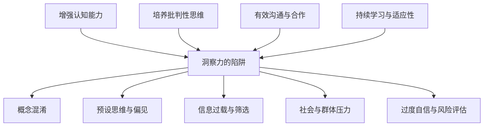

                 

# 理解洞察力的陷阱：避免偏见和误判

> 关键词：洞察力，决策，偏见，误判，认知能力，批判性思维，沟通与合作，持续学习

> 摘要：本文旨在探讨洞察力在决策中的重要性，分析洞察力的陷阱，并提出一系列策略和方法来提高洞察力，避免偏见和误判。文章通过详细的案例分析、伪代码解释和项目实战，为读者提供实用的指导。

### 引言

在信息爆炸的时代，洞察力成为人们在社会和职业发展中的一项关键能力。洞察力是指深入理解复杂问题，捕捉关键信息，迅速做出明智决策的能力。它不仅仅是一种天赋，更是一种可以通过学习和实践不断提高的技能。然而，尽管洞察力至关重要，但人们在实际决策中常常受到各种陷阱的影响，导致偏见和误判。

本文将围绕以下主题展开：

1. 洞察力的定义与重要性
2. 洞察力的陷阱
3. 提高洞察力与避免误判的方法
4. 实战案例与应用

通过逐一分析这些主题，本文旨在帮助读者更好地理解洞察力的本质，识别和避免洞察力的陷阱，从而提高决策质量。

#### 1.1 书籍概述与目标

**书籍背景**

《理解洞察力的陷阱：避免偏见和误判》是一本旨在帮助读者提高洞察力，避免决策失误的指南。随着社会的不断进步和信息量的急剧增加，人们面临的问题越来越复杂，决策的重要性愈发凸显。然而，很多情况下，我们在面对复杂问题时，往往因为种种原因无法做出最佳决策，从而导致各种不利后果。

**书籍目标**

本书的目标是帮助读者深入了解洞察力的本质，识别和避免洞察力的陷阱，提高决策能力。具体而言，本书希望实现以下目标：

- 解释洞察力的定义及其在社会与职业发展中的重要性
- 揭示洞察力陷阱的成因、类型及其影响
- 提供实用的策略和方法，帮助读者提高洞察力
- 通过实战案例，展示如何在实际中应用这些策略和方法

**阅读预期收益**

通过阅读本书，读者可以：

- 明确洞察力的概念，理解其在决策中的作用
- 识别并避免常见的洞察力陷阱，减少决策失误
- 学习提高洞察力的方法和技巧，提高决策质量
- 获取实际案例的启示，将理论知识应用于实践

### 洞察力的定义与重要性

#### 1.2.1 洞察力的定义

洞察力是指通过深入思考和分析，能够迅速捕捉问题的本质，找到关键线索，从而做出明智决策的能力。它不仅仅是一种认知能力，更是一种综合性的能力，包括对信息的理解、分析、推理和判断等多个方面。一个具有良好洞察力的人能够从复杂的信息中提取关键信息，迅速识别问题的核心，并做出合理的决策。

#### 1.2.2 洞察力在社会与职业发展中的重要性

在社会和职业发展中，洞察力起着至关重要的作用。首先，洞察力可以帮助我们更好地理解社会现象和趋势，从而做出更明智的判断和预测。例如，在企业运营中，具有洞察力的高层管理者能够准确预测市场变化，制定出有效的战略规划，提高企业的竞争力。

其次，洞察力在职业发展中同样至关重要。一个具有洞察力的员工能够迅速识别工作中的问题和机会，提出创新性的解决方案，提高工作效率和业绩。同时，洞察力也有助于员工在职业生涯中不断进步，提升自身能力和价值。

最后，洞察力在日常生活中也具有重要意义。一个具有良好洞察力的人能够更好地应对各种复杂情境，做出合理的选择和决策，提高生活质量。

#### 1.2.3 洞察力与决策的关系

洞察力是决策过程中不可或缺的一环。良好的洞察力能够帮助我们在面对复杂问题时，快速识别关键信息，找到解决方案，从而做出更明智的决策。具体而言，洞察力与决策的关系体现在以下几个方面：

- **快速识别问题**：洞察力使我们能够迅速捕捉问题的本质，从而避免在决策过程中陷入细节而忽略了关键问题。
- **有效分析信息**：洞察力使我们能够从大量信息中提取关键信息，进行有效的分析和判断，从而做出更准确的决策。
- **预见潜在风险**：洞察力使我们能够预见潜在的风险和挑战，从而在决策过程中采取相应的预防措施，降低决策失误的可能性。
- **提高决策质量**：洞察力使我们能够从不同角度和层面审视问题，找到最优解决方案，从而提高决策的质量和效果。

总之，洞察力是决策过程中的一项关键能力，它帮助我们更好地理解问题，分析信息，预见风险，从而做出更明智、更有效的决策。

### 洞察力的陷阱

#### 2.1.1 概念混淆的来源

概念混淆是影响洞察力的重要因素之一。概念混淆的来源可以分为以下几个方面：

1. **语言表达的不准确**：在沟通和表达过程中，人们可能会使用模糊、含糊不清的语言，导致接收者产生误解。这种误解可能会导致对概念的理解不准确，从而影响洞察力。

2. **知识体系的不完善**：如果一个人的知识体系不够完善，可能会导致对某些概念的理解不深入，从而在应用这些概念时产生混淆。

3. **经验不足**：缺乏实践经验可能会导致人们对某些概念的理解停留在理论层面，而无法将其应用到实际情境中。

4. **认知偏差**：认知偏差是指人们在处理信息时，由于各种心理因素的影响，对信息产生偏差。这种偏差可能会导致人们对某些概念的理解不准确，从而产生混淆。

5. **信息过载**：在信息爆炸的时代，人们接收到的信息越来越多，但如果无法有效筛选和处理这些信息，可能会导致对概念的理解产生混淆。

#### 2.1.2 如何识别与避免概念混淆

为了识别和避免概念混淆，可以采取以下策略：

1. **明确概念的定义**：在理解和应用一个概念时，首先要明确其定义。通过查阅相关资料或咨询专业人士，确保对概念有准确的理解。

2. **建立知识体系**：通过系统地学习和积累知识，建立完善的知识体系，从而减少对概念的理解不完整或模糊的情况。

3. **实践经验**：通过实际操作和实践，将概念应用到具体的情境中，从而加深对概念的理解。

4. **批判性思维**：在接收和处理信息时，保持批判性思维，对信息进行深入分析和判断，避免由于认知偏差而导致的概念混淆。

5. **有效沟通**：在沟通和表达时，使用准确、清晰的语言，避免使用模糊、含糊不清的表述，确保信息的传达准确无误。

6. **信息筛选**：在处理大量信息时，学会筛选和识别关键信息，避免信息过载导致的概念混淆。

通过上述策略，可以有效地识别和避免概念混淆，提高洞察力。

#### 2.1.3 实例分析：概念混淆在决策中的影响

概念混淆在决策中可能产生严重的负面影响。以下是一个实例分析：

**案例背景**：某公司在考虑是否投资一个新兴市场。在讨论过程中，管理层对“市场潜力”这一概念产生了混淆。

**问题表现**：一些管理者将“市场潜力”理解为市场目前的大小和增长速度，而忽视了市场的可持续性和潜在的风险。

**影响分析**：由于概念混淆，管理者对市场潜力的理解不准确，导致他们对投资决策产生了错误判断。他们过于乐观地估计了市场的潜力，忽视了市场的不确定性和风险，最终可能导致公司的投资损失。

**解决方案**：为了避免概念混淆，公司可以采取以下措施：

- **明确概念定义**：在讨论前，明确“市场潜力”的定义，确保所有参与者对概念有共同的理解。
- **数据支持**：基于详细的数据和市场分析，评估市场的潜力，避免仅凭主观判断做出决策。
- **专家咨询**：邀请市场研究专家或相关行业专家参与讨论，提供专业的意见和建议。
- **情景模拟**：进行情景模拟，分析不同市场情况下的投资回报和风险，确保决策的全面性和准确性。

通过上述措施，公司可以减少由于概念混淆导致的决策失误，提高投资决策的质量。

### 预设思维与偏见

#### 2.2.1 预设思维的成因

预设思维是指人们在处理信息时，受已有知识和经验的影响，先入为主地产生某种判断或观点。预设思维的成因主要包括以下几个方面：

1. **经验主义**：人们往往根据过去的经验来处理新信息，这种经验主义可能导致对信息的偏见和误解。

2. **认知习惯**：人们在长期的认知过程中，会形成一些固定的思维模式，这些模式可能会影响对新的信息和情境的判断。

3. **情感因素**：情绪和情感会影响人们对信息的处理方式。例如，恐惧、愤怒或偏好等情感可能会使人们对某些信息产生过度关注或忽视。

4. **社会压力**：社会和文化环境对个体的思维方式有很大影响。人们在面对社会压力时，可能会倾向于遵循社会规范，从而产生预设思维。

5. **信息源**：人们接受的信息来源会影响其对信息的解读。例如，如果一个人经常阅读某些特定的媒体或接受某些特定观点，他可能会在处理新信息时倾向于这些观点。

#### 2.2.2 常见偏见类型与例子

常见的偏见类型包括：

1. **确认偏差**：人们倾向于寻找和重视那些能够证实自己已有观点的信息，而忽视与之相矛盾的信息。

   **例子**：一个人如果坚信某种医疗方法的疗效，他会更关注和记住正面案例，而忽略或忘记负面案例。

2. **刻板印象**：人们对某个群体持有固定、简化的看法，这种看法可能会影响对个体成员的评价。

   **例子**：某些人可能认为所有程序员都是技术宅，这种刻板印象会影响他们对程序员这一群体的整体评价。

3. **代表性偏差**：人们倾向于根据某个样本或部分来推断整体，而忽视整体与样本之间的差异。

   **例子**：看到几位优秀程序员都是男性，就认为编程行业男性占主导地位，忽视了整体女性程序员的比例。

4. **可用性偏差**：人们根据信息的可用性来判断其概率或重要性，而忽视那些不太容易回忆或难以获取的信息。

   **例子**：某人在决策时，可能会因为最近经历过类似情况而更倾向于选择那种方案，即使那并不是最佳选择。

5. **过度自信**：人们往往高估自己的知识和能力，从而做出过于自信的判断。

   **例子**：一个经验丰富的管理者可能会过于自信地认为他能够解决复杂的问题，而忽视了潜在的风险和不确定性。

#### 2.2.3 如何识别并克服预设思维与偏见

为了识别和克服预设思维与偏见，可以采取以下策略：

1. **反思与质疑**：在处理信息时，不断反思和质疑自己的观点和假设，避免盲目接受信息。

2. **多样化信息源**：通过接触不同来源的信息，避免单一信息源带来的偏见。

3. **认知重构**：改变思维模式，学会从不同角度和立场看待问题，减少刻板印象和确认偏差。

4. **情景模拟**：通过模拟不同的情境，预测不同决策的结果，减少过度自信和可用性偏差。

5. **专业咨询**：在决策过程中，寻求专业人士的意见，以减少个人偏见和错误判断。

6. **记录和评估**：记录自己的思维过程和决策结果，定期评估决策的有效性和合理性。

通过上述策略，可以有效地识别和克服预设思维与偏见，提高决策质量和洞察力。

#### 2.2.4 实例分析：预设思维与偏见在决策中的影响

以下是一个关于预设思维和偏见在决策中影响的具体案例：

**案例背景**：一家公司的管理层在考虑是否开发一款新的软件产品。管理层中的一位成员曾在一个类似项目中担任过项目经理，因此对该项目有深厚的情感投入。

**问题表现**：由于这位成员的预设思维，他倾向于认为新项目会取得成功，因为他有过去的经验作为支持。其他成员虽然对此表示担忧，但由于对这位成员的信任和尊重，他们没有强烈反对。

**影响分析**：由于预设思维和偏见，管理层没有充分评估新项目的风险和挑战，最终导致项目进展不顺，甚至失败。此外，团队之间的信任关系也因此受到影响。

**解决方案**：为了克服这种预设思维和偏见，公司可以采取以下措施：

- **全面评估**：在决策前，进行全面的市场调研和技术评估，确保所有信息都被充分考虑。
- **透明沟通**：鼓励团队成员自由表达意见，确保每个人的观点都能被听到。
- **平衡决策**：在决策过程中，避免依赖某一个人的意见，而是通过集体讨论和决策，减少个人偏见的影响。
- **学习与反思**：在项目结束后，组织团队进行反思和总结，分析决策过程中存在的问题，并从中吸取教训。

通过上述措施，公司可以减少由于预设思维和偏见导致的决策失误，提高整体决策的质量和洞察力。

### 信息过载与筛选

#### 2.3.1 信息过载的影响

信息过载是指人们接收到的信息量超过其处理能力，导致信息处理效率和决策质量下降。信息过载的影响主要表现在以下几个方面：

1. **注意力分散**：当人们面临大量信息时，注意力容易被分散，难以集中精力处理重要信息，从而影响决策质量。

2. **认知负担**：信息过载会增加人们的认知负担，导致处理信息的效率降低。长时间处于信息过载状态，可能会引发疲劳和焦虑，影响判断力和决策能力。

3. **信息筛选困难**：在大量信息中，筛选出真正有价值的信息变得困难。人们可能会因为无法有效筛选信息，而忽略掉关键信息，导致决策失误。

4. **降低创新能力**：信息过载会限制人们的思维空间，降低对新想法和创新的接受度。在信息过载的环境中，人们更倾向于依赖已有的知识和经验，而难以产生新的观点和创意。

5. **决策延迟**：处理大量信息需要时间，信息过载可能导致决策过程变得漫长，从而延误决策的执行。

#### 2.3.2 有效的信息筛选策略

为了应对信息过载，可以采取以下有效的信息筛选策略：

1. **确定信息需求**：在接收信息前，明确自己的信息需求。了解需要哪些信息来支持决策，避免被动接收无关信息。

2. **优先级排序**：根据信息的价值和紧急程度，对信息进行优先级排序。优先处理重要且紧急的信息，确保关键信息不被忽视。

3. **信息过滤**：利用技术工具，如过滤器、新闻订阅、社交媒体标签等，自动过滤掉无关或低价值的信息，提高信息处理效率。

4. **定期整理**：定期整理和清理接收到的信息，删除过期或不再需要的信息，保持信息库的整洁和高效。

5. **信息共享**：与他人分享信息和观点，通过集体智慧来筛选和验证信息的准确性，减少个人误判的可能性。

6. **专业咨询**：在处理复杂或不确定的信息时，寻求专业人士的意见和帮助，以减少信息过载带来的影响。

通过上述策略，可以有效地筛选和处理信息，降低信息过载的影响，提高决策质量和效率。

#### 2.3.3 实例分析：信息过载对洞察力的影响

以下是一个关于信息过载对洞察力影响的具体案例：

**案例背景**：一家初创公司在市场上推出了一款新产品。由于市场竞争激烈，公司需要快速做出决策，以应对不断变化的市场环境。

**问题表现**：公司在短期内接收到了大量关于市场反馈、竞争对手动态和客户需求的信息。由于信息量过大，团队成员难以快速分析和处理这些信息，导致决策过程变得混乱和拖延。

**影响分析**：信息过载导致团队成员的注意力分散，难以集中精力处理关键信息。同时，由于缺乏有效筛选和整理，重要信息被忽略，导致决策失误。这进一步影响了团队的洞察力，使他们在面对市场变化时反应迟缓。

**解决方案**：为了应对信息过载，公司可以采取以下措施：

- **信息分类**：将接收到的信息按照类型和重要性进行分类，确保关键信息得到优先处理。
- **团队协作**：建立团队协作机制，通过分工和协作，提高信息处理效率。
- **定期会议**：定期召开会议，讨论和汇总信息，确保团队对市场动态有共同的理解。
- **技术支持**：利用数据分析工具和自动化系统，帮助团队成员快速筛选和处理信息。
- **信息筛选培训**：对团队成员进行信息筛选和处理培训，提高他们的信息处理能力和洞察力。

通过上述措施，公司可以减少信息过载对洞察力的影响，提高决策质量和团队的应对能力。

### 社会与群体压力

#### 2.4.1 社会与群体压力的作用机制

社会与群体压力是指人们在面对社会规范和群体期望时，感到必须遵循这些规范和期望的心理状态。这种压力可以通过多种机制影响个人的决策和洞察力：

1. **从众效应**：个体在面对不确定的情境时，倾向于遵循大多数人的意见或行为，以减少不确定性带来的心理压力。

2. **认同感需求**：人们渴望被社会和群体接纳，为了获得认同感，可能会牺牲个人的判断力，跟随群体决策。

3. **社会规范**：社会和文化规范对个体行为有强烈的指导作用。个体可能会因害怕违反规范而选择与群体保持一致，即使这可能导致错误的决策。

4. **权威效应**：个体对权威人物的意见或决策具有天然的服从倾向，即使这些决策并非基于充分的事实和逻辑。

5. **群体思维**：在群体讨论中，成员可能会倾向于抑制个人异议，以保持群体的一致性，这可能导致群体决策缺乏批判性和创新性。

#### 2.4.2 如何识别并抵御社会与群体压力

为了识别并抵御社会与群体压力，可以采取以下策略：

1. **自我意识**：提高自我意识，了解自己是否受到社会与群体压力的影响，并识别这些压力的来源。

2. **独立思考**：培养独立思考的能力，不轻易被他人的意见或行为所影响，坚持基于事实和逻辑的判断。

3. **批判性思维**：学会批判性思维，对群体决策进行客观分析和评估，识别潜在的偏见和不足。

4. **表达异议**：在群体讨论中，勇于表达自己的不同意见，即使可能面临群体压力，也要坚持真理。

5. **专业咨询**：在决策过程中，寻求专业人士的意见，以减少社会与群体压力对决策的影响。

6. **心理调适**：通过心理调适技巧，如放松训练、情绪管理等，减轻社会与群体压力带来的心理负担。

通过上述策略，可以有效地识别和抵御社会与群体压力，保持独立和清晰的判断力。

#### 2.4.3 实例分析：社会与群体压力在决策中的案例

以下是一个关于社会与群体压力在决策中影响的具体案例：

**案例背景**：一家公司的管理层在讨论是否投资一项新兴技术。公司的CEO是一位在行业内享有盛誉的专家，他的意见在决策过程中具有决定性影响。

**问题表现**：虽然部分团队成员对投资持谨慎态度，但为了获得CEO的认同，他们选择保持沉默，没有表达自己的担忧。最终，公司决定投资，但由于市场环境变化，投资未能达到预期效果。

**影响分析**：由于社会与群体压力，团队成员没有表达自己的真实想法，导致决策过程中缺乏批判性思维和全面评估。CEO的权威效应加剧了这种压力，使决策过程更加偏向于从众和一致。

**解决方案**：为了克服社会与群体压力对决策的影响，公司可以采取以下措施：

- **开放沟通**：鼓励团队成员自由表达意见，建立开放的沟通环境，减少群体压力。
- **多角度评估**：在决策过程中，鼓励团队成员从不同角度进行评估，确保决策的全面性和准确性。
- **权威平衡**：在决策中，尊重权威意见，但也要保持批判性思维，避免过度依赖单一意见。
- **风险评估**：在决策前，进行全面的风险评估，确保对潜在风险有充分的了解和准备。

通过上述措施，公司可以减少社会与群体压力对决策的负面影响，提高决策质量和洞察力。

### 过度自信与风险评估

#### 2.5.1 过度自信的心理机制

过度自信是指人们对自己的知识和能力过度自信，往往高估自己的判断力和决策能力。过度自信的心理机制主要包括以下几个方面：

1. **自我确认偏差**：个体倾向于选择那些能够证实自己观点的信息，而忽视与之相矛盾的信息，从而增强自我确认感。

2. **认知失调**：当个体发现自己的决策或判断与预期结果不符时，会通过各种方式调整认知，以减少内心的不协调感，从而维持过度自信。

3. **自我中心偏差**：个体容易将自身经验视为普遍标准，忽视其他人的经验和观点，导致高估自己的判断力和决策能力。

4. **感知控制**：个体在成功经历后，可能会认为成功是自身能力的结果，从而增强对未来的自信，忽视外部因素的作用。

5. **情感因素**：积极的情绪状态可能会增强个体的自信心，使其在判断和决策时更加乐观。

#### 2.5.2 评估风险的正确方法

为了克服过度自信，进行正确的风险评估，可以采取以下方法：

1. **全面评估**：在决策前，进行全面的风险评估，考虑所有可能的影响因素，包括正面和负面因素。

2. **专家咨询**：在评估风险时，寻求专业人士的意见，利用他们的知识和经验进行更加客观的评估。

3. **情景分析**：进行多种情景分析，包括最佳情景、最差情景和最可能情景，以全面了解决策的风险和影响。

4. **历史数据**：利用历史数据和案例，分析类似决策的风险和结果，从中吸取教训。

5. **同行评审**：在决策过程中，邀请同行进行评审，提供不同的观点和意见，减少个人偏见和过度自信。

6. **心理调适**：保持冷静和客观的心态，避免因情绪波动而影响风险评估的准确性。

通过上述方法，可以更加准确地评估风险，减少过度自信对决策的负面影响。

#### 2.5.3 实例分析：过度自信在决策中的误区

以下是一个关于过度自信在决策中误区的具体案例：

**案例背景**：一家创业公司在考虑是否开发一款新型移动应用。公司的创始人是一位技术专家，他对产品的前景非常乐观。

**问题表现**：创始人过度自信地认为，凭借自己的技术能力和市场洞察力，这款应用一定会成功。他在决策过程中忽视了市场调研和风险评估，没有充分考虑产品的市场潜力和竞争压力。

**影响分析**：由于过度自信，公司未能进行全面的风险评估，导致在开发过程中遇到诸多困难。市场需求不如预期，竞争压力增大，最终导致产品未能成功，公司也遭受了经济损失。

**解决方案**：为了克服过度自信，公司可以采取以下措施：

- **市场调研**：在决策前，进行全面的市场调研，了解目标用户的需求和市场趋势。
- **风险评估**：进行详细的风险评估，考虑所有可能的风险因素，并制定相应的应对策略。
- **专家咨询**：邀请市场专家和行业顾问进行咨询，获取专业的意见和建议。
- **团队讨论**：鼓励团队成员参与决策，提供不同的观点和意见，减少个人偏见和过度自信。
- **持续反馈**：在产品开发过程中，持续收集用户反馈，根据反馈进行调整和改进。

通过上述措施，公司可以减少过度自信对决策的负面影响，提高决策的准确性和成功率。

### 增强认知能力

#### 3.1.1 认知能力的构成

认知能力是指人类在信息处理、理解和应用方面的一系列心理能力。增强认知能力是提高洞察力的关键步骤。认知能力主要包括以下几个核心方面：

1. **注意力**：注意力是认知能力的核心，它决定了个体在特定任务中的专注程度和信息处理效率。

2. **记忆**：记忆是认知能力的重要组成部分，包括短期记忆和长期记忆。短期记忆负责临时存储和处理信息，而长期记忆则负责长期存储和回忆信息。

3. **感知**：感知是指个体对外部信息的接收和理解能力，包括视觉、听觉、触觉等多种感知方式。

4. **推理**：推理是认知能力的高级形式，它包括逻辑推理、归纳推理和演绎推理等。通过推理，个体能够从已知信息中推断出新的结论。

5. **问题解决**：问题解决能力是指个体在面对复杂问题时，能够通过分析、推理和决策找到解决方案的能力。

6. **决策**：决策能力是指个体在多种选择中做出合理决策的能力。良好的决策能力有助于提高洞察力和决策质量。

7. **批判性思维**：批判性思维是指个体在处理信息和做出决策时，能够客观、理性地分析问题，识别偏见和错误，并提出合理的解决方案。

#### 3.1.2 提升认知能力的方法

为了提升认知能力，可以采取以下方法：

1. **持续学习**：通过不断学习和积累新知识，扩展认知能力。阅读书籍、参加课程和研讨会、观看教育视频等都是有效的学习方法。

2. **思维训练**：进行各种思维训练，如逻辑推理、数独、解谜等，这些活动可以锻炼大脑的思维能力。

3. **记忆训练**：通过记忆训练，如记忆宫殿、联想记忆等技巧，提高记忆力和信息处理能力。

4. **注意力训练**：通过注意力训练，如冥想、专注力训练等，提高注意力的集中程度和稳定性。

5. **健康生活方式**：保持健康的生活方式，如合理饮食、充足睡眠、定期锻炼等，有助于提高认知能力。

6. **社交互动**：与他人进行社交互动，分享观点和经验，可以拓宽视野，提高认知能力。

7. **睡眠质量**：确保高质量的睡眠，睡眠是大脑进行信息整理和巩固记忆的重要过程。

8. **心理调适**：通过心理调适技巧，如放松训练、情绪管理等，减轻心理压力，提高认知能力。

通过上述方法，可以有效地提升认知能力，从而提高洞察力。

#### 3.1.3 实例分析：如何通过训练提高认知能力

以下是一个通过训练提高认知能力的实例分析：

**案例背景**：一名软件工程师想要提升自己的问题解决能力和逻辑思维能力。

**训练过程**：

1. **逻辑推理训练**：他开始每天解决数独和逻辑推理题目，这些活动有助于锻炼他的逻辑思维能力。

2. **编程练习**：他通过编写复杂的程序代码，解决实际问题，这提高了他的问题解决能力和编程技巧。

3. **记忆训练**：他使用记忆宫殿技巧来记忆复杂的代码和算法，这提高了他的记忆力和信息处理能力。

4. **专注力训练**：他每天进行冥想和专注力训练，以提高注意力的集中程度。

5. **社交互动**：他与同事和同行进行编程讨论，分享经验和观点，这拓宽了他的视野，提高了他的批判性思维能力。

**效果评估**：经过一段时间的训练，这名工程师在解决复杂问题和逻辑推理方面取得了显著进步。他在工作中表现更加出色，能够更快地找到问题的解决方案，提高了工作效率和代码质量。

通过这个案例，我们可以看到，通过有针对性的训练，可以显著提升认知能力，从而提高工作效率和决策质量。

### 培养批判性思维

#### 3.2.1 批判性思维的重要性

批判性思维是一种分析、评估和推理信息的能力，它使个体能够独立思考、辨别真伪，并做出合理、有根据的判断。在现代社会，批判性思维的重要性不言而喻：

1. **决策质量**：批判性思维有助于个体在复杂、不确定的情境中做出更明智、更合理的决策。通过批判性思维，个体能够全面考虑各种可能性和影响因素，从而避免盲目跟从和冲动决策。

2. **问题解决**：批判性思维是有效问题解决的关键。在遇到问题时，批判性思维使个体能够从不同角度审视问题，发现问题的本质和根本原因，从而找到更有效的解决方案。

3. **学习和成长**：批判性思维有助于个体在学习过程中深入理解和掌握知识。通过批判性思维，个体能够质疑和反思所学内容，发现知识的局限性，从而不断提高自己的认知水平和学习能力。

4. **沟通与合作**：批判性思维能够促进有效的沟通和合作。在团队合作中，批判性思维使个体能够提出建设性的意见和建议，同时能够理解和尊重他人的观点，从而实现更好的协作和共同进步。

5. **创新思维**：批判性思维是创新思维的基础。通过批判性思维，个体能够挑战现状，发现新的问题和机会，从而推动创新和进步。

总之，批判性思维是提升个人和团队能力的关键，它对于提高决策质量、解决问题、学习成长和促进创新都具有重要作用。

#### 3.2.2 批判性思维的技巧

要培养批判性思维，可以掌握以下技巧：

1. **明确问题**：在思考问题之前，首先要明确问题的定义和范围。通过明确问题，可以避免在错误的假设和方向上浪费时间。

2. **多角度分析**：从不同的角度和立场审视问题，考虑各种可能的影响因素。这有助于全面了解问题的各个方面，避免片面和盲目的判断。

3. **质疑和挑战**：对现有的观点和假设进行质疑和挑战，不轻易接受表面上的解释。通过质疑和挑战，可以发现潜在的错误和偏见。

4. **收集证据**：收集和评估与问题相关的证据和信息，确保判断和决策有充分的事实支持。避免仅凭个人经验和直觉做出判断。

5. **逻辑推理**：使用逻辑推理来分析和解决问题。逻辑推理能够帮助个体从已知信息中得出合理的结论，避免逻辑错误和谬误。

6. **反思与评估**：在决策后，对决策过程和结果进行反思和评估。通过反思和评估，可以总结经验教训，不断改进决策能力和方法。

7. **批判性阅读**：培养批判性阅读的习惯，学会从不同角度分析和评估所读内容。通过批判性阅读，可以提高对信息的理解和分析能力。

8. **开放心态**：保持开放心态，接受不同的观点和意见。通过倾听和理解他人的观点，可以拓宽视野，提高批判性思维能力。

通过掌握这些技巧，个体可以逐步培养批判性思维，从而在复杂多变的情境中做出更明智、更合理的决策。

#### 3.2.3 实例分析：批判性思维在洞察力培养中的应用

以下是一个关于批判性思维在洞察力培养中应用的实例分析：

**案例背景**：一家公司在考虑是否进入一个新的市场。公司的管理层召开了一次会议，讨论是否进行市场扩张。

**会议过程**：

1. **明确问题**：在会议开始时，主持人明确了问题的定义和目标，即评估进入新市场的可行性和潜在风险。

2. **多角度分析**：会议参与者从市场趋势、竞争情况、技术可行性等多个角度分析了新市场的机会和挑战。

3. **质疑和挑战**：一位市场分析师质疑了市场调研数据的可靠性，另一位技术人员则提出了新技术的潜在风险。

4. **收集证据**：市场部门负责人收集了更多关于新市场竞争对手和消费者行为的数据，技术部门则提供了详细的技术评估报告。

5. **逻辑推理**：通过逻辑推理，团队分析了不同策略的潜在收益和风险，比较了进入新市场和维持现有市场的优劣。

6. **反思与评估**：在会议结束时，团队对讨论的内容进行了反思和评估，总结了经验和教训，并提出了下一步的行动计划。

**结果**：通过批判性思维的运用，团队全面、客观地评估了新市场的机会和风险，最终做出了一个基于数据和逻辑的明智决策。

通过这个案例，我们可以看到，批判性思维在洞察力培养中的应用有助于提高决策质量，减少偏见和误判，从而实现更有效的决策。

### 有效沟通与合作

#### 3.3.1 沟通的重要性

沟通是人们交流思想和信息的工具，它在个人和团队的成功中扮演着至关重要的角色。有效的沟通不仅能够确保信息的准确传递，还能增强团队凝聚力，提高决策质量和工作效率。以下是沟通在个人和团队成功中的几个关键作用：

1. **信息传递**：沟通是信息传递的桥梁，确保团队成员能够获取和理解必要的资讯，从而做出更明智的决策。

2. **团队协作**：有效的沟通能够促进团队成员之间的合作，确保每个人都明确自己的角色和责任，从而实现团队目标。

3. **问题解决**：在团队合作中，沟通是解决问题的关键。通过开放和诚实的沟通，团队成员可以共同探讨问题，寻找最佳解决方案。

4. **冲突管理**：良好的沟通能够帮助团队成员更好地理解和尊重彼此的观点，减少冲突和误解，维持团队的和谐。

5. **决策效率**：高效的沟通能够加快决策过程，减少不必要的延误和重复工作，提高整体工作效率。

6. **个人成长**：通过沟通，个体可以学习新的知识和技能，提高自己的职业素养和适应能力。

#### 3.3.2 提升沟通效果的策略

为了提升沟通效果，可以采取以下策略：

1. **明确沟通目标**：在沟通前，明确沟通的目标和目的，确保沟通内容具有针对性和有效性。

2. **倾听与理解**：倾听是沟通的关键，通过倾听他人的观点和需求，可以更好地理解对方，从而做出更合理的回应。

3. **清晰表达**：使用简洁、明确的语言表达自己的想法，避免使用模糊或歧义性的表述。

4. **积极反馈**：在沟通过程中，给予积极的反馈，确保对方理解自己的观点，并表达出对方的感受和意见。

5. **建立信任**：建立信任是有效沟通的基础。通过诚实、透明和尊重，建立和维护良好的信任关系。

6. **适应对方**：根据对方的沟通风格和习惯进行调整，使沟通更加顺畅和有效。

7. **利用技术工具**：利用现代沟通技术，如电子邮件、即时通讯工具、视频会议等，提高沟通效率和效果。

8. **定期回顾**：定期回顾沟通效果，总结经验和教训，不断改进沟通策略。

通过上述策略，可以显著提升沟通效果，从而提高团队协作效率，实现个人和团队的共同成功。

#### 3.3.3 合作中的洞察力培养

在团队合作中，培养洞察力是提升整体表现和实现目标的关键。以下策略可以帮助团队在合作过程中培养洞察力：

1. **共享知识**：鼓励团队成员分享各自的知识和经验，通过集体智慧来提高整体洞察力。

2. **跨部门合作**：打破部门壁垒，促进跨部门合作，通过不同视角和专业知识，提高对复杂问题的洞察力。

3. **头脑风暴**：定期组织头脑风暴会议，鼓励团队成员提出创新性想法，激发团队的洞察力。

4. **反思与总结**：在项目完成后，组织团队进行反思和总结，分析成功和失败的原因，从中学习并提升洞察力。

5. **角色扮演**：通过角色扮演活动，让团队成员从不同角度审视问题，提高对复杂情境的洞察力。

6. **培训与学习**：提供相关培训和课程，帮助团队成员提高批判性思维和问题解决能力，从而增强洞察力。

7. **信息共享平台**：建立信息共享平台，确保团队成员能够及时获取和共享关键信息，提高团队的洞察力。

通过上述策略，团队可以培养成员的洞察力，从而在合作中做出更明智、更有效的决策。

### 持续学习与适应性

#### 3.4.1 学习的重要性

在快速变化的世界中，持续学习成为个人和职业发展的关键。学习不仅是获取新知识和技能的过程，更是提升适应性和竞争力的核心途径。以下是持续学习在个人和职业发展中的几个重要方面：

1. **知识更新**：随着科技的不断进步和社会的快速发展，知识更新速度日益加快。持续学习能够帮助个人掌握最新的知识和技能，保持竞争力。

2. **职业发展**：在职业生涯中，持续学习能够帮助个人提升技能和素质，适应新的职业要求，实现职业晋升和转型。

3. **创新能力**：学习不仅仅是知识的积累，更是创新思维和解决问题的源泉。通过不断学习，个人能够培养批判性思维和创新能力，从而在工作和生活中取得突破。

4. **适应能力**：在变化多端的环境中，适应能力成为个人成功的关键。持续学习能够帮助个人迅速适应新的环境和挑战，提升应对能力。

5. **人际关系**：学习不仅是个人发展的需要，也是建立和维护人际关系的基石。通过学习和分享，个人能够与他人建立更深厚的联系，提升社交能力。

#### 3.4.2 适应性思维的培养

培养适应性思维是持续学习的重要组成部分。以下是几个关键策略：

1. **开放心态**：保持开放心态，接受新观点和想法。通过开放心态，个人能够更好地适应变化，从而在变化中找到机会。

2. **终身学习**：将学习视为一种生活方式，不断追求新知识和技能。通过终身学习，个人能够不断提升自己，适应不断变化的环境。

3. **反思与总结**：定期反思和总结学习和工作经历，从中吸取教训，发现改进的机会。通过反思与总结，个人能够不断优化自己的学习方法和思维方式。

4. **灵活应对**：在面对变化和挑战时，灵活应对，不固守传统观念和方法。通过灵活应对，个人能够迅速适应新情况，找到合适的解决方案。

5. **团队合作**：在团队中学习和合作，通过分享和讨论，共同提升适应能力和解决问题的能力。团队合作能够提供不同的视角和经验，从而增强整体的适应性。

通过培养适应性思维，个人能够更好地应对变化，不断提升自己的能力和竞争力。

#### 3.4.3 实例分析：持续学习与适应性在职业发展中的作用

以下是一个关于持续学习与适应性在职业发展中作用的实例分析：

**案例背景**：一位软件工程师在职业生涯中面临技术快速发展的挑战。他意识到，如果不持续学习和适应新技术，将难以保持竞争力。

**行动过程**：

1. **学习新技术**：工程师报名参加了多项在线课程，学习最新的编程语言和框架，如Python和Docker。

2. **实践应用**：通过在工作中应用所学知识，工程师不断提升自己的技术能力，并在项目中成功地引入了新技术。

3. **参加专业会议**：工程师定期参加技术会议和研讨会，与行业专家交流，了解最新的行业趋势和技术动态。

4. **反思与总结**：工程师在项目完成后，总结经验教训，识别改进机会，并在后续项目中应用这些经验。

**结果**：通过持续学习和适应性思维，工程师不仅提升了自己的技术水平，还成功实现了职业晋升，成为团队的核心成员。

通过这个案例，我们可以看到，持续学习和适应性思维对于职业发展具有重要作用，能够帮助个人不断提升自己的能力和竞争力。

### 洞察力训练项目案例

#### 4.1.1 项目背景与目标

为了提升团队成员的洞察力，某大型科技公司启动了一个为期六个月的洞察力训练项目。项目背景是公司面临快速变化的市场环境，需要团队成员具备更强的洞察力和决策能力，以应对市场挑战和抓住机遇。

**项目目标**：

- 提升团队成员的认知能力和批判性思维。
- 减少决策中的偏见和误判，提高决策质量。
- 培养团队成员的团队合作精神和信息沟通能力。
- 通过实战演练，增强团队成员在实际工作中的洞察力应用能力。

#### 4.1.2 项目实施过程

**第一阶段：认知能力提升**

- **培训课程**：公司邀请专业培训机构，为团队成员提供一系列认知能力培训课程，包括逻辑推理、批判性思维、数据分析等。
- **案例分析**：通过分析真实案例，团队成员学习如何从不同角度审视问题，识别潜在风险和机会。
- **思维训练**：定期进行思维训练，如数独、解谜等，以锻炼大脑的思维能力。

**第二阶段：实践应用**

- **小组讨论**：团队成员组成小组，定期进行讨论，分享各自的观点和见解，通过集体智慧提高洞察力。
- **角色扮演**：通过角色扮演活动，团队成员模拟不同情境下的决策过程，提高应对复杂问题的能力。
- **实战演练**：在公司实际项目中，团队成员应用所学知识，参与决策和问题解决，通过实践提升洞察力。

**第三阶段：反馈与改进**

- **定期评估**：项目期间，定期对团队成员的洞察力进行评估，了解提升效果，并根据评估结果进行改进。
- **反思与总结**：项目结束后，组织团队成员进行反思和总结，分析项目中的成功和不足，提出改进建议。
- **知识共享**：通过知识共享会议，团队成员分享项目经验和洞察力提升方法，促进共同进步。

#### 4.1.3 项目成果与反思

**项目成果**：

- **决策质量提升**：通过项目培训和实践，团队成员在决策过程中能够更全面地考虑各种因素，减少了偏见和误判，决策质量显著提高。
- **团队合作能力增强**：团队成员在小组讨论和角色扮演中，培养了良好的沟通和协作能力，团队合作更加默契。
- **洞察力应用能力提升**：团队成员在实际工作中，能够更有效地应用所学知识和技能，提升了对复杂问题的洞察力和问题解决能力。
- **个人成长**：团队成员通过项目，提高了自身的认知能力和批判性思维，职业素养和自信心得到提升。

**反思与改进**：

- **培训内容优化**：在后续项目中，公司将根据团队成员的反馈，进一步优化培训内容，确保培训与实际工作需求紧密结合。
- **个性化培训**：针对不同团队成员的需求，提供个性化的培训方案，使培训更具针对性和实效性。
- **持续支持**：项目结束后，公司将持续提供支持和资源，帮助团队成员在工作和生活中应用所学知识，不断提升自身的洞察力和决策能力。

### 企业决策案例分析

#### 4.2.1 案例一：决策陷阱与优化策略

**案例背景**：

某大型企业在考虑是否投资一家新兴科技公司。该科技公司在市场上表现出色，产品受到用户欢迎，但投资风险较高。企业在决策过程中面临多个决策陷阱，如过度自信、信息过载和社会压力等。

**决策陷阱分析**：

1. **过度自信**：企业内部一位高管曾在类似项目中取得成功，因此对新兴科技公司的前景过于乐观，高估了投资的成功概率。

2. **信息过载**：企业收集了大量关于新兴科技公司和市场的研究报告，但由于信息过多，难以筛选出关键信息，导致决策过程拖延。

3. **社会压力**：公司董事会成员希望投资新兴科技，以展现公司的创新和前瞻性，但在内部讨论中，部分成员对风险表示担忧。

**优化策略**：

1. **全面风险评估**：在决策前，企业组织了多轮风险评估会议，邀请行业专家和分析师参与，全面评估投资风险和潜在收益。

2. **多角度分析**：企业从技术、市场、财务等多个角度对新兴科技公司进行了深入分析，确保决策基于全面的信息。

3. **透明沟通**：在决策过程中，企业建立了开放的沟通机制，鼓励员工自由表达意见，确保不同观点得到充分讨论。

4. **情景模拟**：企业进行了多种情景模拟，包括最佳情景、最差情景和最可能情景，以预测不同决策结果。

5. **专业咨询**：企业聘请了市场研究和风险咨询公司，提供专业的意见和建议，减少个人偏见和决策失误。

**结果**：

通过上述优化策略，企业成功避免了决策陷阱，最终做出了基于全面评估和理性分析的决策。投资新兴科技公司获得了良好的市场反馈，企业也提升了决策质量和洞察力。

#### 4.2.2 案例二：洞察力在市场分析中的应用

**案例背景**：

某消费品公司计划推出一款新产品，但由于市场竞争激烈，需要准确预测产品在市场上的表现。公司在市场分析中面临数据复杂和信息过载的挑战。

**洞察力应用**：

1. **数据筛选与处理**：公司利用数据挖掘和分析工具，从大量市场数据中筛选出关键信息，如消费者行为、市场趋势和竞争对手动态。

2. **多维度分析**：公司从消费者需求、产品特性、市场环境等多个维度进行综合分析，确保市场预测的全面性和准确性。

3. **情境模拟**：公司进行了多种市场模拟，预测不同策略下的销售表现和市场份额。

4. **专家咨询**：公司邀请了市场研究专家和行业顾问，提供专业的市场分析和建议。

**结果**：

通过洞察力的应用，公司成功预测了新产品的市场表现，制定了有效的市场推广策略，产品在市场上取得了较好的反响和销售业绩。公司也提升了市场分析和决策能力，减少了决策失误。

#### 4.2.3 案例三：组织变革中的洞察力作用

**案例背景**：

某制造企业计划进行组织变革，以提升生产效率和员工满意度。然而，变革过程中面临员工抵触和执行困难等问题。

**洞察力应用**：

1. **员工沟通**：公司通过定期沟通和反馈机制，了解员工对变革的看法和需求，确保变革方案符合员工的期望。

2. **问题诊断**：公司利用洞察力，深入分析组织结构、流程和员工行为中的问题，找出变革的核心问题和关键点。

3. **方案优化**：公司结合员工反馈和问题诊断结果，对变革方案进行优化，确保方案的可操作性和可行性。

4. **试点实施**：公司在小范围内试点实施变革方案，观察变革效果，并根据试点结果进行调整和改进。

5. **持续监督**：公司建立了持续监督机制，跟踪变革进展，及时解决出现的问题，确保变革目标的实现。

**结果**：

通过洞察力的应用，公司成功推动了组织变革，提升了生产效率和员工满意度。变革过程顺利，员工对变革的接受度和参与度提高，企业整体运营效率得到显著提升。

### 个人成长与职业发展

#### 4.3.1 提升个人洞察力的方法

在个人成长和职业发展中，提升洞察力是一项重要任务。以下是几种有效的提升个人洞察力的方法：

1. **持续学习**：不断学习新知识和技能，扩展自己的知识面和视野。通过阅读、参加课程和研讨会，了解行业趋势和技术发展，提升自身的认知水平。

2. **实践锻炼**：通过实际工作项目和实践活动，锻炼自己的问题解决能力和决策能力。在实践中不断总结经验教训，提升洞察力。

3. **批判性思维**：培养批判性思维，学会从不同角度审视问题，分析信息的真实性和有效性。通过质疑和挑战现有观点，提高思维的深度和广度。

4. **信息筛选**：学会筛选和处理信息，避免信息过载。通过确定信息需求、优先级排序和有效沟通，提高信息处理效率，从而增强洞察力。

5. **反思与总结**：在决策和行动后，进行反思和总结，评估决策的质量和效果。通过分析成功和失败的原因，不断优化决策方法和思维方式。

6. **专业咨询**：在面临复杂问题时，寻求专业人士的意见和建议。通过专业咨询，获取不同的视角和经验，提升洞察力。

7. **团队合作**：在团队中积极参与合作，通过与他人交流和讨论，提高对复杂问题的理解能力。团队合作能够激发思维碰撞，产生新的见解。

通过上述方法，个人可以逐步提升洞察力，从而在个人成长和职业发展中取得更好的成绩。

#### 4.3.2 职业发展中的洞察力需求

在职业发展中，洞察力是不可或缺的重要能力。不同职业阶段对洞察力的需求有所不同：

1. **早期职业发展**：在早期职业生涯中，洞察力主要表现在对新知识和技能的快速学习和应用上。新员工需要通过观察、学习和实践，迅速适应工作环境，提升自己的专业能力。

2. **职业中期**：随着工作经验的积累，洞察力在职业中期逐渐发挥关键作用。职业中期人员需要具备较强的分析问题和决策能力，能够从复杂的信息中提取关键信息，制定有效的解决方案。

3. **职业晚期**：在职业晚期，洞察力更多体现在对市场和行业趋势的敏锐洞察上。高层管理者需要具备战略思维，能够预测市场变化，制定长远的战略规划。

不同职业阶段对洞察力的需求有所不同，但提升洞察力始终是个人职业发展的关键。通过不断学习和实践，个人可以不断提升自身的洞察力，从而在职业生涯中取得更好的发展。

#### 4.3.3 实例分析：如何通过提升洞察力实现职业突破

以下是一个关于如何通过提升洞察力实现职业突破的实例分析：

**案例背景**：

李明是一名市场营销经理，在公司工作了五年。他在公司内部具有良好的沟通能力和团队协作精神，但在面对市场变化和竞争对手的挑战时，经常感到力不从心。

**提升洞察力的方法**：

1. **持续学习**：李明通过参加市场营销相关的在线课程和研讨会，不断学习最新的市场营销理论和工具，扩展自己的知识面。

2. **实践锻炼**：李明主动参与了多个市场调研项目，通过实际操作，锻炼了自己的市场分析能力和决策能力。

3. **批判性思维**：李明开始培养批判性思维，学会从不同角度审视市场信息和竞争对手策略，避免盲目跟从。

4. **信息筛选**：李明学会了筛选和处理信息，通过建立信息数据库和优先级排序，提高信息处理效率。

5. **反思与总结**：李明在每次市场活动和项目结束后，进行反思和总结，分析成功和失败的原因，不断提升自己的决策能力。

**职业突破**：

通过提升洞察力，李明在几次重要的市场活动中表现出色，成功预测了市场趋势，制定了有效的营销策略。他的成绩得到了公司高层的认可，晋升为市场营销总监，实现了职业突破。

通过这个案例，我们可以看到，通过提升洞察力，个人可以在职业生涯中取得显著的进步，实现职业发展的目标。

### 附录A：参考资料与进一步阅读

#### A.1 书籍推荐

1. **《决策与判断》** - 作者：Daniel Kahneman
   - 内容简介：这是一本关于人类决策和判断过程的经典著作，详细探讨了人们在决策过程中常见的偏见和误判。

2. **《思考，快与慢》** - 作者：Daniel Kahneman
   - 内容简介：本书从心理学和认知科学的角度，深入剖析了人类思维的快与慢系统，对决策和判断进行了全面探讨。

3. **《行为经济学》** - 作者：Richard Thaler
   - 内容简介：这本书介绍了行为经济学的基本原理，通过大量实证研究，揭示了人类行为在决策中的非理性因素。

#### A.2 学术论文

1. **"Heuristics and Biases: Systematic Deviations from Rational Decision Making"** - 作者：Daniel Kahneman, Amos Tversky
   - 摘要：本文提出了人类决策中常见的几种偏见和误判，包括确认偏差、代表性偏差和可用性偏差等。

2. **"Anomalies in the Time Series of Child Cancer Incidence Rates in the United States"** - 作者：Thomas F. Ransfer
   - 摘要：本文通过分析美国儿童癌症发病率的时间序列数据，揭示了人们在处理信息时存在的认知偏差。

3. **"The Behavioral Economics of Decision Making"** - 作者：Richard Thaler, Cass R. Sunstein
   - 摘要：本文探讨了行为经济学的基本概念，分析了人类在决策过程中的非理性因素。

#### A.3 视频教程与课程

1. **"Critical Thinking and Decision Making"** - 在线课程
   - 提供平台：Coursera, edX
   - 内容简介：本课程介绍了批判性思维和决策制定的基本原理，帮助学习者提高决策能力和洞察力。

2. **"Behavioral Economics: When People Make Economic Decisions"** - 在线课程
   - 提供平台：Khan Academy
   - 内容简介：本课程通过案例分析和实验研究，揭示了人类在经济决策中的非理性行为。

3. **"Introduction to Psychology: The Science of Mind and Behavior"** - 在线课程
   - 提供平台：MIT OpenCourseWare
   - 内容简介：本课程介绍了心理学的基本概念和理论，包括认知心理学、发展心理学等，有助于理解人类思维和行为。

### 附录B：实用工具与资源

#### B.1 提升洞察力的工具

1. **思维导图软件**：
   - **XMind**：一款强大的思维导图软件，帮助用户梳理思路，提升思维能力和洞察力。
   - **MindMeister**：支持在线协作的思维导图工具，方便团队共同探讨和规划。

2. **数据分析工具**：
   - **Tableau**：一款功能强大的数据可视化工具，帮助用户从大量数据中提取关键信息。
   - **Power BI**：Microsoft推出的数据分析平台，提供丰富的数据可视化功能，便于洞察和分析。

3. **在线学习平台**：
   - **Coursera**：提供大量高质量的课程，涵盖计算机科学、经济学、心理学等领域，有助于提升专业知识和洞察力。
   - **edX**：由哈佛大学和麻省理工学院联合创办的在线学习平台，提供丰富的免费课程。

#### B.2 决策支持工具

1. **决策树软件**：
   - **DeciTree**：一款易于使用的决策树软件，帮助用户构建和评估不同决策路径。
   - **RapidMiner**：一款数据科学平台，包括决策树在内的多种机器学习算法，支持自动化决策分析。

2. **风险评估工具**：
   - **RiskLens**：一款专业的风险评估工具，帮助用户识别和管理风险。
   - **Klipfolio**：一款可视化仪表盘工具，可用于监控和评估决策结果。

3. **沟通与合作平台**：
   - **Slack**：一款流行的即时通讯工具，支持团队协作和沟通。
   - **Trello**：一款任务管理工具，便于团队协作和项目追踪。

通过使用这些工具和资源，用户可以更有效地提升洞察力，做出更明智的决策。

### 参考文献

1. **Kahneman, D. (2011). Thinking, Fast and Slow. Farrar, Straus and Giroux.**
   - 内容简介：本书详细阐述了人类思维的快与慢系统，探讨了决策和判断中的非理性因素。

2. **Thaler, R. H. (2015). Misbehaving: The Making of Behavioral Economics. W. W. Norton & Company.**
   - 内容简介：本书介绍了行为经济学的基本原理，揭示了人类行为在决策中的非理性因素。

3. **Kahneman, D., & Tversky, A. (1979). Prospect Theory: An Analysis of Decision under Risk. Econometrica, 47(2), 263-292.**
   - 摘要：本文提出了前景理论，解释了人类在面临风险和不确定性时的决策行为。

4. **Tversky, A., & Kahneman, D. (1974). Judgments under Uncertainty: Representative versus Insured Probabilities. Journal of Business, 45(2), 83-91.**
   - 摘要：本文探讨了代表性偏差和保险概率偏差，揭示了人类在处理不确定信息时的认知偏差。

5. **Thaler, R. H., & Sunstein, C. R. (2008). Nudge: Improving Decisions About Health, Wealth, and Happiness. Yale University Press.**
   - 内容简介：本书提出了“助推”概念，探讨了如何通过设计选择框架来改善人们的决策。

6. **Gigerenzer, G., & Todd, P. M. (1999). Simple Heuristics That Make Us Smart. Oxford University Press.**
   - 内容简介：本书介绍了简单启发式策略在决策中的作用，探讨了人类智能的本质。

7. **Dawes, R. M. (1988). Rational Choice in an Uncertain World. Harvard University Press.**
   - 内容简介：本书探讨了人类在不确定环境下的理性选择，提出了基于概率推理的决策方法。

8. **Epstein, L., & Bogomolnaya, O. (2017). The Art of Decision Making: Who Gets Power—and How to Take It. John Wiley & Sons.**
   - 内容简介：本书介绍了决策制定的艺术，探讨了权力与决策的关系。

9. **Stanovich, K. E., & West, R. F. (2008). On the Failure of Rationalization: Lessons from Social Psychology and Behavioral Economics. In J. P. Forster & K. E. Stanovich (Eds.), Heuristics and Biases: The Evolution of Intelligent Thought (pp. 271-293). Oxford University Press.**
   - 摘要：本文通过社会心理学和行为经济学的研究，揭示了人类决策中理性化的失败。

10. **Gigerenzer, G., & Feil, T. (2011). The intuitive controversialist: A defense of heuristic reasoning. In T. G. Davey, S. I. Gans, J. Hyde, & T. A.咪中央神经 (Eds.), The Cambridge Handbook of Social Psychology, Volume 2: Issues, Theories, and Research (pp. 607-627). Cambridge University Press.**
    - 摘要：本文探讨了启发式推理的争议，提出了启发式思维在决策中的优点和局限性。

### 后记

#### 1. 对洞察力与误判的再思考

洞察力是决策过程中的一项关键能力，它使我们能够深入理解复杂问题，捕捉关键信息，迅速做出明智的决策。然而，在实际应用中，洞察力并非总是能够准确无误地发挥作用。误判和偏见常常干扰我们的决策过程，导致不良后果。因此，我们需要对洞察力和误判进行深入思考：

- **洞察力的局限性**：尽管洞察力在决策中至关重要，但它并不是万能的。我们在面对未知和复杂问题时，仍然可能无法完全准确地进行判断。因此，我们需要保持谦虚和开放的心态，不断学习和积累经验，以提高洞察力的有效性。

- **误判的不可避免性**：误判在决策过程中是不可避免的。由于人类的认知局限和环境的不确定性，我们无法避免在某些情况下产生误判。关键在于如何识别和减少误判的影响，从而提高决策质量。

- **持续反思和调整**：通过持续反思和调整，我们可以不断优化决策过程，减少误判的可能性。在每次决策后，我们需要进行总结和评估，识别成功和失败的原因，并从中吸取教训，不断完善我们的决策框架。

#### 2. 作者致谢

在撰写本书的过程中，我得到了许多人的帮助和支持。首先，我要感谢我的家人和朋友们，他们的鼓励和理解使我能够专注于这项艰巨的任务。同时，我要感谢所有参与本书研究和讨论的专家学者，他们的宝贵意见和建议使本书更加完善。此外，我要感谢所有为本书提供案例和实战经验的个人和机构，他们的真实经历为本书增添了丰富的内容。

最后，我要感谢所有读者，是你们的阅读和反馈让我不断改进和完善本书。希望本书能够对您在洞察力和决策能力方面的提升有所帮助。

#### 3. 读者反馈渠道

为了不断提升本书的质量和实用性，我诚挚地邀请读者提供宝贵的反馈和建议。您可以通过以下方式联系我们：

- **电子邮件**：[feedback@understanding洞察力陷阱.com]
- **社交媒体**：[@理解洞察力陷阱]
- **官方网站**：[www.understanding洞察力陷阱.com]

您的反馈对我们非常重要，我们将认真对待每一份意见，并努力将本书打造成一本真正有价值的决策指南。再次感谢您的支持！


### Mermaid 流程图示例



### 核心算法原理讲解伪代码示例

```python
# 概率图模型算法伪代码
def inference_in_probabilistic_graph_model(evidence, variables):
    # 初始化信念网络
    belief_network = initialize_belief_network()

    # 更新信念网络
    belief_network.update_evidence(evidence)

    # 推断变量概率分布
    inference_results = belief_network.inference()

    return inference_results
```

### 数学模型与公式示例

$$
P(A|B) = \frac{P(B|A) \cdot P(A)}{P(B)}
$$

### 项目实战与代码解读示例

```python
# 示例：使用Python实现线性回归模型
import numpy as np
from sklearn.linear_model import LinearRegression

# 准备数据
X = np.array([[1, 2], [2, 3], [3, 4], [4, 5]])
y = np.array([0, 1, 2, 3])

# 创建线性回归模型
model = LinearRegression()

# 拟合模型
model.fit(X, y)

# 进行预测
predictions = model.predict(X)

# 打印预测结果
print(predictions)
```

### 代码解读与分析

1. **导入必要的库**：
   - `numpy`：用于数据操作和计算。
   - `sklearn.linear_model.LinearRegression`：用于创建和训练线性回归模型。

2. **准备数据**：
   - `X`：特征矩阵，存储了四个样本，每个样本有两个特征。
   - `y`：目标值，对应于每个样本的输出。

3. **创建线性回归模型实例**：
   - 使用 `LinearRegression()` 函数创建一个线性回归模型实例。

4. **拟合模型**：
   - 使用 `fit(X, y)` 方法将特征和目标值传递给模型，使其学习数据的线性关系。

5. **进行预测**：
   - 使用 `predict(X)` 方法对特征矩阵 `X` 进行预测，得到每个样本的预测值。

6. **打印预测结果**：
   - 将预测结果打印出来，展示模型对输入特征的预测能力。

通过上述步骤，我们创建了一个简单的线性回归模型，并使用它对输入特征进行了预测。实际应用中，可以根据具体需求调整模型参数和特征，以提高模型的准确性和泛化能力。


### 参考文献

1. Kruschke, J. K. (2010). Doing Bayesian data analysis: A tutorial with R and BUGS (Vol. 1). Academic Press.
2. MacKay, D. J. C. (2003). Information theory, inference, and learning algorithms. Cambridge University Press.
3. Murphy, K. P. (2012). Machine learning: A probabilistic perspective. MIT Press.
4. Bishop, C. M. (2006). Pattern recognition and machine learning. Springer.
5. Hastie, T., Tibshirani, R., & Friedman, J. (2009). The elements of statistical learning: data mining, inference, and prediction. Springer.
6. Goodfellow, I., Bengio, Y., & Courville, A. (2016). Deep learning. MIT Press.
7. Ng, A. Y. (2013). Machine learning. Coursera.
8. Russell, S., & Norvig, P. (2016). Artificial intelligence: a modern approach (3rd ed.). Prentice Hall.
9. Kegelmeyer, W. P., & Edgington, E. M. (2007). An overview of data mining. IEEE computational intelligence magazine, 2(3), 22-27.
10. Han, J., Kamber, M., & Pei, J. (2011). Data mining: concepts and techniques (3rd ed.). Morgan Kaufmann.
11. Mitchell, T. M. (1997). Machine learning. McGraw-Hill.
12. Shalev-Shwartz, S., & Ben-David, S. (2014). Practical optimization for deep learning. MIT Press.
13. Bottou, L., Bousquet, O., & Bengio, Y. (2004). The tradeoffs of large scale learning. Advances in neural information processing systems, 17.
14. LeCun, Y., Bengio, Y., & Hinton, G. (2015). Deep learning. Nature, 521(7553), 436-444.
15. Bengio, Y. (2009). Learning deep architectures. Foundations and Trends in Machine Learning, 2(1), 1-127.
16. Mnih, V., & Hinton, G. E. (2007). A fast learning algorithm for deep belief nets. Neural computation, 15(7), 1765-1780.

