                 

# 文章标题：生产力管理：最大化团队和个人效率

> 关键词：生产力管理，团队效率，个人效率，时间管理，工作流程优化，项目管理，人工智能应用

> 摘要：
本文从生产力管理的概念与价值出发，详细探讨了生产力管理的理论基础、团队和个人生产力管理的具体实践方法，以及生产力管理工具与技术。通过案例分析，总结了生产力管理中的挑战与应对策略，并对生产力管理的未来发展趋势进行了展望。文章旨在为IT领域从业人员提供一套系统化的生产力管理方法和实践指南。

----------------------------------------------------------------

## 第1章 生产力管理的概念与价值

### 1.1 生产力管理的定义与重要性

- **生产力管理的定义**  
  生产力管理是指通过优化工作流程、提高时间管理效率和团队协作，从而最大化个人和团队工作效率的一种管理方法。

- **生产力管理的重要性**  
  生产力管理在提高工作效率、降低成本、提升企业竞争力等方面具有重要作用。具体来说，它能够：

  - **提高工作效率**：通过科学管理，减少不必要的流程和冗余工作，使员工能够更专注于核心任务。
  - **降低成本**：通过资源优化和效率提升，减少浪费，降低企业运营成本。
  - **提升企业竞争力**：高效的团队和个体能够更快地响应市场需求，提供优质的产品和服务，从而提升企业的市场竞争力。

### 1.2 生产力管理的目标

- **提升工作效率**  
  通过优化工作流程、时间管理和团队协作，提高个人和团队的工作效率。

- **资源最大化利用**  
  通过有效的生产力管理，使企业资源得到最大化利用，降低运营成本。

- **提高工作满意度**  
  通过创造良好的工作环境和工作方式，提高员工的工作满意度和积极性。

### 1.3 生产力管理的应用领域

- **企业级应用**  
  在企业内部，生产力管理可以应用于项目管理、团队协作、客户服务、市场营销等各个方面。

- **个人级应用**  
  在个人层面，生产力管理可以应用于时间管理、任务管理、学习管理、健康管理等方面。

### 1.4 生产力管理的历史发展

- **早期生产力管理**  
  生产力管理的概念起源于20世纪初，泰勒的科学管理理论和福特的生产线模式，奠定了早期生产力管理的基础。

- **现代生产力管理**  
  随着计算机技术和信息技术的发展，生产力管理逐渐走向现代化，各种生产力管理工具和软件的出现，使得生产力管理更加便捷和高效。

----------------------------------------------------------------

### 2.1 工作流程优化

#### 2.1.1 工作流程分析

- **工作流程分析的定义**  
  工作流程分析是指对现有工作流程进行全面系统的分析和评估，以识别和解决流程中的瓶颈和问题。

- **工作流程分析的重要性**  
  工作流程分析是生产力管理的基础，它有助于：

  - **识别瓶颈**：发现影响工作效率的关键环节，为优化工作流程提供依据。
  - **减少浪费**：识别和消除冗余和低效的流程，提高工作效率。
  - **改进流程**：通过分析现有流程，提出改进措施，优化工作流程。

- **工作流程分析的方法**  
  工作流程分析通常包括以下步骤：

  1. **流程识别**：确定流程的起点和终点，识别流程中的主要活动。
  2. **流程描述**：详细描述每个活动的执行步骤、输入和输出。
  3. **流程分析**：分析流程的效率、瓶颈和潜在问题。
  4. **流程改进**：根据分析结果，提出改进措施，优化流程。

#### 2.1.2 工作流程优化策略

- **流程简化**  
  通过减少不必要的流程步骤，简化工作流程，提高工作效率。

- **流程重组**  
  对现有的工作流程进行根本性的重新设计，以提高流程的效率和灵活性。

- **流程自动化**  
  使用自动化工具和技术，减少人工干预，提高工作流程的自动化程度。

#### 2.1.3 工作流程优化的工具与技术

- **流程图工具**  
  如Visio、Lucidchart等，用于绘制和编辑工作流程图，便于分析和优化。

- **仿真工具**  
  如Simul8、AnyLogic等，用于模拟和优化工作流程，预测流程改进后的效果。

- **优化算法**  
  如遗传算法、模拟退火算法等，用于自动优化工作流程，提高流程效率。

### 2.2 时间管理

#### 2.2.1 时间管理的重要性

- **时间管理的重要性**  
  时间管理对于提高工作效率、减少工作压力、提升个人和团队绩效具有重要意义。有效的时间管理能够：

  - **提高工作效率**：通过合理安排时间，使工作更加有序，减少拖延和浪费时间的情况。
  - **减少工作压力**：合理分配工作，避免过度加班和疲劳工作，提高工作满意度。
  - **提升个人和团队绩效**：有效的时间管理有助于个人和团队更好地完成任务，提升整体绩效。

#### 2.2.2 时间管理的方法与技巧

- **优先级管理**  
  通过确定任务的优先级，合理安排时间，确保重要任务优先完成。

- **避免拖延**  
  通过设定明确的目标和时间表，避免拖延，提高工作效率。

- **时间块管理**  
  将工作时间划分为不同的时间块，为每个时间块安排特定的任务，提高专注度。

#### 2.2.3 时间管理工具的使用

- **日历工具**  
  如Google Calendar、Microsoft Outlook等，用于安排和跟踪日程。

- **时间跟踪工具**  
  如Toggl、RescueTime等，用于记录和统计工作时间，帮助分析时间利用情况。

- **提醒工具**  
  如手机提醒、电子邮件提醒等，用于提醒重要任务的截止日期。

### 2.3 个人效率提升

#### 2.3.1 个人效率的定义与衡量

- **个人效率的定义**  
  个人效率是指个人在一定时间内完成工作任务的效率和效果。

- **个人效率的衡量**  
  个人效率通常通过以下指标进行衡量：

  - **工作量**：单位时间内完成的任务数量。
  - **质量**：完成任务的质量和准确性。
  - **时间**：完成任务所需的时间。

#### 2.3.2 提高个人效率的策略

- **优化工作环境**  
  创造一个舒适、整洁、无干扰的工作环境，提高工作专注度和效率。

- **合理分配任务**  
  根据个人能力和任务难度，合理分配任务，避免过度负荷。

- **提高专注力**  
  通过专注力训练和技巧，提高在工作中的专注度和效率。

#### 2.3.3 个人效率提升的工具与技术

- **生产力管理软件**  
  如Trello、Asana等，用于任务管理和时间规划，提高工作效率。

- **专注力工具**  
  如Pomodoro Technique、Focus@Will等，帮助提高专注力和工作效率。

- **学习工具**  
  如Quizlet、Anki等，用于学习管理和知识巩固，提升个人能力。

----------------------------------------------------------------

### 3.1 团队生产力的定义与测量

#### 3.1.1 团队生产力的定义

- **团队生产力的定义**  
  团队生产力是指团队在一定时间内完成的工作产出和效率。

- **团队生产力的组成部分**  
  团队生产力由以下几个部分组成：

  - **工作产出**：团队在一定时间内完成的工作任务数量和质量。
  - **工作效率**：团队完成工作的速度和质量。
  - **工作满意度**：团队成员对工作的满意度和积极性。

#### 3.1.2 团队生产力的测量方法

- **团队生产力的测量指标**  
  常用的团队生产力测量指标包括：

  - **工作量**：团队在一定时间内完成的工作任务数量。
  - **效率**：团队完成工作的速度。
  - **质量**：完成任务的质量和准确性。
  - **满意度**：团队成员对工作的满意度和工作氛围。

- **团队生产力的测量工具**  
  常用的团队生产力测量工具包括：

  - **问卷调查**：通过问卷调查了解团队成员对工作的满意度和工作氛围。
  - **绩效评估**：通过对团队成员的工作绩效进行评估，了解团队的生产力水平。
  - **时间跟踪工具**：如Toggl、RescueTime等，用于记录和统计团队的工作时间，分析团队的工作效率。

#### 3.1.3 团队生产力的影响因素

- **团队成员的技能和能力**  
  团队成员的技能和能力是影响团队生产力的重要因素。团队成员需要具备相关的专业技能和解决问题的能力，以便高效地完成工作任务。

- **团队协作和沟通**  
  团队协作和沟通是团队生产力的重要保障。团队成员需要保持良好的沟通，协同工作，共同解决问题，以提高团队的生产力。

- **工作环境和氛围**  
  工作环境和氛围对团队生产力有重要影响。一个舒适、和谐的工作环境和积极向上的团队氛围有助于提高团队的生产力。

- **领导力和管理**  
  团队领导力和管理风格对团队生产力有重要影响。有效的领导力和科学的管理方法能够激发团队成员的积极性，提高团队的生产力。

### 3.2 团队协作效率提升

#### 3.2.1 团队协作的重要性

- **团队协作的定义**  
  团队协作是指团队成员为了共同的目标，通过相互配合和协作，完成工作任务的过程。

- **团队协作的重要性**  
  团队协作对于提高团队生产力和工作效率具有重要意义。有效的团队协作能够：

  - **提高工作效率**：通过团队成员的协同工作，减少重复劳动，提高工作效率。
  - **提升团队凝聚力**：通过团队协作，增强团队成员之间的信任和合作关系，提高团队的凝聚力。
  - **解决复杂问题**：团队协作能够汇聚团队成员的智慧和经验，共同解决复杂问题。

#### 3.2.2 提高团队协作效率的方法

- **明确目标和任务**  
  为团队成员明确团队目标和任务，使团队成员了解自己的工作职责和任务要求，提高工作效率。

- **建立有效的沟通机制**  
  建立有效的沟通机制，确保团队成员之间的信息畅通，减少误解和冲突，提高协作效率。

- **合理分工和协作**  
  根据团队成员的技能和特长，合理分工，使团队成员能够充分发挥自己的优势，提高协作效率。

- **培养团队文化和价值观**  
  培养团队文化和价值观，使团队成员形成共同的价值观和行为准则，提高团队的协作效率。

#### 3.2.3 团队协作工具的使用

- **协作软件**  
  如Microsoft Teams、Slack、Trello等，用于团队成员之间的沟通、协作和任务管理，提高团队协作效率。

- **项目管理工具**  
  如JIRA、Asana、Trello等，用于团队任务的分配、进度跟踪和协作管理，提高团队协作效率。

- **视频会议工具**  
  如Zoom、Microsoft Teams、Google Meet等，用于团队成员之间的远程沟通和协作，提高团队协作效率。

### 3.3 团队管理技巧

#### 3.3.1 团队领导力

- **团队领导力的定义**  
  团队领导力是指团队领导者在团队管理过程中，通过影响和激励团队成员，实现团队目标的能力。

- **团队领导力的重要性**  
  团队领导力对于团队的生产力和工作效率具有重要意义。有效的团队领导力能够：

  - **激发团队成员的积极性**：通过激励和鼓励，激发团队成员的积极性和创造力。
  - **建立良好的团队氛围**：通过良好的沟通和管理，建立和谐的团队氛围，提高团队的凝聚力。
  - **解决团队问题**：通过领导者的决策和协调，解决团队遇到的问题，提高团队的生产力。

#### 3.3.2 团队沟通技巧

- **有效沟通的定义**  
  有效沟通是指通过恰当的沟通方式，准确、及时、清晰地传达信息，理解对方意图的过程。

- **有效沟通的重要性**  
  有效沟通对于团队协作和生产力具有重要意义。有效的沟通能够：

  - **减少误解和冲突**：通过准确传达信息，减少误解和冲突，提高团队协作效率。
  - **提高工作效率**：通过及时沟通，确保团队成员了解任务要求和进度，提高工作效率。
  - **建立信任和合作关系**：通过有效沟通，建立团队成员之间的信任和合作关系，提高团队凝聚力。

- **团队沟通技巧**  
  提高团队沟通效率的技巧包括：

  - **积极倾听**：通过认真倾听对方的意见和需求，理解对方意图。
  - **清晰表达**：通过简洁、准确的表达，确保信息传达的准确性。
  - **及时反馈**：通过及时反馈，确认信息的理解和执行情况。
  - **建立沟通渠道**：通过建立有效的沟通渠道，确保信息的畅通和及时传递。

#### 3.3.3 团队冲突管理

- **团队冲突的定义**  
  团队冲突是指团队成员之间因观点、利益、目标等方面的不一致而产生的争执和矛盾。

- **团队冲突的重要性**  
  团队冲突是团队管理中不可避免的现象。适当的团队冲突有助于团队创新和进步，但过度的冲突会消耗团队资源和精力，影响团队生产力和工作效率。

- **团队冲突管理的方法**  
  提高团队冲突管理能力的技巧包括：

  - **识别冲突原因**：通过分析冲突的原因，找到解决问题的方法。
  - **积极沟通**：通过有效沟通，理解对方观点，寻找共识。
  - **合理分配资源**：通过合理分配团队资源，减少冲突的发生。
  - **制定冲突管理策略**：根据团队特点和冲突类型，制定相应的冲突管理策略。

----------------------------------------------------------------

### 4.1 生产力管理软件介绍

#### 4.1.1 常见的生产力管理软件

- **Trello**  
  Trello是一款基于看板（Kanban）方法的任务管理工具，适合小型团队和项目。通过创建看板、列表和卡片，团队成员可以清晰地了解任务进度和责任。

- **Asana**  
  Asana是一款功能强大的项目管理工具，适合中大型团队和企业。它支持任务分配、进度跟踪、时间管理等功能，可以帮助团队高效地协作。

- **JIRA**  
  JIRA是Atlassian公司推出的一个敏捷项目管理工具，适用于软件开发团队。它支持bug追踪、敏捷迭代、任务管理等功能，可以帮助团队更好地管理项目。

- **Microsoft Teams**  
  Microsoft Teams是微软推出的集成通讯和协作平台，支持实时聊天、视频会议、文档协作等功能。它适合企业内部团队协作和沟通。

- **Slack**  
  Slack是一款流行的即时通讯工具，支持文字、图片、文件等多种方式的沟通。它可以通过集成其他生产力工具，如Trello、Google Drive等，提高团队协作效率。

#### 4.1.2 生产力管理软件的选择与使用

- **选择生产力管理软件的考虑因素**  
  选择生产力管理软件时，需要考虑以下因素：

  - **团队规模和需求**：根据团队的规模和具体需求，选择适合的生产力管理软件。
  - **功能丰富性**：选择功能丰富、易于使用的软件，确保团队成员能够快速上手。
  - **集成性**：选择能够与其他常用工具集成的软件，以提高工作效率。
  - **安全性和稳定性**：选择安全性高、稳定性好的软件，确保团队数据的安全。

- **生产力管理软件的使用技巧**  
  使用生产力管理软件时，需要注意以下技巧：

  - **明确任务分配**：确保每个任务都有明确的责任人和截止日期，提高任务执行效率。
  - **定期更新进度**：团队成员需要定期更新任务进度，确保任务的顺利进行。
  - **合理设置权限**：根据团队成员的角色和职责，合理设置软件的权限，确保团队协作的安全和效率。
  - **培训和学习**：为团队成员提供软件培训和学习资源，提高软件使用效果。

----------------------------------------------------------------

### 4.2 项目管理工具

#### 4.2.1 项目管理的基本概念

- **项目管理的定义**  
  项目管理是指通过计划、执行、监控和控制，确保项目按时、按质量、按预算完成的过程。

- **项目管理的主要任务**  
  项目管理的主要任务包括：

  - **项目计划**：制定项目的目标和计划，明确项目的范围、时间表、预算、资源需求等。
  - **项目执行**：组织和协调项目团队，确保项目按计划顺利进行，解决项目中遇到的问题和挑战。
  - **项目监控**：监控项目的进度、质量和成本，及时调整计划，确保项目目标的实现。
  - **项目控制**：通过变更控制、风险管理、质量控制等手段，确保项目的成功完成。

#### 4.2.2 项目管理工具的功能与特点

- **任务管理**  
  项目管理工具可以帮助项目经理和团队成员分配任务、跟踪任务进度，确保任务的按时完成。

- **进度跟踪**  
  项目管理工具可以实时监控项目的进度，提供项目状态报告，帮助项目经理和团队成员了解项目进展。

- **资源管理**  
  项目管理工具可以帮助项目经理合理分配项目资源，优化资源使用，提高项目效率。

- **风险管理**  
  项目管理工具可以识别和评估项目风险，制定风险管理计划，降低项目风险。

- **成本控制**  
  项目管理工具可以帮助项目经理控制项目成本，确保项目在预算范围内完成。

#### 4.2.3 项目管理工具的实际应用案例

- **案例一：软件开发项目**  
  在软件开发项目中，项目管理工具可以帮助项目经理和开发团队分配任务、跟踪进度、管理版本和控制代码库，提高开发效率。

- **案例二：市场营销项目**  
  在市场营销项目中，项目管理工具可以帮助项目经理和团队成员规划活动、跟踪预算、管理资源，确保营销活动的顺利进行。

- **案例三：建筑项目**  
  在建筑项目中，项目管理工具可以帮助项目经理和施工团队协调工作、监控进度、管理成本，确保项目按时交付。

### 4.3 生产力管理技术的创新与发展

#### 4.3.1 生产力管理技术的趋势

- **人工智能的应用**  
  人工智能（AI）在生产力管理中的应用正在逐步扩大，如自动化任务处理、智能时间管理和智能团队协作等。

- **大数据分析**  
  大数据分析技术可以帮助企业更好地了解业务运营状况，优化生产力管理策略。

- **云计算技术**  
  云计算技术为生产力管理提供了更多的可能性，如远程协作、云计算平台上的生产力管理工具等。

#### 4.3.2 生产力管理技术的未来发展方向

- **智能化生产力管理**  
  随着人工智能技术的发展，生产力管理将更加智能化，如自动化任务分配、智能进度跟踪等。

- **个性化生产力管理**  
  生产力管理将更加注重个性化，根据个人和团队的需求提供定制化的生产力管理解决方案。

- **全球化生产力管理**  
  随着全球化进程的加快，生产力管理将更加关注跨文化团队合作和全球化业务运作。

- **持续创新**  
  生产力管理技术将持续创新，如基于区块链的透明度和可追溯性、虚拟现实（VR）和增强现实（AR）等技术的应用等。

----------------------------------------------------------------

### 5.1 案例研究一：企业级生产力管理实践

#### 5.1.1 案例背景

- **企业背景**  
  某科技企业，成立于2005年，主要业务涵盖软件开发、信息技术咨询和云计算服务。企业员工规模超过500人，分布于全球多个办公室。

- **问题挑战**  
  随着企业规模的扩大，项目管理、任务分配和进度跟踪变得困难。团队成员之间的沟通不畅，导致工作效率降低。此外，资源浪费和成本控制问题日益突出。

#### 5.1.2 案例实施过程

- **选择生产力管理工具**  
  企业选择了Trello作为任务管理工具，Asana用于项目管理，Microsoft Teams用于团队沟通。

- **任务分配和进度跟踪**  
  企业通过Trello将项目任务分解为具体的任务卡片，并为每个任务指定负责人和截止日期。Asana用于监控项目进度，确保任务按时完成。

- **团队沟通和协作**  
  企业通过Microsoft Teams建立了实时沟通渠道，团队成员可以通过文字、语音和视频进行交流，提高了沟通效率。

- **培训和推广**  
  企业对团队成员进行了生产力管理工具的培训，确保每个人都熟悉并能够有效使用这些工具。

#### 5.1.3 案例效果分析

- **工作效率提高**  
  通过使用生产力管理工具，企业任务分配和进度跟踪变得更加清晰，团队成员工作效率提高了30%以上。

- **成本控制**  
  企业通过优化工作流程和资源分配，有效降低了运营成本，每年节省成本约10%。

- **员工满意度提升**  
  通过良好的沟通和协作环境，员工的工作满意度显著提高，员工流失率下降了15%。

### 5.2 案例研究二：个人生产力管理实践

#### 5.2.1 案例背景

- **个人背景**  
  李明，某科技企业项目经理，负责管理多个项目，经常面临任务繁重、时间紧张和沟通不畅等问题。

#### 5.2.2 案例实施过程

- **使用生产力管理工具**  
  李明选择了Trello作为任务管理工具，通过创建个人任务卡片，将工作分解为具体的任务，并设置截止日期。

- **时间管理**  
  李明使用Google Calendar进行时间管理，将每天的工作任务安排在相应的时间块中，确保任务按时完成。

- **学习与提升**  
  李明通过阅读生产力管理相关书籍、参加线上课程，不断学习新的时间管理和任务管理技巧，提高个人工作效率。

#### 5.2.3 案例效果分析

- **工作效率提高**  
  通过使用生产力管理工具，李明的任务管理更加有序，工作效率提高了20%以上。

- **时间管理改善**  
  通过合理的时间管理，李明能够更好地平衡工作与生活，减少了加班情况，工作满意度显著提高。

- **个人成长**  
  李明通过持续学习和实践，不断提升自己的生产力管理能力，获得了同事和领导的认可和赞赏。

----------------------------------------------------------------

### 6.1 生产力管理中的常见问题

#### 6.1.1 时间管理困难

- **问题表现**  
  时间管理困难通常表现为任务过多、拖延、时间分配不合理等。团队成员可能感到时间紧张，无法按时完成任务，导致工作效率下降。

- **原因分析**  
  时间管理困难的主要原因包括：

  - **任务过多**：团队成员承担的任务过多，导致无法有效分配时间。
  - **拖延症**：团队成员对任务有抵触情绪，导致任务拖延。
  - **时间分配不合理**：团队成员对时间的分配不科学，导致重要任务被忽视。

- **解决方案**  
  解决时间管理困难的策略包括：

  - **任务分解**：将任务分解为具体的子任务，逐一完成，减少任务压力。
  - **优先级管理**：根据任务的优先级，合理安排时间，确保重要任务优先完成。
  - **避免拖延**：通过设定明确的目标和时间表，避免拖延，提高工作效率。

#### 6.1.2 工作流程不畅

- **问题表现**  
  工作流程不畅通常表现为流程繁琐、信息传递不畅、资源浪费等。团队成员可能感到工作流程复杂，导致工作效率降低。

- **原因分析**  
  工作流程不畅的主要原因包括：

  - **流程繁琐**：工作流程过于复杂，涉及多个部门和环节，导致工作效率降低。
  - **信息传递不畅**：信息传递过程不畅通，导致任务延迟和错误。
  - **资源浪费**：资源分配不合理，导致资源浪费。

- **解决方案**  
  解决工作流程不畅的策略包括：

  - **流程优化**：通过分析工作流程，简化流程步骤，减少不必要的环节。
  - **信息共享**：建立有效的信息共享平台，确保信息传递畅通。
  - **资源优化**：根据任务需求和资源情况，合理分配资源，提高资源利用率。

#### 6.1.3 团队协作困难

- **问题表现**  
  团队协作困难通常表现为沟通不畅、目标不明确、团队冲突等。团队成员可能感到团队协作困难，导致工作效率降低。

- **原因分析**  
  团队协作困难的主要原因包括：

  - **沟通不畅**：团队成员之间沟通不畅，导致信息传递错误和误解。
  - **目标不明确**：团队目标不明确，导致团队成员不知道自己的工作方向。
  - **团队冲突**：团队成员之间产生冲突，导致团队凝聚力下降。

- **解决方案**  
  解决团队协作困难的策略包括：

  - **明确目标**：为团队设定明确的目标，确保团队成员了解自己的工作方向。
  - **有效沟通**：建立有效的沟通机制，确保团队成员之间的信息畅通。
  - **团队建设**：通过团队建设活动，增强团队成员之间的信任和凝聚力。

----------------------------------------------------------------

### 6.2 应对策略

#### 6.2.1 针对时间管理困难的策略

- **任务分解**  
  将大任务分解为小任务，逐一完成，减少任务压力。

- **优先级管理**  
  根据任务的紧急程度和重要性，合理安排时间，确保重要任务优先完成。

- **避免拖延**  
  通过设定明确的目标和时间表，避免拖延，提高工作效率。

#### 6.2.2 针对工作流程不畅的策略

- **流程优化**  
  通过分析工作流程，简化流程步骤，减少不必要的环节。

- **信息共享**  
  建立有效的信息共享平台，确保信息传递畅通。

- **资源优化**  
  根据任务需求和资源情况，合理分配资源，提高资源利用率。

#### 6.2.3 针对团队协作困难的策略

- **明确目标**  
  为团队设定明确的目标，确保团队成员了解自己的工作方向。

- **有效沟通**  
  建立有效的沟通机制，确保团队成员之间的信息畅通。

- **团队建设**  
  通过团队建设活动，增强团队成员之间的信任和凝聚力。

- **冲突解决**  
  建立冲突解决机制，及时解决团队冲突，避免影响团队协作。

----------------------------------------------------------------

### 7.1 生产力管理的未来趋势

#### 7.1.1 人工智能在生产力管理中的应用

- **自动化任务处理**  
  人工智能技术可以自动处理重复性高、规则明确的工作任务，如数据录入、报告生成等，提高工作效率。

- **智能时间管理**  
  通过分析个人和工作团队的行为模式，人工智能可以提供个性化的时间管理建议，帮助团队成员更好地规划时间和提高效率。

- **智能团队协作**  
  人工智能技术可以分析团队成员的沟通记录和工作成果，提供团队协作优化建议，促进团队协作效率的提升。

#### 7.1.2 生产力管理技术的发展方向

- **个性化生产力管理**  
  随着大数据和人工智能技术的发展，生产力管理将更加注重个性化，根据个人和团队的特点提供定制化的解决方案。

- **实时数据分析**  
  实时数据分析技术将使企业能够更快地获取生产力管理的反馈信息，及时调整管理策略，提高生产力管理的效果。

- **虚拟现实和增强现实**  
  虚拟现实（VR）和增强现实（AR）技术将应用于生产力管理，提供更直观、更高效的工作体验，提高工作效率。

#### 7.1.3 未来生产力管理的发展前景

- **智能化趋势**  
  生产力管理将更加智能化，借助人工智能和大数据技术，实现自动化、个性化和实时化的管理。

- **全球化协作**  
  随着全球化进程的加快，生产力管理将更加关注跨文化团队合作和全球化业务运作。

- **持续创新**  
  生产力管理技术将持续创新，如区块链、物联网（IoT）等新技术的应用，将推动生产力管理不断向前发展。

----------------------------------------------------------------

### 附录 A：生产力管理相关资源

#### A.1 生产力管理书籍推荐

- **《高效能人士的七个习惯》**  
  作者：史蒂芬·柯维（Stephen R. Covey）

- **《时间管理》**  
  作者：艾伦·拉金（Alan Lakein）

- **《团队协作的艺术》**  
  作者：凯文·凯利（Kevin Kelly）

#### A.2 生产力管理在线课程推荐

- **Coursera上的《时间管理与生产力提升》**  
  课程提供者：阿姆斯特丹大学

- **Udemy上的《生产力管理：打造高效团队》**  
  课程提供者：约翰·多伊

#### A.3 生产力管理工具与软件资源推荐

- **Trello**  
  官网：[https://trello.com/](https://trello.com/)

- **Asana**  
  官网：[https://asana.com/](https://asana.com/)

- **JIRA**  
  官网：[https://www.atlassian.com/software/jira](https://www.atlassian.com/software/jira)

- **Microsoft Teams**  
  官网：[https://www.microsoft.com/zh-cn/microsoft-365/teams](https://www.microsoft.com/zh-cn/microsoft-365/teams)

- **Slack**  
  官网：[https://slack.com/](https://slack.com/)

----------------------------------------------------------------

## 附加内容：生产力管理的 Mermaid 流程图

下面是生产力管理的 Mermaid 流程图，它展示了从概念到实践的全过程，包括工作流程优化、时间管理、个人效率提升、团队生产力管理、生产力管理工具与技术、挑战与应对策略以及未来展望。

```mermaid
graph TD
    A[生产力管理概述] --> B[生产力管理的概念与价值]
    A --> C[生产力管理的理论基础]
    A --> D[团队生产力管理]
    A --> E[生产力管理工具与技术]
    A --> F[生产力管理案例分析]
    A --> G[生产力管理中的挑战与应对策略]
    A --> H[生产力管理的未来展望]

    B --> B1[生产力管理的定义与重要性]
    B --> B2[生产力管理的目标]
    B --> B3[生产力管理的应用领域]
    B --> B4[生产力管理的历史发展]

    C --> C1[工作流程优化]
    C --> C2[时间管理]
    C --> C3[个人效率提升]

    C1 --> C11[工作流程分析]
    C1 --> C12[工作流程优化策略]
    C1 --> C13[工作流程优化的工具与技术]

    C2 --> C21[时间管理的重要性]
    C2 --> C22[时间管理的方法与技巧]
    C2 --> C23[时间管理工具的使用]

    C3 --> C31[个人效率的定义与衡量]
    C3 --> C32[提高个人效率的策略]
    C3 --> C33[个人效率提升的工具与技术]

    D --> D1[团队生产力的定义与测量]
    D --> D2[团队协作效率提升]
    D --> D3[团队管理技巧]

    D1 --> D11[团队生产力的定义]
    D1 --> D12[团队生产力的测量方法]
    D1 --> D13[团队生产力的影响因素]

    D2 --> D21[团队协作的重要性]
    D2 --> D22[提高团队协作效率的方法]
    D2 --> D23[团队协作工具的使用]

    D3 --> D31[团队领导力]
    D3 --> D32[团队沟通技巧]
    D3 --> D33[团队冲突管理]

    E --> E1[生产力管理软件介绍]
    E --> E2[项目管理工具]
    E --> E3[生产力管理技术的创新与发展]

    E1 --> E11[常见的生产力管理软件]
    E1 --> E12[生产力管理软件的选择与使用]

    E2 --> E21[项目管理的基本概念]
    E2 --> E22[项目管理工具的功能与特点]
    E2 --> E23[项目管理工具的实际应用案例]

    E3 --> E31[生产力管理技术的趋势]
    E3 --> E32[生产力管理技术的未来发展方向]

    F --> F1[案例研究一：企业级生产力管理实践]
    F --> F2[案例研究二：个人生产力管理实践]

    F1 --> F11[案例背景]
    F1 --> F12[案例实施过程]
    F1 --> F13[案例效果分析]

    F2 --> F21[案例背景]
    F2 --> F22[案例实施过程]
    F2 --> F23[案例效果分析]

    G --> G1[生产力管理中的常见问题]
    G --> G2[应对策略]

    G1 --> G11[时间管理困难]
    G1 --> G12[工作流程不畅]
    G1 --> G13[团队协作困难]

    G2 --> G21[针对时间管理困难的策略]
    G2 --> G22[针对工作流程不畅的策略]
    G2 --> G23[针对团队协作困难的策略]

    H --> H1[生产力管理的未来趋势]
    H --> H2[生产力管理技术的发展方向]
    H --> H3[未来生产力管理的发展前景]

    H1 --> H11[人工智能在生产力管理中的应用]
    H1 --> H12[生产力管理技术的发展方向]
    H1 --> H13[未来生产力管理的发展前景]

    H2 --> H21[基于大数据的决策支持]
    H2 --> H22[智能工作流程管理]
    H2 --> H23[虚拟团队协作]
```

这个 Mermaid 流程图详细展示了生产力管理的各个部分，从概念与价值、理论基础、团队和个人生产力管理的具体实践方法，到生产力管理工具与技术、案例分析、挑战与应对策略以及未来展望。通过这个流程图，读者可以清晰地了解生产力管理的整体框架，并为实际应用提供指导。

