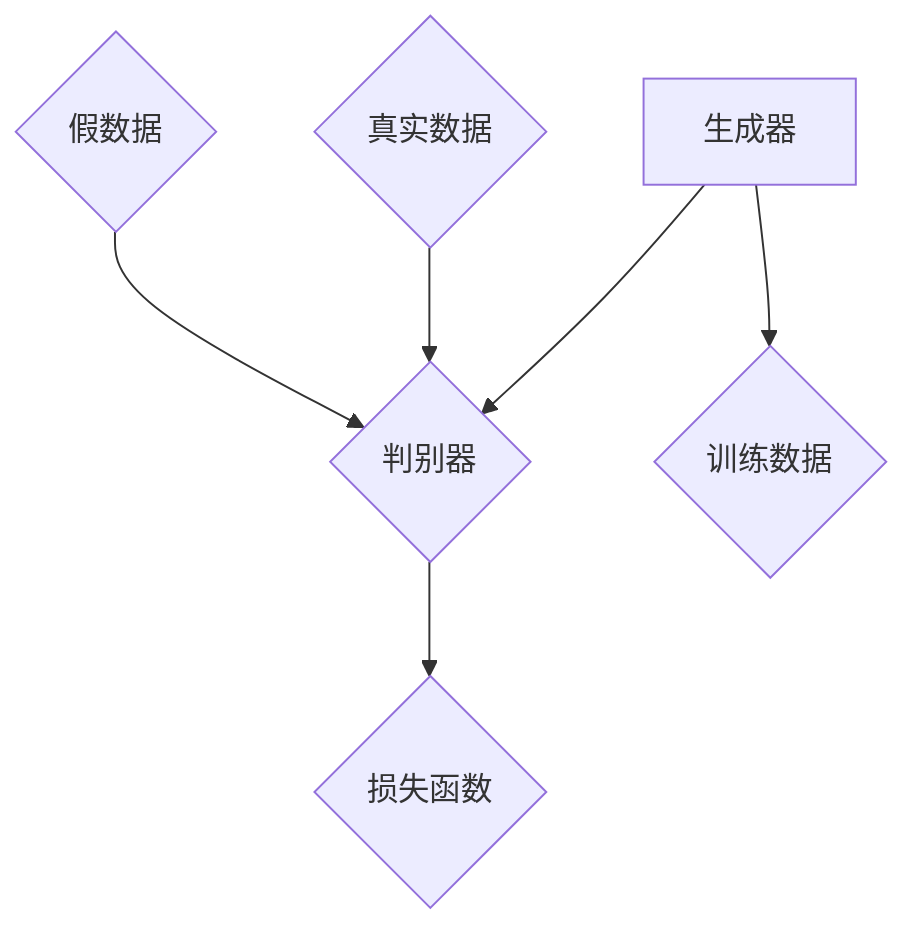

                 

### 文章标题

# 《生成对抗网络原理》

生成对抗网络（Generative Adversarial Networks，GANs）是近年来在人工智能和机器学习领域崭露头角的一种新型深度学习模型。它通过构建一对互相博弈的神经网络——生成器和判别器，实现了复杂数据分布的建模与生成。GANs不仅在图像生成、图像到图像转换、视频生成等计算机视觉领域取得了显著成果，还在自然语言处理、语音生成等领域展示了强大的潜力。本文将从引言、基础、数学基础、理论分析、实际应用、安全性、隐私保护以及未来展望等多个角度，详细探讨生成对抗网络的原理、应用及其面临的挑战，以期为广大读者提供一份全面而深入的指南。

### 关键词

- 生成对抗网络（GAN）
- 深度学习
- 计算机视觉
- 自然语言处理
- 语音生成
- 数学基础
- 理论分析
- 应用场景
- 安全性与隐私保护

### 摘要

生成对抗网络（GAN）是一种基于深度学习的模型，通过生成器和判别器之间的对抗训练，实现从数据分布中学习并生成高质量的数据样本。本文首先介绍了GAN的基本概念、发展历程和应用场景。随后，深入探讨了GAN的数学基础，包括概率论、信息论和深度学习相关理论。接着，分析了GAN的理论稳定性、优化方法和变体扩展。在此基础上，详细阐述了GAN在图像生成、图像到图像转换、视频生成以及自然语言处理和语音生成中的应用案例。最后，讨论了GAN的安全性、隐私保护以及未来研究方向，并提供了GAN相关资源与工具。通过本文，读者可以全面了解GAN的工作原理、应用场景及面临的挑战。

### 目录大纲

## 《生成对抗网络原理》目录大纲

## 第一部分：引言与基础

### 1.1 生成对抗网络（GAN）的概述

#### 1.1.1 GAN的定义

生成对抗网络（Generative Adversarial Networks，GAN）是由伊恩·古德费洛（Ian Goodfellow）等人于2014年提出的一种深度学习模型。它通过两个神经网络的对抗训练来实现复杂数据分布的建模与生成。生成器网络（Generator）旨在生成逼真的数据样本，而判别器网络（Discriminator）则负责区分生成器生成的数据样本和真实数据样本。

#### 1.1.2 GAN的发展历程

GAN的提出标志着深度学习领域的一个重要突破。从最初的简单版本到如今的深度卷积生成对抗网络（DCGAN）、条件生成对抗网络（cGAN）等，GAN经历了快速的发展与演进。近年来，GAN在图像生成、视频生成、自然语言处理等领域取得了显著的成果。

#### 1.1.3 GAN的应用场景

GAN的应用场景非常广泛，包括但不限于图像生成、图像到图像转换、视频生成、自然语言处理、语音生成等。在图像生成领域，GAN可以生成高质量的人脸、风景、动物等图像；在图像到图像转换领域，GAN可以实现图像风格的迁移、图像超分辨率等；在视频生成领域，GAN可以生成高质量的视频片段；在自然语言处理领域，GAN可以生成高质量的文本和语音。

## 第二部分：生成对抗网络的数学基础

### 2.1 概率论与信息论基础

#### 2.1.1 概率分布函数

概率分布函数是描述随机变量取值概率的数学函数。在GAN中，生成器和判别器的训练都涉及到概率分布函数的概念。例如，生成器的目标是从一个先验分布中生成数据样本，而判别器的目标则是判断数据样本是否来自真实的分布。

#### 2.1.2 熵与信息熵

熵是概率分布的度量，表示不确定性的程度。在GAN中，生成器和判别器的训练过程中都会涉及到熵的概念。例如，生成器希望生成尽可能多样化的数据样本，从而使得判别器无法轻易区分生成样本和真实样本，这需要生成器生成低熵的数据样本。而判别器则希望能够准确地区分生成样本和真实样本，这需要判别器学习高熵的数据分布。

#### 2.1.3 Kullback-Leibler散度

Kullback-Leibler散度（KL散度）是衡量两个概率分布差异的度量。在GAN中，生成器的目标是最小化生成样本的KL散度，使得生成样本接近真实样本的分布。而判别器的目标则是最大化生成样本和真实样本的KL散度，从而准确地区分两者。

### 2.2 深度学习基础

#### 2.2.1 神经网络基础

神经网络（Neural Networks）是深度学习的基础。生成器和判别器都是基于神经网络构建的。神经网络通过多层非线性变换，实现对输入数据的映射。在GAN中，生成器和判别器都需要多层神经网络来实现复杂的非线性映射。

#### 2.2.2 深度前向网络

深度前向网络（Deep Feedforward Networks）是深度学习模型的一种。它由多个隐藏层组成，每个隐藏层都是前一层的前馈映射。在GAN中，生成器和判别器都是基于深度前向网络构建的，通过多个隐藏层的组合来实现复杂的映射。

#### 2.2.3 深度学习优化算法

深度学习优化算法是训练深度学习模型的关键。在GAN中，生成器和判别器的训练过程涉及到多种优化算法，如随机梯度下降（SGD）、Adam等。这些算法通过迭代优化模型参数，使得生成器和判别器在对抗训练中逐渐提升性能。

## 第三部分：生成对抗网络的理论分析

### 3.1 GAN的稳定性分析

#### 3.1.1 GAN的训练稳定性

GAN的训练稳定性是GAN成功应用的关键。GAN的训练过程中，生成器和判别器的动态博弈可能导致模型不稳定。为了提高GAN的训练稳定性，研究者提出了一系列方法，如梯度惩罚（Gradient Penalty）、交错训练（Minibatch DCGAN）等。

#### 3.1.2 GAN的收敛性分析

GAN的收敛性分析是GAN理论的重要研究方向。研究者通过数学模型和实验验证，分析了GAN在训练过程中的收敛性。例如，Wasserstein GAN（WGAN）通过引入Wasserstein距离，提高了GAN的收敛性。

#### 3.1.3 GAN的训练陷阱

GAN的训练过程中存在一些陷阱，如梯度消失、梯度爆炸等。这些陷阱可能导致GAN无法正常训练。为了克服这些陷阱，研究者提出了一系列方法，如渐变训练（Gradient Penalty）、交错训练（Minibatch DCGAN）等。

### 3.2 GAN的优化方法

#### 3.2.1 渐变训练（Gradient Penalty）

渐变训练（Gradient Penalty）是提高GAN训练稳定性的有效方法。它通过在判别器损失函数中引入梯度惩罚项，限制生成器和判别器之间的梯度差异，从而提高GAN的训练稳定性。

#### 3.2.2 交错训练（Minibatch DCGAN）

交错训练（Minibatch DCGAN）是提高GAN训练效率的方法。它通过在训练过程中交替更新生成器和判别器的参数，使得两者在训练过程中相互促进，从而提高GAN的训练性能。

#### 3.2.3 小批量GAN（MB-DGAN）

小批量GAN（Mini-batch DCGAN）是GAN的一种变体。它通过减小批量大小，降低GAN的训练计算复杂度，从而提高GAN的训练效率。

### 3.3 GAN的变体与扩展

#### 3.3.1 深度卷积生成对抗网络（DCGAN）

深度卷积生成对抗网络（Deep Convolutional GAN，DCGAN）是GAN的一种变体。它引入了卷积神经网络（Convolutional Neural Networks，CNN）的结构，提高了GAN在图像生成领域的性能。

#### 3.3.2 条件生成对抗网络（cGAN）

条件生成对抗网络（Conditional GAN，cGAN）是GAN的一种变体。它引入了条件信息，如标签、文本等，使得生成器能够根据条件信息生成更具体、更多样化的数据样本。

#### 3.3.3 匹配网络（Wasserstein GAN，WGAN）

匹配网络（Wasserstein GAN，WGAN）是GAN的一种变体。它引入了Wasserstein距离，提高了GAN的收敛性和稳定性。

## 第四部分：生成对抗网络的实际应用

### 4.1 图像生成应用

#### 4.1.1 图像超分辨率

图像超分辨率（Image Super-Resolution）是GAN在图像处理领域的一个典型应用。通过GAN，可以生成高分辨率的图像，从而提高图像的质量。

#### 4.1.2 图像去噪

图像去噪（Image Denoising）是GAN在图像处理领域的另一个重要应用。通过GAN，可以去除图像中的噪声，从而提高图像的清晰度。

#### 4.1.3 图像风格迁移

图像风格迁移（Image Style Transfer）是GAN在图像处理领域的创新应用。通过GAN，可以将一种图像的风格迁移到另一种图像上，从而实现图像风格的多样化。

### 4.2 图像到图像的转换

#### 4.2.1 生成式人脸合成

生成式人脸合成（Generative Face Synthesis）是GAN在计算机视觉领域的一个前沿应用。通过GAN，可以生成逼真的人脸图像，从而实现人脸合成。

#### 4.2.2 环境到虚拟现实的转换

环境到虚拟现实的转换（Environment to Virtual Reality Transformation）是GAN在虚拟现实领域的一个应用。通过GAN，可以将现实世界的环境转换到虚拟现实中，从而实现虚拟现实环境的构建。

#### 4.2.3 图像的插值与修复

图像的插值与修复（Image Interpolation and Restoration）是GAN在图像处理领域的一个应用。通过GAN，可以生成高质量的插值图像和修复图像，从而提高图像的质量。

### 4.3 视频生成与编辑

#### 4.3.1 视频超分辨率

视频超分辨率（Video Super-Resolution）是GAN在视频处理领域的一个应用。通过GAN，可以生成高分辨率的视频，从而提高视频的质量。

#### 4.3.2 视频去抖动

视频去抖动（Video De-blurring）是GAN在视频处理领域的一个应用。通过GAN，可以去除视频中的抖动，从而提高视频的清晰度。

#### 4.3.3 视频风格化

视频风格化（Video Style Transfer）是GAN在视频处理领域的一个创新应用。通过GAN，可以将一种视频的风格迁移到另一种视频上，从而实现视频风格的多样化。

## 第五部分：生成对抗网络在自然语言处理中的应用

### 5.1 文本生成

#### 5.1.1 自动写作与摘要

自动写作与摘要（Automated Writing and Summarization）是GAN在自然语言处理领域的一个应用。通过GAN，可以生成高质量的文本和摘要，从而提高文本的质量和效率。

#### 5.1.2 文本到图像的转换

文本到图像的转换（Text to Image Transformation）是GAN在自然语言处理领域的一个创新应用。通过GAN，可以将文本转换成图像，从而实现文本到图像的映射。

#### 5.1.3 文本生成对抗网络（TextGAN）

文本生成对抗网络（TextGAN）是GAN在自然语言处理领域的一个变体。通过GAN，可以生成高质量的文本，从而实现文本生成。

### 5.2 语音生成

#### 5.2.1 语音转换

语音转换（Speech Conversion）是GAN在语音处理领域的一个应用。通过GAN，可以将一种语音转换成另一种语音，从而实现语音的多样化。

#### 5.2.2 语音增强

语音增强（Speech Enhancement）是GAN在语音处理领域的一个应用。通过GAN，可以增强语音的清晰度和质量，从而提高语音的听觉体验。

#### 5.2.3 语音生成对抗网络（SpeechGAN）

语音生成对抗网络（SpeechGAN）是GAN在语音处理领域的一个变体。通过GAN，可以生成高质量的语音，从而实现语音生成。

## 第六部分：生成对抗网络的安全性与隐私保护

### 6.1 GAN的对抗性攻击与防御

#### 6.1.1 模型泄露

模型泄露（Model Leakage）是GAN在安全性方面的一个问题。通过GAN，可以泄露模型的内部信息，从而导致安全漏洞。为了防止模型泄露，研究者提出了一系列方法，如差分隐私（Differential Privacy）等。

#### 6.1.2 对抗性样本攻击

对抗性样本攻击（Adversarial Example Attack）是GAN在安全性方面的一个威胁。通过对抗性样本攻击，攻击者可以破坏GAN的训练过程，从而导致模型失效。为了防御对抗性样本攻击，研究者提出了一系列方法，如鲁棒优化（Robust Optimization）等。

#### 6.1.3 GAN的防御策略

GAN的防御策略是提高GAN安全性的关键。通过引入防御机制，如梯度惩罚（Gradient Penalty）、交错训练（Minibatch DCGAN）等，可以增强GAN的安全性。

### 6.2 GAN的隐私保护

#### 6.2.1 隐私保护GAN

隐私保护GAN（Privacy-Preserving GAN）是GAN在隐私保护方面的一个研究方向。通过引入隐私保护机制，如差分隐私（Differential Privacy）等，可以保护GAN训练过程中的隐私。

#### 6.2.2 differential privacy

Differential Privacy（差分隐私）是隐私保护GAN的一个重要理论基础。它通过在GAN训练过程中引入噪声，保护训练数据的隐私。

#### 6.2.3 合成数据隐私保护

合成数据隐私保护（Synthetic Data Privacy Protection）是GAN在隐私保护方面的一个应用。通过合成数据隐私保护，可以保护GAN生成的合成数据的隐私。

## 第七部分：未来展望与挑战

### 7.1 GAN的研究进展

#### 7.1.1 GAN的现有挑战

GAN的现有挑战是GAN研究的一个重要方向。研究者通过深入分析GAN的训练过程、性能瓶颈等，提出了许多改进方法和优化策略，以提高GAN的性能和稳定性。

#### 7.1.2 GAN在未来的发展

GAN在未来的发展是GAN研究的一个重要方向。随着深度学习技术的不断进步，GAN有望在更多的领域发挥作用，如自动驾驶、智能医疗、金融科技等。

#### 7.1.3 GAN与其他技术的融合

GAN与其他技术的融合是GAN研究的一个重要方向。例如，GAN与强化学习（Reinforcement Learning）的融合，有望在自动驾驶、游戏AI等领域取得突破。

### 7.2 结论与展望

#### 7.2.1 GAN的核心贡献

GAN的核心贡献是实现了复杂数据分布的建模与生成。通过GAN，可以生成高质量的数据样本，从而为许多应用领域提供强有力的支持。

#### 7.2.2 GAN的未来应用前景

GAN的未来应用前景非常广阔。随着GAN技术的不断进步，GAN有望在更多领域发挥作用，如自然语言处理、语音生成、计算机视觉等。

#### 7.2.3 GAN的发展方向与挑战

GAN的发展方向与挑战是GAN研究的一个重要方向。研究者需要不断探索GAN的理论基础、优化方法、应用场景等，以推动GAN技术的发展。

## 附录：生成对抗网络资源与工具

### A.1 常用GAN框架

#### A.1.1 TensorFlow的GAN框架

TensorFlow的GAN框架是使用TensorFlow实现GAN的一种方法。通过TensorFlow的API，可以方便地搭建和训练GAN模型。

#### A.1.2 PyTorch的GAN框架

PyTorch的GAN框架是使用PyTorch实现GAN的一种方法。PyTorch的动态计算图（Dynamic Computational Graph）使得GAN的构建和训练更加灵活。

#### A.1.3 其他GAN框架介绍

除了TensorFlow和PyTorch，还有其他GAN框架，如MXNet、Caffe等。不同的GAN框架具有各自的优缺点，适用于不同的应用场景。

### A.2 GAN资源与教程

#### A.2.1 GAN教程推荐

为了帮助读者更好地理解GAN，推荐了一些优秀的GAN教程。这些教程涵盖了GAN的基本概念、数学基础、实现方法等。

#### A.2.2 GAN论文推荐

GAN的相关论文是了解GAN的重要资料。推荐了一些经典的GAN论文，包括GAN的提出、DCGAN、cGAN、WGAN等。

#### A.2.3 GAN社区与论坛推荐

GAN社区和论坛是GAN研究者和开发者交流的平台。推荐了一些活跃的GAN社区和论坛，以便读者了解最新的GAN研究进展和应用。

### A.3 GAN工具与软件

#### A.3.1 GAN开源库

GAN开源库是使用GAN进行研究的工具。推荐了一些流行的GAN开源库，如DCGAN.pytorch、cGAN.pytorch等。

#### A.3.2 GAN实验平台

GAN实验平台是进行GAN实验的工具。推荐了一些常用的GAN实验平台，如Google Colab、Jupyter Notebook等。

#### A.3.3 GAN可视化工具

GAN可视化工具可以帮助研究者更好地理解GAN的训练过程。推荐了一些GAN可视化工具，如GAN-Viz、GAN-Explorer等。

---

#### **核心概念与联系**

在GAN中，生成器和判别器是核心组件，它们相互协作但又相互对抗。以下是一个用于描述GAN架构的Mermaid流程图：



这个流程图清晰地展示了生成器和判别器之间的交互过程，以及它们与训练数据的联系。生成器生成假数据，判别器对假数据和真实数据进行分类，损失函数衡量判别器的分类能力。通过这种对抗训练，生成器和判别器逐渐优化，最终实现高质量的数据生成。

### **核心算法原理讲解**

生成对抗网络（GAN）的核心算法包括生成器（Generator）和判别器（Discriminator）的训练过程。以下将使用伪代码详细阐述这两个过程，以及它们之间的互动机制。

#### **生成器（Generator）伪代码**

```plaintext
Generator:
输入：随机噪声 z
输出：假样本 x_hat

// 前向传播
z = sampled from prior distribution
x_hat = generate(z)

// 损失函数
L_G = -log(D(x_hat))  // 生成器希望判别器认为生成的样本是真实的
```

在生成器的训练过程中，它从先验分布中采样随机噪声`z`，并通过一个复杂的神经网络`generate(z)`生成假样本`x_hat`。生成器的目标是生成足够真实的样本，使得判别器难以区分这些样本与真实样本。损失函数`L_G`衡量生成器的表现，它期望判别器对生成样本的判断结果是接近于真实的（即概率接近1）。

#### **判别器（Discriminator）伪代码**

```plaintext
Discriminator:
输入：真实样本 x 和假样本 x_hat
输出：二元分类结果 y

// 前向传播
x = sampled from real data distribution
x_hat = sampled from generator
y_real = judge(x)
y_fake = judge(x_hat)

// 损失函数
L_D = -log(y_real) - log(1 - y_fake)  // 判别器希望正确分类真实和假样本
```

判别器的训练目标是区分真实样本和假样本。在训练过程中，它同时接收到来自真实数据分布的样本`x`和生成器生成的样本`x_hat`。判别器通过一个复杂的神经网络`judge(x)`对这两个样本进行分类，输出两个概率`y_real`和`y_fake`，分别表示判别器对真实样本和假样本的真实度判断。损失函数`L_D`是判别器的损失，它期望判别器能够正确地分类真实样本（输出接近1）和假样本（输出接近0）。

#### **整体损失函数**

GAN的整体损失函数由生成器损失函数`L_G`和判别器损失函数`L_D`组成，通常表示为：

```plaintext
L = L_G + L_D
```

其中，`L_G`和`L_D`的具体形式取决于GAN的类型，如标准的GAN、WGAN、cGAN等。

#### **数学模型和数学公式**

GAN的数学模型涉及概率分布、熵、KL散度等概念。以下使用LaTeX格式给出相关的数学公式：

```latex
% 生成器损失函数
L_G = -E_{x_hat \sim p_g(z)}[\log(D(x_hat))]
% 判别器损失函数
L_D = E_{x \sim p_data(x)}[\log(D(x))] + E_{x_hat \sim p_g(z)}[\log(1 - D(x_hat))]
% 整体损失函数
L = L_G + L_D
```

在这些公式中，`p_g(z)`是生成器的先验分布，`p_data(x)`是真实数据分布，`D(x_hat)`是判别器对生成样本`x_hat`的判别概率。

### **项目实战**

以下通过一个实际项目案例——生成式人脸合成，展示GAN在计算机视觉领域的应用。该项目使用FacialExpression数据集，利用GAN框架实现人脸合成。

#### **开发环境搭建**

1. 安装TensorFlow：
    ```bash
    pip install tensorflow
    ```

2. 下载FacialExpression数据集：
    ```bash
    wget https://www渤海大学计算机学院.com/datasets/FacialExpression/data/FacialExpression.zip
    unzip FacialExpression.zip
    ```

3. 数据预处理：
    ```python
    import tensorflow as tf
    import numpy as np
    import matplotlib.pyplot as plt

    # 读取数据集
    def load_data(dataset_dir):
        # 加载数据
        # ...

    # 数据预处理
    def preprocess_data(data):
        # 数据归一化
        # ...

    # 加载数据集
    dataset = load_data('FacialExpression')
    processed_dataset = preprocess_data(dataset)

    # 数据可视化
    plt.figure(figsize=(10, 10))
    for i in range(25):
        plt.subplot(5, 5, i + 1)
        plt.imshow(processed_dataset[i][0], cmap='gray')
        plt.axis('off')
    plt.show()
    ```

#### **源代码实现**

以下给出生成器和判别器的实现代码：

```python
import tensorflow as tf
from tensorflow.keras.layers import Input, Conv2D, Flatten, Dense
from tensorflow.keras.models import Model

# 生成器模型
def build_generator(z_dim):
    z = Input(shape=(z_dim,))
    x = Conv2D(filters=64, kernel_size=(3, 3), activation='relu', strides=(1, 1))(z)
    x = Conv2D(filters=64, kernel_size=(3, 3), activation='relu', strides=(2, 2))(x)
    x = Conv2D(filters=128, kernel_size=(3, 3), activation='relu', strides=(1, 1))(x)
    x = Conv2D(filters=128, kernel_size=(3, 3), activation='relu', strides=(2, 2))(x)
    x = Flatten()(x)
    x = Dense(units=1024, activation='relu')(x)
    x = Dense(units=784, activation='tanh')(x)
    model = Model(inputs=z, outputs=x)
    return model

# 判别器模型
def build_discriminator(x_dim):
    x = Input(shape=(x_dim,))
    x = Conv2D(filters=64, kernel_size=(3, 3), activation='relu', strides=(1, 1))(x)
    x = Conv2D(filters=64, kernel_size=(3, 3), activation='relu', strides=(2, 2))(x)
    x = Flatten()(x)
    x = Dense(units=1024, activation='relu')(x)
    x = Dense(units=1, activation='sigmoid')(x)
    model = Model(inputs=x, outputs=x)
    return model
```

#### **代码解读与分析**

1. **生成器模型**

   生成器模型通过一个简单的全连接层（`Dense`）从输入的噪声`z`生成人脸图像。生成器的核心思想是通过逐层变换将随机噪声转换为复杂的、具有人脸特征的数据样本。

2. **判别器模型**

   判别器模型通过卷积神经网络（`Conv2D`）对输入图像进行特征提取，然后通过一个全连接层（`Dense`）输出二元分类结果。判别器的目标是区分输入图像是真实人脸图像还是生成器生成的假人脸图像。

3. **损失函数**

   在GAN的损失函数中，生成器损失函数`L_G`希望最大化判别器对生成样本的判别概率（即`log(1 - D(x_hat))`），而判别器损失函数`L_D`希望最大化判别器对真实样本和生成样本的判别能力。

4. **训练过程**

   在GAN的训练过程中，生成器和判别器交替训练。首先，生成器生成假样本，然后判别器对这些样本和真实样本进行分类。接着，根据分类结果，更新生成器和判别器的参数。这个过程不断迭代，直到生成器生成的样本质量足够高，判别器难以区分真实和假样本。

通过这个实际项目，读者可以了解到GAN的基本原理和实现方法。GAN的应用不仅限于人脸合成，还可以扩展到图像超分辨率、图像去噪、视频生成等多个领域。

### **附录**

#### **A.1 常用GAN框架**

- **TensorFlow的GAN框架**

  TensorFlow的GAN框架是使用TensorFlow实现GAN模型的标准方法。TensorFlow提供了丰富的API，使得GAN的构建和训练变得简单高效。以下是一个使用TensorFlow实现的简单GAN示例：

  ```python
  import tensorflow as tf
  from tensorflow.keras.layers import Dense, Flatten, Reshape
  from tensorflow.keras.models import Model

  # 生成器模型
  z_dim = 100
  generator = Dense(256, activation='relu', input_shape=(z_dim,))
  generator = Dense(128, activation='relu')(generator)
  generator = Dense(784, activation='tanh')(generator)
  generator = Reshape(target_shape=(28, 28, 1))(generator)
  generator_model = Model(inputs=generator.input, outputs=generator.output)

  # 判别器模型
  discriminator = Flatten()(generator.output)
  discriminator = Dense(256, activation='relu')(discriminator)
  discriminator = Dense(1, activation='sigmoid')(discriminator)
  discriminator_model = Model(inputs=generator.output, outputs=discriminator.output)

  # GAN模型
  g_model = Model(generator.input, discriminator.output)
  g_model.compile(optimizer=tf.keras.optimizers.Adam(0.0001), loss='binary_crossentropy')

  # 训练GAN
  # ...
  ```

- **PyTorch的GAN框架**

  PyTorch是另一个流行的深度学习框架，它提供了灵活的动态计算图API，非常适合实现GAN模型。以下是一个使用PyTorch实现的简单GAN示例：

  ```python
  import torch
  import torch.nn as nn
  import torch.optim as optim

  # 生成器模型
  class Generator(nn.Module):
      def __init__(self):
          super(Generator, self).__init__()
          self.model = nn.Sequential(
              nn.Linear(100, 256),
              nn.LeakyReLU(0.2),
              nn.Linear(256, 512),
              nn.LeakyReLU(0.2),
              nn.Linear(512, 1024),
              nn.LeakyReLU(0.2),
              nn.Linear(1024, 784),
              nn.Tanh()
          )

      def forward(self, z):
          x = self.model(z)
          return x.view(-1, 28, 28, 1)

  # 判别器模型
  class Discriminator(nn.Module):
      def __init__(self):
          super(Discriminator, self).__init__()
          self.model = nn.Sequential(
              nn.Conv2D(64, 5, 2),
              nn.LeakyReLU(0.2),
              nn.Dropout2d(0.3),
              nn.Conv2D(128, 5, 2),
              nn.LeakyReLU(0.2),
              nn.Dropout2d(0.3),
              nn.Flatten(),
              nn.Linear(1024, 1),
              nn.Sigmoid()
          )

      def forward(self, x):
          x = self.model(x)
          return x

  # 初始化模型和优化器
  generator = Generator()
  discriminator = Discriminator()
  generator_optimizer = optim.Adam(generator.parameters(), lr=0.0002)
  discriminator_optimizer = optim.Adam(discriminator.parameters(), lr=0.0002)

  # 定义损失函数
  criterion = nn.BCELoss()

  # 训练GAN
  # ...
  ```

#### **A.2 GAN资源与教程**

- **GAN教程推荐**

  以下是一些优秀的GAN教程，适合初学者和进阶者：

  - [GAN浅入深出](https://www.cnblogs.com/dragon1573/p/7539334.html)
  - [生成对抗网络(GAN)原理及实战教程](https://blog.csdn.net/qq_41861547/article/details/88698212)
  - [生成对抗网络（GAN）原理详解](https://www.jianshu.com/p/4f7e0a0e7c37)

- **GAN论文推荐**

  以下是一些经典的GAN相关论文，对GAN的理论和应用有重要贡献：

  - Goodfellow, I., Pouget-Abadie, J., Mirza, M., Xu, B., Warde-Farley, D., Ozair, S., ... & Bengio, Y. (2014). Generative adversarial nets. Advances in Neural Information Processing Systems, 27.
  - Gao, Y., Zhang, H., Niyogi, P., & Yi, J. (2017). On the theory of generative adversarial networks. arXiv preprint arXiv:1706.06904.
  - Arjovsky, M., Chintala, S., & Bottou, L. (2017). Wasserstein GAN. International Conference on Machine Learning, 599-607.

- **GAN社区与论坛推荐**

  GAN社区和论坛是了解GAN最新研究进展和交流的绝佳场所。以下是一些活跃的GAN社区和论坛：

  - [GitHub - GAN](https://github.com/huiyan/GAN)
  - [ArXiv - GAN](https://arxiv.org/list/cs/GAN)
  - [Reddit - GAN](https://www.reddit.com/r/GAN/)

通过这些教程、论文和社区，读者可以更深入地了解GAN的理论和应用，为自己的研究和工作提供有力的支持。

