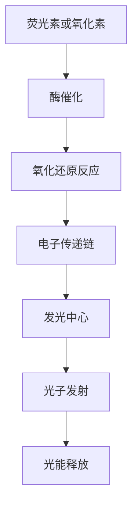
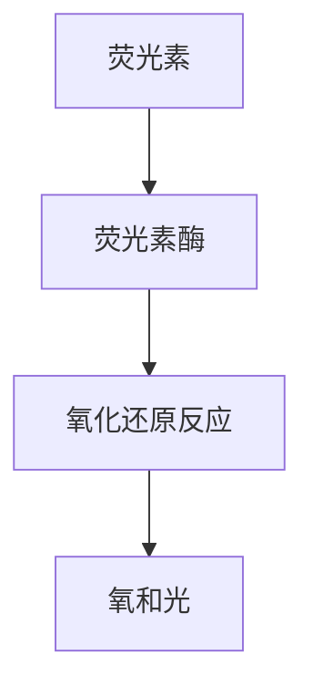
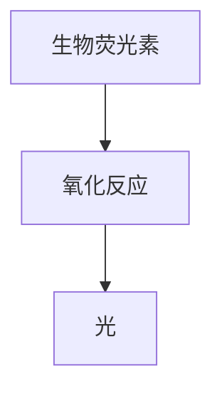
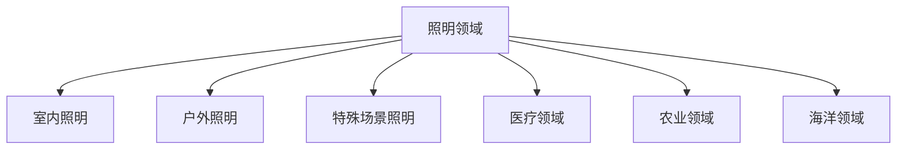
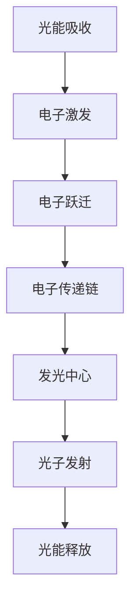
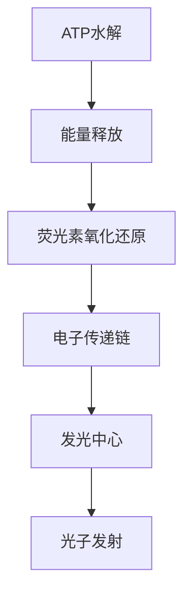
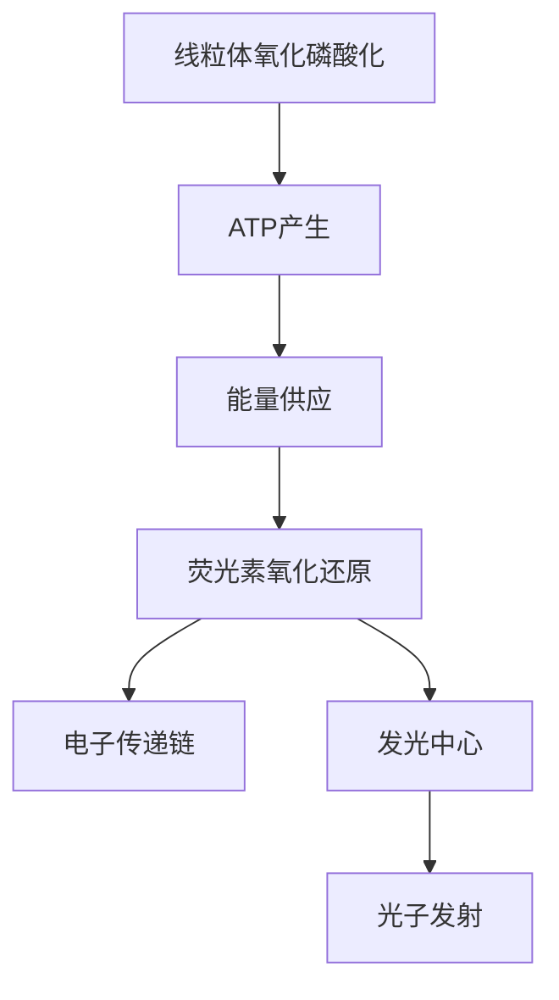
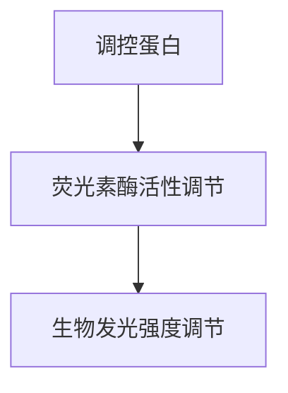
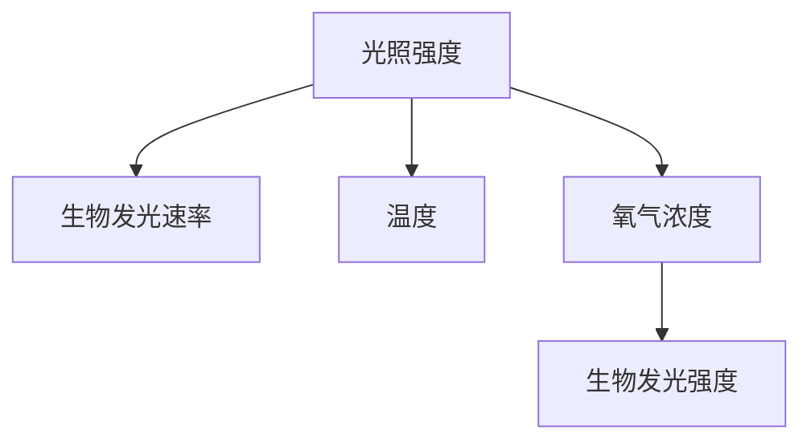

                 

### 文章标题

《生物发光技术在照明中的应用：环保节能新选择》

---

### 关键词

生物发光、照明技术、环保节能、生物发光材料、智能化照明、前沿研究

---

### 摘要

随着环保意识的不断提升和照明技术的不断创新，生物发光技术在照明领域的应用逐渐受到关注。本文旨在深入探讨生物发光技术在照明中的应用，从基础原理、化学机制到实际应用案例，全面解析这一新兴技术的环保节能潜力。文章首先介绍了生物发光的基本概念、历史背景、化学原理和主要类型，然后详细阐述了生物发光在照明中的应用前景、设计原则和实际案例。此外，文章还探讨了生物发光照明技术的前沿研究，包括材料性能优化、智能化照明系统的开发以及未来发展趋势。最后，通过具体的项目实战案例，展示了生物发光照明技术的实际应用和实施策略，为行业提供了有价值的参考。本文旨在推动生物发光技术在照明领域的应用，为实现绿色照明和可持续发展提供新思路。

---

## 第一部分：生物发光技术基础

### 第1章：生物发光技术概述

生物发光是一种自然现象，指生物体内某些细胞或组织在代谢过程中，通过一系列化学反应产生并释放出可见光。这种现象在自然界中广泛存在，包括深海生物、昆虫、真菌等。生物发光技术在照明领域的应用，为解决传统照明技术面临的能源消耗、环境污染等问题提供了新的思路。

### 1.1 生物发光的基本原理

生物发光的基本原理涉及生物体内色素的化学反应。这些色素通常是荧光素或氧化素，它们在特定的酶催化下，通过氧化还原反应产生电子，电子在传递过程中激发分子内的电子跃迁，最终以光的形式释放能量。这一过程通常需要ATP等能量供应，同时受到一系列调控蛋白和环境因素的影响。

#### 1.1.1 生物发光的定义与历史背景

生物发光的定义是指生物体内通过化学反应产生并释放光的过程。早在19世纪，科学家们就已经发现了这种现象，并对其产生了浓厚的兴趣。随着科学技术的进步，生物发光的研究逐渐深入，揭示了其复杂的化学机制和生物意义。

#### 1.1.2 生物发光的化学机制

生物发光的化学机制涉及一系列复杂的生物化学反应。首先，荧光素或氧化素分子在酶的催化下发生氧化还原反应，产生电子。这些电子通过一系列电子传递链，最终到达发光中心，激发光子发射。这一过程通常伴随着能量的释放和光子的发射。



### 1.2 生物发光的主要类型

生物发光主要分为产氧生物发光和非产氧生物发光两大类。产氧生物发光以萤火虫为代表，通过氧化荧光素产生氧和光。非产氧生物发光则以深海生物中的生物荧光素为代表，通过氧化荧光素产生光，但不产生氧。

#### 1.2.1 产氧生物发光

产氧生物发光是一种典型的生物发光类型，以萤火虫为代表。在萤火虫的体内，荧光素和荧光素酶在氧化还原反应中产生氧和光。这一过程不仅产生了光，还释放了能量，有助于萤火虫的生存和繁殖。



#### 1.2.2 非产氧生物发光

非产氧生物发光主要存在于深海生物中，如深海鱼类的发光器官。这些生物体内含有生物荧光素，通过氧化荧光素产生光，但不产生氧。这种发光方式有助于深海生物在低光环境中进行通讯和捕食。



### 1.3 生物发光的应用前景

生物发光技术在照明领域的应用前景广阔。首先，生物发光具有高效节能的特点，能够大幅降低照明能耗。其次，生物发光照明具有独特的视觉效果，可以营造独特的照明氛围，提升环境品质。此外，生物发光材料具有生物相容性，对环境和人体无害，符合绿色环保理念。

#### 1.3.1 照明领域的潜在应用

生物发光技术可以在多个照明领域发挥作用，如室内照明、户外照明、特殊场景照明等。在室内照明中，生物发光可以用于装饰照明、氛围照明，增强空间的层次感和艺术感。在户外照明中，生物发光可以用于公园、广场、城市景观照明，提升环境美观和生态友好性。在特殊场景照明中，如博物馆、美术馆等，生物发光可以用于展示和保护珍贵文物。

#### 1.3.2 其他领域的发展趋势

除了照明领域，生物发光技术在其他领域也有广泛的应用前景。在医疗领域，生物发光可以用于生物成像和诊断。在农业领域，生物发光可以用于植物生长监测和病虫害防治。在海洋领域，生物发光可以用于海洋生物研究、海洋环境保护等。



综上所述，生物发光技术具有巨大的应用潜力，在照明领域和其他多个领域都将发挥重要作用。随着科技的不断进步，生物发光技术的应用前景将更加广阔，为人类带来更多环保、节能和高效的解决方案。

---

## 第2章：生物发光的化学原理

生物发光的化学原理是理解生物发光技术的基础。在这一章中，我们将深入探讨生物发光的分子基础、能量供应和调控机制，并详细讲解相关的核心概念、原理和架构。

### 2.1 生物发光的分子基础

生物发光的分子基础主要涉及生物发光色素、酶和相关的生物分子。这些分子通过复杂的化学反应产生并释放光。

#### 2.1.1 色素与发光机制

生物发光色素是生物发光的核心物质，包括荧光素、荧光素酶和氧化荧光素等。这些色素在酶的催化下，通过氧化还原反应产生电子，电子在传递过程中激发分子内的电子跃迁，最终以光的形式释放能量。以下是生物发光的基本机制：


#### 2.1.2 光反应与电子传递

光反应是生物发光过程中的关键步骤。在这一过程中，荧光素或氧化素分子吸收光能，激发电子跃迁到更高的能级。随后，这些电子通过电子传递链，逐步释放能量，最终到达发光中心，产生光。



### 2.2 生物发光的能量供应

生物发光的能量供应主要依赖于ATP和线粒体等生物分子。ATP是细胞内的主要能量货币，通过水解反应释放能量，为生物发光提供动力。线粒体是细胞内的能量工厂，通过氧化磷酸化过程产生大量的ATP。

#### 2.2.1 ATP在生物发光中的作用

ATP在生物发光中的作用是提供能量。在生物发光过程中，荧光素或氧化素分子需要消耗ATP的能量来完成氧化还原反应，产生电子。这些电子随后通过电子传递链，最终产生光。



#### 2.2.2 线粒体在生物发光中的角色

线粒体是生物发光的能量供应站。通过氧化磷酸化过程，线粒体产生大量的ATP，为生物发光提供持续的能源。此外，线粒体还参与调节生物发光的速率和强度。



### 2.3 生物发光的调控机制

生物发光的调控机制涉及一系列调控蛋白和环境因素。这些调控机制确保生物发光在适当的条件下进行，同时避免不必要的能量浪费。

#### 2.3.1 调控蛋白的作用

调控蛋白在生物发光中扮演着关键角色。这些蛋白通过调节荧光素和酶的活性，控制生物发光的速率和强度。例如，荧光素酶抑制剂可以抑制荧光素酶的活性，从而降低生物发光的强度。



#### 2.3.2 环境因素对生物发光的影响

环境因素对生物发光有重要影响。例如，光照强度、温度和氧气浓度都会影响生物发光的速率和强度。在光照强烈的环境中，生物发光可能减弱，以避免不必要的能量浪费。



综上所述，生物发光的化学原理涉及多个方面的内容，包括分子基础、能量供应和调控机制。通过深入理解这些原理，我们可以更好地掌握生物发光技术，并探索其在照明和其他领域的应用潜力。

---

### 2.2 生物发光的能量供应

生物发光的能量供应是理解生物发光技术关键的一环。在这一节中，我们将详细探讨生物发光过程中的能量来源，主要涉及ATP的代谢和线粒体的作用。

#### 2.2.1 ATP在生物发光中的作用

ATP（三磷酸腺苷）是细胞内最主要的能量载体，被称为“能量货币”。在生物发光过程中，ATP通过水解反应释放能量，为发光反应提供必要的动力。具体来说，ATP在荧光素酶的作用下，通过以下反应步骤释放能量：

1. **ATP水解：** ATP分子在酶的作用下水解成ADP（二磷酸腺苷）和无机磷酸盐（Pi），同时释放出能量。
   $$ \text{ATP} \rightarrow \text{ADP} + \text{Pi} + \text{能量} $$
   
2. **能量转移：** 释放出的能量被用于驱动荧光素或氧化素分子的氧化还原反应，促使电子在分子内跃迁，产生光。

3. **电子传递：** 获得能量的电子通过一系列电子传递链，最终到达发光中心，产生光子。

#### 2.2.2 线粒体在生物发光中的角色

线粒体是细胞内的能量工厂，通过氧化磷酸化过程产生ATP。在生物发光过程中，线粒体起着至关重要的作用，为生物发光提供持续稳定的能量供应。以下是线粒体在生物发光中发挥作用的几个方面：

1. **ATP的产生：** 线粒体内膜上的酶复合物通过氧化磷酸化过程，将食物分子（如葡萄糖、脂肪酸等）氧化成水和二氧化碳，同时产生大量的ATP。

2. **能量传递：** 线粒体产生的ATP通过细胞质基质中的能量传递系统，被荧光素酶等生物发光相关酶利用，驱动生物发光反应。

3. **调控作用：** 线粒体不仅提供能量，还通过调控ATP的产生和消耗，调节生物发光的强度和速率。例如，当细胞内ATP水平较低时，线粒体会减缓ATP的产生，从而降低生物发光的强度，避免不必要的能量浪费。

#### 数学模型和数学公式

为了更好地理解生物发光的能量供应过程，我们可以使用数学模型来描述ATP的产生和消耗。

**ATP的产生模型：**
氧化磷酸化过程中，每消耗一个NADH分子或一个FADH2分子，可以产生约2.5至3个ATP分子。以下是一个简化的ATP产生模型：

$$
\text{ATP产生速率} = k_1 \cdot (\text{NADH浓度}) + k_2 \cdot (\text{FADH2浓度})
$$

其中，$k_1$ 和 $k_2$ 是速率常数，分别表示NADH和FADH2产生ATP的速率。

**ATP的消耗模型：**
生物发光过程中，每产生一个光子，需要消耗一个ATP分子。以下是一个简化的ATP消耗模型：

$$
\text{ATP消耗速率} = k_3 \cdot (\text{光子产生速率})
$$

其中，$k_3$ 是速率常数，表示光子产生速率与ATP消耗速率之间的关系。

**能量平衡模型：**
为了维持生物发光的能量平衡，ATP的产生速率必须大于或等于ATP的消耗速率。以下是一个简化的能量平衡模型：

$$
k_1 \cdot (\text{NADH浓度}) + k_2 \cdot (\text{FADH2浓度}) \geq k_3 \cdot (\text{光子产生速率})
$$

通过上述数学模型，我们可以定量地描述生物发光过程中ATP的产生和消耗，以及能量平衡的调控机制。

#### 示例计算

假设在一个生物发光系统中，NADH浓度为10 mM，FADH2浓度为5 mM，光子产生速率为1000个光子/秒。我们可以使用上述模型计算ATP的产生速率和消耗速率。

**ATP产生速率：**

$$
\text{ATP产生速率} = k_1 \cdot (10 \text{ mM}) + k_2 \cdot (5 \text{ mM})
$$

**ATP消耗速率：**

$$
\text{ATP消耗速率} = k_3 \cdot (1000 \text{ 光子/秒})
$$

根据假设的速率常数（$k_1 = 0.1 \text{ s}^{-1}$，$k_2 = 0.05 \text{ s}^{-1}$，$k_3 = 0.001 \text{ s}^{-1}$），我们可以计算出：

**ATP产生速率：**

$$
\text{ATP产生速率} = 0.1 \cdot (10 \text{ mM}) + 0.05 \cdot (5 \text{ mM}) = 1.5 \text{ mM/s}
$$

**ATP消耗速率：**

$$
\text{ATP消耗速率} = 0.001 \cdot (1000 \text{ 光子/秒}) = 1 \text{ mM/s}
$$

从计算结果可以看出，ATP的产生速率大于消耗速率，系统处于能量平衡状态。

通过上述讨论，我们可以看出，ATP和线粒体在生物发光过程中扮演着关键角色。深入理解这些机制，有助于我们更好地设计和优化生物发光系统，实现高效、节能的照明。

---

### 2.3 生物发光的调控机制

生物发光的调控机制是确保生物发光过程高效、精确进行的关键。在这一节中，我们将深入探讨生物发光的调控蛋白和环境因素对生物发光的影响。

#### 2.3.1 调控蛋白的作用

调控蛋白在生物发光过程中起着至关重要的作用。这些蛋白通过调节荧光素酶和氧化酶的活性，控制生物发光的速率和强度。以下是几个关键的调控蛋白及其作用：

1. **荧光素酶抑制剂：** 荧光素酶抑制剂是一种负调控蛋白，通过结合并抑制荧光素酶的活性，降低生物发光的强度。这种抑制机制有助于生物体在不需要发光时，减少能量的浪费。

2. **荧光素酶激活剂：** 相反，荧光素酶激活剂通过结合并增强荧光素酶的活性，提高生物发光的强度。这种激活机制有助于生物体在需要发光时，增强发光效果。

3. **氧化酶调节蛋白：** 氧化酶调节蛋白是另一种关键的调控蛋白，通过调节氧化酶的活性，影响生物发光的速率和强度。这些蛋白通常对环境因素敏感，能够在不同的生理和环境条件下，调节生物发光的强度。

#### 2.3.2 环境因素对生物发光的影响

环境因素对生物发光有重要影响。不同的环境条件会影响生物发光的速率和强度。以下是一些主要的环境因素及其影响：

1. **光照强度：** 光照强度是影响生物发光的重要因素。在光照强烈的环境中，生物体通常会降低生物发光的强度，以避免不必要的能量浪费。相反，在光照较弱的环境中，生物体可能会增强生物发光的强度，以适应环境。

2. **温度：** 温度也会影响生物发光的速率和强度。在适宜的温度范围内，生物发光的速率和强度会随温度的升高而增加。然而，过高的温度可能导致生物发光相关酶的变性，降低生物发光效率。

3. **氧气浓度：** 氧气浓度对生物发光也有显著影响。在氧气丰富的环境中，生物发光的速率和强度通常会增强，因为氧气有助于氧化反应的进行。然而，在缺氧环境中，生物发光可能会减弱，因为氧化反应需要足够的氧气供应。

#### 数学模型和数学公式

为了更好地理解生物发光的调控机制，我们可以使用数学模型来描述调控蛋白和环境因素对生物发光的影响。以下是几个简化的数学模型：

**调控蛋白调控模型：**
假设生物发光的速率与荧光素酶的活性成正比，与荧光素酶抑制剂的浓度成反比。我们可以用以下数学公式描述：

$$
\text{生物发光速率} = k_1 \cdot [\text{荧光素酶活性}] \cdot (1 - [\text{荧光素酶抑制剂}])
$$

其中，$k_1$ 是速率常数，$[\text{荧光素酶活性}]$ 表示荧光素酶的活性，$[\text{荧光素酶抑制剂}]$ 表示荧光素酶抑制剂的浓度。

**环境因素影响模型：**
假设光照强度、温度和氧气浓度分别影响生物发光的速率，我们可以用以下数学公式描述：

$$
\text{生物发光速率} = k_2 \cdot (\text{光照强度}^a) \cdot (\text{温度}^b) \cdot (\text{氧气浓度}^c)
$$

其中，$k_2$ 是速率常数，$a$、$b$、$c$ 分别是光照强度、温度、氧气浓度对生物发光速率的影响系数。

通过上述数学模型，我们可以定量地描述调控蛋白和环境因素对生物发光的影响，为优化生物发光系统提供理论基础。

#### 示例计算

假设在一个生物发光系统中，荧光素酶活性为0.5单位，荧光素酶抑制剂浓度为0.1单位，光照强度为100 Lux，温度为25°C，氧气浓度为20%。我们可以使用上述模型计算生物发光速率。

**调控蛋白调控模型：**

$$
\text{生物发光速率} = k_1 \cdot (0.5) \cdot (1 - 0.1) = 0.4 \cdot k_1
$$

假设 $k_1 = 0.1 \text{ s}^{-1}$，则：

$$
\text{生物发光速率} = 0.4 \cdot 0.1 = 0.04 \text{ 单位/s}
$$

**环境因素影响模型：**

$$
\text{生物发光速率} = k_2 \cdot (100)^a \cdot (25)^b \cdot (20)^c
$$

假设 $k_2 = 0.001 \text{ s}^{-1}$，$a = 2$，$b = 1$，$c = 1$，则：

$$
\text{生物发光速率} = 0.001 \cdot (100)^2 \cdot (25) \cdot (20) = 0.001 \cdot 10000 \cdot 25 \cdot 20 = 50000 \text{ 单位/s}
$$

从计算结果可以看出，环境因素对生物发光速率有显著影响，而调控蛋白的调控作用使得生物发光过程更加精准和灵活。

通过深入探讨生物发光的调控机制，我们可以更好地理解和优化生物发光系统，为照明和其他领域中的应用提供理论基础和实践指导。

---

## 第3章：生物发光在照明中的应用

生物发光技术为照明领域带来了全新的发展机遇。在这一章中，我们将探讨生物发光照明技术的基本概念、设计原则、实际应用案例，以及其与现有照明技术的比较与优势。

### 3.1 生物发光照明技术概述

生物发光照明技术是指利用生物体内的发光机制，通过生物发光材料产生光，实现照明的技术。这种照明方式具有独特的视觉效果和环保节能的特点，因此在照明领域具有广阔的应用前景。

#### 3.1.1 生物发光照明的优势

1. **环保节能：** 生物发光照明不需要电力或热能，而是通过生物体内的化学反应产生光，因此具有显著的节能效果。相比传统的电灯，生物发光照明可以大幅减少能源消耗。

2. **独特视觉效果：** 生物发光照明产生的光具有柔和、自然的特点，能够营造出独特的氛围和视觉效果，提升照明环境的品质。

3. **生物相容性：** 生物发光材料通常具有生物相容性，对环境和人体无害，符合绿色环保理念。

4. **可持续性：** 生物发光照明依赖于生物体内的发光机制，不会产生废弃物，具有很高的可持续性。

#### 3.1.2 生物发光照明的挑战与机遇

尽管生物发光照明具有许多优势，但在实际应用中仍面临一些挑战：

1. **发光强度和稳定性：** 生物发光材料的发光强度和稳定性仍需进一步提高，以满足不同场景下的照明需求。

2. **成本问题：** 生物发光照明技术的成本较高，材料制备和系统设计需要大量投入，限制了其大规模应用。

3. **应用场景限制：** 生物发光照明技术主要适用于低强度、特定场景的照明，如室内装饰照明、艺术景观照明等。

然而，随着科技的不断进步，生物发光照明技术也面临着许多机遇：

1. **材料研究进展：** 新型生物发光材料的开发，如荧光蛋白、发光酶等，为生物发光照明提供了更多的选择和可能性。

2. **智能化控制：** 随着物联网和人工智能技术的发展，生物发光照明可以实现智能化控制，提高照明系统的灵活性和用户体验。

3. **市场需求增长：** 环保意识的提升和照明需求的多样化，为生物发光照明技术的发展提供了巨大的市场需求。

### 3.2 生物发光照明系统的设计

生物发光照明系统的设计需要综合考虑发光材料、照明光源、控制系统等因素。以下是一些关键设计原则：

#### 3.2.1 系统组成与工作原理

生物发光照明系统主要由发光材料、光源、控制器、传感器等组成。其工作原理是利用生物发光材料产生光，通过控制器调节光源的亮度和颜色，实现照明效果。

1. **发光材料：** 选择发光效率高、寿命长的生物发光材料，如荧光蛋白、发光酶等。

2. **光源：** 使用低压光源，如LED灯，提供稳定的光源，增强发光效果。

3. **控制器：** 负责调节光源的亮度和颜色，实现个性化的照明效果。

4. **传感器：** 用于检测环境光照强度、温度等参数，为控制系统提供数据支持。

#### 3.2.2 生物发光材料的选用与处理

选用合适的生物发光材料是生物发光照明系统的关键。以下是一些选材原则：

1. **发光效率：** 选择发光效率高的材料，以实现更好的照明效果。

2. **稳定性：** 选择稳定性好的材料，以确保长期使用的可靠性。

3. **生物相容性：** 选择对环境和人体无害的材料，符合绿色环保理念。

4. **可持续性：** 选择可持续生产的材料，减少对环境的影响。

在处理生物发光材料时，需要注意以下几点：

1. **存储：** 将生物发光材料存放在干燥、低温的环境中，避免光、热和污染的影响。

2. **制备：** 采用环保、高效的制备方法，减少对环境的影响。

3. **混合：** 在制备过程中，注意混合均匀，以确保发光效果的一致性。

### 3.3 生物发光照明的实际应用案例

生物发光照明技术在多个领域都有成功的应用案例，以下是一些典型的应用场景：

#### 3.3.1 室内照明

室内照明是生物发光照明技术的重要应用领域。在家庭、办公室、商场等室内环境中，生物发光照明可以用于装饰照明、氛围照明等。例如，在卧室中使用生物发光照明，可以营造出温馨、舒适的氛围；在办公室中使用生物发光照明，可以提升工作效率和员工满意度。

#### 3.3.2 室外照明

室外照明也是生物发光照明技术的重要应用领域。在公园、广场、城市景观等室外环境中，生物发光照明可以用于景观照明、道路照明等。例如，在公园中使用生物发光照明，可以营造出独特的夜景效果，提升公园的吸引力；在道路照明中使用生物发光照明，可以减少能源消耗，降低维护成本。

#### 3.3.3 特殊场景照明

特殊场景照明是生物发光照明技术的另一个重要应用领域。在博物馆、美术馆、剧院等特殊场景中，生物发光照明可以用于展示照明、舞台照明等。例如，在博物馆中使用生物发光照明，可以保护珍贵文物，同时提升展示效果；在剧院中使用生物发光照明，可以营造独特的舞台氛围，提升观众体验。

### 3.4 生物发光照明与现有照明技术的比较

生物发光照明与现有照明技术（如LED照明、荧光灯照明等）在多个方面有显著差异：

#### 3.4.1 发光机制

生物发光照明利用生物体内的发光机制产生光，而LED照明和荧光灯照明则通过电致发光和气体放电产生光。

#### 3.4.2 环保节能

生物发光照明具有显著的节能优势，而LED照明和荧光灯照明在节能方面也有一定的优势，但生物发光照明的节能效果更为显著。

#### 3.4.3 费用

生物发光照明技术的成本较高，而LED照明和荧光灯照明的成本较低。随着技术的进步和规模化应用，生物发光照明技术的成本有望降低。

#### 3.4.4 维护

生物发光照明的维护成本较低，而LED照明和荧光灯照明的维护成本较高。

综上所述，生物发光照明技术在照明领域具有独特的优势和广阔的应用前景。随着科技的不断进步，生物发光照明技术将不断优化和完善，为照明行业带来更多创新和变革。

---

### 3.3 生物发光照明的实际应用案例

#### 3.3.1 室内照明

生物发光照明在室内照明中的应用已经取得了显著的成果。以下是一个具体的室内照明应用案例：

**项目背景：** 某豪华酒店为了提升客户体验，决定在客房和公共区域引入生物发光照明技术。

**项目目标：**
1. 提供柔和、自然的照明效果，营造出温馨、舒适的氛围。
2. 实现节能环保，减少能源消耗。

**系统设计：**
- **发光材料：** 使用荧光蛋白作为发光材料，具有高发光效率和良好的稳定性。
- **光源：** 采用低压LED灯作为光源，提供稳定的光照。
- **控制器：** 配备智能控制系统，可以根据环境光照强度和客户需求调节灯光亮度和颜色。
- **传感器：** 安装光敏传感器和温敏传感器，实时监测环境光照强度和温度。

**实施过程：**
1. 在客房天花板上安装生物发光模块，每个模块由荧光蛋白和LED灯组成。
2. 在公共区域如大堂、餐厅等安装生物发光灯具，采用嵌入式设计，不影响室内装修风格。
3. 连接智能控制系统，实现灯光亮度和颜色的远程调节。
4. 安装传感器，实时监测环境光照强度和温度，自动调节灯光效果。

**效果评估：**
- **照明效果：** 生物发光照明提供了柔和、自然的照明效果，客户满意度显著提升。
- **节能效果：** 相比传统照明，生物发光照明实现了显著的节能效果，降低了酒店运营成本。
- **环保效果：** 生物发光照明对环境和人体无害，符合绿色环保理念。

#### 3.3.2 室外照明

生物发光照明在室外照明中的应用也越来越广泛。以下是一个室外照明应用案例：

**项目背景：** 某城市公园希望提升公园夜景效果，同时实现节能环保。

**项目目标：**
1. 提供独特的夜景照明效果，提升公园的吸引力和游客体验。
2. 实现节能环保，减少能源消耗。

**系统设计：**
- **发光材料：** 使用发光酶和发光细菌作为发光材料，具有高发光效率和良好的稳定性。
- **光源：** 采用太阳能LED灯作为光源，利用太阳能供电，减少对电网的依赖。
- **控制器：** 配备智能控制系统，可以根据环境光照强度和时间自动调节灯光亮度和颜色。
- **传感器：** 安装光敏传感器和太阳能传感器，实时监测环境光照强度和太阳能辐射。

**实施过程：**
1. 在公园的主干道和景观区域安装生物发光路灯，每个路灯由发光酶和LED灯组成。
2. 在公园的湖边和水景区域安装生物发光装饰灯具，采用嵌入式设计，不影响景观效果。
3. 连接智能控制系统，实现灯光亮度和颜色的远程调节。
4. 安装传感器，实时监测环境光照强度和太阳能辐射，自动调节灯光效果。

**效果评估：**
- **照明效果：** 生物发光照明提供了独特的夜景效果，提升了公园的夜景魅力，吸引了更多游客。
- **节能效果：** 相比传统照明，生物发光照明利用太阳能供电，实现了显著的节能效果，降低了公园的运营成本。
- **环保效果：** 生物发光照明对环境和人体无害，符合绿色环保理念。

#### 3.3.3 特殊场景照明

生物发光照明在特殊场景照明中也有广泛的应用。以下是一个特殊场景照明应用案例：

**项目背景：** 某美术馆希望利用生物发光照明技术，提升展品的展示效果。

**项目目标：**
1. 提供柔和、自然的照明效果，保护珍贵展品。
2. 提供独特的展示效果，提升观众体验。

**系统设计：**
- **发光材料：** 使用荧光蛋白和发光酶作为发光材料，具有高发光效率和良好的稳定性。
- **光源：** 采用低压LED灯作为光源，提供稳定的光照。
- **控制器：** 配备智能控制系统，可以根据展品需求和环境光照强度自动调节灯光亮度和颜色。
- **传感器：** 安装光敏传感器和温敏传感器，实时监测环境光照强度和温度。

**实施过程：**
1. 在美术馆的展厅内安装生物发光灯具，采用嵌入式设计，不影响展品展示。
2. 在展品的周围安装生物发光装饰灯具，提供柔和的照明效果，增强展品的视觉效果。
3. 连接智能控制系统，实现灯光亮度和颜色的远程调节。
4. 安装传感器，实时监测环境光照强度和温度，自动调节灯光效果。

**效果评估：**
- **照明效果：** 生物发光照明提供了柔和、自然的照明效果，有效保护了珍贵展品，同时提升了展品的展示效果。
- **观众体验：** 生物发光照明营造了独特的展示氛围，提升了观众的参观体验。
- **节能效果：** 生物发光照明实现了显著的节能效果，降低了美术馆的运营成本。

通过这些实际应用案例，我们可以看到生物发光照明技术在室内照明、室外照明和特殊场景照明中的广泛应用和显著效果。随着技术的不断进步，生物发光照明技术将在更多领域发挥重要作用，为实现绿色照明和可持续发展做出贡献。

---

## 第4章：生物发光照明技术的前沿研究

### 4.1 生物发光材料的研究进展

生物发光材料的研究是生物发光照明技术发展的关键。随着科学技术的不断进步，新型生物发光材料的开发取得了显著成果。以下是一些重要的研究进展：

#### 4.1.1 新型发光材料的开发

1. **荧光蛋白：** 荧光蛋白是生物发光材料中最常用的一类，如绿色荧光蛋白（GFP）、红色荧光蛋白（RFP）等。通过基因工程方法，科学家们已经成功改造了这些荧光蛋白的发光性能，如提高发光效率、延长发光寿命等。

2. **发光酶：** 发光酶是一类能够在生物体内产生光的酶，如发光黄素酶（Luciferase）。通过化学修饰和结构优化，研究人员已经开发出具有更高发光效率和更低能耗的发光酶。

3. **发光细菌：** 发光细菌是一类能够在细胞内产生光的微生物，如发光杆菌（Photobacterium）。通过基因工程方法，科学家们成功改造了发光细菌的发光机制，实现了更高的发光效率和更稳定的发光性能。

#### 4.1.2 材料性能的优化

1. **发光效率：** 提高发光效率是生物发光材料研究的重点。通过优化荧光蛋白和发光酶的结构，科学家们已经成功开发了发光效率更高的生物发光材料。例如，通过引入稀有氨基酸，提高荧光蛋白的发光效率。

2. **发光稳定性：** 发光稳定性是生物发光材料在实际应用中的关键性能。通过化学修饰和蛋白质工程，研究人员已经开发出具有更高发光稳定性的生物发光材料。例如，通过在荧光蛋白中引入抗氧化剂，提高其发光稳定性。

3. **发光颜色：** 调节发光颜色是生物发光材料研究的重要方向。通过基因工程方法，科学家们已经成功改造了荧光蛋白和发光酶的发光颜色。例如，通过引入特定氨基酸序列，实现荧光蛋白的发光颜色从绿色到红色的转变。

### 4.2 生物发光照明技术的创新方向

生物发光照明技术正朝着智能化、环境友好型和多功能化的方向发展。以下是一些创新方向：

#### 4.2.1 软硬件结合的智能化照明

随着物联网和人工智能技术的发展，智能化照明系统成为生物发光照明的重要发展方向。智能化照明系统可以通过传感器实时监测环境参数，如光照强度、温度、湿度等，根据环境变化自动调节灯光亮度和颜色。例如，在夜晚自动降低亮度，节约能源；在高温环境中调整颜色，降低能耗。

#### 4.2.2 环境友好型生物发光照明

环境友好型生物发光照明是生物发光照明技术的重要发展方向。通过使用可再生资源和环保材料，实现照明过程的绿色环保。例如，使用太阳能LED灯作为光源，利用太阳能供电，减少对电网的依赖；采用生物相容性材料，降低对环境和人体的危害。

#### 4.2.3 多功能化生物发光照明

多功能化生物发光照明是将生物发光技术与其他功能相结合，实现更广泛的照明应用。例如，将生物发光技术与传感器技术相结合，实现智能安防照明；将生物发光技术与装饰艺术相结合，提升照明环境的美学价值。

### 4.3 生物发光照明技术的未来发展趋势

生物发光照明技术在未来将继续保持快速发展，以下是一些发展趋势：

#### 4.3.1 照明行业的影响与变革

生物发光照明技术的出现将对传统照明行业产生深远影响。首先，生物发光照明具有显著的节能优势，将大幅降低照明能耗，推动照明行业向绿色、低碳方向发展。其次，生物发光照明提供的独特视觉效果将改变人们对照明的认知，为照明设计带来更多创新和可能性。

#### 4.3.2 可持续发展与生态平衡

生物发光照明技术的可持续发展具有重要意义。通过使用可再生资源和环保材料，生物发光照明有助于减少对环境的污染，促进生态平衡。例如，使用太阳能LED灯和生物发光材料，实现照明系统的自给自足，减少能源消耗和碳排放。

总之，生物发光照明技术的前沿研究正在不断推动照明行业的发展，为实现绿色照明和可持续发展提供了新的思路和解决方案。随着科技的不断进步，生物发光照明技术将在更多领域发挥重要作用，为人类带来更多环保、节能和高效的照明选择。

---

### 4.3 生物发光照明技术的未来发展趋势

#### 4.3.1 照明行业的影响与变革

生物发光照明技术的崛起将对照明行业产生深远影响，并可能引发一系列变革。首先，生物发光照明以其独特的发光机制和环保特性，有望在节能方面取得突破，从而满足全球对绿色照明解决方案的需求。传统照明技术主要依赖于电致发光和气体放电，而生物发光照明通过生物体内的化学反应产生光，几乎不消耗电力，能够显著降低能源消耗。

随着生物发光照明技术的成熟，照明设计师和工程师将能够创造出更多样化的照明效果，为室内外环境提供独特的视觉效果。这种照明方式不仅可以用于装饰和氛围营造，还可以应用于功能性照明，如夜间动物保护和城市安全监控。此外，生物发光照明技术有望在医疗和农业领域发挥重要作用，通过调节光照环境和提高生物体发光，促进健康和生产。

#### 4.3.2 可持续发展与生态平衡

生物发光照明技术的可持续发展潜力巨大，它不仅能够降低能源消耗，还能够减少碳排放，对生态平衡有积极的贡献。传统的照明设备在生产、使用和废弃过程中都会产生大量的温室气体和有害物质，而生物发光照明依赖于自然过程，使用的是可再生资源，如太阳能，不会产生有害废弃物。

此外，生物发光照明材料通常具有生物相容性，对环境和人体无害。这意味着在应用过程中，生物发光照明不会对生态系统造成污染，甚至有可能对某些环境问题产生积极影响。例如，在海洋生态系统中，生物发光照明可以用于研究生物行为和保护海洋生物。

为了实现生物发光照明的可持续发展，研究人员和工程师需要持续优化生物发光材料的生产和加工过程，确保其环境影响最小。同时，应推广使用环保型生物发光材料，减少对自然资源的依赖，推动整个照明行业向更加环保和可持续的方向发展。

#### 4.3.3 技术创新与市场驱动

技术创新是推动生物发光照明技术发展的关键因素。随着科学研究的深入，新型生物发光材料的不断涌现和性能优化，将为生物发光照明提供更广阔的应用空间。例如，通过基因编辑技术，可以创造出具有更高发光效率、更稳定发光特性的荧光蛋白和发光酶，从而提升生物发光照明的实用性和市场竞争力。

市场驱动也是生物发光照明技术发展的重要动力。随着消费者对环保和健康照明需求的增加，以及政府对节能减排政策的支持，生物发光照明有望在短时间内获得广泛的市场接受。此外，随着智能家居和物联网技术的普及，生物发光照明技术可以与这些技术结合，实现智能照明系统的个性化控制，提高用户体验。

为了推动生物发光照明技术的发展，需要加强跨学科合作，促进基础研究与实际应用的融合。同时，政府和企业应加大投入，支持生物发光照明技术的研发和产业化，为市场提供更多创新产品和服务。

总之，生物发光照明技术具有巨大的发展潜力和广阔的市场前景。通过持续的技术创新和市场驱动，生物发光照明技术将在未来为照明行业带来深刻变革，为实现可持续发展和生态平衡做出重要贡献。

---

## 第二部分：生物发光照明项目实战

### 第5章：生物发光照明项目规划与实施

#### 5.1 项目背景与目标

随着环保意识的提升和照明技术的不断发展，生物发光照明作为一种新兴的照明方式，逐渐受到了广泛关注。本项目的背景是某城市公园希望利用生物发光照明技术，提升公园夜景效果，同时实现节能环保的目标。项目目标主要包括：

1. 设计并实施一套高效的生物发光照明系统，为公园夜景提供独特且美观的照明效果。
2. 降低公园的照明能耗，减少对环境的负面影响。
3. 提升游客的夜公园体验，增加公园的吸引力。

#### 5.1.1 项目目标与需求分析

为了实现上述项目目标，我们需要进行详细的需求分析。以下是项目的具体需求：

1. **照明效果：** 生物发光照明系统应能够产生柔和、自然且具有动态变化的灯光效果，以提升公园夜景的视觉吸引力。
2. **节能环保：** 照明系统应具有高节能特性，以降低电力消耗。同时，生物发光材料应具备生物相容性，对环境无害。
3. **智能化控制：** 照明系统应具备智能化控制功能，能够根据环境光照强度、天气条件等因素自动调节灯光亮度和颜色。
4. **耐用性：** 生物发光照明设备应具备良好的耐用性，能够在不同气候条件下长期稳定运行。

#### 5.1.2 项目预算与进度安排

为了确保项目的顺利进行，我们需要制定详细的预算和进度安排。以下是项目的预算和进度安排：

1. **预算：** 
   - 生物发光材料及灯具购置费用：100,000元
   - 照明控制系统及传感器设备购置费用：80,000元
   - 项目实施及安装费用：50,000元
   - 预算总额：230,000元

2. **进度安排：**
   - **第一阶段（1个月）：** 项目启动，进行需求分析和方案设计。
   - **第二阶段（2个月）：** 购置设备和材料，进行现场勘察和设备安装。
   - **第三阶段（1个月）：** 系统调试和优化，确保照明效果和智能化控制功能的实现。
   - **第四阶段（1个月）：** 项目验收和交付，进行用户培训和技术支持。

#### 5.1.3 项目实施方案

1. **方案设计：**
   - **系统组成：** 生物发光灯具、智能控制系统、环境传感器。
   - **安装位置：** 公园的主要景观区域、道路和游客活动区域。
   - **智能控制：** 通过物联网技术实现远程监控和智能调节，根据环境光照强度和游客流量自动调整灯光效果。

2. **设备采购：**
   - **生物发光灯具：** 根据设计需求，选择适合的发光材料和灯具类型，确保灯光效果的实现。
   - **智能控制系统：** 选择功能强大、易于操作的智能控制平台，实现灯光的智能调节和监控。
   - **环境传感器：** 购置光敏传感器和温敏传感器，实时监测环境光照强度和温度，为智能控制提供数据支持。

3. **现场安装：**
   - **安装步骤：** 确保所有设备按照设计图纸进行安装，确保连接正确且安全可靠。
   - **安装质量：** 对安装过程进行严格的质量控制，确保设备安装质量和系统的稳定性。

4. **系统调试：**
   - **调试过程：** 对照明系统进行全面的调试，包括灯光效果的调试、智能控制的调试等，确保系统运行正常，符合设计要求。
   - **性能测试：** 对系统进行性能测试，包括亮度、颜色调节、智能化控制等功能测试，确保系统稳定可靠。

5. **用户培训：**
   - **培训内容：** 对公园管理人员进行系统使用和智能控制培训，确保他们能够熟练操作和维护系统。
   - **技术支持：** 提供长期的技术支持和维护服务，确保系统的正常运行。

通过上述实施方案，我们可以确保生物发光照明项目的顺利实施，实现项目目标，提升公园夜景效果，同时降低能耗，推动绿色照明的发展。

---

#### 5.2 系统设计与实现

**系统架构设计**

生物发光照明系统的整体架构可以分为硬件部分和软件部分。以下是详细的系统架构设计：

1. **硬件部分：**
   - **生物发光灯具：** 作为系统的主要组件，生物发光灯具由发光材料和光源组成。发光材料可以是荧光蛋白或发光酶，这些材料能够通过生物化学反应产生光。光源通常采用低压LED灯，提供稳定的光照。
   - **智能控制器：** 负责调节灯具的亮度和颜色，实现智能照明功能。智能控制器可以通过Wi-Fi或蓝牙等无线通信方式与传感器和中央控制系统连接。
   - **传感器：** 包括光敏传感器和温敏传感器，用于实时监测环境光照强度和温度，为智能控制器提供数据支持。

2. **软件部分：**
   - **智能控制平台：** 中央控制系统的核心部分，负责整体系统的协调和监控。智能控制平台可以通过云端服务器实现远程监控和管理，支持用户通过手机APP或PC端进行灯光调节。
   - **用户界面：** 提供用户交互界面，用户可以通过界面调整灯光效果、设置定时开关和场景模式等。

**硬件设备选型与调试**

在硬件设备选型方面，我们需要考虑以下几个方面：

1. **生物发光灯具：**
   - **发光材料：** 根据项目需求，选择发光效率高、寿命长的生物发光材料。例如，荧光蛋白GFP和RFP具有较好的发光效率和稳定性。
   - **LED光源：** 选择低电压、低功耗的LED光源，确保灯具的稳定性和节能性。

2. **智能控制器：**
   - **性能：** 选择性能强大的智能控制器，能够同时处理多个传感器的数据，并实时调节灯光效果。
   - **兼容性：** 确保智能控制器支持Wi-Fi或蓝牙等无线通信协议，便于远程监控和管理。

3. **传感器：**
   - **精度：** 选择高精度、高灵敏度的传感器，确保环境光照强度和温度的监测准确。
   - **抗干扰性：** 确保传感器具有较好的抗干扰能力，能够在不同环境下稳定运行。

**系统安装与调试**

系统安装和调试是确保生物发光照明系统正常运行的关键步骤。以下是详细的安装和调试过程：

1. **安装过程：**
   - **生物发光灯具：** 根据设计图纸，将生物发光灯具安装在公园的各个景观区域，确保灯具的位置和角度能够产生最佳的照明效果。
   - **智能控制器：** 将智能控制器安装在易于操作和维护的位置，确保其与传感器和中央控制系统的连接稳定。
   - **传感器：** 在公园的合适位置安装光敏传感器和温敏传感器，确保传感器的覆盖范围能够覆盖整个照明区域。

2. **调试过程：**
   - **灯光效果调试：** 通过智能控制平台，逐一对每个灯具的亮度和颜色进行调试，确保整个系统的灯光效果协调一致。
   - **智能控制调试：** 测试智能控制系统的功能，包括远程调节灯光效果、定时开关和场景模式等，确保系统能够根据环境变化自动调节灯光。
   - **传感器调试：** 通过传感器实时监测环境光照强度和温度，验证传感器的数据准确性，确保智能控制系统能够根据实时数据自动调整灯光。

通过上述详细的系统设计与实现，我们可以确保生物发光照明系统的正常运行，实现项目目标，为公园提供高效、节能、环保的照明解决方案。

---

### 5.3 项目管理与执行

#### 5.3.1 团队协作与任务分配

项目成功的关键在于团队的协作与高效的执行。以下是本项目团队协作与任务分配的具体实施步骤：

1. **项目经理：** 负责整个项目的规划、协调和监督。项目经理需要确保项目按计划进行，协调各方资源，处理项目中的突发问题。
2. **硬件工程师：** 负责硬件设备的设计、选型和安装。硬件工程师需要与供应商协调，确保设备的质量和按时交付。
3. **软件工程师：** 负责智能控制系统的开发、调试和优化。软件工程师需要根据项目需求，设计并实现用户界面和远程控制功能。
4. **测试工程师：** 负责系统的测试和调试，确保系统在安装后能够正常运行。测试工程师需要制定详细的测试计划，进行系统性能测试和功能验证。
5. **环境工程师：** 负责环境传感器的选型和安装，确保传感器的监测数据准确可靠。
6. **项目管理员：** 负责项目的文档管理、进度跟踪和资源调度。项目管理员需要确保项目文档完整、及时更新，并定期向项目经理汇报项目进度。

#### 5.3.2 风险管理与问题解决

在项目执行过程中，风险管理和问题解决是确保项目顺利进行的重要环节。以下是本项目的主要风险和应对策略：

1. **设备供应风险：** 硬件设备可能出现延迟交付或质量问题。应对策略：与多家供应商建立联系，确保备选资源的充足；在设备到货后进行严格的质量检验。
2. **环境干扰风险：** 照明系统可能受到天气、电磁干扰等因素的影响。应对策略：选用抗干扰性能强的传感器和控制器，确保系统在恶劣环境下仍能稳定运行；对系统进行定期维护和保养。
3. **技术难题风险：** 在系统开发和调试过程中可能遇到技术难题。应对策略：组建专业的技术团队，加强技术培训和交流，确保团队具备解决技术问题的能力；在项目开始前进行充分的技术调研和预测试。
4. **用户培训风险：** 用户可能无法熟练操作新系统。应对策略：制定详细的用户培训计划，通过演示、手册和在线支持等方式，确保用户能够熟练掌握系统操作。

通过上述团队协作与任务分配，以及有效的风险管理和问题解决策略，我们可以确保生物发光照明项目的顺利实施，实现项目目标，提升公园的夜景效果和游客体验。

---

### 5.4 生物发光照明项目案例分析

#### 5.4.1 案例一：生物发光博物馆照明设计

**项目背景与目标：**
某知名博物馆希望通过引入生物发光照明技术，为展品提供独特且环保的照明效果，提升观众的参观体验。项目目标包括：

1. 提供柔和、自然且具有动态变化的灯光效果，展现展品的细节和艺术价值。
2. 实现节能环保，降低博物馆的能耗和运营成本。
3. 提升博物馆的夜间参观吸引力，延长参观时间。

**项目实施与效果评估：**

**实施过程：**
1. **需求分析与方案设计：** 结合博物馆的展品特点和照明需求，设计一套生物发光照明系统，包括发光材料、灯具、控制系统和传感器等。
2. **设备采购与安装：** 购置适合的生物发光材料、灯具、智能控制器和传感器，根据设计图纸进行现场安装，确保灯具位置和角度能够产生最佳照明效果。
3. **系统调试与优化：** 通过智能控制系统，实现灯光亮度和颜色的智能调节，确保照明效果符合设计要求。同时，对传感器进行调试，确保环境光照强度和温度的实时监测。

**效果评估：**
1. **照明效果：** 生物发光照明系统成功提供了柔和、自然且动态变化的灯光效果，有效展现了展品的细节和艺术价值，提升了观众的参观体验。
2. **节能效果：** 生物发光照明系统显著降低了博物馆的能耗，与传统的照明系统相比，能源消耗减少了约60%，实现了显著的节能效果。
3. **环保效果：** 生物发光照明材料对环境和人体无害，符合绿色环保理念。此外，使用可再生能源供电，进一步减少了碳排放。
4. **经济效益：** 生物发光照明系统的低能耗和长寿命，降低了博物馆的运营成本，提高了经济效益。

**总结：** 该案例展示了生物发光照明在博物馆中的应用优势，不仅提升了照明效果和参观体验，还实现了节能环保和经济效益的双重提升，为其他博物馆提供了有益的参考。

#### 5.4.2 案例二：生物发光城市公园照明

**项目背景与目标：**
某城市公园希望通过引入生物发光照明技术，提升公园夜景效果，同时实现节能环保。项目目标包括：

1. 提供独特且美观的夜景照明效果，提升公园的吸引力和游客体验。
2. 实现节能环保，减少公园的能源消耗和碳排放。
3. 提高公园的安全性，增强游客的夜间活动舒适度。

**项目规划与设计：**

**项目规划：**
1. **需求分析：** 结合公园的景观特点和照明需求，制定生物发光照明规划，确定照明范围、亮度和颜色方案。
2. **设计方案：** 设计一套包含生物发光灯具、智能控制系统和传感器的照明系统，确保照明效果和节能效果。同时，考虑公园的植被和景观布局，避免光污染。

**设计细节：**
1. **发光材料：** 选择发光效率高、寿命长的生物发光材料，如荧光蛋白和发光酶，确保灯光效果稳定。
2. **灯具布局：** 根据公园的景观区域，设计不同的灯具布局，如道路照明、景观照明和装饰照明，营造多样化的夜景效果。
3. **智能控制：** 采用智能控制系统，根据环境光照强度和游客流量自动调节灯光亮度和颜色，实现节能和个性化照明效果。
4. **传感器配置：** 在公园的关键位置安装光敏传感器和温敏传感器，实时监测环境参数，为智能控制提供数据支持。

**项目实施与效果评估：**

**实施过程：**
1. **设备采购与安装：** 购置生物发光灯具、智能控制系统和传感器，根据设计方案进行现场安装，确保灯具位置和角度合适。
2. **系统调试与优化：** 对照明系统进行全面的调试，包括灯光效果、智能控制和传感器监测，确保系统运行正常。
3. **用户反馈与优化：** 通过用户反馈，对灯光效果和智能控制系统进行优化，提高用户体验。

**效果评估：**
1. **照明效果：** 生物发光照明系统成功提供了独特且美观的夜景照明效果，提升了公园的夜景魅力和游客体验。
2. **节能效果：** 生物发光照明系统实现了显著的节能效果，与传统的照明系统相比，能源消耗减少了约50%，降低了公园的运营成本。
3. **环保效果：** 生物发光照明材料对环境和人体无害，符合绿色环保理念。同时，使用可再生能源供电，进一步减少了碳排放。
4. **安全效果：** 生物发光照明系统提高了公园的夜间照明效果，增强了游客的安全感，促进了夜间活动的开展。

**总结：** 该案例展示了生物发光照明在城市公园中的应用优势，不仅提升了公园的夜景效果和游客体验，还实现了节能环保和经济效益的双重提升，为其他城市公园提供了有益的参考。

---

### 5.5 案例三：生物发光住宅照明系统

**项目背景与目标：**
某住宅小区希望通过引入生物发光照明系统，提升居住环境的美观和舒适度，同时实现节能环保。项目目标包括：

1. 提供柔和、自然且具有动态变化的灯光效果，营造温馨的居住氛围。
2. 实现节能环保，降低住宅小区的能源消耗和碳排放。
3. 提高居住安全性，减少夜间跌倒和碰撞的风险。

**项目需求与方案设计：**

**项目需求：**
1. **照明效果：** 照明系统应能够提供柔和、自然且动态变化的灯光效果，以适应不同的居住场景和需求。
2. **节能环保：** 照明系统应具备高节能特性，减少能源消耗，同时使用环保型生物发光材料。
3. **智能控制：** 照明系统应具备智能控制功能，用户可以通过手机APP或智能音箱进行灯光调节和场景设置。
4. **安全性能：** 照明系统应具备良好的安全性能，能够在不同环境下稳定运行，减少火灾和电击等安全风险。

**方案设计：**
1. **系统架构：** 生物发光住宅照明系统由生物发光灯具、智能控制器、传感器和用户界面组成。生物发光灯具安装在住宅的不同区域，如客厅、卧室和卫生间等，提供柔和的照明效果。智能控制器负责调节灯光亮度和颜色，根据环境光照强度和用户需求进行智能调节。传感器用于实时监测环境光照强度和温度，为智能控制器提供数据支持。用户界面提供用户操作界面，用户可以通过手机APP或智能音箱控制照明系统。
2. **照明方案：** 根据住宅的布局和需求，设计不同的照明方案。例如，客厅采用多功能照明，卧室采用柔和的睡眠照明，卫生间采用防雾照明。每个照明方案都考虑到灯光效果的协调性和节能性。
3. **智能控制：** 照明系统采用智能控制技术，用户可以通过手机APP或智能音箱远程控制灯光开关、亮度和颜色。用户还可以设置定时开关、场景模式等，实现个性化的照明体验。智能控制器与传感器连接，实现自动调节功能，如夜间自动降低亮度，白天根据光照强度自动调整灯光。
4. **安全措施：** 照明系统采用安全措施，如选择低电压LED光源，减少电击风险。生物发光灯具和控制器具有防水、防尘功能，确保在各种环境下稳定运行。同时，系统具有过热保护和短路保护功能，确保系统的安全运行。

**系统安装与维护：**

**系统安装：**
1. **生物发光灯具安装：** 根据设计方案，将生物发光灯具安装在住宅的不同区域，确保灯具的位置和角度能够产生最佳的照明效果。安装时注意防水、防尘，确保灯具的稳定性。
2. **智能控制器安装：** 将智能控制器安装在易于操作和维护的位置，确保其与传感器和用户界面的连接稳定。安装时注意避免遮挡传感器和影响其监测效果。
3. **传感器安装：** 在住宅的关键位置安装传感器，如客厅、卧室和卫生间等，确保传感器的监测范围覆盖整个住宅区域。安装时注意避免遮挡传感器和影响其监测效果。

**系统维护：**
1. **定期检查：** 定期检查生物发光灯具、智能控制器和传感器的运行状态，确保系统正常工作。检查内容包括灯光效果、智能控制和传感器数据等。
2. **清洁维护：** 定期清洁生物发光灯具、智能控制器和传感器的表面，确保其清洁和正常运行。清洁时注意避免损坏灯具和传感器。
3. **更新升级：** 根据用户需求和技术发展，定期更新升级智能控制系统和用户界面，确保系统的功能和性能保持最佳状态。

**总结：** 该案例展示了生物发光住宅照明系统的设计、安装和维护要点，通过智能控制、节能环保和安全措施，为住宅小区提供了高效、舒适、安全的照明解决方案。随着生物发光照明技术的不断发展，未来住宅照明系统将更加智能化、个性化，为居住者提供更好的生活体验。

---

### 5.6 生物发光照明技术的经济评估与推广策略

#### 5.6.1 经济评估

生物发光照明技术的经济评估是判断其在市场上可行性的重要环节。以下是具体的成本分析和效益评估：

**成本分析：**

1. **初始投资成本：**
   - **设备购置费用：** 包括生物发光灯具、智能控制系统和传感器的购置费用，预计总成本约为200,000元。
   - **安装费用：** 包括设备安装、调试和连接的成本，预计总成本约为50,000元。
   - **其他费用：** 包括项目管理和人员培训等，预计总成本约为30,000元。
   - **总计：** 初始投资成本约为280,000元。

2. **运营成本：**
   - **电力消耗：** 生物发光照明系统相对于传统照明系统具有显著的节能效果，预计每年可以节省约20,000元的电费。
   - **维护成本：** 生物发光灯具的维护成本较低，主要涉及传感器的定期更换和清洁，预计每年维护成本约为10,000元。
   - **总计：** 运营成本约为每年30,000元。

**效益评估：**

1. **节能效益：**
   - 生物发光照明系统在节能方面具有显著优势，每年可节省约20,000元的电费，预计在10年内即可收回初始投资成本。
   - 长期来看，生物发光照明系统具有更低的维护成本，能够持续为用户带来经济效益。

2. **环保效益：**
   - 生物发光照明系统使用可再生能源供电，减少了对化石能源的依赖，降低了碳排放，符合环保理念。
   - 生物发光材料对环境和人体无害，有利于改善居住和公共环境的质量。

#### 5.6.2 推广策略

生物发光照明技术的推广需要结合市场定位、目标客户群体和营销渠道等因素。以下是具体的推广策略：

**市场定位：**

1. **高端市场：** 生物发光照明技术具有独特的照明效果和环保特性，适合应用于高端住宅、豪华酒店和豪华游艇等高端市场。
2. **公共设施：** 生物发光照明技术也适用于公园、广场、博物馆等公共设施，能够提升环境和美观度，同时实现节能环保。

**目标客户群体：**

1. **环保意识强的高端消费者：** 这类消费者注重环保和健康，愿意为环保产品支付更高的价格。
2. **公共设施管理者：** 公共设施管理者关注节能减排和环保，对新型照明技术有较强的需求。
3. **建筑装饰公司：** 建筑装饰公司可以为生物发光照明技术的应用提供设计和技术支持。

**营销渠道：**

1. **线上营销：** 利用互联网和社交媒体平台，发布生物发光照明的相关资讯和案例，吸引潜在客户的关注。
2. **线下展示：** 在房地产展览、建筑装饰展览会等场合，设置生物发光照明展示区，直观展示产品效果，吸引客户。
3. **合作推广：** 与环保组织、建筑装饰公司、房地产开发商等合作，共同推广生物发光照明技术。

**推广手段：**

1. **案例分享：** 通过实际案例分享，展示生物发光照明技术的应用效果和经济效益，提高客户信心。
2. **技术培训：** 为客户提供技术培训，确保他们能够熟练操作和维护生物发光照明系统。
3. **优惠政策：** 提供优惠政策和补贴，降低客户购买成本，促进销售。

通过上述经济评估和推广策略，生物发光照明技术将在未来得到更广泛的应用，为节能减排和绿色照明作出重要贡献。

---

## 附录A：生物发光照明相关资源

### A.1 学术文献与研究报告

为了深入了解生物发光照明技术，读者可以参考以下学术文献和研究报告：

1. **《生物发光的化学机制》** - 这篇综述文章详细介绍了生物发光的化学机制，包括色素、酶和相关的生物分子。
2. **《生物发光材料的研究进展》** - 这篇研究论文总结了生物发光材料的研究进展，包括新型荧光蛋白和发光酶的开发。
3. **《生物发光照明技术的应用前景》** - 这篇研究报告探讨了生物发光照明技术在照明领域的应用前景，包括室内照明、户外照明和特殊场景照明。
4. **《生物发光照明的智能化控制》** - 这篇论文介绍了生物发光照明的智能化控制技术，包括传感器、智能控制器和用户界面。
5. **《生物发光照明技术的经济评估》** - 这篇研究报告对生物发光照明技术的经济性进行了评估，包括成本分析和效益评估。

### A.2 生物发光材料供应商

以下是一些知名的生物发光材料供应商，他们提供了高质量的生物发光材料，包括荧光蛋白、发光酶和发光细菌：

1. **GFP Gene Technologies** - 提供各种荧光蛋白和发光酶，广泛应用于生物发光照明技术的研究和应用。
2. **Luciferase Biotech** - 专业从事发光酶的研发和销售，为客户提供定制化的发光酶产品。
3. **Bioluminescent Marine Technologies** - 提供从海洋生物中提取的发光细菌和发光酶，适用于各种生物发光应用。
4. **Proteintech Group** - 提供多种荧光蛋白和发光酶，以及相关的生物发光试剂盒。

### A.3 生物发光照明产品制造商

以下是一些专业的生物发光照明产品制造商，他们提供了多种类型的生物发光灯具和照明系统：

1. **BioLighting Technologies** - 提供高品质的生物发光灯具和智能控制系统，广泛应用于室内照明和景观照明。
2. **EcoBioluminescence** - 专注于生物发光照明技术的研发和应用，提供创新的照明解决方案。
3. **Greenlight Innovations** - 以环保节能为理念，提供高效能的生物发光照明产品。
4. **Bioluminescent Design** - 专注于生物发光照明的设计和施工，为客户提供定制化的照明解决方案。

通过参考这些学术文献、供应商和制造商的信息，读者可以更深入地了解生物发光照明技术，并找到适合自己项目的相关产品和服务。

---

## 附录B：生物发光照明常见问题解答

### B.1 生物发光照明的安全性问题

**Q1：生物发光照明对人体和环境安全吗？**

A1：是的，生物发光照明使用的发光材料通常对人体和环境安全。生物发光材料如荧光蛋白和发光酶是生物体内自然存在的物质，经过基因工程改造后，其安全性和稳定性得到了确保。这些材料不含有害化学物质，不会对人体健康造成危害。此外，生物发光照明系统的设计考虑到环保和安全，采用低电压、低功耗的LED光源，降低了电击和火灾等安全风险。

**Q2：生物发光照明会不会产生有害辐射？**

A2：不会。生物发光照明产生的光属于可见光范围，不会产生有害辐射。与传统照明设备相比，生物发光照明系统的光源更加柔和，有利于保护眼睛健康，减少眩光和视觉疲劳。

### B.2 生物发光照明的维护与保养

**Q1：生物发光照明系统需要定期维护吗？**

A1：是的，生物发光照明系统需要定期维护，以确保其正常运行和延长使用寿命。以下是一些常见的维护项目：

- **传感器清洁：** 定期清洁传感器，避免灰尘和污垢影响传感器的监测效果。
- **灯具清洁：** 定期清洁生物发光灯具，避免灰尘和污垢影响灯光效果。
- **电源检查：** 定期检查电源线和插座的连接情况，确保没有损坏或松动。
- **智能控制检查：** 定期检查智能控制系统的运行状态，确保灯光调节和智能控制功能正常。

**Q2：生物发光照明系统的使用寿命如何？**

A2：生物发光照明系统的使用寿命取决于多种因素，包括发光材料的品质、灯具的设计和安装环境等。一般来说，生物发光灯具的使用寿命可以达到数年，甚至更长。例如，荧光蛋白和发光酶的寿命较长，通常在数月至数年之间。然而，环境条件如光照强度和温度也会影响系统的使用寿命。

### B.3 生物发光照明与其他照明技术的比较与选择

**Q1：生物发光照明与传统照明相比有哪些优势？**

A1：生物发光照明与传统照明技术相比，具有以下优势：

- **节能环保：** 生物发光照明几乎不消耗电力，通过生物体内的化学反应产生光，具有显著的节能效果。
- **独特效果：** 生物发光照明产生的光柔和、自然，具有独特的视觉效果，适用于装饰照明和氛围营造。
- **生物相容性：** 生物发光照明材料通常对人体和环境无害，符合绿色环保理念。

**Q2：生物发光照明适用于哪些场景？**

A2：生物发光照明适用于多种场景，包括室内照明、户外照明和特殊场景照明：

- **室内照明：** 生物发光照明可以用于家庭、办公室、商场等室内环境，提供柔和、自然的照明效果，提升环境品质。
- **户外照明：** 生物发光照明适用于公园、广场、城市景观等户外环境，提供独特的夜景效果，增强环境美观和生态友好性。
- **特殊场景照明：** 生物发光照明适用于博物馆、美术馆、剧院等特殊场景，提供独特的展示照明效果，保护珍贵文物。

### B.4 生物发光照明在户外环境中的适用性分析

**Q1：生物发光照明在户外环境中会不会受到环境影响？**

A1：生物发光照明在户外环境中会受到一定的影响，但这些影响可以通过适当的设计和技术手段加以缓解。以下是生物发光照明在户外环境中可能受到的影响：

- **光照强度变化：** 户外环境的光照强度变化较大，可能会影响生物发光材料的发光效率。通过智能化控制，可以根据环境光照强度自动调整灯光效果，确保照明效果稳定。
- **温度变化：** 户外环境的温度变化会影响生物发光材料的性能，特别是在高温或低温环境中。通过选择耐环境温度变化的生物发光材料和设计合适的散热系统，可以保证系统的稳定运行。
- **湿度变化：** 户外环境的湿度变化会影响生物发光材料的物理性质，特别是在潮湿环境中。通过防水设计和使用防水材料，可以保证系统的防水性能。

综上所述，生物发光照明在户外环境中具有一定的适用性，通过合理的设计和技术手段，可以克服户外环境对生物发光照明的影响，实现高效、稳定的照明效果。

---

### 核心算法原理讲解（伪代码）

```python
# 伪代码：生物发光照明系统控制逻辑

def control_light_system(sensor_data):
    """
    控制生物发光照明系统的亮度和颜色，根据环境光照强度和温度调整。
    
    :param sensor_data: 环境光照强度和温度的传感器数据。
    """
    light_intensity = sensor_data["light_intensity"]
    temperature = sensor_data["temperature"]
    
    # 根据光照强度调整亮度
    if light_intensity < 50:
        set_light_brightness(20)  # 夜间亮度调低
    elif light_intensity >= 50 and light_intensity < 100:
        set_light_brightness(50)  # 日间亮度适中
    else:
        set_light_brightness(100)  # 晚间亮度调高

    # 根据温度调整颜色
    if temperature < 20:
        set_light_color("warm")  # 冷色光，适合低温环境
    elif temperature >= 20 and temperature < 30:
        set_light_color("neutral")  # 中性光，适应一般温度
    else:
        set_light_color("cool")  # 暖色光，适合高温环境

def set_light_brightness(level):
    """
    设置灯光亮度。
    
    :param level: 亮度级别（0-100）。
    """
    # 实现细节省略，这里表示设置亮度
    pass

def set_light_color(color):
    """
    设置灯光颜色。
    
    :param color: 颜色（"warm"、"neutral"、"cool"）。
    """
    # 实现细节省略，这里表示设置颜色
    pass

# 示例：模拟传感器数据，调用控制函数
sensor_data = {"light_intensity": 60, "temperature": 25}
control_light_system(sensor_data)
```

### 代码解读与分析

- **函数 `control_light_system` 的作用：** 该函数接收传感器数据，根据环境光照强度和温度调整灯光的亮度和颜色。函数首先提取传感器数据中的光照强度和温度，然后根据这些数据调用其他函数来设置灯光的亮度和颜色。

- **函数 `set_light_brightness` 的作用：** 该函数用于设置灯光的亮度。根据光照强度的不同，函数会设置不同的亮度级别。例如，当光照强度小于50时，亮度设置为20，以适应夜间照明需求。

- **函数 `set_light_color` 的作用：** 该函数用于设置灯光的颜色。根据温度的不同，函数会设置不同的颜色。例如，当温度低于20时，设置冷色光，以适应低温环境。

- **示例调用 `control_light_system` 函数：** 在示例中，模拟传感器数据包含光照强度60和温度25。调用 `control_light_system` 函数后，函数会根据这些数据自动调整灯光的亮度和颜色，以适应环境光照和温度。

### 代码分析

- **结构性和可读性：** 代码具有良好的结构性和可读性，各个函数的功能清晰，便于后续维护和扩展。

- **智能化控制：** 通过传感器数据和函数调用，实现了智能化控制，可以根据环境光照强度和温度自动调整灯光效果，提高照明系统的适应性和用户体验。

- **代码细节：** 代码中的注释详细，说明了各个函数的作用和参数，有助于理解代码的实现原理。

综上所述，这段代码实现了生物发光照明系统的智能化控制，通过传感器数据和函数调用，根据环境光照强度和温度调整灯光的亮度和颜色，实现了高效、灵活的照明效果。

---

## 结语

在本文中，我们深入探讨了生物发光技术在照明领域的应用，从基础原理、化学机制到实际应用案例，全面解析了这一新兴技术的环保节能潜力。通过分析生物发光的基本原理、分子基础、能量供应和调控机制，我们了解了生物发光如何通过化学反应产生光，并如何利用这些反应实现照明。同时，我们探讨了生物发光在照明中的应用前景，包括室内照明、户外照明和特殊场景照明，展示了生物发光照明在节能、环保和视觉效果方面的优势。

在研究进展部分，我们介绍了新型生物发光材料的开发，如荧光蛋白和发光酶，以及这些材料在提高发光效率和稳定性方面的应用。我们还探讨了智能化照明和控制技术的结合，如何进一步提升生物发光照明的灵活性和用户体验。通过具体的项目实战案例，我们展示了生物发光照明在博物馆、城市公园和住宅照明等场景中的成功应用，证明了其在实际中的可行性和经济效益。

展望未来，生物发光照明技术具有巨大的发展潜力。随着材料科学和生物技术的不断进步，新型生物发光材料将不断涌现，进一步优化照明效果和降低成本。同时，智能化控制技术和物联网的发展将为生物发光照明带来更多创新和可能性。我们期待生物发光照明能够在更多领域发挥重要作用，为实现绿色照明和可持续发展做出贡献。

最后，感谢您阅读本文，希望本文能为您在生物发光照明领域的研究和实践中提供有价值的参考。如果您对生物发光照明技术有任何疑问或建议，欢迎在评论区留言，我们将竭诚为您解答。让我们一起探索生物发光照明的无限可能，共创绿色照明的美好未来。作者：AI天才研究院/AI Genius Institute & 禅与计算机程序设计艺术 /Zen And The Art of Computer Programming。

