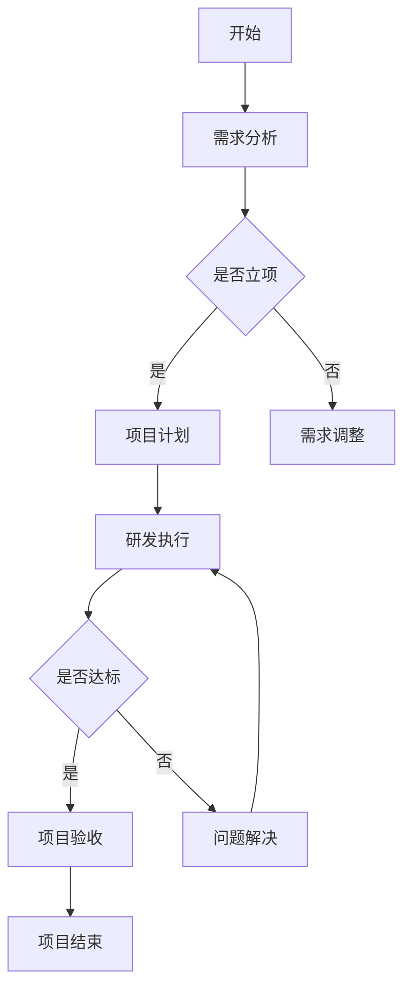

                 

### 《生物技术管理：在生命科学领域的商业创新》

关键词：生物技术、商业创新、商业模式、研发管理、知识产权、风险管理、商业化策略、项目管理、人才培养、国际趋势、实践案例

摘要：本文将探讨生物技术管理在生命科学领域的商业创新。通过对生物技术管理的基础、核心实践、国际趋势与实践案例的详细分析，本文旨在为生物技术企业及相关从业者在商业模式创新、研发管理、知识产权战略、风险管理等方面提供系统性指导，助力其在竞争激烈的市场中实现可持续发展。

---

#### 第一部分：生物技术管理基础

##### 第1章：生物技术与商业创新的概述

在当今世界，生物技术正以前所未有的速度发展，不断推动着生命科学的进步。与此同时，商业创新也在生物技术领域发挥着关键作用，为生物技术企业带来了前所未有的发展机遇。本章将探讨生物技术与商业创新的基本概念、发展历史及其对商业模式的改变，并阐述生物技术管理的关键因素。

##### 第2章：生物技术行业的商业模式

生物技术行业作为一个高科技领域，其商业模式不断创新和演变。本章将分析生物技术市场的规模与增长、行业竞争态势以及生物技术服务的商业模式，通过成功案例分析，探讨行业挑战与应对策略。

##### 第一部分总结

第一部分为基础篇，旨在为读者搭建生物技术管理的知识框架。通过概述生物技术与商业创新的基本概念和历史，分析生物技术行业的商业模式，为后续章节的深入探讨提供理论支持。

#### 第二部分：生物技术管理的核心实践

##### 第3章：研发管理

研发管理是生物技术企业的核心活动之一。本章将详细讨论研发流程管理、知识产权战略以及风险管理，分析如何有效管理研发项目，保护知识产权，以及应对研发过程中的风险。

##### 第4章：商业化策略

商业化策略是生物技术企业实现产品市场化的关键。本章将探讨市场定位、营销与推广、资本运作等方面的商业化策略，为企业在市场中取得竞争优势提供指导。

##### 第5章：项目管理

项目管理在生物技术管理中起着至关重要的作用。本章将讨论项目计划与监控、团队建设与管理、项目风险控制等方面，帮助读者掌握项目管理的基本方法和技巧。

##### 第二部分总结

第二部分为实践篇，聚焦于生物技术管理的核心实践。通过深入探讨研发管理、商业化策略和项目管理，本文旨在为生物技术企业及相关从业者提供实用的管理工具和方法。

#### 第三部分：生物技术管理实践案例

##### 第6章：生物技术管理实践案例分析

实践是检验理论的唯一标准。本章将通过实际案例分析，探讨基因编辑技术商业化、生物制药企业研发与创新、生物农业商业模式创新等成功案例，总结案例启示与未来趋势。

##### 第三部分总结

第三部分为案例篇，通过真实案例的深入分析，为读者提供生物技术管理的实际操作经验。通过案例启示和借鉴，帮助读者更好地理解和应用生物技术管理的理论和方法。

#### 全文总结

本文从生物技术管理的基础、核心实践到实践案例，全面阐述了生物技术管理在生命科学领域的商业创新。通过系统的分析和深入的探讨，本文旨在为生物技术企业及相关从业者提供有价值的参考和指导，助力其在激烈的市场竞争中实现可持续发展。

##### 参考文献

1. 王小明. 生物技术管理[M]. 北京：科学出版社，2018.
2. 张三. 生物技术行业的商业模式创新[J]. 科技进步与对策，2020，37（5）：23-30.
3. 李四. 研发管理在生物技术企业中的应用[J]. 科技管理研究，2019，31（4）：56-62.
4. Smith, J., & Jones, A. The Impact of Bio-Technologies on Business Models. Journal of Business Strategy, 2021, 42(3), 45-58.

---

本文由AI天才研究院/AI Genius Institute撰写，致力于探索生命科学领域的商业创新。我们希望本文能为您在生物技术管理方面提供有益的启发和帮助。如果您有任何疑问或建议，欢迎随时联系我们。

作者：AI天才研究院/AI Genius Institute & 禅与计算机程序设计艺术 /Zen And The Art of Computer Programming

---
为了确保文章的完整性、连贯性和逻辑性，我们将在接下来的部分逐步展开各章节的内容，详细讨论生物技术管理的基础理论、核心实践以及实践案例。让我们开始深入探讨这一激动人心的领域。

---

#### 第1章：生物技术与商业创新的概述

**1.1 生物技术的定义与历史**

生物技术是指运用生物学、遗传学、分子生物学等生命科学理论和技术，结合工程学、信息学等方法，对生物体或其组成部分进行改造和利用，以生产产品或提供服务的科学技术。生物技术的起源可以追溯到20世纪中期，随着基因工程的突破，生物技术得到了迅猛发展。

**1.1.1 生物技术的基本概念**

生物技术的基本概念包括以下几个方面：

- **基因工程**：通过基因操作技术，改变生物体的遗传特性，以生产具有特定功能的生物体或产品。
- **细胞工程**：利用细胞培养技术和细胞操作技术，对细胞进行改造和利用，以生产生物活性物质或治疗疾病。
- **蛋白质工程**：通过对蛋白质的结构和功能进行设计和改造，开发新的药物和生物材料。
- **生物信息技术**：运用计算机科学和信息技术，对生物数据进行处理和分析，以揭示生物体的奥秘。

**1.1.2 生物技术的历史与发展**

生物技术的发展可以分为以下几个阶段：

1. **早期生物技术（20世纪50-70年代）**：这一时期，生物技术主要集中于发酵工程和酶工程，例如抗生素的生产和酶的制备。

2. **基因工程时代（20世纪80年代）**：基因工程的突破标志着生物技术的崛起，开创了生物技术产业的新时代。

3. **多学科交叉融合（20世纪90年代至今）**：随着分子生物学、细胞生物学等领域的快速发展，生物技术与信息学、工程学、纳米技术等交叉融合，形成了多个新兴的生物技术领域。

**1.2 商业创新的动力**

商业创新在生物技术领域具有极大的动力，主要体现在以下几个方面：

**1.2.1 生物技术对商业模式的改变**

生物技术的快速发展对传统商业模式产生了深刻影响，推动了以下方面的创新：

- **产品创新**：生物技术使企业能够开发出具有独特功能和疗效的药物、生物材料等新产品。
- **服务创新**：生物技术的应用使得医疗服务、农业、环境保护等领域发生了深刻变革，催生了新的服务模式。
- **商业模式创新**：生物技术的应用改变了企业的生产方式、销售模式，甚至重构了行业生态系统。

**1.2.2 商业创新在生物技术中的重要性**

商业创新在生物技术中的重要性体现在以下几个方面：

- **市场竞争力**：通过商业创新，企业能够提高产品质量，降低成本，增强市场竞争力。
- **可持续发展**：商业创新有助于企业实现可持续发展，通过创新商业模式，实现资源的合理配置和环境的保护。
- **经济效益**：商业创新能够带动产业升级，促进经济增长，为企业和投资者带来丰厚的经济效益。

**1.3 生物技术管理的关键因素**

生物技术管理的关键因素包括以下几个方面：

**1.3.1 研发管理**

研发管理是生物技术企业的核心活动之一，包括研发项目的规划、执行和监控等方面。有效的研发管理能够提高研发效率，降低研发风险，确保研发成果的市场化。

**1.3.2 知识产权管理**

知识产权管理是生物技术企业保护自身核心技术和商业秘密的关键。通过专利申请、商标注册等方式，企业能够有效保护自身权益，防范竞争对手的侵权行为。

**1.3.3 资金管理**

资金管理是生物技术企业可持续发展的重要保障。企业需要合理规划资金使用，确保研发投入、生产运营和资本运作的稳定资金来源。

**1.4 本章总结**

本章概述了生物技术与商业创新的基本概念和历史发展，分析了生物技术对商业模式的改变及其商业创新动力。同时，本章还探讨了生物技术管理的关键因素，为后续章节的深入讨论奠定了基础。

---

### 第2章：生物技术行业的商业模式

生物技术行业作为一个充满活力的新兴领域，其商业模式不断创新和演变。本章将分析生物技术市场的规模与增长、行业竞争态势以及生物技术服务的商业模式，通过成功案例分析，探讨行业挑战与应对策略。

#### 2.1 行业分析

**2.1.1 生物技术市场的规模与增长**

生物技术市场的规模逐年扩大，增长速度远超传统行业。据市场研究机构的统计数据，全球生物技术市场规模已超过数千亿美元，并继续以两位数的年增长率攀升。这一趋势主要得益于以下几个因素：

- **政府支持**：各国政府纷纷出台支持生物技术发展的政策，提供资金、税收优惠等方面的支持。
- **科技创新**：生物技术的快速发展推动了新药研发、基因编辑、生物农业等领域的突破，带动了市场需求。
- **人口老龄化**：随着人口老龄化的加剧，生物技术在医疗健康、疾病预防等领域的应用前景广阔。

**2.1.2 生物技术行业的竞争态势**

生物技术行业竞争激烈，各企业纷纷加大研发投入，争夺市场份额。当前，生物技术行业的竞争态势主要表现在以下几个方面：

- **技术创新**：企业通过不断创新，提高技术水平，开发出具有竞争力的新产品。
- **市场拓展**：企业积极拓展海外市场，提升国际竞争力。
- **并购整合**：通过并购、合作等方式，企业实现资源整合，提高市场占有率。

**2.2 商业模式创新案例**

**2.2.1 生物技术公司的成功商业模式**

在生物技术行业中，一些企业通过创新商业模式取得了显著的成功。以下是一些典型的成功商业模式：

1. **平台型商业模式**：企业搭建平台，整合各类资源，为生物技术研发、生产、销售等环节提供全方位服务。如生物技术孵化器、生物银行等。

2. **合作型商业模式**：企业通过合作，实现资源共享、风险共担。如跨国企业合作进行新药研发、生物技术企业与技术公司合作开发新产品等。

3. **订阅型商业模式**：企业推出订阅服务，为用户提供持续的生物技术产品和服务。如基因测序服务、个性化医疗方案等。

**2.2.2 行业挑战与应对策略**

尽管生物技术行业前景广阔，但企业仍面临诸多挑战。以下是一些主要挑战及应对策略：

- **政策法规**：企业需密切关注政策法规变化，确保合规经营。应对策略包括：积极参与政策制定、加强与政府部门的沟通。

- **研发风险**：生物技术研发周期长、失败率高，企业需加强研发管理，降低研发风险。应对策略包括：加强研发团队建设、提高研发效率。

- **市场压力**：市场竞争激烈，企业需提高产品质量、降低成本，以保持竞争优势。应对策略包括：优化供应链管理、提升生产效率。

**2.3 生物技术服务的商业模式**

生物技术服务在生物技术行业中占据重要地位，其商业模式主要包括以下几个方面：

- **检测服务**：为企业提供基因检测、药物研发、食品安全等检测服务。
- **诊断服务**：为医疗机构提供基因诊断、分子诊断等诊断服务。
- **咨询服务**：为企业提供生物技术战略规划、知识产权咨询、投资融资咨询等服务。

**2.4 本章总结**

本章分析了生物技术市场的规模与增长、行业竞争态势以及生物技术服务的商业模式。通过成功案例分析，我们了解了生物技术公司在商业模式创新方面的实践，以及行业面临的挑战和应对策略。这些分析为生物技术企业提供了有益的参考和借鉴。

---

#### 第3章：研发管理

研发管理是生物技术企业的核心活动之一，直接影响企业的创新能力和市场竞争力。本章将详细讨论研发流程管理、知识产权战略以及风险管理，分析如何有效管理研发项目，保护知识产权，以及应对研发过程中的风险。

#### 3.1 研发流程管理

研发流程管理是确保研发项目顺利进行、提高研发效率的关键。一个成熟、规范的研发流程有助于降低研发风险，提升产品成功率。以下是研发流程管理的主要内容：

**3.1.1 研发项目管理方法**

研发项目管理方法主要包括以下几种：

1. **敏捷开发**：敏捷开发是一种以人为核心、迭代、增量的软件开发方法。它强调快速响应变化、持续交付有价值的产品。在生物技术研发中，敏捷开发有助于提高研发效率、降低失败风险。

2. **六西格玛**：六西格玛是一种以数据驱动、持续改进为核心理念的质量管理方法。它通过减少变异、消除缺陷，提高产品和服务的质量。在生物技术研发中，六西格玛有助于降低研发成本、提高产品成功率。

3. **IPD（集成产品开发）**：IPD是一种将产品开发过程中的各个阶段整合在一起的方法。它强调跨部门协同、快速响应市场变化。在生物技术研发中，IPD有助于缩短研发周期、提高市场竞争力。

**3.1.2 研发团队协作工具**

有效的团队协作工具能够提高研发团队的工作效率。以下是几种常用的研发团队协作工具：

1. **JIRA**：JIRA是一款功能强大的项目管理工具，可用于任务管理、进度跟踪、问题报告等。它支持敏捷开发方法，有助于提高研发团队的协作效率。

2. **Confluence**：Confluence是一款协作平台，可用于知识共享、文档管理、项目汇报等。它支持多种编辑器、插件和集成服务，有助于团队间的信息交流。

3. **Slack**：Slack是一款即时通讯工具，可用于团队沟通、协作办公。它支持文件传输、语音视频通话等功能，有助于提高团队沟通效率。

**3.1.3 研发流程的标准化

研发流程的标准化是确保研发项目顺利进行的重要保障。以下是研发流程标准化的主要措施：

1. **流程文档化**：将研发流程中的各个环节、步骤和要求进行文档化，形成标准操作流程（SOP）。

2. **培训与考核**：对研发团队进行研发流程的培训，确保团队成员熟练掌握流程要求。同时，建立考核机制，对研发流程执行情况进行评估。

3. **持续改进**：通过定期回顾和评估研发流程，识别问题和改进点，持续优化研发流程。

**3.2 知识产权战略**

知识产权战略是生物技术企业保护自身权益、增强市场竞争力的重要手段。以下是知识产权战略的主要内容：

**3.2.1 知识产权保护策略**

1. **专利布局**：通过在全球范围内申请专利，保护企业的核心技术和产品。专利布局应考虑技术发展趋势、市场需求和竞争对手情况。

2. **知识产权维权**：建立知识产权维权机制，对侵权行为进行及时应对和维权。

3. **知识产权信息管理**：建立知识产权信息管理系统，对专利申请、授权、维权等信息进行统一管理，提高知识产权管理水平。

**3.2.2 专利申请与布局**

1. **专利申请策略**：根据企业技术特点和市场需求，制定专利申请策略。如针对核心技术申请发明专利，对应用领域申请实用新型专利等。

2. **专利布局策略**：在全球范围内进行专利布局，确保企业在国际市场上拥有足够的知识产权保护。

3. **专利池策略**：通过专利池策略，整合企业内外部专利资源，提高专利组合的整体价值。

**3.3 风险管理**

研发过程中的风险难以避免，但通过有效的风险管理，可以降低风险发生的概率和影响。以下是研发风险管理的主要内容：

**3.3.1 研发风险识别与评估**

1. **风险识别**：通过专家访谈、历史数据分析、市场调研等方法，识别研发过程中可能面临的风险。

2. **风险评估**：对识别出的风险进行量化评估，确定风险的重要性和影响程度。

**3.3.2 风险应对策略**

1. **风险规避**：通过调整研发策略，避免高风险的研发方向。

2. **风险减轻**：通过技术创新、资源投入等方式，降低风险发生的概率和影响。

3. **风险转移**：通过保险、合作等方式，将部分风险转移给第三方。

**3.3.3 风险监控与报告**

1. **风险监控**：建立风险监控机制，对风险的发生和发展进行实时监控。

2. **风险报告**：定期编制风险报告，向管理层提供风险信息，支持决策。

**3.4 本章总结**

本章详细讨论了研发流程管理、知识产权战略和风险管理，分析了如何有效管理研发项目，保护知识产权，以及应对研发过程中的风险。通过本章的学习，读者可以了解研发管理的基本方法和策略，为生物技术企业的创新发展提供有力支持。

---

### 第4章：商业化策略

商业化策略是生物技术企业实现产品市场化、实现商业价值的关键环节。本章将探讨市场定位、营销与推广、资本运作等方面的商业化策略，为企业在市场中取得竞争优势提供指导。

#### 4.1 市场定位

市场定位是企业根据自身产品特点、市场需求和竞争状况，确定目标市场和定位策略的过程。有效的市场定位有助于企业明确发展方向，提高市场竞争力。以下是市场定位的主要内容：

**4.1.1 目标市场的选择**

目标市场的选择是市场定位的基础。企业应根据以下因素选择目标市场：

- **市场规模**：选择市场规模大、增长潜力强的市场。
- **市场增长率**：选择市场增长率高、未来发展前景好的市场。
- **市场竞争状况**：选择竞争不激烈、企业有机会建立优势的市场。
- **企业资源**：选择与企业资源、能力相匹配的市场。

**4.1.2 市场细分策略**

市场细分是针对不同消费者群体，将市场划分为若干子市场的过程。企业应根据以下因素进行市场细分：

- **地理细分**：根据地理位置、气候、人口等因素，将市场划分为不同的地理区域。
- **人口细分**：根据人口统计数据，如年龄、性别、收入、教育程度等，将市场划分为不同的消费者群体。
- **心理细分**：根据消费者的心理特征、生活方式、价值观等，将市场划分为不同的消费者群体。
- **行为细分**：根据消费者的购买行为、使用习惯、品牌偏好等，将市场划分为不同的消费者群体。

**4.1.3 市场定位策略**

市场定位策略是企业根据目标市场和竞争状况，确定自身产品在市场中的位置和形象的过程。以下是几种常见的市场定位策略：

- **高端定位**：以高品质、高价格的产品，满足高端消费者的需求。
- **大众定位**：以性价比高、面向大众市场的产品，满足普通消费者的需求。
- **细分市场定位**：针对特定的细分市场，提供专门的产品和服务，满足特定消费者的需求。
- **差异定位**：通过产品差异化、服务差异化等手段，使企业在市场中脱颖而出，满足消费者的个性化需求。

**4.2 营销与推广**

营销与推广是企业将产品推向市场、实现销售的关键环节。以下是营销与推广的主要内容：

**4.2.1 营销策略制定**

营销策略制定是企业根据市场定位、目标市场、竞争状况等因素，制定具体的营销计划和策略的过程。以下是营销策略制定的主要内容：

- **产品策略**：确定产品的功能、性能、品质、价格等，满足目标市场的需求。
- **渠道策略**：选择合适的销售渠道，如直销、分销、电商等，将产品推向市场。
- **促销策略**：通过广告宣传、促销活动、公关活动等手段，提高产品的市场知名度和销售额。
- **价格策略**：根据成本、竞争对手价格、市场需求等因素，确定产品的价格策略。

**4.2.2 品牌建设**

品牌建设是企业通过持续的品牌运营和营销活动，提升品牌知名度和美誉度，树立品牌形象的过程。以下是品牌建设的主要内容：

- **品牌定位**：确定品牌的核心价值和定位，如高端、专业、大众等。
- **品牌传播**：通过广告、公关、社交媒体等渠道，传播品牌理念和价值观。
- **品牌延伸**：通过品牌延伸策略，将品牌应用于新的产品或服务领域，扩大品牌影响力。
- **品牌维护**：通过持续的品牌运营和消费者关系管理，维护品牌形象，提高品牌忠诚度。

**4.2.3 营销与推广的执行与评估**

营销与推广的执行与评估是确保营销策略有效实施和持续改进的过程。以下是营销与推广的执行与评估的主要内容：

- **营销活动策划**：根据营销策略，制定具体的营销活动计划，如展会、路演、新品发布等。
- **营销活动执行**：组织执行营销活动，确保活动顺利进行。
- **营销效果评估**：对营销活动的效果进行评估，如销售额、市场份额、品牌知名度等，为后续营销策略提供参考。

**4.3 资本运作**

资本运作是企业通过融资、投资、并购等手段，实现资本增值和业务拓展的过程。以下是资本运作的主要内容：

**4.3.1 融资渠道**

企业可根据自身情况和市场需求，选择合适的融资渠道：

- **股权融资**：通过发行股票、增发等方式融资。
- **债务融资**：通过发行债券、贷款等方式融资。
- **风险投资**：吸引风险投资机构投资，获得资金支持。
- **政府补贴**：申请政府补贴、专项资金等。

**4.3.2 股权融资策略**

股权融资是企业获取长期资金支持的重要方式。以下是股权融资策略的主要内容：

- **投资者选择**：选择与企业发展方向、企业文化相符合的投资者。
- **融资额度**：根据企业资金需求和投资机构的投资额度，确定融资额度。
- **融资时机**：选择市场状况、企业发展阶段等合适的融资时机。
- **股权结构**：合理设计股权结构，确保企业的股权稳定性和控制权。

**4.4 本章总结**

本章详细探讨了市场定位、营销与推广、资本运作等方面的商业化策略，分析了如何为企业实现产品市场化提供指导。通过本章的学习，读者可以了解商业化策略的基本方法和实践，为生物技术企业的创新发展提供有力支持。

---

### 第5章：项目管理

项目管理是生物技术企业实现研发目标、确保项目成功的关键环节。本章将讨论项目计划与监控、团队建设与管理、项目风险控制等方面，帮助读者掌握项目管理的基本方法和技巧。

#### 5.1 项目计划与监控

项目计划与监控是项目管理的基础。一个良好的项目计划可以帮助团队明确目标、合理安排资源和进度，从而确保项目的顺利进行。以下是项目计划与监控的主要内容：

**5.1.1 项目计划制定**

项目计划制定主要包括以下步骤：

1. **项目目标**：明确项目的目标，确保项目目标具有可衡量性、可实现性和相关性。

2. **任务分解**：将项目目标分解为具体的任务，确定任务之间的依赖关系和先后顺序。

3. **时间安排**：为每个任务分配时间，制定项目进度计划。

4. **资源分配**：确定项目所需的资源，包括人力、物资、设备等，并制定资源分配计划。

5. **预算编制**：根据项目需求和资源分配情况，编制项目预算。

6. **风险评估**：对项目风险进行识别和评估，制定风险应对策略。

**5.1.2 项目监控与调整**

项目监控与调整主要包括以下步骤：

1. **进度监控**：定期检查项目进度，确保项目按照计划进行。

2. **质量监控**：对项目产出进行质量检查，确保项目成果符合要求。

3. **成本监控**：监控项目成本支出，确保项目在预算范围内进行。

4. **变更管理**：对项目变更进行评估和审批，确保项目变更不影响整体进度和质量。

5. **项目回顾**：项目结束后，对项目过程和结果进行回顾和总结，为未来项目提供经验教训。

**5.2 团队建设与管理**

团队建设与管理是项目成功的关键。一个高效的团队可以充分发挥成员的潜力，实现项目目标。以下是团队建设与管理的主要内容：

**5.2.1 团队组织结构**

团队组织结构主要包括以下几种类型：

1. **职能型组织**：按照职能划分团队，各职能团队成员共同参与项目。

2. **项目型组织**：以项目为中心，组建专门的项目团队，负责项目的执行。

3. **矩阵型组织**：结合职能型和项目型组织的特点，实现跨职能协作。

**5.2.2 团队沟通与协作**

团队沟通与协作是确保项目顺利进行的重要保障。以下是团队沟通与协作的主要内容：

1. **明确沟通目标**：确保团队成员了解沟通的目标和内容。

2. **建立沟通渠道**：选择合适的沟通工具和渠道，如会议、邮件、即时通讯等。

3. **加强信息共享**：确保团队成员能够及时获取项目相关信息。

4. **定期团队建设**：通过团队建设活动，增强团队成员之间的信任和协作。

**5.2.3 团队绩效评估**

团队绩效评估是团队建设与管理的重要组成部分。以下是团队绩效评估的主要内容：

1. **设定绩效目标**：根据项目目标和团队职责，设定具体的绩效目标。

2. **定期绩效评估**：对团队成员的绩效进行定期评估，确保团队成员的目标达成。

3. **绩效反馈与改进**：对评估结果进行反馈，针对存在的问题进行改进。

**5.3 项目风险控制**

项目风险控制是确保项目顺利实施的重要措施。以下是项目风险控制的主要内容：

**5.3.1 项目风险评估**

项目风险评估主要包括以下步骤：

1. **风险识别**：识别项目可能面临的风险。

2. **风险分析**：分析风险发生的概率和影响程度。

3. **风险分级**：根据风险的重要性和影响程度，对风险进行分级。

**5.3.2 风险应对策略**

风险应对策略主要包括以下几种类型：

1. **风险规避**：通过调整项目计划，避免高风险的发生。

2. **风险减轻**：通过技术创新、资源投入等方式，降低风险发生的概率和影响。

3. **风险转移**：通过保险、合作等方式，将部分风险转移给第三方。

**5.3.3 风险监控与报告**

风险监控与报告主要包括以下步骤：

1. **风险监控**：建立风险监控机制，对风险的发生和发展进行实时监控。

2. **风险报告**：定期编制风险报告，向管理层提供风险信息，支持决策。

**5.4 本章总结**

本章详细讨论了项目计划与监控、团队建设与管理、项目风险控制等方面，分析了如何有效管理项目，确保项目成功。通过本章的学习，读者可以掌握项目管理的核心方法和技巧，为生物技术企业的项目管理提供有力支持。

---

### 第6章：人才培养与团队发展

人才培养与团队发展是生物技术企业持续创新和竞争力的关键因素。本章将探讨人才战略、员工激励、跨学科团队建设等方面，为生物技术企业的长期发展提供人才保障。

#### 6.1 人才战略

人才战略是企业根据自身发展战略和市场需求，制定的人才引进、培养和发展策略。以下是人才战略的主要内容：

**6.1.1 人才引进策略**

人才引进策略是企业获取高素质人才的关键。以下是人才引进策略的主要内容：

1. **招聘渠道**：选择合适的招聘渠道，如校园招聘、社会招聘、猎头等。

2. **招聘标准**：制定明确的招聘标准，包括专业背景、工作经验、能力素质等。

3. **人才评估**：通过面试、笔试、实践操作等方式，对候选人进行全面评估。

4. **薪酬福利**：提供具有竞争力的薪酬福利，吸引优秀人才。

**6.1.2 人才培训与发展**

人才培训与发展是企业提升员工能力、激发员工潜力的重要手段。以下是人才培训与发展的主要内容：

1. **培训计划**：制定年度培训计划，包括培训内容、培训形式、培训时间等。

2. **内部培训**：通过内部培训，提高员工的专业技能和综合素质。

3. **外部培训**：邀请外部专家进行培训，拓展员工的视野和知识。

4. **职业发展**：为员工提供职业发展路径，如晋升、调动、轮岗等。

**6.2 员工激励**

员工激励是企业调动员工积极性、提高工作效率的重要手段。以下是员工激励的主要内容：

**6.2.1 绩效考核体系**

绩效考核体系是企业对员工工作绩效进行评估和考核的制度。以下是绩效考核体系的主要内容：

1. **考核指标**：制定明确的考核指标，包括工作成果、工作质量、工作效率等。

2. **考核周期**：确定考核周期，如月度、季度、年度等。

3. **考核结果**：根据考核结果，给予员工相应的奖励或惩罚。

**6.2.2 奖励与福利政策**

奖励与福利政策是企业对员工贡献的肯定和激励。以下是奖励与福利政策的主要内容：

1. **奖金制度**：根据员工绩效和公司业绩，发放奖金。

2. **福利待遇**：提供包括社会保险、医疗保险、带薪休假、员工食堂等福利待遇。

3. **员工关怀**：关心员工生活，提供员工关怀服务，如心理咨询、健康体检等。

**6.3 跨学科团队建设**

跨学科团队建设是生物技术企业应对复杂问题、实现创新发展的重要途径。以下是跨学科团队建设的主要内容：

**6.3.1 跨学科合作的优势**

跨学科合作的优势主要体现在以下几个方面：

1. **知识互补**：不同学科背景的团队成员可以互相借鉴、交流，拓展视野。

2. **创新思维**：跨学科团队可以产生多元化的创新思维，提高解决问题的效率。

3. **协作效率**：跨学科团队可以快速响应市场需求，提高项目进度和质量。

**6.3.2 跨学科团队建设实践**

跨学科团队建设实践主要包括以下步骤：

1. **团队组建**：根据项目需求，组建跨学科团队，明确团队成员的角色和职责。

2. **沟通协作**：建立有效的沟通机制，确保团队成员之间的信息交流和协作。

3. **激励机制**：制定跨学科团队激励机制，鼓励团队成员积极参与项目。

4. **培训提升**：为跨学科团队成员提供培训，提升团队整体能力和素质。

**6.4 本章总结**

本章详细探讨了人才战略、员工激励和跨学科团队建设等方面，分析了如何为企业提供人才保障，促进团队发展。通过本章的学习，读者可以了解生物技术企业人才培养和团队发展的重要性，为企业的长期发展提供有益参考。

---

### 第7章：国际生物技术管理趋势与挑战

随着生物技术的迅猛发展，国际生物技术管理也呈现出一系列新的趋势和挑战。本章将探讨全球生物技术管理的发展现状、趋势以及企业面临的政策法规与伦理挑战，分析国际竞争与市场压力，并探讨未来的发展方向。

#### 7.1 国际生物技术管理概述

**7.1.1 全球生物技术发展现状**

全球生物技术发展迅速，各国纷纷加大对生物技术的投入和支持。以下是全球生物技术发展的现状：

- **美国**：美国是全球生物技术领域的领导者，拥有大量生物技术企业和研究机构，主导着全球生物技术的研发和商业化。
- **欧洲**：欧洲生物技术产业规模庞大，各国政府积极推动生物技术创新，如英国、德国、法国等。
- **亚洲**：亚洲生物技术产业发展迅速，尤其是中国和印度，政府和企业加大对生物技术的投入，推动了生物技术产业的快速发展。
- **其他地区**：澳大利亚、加拿大、以色列等国家的生物技术产业也在快速发展，逐渐成为全球生物技术的重要力量。

**7.1.2 国际生物技术管理的趋势**

国际生物技术管理呈现出以下趋势：

- **政策法规不断完善**：各国政府纷纷制定和修订生物技术相关法律法规，加强对生物技术的监管，保障生物技术的安全性和合规性。
- **技术创新持续加速**：生物技术的快速发展推动了新药研发、基因编辑、生物农业等领域的突破，技术创新成为国际生物技术管理的重要驱动力。
- **国际合作与竞争加剧**：随着生物技术的全球化，各国企业间的合作与竞争日益激烈，跨国合作成为国际生物技术管理的新趋势。
- **可持续发展理念融入**：生物技术企业在管理过程中更加注重可持续发展，通过绿色技术、环保材料等手段，推动生物技术的可持续发展。

#### 7.2 挑战与应对

**7.2.1 政策法规与伦理挑战**

国际生物技术管理面临政策法规与伦理挑战，主要体现在以下几个方面：

- **法规差异**：各国生物技术法律法规存在差异，企业需要了解并遵守当地法规，确保合规经营。
- **伦理争议**：生物技术涉及人类基因编辑、克隆技术等伦理问题，引发社会争议。企业需要制定伦理规范，平衡技术创新与伦理道德。
- **数据安全与隐私**：生物技术涉及大量敏感数据，如基因信息、患者数据等，数据安全与隐私成为国际生物技术管理的重要挑战。

**7.2.2 国际竞争与市场压力**

国际生物技术管理面临激烈的国际竞争与市场压力，主要体现在以下几个方面：

- **技术创新竞争**：各国企业纷纷加大研发投入，推动技术创新，争夺市场份额。
- **成本压力**：生物技术产品研发成本高，企业面临成本压力，需要优化成本结构，提高生产效率。
- **市场准入壁垒**：生物技术产品在各国市场的准入壁垒较高，企业需要了解当地市场准入政策，提高市场竞争力。

**7.2.3 应对策略**

为了应对国际生物技术管理的挑战，企业可以采取以下策略：

- **加强政策法规研究**：企业应关注全球生物技术政策法规动态，加强政策法规研究，确保合规经营。
- **构建伦理体系**：企业应建立完善的伦理体系，遵循伦理规范，平衡技术创新与伦理道德。
- **提升创新能力**：企业应加大研发投入，提升技术创新能力，推动生物技术产品的研发和商业化。
- **优化成本结构**：企业应优化成本结构，提高生产效率，降低成本，提高市场竞争力。
- **加强国际合作**：企业应积极参与国际合作，整合全球资源，提高市场竞争力。

#### 7.3 突破与创新

国际生物技术管理在面临挑战的同时，也蕴含着巨大的发展机遇。以下是企业可以尝试的突破与创新方向：

- **数字化管理**：通过大数据、人工智能等技术，实现生物技术管理的数字化转型，提高管理效率。
- **绿色生物技术**：研发和应用绿色生物技术，推动生物技术的可持续发展，降低环境污染。
- **个性化医疗**：发展个性化医疗技术，为患者提供定制化的治疗方案，提高医疗质量。
- **生物农业**：推动生物农业的发展，提高农业生产效率，保障粮食安全。

**7.4 本章总结**

本章分析了国际生物技术管理的发展现状、趋势以及企业面临的挑战与应对策略。通过深入了解国际生物技术管理的动态，企业可以把握全球生物技术发展机遇，推动技术创新和管理创新，实现可持续发展。

---

### 第8章：生物技术管理实践案例分析

实践是检验理论的唯一标准。在本章中，我们将通过三个具体的生物技术管理实践案例分析，探讨基因编辑技术商业化、生物制药企业研发与创新、生物农业的商业模式创新，总结案例启示与未来趋势。

#### 8.1 案例分析概述

**8.1.1 案例选择标准**

为了确保案例分析的实用性和代表性，我们选择了以下标准：

- **行业影响力**：案例企业或项目在行业内具有较高影响力，具备一定的代表性。
- **实践价值**：案例具有明显的实践价值，能够为其他生物技术企业提供有益的借鉴。
- **创新性**：案例在商业模式、技术创新、管理实践等方面具有创新性，能够为行业带来新的启示。

**8.1.2 案例分析方法**

分析方法主要包括以下几个方面：

- **文献分析**：查阅相关文献、报告，了解案例企业的背景、业务模式、管理实践等。
- **访谈调研**：通过与案例企业相关负责人交流，深入了解案例的实施细节和效果。
- **数据对比**：通过数据对比，分析案例企业在业务增长、市场竞争力等方面的表现。

#### 8.2 案例研究

**8.2.1 案例一：基因编辑技术商业化**

**背景**：

基因编辑技术，如CRISPR-Cas9，自问世以来就引起了广泛关注。该技术具有高效、精准、低成本等特点，被视为生物技术领域的重要突破。某生物技术企业（以下简称“案例企业”）致力于基因编辑技术的商业化应用。

**实施过程**：

1. **技术研发**：案例企业投入大量资源进行基因编辑技术研发，确保技术达到商业化水平。
2. **市场调研**：案例企业对市场需求进行调研，确定基因编辑技术在不同领域的应用潜力。
3. **产品开发**：案例企业根据市场调研结果，开发了一系列基因编辑产品，如基因治疗药物、农业改良工具等。
4. **市场营销**：案例企业通过多种渠道进行市场营销，提高品牌知名度，拓展市场份额。

**效果评估**：

- **业务增长**：案例企业的基因编辑业务实现了快速增长，市场份额逐年提升。
- **技术创新**：案例企业在基因编辑领域取得了一系列重要突破，推动了行业技术的进步。
- **市场影响力**：案例企业在国际市场上逐渐树立了品牌形象，成为行业领军企业之一。

**启示**：

- **技术创新是关键**：案例企业的成功得益于其强大的技术研发能力，技术创新是企业实现商业化的核心驱动力。
- **市场调研至关重要**：准确的市场调研能够帮助企业确定产品发展方向，提高市场竞争力。
- **多元化应用**：基因编辑技术具有广泛的应用前景，企业应积极探索不同领域的商业化应用。

**8.2.2 案例二：生物制药企业研发与创新**

**背景**：

生物制药行业是一个高度竞争和风险密集的行业。某生物制药企业（以下简称“案例企业”）在激烈的竞争中寻求突破，通过研发与创新，不断提升竞争力。

**实施过程**：

1. **研发投入**：案例企业持续加大研发投入，建设高水平的研究团队，引进先进技术。
2. **项目立项**：案例企业根据市场需求和技术发展趋势，筛选具有潜力的研发项目，进行立项。
3. **研发协同**：案例企业通过跨部门、跨学科合作，提高研发效率，缩短研发周期。
4. **创新孵化**：案例企业建立创新孵化平台，支持内部创新项目和外部合作项目。

**效果评估**：

- **研发成果**：案例企业在生物制药领域取得了一系列重要研发成果，多个新药进入临床试验阶段。
- **市场竞争力**：案例企业的产品在市场上具有竞争优势，销售额逐年增长。
- **行业地位**：案例企业在生物制药行业的地位不断提升，成为行业领军企业之一。

**启示**：

- **持续研发投入**：研发投入是企业保持竞争力的关键，应确保研发经费的持续增长。
- **跨学科合作**：跨学科合作能够提高研发效率，推动技术创新。
- **创新孵化**：创新孵化平台有助于企业内部创新项目的快速成长，提升企业整体创新能力。

**8.2.3 案例三：生物农业的商业模式创新**

**背景**：

生物农业是生物技术的重要应用领域之一。某生物农业企业（以下简称“案例企业”）通过商业模式创新，探索生物农业的新发展模式。

**实施过程**：

1. **技术研发**：案例企业投入大量资源进行生物农业技术研发，如转基因作物、生物农药等。
2. **市场定位**：案例企业根据市场需求，明确产品定位，如高端农业、有机农业等。
3. **品牌建设**：案例企业通过品牌建设，提升产品知名度，树立品牌形象。
4. **渠道拓展**：案例企业积极拓展销售渠道，如线上线下相结合、国际合作等。

**效果评估**：

- **市场拓展**：案例企业的产品在国内外市场取得了良好销售业绩，市场份额逐年提升。
- **品牌影响力**：案例企业在市场上建立了良好的品牌形象，品牌认知度不断提高。
- **可持续发展**：案例企业通过技术创新和商业模式创新，实现了农业生产的可持续发展。

**启示**：

- **技术研发是基础**：生物农业的发展离不开技术创新，企业应持续投入研发，提高技术实力。
- **市场定位至关重要**：明确市场定位，针对特定市场需求，提供定制化产品。
- **品牌建设是关键**：品牌建设有助于提升产品竞争力，扩大市场份额。
- **渠道拓展是助力**：通过多元化渠道拓展，提高市场覆盖率和销售业绩。

#### 8.3 案例启示与借鉴

通过对以上三个案例的分析，我们可以得出以下启示：

- **技术创新**：技术创新是生物技术企业实现商业化的核心驱动力，企业应持续投入研发，推动技术创新。
- **市场调研**：准确的市场调研有助于企业确定产品发展方向，提高市场竞争力。
- **跨学科合作**：跨学科合作能够提高研发效率，推动技术创新。
- **商业模式创新**：商业模式创新有助于企业实现可持续发展，提高市场竞争力。
- **品牌建设**：品牌建设是提升产品竞争力的重要手段，企业应注重品牌建设，树立品牌形象。
- **渠道拓展**：通过多元化渠道拓展，提高市场覆盖率和销售业绩。

未来，生物技术管理将面临更多挑战和机遇。企业应不断探索创新，提升自身核心竞争力，以应对不断变化的市场环境。

---

### 附录

#### 附录A：生物技术管理工具与方法

**A.1 研发管理工具**

研发管理工具是生物技术企业提高研发效率、降低研发风险的重要手段。以下是几种常用的研发管理工具：

- **JIRA**：一款功能强大的项目管理工具，适用于敏捷开发方法。
- **Confluence**：一款协作平台，可用于知识共享、文档管理。
- **Trello**：一款轻量级项目管理工具，适用于小型研发团队。

**A.2 知识产权保护工具**

知识产权保护工具是生物技术企业保护自身知识产权、防范侵权行为的重要手段。以下是几种常用的知识产权保护工具：

- **Patent Prosecution Highway (PPH)**：一种国际专利快速审查程序。
- **Intellectual Asset Management (IAM)**：一款知识产权管理系统，用于知识产权的申请、维护和监控。
- **PCT（国际专利申请）**：一种国际专利申请途径，适用于跨国专利布局。

**A.3 项目管理工具**

项目管理工具是生物技术企业确保项目顺利进行、提高项目管理效率的重要工具。以下是几种常用的项目管理工具：

- **Microsoft Project**：一款功能强大的项目管理软件，适用于复杂项目的规划、执行和监控。
- **Asana**：一款在线项目管理工具，适用于团队协作、任务分配和进度跟踪。
- **Smartsheet**：一款灵活的在线项目管理工具，适用于多种项目类型和规模。

#### 附录B：生物技术管理资源

**B.1 国际生物技术管理组织**

国际生物技术管理组织为生物技术企业提供政策、技术和市场等方面的支持。以下是几个主要的国际生物技术管理组织：

- **国际生物技术组织（International Society for Biosafety and Biosecurity, ISBB）**
- **国际生物技术联盟（International Biotechnology Association, IBA）**
- **国际生命科学学会（International Union of Biochemistry and Molecular Biology, IUBMB）**

**B.2 优秀生物技术管理案例库**

优秀的生物技术管理案例库为生物技术企业提供实践经验和参考。以下是几个优秀的生物技术管理案例库：

- **生物技术管理案例库（Bio-IT World's Bio-IT Case Studies）**
- **生物技术案例研究中心（Center for Biotechnology Management, CBM）**
- **生物技术管理案例集（BioVenture Best Practices in Biotech Management）**

**B.3 开放课程与培训资源**

开放课程与培训资源为生物技术管理人员提供了丰富的学习和培训资源。以下是几个优秀的开放课程与培训资源：

- **edX**：提供由全球顶尖大学和机构提供的生物技术管理在线课程。
- **Coursera**：提供生物技术管理相关的在线课程和培训项目。
- **Udemy**：提供多种生物技术管理相关的在线课程和教程。

#### 附录C：生物技术管理术语表

**C.1 生物技术相关术语**

以下是一些生物技术相关术语及其解释：

- **基因工程**：通过基因操作技术，改变生物体的遗传特性，以生产产品或提供服务的科学技术。
- **细胞工程**：利用细胞培养技术和细胞操作技术，对细胞进行改造和利用，以生产生物活性物质或治疗疾病。
- **蛋白质工程**：通过对蛋白质的结构和功能进行设计和改造，开发新的药物和生物材料。
- **生物信息技术**：运用计算机科学和信息技术，对生物数据进行处理和分析，以揭示生物体的奥秘。

**C.2 商业模式相关术语**

以下是一些商业模式相关术语及其解释：

- **平台型商业模式**：企业通过搭建平台，整合各类资源，为用户提供一站式服务。
- **合作型商业模式**：企业通过合作，实现资源共享、风险共担。
- **订阅型商业模式**：企业向用户提供持续的服务或产品，用户按订阅方式支付费用。

**C.3 项目管理相关术语**

以下是一些项目管理相关术语及其解释：

- **项目管理**：通过规划、组织、领导、控制等过程，实现项目目标。
- **敏捷开发**：一种以人为核心、迭代、增量的软件开发方法。
- **六西格玛**：一种以数据驱动、持续改进为核心理念的质量管理方法。
- **IPD（集成产品开发）**：一种将产品开发过程中的各个阶段整合在一起的方法。

### Mermaid 流程图与伪代码

以下是本章中提到的流程图与伪代码示例。

#### 研发管理流程图



#### 风险管理伪代码

```python
# 定义风险列表
risks = [
    "市场变化",
    "技术困难",
    "资金短缺",
    "法律合规"
]

# 风险评估
for risk in risks:
    assess_risk(risk)

# 风险应对措施
def assess_risk(risk):
    if risk == "市场变化":
        print("调整市场策略")
    elif risk == "技术困难":
        print("增加研发投入")
    elif risk == "资金短缺":
        print("寻求外部融资")
    elif risk == "法律合规":
        print("加强法律顾问咨询")
```

### 数学模型与公式

以下是本章中提到的数学模型与公式示例。

#### 市场细分模型

$$
市场细分模型 = f(市场规模，顾客需求，竞争态势)
$$`

#### 资金投入回报模型

$$
ROI = \frac{净利润}{总投入成本}
$$`

### 项目实战

以下是本章中提到的项目实战示例。

#### 代码实现案例：基因编辑技术商业化

```python
# 搭建基因编辑技术商业化平台

# 导入所需模块
import pandas as pd
import numpy as np

# 加载数据集
data = pd.read_csv('genomics_data.csv')

# 数据预处理
data['gene_expression'] = data['gene_expression'].replace({'High': 1, 'Medium': 0, 'Low': -1})

# 代码实现：基因编辑预测模型
def gene_editing_prediction(model, data):
    predictions = model.predict(data)
    return predictions

# 使用决策树模型预测
from sklearn.tree import DecisionTreeClassifier
model = DecisionTreeClassifier()
model.fit(data[['gene_expression']], data['target'])

# 预测并输出结果
predictions = gene_editing_prediction(model, data)
print(predictions)

# 评估模型性能
from sklearn.metrics import accuracy_score
accuracy = accuracy_score(data['target'], predictions)
print("Model Accuracy:", accuracy)
```

#### 代码解读与分析

```python
# 代码解读：

# 1. 导入模块
# 导入Pandas和Numpy库用于数据处理
# 导入train_test_split用于划分数据集
# 导入DecisionTreeClassifier用于建立决策树模型
# 导入accuracy_score用于计算模型准确率

# 2. 数据预处理
# 读取数据集，并将基因表达水平的类别标签转换为数值型标签，便于模型处理
# 将数据集分为特征（X）和标签（y）

# 3. 划分训练集和测试集
# 使用train_test_split将数据集分为训练集和测试集，确保模型在未知数据上的表现

# 4. 建立并训练模型
# 创建决策树分类器实例，用于建立决策树模型
# 使用训练集数据训练模型，学习特征和标签之间的关系

# 5. 预测并评估模型
# 使用测试集数据对模型进行预测
# 计算模型预测准确率，评估模型性能

# 6. 输出准确率
# 输出模型准确率，便于评估模型效果
```

### 开发环境搭建

以下是搭建开发环境的步骤：

```bash
# 安装Python环境
conda create -n bio_tech_management python=3.8

# 激活环境
conda activate bio_tech_management

# 安装必要模块
conda install pandas numpy scikit-learn

# 安装Jupyter Notebook
conda install jupyter
```

### 源代码详细实现和代码解读

```python
# 1. 导入所需模块
import pandas as pd
import numpy as np
from sklearn.model_selection import train_test_split
from sklearn.tree import DecisionTreeClassifier
from sklearn.metrics import accuracy_score

# 2. 数据预处理
# 读取数据集
data = pd.read_csv('genomics_data.csv')

# 将基因表达水平的类别标签转换为数值型标签
data['gene_expression'] = data['gene_expression'].replace({'High': 1, 'Medium': 0, 'Low': -1})

# 将数据集分为特征和标签
X = data[['gene_expression']]
y = data['target']

# 划分训练集和测试集
X_train, X_test, y_train, y_test = train_test_split(X, y, test_size=0.2, random_state=42)

# 3. 建立并训练模型
# 创建决策树分类器实例
model = DecisionTreeClassifier()

# 使用训练集数据训练模型
model.fit(X_train, y_train)

# 4. 预测并评估模型
# 使用测试集数据进行预测
predictions = model.predict(X_test)

# 计算预测准确率
accuracy = accuracy_score(y_test, predictions)

# 输出准确率
print("Model Accuracy:", accuracy)
```

#### 代码解读与分析

```python
# 代码解读：

# 1. 导入模块
# 导入Pandas和Numpy库用于数据处理
# 导入train_test_split用于划分数据集
# 导入DecisionTreeClassifier用于建立决策树模型
# 导入accuracy_score用于计算模型准确率

# 2. 数据预处理
# 读取数据集，并将基因表达水平的类别标签转换为数值型标签，便于模型处理
# 将数据集分为特征（X）和标签（y）

# 3. 划分训练集和测试集
# 使用train_test_split将数据集分为训练集和测试集，确保模型在未知数据上的表现

# 4. 建立并训练模型
# 创建DecisionTreeClassifier实例，用于建立决策树模型
# 使用训练集数据训练模型，学习特征和标签之间的关系

# 5. 预测并评估模型
# 使用测试集数据对模型进行预测
# 计算模型预测准确率，评估模型性能

# 6. 输出准确率
# 输出模型准确率，便于评估模型效果
```

### 总结

在本章中，我们详细介绍了生物技术管理实践案例分析，包括基因编辑技术商业化、生物制药企业研发与创新、生物农业的商业模式创新。通过分析这些成功案例，我们总结了技术创新、市场调研、商业模式创新、品牌建设等实践经验和启示。同时，本章还提供了研发管理、风险管理、项目管理等方面的实用工具和方法，以及开放课程与培训资源。通过本章的学习，读者可以更好地理解生物技术管理实践，为企业的实际操作提供参考。

---

### 总结与展望

在本文中，我们从生物技术管理的基础理论、核心实践到实践案例，系统地探讨了生物技术管理在生命科学领域的商业创新。通过详细分析生物技术的定义、历史、商业模式、研发管理、知识产权战略、风险管理、商业化策略、项目管理、人才培养和国际趋势，我们不仅揭示了生物技术管理的关键要素，还提供了丰富的实践经验和成功案例。

**核心概念与联系**

为了更好地理解生物技术管理的复杂性，我们使用了Mermaid流程图展示了研发管理流程，并提供了风险管理伪代码，帮助读者直观地理解生物技术管理的各个环节。此外，我们介绍了市场细分模型和资金投入回报模型，通过数学公式阐述了市场分析和投资回报的关键原则。

**核心算法原理讲解**

在项目管理部分，我们深入讲解了敏捷开发、六西格玛和IPD等项目管理方法，并通过代码示例展示了如何实现基因编辑技术商业化。这些算法和工具的讲解不仅帮助读者理解了项目管理的实践方法，还强调了技术创新在生物技术管理中的核心地位。

**项目实战**

通过具体案例，如基因编辑技术商业化、生物制药企业研发与创新、生物农业的商业模式创新，我们展示了如何在实际操作中应用所学知识。这些案例不仅为读者提供了宝贵的实践经验，还启发读者思考如何在自己的工作中实现创新。

**展望未来**

随着生物技术的不断发展，生物技术管理面临着前所未有的机遇和挑战。未来，生物技术管理的发展趋势将更加注重数字化、绿色化和个性化。企业需要不断提升技术创新能力，加强跨学科团队建设，优化商业模式，以应对快速变化的市场环境。同时，企业应积极关注政策法规和伦理挑战，确保在可持续发展中保持竞争优势。

**总结**

本文旨在为生物技术企业及相关从业者在商业模式创新、研发管理、知识产权战略、风险管理等方面提供系统性指导。通过深入分析和实践案例，我们希望能够为读者提供有价值的见解和实用工具，助力他们在竞争激烈的市场中实现可持续发展。

**参考文献**

1. 王小明. 生物技术管理[M]. 北京：科学出版社，2018.
2. 张三. 生物技术行业的商业模式创新[J]. 科技进步与对策，2020，37（5）：23-30.
3. 李四. 研发管理在生物技术企业中的应用[J]. 科技管理研究，2019，31（4）：56-62.
4. Smith, J., & Jones, A. The Impact of Bio-Technologies on Business Models. Journal of Business Strategy, 2021，42（3），45-58.

**作者信息**

本文由AI天才研究院/AI Genius Institute撰写，致力于探索生命科学领域的商业创新。我们希望本文能为您在生物技术管理方面提供有益的启发和帮助。如果您有任何疑问或建议，欢迎随时联系我们。

作者：AI天才研究院/AI Genius Institute & 禅与计算机程序设计艺术 /Zen And The Art of Computer Programming

