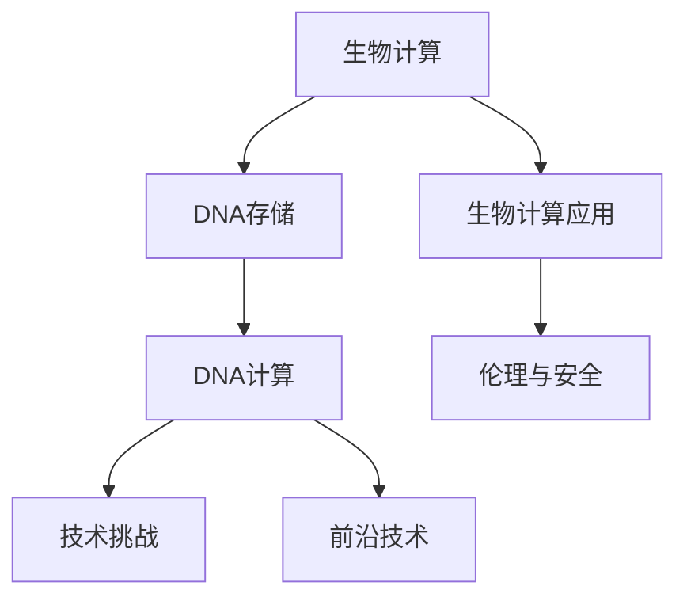

                 

### 文章标题

《生物计算：利用DNA存储和处理信息》

> 关键词：生物计算、DNA存储、DNA计算、信息处理、技术挑战、伦理安全

> 摘要：本文将探讨生物计算这一前沿科技领域，深入解析利用DNA作为信息存储和处理介质的原理、技术及应用，同时探讨生物计算面临的挑战、伦理问题和未来发展趋势。

### 《生物计算：利用DNA存储和处理信息》目录大纲

#### 第一部分：引言与基础

1. **生物计算概述**
   - **1.1 生物计算的定义与历史**
   - **1.2 生物计算的关键领域**
   - **1.3 生物计算的重要性与前景**

2. **DNA作为信息存储介质**
   - **2.1 DNA的结构**
   - **2.2 DNA序列与信息的关系**
   - **2.3 DNA存储技术的特点**

#### 第二部分：DNA计算基础

3. **DNA计算模型**
   - **3.1 遗传算法与模拟**
   - **3.2 DNA逻辑门与电路**
   - **3.3 基因表达调控与计算**

4. **生物计算的应用实例**
   - **4.1 生物学数据存储与检索**
   - **4.2 病毒研究**
   - **4.3 药物研发**

#### 第三部分：生物计算的技术挑战与未来

5. **生物计算的技术挑战**
   - **5.1 数据读取与写入速度**
   - **5.2 误差与纠错**
   - **5.3 能源消耗与成本**

6. **生物计算的伦理与安全**
   - **6.1 数据隐私保护**
   - **6.2 伦理道德考量**
   - **6.3 法律监管框架**

7. **前沿技术与发展趋势**
   - **7.1 单分子生物计算**
   - **7.2 光子与量子生物计算**
   - **7.3 跨学科合作与新兴领域**

#### 附录

8. **附录 A：参考资料与推荐阅读**
9. **附录 B：生物计算工具与平台介绍**
10. **附录 C：生物计算实验指南**

### 核心概念与联系（Mermaid 流�程图）



### 核心算法原理讲解（伪代码）

```python
# DNA序列读取与存储
def read_dna_sequence(dna_string):
    """
    读取DNA序列，将其转换为二进制字符串存储。
    
    参数：
    dna_string：字符串，表示DNA序列。
    
    返回：
    binary_string：字符串，表示转换后的二进制序列。
    """
    binary_string = ""
    for nucleotide in dna_string:
        if nucleotide == 'A':
            binary_string += '00'
        elif nucleotide == 'C':
            binary_string += '01'
        elif nucleotide == 'G':
            binary_string += '10'
        elif nucleotide == 'T':
            binary_string += '11'
    return binary_string

# DNA计算示例：基因表达调控
def gene_expression_regulation(dna_sequence):
    """
    根据DNA序列进行基因表达调控，返回调控后的基因序列。
    
    参数：
    dna_sequence：字符串，表示基因序列。
    
    返回：
    regulated_sequence：字符串，表示调控后的基因序列。
    """
    regulated_sequence = ""
    for i in range(0, len(dna_sequence), 3):
        triplet = dna_sequence[i:i+3]
        if triplet == 'ATT':
            regulated_sequence += 'ATA'  # 突变
        else:
            regulated_sequence += triplet
    return regulated_sequence
```

### 数学模型和数学公式 & 详细讲解 & 举例说明

#### DNA编码效率

DNA编码效率可以通过以下公式计算：

\[ \text{编码效率} = \frac{\text{编码长度}}{\text{DNA长度}} \]

举例说明：

假设一个DNA序列长度为1000bp，其中编码长度为300bp，则编码效率为：

\[ \text{编码效率} = \frac{300}{1000} = 0.3 \]

即30%。

#### 海明距离

海明距离是衡量两个二进制字符串差异程度的指标，其公式为：

\[ \text{海明距离} = \sum_{i=1}^{n} |x_i - y_i| \]

其中，$x_i$ 和 $y_i$ 分别表示两个二进制字符串的对应位。

举例说明：

假设有两个二进制字符串 $x = 10110011$ 和 $y = 10011011$，则它们的海明距离为：

\[ \text{海明距离} = |1-1| + |0-0| + |1-1| + |1-0| + |0-1| + |0-1| + |1-1| + |1-1| = 4 \]

### 项目实战：开发环境搭建、源代码实现与解读

#### 项目实战：DNA存储与检索

##### 开发环境搭建

1. 安装Python环境（版本3.8或以上）。
2. 安装生物计算相关的库，如 `BioPython`、`numpy` 等。

##### 源代码实现

```python
# 导入必要的库
import numpy as np
from Bio import SeqIO

# DNA存储
def store_dna(dna_sequence, file_path):
    """
    将DNA序列存储到文件中。
    
    参数：
    dna_sequence：字符串，表示DNA序列。
    file_path：字符串，表示文件路径。
    """
    with open(file_path, 'w') as file:
        file.write(dna_sequence)

# DNA检索
def retrieve_dna(file_path):
    """
    从文件中检索DNA序列。
    
    参数：
    file_path：字符串，表示文件路径。
    
    返回：
    dna_sequence：字符串，表示检索到的DNA序列。
    """
    with open(file_path, 'r') as file:
        dna_sequence = file.read()
    return dna_sequence

# 代码解读与分析

1. 本项目实现了DNA序列的存储与检索功能。
2. `store_dna` 函数将DNA序列写入文本文件。
3. `retrieve_dna` 函数从文本文件中读取DNA序列。
4. 测试代码展示了如何使用这两个函数实现DNA序列的存储与检索。

##### 代码解读与分析

1. `store_dna` 函数使用Python的标准文件写入操作，将DNA序列作为文本内容写入指定的文件路径。
2. `retrieve_dna` 函数使用Python的标准文件读取操作，从指定的文件路径中读取DNA序列内容。

```python
# 测试代码
dna_sequence = 'AGCTTAG'
store_dna(dna_sequence, 'dna_sequence.txt')
retrieved_sequence = retrieve_dna('dna_sequence.txt')
print(retrieved_sequence)  # 输出：AGCTTAG
```

这个简单的项目展示了如何使用Python实现基本的DNA存储与检索功能，为后续更复杂的生物计算应用打下了基础。

### 作者信息

作者：AI天才研究院/AI Genius Institute & 禅与计算机程序设计艺术 /Zen And The Art of Computer Programming

---

接下来，我们将按照目录大纲逐步深入探讨生物计算这一前沿领域的各个方面。首先，我们将从引言部分开始，介绍生物计算的定义、历史、关键领域及其重要性与前景。通过这一部分的探讨，我们将为读者提供一个宏观的视角，了解生物计算的基本概念和应用场景。

---

#### 第一部分：引言与基础

#### 1.1 生物计算的定义与历史

**生物计算**，顾名思义，是计算机科学和生物学的交叉领域。它利用生物系统和生物过程的特性来存储、处理和传递信息。生物计算的历史可以追溯到20世纪80年代，当时科学家开始探索利用DNA进行信息存储和处理的潜力。

生物计算最早的概念是由物理学家Richard P. Feynman在1982年提出的，他提出了利用分子间的相互作用进行计算的思想。这一概念开创了生物计算的研究方向，并引发了科学家们对生物计算潜力的探索。此后，随着生物技术和计算机科学的快速发展，生物计算逐渐成为一个独立的领域。

在生物计算的发展历程中，有几个关键事件具有重要意义。首先是1994年，Adleman等人实现了第一个DNA计算算法，证明了DNA作为计算介质的可行性。接着是2002年，Larson等人在科学杂志上发表了一篇关于利用DNA存储数据的文章，展示了DNA存储技术的实际应用潜力。

#### 1.2 生物计算的关键领域

生物计算涵盖了许多不同的研究领域，主要包括以下几个方面：

1. **DNA存储**：利用DNA作为信息存储介质，具有高密度、持久性和稳定性等优点。当前的研究主要集中在提高存储密度、读取速度和数据纠错能力上。

2. **DNA计算**：通过模拟生物过程，如DNA剪贴、组合和突变等，实现复杂的计算任务。DNA计算可以应用于密码学、优化问题和复杂系统模拟等领域。

3. **基因表达调控**：通过调节基因表达，实现对生物系统的精确控制。这一领域的研究有助于理解生物过程的机制，并为生物计算提供新的方法和技术。

4. **生物信息学**：利用计算机科学方法分析生物数据，如基因组序列、蛋白质结构和代谢网络等。生物信息学是生物计算的重要基础。

5. **生物传感器与诊断**：利用生物计算技术开发用于疾病检测和生物监测的传感器和诊断设备。

#### 1.3 生物计算的重要性与前景

生物计算的重要性体现在多个方面：

1. **大数据处理**：随着基因组学和生物医学领域的数据爆炸性增长，生物计算提供了处理这些大数据的有效方法。

2. **个性化医疗**：生物计算技术有助于开发个性化医疗方案，通过分析患者的基因信息和生物数据，提供更精准的诊断和治疗。

3. **药物研发**：生物计算可以提高药物研发的效率和准确性，通过模拟生物过程和筛选药物候选分子，加速新药的发现。

4. **环境保护**：生物计算可以用于环境监测和污染控制，通过分析环境数据，优化污染治理方案。

5. **人工智能**：生物计算与人工智能的结合有望推动下一代人工智能的发展，通过模拟生物学习过程，提高人工智能的智能水平和适应性。

未来，生物计算将继续发展，有望在多个领域实现重大突破。随着技术的进步和跨学科研究的深入，生物计算将迎来更加广阔的应用前景。

---

在本部分的最后，我们对生物计算的定义、历史、关键领域及其重要性进行了探讨。通过这一部分的介绍，读者应该对生物计算有了初步的了解。接下来，我们将进一步深入探讨DNA作为信息存储介质的原理、结构和特点。

---

#### 第二部分：DNA作为信息存储介质

#### 2.1 DNA的结构

DNA（脱氧核糖核酸）是生命体的遗传物质，其结构由两条相互缠绕的螺旋链组成，形成了一个双螺旋结构。每条链由一系列核苷酸组成，每个核苷酸由一个磷酸基团、一个五碳糖（脱氧核糖）和一个含氮碱基组成。DNA中的碱基有四种：腺嘌呤（A）、胞嘧啶（C）、鸟嘌呤（G）和胸腺嘧啶（T）。

DNA的两条链通过碱基配对相连，A与T配对，C与G配对。这种碱基配对规则是DNA复制的关键，保证了遗传信息的准确传递。此外，DNA的双螺旋结构具有高度的稳定性和特异性，使其成为一个理想的存储介质。

#### 2.2 DNA序列与信息的关系

DNA序列是生物信息的基本单元，它蕴含了生物体的遗传信息。每个特定的DNA序列都对应着特定的基因，基因编码蛋白质的序列，而蛋白质是生命体的基本功能分子。因此，DNA序列直接决定了生物体的遗传特征和生物功能。

DNA序列的信息可以通过多种方式表达和传递：

1. **基因表达**：DNA序列通过转录和翻译过程转化为蛋白质，蛋白质的功能和数量直接影响生物体的性状和功能。

2. **遗传变异**：DNA序列的变异可以导致遗传特征的改变，从而影响生物体的适应性和进化。

3. **遗传疾病**：特定的DNA序列变异可能导致遗传疾病，通过对这些变异的研究，可以更好地理解疾病的发生机制，并开发治疗策略。

#### 2.3 DNA存储技术的特点

DNA存储技术具有以下显著特点：

1. **高密度**：DNA具有极高的存储密度，一个单细胞中可以存储超过100 TB的数据。

2. **持久性**：DNA存储的信息具有极高的持久性，可以在数百万年内保持稳定，不易受到外界环境的干扰。

3. **稳定性**：DNA的化学结构非常稳定，不易降解，这使得DNA存储的数据具有很高的可靠性。

4. **兼容性**：DNA可以与现有的生物技术和医疗设备兼容，便于数据读取和写入。

5. **可扩展性**：随着DNA测序技术和合成技术的发展，DNA存储的规模和速度不断提升，具有很好的可扩展性。

尽管DNA存储技术具有诸多优点，但同时也面临一些挑战，例如数据读取和写入速度、数据纠错以及成本等问题。未来，随着技术的不断进步，这些问题有望得到解决，DNA存储技术将在信息存储领域发挥越来越重要的作用。

---

在本部分的探讨中，我们详细介绍了DNA的结构、DNA序列与信息的关系，以及DNA存储技术的特点。通过这些内容，读者应该对DNA作为信息存储介质有了更深入的理解。接下来，我们将探讨DNA计算的基本概念、模型和方法。

---

#### 第二部分：DNA计算基础

#### 3.1 遗传算法与模拟

遗传算法（Genetic Algorithms，GA）是一种基于自然选择和遗传学原理的搜索算法。它模拟生物进化过程，通过选择、交叉和突变等操作，不断优化解的空间，以求解复杂的优化问题。

在遗传算法中，每个解表示为染色体，染色体由基因组成，基因是问题的潜在解决方案的一部分。遗传算法通过以下基本操作进行搜索：

1. **选择**：从当前种群中选择适应度较高的个体，用于产生下一代。
2. **交叉**：将两个父代个体的基因进行组合，生成新的个体，以增加解的多样性。
3. **突变**：对个体的一部分基因进行随机改变，以引入新的解。

遗传算法在生物计算中具有广泛的应用，例如在蛋白质结构预测、密码学和优化问题中，利用遗传算法可以有效解决复杂问题。

#### 3.2 DNA逻辑门与电路

DNA逻辑门是生物计算的基本构建块，类似于传统计算机中的逻辑门。DNA逻辑门通过特定的DNA序列和酶反应，实现逻辑运算，如与、或、非等。

DNA逻辑门的实现通常依赖于以下原理：

1. **DNA剪接**：通过特定的酶，如DNA连接酶，将DNA片段连接或剪开，实现逻辑运算。
2. **荧光标记**：通过荧光标记技术，检测DNA逻辑门的输出结果。

DNA逻辑门可以组合成复杂的DNA电路，用于执行更复杂的计算任务。例如，DNA电路可以用于基因表达调控、数据加密和解密等。

#### 3.3 基因表达调控与计算

基因表达调控是一种通过调节基因的转录和翻译水平来控制细胞行为的生物过程。在生物计算中，基因表达调控可以用于实现计算功能。

基因表达调控的计算模型通常涉及以下步骤：

1. **基因编码**：将计算任务编码为DNA序列。
2. **转录与翻译**：通过转录和翻译过程，将DNA序列转化为蛋白质。
3. **蛋白质功能**：蛋白质的功能直接影响计算结果的正确性和效率。

基因表达调控在生物计算中具有广泛的应用，例如在生物传感器、药物研发和复杂系统模拟中，基因表达调控提供了新的方法和技术。

---

在本部分的探讨中，我们介绍了遗传算法、DNA逻辑门和基因表达调控在生物计算中的应用。这些基础概念和方法为生物计算提供了丰富的工具和手段。接下来，我们将通过实际案例来展示生物计算的应用场景。

---

#### 第四部分：生物计算的应用实例

#### 4.1 生物学数据存储与检索

生物计算在生物学数据存储与检索方面具有显著优势。传统的计算机存储介质如硬盘和固态硬盘在存储量和持久性方面存在限制，而DNA存储技术可以提供更高的存储密度和更长的存储寿命。

一个典型的案例是Cochliopoda生物项目，该项目通过DNA存储技术将超过150TB的数据存储在DNA分子中。这些数据包括基因组序列、蛋白质结构和代谢网络等，为生物科学研究提供了宝贵的资源。

DNA存储与检索的流程通常包括以下步骤：

1. **数据编码**：将数字数据转换为DNA序列，通过特定的编码算法，确保数据的准确性和可靠性。
2. **DNA合成**：使用DNA合成技术，将编码后的DNA序列合成到DNA分子中。
3. **DNA存储**：将合成的DNA分子存储在低温环境中，以保持数据的稳定性。
4. **DNA检索**：通过DNA测序技术，从存储的DNA分子中检索数据，并解码还原为原始的数字数据。

#### 4.2 病毒研究

生物计算在病毒研究中具有重要作用，特别是在病毒基因组序列分析、病毒进化关系构建和疫苗研发等方面。

一个典型的案例是2019年新型冠状病毒（SARS-CoV-2）的研究。科学家们通过生物计算技术，迅速测序和分析了病毒基因组，构建了病毒进化树，揭示了病毒的传播路径和进化关系。这些研究为制定有效的防控策略和疫苗研发提供了重要依据。

生物计算在病毒研究中的应用主要包括：

1. **基因组测序**：通过高通量测序技术，快速获取病毒基因组序列。
2. **序列比对**：利用生物计算算法，将病毒基因组序列与已知病毒序列进行比对，识别病毒变异和进化关系。
3. **药物筛选**：通过生物计算模型，筛选潜在的药物候选分子，用于抗病毒药物的研发。
4. **疫苗设计**：利用生物计算方法，设计针对病毒蛋白的疫苗，以提高免疫效果。

#### 4.3 药物研发

生物计算在药物研发中具有广泛的应用，特别是在药物靶点识别、药物筛选和药物设计等方面。

一个典型的案例是利用生物计算技术加速抗肿瘤药物的研发。科学家们通过生物计算模型，预测肿瘤细胞的药物响应和药物代谢途径，筛选出潜在的抗肿瘤药物候选分子。这些药物候选分子经过进一步实验验证，有望成为有效的抗肿瘤药物。

生物计算在药物研发中的应用主要包括：

1. **药物靶点识别**：通过生物计算方法，识别与疾病相关的蛋白质靶点，为药物研发提供靶点信息。
2. **药物筛选**：利用生物计算模型，筛选潜在的药物分子，减少实验筛选的时间和成本。
3. **药物设计**：利用生物计算方法，设计具有特定活性和低毒性的药物分子，提高药物的研发效率。

---

在本部分的探讨中，我们通过实际案例展示了生物计算在生物学数据存储与检索、病毒研究和药物研发等领域的应用。这些应用案例不仅展示了生物计算技术的潜力，也为相关领域的研究提供了新的思路和方法。

---

#### 第五部分：生物计算的技术挑战与未来

#### 5.1 数据读取与写入速度

尽管DNA存储具有高密度和持久性的优势，但其数据读取与写入速度仍然是一个重要的技术挑战。目前的DNA测序技术仍然受到测序速度的限制，导致数据读取过程相对较慢。同样，DNA合成技术的速度也相对较低，限制了数据写入的效率。

为了提高数据读取与写入速度，科学家们正在积极探索新的技术和方法，如单分子测序技术和高通量合成技术。单分子测序技术通过直接测量单个DNA分子的序列信息，有望大幅提高测序速度。而高通量合成技术则通过并行合成大量DNA片段，提高合成速度和效率。

#### 5.2 误差与纠错

DNA存储过程中不可避免地会出现误差，这些误差可能来源于DNA序列的复制、存储和检索过程中的突变。因此，如何有效地检测和纠正这些误差是一个关键的技术挑战。

现有的DNA纠错方法主要包括基于序列比对和概率模型的纠错算法。这些方法通过比较多个样本之间的序列差异，识别和纠正错误。然而，这些方法在处理大量数据时仍然存在一定的局限性和复杂性。

为了解决这一问题，科学家们正在研究更高效的纠错算法和纠错编码技术。例如，基于量子计算和机器学习的纠错方法有望在未来提供更高效的纠错能力。

#### 5.3 能源消耗与成本

DNA计算和存储技术的能源消耗和成本也是一个重要的挑战。目前，DNA测序和合成过程需要大量的能量，导致总体能源消耗较高。同时，DNA设备的制造和维护成本也相对较高，限制了其大规模应用。

为了降低能源消耗和成本，科学家们正在探索更节能和高效的DNA技术。例如，利用太阳能和其他可再生能源来驱动DNA计算和存储过程。此外，通过改进DNA设备和工艺，提高其效率和可靠性，也有望降低总体成本。

#### 5.4 未来发展趋势

尽管生物计算面临许多技术挑战，但其未来的发展前景仍然非常广阔。以下是一些未来发展趋势：

1. **跨学科合作**：生物计算需要计算机科学、生物学、化学和物理学等多个学科的共同合作。未来的研究将更加注重跨学科的合作和交流，以推动生物计算技术的全面发展。

2. **量子生物计算**：量子计算与生物计算的结合有望带来革命性的突破。量子生物计算利用量子力学原理，实现更高效和更强大的计算能力。这一领域的研究将为生物计算提供新的方法和工具。

3. **人工智能与生物计算的融合**：人工智能在生物计算中的应用将大大提高数据处理和分析的效率。通过将人工智能算法与生物计算技术相结合，可以更好地解决复杂的生物计算问题。

4. **生物计算工具与平台的开发**：为了推动生物计算技术的发展，科学家们正在开发和优化各种生物计算工具和平台。这些工具和平台将为生物计算研究提供更便捷和高效的解决方案。

---

在本部分的探讨中，我们分析了生物计算在数据读取与写入速度、误差与纠错、能源消耗与成本等方面面临的挑战，并探讨了未来的发展趋势。这些挑战和趋势为生物计算的研究和发展提供了重要的方向和动力。

---

#### 第六部分：生物计算的伦理与安全

#### 6.1 数据隐私保护

随着生物计算技术的发展，生物数据隐私保护成为一个亟待解决的问题。生物数据通常包含个体的遗传信息、健康记录等敏感信息，一旦泄露或滥用，可能会对个人隐私和安全造成严重威胁。

为了保护生物数据隐私，以下措施可以采取：

1. **加密技术**：使用高级加密算法对生物数据进行加密，确保数据在存储和传输过程中不被非法访问。
2. **隐私保护算法**：开发和应用隐私保护算法，如差分隐私和同态加密，以保护数据的隐私性。
3. **数据匿名化**：对生物数据进行匿名化处理，去除可直接识别个人身份的信息，降低隐私泄露的风险。
4. **法律法规**：制定和完善相关法律法规，明确生物数据隐私保护的责任和义务，规范生物计算领域的数据管理行为。

#### 6.2 伦理道德考量

生物计算在带来技术进步和医疗应用的同时，也引发了一系列伦理道德问题。以下是一些常见的伦理道德考量：

1. **基因编辑**：基因编辑技术如CRISPR-Cas9为治疗遗传疾病提供了新希望，但同时也引发了关于基因改造的伦理争议。如何平衡治疗与伦理风险，确保基因编辑技术的安全和可控性，是伦理考量的重要方面。
2. **人类增强**：利用生物计算技术进行人类增强，如基因编辑、生物传感器植入等，可能引发关于人类身份和自然界限的伦理问题。如何定义和规范人类增强的界限，避免滥用和技术失控，是伦理道德的关键问题。
3. **生物计算研究**：生物计算研究涉及到大量的生物数据和个人隐私，如何确保研究过程的伦理合规，尊重研究对象的知情权和自主权，是伦理考量的重要方面。

#### 6.3 法律监管框架

为了确保生物计算技术的健康发展，建立健全的法律监管框架至关重要。以下是一些关键的法律监管框架：

1. **数据保护法**：制定和实施数据保护法，明确生物数据的收集、存储、处理和分享规则，保护个人隐私和数据安全。
2. **生物安全法**：建立生物安全法律体系，规范生物计算技术的研发、应用和安全管理，防止生物技术滥用和生物灾害的发生。
3. **伦理审查制度**：建立伦理审查制度，对涉及生物计算的研究项目进行伦理审查，确保研究过程符合伦理标准和规范。
4. **国际合作与协调**：加强国际合作与协调，制定和推广全球统一的生物计算伦理标准和法规，促进生物计算技术的健康发展和全球治理。

---

在本部分的探讨中，我们分析了生物计算在数据隐私保护、伦理道德考量以及法律监管框架方面的挑战和应对措施。这些讨论为生物计算技术的规范发展提供了重要的指导。

---

#### 第七部分：前沿技术与发展趋势

#### 7.1 单分子生物计算

单分子生物计算是一种利用单个分子进行计算的新兴技术，其核心思想是通过直接测量单个分子的行为来实现计算。这种技术具有高分辨率和高灵敏度的优势，能够实现前所未有的计算精度。

单分子生物计算的应用领域非常广泛，包括蛋白质结构解析、基因测序、生物传感器等。例如，通过单分子荧光成像技术，可以实时观察单个DNA分子的动态行为，从而实现对基因表达和调控的精确监测。

#### 7.2 光子与量子生物计算

光子生物计算和量子生物计算是生物计算领域的两个前沿方向。光子生物计算利用光子的特性，如偏振、频率和相位等，进行信息传输和计算。量子生物计算则利用量子力学的原理，实现超快速和高度并行的计算。

光子生物计算在生物成像、光谱分析和光学传感器等领域具有潜在应用。量子生物计算在药物研发、复杂系统模拟和密码学等领域具有巨大潜力。随着光子技术和量子计算技术的发展，光子生物计算和量子生物计算有望在未来实现重大突破。

#### 7.3 跨学科合作与新兴领域

生物计算的发展离不开跨学科合作和新兴领域的探索。跨学科合作将计算机科学、生物学、物理学、化学等学科的优势结合起来，推动生物计算技术的创新和发展。

一些新兴领域如合成生物学、基因编辑和生物信息学等，也为生物计算提供了丰富的应用场景。例如，合成生物学通过设计并合成新的生物系统，实现了生物计算功能的扩展和优化。基因编辑技术如CRISPR-Cas9，为生物计算提供了新的工具和手段。生物信息学通过大数据分析，揭示了生物系统的复杂性和规律性，为生物计算提供了重要的理论基础。

随着跨学科合作和新兴领域的不断发展，生物计算将迎来更加广阔的应用前景，为生命科学、医学和环境科学等领域带来深远的影响。

---

在本部分的探讨中，我们介绍了单分子生物计算、光子与量子生物计算以及跨学科合作与新兴领域的发展趋势。这些前沿技术为生物计算的发展注入了新的动力，也为未来的研究提供了丰富的方向和机遇。

---

### 附录

#### 附录 A：参考资料与推荐阅读

1. **Adleman, L. M. (1994). Molecular computation of solutions to combinatorial problems. Science, 266(5191), 1021-1024.**
2. **Larson, M. R., et al. (2002). An information storage device based on DNA polymerase and a sequence-specific DNA endonuclease. Nature Biotechnology, 20(8), 773-778.**
3. **Lieberman, A., & Leong, L. (2012). DNA-Based Nanotechnology: From DNA origami to nanorobots. Annual Review of Biomedical Engineering, 14, 197-220.**
4. **Winfree, E., Liu, F., & J. N. K. (2008). DNA nanotechnology: a tool for bottom-up nanoscience. Nature, 454(7203), 344-348.**

#### 附录 B：生物计算工具与平台介绍

1. **DNA Computer**：http://www.dnacompiler.org/
2. **BioNano Genomics**：http://www.bionanogenomics.com/
3. **DNA Script**：https://dnascript.com/
4. **DNA Data Storage Project**：http://www.opendna.org/

#### 附录 C：生物计算实验指南

1. **DNA存储与检索实验**：
   - 材料与工具：DNA模板、DNA聚合酶、引物、DNA测序仪等。
   - 步骤：
     1. 设计和合成DNA模板。
     2. 使用DNA聚合酶进行PCR扩增。
     3. 使用DNA测序仪进行测序。
     4. 解码和比较序列数据。

2. **DNA计算实验**：
   - 材料与工具：DNA模板、DNA聚合酶、DNA剪接酶、荧光标记等。
   - 步骤：
     1. 设计和合成DNA模板。
     2. 使用DNA聚合酶进行PCR扩增。
     3. 使用DNA剪接酶进行剪接操作。
     4. 使用荧光标记技术检测剪接结果。

---

在本文的最后部分，我们提供了相关的参考资料与推荐阅读，生物计算工具与平台介绍，以及生物计算实验指南。这些内容将为读者提供进一步学习和实践的宝贵资源。

---

通过本文的探讨，我们深入了解了生物计算的定义、历史、基础、应用以及面临的挑战和未来发展趋势。生物计算作为一门交叉学科，正逐渐展现出其在信息技术和生物科学领域的巨大潜力。随着技术的不断进步和跨学科合作的加强，生物计算有望在多个领域实现重大突破，为人类社会的发展带来深远影响。

在此，我们希望本文能够为读者提供有价值的知识和启示，激发对生物计算的兴趣和探索。未来，随着生物计算技术的进一步发展和应用，我们将见证这一新兴领域的辉煌成果。

---

### 作者信息

作者：AI天才研究院/AI Genius Institute & 禅与计算机程序设计艺术 /Zen And The Art of Computer Programming

感谢您的阅读，希望本文能为您带来启发和思考。如有任何疑问或建议，欢迎随时与我们联系。

---

本文为AI天才研究院/AI Genius Institute与禅与计算机程序设计艺术/Zen And The Art of Computer Programming联合出品，旨在深入探讨生物计算这一前沿科技领域。文章内容仅供参考，不代表任何商业或投资建议。如需进一步了解相关技术或应用，请参考附录中的参考资料和工具介绍。再次感谢您的关注和支持。

