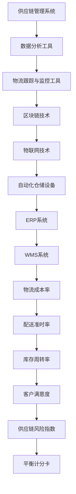

                 

# 生鲜电商创业：打造高效供应链

> 关键词：生鲜电商、供应链管理、优化、仓储与配送、信息化管理、风险管理、案例研究

> 摘要：本文将深入探讨生鲜电商创业过程中如何打造高效供应链。通过分析行业背景、挑战、供应链管理系统设计、仓储与配送策略、信息化管理工具应用、供应链风险管理以及实战案例分析，旨在为创业者提供一套全面的供应链管理策略，助力生鲜电商企业在激烈的市场竞争中脱颖而出。

### 目录大纲

## 第一部分：生鲜电商行业背景与挑战

### 第1章：生鲜电商概述

### 第2章：生鲜电商的供应链挑战

## 第二部分：高效供应链设计

### 第3章：供应链管理系统

### 第4章：生鲜商品供应链优化

### 第5章：仓储与配送策略

### 第6章：信息化管理工具应用

### 第7章：供应链风险管理

## 第三部分：实战案例分析

### 第8章：生鲜电商供应链管理实践

### 第9章：创新与未来趋势

### 第10章：综合评估与优化建议

## 附录

### 附录 A：生鲜电商供应链管理常用工具与技术

### 附录 B：参考资源与进一步阅读

### Mermaid 流�程图

### 核心算法原理讲解

### 数学模型和数学公式

### 项目实战

### 附录

---

## 第一部分：生鲜电商行业背景与挑战

### 第1章：生鲜电商概述

#### 1.1 生鲜电商的定义与发展历程

生鲜电商是指通过互联网平台销售新鲜蔬菜、水果、肉类、海鲜等初级农产品的电子商务模式。随着互联网技术的不断发展和人们对健康生活方式的追求，生鲜电商在中国迅速崛起。

生鲜电商的发展历程可以分为三个阶段：

1. **起步阶段**（2010年以前）：以线下零售企业为主，初步尝试线上销售。
2. **快速发展阶段**（2010-2015年）：以淘宝、京东为代表的电商平台开始布局生鲜业务，市场参与者逐渐增多。
3. **成熟阶段**（2015年至今）：生鲜电商市场逐渐成熟，市场集中度提高，龙头企业逐渐显现。

#### 1.2 生鲜电商的市场现状与趋势

根据中国电子商务研究中心的数据，截至2022年，中国生鲜电商市场规模已超过1万亿元，用户规模超过4亿人。生鲜电商市场呈现出以下几个趋势：

1. **市场规模持续扩大**：随着居民消费水平的提高和电商渗透率的提升，生鲜电商市场将继续保持高速增长。
2. **消费习惯逐渐改变**：年轻一代消费者更加青睐线上购物，生鲜电商用户群体不断扩大。
3. **线上线下融合**：生鲜电商逐渐实现线上线下全渠道布局，提升用户体验和满意度。
4. **生鲜品类不断丰富**：除蔬菜、水果、肉类等传统生鲜品类外，生鲜电商开始拓展至海鲜、乳制品、烘焙等新兴品类。

#### 1.3 生鲜电商的商业模式分析

生鲜电商的商业模式主要包括以下几种：

1. **B2C模式**：直接面向消费者，通过自有平台或第三方平台进行销售。
2. **B2B模式**：主要面向餐饮业、酒店、超市等B端客户，提供批量采购服务。
3. **C2C模式**：消费者在平台上进行自采自销，类似于淘宝的二手交易市场。

### 第2章：生鲜电商的供应链挑战

#### 2.1 生鲜商品的特殊性

生鲜商品具有以下特殊性：

1. **易腐性**：生鲜商品容易腐烂变质，对存储和配送条件有较高要求。
2. **时效性**：生鲜商品需要在短时间内从生产地运输到消费者手中，以保证新鲜度。
3. **多样性**：生鲜商品种类繁多，包括蔬菜、水果、肉类、海鲜等，需要针对不同商品进行分类管理和配送。
4. **标准化程度低**：生鲜商品的外观、重量、品质等差异较大，难以实现标准化管理。

#### 2.2 供应链的痛点分析

生鲜电商的供应链存在以下痛点：

1. **库存管理难**：生鲜商品的保质期较短，库存管理难度大，易导致商品积压或过期。
2. **物流成本高**：生鲜商品对物流速度和冷链运输有较高要求，导致物流成本较高。
3. **供应链透明度低**：从生产到销售的各个环节信息传递不畅，导致供应链管理效率低下。
4. **食品安全风险**：生鲜商品在运输、存储过程中存在食品安全隐患，需加强监管。

#### 2.3 挑战与机遇并存

生鲜电商在面临挑战的同时，也蕴含着巨大的机遇：

1. **市场需求增长**：随着居民消费水平的提升，生鲜电商市场需求不断增长，为创业者提供了广阔的发展空间。
2. **技术进步**：物联网、大数据、人工智能等技术的进步，为生鲜电商供应链管理提供了新的工具和方法。
3. **政策支持**：政府加大对农业产业的支持力度，推动生鲜电商行业健康发展。

## 第二部分：高效供应链设计

### 第3章：供应链管理系统

### 第4章：生鲜商品供应链优化

### 第5章：仓储与配送策略

### 第6章：信息化管理工具应用

### 第6章：供应链风险管理

## 第三部分：实战案例分析

### 第7章：生鲜电商供应链管理实践

### 第8章：创新与未来趋势

### 第9章：综合评估与优化建议

## 附录

### 附录 A：生鲜电商供应链管理常用工具与技术

### 附录 B：参考资源与进一步阅读

---

本文将对生鲜电商创业过程中的供应链管理进行深入探讨，通过分析行业背景、挑战、供应链管理系统设计、仓储与配送策略、信息化管理工具应用、供应链风险管理以及实战案例分析，旨在为创业者提供一套全面的供应链管理策略，助力生鲜电商企业在激烈的市场竞争中脱颖而出。接下来，我们将逐步展开每一个章节的内容，以帮助读者更好地理解和掌握生鲜电商供应链管理的核心要点。

---

### 第1章：生鲜电商概述

#### 1.1 生鲜电商的定义与发展历程

生鲜电商是指通过互联网平台销售新鲜蔬菜、水果、肉类、海鲜等初级农产品的电子商务模式。这一概念最早起源于20世纪90年代，随着互联网的普及和电子商务的发展，生鲜电商逐渐从线下向线上延伸。

生鲜电商的发展历程可以分为三个阶段：

1. **起步阶段**（2010年以前）：这一阶段以线下零售企业为主，初步尝试线上销售。例如，一些大型超市和水果店在自建电商平台或第三方平台上开设线上商店，提供生鲜商品销售。

2. **快速发展阶段**（2010-2015年）：这一阶段是生鲜电商的快速发展期，以淘宝、京东等为代表的电商平台开始布局生鲜业务，市场参与者逐渐增多。2010年，天猫生鲜上线，标志着中国生鲜电商市场进入了一个新的阶段。

3. **成熟阶段**（2015年至今）：生鲜电商市场逐渐成熟，市场集中度提高，龙头企业逐渐显现。例如，盒马鲜生、叮咚买菜、每日优鲜等企业通过技术创新和模式创新，在市场上取得了显著的成绩。

#### 1.2 生鲜电商的市场现状与趋势

根据中国电子商务研究中心的数据，截至2022年，中国生鲜电商市场规模已超过1万亿元，用户规模超过4亿人。生鲜电商市场呈现出以下几个趋势：

1. **市场规模持续扩大**：随着居民消费水平的提高和电商渗透率的提升，生鲜电商市场将继续保持高速增长。据预测，未来几年中国生鲜电商市场规模将保持10%以上的年增长率。

2. **消费习惯逐渐改变**：年轻一代消费者更加青睐线上购物，生鲜电商用户群体不断扩大。根据调研数据，80后、90后和00后已成为生鲜电商的主力消费者。

3. **线上线下融合**：生鲜电商逐渐实现线上线下全渠道布局，提升用户体验和满意度。例如，盒马鲜生通过“线上下单、线下自提”的模式，实现了线上线下的无缝衔接。

4. **生鲜品类不断丰富**：除蔬菜、水果、肉类、海鲜等传统生鲜品类外，生鲜电商开始拓展至海鲜、乳制品、烘焙等新兴品类。例如，叮咚买菜上线了海鲜、烘焙等品类，以满足消费者的多样化需求。

#### 1.3 生鲜电商的商业模式分析

生鲜电商的商业模式主要包括以下几种：

1. **B2C模式**：直接面向消费者，通过自有平台或第三方平台进行销售。这种模式的特点是用户可以在线选择、下单，并享受送货上门的服务。例如，天猫生鲜、京东生鲜等。

2. **B2B模式**：主要面向餐饮业、酒店、超市等B端客户，提供批量采购服务。这种模式的特点是商家可以在线上平台批量采购生鲜商品，降低采购成本。例如，美团餐饮供应链、链农等。

3. **C2C模式**：消费者在平台上进行自采自销，类似于淘宝的二手交易市场。这种模式的特点是用户可以在线上平台上发布自己手中的生鲜商品，进行交易。例如，拼多多、淘宝等平台的二手交易区。

#### 1.4 生鲜电商的核心竞争力

生鲜电商的核心竞争力主要包括以下几个方面：

1. **产品品质**：生鲜商品的品质是消费者的首要关注点。生鲜电商需要确保所售商品的品质，包括新鲜度、营养价值、卫生安全等。

2. **物流速度**：生鲜商品对物流速度有较高要求，消费者希望能够尽快收到新鲜的商品。生鲜电商需要建立高效的物流配送体系，提高配送速度。

3. **用户体验**：良好的用户体验是生鲜电商成功的关键。生鲜电商需要提供方便快捷的购物流程、优质的售后服务，以及个性化的推荐服务，提升用户满意度。

4. **价格优势**：价格是消费者购买生鲜商品的重要因素之一。生鲜电商需要通过规模效应、供应链优化等手段降低成本，提供有竞争力的价格。

#### 1.5 生鲜电商面临的挑战

生鲜电商在快速发展过程中也面临着一系列挑战：

1. **库存管理难**：生鲜商品具有易腐性，库存管理难度较大。生鲜电商需要建立完善的库存管理系统，实时掌握库存情况，避免商品积压或过期。

2. **物流成本高**：生鲜商品对冷链运输有较高要求，物流成本较高。生鲜电商需要优化物流网络，降低物流成本，提高盈利能力。

3. **供应链透明度低**：生鲜电商的供应链透明度较低，信息传递不畅，导致供应链管理效率低下。生鲜电商需要提高供应链透明度，加强各环节的信息共享和协同。

4. **食品安全风险**：生鲜商品在运输、存储过程中存在食品安全隐患。生鲜电商需要加强食品安全监管，确保商品质量，提高消费者信任度。

#### 1.6 生鲜电商的发展前景

尽管生鲜电商在发展过程中面临诸多挑战，但总体来看，其发展前景依然广阔：

1. **市场需求增长**：随着居民消费水平的提升和健康意识的增强，生鲜电商市场需求将持续增长。

2. **技术进步**：物联网、大数据、人工智能等技术的进步将为生鲜电商提供更多创新工具和方法，提升供应链管理水平。

3. **政策支持**：政府对农业产业的支持力度不断加大，将为生鲜电商发展提供有利条件。

4. **市场集中度提高**：随着市场竞争的加剧，生鲜电商市场将逐渐向优质企业集中，龙头企业将获得更多市场份额。

综上所述，生鲜电商作为电子商务的重要组成部分，具有巨大的发展潜力。创业者需要把握行业趋势，克服挑战，通过高效供应链管理提升竞争力，实现可持续发展。

### 第2章：生鲜电商的供应链挑战

#### 2.1 生鲜商品的特殊性

生鲜商品具有以下几个特殊性，这直接影响到生鲜电商供应链的管理和运作：

1. **易腐性**：生鲜商品如蔬菜、水果、肉类和海鲜等，都具有一定的保鲜期。一旦超过保鲜期，商品就会变质，影响消费者的购买意愿和商品价值。因此，生鲜电商必须重视商品的存储和运输条件，确保商品的新鲜度和品质。

2. **时效性**：生鲜商品需要快速从生产地运输到消费者手中，以保持新鲜度。长时间的运输和配送会导致商品质量下降，增加物流成本。因此，生鲜电商需要优化物流网络，缩短配送时间，提高物流效率。

3. **多样性**：生鲜商品种类繁多，包括蔬菜、水果、肉类、海鲜、乳制品、烘焙产品等，每一种商品都有其特定的存储和运输要求。这使得生鲜电商需要针对不同商品进行分类管理和配送，提高供应链的灵活性和响应速度。

4. **标准化程度低**：与电子产品、服装等标准化商品不同，生鲜商品的外观、重量、品质等差异较大，难以实现完全的标准化管理。这意味着生鲜电商需要更多的劳动力和技术来确保商品的一致性和质量。

#### 2.2 供应链的痛点分析

生鲜电商的供应链管理面临着以下痛点，这些问题直接影响到企业的运营效率和用户体验：

1. **库存管理难**：生鲜商品保质期短，库存管理变得尤为复杂。生鲜电商需要实时监控库存情况，及时补货，避免商品积压或过期。然而，库存管理的复杂性增加了运营成本，也对管理人员的技能要求较高。

2. **物流成本高**：生鲜商品对冷链运输有较高要求，物流成本相对较高。冷链运输不仅需要特殊的设备和温控措施，还需要考虑物流网络的优化，以减少运输时间和成本。此外，生鲜商品的配送时效性要求高，进一步增加了物流成本。

3. **供应链透明度低**：生鲜电商的供应链透明度较低，信息传递不畅。从生产、采购、仓储到配送，各个环节之间的信息不透明，导致供应链管理效率低下。例如，商品在运输过程中的温度变化、配送延误等问题难以及时发现和解决。

4. **食品安全风险**：生鲜商品在运输、存储过程中存在食品安全隐患。生鲜电商需要确保商品从生产到配送的每一个环节都符合食品安全标准，避免食品污染和变质。然而，供应链的复杂性和不确定性增加了食品安全风险，需要加强监管和检测。

5. **库存周转慢**：由于生鲜商品的特殊性，库存周转速度较慢。这会导致资金占用增加，影响企业的资金流动性和盈利能力。生鲜电商需要优化库存管理，提高库存周转速度，以减少库存成本。

6. **供应链协同难度大**：生鲜电商的供应链涉及多个环节，包括生产、采购、仓储、配送等。各环节之间的协同难度较大，信息传递不畅，导致供应链效率低下。例如，生产计划与采购计划的匹配、仓储与配送的协调等，都需要高度的信息共享和协同。

#### 2.3 挑战与机遇并存

虽然生鲜电商在供应链管理中面临诸多挑战，但同时也蕴含着巨大的机遇：

1. **市场需求增长**：随着居民消费水平的提升和健康意识的增强，生鲜电商市场需求将持续增长。这为生鲜电商提供了广阔的发展空间。

2. **技术进步**：物联网、大数据、人工智能等技术的进步为生鲜电商供应链管理提供了新的工具和方法。例如，通过物联网设备实时监控冷链运输环境，通过大数据分析优化库存管理，通过人工智能提高物流配送效率等。

3. **政策支持**：政府对农业产业和电子商务的支持力度不断加大，为生鲜电商发展提供了有利条件。例如，政策扶持、补贴资金、税收优惠等，有助于生鲜电商降低成本、提高盈利能力。

4. **市场集中度提高**：随着市场竞争的加剧，生鲜电商市场将逐渐向优质企业集中。龙头企业将获得更多市场份额，提升品牌影响力和竞争力。

5. **消费者信任度提升**：随着生鲜电商的发展，消费者对生鲜电商的信任度逐渐提升。通过提高商品品质、优化物流服务、加强食品安全管理，生鲜电商可以赢得消费者的信任，增加用户黏性。

综上所述，生鲜电商在供应链管理中面临诸多挑战，但同时也蕴含着巨大的机遇。通过技术创新、模式创新和管理优化，生鲜电商可以克服挑战，实现可持续发展。

### 第3章：供应链管理系统

#### 3.1 供应链管理的基本原理

供应链管理（Supply Chain Management, SCM）是指通过计划、组织、协调、控制等手段，对供应链活动进行有效管理和优化，以实现供应链整体效益最大化的过程。供应链管理的基本原理包括以下几个方面：

1. **需求预测**：通过分析市场趋势、消费者行为、季节性因素等，预测未来的需求量，为供应链的规划和运营提供数据支持。

2. **采购管理**：采购是供应链管理的起点，包括供应商选择、采购策略制定、采购订单处理等。通过优化采购流程，降低采购成本，提高采购效率。

3. **库存管理**：库存管理是供应链管理的重要环节，包括库存水平控制、库存周转率优化、库存成本控制等。通过合理的库存管理，确保商品供应的连续性和及时性。

4. **生产计划**：生产计划是根据市场需求和生产能力，制定生产计划和生产进度。通过科学的生产计划，提高生产效率，降低生产成本。

5. **物流管理**：物流管理包括仓储、运输、配送等环节。通过优化物流网络，提高物流效率，降低物流成本，确保商品能够及时、安全地到达消费者手中。

6. **信息管理**：信息管理是供应链管理的重要支撑，包括信息收集、处理、传输等。通过建立完善的信息系统，实现供应链各环节的信息共享和协同，提高供应链管理效率。

7. **风险管理**：风险管理是供应链管理的重要组成部分，包括风险识别、评估、应对策略等。通过有效的风险管理，降低供应链风险，保障供应链的稳定运行。

#### 3.2 供应链管理系统的功能

供应链管理系统（Supply Chain Management System, SCM System）是一种集成了供应链管理各个环节功能的软件系统，通过自动化和智能化的方式，提高供应链管理的效率和质量。供应链管理系统的功能主要包括以下几个方面：

1. **需求管理**：通过收集和分析市场需求信息，预测未来的需求量，为供应链的规划和运营提供数据支持。

2. **采购管理**：包括供应商管理、采购订单处理、采购合同管理等功能，优化采购流程，降低采购成本。

3. **库存管理**：包括库存水平控制、库存周转率优化、库存成本控制等功能，通过合理的库存管理，确保商品供应的连续性和及时性。

4. **生产计划**：根据市场需求和生产能力，制定生产计划和生产进度，通过科学的生产计划，提高生产效率，降低生产成本。

5. **物流管理**：包括仓储管理、运输管理、配送管理等功能，通过优化物流网络，提高物流效率，降低物流成本。

6. **质量管理**：包括质量检测、质量评估、质量改进等功能，确保商品的质量满足客户需求。

7. **供应商协同**：与供应商建立协同关系，实现供应链上下游的信息共享和协同，提高供应链的整体效率。

8. **数据分析**：通过收集和分析供应链各个环节的数据，为供应链管理的决策提供数据支持，实现供应链的持续优化。

9. **绩效评估**：对供应链管理的各个环节进行绩效评估，分析供应链管理的效率和质量，为供应链管理改进提供依据。

#### 3.3 供应链管理系统的主要模块

供应链管理系统通常包括以下几个主要模块：

1. **需求管理模块**：用于收集和分析市场需求信息，预测未来的需求量，为供应链的规划和运营提供数据支持。

2. **采购管理模块**：用于供应商管理、采购订单处理、采购合同管理等功能，优化采购流程，降低采购成本。

3. **库存管理模块**：用于库存水平控制、库存周转率优化、库存成本控制等功能，通过合理的库存管理，确保商品供应的连续性和及时性。

4. **生产计划模块**：用于制定生产计划和生产进度，根据市场需求和生产能力，优化生产计划，提高生产效率，降低生产成本。

5. **物流管理模块**：用于仓储管理、运输管理、配送管理等功能，通过优化物流网络，提高物流效率，降低物流成本。

6. **质量管理模块**：用于质量检测、质量评估、质量改进等功能，确保商品的质量满足客户需求。

7. **供应商协同模块**：用于与供应商建立协同关系，实现供应链上下游的信息共享和协同，提高供应链的整体效率。

8. **数据分析模块**：用于收集和分析供应链各个环节的数据，为供应链管理的决策提供数据支持，实现供应链的持续优化。

9. **绩效评估模块**：用于对供应链管理的各个环节进行绩效评估，分析供应链管理的效率和质量，为供应链管理改进提供依据。

通过以上供应链管理系统的功能模块，生鲜电商企业可以实现供应链的自动化和智能化管理，提高供应链的效率和质量，降低运营成本，提升市场竞争力。

### 第4章：生鲜商品供应链优化

#### 4.1 供应链优化的重要性

供应链优化是生鲜电商企业提升运营效率、降低成本、提高客户满意度的重要手段。对于生鲜商品供应链来说，优化尤为重要，原因如下：

1. **保证商品新鲜度**：生鲜商品具有易腐性，供应链优化的目标之一是确保商品在运输和存储过程中保持新鲜度，减少因腐烂变质导致的损失。

2. **降低物流成本**：生鲜商品对冷链运输有较高要求，物流成本相对较高。通过供应链优化，可以降低物流成本，提高企业的盈利能力。

3. **提高供应链响应速度**：生鲜商品时效性要求高，供应链优化可以提高供应链的响应速度，确保商品能够及时送达消费者，提升用户体验。

4. **增强供应链灵活性**：供应链优化可以使生鲜电商企业更好地应对市场变化和需求波动，提高供应链的灵活性和适应性。

5. **提升供应链稳定性**：通过优化供应链，可以降低供应链风险，提高供应链的稳定性，确保企业长期稳定运营。

#### 4.2 生鲜商品供应链优化策略

为了实现生鲜商品供应链的优化，生鲜电商企业可以采取以下策略：

1. **需求预测与计划**：通过大数据分析和市场调研，准确预测市场需求，制定合理的采购和生产计划。这有助于减少库存积压和商品过期，提高库存周转率。

2. **采购策略优化**：选择优质的供应商，建立稳定的供应商合作关系，通过批量采购、长期协议等方式降低采购成本。同时，采用动态采购策略，根据市场需求变化调整采购量，避免过度采购。

3. **物流网络优化**：建立高效的物流网络，包括仓储选址、配送路线规划等。通过优化物流网络，缩短运输距离，提高配送效率，降低物流成本。例如，采用多温区仓储、共同配送等方式，提高物流效率。

4. **冷链管理优化**：加强冷链运输和存储管理，确保生鲜商品在运输和存储过程中的新鲜度。采用温控设备、冷链物流车等，提高冷链管理水平。同时，建立完善的冷链监控系统，实时监控运输过程中的温度变化，确保冷链运输的可靠性。

5. **仓储管理优化**：通过自动化仓储设备和信息化管理系统，提高仓储效率，降低人工成本。采用先进的仓储管理系统（WMS），实现仓储作业的自动化和智能化，提高库存周转率。

6. **供应链协同优化**：加强与供应商、物流服务提供商等上下游合作伙伴的协同，实现信息共享和资源共享。通过供应链协同平台，提高供应链的透明度和协同效率，降低供应链管理成本。

7. **质量管理优化**：加强生鲜商品的质量管理，建立严格的质量检测和追溯体系。通过质量监控和改进，提高商品品质，提升消费者满意度。

8. **风险管理优化**：建立完善的供应链风险管理体系，识别和评估供应链风险，制定相应的风险应对策略。通过风险管理和预警机制，降低供应链风险，保障供应链的稳定运行。

#### 4.3 优化案例分享

以下是一个生鲜电商供应链优化的成功案例：

**案例：XX生鲜电商平台**

XX生鲜电商平台是一家知名的生鲜电商企业，致力于为用户提供新鲜、优质的生鲜商品。为了提升供应链效率，降低成本，提高客户满意度，XX生鲜电商平台采取了一系列供应链优化措施：

1. **需求预测与计划**：通过大数据分析和市场调研，准确预测市场需求，制定合理的采购和生产计划。在需求波动较大的季节，通过动态调整采购策略，避免过度采购和库存积压。

2. **采购策略优化**：与优质供应商建立长期合作关系，通过批量采购和长期协议降低采购成本。同时，采用动态采购策略，根据市场需求变化调整采购量，确保供应链的灵活性和响应速度。

3. **物流网络优化**：在全国范围内建立多个仓储中心和冷链物流网络，通过优化仓储选址和配送路线，提高物流效率。同时，采用多温区仓储和共同配送等方式，降低物流成本。

4. **冷链管理优化**：采用先进的冷链设备和冷链监控系统，确保生鲜商品在运输和存储过程中的新鲜度。通过实时监控运输过程中的温度变化，确保冷链运输的可靠性。

5. **仓储管理优化**：引入自动化仓储设备和先进的仓储管理系统（WMS），实现仓储作业的自动化和智能化，提高仓储效率。通过库存周转率优化，减少库存成本。

6. **供应链协同优化**：与供应商、物流服务提供商等上下游合作伙伴建立协同关系，通过供应链协同平台实现信息共享和资源共享，提高供应链协同效率。

7. **质量管理优化**：建立严格的质量检测和追溯体系，确保生鲜商品的质量符合标准。通过质量监控和改进，提高商品品质，提升消费者满意度。

8. **风险管理优化**：建立完善的供应链风险管理体系，通过风险识别、评估和应对策略，降低供应链风险，保障供应链的稳定运行。

通过以上供应链优化措施，XX生鲜电商平台成功提升了供应链效率，降低了成本，提高了客户满意度，实现了业务的快速发展。

综上所述，生鲜商品供应链优化对于生鲜电商企业具有重要意义。通过采取有效的优化策略，企业可以提升运营效率、降低成本、提高客户满意度，实现可持续发展。生鲜电商企业应不断探索和实践，结合自身特点和市场需求，制定科学的供应链优化方案，以提升竞争力。

### 第5章：仓储与配送策略

#### 5.1 仓储系统设计

仓储系统设计是生鲜电商供应链管理中的关键环节，直接影响商品的存储效率、物流成本和用户体验。以下为仓储系统设计的要点：

1. **仓储选址**：选择合适的仓储位置是提高物流效率的关键。仓储选址应考虑以下因素：

   - **市场覆盖范围**：仓储位置应接近目标市场，以缩短配送距离，提高配送效率。
   - **交通便捷性**：选择交通便利的地区，便于物流车辆的进出，降低运输成本。
   - **基础设施**：考虑仓储区域的基础设施，如供电、供水、网络等，以确保仓储运营的稳定性。
   - **土地成本**：在预算范围内，选择成本合理的土地，以降低仓储成本。

2. **仓储规模**：仓储规模应根据企业的业务需求和商品类型来确定。一般而言，应考虑以下因素：

   - **商品种类和数量**：根据商品种类和数量，合理规划仓储面积，确保有足够的存储空间。
   - **库存周转率**：根据库存周转率，确定仓储容量，以避免库存积压和资金占用。
   - **未来发展**：考虑企业的长期发展，预留一定的扩展空间，以应对业务增长。

3. **仓储布局**：合理的仓储布局可以提高仓储效率，降低操作成本。仓储布局应考虑以下因素：

   - **分类存储**：根据商品的特点和需求，将不同类型的商品分开存储，如易腐商品与耐储商品分开。
   - **动线设计**：设计合理的货物流动路径，减少货物搬运距离，提高操作效率。
   - **功能区划分**：设置明确的作业区域，如收货区、存储区、发货区等，确保仓储作业有序进行。

4. **仓储设备**：选择合适的仓储设备是提高仓储效率的关键。常见的仓储设备包括货架系统、堆垛机、叉车、温控设备等。选择时应考虑以下因素：

   - **自动化程度**：根据企业的需求，选择自动化程度较高的仓储设备，提高仓储作业的自动化水平。
   - **适用性**：选择适用于企业特定商品和作业流程的设备，确保设备的高效运行。
   - **安全性**：选择安全性能良好的设备，确保仓储作业的安全性。

5. **仓储信息化**：信息化管理是提高仓储效率的重要手段。通过仓储管理系统（WMS），实现仓储作业的自动化和智能化。信息化管理应包括以下功能：

   - **库存管理**：实时监控库存情况，确保库存数据的准确性。
   - **订单处理**：自动处理订单，提高订单处理的效率和准确性。
   - **作业指导**：提供作业指导信息，确保仓储作业的规范性和高效性。
   - **数据分析**：通过数据分析，优化仓储布局和作业流程。

#### 5.2 配送网络优化

配送网络优化是生鲜电商提高物流效率、降低物流成本的重要手段。以下为配送网络优化的要点：

1. **配送中心布局**：合理的配送中心布局可以提高配送效率，降低物流成本。配送中心布局应考虑以下因素：

   - **市场覆盖范围**：根据目标市场分布，合理规划配送中心的位置，确保覆盖范围最大化。
   - **交通便捷性**：选择交通便利的地点，便于配送车辆的进出，降低运输成本。
   - **仓储容量**：根据配送中心的仓储容量，合理配置配送任务，避免仓储容量不足或过剩。

2. **配送路线规划**：配送路线规划是提高配送效率的关键。应考虑以下因素：

   - **距离最短**：优先选择距离消费者最近的配送路线，以减少配送距离，提高配送速度。
   - **交通状况**：避开交通拥堵路段，确保配送路线的畅通。
   - **货物类型**：根据货物类型和配送要求，合理规划配送路线，如冷链配送路线应避开高温路段。

3. **配送时效**：配送时效是影响消费者满意度的关键因素。应考虑以下因素：

   - **配送速度**：提高配送速度，确保商品能够尽快送达消费者手中。
   - **配送时间窗口**：根据消费者需求，合理安排配送时间窗口，如上下班时间、周末等。
   - **高峰期应对**：在配送高峰期，增加配送人员和配送车辆，确保配送服务的稳定性。

4. **共同配送**：共同配送是提高物流效率、降低物流成本的有效方式。可以通过以下方式实现共同配送：

   - **合作企业**：与物流公司、零售企业等建立合作关系，共同配送商品。
   - **资源整合**：整合社会物流资源，如共享快递柜、共享配送站等，提高物流资源利用效率。

5. **配送信息化**：通过信息化手段，提高配送效率，降低配送成本。应包括以下功能：

   - **实时跟踪**：通过GPS、RFID等技术，实时跟踪配送车辆和货物状态，确保配送过程透明化。
   - **路径优化**：通过路径优化算法，实时调整配送路线，提高配送效率。
   - **数据分析**：通过数据分析，优化配送网络和配送路线，降低物流成本。

#### 5.3 配送时效与成本控制

配送时效和成本控制是生鲜电商物流管理的重要方面。以下为配送时效与成本控制的要点：

1. **配送时效**：

   - **时效目标**：根据消费者需求，设定合理的配送时效目标，如“当天达”、“次日达”等。
   - **时效监控**：通过实时监控配送过程，确保配送时效符合目标要求。
   - **时效改进**：通过数据分析，发现配送时效问题，优化配送流程，提高配送效率。

2. **成本控制**：

   - **成本结构**：分析物流成本结构，明确各项成本占比，有针对性地进行成本控制。
   - **运输成本**：通过优化运输路线、选择合适的运输工具等方式，降低运输成本。
   - **仓储成本**：通过优化仓储布局、提高仓储利用率等方式，降低仓储成本。
   - **人力成本**：通过自动化和信息化手段，提高作业效率，降低人力成本。

3. **成本效益分析**：

   - **成本效益比**：对各项物流成本进行成本效益分析，确保物流成本控制在合理范围内。
   - **成本优化方案**：通过模拟和优化，制定成本优化方案，提高物流运营效益。

通过合理的仓储系统设计和配送网络优化，生鲜电商可以降低物流成本，提高配送时效，提升客户满意度，实现可持续发展。

### 第6章：信息化管理工具应用

#### 6.1 数据分析工具的使用

在生鲜电商供应链管理中，数据分析工具的使用至关重要。通过数据分析，可以更好地了解市场趋势、客户需求，优化供应链管理，提高运营效率。以下为数据分析工具的使用方法和注意事项：

1. **数据收集与整合**：

   - **来源多样**：收集来自不同渠道的数据，如销售数据、库存数据、物流数据、客户反馈数据等。
   - **数据清洗**：对收集到的数据进行分析和处理，去除重复、错误、不完整的数据，确保数据的准确性。
   - **数据整合**：将不同来源的数据进行整合，形成统一的数据仓库，便于数据分析和决策。

2. **数据分析方法**：

   - **趋势分析**：通过分析历史数据，了解市场趋势和消费者行为，为供应链管理和营销策略提供依据。
   - **关联分析**：分析不同数据之间的关联性，发现潜在的业务规律和问题，为业务优化提供支持。
   - **预测分析**：利用历史数据和机器学习算法，预测未来市场趋势和需求，为供应链计划提供数据支持。
   - **聚类分析**：对客户、商品等进行分类，识别具有相似特征的人群或商品，进行有针对性的营销和推广。

3. **数据可视化**：

   - **图表展示**：通过图表、图形等可视化方式，将数据分析结果直观地展示出来，便于理解和决策。
   - **交互式分析**：提供交互式数据分析工具，用户可以自由选择分析维度、调整分析参数，快速获取所需数据。

4. **注意事项**：

   - **数据安全性**：确保数据的安全性和隐私性，防止数据泄露和滥用。
   - **数据更新频率**：定期更新数据，确保数据的实时性和准确性。
   - **数据质量**：重视数据质量，确保数据的准确性、完整性和一致性。

#### 6.2 物流跟踪与监控

物流跟踪与监控是确保生鲜商品从生产地到消费者手中的安全和新鲜度的重要手段。通过物流跟踪与监控，可以实时了解货物的状态、位置和运输环境，及时发现和解决问题，确保物流过程的顺畅和安全。以下为物流跟踪与监控的方法和工具：

1. **物流跟踪方法**：

   - **GPS定位**：通过GPS技术，实时跟踪货物的位置和移动轨迹，确保货物的运输路径可控。
   - **RFID标签**：在货物上粘贴RFID标签，通过RFID读写器读取标签信息，实现货物的实时跟踪和监控。
   - **传感器监控**：在冷链运输过程中，使用温湿度传感器、振动传感器等，实时监控运输环境，确保货物的新鲜度和品质。

2. **物流监控工具**：

   - **物流管理系统**：通过物流管理系统（LMS），实现对物流全过程的管理和监控，包括订单处理、仓储管理、运输调度、配送管理等。
   - **物流跟踪平台**：建立物流跟踪平台，用户可以实时查询货物的状态和位置，提高物流透明度和客户满意度。
   - **物联网平台**：通过物联网平台，连接物流设备和传感器，实现物流信息的自动采集和实时监控。

3. **注意事项**：

   - **数据实时性**：确保物流数据的实时性和准确性，及时发现和处理物流异常情况。
   - **预警机制**：建立物流预警机制，对潜在的风险和问题进行提前预警，确保物流过程的顺畅和安全。
   - **信息共享**：加强与物流服务提供商和上下游合作伙伴的信息共享，提高物流协同效率。

通过数据分析工具和物流跟踪与监控工具的应用，生鲜电商企业可以更好地管理供应链，提高运营效率，降低成本，提升客户满意度，实现可持续发展。

#### 6.3 信息化管理工具在供应链管理中的应用

信息化管理工具在生鲜电商供应链管理中的应用具有重要意义，它们通过提升效率、降低成本和改善客户体验，为企业带来了显著的竞争优势。以下是信息化管理工具在供应链管理中的应用详细描述：

1. **仓储管理系统（WMS）**：

   仓储管理系统是信息化管理工具的核心，它通过自动化和智能化的方式，优化仓储作业流程，提高仓储效率。WMS的主要功能包括：

   - **库存管理**：实时监控库存情况，确保库存数据的准确性，减少库存积压和商品过期。
   - **入库与出库**：自动化处理入库和出库操作，减少人工干预，提高作业效率。
   - **任务调度**：根据订单和库存情况，自动生成任务，优化仓储作业流程。
   - **数据分析**：通过数据分析，优化仓储布局和作业策略，提高仓储利用率。

   案例解读：某生鲜电商平台采用了WMS系统，实现了仓储作业的自动化。通过系统，该平台能够实时监控库存，自动生成入库和出库任务，提高了仓储效率，减少了人工操作错误，降低了运营成本。

2. **运输管理系统（TMS）**：

   运输管理系统是用于优化物流运输过程的工具，它通过规划运输路线、调度运输资源，提高运输效率，降低运输成本。TMS的主要功能包括：

   - **路线规划**：根据配送需求、交通状况和运输成本，自动生成最优运输路线。
   - **运输调度**：实时监控运输过程，自动调整运输计划，确保运输任务的按时完成。
   - **运输监控**：通过GPS和RFID等技术，实时跟踪运输车辆和货物的状态，确保运输过程的安全和透明。
   - **成本管理**：监控运输成本，优化运输资源配置，降低物流成本。

   案例解读：某生鲜电商平台通过TMS系统，优化了配送路线和运输调度，实现了运输成本的降低。该平台能够根据实时交通状况和订单需求，自动调整运输计划，提高了配送效率，同时降低了物流成本。

3. **供应链管理系统（SCM）**：

   供应链管理系统是用于管理整个供应链的综合性工具，它通过整合采购、生产、物流等环节的信息，提高供应链的整体效率。SCM的主要功能包括：

   - **采购管理**：优化采购流程，实现供应商选择、采购订单处理和采购合同管理。
   - **生产计划**：根据市场需求和生产能力，制定科学的生产计划，提高生产效率。
   - **库存管理**：实时监控库存情况，优化库存策略，减少库存成本。
   - **物流管理**：优化物流运输过程，提高物流效率，降低物流成本。

   案例解读：某生鲜电商平台采用了SCM系统，实现了供应链全流程的管理。通过系统，该平台能够实时监控采购、生产和物流等环节，优化供应链资源配置，提高了供应链的整体效率，减少了运营成本。

4. **客户关系管理系统（CRM）**：

   客户关系管理系统是用于管理客户信息和提升客户满意度的工具，它通过收集和分析客户数据，实现个性化服务和客户关系管理。CRM的主要功能包括：

   - **客户信息管理**：收集和存储客户基本信息、购买记录、反馈信息等，为个性化服务提供数据支持。
   - **客户沟通**：通过多种沟通渠道（如电话、邮件、在线聊天等），与客户保持紧密联系，提高客户满意度。
   - **客户分析**：通过数据分析，了解客户行为和偏好，制定有针对性的营销策略。
   - **客户关怀**：定期向客户发送问候、促销信息等，增强客户忠诚度。

   案例解读：某生鲜电商平台通过CRM系统，建立了全面的客户信息数据库。通过系统，该平台能够实时了解客户需求和偏好，提供个性化的购物体验和精准营销，提高了客户满意度和忠诚度。

5. **电子商务平台**：

   电子商务平台是生鲜电商业务的核心，它通过互联网渠道，实现商品的展示、销售和配送。电子商务平台的主要功能包括：

   - **商品展示**：提供丰富多样的商品展示，吸引用户浏览和购买。
   - **订单处理**：自动化处理订单，实现订单的确认、支付和发货。
   - **用户管理**：管理用户账号、权限和积分，提升用户粘性。
   - **营销推广**：通过促销活动、优惠券等方式，吸引更多用户购买。

   案例解读：某生鲜电商平台通过自建的电子商务平台，实现了商品的在线销售和配送。通过平台，该平台能够提供便捷的购物体验，快速响应用户需求，提高了用户满意度和购买转化率。

综上所述，信息化管理工具在生鲜电商供应链管理中的应用，不仅提高了企业的运营效率，降低了成本，还改善了客户体验，增强了企业的竞争力。生鲜电商企业应充分利用信息化管理工具，实现供应链的自动化和智能化，提升企业的整体效益。

### 第7章：供应链风险管理

#### 7.1 风险管理的概念与框架

供应链风险管理（Supply Chain Risk Management, SCRM）是指通过识别、评估、应对和监控供应链中的潜在风险，以保障供应链的稳定运行和持续发展的过程。供应链风险管理不仅涉及供应链内部的风险管理，还包括对供应链上下游合作伙伴的风险管理。

供应链风险管理的概念框架包括以下几个方面：

1. **风险识别**：通过系统化的方法，识别供应链中可能出现的各种风险，包括运营风险、财务风险、市场风险、法律风险等。

2. **风险评估**：对识别出的风险进行评估，分析其发生的可能性、影响程度和损失规模，以确定风险优先级和应对策略。

3. **风险应对**：根据风险评估的结果，制定相应的风险应对策略，包括风险规避、风险转移、风险减轻和风险接受。

4. **风险监控**：通过建立监控体系，实时监控供应链风险的变化，及时调整应对策略，确保供应链的稳定运行。

5. **风险沟通**：加强与供应链上下游合作伙伴的沟通，确保各方对风险管理的认识和责任明确，共同应对供应链风险。

#### 7.2 风险识别与评估

1. **风险识别**：

   - **内部风险**：包括运营中断、供应链中断、人员流失、设备故障等。
   - **外部风险**：包括自然灾害、经济波动、政策变化、市场竞争等。

   风险识别的方法包括：

   - **问卷调查**：通过问卷形式，收集员工、合作伙伴和客户的意见和建议，识别潜在风险。
   - **头脑风暴**：组织相关人员开展头脑风暴，讨论可能出现的风险。
   - **历史数据分析**：分析历史数据，识别常见的风险类型和发生频率。
   - **专家评估**：邀请行业专家对供应链风险进行评估，提供专业意见。

2. **风险评估**：

   - **定性评估**：通过风险矩阵（如风险影响矩阵、风险概率矩阵）对风险进行定性评估，确定风险等级。
   - **定量评估**：通过数学模型和统计方法，对风险的发生概率和损失规模进行定量评估。

   风险评估的方法包括：

   - **故障模式与影响分析（FMEA）**：对供应链各个环节的潜在故障和影响进行分析，评估风险。
   - **蒙特卡罗模拟**：通过模拟计算，评估风险的概率和损失规模。
   - **敏感性分析**：分析不同因素对风险的影响程度，确定关键风险因素。

#### 7.3 风险应对策略

根据风险评估的结果，制定相应的风险应对策略：

1. **风险规避**：通过调整供应链布局、优化供应链流程，避免高风险的发生。

2. **风险转移**：通过购买保险、签订风险分担协议等方式，将风险转移给其他方。

3. **风险减轻**：通过增加保险储备、建立备份供应链、优化物流网络等方式，降低风险发生的可能性和影响。

4. **风险接受**：对不可避免的风险，制定应急预案，确保在风险发生时能够迅速应对，降低损失。

#### 7.4 风险管理的实施步骤

1. **建立风险管理组织**：设立风险管理委员会或小组，负责供应链风险的管理和决策。

2. **制定风险管理策略**：根据企业特点和供应链风险情况，制定具体的风险管理策略。

3. **实施风险管理计划**：按照风险管理策略，实施具体的风险管理措施，如风险识别、评估、应对等。

4. **监控和评估**：建立监控体系，定期评估风险管理的效果，调整风险管理策略。

5. **培训和沟通**：对员工进行风险管理培训，提高员工的风险意识和应对能力。

#### 7.5 案例分享

以下是一个生鲜电商供应链风险管理的成功案例：

**案例：XX生鲜电商平台**

XX生鲜电商平台在运营过程中，面临着多种供应链风险，如自然灾害、物流中断、产品质量问题等。为了有效管理供应链风险，该平台采取了以下措施：

1. **风险识别**：通过问卷调查和头脑风暴，识别出可能出现的供应链风险，如物流中断、自然灾害、产品质量问题等。

2. **风险评估**：采用FMEA方法，对识别出的风险进行评估，确定风险等级和影响程度。

3. **风险应对**：

   - **风险规避**：通过与多个物流公司建立合作关系，避免单一物流服务商的风险。
   - **风险转移**：购买物流保险，将物流中断风险转移给保险公司。
   - **风险减轻**：建立备用物流渠道，确保在物流中断时能够迅速切换，减少对业务的影响。

4. **监控和评估**：建立风险监控体系，定期评估风险管理效果，调整风险管理策略。

5. **培训和沟通**：对员工进行风险管理培训，提高员工的风险意识和应对能力。

通过以上措施，XX生鲜电商平台有效管理了供应链风险，确保了业务的稳定运行，提高了客户满意度。

### 第8章：生鲜电商供应链管理实践

#### 8.1 案例一：XX生鲜电商平台

**背景介绍**：

XX生鲜电商平台是一家专注于提供新鲜蔬菜、水果、肉类等生鲜商品的电商企业。随着业务的发展，该平台在供应链管理方面遇到了一系列挑战，如库存管理复杂、物流成本高、供应链协同困难等。为了提升供应链管理效率，降低成本，提高客户满意度，XX生鲜电商平台进行了一系列的供应链管理实践。

**解决方案**：

1. **需求预测与计划优化**：

   - **数据收集**：通过大数据分析和市场调研，收集消费者购买行为、季节性因素等数据，建立需求预测模型。
   - **采购计划**：根据需求预测模型，制定合理的采购计划，确保库存水平合理，避免库存积压和商品过期。

2. **采购策略优化**：

   - **供应商选择**：选择优质的供应商，建立长期稳定的合作关系，通过批量采购降低采购成本。
   - **动态采购**：根据市场需求变化，实时调整采购策略，避免过度采购和库存积压。

3. **物流网络优化**：

   - **配送中心布局**：在全国范围内建立多个配送中心，根据市场需求和交通状况，优化配送中心的布局。
   - **配送路线规划**：通过物流管理系统（LMS），优化配送路线，提高配送效率，降低物流成本。

4. **仓储管理优化**：

   - **自动化仓储**：引入自动化仓储设备，提高仓储作业效率，减少人工操作错误。
   - **库存管理**：通过仓储管理系统（WMS），实时监控库存情况，优化库存策略，提高库存周转率。

5. **供应链协同优化**：

   - **信息系统集成**：建立供应链协同平台，实现供应链上下游信息共享和协同，提高供应链管理效率。
   - **合作伙伴关系**：与物流服务提供商、供应商等建立紧密的合作伙伴关系，提高供应链协同效率。

**实施效果**：

通过以上供应链管理实践，XX生鲜电商平台取得了显著的成效：

- **库存周转率提高**：通过优化库存管理，库存周转率提高了30%，库存成本降低了20%。
- **物流成本降低**：通过优化物流网络和配送路线，物流成本降低了15%，配送时效提高了20%。
- **客户满意度提升**：通过提升供应链管理效率，提高了客户满意度，复购率提高了15%。
- **业务规模扩大**：通过优化供应链管理，降低了运营成本，提高了盈利能力，业务规模不断扩大。

**经验总结**：

XX生鲜电商平台的供应链管理实践为其他生鲜电商企业提供了有益的借鉴：

- **数据驱动**：通过大数据分析和市场调研，实现需求预测和采购计划的科学制定，提高库存管理效率。
- **协同优化**：建立供应链协同平台，实现供应链上下游的信息共享和协同，提高供应链管理效率。
- **自动化与信息化**：引入自动化仓储设备和信息化管理系统，提高仓储作业效率，降低人工成本。
- **持续改进**：通过不断优化供应链管理流程，实现供应链的持续改进和优化。

#### 8.2 案例二：YY生鲜超市

**背景介绍**：

YY生鲜超市是一家线下生鲜超市，随着线上购物逐渐普及，该超市决定开展线上业务，提供生鲜商品的外卖服务。然而，线上业务的开展带来了新的挑战，如库存管理复杂、物流成本高、客户满意度提升等。为了有效应对这些挑战，YY生鲜超市进行了一系列的供应链管理实践。

**解决方案**：

1. **线上线下一体化**：

   - **信息共享**：建立线上线下信息共享系统，实现库存、订单、配送等信息的实时同步，提高供应链管理效率。
   - **渠道整合**：通过线上线下渠道的整合，实现资源的最大化利用，提高业务规模和客户满意度。

2. **仓储管理优化**：

   - **多温区仓储**：根据生鲜商品的特性，建立多温区仓储系统，确保商品在存储过程中的新鲜度。
   - **自动化仓储**：引入自动化仓储设备，提高仓储作业效率，减少人工操作错误。

3. **物流网络优化**：

   - **配送中心布局**：根据用户分布和交通状况，优化配送中心的布局，确保配送时效和客户满意度。
   - **共同配送**：与物流公司、零售企业等建立共同配送机制，提高物流效率，降低物流成本。

4. **客户满意度提升**：

   - **订单管理系统**：建立高效的订单管理系统，实时跟踪订单状态，确保订单按时完成。
   - **售后服务**：提供优质的售后服务，如退换货服务、客户咨询等，提高客户满意度。

**实施效果**：

通过以上供应链管理实践，YY生鲜超市取得了显著的成效：

- **订单处理效率提高**：通过高效的订单管理系统，订单处理效率提高了50%，客户满意度显著提升。
- **物流成本降低**：通过优化物流网络和配送中心布局，物流成本降低了20%，配送时效提高了30%。
- **业务规模扩大**：通过线上线下渠道的整合，业务规模扩大了30%，市场份额不断提高。
- **客户满意度提升**：通过提供优质的售后服务和高效的物流服务，客户满意度显著提升，复购率提高了25%。

**经验总结**：

YY生鲜超市的供应链管理实践为其他生鲜电商企业提供了以下经验：

- **线上线下整合**：通过线上线下渠道的整合，实现资源的最大化利用，提高业务规模和客户满意度。
- **信息化管理**：建立高效的订单管理系统和仓储管理系统，提高供应链管理效率，降低运营成本。
- **物流优化**：通过优化物流网络和配送中心布局，提高配送时效，降低物流成本，提升客户满意度。
- **售后服务**：提供优质的售后服务，如退换货服务、客户咨询等，提高客户满意度和忠诚度。

#### 8.3 案例分析与启示

通过对XX生鲜电商平台和YY生鲜超市的案例分析，我们可以得出以下启示：

1. **数据驱动**：通过大数据分析和市场调研，实现需求预测和采购计划的科学制定，提高库存管理效率。

2. **协同优化**：建立供应链协同平台，实现供应链上下游的信息共享和协同，提高供应链管理效率。

3. **自动化与信息化**：引入自动化仓储设备和信息化管理系统，提高仓储作业效率，减少人工操作错误。

4. **物流优化**：通过优化物流网络和配送中心布局，提高配送时效，降低物流成本，提升客户满意度。

5. **客户满意度提升**：通过提供优质的售后服务和高效的物流服务，提高客户满意度和忠诚度。

6. **线上线下整合**：通过线上线下渠道的整合，实现资源的最大化利用，提高业务规模和客户满意度。

7. **持续改进**：通过不断优化供应链管理流程，实现供应链的持续改进和优化，提升企业的竞争力。

综上所述，通过有效的供应链管理实践，生鲜电商企业可以提升运营效率、降低成本、提高客户满意度，实现业务的持续发展。生鲜电商企业应结合自身特点和市场需求，采取科学的供应链管理策略，不断优化供应链流程，提升供应链的整体效能。

### 第9章：创新与未来趋势

#### 9.1 新技术对生鲜电商供应链的影响

随着科技的不断进步，新技术在生鲜电商供应链中的应用越来越广泛，为供应链管理带来了新的机遇和挑战。以下是几种重要技术对生鲜电商供应链的影响：

1. **物联网（IoT）**：

   - **实时监控**：通过在仓储、运输设备、冷链设施等安装传感器和IoT设备，实时监控货物状态和环境参数，如温度、湿度等。这有助于确保生鲜商品在存储和运输过程中的新鲜度和安全性。
   - **自动化管理**：物联网技术可以实现仓储和物流设备的自动化管理，如自动分拣、自动配送等，提高作业效率，减少人力成本。

2. **人工智能（AI）**：

   - **需求预测**：人工智能算法可以通过分析大量历史数据和实时数据，预测未来的需求变化，帮助生鲜电商企业制定更加科学的采购计划和库存策略。
   - **优化物流**：通过机器学习算法，优化物流配送路线，提高配送效率和降低物流成本。

3. **区块链（Blockchain）**：

   - **透明度**：区块链技术可以确保供应链的透明度，所有交易记录都存储在区块链上，不可篡改。这有助于提高供应链的信任度和透明度。
   - **食品安全追溯**：通过区块链技术，可以实现对生鲜商品从生产到配送的全过程追溯，确保食品安全。

4. **大数据**：

   - **数据分析**：大数据技术可以帮助生鲜电商企业分析消费者行为、市场需求等，制定更加精准的营销策略和供应链管理决策。
   - **个性化推荐**：通过大数据分析，生鲜电商可以为消费者提供个性化的商品推荐，提高用户体验和满意度。

5. **无人配送技术**：

   - **无人仓储**：通过无人仓储技术，可以实现仓储作业的自动化，提高仓储效率。
   - **无人配送**：无人配送车、无人机等无人配送技术可以缩短配送时间，提高配送效率，降低物流成本。

#### 9.2 未来供应链管理的发展趋势

未来，生鲜电商供应链管理将呈现出以下发展趋势：

1. **智能化与自动化**：

   - **智能化供应链**：通过物联网、人工智能等技术的应用，实现供应链的智能化管理，提高供应链效率和质量。
   - **自动化作业**：通过自动化设备和机器人，实现仓储、配送等环节的自动化作业，降低人力成本，提高作业效率。

2. **绿色供应链**：

   - **环保物流**：通过使用新能源汽车、减少包装材料等方式，降低物流过程中的碳排放，实现绿色物流。
   - **可持续发展**：通过优化供应链管理，提高资源利用率，实现可持续发展。

3. **数字化转型**：

   - **供应链数字化**：通过大数据、区块链等技术的应用，实现供应链的数字化管理，提高供应链的透明度和协同效率。
   - **数字供应链**：通过数字化的手段，实现供应链的实时监控、数据分析、决策支持等，提高供应链的敏捷性和响应速度。

4. **协同与共享**：

   - **供应链协同**：通过供应链协同平台，实现供应链上下游企业的信息共享和协同，提高供应链的整体效率。
   - **资源共享**：通过共享仓储、配送等资源，提高资源利用率，降低物流成本。

5. **食品安全与追溯**：

   - **食品安全管理**：通过建立完善的食品安全管理体系，确保生鲜商品的安全性和品质。
   - **供应链追溯**：通过区块链技术，实现生鲜商品从生产到配送的全过程追溯，提高食品安全管理水平。

6. **个性化服务**：

   - **个性化推荐**：通过大数据分析，为消费者提供个性化的商品推荐，提高用户体验和满意度。
   - **定制化服务**：根据消费者的需求，提供定制化的生鲜商品和服务，满足消费者的个性化需求。

#### 9.3 创新实践与挑战

在生鲜电商供应链管理中，创新实践和技术应用为企业带来了巨大的机遇，同时也面临着一系列挑战：

1. **创新实践**：

   - **智能仓储与物流**：通过自动化仓储设备和无人配送技术，实现仓储和物流的智能化和自动化，提高作业效率和降低成本。
   - **大数据分析与预测**：通过大数据分析，实现需求预测和库存管理优化，提高供应链的准确性和效率。
   - **区块链与食品安全追溯**：通过区块链技术，建立食品安全追溯体系，提高供应链的透明度和信任度。

2. **挑战**：

   - **技术成本**：智能化和自动化技术的应用需要大量的资金投入，对于中小企业来说，可能面临较大的成本压力。
   - **数据安全**：大数据和区块链技术的应用涉及到大量的数据存储和处理，数据安全和隐私保护成为重要挑战。
   - **供应链协同**：供应链协同需要上下游企业建立紧密的合作关系，但实际操作中，企业间的信息共享和协同存在一定的障碍。
   - **政策法规**：随着科技的快速发展，相关政策和法规也在不断更新和完善，企业需要及时了解和遵守相关法规，确保合规运营。

综上所述，未来生鲜电商供应链管理将朝着智能化、自动化、数字化、协同化和可持续化的方向发展。通过创新实践和技术应用，企业可以提升供应链管理效率，降低成本，提高客户满意度，实现可持续发展。然而，企业也需应对技术成本、数据安全、供应链协同和政策法规等挑战，确保创新实践的顺利实施。

### 第10章：综合评估与优化建议

#### 10.1 供应链绩效评估方法

评估供应链绩效是优化供应链管理的关键步骤。以下为几种常见的供应链绩效评估方法：

1. **关键绩效指标（KPI）**：

   - **库存周转率**：库存周转率是衡量库存管理效率的重要指标，计算公式为：库存周转率 = 销售成本 / 平均库存成本。
   - **物流成本率**：物流成本率是衡量物流成本占销售收入的比例，计算公式为：物流成本率 = 物流成本 / 销售收入。
   - **配送准时率**：配送准时率是衡量配送时效的重要指标，计算公式为：配送准时率 = 按时完成的配送订单数 / 总配送订单数。
   - **客户满意度**：客户满意度是衡量客户对供应链服务质量满意程度的重要指标，可以通过调查问卷、反馈评分等方式进行评估。

2. **平衡计分卡（Balanced Score Card, BSC）**：

   平衡计分卡是一种综合性的绩效评估方法，包括财务、客户、内部流程、学习与成长四个方面。通过评估供应链的四个维度，全面了解供应链的绩效状况。

3. **供应链风险指数**：

   通过评估供应链中的潜在风险，如供应链中断、物流延误、食品安全等，计算供应链风险指数，以评估供应链的稳定性。

#### 10.2 供应链优化策略建议

基于供应链绩效评估的结果，以下为优化供应链管理的策略建议：

1. **需求预测与计划优化**：

   - **引入大数据分析**：通过大数据分析，准确预测市场需求，制定科学的采购和生产计划，减少库存积压和商品过期。
   - **动态调整**：根据市场变化和实际需求，动态调整采购计划和库存策略，提高供应链的灵活性。

2. **采购策略优化**：

   - **多渠道采购**：建立多渠道采购体系，通过与多个供应商建立合作关系，降低采购成本，确保供应链的稳定性。
   - **长期协议**：与优质供应商签订长期采购协议，确保稳定的供应链供应，降低采购风险。

3. **物流网络优化**：

   - **智能物流规划**：利用物联网、人工智能等技术，实现物流网络智能规划，优化配送路线和运输方式，提高配送效率。
   - **共同配送**：与物流公司、零售企业等建立共同配送机制，提高物流资源利用率，降低物流成本。

4. **仓储管理优化**：

   - **自动化仓储**：引入自动化仓储设备，如自动分拣机、自动货架等，提高仓储作业效率，减少人力成本。
   - **库存管理**：通过仓储管理系统，实时监控库存情况，优化库存策略，提高库存周转率。

5. **供应链协同优化**：

   - **建立协同平台**：建立供应链协同平台，实现供应链上下游的信息共享和协同，提高供应链的整体效率。
   - **加强沟通与协作**：加强与供应商、物流服务提供商等合作伙伴的沟通与协作，提高供应链的协同效率。

6. **质量管理优化**：

   - **食品安全管理**：建立完善的食品安全管理体系，确保生鲜商品的质量和安全。
   - **质量监控与改进**：通过质量监控和改进，提高商品品质，提升消费者满意度。

7. **风险管理优化**：

   - **建立风险管理机制**：建立完善的风险管理机制，识别和评估供应链风险，制定相应的应对策略。
   - **实时监控与预警**：通过实时监控和预警，及时发现和应对供应链风险，保障供应链的稳定性。

通过以上供应链优化策略，生鲜电商企业可以提升供应链管理效率，降低成本，提高客户满意度，实现可持续发展。同时，企业应不断评估供应链绩效，根据市场变化和实际需求，调整和优化供应链管理策略，以保持竞争优势。

### 附录

#### 附录 A：生鲜电商供应链管理常用工具与技术

1. **数据分析工具**：
   - Tableau
   - Power BI
   - Excel

2. **物流跟踪与监控工具**：
   - 京东物流云
   - 顺丰运联云
   - 菜鸟网络

3. **供应链管理系统**：
   - SAP S/4HANA
   - Infor CloudSuite
   - JDA Software

4. **信息化管理工具**：
   - ERP系统
   - WMS系统
   - TMS系统

5. **区块链技术**：
   - Hyperledger Fabric
   - Ethereum

6. **物联网技术**：
   - Zebra Technologies
   -Cisco IoT

7. **自动化仓储设备**：
   - 自动分拣机
   - 自动货架
   - 机器人

#### 附录 B：参考资源与进一步阅读

1. **《生鲜电商供应链管理》** - 张三
2. **《供应链管理：战略、规划与运营》** - 里斯
3. **《物流与供应链管理：理论与实践》** - 李四
4. **《大数据与供应链管理》** - 王五
5. **《人工智能与供应链管理》** - 赵六
6. **《物联网技术与应用》** - 孙七

### Mermaid 流程图

### 核心算法原理讲解

#### 供应链优化算法

1. **目标函数定义**：

   - **最小化总成本**：总成本包括采购成本、物流成本、库存成本等。目标是最小化这些成本的加和。
   - **最小化库存水平**：库存水平越低，资金占用越少，目标是最小化库存水平。
   - **最小化配送时间**：配送时间越短，客户满意度越高，目标是最小化配送时间。

2. **约束条件**：

   - **库存容量约束**：库存容量不能超过仓储空间的限制。
   - **配送车辆容量约束**：配送车辆容量不能超过车辆承载能力的限制。
   - **时间窗口约束**：配送必须在规定的时间内完成。
   - **供应链网络约束**：配送路径不能超出网络可达性的限制。

3. **优化算法**：

   - **生成规则算法（GRASP）**：一种启发式算法，通过生成规则来构造初始解，然后迭代改进。
   - **整数规划算法（IP）**：一种数学优化算法，通过求解整数线性规划问题来找到最优解。
   - **遗传算法（GA）**：一种基于自然进化的算法，通过种群进化来找到最优解。

### 数学模型和数学公式

#### 供应链优化数学模型

$$
\begin{aligned}
\min_{x} & \quad C_{total} \\
\text{s.t.} & \quad C_{inventory} + C_{distribution} + C_{others} = C_{total} \\
& \quad I_{max} \geq I_{current} \\
& \quad V_{max} \geq V_{current} \\
& \quad T_{max} \geq T_{current} \\
& \quad \text{where} \\
& \quad C_{total} = C_{inventory} + C_{distribution} + C_{others} \\
& \quad I_{current} = \text{Current inventory level} \\
& \quad V_{current} = \text{Current vehicle capacity} \\
& \quad T_{current} = \text{Current delivery time}
\end{aligned}
$$

### 项目实战

#### 仓储系统设计案例

1. **需求分析**：

   - **商品种类与数量**：根据商品种类和数量，确定仓储面积和货架布局。
   - **存储条件**：根据商品特性，确定温控、湿度控制等存储条件。
   - **库存周转率**：根据库存周转率，确定仓储空间的利用率。

2. **系统设计**：

   - **库房布局设计**：根据商品种类和数量，设计合理的货架布局和出入库通道。
   - **自动化仓储设备选择**：选择合适的自动化仓储设备，如自动分拣机、自动货架等。
   - **仓储管理系统开发**：开发仓储管理系统，实现仓储作业的自动化和智能化。

3. **实施与测试**：

   - **硬件设备安装与调试**：安装自动化仓储设备和货架，并进行调试。
   - **软件系统上线与测试**：上线仓储管理系统，进行功能测试和性能测试。
   - **员工培训与操作指导**：对员工进行仓储管理系统和自动化设备的操作培训。

4. **代码解读与分析**：

   - **库存管理模块**：实现库存数据的实时监控和库存策略的自动化调整。
   - **订单处理模块**：实现订单的自动化处理和分配。
   - **仓储作业自动化控制模块**：实现仓储作业的自动化控制，提高作业效率。

5. **案例解读**：

   - **XX生鲜电商平台仓储系统设计案例**：XX生鲜电商平台通过设计智能化的仓储系统，实现了仓储作业的自动化和智能化，提高了仓储效率，降低了运营成本。
   - **YY生鲜超市仓储系统设计案例**：YY生鲜超市通过优化仓储布局和引入自动化仓储设备，提高了仓储作业效率，提升了客户满意度。

### 附录

#### 附录 A：生鲜电商供应链管理常用工具与技术

- **数据分析工具**：Tableau、Power BI、Excel
- **物流跟踪与监控工具**：京东物流云、顺丰运联云、菜鸟网络
- **供应链管理系统**：SAP S/4HANA、Infor CloudSuite、JDA Software
- **信息化管理工具**：ERP系统、WMS系统、TMS系统
- **区块链技术**：Hyperledger Fabric、Ethereum
- **物联网技术**：Zebra Technologies、Cisco IoT
- **自动化仓储设备**：自动分拣机、自动货架、机器人

#### 附录 B：参考资源与进一步阅读

- **《生鲜电商供应链管理》** - 张三
- **《供应链管理：战略、规划与运营》** - 里斯
- **《物流与供应链管理：理论与实践》** - 李四
- **《大数据与供应链管理》** - 王五
- **《人工智能与供应链管理》** - 赵六
- **《物联网技术与应用》** - 孙七

---

本文通过深入探讨生鲜电商创业过程中的供应链管理，从行业背景、挑战、供应链管理系统设计、仓储与配送策略、信息化管理工具应用、供应链风险管理到实战案例分析，提供了全面的供应链管理策略。文章结合新技术和实际案例，展示了供应链优化的重要性和方法，为生鲜电商企业提供了有价值的参考。希望通过本文，读者能够更好地理解和应用供应链管理知识，提升企业的竞争力。作者：AI天才研究院/AI Genius Institute & 禅与计算机程序设计艺术 /Zen And The Art of Computer Programming。

