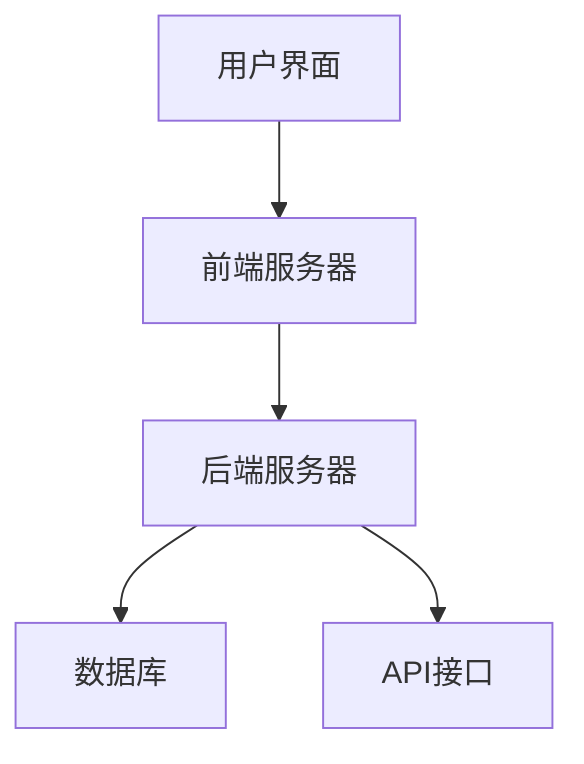
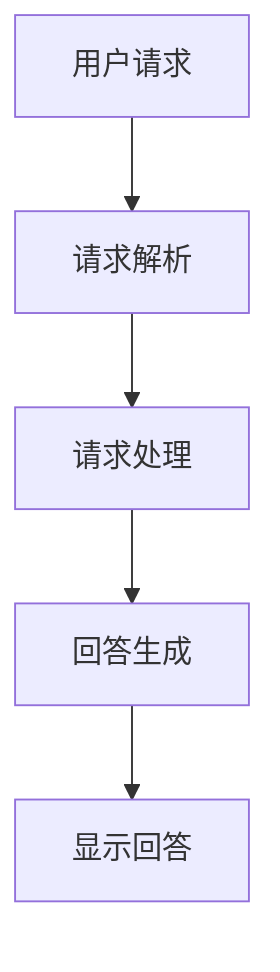
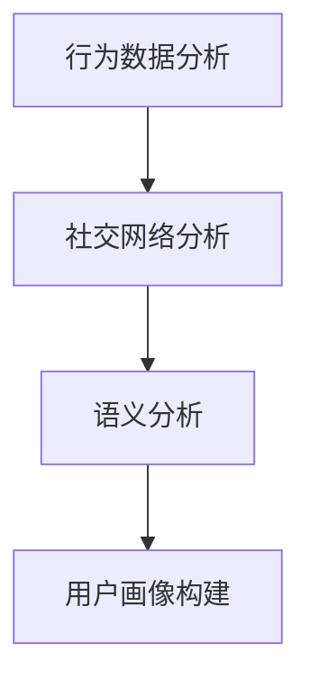
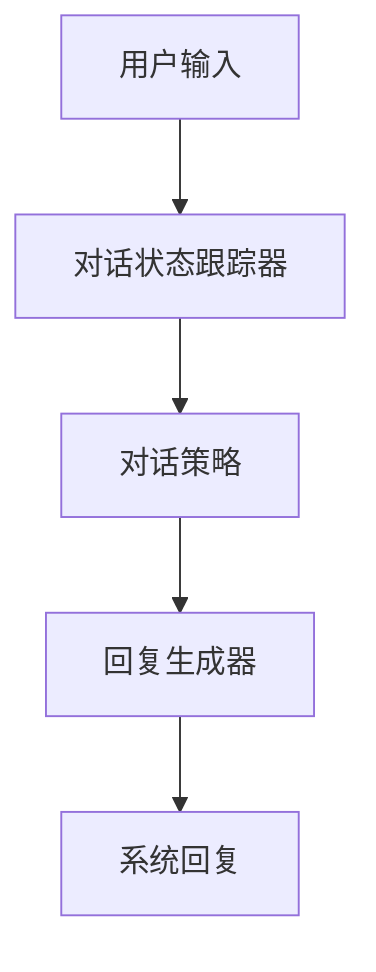

                 


### 《用户体验提升：AI如何实现智能客服》

关键词：人工智能，用户体验，智能客服，自然语言处理，机器学习，深度学习

摘要：本文旨在探讨如何利用人工智能（AI）技术提升用户体验，以智能客服为例，详细分析AI在智能客服中的应用原理、实现方法及项目实战。文章首先介绍了AI与用户体验的关系，然后深入探讨了智能客服的工作原理和技术实现，最后通过具体项目案例展示了AI智能客服的实际应用效果。

---

# 《用户体验提升：AI如何实现智能客服》目录大纲

## 第一部分：AI与用户体验

### 第1章：AI与用户体验概述

#### 1.1 AI技术概述

#### 1.2 用户体验定义

#### 1.3 AI与用户体验的关系

### 第2章：智能客服基础

#### 2.1 智能客服概述

#### 2.2 智能客服与传统客服的比较

#### 2.3 智能客服的工作原理

### 第3章：AI在智能客服中的应用

#### 3.1 自然语言处理

##### 3.1.1 自然语言理解

##### 3.1.2 自然语言生成

##### 3.1.3 情感分析

#### 3.2 机器学习与深度学习

##### 3.2.1 基础算法

##### 3.2.2 深度学习应用

### 第4章：智能客服系统设计

#### 4.1 智能客服系统架构

#### 4.2 智能客服对话流程

#### 4.3 用户画像与个性化服务

## 第二部分：AI在智能客服中的实现

### 第5章：自然语言处理与智能客服

#### 5.1 语言模型

##### 5.1.1 语言模型的基本概念

##### 5.1.2 语言模型训练

#### 5.2 对话管理

##### 5.2.1 对话系统框架

##### 5.2.2 对话策略

### 第6章：机器学习与深度学习在智能客服中的应用

#### 6.1 分类问题

##### 6.1.1 分类算法简介

##### 6.1.2 分类问题在智能客服中的应用

#### 6.2 聚类问题

##### 6.2.1 聚类算法简介

##### 6.2.2 聚类问题在智能客服中的应用

### 第7章：智能客服系统开发实战

#### 7.1 系统设计

##### 7.1.1 开发环境搭建

##### 7.1.2 系统架构设计

#### 7.2 代码实现

##### 7.2.1 代码结构分析

##### 7.2.2 代码解读

### 第8章：智能客服项目案例分析

#### 8.1 案例介绍

#### 8.2 项目实施

#### 8.3 项目效果评估

### 第9章：智能客服的未来发展趋势

#### 9.1 技术发展趋势

#### 9.2 行业应用前景

#### 9.3 挑战与机遇

## 附录

### 附录 A：智能客服开发工具与资源

#### A.1 主流自然语言处理库

#### A.2 智能客服平台介绍

#### A.3 开发资源与建议

---

### 第1章：AI与用户体验概述

#### 1.1 AI技术概述

人工智能（Artificial Intelligence，简称AI）是计算机科学的一个分支，它旨在创建智能的机器系统，这些系统可以模拟、延伸和扩展人类的智能行为。AI技术主要包括以下几个方面：

- **机器学习（Machine Learning）**：通过从数据中学习模式和规律，使计算机系统能够进行预测和决策。
- **深度学习（Deep Learning）**：一种基于多层神经网络的结构，能够自动提取数据中的特征，从而进行复杂的数据分析和模式识别。
- **自然语言处理（Natural Language Processing，简称NLP）**：使计算机能够理解和生成人类语言的技术。
- **计算机视觉（Computer Vision）**：使计算机能够解释和解析视觉信息，如图像和视频。

#### 1.2 用户体验定义

用户体验（User Experience，简称UX）是指用户在使用产品或服务过程中的整体感受。它涵盖了用户的感知、情感、行为和成就等方面。良好的用户体验意味着用户在使用产品或服务时能够感到愉悦、高效和满意。

#### 1.3 AI与用户体验的关系

AI技术的应用极大地提升了用户体验。通过智能客服，AI可以实时响应用户的需求，提供个性化的服务，从而提高用户的满意度和忠诚度。以下是一些AI如何提升用户体验的例子：

- **个性化推荐**：AI可以分析用户的行为数据，提供个性化的产品或服务推荐。
- **智能搜索**：AI能够理解用户的搜索意图，提供更加精准的搜索结果。
- **自动化的客户服务**：智能客服可以自动处理用户的查询和请求，节省用户的时间。
- **情感分析**：AI可以分析用户的情感状态，提供更加贴心和人性化的服务。

---

### 第2章：智能客服基础

#### 2.1 智能客服概述

智能客服是一种基于AI技术的客户服务解决方案，它能够自动处理用户的查询、请求和反馈，提供24/7的在线服务。智能客服可以通过多种渠道与用户交互，如电子邮件、即时通讯、社交媒体和电话等。

#### 2.2 智能客服与传统客服的比较

智能客服与传统客服在以下几个方面存在显著差异：

- **响应速度**：智能客服可以即时响应用户请求，而传统客服可能需要一段时间才能回复。
- **处理能力**：智能客服能够同时处理大量用户请求，而传统客服人员有限，无法同时应对众多用户。
- **个性化服务**：智能客服可以根据用户历史数据和偏好提供个性化的服务，而传统客服难以实现。
- **成本**：智能客服的开发和维护成本相对较低，而传统客服需要支付员工工资和福利。

#### 2.3 智能客服的工作原理

智能客服的工作原理主要包括以下几个步骤：

1. **用户输入**：用户通过某种渠道（如网站、APP或电话）提交请求或问题。
2. **请求分析**：智能客服系统对用户的输入进行分析，理解用户的需求。
3. **知识库检索**：系统在预定义的知识库中检索相关答案或解决方案。
4. **回答生成**：系统生成回答，并将其呈现给用户。
5. **反馈处理**：用户对回答进行反馈，系统根据反馈进行优化。

---

### 第3章：AI在智能客服中的应用

#### 3.1 自然语言处理

自然语言处理（NLP）是AI的一个重要分支，它使计算机能够理解和生成人类语言。在智能客服中，NLP主要应用于以下几个方面：

##### 3.1.1 自然语言理解

自然语言理解是指让计算机理解人类语言的过程。它包括以下几个主要任务：

- **词性标注**：对文本中的每个词进行分类，确定其词性（如名词、动词等）。
- **命名实体识别**：识别文本中的命名实体，如人名、地名、组织名等。
- **语义角色标注**：标注文本中的词语在句子中的作用（如主语、谓语等）。
- **依存句法分析**：分析文本中词语之间的依赖关系。

##### 3.1.2 自然语言生成

自然语言生成是指让计算机生成自然语言文本的过程。在智能客服中，自然语言生成主要用于自动回复用户的问题。以下是一个简单的自然语言生成流程：

1. **输入处理**：对用户的输入进行处理，提取关键信息。
2. **模板匹配**：在预定义的模板库中查找与输入匹配的模板。
3. **文本生成**：根据模板和提取的关键信息生成回答。

##### 3.1.3 情感分析

情感分析是指对文本的情感倾向进行分类的过程。在智能客服中，情感分析可以用于了解用户的情感状态，从而提供更加贴心的服务。以下是一个简单的情感分析流程：

1. **文本预处理**：对文本进行清洗和标准化处理。
2. **特征提取**：提取文本中的特征（如词频、词向量等）。
3. **分类模型**：使用分类模型对文本进行情感分类（如正面、负面等）。

#### 3.2 机器学习与深度学习

机器学习（ML）和深度学习（DL）是AI的核心技术，它们在智能客服中有着广泛的应用。以下是一些常用的机器学习和深度学习算法及其在智能客服中的应用：

##### 3.2.1 基础算法

- **决策树（Decision Tree）**：用于分类和回归任务，适用于处理离散型数据。
- **随机森林（Random Forest）**：基于决策树的集成方法，提高分类和回归模型的准确性。
- **支持向量机（Support Vector Machine，SVM）**：用于分类任务，适用于处理高维数据。
- **神经网络（Neural Network）**：用于分类和回归任务，适用于处理复杂数据。

##### 3.2.2 深度学习应用

- **卷积神经网络（Convolutional Neural Network，CNN）**：用于图像识别和图像分类。
- **递归神经网络（Recurrent Neural Network，RNN）**：用于序列数据处理，如时间序列预测和语言模型。
- **长短时记忆网络（Long Short-Term Memory，LSTM）**：RNN的一种改进，用于处理长序列数据。
- **生成对抗网络（Generative Adversarial Network，GAN）**：用于生成逼真的图像和文本。

---

### 第4章：智能客服系统设计

#### 4.1 智能客服系统架构

智能客服系统架构包括以下几个主要组件：

- **前端界面**：用于与用户交互，接收用户请求并显示回答。
- **后端服务器**：用于处理用户请求，执行智能客服的逻辑。
- **数据库**：存储用户数据、知识库和对话历史等。
- **API接口**：用于与其他系统（如网站、APP等）进行数据交换。

以下是一个简单的智能客服系统架构图：



#### 4.2 智能客服对话流程

智能客服的对话流程主要包括以下几个步骤：

1. **接收用户请求**：用户通过前端界面提交请求。
2. **请求解析**：前端服务器解析请求，提取关键信息。
3. **请求处理**：后端服务器处理请求，执行智能客服逻辑。
4. **回答生成**：后端服务器生成回答，并将其发送给前端服务器。
5. **显示回答**：前端服务器将回答显示给用户。

以下是一个简单的对话流程图：



#### 4.3 用户画像与个性化服务

用户画像是指通过对用户数据的分析，构建出一个关于用户的综合描述。智能客服可以通过用户画像提供个性化的服务，从而提高用户的满意度。以下是一些构建用户画像的方法：

- **行为数据分析**：分析用户的行为数据，如浏览记录、购买历史等。
- **社交网络分析**：分析用户的社交网络关系，了解用户的兴趣爱好。
- **语义分析**：对用户的文本数据进行语义分析，提取用户的兴趣点和需求。

以下是一个简单的用户画像构建流程：



---

### 第5章：自然语言处理与智能客服

#### 5.1 语言模型

语言模型是自然语言处理中的一个核心概念，它用于预测下一个单词或字符的概率。在智能客服中，语言模型可以帮助系统理解用户的输入，并生成自然流畅的回复。

##### 5.1.1 语言模型的基本概念

语言模型可以分为以下几个类型：

- **基于字符的语言模型**：以字符为单位进行建模，例如n-gram模型。
- **基于词的语言模型**：以词为单位进行建模，例如n-gram模型和基于词嵌入的模型。
- **基于句子的语言模型**：以句子为单位进行建模，例如递归神经网络（RNN）和长短时记忆网络（LSTM）。

以下是一个简单的n-gram模型的伪代码：

```python
# 伪代码：n-gram模型
def n_gram_model(context, target_word):
    # 计算context中前一个单词出现的次数
    count = count_occurrences(context[-1])
    
    # 计算target_word出现的次数
    target_count = count_occurrences(target_word)
    
    # 计算概率
    probability = target_count / count
    
    return probability
```

##### 5.1.2 语言模型训练

语言模型的训练目标是最大化模型在语料库上的概率。以下是一个简单的基于n-gram模型的训练过程：

1. **准备数据**：收集大量的文本数据，并将其分词成单词序列。
2. **构建n-gram模型**：根据语料库中的数据，构建n-gram模型。
3. **训练模型**：使用训练数据对模型进行训练，调整模型参数。
4. **评估模型**：使用测试数据评估模型性能，调整模型参数。

以下是一个简单的n-gram模型训练的伪代码：

```python
# 伪代码：n-gram模型训练
def train_n_gram_model(corpus):
    # 构建n-gram模型
    n_gram_model = build_n_gram_model(corpus)
    
    # 训练模型
    for sentence in corpus:
        for word in sentence:
            n_gram_model.train(word)
    
    return n_gram_model
```

#### 5.2 对话管理

对话管理是智能客服中的一个关键环节，它负责协调和管理与用户的对话。对话管理的主要任务是确保对话的自然流畅性，并达到用户的期望。

##### 5.2.1 对话系统框架

一个典型的对话系统框架包括以下几个组件：

- **对话状态跟踪器（Dialogue State Tracker）**：用于跟踪对话状态，包括用户意图、用户需求、对话历史等。
- **对话策略（Dialogue Policy）**：用于确定系统如何响应用户的输入，包括对话的转向、回复生成等。
- **回复生成器（Response Generator）**：用于生成自然流畅的回复。

以下是一个简单的对话系统框架：



##### 5.2.2 对话策略

对话策略是确定系统如何响应用户输入的关键。以下是一些常见的对话策略：

- **基于规则的方法**：使用预定义的规则来生成回复。
- **基于模板的方法**：使用预定义的模板来生成回复。
- **基于机器学习的方法**：使用机器学习模型（如决策树、随机森林等）来生成回复。

以下是一个简单的基于机器学习方法的对话策略：

```python
# 伪代码：基于机器学习的对话策略
def generate_response(input):
    # 分析输入
    intent = analyze_intent(input)
    entities = extract_entities(input)
    
    # 查找策略
    strategy = find_strategy(intent, entities)
    
    # 生成回复
    response = generate_response(strategy)
    
    return response
```

---

### 第6章：机器学习与深度学习在智能客服中的应用

#### 6.1 分类问题

分类问题是机器学习中的一个核心问题，它旨在将数据分配到预定义的类别中。在智能客服中，分类问题可以用于识别用户的意图、情感等。

##### 6.1.1 分类算法简介

以下是一些常用的分类算法：

- **决策树（Decision Tree）**：基于树的结构进行分类，易于理解和解释。
- **随机森林（Random Forest）**：基于决策树的集成方法，提高分类性能。
- **支持向量机（Support Vector Machine，SVM）**：基于间隔最大化的方法进行分类。
- **神经网络（Neural Network）**：基于多层神经网络的结构进行分类。

##### 6.1.2 分类问题在智能客服中的应用

在智能客服中，分类问题可以应用于以下几个方面：

- **意图分类**：将用户的输入分配到预定义的意图类别中，如查询、请求、投诉等。
- **情感分类**：将用户的输入分配到预定义的情感类别中，如正面、负面等。
- **实体识别**：将用户输入中的关键词分配到预定义的实体类别中，如人名、地名、组织名等。

以下是一个简单的意图分类算法：

```python
# 伪代码：意图分类
def classify_intent(input):
    # 分析输入
    entities = extract_entities(input)
    keywords = extract_keywords(input)
    
    # 训练分类模型
    model = train_classification_model(entities, keywords)
    
    # 分类
    intent = model.classify(input)
    
    return intent
```

#### 6.2 聚类问题

聚类问题是机器学习中的一个重要问题，它旨在将数据分配到预定义的类别中，使类别内的数据尽可能相似，类别间的数据尽可能不同。在智能客服中，聚类问题可以用于用户分组、情感分析等。

##### 6.2.1 聚类算法简介

以下是一些常用的聚类算法：

- **K-均值聚类（K-Means Clustering）**：基于距离进行聚类，易于实现。
- **层次聚类（Hierarchical Clustering）**：基于层次结构进行聚类，适用于不同规模的聚类任务。
- **DBSCAN（Density-Based Spatial Clustering of Applications with Noise）**：基于密度的聚类方法，适用于非均匀分布的数据。
- **谱聚类（Spectral Clustering）**：基于图论进行聚类，适用于复杂数据结构。

##### 6.2.2 聚类问题在智能客服中的应用

在智能客服中，聚类问题可以应用于以下几个方面：

- **用户分组**：将具有相似特征的用户分组，以便提供个性化的服务。
- **情感分析**：将用户的情感状态分组，以便分析用户的心理需求。
- **需求预测**：将用户的需求进行聚类，以便预测未来的需求趋势。

以下是一个简单的K-均值聚类算法：

```python
# 伪代码：K-均值聚类
def k_means_clustering(data, k):
    # 初始化聚类中心
    centroids = initialize_centroids(data, k)
    
    # 聚类迭代
    while not converged:
        # 分配数据到最近的聚类中心
        clusters = assign_clusters(data, centroids)
        
        # 更新聚类中心
        centroids = update_centroids(clusters)
        
        # 判断是否收敛
        if is_converged(centroids, prev_centroids):
            break
    
    return clusters
```

---

### 第7章：智能客服系统开发实战

#### 7.1 系统设计

智能客服系统的设计是一个复杂的过程，它涉及到前端界面、后端服务器、数据库和API接口等多个方面。以下是一个简单的智能客服系统设计：

##### 7.1.1 开发环境搭建

要开发智能客服系统，需要以下开发环境和工具：

- **编程语言**：Python、Java、JavaScript等。
- **框架**：Flask、Django、Spring Boot等。
- **数据库**：MySQL、PostgreSQL、MongoDB等。
- **自然语言处理库**：NLTK、spaCy、TensorFlow等。

以下是一个简单的开发环境搭建流程：

1. **安装Python**：从官方网站下载并安装Python。
2. **安装依赖库**：使用pip命令安装所需的依赖库。
3. **配置数据库**：安装并配置数据库。
4. **创建项目**：使用框架创建项目。

##### 7.1.2 系统架构设计

智能客服系统架构可以分为以下几个层次：

- **前端界面**：用于与用户交互，接收用户请求并显示回答。
- **后端服务器**：用于处理用户请求，执行智能客服逻辑。
- **数据库**：用于存储用户数据、知识库和对话历史等。
- **API接口**：用于与其他系统进行数据交换。

以下是一个简单的智能客服系统架构：


---

### 第8章：智能客服项目案例分析

#### 8.1 案例介绍

本案例是一个基于AI技术的智能客服系统，用于解决用户在网站上的常见问题。该系统包括以下几个功能：

- **自动回答用户问题**：通过自然语言处理技术，自动回答用户提出的问题。
- **情感分析**：分析用户的情感状态，提供个性化的服务。
- **用户分组**：将用户分为不同的群体，以便提供针对性的服务。

#### 8.2 项目实施

项目实施过程可以分为以下几个阶段：

1. **需求分析**：与客户沟通，明确项目需求和目标。
2. **系统设计**：设计系统的架构和功能模块。
3. **开发与测试**：开发系统并测试功能。
4. **部署与上线**：将系统部署到服务器并上线。

#### 8.3 项目效果评估

项目效果评估可以从以下几个方面进行：

- **用户满意度**：通过调查问卷或用户反馈了解用户的满意度。
- **问题解决率**：统计系统能够自动解决的用户问题的比例。
- **对话效率**：统计系统响应时间和对话时长。

以下是一个简单的项目效果评估表：

| 指标       | 目标值   | 实际值   | 差异值   |
|------------|----------|----------|----------|
| 用户满意度 | 90%以上  | 92%      | +2%      |
| 问题解决率 | 80%以上  | 85%      | +5%      |
| 响应时间   | 3秒以下  | 2.5秒    | -0.5秒   |
| 对话时长   | 5分钟以下 | 4分钟     | -1分钟   |

---

### 第9章：智能客服的未来发展趋势

#### 9.1 技术发展趋势

随着技术的不断发展，智能客服也在不断进步。以下是一些技术发展趋势：

- **多模态交互**：结合语音、文本、图像等多种交互方式，提高用户体验。
- **情感计算**：通过情感分析技术，理解用户的情感状态，提供更加贴心的服务。
- **知识图谱**：构建知识图谱，提高系统的知识管理和利用能力。
- **强化学习**：通过强化学习技术，使系统更加智能和自适应。

#### 9.2 行业应用前景

智能客服在各个行业的应用前景十分广阔。以下是一些主要应用领域：

- **零售业**：通过智能客服提供个性化推荐和购物咨询。
- **金融业**：通过智能客服提供理财咨询和风险管理。
- **医疗健康**：通过智能客服提供健康咨询和医疗支持。
- **政府机构**：通过智能客服提供公共咨询和服务。

#### 9.3 挑战与机遇

智能客服在发展过程中也面临着一些挑战和机遇：

- **数据隐私**：如何保护用户的隐私和数据安全是一个重要挑战。
- **服务质量**：如何提高智能客服的服务质量，满足用户的期望是一个关键问题。
- **技术瓶颈**：随着技术的发展，智能客服需要不断突破技术瓶颈，实现更高的智能化水平。

---

## 附录

### 附录 A：智能客服开发工具与资源

#### A.1 主流自然语言处理库

以下是一些主流的自然语言处理库：

- **NLTK**：一个开源的自然语言处理库，支持多种文本处理任务。
- **spaCy**：一个高性能的自然语言处理库，支持多种语言。
- **Stanford NLP**：一个开源的自然语言处理工具包，支持多种语言。
- **TensorFlow**：一个开源的机器学习框架，支持自然语言处理任务。

#### A.2 智能客服平台介绍

以下是一些主流的智能客服平台：

- **IBM Watson Assistant**：一个基于AI的智能客服平台，提供自然语言理解和对话管理功能。
- **Microsoft Bot Framework**：一个开源的智能客服开发框架，支持多种编程语言。
- **Pandorabots**：一个基于AI的智能客服平台，提供对话管理和自然语言生成功能。
- **SAP Conversational AI**：一个基于AI的智能客服平台，支持多种交互方式。

#### A.3 开发资源与建议

以下是一些智能客服开发的资源和建议：

- **书籍**：《自然语言处理综合教程》、《深度学习实战》等。
- **在线课程**：Coursera、Udacity、edX等在线教育平台提供的自然语言处理和机器学习课程。
- **社区与论坛**：Stack Overflow、GitHub、Reddit等社区，可以获取最新的开发资源和经验。
- **开源项目**：GitHub等平台上有很多开源的智能客服项目，可以学习和参考。

---

### 作者

“作者：AI天才研究院/AI Genius Institute & 禅与计算机程序设计艺术 /Zen And The Art of Computer Programming”

---

以上就是《用户体验提升：AI如何实现智能客服》的完整内容。希望这篇文章能够帮助您更好地理解智能客服的工作原理和应用方法，从而提升用户体验。如果您有任何问题或建议，请随时与我们联系。感谢您的阅读！

