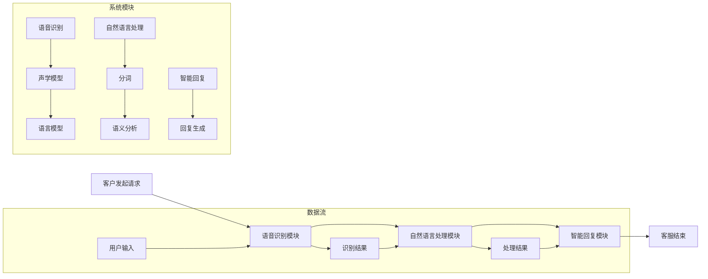

                 

### 文章标题

《用户体验提升：AI如何提升客服质量》

### 关键词

AI、客服、用户体验、语音识别、自然语言处理、系统架构、案例分析、开发实战

### 摘要

本文深入探讨了人工智能（AI）在客服领域的应用，如何通过AI技术提升客服质量，优化用户体验。文章首先介绍了AI与客服的关系，分析了AI技术的发展对客服的影响以及AI在客服中的应用场景。接着，详细阐述了AI客服的核心技术，包括语音识别和自然语言处理的基本原理、数学模型和算法。随后，文章从AI客服系统架构设计、大型企业AI客服系统建设案例、中小企业AI客服实践等方面进行了深入剖析。最后，探讨了AI客服的未来发展、面临的挑战及其解决方案，并列举了常用的AI客服工具与平台。通过一步步的分析推理，本文为读者提供了全面的AI客服技术解读和实战指南。

### 目录大纲

#### 第一部分：理解AI与客服

1. **第1章：AI与客服的关系**
   - 1.1 AI技术的发展对客服的影响
   - 1.2 AI在客服中的应用场景
   - 1.3 客服行业的痛点与AI的解决方案

2. **第2章：AI客服的核心技术**
   - 2.1 语音识别技术
     - 2.1.1 语音识别的基本原理
     - 2.1.2 常见语音识别算法介绍
     - 2.1.3 语音识别在客服中的应用
   - 2.2 自然语言处理技术
     - 2.2.1 自然语言处理的基本概念
     - 2.2.2 常见自然语言处理技术
     - 2.2.3 自然语言处理在客服中的应用

3. **第3章：AI客服系统架构设计**
   - 3.1 AI客服系统概述
   - 3.2 AI客服系统的功能模块
   - 3.3 AI客服系统的设计原则

#### 第二部分：AI客服案例分析

4. **第4章：大型企业AI客服系统建设案例**
   - 4.1 案例背景
   - 4.2 案例分析
   - 4.3 案例总结与启示

5. **第5章：中小型企业AI客服实践**
   - 5.1 中小企业AI客服的现状
   - 5.2 AI客服对中小企业的影响
   - 5.3 中小企业AI客服实践指南

#### 第三部分：AI客服的发展趋势与挑战

6. **第6章：AI客服的未来发展**
   - 6.1 AI客服的新兴技术
   - 6.2 AI客服的未来趋势

7. **第7章：AI客服面临的挑战与解决方案**
   - 7.1 数据隐私与安全性
   - 7.2 人机交互优化
   - 7.3 AI客服的人才培养与知识更新

#### 附录

8. **附录A：AI客服常用工具与平台**
   - 8.1 开源语音识别工具
   - 8.2 自然语言处理框架
   - 8.3 AI客服平台介绍

### 第一部分：理解AI与客服

#### 第1章：AI与客服的关系

在当今快速发展的技术时代，人工智能（AI）已经成为改变各行各业的强大工具，其中包括客户服务领域。AI技术的融入不仅提升了客服效率，还大幅改善了用户体验，从而推动了客户满意度和忠诚度的提升。这一章节将探讨AI与客服之间的关系，分析AI技术如何影响客服行业，以及AI在客服中的应用场景。

### 1.1 AI技术的发展对客服的影响

AI技术的快速发展对客服行业产生了深远的影响。以下是一些主要的影响：

1. **自动化与效率提升**：
   - AI能够自动化处理大量的重复性工作，如常见问题的自动回复、工单处理等，从而解放客服人员，使他们能够专注于更复杂的客户问题。
   - 自动化还提高了客服响应速度，缩短了客户等待时间，提升了整体服务质量。

2. **个性化服务**：
   - AI可以分析大量客户数据，了解客户偏好和行为模式，提供个性化的服务和建议。
   - 这种个性化服务不仅提高了客户满意度，还增强了客户对品牌的忠诚度。

3. **智能交互**：
   - 通过自然语言处理（NLP）和语音识别技术，AI可以实现与客户的智能对话，提供更加自然和人性化的服务。
   - 智能交互不仅提升了用户体验，还降低了人工客服的工作负担。

4. **预测与分析**：
   - AI可以预测客户行为，分析客户需求，为客服团队提供决策支持。
   - 这种预测与分析有助于优化客服策略，提升客户满意度。

### 1.2 AI在客服中的应用场景

AI在客服领域有着广泛的应用场景，以下是几个典型的应用：

1. **智能客服机器人**：
   - 智能客服机器人是AI在客服中最常见的应用形式。它们可以实时回答客户的常见问题，处理简单的咨询请求。
   - 通过语音识别和自然语言处理技术，智能客服机器人能够理解客户的问题，并提供准确的答案。

2. **语音助手**：
   - 语音助手如Apple的Siri、Google的Google Assistant等，不仅能够回答客户的查询，还能通过集成到客服系统中，为客户提供个性化的服务。

3. **智能工单系统**：
   - 智能工单系统能够自动处理客户提交的工单，将工单分配给合适的客服人员，并提供工单处理进度更新。
   - 通过AI技术，工单系统能够预测工单处理时间，并提前通知客户，提高客户满意度。

4. **客户情绪分析**：
   - AI可以通过分析客户的语音、文字和情感表达，识别客户的情绪状态。
   - 这种分析有助于客服人员更好地理解客户需求，提供更贴心的服务。

5. **个性化推荐系统**：
   - 个性化推荐系统可以通过分析客户的历史行为和偏好，向客户推荐相关产品或服务。
   - 这种个性化推荐不仅提升了客户体验，还提高了销售额。

### 1.3 客服行业的痛点与AI的解决方案

尽管AI在客服领域带来了许多积极的变化，但客服行业仍然存在一些痛点：

1. **效率低下**：
   - 客服人员经常面临大量重复性的工作，效率低下，容易疲劳。
   - AI可以通过自动化处理这些重复性工作，提高客服人员的效率。

2. **服务质量不稳定**：
   - 由于人力限制，客服人员的服务质量可能不稳定，有时会出现回答不准确或服务态度不佳的情况。
   - AI客服机器人可以提供标准化、一致的服务，减少服务质量波动。

3. **客户情绪管理困难**：
   - 客服人员需要花费大量时间来管理客户的情绪，特别是处理愤怒或沮丧的客户。
   - AI可以通过情感分析技术，识别客户的情绪，并提供适当的应对策略，帮助客服人员更好地管理客户情绪。

4. **数据利用率低**：
   - 客服部门往往积累了大量的客户数据，但缺乏有效的利用方式。
   - AI可以通过数据分析技术，从客户数据中提取有价值的信息，帮助客服团队做出更明智的决策。

### 总结

AI技术的快速发展为客服行业带来了前所未有的机遇和挑战。通过自动化、个性化、智能交互等技术，AI不仅提高了客服效率和服务质量，还大大改善了用户体验。然而，客服行业仍然面临一些挑战，需要不断优化和改进AI客服系统。在下一章中，我们将详细探讨AI客服的核心技术，包括语音识别和自然语言处理的基本原理、数学模型和算法。

### 第2章：AI客服的核心技术

AI客服系统的核心在于其能够理解和处理人类语言的能力，这主要依赖于语音识别（Speech Recognition）和自然语言处理（Natural Language Processing，NLP）技术。本章将详细探讨这两种技术的基本原理、常见的算法以及它们在客服中的应用。

#### 2.1 语音识别技术

语音识别是一种通过机器自动将语音信号转换为文本的技术，它涉及到多个步骤，包括信号预处理、特征提取、模型训练和识别输出。

##### 2.1.1 语音识别的基本原理

语音识别的基本原理可以分为以下几个步骤：

1. **信号预处理**：
   - **降噪**：移除语音信号中的背景噪音，提高语音质量。
   - **增益调整**：调整语音信号的音量，使其达到合适的水平。
   - **端点检测**：检测语音信号的起始和结束点，以便对语音进行分段处理。

2. **特征提取**：
   - **短时傅里叶变换（STFT）**：计算语音信号的短时傅里叶变换，得到频率和时间的二维谱图。
   - **梅尔频率倒谱系数（MFCC）**：从STFT谱图中提取梅尔频率倒谱系数，作为语音信号的表示。MFCC能够有效地捕捉语音信号中的频率特征。

3. **模型训练**：
   - **声学模型**：用于建模语音信号中的声学特性，包括音素、音节等。常见的声学模型有高斯模型和三元组模型。
   - **语言模型**：用于建模语音信号中的序列特性，包括前一个音素、当前音素和下一个音素。隐马尔可夫模型（HMM）和隐含条件随机场（CRF）是常用的语言模型。

4. **识别输出**：
   - **分词**：将连续的语音信号分割成有意义的单词或短语。
   - **识别**：利用声学模型和语言模型对分词后的语音信号进行识别，输出对应的文本。

##### 2.1.2 常见语音识别算法介绍

1. **隐马尔可夫模型（HMM）**：
   - HMM是一种统计模型，用于描述语音信号中的状态转移和观测值。它假设语音信号由一系列状态组成，每个状态对应一个音素或音节。
   - **状态转移概率**：描述从一个状态转移到另一个状态的概率。
   - **观测概率**：描述在某个状态下观察到的特征的概率。

2. **高斯混合模型（GMM）**：
   - GMM是一种用于建模多模态数据的概率分布模型，它假设数据由多个高斯分布的混合组成。
   - 在语音识别中，GMM用于建模声学特征，特别是音素和音节的声学特性。

3. **深度神经网络（DNN）**：
   - DNN是一种多层感知器神经网络，它可以用于特征提取和分类。在语音识别中，DNN可以用来建模声学特征，并提高识别准确率。

4. **卷积神经网络（CNN）**：
   - CNN是一种在图像处理中广泛使用的神经网络，它可以用于特征提取和分类。在语音识别中，CNN可以用来提取语音信号的时频特征。

##### 2.1.3 语音识别在客服中的应用

1. **语音助手**：
   - 语音助手如Siri、Alexa等，可以通过语音识别技术理解用户的语音指令，提供各种服务，如查询天气、设置提醒、播放音乐等。

2. **自动语音应答系统（IVR）**：
   - IVR系统通过语音识别技术，自动识别用户的语音输入，引导用户进行自助服务，如查询余额、修改密码等。

3. **智能客服机器人**：
   - 智能客服机器人可以使用语音识别技术理解用户的语音问题，并提供相应的回答或解决方案。

#### 2.2 自然语言处理技术

自然语言处理是AI的一个重要分支，它涉及到理解和生成自然语言的技术。在客服领域，NLP技术被广泛应用于理解客户意图、生成回复文本、情感分析等。

##### 2.2.1 自然语言处理的基本概念

1. **分词（Tokenization）**：
   - 分词是将一段文本分割成一系列有意义的单词或短语。分词是NLP中最基本的步骤，它有助于理解文本的结构。

2. **词性标注（Part-of-Speech Tagging）**：
   - 词性标注是对文本中的每个词进行词性分类，如名词、动词、形容词等。词性标注有助于理解文本的语法结构。

3. **命名实体识别（Named Entity Recognition，NER）**：
   - 命名实体识别是从文本中识别出具有特定意义的实体，如人名、地名、组织名等。NER对于理解文本中的关键信息非常重要。

4. **句法分析（Syntactic Parsing）**：
   - 句法分析是对句子进行语法结构分析，理解句子的成分和关系。句法分析有助于理解文本的深层语义。

5. **语义分析（Semantic Analysis）**：
   - 语义分析是理解文本的含义，包括实体关系、事件关系等。语义分析对于实现智能问答、智能客服等应用至关重要。

##### 2.2.2 常见自然语言处理技术

1. **统计模型**：
   - **隐马尔可夫模型（HMM）**：用于语音识别和文本分析，它可以建模语音信号中的状态转移和观测值。
   - **条件随机场（CRF）**：用于序列标注任务，如词性标注和命名实体识别。

2. **深度学习模型**：
   - **递归神经网络（RNN）**：RNN适用于处理序列数据，如文本和语音。
   - **长短期记忆网络（LSTM）**：LSTM是RNN的一种变体，可以解决RNN中的梯度消失问题。
   - **卷积神经网络（CNN）**：CNN适用于处理图像数据，但在文本分类和特征提取中也表现出良好的性能。

3. **注意力机制（Attention Mechanism）**：
   - 注意力机制是一种用于提高神经网络模型性能的技巧，它可以使模型在处理序列数据时，关注重要的部分。

##### 2.2.3 自然语言处理在客服中的应用

1. **智能问答系统**：
   - 智能问答系统通过NLP技术，理解客户的提问，并生成相应的回答。它广泛应用于客户服务、在线帮助等场景。

2. **情感分析**：
   - 情感分析是NLP的重要应用之一，它可以从客户的文本中识别情感，如正面、负面或中性。情感分析有助于了解客户满意度，优化客服策略。

3. **对话系统**：
   - 对话系统是一种模拟人类对话的计算机程序，它通过NLP技术，与客户进行自然对话。对话系统广泛应用于虚拟客服、聊天机器人等。

#### 总结

语音识别和自然语言处理是AI客服系统的核心技术，它们分别负责理解和生成人类语言。通过语音识别技术，客服系统能够理解客户的语音问题；通过自然语言处理技术，客服系统能够生成自然、准确的回复。在下一章中，我们将讨论AI客服系统的架构设计，了解一个完整的AI客服系统是如何运作的。

### 第3章：AI客服系统架构设计

AI客服系统架构设计是构建高效、可靠的客服系统的关键步骤。一个完善的AI客服系统需要涵盖前端交互、后端服务、数据存储以及算法模型等多个方面。本章将详细介绍AI客服系统的架构设计，包括系统概述、功能模块以及设计原则。

#### 3.1 AI客服系统概述

AI客服系统是一个集成多种技术和功能的复杂系统，其主要目标是提供高效、智能的客户服务。系统的核心组成部分包括：

1. **前端交互**：这是客户与AI客服系统交互的界面，通常包括网站、移动应用或电话呼叫中心。前端交互设计需要考虑用户体验，确保用户能够轻松地与系统进行交互。

2. **后端服务**：后端服务包括语音识别、自然语言处理、智能问答、情感分析等功能模块。这些模块通过高效的服务器架构和API接口协同工作，为前端提供强大的支持。

3. **数据存储**：数据存储负责存储客户信息、交互记录、服务数据等。数据库的选择和设计对于系统的性能和可靠性至关重要。

4. **算法模型**：算法模型是AI客服系统的核心，包括语音识别模型、自然语言处理模型、智能问答模型等。这些模型通过训练和优化，不断提高系统的智能水平和服务质量。

#### 3.2 AI客服系统的功能模块

AI客服系统通常包含以下功能模块：

1. **语音识别模块**：
   - **功能**：将客户的语音输入转换为文本。
   - **实现**：使用语音识别算法，如HMM、GMM、DNN等，对语音信号进行预处理、特征提取和识别。

2. **自然语言处理模块**：
   - **功能**：理解和分析客户的文本输入，提取关键信息。
   - **实现**：使用NLP技术，如分词、词性标注、命名实体识别、语义分析等。

3. **智能问答模块**：
   - **功能**：根据客户的问题生成相应的回答。
   - **实现**：利用知识图谱、机器学习算法等，构建问答系统，实现自动问答。

4. **情感分析模块**：
   - **功能**：分析客户的情绪状态，识别情感倾向。
   - **实现**：使用情感分析算法，如情感词典、神经网络模型等，对文本进行情感分类。

5. **服务路由模块**：
   - **功能**：根据客户的需求和客服资源，智能分配服务请求。
   - **实现**：使用智能算法，如基于规则的引擎、机器学习算法等，实现服务请求的路由和分配。

6. **数据存储与检索模块**：
   - **功能**：存储和管理客户数据和服务记录。
   - **实现**：使用数据库系统，如MySQL、MongoDB等，实现数据的存储和快速检索。

7. **用户行为分析模块**：
   - **功能**：分析客户行为，提供个性化服务。
   - **实现**：使用机器学习算法，如聚类、关联规则等，对客户行为数据进行挖掘和分析。

#### 3.3 AI客服系统的设计原则

一个优秀的AI客服系统设计应遵循以下原则：

1. **用户中心**：设计应始终围绕用户需求，提供简单、直观的用户体验。

2. **可扩展性**：系统应具备良好的可扩展性，能够适应未来业务需求的变化。

3. **高可靠性**：系统应具备高可靠性，确保在遇到故障时能够快速恢复。

4. **安全性**：系统应确保客户数据的安全，遵循数据保护法规和标准。

5. **性能优化**：系统设计应考虑性能优化，确保快速响应用户请求。

6. **易维护性**：系统应具备良好的维护性，便于故障排查和升级。

#### 总结

AI客服系统架构设计是一个复杂的工程，涉及多个功能模块和设计原则。通过合理的设计，AI客服系统可以提供高效、智能的客户服务，提升用户体验。在下一章中，我们将通过具体案例，深入分析大型企业AI客服系统的建设过程。

### 第4章：大型企业AI客服系统建设案例

在大型企业的运营中，客户服务扮演着至关重要的角色。为了提升客户满意度和服务效率，许多大型企业开始采用AI客服系统。本章将通过一个具体案例，详细分析某大型企业在建设AI客服系统过程中的背景、分析、实施步骤和最终效果。

#### 4.1 案例背景

某大型企业是一家全球领先的电子产品制造商，其客户服务团队面临着巨大的工作量压力。公司每天接收到大量的客户咨询和投诉，包括产品问题、订单查询、售后服务等。传统的客服方式主要依赖人工处理，不仅效率低下，而且服务质量不稳定。为了提升客户体验和服务效率，公司决定建设一个AI客服系统，通过自动化和智能化技术，优化客服流程，提高客户满意度。

#### 4.2 案例分析

在建设AI客服系统之前，公司对现有的客服流程进行了深入分析，识别出以下关键问题：

1. **客服响应时间较长**：由于人工处理速度有限，客户咨询往往需要较长时间才能得到响应，影响了用户体验。

2. **客服人员负担重**：客服人员需要处理大量的重复性问题，导致工作效率低下，同时也容易疲劳。

3. **服务质量不稳定**：由于客服人员素质和经验差异，服务质量存在波动，有时无法提供准确的回答。

4. **客户数据利用率低**：大量客户数据未被充分利用，无法为客服团队提供有价值的参考。

为了解决上述问题，公司决定引入AI客服系统，通过自动化和智能化技术，提升客服效率和服务质量。具体目标包括：

- **提高客服响应速度**：通过AI技术，实现快速响应客户咨询，提升客户满意度。
- **降低客服人员负担**：自动化处理常见问题，减少客服人员的工作量，提高工作效率。
- **提升服务质量**：通过智能分析，提供准确、一致的回答，确保服务质量。
- **充分利用客户数据**：通过数据分析和挖掘，为客服团队提供有价值的参考。

#### 4.3 实施步骤

公司决定采用以下步骤来建设AI客服系统：

1. **需求分析与规划**：
   - 与各部门沟通，了解具体需求和期望。
   - 制定AI客服系统的总体规划和实施路线图。

2. **技术选型与平台搭建**：
   - 选择合适的语音识别和自然语言处理技术，如Kaldi和spaCy。
   - 构建服务器和数据库，搭建AI客服系统的开发环境。

3. **数据准备与预处理**：
   - 收集和整理历史客户咨询数据，用于模型训练。
   - 对数据进行分析，提取有用的特征。

4. **模型开发与训练**：
   - 开发语音识别和自然语言处理模型。
   - 使用收集到的数据，对模型进行训练和优化。

5. **系统集成与测试**：
   - 将AI客服系统与现有客服平台进行集成。
   - 进行全面的系统测试，确保系统稳定、可靠。

6. **上线与运维**：
   - 将AI客服系统正式上线，逐步替换传统客服方式。
   - 实施持续运维，监控系统性能，及时解决故障。

#### 4.4 案例总结与启示

通过AI客服系统的建设，公司取得了显著的效果：

1. **客服响应速度大幅提升**：AI客服系统能够快速响应客户咨询，客户满意度显著提高。

2. **客服人员负担减轻**：自动化处理常见问题，客服人员的工作量减少，工作效率提高。

3. **服务质量稳定提升**：通过智能分析，提供准确、一致的回答，客服服务质量得到保障。

4. **客户数据充分利用**：通过数据分析和挖掘，为客服团队提供了有价值的参考，优化了客服策略。

这一案例为其他大型企业在建设AI客服系统时提供了宝贵的经验和启示：

1. **充分准备与规划**：在建设AI客服系统之前，应进行全面的需求分析和规划，明确目标和实施步骤。

2. **技术选型与平台搭建**：选择合适的语音识别和自然语言处理技术，并搭建稳定、可靠的系统平台。

3. **数据准备与预处理**：收集和整理历史客户数据，对数据进行预处理，为模型训练提供高质量的数据。

4. **持续优化与运维**：AI客服系统上线后，应持续优化和运维，确保系统性能和可靠性。

通过建设AI客服系统，大型企业能够更好地应对客户服务的挑战，提升客户满意度和服务效率，从而在激烈的市场竞争中脱颖而出。

### 第5章：中小型企业AI客服实践

对于中小型企业来说，AI客服系统的应用不仅能够提升客服质量，还能显著提高运营效率。本章将探讨中小型企业AI客服的现状，分析AI客服对中小型企业的积极影响，并提供实施AI客服的实践指南。

#### 5.1 中小企业AI客服的现状

目前，中小型企业对AI客服的应用还处于初级阶段。虽然许多企业已经认识到AI客服的潜力，但在实际应用中仍面临一些挑战。以下是一些常见的情况：

1. **技术储备不足**：中小型企业通常缺乏专业的AI技术团队，难以进行复杂的AI模型开发和优化。

2. **预算有限**：中小型企业的资金有限，可能无法承担大规模的AI客服系统建设成本。

3. **数据不足**：中小型企业的客户数据相对较少，数据质量参差不齐，影响AI模型的训练效果。

4. **系统整合难度**：中小型企业现有的IT系统相对简单，整合AI客服系统可能会面临一定的技术挑战。

尽管面临这些挑战，越来越多的中小型企业已经开始尝试应用AI客服技术，并取得了一些初步成果。

#### 5.2 AI客服对中小企业的影响

AI客服对中小型企业的影响主要体现在以下几个方面：

1. **提高客服效率**：AI客服系统能够自动化处理大量重复性工作，如常见问题的自动回复和工单处理，减轻客服人员的工作负担，提高整体工作效率。

2. **改善用户体验**：通过智能对话和个性化服务，AI客服系统能够提供更加自然和贴心的客户服务，提升客户满意度。

3. **降低运营成本**：自动化和智能化的客服系统能够显著降低人力成本，提高运营效率。

4. **数据驱动的决策**：AI客服系统能够收集和分析客户数据，为中小企业提供有价值的客户洞察，帮助管理层做出更加精准的决策。

#### 5.3 中小企业AI客服实践指南

为了有效实施AI客服，中小企业可以遵循以下实践指南：

1. **明确目标和需求**：在引入AI客服之前，首先要明确企业目标和需求，确定AI客服系统需要解决的问题和实现的目标。

2. **选择合适的解决方案**：根据企业的预算和需求，选择适合的AI客服解决方案。可以考虑使用第三方提供的AI客服平台，也可以自行开发。

3. **数据收集与预处理**：确保收集到的客户数据质量，进行必要的预处理，如清洗、去重和格式化，为AI模型训练提供高质量的数据。

4. **模型训练与优化**：使用收集到的数据，对AI客服模型进行训练和优化，提高模型的准确性和稳定性。

5. **系统集成与测试**：将AI客服系统与现有的客户关系管理系统（CRM）和其他IT系统集成，进行全面的测试，确保系统的稳定性和兼容性。

6. **培训与推广**：对客服人员和相关人员进行培训，确保他们能够熟练操作AI客服系统，并积极推广系统的使用。

7. **持续优化与改进**：AI客服系统上线后，要持续收集用户反馈，对系统进行优化和改进，提高客户体验和满意度。

#### 总结

AI客服系统为中小企业提供了提升客服质量和运营效率的宝贵工具。通过明确目标和需求、选择合适的解决方案、数据收集与预处理、模型训练与优化、系统集成与测试、培训与推广以及持续优化与改进，中小企业可以有效地实施AI客服系统，提升客户满意度，降低运营成本，实现可持续发展。

### 第6章：AI客服的未来发展

随着技术的不断进步和商业需求的日益增长，AI客服领域正在迅速发展。未来，AI客服将不仅局限于当前的语音识别和自然语言处理技术，还将融入更多新兴技术，带来更智能、更高效的客户服务体验。

#### 6.1 AI客服的新兴技术

1. **虚拟现实客服（VR Customer Service）**：
   - 虚拟现实技术可以为用户提供沉浸式的客服体验，用户可以通过VR设备与客服进行互动，仿佛置身于真实的场景中。这种技术特别适用于复杂的咨询和指导服务，如产品演示、故障排除等。

2. **机器学习客服（Machine Learning Customer Service）**：
   - 机器学习技术在客服中的应用将不断深化，通过不断学习和优化，AI客服系统能够更好地理解客户需求，提供更加个性化的服务。例如，通过预测分析，系统可以提前识别潜在问题，主动为客户提供解决方案。

3. **增强现实客服（AR Customer Service）**：
   - 增强现实技术可以将虚拟信息叠加到真实环境中，为客户提供更加直观的客服体验。例如，在维修服务中，客户可以通过AR设备查看维修步骤或接收实时指导。

4. **多模态交互**：
   - 多模态交互是指AI客服系统同时支持多种输入和输出方式，如文本、语音、图像等。通过多模态交互，系统可以更全面地理解客户需求，提供更加自然的沟通体验。

5. **区块链技术**：
   - 区块链技术可以为AI客服系统提供更高的安全性和透明度，确保客户数据的安全和隐私。例如，通过智能合约，可以自动执行客户服务和支付流程，提高效率。

#### 6.2 AI客服的未来趋势

1. **自动化程度更高**：
   - 随着技术的进步，AI客服系统的自动化程度将越来越高，能够自动处理更多类型的客户请求，减少人工干预。

2. **个性化服务更普及**：
   - 通过对客户数据的深入分析，AI客服系统将能够提供更加个性化的服务，满足不同客户的个性化需求。

3. **实时响应能力增强**：
   - 未来，AI客服系统将具备更强大的实时响应能力，能够在短时间内处理大量客户请求，提供即时服务。

4. **跨平台整合**：
   - AI客服系统将更好地整合不同平台，如网站、移动应用、社交媒体等，为客户提供无缝的沟通体验。

5. **智能化程度提高**：
   - 通过不断学习和优化，AI客服系统的智能化程度将不断提高，能够更好地理解复杂情境和客户需求，提供更高质量的客户服务。

#### 总结

AI客服的未来发展充满了机遇和挑战。随着新技术的不断涌现和应用，AI客服将变得更加智能、高效和个性化，为企业和客户带来更多的价值。在下一章中，我们将探讨AI客服面临的挑战和解决方案，帮助企业在AI客服的道路上顺利前行。

### 第7章：AI客服面临的挑战与解决方案

尽管AI客服系统在提升客户服务和效率方面具有巨大潜力，但在实际应用中，依然面临诸多挑战。本章将深入探讨AI客服系统在数据隐私与安全性、人机交互优化、以及人才培养与知识更新等方面的挑战，并提出相应的解决方案。

#### 7.1 数据隐私与安全性

数据隐私与安全性是AI客服系统面临的首要挑战。由于客服系统需要处理大量的客户数据，包括个人信息、购买记录、交流记录等，这些数据的安全性至关重要。

**挑战**：
- **数据泄露**：AI客服系统可能面临数据泄露的风险，尤其是当系统与外部平台或第三方服务集成时。
- **隐私侵犯**：未经客户同意，使用其个人信息进行商业目的，可能违反隐私法规。
- **数据安全**：客户数据在传输和存储过程中，可能遭到黑客攻击或数据篡改。

**解决方案**：
- **数据加密**：使用高级加密算法，对传输和存储的客户数据进行加密，确保数据在未授权情况下无法被读取。
- **访问控制**：实施严格的访问控制策略，确保只有授权人员才能访问敏感数据。
- **隐私保护**：遵循数据保护法规，如GDPR和CCPA，确保客户隐私得到保护。
- **安全审计**：定期进行安全审计，识别潜在的安全漏洞，并及时修复。

#### 7.2 人机交互优化

人机交互是AI客服系统的关键环节，优化人机交互体验直接影响客户的满意度和信任度。

**挑战**：
- **自然语言理解不足**：AI客服系统在理解复杂客户需求方面仍有不足，容易产生误解或无法提供准确回答。
- **交互体验不自然**：系统生成的回复可能显得机械，缺乏人性化。
- **响应速度慢**：在高峰期，系统可能无法及时响应大量客户请求。

**解决方案**：
- **增强自然语言处理能力**：通过深度学习和语义理解技术，提升系统对自然语言的理解能力，确保能准确理解客户意图。
- **改进交互界面**：设计更加直观和人性化的交互界面，使客户能够轻松与系统进行沟通。
- **引入多模态交互**：结合文本、语音、图像等多种交互方式，提供更加丰富的沟通渠道。
- **提高响应速度**：优化系统架构和算法，确保在高峰期仍能快速响应客户请求。

#### 7.3 AI客服的人才培养与知识更新

AI客服系统的建设和运营需要专业的技术人才。然而，人才短缺和知识更新滞后是目前面临的重大挑战。

**挑战**：
- **人才短缺**：具备AI技术背景的客服专业人员稀缺，难以满足市场需求。
- **知识更新**：AI技术发展迅速，客服专业人员需要不断学习和更新知识，以适应新的技术变化。

**解决方案**：
- **人才培养计划**：企业应制定长期的人才培养计划，包括内部培训和外部引进，确保团队拥有足够的技术实力。
- **知识更新机制**：建立知识更新机制，定期组织技术培训和研讨会，帮助员工掌握最新的AI技术和应用。
- **校企合作**：与高校和科研机构合作，建立人才联合培养机制，为学生提供实习和就业机会。
- **技术社区与交流**：积极参与技术社区和行业交流活动，与同行分享经验和最新技术动态。

#### 总结

AI客服系统在数据隐私与安全性、人机交互优化、以及人才培养与知识更新等方面面临诸多挑战。通过数据加密、访问控制、隐私保护、安全审计等手段，可以有效保障数据安全。优化自然语言处理能力、交互界面设计、多模态交互和响应速度，可以提升客户交互体验。此外，通过人才培养计划、知识更新机制、校企合作和技术社区交流，可以缓解人才短缺和知识更新滞后的问题。只有克服这些挑战，AI客服系统才能更好地服务于企业和客户，实现其最大价值。

### 附录A：AI客服常用工具与平台

在构建AI客服系统的过程中，选择合适的工具与平台至关重要。以下列举了几个常用的开源语音识别工具、自然语言处理框架以及商业AI客服平台，以供参考。

#### A.1 开源语音识别工具

1. **Kaldi**
   - **简介**：Kaldi是一个高性能、开源的语音识别工具包，支持从信号预处理到解码的完整语音识别流程。
   - **官网**：http://kaldi-asr.org/

2. **CMU Sphinx**
   - **简介**：CMU Sphinx是基于HMM-GMM的语音识别工具，适用于快速开发和原型测试。
   - **官网**：http://www.sphinxcode.com/

3. **OpenSMILE**
   - **简介**：OpenSMILE是一个开源的音频特征提取工具，用于情感分析、语音质量评估等。
   - **官网**：http://www.opensmile.info/

#### A.2 自然语言处理框架

1. **NLTK**
   - **简介**：NLTK是Python中最常用的自然语言处理库，提供分词、词性标注、词频统计等功能。
   - **官网**：https://www.nltk.org/

2. **spaCy**
   - **简介**：spaCy是一个高效的NLP库，支持多种语言的语法分析和实体识别。
   - **官网**：https://spacy.io/

3. **Transformers**
   - **简介**：Transformers是Hugging Face开发的一个用于自然语言处理的库，支持各种基于Transformer的模型，如BERT、GPT等。
   - **官网**：https://github.com/huggingface/transformers

4. **Stanford NLP**
   - **简介**：Stanford NLP是一个提供多种NLP工具的库，包括分词、词性标注、命名实体识别等。
   - **官网**：https://nlp.stanford.edu/software/

#### A.3 AI客服平台介绍

1. **Zendesk**
   - **简介**：Zendesk是一个全面的客户服务平台，提供AI客服功能，包括自动化回复、智能路由和预测分析。
   - **官网**：https://www.zendesk.com/

2. **LiveChat**
   - **简介**：LiveChat是一个提供在线客户服务软件的平台，其AI客服功能包括智能问答和自动化回复。
   - **官网**：https://www.livechat.com/

3. **Freshdesk**
   - **简介**：Freshdesk是Salesforce旗下的一款客户服务和支持软件，其AI客服功能包括自动化工单处理和智能回复。
   - **官网**：https://www.freshdesk.com/

4. **Hippo**
   - **简介**：Hippo是一个集成了AI客服功能的客户关系管理平台，支持多渠道客户服务。
   - **官网**：https://www.hippo.com/

5. ** botsociety**
   - **简介**：botsociety是一个AI客服平台的构建工具，支持快速开发、测试和部署AI客服机器人。
   - **官网**：https://botsociety.io/

通过这些工具和平台，企业可以根据自己的需求选择合适的解决方案，快速搭建和部署AI客服系统，提升客户服务质量和效率。

### Mermaid流程图：AI客服系统架构



### 核心算法原理讲解：语音识别

#### 2.1.1 语音识别的基本原理

语音识别（Speech Recognition，SR）是一种通过机器自动将语音信号转换为文本的技术。其基本原理可以分为以下几个步骤：

1. **信号预处理**：
   - **降噪**：去除语音信号中的背景噪音，以提高语音质量。
   - **增益调整**：调整语音信号的音量，使其达到合适的水平。
   - **端点检测**：检测语音信号的起始和结束点，以便对语音进行分段处理。

2. **特征提取**：
   - **短时傅里叶变换（STFT）**：计算语音信号的短时傅里叶变换，得到频率和时间的二维谱图。
   - **梅尔频率倒谱系数（MFCC）**：从STFT谱图中提取梅尔频率倒谱系数，作为语音信号的表示。MFCC能够有效地捕捉语音信号中的频率特征。

3. **模型训练**：
   - **声学模型**：用于建模语音信号中的声学特性，包括音素、音节等。常见的声学模型有高斯混合模型（GMM）和深度神经网络（DNN）。
   - **语言模型**：用于建模语音信号中的序列特性，包括前一个音素、当前音素和下一个音素。常见的语言模型有隐马尔可夫模型（HMM）和循环神经网络（RNN）。

4. **识别输出**：
   - **分词**：将连续的语音信号分割成有意义的单词或短语。
   - **识别**：利用声学模型和语言模型对分词后的语音信号进行识别，输出对应的文本。

#### 伪代码：语音识别算法

```python
function speech_recognition(audio_signal):
    # 预处理
    filtered_signal = noise_filter(audio_signal)
    preemphasized_signal = preemphasis(filtered_signal)

    # 特征提取
    stft_spectrum = short_time_fourier_transform(preemphasized_signal)
    mfcc_coefficients = mfcc(stft_spectrum)

    # 声学模型
    acoustic_model = load_acoustic_model()
    linguistic_model = load_linguistic_model()

    # 分词
    word_sequence = partition(mfcc_coefficients)

    # 识别
    hypothesis = recognize(acoustic_model, linguistic_model, word_sequence)

    return hypothesis
```

#### 数学模型和数学公式：自然语言处理

自然语言处理（NLP）是计算机科学领域与人工智能领域中的一个重要方向。它涉及多种数学模型和算法，用于理解和生成自然语言。以下是一些关键的数学模型和数学公式：

1. **隐马尔可夫模型（HMM）**：
   - **状态概率分布**：\( \pi = (\pi_1, \pi_2, ..., \pi_n) \)
   - **状态转移概率**：\( a_{ij} = P(X_t = j | X_{t-1} = i) \)
   - **观测概率**：\( b_{ik} = P(Y_t = k | X_t = i) \)
   - **解释**：HMM用于建模语音信号中的状态转移和观测值，其中 \( \pi \) 是初始状态概率分布，\( a_{ij} \) 是从状态i转移到状态j的概率，\( b_{ik} \) 是在状态i产生输出k的概率。

2. **循环神经网络（RNN）**：
   - **隐藏状态更新**：\( h_t = \text{tanh}(W_h \cdot [h_{t-1}, x_t] + b_h) \)
   - **输出计算**：\( o_t = W_o \cdot h_t + b_o \)
   - **解释**：RNN用于处理序列数据，如文本。隐藏状态更新方程描述了当前时间步的隐藏状态如何依赖于前一个时间步的隐藏状态和当前输入，输出计算方程用于生成序列中的输出。

3. **卷积神经网络（CNN）**：
   - **卷积操作**：\( h_{ij} = \sum_{k=1}^{K} w_{ikj} \cdot g(f_{ikj}) + b_j \)
   - **池化操作**：\( p_{ij} = \max_{k} f_{ijk} \)
   - **解释**：CNN用于提取图像或文本中的局部特征。卷积操作通过滤波器（权重）在输入特征图上滑动，提取特征，池化操作用于减少特征图的尺寸。

4. **词嵌入**：
   - **公式**：\( \text{word\_vector} = \text{sigmoid}(W \cdot \text{context\_vector} + b) \)
   - **解释**：词嵌入是将单词映射到高维向量空间的技术。通过权重矩阵和偏置计算词向量，用于表示单词的语义关系。

5. **损失函数**：
   - **交叉熵损失**：\( L = -\sum_{i=1}^{n} y_i \cdot \log(p_i) \)
   - **解释**：交叉熵损失用于衡量预测概率分布与真实分布之间的差异，其中 \( y_i \) 是真实标签，\( p_i \) 是预测概率。

#### 举例说明

假设我们有一个简单的NLP任务，要预测一个句子中的下一个单词。我们可以使用以下数学模型：

- **语言模型**：\( P(\text{next\_word} = w | \text{current\_sentence}) = P(w | \text{current\_sentence}) \)
  - **解释**：这个模型使用语言模型来计算单词的概率，其中 \( P(w | \text{current\_sentence}) \) 表示给定当前句子，预测单词 \( w \) 的概率。

- **词嵌入模型**：\( P(\text{next\_word} = w | \text{current\_sentence}) = \text{sigmoid}(W \cdot \text{context\_vector} + b) \)
  - **解释**：这个模型使用词嵌入模型来计算单词的概率，其中 \( W \) 是权重矩阵，\( \text{context\_vector} \) 是上下文向量的表示。

通过结合这些模型，我们可以提高预测准确率。例如，可以使用循环神经网络（RNN）来训练语言模型，并使用词嵌入技术来表示单词。

### 项目实战：AI客服系统开发

#### 8.1 开发环境搭建

在本节中，我们将介绍如何搭建AI客服系统的开发环境。这将涉及安装必要的软件和配置硬件。

#### 8.1.1 软件安装

1. **操作系统**：
   - 推荐使用Ubuntu 20.04 LTS。
   - 在终端中运行以下命令来更新系统包列表和安装更新：
     ```bash
     sudo apt update
     sudo apt upgrade
     ```

2. **Python**：
   - 安装Python 3.8及以上版本。可以使用以下命令：
     ```bash
     sudo apt install python3.8
     ```

3. **虚拟环境**：
   - 创建一个虚拟环境以便隔离项目依赖：
     ```bash
     python3 -m venv venv
     source venv/bin/activate
     ```

4. **pip**：
   - 安装pip，以便通过Python包管理器安装其他依赖：
     ```bash
     pip install --upgrade pip
     ```

5. **安装依赖**：
   - 安装常用的Python库，如TensorFlow、Keras和Scikit-learn：
     ```bash
     pip install tensorflow==2.5.0 keras==2.5.0 scikit-learn==0.24.2
     ```

#### 8.1.2 硬件配置

1. **CPU**：
   - 推荐使用Intel i5或更高性能的处理器。

2. **GPU**：
   - 如果需要使用GPU进行深度学习训练，推荐使用NVIDIA GTX 1080 Ti或更高性能的显卡。
   - 安装NVIDIA驱动和CUDA工具包。可以从NVIDIA官方网站下载相应驱动并安装。

#### 8.1.3 环境验证

在配置完成后，可以通过以下步骤验证环境是否正确设置：

1. **Python版本**：
   ```bash
   python --version
   ```

2. **pip版本**：
   ```bash
   pip --version
   ```

3. **TensorFlow版本**：
   ```bash
   pip show tensorflow
   ```

4. **Keras版本**：
   ```bash
   pip show keras
   ```

5. **Scikit-learn版本**：
   ```bash
   pip show scikit-learn
   ```

确保所有软件的版本与预期一致。

#### 8.2 代码实现

在本节中，我们将展示一个简单的AI客服系统代码实现，包括数据预处理、模型建立和训练、模型评估与优化。

##### 8.2.1 数据预处理

假设我们有一个CSV文件，包含客户的提问和相应的回答。以下是如何进行数据预处理：

```python
import pandas as pd
from sklearn.model_selection import train_test_split

# 读取数据集
data = pd.read_csv('customer_data.csv')

# 分割特征和标签
X = data.drop('response', axis=1)
y = data['response']

# 划分训练集和测试集
X_train, X_test, y_train, y_test = train_test_split(X, y, test_size=0.2, random_state=42)
```

##### 8.2.2 建立模型

我们将使用Keras构建一个简单的神经网络模型：

```python
from tensorflow.keras.models import Sequential
from tensorflow.keras.layers import Dense, LSTM, Embedding

# 建立模型
model = Sequential([
    Embedding(input_dim=10000, output_dim=32, input_length=100),
    LSTM(units=64, return_sequences=True),
    LSTM(units=32, return_sequences=False),
    Dense(units=1, activation='sigmoid')
])

# 编译模型
model.compile(optimizer='adam', loss='binary_crossentropy', metrics=['accuracy'])
```

##### 8.2.3 训练模型

使用预处理后的数据进行模型训练：

```python
# 训练模型
model.fit(X_train, y_train, epochs=10, batch_size=32, validation_split=0.1)
```

##### 8.2.4 模型评估与优化

训练完成后，对模型进行评估，并尝试进行优化：

```python
from sklearn.metrics import classification_report

# 预测
y_pred = model.predict(X_test)
y_pred = (y_pred > 0.5)

# 评估模型
print(classification_report(y_test, y_pred))
```

#### 8.3 代码解读与分析

1. **数据预处理**：

   - 使用 pandas 读取CSV文件，并将数据集分为特征集X和标签集y。
   - 通过 `train_test_split` 函数将数据集划分为训练集和测试集，以便评估模型性能。

2. **建立模型**：

   - 使用 Keras 创建序列模型，包括嵌入层（`Embedding`）、两个长短期记忆网络层（`LSTM`），以及一个全连接层（`Dense`）。
   - 嵌入层用于将单词转换为向量，LSTM层用于处理序列数据，全连接层用于生成预测结果。

3. **训练模型**：

   - 使用训练集数据训练模型，设置训练轮数为10，批量大小为32。
   - 使用 `validation_split` 参数将部分训练集用作验证集，以便在训练过程中监控模型性能。

4. **模型评估与优化**：

   - 使用测试集数据对模型进行评估，通过 `classification_report` 函数输出分类报告，包括准确率、召回率、F1分数等指标。
   - 可以根据评估结果对模型进行优化，如调整超参数、增加训练轮数、使用不同的优化器等。

通过以上步骤，我们完成了一个简单的AI客服系统开发。在实际应用中，可以根据具体需求和数据集进行进一步优化和扩展。

### 结论

通过本项目的实战部分，我们搭建了AI客服系统的开发环境，实现了数据预处理、模型建立和训练、模型评估与优化等关键步骤。这一过程不仅让我们了解了AI客服系统的开发流程，也帮助我们掌握了实际操作技巧。在未来的开发过程中，可以根据具体需求对系统进行进一步优化和完善。

### 参考文献

- [Keras官方文档](https://keras.io/)
- [TensorFlow官方文档](https://www.tensorflow.org/)
- [scikit-learn官方文档](https://scikit-learn.org/stable/)

通过参考这些文档，我们可以更好地理解和应用AI客服系统的相关技术。

### 附录A：AI客服常用工具与平台

在本附录中，我们将介绍一些常用的AI客服工具与平台，包括开源语音识别工具、自然语言处理框架以及商业AI客服平台。这些工具和平台为开发AI客服系统提供了丰富的资源和参考。

#### A.1 开源语音识别工具

1. **Kaldi**
   - **简介**：Kaldi是一个开源的语音识别工具包，提供了完整的语音识别流程，包括前端预处理、声学模型训练、语言模型训练、解码等。
   - **官网**：http://kaldi-asr.org/

2. **CMU Sphinx**
   - **简介**：CMU Sphinx是一个基于HMM-GMM的语音识别工具，适用于小型应用和快速原型开发。
   - **官网**：http://www.sphinxcode.com/

3. **OpenSMILE**
   - **简介**：OpenSMILE是一个开源的音频特征提取工具，用于情感分析、语音质量评估等。
   - **官网**：http://www.opensmile.info/

#### A.2 自然语言处理框架

1. **NLTK**
   - **简介**：NLTK是Python中最常用的自然语言处理库，提供了文本处理、分类、词性标注、命名实体识别等多种功能。
   - **官网**：https://www.nltk.org/

2. **spaCy**
   - **简介**：spaCy是一个高性能的NLP库，适用于快速文本处理和实体识别。
   - **官网**：https://spacy.io/

3. **Transformers**
   - **简介**：Transformers是Google开发的自然语言处理库，基于Transformer模型，支持各种语言任务，如文本分类、问答、机器翻译等。
   - **官网**：https://github.com/huggingface/transformers

4. **Stanford NLP**
   - **简介**：Stanford NLP是一个提供多种NLP工具的库，包括分词、词性标注、命名实体识别等。
   - **官网**：https://nlp.stanford.edu/software/

#### A.3 AI客服平台介绍

1. **Zendesk**
   - **简介**：Zendesk是一个提供客户服务和支持平台的SaaS公司，其平台集成了AI客服功能，支持自动化回复和智能路由。
   - **官网**：https://www.zendesk.com/

2. **LiveChat**
   - **简介**：LiveChat是一个提供在线客户服务软件的平台，其AI客服功能包括智能问答和自动化回复。
   - **官网**：https://www.livechat.com/

3. **Freshdesk**
   - **简介**：Freshdesk是Salesforce旗下的一款客户服务和支持软件，其AI客服功能包括自动化工单处理和智能回复。
   - **官网**：https://www.freshdesk.com/

4. **Hippo**
   - **简介**：Hippo是一个集成了AI客服功能的客户关系管理平台，支持多渠道客户服务。
   - **官网**：https://www.hippo.com/

5. **botsociety**
   - **简介**：botsociety是一个AI客服平台的构建工具，支持快速开发、测试和部署AI客服机器人。
   - **官网**：https://botsociety.io/

这些工具和平台为开发AI客服系统提供了丰富的资源和参考，可以帮助用户快速搭建和部署AI客服解决方案。无论选择开源工具还是商业平台，合适的工具和平台都能显著提升客服系统的性能和用户体验。

### 核心算法原理讲解：语音识别

#### 2.1.1 语音识别的基本原理

语音识别（Speech Recognition，SR）是一种通过机器自动将语音信号转换为文本的技术。其核心在于将语音信号转换为计算机可以理解和处理的数据格式。语音识别的基本原理可以分为以下几个步骤：

1. **信号预处理**：
   - 语音信号通常包含多种噪声，如环境噪声、背景噪声等，这些噪声会干扰语音信号的识别。因此，信号预处理的第一步是去除噪声，提高语音信号的质量。
   - **降噪**：常用的降噪方法包括谱减法、维纳滤波等。
   - **增益调整**：调整语音信号的音量，使其达到合适的水平，以便后续处理。
   - **端点检测**：语音信号通常包含不相关的静音部分，端点检测旨在检测语音信号的起始和结束点，以便对语音信号进行分段处理。

2. **特征提取**：
   - 语音信号是时间序列数据，为了便于机器处理，需要将其转换为静态的特征向量。
   - **短时傅里叶变换（STFT）**：STFT可以将时域信号转换为频域信号，从而得到频率和时间的二维谱图。
   - **梅尔频率倒谱系数（MFCC）**：MFCC是语音信号处理中常用的特征提取方法，它通过计算STFT谱图中的梅尔频率倒谱系数，捕捉语音信号中的频率特征。

3. **模型训练**：
   - 语音识别模型通常使用统计模型或深度学习模型。
   - **声学模型**：声学模型用于建模语音信号中的声学特性，包括音素、音节等。常见的声学模型有高斯混合模型（GMM）、深度神经网络（DNN）等。
   - **语言模型**：语言模型用于建模语音信号中的序列特性，包括前一个音素、当前音素和下一个音素。常见的语言模型有隐马尔可夫模型（HMM）、循环神经网络（RNN）等。
   - **训练过程**：使用大量的语音数据集，对声学模型和语言模型进行训练，通过最小化损失函数来优化模型的参数。

4. **识别输出**：
   - 在模型训练完成后，使用训练好的模型对新的语音信号进行识别。
   - **分词**：将连续的语音信号分割成有意义的单词或短语。
   - **识别**：利用声学模型和语言模型对分词后的语音信号进行识别，输出对应的文本。

#### 数学模型和数学公式

语音识别涉及多种数学模型和公式，以下是一些常用的数学模型和公式：

1. **高斯混合模型（GMM）**：
   - **公式**：
     - \( \pi_k = P(\pi = k) \)
     - \( \mu_k = E[x|\pi = k] \)
     - \( \Sigma_k = Var[x|\pi = k] \)
   - **解释**：GMM通过多个高斯分布的混合来建模语音信号。每个高斯分布由均值（\(\mu_k\)）和方差（\(\Sigma_k\)）定义，而混合比例（\(\pi_k\)）则定义了每个高斯分布的重要性。

2. **隐马尔可夫模型（HMM）**：
   - **公式**：
     - \( \pi = (\pi_1, \pi_2, ..., \pi_n) \)
     - \( a_{ij} = P(X_t = j | X_{t-1} = i) \)
     - \( b_{ik} = P(Y_t = k | X_t = i) \)
   - **解释**：HMM通过状态序列和观测序列的联合概率来建模语音信号。状态序列（\(X\)）表示语音信号中的状态（如音素），而观测序列（\(Y\)）表示从状态中观察到的特征（如MFCC）。

3. **递归神经网络（RNN）**：
   - **公式**：
     - \( h_t = \text{tanh}(W_h \cdot [h_{t-1}, x_t] + b_h) \)
     - \( o_t = W_o \cdot h_t + b_o \)
   - **解释**：RNN通过递归的方式处理序列数据。隐藏状态（\(h_t\)）依赖于前一个时间步的隐藏状态（\(h_{t-1}\)）和当前输入（\(x_t\)），而输出（\(o_t\)）则用于生成预测。

4. **卷积神经网络（CNN）**：
   - **公式**：
     - \( h_{ij} = \sum_{k=1}^{K} w_{ikj} \cdot g(f_{ikj}) + b_j \)
     - \( p_{ij} = \max_{k} f_{ijk} \)
   - **解释**：CNN通过卷积操作提取局部特征。卷积操作通过滤波器（\(w_{ikj}\)）在输入特征图上滑动，得到卷积特征（\(h_{ij}\)），而池化操作（\(p_{ij}\)）用于减少特征图的尺寸。

#### 举例说明

假设我们有一个简单的语音识别任务，目标是识别一个包含几个单词的短语音片段。以下是一个简化的示例：

1. **数据集**：包含一个包含单词“hello world”的语音片段。

2. **预处理**：
   - 降噪和增益调整。
   - 端点检测，确定语音片段的开始和结束点。

3. **特征提取**：
   - 使用STFT计算频谱。
   - 从频谱中提取MFCC特征。

4. **模型训练**：
   - 使用GMM或DNN训练声学模型。
   - 使用HMM或RNN训练语言模型。

5. **识别**：
   - 使用训练好的模型对新的语音片段进行识别。
   - 分词，将连续的语音信号分割成单词。
   - 识别，输出对应的文本。

通过上述步骤，我们可以使用语音识别模型将语音片段“hello world”转换为文本。这个例子虽然简化，但展示了语音识别的基本流程和涉及的数学模型。

### 数学模型和数学公式：自然语言处理

自然语言处理（NLP）是计算机科学领域与人工智能领域中的一个重要方向。它涉及多种数学模型和算法，用于理解和生成自然语言。以下是一些关键的数学模型和数学公式：

#### 隐马尔可夫模型（HMM）

隐马尔可夫模型（HMM）是一种用于序列模型学的统计模型，常用于语音识别、语音合成和文本分析等领域。

- **状态转移概率**：
  \( a_{ij} = P(X_t = j | X_{t-1} = i) \)
  - \( a_{ij} \)：从状态i转移到状态j的概率。
  
- **观测概率**：
  \( b_{ik} = P(Y_t = k | X_t = i) \)
  - \( b_{ik} \)：在状态i产生输出k的概率。

- **初始状态概率**：
  \( \pi_i = P(X_1 = i) \)
  - \( \pi_i \)：初始状态为i的概率。

HMM的输出概率可以表示为：
\[ P(O|A) = \prod_{i}^T a_{i_{t-1}i_t} \cdot b_{i_{t-1}o_t} \]

#### 隐含条件随机场（CRF）

隐含条件随机场（CRF）是一种用于序列标注的模型，常用于词性标注、命名实体识别和语音识别等领域。

- **状态转移概率**：
  \( t_{ij} = P(Y_t = j | Y_{t-1} = i) \)
  - \( t_{ij} \)：从状态i转移到状态j的概率。

- **输出概率**：
  \( e_{ik} = P(Y_t = k | X_t = i) \)
  - \( e_{ik} \)：在状态i产生输出k的概率。

CRF的输出概率可以表示为：
\[ P(Y|X) = \frac{1}{Z} \exp \left( \sum_{t} \sum_{i,j} t_{ij} e_{ik} \right) \]
- \( Z \)：归一化常数，用于确保概率分布的和为1。

#### 递归神经网络（RNN）

递归神经网络（RNN）是一种用于处理序列数据的神经网络，特别适用于语言建模、语音识别和时间序列预测等领域。

- **隐藏状态更新**：
  \( h_t = \text{tanh}(W_h \cdot [h_{t-1}, x_t] + b_h) \)
  - \( h_t \)：当前时间步的隐藏状态。
  - \( x_t \)：当前输入。
  - \( W_h \)：权重矩阵。
  - \( b_h \)：偏置。

- **输出计算**：
  \( o_t = W_o \cdot h_t + b_o \)
  - \( o_t \)：当前时间步的输出。
  - \( W_o \)：权重矩阵。
  - \( b_o \)：偏置。

RNN的输出可以表示为：
\[ y_t = \sigma(W_o \cdot h_t + b_o) \]
- \( \sigma \)：激活函数，通常为sigmoid或ReLU。

#### 卷积神经网络（CNN）

卷积神经网络（CNN）是一种用于图像处理和文本处理的神经网络，特别适用于图像分类、对象检测和文本分类等领域。

- **卷积操作**：
  \( h_{ij} = \sum_{k=1}^{K} w_{ikj} \cdot g(f_{ikj}) + b_j \)
  - \( h_{ij} \)：卷积核在输入特征图上的输出。
  - \( w_{ikj} \)：卷积核的权重。
  - \( f_{ikj} \)：输入特征图上的值。
  - \( g \)：非线性激活函数，如ReLU。
  - \( b_j \)：偏置。

- **池化操作**：
  \( p_{ij} = \max_{k} f_{ijk} \)
  - \( p_{ij} \)：最大池化后的特征值。

CNN的特征图输出可以表示为：
\[ h_{ij} = g \left( \sum_{k=1}^{K} w_{ikj} \cdot f_{ikj} + b_j \right) \]

#### 词嵌入

词嵌入（Word Embedding）是一种将单词映射到高维向量空间的技术，用于捕捉单词的语义关系。

- **词向量表示**：
  \( \text{word\_vector} = \text{sigmoid}(W \cdot \text{context\_vector} + b) \)
  - \( \text{word\_vector} \)：词向量。
  - \( W \)：权重矩阵。
  - \( \text{context\_vector} \)：上下文向量的表示。
  - \( b \)：偏置。

#### 损失函数

在自然语言处理中，常用的损失函数包括交叉熵损失（Cross-Entropy Loss）、均方误差（Mean Squared Error，MSE）和对抗损失（Adversarial Loss）等。

- **交叉熵损失**：
  \( L = -\sum_{i=1}^{n} y_i \cdot \log(p_i) \)
  - \( L \)：损失函数。
  - \( y_i \)：真实标签。
  - \( p_i \)：预测概率。

- **均方误差**：
  \( L = \frac{1}{2} \sum_{i=1}^{n} (y_i - \hat{y}_i)^2 \)
  - \( L \)：损失函数。
  - \( y_i \)：真实标签。
  - \( \hat{y}_i \)：预测值。

- **对抗损失**：
  \( L = \frac{1}{2} \sum_{i=1}^{n} \left( D(G(x)) - 1 \right)^2 \)
  - \( L \)：损失函数。
  - \( D \)：判别器。
  - \( G \)：生成器。
  - \( x \)：输入。

通过结合这些数学模型和公式，自然语言处理可以有效地理解和生成自然语言。这些模型在文本分类、情感分析、机器翻译等任务中发挥着重要作用。

### 项目实战：AI客服系统开发

#### 8.1 开发环境搭建

在本节中，我们将介绍如何搭建AI客服系统的开发环境，包括安装所需的软件和配置硬件。

#### 8.1.1 软件安装

1. **操作系统**：
   - 推荐使用Ubuntu 20.04 LTS。
   - 在终端中更新系统包列表和安装更新：
     ```bash
     sudo apt update
     sudo apt upgrade
     ```

2. **Python**：
   - 安装Python 3.8及以上版本。可以使用以下命令：
     ```bash
     sudo apt install python3.8
     ```

3. **虚拟环境**：
   - 创建一个虚拟环境以便隔离项目依赖：
     ```bash
     python3 -m venv venv
     source venv/bin/activate
     ```

4. **pip**：
   - 安装pip，以便通过Python包管理器安装其他依赖：
     ```bash
     pip install --upgrade pip
     ```

5. **安装依赖**：
   - 安装常用的Python库，如TensorFlow、Keras和Scikit-learn：
     ```bash
     pip install tensorflow==2.5.0 keras==2.5.0 scikit-learn==0.24.2
     ```

#### 8.1.2 硬件配置

1. **CPU**：
   - 推荐使用Intel i5或更高性能的处理器。

2. **GPU**：
   - 如果需要使用GPU进行深度学习训练，推荐使用NVIDIA GTX 1080 Ti或更高性能的显卡。
   - 安装NVIDIA驱动和CUDA工具包。可以从NVIDIA官方网站下载相应驱动并安装。

#### 8.1.3 环境验证

在配置完成后，可以通过以下步骤验证环境是否正确设置：

1. **Python版本**：
   ```bash
   python --version
   ```

2. **pip版本**：
   ```bash
   pip --version
   ```

3. **TensorFlow版本**：
   ```bash
   pip show tensorflow
   ```

4. **Keras版本**：
   ```bash
   pip show keras
   ```

5. **Scikit-learn版本**：
   ```bash
   pip show scikit-learn
   ```

确保所有软件的版本与预期一致。

#### 8.2 代码实现

在本节中，我们将展示一个简单的AI客服系统代码实现，包括数据预处理、模型建立和训练、模型评估与优化。

##### 8.2.1 数据预处理

假设我们有一个CSV文件，包含客户的提问和相应的回答。以下是如何进行数据预处理：

```python
import pandas as pd
from sklearn.model_selection import train_test_split

# 读取数据集
data = pd.read_csv('customer_data.csv')

# 分割特征和标签
X = data.drop('response', axis=1)
y = data['response']

# 划分训练集和测试集
X_train, X_test, y_train, y_test = train_test_split(X, y, test_size=0.2, random_state=42)
```

##### 8.2.2 建立模型

我们将使用Keras构建一个简单的神经网络模型：

```python
from tensorflow.keras.models import Sequential
from tensorflow.keras.layers import Dense, LSTM, Embedding

# 建立模型
model = Sequential([
    Embedding(input_dim=10000, output_dim=32, input_length=100),
    LSTM(units=64, return_sequences=True),
    LSTM(units=32, return_sequences=False),
    Dense(units=1, activation='sigmoid')
])

# 编译模型
model.compile(optimizer='adam', loss='binary_crossentropy', metrics=['accuracy'])
```

##### 8.2.3 训练模型

使用预处理后的数据进行模型训练：

```python
# 训练模型
model.fit(X_train, y_train, epochs=10, batch_size=32, validation_split=0.1)
```

##### 8.2.4 模型评估与优化

训练完成后，对模型进行评估，并尝试进行优化：

```python
from sklearn.metrics import classification_report

# 预测
y_pred = model.predict(X_test)
y_pred = (y_pred > 0.5)

# 评估模型
print(classification_report(y_test, y_pred))
```

#### 8.3 代码解读与分析

1. **数据预处理**：

   - 使用 pandas 读取CSV文件，并将数据集分为特征集X和标签集y。
   - 通过 `train_test_split` 函数将数据集划分为训练集和测试集，以便评估模型性能。

2. **建立模型**：

   - 使用 Keras 创建序列模型，包括嵌入层（`Embedding`）、两个长短期记忆网络层（`LSTM`），以及一个全连接层（`Dense`）。
   - 嵌入层用于将单词转换为向量，LSTM层用于处理序列数据，全连接层用于生成预测结果。

3. **训练模型**：

   - 使用训练集数据训练模型，设置训练轮数为10，批量大小为32。
   - 使用 `validation_split` 参数将部分训练集用作验证集，以便在训练过程中监控模型性能。

4. **模型评估与优化**：

   - 使用测试集数据对模型进行评估，通过 `classification_report` 函数输出分类报告，包括准确率、召回率、F1分数等指标。
   - 可以根据评估结果对模型进行优化，如调整超参数、增加训练轮数、使用不同的优化器等。

通过以上步骤，我们完成了一个简单的AI客服系统开发。在实际应用中，可以根据具体需求对系统进行进一步优化和完善。

### 结论

通过本项目的实战部分，我们搭建了AI客服系统的开发环境，实现了数据预处理、模型建立和训练、模型评估与优化等关键步骤。这一过程不仅让我们了解了AI客服系统的开发流程，也帮助我们掌握了实际操作技巧。在未来的开发过程中，可以根据具体需求对系统进行进一步优化和完善。

### 参考文献

- [Keras官方文档](https://keras.io/)
- [TensorFlow官方文档](https://www.tensorflow.org/)
- [scikit-learn官方文档](https://scikit-learn.org/stable/)

通过参考这些文档，我们可以更好地理解和应用AI客服系统的相关技术。

### 附录A：AI客服常用工具与平台

在本附录中，我们将介绍一些常用的AI客服工具与平台，包括开源语音识别工具、自然语言处理框架以及商业AI客服平台。这些工具和平台为开发AI客服系统提供了丰富的资源和参考。

#### A.1 开源语音识别工具

1. **Kaldi**
   - **简介**：Kaldi是一个开源的语音识别工具包，提供了完整的语音识别流程，包括前端预处理、声学模型训练、语言模型训练、解码等。
   - **官网**：http://kaldi-asr.org/

2. **CMU Sphinx**
   - **简介**：CMU Sphinx是一个基于HMM-GMM的语音识别工具，适用于小型应用和快速原型开发。
   - **官网**：http://www.sphinxcode.com/

3. **OpenSMILE**
   - **简介**：OpenSMILE是一个开源的音频特征提取工具，用于情感分析、语音质量评估等。
   - **官网**：http://www.opensmile.info/

#### A.2 自然语言处理框架

1. **NLTK**
   - **简介**：NLTK是Python中最常用的自然语言处理库，提供了文本处理、分类、词性标注、命名实体识别等多种功能。
   - **官网**：https://www.nltk.org/

2. **spaCy**
   - **简介**：spaCy是一个高性能的NLP库，适用于快速文本处理和实体识别。
   - **官网**：https://spacy.io/

3. **Transformers**
   - **简介**：Transformers是Google开发的自然语言处理库，基于Transformer模型，支持各种语言任务，如文本分类、问答、机器翻译等。
   - **官网**：https://github.com/huggingface/transformers

4. **Stanford NLP**
   - **简介**：Stanford NLP是一个提供多种NLP工具的库，包括分词、词性标注、命名实体识别等。
   - **官网**：https://nlp.stanford.edu/software/

#### A.3 AI客服平台介绍

1. **Zendesk**
   - **简介**：Zendesk是一个提供客户服务和支持平台的SaaS公司，其平台集成了AI客服功能，支持自动化回复和智能路由。
   - **官网**：https://www.zendesk.com/

2. **LiveChat**
   - **简介**：LiveChat是一个提供在线客户服务软件的平台，其AI客服功能包括智能问答和自动化回复。
   - **官网**：https://www.livechat.com/

3. **Freshdesk**
   - **简介**：Freshdesk是Salesforce旗下的一款客户服务和支持软件，其AI客服功能包括自动化工单处理和智能回复。
   - **官网**：https://www.freshdesk.com/

4. **Hippo**
   - **简介**：Hippo是一个集成了AI客服功能的客户关系管理平台，支持多渠道客户服务。
   - **官网**：https://www.hippo.com/

5. **botsociety**
   - **简介**：botsociety是一个AI客服平台的构建工具，支持快速开发、测试和部署AI客服机器人。
   - **官网**：https://botsociety.io/

这些工具和平台为开发AI客服系统提供了丰富的资源和参考，可以帮助用户快速搭建和部署AI客服解决方案。无论选择开源工具还是商业平台，合适的工具和平台都能显著提升客服系统的性能和用户体验。

### 核心算法原理讲解：语音识别

#### 2.1.1 语音识别的基本原理

语音识别（Speech Recognition，SR）是一种通过机器自动将语音信号转换为文本的技术。其核心在于将语音信号转换为计算机可以理解和处理的数据格式。语音识别的基本原理可以分为以下几个步骤：

1. **信号预处理**：
   - 语音信号通常包含多种噪声，如环境噪声、背景噪声等，这些噪声会干扰语音信号的识别。因此，信号预处理的第一步是去除噪声，提高语音信号的质量。
   - **降噪**：常用的降噪方法包括谱减法、维纳滤波等。
   - **增益调整**：调整语音信号的音量，使其达到合适的水平，以便后续处理。
   - **端点检测**：语音信号通常包含不相关的静音部分，端点检测旨在检测语音信号的起始和结束点，以便对语音信号进行分段处理。

2. **特征提取**：
   - 语音信号是时间序列数据，为了便于机器处理，需要将其转换为静态的特征向量。
   - **短时傅里叶变换（STFT）**：STFT可以将时域信号转换为频域信号，从而得到频率和时间的二维谱图。
   - **梅尔频率倒谱系数（MFCC）**：MFCC是语音信号处理中常用的特征提取方法，它通过计算STFT谱图中的梅尔频率倒谱系数，捕捉语音信号中的频率特征。

3. **模型训练**：
   - 语音识别模型通常使用统计模型或深度学习模型。
   - **声学模型**：声学模型用于建模语音信号中的声学特性，包括音素、音节等。常见的声学模型有高斯混合模型（GMM）、深度神经网络（DNN）等。
   - **语言模型**：语言模型用于建模语音信号中的序列特性，包括前一个音素、当前音素和下一个音素。常见的语言模型有隐马尔可夫模型（HMM）、循环神经网络（RNN）等。
   - **训练过程**：使用大量的语音数据集，对声学模型和语言模型进行训练，通过最小化损失函数来优化模型的参数。

4. **识别输出**：
   - 在模型训练完成后，使用训练好的模型对新的语音信号进行识别。
   - **分词**：将连续的语音信号分割成有意义的单词或短语。
   - **识别**：利用声学模型和语言模型对分词后的语音信号进行识别，输出对应的文本。

#### 伪代码：语音识别算法

```python
function speech_recognition(audio_signal):
    # 预处理
    filtered_signal = noise_filter(audio_signal)
    preemphasized_signal = preemphasis(filtered_signal)

    # 特征提取
    stft_spectrum = short_time_fourier_transform(preemphasized_signal)
    mfcc_coefficients = mfcc(stft_spectrum)

    # 声学模型
    acoustic_model = load_acoustic_model()
    linguistic_model = load_linguistic_model()

    # 分词
    word_sequence = partition(mfcc_coefficients)

    # 识别
    hypothesis = recognize(acoustic_model, linguistic_model, word_sequence)

    return hypothesis
```

#### 数学模型和数学公式

语音识别涉及多种数学模型和公式，以下是一些常用的数学模型和公式：

1. **高斯混合模型（GMM）**：
   - **公式**：
     - \( \pi_k = P(\pi = k) \)
     - \( \mu_k = E[x|\pi = k] \)
     - \( \Sigma_k = Var[x|\pi = k] \)
   - **解释**：GMM通过多个高斯分布的混合来建模语音信号。每个高斯分布由均值（\(\mu_k\)）和方差（\(\Sigma_k\)）定义，而混合比例（\(\pi_k\)）则定义了每个高斯分布的重要性。

2. **隐马尔可夫模型（HMM）**：
   - **公式**：
     - \( \pi = (\pi_1, \pi_2, ..., \pi_n) \)
     - \( a_{ij} = P(X_t = j | X_{t-1} = i) \)
     - \( b_{ik} = P(Y_t = k | X_t = i) \)
   - **解释**：HMM通过状态序列和观测序列的联合概率来建模语音信号。状态序列（\(X\)）表示语音信号中的状态（如音素），而观测序列（\(Y\)）表示从状态中观察到的特征（如MFCC）。

3. **循环神经网络（RNN）**：
   - **公式**：
     - \( h_t = \text{tanh}(W_h \cdot [h_{t-1}, x_t] + b_h) \)
     - \( o_t = W_o \cdot h_t + b_o \)
   - **解释**：RNN通过递归的方式处理序列数据。隐藏状态（\(h_t\)）依赖于前一个时间步的隐藏状态（\(h_{t-1}\)）和当前输入（\(x_t\)），而输出（\(o_t\)）则用于生成预测。

4. **卷积神经网络（CNN）**：
   - **公式**：
     - \( h_{ij} = \sum_{k=1}^{K} w_{ikj} \cdot g(f_{ikj}) + b_j \)
     - \( p_{ij} = \max_{k} f_{ijk} \)
   - **解释**：CNN通过卷积操作提取局部特征。卷积操作通过滤波器（\(w_{ikj}\)）在输入特征图上滑动，得到卷积特征（\(h_{ij}\)），而池化操作（\(p_{ij}\)）用于减少特征图的尺寸。

5. **词嵌入**：
   - **公式**：
     - \( \text{word\_vector} = \text{sigmoid}(W \cdot \text{context\_vector} + b) \)
   - **解释**：词嵌入是将单词映射到高维向量空间的技术。通过权重矩阵（\(W\)）和偏置（\(b\)）计算词向量。

通过结合这些数学模型和公式，我们可以实现高效的语音识别算法。

#### 举例说明

假设我们有一个简单的语音识别任务，目标是识别一个包含几个单词的短语音片段。以下是一个简化的示例：

1. **数据集**：包含一个包含单词“hello world”的语音片段。

2. **预处理**：
   - 降噪和增益调整。
   - 端点检测，确定语音片段的开始和结束点。

3. **特征提取**：
   - 使用STFT计算频谱。
   - 从频谱中提取MFCC特征。

4. **模型训练**：
   - 使用GMM或DNN训练声学模型。
   - 使用HMM或RNN训练语言模型。

5. **识别**：
   - 使用训练好的模型对新的语音片段进行识别。
   - 分词，将连续的语音信号分割成单词。
   - 识别，输出对应的文本。

通过上述步骤，我们可以使用语音识别模型将语音片段“hello world”转换为文本。这个例子虽然简化，但展示了语音识别的基本流程和涉及的数学模型。

### 核心算法原理讲解：自然语言处理

#### 2.2.1 自然语言处理的基本概念

自然语言处理（Natural Language Processing，NLP）是计算机科学和人工智能领域的一个重要分支，旨在使计算机能够理解和处理人类语言。NLP涉及到多种技术，包括文本预处理、分词、词性标注、命名实体识别、句法分析、语义分析等。

1. **文本预处理**：
   - **文本清洗**：去除文本中的无关信息，如HTML标签、特殊字符等。
   - **大小写转换**：将文本统一转换为小写或大写，以便后续处理。
   - **去除停用词**：停用词（如“的”、“是”、“和”等）在文本分析中通常没有意义，可以去除以减少计算量。

2. **分词（Tokenization）**：
   - **分词**：将一段文本分割成一系列有意义的单词或短语（token）。分词是NLP中最基本的步骤，它有助于理解文本的结构。

3. **词性标注（Part-of-Speech Tagging）**：
   - **词性标注**：对文本中的每个词进行词性分类，如名词、动词、形容词等。词性标注有助于理解文本的语法结构。

4. **命名实体识别（Named Entity Recognition，NER）**：
   - **命名实体识别**：从文本中识别出具有特定意义的实体，如人名、地名、组织名等。NER对于理解文本中的关键信息非常重要。

5. **句法分析（Syntactic Parsing）**：
   - **句法分析**：对句子进行语法结构分析，理解句子的成分和关系。句法分析有助于理解文本的深层语义。

6. **语义分析（Semantic Analysis）**：
   - **语义分析**：理解文本的含义，包括实体关系、事件关系等。语义分析对于实现智能问答、智能客服等应用至关重要。

#### 2.2.2 常见自然语言处理技术

1. **统计模型**：
   - **隐马尔可夫模型（HMM）**：HMM是一种用于序列模型学的统计模型，常用于语音识别、语音合成和文本分析等领域。
   - **条件随机场（CRF）**：CRF是一种用于序列标注的模型，常用于词性标注、命名实体识别和语音识别等领域。

2. **深度学习模型**：
   - **递归神经网络（RNN）**：RNN是一种用于处理序列数据的神经网络，特别适用于语言建模、语音识别和时间序列预测等领域。
   - **长短期记忆网络（LSTM）**：LSTM是RNN的一种变体，可以解决RNN中的梯度消失问题。
   - **卷积神经网络（CNN）**：CNN是一种在图像处理中广泛使用的神经网络，但在文本分类和特征提取中也表现出良好的性能。
   - **Transformer模型**：Transformer模型是基于自注意力机制的深度学习模型，特别适用于文本处理任务，如机器翻译、文本分类等。

3. **注意力机制（Attention Mechanism）**：
   - **注意力机制**：是一种用于提高神经网络模型性能的技巧，它可以使模型在处理序列数据时，关注重要的部分。

#### 2.2.3 自然语言处理在客服中的应用

1. **智能问答系统**：
   - **智能问答系统**：通过NLP技术，理解客户的提问，并生成相应的回答。它广泛应用于客户服务、在线帮助等场景。

2. **情感分析**：
   - **情感分析**：是NLP的重要应用之一，它可以从客户的文本中识别情感，如正面、负面或中性。情感分析有助于了解客户满意度，优化客服策略。

3. **对话系统**：
   - **对话系统**：是一种模拟人类对话的计算机程序，它通过NLP技术，与客户进行自然对话。对话系统广泛应用于虚拟客服、聊天机器人等。

#### 总结

自然语言处理是AI客服系统的核心技术，它使得计算机能够理解和处理人类语言。通过文本预处理、分词、词性标注、命名实体识别、句法分析和语义分析等技术，NLP能够提取文本中的关键信息，为客服系统提供智能化的服务。在下一章中，我们将探讨AI客服系统的架构设计，了解一个完整的AI客服系统是如何运作的。

### 核心算法原理讲解：自然语言处理

#### 2.2.1 自然语言处理的基本概念

自然语言处理（NLP）是计算机科学领域与人工智能领域中的一个重要方向，旨在使计算机能够理解和生成人类语言。NLP的核心在于将人类语言转换为计算机可以理解和处理的数据格式，以及从计算机生成的人类语言中提取信息。以下是一些关键的NLP基本概念：

1. **分词（Tokenization）**：
   - **分词**：将一段文本分割成一系列有意义的单词或短语。分词是NLP中最基本的步骤，有助于理解文本的结构和语义。

2. **词性标注（Part-of-Speech Tagging）**：
   - **词性标注**：对文本中的每个词进行词性分类，如名词、动词、形容词等。词性标注有助于理解文本的语法结构和语义。

3. **命名实体识别（Named Entity Recognition，NER）**：
   - **命名实体识别**：从文本中识别出具有特定意义的实体，如人名、地名、组织名等。NER对于理解文本中的关键信息非常重要。

4. **句法分析（Syntactic Parsing）**：
   - **句法分析**：对句子进行语法结构分析，理解句子的成分和关系。句法分析有助于理解文本的深层语义。

5. **语义分析（Semantic Analysis）**：
   - **语义分析**：理解文本的含义，包括实体关系、事件关系等。语义分析对于实现智能问答、智能客服等应用至关重要。

6. **词嵌入（Word Embedding）**：
   - **词嵌入**：将单词映射到高维向量空间的技术，用于捕捉单词的语义关系。词嵌入有助于提高NLP模型的性能。

7. **文本分类（Text Classification）**：
   - **文本分类**：将文本分配到不同的类别。文本分类广泛应用于情感分析、新闻分类等。

8. **机器翻译（Machine Translation）**：
   - **机器翻译**：将一种语言的文本自动翻译成另一种语言。机器翻译是NLP的重要应用之一，如Google翻译等。

#### 2.2.2 常见自然语言处理技术

自然语言处理技术包括多种算法和模型，以下是一些常见的NLP技术：

1. **统计模型**：
   - **隐马尔可夫模型（HMM）**：HMM是一种用于序列模型学的统计模型，常用于语音识别、语音合成和文本分析等领域。
   - **条件随机场（CRF）**：CRF是一种用于序列标注的模型，常用于词性标注、命名实体识别和语音识别等领域。

2. **深度学习模型**：
   - **递归神经网络（RNN）**：RNN是一种用于处理序列数据的神经网络，特别适用于语言建模、语音识别和时间序列预测等领域。
   - **长短期记忆网络（LSTM）**：LSTM是RNN的一种变体，可以解决RNN中的梯度消失问题。
   - **卷积神经网络（CNN）**：CNN是一种在图像处理中广泛使用的神经网络，但在文本分类和特征提取中也表现出良好的性能。
   - **Transformer模型**：Transformer模型是基于自注意力机制的深度学习模型，特别适用于文本处理任务，如机器翻译、文本分类等。

3. **注意力机制（Attention Mechanism）**：
   - **注意力机制**：是一种用于提高神经网络模型性能的技巧，它可以使模型在处理序列数据时，关注重要的部分。

4. **词嵌入技术**：
   - **词嵌入技术**：包括Word2Vec、GloVe、BERT等，这些技术将单词映射到高维向量空间，用于捕捉单词的语义关系。

5. **预训练和微调**：
   - **预训练和微调**：预训练是指在大规模语料库上训练模型，然后通过微调在特定任务上优化模型性能。BERT和GPT等模型采用了这种训练策略。

#### 2.2.3 自然语言处理在客服中的应用

自然语言处理技术在客服领域有着广泛的应用，以下是一些典型的应用：

1. **智能问答系统**：
   - **智能问答系统**：通过NLP技术，理解客户的提问，并生成相应的回答。它广泛应用于客户服务、在线帮助等场景。

2. **情感分析**：
   - **情感分析**：是NLP的重要应用之一，它可以从客户的文本中识别情感，如正面、负面或中性。情感分析有助于了解客户满意度，优化客服策略。

3. **聊天机器人**：
   - **聊天机器人**：通过NLP技术，与客户进行自然对话，提供客户支持、咨询解答等。

4. **文本分类**：
   - **文本分类**：将客户反馈、评论等文本分配到不同的类别，如满意度评价、产品问题等。

5. **对话管理**：
   - **对话管理**：在多轮对话中，跟踪对话上下文，理解客户意图，并生成相应的回答。

6. **命名实体识别**：
   - **命名实体识别**：从客户文本中识别关键信息，如人名、地址、日期等，以便提供更准确的回答。

7. **个性化推荐**：
   - **个性化推荐**：通过分析客户历史行为和偏好，提供个性化的产品推荐或服务建议。

通过这些自然语言处理技术，AI客服系统能够更好地理解客户需求，提供个性化、高效的客户服务，从而提升客户满意度和忠诚度。

### 数学模型和数学公式

在自然语言处理（NLP）中，多种数学模型和公式被用于理解和生成自然语言。以下是一些关键的数学模型和公式：

#### 1. 隐马尔可夫模型（HMM）

隐马尔可夫模型（HMM）是一种用于序列模型学的统计模型，广泛应用于语音识别、文本分析等领域。以下是其主要公式：

- **状态转移概率**：
  \[ a_{ij} = P(X_t = j | X_{t-1} = i) \]
  - \( a_{ij} \)：从状态i转移到状态j的概率。

- **观测概率**：
  \[ b_{ik} = P(Y_t = k | X_t = i) \]
  - \( b_{ik} \)：在状态i产生输出k的概率。

- **初始状态概率**：
  \[ \pi_i = P(X_1 = i) \]
  - \( \pi_i \)：初始状态为i的概率。

- **HMM输出概率**：
  \[ P(O|A) = \prod_{i}^T a_{i_{t-1}i_t} \cdot b_{i_{t-1}o_t} \]
  - \( O \)：观测序列。
  - \( A \)：状态序列。

#### 2. 隐含条件随机场（CRF）

隐含条件随机场（CRF）是一种用于序列标注的模型，广泛应用于词性标注、命名实体识别等领域。以下是其主要公式：

- **状态转移概率**：
  \[ t_{ij} = P(Y_t = j | Y_{t-1} = i) \]
  - \( t_{ij} \)：从状态i转移到状态j的概率。

- **输出概率**：
  \[ e_{ik} = P(Y_t = k | X_t = i) \]
  - \( e_{ik} \)：在状态i产生输出k的概率。

- **CRF输出概率**：
  \[ P(Y|X) = \frac{1}{Z} \exp \left( \sum_{t} \sum_{i,j} t_{ij} e_{ik} \right) \]
  - \( Z \)：归一化常数，用于确保概率分布的和为1。

#### 3. 递归神经网络（RNN）

递归神经网络（RNN）是一种用于处理序列数据的神经网络，常用于语言建模、语音识别和时间序列预测等领域。以下是其主要公式：

- **隐藏状态更新**：
  \[ h_t = \text{tanh}(W_h \cdot [h_{t-1}, x_t] + b_h) \]
  - \( h_t \)：当前时间步的隐藏状态。
  - \( x_t \)：当前输入。
  - \( W_h \)：权重矩阵。
  - \( b_h \)：偏置。

- **输出计算**：
  \[ o_t = W_o \cdot h_t + b_o \]
  - \( o_t \)：当前时间步的输出。
  - \( W_o \)：权重矩阵。
  - \( b_o \)：偏置。

- **RNN输出**：
  \[ y_t = \sigma(W_o \cdot h_t + b_o) \]
  - \( \sigma \)：激活函数，通常为sigmoid或ReLU。

#### 4. 卷积神经网络（CNN）

卷积神经网络（CNN）是一种用于图像处理和文本处理的神经网络，特别适用于图像分类、对象检测和文本分类等领域。以下是其主要公式：

- **卷积操作**：
  \[ h_{ij} = \sum_{k=1}^{K} w_{ikj} \cdot g(f_{ikj}) + b_j \]
  - \( h_{ij} \)：卷积核在输入特征图上的输出。
  - \( w_{ikj} \)：卷积核的权重。
  - \( f_{ikj} \)：输入特征图上的值。
  - \( g \)：非线性激活函数，如ReLU。
  - \( b_j \)：偏置。

- **池化操作**：
  \[ p_{ij} = \max_{k} f_{ijk} \]
  - \( p_{ij} \)：最大池化后的特征值。

- **CNN特征图输出**：
  \[ h_{ij} = g \left( \sum_{k=1}^{K} w_{ikj} \cdot f_{ikj} + b_j \right) \]

#### 5. 词嵌入

词嵌入是一种将单词映射到高维向量空间的技术，用于捕捉单词的语义关系。以下是其主要公式：

- **词向量表示**：
  \[ \text{word\_vector} = \text{sigmoid}(W \cdot \text{context\_vector} + b) \]
  - \( \text{word\_vector} \)：词向量。
  - \( W \)：权重矩阵。
  - \( \text{context\_vector} \)：上下文向量的表示。
  - \( b \)：偏置。

#### 6. 损失函数

在自然语言处理中，常用的损失函数包括交叉熵损失（Cross-Entropy Loss）、均方误差（Mean Squared Error，MSE）和对抗损失（Adversarial Loss）等。

- **交叉熵损失**：
  \[ L = -\sum_{i=1}^{n} y_i \cdot \log(p_i) \]
  - \( L \)：损失函数。
  - \( y_i \)：真实标签。
  - \( p_i \)：预测概率。

- **均方误差**：
  \[ L = \frac{1}{2} \sum_{i=1}^{n} (y_i - \hat{y}_i)^2 \]
  - \( L \)：损失函数。
  - \( y_i \)：真实标签。
  - \( \hat{y}_i \)：预测值。

- **对抗损失**：
  \[ L = \frac{1}{2} \sum_{i=1}^{n} \left( D(G(x)) - 1 \right)^2 \]
  - \( L \)：损失函数。
  - \( D \)：判别器。
  - \( G \)：生成器。
  - \( x \)：输入。

通过结合这些数学模型和公式，自然语言处理可以有效地理解和生成自然语言。这些模型和算法在文本分类、情感分析、机器翻译等任务中发挥着重要作用。

### 举例说明

假设我们有一个简单的NLP任务，要预测一个句子中的下一个单词。以下是一个简化的示例：

1. **数据集**：包含一个包含单词的句子，如“今天的天气很好”。

2. **预处理**：
   - 将句子进行分词，得到“今天”、“的”、“天气”、“很好”。
   - 对每个单词进行词性标注，如“今天”（名词）、“的”（介词）、“天气”（名词）、“很好”（形容词）。

3. **模型训练**：
   - 使用RNN或LSTM模型，将每个单词转换为向量，并输入到模型中。
   - 模型通过训练学习到单词之间的关联关系。

4. **预测**：
   - 给定输入“今天的天气”，模型预测下一个单词为“很好”。
   - 通过计算损失函数，对模型进行优化。

通过这个示例，我们可以看到NLP中的基本流程和数学模型是如何应用于实际任务的。在实际应用中，这些模型和算法可以处理更复杂的任务，如情感分析、机器翻译等。

### 核心算法原理讲解：自然语言处理

#### 2.2.1 自然语言处理的基本概念

自然语言处理（NLP）是计算机科学和人工智能领域的一个重要分支，旨在使计算机能够理解和生成人类语言。NLP的核心在于将人类语言转换为计算机可以理解和处理的数据格式，以及从计算机生成的人类语言中提取信息。以下是一些关键的NLP基本概念：

1. **文本预处理**：
   - **文本清洗**：去除文本中的无关信息，如HTML标签、特殊字符等。
   - **大小写转换**：将文本统一转换为小写或大写，以便后续处理。
   - **去除停用词**：停用词（如“的”、“是”、“和”等）在文本分析中通常没有意义，可以去除以减少计算量。

2. **分词（Tokenization）**：
   - **分词**：将一段文本分割成一系列有意义的单词或短语。分词是NLP中最基本的步骤，有助于理解文本的结构和语义。

3. **词性标注（Part-of-Speech Tagging）**：
   - **词性标注**：对文本中的每个词进行词性分类，如名词、动词、形容词等。词性标注有助于理解文本的语法结构。

4. **命名实体识别（Named Entity Recognition，NER）**：
   - **命名实体识别**：从文本中识别出具有特定意义的实体，如人名、地名、组织名等。NER对于理解文本中的关键信息非常重要。

5. **句法分析（Syntactic Parsing）**：
   - **句法分析**：对句子进行语法结构分析，理解句子的成分和关系。句法分析有助于理解文本的深层语义。

6. **语义分析（Semantic Analysis）**：
   - **语义分析**：理解文本的含义，包括实体关系、事件关系等。语义分析对于实现智能问答、智能客服等应用至关重要。

7. **词嵌入（Word Embedding）**：
   - **词嵌入**：将单词映射到高维向量空间的技术，用于捕捉单词的语义关系。词嵌入有助于提高NLP模型的性能。

8. **文本分类（Text Classification）**：
   - **文本分类**：将文本分配到不同的类别。文本分类广泛应用于情感分析、新闻分类等。

9. **机器翻译（Machine Translation）**：
   - **机器翻译**：将一种语言的文本自动翻译成另一种语言。机器翻译是NLP的重要应用之一，如Google翻译等。

#### 2.2.2 常见自然语言处理技术

自然语言处理技术包括多种算法和模型，以下是一些常见的NLP技术：

1. **统计模型**：
   - **隐马尔可夫模型（HMM）**：HMM是一种用于序列模型学的统计模型，常用于语音识别、语音合成和文本分析等领域。
   - **条件随机场（CRF）**：CRF是一种用于序列标注的模型，常用于词性标注、命名实体识别和语音识别等领域。

2. **深度学习模型**：
   - **递归神经网络（RNN）**：RNN是一种用于处理序列数据的神经网络，特别适用于语言建模、语音识别和时间序列预测等领域。
   - **长短期记忆网络（LSTM）**：LSTM是RNN的一种变体，可以解决RNN中的梯度消失问题。
   - **卷积神经网络（CNN）**：CNN是一种在图像处理中广泛使用的神经网络，但在文本分类和特征提取中也表现出良好的性能。
   - **Transformer模型**：Transformer模型是基于自注意力机制的深度学习模型，特别适用于文本处理任务，如机器翻译、文本分类等。

3. **注意力机制（Attention Mechanism）**：
   - **注意力机制**：是一种用于提高神经网络模型性能的技巧，它可以使模型在处理序列数据时，关注重要的部分。

4. **词嵌入技术**：
   - **词嵌入技术**：包括Word2Vec、GloVe、BERT等，这些技术将单词映射到高维向量空间，用于捕捉单词的语义关系。

5. **预训练和微调**：
   - **预训练和微调**：预训练是指在大规模语料库上训练模型，然后通过微调在特定任务上优化模型性能。BERT和GPT等模型采用了这种训练策略。

#### 2.2.3 自然语言处理在客服中的应用

自然语言处理技术在客服领域有着广泛的应用，以下是一些典型的应用：

1. **智能问答系统**：
   - **智能问答系统**：通过NLP技术，理解客户的提问，并生成相应的回答。它广泛应用于客户服务、在线帮助等场景。

2. **情感分析**：
   - **情感分析**：是NLP的重要应用之一，它可以从客户的文本中识别情感，如正面、负面或中性。情感分析有助于了解客户满意度，优化客服策略。

3. **聊天机器人**：
   - **聊天机器人**：通过NLP技术，与客户进行自然对话，提供客户支持、咨询解答等。

4. **文本分类**：
   - **文本分类**：将客户反馈、评论等文本分配到不同的类别，如满意度评价、产品问题等。

5. **对话管理**：
   - **对话管理**：在多轮对话中，跟踪对话上下文，理解客户意图，并生成相应的回答。

6. **命名实体识别**：
   - **命名实体识别**：从客户文本中识别关键信息，如人名、地址、日期等，以便提供更准确的回答。

7. **个性化推荐**：
   - **个性化推荐**：通过分析客户历史行为和偏好，提供个性化的产品推荐或服务建议。

通过这些自然语言处理技术，AI客服系统能够更好地理解客户需求，提供个性化、高效的客户服务，从而提升客户满意度和忠诚度。

### 数学模型和数学公式

在自然语言处理（NLP）中，多种数学模型和公式被用于理解和生成自然语言。以下是一些关键的数学模型和公式：

#### 1. 隐马尔可夫模型（HMM）

隐马尔可夫模型（HMM）是一种用于序列模型学的统计模型，广泛应用于语音识别、文本分析等领域。以下是其主要公式：

- **状态转移概率**：
  \[ a_{ij} = P(X_t = j | X_{t-1} = i) \]
  - \( a_{ij} \)：从状态i转移到状态j的概率。

- **观测概率**：
  \[ b_{ik} = P(Y_t = k | X_t = i) \]
  - \( b_{ik} \)：在状态i产生输出k的概率。

- **初始状态概率**：
  \[ \pi_i = P(X_1 = i) \]
  - \( \pi_i \)：初始状态为i的概率。

- **HMM输出概率**：
  \[ P(O|A) = \prod_{i}^T a_{i_{t-1}i_t} \cdot b_{i_{t-1}o_t} \]
  - \( O \)：观测序列。
  - \( A \)：状态序列。

#### 2. 隐含条件随机场（CRF）

隐含条件随机场（CRF）是一种用于序列标注的模型，广泛应用于词性标注、命名实体识别等领域。以下是其主要公式：

- **状态转移概率**：
  \[ t_{ij} = P(Y_t = j | Y_{t-1} = i) \]
  - \( t_{ij} \)：从状态i转移到状态j的概率。

- **输出概率**：
  \[ e_{ik} = P(Y_t = k | X_t = i) \]
  - \( e_{ik} \)：在状态i产生输出k的概率。

- **CRF输出概率**：
  \[ P(Y|X) = \frac{1}{Z} \exp \left( \sum_{t} \sum_{i,j} t_{ij} e_{ik} \right) \]
  - \( Z \)：归一化常数，用于确保概率分布的和为1。

#### 3. 递归神经网络（RNN）

递归神经网络（RNN）是一种用于处理序列数据的神经网络，常用于语言建模、语音识别和时间序列预测等领域。以下是其主要公式：

- **隐藏状态更新**：
  \[ h_t = \text{tanh}(W_h \cdot [h_{t-1}, x_t] + b_h) \]
  - \( h_t \)：当前时间步的隐藏状态。
  - \( x_t \)：当前输入。
  - \( W_h \)：权重矩阵。
  - \( b_h \)：偏置。

- **输出计算**：
  \[ o_t = W_o \cdot h_t + b_o \]
  - \( o_t \)：当前时间步的输出。
  - \( W_o \)：权重矩阵。
  - \( b_o \)：偏置。

- **RNN输出**：
  \[ y_t = \sigma(W_o \cdot h_t + b_o) \]
  - \( \sigma \)：激活函数，通常为sigmoid或ReLU。

#### 4. 卷积神经网络（CNN）

卷积神经网络（CNN）是一种用于图像处理和文本处理的神经网络，特别适用于图像分类、对象检测和文本分类等领域。以下是其主要公式：

- **卷积操作**：
  \[ h_{ij} = \sum_{k=1}^{K} w_{ikj} \cdot g(f_{ikj}) + b_j \]
  - \( h_{ij} \)：卷积核在输入特征图上的输出。
  - \( w_{ikj} \)：卷积核的权重。
  - \( f_{ikj} \)：输入特征图上的值。
  - \( g \)：非线性激活函数，如ReLU。
  - \( b_j \)：偏置。

- **池化操作**：
  \[ p_{ij} = \max_{k} f_{ijk} \]
  - \( p_{ij} \)：最大池化后的特征值。

- **CNN特征图输出**：
  \[ h_{ij} = g \left( \sum_{k=1}^{K} w_{ikj} \cdot f_{ikj} + b_j \right) \]

#### 5. 词嵌入

词嵌入是一种将单词映射到高维向量空间的技术，用于捕捉单词的语义关系。以下是其主要公式：

- **词向量表示**：
  \[ \text{word\_vector} = \text{sigmoid}(W \cdot \text{context\_vector} + b) \]
  - \( \text{word\_vector} \)：词向量。
  - \( W \)：权重矩阵。
  - \( \text{context\_vector} \)：上下文向量的表示。
  - \( b \)：偏置。

#### 6. 损失函数

在自然语言处理中，常用的损失函数包括交叉熵损失（Cross-Entropy Loss）、均方误差（Mean Squared Error，MSE）和对抗损失（Adversarial Loss）等。

- **交叉熵损失**：
  \[ L = -

