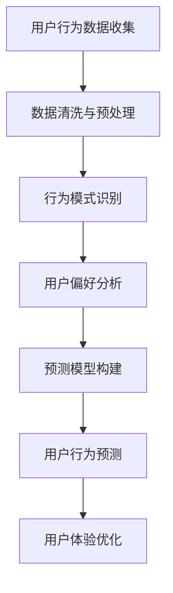
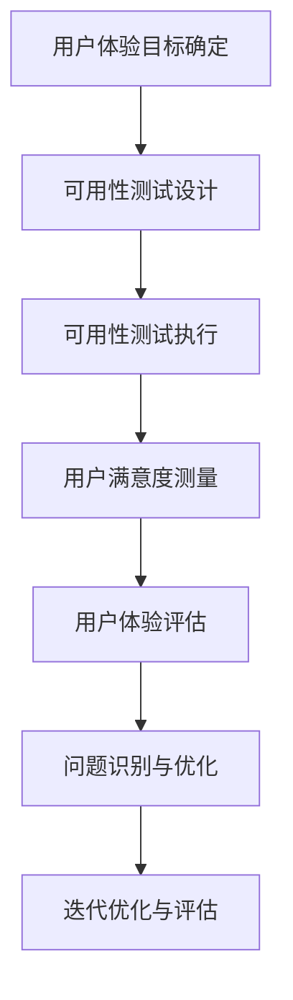

                 

## 文章标题：用户体验至上：人类计算如何提升满意度

在当今数字化时代，用户体验（User Experience, UX）已成为产品和服务的核心竞争力。无论是电子商务平台、移动应用，还是金融服务、医疗健康应用，用户体验都直接影响用户的满意度和忠诚度。本文将探讨用户体验的重要性，分析人类计算的基本原理，并一步步阐述如何通过优化设计和技术手段提升用户体验。

### 关键词：
- 用户体验
- 人类计算
- 用户满意度
- 设计原则
- 技术优化

### 摘要：
本文旨在探讨用户体验至上的理念，从人类计算的角度分析用户体验的提升方法。文章首先介绍用户体验的基本概念和重要性，然后探讨人类计算的基本原理，包括认知心理学、情感心理学和用户行为分析。接着，文章讨论用户体验评估与度量方法，并提出一系列提升用户体验的设计原则和技术优化策略。最后，通过实战案例分析，展示如何在实际项目中提升用户体验。

### 目录大纲

## 《用户体验至上：人类计算如何提升满意度》

## 第一部分：用户体验与人类计算基础

### 第1章：用户体验概述

#### 1.1 用户体验的定义与重要性

用户体验是指用户在使用产品或服务过程中的整体感受和体验。它不仅仅包括功能性和易用性，还涵盖了情感和心理层面的体验。用户体验的定义如下：

$$
\text{用户体验} = \text{功能性} + \text{易用性} + \text{情感体验} + \text{心理体验}
$$

用户体验的重要性体现在以下几个方面：

1. **用户满意度**：良好的用户体验能够提升用户满意度，增加用户忠诚度。
2. **产品市场竞争力**：优秀的用户体验是产品在市场竞争中的关键因素。
3. **品牌价值**：用户体验直接影响到品牌形象和品牌价值。

#### 1.2 用户体验的五个关键要素

用户体验的五个关键要素包括：

1. **功能性**：产品是否能够实现用户所需的功能。
2. **易用性**：产品是否易于学习和使用。
3. **情感体验**：产品是否能够引起用户的情感共鸣。
4. **心理体验**：产品是否能够满足用户的心理需求。
5. **持续体验**：产品在长期使用过程中是否能够保持良好的用户体验。

#### 1.3 人类计算与用户体验的关系

人类计算是指人类在处理信息、做出决策和执行任务时的计算过程。它与用户体验的关系体现在以下几个方面：

1. **认知心理学基础**：人类计算依赖于认知心理学的原理，如注意力、记忆、推理等。
2. **情感心理学**：情感体验是用户体验的重要组成部分，与情感心理学的原理密切相关。
3. **用户行为分析**：通过分析用户行为，可以了解用户的实际需求和偏好，从而优化用户体验。

### 第2章：人类计算基础

#### 2.1 认知心理学基础

认知心理学是研究人类思维过程的科学，它包括注意力、记忆、推理等核心概念。以下是认知心理学基础：

1. **注意力**：注意力是有限的资源，用户在使用产品时需要分配注意力。
2. **记忆**：记忆分为短期记忆和长期记忆，用户需要将使用产品的体验存储在记忆中。
3. **推理**：推理是用户在解决问题和做出决策时的重要能力。

#### 2.2 情感心理学与用户体验

情感心理学是研究人类情感的产生、表达和影响的科学。情感体验在用户体验中起着关键作用：

1. **情感共鸣**：产品需要能够引起用户的情感共鸣，增加用户的情感投入。
2. **情感管理**：良好的用户体验需要能够管理和引导用户的情感，避免负面情绪的产生。
3. **情感价值**：情感价值是用户体验的重要评价指标之一。

#### 2.3 用户行为分析与预测

用户行为分析是了解用户需求、偏好和习惯的重要手段。以下是用户行为分析的基本方法：

1. **用户行为记录**：通过日志分析、行为追踪等技术手段记录用户的行为数据。
2. **行为模式识别**：通过分析用户行为数据，识别用户的行为模式和偏好。
3. **预测模型**：基于用户行为数据，构建预测模型，预测用户的未来行为。

### 第3章：用户体验评估与度量

#### 3.1 用户体验评估方法

用户体验评估是衡量用户体验质量的重要手段。以下是常用的用户体验评估方法：

1. **用户调查**：通过问卷调查、访谈等方式收集用户对产品的评价。
2. **可用性测试**：通过模拟用户使用产品，观察和记录用户的行为和反应。
3. **A/B测试**：通过对比不同版本的产品，评估用户体验的差异。

#### 3.2 用户满意度测量

用户满意度是衡量用户体验的重要指标。以下是用户满意度测量的方法：

1. **量表法**：通过制定量表，让用户对产品或服务的不同方面进行评分。
2. **评分法**：通过让用户对产品或服务的整体满意度进行评分。
3. **净推荐值（NPS）**：通过让用户回答“您是否愿意推荐这款产品？”来评估用户满意度。

#### 3.3 用户行为数据分析

用户行为数据分析是了解用户需求、优化用户体验的重要手段。以下是用户行为数据分析的方法：

1. **行为追踪**：通过技术手段跟踪用户在产品中的行为。
2. **行为模式分析**：通过分析用户行为数据，识别用户的行为模式。
3. **行为预测**：基于用户行为数据，预测用户的未来行为。

## 第二部分：提升用户体验的方法

### 第4章：设计原则与实践

#### 4.1 设计思维与用户体验

设计思维是一种以用户为中心的创新方法，它强调从用户需求出发，通过迭代和实验找到最佳解决方案。以下是设计思维与用户体验的关系：

1. **用户需求分析**：通过设计思维，深入理解用户需求，确保设计满足用户需求。
2. **迭代与实验**：通过迭代和实验，不断优化设计，提升用户体验。
3. **用户反馈**：设计思维强调用户反馈的重要性，通过用户反馈，不断改进设计。

#### 4.2 可用性测试与迭代

可用性测试是评估产品设计是否满足用户需求的有效手段。以下是可用性测试与迭代的方法：

1. **测试设计**：设计测试任务，模拟用户使用产品的过程。
2. **测试执行**：邀请用户参与测试，观察和记录用户的行为和反应。
3. **结果分析**：分析测试结果，识别设计中的问题和改进机会。

#### 4.3 设计原则案例解析

以下是一些常用的设计原则及其在实践中的应用：

1. **简洁性**：设计应尽量简洁，避免不必要的复杂性和冗余。
2. **一致性**：设计应保持一致性，确保用户在使用过程中能够轻松上手。
3. **直观性**：设计应直观易用，确保用户能够快速理解和操作。
4. **适应性**：设计应适应不同用户和场景，满足多样化的需求。

### 第5章：技术优化与用户体验

#### 5.1 前端性能优化

前端性能优化是提升用户体验的重要手段。以下是前端性能优化的一些方法：

1. **代码优化**：优化HTML、CSS和JavaScript代码，减少加载时间和资源消耗。
2. **图片优化**：优化图片格式和大小，减少图片加载时间。
3. **缓存策略**：合理设置缓存策略，加快页面加载速度。

#### 5.2 后端优化与用户体验

后端优化是提升用户体验的关键因素。以下是后端优化的一些方法：

1. **数据库优化**：优化数据库查询和索引，提高查询效率。
2. **服务器优化**：优化服务器配置和负载均衡，提高服务器响应速度。
3. **API优化**：优化API设计和调用，提高数据传输效率。

#### 5.3 技术选型与用户体验

技术选型直接影响用户体验。以下是技术选型时需要考虑的因素：

1. **性能**：选择高性能的技术栈，确保产品能够快速响应用户需求。
2. **可维护性**：选择易于维护和扩展的技术栈，降低后期维护成本。
3. **兼容性**：选择兼容性良好的技术栈，确保产品在不同设备和平台上正常运行。

### 第6章：交互设计与用户体验

#### 6.1 交互设计原则

交互设计是提升用户体验的关键环节。以下是交互设计的一些原则：

1. **用户中心**：以用户为中心，确保设计满足用户需求。
2. **简洁性**：设计应简洁直观，避免不必要的复杂性和冗余。
3. **一致性**：设计应保持一致性，确保用户能够轻松上手。
4. **反馈**：设计应提供及时和清晰的反馈，确保用户能够了解自己的操作结果。

#### 6.2 交互设计工具与方法

以下是交互设计的一些常用工具和方法：

1. **原型设计工具**：如Figma、Axure等，用于创建交互原型。
2. **用户研究方法**：如用户访谈、观察法等，用于了解用户需求和偏好。
3. **迭代开发**：通过迭代和实验，不断优化设计，提升用户体验。

#### 6.3 交互设计案例解析

以下是一些典型的交互设计案例及其在实践中的应用：

1. **社交网络平台**：通过简洁的界面设计和直观的交互方式，提升用户的社交体验。
2. **在线教育平台**：通过个性化的学习路径和互动式教学，提升学习体验。
3. **电商平台**：通过简洁的购物流程和便捷的支付方式，提升购物体验。

## 第三部分：实战案例分析

### 第7章：用户体验提升实战案例

#### 7.1 案例一：某电商平台的用户体验优化

在某电商平台的用户体验优化项目中，我们采用了以下方法：

1. **用户调研**：通过问卷调查、用户访谈等方式，了解用户的需求和痛点。
2. **原型设计**：使用原型设计工具创建交互原型，并进行用户测试。
3. **迭代优化**：根据用户反馈，不断优化设计，提升用户体验。

通过上述方法，我们成功提升了该电商平台的用户体验，提高了用户满意度和转化率。

#### 7.2 案例二：某金融服务的用户体验提升

在某金融服务的用户体验提升项目中，我们采用了以下方法：

1. **用户行为分析**：通过用户行为数据，分析用户的行为模式和偏好。
2. **功能优化**：根据用户行为数据，优化产品功能，提升用户体验。
3. **界面设计**：通过界面设计优化，提升用户的视觉体验。

通过上述方法，我们成功提升了该金融服务的用户体验，提高了用户满意度和忠诚度。

#### 7.3 案例三：某医疗健康应用的用户体验改进

在某医疗健康应用的用户体验改进项目中，我们采用了以下方法：

1. **用户调研**：通过问卷调查、用户访谈等方式，了解用户的需求和痛点。
2. **功能重构**：根据用户调研结果，重构产品功能，提升用户体验。
3. **界面优化**：通过界面优化，提升用户的操作体验。

通过上述方法，我们成功提升了该医疗健康应用的用户体验，提高了用户的满意度和使用频率。

### 第8章：用户体验管理策略

#### 8.1 用户反馈收集与处理

用户反馈是优化用户体验的重要依据。以下是用户反馈收集与处理的方法：

1. **用户调研**：通过问卷调查、用户访谈等方式，收集用户反馈。
2. **反馈渠道**：建立便捷的反馈渠道，如在线反馈表、社交媒体等。
3. **反馈处理**：对用户反馈进行分析和处理，及时回复用户。

#### 8.2 用户体验管理流程

用户体验管理流程包括以下环节：

1. **需求分析**：分析用户需求，明确用户体验目标。
2. **设计开发**：根据需求，进行设计开发和迭代优化。
3. **测试评估**：通过可用性测试和用户满意度测量，评估用户体验。
4. **持续改进**：根据测试评估结果，不断优化用户体验。

#### 8.3 用户体验改进策略与实施

用户体验改进策略包括以下几个方面：

1. **用户调研**：定期进行用户调研，了解用户需求和反馈。
2. **功能优化**：根据用户反馈，优化产品功能，提升用户体验。
3. **界面设计**：通过界面设计优化，提升用户的视觉和操作体验。
4. **培训与支持**：对用户进行培训和支持，帮助用户更好地使用产品。

## 附录

### 附录A：用户体验相关工具与资源

#### A.1 用户体验评估工具

- **UserTesting**：一款在线用户测试平台，可进行远程用户测试。
- **ThinkImpact**：一款基于数据驱动的用户体验评估工具。

#### A.2 交互设计工具

- **Figma**：一款基于网页的交互设计工具。
- **Axure RP**：一款专业的交互设计原型工具。

#### A.3 用户行为数据分析工具

- **Google Analytics**：一款强大的网站分析工具。
- **Mixpanel**：一款专注于用户行为数据分析的工具。

### 附录B：Mermaid流程图示例

#### B.1 用户行为分析流程图



#### B.2 用户体验评估流程图



### 附录C：伪代码示例

#### C.1 用户满意度计算伪代码

```python
# 用户满意度计算
def calculate_satisfaction(score1, score2, score3):
    avg_score = (score1 + score2 + score3) / 3
    if avg_score > 4:
        return "非常满意"
    elif avg_score > 2:
        return "满意"
    else:
        return "不满意"
```

#### C.2 交互设计迭代流程伪代码

```python
# 交互设计迭代流程
def iterative_design():
    while not optimal_design:
        perform_user_research()
        generate_design_prototype()
        conduct_usability_tests()
        analyze_test_results()
        optimize_design()
    return "最佳设计方案"
```

### 附录D：数学模型与公式

#### D.1 用户体验度量模型

$$
\text{用户体验度量} = \text{功能性得分} \times \text{权重} + \text{易用性得分} \times \text{权重} + \text{情感体验得分} \times \text{权重} + \text{心理体验得分} \times \text{权重}
$$

#### D.2 用户行为预测模型

$$
\text{用户行为预测} = f(\text{历史行为数据}, \text{用户特征})
$$

#### D.3 情感心理学公式解析

$$
\text{情感体验} = \text{情感认知} \times \text{情感表达} \times \text{情感记忆}
$$

### 附录E：实战案例代码解读

#### E.1 某电商平台的用户体验优化代码解读

```python
# 电商平台用户体验优化代码

# 用户行为数据收集
user_actions = collect_user_actions()

# 数据清洗与预处理
cleaned_data = preprocess_data(user_actions)

# 行为模式识别
action_patterns = identify_action_patterns(cleaned_data)

# 功能优化
optimize_functionality(action_patterns)

# 界面设计优化
optimize_ui_design(action_patterns)

# 可用性测试
usability_test_results = conduct_usability_tests()

# 用户满意度测量
satisfaction_score = measure_satisfaction(usability_test_results)

# 持续优化
if satisfaction_score < threshold:
    iterative_design()
```

#### E.2 某金融服务的用户体验提升代码解读

```python
# 金融服务平台用户体验提升代码

# 用户行为数据收集
user_data = collect_user_data()

# 数据分析
user_behavior_analysis = analyze_user_data(user_data)

# 功能优化
optimize_functionality(user_behavior_analysis)

# 界面优化
optimize_ui_design(user_behavior_analysis)

# 用户反馈收集
user_feedback = collect_user_feedback()

# 反馈处理
process_user_feedback(user_feedback)

# 用户满意度测量
satisfaction_score = measure_satisfaction(user_feedback)

# 持续优化
if satisfaction_score < threshold:
    iterative_design()
```

#### E.3 某医疗健康应用的用户体验改进代码解读

```python
# 医疗健康应用用户体验改进代码

# 用户调研
user_survey = conduct_user_survey()

# 功能重构
restructure_functionality(user_survey)

# 界面设计优化
optimize_ui_design(user_survey)

# 用户测试
user_tests = conduct_user_tests()

# 用户满意度测量
satisfaction_score = measure_satisfaction(user_tests)

# 持续优化
if satisfaction_score < threshold:
    iterative_design()
```

### 作者信息

- 作者：AI天才研究院/AI Genius Institute & 禅与计算机程序设计艺术 /Zen And The Art of Computer Programming

## 结束语

用户体验至上是数字化时代的产品和服务核心。通过深入了解人类计算原理，采用科学的设计思维和技术优化方法，我们可以不断提升用户体验，满足用户需求，提升产品竞争力。本文从用户体验、人类计算基础、用户体验评估与度量、提升用户体验的方法、实战案例分析以及用户体验管理策略等方面，系统阐述了用户体验至上的理念和实现方法。希望本文对您在提升用户体验方面有所启发和帮助。

---

[文章标题：用户体验至上：人类计算如何提升满意度]

### 关键词：
- 用户体验
- 人类计算
- 用户满意度
- 设计原则
- 技术优化

### 摘要：
本文旨在探讨用户体验至上的理念，从人类计算的角度分析用户体验的提升方法。文章首先介绍用户体验的基本概念和重要性，然后探讨人类计算的基本原理，包括认知心理学、情感心理学和用户行为分析。接着，文章讨论用户体验评估与度量方法，并提出一系列提升用户体验的设计原则和技术优化策略。最后，通过实战案例分析，展示如何在实际项目中提升用户体验。

## 目录大纲

### 第一部分：用户体验与人类计算基础

### 第1章：用户体验概述
- **1.1 用户体验的定义与重要性**
- **1.2 用户体验的五个关键要素**
- **1.3 人类计算与用户体验的关系**

### 第2章：人类计算基础
- **2.1 认知心理学基础**
- **2.2 情感心理学与用户体验**
- **2.3 用户行为分析与预测**

### 第3章：用户体验评估与度量
- **3.1 用户体验评估方法**
- **3.2 用户满意度测量**
- **3.3 用户行为数据分析**

### 第二部分：提升用户体验的方法

### 第4章：设计原则与实践
- **4.1 设计思维与用户体验**
- **4.2 可用性测试与迭代**
- **4.3 设计原则案例解析**

### 第5章：技术优化与用户体验
- **5.1 前端性能优化**
- **5.2 后端优化与用户体验**
- **5.3 技术选型与用户体验**

### 第6章：交互设计与用户体验
- **6.1 交互设计原则**
- **6.2 交互设计工具与方法**
- **6.3 交互设计案例解析**

### 第三部分：实战案例分析

### 第7章：用户体验提升实战案例
- **7.1 某电商平台的用户体验优化**
- **7.2 某金融服务的用户体验提升**
- **7.3 某医疗健康应用的用户体验改进**

### 第8章：用户体验管理策略
- **8.1 用户反馈收集与处理**
- **8.2 用户体验管理流程**
- **8.3 用户体验改进策略与实施**

### 附录

### 附录A：用户体验相关工具与资源
- **A.1 用户体验评估工具**
- **A.2 交互设计工具**
- **A.3 用户行为数据分析工具**

### 附录B：Mermaid流程图示例
- **B.1 用户行为分析流程图**
- **B.2 用户体验评估流程图**

### 附录C：伪代码示例
- **C.1 用户满意度计算伪代码**
- **C.2 交互设计迭代流程伪代码**

### 附录D：数学模型与公式
- **D.1 用户体验度量模型**
- **D.2 用户行为预测模型**
- **D.3 情感心理学公式解析**

### 附录E：实战案例代码解读
- **E.1 某电商平台的用户体验优化代码解读**
- **E.2 某金融服务的用户体验提升代码解读**
- **E.3 某医疗健康应用的用户体验改进代码解读**

### 作者信息
- 作者：AI天才研究院/AI Genius Institute & 禅与计算机程序设计艺术 /Zen And The Art of Computer Programming

---

**全文结束。感谢您的阅读！**

