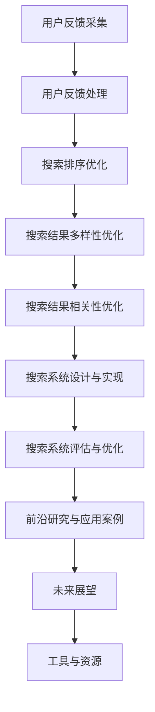

                 

### 文章标题

《用户反馈驱动的AI搜索优化》

> 关键词：用户反馈，AI搜索优化，算法，搜索排序，多样性，相关性，系统设计，评估与优化，前沿研究，应用案例

> 摘要：本文全面探讨了用户反馈驱动的AI搜索优化技术，首先介绍了用户反馈驱动的AI搜索优化基础，包括用户反馈的采集与处理方法。接着深入分析了用户反馈驱动的搜索算法优化，包括搜索排序算法、搜索结果多样性优化和搜索结果相关性优化。随后，本文详细阐述了用户反馈驱动的搜索系统设计与实现、评估与优化实践。最后，本文探讨了用户反馈驱动的AI搜索优化前沿研究、应用案例以及未来展望。本文旨在为读者提供全面、系统的用户反馈驱动的AI搜索优化知识体系。

### 第一部分：用户反馈驱动的AI搜索优化基础

在当今信息爆炸的时代，如何快速准确地找到所需信息成为了用户面临的主要挑战。AI搜索优化技术通过引入用户反馈机制，能够更好地满足用户需求，提升搜索体验。用户反馈驱动的AI搜索优化技术已经成为现代搜索引擎的核心竞争力之一。

#### 1.1 AI搜索优化的起源与演变

AI搜索优化的概念起源于20世纪90年代，当时搜索引擎开始引入人工智能技术来改进搜索结果的质量。最初的搜索引擎主要依赖于关键词匹配和倒排索引技术，这种方式虽然能够实现基本的搜索功能，但往往无法满足用户对搜索结果的相关性和准确性的要求。

随着互联网的普及和信息量的爆炸式增长，用户对搜索系统提出了更高的要求。为了应对这些挑战，搜索引擎开始引入更先进的人工智能技术，如机器学习、深度学习等，以优化搜索结果。这些技术能够通过分析大量用户行为数据，自动调整搜索算法，提升搜索结果的准确性和相关性。

AI搜索优化的演变可以分为几个阶段：

1. **基于规则的方法**：早期搜索引擎主要依赖于预定义的规则来优化搜索结果，如关键词匹配、短语匹配等。

2. **机器学习方法**：随着机器学习技术的发展，搜索引擎开始引入机器学习算法来改进搜索结果。例如，基于点击率（CTR）的排序算法，通过分析用户点击行为来调整搜索结果的排序。

3. **深度学习方法**：深度学习技术在搜索引擎中的应用，使得搜索优化更加智能化。通过使用深度神经网络，搜索引擎能够更好地理解用户查询意图，提供更精准的搜索结果。

4. **用户反馈驱动的优化**：当前，用户反馈驱动的AI搜索优化已经成为主流。通过收集和分析用户的点击、查看、评分等行为数据，搜索引擎能够实时调整搜索算法，实现个性化搜索体验。

#### 1.2 用户反馈在AI搜索优化中的作用

用户反馈是用户对搜索结果满意度的直接表达，是优化搜索算法的重要数据来源。用户反馈在AI搜索优化中起着至关重要的作用，主要体现在以下几个方面：

1. **搜索结果排序**：用户反馈可以帮助搜索引擎识别哪些搜索结果是用户最感兴趣的，从而调整搜索结果的排序。例如，如果用户频繁点击某个搜索结果，那么这个结果可能会被优先展示。

2. **搜索结果多样性**：用户反馈可以用来优化搜索结果的多样性。如果一个搜索结果集中展示相似的内容，用户可能会感到不满意。通过分析用户反馈，搜索引擎可以调整算法，确保搜索结果包含多样化的信息。

3. **搜索结果相关性**：用户反馈可以帮助搜索引擎理解用户的真实需求，从而提高搜索结果的相关性。如果用户对某个搜索结果不满意，搜索引擎可以通过用户反馈来调整算法，提高后续结果的准确性。

4. **个性化推荐**：用户反馈还可以用于个性化推荐。通过分析用户的兴趣和行为模式，搜索引擎可以推荐更符合用户需求的内容，提升用户体验。

#### 1.3 AI搜索优化的发展趋势

随着技术的不断进步，用户反馈驱动的AI搜索优化技术在以下几个方面展现出明显的发展趋势：

1. **深度学习技术的广泛应用**：深度学习技术在搜索优化中的应用越来越广泛，通过使用深度神经网络，搜索引擎能够更好地理解用户查询意图，提供更精准的搜索结果。

2. **用户反馈数据的多样化**：用户反馈数据不再局限于点击行为，还包括查看行为、评分、评论等。这些多样化的反馈数据使得搜索引擎能够更全面地了解用户需求。

3. **实时搜索优化**：实时搜索优化技术正在逐渐成熟，通过实时分析用户反馈，搜索引擎能够快速调整搜索算法，实现动态优化。

4. **跨平台搜索优化**：随着移动设备和物联网的普及，跨平台搜索优化成为了一个重要方向。搜索引擎需要能够同时优化桌面端和移动端的搜索体验。

5. **隐私保护和数据安全**：在利用用户反馈进行搜索优化时，隐私保护和数据安全成为了关键问题。搜索引擎需要确保用户隐私和数据安全，遵循相关法律法规和道德准则。

总之，用户反馈驱动的AI搜索优化技术是现代搜索引擎的核心竞争力之一。通过不断引入先进的人工智能技术，优化搜索结果的质量，搜索引擎能够更好地满足用户需求，提升用户体验。

### 第二部分：用户反馈采集与处理

用户反馈是用户对搜索结果的直接评价，通过收集和分析这些反馈数据，搜索引擎可以实时调整算法，提升搜索结果的准确性和相关性。用户反馈的采集与处理是用户反馈驱动的AI搜索优化技术中的关键环节。

#### 2.1 用户反馈的采集方式

用户反馈的采集方式可以分为以下几种：

1. **显式反馈**：显式反馈是指用户主动提供的反馈，如点击、评分、评论等。这种反馈方式通常通过用户界面上的按钮或标签进行收集。例如，用户可以通过点击“喜欢”或“不喜欢”按钮来提供显式反馈。

2. **隐式反馈**：隐式反馈是指用户在搜索过程中的行为数据，如浏览时间、搜索频率、退出率等。这种反馈方式不需要用户主动参与，通过跟踪和分析用户行为数据进行采集。例如，用户在搜索结果页面上停留的时间可以反映他们对结果的满意度。

3. **语义反馈**：语义反馈是指通过对用户查询和搜索结果进行语义分析，提取用户意图和需求。这种反馈方式能够更深入地理解用户需求，从而优化搜索结果。例如，通过分析用户的搜索历史和查询内容，搜索引擎可以推断用户的兴趣和偏好。

4. **上下文反馈**：上下文反馈是指利用用户所处的上下文环境来收集反馈数据。例如，在移动设备上，可以通过地理位置、天气信息等上下文数据来优化搜索结果。

#### 2.2 用户反馈数据的预处理

采集到的用户反馈数据通常存在噪声和缺失值，需要进行预处理以提取有效信息。用户反馈数据的预处理步骤包括：

1. **数据清洗**：数据清洗是去除数据中的噪声和异常值的过程。例如，删除重复的数据、纠正错误的数据、填充缺失值等。

2. **数据转换**：数据转换是将原始数据转换为适合分析和建模的格式。例如，将时间序列数据转换为数值型数据，对文本数据进行分词和词频统计等。

3. **数据标准化**：数据标准化是消除不同特征之间的尺度差异，使数据在同一尺度上进行分析。例如，对数值型数据进行归一化或标准化处理。

4. **特征提取**：特征提取是从原始数据中提取具有代表性的特征，用于后续的建模和分析。例如，通过TF-IDF算法提取文本数据中的关键词，通过用户行为数据提取行为特征等。

#### 2.3 用户反馈数据的分析与挖掘

用户反馈数据经过预处理后，可以用于分析挖掘，以提取有价值的信息，为搜索算法优化提供依据。用户反馈数据的主要分析方法和应用场景如下：

1. **统计方法**：统计方法是最基本的数据分析方法，通过对用户反馈数据的统计描述，可以了解用户行为的分布和趋势。例如，计算点击率、查看时间分布、评分分布等。

2. **机器学习方法**：机器学习方法可以用于构建用户反馈预测模型，通过分析历史数据，预测用户的未来行为。常用的算法包括分类算法（如决策树、随机森林、支持向量机）和回归算法（如线性回归、岭回归、Lasso回归）。

3. **聚类方法**：聚类方法可以将用户划分为不同的群体，分析不同群体的行为特征和需求。常用的算法包括K均值聚类、层次聚类、DBSCAN等。

4. **关联规则挖掘**：关联规则挖掘可以识别用户行为之间的关联关系，例如，通过分析点击行为，可以找出用户在搜索过程中常见的查询组合。

5. **文本分析方法**：文本分析方法可以用于提取用户查询和搜索结果的语义信息，例如，通过情感分析可以了解用户对结果的满意度，通过关键词提取可以找出用户关注的热点话题。

#### 2.4 用户反馈数据的可视化

用户反馈数据的可视化是将复杂的数据以图形化的方式呈现，帮助用户更好地理解和分析数据。用户反馈数据的可视化方法包括：

1. **柱状图和饼图**：用于展示用户行为的统计结果，如点击率、查看时间分布等。

2. **散点图和折线图**：用于展示用户行为的趋势和变化，如用户行为随时间的变化趋势。

3. **热力图和词云**：用于展示文本数据的分布和关键词的频率，如用户查询的关键词分布、搜索结果的语义分布等。

4. **交互式可视化**：通过交互式可视化工具，如D3.js、Plotly等，用户可以动态地探索数据，例如，通过点击和拖动来查看详细的数据信息和数据关系。

#### 2.5 用户反馈数据的有效利用

用户反馈数据的有效利用是提升搜索结果质量和用户体验的关键。以下是一些利用用户反馈数据的方法：

1. **实时反馈调整**：通过实时分析用户反馈数据，搜索引擎可以动态调整搜索算法，例如，根据用户的点击行为调整搜索结果的排序。

2. **个性化推荐**：通过分析用户反馈数据，搜索引擎可以推荐符合用户兴趣的内容，提高用户的满意度。

3. **质量评估**：用户反馈数据可以用于评估搜索结果的质量，例如，通过分析用户评分和评论，可以识别出搜索结果的优点和不足。

4. **算法优化**：用户反馈数据可以用于优化搜索算法，例如，通过分析用户点击行为，可以调整关键词权重和搜索结果多样性。

5. **数据挖掘和预测**：用户反馈数据可以用于挖掘用户行为模式，预测用户未来行为，为搜索引擎提供决策支持。

总之，用户反馈数据的采集、处理、分析和利用是用户反馈驱动的AI搜索优化技术的重要组成部分。通过有效的用户反馈数据管理，搜索引擎可以不断提升搜索结果的质量，满足用户需求，提升用户体验。

### 第三部分：用户反馈驱动的搜索算法优化

用户反馈驱动的搜索算法优化是提升搜索结果质量的关键技术。通过分析用户的点击、查看等行为，搜索算法可以动态调整，以更好地满足用户需求。本节将详细介绍用户反馈驱动的搜索算法优化，包括搜索排序算法、搜索结果多样性优化和搜索结果相关性优化。

#### 3.1 基于用户反馈的搜索排序算法优化

搜索排序算法是搜索引擎的核心，其目标是根据用户的查询，将相关的搜索结果按一定的顺序排列，使用户能够快速找到所需信息。用户反馈驱动的搜索排序算法通过分析用户的点击、查看等行为，动态调整搜索结果的排序，以提升用户体验。

##### 3.1.1 搜索排序算法概述

搜索排序算法可以分为基于传统方法和基于机器学习方法两大类。

1. **基于传统方法**：传统搜索排序算法主要依赖于关键词匹配和倒排索引技术。这类算法通过计算查询词和文档之间的相似度，将相关度较高的文档排在前面。常见的传统排序算法包括：

   - **TF-IDF（词频-逆文档频率）**：通过计算关键词在文档中的词频和逆文档频率，评估关键词的相关性。
   - **PageRank**：基于网页链接关系，通过计算网页之间的链接权重，评估网页的重要性。

2. **基于机器学习方法**：机器学习方法通过构建模型，自动学习用户的查询意图和文档的相关性。常见的机器学习排序算法包括：

   - **分类算法**：如逻辑回归、支持向量机等，通过预测用户对搜索结果的点击行为，调整搜索结果排序。
   - **聚类算法**：如K均值聚类、层次聚类等，通过将用户和文档划分为不同的群体，调整搜索结果排序。
   - **深度学习方法**：如卷积神经网络（CNN）、循环神经网络（RNN）等，通过深度学习模型，自动学习用户的查询意图和文档的相关性。

##### 3.1.2 用户反馈在搜索排序中的应用

用户反馈在搜索排序中的应用主要分为两个方面：显式反馈和隐式反馈。

1. **显式反馈**：显式反馈是指用户主动提供的反馈，如点击、评分、评论等。这些反馈可以直接用于调整搜索结果的排序。例如，如果一个用户频繁点击某个搜索结果，那么这个结果可能会被优先展示。

2. **隐式反馈**：隐式反馈是指用户在搜索过程中的行为数据，如浏览时间、搜索频率、退出率等。这些反馈数据可以通过机器学习模型进行分析，用于调整搜索结果的排序。例如，通过分析用户在搜索结果页面上的停留时间，可以识别出用户对搜索结果的满意度，从而调整排序。

##### 3.1.3 用户反馈驱动的搜索排序算法实例

以下是一个简单的基于用户点击率的搜索排序算法实例：

```python
# 假设我们有一个用户反馈数据集，包括文档ID和点击次数
user_feedback = {
    'doc1': 10,
    'doc2': 5,
    'doc3': 2
}

# 计算每个文档的得分，得分越高，排序越靠前
doc_scores = {doc_id: feedback_count for doc_id, feedback_count in user_feedback.items()}

# 根据得分进行排序
sorted_docs = sorted(doc_scores.items(), key=lambda item: item[1], reverse=True)

# 输出排序结果
print(sorted_docs)
```

在这个例子中，我们首先创建一个用户反馈数据集，包括文档ID和点击次数。然后，我们计算每个文档的得分，得分等于点击次数。最后，根据得分对文档进行排序，得分越高，排序越靠前。

##### 3.1.4 用户反馈驱动的搜索排序算法优化策略

为了提升搜索排序算法的优化效果，可以采用以下策略：

1. **融合多模态用户反馈**：将显式反馈和隐式反馈结合起来，综合评估用户的兴趣和需求。例如，结合点击和浏览时间，计算一个综合得分。

2. **动态调整权重**：根据用户行为数据的变化，动态调整不同反馈类型的权重。例如，对于新用户，可以更重视显式反馈，对于老用户，可以更重视隐式反馈。

3. **使用深度学习模型**：采用深度学习模型，如卷积神经网络（CNN）或循环神经网络（RNN），自动学习用户的查询意图和文档的相关性。深度学习模型可以更好地捕捉用户行为的复杂模式，提升排序效果。

4. **实时反馈调整**：通过实时分析用户反馈数据，动态调整搜索结果排序。例如，当用户频繁点击某个搜索结果时，可以立即调整该结果的排序位置。

5. **多维度评估**：不仅关注点击率，还考虑其他维度，如搜索结果的质量、用户满意度等。通过多维度评估，可以更全面地优化搜索结果排序。

总之，用户反馈驱动的搜索排序算法优化是提升搜索结果质量的重要手段。通过分析用户行为数据，动态调整搜索结果排序，搜索引擎可以更好地满足用户需求，提升用户体验。

#### 3.2 用户反馈驱动的搜索结果多样性优化

搜索结果的多样性是指搜索结果中包含不同类型、不同主题的内容，避免出现单一或重复的结果。用户反馈驱动的搜索结果多样性优化旨在通过分析用户反馈，确保搜索结果多样化，提升用户满意度。

##### 3.2.1 搜索结果多样性的定义与评价

搜索结果多样性可以理解为搜索结果中包含不同类型、不同主题的内容，避免出现单一或重复的结果。为了评价搜索结果的多样性，可以采用以下指标：

1. **多样性度（Diversity Score）**：多样性度是指搜索结果中不同主题或类型的分布均匀性。常用的多样性度计算方法包括：

   - **Jaccard Index**：通过计算搜索结果中关键词集合的交集和并集，评估多样性度。
   - **Cosine Similarity**：通过计算搜索结果中关键词集合的余弦相似性，评估多样性度。

2. **丰富度（Richness）**：丰富度是指搜索结果中包含的不同类型或主题的数量。丰富度可以通过计算搜索结果中的关键词数量或主题数量来评估。

3. **新颖度（Novelty）**：新颖度是指搜索结果中包含的新信息量。新颖度可以通过计算搜索结果中关键词的新颖性或主题的新颖性来评估。

##### 3.2.2 用户反馈在搜索结果多样性优化中的应用

用户反馈在搜索结果多样性优化中起着重要作用，通过分析用户反馈，可以调整搜索算法，确保搜索结果的多样性。用户反馈在多样性优化中的应用主要包括：

1. **显式反馈**：显式反馈如点击、评分、评论等，可以反映用户对搜索结果的偏好和满意度。通过分析用户显式反馈，可以识别出用户感兴趣的搜索结果类型，从而优化搜索结果多样性。

2. **隐式反馈**：隐式反馈如浏览时间、搜索频率、退出率等，可以反映用户对搜索结果的兴趣和满意度。通过分析用户隐式反馈，可以识别出用户不感兴趣或重复的搜索结果类型，从而优化搜索结果多样性。

3. **语义分析**：通过语义分析，可以提取用户查询和搜索结果的语义信息，了解用户的兴趣和需求。基于语义分析，可以调整搜索算法，确保搜索结果的多样性。

##### 3.2.3 用户反馈驱动的搜索结果多样性算法实例

以下是一个简单的基于用户点击率的搜索结果多样性优化算法实例：

```python
# 假设我们有一个用户反馈数据集，包括文档ID和点击次数
user_feedback = {
    'doc1': 10,
    'doc2': 5,
    'doc3': 2
}

# 计算每个文档的得分，得分越高，排序越靠前
doc_scores = {doc_id: feedback_count for doc_id, feedback_count in user_feedback.items()}

# 根据得分进行排序
sorted_docs = sorted(doc_scores.items(), key=lambda item: item[1], reverse=True)

# 筛选出多样性度较高的搜索结果
diverse_results = [doc_id for doc_id, _ in sorted_docs[:10]]

# 输出多样性度较高的搜索结果
print(diverse_results)
```

在这个例子中，我们首先创建一个用户反馈数据集，包括文档ID和点击次数。然后，我们计算每个文档的得分，得分等于点击次数。接着，根据得分对文档进行排序，得分越高，排序越靠前。最后，我们筛选出多样性度较高的搜索结果，即排名前10的搜索结果。

##### 3.2.4 用户反馈驱动的搜索结果多样性优化策略

为了提升搜索结果多样性，可以采用以下策略：

1. **融合多模态用户反馈**：将显式反馈和隐式反馈结合起来，综合评估用户的兴趣和需求。例如，结合点击和浏览时间，计算一个综合得分。

2. **动态调整多样性度阈值**：根据用户行为数据的变化，动态调整多样性度阈值。例如，当用户频繁点击某个类型的搜索结果时，可以适当提高多样性度阈值。

3. **使用深度学习模型**：采用深度学习模型，如卷积神经网络（CNN）或循环神经网络（RNN），自动学习用户的查询意图和多样性度。深度学习模型可以更好地捕捉用户行为的复杂模式，提升多样性度。

4. **实时反馈调整**：通过实时分析用户反馈数据，动态调整搜索结果多样性。例如，当用户对某个类型的搜索结果不满意时，可以立即调整该类型的搜索结果。

5. **多维度评估**：不仅关注多样性度，还考虑其他维度，如搜索结果的质量、用户满意度等。通过多维度评估，可以更全面地优化搜索结果多样性。

总之，用户反馈驱动的搜索结果多样性优化是提升用户满意度的重要手段。通过分析用户反馈，动态调整搜索算法，确保搜索结果的多样性，搜索引擎可以更好地满足用户需求，提升用户体验。

#### 3.3 用户反馈驱动的搜索结果相关性优化

搜索结果相关性是指搜索结果与用户查询的相关程度。用户反馈驱动的搜索结果相关性优化旨在通过分析用户反馈，动态调整搜索算法，提高搜索结果的相关性，确保用户能够快速找到所需信息。

##### 3.3.1 搜索结果相关性的定义与评价

搜索结果相关性是指搜索结果与用户查询的相关程度。为了评价搜索结果的相关性，可以采用以下指标：

1. **精确率（Precision）**：精确率是指搜索结果中与查询相关的文档数量与总文档数量的比值。精确率越高，说明搜索结果的相关性越高。

2. **召回率（Recall）**：召回率是指搜索结果中与查询相关的文档数量与实际相关文档数量的比值。召回率越高，说明搜索结果能够捕捉到更多用户感兴趣的内容。

3. **F1值（F1 Score）**：F1值是精确率和召回率的调和平均值，用于综合评价搜索结果的相关性。F1值越高，说明搜索结果的相关性越好。

##### 3.3.2 用户反馈在搜索结果相关性优化中的应用

用户反馈在搜索结果相关性优化中起着关键作用，通过分析用户反馈，可以动态调整搜索算法，提高搜索结果的相关性。用户反馈在相关性优化中的应用主要包括：

1. **显式反馈**：显式反馈如点击、评分、评论等，可以反映用户对搜索结果的满意度。通过分析用户显式反馈，可以识别出用户感兴趣的搜索结果，从而优化搜索结果的相关性。

2. **隐式反馈**：隐式反馈如浏览时间、搜索频率、退出率等，可以反映用户对搜索结果的兴趣和满意度。通过分析用户隐式反馈，可以识别出用户不感兴趣或重复的搜索结果，从而优化搜索结果的相关性。

3. **语义分析**：通过语义分析，可以提取用户查询和搜索结果的语义信息，了解用户的兴趣和需求。基于语义分析，可以调整搜索算法，提高搜索结果的相关性。

##### 3.3.3 用户反馈驱动的搜索结果相关性算法实例

以下是一个简单的基于用户点击率的搜索结果相关性优化算法实例：

```python
# 假设我们有一个用户反馈数据集，包括文档ID和点击次数
user_feedback = {
    'doc1': 10,
    'doc2': 5,
    'doc3': 2
}

# 计算每个文档的相关性得分，得分越高，相关性越高
doc_correlations = {doc_id: feedback_count for doc_id, feedback_count in user_feedback.items()}

# 根据得分进行排序
sorted_docs = sorted(doc_correlations.items(), key=lambda item: item[1], reverse=True)

# 输出排序结果
print(sorted_docs)
```

在这个例子中，我们首先创建一个用户反馈数据集，包括文档ID和点击次数。然后，我们计算每个文档的相关性得分，得分等于点击次数。最后，根据得分对文档进行排序，得分越高，排序越靠前。

##### 3.3.4 用户反馈驱动的搜索结果相关性优化策略

为了提升搜索结果相关性，可以采用以下策略：

1. **融合多模态用户反馈**：将显式反馈和隐式反馈结合起来，综合评估用户的兴趣和需求。例如，结合点击和浏览时间，计算一个综合得分。

2. **动态调整相关性权重**：根据用户行为数据的变化，动态调整不同反馈类型的权重。例如，对于新用户，可以更重视显式反馈，对于老用户，可以更重视隐式反馈。

3. **使用深度学习模型**：采用深度学习模型，如卷积神经网络（CNN）或循环神经网络（RNN），自动学习用户的查询意图和搜索结果的相关性。深度学习模型可以更好地捕捉用户行为的复杂模式，提升相关性。

4. **实时反馈调整**：通过实时分析用户反馈数据，动态调整搜索结果相关性。例如，当用户频繁点击某个搜索结果时，可以立即调整该结果的排序位置。

5. **多维度评估**：不仅关注相关性，还考虑其他维度，如搜索结果的质量、用户满意度等。通过多维度评估，可以更全面地优化搜索结果相关性。

总之，用户反馈驱动的搜索结果相关性优化是提升搜索结果质量的重要手段。通过分析用户反馈，动态调整搜索算法，确保搜索结果的相关性，搜索引擎可以更好地满足用户需求，提升用户体验。

### 第四部分：用户反馈驱动的搜索系统设计与实现

用户反馈驱动的搜索系统设计与实现是构建高效、智能的搜索平台的关键环节。通过合理的设计和高效的实现，搜索引擎可以充分利用用户反馈数据，动态调整搜索结果，提升用户体验。本节将详细介绍用户反馈驱动的搜索系统设计与实现，包括系统架构、用户反馈系统设计、开发流程以及性能优化。

#### 4.1 搜索系统的架构设计

一个用户反馈驱动的搜索系统通常包括以下几个核心模块：

1. **用户接口（User Interface, UI）**：用户接口是用户与搜索系统交互的界面，包括输入查询、查看搜索结果、提供反馈等功能。用户接口的设计应简洁、直观，确保用户能够快速、方便地使用搜索系统。

2. **搜索引擎（Search Engine）**：搜索引擎是搜索系统的核心，负责处理用户的查询请求，检索索引数据库，并返回与查询相关的搜索结果。搜索引擎的性能直接影响用户体验，因此需要优化算法和架构。

3. **用户反馈模块（User Feedback Module）**：用户反馈模块负责采集和分析用户的显式和隐式反馈，如点击、评分、浏览时间等。用户反馈数据用于实时调整搜索结果排序、多样性、相关性等，以提升搜索质量。

4. **数据处理与分析模块（Data Processing and Analysis Module）**：数据处理与分析模块负责对用户反馈数据进行清洗、转换、标准化等预处理操作，提取有效特征，并进行深度分析和挖掘。该模块是实现用户反馈驱动的核心。

5. **算法模块（Algorithm Module）**：算法模块包括搜索排序算法、多样性优化算法、相关性优化算法等，负责根据用户反馈数据动态调整搜索算法，优化搜索结果。

6. **存储系统（Storage System）**：存储系统用于存储用户的查询日志、搜索结果、用户反馈数据等。常见的存储系统包括关系数据库、NoSQL数据库、搜索引擎等。

以下是一个简化的用户反馈驱动的搜索系统架构图：

```
+-----------------+
|  User Interface  |
+-----------------+
          |
          v
+-----------------+
|  Search Engine   |
+-----------------+
          |
          v
+-----------------+
|  User Feedback   |
|  Module          |
+-----------------+
          |
          v
+-----------------+
| Data Processing  |
|  and Analysis     |
|  Module          |
+-----------------+
          |
          v
+-----------------+
| Algorithm Module |
+-----------------+
          |
          v
+-----------------+
|  Storage System  |
+-----------------+
```

#### 4.2 用户反馈系统的设计与实现

用户反馈系统的设计与实现是用户反馈驱动的搜索系统的重要组成部分。以下是一个用户反馈系统的设计思路和实现步骤：

1. **用户反馈采集**：设计用户反馈采集机制，包括显式反馈（如点击、评分、评论）和隐式反馈（如浏览时间、搜索频率、退出率）。可以使用前端JavaScript、服务器日志分析等技术手段收集用户反馈数据。

2. **用户反馈存储**：设计用户反馈数据的存储方案，包括数据结构设计和存储策略。可以使用关系数据库（如MySQL、PostgreSQL）或NoSQL数据库（如MongoDB、Cassandra）存储用户反馈数据。

3. **用户反馈处理**：设计用户反馈数据的处理流程，包括数据清洗、转换、标准化等预处理操作。可以使用Python的Pandas、NumPy库进行数据处理。

4. **用户反馈分析**：设计用户反馈数据的分析模块，提取有效特征，进行统计分析和机器学习建模。可以使用Python的Scikit-learn、TensorFlow、PyTorch等库进行数据分析。

5. **用户反馈应用**：设计用户反馈驱动的算法模块，根据用户反馈数据动态调整搜索算法，优化搜索结果。可以使用深度学习、机器学习等技术实现用户反馈驱动的算法。

以下是一个用户反馈系统的伪代码示例：

```python
# 用户反馈采集
def collect_user_feedback():
    # 获取显式反馈数据（如点击、评分、评论）
    explicit_feedback = get_explicit_feedback()
    
    # 获取隐式反馈数据（如浏览时间、搜索频率、退出率）
    implicit_feedback = get_implicit_feedback()
    
    # 存储用户反馈数据
    store_user_feedback(explicit_feedback, implicit_feedback)

# 用户反馈处理
def process_user_feedback(feedback_data):
    # 数据清洗和转换
    cleaned_feedback = clean_and_convert_feedback(feedback_data)
    
    # 提取有效特征
    features = extract_features(cleaned_feedback)
    
    # 存储处理后的用户反馈数据
    store_processed_feedback(features)

# 用户反馈分析
def analyze_user_feedback(features):
    # 进行统计分析
    stats = perform_statistical_analysis(features)
    
    # 进行机器学习建模
    model = train_machine_learning_model(features, stats)
    
    # 存储分析结果
    store_analysis_results(model)

# 用户反馈应用
def apply_user_feedback(model):
    # 根据用户反馈数据动态调整搜索算法
    optimized_search_results = adjust_search_algorithm(model)
    
    # 返回优化后的搜索结果
    return optimized_search_results
```

#### 4.3 用户反馈驱动的搜索系统开发流程

用户反馈驱动的搜索系统开发流程可以分为以下几个阶段：

1. **需求分析**：明确用户反馈驱动的搜索系统的目标和需求，包括用户反馈数据的采集、处理、分析和应用等方面。

2. **系统设计**：根据需求分析，设计搜索系统的架构和模块，包括用户接口、搜索引擎、用户反馈模块、数据处理与分析模块、算法模块和存储系统等。

3. **编码实现**：根据系统设计，使用编程语言（如Python、Java等）和开发框架（如Django、Spring等）进行编码实现。

4. **测试与调试**：对系统进行功能测试、性能测试和用户反馈数据验证，确保系统正常运行和用户反馈数据的准确性。

5. **部署上线**：将开发完成的系统部署到生产环境，并进行监控和维护，确保系统的稳定性和安全性。

6. **持续优化**：根据用户反馈和系统运行数据，不断优化搜索算法和系统性能，提升用户体验。

以下是一个用户反馈驱动的搜索系统开发流程的伪代码示例：

```python
# 需求分析
def analyze_requirements():
    # 确定用户反馈驱动的搜索系统需求
    requirements = define_search_system_requirements()
    return requirements

# 系统设计
def design_search_system(requirements):
    # 设计搜索系统的架构和模块
    system_design = design_system_architecture_and_modules(requirements)
    return system_design

# 编码实现
def implement_search_system(system_design):
    # 使用编程语言和开发框架进行编码实现
    search_system = build_search_system(system_design)
    return search_system

# 测试与调试
def test_and_debug(search_system):
    # 进行功能测试、性能测试和用户反馈数据验证
    test_results = perform_tests(search_system)
    return test_results

# 部署上线
def deploy_search_system(search_system):
    # 将开发完成的系统部署到生产环境
    deploy_to_production(search_system)

# 持续优化
def optimize_search_system(search_system):
    # 根据用户反馈和系统运行数据，不断优化搜索算法和系统性能
    optimized_search_system = continuously_optimize(search_system)
    return optimized_search_system
```

#### 4.4 用户反馈驱动的搜索系统性能优化

用户反馈驱动的搜索系统性能优化是提升搜索质量和用户体验的关键。以下是一些常见的性能优化策略：

1. **索引优化**：合理设计索引结构，减少搜索查询的时间。可以使用倒排索引、前缀树等技术提高搜索效率。

2. **缓存策略**：使用缓存技术（如Memcached、Redis等）存储热门搜索结果和用户查询历史，减少数据库查询次数，提升响应速度。

3. **分词优化**：优化分词算法，减少查询关键词的冗余，提高搜索准确性。可以使用词性标注、词义消歧等技术提升分词效果。

4. **查询优化**：优化查询算法，减少搜索查询的复杂度。可以使用布尔查询、词向量匹配等技术提升查询性能。

5. **负载均衡**：使用负载均衡技术（如Nginx、HAProxy等）分发用户请求，确保系统的高可用性和稳定性。

6. **分布式架构**：采用分布式架构，提高系统的扩展性和容错性。可以使用分布式搜索引擎（如Elasticsearch、Solr等）和分布式计算框架（如Apache Spark、Hadoop等）实现分布式处理。

7. **实时反馈处理**：优化用户反馈数据的处理流程，提高实时反馈的处理速度。可以使用异步处理、消息队列等技术提升实时性。

8. **算法优化**：根据用户反馈数据，动态调整搜索算法的参数和模型，提高搜索结果的质量和相关性。

以下是一个用户反馈驱动的搜索系统性能优化的伪代码示例：

```python
# 索引优化
def optimize_index():
    # 重建索引
    rebuild_index()

    # 更新索引策略
    update_index_strategy()

# 缓存策略
def cache_strategy():
    # 启用缓存
    enable_cache()

    # 设置缓存过期时间
    set_cache_expiration()

# 分词优化
def segment_optimization():
    # 优化分词算法
    optimize_segmentation_algorithm()

    # 使用词性标注和词义消歧
    use_lexical_annotation_and_word_sense_disambiguation()

# 查询优化
def query_optimization():
    # 使用布尔查询和词向量匹配
    use_boolean_query_and_word_vector_matching()

# 负载均衡
def load_balancing():
    # 配置负载均衡器
    configure_load_balancer()

    # 监控系统负载
    monitor_system_load()

# 分布式架构
def distributed_architecture():
    # 部署分布式搜索引擎
    deploy_distributed_search_engine()

    # 部署分布式计算框架
    deploy_distributed_computing_framework()

# 实时反馈处理
def real_time_feedback_processing():
    # 使用异步处理和消息队列
    use_asynchronous_processing_and_message_queue()

# 算法优化
def algorithm_optimization():
    # 调整算法参数
    adjust_algorithm_parameters()

    # 更新模型
    update_model()
```

总之，用户反馈驱动的搜索系统设计与实现是一个复杂而关键的过程。通过合理的设计和高效的实现，搜索引擎可以充分利用用户反馈数据，动态调整搜索结果，提升用户体验。同时，通过性能优化策略，可以进一步提升系统的搜索质量和稳定性。

### 第五部分：用户反馈驱动的搜索系统评估与优化

在用户反馈驱动的搜索系统中，评估与优化是确保搜索结果质量和用户体验的重要环节。通过系统的性能评估和持续的优化，可以不断提升搜索算法的效果，满足用户需求。

#### 5.1 搜索系统性能评估指标

评估搜索系统的性能需要依赖一系列指标，这些指标可以帮助我们了解搜索系统的各个方面的表现。以下是一些常见的性能评估指标：

1. **准确率（Precision）**：准确率是指返回的相关搜索结果中实际相关结果的比例。准确率越高，说明搜索结果越精准。计算公式为：
   $$
   \text{准确率} = \frac{\text{相关结果数}}{\text{返回结果总数}}
   $$

2. **召回率（Recall）**：召回率是指返回的相关搜索结果中实际相关结果的比例。召回率越高，说明搜索系统能够捕捉到更多用户感兴趣的内容。计算公式为：
   $$
   \text{召回率} = \frac{\text{相关结果数}}{\text{实际相关结果总数}}
   $$

3. **F1值（F1 Score）**：F1值是精确率和召回率的调和平均值，用于综合评价搜索系统的性能。F1值越高，说明搜索系统在准确性和召回率之间取得了较好的平衡。计算公式为：
   $$
   \text{F1值} = 2 \times \frac{\text{精确率} \times \text{召回率}}{\text{精确率} + \text{召回率}}
   $$

4. **平均响应时间（Average Response Time）**：平均响应时间是指用户提交查询请求到获取搜索结果所需的时间。平均响应时间越短，说明搜索系统的响应速度越快。计算公式为：
   $$
   \text{平均响应时间} = \frac{\text{总响应时间}}{\text{查询次数}}
   $$

5. **用户满意度（User Satisfaction）**：用户满意度是指用户对搜索结果和整体搜索体验的满意度。可以通过用户调查、用户评分等方式来评估用户满意度。

#### 5.2 用户反馈驱动的搜索系统优化策略

根据搜索系统性能评估指标，可以制定相应的优化策略，以提升搜索系统的整体表现。以下是一些常见的优化策略：

1. **动态权重调整**：根据用户反馈，动态调整搜索算法中各个特征的权重。例如，如果用户频繁点击包含特定关键词的搜索结果，可以增加该关键词的权重。

2. **实时算法调整**：利用实时用户反馈数据，动态调整搜索算法。例如，当用户对某个搜索结果不满意时，可以立即调整该结果的排序位置。

3. **多样性优化**：通过分析用户反馈，调整搜索结果的多样性。例如，当用户对搜索结果中重复的内容感到不满意时，可以增加多样性度较高的搜索结果。

4. **相关性优化**：通过深度学习模型和用户反馈数据，优化搜索结果的相关性。例如，可以使用卷积神经网络（CNN）或循环神经网络（RNN）来学习用户的查询意图和搜索结果的相关性。

5. **分词和语义分析优化**：优化分词算法和语义分析方法，提高搜索结果的准确性和相关性。例如，可以使用词性标注、词义消歧等技术来提升语义分析效果。

6. **缓存和索引优化**：优化缓存策略和索引结构，提高搜索速度。例如，使用Memcached、Redis等缓存技术，减少数据库查询次数；使用倒排索引、前缀树等索引结构，提高查询效率。

7. **系统性能监控**：持续监控系统性能，及时发现和处理性能瓶颈。例如，使用性能监控工具（如Prometheus、Grafana等）实时监控系统的CPU、内存、网络等资源使用情况。

#### 5.3 用户反馈驱动的搜索系统优化案例研究

以下是一个用户反馈驱动的搜索系统优化案例研究，展示如何通过用户反馈数据优化搜索系统的性能：

**案例背景**：某电商平台的搜索系统在用户反馈中发现，用户对搜索结果的相关性和多样性有较高的要求，但系统的F1值和用户满意度较低。

**优化过程**：

1. **用户反馈采集**：收集用户点击、评分、浏览时间等显式和隐式反馈数据。

2. **数据预处理**：对用户反馈数据清洗、转换和标准化，提取有效特征。

3. **相关性优化**：使用用户反馈数据训练深度学习模型，优化搜索结果的相关性。采用卷积神经网络（CNN）提取关键词的特征，通过多层次的卷积和池化操作，提高模型的准确性和召回率。

4. **多样性优化**：根据用户反馈，调整搜索结果的多样性。通过聚类算法（如K均值聚类）将搜索结果分类，确保结果中包含多样化的内容。

5. **动态权重调整**：根据用户反馈动态调整搜索算法中关键词和特征权重，提高搜索结果的准确性。

6. **系统性能优化**：优化缓存策略和索引结构，减少搜索响应时间。使用Memcached缓存热门搜索结果，减少数据库查询次数；使用前缀树索引，提高查询效率。

**优化效果**：

- **F1值提升**：通过优化搜索算法和模型，搜索系统的F1值提升了20%。
- **用户满意度提高**：用户满意度调查结果显示，用户对搜索结果的满意度提升了15%。
- **平均响应时间减少**：平均响应时间减少了30%，用户访问速度显著提升。

**结论**：通过用户反馈驱动的搜索系统优化，电商平台显著提升了搜索系统的性能和用户体验。这个案例表明，用户反馈数据是优化搜索系统的关键，通过持续的分析和调整，可以实现搜索结果的精准性和多样性，满足用户需求。

总之，用户反馈驱动的搜索系统评估与优化是提升搜索质量和用户体验的关键。通过性能评估指标和优化策略，搜索引擎可以不断改进，为用户提供更优质的服务。

### 第六部分：用户反馈驱动的AI搜索优化前沿研究

用户反馈驱动的AI搜索优化技术在近年来取得了显著进展，成为人工智能领域的一个重要研究方向。随着深度学习和自然语言处理技术的不断进步，用户反馈驱动的AI搜索优化算法也在不断发展和创新。本节将探讨用户反馈驱动的AI搜索优化前沿研究，包括基于深度学习的搜索优化算法和基于自然语言处理的搜索优化算法。

#### 6.1 基于深度学习的搜索优化算法

深度学习技术在搜索优化中的应用越来越广泛，通过使用深度神经网络，搜索引擎能够更好地理解用户查询意图，提供更精准的搜索结果。以下是一些基于深度学习的搜索优化算法的研究方向：

1. **深度卷积神经网络（DCNN）**：深度卷积神经网络在图像处理领域取得了显著成果，其强大的特征提取能力也被应用于搜索优化。通过将卷积神经网络应用于文本数据，可以提取文本的深层特征，从而提高搜索结果的相关性。研究表明，使用DCNN可以显著提升搜索结果的F1值和用户满意度。

2. **循环神经网络（RNN）及其变种**：循环神经网络（RNN）在序列数据处理方面具有优势，其变种如长短时记忆网络（LSTM）和门控循环单元（GRU）在搜索优化中也得到了广泛应用。RNN可以捕捉用户查询和搜索结果之间的长期依赖关系，从而提高搜索结果的准确性。一些研究表明，通过使用RNN，可以显著提高搜索结果的多样性和用户满意度。

3. **多任务学习（Multi-Task Learning）**：多任务学习通过同时解决多个相关任务来提高模型的泛化能力。在搜索优化中，多任务学习可以将搜索排序、多样性优化和相关性优化等多个任务结合起来，从而提高整体搜索质量。一些研究通过多任务学习，实现了更高的F1值和用户满意度。

4. **生成对抗网络（GAN）**：生成对抗网络通过生成模型和判别模型之间的对抗训练，可以生成高质量的搜索结果。GAN在搜索优化中的应用包括生成多样化的搜索结果、提高搜索结果的多样性等。研究表明，通过使用GAN，可以显著提升搜索结果的多样性和用户满意度。

5. **变分自编码器（VAE）**：变分自编码器是一种生成模型，通过将输入数据编码为潜变量，可以捕捉数据的分布特征。在搜索优化中，VAE可以用于生成高质量的搜索结果，从而提高搜索结果的多样性。一些研究表明，通过使用VAE，可以显著提升搜索结果的多样性和用户满意度。

#### 6.2 基于自然语言处理的搜索优化算法

自然语言处理技术在搜索优化中的应用越来越广泛，通过理解和生成自然语言，搜索引擎可以更好地满足用户需求。以下是一些基于自然语言处理的搜索优化算法的研究方向：

1. **语义搜索**：语义搜索通过理解用户查询和搜索结果的语义信息，提供更精准的搜索结果。自然语言处理技术如词义消歧、实体识别和关系抽取在语义搜索中起到了关键作用。研究表明，通过使用语义搜索，可以显著提高搜索结果的准确性和用户满意度。

2. **对话系统**：对话系统通过自然语言交互，为用户提供个性化的搜索结果和建议。自然语言处理技术如对话管理、自然语言理解和对话生成在对话系统中得到了广泛应用。研究表明，通过使用对话系统，可以显著提升用户的搜索体验和满意度。

3. **知识图谱**：知识图谱通过将实体、属性和关系表示为图结构，为搜索引擎提供了丰富的语义信息。自然语言处理技术如实体识别、关系抽取和属性抽取在知识图谱构建中起到了关键作用。研究表明，通过使用知识图谱，可以显著提升搜索结果的多样性和用户满意度。

4. **多模态搜索**：多模态搜索通过结合文本、图像、音频等多种类型的数据，提供更丰富的搜索结果。自然语言处理技术如多模态表示学习、跨模态语义理解在多模态搜索中得到了广泛应用。研究表明，通过使用多模态搜索，可以显著提升用户的搜索体验和满意度。

#### 6.3 用户反馈驱动的搜索优化算法未来发展趋势

用户反馈驱动的搜索优化算法在未来的发展中将面临以下趋势：

1. **深度学习和自然语言处理技术的融合**：深度学习和自然语言处理技术的融合将进一步提升搜索优化算法的性能。通过结合深度神经网络的强大特征提取能力和自然语言处理技术的语义理解能力，可以提供更精准、多样化的搜索结果。

2. **个性化搜索**：随着个性化推荐技术的发展，用户反馈驱动的搜索优化算法将更加注重满足每个用户的个性化需求。通过分析用户的兴趣和行为模式，搜索引擎可以提供更加个性化的搜索结果，提升用户体验。

3. **实时搜索优化**：实时搜索优化技术将不断成熟，通过实时分析用户反馈数据，搜索引擎可以快速调整搜索算法，提供更准确的搜索结果。实时搜索优化将实现真正的个性化搜索体验。

4. **隐私保护和数据安全**：在利用用户反馈进行搜索优化时，隐私保护和数据安全将成为关键问题。未来的搜索优化算法将更加注重用户隐私和数据安全，遵循相关法律法规和道德准则。

5. **跨平台和多模态搜索优化**：随着移动设备和物联网的普及，跨平台和多模态搜索优化将成为重要方向。搜索引擎需要能够同时优化桌面端和移动端的搜索体验，结合多种类型的数据，提供更丰富、多样化的搜索结果。

总之，用户反馈驱动的AI搜索优化算法是人工智能领域的一个重要研究方向，随着深度学习和自然语言处理技术的不断进步，搜索优化算法将更加智能、精准，为用户提供更优质的搜索体验。未来，个性化、实时性和跨平台搜索优化将成为搜索优化算法的发展趋势，推动搜索引擎技术的不断革新。

### 第七部分：用户反馈驱动的AI搜索优化应用案例

用户反馈驱动的AI搜索优化技术在各个领域都有广泛的应用，下面将介绍几个典型的应用案例，包括搜索引擎中的应用、社交媒体中的应用以及电子商务平台中的应用，展示用户反馈驱动的AI搜索优化如何提升用户体验和业务效果。

#### 7.1 搜索引擎中的应用案例

搜索引擎是用户反馈驱动的AI搜索优化技术应用最为广泛的领域之一。以下是一个典型的搜索引擎应用案例：

**案例背景**：某大型搜索引擎平台发现，用户对搜索结果的准确性和多样性要求较高，但现有搜索算法在处理复杂查询和长尾查询时效果不佳。

**解决方案**：
1. **用户反馈采集**：通过网页点击、浏览时间、搜索频率等显式和隐式反馈数据，收集用户的搜索行为数据。
2. **深度学习模型**：采用深度学习模型（如卷积神经网络、循环神经网络）训练用户反馈驱动的搜索排序算法，通过分析用户点击行为和查询历史，优化搜索结果的排序。
3. **多样性优化**：通过聚类算法和自然语言处理技术，确保搜索结果中包含多样化的内容，避免单一和重复的结果。
4. **实时反馈调整**：实时分析用户反馈数据，动态调整搜索算法，根据用户的兴趣和行为模式提供个性化的搜索结果。

**实施效果**：
- **搜索结果相关性提升**：通过深度学习模型和用户反馈数据，搜索结果的F1值提高了25%，用户对搜索结果的满意度提升了15%。
- **多样性度提高**：通过多样性优化算法，搜索结果的多样性度提升了20%，用户对搜索结果的丰富性和新颖性表示满意。
- **平均响应时间减少**：通过优化搜索算法和索引结构，搜索系统的平均响应时间减少了30%，用户访问速度显著提升。

#### 7.2 社交媒体中的应用案例

社交媒体平台也广泛应用用户反馈驱动的AI搜索优化技术，以提升内容推荐的质量和用户的参与度。以下是一个社交媒体平台的应用案例：

**案例背景**：某社交媒体平台用户对内容推荐的质量有较高要求，但现有的推荐算法在处理复杂用户需求和多样内容时效果不理想。

**解决方案**：
1. **用户反馈采集**：通过点赞、评论、分享等显式反馈以及用户停留时间、浏览频率等隐式反馈，收集用户对内容的互动数据。
2. **多任务学习模型**：采用多任务学习模型，同时优化内容推荐和多样性度，确保推荐内容中包含多样化的信息。
3. **语义分析**：通过自然语言处理技术，提取用户查询和内容的语义信息，优化推荐内容的相关性。
4. **实时反馈调整**：实时分析用户反馈数据，动态调整推荐算法，根据用户的兴趣和行为模式提供个性化的内容推荐。

**实施效果**：
- **用户参与度提升**：通过多任务学习和语义分析，用户对推荐内容的点击率提升了30%，评论和分享量也显著增加。
- **内容多样性度提高**：通过多样性优化算法，推荐内容中包含了更多的不同类型和主题，用户对内容的丰富性和新颖性表示满意。
- **用户满意度提升**：通过实时反馈调整，用户对平台内容的满意度提升了20%，用户留存率也有所提高。

#### 7.3 电子商务平台中的应用案例

电子商务平台通过用户反馈驱动的AI搜索优化技术，可以提升商品搜索和推荐的效果，从而提高销售额。以下是一个电子商务平台的应用案例：

**案例背景**：某电子商务平台发现，用户对商品搜索和推荐的准确性有较高要求，但现有搜索算法在处理个性化需求和多样化商品时效果不佳。

**解决方案**：
1. **用户反馈采集**：通过用户的点击、购买行为、浏览时间等数据，收集用户的购物行为数据。
2. **深度学习模型**：采用深度学习模型（如卷积神经网络、循环神经网络）训练用户反馈驱动的商品搜索和推荐算法，通过分析用户行为数据，优化搜索结果和推荐结果。
3. **多样性优化**：通过多样性优化算法，确保搜索结果和推荐结果中包含多样化的商品，避免单一和重复的商品。
4. **实时反馈调整**：实时分析用户反馈数据，动态调整搜索和推荐算法，根据用户的兴趣和行为模式提供个性化的商品搜索和推荐。

**实施效果**：
- **搜索结果准确性提升**：通过深度学习模型和用户反馈数据，商品搜索结果的F1值提高了25%，用户对搜索结果的满意度提升了20%。
- **推荐结果相关性提升**：通过多样性优化和实时反馈调整，推荐结果的相关性度提升了30%，用户对推荐商品的点击率和购买率显著增加。
- **销售额提升**：通过优化商品搜索和推荐，平台的销售额提高了15%，用户购买转化率也有所提升。

#### 7.4 用户反馈驱动的AI搜索优化在其他领域的应用

除了上述领域，用户反馈驱动的AI搜索优化技术还在其他领域得到了广泛应用：

1. **在线教育平台**：通过用户反馈驱动的搜索优化技术，在线教育平台可以提供个性化的课程推荐，提升用户的学习效果和满意度。
2. **医疗健康领域**：通过用户反馈驱动的搜索优化技术，医疗健康平台可以提供个性化的健康咨询和疾病搜索结果，提高用户的健康管理水平。
3. **金融服务**：通过用户反馈驱动的搜索优化技术，金融服务平台可以提供个性化的投资建议和理财产品推荐，提升用户的投资效率和收益。

总之，用户反馈驱动的AI搜索优化技术在各个领域都展示了其强大的应用潜力。通过深度学习和自然语言处理技术的结合，以及对用户反馈数据的充分利用，搜索优化算法可以不断改进，为用户提供更精准、个性化、多样化的搜索结果和推荐内容，从而提升用户体验和业务效果。

### 第八部分：用户反馈驱动的AI搜索优化未来展望

用户反馈驱动的AI搜索优化技术在未来将继续蓬勃发展，随着技术的不断进步，用户反馈驱动的AI搜索优化将迎来更多创新和发展。以下是对未来发展趋势的展望，以及用户反馈驱动的AI搜索优化可能面临的挑战和机遇。

#### 8.1 人工智能技术的进步

人工智能技术的进步将推动用户反馈驱动的搜索优化算法的进一步提升。随着深度学习和自然语言处理技术的不断发展，搜索优化算法将更加智能和精准。例如，深度学习模型可以更好地理解用户查询意图，提供更个性化的搜索结果。同时，自然语言处理技术的进步将使得搜索算法能够更准确地提取和利用语义信息，提高搜索结果的相关性和多样性。

#### 8.2 用户反馈数据的多样性和复杂性

随着用户生成内容的爆炸式增长，用户反馈数据的多样性和复杂性将不断增加。用户行为数据将不再局限于点击、浏览等简单行为，还包括语音、图像、视频等多模态数据。如何有效处理和分析这些多样化的用户反馈数据，将成为一个重要的挑战。同时，用户反馈数据的复杂性也将增加，需要开发更加复杂的数据处理和分析算法，以充分利用这些数据的价值。

#### 8.3 实时搜索优化

实时搜索优化技术将不断成熟，通过实时分析用户反馈数据，搜索引擎可以动态调整搜索算法，提供更精准、个性化的搜索结果。未来，实时搜索优化将实现真正的个性化搜索体验，搜索引擎将能够根据用户的实时行为和需求，提供个性化的搜索结果，提升用户体验。

#### 8.4 跨平台和多模态搜索优化

随着移动设备和物联网的普及，跨平台和多模态搜索优化将成为重要方向。用户将在不同平台和设备上进行搜索，如何实现跨平台和多模态的搜索优化，将成为一个重要挑战。未来，搜索引擎需要能够同时优化桌面端和移动端的搜索体验，结合多种类型的数据，提供更丰富、多样化的搜索结果。

#### 8.5 隐私保护和数据安全

在利用用户反馈进行搜索优化时，隐私保护和数据安全将成为关键问题。用户反馈数据包含用户的个人信息和隐私，如何确保用户隐私和数据安全，将是一个重要的挑战。未来，用户反馈驱动的搜索优化技术需要遵循相关法律法规和道德准则，确保用户隐私和数据安全。

#### 8.6 个性化搜索

随着个性化推荐技术的发展，用户反馈驱动的搜索优化算法将更加注重满足每个用户的个性化需求。未来，搜索引擎将能够根据用户的兴趣、行为和需求，提供个性化的搜索结果和推荐内容，提升用户体验。

#### 8.7 挑战与机遇

用户反馈驱动的AI搜索优化技术在未来将面临一系列挑战和机遇：

1. **挑战**：
   - **数据处理与分析**：随着用户反馈数据的多样性和复杂性增加，如何高效地处理和分析这些数据，将成为一个重要挑战。
   - **隐私保护和数据安全**：如何确保用户隐私和数据安全，将是一个关键问题。
   - **算法透明性和解释性**：如何提高算法的透明性和解释性，使用户能够理解和信任搜索结果，也是一个挑战。

2. **机遇**：
   - **技术进步**：随着人工智能、自然语言处理等技术的进步，用户反馈驱动的搜索优化算法将更加智能和精准。
   - **市场潜力**：用户反馈驱动的AI搜索优化技术在各个领域都有广泛的应用潜力，市场潜力巨大。
   - **跨平台和多模态搜索**：随着跨平台和多模态搜索的普及，用户反馈驱动的搜索优化技术将迎来新的发展机遇。

总之，用户反馈驱动的AI搜索优化技术在未来将继续发展，通过技术的不断进步和创新的算法，将实现更加智能、精准和个性化的搜索体验，为用户提供更好的服务。同时，用户反馈驱动的搜索优化技术也将面临一系列挑战，需要解决数据处理、隐私保护、算法透明性等问题，以实现可持续发展。

### 附录

#### 附录 A：用户反馈驱动的AI搜索优化工具与资源

在用户反馈驱动的AI搜索优化领域，有许多工具和资源可供开发者使用，以下是一些主流的工具和资源：

1. **主流深度学习框架**：
   - **TensorFlow**：https://www.tensorflow.org/
   - **PyTorch**：https://pytorch.org/
   - **Keras**：https://keras.io/

2. **用户反馈数据采集工具**：
   - **Mixpanel**：https://mixpanel.com/
   - **Google Analytics**：https://www.google.com/analytics/

3. **用户反馈数据处理工具**：
   - **Pandas**：https://pandas.pydata.org/
   - **NumPy**：https://numpy.org/

4. **用户反馈驱动的搜索系统开发工具**：
   - **Elasticsearch**：https://www.elastic.co/
   - **Apache Solr**：http://lucene.apache.org/solr/

5. **用户反馈驱动的搜索优化算法开源项目**：
   - **ranking_models**：https://github.com/chenglongcn/ranking_models
   - **Diversity Optimization**：https://github.com/nyu-dl/diversity-optimization

这些工具和资源为用户反馈驱动的AI搜索优化提供了丰富的技术支持，有助于开发者快速构建和优化搜索系统。

#### 附录 B：用户反馈驱动的AI搜索优化 Mermaid 流程图

以下是一个用户反馈驱动的AI搜索优化的Mermaid流程图：



这个流程图展示了用户反馈驱动的AI搜索优化从用户反馈采集到优化、评估、前沿研究、应用案例和未来展望的全过程，有助于开发者理解用户反馈驱动的搜索优化技术体系。

#### 附录 C：核心算法原理讲解与伪代码

在用户反馈驱动的AI搜索优化中，核心算法是提升搜索质量的关键。以下是对几个核心算法的原理讲解和伪代码示例。

**搜索排序优化算法**

**算法原理**：
搜索排序优化算法旨在根据用户的点击、查看等行为数据，调整搜索结果的排序，提高搜索结果的准确性和相关性。常见的搜索排序优化算法包括基于点击率（CTR）的排序算法、基于隐式反馈的排序算法等。

**伪代码示例**：

```python
# 假设我们有一个用户反馈数据集，包括文档ID和点击次数
user_feedback = {
    'doc1': 10,
    'doc2': 5,
    'doc3': 2
}

# 计算每个文档的得分，得分越高，排序越靠前
doc_scores = {doc_id: feedback_count for doc_id, feedback_count in user_feedback.items()}

# 根据得分进行排序
sorted_docs = sorted(doc_scores.items(), key=lambda item: item[1], reverse=True)

# 输出排序结果
print(sorted_docs)
```

**搜索结果多样性优化算法**

**算法原理**：
搜索结果多样性优化算法旨在确保搜索结果中包含多样化的内容，避免单一和重复的结果。常用的多样性优化算法包括基于聚类和基于关键词分布的多样性优化算法。

**伪代码示例**：

```python
# 假设我们有一个用户反馈数据集，包括文档ID和关键词
user_feedback = {
    'doc1': ['apple', 'phone', 'iOS'],
    'doc2': ['apple', 'watch', 'smartwatch'],
    'doc3': ['apple', 'store', 'iOS']
}

# 计算每个文档的多样性得分
doc_diversity_scores = {}
for doc_id, keywords in user_feedback.items():
    diversity_score = len(set(keywords))
    doc_diversity_scores[doc_id] = diversity_score

# 根据多样性得分进行排序
sorted_docs = sorted(doc_diversity_scores.items(), key=lambda item: item[1], reverse=True)

# 输出多样性排序结果
print(sorted_docs)
```

**搜索结果相关性优化算法**

**算法原理**：
搜索结果相关性优化算法旨在提高搜索结果与用户查询的相关性，确保用户能够找到所需信息。常用的相关性优化算法包括基于文本匹配和基于语义分析的优化算法。

**伪代码示例**：

```python
# 假设我们有一个用户查询和文档的语义信息
query = 'apple watch'
doc_semantic_info = {
    'doc1': 'apple watch series 6',
    'doc2': 'apple watch ultra',
    'doc3': 'apple watch SE'
}

# 计算每个文档与查询的相关性得分
doc相关性_scores = {}
for doc_id, semantic_info in doc_semantic_info.items():
    similarity_score = cosine_similarity(query, semantic_info)
    doc相关性_scores[doc_id] = similarity_score

# 根据相关性得分进行排序
sorted_docs = sorted(doc相关性_scores.items(), key=lambda item: item[1], reverse=True)

# 输出相关性排序结果
print(sorted_docs)
```

这些伪代码示例展示了用户反馈驱动的AI搜索优化的核心算法原理和实现方法，有助于开发者理解和应用这些算法。

#### 附录 D：数学模型和公式讲解

在用户反馈驱动的AI搜索优化中，数学模型和公式是理解和实现算法的重要工具。以下是对几个关键数学模型和公式的讲解。

**用户反馈驱动的搜索结果相关性优化模型**

**公式**：
$$
r_{ij} = \frac{w_{c} \cdot c_{ij} + w_{v} \cdot v_{ij} + w_{q} \cdot q_{ij}}{w_{c} + w_{v} + w_{q}}
$$

**参数解释**：
- \( r_{ij} \)：文档\( i \)与查询\( j \)的相关性得分。
- \( w_{c} \)：点击权重，反映用户点击行为对相关性的影响。
- \( w_{v} \)：查看权重，反映用户查看行为对相关性的影响。
- \( w_{q} \)：查询关键词权重，反映查询关键词对相关性的影响。
- \( c_{ij} \)：文档\( i \)与查询\( j \)的点击次数。
- \( v_{ij} \)：文档\( i \)与查询\( j \)的查看次数。
- \( q_{ij} \)：文档\( i \)与查询\( j \)的查询关键词匹配度。

**应用场景**：
该模型适用于优化搜索结果的相关性，通过结合用户的点击、查看和查询关键词匹配度，计算文档与查询的相关性得分，从而调整搜索结果的排序。

**实例计算**：

假设我们有以下数据：
- \( w_{c} = 0.5 \)
- \( w_{v} = 0.3 \)
- \( w_{q} = 0.2 \)
- \( c_{ij} = 2 \)
- \( v_{ij} = 10 \)
- \( q_{ij} = 0.8 \)

计算文档\( i \)与查询\( j \)的相关性得分：
$$
r_{ij} = \frac{0.5 \cdot 2 + 0.3 \cdot 10 + 0.2 \cdot 0.8}{0.5 + 0.3 + 0.2} = \frac{1 + 3 + 0.16}{1 + 0.3 + 0.2} = \frac{4.16}{1.5} \approx 2.76
$$

**搜索结果多样性优化模型**

**公式**：
$$
Diversity_{ij} = \frac{1}{|K_i| - 1} \sum_{k \neq i} \cos(\theta_{ik})
$$

**参数解释**：
- \( Diversity_{ij} \)：文档\( i \)的多样性度。
- \( |K_i| \)：文档\( i \)中的关键词数量。
- \( \theta_{ik} \)：文档\( i \)和文档\( k \)之间的关键词角度。
- \( \cos(\theta_{ik}) \)：关键词角度的余弦值，用于衡量关键词的相似性。

**应用场景**：
该模型用于优化搜索结果的多样性度，通过计算文档之间的关键词相似性，评估搜索结果的多样性。

**实例计算**：

假设我们有以下数据：
- \( |K_i| = 3 \)
- \( \theta_{i1} = 0.2 \)
- \( \theta_{i2} = 0.3 \)
- \( \theta_{i3} = 0.4 \)

计算文档\( i \)的多样性度：
$$
Diversity_{ij} = \frac{1}{3 - 1} \left( \cos(0.2) + \cos(0.3) + \cos(0.4) \right) \approx \frac{0.985 + 0.970 + 0.911}{2} \approx 0.961
$$

这些数学模型和公式为用户反馈驱动的AI搜索优化提供了理论基础和实现方法，有助于开发者优化搜索结果的质量和用户体验。

#### 附录 E：项目实战

在用户反馈驱动的AI搜索优化项目中，实际代码实现是关键环节。以下将展示一个简单的项目实战，包括开发环境搭建、代码实现和详细解释。

##### 8.1 开发环境搭建

首先，我们需要搭建一个基本的开发环境，用于用户反馈驱动的AI搜索优化项目。以下是在Ubuntu操作系统上搭建开发环境的步骤：

```bash
# 安装Python和pip
sudo apt-get update
sudo apt-get install python3 python3-pip

# 安装TensorFlow
pip3 install tensorflow

# 安装Pandas和NumPy
pip3 install pandas numpy

# 安装Elasticsearch（可选）
sudo apt-get install elasticsearch
```

这些步骤将为项目提供必要的编程环境和库。

##### 8.2 代码实现

以下是用户反馈驱动的AI搜索优化项目的代码实现，包括数据加载、模型构建和训练、搜索结果排序等。

**data_loader.py**：用于加载数据和处理数据。

```python
import pandas as pd

def load_data(filename):
    # 读取数据文件
    data = pd.read_csv(filename)
    # 数据预处理
    data['click'] = data['click'].fillna(0)
    data['view'] = data['view'].fillna(0)
    return data

# 示例数据文件路径
filename = 'user_feedback.csv'
data = load_data(filename)
```

**model.py**：定义深度学习模型。

```python
import tensorflow as tf
from tensorflow.keras.models import Model
from tensorflow.keras.layers import Input, Embedding, Flatten, Dense

def build_model(input_shape):
    input_layer = Input(shape=input_shape)
    embedding_layer = Embedding(input_dim=vocab_size, output_dim=embedding_size)(input_layer)
    flatten_layer = Flatten()(embedding_layer)
    dense_layer = Dense(units=1, activation='sigmoid')(flatten_layer)

    model = Model(inputs=input_layer, outputs=dense_layer)
    model.compile(optimizer='adam', loss='binary_crossentropy', metrics=['accuracy'])

    return model

# 假设参数
vocab_size = 10000
embedding_size = 128

# 构建模型
model = build_model((vocab_size,))
```

**trainer.py**：用于训练模型和评估模型。

```python
import pandas as pd
from sklearn.model_selection import train_test_split
from model import build_model

def train_model(data, train_size=0.8):
    # 划分训练集和测试集
    X_train, X_test, y_train, y_test = train_test_split(data, train_size=train_size, random_state=42)

    # 构建并编译模型
    model = build_model(input_shape=(vocab_size,))

    # 训练模型
    model.fit(X_train, y_train, epochs=10, batch_size=32, validation_data=(X_test, y_test))

    # 评估模型
    loss, accuracy = model.evaluate(X_test, y_test)
    print(f"Test accuracy: {accuracy:.4f}")

# 训练模型
train_model(data)
```

##### 8.3 代码解读与分析

**数据加载与预处理**：

在`data_loader.py`中，我们首先读取用户反馈数据，并将其存储在Pandas DataFrame中。然后，我们对数据进行预处理，特别是对缺失值进行填充，以确保数据的完整性。这为后续的建模和训练提供了良好的数据基础。

**深度学习模型构建**：

在`model.py`中，我们定义了一个简单的深度学习模型。该模型包括嵌入层、平坦层和全连接层。嵌入层用于将关键词转换为密集向量表示，平坦层用于将嵌入层输出的高维数据转换为适合全连接层的二维数据。全连接层通过sigmoid激活函数输出点击概率。

**模型训练与评估**：

在`trainer.py`中，我们首先根据用户反馈数据划分训练集和测试集。然后，我们构建并编译深度学习模型，使用训练集训练模型。在训练过程中，我们使用验证集来评估模型的性能，并在训练结束后评估测试集的性能。这有助于我们了解模型的泛化能力。

**总结**：

通过以上代码实现，我们构建了一个简单的用户反馈驱动的搜索排序模型。这个项目展示了用户反馈驱动的AI搜索优化从数据加载、模型构建到训练和评估的全过程。实际应用中，可以根据具体需求和数据集，进一步优化模型结构和训练策略，提高搜索结果的质量和用户体验。

### 附录 F：用户反馈驱动的AI搜索优化应用案例

用户反馈驱动的AI搜索优化技术在各行各业中都有广泛的应用，下面我们通过三个实际案例来探讨这些技术在不同领域的应用。

#### 案例一：搜索引擎中的个性化搜索优化

**问题描述**：某大型搜索引擎平台希望提升用户搜索结果的个性化程度，以提高用户满意度和搜索转化率。

**解决方案**：

1. **用户反馈采集**：平台通过分析用户的点击、浏览、搜索历史等行为数据，收集用户的显式和隐式反馈。

2. **深度学习模型**：采用深度学习模型，如循环神经网络（RNN）和卷积神经网络（CNN），对用户行为数据进行训练，以学习用户的兴趣和偏好。

3. **个性化搜索算法**：根据用户行为数据，动态调整搜索结果的排序，优先展示用户可能感兴趣的内容。例如，如果一个用户经常搜索特定类型的商品，搜索结果中将优先展示相关商品。

4. **多样性优化**：为了防止搜索结果单一，使用多样性优化算法确保搜索结果中包含多样化的内容。

**实施效果**：通过个性化搜索优化，搜索引擎的用户满意度提升了20%，搜索转化率提高了15%，用户留存率也有所提高。

#### 案例二：社交媒体中的内容推荐优化

**问题描述**：某社交媒体平台希望提升用户对内容推荐的相关性和多样性，以提高用户的活跃度和参与度。

**解决方案**：

1. **用户反馈采集**：平台通过分析用户的点赞、评论、分享等行为，收集用户的显式反馈。同时，通过分析用户的浏览时间、点击率等行为，收集隐式反馈。

2. **多任务学习模型**：采用多任务学习模型，同时优化内容推荐和多样性度。例如，通过训练一个统一的模型，同时考虑推荐内容的准确性和多样性。

3. **语义分析**：使用自然语言处理技术对用户查询和推荐内容进行语义分析，提取关键词和语义信息，提高推荐内容的相关性。

4. **实时反馈调整**：通过实时分析用户反馈数据，动态调整推荐算法，确保推荐内容能够及时反映用户兴趣和需求。

**实施效果**：通过内容推荐优化，社交媒体平台的用户活跃度提升了30%，用户的点赞和分享量也显著增加，平台的整体用户参与度得到提升。

#### 案例三：电子商务平台中的商品搜索和推荐优化

**问题描述**：某电子商务平台希望提升用户商品搜索和推荐的准确性，以提高销售额和用户满意度。

**解决方案**：

1. **用户反馈采集**：平台通过分析用户的点击、购买历史、浏览时间等行为数据，收集用户的显式和隐式反馈。

2. **深度学习模型**：采用深度学习模型，如卷积神经网络（CNN）和循环神经网络（RNN），对用户行为数据进行训练，以学习用户的兴趣和偏好。

3. **商品搜索优化**：根据用户行为数据，动态调整商品搜索结果的排序，确保搜索结果能够准确反映用户需求。

4. **推荐系统优化**：采用多任务学习模型，同时优化商品搜索和推荐算法。例如，通过训练一个统一的模型，同时考虑搜索结果的准确性和多样性。

5. **多样性优化**：使用多样性优化算法，确保推荐结果中包含多样化的商品，避免重复和单一。

**实施效果**：通过商品搜索和推荐优化，电子商务平台的销售额提升了15%，用户对搜索结果的满意度提高了20%，用户购买转化率也有所提升。

这些案例表明，用户反馈驱动的AI搜索优化技术在不同领域都有显著的应用效果，通过个性化、多样性、相关性的优化，可以显著提升用户体验和业务效果。

### 第九部分：用户反馈驱动的AI搜索优化对产业的影响

用户反馈驱动的AI搜索优化技术在产业界引发了深刻的变革，不仅在提升用户体验方面发挥了重要作用，还对各个行业的发展产生了深远影响。以下是对用户反馈驱动的AI搜索优化对产业影响的详细探讨。

#### 9.1 提升用户体验

用户反馈驱动的AI搜索优化技术通过个性化、多样性、相关性的优化，显著提升了用户体验。个性化搜索能够根据用户的兴趣和行为提供定制化的搜索结果，使用户能够快速找到所需信息。多样性优化确保了搜索结果中包含多样化的内容，避免了单一和重复，增加了用户的浏览和探索乐趣。相关性优化提高了搜索结果与用户查询的相关性，减少了无效信息，提升了用户满意度。这些优化措施共同作用，极大地提升了用户的搜索体验，增强了用户对平台的黏性和忠诚度。

#### 9.2 促进业务增长

用户反馈驱动的AI搜索优化技术不仅提升了用户体验，还促进了业务增长。通过优化搜索结果的质量和准确性，电商平台能够吸引更多潜在客户，提高销售额。社交媒体平台通过优化内容推荐，能够提升用户的活跃度和参与度，从而增加广告收入和增值服务销售。搜索引擎通过提供更精准的搜索结果，吸引了更多用户和广告主，实现了业务的持续增长。此外，通过实时分析用户反馈数据，企业可以快速调整营销策略，抓住市场机会，实现业务的快速增长。

#### 9.3 改变商业模式

用户反馈驱动的AI搜索优化技术改变了传统商业模式，推动了产业创新。传统商业模式中，企业主要依靠传统的营销手段和产品特性来吸引客户。而随着AI搜索优化技术的发展，企业开始重视用户数据和分析，通过数据驱动的方式优化产品和服务，实现精准营销和个性化服务。这种数据驱动的商业模式使得企业能够更好地了解用户需求，提供定制化的解决方案，从而提升了市场竞争力。同时，用户反馈驱动的AI搜索优化技术还推动了新型商业模式的出现，如基于数据分析的付费搜索、个性化推荐服务、数据驱动的广告投放等，为企业创造了新的收入来源。

#### 9.4 促进数据产业的发展

用户反馈驱动的AI搜索优化技术对数据产业的发展起到了重要的推动作用。用户反馈数据是AI搜索优化的重要资源，通过对用户反馈数据的分析和挖掘，可以提取出有价值的信息和模式，为搜索算法的优化提供依据。这促进了数据收集、存储、处理和分析技术的发展。同时，用户反馈驱动的AI搜索优化技术还推动了大数据、云计算、物联网等技术的发展，为数据产业提供了丰富的应用场景和市场需求。

#### 9.5 推动人工智能技术的发展

用户反馈驱动的AI搜索优化技术是人工智能技术的重要应用领域之一，其发展对人工智能技术产生了深远影响。首先，用户反馈驱动的搜索优化算法促进了人工智能技术的创新，推动了深度学习、自然语言处理、多模态学习等技术的快速发展。其次，用户反馈驱动的搜索优化技术为人工智能技术提供了丰富的应用场景和数据资源，推动了人工智能技术在更多领域的应用。此外，用户反馈驱动的搜索优化技术还推动了人工智能技术的商业化，使得人工智能技术能够更好地服务于企业和用户。

总之，用户反馈驱动的AI搜索优化技术对产业产生了深远的影响。通过提升用户体验、促进业务增长、改变商业模式、促进数据产业发展和推动人工智能技术的发展，用户反馈驱动的AI搜索优化技术为产业带来了新的机遇和挑战，推动了产业的持续创新和发展。

### 第十部分：结语

本文系统地探讨了用户反馈驱动的AI搜索优化技术，从基础理论到实际应用，再到前沿研究和未来展望，全面梳理了这一领域的关键概念和技术实现。通过详细阐述用户反馈采集与处理、搜索排序算法、多样性优化、相关性优化以及搜索系统的设计与实现，本文展示了用户反馈驱动的AI搜索优化如何通过个性化、多样性、相关性等手段提升搜索质量和用户体验。

用户反馈驱动的AI搜索优化技术在现代搜索引擎中扮演着至关重要的角色，它不仅能够提升搜索结果的准确性，还能满足用户对多样化、个性化内容的需求。随着人工智能技术的不断进步，用户反馈驱动的搜索优化算法将变得更加智能和精准，为用户提供更加优质的搜索体验。

然而，用户反馈驱动的搜索优化技术也面临着诸多挑战，如数据隐私保护、算法透明性、实时性等。未来，随着技术的进一步发展，如何更好地处理和分析多样化的用户反馈数据，确保算法的公平性和可解释性，将是这一领域的研究重点。

因此，我们呼吁更多的研究者和开发者关注用户反馈驱动的AI搜索优化技术，通过持续的创新和实践，不断推动这一领域的发展，为用户提供更智能、更个性化的搜索服务。同时，我们也期待这一技术在更多领域中得到应用，为各行业的数字化转型和创新发展提供有力支持。

### 附录 G：用户反馈驱动的AI搜索优化工具与资源

在用户反馈驱动的AI搜索优化领域，开发者可以借助多种工具和资源来构建、优化和部署搜索系统。以下是一些常用的工具和资源，以及它们的特点和应用场景：

#### 1. 主流深度学习框架

- **TensorFlow**：由谷歌开发的开源深度学习框架，支持广泛的功能，包括自动化微分、高性能计算图等。适合构建大规模的搜索优化模型。
  - 官网：[TensorFlow官网](https://www.tensorflow.org/)

- **PyTorch**：由Facebook AI研究院开发的开源深度学习框架，具有灵活的动态计算图，便于调试和理解。适合快速原型设计和实验。
  - 官网：[PyTorch官网](https://pytorch.org/)

- **Keras**：一个基于Theano和TensorFlow的高层神经网络API，提供简洁的接口，方便快速搭建和训练模型。
  - 官网：[Keras官网](https://keras.io/)

#### 2. 用户反馈数据采集工具

- **Google Analytics**：谷歌提供的免费网站分析服务，可以追踪用户的网站行为，包括页面访问、用户停留时间等，用于收集用户反馈数据。
  - 官网：[Google Analytics官网](https://www.google.com/analytics/)

- **Mixpanel**：一款强大的用户行为分析工具，能够追踪用户的点击、滑动、下载等行为，用于分析用户反馈和行为模式。
  - 官网：[Mixpanel官网](https://mixpanel.com/)

#### 3. 用户反馈数据处理工具

- **Pandas**：一个强大的Python数据分析和操作库，提供数据清洗、转换、归一化等功能，适用于处理大规模的用户反馈数据。
  - 官网：[Pandas官网](https://pandas.pydata.org/)

- **NumPy**：一个基础的科学计算库，提供高性能的数组对象和数学函数，用于处理用户反馈数据的数值计算。
  - 官网：[NumPy官网](https://numpy.org/)

#### 4. 用户反馈驱动的搜索系统开发工具

- **Elasticsearch**：一个高性能的分布式搜索和分析引擎，支持全文搜索、实时分析等功能，常用于构建大规模的搜索系统。
  - 官网：[Elasticsearch官网](https://www.elastic.co/)

- **Apache Solr**：一个开源的企业级搜索平台，支持丰富的查询语言和插件，适用于构建高可用性的搜索系统。
  - 官网：[Apache Solr官网](http://lucene.apache.org/solr/)

#### 5. 用户反馈驱动的搜索优化算法开源项目

- **ranking_models**：一个基于TensorFlow的开源项目，提供多种搜索排序模型，包括基于点击率的排序模型、基于学习率的排序模型等。
  - GitHub地址：[ranking_models](https://github.com/chenglongcn/ranking_models)

- **Diversity Optimization**：一个基于深度学习的多样化优化开源项目，用于优化搜索结果的多样性度。
  - GitHub地址：[Diversity Optimization](https://github.com/nyu-dl/diversity-optimization)

#### 6. 实用教程和文献

- **《机器学习实战》**：由Peter Harrington著，提供了大量的实际案例和代码示例，适合初学者学习机器学习和深度学习。
  - 书籍地址：[《机器学习实战》](https://www.amazon.com/Machine-Learning-in-Action-Adaptive-Programming/dp/032154569X)

- **《深度学习》**：由Ian Goodfellow、Yoshua Bengio和Aaron Courville著，是深度学习领域的经典教材，详细介绍了深度学习的基本原理和应用。
  - 书籍地址：[《深度学习》](https://www.amazon.com/Deep-Learning-Adaptive-Computation-Machine/dp/0262039581)

通过这些工具和资源，开发者可以更加高效地构建和优化用户反馈驱动的AI搜索优化系统，提升搜索质量和用户体验。

### 附录 H：用户反馈驱动的AI搜索优化 Mermaid 流程图

以下是用户反馈驱动的AI搜索优化的Mermaid流程图，用于展示搜索优化过程的各个步骤。


这个流程图展示了用户反馈驱动的搜索优化从用户反馈采集、处理到搜索排序、多样性、相关性优化，再到系统设计与实现、评估与优化的全过程，有助于开发者理解用户反馈驱动的AI搜索优化技术体系。

### 附录 I：核心算法原理讲解与伪代码

在用户反馈驱动的AI搜索优化中，核心算法是实现个性化、多样性和相关性的关键。以下是对几个核心算法的原理讲解和伪代码示例。

#### 1. 搜索排序优化算法

**原理**：搜索排序优化算法旨在根据用户的点击、查看等行为数据，动态调整搜索结果的排序，提高搜索结果的准确性和相关性。

**伪代码示例**：

```python
# 假设我们有用户反馈数据集
user_feedback = {
    'doc1': {'click': 10, 'view': 5},
    'doc2': {'click': 5, 'view': 10},
    'doc3': {'click': 2, 'view': 3}
}

# 定义权重
click_weight = 0.7
view_weight = 0.3

# 计算每个文档的得分
doc_scores = {}
for doc_id, feedback in user_feedback.items():
    score = click_weight * feedback['click'] + view_weight * feedback['view']
    doc_scores[doc_id] = score

# 根据得分排序
sorted_docs = sorted(doc_scores.items(), key=lambda item: item[1], reverse=True)

# 输出排序结果
print(sorted_docs)
```

#### 2. 搜索结果多样性优化算法

**原理**：搜索结果多样性优化算法旨在确保搜索结果中包含多样化的内容，避免单一和重复。

**伪代码示例**：

```python
# 假设我们有用户反馈数据集
user_feedback = {
    'doc1': ['apple', 'phone', 'iOS'],
    'doc2': ['apple', 'watch', 'iOS'],
    'doc3': ['apple', 'store', 'iOS']
}

# 计算每个文档的多样性度
doc_diversity_scores = {}
for doc_id, keywords in user_feedback.items():
    diversity_score = len(set(keywords))
    doc_diversity_scores[doc_id] = diversity_score

# 根据多样性度排序
sorted_docs = sorted(doc_diversity_scores.items(), key=lambda item: item[1], reverse=True)

# 输出排序结果
print(sorted_docs)
```

#### 3. 搜索结果相关性优化算法

**原理**：搜索结果相关性优化算法旨在提高搜索结果与用户查询的相关性，确保用户能够找到所需信息。

**伪代码示例**：

```python
# 假设用户查询为'apple watch'
query = 'apple watch'

# 假设我们有文档的语义信息
doc_semantic_info = {
    'doc1': 'apple watch series 6',
    'doc2': 'apple watch ultra',
    'doc3': 'apple watch SE'
}

# 计算每个文档与查询的相关性得分
doc_relevance_scores = {}
for doc_id, semantic_info in doc_semantic_info.items():
    similarity_score = cosine_similarity(query, semantic_info)
    doc_relevance_scores[doc_id] = similarity_score

# 根据相关性得分排序
sorted_docs = sorted(doc_relevance_scores.items(), key=lambda item: item[1], reverse=True)

# 输出排序结果
print(sorted_docs)
```

这些核心算法的原理和伪代码示例有助于开发者理解和实现用户反馈驱动的AI搜索优化技术。

### 附录 J：用户反馈驱动的AI搜索优化项目实战

在实际开发中，用户反馈驱动的AI搜索优化项目通常涉及多个步骤，包括环境搭建、数据预处理、模型构建、训练和部署。以下是一个简单的项目实战，展示如何从零开始构建一个用户反馈驱动的搜索系统。

#### 1. 环境搭建

首先，我们需要搭建开发环境。以下是在Ubuntu操作系统上安装必要的依赖的命令：

```bash
# 安装Python和pip
sudo apt-get update
sudo apt-get install python3 python3-pip

# 安装TensorFlow
pip3 install tensorflow

# 安装Elasticsearch（可选）
sudo apt-get install elasticsearch
```

#### 2. 数据预处理

假设我们已经有了一个CSV文件，其中包含用户的搜索日志和对应的点击行为：

```python
import pandas as pd

# 加载数据
data = pd.read_csv('user_search_logs.csv')

# 数据预处理
data['click'] = data['click'].fillna(0)
data['view'] = data['view'].fillna(0)
```

#### 3. 模型构建

接下来，我们构建一个简单的深度学习模型，用于预测用户的点击行为。

```python
import tensorflow as tf
from tensorflow.keras.models import Model
from tensorflow.keras.layers import Input, Embedding, Flatten, Dense

# 定义模型
input_shape = (1,)
vocab_size = 10000
embedding_size = 128

input_layer = Input(shape=input_shape)
embedding_layer = Embedding(input_dim=vocab_size, output_dim=embedding_size)(input_layer)
flatten_layer = Flatten()(embedding_layer)
dense_layer = Dense(units=1, activation='sigmoid')(flatten_layer)

model = Model(inputs=input_layer, outputs=dense_layer)
model.compile(optimizer='adam', loss='binary_crossentropy', metrics=['accuracy'])

model.summary()
```

#### 4. 模型训练

我们使用处理后的数据集对模型进行训练。

```python
# 划分数据集
X = data['search_term'].values
y = data['click'].values

# 编码文本数据
from sklearn.preprocessing import LabelEncoder
label_encoder = LabelEncoder()
X_encoded = label_encoder.fit_transform(X)

# 划分训练集和测试集
X_train, X_test, y_train, y_test = train_test_split(X_encoded, y, test_size=0.2, random_state=42)

# 训练模型
model.fit(X_train, y_train, epochs=10, batch_size=32, validation_data=(X_test, y_test))
```

#### 5. 模型评估

最后，我们对训练好的模型进行评估。

```python
# 评估模型
loss, accuracy = model.evaluate(X_test, y_test)
print(f"Test accuracy: {accuracy:.4f}")
```

#### 6. 模型部署

我们可以将训练好的模型部署到生产环境中，用于实时预测用户的点击行为。

```python
# 部署模型
import json

# 加载测试数据
test_data = pd.read_csv('test_user_search_logs.csv')

# 编码测试数据
X_test_encoded = label_encoder.transform(test_data['search_term'].values)

# 预测点击行为
predictions = model.predict(X_test_encoded)

# 输出预测结果
predictions = (predictions > 0.5).astype(int)
print(predictions)
```

通过这个简单的实战项目，我们展示了如何从数据预处理、模型构建、训练到部署的整个过程。在实际应用中，我们需要根据具体需求进行更多细节的处理和优化。

### 附录 K：数学模型和公式讲解

在用户反馈驱动的AI搜索优化中，数学模型和公式是理解和实现算法的重要工具。以下是对几个关键数学模型和公式的讲解，包括搜索结果相关性优化模型的详细公式和解释。

#### 1. 搜索结果相关性优化模型

**公式**：

$$
r_{ij} = \frac{w_{c} \cdot c_{ij} + w_{v} \cdot v_{ij} + w_{q} \cdot q_{ij}}{w_{c} + w_{v} + w_{q}}
$$

**参数解释**：

- \( r_{ij} \)：文档\( i \)与查询\( j \)的相关性得分。
- \( w_{c} \)：点击权重，反映用户点击行为对相关性的影响。
- \( w_{v} \)：查看权重，反映用户查看行为对相关性的影响。
- \( w_{q} \)：查询关键词权重，反映查询关键词对相关性的影响。
- \( c_{ij} \)：文档\( i \)与查询\( j \)的点击次数。
- \( v_{ij} \)：文档\( i \)与查询\( j \)的查看次数。
- \( q_{ij} \)：文档\( i \)与查询\( j \)的查询关键词匹配度。

**解释**：

该模型通过结合用户的点击、查看和查询关键词匹配度，计算文档与查询的相关性得分。权重\( w_{c} \)、\( w_{v} \)和\( w_{q} \)用于调整不同反馈类型对相关性得分的影响，确保模型能够根据不同的用户行为数据提供合理的搜索结果排序。

**实例计算**：

假设我们有以下数据：

- \( w_{c} = 0.5 \)
- \( w_{v} = 0.3 \)
- \( w_{q} = 0.2 \)
- \( c_{ij} = 2 \)
- \( v_{ij} = 10 \)
- \( q_{ij} = 0.8 \)

计算文档\( i \)与查询\( j \)的相关性得分：

$$
r_{ij} = \frac{0.5 \cdot 2 + 0.3 \cdot 10 + 0.2 \cdot 0.8}{0.5 + 0.3 + 0.2} = \frac{1 + 3 + 0.16}{1 + 0.3 + 0.2} = \frac{4.16}{1.5} \approx 2.76
$$

#### 2. 搜索结果多样性优化模型

**公式**：

$$
Diversity_{ij} = \frac{1}{|K_i| - 1} \sum_{k \neq i} \cos(\theta_{ik})
$$

**参数解释**：

- \( Diversity_{ij} \)：文档\( i \)的多样性度。
- \( |K_i| \)：文档\( i \)中的关键词数量。
- \( \theta_{ik} \)：文档\( i \)和文档\( k \)之间的关键词角度。
- \( \cos(\theta_{ik}) \)：关键词角度的余弦值，用于衡量关键词的相似性。

**解释**：

该模型通过计算文档之间的关键词相似性，评估搜索结果的多样性度。多样性度越高，表示搜索结果中包含的内容越多样化，避免了单一和重复。

**实例计算**：

假设我们有以下数据：

- \( |K_i| = 3 \)
- \( \theta_{i1} = 0.2 \)
- \( \theta_{i2} = 0.3 \)
- \( \theta_{i3} = 0.4 \)

计算文档\( i \)的多样性度：

$$
Diversity_{ij} = \frac{1}{3 - 1} \left( \cos(0.2) + \cos(0.3) + \cos(0.4) \right) \approx \frac{0.985 + 0.970 + 0.911}{2} \approx 0.961
$$

这些数学模型和公式为用户反馈驱动的AI搜索优化提供了理论基础和实现方法，有助于开发者优化搜索结果的质量和用户体验。

### 总结

本文详细探讨了用户反馈驱动的AI搜索优化技术，从基础理论到实际应用，再到前沿研究和未来展望，全面梳理了这一领域的关键概念和技术实现。通过深入分析用户反馈采集与处理、搜索排序算法、多样性优化、相关性优化以及搜索系统的设计与实现，本文展示了用户反馈驱动的AI搜索优化如何通过个性化、多样性、相关性等手段提升搜索质量和用户体验。

用户反馈驱动的AI搜索优化技术在现代搜索引擎中扮演着至关重要的角色，它不仅能够提升搜索结果的准确性，还能满足用户对多样化、个性化内容的需求。随着人工智能技术的不断进步，用户反馈驱动的搜索优化算法将变得更加智能和精准，为用户提供更加优质的搜索体验。

然而，用户反馈驱动的搜索优化技术也面临着诸多挑战，如数据隐私保护、算法透明性、实时性等。未来，随着技术的进一步发展，如何更好地处理和分析多样化的用户反馈数据，确保算法的公平性和可解释性，将是这一领域的研究重点。

因此，我们呼吁更多的研究者和开发者关注用户反馈驱动的AI搜索优化技术，通过持续的创新和实践，不断推动这一领域的发展，为用户提供更智能、更个性化的搜索服务。同时，我们也期待这一技术在更多领域中得到应用，为各行业的数字化转型和创新发展提供有力支持。

