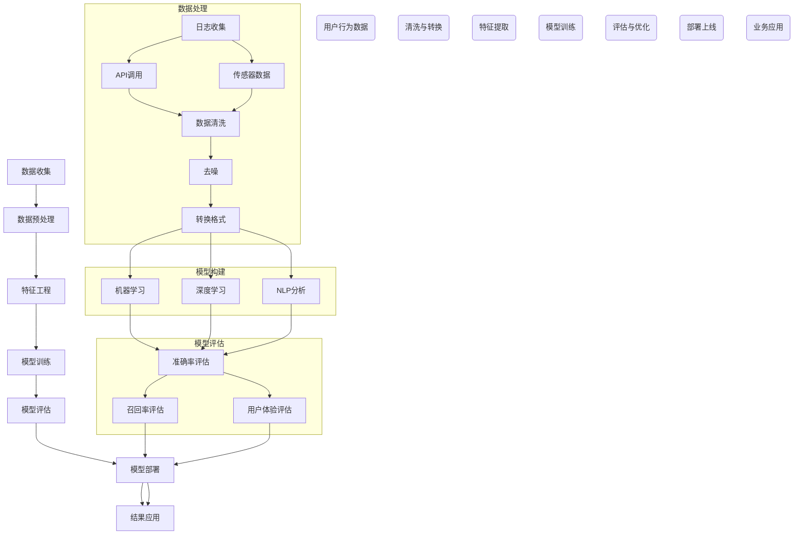

                 

### 文章标题

“用户行为分析：AI的个性化基础”

用户行为分析作为现代人工智能领域的重要分支，已经成为推动个性化服务、提升用户体验的核心技术。在电子商务、社交媒体、金融等多个领域，用户行为分析的应用不仅提高了业务的效率，还显著增强了用户体验。本文旨在深入探讨用户行为分析的基础理论、核心算法及其实践应用，通过逐步分析推理的方式，帮助读者理解这一复杂但至关重要的技术。

### 文章关键词

- 用户行为分析
- 个性化推荐
- 机器学习
- 深度学习
- 自然语言处理
- 应用场景

### 文章摘要

本文首先介绍了用户行为分析的基本概念和重要性，回顾了其发展历程和应用场景。接着，详细阐述了用户行为数据的收集与处理方法，包括用户行为数据的种类、收集方法和处理技术。然后，探讨了用户画像、用户行为模型和用户兴趣与偏好的核心概念。随后，介绍了机器学习、深度学习和自然语言处理在用户行为分析中的应用。本文还重点分析了用户行为分析在电子商务、社交媒体、金融和医疗等领域的实践应用，最后探讨了用户行为分析的未来趋势和新兴应用领域。

## 第一部分：用户行为分析基础理论

### 第1章：用户行为分析概述

#### 1.1 用户行为分析的定义与重要性

用户行为分析（User Behavior Analysis，简称UBA）是指通过分析用户的行为数据，理解用户的行为模式、兴趣和偏好，从而为个性化推荐、业务优化和用户体验提升提供依据。用户行为分析的核心在于数据驱动，通过对大量行为数据的收集、处理和分析，提取有价值的信息，进而实现精准的决策支持。

用户行为分析在现代社会的重要性不可低估。首先，在电子商务领域，通过分析用户的购物行为，可以实现个性化推荐，提高销售转化率。其次，在社交媒体领域，通过分析用户的互动行为，可以提升用户参与度和社区活跃度。在金融领域，通过分析用户的交易行为，可以识别潜在风险和欺诈行为。在医疗领域，通过分析患者的就医行为，可以提供个性化健康服务。总之，用户行为分析已经成为各行业提升业务效率和用户体验的重要工具。

#### 1.2 用户行为分析的发展历程

用户行为分析的发展历程可以追溯到互联网的兴起。早期的用户行为分析主要依靠简单的日志文件分析，通过对用户访问行为的基本统计，了解用户对网站的兴趣点。随着互联网技术的不断发展，用户生成的内容和数据量呈现爆炸式增长，用户行为分析也逐渐从简单的统计转向复杂的数据挖掘和机器学习。

21世纪初，随着大数据技术和云计算的兴起，用户行为分析迎来了新的发展机遇。海量数据的存储和处理能力大幅提升，使得对用户行为数据进行深入挖掘和分析成为可能。同时，机器学习和深度学习算法的快速发展，为用户行为分析提供了强大的技术支持。

近年来，用户行为分析的应用场景不断扩展，不仅局限于互联网领域，还逐渐渗透到物联网、智能交通、城市规划等多个新兴领域。随着人工智能技术的不断进步，用户行为分析正朝着更加智能化、个性化的方向发展。

#### 1.3 用户行为分析的应用场景

用户行为分析的应用场景广泛且多样，以下是其中几个典型的应用场景：

1. **电子商务**：通过分析用户的购物行为，电子商务平台可以实现个性化推荐，提高用户的购物体验和销售额。例如，亚马逊和淘宝等平台都会根据用户的浏览历史、购买记录和搜索关键词，推荐相关的商品。

2. **社交媒体**：社交媒体平台通过分析用户的互动行为，可以提升用户参与度和社区活跃度。例如，Facebook和微博等平台都会根据用户的点赞、评论和分享行为，推荐相关的帖子或内容。

3. **金融**：金融机构通过分析用户的交易行为，可以识别潜在风险和欺诈行为。例如，银行可以通过分析用户的转账记录和交易频率，及时发现异常交易，防止欺诈。

4. **医疗**：医疗机构通过分析患者的就医行为，可以提供个性化健康服务。例如，医院可以通过分析患者的就诊记录和健康状况，为患者提供个性化的健康建议和治疗方案。

5. **物联网**：物联网设备通过分析用户的行为数据，可以实现智能化的服务和管理。例如，智能家居系统可以通过分析用户的生活习惯，自动调节家中的灯光、温度和家电使用。

#### 1.4 用户行为分析的基本框架

用户行为分析的基本框架通常包括以下几个步骤：

1. **数据收集**：通过网站日志、用户交互记录、传感器数据等渠道，收集用户的原始行为数据。

2. **数据预处理**：对原始数据进行清洗、去噪和转换，使其适合进行分析。

3. **特征提取**：从预处理后的数据中提取对用户行为有代表性的特征。

4. **数据建模**：使用机器学习或深度学习算法，构建用户行为模型。

5. **模型评估**：对构建的模型进行评估，确保其准确性和可靠性。

6. **结果应用**：将分析结果应用于实际业务场景，如个性化推荐、风险控制等。

通过以上步骤，用户行为分析可以实现对用户行为的深入理解和精准预测，为业务决策提供有力支持。

### 第2章：用户行为数据的收集与处理

#### 2.1 用户行为数据的种类

用户行为数据种类繁多，主要包括以下几类：

1. **网站日志数据**：包括用户的访问时间、访问页面、点击行为等，是用户行为分析中最常见的数据类型。

2. **交互数据**：包括用户的搜索记录、评论、点赞、分享等，反映了用户的参与度和兴趣点。

3. **移动设备数据**：包括用户的地理位置、使用时长、应用使用频率等，可以通过GPS、传感器等技术进行收集。

4. **社交媒体数据**：包括用户的发布内容、互动行为、关注关系等，是社交媒体分析的重要数据来源。

5. **物联网数据**：包括智能家居设备、智能穿戴设备等产生的数据，如温度、湿度、步数等。

#### 2.2 用户行为数据收集方法

用户行为数据的收集方法多样，主要包括以下几种：

1. **日志收集**：通过在网站或应用服务器上部署日志收集器，自动收集用户的访问日志和操作记录。

2. **API调用**：通过API接口，从第三方平台或服务中获取用户行为数据。

3. **传感器收集**：利用物联网传感器，收集用户的物理行为数据，如地理位置、心率等。

4. **问卷和访谈**：通过在线问卷或面对面访谈，获取用户的自我报告行为数据。

5. **用户生成内容**：通过社交媒体、论坛等平台，收集用户生成的文字、图片、视频等数据。

#### 2.3 用户行为数据处理技术

用户行为数据处理技术主要包括以下几个环节：

1. **数据清洗**：去除重复数据、空值数据、噪声数据，保证数据的准确性和完整性。

2. **数据转换**：将不同格式的数据转换为统一的格式，如将文本数据转换为结构化数据。

3. **特征工程**：从原始数据中提取对用户行为有代表性的特征，如用户活跃时间、访问频率等。

4. **数据存储**：将处理后的数据存储到数据库或数据仓库中，便于后续分析和挖掘。

5. **数据可视化**：使用图表、地图等可视化工具，将分析结果直观地呈现出来。

通过以上数据处理技术，可以实现对用户行为数据的全面、准确的收集和处理，为用户行为分析提供可靠的数据基础。

### 第3章：用户行为分析的核心概念

#### 3.1 用户画像

用户画像（User Profiling）是用户行为分析的核心概念之一，它通过对用户的兴趣、行为、特征等数据进行综合分析，形成一个关于用户的详细描述。用户画像的目的是为了更好地理解和预测用户行为，从而实现个性化服务和精准营销。

用户画像通常包括以下几个方面的信息：

1. **基础信息**：用户的性别、年龄、职业、地理位置等基本信息。
2. **行为特征**：用户的访问历史、搜索记录、购买行为、评论互动等行为特征。
3. **兴趣偏好**：用户的兴趣爱好、阅读偏好、娱乐偏好等。
4. **社交属性**：用户的社会关系、社交网络、社交行为等。

通过构建用户画像，企业可以深入了解用户需求，实现个性化推荐和精准营销。例如，电子商务平台可以根据用户的购买历史和兴趣偏好，推荐相关的商品；社交媒体平台可以根据用户的互动行为，推荐相关的帖子或内容。

#### 3.2 用户行为模型

用户行为模型（User Behavior Model）是基于用户行为数据，通过数据分析和机器学习技术构建的模型，用于预测用户的行为和兴趣。用户行为模型的核心是通过对历史数据的分析，发现用户的行为规律和趋势，进而预测未来的行为。

用户行为模型通常包括以下几个步骤：

1. **数据收集**：收集用户的访问日志、交互数据等行为数据。
2. **数据预处理**：对原始数据进行清洗、去噪和转换，提取有效的特征。
3. **特征工程**：从预处理后的数据中提取对用户行为有代表性的特征，如访问频率、点击率、购买频率等。
4. **模型训练**：使用机器学习算法，如决策树、支持向量机、神经网络等，训练用户行为模型。
5. **模型评估**：对训练好的模型进行评估，确保其准确性和可靠性。
6. **模型应用**：将训练好的模型应用于实际业务场景，如个性化推荐、风险控制等。

通过用户行为模型，企业可以更准确地预测用户行为，优化业务策略，提高用户满意度。

#### 3.3 用户兴趣与偏好

用户兴趣与偏好（User Interest and Preference）是用户行为分析中另一个重要的概念，它反映了用户在特定领域或内容上的兴趣和偏好。了解用户的兴趣与偏好，可以帮助企业更好地满足用户需求，提供个性化服务。

用户兴趣与偏好通常通过以下几种方式进行分析：

1. **内容分析**：通过对用户生成的内容，如评论、博客、微博等，分析用户的兴趣和偏好。
2. **行为分析**：通过对用户的访问行为、搜索行为、购买行为等，分析用户的兴趣和偏好。
3. **社交网络分析**：通过对用户的社交网络和互动行为，分析用户的兴趣和偏好。

了解用户兴趣与偏好，可以帮助企业实现个性化推荐、精准营销等，提升用户体验和满意度。

### 第4章：用户行为分析技术基础

用户行为分析技术基础涵盖了多个领域的先进技术，包括机器学习、深度学习和自然语言处理。这些技术为用户行为分析提供了强大的数据建模和分析工具，使得对海量用户行为数据的深入理解和精准预测成为可能。

#### 4.1 机器学习算法在用户行为分析中的应用

机器学习算法是用户行为分析中常用的技术之一。它们通过学习大量用户行为数据，自动发现用户的行为模式和兴趣点，从而为个性化推荐、风险控制和业务优化提供支持。

常见的机器学习算法包括：

1. **决策树**：通过构建决策树模型，可以实现对用户行为的分类和预测。决策树算法简单直观，易于理解和实现。
2. **支持向量机**：支持向量机（SVM）是一种强大的分类算法，通过在高维空间中找到最优分隔超平面，实现对用户行为的精准分类。
3. **神经网络**：神经网络，尤其是深度神经网络（DNN），是一种模拟人脑神经元连接的算法。通过多层神经元的非线性变换，深度神经网络可以自动提取用户行为数据中的复杂特征，实现高精度的行为预测。

以下是一个简单的用户行为分类的决策树算法伪代码示例：

```python
def classify_user_behavior(data):
    # 初始化决策树模型
    tree = DecisionTree()

    # 训练决策树模型
    tree.fit(data)

    # 预测用户行为
    predictions = tree.predict(data)

    return predictions
```

#### 4.2 深度学习在用户行为分析中的应用

深度学习算法在用户行为分析中扮演了重要角色。与传统的机器学习算法相比，深度学习能够自动提取用户行为数据中的高级特征，显著提高分析精度。

常见的深度学习算法包括：

1. **卷积神经网络（CNN）**：卷积神经网络在图像识别领域取得了显著成功。通过卷积层、池化层和全连接层的组合，CNN可以自动提取图像中的局部特征，实现对用户行为数据的可视化分析。
2. **循环神经网络（RNN）**：循环神经网络特别适合处理序列数据，如用户的点击流数据、时间序列数据。通过内存单元和反馈循环，RNN可以捕捉到用户行为数据中的长期依赖关系。
3. **长短期记忆网络（LSTM）**：长短期记忆网络是RNN的一种改进，通过门控机制，LSTM可以有效避免梯度消失问题，捕捉到用户行为数据中的长期依赖关系。

以下是一个简单的用户行为预测的LSTM算法伪代码示例：

```python
import tensorflow as tf

# 定义LSTM模型
model = tf.keras.Sequential([
    tf.keras.layers.LSTM(50, activation='relu', return_sequences=True),
    tf.keras.layers.LSTM(50, activation='relu'),
    tf.keras.layers.Dense(1)
])

# 编译模型
model.compile(optimizer='adam', loss='mse')

# 训练模型
model.fit(x_train, y_train, epochs=100)

# 预测用户行为
predictions = model.predict(x_test)
```

#### 4.3 自然语言处理在用户行为分析中的应用

自然语言处理（NLP）技术在用户行为分析中也有广泛应用。通过NLP技术，可以深入理解用户的文本数据，如评论、反馈、社交媒体帖子等，从而提取用户的兴趣点和情感倾向。

常见的NLP技术包括：

1. **词嵌入**：词嵌入（Word Embedding）是一种将词汇映射到高维空间中的技术。通过词嵌入，可以捕捉到词汇之间的语义关系，为用户行为分析提供语义理解基础。
2. **情感分析**：情感分析（Sentiment Analysis）是通过分析文本数据中的情感倾向，了解用户的情绪状态。通过情感分析，可以识别用户对产品、服务或品牌的情感态度。
3. **主题建模**：主题建模（Topic Modeling）是一种无监督学习方法，通过分析用户的文本数据，自动发现用户感兴趣的主题。常见的主题建模方法包括LDA（Latent Dirichlet Allocation）。

以下是一个简单的文本情感分析算法伪代码示例：

```python
from sklearn.feature_extraction.text import TfidfVectorizer
from sklearn.svm import LinearSVC

# 初始化TF-IDF向量器
vectorizer = TfidfVectorizer()

# 将文本数据转换为TF-IDF向量
X = vectorizer.fit_transform(text_data)

# 训练线性支持向量机模型
model = LinearSVC()
model.fit(X, labels)

# 预测文本情感
predictions = model.predict(vectorizer.transform(new_text_data))
```

通过以上技术，用户行为分析可以在不同层面深入挖掘用户数据，实现精准的用户行为预测和个性化服务。随着技术的不断进步，用户行为分析将在更多领域发挥重要作用。

### 第5章：用户行为分析在实践中的应用

用户行为分析在实践中的应用已经深入到电子商务、社交媒体、金融、教育、医疗等多个领域，通过分析用户的行为数据，优化业务流程，提升用户体验，实现精准营销和业务增长。以下将详细探讨用户行为分析在电子商务、社交媒体和金融领域的具体应用。

#### 5.1 电子商务中的用户行为分析

电子商务平台通过用户行为分析，可以实现对用户的精准定位和个性化推荐，从而提高用户满意度和销售转化率。

1. **个性化推荐系统**：电子商务平台利用用户的历史购买记录、浏览行为和搜索关键词，构建用户画像，并通过机器学习算法推荐相关的商品。例如，亚马逊（Amazon）和京东（JD.com）等平台都会根据用户的购物历史和浏览记录，推荐用户可能感兴趣的商品。

2. **购物车分析**：通过对购物车中商品的分析，电子商务平台可以了解用户的购买意图和偏好。通过分析购物车中的商品种类、数量、价格等信息，平台可以优化购物车设计，提高用户的购买决策效率。

3. **用户流失预测**：通过分析用户的购物行为，如购买频率、购买金额等，电子商务平台可以预测用户的流失风险。对于存在流失风险的用户，平台可以采取优惠活动、个性化推荐等措施，挽回用户。

以下是一个简单的购物车分析算法的伪代码示例：

```python
def analyze_cart(cart_data):
    # 提取购物车中的商品种类和数量
    products = extract_products(cart_data)
    quantities = extract_quantities(cart_data)

    # 构建用户画像
    user_profile = build_user_profile(products, quantities)

    # 分析购物车中的商品关系
    recommendations = analyze_product_relations(user_profile)

    return recommendations
```

#### 5.2 社交媒体分析

社交媒体平台通过用户行为分析，可以提升用户参与度，增强社区活跃度，实现精准内容推荐和广告投放。

1. **用户参与度分析**：通过分析用户的点赞、评论、分享等互动行为，社交媒体平台可以了解用户的兴趣和活跃度。例如，微博（Weibo）和推特（Twitter）等平台会根据用户的互动行为，推荐相关的帖子或话题。

2. **社交网络分析**：通过分析用户的社交网络结构，社交媒体平台可以识别有影响力的用户和关键节点。例如，Facebook和Instagram等平台会根据用户的社交关系，推荐好友和关注者。

3. **网络舆情分析**：通过分析用户的评论和反馈，社交媒体平台可以了解公众对特定事件或品牌的看法和态度。例如，YouTube和Reddit等平台会通过舆情分析，监测网络热点和用户情感变化。

以下是一个简单的社交网络分析算法的伪代码示例：

```python
def analyze_social_network(network_data):
    # 构建社交网络图
    graph = build_social_network_graph(network_data)

    # 计算社交网络中的影响力
    influence_scores = calculate_influence_scores(graph)

    # 推荐有影响力的用户和内容
    recommendations = recommend_influencers_and_contents(influence_scores)

    return recommendations
```

#### 5.3 金融领域的用户行为分析

金融领域通过用户行为分析，可以实现对风险的有效控制和客户关系的优化，提高业务效率和用户满意度。

1. **风险评估**：通过对用户的交易行为、风险偏好等数据分析，金融机构可以评估用户的信用风险和投资风险。例如，银行和投资平台会通过用户行为数据，制定个性化的风险评估模型，为用户提供定制化的金融服务。

2. **欺诈检测**：通过分析用户的交易行为和操作特征，金融机构可以识别潜在的欺诈行为。例如，信用卡公司会通过用户的行为数据，检测异常交易，防止欺诈损失。

3. **客户关系管理**：通过对用户的交易历史、互动记录等数据分析，金融机构可以了解用户的需求和偏好，优化客户服务体验。例如，银行会通过用户行为分析，推荐适合用户的理财产品和服务项目。

以下是一个简单的欺诈检测算法的伪代码示例：

```python
def detect_fraud( transaction_data ):
    # 构建用户行为模型
    user_model = build_user_behavior_model(transaction_data)

    # 预测交易是否为欺诈
    fraud_predictions = user_model.predict(transaction_data)

    # 标记欺诈交易
    fraud_transactions = mark_fraudulent_transactions(fraud_predictions)

    return fraud_transactions
```

通过以上实际案例和算法示例，我们可以看到用户行为分析在电子商务、社交媒体和金融领域的广泛应用。通过深入分析和挖掘用户行为数据，企业可以实现对用户需求的精准把握，优化业务流程，提升用户体验，实现持续的业务增长。

### 第6章：教育与医疗领域的用户行为分析

教育与医疗领域通过用户行为分析，可以实现个性化教育服务、优化医疗资源配置和提升患者健康管理水平。以下将详细介绍用户行为分析在这两个领域的具体应用。

#### 6.1 在线教育分析

在线教育平台通过用户行为分析，可以深入了解学生的学习习惯和需求，从而提供个性化的教学服务，提高学习效果。

1. **学习行为分析**：通过对学生的登录时间、学习时长、学习路径等数据进行分析，平台可以了解学生的学习行为模式。例如，教育平台可以通过分析学习时间分布，识别学生的学习高峰期和低谷期，合理安排课程内容。

2. **学习效果评估**：通过分析学生的考试成绩、作业完成情况等数据，平台可以评估学生的学习效果。例如，教育平台可以通过分析学生的考试分数变化趋势，识别学习效果较好的课程和教师，优化教学内容和教学方法。

3. **个性化推荐**：根据学生的学习行为和效果评估，平台可以推荐适合学生的课程和学习资源。例如，网易云课堂通过分析学生的学习行为和兴趣偏好，推荐相关的课程和学习资料，帮助学生更有效地学习。

以下是一个简单的学习行为分析算法的伪代码示例：

```python
def analyze_learning_behavior(learning_data):
    # 计算平均学习时长
    average_learning_time = calculate_average_learning_time(learning_data)

    # 分析学习时间分布
    learning_time_distribution = analyze_learning_time_distribution(learning_data)

    # 评估学习效果
    learning_effects = evaluate_learning_effects(learning_data)

    # 推荐个性化课程
    recommendations = recommend_courses(learning_effects)

    return recommendations
```

#### 6.2 医疗数据分析

医疗机构通过用户行为分析，可以优化医疗资源配置，提高医疗服务的质量和效率。

1. **患者行为分析**：通过对患者的就诊记录、检查结果、药品使用情况等数据进行分析，医疗机构可以了解患者的健康状况和行为模式。例如，医院可以通过分析患者的就诊频次和病症类型，识别常见的健康问题和高风险患者群体。

2. **医疗资源优化**：通过分析患者的行为数据，医疗机构可以优化医疗资源配置。例如，医院可以通过分析患者流量分布，合理安排医生排班和科室资源，提高医疗服务效率。

3. **患者健康管理**：通过分析患者的健康数据，医疗机构可以为患者提供个性化的健康管理服务。例如，医疗机构可以通过分析患者的体检报告、生活习惯等数据，为患者提供健康建议和预防措施，帮助患者更好地管理健康。

以下是一个简单的患者行为分析算法的伪代码示例：

```python
def analyze_patient_behavior(patient_data):
    # 提取患者的基本信息
    patient_info = extract_patient_info(patient_data)

    # 分析患者的就诊行为
    visit_behavior = analyze_visit_behavior(patient_data)

    # 评估患者的健康状况
    health_status = evaluate_health_status(patient_data)

    # 提供个性化健康建议
    health_recommendations = provide_health_recommendations(health_status)

    return health_recommendations
```

#### 6.3 健康行为监测

健康行为监测是通过用户行为分析，实时监测和评估用户的健康状况，提供预警和干预服务。

1. **实时数据监测**：通过传感器和智能设备，实时收集用户的健康数据，如心率、血压、睡眠质量等。例如，智能手表和健康手环可以通过传感器实时监测用户的心率和睡眠质量，并将数据上传至云端。

2. **数据分析与预警**：通过分析用户的健康数据，可以及时发现异常情况，提供预警服务。例如，当用户的心率持续升高或血压异常时，系统可以发出预警通知，提醒用户就医或采取相应措施。

3. **干预服务**：根据健康数据分析结果，提供个性化的干预服务，如健康咨询、生活方式调整建议等。例如，健康管理系统可以通过分析用户的数据，提供定制化的饮食和运动建议，帮助用户改善健康状况。

以下是一个简单的健康行为监测算法的伪代码示例：

```python
def monitor_health_behavior(health_data):
    # 实时监测用户健康数据
    real_time_data = real_time_monitor(health_data)

    # 分析健康数据
    health_analysis = analyze_health_data(real_time_data)

    # 提供健康预警
    health_warnings = provide_health_warnings(health_analysis)

    # 提供个性化干预服务
    intervention_services = provide_intervention_services(health_warnings)

    return intervention_services
```

通过以上应用案例和算法示例，我们可以看到用户行为分析在教育和医疗领域的广泛应用。通过深入分析和挖掘用户行为数据，教育机构和医疗机构可以提供更加个性化和高效的服务，提升用户体验和满意度。

### 第7章：用户行为分析的未来趋势

用户行为分析作为人工智能领域的重要组成部分，正随着技术的不断进步而快速发展。未来，用户行为分析将呈现出以下几个显著的趋势：

#### 9.1 智能推荐系统的演进

智能推荐系统是用户行为分析的重要应用之一，未来的发展趋势将更加智能化、个性化。随着深度学习和自然语言处理技术的不断进步，推荐系统将能够更好地理解用户的复杂需求和偏好。例如，基于深度学习的协同过滤算法将能够捕捉到用户行为数据中的复杂关系，提供更加精准的推荐。此外，结合自然语言处理技术，推荐系统将能够分析用户的文本数据，如评论、搜索关键词等，进一步优化推荐效果。

#### 9.2 用户行为预测的未来

用户行为预测是用户行为分析的核心目标之一。随着大数据技术和机器学习算法的不断发展，用户行为预测的精度和效率将得到显著提升。未来的用户行为预测将更加注重实时性和动态性。通过实时分析用户的在线行为数据，系统能够实时调整预测模型，提供更加准确的预测。此外，用户行为预测还将结合多模态数据，如文本、图像、音频等，实现更全面的行为理解和预测。

#### 9.3 个性化体验与隐私保护

个性化体验和隐私保护是用户行为分析中不可忽视的两个方面。未来的用户行为分析将更加注重用户隐私保护，通过采用差分隐私（Differential Privacy）等技术，确保用户数据的安全性和隐私性。同时，个性化体验将变得更加智能化和人性化。通过深度学习和个性化推荐技术，系统能够根据用户的行为数据，提供定制化的服务和产品，提升用户的满意度和忠诚度。

#### 10.1 物联网分析

随着物联网（IoT）技术的快速发展，用户行为分析将扩展到物联网领域。物联网设备如智能家居、智能穿戴设备等会产生大量的行为数据，这些数据将为用户行为分析提供丰富的信息来源。未来的物联网分析将能够实时捕捉和解读用户的物理行为数据，如步数、心率、睡眠质量等，为用户提供个性化的健康管理和生活服务。

#### 10.2 智能交通分析

智能交通系统是物联网分析的一个重要应用领域。通过分析交通数据，如车辆流量、路况信息等，智能交通系统能够优化交通流量，减少拥堵，提高交通效率。未来的智能交通分析将更加注重实时性和精确性。通过结合传感器数据和用户行为数据，智能交通系统能够实时调整交通信号，提供个性化的路线规划和导航服务。

#### 10.3 城市规划与治理

用户行为分析在城市规划与治理中的应用前景广阔。通过对城市人口流动、公共设施使用等数据的分析，城市规划者可以优化城市布局，提高公共资源利用效率。未来的城市规划与治理将更加注重数据驱动的决策，通过用户行为分析，实现智慧城市的建设。

综上所述，用户行为分析的未来将更加智能化、个性化，并在物联网、智能交通、城市规划等多个领域发挥重要作用。随着技术的不断进步，用户行为分析将在提升用户体验、优化业务流程、推动社会进步等方面发挥更大的作用。

### 第10章：用户行为分析的新兴应用领域

用户行为分析在物联网（IoT）、智能交通、城市规划与治理等新兴领域展示出了巨大的潜力。这些领域不仅需要处理大量的用户行为数据，还需要将分析结果应用于实际的决策过程，以提高效率、优化资源配置、提升用户体验。

#### 10.1 物联网分析

物联网设备如智能手表、智能家居设备和工业传感器等不断产生海量数据，这些数据包含了丰富的用户行为信息。物联网分析通过收集和分析这些数据，可以提供以下应用：

1. **智能家居**：通过分析用户的家电使用习惯，智能家居系统能够优化设备操作，提供节能建议。例如，智能恒温器可以根据用户的日常作息，自动调节室内温度。

2. **智能穿戴设备**：通过分析用户的健康数据，如心率、步数、睡眠质量等，智能穿戴设备可以为用户提供个性化的健康建议和健康管理服务。

3. **工业监控**：在工业生产中，通过分析设备运行数据，可以预测设备故障，优化生产流程，提高生产效率。

以下是一个简单的物联网数据分析算法的伪代码示例：

```python
def analyze_iot_data( IoT_data ):
    # 提取设备使用数据
    usage_data = extract_usage_data( IoT_data )
    
    # 构建用户行为模型
    behavior_model = build_behavior_model( usage_data )
    
    # 预测设备使用趋势
    predictions = predict_usage_trends( behavior_model )
    
    # 提供个性化建议
    recommendations = provide_recommendations( predictions )
    
    return recommendations
```

#### 10.2 智能交通分析

智能交通系统通过分析交通数据，如车辆流量、路况信息等，可以实现交通流量优化、交通事故预警和应急响应。以下为智能交通分析的应用：

1. **交通流量控制**：通过分析交通流量数据，智能交通系统能够实时调整交通信号灯，优化交通流量，减少拥堵。

2. **交通事故预警**：通过分析车辆行驶数据，智能交通系统可以提前预警潜在的交通事故，提供应急措施。

3. **车辆导航**：基于用户的出行数据，智能导航系统能够提供个性化的路线规划，避免交通拥堵。

以下是一个简单的智能交通数据分析算法的伪代码示例：

```python
def analyze_traffic_data( traffic_data ):
    # 提取交通流量数据
    traffic_flow = extract_traffic_flow( traffic_data )
    
    # 分析交通状况
    traffic_conditions = analyze_traffic_conditions( traffic_flow )
    
    # 预测交通流量
    traffic_predictions = predict_traffic_flow( traffic_conditions )
    
    # 提供路线规划
    route_recommendations = provide_route_planning( traffic_predictions )
    
    return route_recommendations
```

#### 10.3 城市规划与治理

用户行为分析在城市规划与治理中的应用可以显著提高公共资源的利用效率，优化城市布局。以下为用户行为分析在规划与治理中的应用：

1. **公共设施优化**：通过分析市民的出行数据、公共设施使用数据，城市规划者可以优化公共设施的布局，提高市民的便利性。

2. **城市环境管理**：通过分析空气质量、水质等环境数据，城市规划者可以制定有效的环境保护措施，改善城市环境质量。

3. **应急响应**：通过分析突发事件的数据，如自然灾害、火灾等，城市管理者可以迅速响应，制定有效的应急措施。

以下是一个简单的城市规划数据分析算法的伪代码示例：

```python
def analyze_city_data( city_data ):
    # 提取公共设施使用数据
    facility_usage = extract_facility_usage( city_data )
    
    # 分析公共设施需求
    facility_requirements = analyze_facility_requirements( facility_usage )
    
    # 优化公共设施布局
    facility_layout = optimize_facility_layout( facility_requirements )
    
    # 提供城市规划建议
    planning_recommendations = provide_planning_advises( facility_layout )
    
    return planning_recommendations
```

通过以上新兴应用领域的案例分析，我们可以看到用户行为分析在提高资源利用效率、优化业务流程和提升用户体验方面的巨大潜力。随着技术的不断进步，用户行为分析将在更多新兴领域发挥重要作用。

### 附录A：用户行为分析相关工具与资源

用户行为分析涉及多个技术领域，需要多种工具和资源来支持。以下是一些常用的数据处理工具、机器学习与深度学习框架、用户行为分析开源项目与库，以及学习资源与参考文献。

#### A.1 数据处理工具

1. **Hadoop**：Apache Hadoop 是一个分布式数据存储和处理框架，适用于大规模数据的处理和分析。

2. **Spark**：Apache Spark 是一个快速且通用的大数据处理引擎，提供丰富的数据处理和分析功能。

3. **Pandas**：Pandas 是 Python 的一个数据处理库，适用于数据清洗、转换和分析。

4. **NumPy**：NumPy 是 Python 的一个科学计算库，提供高效的数组操作和数学函数。

5. **SQL**：SQL 是一种用于数据库查询的标准语言，适用于结构化数据的管理和分析。

#### A.2 机器学习与深度学习框架

1. **TensorFlow**：Google 开发的一个开源深度学习框架，适用于各种深度学习任务。

2. **PyTorch**：Facebook 开发的一个开源深度学习框架，提供灵活且动态的计算图。

3. **Scikit-learn**：Python 的一个机器学习库，提供丰富的机器学习算法和工具。

4. **Keras**：一个高层次的深度学习框架，基于 TensorFlow 和 Theano，适用于快速实验和模型构建。

#### A.3 用户行为分析开源项目与库

1. **User Behavior Analytics (UBA)**：一个开源的用户行为分析平台，提供用户行为数据收集、处理和分析的功能。

2. **Giraffe**：一个开源的用户行为分析框架，适用于大规模用户行为数据的实时分析。

3. **Usermining**：一个开源的用户行为分析工具，提供用户行为数据可视化和分析功能。

4. **Behavior Analyst**：一个开源的用户行为分析工具，基于 Scikit-learn，提供用户行为建模和分析功能。

#### A.4 学习资源与参考文献

1. **《用户行为分析：理论与实践》**：李明华，清华大学出版社，2018年。

2. **《机器学习实战》**：Peter Harrington，机械工业出版社，2013年。

3. **《深度学习》**：Ian Goodfellow、Yoshua Bengio 和 Aaron Courville，中国电力出版社，2016年。

4. **《大数据技术导论》**：刘铁岩，机械工业出版社，2017年。

5. **《自然语言处理综论》**：Daniel Jurafsky 和 James H. Martin，电子工业出版社，2017年。

通过以上工具和资源的结合，用户行为分析可以更加高效、准确地实现，为各行业提供强大的技术支持。

### 第11章：用户行为分析的Mermaid流程图

用户行为分析涉及多个步骤，从数据收集、预处理、特征提取到模型构建、评估和部署。以下是一个用户行为分析的全流程Mermaid流程图，用于展示整个流程的各个环节和它们之间的关系。



这个Mermaid流程图清晰地展示了用户行为分析从数据收集、预处理、特征提取，到模型训练、评估和部署的整个流程，以及各个步骤之间的联系。通过这种可视化方式，读者可以更直观地理解用户行为分析的过程和技术要点。

