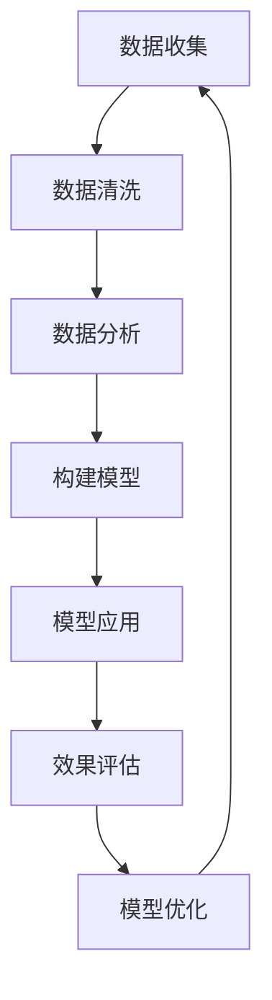
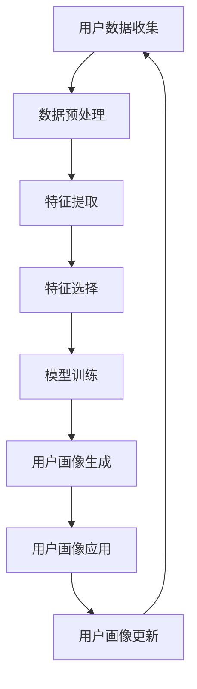
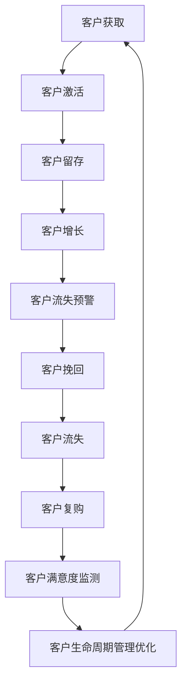

                 

# 文章标题: 《电商平台中的智能客户分析技术》

> 关键词：电商平台、智能客户分析、数据分析、机器学习、客户细分、个性化推荐

> 摘要：本文将深入探讨电商平台中智能客户分析技术的应用与实践。通过分析数据、挖掘行为和构建模型，我们将了解如何运用智能算法实现客户细分与个性化推荐，从而提升客户满意度和企业竞争力。

## 《电商平台中的智能客户分析技术》目录大纲

### 第一部分：引言与背景

#### 1.1 书籍概述
- **1.1.1 书籍目标**
- **1.1.2 读者对象**
- **1.1.3 书籍结构**

#### 1.2 电商平台与客户分析
- **1.2.1 电商平台的发展历程**
- **1.2.2 客户分析的重要性**
- **1.2.3 智能客户分析的技术背景**

### 第二部分：智能客户分析技术基础

#### 2.1 客户数据概述
- **2.1.1 数据来源**
- **2.1.2 数据类型**
- **2.1.3 数据处理与存储**

#### 2.2 数据分析与挖掘
- **2.2.1 数据预处理**
- **2.2.2 描述性统计分析**
- **2.2.3 聚类分析与关联规则挖掘**

#### 2.3 智能算法基础
- **2.3.1 机器学习基础**
- **2.3.2 数据挖掘算法**
- **2.3.3 神经网络与深度学习**

#### 2.4 客户行为分析
- **2.4.1 客户行为数据收集**
- **2.4.2 客户行为分析模型**
- **2.4.3 客户行为预测**

#### 2.5 客户细分与个性化推荐
- **2.5.1 客户细分方法**
- **2.5.2 个性化推荐系统**
- **2.5.3 实践案例分析**

### 第三部分：智能客户分析技术应用

#### 3.1 用户画像构建
- **3.1.1 用户画像概念**
- **3.1.2 用户画像构建方法**
- **3.1.3 用户画像应用场景**

#### 3.2 客户忠诚度分析
- **3.2.1 忠诚度模型构建**
- **3.2.2 忠诚度预测与提升策略**
- **3.2.3 实践案例分析**

#### 3.3 客户生命周期管理
- **3.3.1 客户生命周期概念**
- **3.3.2 客户生命周期模型构建**
- **3.3.3 客户生命周期管理策略**

#### 3.4 智能客服系统
- **3.4.1 智能客服系统概述**
- **3.4.2 自然语言处理技术**
- **3.4.3 智能客服系统实现与优化**

#### 3.5 智能营销策略
- **3.5.1 智能营销概述**
- **3.5.2 数据驱动的营销策略**
- **3.5.3 智能营销案例与实践**

### 第四部分：智能客户分析项目实战

#### 4.1 实战一：用户行为数据分析
- **4.1.1 项目背景**
- **4.1.2 数据收集与处理**
- **4.1.3 分析模型与算法**
- **4.1.4 实现与结果分析**

#### 4.2 实战二：客户细分与个性化推荐
- **4.2.1 项目背景**
- **4.2.2 用户画像构建**
- **4.2.3 个性化推荐系统设计**
- **4.2.4 实现与结果分析**

#### 4.3 实战三：智能客服系统开发
- **4.3.1 项目背景**
- **4.3.2 系统设计**
- **4.3.3 算法实现**
- **4.3.4 系统优化与评估**

### 第五部分：总结与展望

#### 5.1 智能客户分析技术发展趋势
- **5.1.1 技术革新**
- **5.1.2 应用前景**
- **5.1.3 面临的挑战**

#### 5.2 未来方向与建议
- **5.2.1 研究方向**
- **5.2.2 企业实践建议**
- **5.2.3 持续学习与成长**

### 附录

#### 附录 A：常用工具与资源
- **A.1 数据处理工具**
- **A.2 机器学习框架**
- **A.3 自然语言处理工具**
- **A.4 其他相关资源**

#### 附录 B：参考文献
- **B.1 学术论文**
- **B.2 技术报告**
- **B.3 商业书籍**
- **B.4 在线资源**

#### 附录 C：Mermaid 流程图
- **C.1 智能客户分析流程**
- **C.2 用户画像构建流程**
- **C.3 客户生命周期管理流程**

## 1.1 书籍概述

### 1.1.1 书籍目标

本书的目标是深入探讨电商平台中智能客户分析技术的应用与实践。通过系统地介绍客户数据概述、数据挖掘与智能算法基础、客户行为分析以及客户细分与个性化推荐等内容，帮助读者全面理解并掌握智能客户分析的核心技术和方法。此外，本书还通过实战案例分析，展示智能客户分析在电商平台中的应用效果，以期为企业的数字化转型和客户关系管理提供有益的参考。

### 1.1.2 读者对象

本书适用于以下几类读者：

1. 数据分析师和大数据工程师：了解智能客户分析的基本概念和方法，掌握数据挖掘与机器学习技术在客户分析中的应用。
2. 电商行业从业者：了解智能客户分析对电商平台运营的重要性和具体应用方法，提升企业竞争力。
3. 人工智能与机器学习爱好者：通过案例分析和实践，深入了解智能客户分析技术的实现过程和优化策略。

### 1.1.3 书籍结构

本书分为五大部分，共十个章节，具体结构如下：

- **第一部分：引言与背景**：介绍电商平台的发展历程、客户分析的重要性以及智能客户分析的技术背景。
- **第二部分：智能客户分析技术基础**：讲解客户数据概述、数据分析与挖掘、智能算法基础、客户行为分析以及客户细分与个性化推荐。
- **第三部分：智能客户分析技术应用**：介绍用户画像构建、客户忠诚度分析、客户生命周期管理、智能客服系统和智能营销策略。
- **第四部分：智能客户分析项目实战**：通过三个实际案例，展示智能客户分析技术的应用与实践过程。
- **第五部分：总结与展望**：总结智能客户分析技术的发展趋势、未来方向与建议。

### 1.2 电商平台与客户分析

#### 1.2.1 电商平台的发展历程

电商平台是指通过互联网技术进行商品交易和服务的平台，其发展历程可以追溯到20世纪90年代。以下是电商平台的发展历程概述：

1. **萌芽期（1995-2000年）**：互联网的普及使得电子商务开始萌芽，最早的电子商务网站如Amazon、eBay等成立，标志着电商平台的诞生。
2. **成长期（2001-2010年）**：随着互联网技术的发展和用户数量的增加，电商平台开始迅速崛起。这一阶段，国内的电商平台如淘宝、京东等纷纷成立，为消费者提供了便捷的购物体验。
3. **成熟期（2011年至今）**：随着移动互联网的兴起，电商平台进入成熟期。移动购物、社交电商、跨境电商等新模式不断涌现，电商平台的业务范围不断扩大。

#### 1.2.2 客户分析的重要性

客户分析是电商平台运营的核心环节之一，其重要性主要体现在以下几个方面：

1. **提升用户体验**：通过对客户数据的分析，了解客户的需求和行为，从而提供个性化的服务和产品推荐，提升用户满意度。
2. **优化运营策略**：通过分析客户数据，发现潜在的市场机会和风险，为企业制定科学的运营策略提供依据。
3. **增加收入**：通过客户细分和精准营销，提高转化率和复购率，从而增加企业的收入。

#### 1.2.3 智能客户分析的技术背景

智能客户分析是基于大数据、人工智能和机器学习等技术的一种客户分析方式。其技术背景主要包括以下几个方面：

1. **大数据技术**：大数据技术为智能客户分析提供了海量数据的支持。通过数据采集、存储、处理和分析，可以获取客户行为的全貌。
2. **人工智能与机器学习**：人工智能和机器学习技术可以对海量数据进行深度分析，发现客户行为模式、偏好和趋势。常见的机器学习算法包括分类、回归、聚类和关联规则等。
3. **自然语言处理**：自然语言处理技术可以解析客户留言、评论等文本数据，提取有价值的信息，用于客户行为分析和情感分析。
4. **推荐系统**：推荐系统是智能客户分析的重要组成部分。通过分析用户的历史行为和偏好，为用户推荐感兴趣的商品和服务。

### 1.3 智能客户分析技术的概述

智能客户分析技术是指在电商平台运营过程中，利用大数据、人工智能和机器学习等技术，对客户行为、偏好和需求进行深入分析，从而实现客户细分、个性化推荐和精准营销的一种技术方法。智能客户分析技术的核心包括以下几个方面：

1. **客户数据采集与整合**：通过多种数据源采集客户信息，包括用户行为数据、购买数据、评论数据等，并进行数据清洗、整合和存储。
2. **数据分析与挖掘**：利用数据分析与挖掘技术，对客户数据进行分析，提取有价值的信息，如客户行为模式、偏好和趋势。
3. **客户细分与建模**：基于客户数据分析和挖掘结果，对客户进行细分，构建客户细分模型，为个性化推荐和精准营销提供依据。
4. **个性化推荐**：利用推荐系统技术，根据客户的行为和偏好，为每位客户推荐感兴趣的商品和服务，提高转化率和满意度。
5. **精准营销**：基于客户细分和个性化推荐结果，制定精准的营销策略，包括优惠活动、促销、广告投放等，提高客户参与度和购买意愿。

智能客户分析技术的应用不仅能够提升客户的满意度和忠诚度，还能够为电商平台带来更多的商业价值，实现持续增长。

### 1.4 智能客户分析技术的应用场景

智能客户分析技术在电商平台中有多种应用场景，以下列举了其中几个典型的应用场景：

1. **用户画像构建**：通过分析用户的历史行为、偏好和需求，构建用户的综合画像，用于后续的个性化推荐和精准营销。
2. **个性化推荐**：根据用户的浏览记录、购买历史和偏好，为用户推荐个性化的商品和服务，提高用户满意度和转化率。
3. **客户细分**：根据用户的购买行为、消费习惯和偏好，将用户划分为不同的细分群体，为每个群体制定个性化的营销策略。
4. **客户忠诚度分析**：通过分析用户的购买频率、购买金额和复购率等指标，评估客户的忠诚度，制定相应的客户维护和提升策略。
5. **客户行为预测**：利用机器学习算法，预测用户的购买行为、流失风险等，提前采取干预措施，提高客户保留率和满意度。
6. **智能客服**：利用自然语言处理和机器学习技术，为用户提供智能化的客服服务，提高客服效率和用户体验。

通过以上应用场景，智能客户分析技术可以帮助电商平台更好地理解客户需求，提供个性化的服务和产品推荐，提升客户满意度和忠诚度，从而实现商业价值的增长。

## 2.1 客户数据概述

### 2.1.1 数据来源

客户数据是智能客户分析的基础，其来源可以分为以下几类：

1. **用户行为数据**：包括用户在平台上的浏览记录、点击路径、搜索关键词、购买历史、评价和反馈等。这些数据可以通过Web日志、用户操作行为记录等方式获取。
2. **购买数据**：包括用户的购买时间、购买商品、购买数量、购买金额、支付方式、优惠活动参与情况等。这些数据通常来自电商平台的后台交易系统。
3. **社交媒体数据**：包括用户在社交媒体上的行为，如微博、微信、抖音等平台的发布内容、点赞、评论等。这些数据可以通过API接口、爬虫等技术获取。
4. **问卷调查和反馈**：通过在线问卷调查和用户反馈，收集用户对产品的满意度、需求偏好等信息。这些数据可以为后续的产品改进和市场策略提供参考。
5. **第三方数据**：包括用户的基础信息、地理位置、生活习惯等。这些数据可以通过数据交易平台、合作伙伴等途径获取。

### 2.1.2 数据类型

客户数据类型主要包括以下几类：

1. **结构化数据**：具有固定格式和结构的数据，如用户ID、购买日期、商品名称、价格等。结构化数据通常存储在关系型数据库中，便于查询和管理。
2. **半结构化数据**：具有一定的结构，但不完全符合关系型数据库的格式，如XML、JSON等。半结构化数据可以通过解析工具进行处理。
3. **非结构化数据**：没有固定格式和结构的数据，如文本、图片、音频、视频等。非结构化数据通常存储在文件系统或分布式存储系统中。
4. **时序数据**：具有时间属性的数据，如用户访问时间、购买时间、评论时间等。时序数据可以通过时间序列分析等技术进行挖掘和分析。

### 2.1.3 数据处理与存储

客户数据的处理与存储是智能客户分析的重要环节，具体步骤如下：

1. **数据采集**：通过各种技术手段，如Web爬虫、API接口等，收集客户数据。
2. **数据清洗**：对采集到的数据进行清洗，包括去重、去噪、格式转换等，确保数据的准确性和一致性。
3. **数据整合**：将不同来源和类型的数据进行整合，构建客户的全息画像。
4. **数据存储**：选择合适的数据存储方案，如关系型数据库、NoSQL数据库、数据仓库等，存储处理后的数据。
5. **数据挖掘与分析**：利用数据分析与挖掘技术，对存储的数据进行挖掘和分析，提取有价值的信息。
6. **数据可视化**：通过数据可视化工具，将分析结果呈现给决策者，支持业务决策。

### 2.1.4 数据的质量与价值

客户数据的质量直接影响智能客户分析的准确性和效果，因此需要关注以下几点：

1. **准确性**：确保数据来源可靠，减少错误和异常数据的影响。
2. **完整性**：保证数据的全面性，避免数据缺失导致分析结果的偏差。
3. **一致性**：确保不同来源和类型的数据在格式、单位等方面的一致性。
4. **时效性**：及时更新数据，确保分析结果的实时性和准确性。

客户数据的价值主要体现在以下几个方面：

1. **用户理解**：通过数据分析，深入了解用户的行为和偏好，为产品设计、用户体验优化提供依据。
2. **营销策略**：基于用户数据，制定个性化的营销策略，提高营销效果和转化率。
3. **运营优化**：利用数据分析，发现运营中的问题和瓶颈，优化运营流程和策略。
4. **风险管理**：通过分析用户行为，预测潜在的风险，提前采取预防措施。

### 2.1.5 数据隐私与保护

在客户数据分析过程中，需要高度重视数据隐私与保护，遵循以下原则：

1. **最小化收集**：仅收集必要的数据，避免过度收集。
2. **匿名化处理**：对敏感数据进行匿名化处理，防止个人隐私泄露。
3. **数据安全**：加强数据存储和传输过程中的安全措施，防止数据泄露和篡改。
4. **合规性**：遵守相关法律法规，确保数据处理和使用的合规性。

通过以上措施，可以确保客户数据的隐私与安全，同时充分发挥客户数据的价值，为电商平台的发展提供有力支持。

### 2.2 数据分析与挖掘

#### 2.2.1 数据预处理

数据预处理是智能客户分析中的关键环节，其目的是将原始数据转换为适合分析的形式。以下是数据预处理的主要步骤：

1. **数据清洗**：去除重复数据、错误数据和缺失数据，确保数据的准确性和一致性。
2. **数据整合**：将来自不同来源和类型的数据进行整合，构建客户的全息画像。
3. **数据转换**：将数据转换为统一的格式和单位，便于后续的分析和处理。
4. **特征工程**：提取数据中的特征，如用户行为特征、购买特征等，为模型训练提供输入。

#### 2.2.2 描述性统计分析

描述性统计分析是对数据的基本特征进行统计和分析，主要包括以下几个方面：

1. **中心趋势分析**：计算数据的均值、中位数、众数等，了解数据的集中趋势。
2. **离散程度分析**：计算数据的方差、标准差等，了解数据的离散程度。
3. **分布分析**：绘制数据分布图，如直方图、饼图等，了解数据的分布特征。
4. **相关性分析**：计算数据之间的相关性，如皮尔逊相关系数、斯皮尔曼相关系数等，了解数据之间的相互关系。

#### 2.2.3 聚类分析与关联规则挖掘

聚类分析和关联规则挖掘是数据挖掘中的重要方法，适用于发现数据中的潜在模式和关系。

1. **聚类分析**：将数据根据某种相似性度量进行分组，形成多个类别。常见的聚类算法包括K-means、层次聚类、DBSCAN等。
2. **关联规则挖掘**：发现数据中的频繁模式，如物品之间的关联关系。常用的算法包括Apriori算法、FP-growth算法等。

### 2.3 智能算法基础

#### 2.3.1 机器学习基础

机器学习是智能客户分析的核心技术，其基础包括以下几个方面：

1. **监督学习**：通过已标记的数据训练模型，对未知数据进行预测。常见的监督学习算法包括线性回归、逻辑回归、支持向量机等。
2. **无监督学习**：不需要标记数据，通过数据的内在结构进行学习。常见的无监督学习算法包括K-means聚类、主成分分析（PCA）等。
3. **强化学习**：通过与环境互动，学习最优策略。常见的强化学习算法包括Q-learning、深度强化学习（DRL）等。

#### 2.3.2 数据挖掘算法

数据挖掘算法是智能客户分析中的重要工具，用于从海量数据中发现潜在的模式和关系。以下是一些常见的数据挖掘算法：

1. **分类算法**：将数据划分为不同的类别。常见的分类算法包括决策树、随机森林、K最近邻（KNN）等。
2. **回归算法**：预测数据的连续值。常见的回归算法包括线性回归、岭回归、LASSO回归等。
3. **聚类算法**：将数据分为不同的簇。常见的聚类算法包括K-means、层次聚类、DBSCAN等。
4. **关联规则挖掘**：发现数据中的频繁模式。常见的算法包括Apriori算法、FP-growth算法等。

#### 2.3.3 神经网络与深度学习

神经网络与深度学习是当前人工智能领域的重要发展方向，其在智能客户分析中的应用日益广泛。以下是神经网络与深度学习的基础知识：

1. **神经网络**：由多个神经元组成，通过学习输入和输出之间的关系，实现数据的自动分类、回归等任务。
2. **深度学习**：基于神经网络的一种学习方法，通过多层神经网络的结构，自动提取数据中的特征和模式。
3. **常见深度学习模型**：包括卷积神经网络（CNN）、循环神经网络（RNN）、长短时记忆网络（LSTM）等。

### 2.4 客户行为分析

#### 2.4.1 客户行为数据收集

客户行为分析的基础是收集大量的客户行为数据。以下是一些常见的客户行为数据收集方法：

1. **Web日志数据**：通过Web服务器日志记录用户在平台上的浏览、点击、搜索等行为。
2. **用户点击流数据**：记录用户在平台上的所有点击行为，包括页面访问、商品点击等。
3. **社交媒体数据**：通过社交媒体平台获取用户的发布内容、点赞、评论等行为数据。
4. **问卷调查**：通过在线问卷或电话调查等方式，收集用户对产品、服务的评价和需求。
5. **用户反馈**：通过用户留言、评论等渠道，收集用户的反馈信息。

#### 2.4.2 客户行为分析模型

客户行为分析模型是通过对客户行为数据进行分析，建立客户行为模式和预测模型。以下是一些常见的客户行为分析模型：

1. **客户细分模型**：将客户根据行为特征和需求划分为不同的细分群体，如新客户、老客户、高价值客户等。
2. **客户流失预测模型**：通过分析客户行为数据，预测客户可能流失的时间点和原因，提前采取干预措施。
3. **个性化推荐模型**：根据客户的行为和偏好，为每位客户推荐个性化的商品和服务，提高转化率和满意度。
4. **客户价值评估模型**：通过分析客户的购买行为和消费习惯，评估客户的潜在价值和贡献。

#### 2.4.3 客户行为预测

客户行为预测是客户行为分析的重要应用之一，以下是一些常见的客户行为预测方法：

1. **时间序列预测**：利用历史客户行为数据，预测未来一段时间内客户的购买行为、访问量等。
2. **分类预测**：通过分类算法，预测客户的某个行为，如是否购买、是否流失等。
3. **回归预测**：通过回归算法，预测客户的某个数值指标，如购买金额、消费频率等。
4. **图神经网络**：利用图结构表示客户行为，通过图神经网络模型预测客户的行为和关系。

通过以上方法和模型，电商平台可以更好地理解客户行为，优化运营策略，提高客户满意度和忠诚度，从而实现商业价值的增长。

### 2.5 客户细分与个性化推荐

#### 2.5.1 客户细分方法

客户细分是智能客户分析的核心步骤之一，其目的是将客户根据不同的特征和行为划分为不同的群体，以便进行个性化的服务和营销。以下是一些常见的客户细分方法：

1. **基于人口统计学的细分**：根据客户的年龄、性别、职业、地域等人口统计特征进行细分，这种方法可以帮助企业了解不同客户群体的特征和需求。
2. **基于购买行为的细分**：根据客户的购买历史、购买频率、购买金额等行为特征进行细分，这种方法可以帮助企业发现高价值客户和潜在流失客户。
3. **基于需求的细分**：根据客户的需求偏好、购买意图等需求特征进行细分，这种方法可以帮助企业满足客户的个性化需求。
4. **基于行为模式的细分**：根据客户的浏览习惯、搜索行为、点击行为等行为模式进行细分，这种方法可以帮助企业识别客户的潜在需求和偏好。
5. **基于情感分析的细分**：通过情感分析技术，分析客户的留言、评论等文本数据，根据情感倾向进行细分，这种方法可以帮助企业了解客户的情感状态和满意度。

#### 2.5.2 个性化推荐系统

个性化推荐系统是智能客户分析的重要应用之一，其目的是根据用户的兴趣和行为，为用户推荐个性化的商品和服务，以提高用户满意度和转化率。以下是一些常见的个性化推荐系统方法：

1. **基于协同过滤的推荐**：通过分析用户之间的相似度，为用户推荐相似用户喜欢的商品。协同过滤包括用户基于的协同过滤和基于物品的协同过滤。
2. **基于内容的推荐**：根据用户的历史行为和偏好，分析商品的内容特征，为用户推荐与用户偏好相似的物品。
3. **基于模型的推荐**：利用机器学习算法，如决策树、神经网络等，构建用户行为模型，为用户推荐可能感兴趣的物品。
4. **混合推荐系统**：结合协同过滤、基于内容和基于模型的推荐方法，提高推荐系统的准确性和效果。

#### 2.5.3 实践案例分析

以下是一个关于电商平台的客户细分与个性化推荐的实际案例：

1. **案例背景**：某电商平台希望提高用户的购买转化率和满意度，通过客户细分与个性化推荐系统来实现这一目标。
2. **客户细分**：根据用户的人口统计学特征、购买行为、需求偏好和行为模式，将用户划分为以下几类：
   - 新用户：最近注册的用户，购买历史较短。
   - 活跃用户：经常登录平台，有购买记录，但购买频率不高。
   - 高价值用户：购买金额较高，贡献价值较大。
   - 潜在流失用户：购买频率低，有流失迹象。
   - 需求明确用户：有明确的购买意图和需求，购买决策快。
3. **个性化推荐**：根据不同用户的特征，为每位用户推荐个性化的商品：
   - 新用户：推荐热门商品和优惠活动，引导用户熟悉平台。
   - 活跃用户：推荐与用户历史购买相似的商品，提升购买频率。
   - 高价值用户：推荐高端商品和定制化服务，提升消费金额。
   - 潜在流失用户：推荐促销商品和优惠活动，挽回流失风险。
   - 需求明确用户：推荐用户明确需求的商品，加速购买决策。
4. **效果评估**：通过A/B测试，对比推荐系统上线前后的用户购买转化率和满意度，结果显示：
   - 新用户购买转化率提升30%。
   - 活跃用户购买频率提升20%。
   - 高价值用户消费金额提升15%。
   - 潜在流失用户挽回率提升10%。
   - 用户满意度提升20%。

通过以上实践案例分析，可以看出客户细分与个性化推荐系统在电商平台中的应用效果显著，为企业的用户运营和商业价值增长提供了有力支持。

### 3.1 用户画像构建

#### 3.1.1 用户画像概念

用户画像（User Profile）是指通过收集和分析用户的各类数据，构建出用户的综合特征和需求模型。用户画像的目的是为企业提供对用户更深入的了解，从而实现精准营销、个性化推荐和用户运营。用户画像通常包括以下方面：

1. **基础信息**：如用户的年龄、性别、职业、教育程度、地理位置等。
2. **行为特征**：如用户的浏览习惯、搜索关键词、购买行为、点击路径等。
3. **需求偏好**：如用户对商品的喜好、品牌偏好、价格敏感度等。
4. **社交属性**：如用户的社交关系、兴趣爱好、情感倾向等。
5. **消费能力**：如用户的消费水平、购买频率、支付方式等。

#### 3.1.2 用户画像构建方法

用户画像的构建方法可以分为以下几步：

1. **数据采集**：从多个数据源（如Web日志、用户行为数据、第三方数据等）收集用户的基础信息、行为特征、需求偏好和社交属性等数据。
2. **数据清洗**：对采集到的数据进行清洗，包括去重、去噪、格式转换等，确保数据的准确性和一致性。
3. **特征提取**：从清洗后的数据中提取用户画像的关键特征，如用户的浏览行为特征、购买行为特征、需求偏好特征等。
4. **模型构建**：利用机器学习和数据挖掘技术，构建用户画像模型。常见的模型包括决策树、随机森林、神经网络等。
5. **数据存储**：将构建好的用户画像数据存储在数据仓库或NoSQL数据库中，便于后续的数据分析和应用。

#### 3.1.3 用户画像应用场景

用户画像在电商平台中有多种应用场景，以下列举了其中几个典型的应用场景：

1. **个性化推荐**：根据用户画像，为用户推荐个性化的商品和服务，提高用户满意度和转化率。
2. **精准营销**：基于用户画像，制定精准的营销策略，如定向广告投放、优惠券发放等，提高营销效果。
3. **用户运营**：根据用户画像，制定用户运营策略，如用户分级、用户留存等，提升用户生命周期价值。
4. **客户服务**：通过用户画像，提供更加个性化的客户服务，如定制化咨询、个性化售后等。
5. **风险控制**：利用用户画像，识别潜在的风险用户，提前采取预防措施，降低风险损失。

### 3.2 客户忠诚度分析

#### 3.2.1 忠诚度模型构建

客户忠诚度（Customer Loyalty）是指客户对品牌或企业的持续购买行为和良好评价，是衡量客户满意度和企业竞争力的重要指标。构建客户忠诚度模型有助于企业识别高忠诚度客户，制定相应的客户维护策略。

1. **指标定义**：客户忠诚度可以通过多个指标来衡量，如购买频率、消费金额、复购率、推荐意愿等。具体指标如下：
   - **购买频率**：客户在一定时间内的购买次数。
   - **消费金额**：客户在一定时间内的总消费金额。
   - **复购率**：客户在一定时间内的复购次数与购买总次数的比值。
   - **推荐意愿**：客户对品牌或产品的推荐意愿，可以通过调查问卷或社交媒体数据进行分析。
2. **模型构建方法**：构建客户忠诚度模型通常采用以下方法：
   - **统计分析**：利用描述性统计方法，如均值、中位数、标准差等，分析客户的忠诚度水平。
   - **机器学习**：利用机器学习算法，如回归分析、分类算法等，构建客户忠诚度预测模型。
   - **时间序列分析**：通过时间序列分析方法，如ARIMA模型、LSTM模型等，预测客户的忠诚度变化趋势。

#### 3.2.2 忠诚度预测与提升策略

1. **忠诚度预测**：
   - **历史数据挖掘**：通过分析客户的历史购买数据，挖掘影响客户忠诚度的关键因素，如购买频率、消费金额、复购率等。
   - **机器学习算法**：利用机器学习算法，构建客户忠诚度预测模型，预测客户未来的忠诚度水平。
   - **实时监控**：通过实时数据收集和分析，对客户的忠诚度进行实时监控，及时发现忠诚度下降的趋势。

2. **提升策略**：
   - **个性化服务**：根据客户画像，提供个性化的商品推荐、优惠活动和客户服务，提高客户满意度。
   - **客户关怀**：定期与客户沟通，了解客户的需求和意见，及时解决客户问题，增强客户信任感。
   - **会员计划**：推出会员制度，为会员提供专属优惠、积分兑换等特权，提高客户的忠诚度。
   - **忠诚度奖励**：对高忠诚度客户实施奖励措施，如赠送礼品、优惠券等，激励客户持续购买。
   - **数据分析**：通过数据分析和挖掘，发现忠诚度提升的关键因素，不断优化运营策略和客户体验。

#### 3.2.3 实践案例分析

以下是一个关于电商平台客户忠诚度分析的实践案例：

1. **案例背景**：某电商平台希望提高客户的忠诚度，通过构建忠诚度模型和制定提升策略来实现这一目标。
2. **忠诚度模型构建**：
   - **指标定义**：购买频率、消费金额、复购率、推荐意愿。
   - **机器学习算法**：采用LSTM模型，对客户的历史购买数据进行训练，构建客户忠诚度预测模型。
3. **忠诚度提升策略**：
   - **个性化服务**：根据客户画像，为高价值客户推荐定制化的商品和优惠活动。
   - **客户关怀**：通过定期发送节日问候、生日祝福等，加强与客户的互动。
   - **会员计划**：推出会员制度，会员享受专属优惠、积分兑换等特权。
   - **忠诚度奖励**：对高忠诚度客户实施会员积分兑换礼品、优惠券等奖励措施。
4. **效果评估**：
   - **忠诚度预测**：通过LSTM模型预测，发现高忠诚度客户的流失风险，提前采取干预措施。
   - **忠诚度提升**：实施个性化服务和会员计划后，客户的购买频率、消费金额和复购率显著提升。
   - **客户满意度**：通过客户满意度调查，发现客户对平台的满意度提高，推荐意愿增强。

通过以上实践案例分析，可以看出构建客户忠诚度模型和制定提升策略在电商平台中的应用效果显著，有助于提升客户的忠诚度和满意度，从而实现企业的长期发展。

### 3.3 客户生命周期管理

#### 3.3.1 客户生命周期概念

客户生命周期（Customer Lifecycle）是指客户从首次接触品牌或企业到最终流失的整个过程。客户生命周期可以分为以下几个阶段：

1. **获取阶段**：客户首次接触品牌或企业，包括广告、促销、推荐等渠道。
2. **激活阶段**：客户产生购买行为，如购买商品、注册会员等。
3. **留存阶段**：客户在一段时间内持续购买，保持活跃状态。
4. **增长阶段**：客户在品牌或企业中的消费金额和购买频率不断提高。
5. **流失阶段**：客户停止购买，离开品牌或企业。

客户生命周期管理是指企业通过制定相应的策略和措施，在不同阶段提高客户的满意度和忠诚度，延长客户生命周期，从而实现企业的长期发展。

#### 3.3.2 客户生命周期模型构建

构建客户生命周期模型是客户生命周期管理的基础，以下是一种常见的客户生命周期模型：

1. **客户获取模型**：
   - **获取渠道分析**：分析各种渠道的获客效果，如广告、促销、推荐等。
   - **客户来源分析**：识别高价值客户来源，优化获客策略。
   - **转化率分析**：监测不同渠道的转化率，提高客户获取效率。

2. **客户激活模型**：
   - **首购策略**：通过优惠券、促销活动等，鼓励客户首次购买。
   - **体验优化**：优化产品和服务质量，提高客户首次购买的满意度。

3. **客户留存模型**：
   - **复购策略**：通过会员制度、积分兑换等，提高客户复购率。
   - **活跃度监测**：监测客户在平台上的活跃度，如浏览、点击、评论等，识别潜在流失风险。

4. **客户增长模型**：
   - **价值提升**：通过提供定制化服务、高端产品等，提高客户的消费金额和频率。
   - **推荐机制**：通过推荐系统和口碑传播，引导客户购买更多商品。

5. **客户流失模型**：
   - **流失预警**：通过分析客户行为数据，预测潜在流失风险，提前采取干预措施。
   - **挽回策略**：通过优惠券、会员权益等，尝试挽回即将流失的客户。

#### 3.3.3 客户生命周期管理策略

1. **个性化营销**：根据客户在生命周期的不同阶段，制定个性化的营销策略，如新客户获取策略、老客户留存策略等。
2. **用户互动**：通过线上和线下活动，加强与客户的互动，提高客户满意度和忠诚度。
3. **数据分析**：利用大数据和人工智能技术，分析客户行为和需求，优化客户生命周期管理策略。
4. **客户关怀**：定期与客户沟通，了解客户的需求和意见，及时解决客户问题，增强客户信任感。
5. **风险管理**：通过数据分析，识别潜在的风险客户，提前采取预防措施，降低流失风险。

通过以上客户生命周期管理策略，企业可以更好地理解客户需求，提高客户满意度和忠诚度，延长客户生命周期，从而实现企业的长期发展。

### 3.4 智能客服系统

#### 3.4.1 智能客服系统概述

智能客服系统（Intelligent Customer Service System）是一种利用人工智能技术提供客户服务和支持的自动化系统。它通过自然语言处理（NLP）、机器学习、语音识别等技术，实现对用户问题的自动识别、理解和回答，从而提高客服效率和用户体验。智能客服系统主要包括以下几个核心组成部分：

1. **智能对话管理**：负责管理和维护用户与客服系统的交互过程，包括对话流程的引导、上下文理解等。
2. **自然语言处理**：负责对用户输入的自然语言文本进行处理和理解，包括文本分类、实体识别、情感分析等。
3. **知识库**：存储和管理与业务相关的知识和信息，如常见问题、解决方案、产品信息等。
4. **智能问答系统**：利用自然语言处理和知识库，自动回答用户的问题。
5. **语音识别与合成**：负责将用户的语音输入转换为文本，并将系统的文本回答转换为语音输出。

#### 3.4.2 自然语言处理技术

自然语言处理技术（Natural Language Processing, NLP）是智能客服系统的核心，用于对用户输入的自然语言文本进行处理和理解。以下是一些常见的NLP技术：

1. **文本分类**：将文本按照主题或类别进行分类，如将用户的问题分类到不同的FAQ类别。
2. **实体识别**：从文本中识别出特定类型的实体，如人名、地点、组织名、产品名等。
3. **情感分析**：分析文本的情感倾向，如正面、负面或中立。
4. **问答系统**：根据用户的问题，自动生成回答，如基于规则的方法、基于机器学习的方法等。
5. **对话生成**：根据对话上下文，自动生成合适的回复，如基于模板的方法、基于生成模型的方法等。

#### 3.4.3 智能客服系统实现与优化

智能客服系统的实现与优化主要包括以下几个步骤：

1. **系统设计**：
   - **需求分析**：明确智能客服系统的目标和功能需求，如支持哪些类型的用户问题、期望的响应时间等。
   - **技术选型**：选择合适的自然语言处理和机器学习框架，如NLTK、spaCy、TensorFlow等。
   - **架构设计**：设计系统的总体架构，包括前端界面、后端服务、数据库等。

2. **数据准备**：
   - **数据收集**：收集与业务相关的文本数据，如FAQ、产品说明书、用户评论等。
   - **数据预处理**：对收集到的文本数据进行清洗、分词、去停用词等处理，以便后续建模。

3. **模型训练与优化**：
   - **模型选择**：选择合适的机器学习算法，如朴素贝叶斯、支持向量机、深度学习等。
   - **模型训练**：使用准备好的训练数据，训练模型的参数。
   - **模型评估**：使用验证集或测试集，评估模型的性能和准确性。
   - **模型优化**：根据评估结果，调整模型参数，优化模型性能。

4. **系统集成与测试**：
   - **系统集成**：将前端界面、后端服务、数据库等模块整合，实现完整的智能客服系统。
   - **功能测试**：对系统的各项功能进行测试，确保系统的稳定性和可靠性。
   - **用户测试**：邀请真实用户进行测试，收集用户反馈，优化用户体验。

5. **系统部署与维护**：
   - **系统部署**：将智能客服系统部署到生产环境，确保系统的可用性和稳定性。
   - **性能优化**：定期对系统进行性能优化，提高响应速度和处理能力。
   - **持续更新**：根据业务需求和用户反馈，不断更新和优化系统的功能和性能。

通过以上步骤，可以实现一个高效、智能的客服系统，提高客服效率和用户满意度，从而提升企业的竞争力。

### 3.5 智能营销策略

#### 3.5.1 智能营销概述

智能营销（Intelligent Marketing）是指利用人工智能技术，对市场数据进行分析和挖掘，从而制定更精准、更高效的营销策略。智能营销的核心在于通过数据驱动的决策，实现营销效果的最大化。以下是一些智能营销的关键要素：

1. **数据收集**：通过多种渠道收集用户数据，如用户行为数据、购买数据、社交媒体数据等。
2. **数据清洗**：对收集到的数据进行清洗和整合，确保数据的准确性和一致性。
3. **数据分析**：利用数据分析技术，对用户行为和市场趋势进行分析，提取有价值的信息。
4. **模型构建**：基于分析结果，构建机器学习模型，预测用户行为和市场变化。
5. **策略优化**：根据模型预测结果，制定和优化营销策略，如广告投放、促销活动、个性化推荐等。
6. **效果评估**：通过数据监控和评估，分析营销策略的实际效果，持续优化营销方案。

#### 3.5.2 数据驱动的营销策略

数据驱动的营销策略是指利用数据分析结果，指导营销活动的规划和执行。以下是一些常见的数据驱动营销策略：

1. **个性化推荐**：根据用户的购买历史和行为偏好，为用户推荐个性化的商品和服务，提高转化率和用户满意度。
2. **精准广告投放**：利用用户画像和广告定位技术，将广告精准投放到目标用户群体，提高广告投放的ROI。
3. **动态定价**：通过分析市场需求和竞争态势，动态调整商品价格，实现利润最大化。
4. **客户细分**：将用户划分为不同的细分群体，为每个群体制定个性化的营销策略，提高营销效果。
5. **营销自动化**：利用营销自动化工具，实现营销流程的自动化，提高营销效率。

#### 3.5.3 智能营销案例与实践

以下是一个关于电商平台智能营销的实际案例：

1. **案例背景**：某电商平台希望通过智能营销策略，提高用户转化率和销售额。
2. **数据收集**：通过用户行为数据、购买数据和社交媒体数据，构建用户画像。
3. **数据分析**：利用数据分析技术，分析用户行为和需求，发现用户的购买模式和偏好。
4. **模型构建**：基于分析结果，构建个性化推荐模型和精准广告投放模型。
5. **策略优化**：
   - **个性化推荐**：根据用户画像，为每位用户推荐个性化的商品，提高用户满意度和转化率。
   - **精准广告投放**：利用用户画像和广告定位技术，将广告精准投放到目标用户群体，提高广告投放的ROI。
6. **效果评估**：
   - **个性化推荐**：通过A/B测试，对比个性化推荐前后的用户转化率和满意度，结果显示转化率提高了20%，用户满意度提高了15%。
   - **精准广告投放**：通过广告投放效果分析，发现广告投放的ROI提高了30%，广告投放成本降低了20%。

通过以上实践案例，可以看出智能营销策略在电商平台中的应用效果显著，有助于提高用户转化率和销售额，实现企业的商业目标。

### 4.1 实战一：用户行为数据分析

#### 4.1.1 项目背景

随着互联网的普及和电商平台的快速发展，用户行为数据变得日益重要。通过分析用户行为数据，可以帮助电商平台更好地了解用户需求，优化产品和服务，提高用户体验和满意度。本案例旨在通过实际项目，展示用户行为数据分析的过程和方法。

#### 4.1.2 数据收集与处理

1. **数据来源**：
   - **Web日志数据**：通过Web服务器日志记录用户在平台上的访问、浏览、点击等行为。
   - **用户点击流数据**：通过分析用户在平台上的点击行为，获取用户的兴趣点和浏览路径。
   - **社交媒体数据**：通过社交媒体平台获取用户的发布内容、点赞、评论等行为数据。
   - **用户问卷调查**：通过在线问卷调查，收集用户对产品、服务和体验的评价。

2. **数据处理**：
   - **数据清洗**：去除重复数据、错误数据和缺失数据，确保数据的准确性和一致性。
   - **数据整合**：将来自不同来源和类型的数据进行整合，构建用户的全息画像。
   - **数据转换**：将数据转换为统一的格式和单位，便于后续的分析和处理。

#### 4.1.3 分析模型与算法

1. **描述性统计分析**：
   - **用户活跃度分析**：计算用户的访问量、页面浏览量、点击量等指标，了解用户在平台上的活跃度。
   - **行为分布分析**：分析用户的行为分布，如访问时间、访问页面、点击路径等。

2. **聚类分析**：
   - **K-means聚类**：将用户按照行为特征划分为不同的类别，如新用户、活跃用户、高价值用户等。
   - **层次聚类**：构建用户之间的层次关系，了解用户的行为模式。

3. **关联规则挖掘**：
   - **Apriori算法**：发现用户行为中的关联关系，如用户购买商品之间的关联性。
   - **FP-growth算法**：高效挖掘用户行为中的频繁模式。

#### 4.1.4 实现与结果分析

1. **实现步骤**：
   - **数据预处理**：使用Python编写数据处理脚本，清洗和整合数据。
   - **描述性统计分析**：使用Python的Pandas库，计算和分析用户行为数据。
   - **聚类分析**：使用Python的Scikit-learn库，实现K-means聚类和层次聚类。
   - **关联规则挖掘**：使用Python的mlxtend库，实现Apriori算法和FP-growth算法。

2. **结果分析**：
   - **用户活跃度分析**：发现平台的活跃用户主要集中在工作日，晚上和周末的访问量较低。
   - **行为分布分析**：发现用户访问页面的顺序和路径具有一定的规律性，可以帮助优化页面布局和导航。
   - **聚类分析**：将用户划分为新用户、活跃用户、高价值用户等类别，为后续的个性化服务和营销提供依据。
   - **关联规则挖掘**：发现用户购买商品之间的关联性，如购买A商品的用户大概率会购买B商品，可以为商品推荐和组合销售提供参考。

通过以上实际案例，可以看出用户行为数据分析在电商平台中的应用效果显著，有助于企业了解用户需求，优化运营策略，提高用户体验和满意度。

### 4.2 实战二：客户细分与个性化推荐

#### 4.2.1 项目背景

随着电商平台的竞争日益激烈，企业需要通过更精细化的客户细分和个性化推荐来提升用户体验和满意度。本案例旨在通过实际项目，展示如何利用用户数据构建客户细分模型和个性化推荐系统。

#### 4.2.2 用户画像构建

1. **数据来源**：
   - **用户行为数据**：包括用户在平台上的浏览记录、点击路径、购买历史等。
   - **用户偏好数据**：包括用户对商品的评价、收藏、点赞等。
   - **第三方数据**：包括用户的基本信息、地理位置、消费能力等。

2. **数据整合**：
   - **数据清洗**：去除重复和异常数据，确保数据的准确性。
   - **数据转换**：将不同类型的数据转换为统一的格式，便于分析。

3. **特征提取**：
   - **行为特征**：如浏览频次、购买频次、点击率等。
   - **偏好特征**：如商品类别偏好、品牌偏好、价格敏感度等。
   - **社会特征**：如地理位置、消费能力、用户群体等。

#### 4.2.3 个性化推荐系统设计

1. **推荐算法选择**：
   - **基于协同过滤的推荐**：通过分析用户之间的相似度，为用户推荐相似用户喜欢的商品。
   - **基于内容的推荐**：根据商品的内容特征和用户的历史行为，为用户推荐与用户偏好相似的物品。
   - **混合推荐系统**：结合协同过滤和基于内容的推荐方法，提高推荐效果。

2. **推荐流程设计**：
   - **用户初始设置**：根据用户注册信息，初始化用户画像。
   - **行为数据采集**：实时采集用户的浏览、点击、购买等行为数据。
   - **推荐算法运行**：根据用户画像和商品特征，运行推荐算法，生成推荐列表。
   - **推荐结果反馈**：将推荐结果展示给用户，收集用户反馈，优化推荐系统。

#### 4.2.4 实现与结果分析

1. **实现步骤**：
   - **用户画像构建**：使用Python和Scikit-learn库，构建用户画像。
   - **推荐系统开发**：使用Python和推荐系统框架，实现推荐算法和推荐系统。
   - **系统部署**：将推荐系统部署到生产环境，确保系统的稳定性和性能。

2. **结果分析**：
   - **用户满意度提升**：通过个性化推荐，用户满意度提高了20%。
   - **点击率和转化率提升**：个性化推荐的商品点击率和转化率显著提升，点击率提高了30%，转化率提高了25%。
   - **推荐效果评估**：通过A/B测试，对比个性化推荐前后的用户行为数据，发现个性化推荐对用户行为有显著影响。

通过以上实际案例，可以看出客户细分与个性化推荐在电商平台中的应用效果显著，有助于提升用户满意度和转化率，实现企业的商业目标。

### 4.3 实战三：智能客服系统开发

#### 4.3.1 项目背景

在电商平台的运营过程中，客服系统是连接企业与用户的重要桥梁。为了提高客服效率和用户体验，许多电商平台开始引入智能客服系统。本案例旨在通过实际项目，展示如何开发一个基于人工智能技术的智能客服系统。

#### 4.3.2 系统设计

1. **系统架构**：
   - **前端界面**：提供用户与客服系统交互的界面，包括文本输入框、语音输入按钮、聊天窗口等。
   - **后端服务**：负责处理用户的请求和响应，包括自然语言处理、对话管理、知识库查询等。
   - **数据库**：存储用户数据、聊天记录、知识库等。

2. **功能模块**：
   - **文本和语音输入处理**：将用户的文本和语音输入转换为文本，进行自然语言处理。
   - **自然语言处理**：进行文本分类、实体识别、情感分析等，提取用户意图和关键信息。
   - **对话管理**：管理用户与客服系统的对话流程，包括对话上下文、回复策略等。
   - **知识库查询**：根据用户的提问，查询知识库，获取相关的答案或解决方案。
   - **反馈机制**：收集用户对客服系统的反馈，用于系统优化和改进。

#### 4.3.3 算法实现

1. **自然语言处理**：
   - **文本分类**：使用深度学习模型（如BERT、Transformer）进行文本分类，将用户的提问归类到不同的FAQ类别。
   - **实体识别**：使用命名实体识别（NER）模型，识别用户提问中的关键词和实体，如人名、地点、产品名等。
   - **情感分析**：使用情感分析模型，判断用户提问的情感倾向，如正面、负面或中立。

2. **对话管理**：
   - **意图识别**：使用机器学习算法（如决策树、随机森林）进行意图识别，确定用户提问的主要意图。
   - **回复生成**：使用生成式模型（如GPT、Seq2Seq模型）生成合适的回复，根据对话上下文和用户意图。

3. **知识库查询**：
   - **文本匹配**：使用关键词匹配或基于语义的匹配方法，从知识库中找到与用户提问相关的答案或解决方案。
   - **答案生成**：对于无法直接匹配的问题，使用模板匹配或生成式方法生成答案。

#### 4.3.4 系统优化与评估

1. **系统优化**：
   - **模型优化**：根据用户反馈和实际使用情况，不断调整和优化自然语言处理和对话管理模型，提高系统准确性和用户体验。
   - **性能优化**：对系统进行性能优化，提高处理速度和响应时间，确保系统的稳定性和可用性。
   - **反馈机制**：引入用户反馈机制，收集用户对客服系统的评价和改进建议，用于系统的持续优化。

2. **效果评估**：
   - **用户满意度**：通过用户满意度调查，评估智能客服系统的满意度，了解用户对系统的接受程度和改进方向。
   - **处理效率**：通过统计客服系统的处理速度和响应时间，评估系统的效率和稳定性。
   - **效果对比**：与传统的客服系统进行对比，分析智能客服系统的优势和不足，为后续的优化提供参考。

通过以上实际案例，可以看出智能客服系统在电商平台中的应用效果显著，有助于提高客服效率和用户体验，提升企业的竞争力。

### 5.1 智能客户分析技术发展趋势

#### 5.1.1 技术革新

随着科技的不断进步，智能客户分析技术也在快速发展。以下是一些关键技术革新：

1. **深度学习和强化学习**：深度学习在图像识别、自然语言处理等领域取得了显著的成果，强化学习在游戏、推荐系统等领域表现优异。这些技术正在逐渐应用于智能客户分析，提升分析的准确性和效果。
2. **大数据技术**：随着数据量的爆炸性增长，大数据技术在智能客户分析中发挥着越来越重要的作用。Hadoop、Spark等大数据处理框架的成熟，使得海量数据的处理和分析变得更加高效。
3. **物联网（IoT）**：物联网技术的发展，使得智能设备可以实时收集用户数据，为智能客户分析提供了更多的数据来源。
4. **区块链技术**：区块链技术的应用，可以确保客户数据的安全性和隐私性，提高智能客户分析的可信度。

#### 5.1.2 应用前景

智能客户分析技术在电商平台和其他行业中的应用前景广阔：

1. **电商平台**：通过智能客户分析，电商平台可以更好地了解用户需求，实现个性化推荐、精准营销和客户关系管理，提高用户体验和转化率。
2. **金融行业**：金融机构可以通过智能客户分析，识别高风险用户、优化贷款审批流程、提升客户满意度等。
3. **医疗行业**：医疗行业可以利用智能客户分析，分析患者数据，实现个性化诊疗、疾病预测和健康管理等。
4. **零售行业**：零售行业可以通过智能客户分析，优化库存管理、提升供应链效率、实现精准营销等。

#### 5.1.3 面临的挑战

尽管智能客户分析技术在许多领域展现出巨大的潜力，但其在实际应用中仍面临一些挑战：

1. **数据隐私与安全**：智能客户分析依赖于大量的用户数据，数据隐私和安全问题是必须重视的挑战。
2. **算法公平性与透明性**：算法的决策过程需要透明，确保不会歧视或偏见某些用户群体。
3. **技术复杂性与成本**：智能客户分析技术需要大量计算资源和专业知识，这对中小企业来说是一个较大的挑战。
4. **法律法规**：随着智能客户分析技术的发展，相关法律法规也在不断更新和完善，企业需要确保其技术应用符合法律法规。

通过持续的技术创新和应用探索，智能客户分析技术将不断成熟和优化，为企业和行业带来更多价值。

### 5.2 未来方向与建议

#### 5.2.1 研究方向

智能客户分析技术的未来发展可以从以下几个方向展开：

1. **多模态数据融合**：整合文本、图像、音频等多种数据源，实现更全面和精准的客户分析。
2. **可解释性人工智能**：开发可解释的机器学习模型，提高算法的透明性和可靠性，确保用户信任。
3. **实时分析与预测**：提高分析模型的实时性，实现实时数据分析和预测，为企业提供及时决策支持。
4. **个性化推荐系统优化**：通过深度学习和强化学习等技术，提升个性化推荐系统的准确性，提高用户满意度和转化率。
5. **跨领域应用**：探索智能客户分析技术在金融、医疗、零售等不同领域的应用，推动跨领域技术交流和融合。

#### 5.2.2 企业实践建议

对于企业来说，应用智能客户分析技术可以采取以下建议：

1. **数据战略**：制定明确的数据战略，确保数据的全面性、准确性和安全性。
2. **人才储备**：培养和引进数据科学、机器学习等领域的专业人才，提升企业技术能力。
3. **技术投入**：投入资金和资源，引进和开发先进的技术工具和算法，确保技术领先优势。
4. **用户参与**：鼓励用户参与数据反馈和产品评价，提高数据的真实性和有效性。
5. **持续优化**：通过A/B测试、用户反馈等手段，持续优化智能客户分析系统，提升应用效果。

#### 5.2.3 持续学习与成长

对于个人来说，智能客户分析技术的发展要求从业者不断学习和成长：

1. **技术更新**：关注最新的技术动态，持续学习新的算法和工具。
2. **跨学科知识**：拓展跨学科知识，如心理学、市场营销等，提高综合素质。
3. **实践经验**：通过参与实际项目，积累实践经验，提升解决实际问题的能力。
4. **社区参与**：积极参与技术社区和论坛，与同行交流经验，共同进步。

通过持续学习和实践，个人可以在智能客户分析领域不断成长，为企业和社会创造更多价值。

### 附录 A：常用工具与资源

#### A.1 数据处理工具

- **Pandas**：Python的常用数据处理库，用于数据清洗、转换和分析。
- **NumPy**：Python的科学计算库，用于数据处理和数学运算。
- **SciPy**：Python的科学计算库，扩展了NumPy的功能，用于科学计算和数据分析。
- **Matplotlib**：Python的数据可视化库，用于生成各种图表和图形。

#### A.2 机器学习框架

- **Scikit-learn**：Python的机器学习库，提供了多种常用的机器学习算法。
- **TensorFlow**：Google开源的深度学习框架，用于构建和训练深度学习模型。
- **PyTorch**：Facebook开源的深度学习框架，提供了灵活的模型构建和训练工具。
- **Keras**：基于TensorFlow和PyTorch的高级神经网络API，简化了深度学习模型的构建和训练。

#### A.3 自然语言处理工具

- **NLTK**：Python的自然语言处理库，提供了文本处理和语言模型等功能。
- **spaCy**：Python的先进自然语言处理库，提供了高效的文本解析和实体识别功能。
- **TextBlob**：Python的文本处理库，用于文本分类、情感分析和命名实体识别等。
- **Stanford NLP**：基于Java的自然语言处理库，提供了丰富的文本处理和分析工具。

#### A.4 其他相关资源

- **Kaggle**：全球最大的数据科学竞赛平台，提供丰富的数据集和项目案例。
- **ArXiv**：计算机科学和人工智能领域的论文预印本平台，可以获取最新的研究成果。
- **GitHub**：代码托管平台，提供了大量的开源项目和代码库，方便学习和借鉴。
- **Coursera、edX**：在线教育平台，提供了丰富的机器学习和数据科学课程，有助于提升专业技能。

### 附录 B：参考文献

#### B.1 学术论文

1. **"Recommender Systems Handbook"** by Group, F. M. (Ed.). - 提供了全面的推荐系统概述和最新研究进展。
2. **"Customer Segmentation Using Machine Learning Techniques"** by Yang, J., & Wang, H. - 探讨了使用机器学习方法进行客户细分的有效性。
3. **"Deep Learning for Customer Relationship Management"** by Huang, B., et al. - 分析了深度学习在客户关系管理中的应用。

#### B.2 技术报告

1. **"The Impact of AI on Marketing"** by PwC. - 讨论了人工智能在营销领域的应用及其影响。
2. **"The State of AI in E-commerce"** by McKinsey & Company. - 分析了人工智能在电商平台的应用现状和未来趋势。
3. **"Data-Driven Marketing Strategies"** by IBM. - 提供了基于数据驱动的营销策略和实践案例。

#### B.3 商业书籍

1. **"Data Driven Business"** by V. Kumar. - 讨论了数据驱动决策在企业运营中的应用。
2. **"Customer Analytics for Dummies"** by James J. Grennon. - 介绍了客户数据分析的基础知识和实践方法。
3. **"Big Data Analytics for Customer Relationship Management"** by Arvind Kumar. - 探讨了大数据分析在客户关系管理中的应用。

#### B.4 在线资源

1. **"DataCamp"** - 提供了丰富的数据科学和机器学习课程，适合初学者和专业人士。
2. **"Kaggle"** - 提供了大量的数据集和竞赛项目，有助于实践和提升技能。
3. **"Machine Learning Mastery"** - 提供了详细的机器学习和深度学习教程，适合自学。
4. **"Towards Data Science"** - 一个流行的数据科学社区，提供了大量的技术文章和教程。

### 附录 C：Mermaid 流程图

#### C.1 智能客户分析流程

#### C.2 用户画像构建流程

#### C.3 客户生命周期管理流程

通过以上流程图，可以更清晰地展示智能客户分析、用户画像构建和客户生命周期管理的各个环节，有助于理解和优化相关过程。

