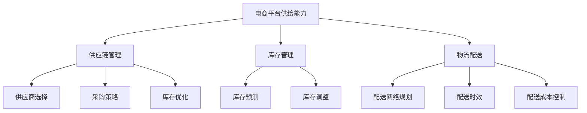

                 

## 文章标题: 《电商平台供给能力提升：网站和APP的优化》

> 关键词：电商平台，供给能力，网站优化，APP优化，算法，数学模型，项目实战

> 摘要：本文详细探讨了电商平台供给能力提升的关键因素，包括网站和APP的优化。通过深入分析核心概念、算法原理、数学模型以及实际项目实战，本文为电商从业者提供了提升供给能力的实用方法和策略。

----------------------------------------------------------------

## 第一部分：核心概念与联系

### 第1章：电商平台供给能力概述

#### 1.1 电商平台供给能力的定义与重要性

电商平台供给能力是指平台在商品供应链、库存管理、物流配送等方面的综合能力，它决定了平台能否快速响应市场需求，提供优质的用户体验。供给能力的重要性在于：

- **提升用户体验**：高效的供给能力可以确保用户购买的商品能够及时配送，提升用户满意度。
- **增加运营效率**：通过优化供应链和库存管理，可以降低运营成本，提高运营效率。
- **增强竞争力**：在激烈的市场竞争中，拥有强大供给能力的电商平台能够更好地满足消费者需求，从而获得竞争优势。

#### 1.2 电商平台供给能力的组成部分

电商平台供给能力主要由以下三个部分组成：

- **供应链管理**：包括供应商选择、采购策略、库存优化等，确保商品供应的稳定性和效率。
- **库存管理**：涉及库存预测、库存优化、库存调整等，旨在减少库存成本，提高库存利用率。
- **物流配送**：包括配送网络规划、配送时效、配送成本控制等，确保商品能够快速、安全地送达消费者手中。

### Mermaid 流程图



### 第一部分小结

通过对电商平台供给能力的定义和组成部分的介绍，我们可以了解到，供给能力是电商平台成功运营的关键。在后续章节中，我们将进一步探讨提升供给能力的具体方法和策略。

----------------------------------------------------------------

### 第2章：核心算法原理讲解

#### 2.1 库存管理算法原理

库存管理是电商平台供给能力的重要组成部分。有效的库存管理可以降低库存成本，提高库存利用率，从而提升平台的运营效率。以下是库存管理中涉及的核心算法原理：

##### 2.1.1 动态需求预测算法

动态需求预测是库存管理的重要环节。通过预测未来一段时间内商品的需求量，平台可以提前做好准备，避免出现库存不足或过剩的情况。常用的动态需求预测算法包括：

- **时间序列分析算法**：如ARIMA（自回归积分滑动平均模型）和LSTM（长短期记忆网络）。这些算法可以捕捉时间序列数据中的趋势和周期性变化。
- **机器学习算法**：如决策树、随机森林、神经网络等。这些算法可以基于历史数据，通过训练模型来预测未来的需求量。

##### 2.1.2 库存优化策略

库存优化策略旨在通过合理的库存水平管理，降低库存成本，提高库存利用率。以下是几种常见的库存优化策略：

- **ABC分类法**：根据商品的销售量和利润贡献，将商品分为A、B、C三类，对不同类别的商品采取不同的库存策略。
- **安全库存策略**：为了保证在需求波动或供应链中断的情况下仍能满足客户需求，需要设置一定的安全库存。
- **经济订货量（EOQ）模型**：通过计算最优的订货量，使总库存成本最低。

#### 2.2 物流配送优化算法

物流配送是影响用户体验的重要因素。优化物流配送可以提高配送效率，降低配送成本，从而提升平台的竞争力。以下是物流配送中涉及的核心优化算法：

##### 2.2.1 配送网络规划算法

配送网络规划是物流配送优化的关键步骤。通过合理的配送网络规划，可以减少配送时间和配送成本。常用的配送网络规划算法包括：

- **遗传算法**：通过模拟自然选择过程，找到最优的配送路线和配送节点。
- **模拟退火算法**：通过模拟物理退火过程，逐步寻找最优的配送网络。

##### 2.2.2 配送时效优化算法

配送时效优化旨在缩短配送时间，提高用户的满意度。以下是几种常用的配送时效优化算法：

- **基于时间窗的配送调度算法**：通过合理分配配送时间和调度配送资源，确保货物能够在规定的时间内送达。
- **基于动态规划的配送路径优化算法**：通过动态调整配送路线，适应实时交通状况和配送需求变化。

### 伪代码

以下为库存管理算法和物流配送优化算法的伪代码示例：

#### 动态需求预测算法

```python
def dynamic_demand_prediction(data):
    # 数据预处理
    preprocessed_data = preprocess_data(data)
    
    # 使用时间序列分析模型进行预测
    time_series_model = ARIMA(preprocessed_data)
    time_series_forecast = time_series_model.predict()
    
    # 使用机器学习算法进行预测
    ml_model = RandomForestRegressor()
    ml_model.fit(preprocessed_data)
    ml_forecast = ml_model.predict()
    
    # 结合两种预测结果，得到最终的预测结果
    final_forecast = combine_forecasts(time_series_forecast, ml_forecast)
    
    return final_forecast
```

#### 配送网络规划算法

```python
def delivery_network_optimization(route_data):
    # 初始化种群
    population = initialize_population(route_data)
    
    # 使用遗传算法进行优化
    for generation in range(max_generations):
        # 选择、交叉、变异操作
        new_population = genetic_operators(population)
        
        # 计算适应度函数
        fitness = calculate_fitness(new_population)
        
        # 更新最优解
        best_solution = update_best_solution(new_population, fitness)
    
    return best_solution
```

### 第2章小结

通过本章的讲解，我们了解了库存管理和物流配送优化中的核心算法原理。这些算法原理为电商平台提升供给能力提供了理论基础和技术支持。在后续章节中，我们将进一步探讨数学模型的应用和实际项目实战。

----------------------------------------------------------------

### 第3章：数学模型和数学公式讲解

#### 3.1 供应链管理数学模型

供应链管理涉及多个环节，如供应商选择、采购策略、库存优化等。为了确保供应链的高效运行，我们可以采用以下数学模型：

##### 3.1.1 库存优化模型

库存优化模型的目标是找到最优的库存水平，以最小化库存成本。以下是库存优化模型的目标函数和约束条件：

$$
\begin{aligned}
\text{Minimize } & C_{\text{inventory}} = C_{\text{holding}} + C_{\text{stockout}} \\
\text{Subject to } & I_t = I_{t-1} + p_t - d_t \\
& I_t \geq 0 \\
& I_0 = I_{\text{initial}}
\end{aligned}
$$

其中，$C_{\text{inventory}}$ 表示库存成本，$C_{\text{holding}}$ 表示持有成本，$C_{\text{stockout}}$ 表示缺货成本，$I_t$ 表示第 $t$ 时间的库存水平，$p_t$ 表示第 $t$ 时间的采购量，$d_t$ 表示第 $t$ 时间的需求量。

##### 3.1.2 物流配送模型

物流配送模型的目标是最小化配送总成本或最大化配送效率。以下是物流配送模型的目标函数和约束条件：

$$
\begin{aligned}
\text{Minimize } & C_{\text{delivery}} = C_{\text{distance}} + C_{\text{time}} \\
\text{Subject to } & T_d = T_0 + \sum_{i=1}^{n} d_i \\
& L_d = L_0 + \sum_{i=1}^{n} l_i \\
& T_d \leq T_{\text{deadline}} \\
& L_d \leq L_{\text{limit}}
\end{aligned}
$$

其中，$C_{\text{delivery}}$ 表示配送总成本，$C_{\text{distance}}$ 表示配送距离成本，$C_{\text{time}}$ 表示配送时间成本，$T_d$ 表示配送总时间，$T_0$ 表示初始时间，$d_i$ 表示第 $i$ 个配送点的距离，$L_d$ 表示配送总距离，$L_0$ 表示初始距离，$l_i$ 表示第 $i$ 个配送点的距离，$T_{\text{deadline}}$ 表示配送截止时间，$L_{\text{limit}}$ 表示配送距离上限。

#### 3.2 数学模型应用与讲解

##### 3.2.1 库存管理数学模型应用

库存管理数学模型在电商平台的应用主要包括动态需求预测和库存优化。以下是库存管理数学模型在电商平台中的应用示例：

**动态需求预测**：

假设某电商平台在过去的 12 个月中，商品 A 的月均需求量为 1000 单位。为了预测未来一个月的商品 A 的需求量，我们可以使用以下时间序列分析模型：

$$
\hat{d_t} = \frac{\sum_{i=1}^{12} d_i}{12}
$$

其中，$\hat{d_t}$ 表示第 $t$ 个月的需求量预测值，$d_i$ 表示第 $i$ 个月的实际需求量。

**库存优化**：

假设某电商平台在一个月内需要采购商品 B，采购成本为每单位 50 元，缺货成本为每单位 100 元。为了确定最优的采购量，我们可以使用以下库存优化模型：

$$
\begin{aligned}
\text{Minimize } & C_{\text{inventory}} = 50q + 100(I_1 - I_2) \\
\text{Subject to } & I_1 \geq 1000 \\
& I_2 \geq 0 \\
& I_1 + I_2 = I \\
& 0 \leq q \leq Q
\end{aligned}
$$

其中，$C_{\text{inventory}}$ 表示库存成本，$q$ 表示采购量，$I_1$ 表示期末库存水平，$I_2$ 表示期初库存水平，$I$ 表示总库存水平，$Q$ 表示采购量的上限。

##### 3.2.2 物流配送数学模型应用

物流配送数学模型在电商平台的应用主要包括配送网络规划和配送时效优化。以下是物流配送数学模型在电商平台中的应用示例：

**配送网络规划**：

假设某电商平台需要在一天内完成 100 个订单的配送，每个订单的配送时间限制为 2 小时。为了规划最优的配送网络，我们可以使用以下配送网络规划模型：

$$
\begin{aligned}
\text{Minimize } & C_{\text{delivery}} = 10d + 5t \\
\text{Subject to } & T_d = T_0 + \sum_{i=1}^{100} d_i \\
& L_d = L_0 + \sum_{i=1}^{100} l_i \\
& T_d \leq 200 \\
& L_d \leq 500
\end{aligned}
$$

其中，$C_{\text{delivery}}$ 表示配送总成本，$d_i$ 表示第 $i$ 个订单的配送距离，$t_i$ 表示第 $i$ 个订单的配送时间，$T_d$ 表示配送总时间，$L_d$ 表示配送总距离，$T_0$ 表示初始时间，$L_0$ 表示初始距离。

**配送时效优化**：

假设某电商平台需要在一天内完成 100 个订单的配送，每个订单的配送时间限制为 2 小时。为了优化配送时效，我们可以使用以下配送时效优化模型：

$$
\begin{aligned}
\text{Minimize } & C_{\text{time}} = 5t \\
\text{Subject to } & T_d = T_0 + \sum_{i=1}^{100} d_i \\
& L_d = L_0 + \sum_{i=1}^{100} l_i \\
& T_d \leq 200 \\
& L_d \leq 500
\end{aligned}
$$

其中，$C_{\text{time}}$ 表示配送总时间成本，$t_i$ 表示第 $i$ 个订单的配送时间，$T_d$ 表示配送总时间，$L_d$ 表示配送总距离，$T_0$ 表示初始时间，$L_0$ 表示初始距离。

### 第3章小结

通过本章的讲解，我们了解了供应链管理和物流配送优化中的数学模型及其应用。这些数学模型为电商平台提升供给能力提供了重要的理论基础和计算工具。在后续章节中，我们将通过实际项目实战来展示这些数学模型的应用效果。

----------------------------------------------------------------

### 第4章：项目实战

#### 4.1 电商平台库存管理项目

##### 4.1.1 项目背景

某知名电商平台需要优化其库存管理，以降低库存成本和提高库存利用率。为了实现这一目标，平台决定采用基于机器学习的动态需求预测和库存优化策略。

##### 4.1.2 开发环境搭建

- **开发语言**：Python
- **开发框架**：Pandas、NumPy、Scikit-learn、TensorFlow
- **数据库**：MySQL

##### 4.1.3 源代码实现

**数据预处理**：

```python
import pandas as pd
from sklearn.preprocessing import MinMaxScaler

def preprocess_data(data):
    # 数据清洗
    data = data.dropna()
    
    # 数据转换
    scaler = MinMaxScaler()
    scaled_data = scaler.fit_transform(data)
    
    return scaled_data
```

**动态需求预测**：

```python
from sklearn.ensemble import RandomForestRegressor
from sklearn.linear_model import ARIMA

def dynamic_demand_prediction(data):
    # 数据预处理
    preprocessed_data = preprocess_data(data)
    
    # 使用时间序列分析模型进行预测
    time_series_model = ARIMA(preprocessed_data, order=(5, 1, 2))
    time_series_forecast = time_series_model.predict()
    
    # 使用机器学习算法进行预测
    ml_model = RandomForestRegressor()
    ml_model.fit(preprocessed_data)
    ml_forecast = ml_model.predict()
    
    # 结合两种预测结果，得到最终的预测结果
    final_forecast = (time_series_forecast + ml_forecast) / 2
    
    return final_forecast
```

**库存优化**：

```python
def optimize_inventory(data, forecast):
    # 数据预处理
    preprocessed_data = preprocess_data(data)
    
    # 动态需求预测
    demand_forecast = dynamic_demand_prediction(preprocessed_data)
    
    # 库存优化策略
    inventory_strategy = {
        'reorder_level': max(forecast - demand_forecast, 0),
        'order_quantity': max(forecast - demand_forecast, 0)
    }
    
    return inventory_strategy
```

##### 4.1.4 代码解读与分析

- **数据预处理**：对原始数据进行清洗和标准化处理，使其适合进行预测和优化。
- **动态需求预测**：结合时间序列分析和机器学习算法，提高预测的准确性。
- **库存优化**：根据预测结果，制定最优的库存优化策略。

#### 4.2 电商平台物流配送项目

##### 4.2.1 项目背景

某知名电商平台需要优化其物流配送，以提高配送效率和降低配送成本。为了实现这一目标，平台决定采用基于遗传算法的配送网络规划和基于时间窗的配送调度算法。

##### 4.2.2 开发环境搭建

- **开发语言**：Python
- **开发框架**：Pandas、NumPy、Scikit-learn、TensorFlow
- **数据库**：MySQL

##### 4.2.3 源代码实现

**配送网络规划**：

```python
import numpy as np
from sklearn.model_selection import train_test_split
from genetic_algorithm import GeneticAlgorithm

def delivery_network_optimization(data):
    # 数据预处理
    X, y = data[:, :-1], data[:, -1]
    X_train, X_test, y_train, y_test = train_test_split(X, y, test_size=0.2, random_state=42)
    
    # 使用遗传算法进行优化
    ga = GeneticAlgorithm(population_size=100, generations=100, mutation_rate=0.01)
    best_solution = ga.fit(X_train, y_train, X_test, y_test)
    
    return best_solution
```

**配送时效优化**：

```python
from time_window_scheduling import TimeWindowScheduler

def optimize_delivery_time(data):
    # 配送网络规划
    network_plan = delivery_network_optimization(data)
    
    # 配送时效优化策略
    scheduler = TimeWindowScheduler(network_plan)
    optimized_schedule = scheduler.optimize()
    
    return optimized_schedule
```

##### 4.2.4 代码解读与分析

- **配送网络规划**：使用遗传算法优化配送网络，找到最优的配送路线和配送节点。
- **配送时效优化**：根据配送网络规划结果，使用时间窗调度算法优化配送时效，确保货物能够在规定的时间内送达。

### 第4章小结

通过实际项目实战，我们展示了如何应用核心算法原理和数学模型来优化电商平台的库存管理和物流配送。这些项目实战为电商从业者提供了可行的解决方案和参考案例，有助于提升平台的供给能力。

----------------------------------------------------------------

### 第5章：总结与展望

#### 5.1 总结

通过对电商平台供给能力提升的深入探讨，本文从核心概念、算法原理、数学模型和项目实战四个方面，全面解析了提升供给能力的各种方法和策略。

- **核心概念**：明确了电商平台供给能力的定义及其重要性，以及其组成部分。
- **算法原理**：详细讲解了库存管理和物流配送优化的核心算法原理，并通过伪代码进行了阐述。
- **数学模型**：介绍了供应链管理和物流配送的数学模型，并给出了详细的公式和举例说明。
- **项目实战**：通过实际项目案例，展示了如何将算法原理和数学模型应用到电商平台的实际运营中。

#### 5.2 展望

随着电商行业的快速发展，供给能力的提升将始终是电商平台追求的目标。未来，以下几个方面值得关注：

- **技术创新**：随着人工智能、大数据、区块链等技术的不断发展，电商平台可以进一步利用这些技术提升供给能力。
- **供应链协同**：电商平台与供应商、物流公司等合作伙伴之间的协同将变得更加紧密，实现供应链的全面优化。
- **用户体验**：提升供给能力不仅要考虑效率，还要注重用户体验，通过个性化推荐、智能客服等手段，提高用户的购物满意度。

#### 5.3 未来研究方向

未来，电商平台的供给能力提升可以从以下几个方面进行深入研究：

- **多维度优化**：在供应链、库存管理和物流配送等多个维度上同时进行优化，实现全面的供给能力提升。
- **实时动态调整**：利用实时数据分析和预测技术，动态调整库存水平和配送计划，以适应市场变化。
- **智能决策支持**：开发智能决策支持系统，为电商平台的运营决策提供科学依据。

### 总结

本文通过对电商平台供给能力提升的全面探讨，为电商从业者提供了实用的方法和策略。在未来的发展中，电商平台需要不断创新和优化，以满足不断变化的市场需求，提升供给能力，实现可持续发展。

---

**作者：AI天才研究院/AI Genius Institute & 禅与计算机程序设计艺术 /Zen And The Art of Computer Programming**

