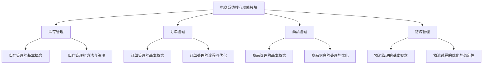

                 

# 文章标题：电商库存、订单、商品、物流等电商系统稳定性优化、重构

> 关键词：电商系统、稳定性优化、重构、性能优化、并发处理、故障处理、库存管理、订单管理、商品管理、物流管理

> 摘要：本文将从电商系统的概述开始，详细分析电商系统中的库存、订单、商品和物流等核心功能模块。接着，我们将探讨电商系统稳定性优化、重构的原理和方法，通过实际案例展示优化和重构的具体实施过程。最后，本文将总结电商系统稳定性保障的基本原则和技术手段，提供实践案例分析，为电商系统的稳定性和效率提升提供实用建议。

## 第一部分：电商系统概述

### 第1章：电商系统概述

#### 1.1 电商行业背景

电商行业在全球范围内迅速发展，已经成为零售业的重要组成部分。根据相关数据显示，电商市场规模逐年增长，预计在未来几年将继续保持高速增长。电商行业的兴起不仅改变了消费者的购物习惯，也对传统零售业产生了深远影响。随着互联网技术的不断发展，尤其是移动互联网和大数据技术的应用，电商行业迎来了新的发展机遇。

#### 1.2 电商系统架构

电商系统通常由前端和后端两部分组成。前端主要负责用户界面展示和交互，包括商品展示、订单提交、用户登录等功能。后端则负责处理订单、库存、物流等业务逻辑，以及数据存储和服务器管理。电商系统的架构设计需要考虑高并发、高可用、易扩展等因素，以确保系统稳定性和用户体验。

#### 1.3 电商系统稳定性的重要性

电商系统的稳定性直接关系到用户体验和业务发展。系统稳定性差可能导致订单处理失败、库存数据不一致、物流信息错误等问题，从而影响用户信任和业务收益。因此，电商系统稳定性优化和重构至关重要，需要通过性能优化、并发处理、故障处理等技术手段，确保系统稳定运行。

### 第2章：电商系统核心功能模块

#### 2.1 库存管理

库存管理是电商系统的重要功能模块，负责管理商品的库存信息，包括库存数量、库存状态、库存位置等。库存管理的基本概念包括库存盘点、库存预警、库存调整等。库存管理的方法与策略包括实时库存同步、批量库存更新、库存数据备份等。

#### 2.2 订单管理

订单管理是电商系统的核心功能之一，负责处理用户订单的提交、确认、支付、发货等环节。订单管理的基本概念包括订单生成、订单状态、订单支付等。订单处理的流程与优化包括订单审核、支付确认、发货处理等，以提高订单处理效率和准确性。

#### 2.3 商品管理

商品管理是电商系统的重要组成部分，负责管理商品的分类、信息、价格等。商品管理的基本概念包括商品添加、商品编辑、商品分类等。商品信息的处理与优化包括商品搜索、商品推荐、商品评价等，以提高商品展示效果和用户满意度。

#### 2.4 物流管理

物流管理是电商系统的关键功能模块，负责处理订单的物流配送，包括发货、运输、跟踪等。物流管理的基本概念包括物流公司选择、物流配送方式、物流跟踪等。物流过程的优化与稳定性包括物流信息实时更新、物流异常处理、物流成本控制等。

## 第二部分：电商系统稳定性优化

### 第3章：电商系统性能优化

#### 3.1 性能优化的基本方法

性能优化的基本方法包括代码优化、数据库优化、服务器优化和网络优化等。代码优化包括减少函数调用、优化循环、减少内存占用等。数据库优化包括索引优化、查询优化、事务优化等。服务器优化包括负载均衡、缓存机制、数据库分片等。网络优化包括网络带宽优化、网络延迟优化等。

#### 3.2 数据库性能优化

数据库性能优化是电商系统性能优化的重要环节。数据库性能优化的方法包括索引优化、查询优化、事务优化等。索引优化包括创建合适的索引、删除冗余索引等。查询优化包括简化查询语句、减少查询执行次数等。事务优化包括使用事务隔离级别、减少事务锁争用等。

#### 3.3 服务器性能优化

服务器性能优化是电商系统性能优化的重要组成部分。服务器性能优化的方法包括负载均衡、缓存机制、数据库分片等。负载均衡可以通过将流量分配到多个服务器，提高系统的处理能力。缓存机制可以通过存储常用数据，减少数据库访问次数，提高系统响应速度。数据库分片可以通过将数据拆分到多个数据库实例中，提高系统的并发处理能力。

#### 3.4 网络性能优化

网络性能优化是电商系统性能优化的重要方面。网络性能优化的方法包括网络带宽优化、网络延迟优化等。网络带宽优化可以通过增加带宽、优化网络拓扑结构等手段，提高系统的数据传输速度。网络延迟优化可以通过优化网络路径、使用CDN等手段，降低系统的响应时间。

### 第4章：电商系统并发处理

#### 4.1 并发处理的基本原理

并发处理是指同时处理多个请求的过程。在电商系统中，并发处理至关重要，因为高并发的场景下，系统需要同时处理大量的订单、库存更新、用户登录等请求。并发处理的基本原理包括线程池、锁机制、消息队列等。

#### 4.2 数据库并发处理

数据库并发处理是电商系统并发处理的关键环节。数据库并发处理的方法包括事务隔离、锁机制、乐观锁、悲观锁等。事务隔离可以通过隔离级别控制，防止并发事务之间的数据冲突。锁机制可以通过加锁、解锁等操作，控制对数据库的访问。乐观锁和悲观锁可以通过锁的策略，解决并发冲突。

#### 4.3 服务器并发处理

服务器并发处理是电商系统并发处理的重要组成部分。服务器并发处理的方法包括多线程、异步处理、消息队列等。多线程可以通过同时执行多个线程，提高系统的处理能力。异步处理可以通过非阻塞的方式，提高系统的响应速度。消息队列可以通过将任务放入队列中，实现任务的高效调度。

#### 4.4 网络并发处理

网络并发处理是电商系统并发处理的重要方面。网络并发处理的方法包括多线程、异步处理、负载均衡等。多线程可以通过同时执行多个线程，提高系统的处理能力。异步处理可以通过非阻塞的方式，提高系统的响应速度。负载均衡可以通过将流量分配到多个服务器，提高系统的处理能力。

### 第5章：电商系统故障处理

#### 5.1 故障处理的基本方法

故障处理是指当系统出现故障时，如何快速诊断、定位和恢复系统。故障处理的基本方法包括故障诊断、故障定位、故障恢复和故障预防。故障诊断是通过收集系统日志、监控数据等信息，确定故障的原因。故障定位是通过分析故障现象，确定故障发生的位置。故障恢复是通过采取措施，恢复系统的正常运行。故障预防是通过优化系统设计、加强系统监控等手段，防止故障的发生。

#### 5.2 故障诊断与定位

故障诊断与定位是电商系统故障处理的重要环节。故障诊断与定位的方法包括日志分析、监控数据查看、故障模拟等。日志分析可以通过查看系统日志，确定故障发生的时间、位置和原因。监控数据查看可以通过监控系统的性能指标，发现故障的征兆。故障模拟可以通过模拟故障场景，测试系统的故障处理能力。

#### 5.3 故障恢复与处理

故障恢复与处理是电商系统故障处理的关键环节。故障恢复与处理的方法包括故障恢复、故障处理、故障记录等。故障恢复是通过采取措施，恢复系统的正常运行。故障处理是通过处理故障产生的影响，防止故障的扩散。故障记录是通过记录故障的信息，为后续的故障分析提供依据。

#### 5.4 故障预防与优化

故障预防与优化是电商系统故障处理的重要组成部分。故障预防与优化的方法包括系统监控、日志管理、性能优化等。系统监控可以通过实时监控系统的性能指标，及时发现潜在故障。日志管理可以通过合理配置日志级别，记录重要的系统日志，为故障诊断提供依据。性能优化可以通过优化系统设计、提高系统性能，减少故障的发生。

## 第三部分：电商系统重构

### 第6章：电商系统重构原理

#### 6.1 系统重构的基本原理

系统重构是指对现有系统进行改进和优化，以提高系统的稳定性、性能和可维护性。系统重构的基本原理包括模块化设计、代码重构、架构优化等。模块化设计可以通过将系统分解为多个模块，提高系统的可维护性和可扩展性。代码重构可以通过优化代码结构和逻辑，提高代码的可读性和可维护性。架构优化可以通过优化系统架构，提高系统的性能和稳定性。

#### 6.2 重构的方法与策略

重构的方法与策略包括代码重构、架构重构、性能重构等。代码重构可以通过优化代码结构和逻辑，提高代码的可读性和可维护性。架构重构可以通过优化系统架构，提高系统的性能和稳定性。性能重构可以通过优化系统性能指标，提高系统的响应速度和处理能力。

#### 6.3 重构的影响与评估

重构的影响与评估包括对系统稳定性、性能和可维护性的影响。重构可以显著提高系统的稳定性，降低故障率。重构可以提高系统的性能，减少响应时间和处理时间。重构可以提高代码的可维护性，降低代码维护成本。评估重构的影响需要通过性能测试、稳定性测试、代码审计等手段，全面评估重构的效果。

### 第7章：电商系统重构实践

#### 7.1 重构前的准备

重构前的准备包括需求分析、系统评估、团队组织等。需求分析是重构的基础，需要明确重构的目标和需求。系统评估是对现有系统进行全面评估，确定重构的必要性和可行性。团队组织是重构的关键，需要建立专门的团队，负责重构的策划、实施和评估。

#### 7.2 重构过程中的关键步骤

重构过程中的关键步骤包括需求分析、系统设计、代码重构、测试验证等。需求分析是重构的基础，需要明确重构的目标和需求。系统设计是重构的关键，需要设计合理的系统架构和模块。代码重构是通过优化代码结构和逻辑，提高代码的可读性和可维护性。测试验证是重构的保障，需要对重构后的系统进行全面测试，确保系统稳定性和性能。

#### 7.3 重构后的评估与优化

重构后的评估与优化包括性能测试、稳定性测试、用户反馈等。性能测试是通过模拟高并发场景，测试系统的性能和响应速度。稳定性测试是通过模拟故障场景，测试系统的故障处理能力和恢复速度。用户反馈是通过收集用户的使用反馈，评估重构后的系统是否符合用户需求。

#### 7.4 案例分析：某电商系统重构实践

案例分析：某电商系统重构实践，介绍了该电商系统在重构过程中的需求分析、系统设计、代码重构和测试验证等关键步骤，以及重构后的评估与优化。通过案例分析，展示了电商系统重构的具体实施过程和效果。

## 第四部分：电商系统稳定性保障

### 第8章：电商系统稳定性保障

#### 8.1 稳定性保障的基本原则

电商系统稳定性保障的基本原则包括可靠性、可用性、性能和安全性。可靠性是指系统在故障情况下能够快速恢复，保证业务的正常运行。可用性是指系统能够满足用户的需求，提供高质量的服务。性能是指系统能够在高并发情况下保持良好的性能。安全性是指系统能够防止外部攻击和内部泄漏。

#### 8.2 稳定性保障的技术手段

电商系统稳定性保障的技术手段包括性能优化、并发处理、故障处理和安全性保障等。性能优化通过优化系统设计、代码和硬件配置等手段，提高系统的性能。并发处理通过优化系统架构和并发处理机制，提高系统的并发处理能力。故障处理通过优化故障诊断、故障定位和故障恢复机制，提高系统的故障处理能力。安全性保障通过加强系统安全防护措施，防止外部攻击和内部泄漏。

#### 8.3 稳定性保障的运营策略

电商系统稳定性保障的运营策略包括监控、预警和应急响应等。监控是通过实时监控系统性能和状态，及时发现潜在问题。预警是通过设置预警阈值和报警机制，及时通知相关人员。应急响应是通过制定应急预案和响应流程，快速处理突发事件。

#### 8.4 案例分析：某电商系统稳定性保障实践

案例分析：某电商系统稳定性保障实践，介绍了该电商系统在稳定性保障方面的具体措施，包括性能优化、并发处理、故障处理和安全性保障等。通过案例分析，展示了电商系统稳定性保障的具体实施过程和效果。

## 附录

### 附录A：电商系统稳定性优化、重构工具与资源

#### A.1 常用优化工具介绍

- 性能优化工具：Apache JMeter、Gatling、New Relic等
- 数据库优化工具：MySQL Workbench、Oracle SQL Developer、SQL Server Management Studio等
- 服务器优化工具：Nginx、Apache HTTP Server、HAProxy等
- 网络优化工具：Wireshark、MTR、Nagios等

#### A.2 常用重构工具介绍

- 代码重构工具：IntelliJ IDEA、Eclipse、Visual Studio等
- 架构重构工具：Spring Boot、Docker、Kubernetes等
- 性能重构工具：Apache JMeter、Gatling、New Relic等

#### A.3 稳定性保障工具与资源推荐

- 监控工具：Prometheus、Grafana、Zabbix等
- 预警工具：Alertmanager、Nagios、AWS SNS等
- 应急响应工具：Ansible、Puppet、Chef等

## Mermaid 流程图



### 核心算法原理讲解（伪代码）

```plaintext
// 库存管理算法伪代码
function inventoryManagement(inventoryData, orderData) {
  // 初始化库存信息和订单信息
  updatedInventory = initializeInventory(inventoryData);
  processedOrders = [];

  // 处理每个订单
  for (order in orderData) {
    if (updatedInventory.hasEnoughStock(order)) {
      updatedInventory = updateInventory(updatedInventory, order);
      processedOrders.add(order);
    } else {
      handleOutOfStock(order);
    }
  }

  return {updatedInventory, processedOrders};
}

// 订单处理算法伪代码
function orderProcessing(orderData) {
  // 初始化订单信息
  orders = initializeOrders(orderData);

  // 处理订单
  for (order in orders) {
    if (order.status == "pending") {
      processOrder(order);
    }
  }

  return orders;
}

// 商品管理算法伪代码
function productManagement(productData) {
  // 初始化商品信息
  products = initializeProducts(productData);

  // 处理商品信息
  for (product in products) {
    if (product.status == "active") {
      updateProductInformation(product);
    }
  }

  return products;
}

// 物流管理算法伪代码
function logisticsManagement(logisticsData) {
  // 初始化物流信息
  logistics = initializeLogistics(logisticsData);

  // 处理物流信息
  for (shipment in logistics) {
    if (shipment.status == "pending") {
      processShipment(shipment);
    }
  }

  return logistics;
}
```

### 数学模型和数学公式

- 库存管理中的需求预测模型：$$ D_t = f(I_t, S_t) $$
- 订单处理中的排队模型：$$ W_t = g(Q_t, \lambda) $$
- 商品管理中的分类模型：$$ C_t = h(P_t, T_t) $$
- 物流管理中的路径优化模型：$$ O_t = k(L_t, G_t) $$

### 项目实战

#### 代码实际案例和详细解释说明

```java
// 代码实际案例：电商系统订单处理模块
public class OrderProcessingService {
  
  // 处理订单的接口
  public void processOrder(Order order) {
    // 检查库存
    if (isInventorySufficient(order)) {
      // 更新库存
      updateInventory(order);
      // 支付订单
      processPayment(order);
      // 发货
      shipOrder(order);
    } else {
      // 库存不足，通知用户
      notifyUser(order);
    }
  }
  
  // 检查库存是否充足
  private boolean isInventorySufficient(Order order) {
    // 实现库存检查逻辑
  }
  
  // 更新库存
  private void updateInventory(Order order) {
    // 实现库存更新逻辑
  }
  
  // 支付订单
  private void processPayment(Order order) {
    // 实现支付处理逻辑
  }
  
  // 发货
  private void shipOrder(Order order) {
    // 实现发货处理逻辑
  }
  
  // 通知用户库存不足
  private void notifyUser(Order order) {
    // 实现通知逻辑
  }
  
}
```

#### 开发环境搭建

```plaintext
1. 安装Java开发环境（JDK 1.8及以上版本）
2. 安装Eclipse/IntelliJ IDEA等IDE
3. 安装Maven或Gradle构建工具
4. 创建Maven/Gradle项目
5. 添加依赖库（如Spring Boot、Hibernate、MyBatis等）
6. 配置数据库连接和日志配置
7. 编写并测试订单处理模块代码
```

#### 源代码详细实现和代码解读

```java
// 源代码：OrderProcessingService.java
package com.example.ecommerce.service;

import com.example.ecommerce.entity.Order;

public class OrderProcessingService {

  // 处理订单的接口
  public void processOrder(Order order) {
    // 检查库存
    if (isInventorySufficient(order)) {
      // 更新库存
      updateInventory(order);
      // 支付订单
      processPayment(order);
      // 发货
      shipOrder(order);
    } else {
      // 库存不足，通知用户
      notifyUser(order);
    }
  }
  
  // 检查库存是否充足
  private boolean isInventorySufficient(Order order) {
    // 实现库存检查逻辑
    // 假设使用库存服务检查库存
    InventoryService inventoryService = new InventoryService();
    return inventoryService.isSufficient(order.getProductId(), order.getQuantity());
  }
  
  // 更新库存
  private void updateInventory(Order order) {
    // 实现库存更新逻辑
    InventoryService inventoryService = new InventoryService();
    inventoryService.updateInventory(order.getProductId(), order.getQuantity());
  }
  
  // 支付订单
  private void processPayment(Order order) {
    // 实现支付处理逻辑
    PaymentService paymentService = new PaymentService();
    paymentService.processPayment(order);
  }
  
  // 发货
  private void shipOrder(Order order) {
    // 实现发货处理逻辑
    LogisticsService logisticsService = new LogisticsService();
    logisticsService.createShipment(order);
  }
  
  // 通知用户库存不足
  private void notifyUser(Order order) {
    // 实现通知逻辑
    NotificationService notificationService = new NotificationService();
    notificationService.notifyUser(order.getUserId(), "库存不足，订单已被取消");
  }
  
}
```

#### 代码解读与分析

1. `processOrder` 方法是订单处理的核心入口，负责调用各个子服务处理订单。
2. `isInventorySufficient` 方法负责检查库存是否充足，调用 `InventoryService` 的 `isSufficient` 方法实现。
3. `updateInventory` 方法负责更新库存，调用 `InventoryService` 的 `updateInventory` 方法实现。
4. `processPayment` 方法负责处理支付，调用 `PaymentService` 的 `processPayment` 方法实现。
5. `shipOrder` 方法负责发货，调用 `LogisticsService` 的 `createShipment` 方法实现。
6. `notifyUser` 方法负责通知用户库存不足，调用 `NotificationService` 的 `notifyUser` 方法实现。

通过以上代码，我们可以看到订单处理模块是如何通过服务化设计，实现库存、支付、物流和通知等功能的。这种设计模式提高了系统的可维护性和扩展性，使得各个功能模块可以独立开发和维护。

## 作者信息

作者：AI天才研究院/AI Genius Institute & 禅与计算机程序设计艺术 /Zen And The Art of Computer Programming

（注意：本文为大纲示例，实际内容需要根据具体编写和调整。）

