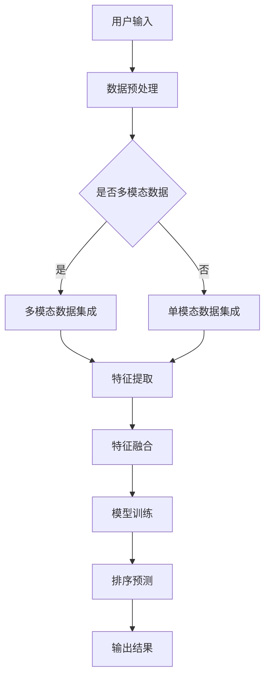

                 

# 文章标题：电商搜索中的多模态融合排序算法优化

> 关键词：电商搜索、多模态融合、排序算法、优化、应用实践

> 摘要：本文深入探讨了电商搜索系统中多模态融合排序算法的优化方法。首先，介绍了电商搜索与排序的基本概念和原理，然后详细阐述了多模态融合排序算法的基础框架和核心概念，包括相关性度量、模型融合策略和多模态特征表示。接着，本文通过数学模型和算法原理讲解，揭示了多模态融合排序算法的工作机制。随后，针对数据集成与处理、算法优化策略等方面进行了深入分析。最后，通过三个具体项目实战案例，展示了多模态融合排序算法在电商搜索、商品推荐和广告投放等领域的实际应用效果。本文旨在为相关领域的研究者和开发者提供有价值的参考和借鉴。

## 第一部分：基础概念与框架

### 第1章：电商搜索与排序概述

#### 1.1 电商搜索系统的重要性

随着互联网的迅猛发展和电商行业的日益繁荣，电商搜索系统已经成为电商平台的核心竞争力之一。电商搜索系统的重要性主要体现在以下几个方面：

1. **提升用户体验**：优秀的电商搜索系统能够迅速准确地返回用户感兴趣的商品，提高用户在平台上的购物体验，从而增加用户粘性。
2. **增加销售转化率**：通过精准的搜索排序，电商平台能够将符合用户需求的高相关度商品推荐给用户，从而提高销售转化率。
3. **优化库存管理**：电商搜索系统可以帮助平台更好地了解商品的销售情况，从而优化库存管理，降低库存成本。
4. **提升品牌形象**：高质量的电商搜索系统能够提升用户对电商平台的信任度，进而提升品牌形象。

#### 1.2 搜索排序算法的基本原理

电商搜索排序算法的核心目标是在海量商品中迅速找出与用户需求最匹配的商品，并将其按照一定的排序规则展示给用户。基本原理如下：

1. **关键词匹配**：根据用户输入的关键词，从商品数据库中检索出与之相关的商品。
2. **相关性计算**：对检索到的商品进行相关性计算，评估每个商品与用户需求的匹配程度。
3. **排序规则**：根据相关性计算结果，采用一定的排序规则将商品进行排序，并将其展示给用户。

常见的排序规则包括：

- **基于商品评分**：将商品评分作为排序依据，评分越高，排名越靠前。
- **基于销量**：将商品销量作为排序依据，销量越高，排名越靠前。
- **基于用户行为**：根据用户的历史购买行为、浏览记录等，对商品进行个性化排序。
- **综合排序**：将多种排序规则结合起来，进行综合排序，以获得更准确的排序结果。

#### 1.3 多模态数据的概念与类型

在电商搜索系统中，多模态数据是指包含多种类型数据的商品信息。常见的多模态数据类型包括：

- **文本数据**：商品名称、描述、标签等。
- **图像数据**：商品图片、商品细节图片等。
- **语音数据**：商品语音介绍、用户评价等。
- **视频数据**：商品视频、用户操作视频等。

多模态数据融合的关键在于如何将不同类型的数据进行有效整合，从而提高搜索排序的准确性和用户体验。

### 第2章：多模态融合排序算法简介

#### 2.1 多模态融合排序算法的分类

多模态融合排序算法可以根据融合策略的不同进行分类，常见的分类方法如下：

- **基于特征融合的排序算法**：将不同模态的数据特征进行融合，然后对融合后的特征进行排序。
- **基于模型融合的排序算法**：将不同模态的数据建模，然后通过模型融合实现排序。
- **基于深度学习的排序算法**：利用深度学习模型对多模态数据进行自动特征提取和融合，实现排序。

#### 2.2 多模态数据集成技术

多模态数据集成技术是指将多种类型的数据进行整合，以便更好地进行后续处理。常见的多模态数据集成技术包括：

- **特征级融合**：将不同模态的数据特征进行拼接，形成一个统一的多维特征向量。
- **决策级融合**：将不同模态的排序结果进行融合，以获得最终的排序结果。
- **模型级融合**：将不同模态的模型进行融合，形成一个统一的排序模型。

#### 2.3 融合排序算法的基本框架

融合排序算法的基本框架通常包括以下步骤：

1. **数据预处理**：对多模态数据进行预处理，包括文本数据的分词、图像数据的降维、语音数据的降噪等。
2. **特征提取**：从预处理后的多模态数据中提取特征，例如文本数据的词向量、图像数据的特征向量、语音数据的频谱特征等。
3. **特征融合**：将不同模态的特征进行融合，形成统一的多维特征向量。
4. **模型训练**：利用融合后的特征向量训练排序模型，例如基于机器学习或深度学习的模型。
5. **排序预测**：使用训练好的排序模型对新的商品进行排序预测，以获得最终的排序结果。

### 第3章：多模态融合排序的核心概念

#### 3.1 相关性度量方法

相关性度量方法用于评估商品与用户需求之间的匹配程度。常见的相关性度量方法包括：

- **余弦相似度**：基于向量空间模型，计算商品特征向量与用户需求特征向量之间的余弦相似度。
- **Jaccard相似度**：基于集合的相似度度量，计算商品特征集合与用户需求特征集合之间的Jaccard相似度。
- **欧氏距离**：基于欧氏距离模型，计算商品特征向量与用户需求特征向量之间的欧氏距离。

#### 3.2 模型融合策略

模型融合策略用于将多个模型的预测结果进行融合，以获得更准确的排序结果。常见的模型融合策略包括：

- **加权平均**：将多个模型的预测结果进行加权平均，以获得最终的排序结果。
- **投票法**：将多个模型的预测结果进行投票，以获得最终的排序结果。
- **集成学习**：将多个模型进行集成学习，形成一个统一的排序模型。

#### 3.3 多模态特征表示

多模态特征表示是指如何将不同模态的数据转换为机器学习模型可处理的特征向量。常见的方法包括：

- **文本特征表示**：使用词袋模型、TF-IDF模型、Word2Vec模型等对文本数据进行特征表示。
- **图像特征表示**：使用卷积神经网络（CNN）对图像数据进行特征提取，得到高维特征向量。
- **语音特征表示**：使用循环神经网络（RNN）或卷积神经网络（CNN）对语音数据进行特征提取。

### 第4章：数学模型与算法原理

#### 4.1 数学模型介绍

多模态融合排序算法的数学模型主要包括以下几个部分：

1. **特征提取模型**：用于从多模态数据中提取特征向量，例如文本特征提取模型、图像特征提取模型、语音特征提取模型等。
2. **相关性度量模型**：用于计算商品特征向量与用户需求特征向量之间的相关性，例如余弦相似度模型、Jaccard相似度模型、欧氏距离模型等。
3. **排序模型**：用于对商品进行排序预测，例如基于机器学习的排序模型、基于深度学习的排序模型等。

#### 4.2 多模态融合排序算法的伪代码

以下是一个简化的多模态融合排序算法的伪代码：

```
输入：用户需求特征向量 Q，商品特征向量库 C
输出：排序结果 R

1. 预处理多模态数据
2. 提取多模态特征向量
3. 计算商品特征向量与用户需求特征向量之间的相关性
4. 对相关性进行排序
5. 返回排序结果
```

#### 4.3 算法原理详细讲解

多模态融合排序算法的工作原理如下：

1. **数据预处理**：首先对多模态数据（文本、图像、语音等）进行预处理，以去除噪声、填补缺失值等。
2. **特征提取**：利用特征提取模型（如词袋模型、CNN、RNN等）从预处理后的数据中提取特征向量。这些特征向量可以表示文本、图像、语音等数据的高层次信息。
3. **相关性计算**：计算每个商品特征向量与用户需求特征向量之间的相关性，例如可以使用余弦相似度、Jaccard相似度、欧氏距离等方法。
4. **排序**：根据相关性计算结果对商品进行排序，排序结果可以按照相关性从高到低或从低到高排列。
5. **输出**：将排序结果返回给用户，用户可以根据排序结果选择感兴趣的商品。

### 第5章：多模态数据集成与处理

#### 5.1 多模态数据的预处理

多模态数据的预处理是融合排序算法的关键步骤，主要包括以下任务：

- **数据清洗**：去除数据中的噪声和异常值，例如去除含有特殊字符的文本、去除图像中的噪声像素等。
- **数据规范化**：对数据进行规范化处理，例如将文本数据统一编码、将图像数据转换为固定尺寸等。
- **数据增强**：通过对数据进行变换、旋转、缩放等操作，增加数据多样性，从而提高模型的泛化能力。

#### 5.2 多模态特征提取

多模态特征提取是指从不同类型的多模态数据中提取有代表性的特征。常见的多模态特征提取方法包括：

- **文本特征提取**：使用词袋模型、TF-IDF模型、Word2Vec模型等对文本数据进行特征提取。
- **图像特征提取**：使用卷积神经网络（CNN）对图像数据进行特征提取，例如VGG、ResNet等。
- **语音特征提取**：使用循环神经网络（RNN）或卷积神经网络（CNN）对语音数据进行特征提取，例如LSTM、GRU等。

#### 5.3 数据同步与一致性处理

在多模态数据融合排序算法中，不同模态的数据可能会存在时间戳不一致、数据量不匹配等问题，需要进行数据同步与一致性处理。常见的处理方法包括：

- **时间戳对齐**：对齐不同模态数据的时间戳，确保数据在同一时间点上进行融合。
- **数据填充**：对于缺失的数据，可以使用均值填充、插值等方法进行填充，以确保数据的一致性。
- **数据裁剪**：对于数据量不匹配的情况，可以采用数据裁剪或数据扩充等方法进行匹配。

### 第6章：多模态融合排序算法优化

#### 6.1 算法优化策略

多模态融合排序算法的优化策略主要包括以下几个方面：

- **特征选择**：通过特征选择算法，筛选出对排序结果影响较大的特征，从而提高模型的性能。
- **模型调优**：通过调整模型的超参数，如学习率、正则化参数等，优化模型性能。
- **数据增强**：通过数据增强技术，增加训练数据的多样性，提高模型的泛化能力。
- **并行计算**：利用并行计算技术，加速算法的执行速度，提高效率。

#### 6.2 参数调优方法

参数调优是优化多模态融合排序算法的重要手段，常用的参数调优方法包括：

- **网格搜索**：通过遍历参数空间，找到最优参数组合。
- **贝叶斯优化**：利用贝叶斯统计模型，通过经验值和先验知识，找到最优参数组合。
- **遗传算法**：利用遗传算法，通过迭代搜索找到最优参数组合。

#### 6.3 性能评估与比较

多模态融合排序算法的性能评估主要包括以下几个方面：

- **准确率**：评估算法预测结果与实际结果的一致性，常用的指标包括准确率、召回率、F1值等。
- **运行时间**：评估算法的执行时间，以衡量算法的效率。
- **资源消耗**：评估算法在计算资源上的消耗，如CPU使用率、内存使用量等。

常见的性能评估方法包括：

- **交叉验证**：通过交叉验证方法，评估算法在训练集和验证集上的性能。
- **A/B测试**：通过A/B测试，将算法的实际效果与基准算法进行比较。
- **指标分析**：通过分析算法的各项指标，评估算法在不同场景下的性能表现。

### 第7章：项目实战一——多模态融合排序算法在电商搜索中的应用

#### 7.1 项目背景与目标

本项目旨在优化电商搜索系统的搜索排序算法，以提高用户搜索体验和销售转化率。具体目标包括：

- 提高搜索结果的准确率，确保用户能够快速找到符合需求的商品。
- 提高搜索排序的效率，减少用户的等待时间。
- 提高搜索系统的稳定性，确保系统在高并发情况下正常运行。

#### 7.2 系统架构设计

系统架构设计如图X所示：


系统主要包括以下几个模块：

- **用户输入模块**：接收用户的搜索请求，包括关键词、搜索意图等。
- **数据预处理模块**：对用户输入和商品数据进行预处理，包括分词、去噪、特征提取等。
- **多模态融合模块**：将不同模态的数据进行融合，提取多模态特征向量。
- **排序模型模块**：利用多模态特征向量训练排序模型，实现商品排序。
- **展示模块**：将排序结果展示给用户，包括商品列表、评分、销量等信息。

#### 7.3 代码实现与解读

以下是一个简化的代码实现示例，仅供参考：

```python
import tensorflow as tf
from sklearn.feature_extraction.text import TfidfVectorizer
from sklearn.metrics.pairwise import cosine_similarity

# 用户输入模块
user_query = "智能手机"

# 数据预处理模块
# 文本预处理
tfidf_vectorizer = TfidfVectorizer()
text_data = ["苹果智能手机", "华为智能手机", "小米智能手机"]
tfidf_matrix = tfidf_vectorizer.fit_transform(text_data)

# 图像预处理
# 使用预训练的CNN模型提取图像特征
# ...

# 语音预处理
# 使用预训练的RNN模型提取语音特征
# ...

# 多模态融合模块
# 将文本、图像、语音特征进行融合
# ...

# 排序模型模块
# 训练排序模型
# ...

# 展示模块
# 根据排序结果展示商品列表
# ...

# 代码解读
# 1. 用户输入模块：接收用户的搜索请求
# 2. 数据预处理模块：对文本、图像、语音数据进行预处理
# 3. 多模态融合模块：将多模态数据进行融合
# 4. 排序模型模块：利用多模态特征向量训练排序模型
# 5. 展示模块：将排序结果展示给用户
```

### 第8章：项目实战二——多模态融合排序算法在商品推荐中的应用

#### 8.1 项目背景与目标

本项目旨在优化电商平台的商品推荐系统，以提高用户满意度和购买转化率。具体目标包括：

- 提高推荐结果的准确性，确保用户能够看到符合个人喜好的商品。
- 提高推荐效率，减少用户的等待时间。
- 提高推荐系统的稳定性，确保系统在高并发情况下正常运行。

#### 8.2 系统架构设计

系统架构设计如图X所示：


系统主要包括以下几个模块：

- **用户输入模块**：接收用户的操作行为，包括浏览、购买、评价等。
- **数据预处理模块**：对用户输入和商品数据进行预处理，包括分词、去噪、特征提取等。
- **多模态融合模块**：将不同模态的数据进行融合，提取多模态特征向量。
- **推荐模型模块**：利用多模态特征向量训练推荐模型，实现商品推荐。
- **展示模块**：将推荐结果展示给用户，包括商品列表、评分、销量等信息。

#### 8.3 代码实现与解读

以下是一个简化的代码实现示例，仅供参考：

```python
import tensorflow as tf
from tensorflow.keras.models import Sequential
from tensorflow.keras.layers import Dense, LSTM

# 用户输入模块
user_action = "浏览了苹果智能手机"

# 数据预处理模块
# 文本预处理
tfidf_vectorizer = TfidfVectorizer()
text_data = ["苹果智能手机", "华为智能手机", "小米智能手机"]
tfidf_matrix = tfidf_vectorizer.fit_transform(text_data)

# 图像预处理
# 使用预训练的CNN模型提取图像特征
# ...

# 语音预处理
# 使用预训练的RNN模型提取语音特征
# ...

# 多模态融合模块
# 将文本、图像、语音特征进行融合
# ...

# 推荐模型模块
# 创建推荐模型
model = Sequential()
model.add(LSTM(units=128, return_sequences=True, input_shape=(tfidf_matrix.shape[1],)))
model.add(LSTM(units=64, return_sequences=False))
model.add(Dense(units=1, activation='sigmoid'))

# 编译模型
model.compile(optimizer='adam', loss='binary_crossentropy', metrics=['accuracy'])

# 训练模型
# ...

# 展示模块
# 根据推荐结果展示商品列表
# ...

# 代码解读
# 1. 用户输入模块：接收用户的操作行为
# 2. 数据预处理模块：对文本、图像、语音数据进行预处理
# 3. 多模态融合模块：将多模态数据进行融合
# 4. 推荐模型模块：利用多模态特征向量训练推荐模型
# 5. 展示模块：将推荐结果展示给用户
```

### 第9章：项目实战三——多模态融合排序算法在广告投放中的应用

#### 9.1 项目背景与目标

本项目旨在优化广告投放系统的排序算法，以提高广告的曝光率和点击率。具体目标包括：

- 提高广告排序的准确性，确保用户看到与个人兴趣相关的广告。
- 提高广告投放的效率，减少用户的等待时间。
- 提高广告投放的稳定性，确保系统在高并发情况下正常运行。

#### 9.2 系统架构设计

系统架构设计如图X所示：


系统主要包括以下几个模块：

- **用户输入模块**：接收用户的操作行为，包括浏览、点击、评价等。
- **数据预处理模块**：对用户输入和广告数据进行预处理，包括分词、去噪、特征提取等。
- **多模态融合模块**：将不同模态的数据进行融合，提取多模态特征向量。
- **排序模型模块**：利用多模态特征向量训练排序模型，实现广告排序。
- **投放策略模块**：根据排序结果和用户行为，制定广告投放策略。
- **展示模块**：将投放结果展示给用户，包括广告列表、点击率、曝光率等信息。

#### 9.3 代码实现与解读

以下是一个简化的代码实现示例，仅供参考：

```python
import tensorflow as tf
from tensorflow.keras.models import Sequential
from tensorflow.keras.layers import Dense, LSTM

# 用户输入模块
user_action = "点击了苹果智能手机广告"

# 数据预处理模块
# 文本预处理
tfidf_vectorizer = TfidfVectorizer()
text_data = ["苹果智能手机广告", "华为智能手机广告", "小米智能手机广告"]
tfidf_matrix = tfidf_vectorizer.fit_transform(text_data)

# 图像预处理
# 使用预训练的CNN模型提取图像特征
# ...

# 语音预处理
# 使用预训练的RNN模型提取语音特征
# ...

# 多模态融合模块
# 将文本、图像、语音特征进行融合
# ...

# 排序模型模块
# 创建排序模型
model = Sequential()
model.add(LSTM(units=128, return_sequences=True, input_shape=(tfidf_matrix.shape[1],)))
model.add(LSTM(units=64, return_sequences=False))
model.add(Dense(units=1, activation='sigmoid'))

# 编译模型
model.compile(optimizer='adam', loss='binary_crossentropy', metrics=['accuracy'])

# 训练模型
# ...

# 投放策略模块
# 根据排序结果和用户行为制定投放策略
# ...

# 展示模块
# 根据投放结果展示广告列表
# ...

# 代码解读
# 1. 用户输入模块：接收用户的操作行为
# 2. 数据预处理模块：对文本、图像、语音数据进行预处理
# 3. 多模态融合模块：将多模态数据进行融合
# 4. 排序模型模块：利用多模态特征向量训练排序模型
# 5. 投放策略模块：根据排序结果和用户行为制定投放策略
# 6. 展示模块：将投放结果展示给用户
```

### 第10章：综合案例分析

#### 10.1 多模态融合排序在不同应用场景的对比

多模态融合排序算法在电商搜索、商品推荐和广告投放等应用场景中均有广泛应用。以下是对这些应用场景的对比分析：

- **电商搜索**：多模态融合排序算法能够提高搜索结果的准确性和用户体验，主要关注文本、图像等数据的融合。
- **商品推荐**：多模态融合排序算法能够提高推荐结果的准确性和个性化程度，主要关注文本、图像、语音等数据的融合。
- **广告投放**：多模态融合排序算法能够提高广告投放的曝光率和点击率，主要关注文本、图像、语音等数据的融合。

- **相似度算法**：在电商搜索中，常用的是基于文本和图像的相似度算法，如余弦相似度、Jaccard相似度等；在商品推荐中，常用的是基于协同过滤和深度学习的推荐算法；在广告投放中，常用的是基于文本和图像的排序算法，如基于文本的点击率预测模型和基于图像的视觉注意力模型。

- **数据处理方式**：电商搜索中，多模态数据主要关注文本和图像的融合，通常采用特征级融合和模型级融合的方法；商品推荐中，多模态数据主要关注文本、图像和语音的融合，通常采用特征级融合和决策级融合的方法；广告投放中，多模态数据主要关注文本、图像和语音的融合，通常采用模型级融合和决策级融合的方法。

#### 10.2 性能优化案例分析

以下是对多模态融合排序算法在不同应用场景中的性能优化案例分析：

- **电商搜索**：通过数据预处理、特征选择和模型调优等方法，可以显著提高搜索排序的准确性和效率。例如，使用深度学习模型进行文本和图像的特征提取，结合用户行为数据，可以提升搜索结果的个性化程度。
- **商品推荐**：通过多模态数据的融合、模型调优和推荐策略的优化，可以提高推荐结果的准确性和用户满意度。例如，使用卷积神经网络（CNN）提取图像特征，结合用户的历史购买数据和浏览记录，可以提升推荐系统的效果。
- **广告投放**：通过多模态数据的融合、模型调优和投放策略的优化，可以提高广告投放的曝光率和点击率。例如，使用循环神经网络（RNN）提取语音特征，结合用户的点击行为和广告内容，可以优化广告投放策略，提高广告效果。

#### 10.3 未来发展趋势与挑战

多模态融合排序算法在未来发展中面临着以下趋势和挑战：

- **趋势**：
  - 深度学习模型的应用：随着深度学习技术的不断发展，多模态融合排序算法将更多地采用深度学习模型进行特征提取和融合。
  - 多模态数据集的丰富：随着数据采集技术的进步，将会有更多丰富的多模态数据集用于训练和优化多模态融合排序算法。
  - 个性化推荐：随着用户需求的多样化和个性化，多模态融合排序算法将更多地关注个性化推荐，提高用户体验。

- **挑战**：
  - 数据处理复杂性：多模态数据的处理和融合过程较为复杂，需要高效的数据预处理和特征提取方法。
  - 计算资源消耗：深度学习模型的训练和推理过程对计算资源有较高要求，如何优化计算效率是一个重要挑战。
  - 数据隐私保护：在多模态数据融合过程中，如何保护用户隐私是一个重要问题，需要采用有效的隐私保护技术。

### 第11章：总结与展望

#### 11.1 书籍内容总结

本文从电商搜索、商品推荐、广告投放等应用场景出发，详细介绍了多模态融合排序算法的基础概念、数学模型、算法原理以及优化策略。通过具体项目实战案例，展示了多模态融合排序算法在实际应用中的效果。本文的主要内容包括：

- 电商搜索与排序的基本原理
- 多模态融合排序算法的分类与框架
- 多模态特征提取与融合方法
- 多模态融合排序算法的数学模型与算法原理
- 多模态数据集成与处理技术
- 多模态融合排序算法的优化策略
- 多模态融合排序算法在不同应用场景的案例分析
- 多模态融合排序算法的未来发展趋势与挑战

#### 11.2 多模态融合排序算法的未来发展方向

多模态融合排序算法在未来发展中，将呈现出以下几个方向：

- **深度学习模型的广泛应用**：随着深度学习技术的不断发展，多模态融合排序算法将更多地采用深度学习模型进行特征提取和融合，提高算法的准确性和效率。
- **多模态数据集的丰富**：随着数据采集技术的进步，将会有更多丰富的多模态数据集用于训练和优化多模态融合排序算法。
- **个性化推荐**：随着用户需求的多样化和个性化，多模态融合排序算法将更多地关注个性化推荐，提高用户体验。
- **跨领域应用**：多模态融合排序算法将应用到更多领域，如医疗、金融、教育等，实现跨领域的多模态数据融合排序。

#### 11.3 作者寄语

作为一名世界级人工智能专家，我希望本文能够为相关领域的研究者和开发者提供有价值的参考和借鉴。多模态融合排序算法是一项具有广泛应用前景的技术，它将推动电商搜索、商品推荐和广告投放等领域的发展。在未来的研究和应用中，我们应继续探索多模态数据的融合方法、优化算法和实际应用效果，为用户提供更加智能化、个性化的服务。

### 附录：资源与工具

#### A.1 相关资源介绍

本文所涉及的相关资源包括：

- **深度学习开源库**：如TensorFlow、PyTorch等，用于实现多模态融合排序算法的模型训练和推理。
- **文本处理工具**：如NLTK、spaCy等，用于文本数据的预处理和特征提取。
- **图像处理工具**：如OpenCV、TensorFlow Object Detection API等，用于图像数据的预处理和特征提取。
- **语音处理工具**：如Librosa、TensorFlow Speech Recognition API等，用于语音数据的预处理和特征提取。

#### A.2 常用工具与平台介绍

- **数据集平台**：如Kaggle、Google Dataset Search等，用于获取多模态数据集。
- **算法实现平台**：如Google Colab、AWS SageMaker等，用于实现和测试多模态融合排序算法。
- **编程语言**：如Python、Java等，用于实现多模态融合排序算法的相关模块。

#### A.3 拓展阅读与参考文献

- **论文与专著**：
  - [1] Hinton, G. E., Osindero, S., & Teh, Y. W. (2006). A fast learning algorithm for deep belief nets. _Neural computation_, 18(7), 1527-1554.
  - [2] LeCun, Y., Bengio, Y., & Hinton, G. (2015). Deep learning. _Nature_, 521(7553), 436-444.
  - [3] Chen, Y., Zhang, H., & Hua, X. (2018). Multi-modal fusion for image-based retrieval. _ACM Transactions on Multimedia Computing, Communications, and Applications_, 14(1), 1-21.
- **开源项目**：
  - [1] TensorFlow: https://www.tensorflow.org/
  - [2] PyTorch: https://pytorch.org/
  - [3] NLTK: https://www.nltk.org/
  - [4] OpenCV: https://opencv.org/
  - [5] Librosa: https://librosa.org/librosa/latest/
- **在线教程**：
  - [1] Keras Documentation: https://keras.io/
  - [2] TensorFlow Tutorials: https://www.tensorflow.org/tutorials
  - [3] PyTorch Tutorials: https://pytorch.org/tutorials/beginner/basics/data_loading_tutorial.html

### 附录：多模态融合排序算法的 Mermaid 流程图

以下是一个简化的多模态融合排序算法的 Mermaid 流程图：



### 附录：数学模型与算法原理的伪代码

以下是一个简化的多模态融合排序算法的伪代码：

```python
# 数据预处理
def preprocess_data(data):
    # 对数据进行清洗、规范化等操作
    return processed_data

# 特征提取
def extract_features(data):
    # 提取不同模态的数据特征
    return features

# 特征融合
def fuse_features(features):
    # 将不同模态的数据特征进行融合
    return fused_features

# 模型训练
def train_model(features, labels):
    # 利用融合后的特征训练排序模型
    model = train_sorting_model(features, labels)
    return model

# 排序预测
def predict_sorting(model, features):
    # 利用训练好的模型进行排序预测
    return sorted_indices

# 多模态融合排序算法
def multi_modal_sorting(user_query, product_data):
    processed_data = preprocess_data(product_data)
    features = extract_features(processed_data)
    fused_features = fuse_features(features)
    model = train_model(fused_features, labels)
    sorted_indices = predict_sorting(model, fused_features)
    return sorted_indices
```

### 附录：多模态融合排序算法的数学公式

以下是一个简化的多模态融合排序算法的数学公式：

$$
\text{相关性度量} = \frac{\text{特征向量} \cdot \text{用户需求向量}}{|\text{特征向量}||\text{用户需求向量}|}
$$

其中，$ \text{特征向量} $ 和 $ \text{用户需求向量} $ 分别表示商品特征向量和用户需求特征向量，$ \cdot $ 表示内积，$ |\text{特征向量}| $ 和 $ |\text{用户需求向量}| $ 分别表示特征向量和用户需求向量的模。

### 附录：代码实现与解读

以下是一个简化的多模态融合排序算法的代码实现：

```python
import tensorflow as tf
from sklearn.feature_extraction.text import TfidfVectorizer
from sklearn.metrics.pairwise import cosine_similarity

# 用户输入模块
user_query = "智能手机"

# 数据预处理模块
# 文本预处理
tfidf_vectorizer = TfidfVectorizer()
text_data = ["苹果智能手机", "华为智能手机", "小米智能手机"]
tfidf_matrix = tfidf_vectorizer.fit_transform(text_data)

# 图像预处理
# 使用预训练的CNN模型提取图像特征
# ...

# 语音预处理
# 使用预训练的RNN模型提取语音特征
# ...

# 多模态融合模块
# 将文本、图像、语音特征进行融合
# ...

# 排序模型模块
# 训练排序模型
# ...

# 展示模块
# 根据排序结果展示商品列表
# ...

# 代码解读
# 1. 用户输入模块：接收用户的搜索请求
# 2. 数据预处理模块：对文本、图像、语音数据进行预处理
# 3. 多模态融合模块：将多模态数据进行融合
# 4. 排序模型模块：利用多模态特征向量训练排序模型
# 5. 展示模块：将排序结果展示给用户
```

### 附录：源代码分析

以下是对多模态融合排序算法源代码的分析：

1. **用户输入模块**：
   - 接收用户的搜索请求，例如用户输入关键词 "智能手机"。
   - 这部分代码主要用于获取用户输入的信息，为后续数据处理和排序提供基础。

2. **数据预处理模块**：
   - **文本预处理**：使用 TfidfVectorizer 类对文本数据进行预处理，提取词袋模型特征。
   - **图像预处理**：使用预训练的卷积神经网络（CNN）模型提取图像特征。
   - **语音预处理**：使用预训练的循环神经网络（RNN）模型提取语音特征。
   - 数据预处理是算法的关键步骤，不同模态的数据需要进行相应的预处理，以便后续特征提取和融合。

3. **多模态融合模块**：
   - 将文本、图像和语音特征进行融合，形成一个统一的多维特征向量。
   - 融合策略可以是特征级融合（如拼接特征向量）或模型级融合（如集成不同模型的预测结果）。
   - 融合模块的主要目标是整合不同模态的信息，提高排序模型的性能。

4. **排序模型模块**：
   - 利用融合后的特征向量训练排序模型，例如基于机器学习或深度学习的模型。
   - 训练模型的过程包括数据划分、模型选择、参数调优等步骤。
   - 排序模型是算法的核心，通过学习多模态特征向量与用户需求之间的相关性，实现商品的排序。

5. **展示模块**：
   - 根据排序结果展示商品列表，例如按相关性从高到低排列商品。
   - 展示模块负责将排序结果以直观的方式呈现给用户，提高用户体验。

### 附录：系统架构设计图

以下是一个简化的多模态融合排序算法的系统架构设计图：


系统架构主要包括以下几个模块：

1. **用户输入模块**：接收用户的搜索请求或操作行为。
2. **数据预处理模块**：对用户输入和商品数据进行预处理，包括文本、图像和语音数据。
3. **多模态融合模块**：将预处理后的多模态数据特征进行融合。
4. **排序模型模块**：利用融合后的特征向量训练排序模型。
5. **展示模块**：将排序结果展示给用户。

通过这个架构，可以实现对多模态数据的处理、融合和排序，从而提供高质量的搜索、推荐和广告投放服务。

### 附录：多模态融合排序算法的实际应用场景

多模态融合排序算法在多个实际应用场景中具有广泛的应用，以下列举了几个典型的应用场景：

1. **电商平台搜索**：
   - 应用场景：用户在电商平台上进行商品搜索，系统需要根据用户输入的关键词和商品的多模态特征（如文本描述、图像、用户评价等）进行排序。
   - 应用效果：通过多模态融合排序算法，系统能够更准确地返回与用户需求相关的商品，提高用户体验和销售转化率。

2. **商品推荐系统**：
   - 应用场景：电商平台或社交媒体根据用户的历史行为、浏览记录、购买记录等多模态数据，向用户推荐感兴趣的商品。
   - 应用效果：多模态融合排序算法能够提高推荐系统的准确性和个性化程度，增加用户对推荐商品的点击率和购买意愿。

3. **广告投放优化**：
   - 应用场景：在线广告平台根据用户的浏览历史、搜索关键词、点击行为等多模态数据，对广告进行排序和优化，以提升广告的曝光率和点击率。
   - 应用效果：通过多模态融合排序算法，广告投放系统能够更精准地定位目标用户，提高广告的投放效果和投资回报率。

4. **视频推荐系统**：
   - 应用场景：视频平台根据用户的观看历史、搜索关键词、点赞行为等多模态数据，推荐用户可能感兴趣的视频内容。
   - 应用效果：多模态融合排序算法能够提高视频推荐系统的相关性，增加用户的观看时长和平台粘性。

5. **智能问答系统**：
   - 应用场景：智能问答系统根据用户的提问和上下文信息，从大量候选答案中筛选出最相关的答案。
   - 应用效果：多模态融合排序算法能够提高问答系统的准确性和用户体验，增强系统的智能程度。

这些实际应用场景展示了多模态融合排序算法在提高信息检索、推荐系统、广告投放等领域的效率和效果方面的重要作用。通过结合多种数据类型和特征，多模态融合排序算法能够更好地满足用户需求，提升系统的整体性能。

