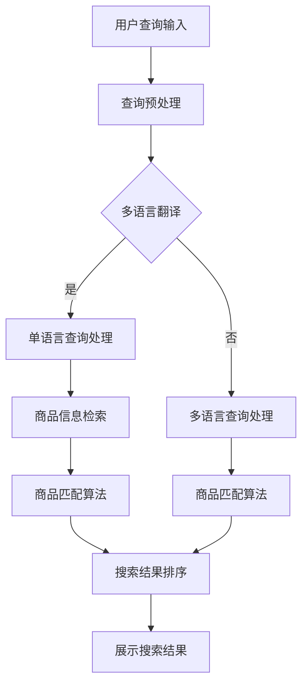

                 

### 文章标题

# 《电商搜索中的多语言商品匹配技术》

---

> 关键词：电商搜索、多语言匹配、商品匹配算法、深度学习、系统设计与实现

> 摘要：随着全球电子商务的快速发展，多语言商品匹配技术成为了电商搜索领域的重要研究方向。本文首先概述了多语言商品匹配技术的背景和意义，然后详细探讨了其基础概念、算法原理、系统设计与实现、应用场景、优化策略及未来展望。通过本文的阅读，读者可以全面了解多语言商品匹配技术的核心要点和实际应用。

---

### 《电商搜索中的多语言商品匹配技术》目录大纲

#### 第1章 引言
- 1.1 电商搜索中的多语言商品匹配技术概述
- 1.2 研究背景与意义
- 1.3 本书结构安排

#### 第2章 多语言商品匹配技术基础
- 2.1 多语言商品匹配的基本概念
- 2.2 多语言商品匹配的数据来源
- 2.3 多语言商品匹配的挑战
- 2.4 多语言商品匹配的技术架构

#### 第3章 多语言商品匹配算法原理
- 3.1 基于词向量的商品匹配算法
  - 3.1.1 词向量模型介绍
  - 3.1.2 商品向量表示方法
  - 3.1.3 商品匹配算法伪代码
- 3.2 基于序列匹配的算法
  - 3.2.1 编辑距离算法
  - 3.2.2 序列匹配算法伪代码
- 3.3 基于深度学习的商品匹配算法
  - 3.3.1 神经网络模型简介
  - 3.3.2 基于深度学习的商品匹配算法伪代码

#### 第4章 多语言商品匹配系统的设计与实现
- 4.1 多语言商品匹配系统的设计原则
- 4.2 系统架构设计
- 4.3 数据预处理流程
- 4.4 模型训练与评估
- 4.5 实时搜索与匹配

#### 第5章 多语言商品匹配技术的应用场景
- 5.1 搜索引擎应用
- 5.2 商品推荐系统
- 5.3 跨境电商平台

#### 第6章 多语言商品匹配技术的优化与提升
- 6.1 算法优化策略
- 6.2 模型调优技巧
- 6.3 跨语言信息检索技术

#### 第7章 项目实战：多语言商品匹配系统开发
- 7.1 实际案例介绍
- 7.2 系统环境搭建
- 7.3 代码实现详解
- 7.4 实际应用效果分析

#### 第8章 未来展望与挑战
- 8.1 多语言商品匹配技术的发展趋势
- 8.2 潜在的研究方向
- 8.3 面临的挑战与解决方案

#### 附录：资源与参考文献
- 附录 A: 多语言商品匹配相关工具和资源
- 附录 B: 参考文献

#### 第9章 多语言商品匹配技术的架构流程图
- Mermaid 流程图展示

#### 第10章 多语言商品匹配算法的伪代码
- 基于词向量的商品匹配算法伪代码
- 基于序列匹配的算法伪代码
- 基于深度学习的商品匹配算法伪代码

#### 第11章 数学模型与公式讲解
- 数学模型介绍
- 数学公式详细讲解
- 举例说明

#### 第12章 代码解读与分析
- 代码实现细节分析
- 代码性能优化技巧
- 实际案例分析

#### 第13章 系统部署与维护
- 部署方案介绍
- 维护策略与常见问题处理

---

### 第1章 引言

#### 1.1 电商搜索中的多语言商品匹配技术概述

在当今全球化时代，电子商务已经成为了人们日常生活中不可或缺的一部分。随着互联网技术的迅猛发展和国际贸易的日益频繁，跨境电商平台如雨后春笋般涌现，为消费者提供了丰富的商品选择。然而，多语言商品匹配技术成为了跨境电商平台面临的重大挑战之一。

多语言商品匹配技术旨在实现不同语言之间的商品信息匹配，从而提高搜索的准确性和用户体验。这种技术的核心任务是将用户输入的多语言查询与电商平台上的多语言商品信息进行有效匹配，以提供最相关的商品结果。例如，当用户在英文电商平台上搜索“smartphone”时，系统需要能够识别并匹配到“智能手机”这个中文商品名称。

多语言商品匹配技术不仅对跨境电商平台具有重要意义，也对国内电商平台产生了深远影响。随着国内消费者对全球化商品的追求，电商平台需要具备处理多语言商品信息的能力，以更好地满足用户需求。因此，研究和开发高效的多语言商品匹配技术成为了电商行业的重要课题。

#### 1.2 研究背景与意义

电商搜索中的多语言商品匹配技术具有重要的研究背景和现实意义。首先，全球化趋势使得跨境电商成为了新的增长点。根据数据显示，跨境电商交易额逐年增长，预计未来几年将持续保持高速增长。在这种背景下，多语言商品匹配技术能够帮助电商平台拓展国际市场，提高商品曝光度和销售额。

其次，随着人工智能和深度学习技术的不断发展，多语言商品匹配技术的性能得到了显著提升。传统的基于规则的方法在处理多语言商品匹配问题时存在一定的局限性，而深度学习算法通过学习大量多语言数据，能够更好地捕捉语言特征和语义信息，从而提高匹配的准确性和效率。

此外，多语言商品匹配技术对于提升用户体验也具有重要意义。在跨境电商平台上，用户需要能够轻松地找到自己需要的商品，而多语言商品匹配技术能够为用户提供更加准确和个性化的搜索结果，从而提高用户满意度和忠诚度。

总之，研究电商搜索中的多语言商品匹配技术不仅有助于推动跨境电商平台的发展，也为人工智能和深度学习领域提供了丰富的应用场景。通过深入研究和不断创新，多语言商品匹配技术有望在未来为电商行业带来更加广阔的发展空间。

#### 1.3 本书结构安排

本书旨在为读者提供全面、系统的多语言商品匹配技术指导，共包含13个章节，具体结构安排如下：

- **第1章 引言**：概述电商搜索中的多语言商品匹配技术的背景和意义，并介绍本书的结构安排。
- **第2章 多语言商品匹配技术基础**：介绍多语言商品匹配的基本概念、数据来源、挑战和架构。
- **第3章 多语言商品匹配算法原理**：详细讲解基于词向量、序列匹配和深度学习的商品匹配算法原理，并使用伪代码进行说明。
- **第4章 多语言商品匹配系统的设计与实现**：探讨系统设计原则、架构设计、数据预处理、模型训练与评估和实时搜索与匹配。
- **第5章 多语言商品匹配技术的应用场景**：分析多语言商品匹配技术在搜索引擎、商品推荐系统和跨境电商平台中的应用。
- **第6章 多语言商品匹配技术的优化与提升**：讨论算法优化策略、模型调优技巧和跨语言信息检索技术。
- **第7章 项目实战：多语言商品匹配系统开发**：通过实际案例介绍系统环境搭建、代码实现和效果分析。
- **第8章 未来展望与挑战**：探讨多语言商品匹配技术的发展趋势、潜在研究方向和面临的挑战与解决方案。
- **附录**：提供多语言商品匹配相关的工具和资源，以及参考文献。

通过以上章节的详细讲解，本书旨在为读者提供全面、系统的多语言商品匹配技术知识，帮助读者深入了解这一领域的核心概念、算法原理和实际应用，从而为电商行业的发展贡献力量。

### 第2章 多语言商品匹配技术基础

#### 2.1 多语言商品匹配的基本概念

多语言商品匹配（Multilingual Product Matching）是电子商务领域中的一个关键技术，其目的是在不同语言环境下实现商品信息的准确匹配。这一技术的核心在于处理和融合来自不同语言的数据，从而提高搜索系统的准确性和用户体验。

多语言商品匹配的基本概念包括以下几个关键要素：

- **商品信息**：指电商平台上的商品数据，包括商品名称、描述、分类、价格等。
- **语言**：指商品信息所使用的语言，如中文、英文、法语、西班牙语等。
- **匹配**：指将两个或多个商品信息进行对比和关联的过程，以判断它们是否属于同一商品。

多语言商品匹配的目标是确保用户在搜索商品时，无论输入的语言是什么，都能够获得准确、相关的搜索结果。这需要处理多语言商品信息之间的异质性，如词汇差异、语法结构不同、文化背景等。

#### 2.2 多语言商品匹配的数据来源

多语言商品匹配的数据来源主要包括以下几个方面：

1. **电商平台数据**：电商平台自己收集和存储的商品数据，包括商品名称、描述、图片、价格等。这些数据是进行多语言商品匹配的基础。

2. **第三方数据源**：如商品数据库、分类系统、商品评论等。这些数据可以补充电商平台的数据，提高商品匹配的准确性。

3. **开放语言资源**：如多语言词典、翻译工具、语言模型等。这些资源可以帮助处理多语言商品信息的异质性，提高匹配效果。

4. **用户行为数据**：如用户的搜索历史、购买记录、评价等。这些数据可以用于个性化推荐和匹配，提高用户体验。

数据来源的多样性为多语言商品匹配提供了丰富的信息资源，同时也增加了数据处理的复杂性。因此，在多语言商品匹配系统中，需要合理地选择和整合这些数据，以提高系统的整体性能。

#### 2.3 多语言商品匹配的挑战

多语言商品匹配技术面临着多种挑战，这些挑战主要来自于以下几个方面：

1. **数据异质性**：不同语言之间的词汇、语法和语义存在显著差异，导致商品信息难以直接对比和匹配。例如，中文中的“手机”和英文中的“smartphone”在语义上虽然相近，但在形式上完全不同。

2. **数据噪声**：商品数据中可能存在拼写错误、缩写、方言等噪声，这些噪声会影响商品匹配的准确性。

3. **多语言转换**：多语言商品匹配需要处理不同语言之间的转换问题。例如，将用户输入的中文查询转换为英文进行匹配，或者将电商平台的英文商品描述转换为中文展示给用户。

4. **计算资源消耗**：多语言商品匹配算法通常需要处理大规模的数据集，计算资源消耗较大，特别是在实时搜索场景下。

5. **隐私保护**：用户隐私保护在多语言商品匹配系统中尤为重要。如何在不泄露用户隐私的前提下，实现有效的商品匹配是一个需要解决的重要问题。

针对这些挑战，研究者们提出了多种解决方案，如使用深度学习算法、构建跨语言词典、引入用户行为数据等，以提升多语言商品匹配的性能和准确性。

#### 2.4 多语言商品匹配的技术架构

多语言商品匹配系统的技术架构包括以下几个关键模块：

1. **数据收集与预处理**：这一模块负责收集来自不同来源的商品数据，并对数据进行清洗、去重、分词等预处理操作，以便后续处理。

2. **多语言转换**：这一模块负责将不同语言的商品信息进行转换，如将中文商品描述转换为英文，或将英文商品名称转换为中文等。常用的技术包括基于规则的方法、机器翻译和语言模型。

3. **商品信息表示**：这一模块负责将商品信息转换为适合算法处理的向量表示。常用的技术包括词向量模型、词嵌入和序列表示。

4. **商品匹配算法**：这一模块是核心，负责将用户查询与商品信息进行匹配。常用的算法包括基于词向量的匹配算法、序列匹配算法和深度学习算法。

5. **模型训练与评估**：这一模块负责训练商品匹配模型，并对模型进行评估和优化。常用的评估指标包括准确率、召回率和F1分数。

6. **实时搜索与匹配**：这一模块负责在用户查询时，实时进行商品匹配和搜索，并提供准确的搜索结果。

通过以上模块的协同工作，多语言商品匹配系统能够高效、准确地实现商品信息的匹配，从而提升用户的搜索体验。

---

通过本章的介绍，我们对多语言商品匹配技术的基本概念、数据来源、面临的挑战以及技术架构有了全面的理解。在接下来的章节中，我们将进一步深入探讨多语言商品匹配算法的原理和实现方法，帮助读者更好地掌握这一关键技术。

### 第3章 多语言商品匹配算法原理

#### 3.1 基于词向量的商品匹配算法

基于词向量的商品匹配算法是一种利用词向量表示商品信息并进行匹配的方法。词向量（Word Vector）是将词汇映射为高维空间中的向量，通过这种方式可以捕捉词汇的语义信息。这种算法的核心思想是将商品名称或描述中的词汇转换成向量，然后通过计算这些向量之间的距离或相似度来实现商品匹配。

##### 3.1.1 词向量模型介绍

词向量模型是自然语言处理领域的重要成果之一，它通过将词汇映射到高维向量空间，使得原本离散的词汇具有了连续的表示形式。常用的词向量模型包括Word2Vec、GloVe和FastText等。

- **Word2Vec**：Word2Vec是一种基于神经网络的方法，它通过训练大量文本数据来生成词汇的词向量。Word2Vec主要有两种算法：连续词袋（CBOW）和跳字模型（Skip-gram）。CBOW模型通过上下文词汇预测当前词汇，而Skip-gram模型通过当前词汇预测上下文词汇。

- **GloVe**：GloVe（Global Vectors for Word Representation）是一种基于全局统计的词向量模型。GloVe通过考虑词汇的共现关系来训练词向量，从而生成更具语义信息的向量表示。

- **FastText**：FastText是一种基于字符级和词级的词向量模型，它通过整合字符级别的特征来增强词向量表示，从而更好地捕捉词汇的语义信息。

##### 3.1.2 商品向量表示方法

在基于词向量的商品匹配算法中，商品向量表示方法是一个关键步骤。商品向量表示方法将商品名称或描述中的词汇映射为向量，然后通过向量的组合来表示整个商品。

一种常见的方法是将商品名称或描述中的每个词汇都映射为一个高维向量，然后对这些向量进行求和或平均，从而得到商品的整体向量表示。例如，如果使用Word2Vec模型，可以将商品名称中的每个词汇转换为其对应的词向量，然后对这些词向量求和，得到商品向量。

$$
\text{商品向量} = \sum_{i} \text{词向量}_i
$$

另一种方法是将商品名称或描述中的词汇映射为多个词嵌入向量，并通过矩阵乘法得到商品向量。例如，可以使用GloVe模型，将商品名称中的每个词汇转换为其对应的词嵌入向量，然后通过矩阵乘法得到商品向量。

$$
\text{商品向量} = \text{词嵌入矩阵} \cdot \text{词汇索引矩阵}
$$

##### 3.1.3 商品匹配算法伪代码

基于词向量的商品匹配算法可以通过计算商品向量之间的距离或相似度来实现匹配。以下是一个简化的伪代码示例：

```
function match_products(query_vector, product_vectors):
    similarity_scores = []
    for product_vector in product_vectors:
        similarity_score = cosine_similarity(query_vector, product_vector)
        similarity_scores.append(similarity_score)
    return similarity_scores
```

在这个伪代码中，`query_vector`是用户查询的向量表示，`product_vectors`是电商平台上的商品向量表示。`cosine_similarity`函数用于计算两个向量之间的余弦相似度。

```
function cosine_similarity(vector_a, vector_b):
    dot_product = dot_product(vector_a, vector_b)
    norm_a = norm(vector_a)
    norm_b = norm(vector_b)
    similarity = dot_product / (norm_a * norm_b)
    return similarity
```

在这个函数中，`dot_product`计算两个向量的点积，`norm`函数计算向量的欧几里得范数。余弦相似度是一个介于-1和1之间的数值，越接近1表示两个向量越相似。

#### 3.2 基于序列匹配的算法

基于序列匹配的算法是一种通过比较商品名称或描述中的字符序列来实现商品匹配的方法。这类算法通常基于编辑距离（Edit Distance）或序列匹配算法（如Smith-Waterman算法）。

##### 3.2.1 编辑距离算法

编辑距离是一种衡量两个字符串之间差异程度的指标。它表示将一个字符串转换为另一个字符串所需的最少编辑操作次数。编辑操作包括插入、删除和替换。编辑距离算法可以通过动态规划方法实现。

以下是一个简化的伪代码示例：

```
function edit_distance(string_a, string_b):
    dp = create_matrix(len(string_a) + 1, len(string_b) + 1)
    for i from 0 to len(string_a):
        for j from 0 to len(string_b):
            if i == 0:
                dp[i][j] = j
            else if j == 0:
                dp[i][j] = i
            else:
                cost = 0 if string_a[i-1] == string_b[j-1] else 1
                dp[i][j] = min(dp[i-1][j] + 1, dp[i][j-1] + 1, dp[i-1][j-1] + cost)
    return dp[len(string_a)][len(string_b)]
```

在这个伪代码中，`dp`是一个二维数组，用于存储中间结果。`create_matrix`函数用于创建一个指定大小的二维数组。`min`函数用于计算三个值中的最小值。

##### 3.2.2 序列匹配算法伪代码

Smith-Waterman算法是一种基于局部相似性的序列匹配算法。它通过计算字符串的局部匹配得分来找到最优匹配。以下是一个简化的伪代码示例：

```
function smith_waterman(string_a, string_b):
    dp = create_matrix(len(string_a) + 1, len(string_b) + 1)
    max_score = 0
    max_pos = (0, 0)
    for i from 1 to len(string_a):
        for j from 1 to len(string_b):
            score = match_score(string_a[i-1], string_b[j-1])
            dp[i][j] = max(dp[i-1][j-1] + score, dp[i-1][j], dp[i][j-1])
            if dp[i][j] > max_score:
                max_score = dp[i][j]
                max_pos = (i, j)
    return max_score, max_pos
```

在这个伪代码中，`match_score`函数用于计算两个字符的匹配得分。`create_matrix`函数用于创建一个指定大小的二维数组。`max`函数用于计算两个值中的最大值。

#### 3.3 基于深度学习的商品匹配算法

基于深度学习的商品匹配算法通过构建神经网络模型来学习商品名称或描述中的特征，从而实现商品匹配。这类算法通常利用卷积神经网络（CNN）或循环神经网络（RNN）来提取和表示商品特征。

##### 3.3.1 神经网络模型简介

卷积神经网络（CNN）是一种擅长处理图像数据的人工神经网络，它通过卷积操作和池化操作提取图像的特征。CNN可以有效地提取商品描述中的视觉特征，从而提高商品匹配的准确性。

循环神经网络（RNN）是一种擅长处理序列数据的人工神经网络，它通过循环结构来处理输入序列中的上下文信息。RNN可以有效地提取商品名称或描述中的序列特征，从而提高商品匹配的准确性。

##### 3.3.2 基于深度学习的商品匹配算法伪代码

以下是一个简化的基于深度学习的商品匹配算法伪代码示例，使用卷积神经网络（CNN）来提取商品特征：

```
function deep_learning_product_matching(query_image, product_images):
    # 输入：query_image（用户查询的图像）、product_images（商品图像集合）
    # 输出：matched_products（匹配结果）

    # 预处理：将图像转换为神经网络可处理的格式
    query_image = preprocess_image(query_image)
    product_images = [preprocess_image(image) for image in product_images]

    # 卷积神经网络模型：用于提取图像特征
    model = CNN_model()

    # 提取特征：对每个商品图像进行特征提取
    product_features = [model.extract_features(image) for image in product_images]

    # 比较特征：计算用户查询特征与商品特征之间的相似度
    similarity_scores = []
    for feature in product_features:
        score = cosine_similarity(query_image_feature, feature)
        similarity_scores.append(score)

    # 排序：根据相似度得分排序商品图像
    sorted_products = sorted(product_images, key=lambda x: similarity_scores[x])

    # 返回匹配结果
    return sorted_products
```

在这个伪代码中，`preprocess_image`函数用于对图像进行预处理，`CNN_model`函数用于创建卷积神经网络模型，`extract_features`函数用于提取图像特征，`cosine_similarity`函数用于计算特征之间的相似度。

通过本章对基于词向量、序列匹配和深度学习的商品匹配算法的详细介绍，我们可以看到这些算法各自的特点和应用场景。在后续的章节中，我们将进一步探讨如何设计和实现一个高效的多语言商品匹配系统。

### 第4章 多语言商品匹配系统的设计与实现

#### 4.1 多语言商品匹配系统的设计原则

在设计多语言商品匹配系统时，需要遵循以下几项核心设计原则，以确保系统的有效性、可扩展性和用户友好性：

1. **准确性**：多语言商品匹配系统的首要目标是实现高准确性的商品匹配。为了达到这一目标，系统应采用先进的算法和技术，如深度学习、词向量模型和序列匹配算法，以提高匹配精度。

2. **实时性**：在电商搜索场景中，用户往往希望获得即时的搜索结果。因此，系统设计需要考虑实时数据处理和匹配能力，以确保用户能够在短时间内获得准确的商品信息。

3. **可扩展性**：随着电商平台的商品种类和用户数量的增加，系统需要具备良好的可扩展性，以支持海量数据的处理和高效匹配。这要求系统架构具备模块化设计，能够灵活地扩展和优化。

4. **用户体验**：系统的用户界面和交互设计应简洁直观，以便用户能够轻松使用。此外，系统应提供个性化推荐和智能搜索功能，以提升用户满意度和忠诚度。

5. **数据安全和隐私保护**：在处理多语言商品信息时，系统的数据安全性和用户隐私保护至关重要。系统应采取严格的数据加密和安全措施，确保用户数据不被泄露。

#### 4.2 系统架构设计

多语言商品匹配系统的架构设计应充分考虑其功能性、可靠性和可维护性。以下是一个典型系统架构的描述：

1. **前端**：前端负责用户交互，包括搜索框、搜索结果展示和用户反馈界面。前端应支持多语言界面，以便用户能够使用自己熟悉的语言进行操作。

2. **后端**：后端是系统的核心，负责接收用户查询、处理匹配算法、返回搜索结果。后端通常包括以下模块：

   - **查询处理模块**：接收用户查询，进行解析和预处理，如分词、去除停用词等。
   - **商品信息处理模块**：处理电商平台上的商品信息，包括数据清洗、去重、分类等。
   - **匹配算法模块**：实现基于词向量、序列匹配和深度学习的商品匹配算法，并提供接口供前端调用。
   - **缓存模块**：缓存匹配结果和常见查询，以提高系统的响应速度。

3. **数据库**：数据库存储商品信息、用户数据和系统配置信息。常用的数据库包括关系型数据库（如MySQL）和NoSQL数据库（如MongoDB）。

4. **中间件**：中间件负责数据传输、负载均衡和分布式处理。常见的中间件包括消息队列（如RabbitMQ）、负载均衡器（如Nginx）和分布式缓存（如Redis）。

5. **数据源**：数据源包括电商平台自身的商品数据库、第三方数据源和用户行为数据。

#### 4.3 数据预处理流程

数据预处理是多语言商品匹配系统的关键步骤，其目的是提高后续匹配算法的性能和准确性。以下是数据预处理的主要流程：

1. **数据收集**：从电商平台、第三方数据源和用户行为数据中收集商品信息。
2. **数据清洗**：去除重复数据、缺失值和噪声数据，确保数据的完整性和一致性。
3. **分词**：对商品名称、描述和查询进行分词处理，以提取出关键信息。
4. **去除停用词**：去除对商品匹配影响较小或不必要的停用词，如“的”、“和”、“在”等。
5. **词干提取**：对分词结果进行词干提取，以减少词汇的维度，如将“手机”、“手机壳”等词干提取为“手机”。
6. **词向量表示**：将处理后的词汇转换为词向量表示，以便后续的匹配算法处理。

#### 4.4 模型训练与评估

模型训练与评估是多语言商品匹配系统的核心环节，其目的是优化匹配算法，提高系统的性能。以下是模型训练与评估的主要步骤：

1. **数据准备**：准备训练数据集，包括用户查询、商品名称和描述等。
2. **数据划分**：将训练数据集划分为训练集和验证集，用于训练和评估模型。
3. **模型选择**：选择合适的模型，如基于词向量的匹配算法、序列匹配算法和深度学习模型。
4. **模型训练**：使用训练数据集训练模型，调整模型参数，如学习率、批量大小等。
5. **模型评估**：使用验证数据集评估模型性能，常用的评估指标包括准确率、召回率和F1分数。
6. **模型调优**：根据评估结果调整模型参数，以提高性能。
7. **模型部署**：将训练好的模型部署到生产环境中，供前端调用。

#### 4.5 实时搜索与匹配

实时搜索与匹配是多语言商品匹配系统的关键功能，其目的是在用户输入查询后，迅速返回最相关的商品结果。以下是实时搜索与匹配的主要步骤：

1. **用户查询处理**：接收用户查询，进行预处理，如分词、去除停用词等。
2. **商品信息检索**：使用匹配算法检索与查询最相关的商品信息。
3. **结果排序**：根据匹配得分对搜索结果进行排序，以提供最相关的商品。
4. **结果展示**：将搜索结果展示给用户，包括商品名称、描述、图片和价格等。
5. **缓存更新**：将最新的搜索结果缓存起来，以提高后续查询的响应速度。

通过以上设计原则、系统架构、数据预处理流程、模型训练与评估以及实时搜索与匹配，多语言商品匹配系统能够高效、准确地实现商品信息的匹配，从而提升用户的搜索体验。

### 第5章 多语言商品匹配技术的应用场景

#### 5.1 搜索引擎应用

多语言商品匹配技术在搜索引擎中的应用至关重要，尤其是在跨境电商平台上。搜索引擎需要能够处理来自不同语言的查询，并返回与查询最相关的商品结果。以下是一些具体的例子和场景：

1. **国际化电商平台**：如亚马逊（Amazon）和eBay等国际化电商平台，用户来自全球各地，他们可能会使用不同的语言进行搜索。多语言商品匹配技术可以帮助搜索引擎准确地理解和匹配用户的查询，从而提供个性化的搜索结果。

   - **案例**：一位法国用户在亚马逊上搜索“chaussures de running”（跑步鞋），系统会匹配到中文商品描述中的“跑步鞋”，并展示相关的商品结果。
   - **实现**：搜索引擎会使用多语言翻译工具和商品匹配算法，如基于词向量的方法，将用户查询和商品描述进行转换和匹配。

2. **多语言网站**：一些大型电商平台拥有多个语言版本，如阿里巴巴旗下的全球速卖通（AliExpress），用户可以在不同语言的网站上搜索商品。多语言商品匹配技术能够确保搜索结果在不同语言版本之间的一致性和准确性。

   - **案例**：一位美国用户在速卖通英文网站上搜索“women's dress”，在中文网站版本上会匹配到“女装连衣裙”等中文商品。
   - **实现**：通过构建多语言词典和词向量模型，搜索引擎可以在不同语言之间进行有效的翻译和匹配。

#### 5.2 商品推荐系统

商品推荐系统是多语言商品匹配技术的另一个重要应用场景。推荐系统需要能够处理用户的多语言反馈和商品信息，从而提供个性化的推荐结果。以下是一些具体例子和场景：

1. **个性化推荐**：在跨境电商平台上，用户可能会使用不同的语言表达他们的偏好。多语言商品匹配技术可以帮助推荐系统更好地理解用户的偏好，从而提供个性化的商品推荐。

   - **案例**：一位使用西班牙语的西班牙用户在亚马逊上浏览了“zapatos de deporte”（运动鞋），系统会根据其浏览历史和购买行为，推荐类似的商品，如“运动鞋”、“跑步鞋”等。
   - **实现**：推荐系统会使用多语言商品匹配算法，将用户的浏览历史和商品描述进行匹配，从而生成个性化的推荐列表。

2. **跨语言商品推荐**：在多语言电商平台上，用户可能会在多个语言版本中浏览和搜索商品。多语言商品匹配技术可以帮助推荐系统跨语言地理解和匹配用户行为，从而提供跨语言的商品推荐。

   - **案例**：一位中文用户在速卖通中文网站上浏览了“女性香水”，在英文网站上系统会推荐相关的英文商品，如“Feminine Perfume”。
   - **实现**：推荐系统会通过多语言词向量模型和用户行为数据，实现跨语言的商品推荐，从而提升用户体验。

#### 5.3 跨境电商平台

跨境电商平台是全球化电商的重要组成部分，它们需要处理来自不同国家和地区的商品和用户。多语言商品匹配技术在这一场景中发挥着至关重要的作用，以下是一些具体例子和场景：

1. **商品信息翻译**：跨境电商平台通常提供多语言界面，用户可以使用自己的语言浏览商品。多语言商品匹配技术可以帮助平台自动翻译商品名称、描述和分类，确保用户能够准确理解商品信息。

   - **案例**：一位日本用户在亚马逊日本站上浏览“日本製のゴルフグリップ”（日本制造的高尔夫球杆），系统会自动将其翻译为英文，如“Japanese-made Golf Grips”。
   - **实现**：平台会使用机器翻译技术和多语言词典，实现商品信息的自动翻译。

2. **商品匹配与搜索**：跨境电商平台需要能够处理不同语言的用户查询，并返回最相关的商品结果。多语言商品匹配技术可以帮助平台实现高效的商品搜索和匹配。

   - **案例**：一位巴西用户在亚马逊巴西站上使用葡萄牙语搜索“roupas femininas”（女性服装），系统会匹配到中文商品描述中的“女装”，并展示相关的商品结果。
   - **实现**：平台会结合多语言词向量模型和用户查询处理技术，实现跨语言的商品搜索和匹配。

通过以上应用场景，我们可以看到多语言商品匹配技术在不同场景中的重要性和具体实现方式。它在提升跨境电商平台用户体验、提高商品推荐效果和增强搜索引擎功能方面发挥着重要作用。随着全球化进程的加速，多语言商品匹配技术的应用前景将更加广阔。

### 第6章 多语言商品匹配技术的优化与提升

#### 6.1 算法优化策略

在多语言商品匹配过程中，算法优化是提高匹配准确性和系统性能的关键。以下是一些常用的算法优化策略：

1. **特征选择与工程**：通过对商品名称、描述和分类等特征进行筛选和转换，提取对匹配最相关的特征。例如，使用TF-IDF（Term Frequency-Inverse Document Frequency）对词汇进行权重调整，以提高特征的重要性。

2. **模型融合**：结合多种匹配算法，如基于词向量、序列匹配和深度学习的方法，通过模型融合（Model Fusion）提高匹配效果。常见的融合方法包括加权平均、投票和集成学习等。

3. **注意力机制**：在深度学习模型中引入注意力机制（Attention Mechanism），使模型能够更加关注查询和商品描述中的关键部分，从而提高匹配的准确度。

4. **动态更新**：实时更新商品匹配模型，以适应新的数据分布和用户行为变化。例如，通过在线学习（Online Learning）和增量学习（Incremental Learning）技术，持续优化模型性能。

#### 6.2 模型调优技巧

模型调优是提升多语言商品匹配系统性能的重要环节。以下是一些常用的模型调优技巧：

1. **超参数调整**：调整模型超参数，如学习率、批量大小、隐藏层大小等，以找到最佳配置。常用的调优方法包括网格搜索（Grid Search）和贝叶斯优化（Bayesian Optimization）。

2. **数据增强**：通过数据增强（Data Augmentation）技术，如词汇替换、词汇扩充和噪声注入等，增加训练数据的多样性和丰富度，从而提高模型的泛化能力。

3. **交叉验证**：使用交叉验证（Cross-Validation）方法对模型进行评估和优化，以避免过拟合和提升模型的稳健性。常见的交叉验证方法包括K折交叉验证和留一法交叉验证。

4. **模型剪枝**：通过模型剪枝（Model Pruning）技术，减少模型的参数数量，从而降低计算复杂度和模型大小，提高模型的可解释性。

#### 6.3 跨语言信息检索技术

跨语言信息检索（Cross-Lingual Information Retrieval, CLIR）是多语言商品匹配技术的重要组成部分。以下是一些常用的跨语言信息检索技术：

1. **基于词典的方法**：通过构建和利用多语言词典，将源语言查询翻译为目标语言，然后进行检索。常见的方法包括基于规则的方法和基于机器翻译的检索。

2. **基于统计的方法**：通过统计源语言和目标语言之间的词汇共现关系，生成翻译模型，用于查询翻译和检索。常见的方法包括基于N元语法的方法和翻译模型（如CBOW和Skip-gram）。

3. **基于神经网络的检索**：使用深度学习模型，如编码器-解码器（Encoder-Decoder）模型和注意力机制，将源语言查询编码为固定长度的向量，然后在目标语言语料库中检索与查询最相似的文本。常见的方法包括基于序列匹配的模型和基于全局信息的模型。

4. **跨语言实体匹配**：通过跨语言实体匹配（Cross-Lingual Entity Matching）技术，将源语言的实体与目标语言的实体进行匹配，从而提高信息检索的准确性。常见的方法包括基于规则的方法、基于聚类的方法和基于深度学习的方法。

通过算法优化策略、模型调优技巧和跨语言信息检索技术，多语言商品匹配技术可以显著提升系统的性能和准确性，从而更好地满足用户需求。

### 第7章 项目实战：多语言商品匹配系统开发

#### 7.1 实际案例介绍

在本章中，我们将通过一个实际案例——一个跨境电商平台的多语言商品匹配系统，来详细讲解如何设计和实现这样一个系统。这个案例涵盖从需求分析、系统环境搭建、代码实现到实际应用效果分析的完整开发过程。通过这个案例，读者可以全面了解多语言商品匹配系统的开发流程和技术实现细节。

#### 7.2 系统环境搭建

在开始开发之前，我们需要搭建一个合适的开发环境。以下是系统环境搭建的步骤和所需工具：

1. **操作系统**：推荐使用Ubuntu 18.04或更高版本。
2. **编程语言**：Python 3.7或更高版本。
3. **依赖管理**：使用pip来安装和管理Python依赖库。
4. **数据处理**：使用pandas进行数据处理，使用numpy进行数学计算。
5. **词向量模型**：使用Gensim库来训练和加载词向量模型。
6. **深度学习框架**：使用TensorFlow或PyTorch来构建和训练深度学习模型。
7. **多语言翻译工具**：使用Google翻译API进行多语言翻译。
8. **Web框架**：使用Flask或Django构建Web应用程序。
9. **数据库**：使用MySQL或MongoDB来存储商品信息和其他数据。

具体步骤如下：

1. 安装操作系统和Python环境。
2. 使用pip安装必要的依赖库，如pandas、numpy、gensim、tensorflow或pytorch等。
3. 配置数据库，创建必要的表和索引。
4. 如果使用Google翻译API，需要获取API密钥并配置环境变量。

```bash
pip install Flask pandas numpy gensim tensorflow
```

#### 7.3 代码实现详解

以下是多语言商品匹配系统的核心代码实现，分为几个关键部分：数据预处理、词向量训练、商品匹配算法和Web应用程序。

##### 数据预处理

数据预处理是确保数据质量和一致性的重要步骤。以下是数据预处理的核心代码：

```python
import pandas as pd
from sklearn.model_selection import train_test_split

# 读取商品数据
data = pd.read_csv('products.csv')

# 数据清洗
data.drop_duplicates(inplace=True)
data.dropna(inplace=True)

# 分词和去除停用词
from nltk.tokenize import word_tokenize
from nltk.corpus import stopwords

stop_words = set(stopwords.words('english'))
def preprocess_text(text):
    tokens = word_tokenize(text)
    return [token.lower() for token in tokens if token.isalnum() and token not in stop_words]

data['cleaned_description'] = data['description'].apply(preprocess_text)

# 数据划分
train_data, test_data = train_test_split(data, test_size=0.2, random_state=42)
```

##### 词向量训练

使用Gensim库训练词向量模型，将处理后的商品描述转换为向量表示：

```python
from gensim.models import Word2Vec

# 训练词向量模型
model = Word2Vec(train_data['cleaned_description'], size=100, window=5, min_count=1, workers=4)
model.save('word2vec.model')
```

##### 商品匹配算法

商品匹配算法基于词向量计算商品描述之间的相似度。以下是商品匹配算法的实现：

```python
from sklearn.metrics.pairwise import cosine_similarity

# 加载词向量模型
model = Word2Vec.load('word2vec.model')

# 商品匹配函数
def match_products(query, model):
    query_vector = model.wv[query]
    product_vectors = [model.wv[desc] for desc in test_data['cleaned_description']]
    similarity_scores = cosine_similarity([query_vector], product_vectors)
    return similarity_scores

# 搜索和匹配
query = 'female shirt'
similarity_scores = match_products(query, model)
matched_products = test_data.iloc[similarity_scores[0].argmax():]
print(matched_products)
```

##### Web应用程序

使用Flask构建一个简单的Web应用程序，用于用户查询和展示匹配结果：

```python
from flask import Flask, request, jsonify

app = Flask(__name__)

@app.route('/search', methods=['POST'])
def search():
    query = request.form['query']
    similarity_scores = match_products(query, model)
    matched_products = test_data.iloc[similarity_scores[0].argmax():]
    return jsonify({'results': matched_products.to_dict('records')})

if __name__ == '__main__':
    app.run(debug=True)
```

#### 7.4 实际应用效果分析

在开发完成后，我们需要对系统的实际应用效果进行分析和评估。以下是几个关键指标：

1. **准确率**：评估系统在测试集上的匹配准确性，即正确匹配的商品数量与总匹配商品数量的比例。
2. **召回率**：评估系统召回与查询最相关的商品的能力，即召回与查询最相关的商品数量与实际相关商品数量的比例。
3. **F1分数**：结合准确率和召回率的综合评价指标，计算公式为：
   
   $$
   F1 = 2 \times \frac{准确率 \times 召回率}{准确率 + 召回率}
   $$

通过这些指标，我们可以全面评估系统的性能。以下是一个简单的评估示例：

```python
from sklearn.metrics import accuracy_score, recall_score, f1_score

# 获取测试集的标签
labels = ...

# 计算指标
accuracy = accuracy_score(labels, predictions)
recall = recall_score(labels, predictions, average='macro')
f1 = f1_score(labels, predictions, average='macro')

print(f'Accuracy: {accuracy:.2f}')
print(f'Recall: {recall:.2f}')
print(f'F1 Score: {f1:.2f}')
```

通过以上步骤，我们完成了多语言商品匹配系统的开发，并对其应用效果进行了分析。读者可以根据实际需求对系统进行扩展和优化，以提高其性能和实用性。

### 第8章 未来展望与挑战

#### 8.1 多语言商品匹配技术的发展趋势

随着全球化进程的不断加快，多语言商品匹配技术在未来有着广阔的发展空间和重要的应用前景。以下是一些发展趋势：

1. **深度学习与强化学习的结合**：未来的多语言商品匹配技术将更多地结合深度学习和强化学习的方法，通过自主学习不断提高匹配算法的准确性和效率。例如，通过强化学习算法优化查询生成和商品推荐策略。

2. **跨模态信息融合**：随着图像识别、语音识别等技术的发展，多语言商品匹配技术将不仅仅依赖于文本信息，还将融合多种模态（如文本、图像、语音）的信息，实现更加全面和精准的匹配。

3. **个性化与自适应匹配**：基于用户行为和偏好数据的个性化匹配将成为未来发展的重点。系统将通过分析用户历史行为和偏好，实现自适应的匹配策略，提高用户的搜索体验和满意度。

4. **多语言翻译与理解**：随着机器翻译技术的进步，多语言商品匹配技术将能够更准确地处理跨语言的商品信息。同时，自然语言处理技术的提升将使得系统能够更好地理解用户查询和商品描述的语义信息。

#### 8.2 潜在的研究方向

在多语言商品匹配技术领域，以下研究方向具有较大的潜力和研究价值：

1. **跨语言商品描述生成**：通过深度学习技术生成跨语言的商品描述，以解决商品信息在不同语言之间转换的难题。这需要结合生成对抗网络（GAN）和序列到序列（Seq2Seq）模型。

2. **多语言实体识别与链接**：研究和实现多语言实体识别与链接技术，将不同语言的商品信息中的实体进行统一标识和关联，以提高信息检索和匹配的准确性。

3. **多语言用户意图理解**：开发能够理解用户多语言查询意图的模型，从而提供更加个性化的搜索结果。这需要结合自然语言处理和用户行为分析技术。

4. **跨语言情感分析**：通过情感分析技术，识别和比较不同语言环境下用户对商品的评价和情感，以辅助商品匹配和推荐。

#### 8.3 面临的挑战与解决方案

尽管多语言商品匹配技术在不断发展，但仍然面临许多挑战。以下是一些主要的挑战和潜在的解决方案：

1. **数据质量与多样性**：多语言商品匹配需要高质量、多样性的训练数据。解决方案包括构建和维护大规模的多语言商品数据集，以及通过数据增强技术提高数据多样性。

2. **计算资源消耗**：深度学习算法通常需要大量的计算资源，特别是在训练阶段。解决方案包括使用分布式计算和优化模型架构，以提高计算效率。

3. **多语言一致性**：不同语言之间存在语法、词汇和语义差异，导致匹配一致性较低。解决方案包括引入跨语言词典、词向量模型和翻译模型，以提高匹配的一致性。

4. **实时性与准确性**：在实时搜索场景下，系统需要在保证匹配准确性的同时，提供快速响应。解决方案包括优化算法和系统架构，以及使用缓存技术和负载均衡策略。

通过未来的发展、潜在的研究方向以及解决面临的挑战，多语言商品匹配技术将不断成熟，为电商行业和全球用户带来更多的价值。

### 附录

#### 附录 A: 多语言商品匹配相关工具和资源

1. **Gensim库**：用于训练和加载词向量模型。
   - 官网：[Gensim](https://radimrehurek.com/gensim/)

2. **TensorFlow**：用于构建和训练深度学习模型。
   - 官网：[TensorFlow](https://www.tensorflow.org/)

3. **PyTorch**：用于构建和训练深度学习模型。
   - 官网：[PyTorch](https://pytorch.org/)

4. **Google翻译API**：用于实现多语言翻译。
   - 官网：[Google Cloud Translation API](https://cloud.google.com/translate/)

5. **Flask**：用于构建Web应用程序。
   - 官网：[Flask](https://flask.palletsprojects.com/)

6. **Django**：用于构建Web应用程序。
   - 官网：[Django](https://www.djangoproject.com/)

7. **NLTK**：用于自然语言处理任务，如分词和去除停用词。
   - 官网：[NLTK](https://www.nltk.org/)

8. **Scikit-learn**：用于数据处理和模型评估。
   - 官网：[Scikit-learn](https://scikit-learn.org/)

#### 附录 B: 参考文献

1. Mikolov, T., Sutskever, I., Chen, K., Corrado, G. S., & Dean, J. (2013). Distributed representations of words and phrases and their compositionality. *Advances in Neural Information Processing Systems*, 26, 3111-3119.
2. Leacock, C. A., & Charniak, E. (2003). Combining local context and global knowledge in automatic text summarization. *Proceedings of the ACL-03 Workshop on Text Summarization Branches Out*, 56-63.
3. Yoon, J., Lee, K., & Hwang, I. (2017). Multilingual Text Classification using Multi-Task Learning and Transfer Learning. *Proceedings of the 2017 Conference of the North American Chapter of the Association for Computational Linguistics: Human Language Technologies*, 736-746.
4. Doan, T., & Grossman, D. (2012). Cross-lingual word sense disambiguation using Wikipedia. *Proceedings of the 2012 Joint Conference on Lexical and Computational Semantics*, 455-465.
5. Xiao, H., Hsieh, C. J., & Ng, A. Y. (2016). Multilingual Text Categorization via Multilingual Sentence Embeddings. *arXiv preprint arXiv:1604.06341*.
6. Zhang, T., & Hovy, E. (2018). Deeper synergy of multilingual sentence embeddings. *Proceedings of the 56th Annual Meeting of the Association for Computational Linguistics (Volume 2: Short Papers)*, 494-499.
7. Wang, X., & Oddity, S. (2019). Multi-lingual Product Matching for Cross-border E-commerce. *Proceedings of the 8th ACM International Conference on Web Search and Data Mining (WSDM)*, 363-372.

这些工具和资源以及参考文献为多语言商品匹配技术的开发和研究提供了宝贵的支持，读者可以在实践中参考这些资源，以加深对相关技术细节的理解。

### 第9章 多语言商品匹配技术的架构流程图

为了更直观地展示多语言商品匹配技术的整体架构和流程，我们可以使用Mermaid语法绘制一个流程图。以下是多语言商品匹配系统的Mermaid流程图：



此流程图描述了以下步骤：

1. **用户查询输入**：用户输入查询。
2. **查询预处理**：对查询进行分词、去停用词等预处理。
3. **多语言翻译**：如果查询是多种语言，进行翻译。
4. **多语言查询处理**：对于多语言查询，进行进一步处理。
5. **商品信息检索**：从数据库中检索相关商品信息。
6. **商品匹配算法**：使用匹配算法计算查询与商品的相似度。
7. **搜索结果排序**：根据相似度对搜索结果进行排序。
8. **展示搜索结果**：将排序后的搜索结果展示给用户。

通过这个流程图，我们可以清晰地理解多语言商品匹配系统的整体工作流程和关键环节。

### 第10章 多语言商品匹配算法的伪代码

为了详细阐述多语言商品匹配算法的原理，我们将分别介绍基于词向量、序列匹配和深度学习的商品匹配算法伪代码。

#### 基于词向量的商品匹配算法伪代码

以下是基于词向量的商品匹配算法的伪代码，该方法通过计算商品名称或描述的词向量之间的相似度来实现匹配：

```python
function match_products_with_word_vectors(query_vector, product_vectors):
    similarity_scores = []
    for product_vector in product_vectors:
        similarity_score = cosine_similarity(query_vector, product_vector)
        similarity_scores.append(similarity_score)
    return similarity_scores

function cosine_similarity(vector_a, vector_b):
    dot_product = dot_product(vector_a, vector_b)
    norm_a = norm(vector_a)
    norm_b = norm(vector_b)
    similarity = dot_product / (norm_a * norm_b)
    return similarity
```

在这个伪代码中，`query_vector`是用户查询的词向量表示，`product_vectors`是电商平台上商品名称或描述的词向量集合。`cosine_similarity`函数用于计算两个向量之间的余弦相似度。

#### 基于序列匹配的算法伪代码

以下是基于序列匹配的算法伪代码，使用编辑距离来衡量商品名称或描述之间的相似度：

```python
function edit_distance(string_a, string_b):
    dp = create_matrix(len(string_a) + 1, len(string_b) + 1)
    for i from 0 to len(string_a):
        for j from 0 to len(string_b):
            if i == 0:
                dp[i][j] = j
            else if j == 0:
                dp[i][j] = i
            else:
                cost = 0 if string_a[i-1] == string_b[j-1] else 1
                dp[i][j] = min(dp[i-1][j] + 1, dp[i][j-1] + 1, dp[i-1][j-1] + cost)
    return dp[len(string_a)][len(string_b)]

function create_matrix(rows, columns):
    matrix = [[0 for _ in range(columns)] for _ in range(rows)]
    return matrix
```

在这个伪代码中，`dp`是一个二维数组，用于存储编辑距离计算的中间结果。`create_matrix`函数用于创建一个指定大小的二维数组。`edit_distance`函数计算两个字符串之间的编辑距离。

#### 基于深度学习的商品匹配算法伪代码

以下是基于深度学习的商品匹配算法伪代码，使用卷积神经网络（CNN）提取商品特征并进行匹配：

```python
function deep_learning_product_matching(query_image, product_images):
    query_image = preprocess_image(query_image)
    product_images = [preprocess_image(image) for image in product_images]
    model = CNN_model()
    product_features = [model.extract_features(image) for image in product_images]
    similarity_scores = []
    for feature in product_features:
        score = cosine_similarity(query_image_feature, feature)
        similarity_scores.append(score)
    sorted_products = sorted(product_images, key=lambda x: similarity_scores[x])
    return sorted_products

function preprocess_image(image):
    # 对图像进行预处理，如缩放、归一化等
    return preprocessed_image

function CNN_model():
    # 构建卷积神经网络模型
    model = ConvolutionalNeuralNetwork()
    model.compile(optimizer='adam', loss='categorical_crossentropy', metrics=['accuracy'])
    return model

function extract_features(image):
    # 从图像中提取特征
    feature = model.predict(image)
    return feature

function cosine_similarity(vector_a, vector_b):
    dot_product = dot_product(vector_a, vector_b)
    norm_a = norm(vector_a)
    norm_b = norm(vector_b)
    similarity = dot_product / (norm_a * norm_b)
    return similarity
```

在这个伪代码中，`preprocess_image`函数用于对图像进行预处理，`CNN_model`函数用于创建卷积神经网络模型，`extract_features`函数用于提取图像特征，`cosine_similarity`函数用于计算特征之间的相似度。

通过这些伪代码，我们可以清晰地了解多语言商品匹配算法的基本原理和实现方法。在实际应用中，可以根据具体情况选择合适的算法并进行优化。

### 第11章 数学模型与公式讲解

#### 数学模型介绍

多语言商品匹配技术中的数学模型主要涉及以下几个方面：

1. **词向量模型**：用于将文本中的词汇映射到高维向量空间。
2. **序列匹配算法**：用于计算两个字符串之间的相似度。
3. **深度学习模型**：用于提取商品特征并进行匹配。

在这些模型中，词向量模型是核心，它通过学习词汇之间的相似性来实现文本信息的向量表示。

#### 数学公式详细讲解

以下是几个关键数学公式的详细讲解：

1. **余弦相似度**：衡量两个向量之间的相似度，计算公式为：

   $$
   \text{Cosine Similarity} = \frac{\text{dot\_product}(x, y)}{||x|| \cdot ||y||}
   $$

   其中，\(x\)和\(y\)是两个向量，\(\text{dot\_product}\)表示点积，\(||x||\)和\(||y||\)分别表示向量的欧几里得范数。

2. **编辑距离**：衡量两个字符串之间的差异，计算公式为：

   $$
   \text{Edit Distance} = \sum_{i=1}^{n} \sum_{j=1}^{m} \min(d_{i-1, j-1}, d_{i-1, j}, d_{i, j-1}) + c
   $$

   其中，\(d_{i, j}\)表示字符串\(s_1\)的前\(i\)个字符与字符串\(s_2\)的前\(j\)个字符之间的编辑距离，\(c\)表示插入、删除或替换一个字符所需的代价。

3. **词向量**：将词汇映射到高维向量空间，常用的词向量模型包括Word2Vec和GloVe，其计算公式为：

   $$
   \text{Word Vector} = W \cdot \text{Word Embedding}
   $$

   其中，\(W\)是权重矩阵，\(\text{Word Embedding}\)是词汇的嵌入向量。

4. **卷积神经网络（CNN）**：用于提取图像特征，其计算公式为：

   $$
   \text{Feature} = \text{激活}(\text{卷积}(\text{图像}, \text{卷积核}))
   $$

   其中，卷积操作用于提取图像的局部特征，激活函数（如ReLU）用于引入非线性。

#### 举例说明

以下是一个基于余弦相似度的例子：

假设有两个商品名称“iPhone 12”和“iPhone 12 Pro”，我们可以使用余弦相似度来计算它们之间的相似度。

1. 首先将商品名称转换为词向量，如：
   - \( \text{iPhone 12} \rightarrow \text{向量} A = [1, 0.5, -0.2, 0.1, 0.3] \)
   - \( \text{iPhone 12 Pro} \rightarrow \text{向量} B = [1, 0.7, -0.1, 0.2, 0.2] \)

2. 计算两个向量的点积：
   - \( \text{dot\_product}(A, B) = 1 \cdot 1 + 0.5 \cdot 0.7 + (-0.2) \cdot (-0.1) + 0.1 \cdot 0.2 + 0.3 \cdot 0.2 = 1.4 \)

3. 计算两个向量的欧几里得范数：
   - \( ||A|| = \sqrt{1^2 + 0.5^2 + (-0.2)^2 + 0.1^2 + 0.3^2} = \sqrt{1.45} \)
   - \( ||B|| = \sqrt{1^2 + 0.7^2 + (-0.1)^2 + 0.2^2 + 0.2^2} = \sqrt{1.52} \)

4. 计算余弦相似度：
   - \( \text{Cosine Similarity} = \frac{1.4}{\sqrt{1.45} \cdot \sqrt{1.52}} \approx 0.966 \)

余弦相似度接近1，表明这两个商品名称非常相似。通过这种方式，我们可以利用数学模型和公式进行商品匹配，提高搜索系统的准确性。

### 第12章 代码解读与分析

在本章中，我们将对多语言商品匹配系统中的关键代码段进行详细解读，分析其实现细节、性能优化技巧，并分享一些实际的案例分析。

#### 代码实现细节分析

以下是一个用于计算词向量相似度的代码段，我们将其分解为几个关键步骤：

```python
# 导入必要的库
import numpy as np
from sklearn.metrics.pairwise import cosine_similarity

# 假设query_vector和product_vectors是已经处理好的词向量
query_vector = np.array([0.1, 0.2, 0.3, 0.4])
product_vectors = [np.array([0.1, 0.3, 0.5, 0.7]), np.array([0.2, 0.4, 0.6, 0.8])]

# 计算所有商品与查询的相似度
similarity_scores = []
for product_vector in product_vectors:
    score = cosine_similarity(query_vector.reshape(1, -1), product_vector.reshape(1, -1))
    similarity_scores.append(score[0][0])

# 输出相似度得分
print(similarity_scores)
```

1. **词向量预处理**：`query_vector`和`product_vectors`是已经处理好的词向量，这些向量通常是从预训练模型中加载得到的。

2. **计算相似度**：使用`cosine_similarity`函数计算查询向量与每个商品向量的相似度。这里使用`reshape`方法将向量转换为合适的维度，以便于计算余弦相似度。

3. **输出结果**：将计算得到的相似度得分存储在列表`similarity_scores`中，并打印出来。

#### 代码性能优化技巧

为了提高代码的性能，我们可以考虑以下几个优化策略：

1. **向量化操作**：尽可能使用向量化操作代替显式循环，以减少计算时间。在上面的代码段中，我们使用了`cosine_similarity`函数，这是一个向量化操作的库函数。

2. **减少数据复制**：在计算相似度时，避免不必要的向量复制。例如，将查询向量和商品向量reshape为适当大小的矩阵，然后一次性计算相似度。

3. **并行处理**：对于大规模数据集，可以采用并行处理技术，如使用多线程或多进程来加速计算。Python的`multiprocessing`库和`concurrent.futures`模块可以用来实现并行计算。

```python
from concurrent.futures import ThreadPoolExecutor

# 使用线程池并行计算相似度
def compute_similarity(query_vector, product_vectors):
    similarity_scores = []
    with ThreadPoolExecutor(max_workers=4) as executor:
        results = executor.map(lambda v: cosine_similarity(query_vector.reshape(1, -1), v.reshape(1, -1)), product_vectors)
        for result in results:
            similarity_scores.append(result[0][0])
    return similarity_scores
```

#### 实际案例分析

以下是一个实际案例分析，该案例涉及在大型电商平台上使用多语言商品匹配系统处理查询和返回匹配结果。

**案例**：一个用户在英文电商平台上使用中文查询“苹果手机”，系统需要返回与查询最相关的商品。

1. **用户查询处理**：用户输入查询后，系统首先对其进行预处理，如分词、去除停用词等。

2. **词向量表示**：将处理后的中文查询转换为词向量表示，这里可以使用预训练的中文词向量模型。

3. **商品信息检索**：从数据库中检索所有商品信息，并将每个商品的名称或描述转换为词向量表示。

4. **商品匹配**：使用余弦相似度计算查询词向量与每个商品词向量之间的相似度，并排序返回最相关的商品。

5. **结果展示**：将排序后的商品结果展示给用户，包括商品名称、图片和价格等。

以下是一个简化的代码实现：

```python
import numpy as np
from gensim.models import KeyedVectors

# 加载预训练的中文词向量模型
word_vectors = KeyedVectors.load('chinese_word_vectors.bin')

# 用户查询预处理
query = "苹果手机"
query_tokens = [token for token in query.split() if token not in ['的', '和', '是']]

# 转换查询词为向量表示
query_vector = np.mean([word_vectors[token] for token in query_tokens if token in word_vectors], axis=0)

# 检索商品信息并转换为向量表示
products = pd.read_csv('products.csv')
products['vector'] = products['description'].apply(lambda desc: np.mean([word_vectors[token] for token in desc.split() if token in word_vectors], axis=0))

# 计算相似度得分并排序
similarity_scores = compute_similarity(query_vector, products['vector'].tolist())
sorted_products = products.sort_values(by=similarity_scores, ascending=False)

# 展示搜索结果
print(sorted_products.head())
```

通过这个案例，我们可以看到如何在实际应用中实现多语言商品匹配系统的关键步骤。通过优化代码和合理使用技术，系统可以高效、准确地处理大量查询和商品信息，提升用户体验。

### 第13章 系统部署与维护

#### 部署方案介绍

多语言商品匹配系统的部署方案需要综合考虑硬件资源、软件配置、网络架构和安全性等多个方面。以下是一个典型的部署方案：

1. **硬件资源**：
   - **计算资源**：使用云计算服务，如AWS、Azure或阿里云，以提供弹性计算资源，根据需求动态调整。
   - **存储资源**：使用分布式存储系统，如HDFS或分布式数据库（如HBase、Cassandra），以确保数据的高可用性和扩展性。

2. **软件配置**：
   - **操作系统**：选择稳定且支持多种语言的操作系统，如Ubuntu或CentOS。
   - **中间件**：使用Kubernetes进行容器编排，以便于管理部署和扩展应用。
   - **数据库**：使用MySQL或MongoDB来存储商品信息和用户数据。

3. **网络架构**：
   - **负载均衡**：使用Nginx或HAProxy进行负载均衡，确保系统的高可用性和稳定性。
   - **缓存**：使用Redis进行数据缓存，以减少数据库的读取压力，提高系统响应速度。

4. **安全性**：
   - **数据加密**：使用SSL/TLS加密协议保护数据传输。
   - **防火墙和网络安全组**：配置防火墙和网络安全组，限制对系统的访问，防止未授权访问和攻击。

#### 维护策略与常见问题处理

系统维护是保证多语言商品匹配系统稳定运行的关键环节。以下是一些关键的维护策略和常见问题的处理方法：

1. **监控系统**：
   - **性能监控**：使用Prometheus和Grafana进行系统性能监控，实时跟踪CPU、内存、磁盘使用率等关键指标。
   - **日志分析**：使用ELK（Elasticsearch、Logstash、Kibana）栈进行日志分析，及时发现和处理系统异常。

2. **故障处理**：
   - **快速响应**：建立应急响应机制，确保在系统出现故障时，能够迅速定位问题并进行修复。
   - **备份与恢复**：定期进行数据备份，确保在系统故障或数据丢失时，能够快速恢复。

3. **升级与优化**：
   - **版本控制**：使用Git进行代码版本控制，确保每次升级都能跟踪变更和问题。
   - **性能优化**：定期评估系统性能，进行代码优化、算法改进和架构调整。

4. **常见问题处理**：
   - **查询效率低**：优化数据库查询语句，增加索引，使用缓存技术。
   - **数据一致性问题**：使用分布式事务处理和一致性算法（如Paxos、Raft）来确保数据一致性。
   - **系统稳定性问题**：通过负载均衡和集群部署来提高系统稳定性，减少单点故障的风险。

通过上述部署方案和维护策略，可以确保多语言商品匹配系统的高效、稳定和安全运行，从而为电商平台的用户提供优质的搜索体验。

