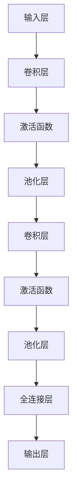
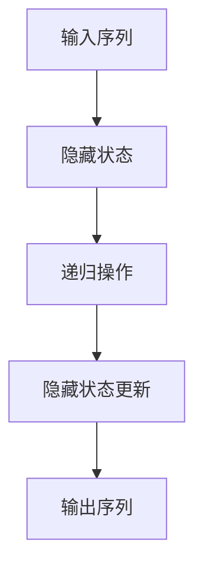
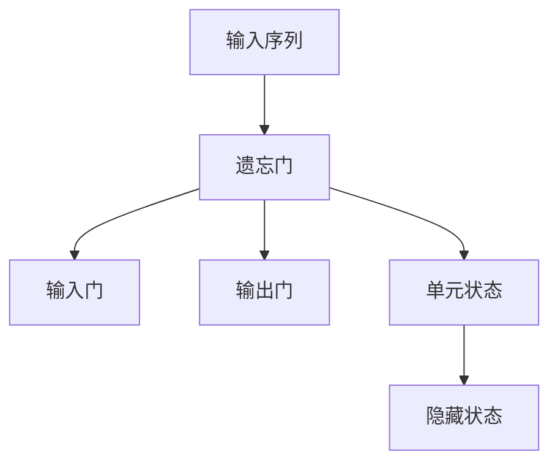
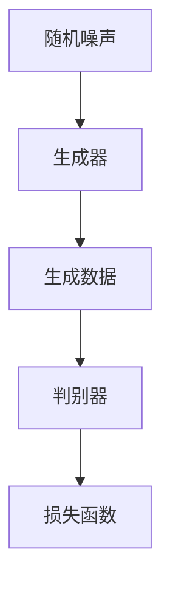
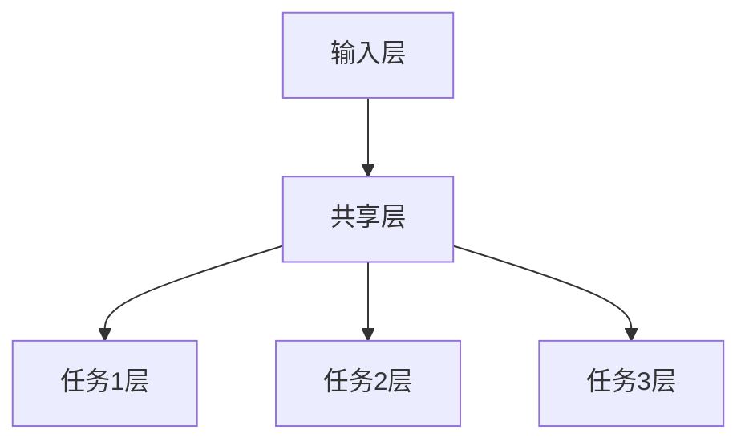
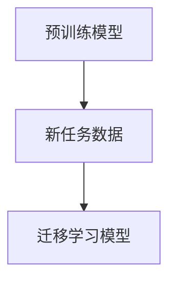

                 

# 电商搜索中的意图识别与查询理解

> 关键词：电商搜索，意图识别，查询理解，文本表示，深度学习，融合方法

> 摘要：本文旨在深入探讨电商搜索中的意图识别与查询理解技术。通过分析文本表示方法、深度学习模型以及意图识别与查询理解的融合方法，本文详细阐述了电商搜索系统中如何准确理解用户查询并返回相关结果。同时，文章通过实际项目案例，展示了这些技术的应用和效果。

## 第一部分：引言与背景知识

### 第1章：电商搜索概述

#### 1.1 电商搜索的发展历程

随着互联网的普及和电子商务的迅猛发展，电商搜索已经成为电商平台的重要组成部分。回顾电商搜索的发展历程，可以分为以下几个阶段：

1. **关键词搜索阶段**：早期电商搜索主要通过用户输入关键词，搜索引擎匹配商品标题、描述等信息返回相关结果。这一阶段，搜索系统依赖于文本匹配和关键词分析。

2. **基于分类的搜索阶段**：随着用户需求的多样化，电商搜索开始引入分类系统，用户可以通过点击分类导航来缩小搜索范围。这一阶段，搜索系统结合了分类和关键词搜索。

3. **智能化搜索阶段**：近年来，人工智能技术的发展推动了电商搜索的智能化。通过机器学习和深度学习技术，搜索系统能够更好地理解用户意图，提供个性化的搜索结果。

#### 1.2 电商搜索的重要性

电商搜索对于电商平台来说具有以下重要性：

1. **提高用户体验**：准确的搜索结果能够提高用户的满意度，增加用户粘性。

2. **提升销售额**：通过精准的搜索结果，用户更容易找到所需商品，从而提高购买转化率。

3. **优化运营效率**：智能化的搜索系统能够降低运营成本，提高商品管理的效率。

#### 1.3 电商搜索中的挑战

电商搜索面临以下几个挑战：

1. **海量数据**：电商平台拥有海量商品数据，如何高效地处理和检索这些数据是搜索系统的关键挑战。

2. **用户意图识别**：用户输入的查询可能包含多种意图，如何准确识别用户的意图是提高搜索准确性的关键。

3. **个性化搜索**：每个用户的需求和偏好不同，如何实现个性化搜索是提升用户体验的重要任务。

## 第2章：搜索意图识别基础

### 2.1 搜索意图的定义与分类

搜索意图是指用户在搜索过程中所期望获得的信息类型和操作目标。根据意图的不同，可以将搜索意图分为以下几类：

1. **商品查找意图**：用户希望找到特定商品。
2. **商品对比意图**：用户希望比较不同商品的特点和价格。
3. **品牌查询意图**：用户希望查询特定品牌的相关商品。
4. **商品详情查询意图**：用户希望获取商品的详细信息。
5. **购物车管理意图**：用户希望查看和管理购物车中的商品。

### 2.2 搜索意图识别的重要性

搜索意图识别对于电商搜索系统至关重要，其主要作用包括：

1. **提高搜索准确性**：通过识别用户的意图，搜索系统能够返回更相关的结果，提高用户的满意度。
2. **优化用户体验**：准确识别用户意图能够提高搜索效率，减少用户操作步骤，提升用户体验。
3. **个性化推荐**：基于用户意图，可以为用户提供个性化的商品推荐，提高用户粘性。

### 2.3 搜索意图识别的挑战

搜索意图识别面临以下几个挑战：

1. **多义性**：用户输入的查询可能存在多种意图，如何准确识别多义性是一个难题。
2. **非结构化数据**：用户查询通常是非结构化的，如何从非结构化数据中提取有效信息是搜索意图识别的挑战。
3. **实时性**：用户查询通常具有实时性，如何快速准确地识别用户意图是搜索系统需要解决的问题。

## 第3章：查询理解技术

### 3.1 查询理解的概念与目标

查询理解是指搜索系统对用户输入的查询进行解析、分析和理解的过程。其目标包括：

1. **提取关键信息**：从查询中提取关键信息，如商品名称、品牌、规格等。
2. **理解用户意图**：通过分析查询内容，准确识别用户的意图。
3. **优化搜索结果**：基于用户意图，对搜索结果进行排序和筛选，提高结果的相关性。

### 3.2 查询理解的挑战

查询理解面临以下几个挑战：

1. **语义歧义**：用户查询可能存在多种语义解释，如何准确理解用户的真实意图是一个难题。
2. **词义变化**：查询中的词义可能因上下文而变化，如何根据上下文理解词义是查询理解的关键。
3. **实时处理**：用户查询通常具有实时性，如何快速准确地理解查询是查询理解的挑战。

### 3.3 查询理解的常用方法

查询理解常用的方法包括：

1. **词袋模型与TF-IDF**：通过词频和词频-逆文档频率来计算关键词的重要性。
2. **词嵌入技术**：将词语映射到向量空间，通过向量相似性进行查询理解。
3. **命名实体识别**：通过识别查询中的命名实体，如商品名称、品牌等，来理解查询意图。
4. **自然语言处理技术**：利用自然语言处理技术，如句法分析、语义分析等，对查询进行深入理解。

## 第二部分：意图识别与查询理解技术

### 第4章：文本表示方法

#### 4.1 词袋模型与TF-IDF

词袋模型（Bag of Words, BOW）是一种将文本表示为词汇集合的方法。它不考虑文本的语法和句法结构，只关注词汇的频次。词袋模型的实现步骤如下：

1. **文本预处理**：去除停用词、标点符号等，将文本转换为小写。
2. **分词**：将文本分割为单词。
3. **构建词汇表**：将所有单词放入一个列表中，作为词汇表。
4. **生成词袋向量**：对于每个文档，计算其在词汇表中的词频，形成词袋向量。

TF-IDF（Term Frequency-Inverse Document Frequency）是一种用于评估一个词对于一个文件集合中的其中一份文件的重要性的算法。它的计算公式如下：

$$
TF-IDF = TF \times IDF
$$

其中，$TF$ 为词频，$IDF$ 为逆文档频率。TF-IDF 旨在解决词袋模型中高频词（如“的”、“了”）在计算向量时权重过大的问题。

#### 4.2 词嵌入技术

词嵌入（Word Embedding）是一种将词语映射到高维向量空间的方法。通过词嵌入，能够将语义信息编码到向量中，从而实现文本的向量表示。词嵌入技术主要有以下几种：

1. **Word2Vec**：Word2Vec 是一种基于神经网络的语言模型，它通过预测上下文词来学习词语的向量表示。Word2Vec 有两种模型：连续词袋（Continuous Bag of Words, CBOW）和 Skip-Gram。
2. **GloVe**：GloVe（Global Vectors for Word Representation）是一种基于全局上下文的词向量表示方法。它通过训练得到一个大型矩阵，其中的每个行向量都代表一个词的向量表示。

#### 4.3 句子表示方法

句子表示方法旨在将整个句子映射到一个固定大小的向量，以便进行后续的意图识别和查询理解。以下是一些常见的句子表示方法：

1. **BERT**：BERT（Bidirectional Encoder Representations from Transformers）是一种基于双向 Transformer 的预训练语言模型。它通过预训练大量文本数据来学习上下文的信息，并能够生成句子级别的向量表示。

### 第5章：机器学习方法

#### 5.1 监督学习算法

监督学习算法是意图识别与查询理解技术的基础。以下是一些常用的监督学习算法：

1. **朴素贝叶斯（Naive Bayes）**：朴素贝叶斯是一种基于贝叶斯定理的分类算法，它假设特征之间相互独立。通过计算查询的特征概率，可以预测查询的意图。
2. **支持向量机（Support Vector Machine, SVM）**：SVM 是一种基于最大间隔的分类算法。它通过找到一个最优的超平面，将不同意图的查询分隔开。
3. **决策树（Decision Tree）**：决策树是一种树形结构，通过一系列的判断条件来分类查询。

#### 5.2 无监督学习算法

无监督学习算法在意图识别和查询理解中也发挥着重要作用。以下是一些常用的无监督学习算法：

1. **K-均值聚类（K-Means Clustering）**：K-均值聚类是一种基于距离的聚类算法。它通过将查询划分为不同的聚类，来探索查询的潜在分布。
2. **主成分分析（Principal Component Analysis, PCA）**：PCA 是一种降维算法。它通过将高维数据映射到低维空间，来减少数据维度，从而简化意图识别和查询理解的计算。

#### 5.3 半监督学习算法

半监督学习算法结合了监督学习和无监督学习的优点，适用于数据标签不完整的情况。以下是一些常用的半监督学习算法：

1. **标签传播（Label Propagation）**：标签传播是一种基于图论的方法。它通过在图上传播标签，来预测未标记数据的标签。
2. **自编码器（Autoencoder）**：自编码器是一种无监督学习算法，它通过学习数据的高维表示来预测数据。

### 第6章：深度学习方法

#### 6.1 卷积神经网络（CNN）

卷积神经网络（Convolutional Neural Network, CNN）是一种适用于图像和序列数据处理的全连接神经网络。以下是一些常见的 CNN 架构：

1. **卷积层（Convolutional Layer）**：卷积层是 CNN 的核心层，它通过卷积操作提取图像的特征。
2. **池化层（Pooling Layer）**：池化层用于降低特征图的维度，减少模型的参数量。
3. **全连接层（Fully Connected Layer）**：全连接层将卷积层和池化层提取的特征映射到输出类别。

以下是一个简单的 CNN 架构的 Mermaid 流程图：

#### 6.2 循环神经网络（RNN）

循环神经网络（Recurrent Neural Network, RNN）是一种适用于序列数据处理的神经网络。以下是一些常见的 RNN 架构：

1. **隐藏状态（Hidden State）**：隐藏状态是 RNN 的核心，它包含了序列中前一个时刻的信息。
2. **递归操作（Recurrence Operation）**：递归操作用于更新隐藏状态，以处理序列中的不同时刻。
3. **输出层（Output Layer）**：输出层将隐藏状态映射到输出序列。

以下是一个简单的 RNN 架构的 Mermaid 流程图：

#### 6.3 长短时记忆网络（LSTM）

长短时记忆网络（Long Short-Term Memory, LSTM）是 RNN 的一种变体，它通过引入门控机制来解决长序列依赖问题。以下是一些常见的 LSTM 架构：

1. **遗忘门（Forget Gate）**：遗忘门决定如何忘记序列中不需要的信息。
2. **输入门（Input Gate）**：输入门决定如何更新隐藏状态。
3. **输出门（Output Gate）**：输出门决定如何生成输出序列。
4. **单元状态（Cell State）**：单元状态是 LSTM 的核心，它用于存储序列中的信息。

以下是一个简单的 LSTM 架构的 Mermaid 流程图：

#### 6.4 生成对抗网络（GAN）

生成对抗网络（Generative Adversarial Network, GAN）是一种由生成器和判别器组成的神经网络。以下是一些常见的 GAN 架构：

1. **生成器（Generator）**：生成器生成虚假数据，以欺骗判别器。
2. **判别器（Discriminator）**：判别器判断输入数据是真实数据还是虚假数据。
3. **对抗训练（Adversarial Training）**：生成器和判别器相互对抗，以优化模型的性能。

以下是一个简单的 GAN 架构的 Mermaid 流程图：

### 第7章：多任务学习与迁移学习

#### 7.1 多任务学习与迁移学习

多任务学习（Multi-Task Learning）和迁移学习（Transfer Learning）是深度学习领域的重要技术。以下是对这两种技术的介绍：

1. **多任务学习**：多任务学习同时训练多个相关任务，共享部分网络结构以提高模型性能。
2. **迁移学习**：迁移学习利用预训练模型在特定任务上的知识，应用于新任务以提高模型性能。

#### 7.2 多任务学习的原理与应用

多任务学习的基本原理是利用共享神经网络结构来提高多个任务的学习效率。以下是一个简单的多任务学习框架：

多任务学习在意图识别和查询理解中有着广泛的应用。例如，可以同时训练意图识别和查询理解模型，以提高搜索系统的整体性能。

#### 7.3 迁移学习的原理与应用

迁移学习利用预训练模型在特定任务上的知识，应用于新任务以提高模型性能。以下是一个简单的迁移学习框架：

迁移学习在电商搜索系统中有着广泛的应用。例如，可以使用在通用语言模型上预训练的模型，来提高电商搜索系统的意图识别和查询理解性能。

## 第8章：意图识别与查询理解融合

#### 8.1 融合方法的概述

意图识别与查询理解融合的目标是利用意图识别和查询理解技术的互补优势，提高搜索系统的整体性能。常见的融合方法包括：

1. **级联式融合**：级联式融合首先使用意图识别模型处理查询，然后使用查询理解模型处理意图识别结果。
2. **并行式融合**：并行式融合同时使用意图识别和查询理解模型，并将它们的输出进行合并。
3. **交互式融合**：交互式融合通过用户交互来动态调整意图识别和查询理解的权重，以优化搜索结果。

#### 8.2 融合算法的设计与实现

融合算法的设计与实现主要包括以下几个步骤：

1. **数据预处理**：对意图识别和查询理解的数据进行预处理，包括文本清洗、分词、词嵌入等。
2. **模型选择**：选择合适的意图识别和查询理解模型，如朴素贝叶斯、SVM、LSTM等。
3. **融合策略**：设计合适的融合策略，如级联式融合、并行式融合、交互式融合等。
4. **模型训练与优化**：使用训练数据对融合模型进行训练，并优化模型参数。
5. **模型评估**：使用测试数据对融合模型进行评估，包括准确率、召回率、F1值等指标。

#### 8.3 融合效果的评估与优化

融合效果的评估与优化主要包括以下几个方面：

1. **指标评估**：使用准确率、召回率、F1值等指标评估融合模型的效果。
2. **参数调整**：根据评估结果调整融合模型的参数，以提高搜索性能。
3. **模型解释**：对融合模型进行解释，以理解其工作原理和性能表现。
4. **用户反馈**：收集用户对融合搜索结果的反馈，并根据反馈优化模型。

### 第9章：电商搜索意图识别与查询理解实战案例

#### 9.1 实战案例一：电商搜索平台搭建

本案例将介绍如何搭建一个基本的电商搜索平台，包括以下步骤：

1. **数据获取**：从电商平台获取商品数据、用户查询数据等。
2. **数据预处理**：对数据集进行清洗、分词、词嵌入等预处理操作。
3. **模型训练**：使用监督学习算法和深度学习算法训练意图识别和查询理解模型。
4. **模型融合**：设计融合算法，将意图识别和查询理解模型进行融合。
5. **平台部署**：将融合模型部署到电商搜索平台，提供实时搜索服务。

#### 9.2 实战案例二：基于用户行为的意图识别

本案例将介绍如何基于用户行为数据识别用户的意图，包括以下步骤：

1. **数据收集**：收集用户在电商平台的浏览、购买、搜索等行为数据。
2. **数据预处理**：对行为数据进行清洗、分词、编码等预处理操作。
3. **特征提取**：从用户行为数据中提取特征，如用户兴趣、购买频率等。
4. **模型训练**：使用监督学习算法和深度学习算法训练意图识别模型。
5. **模型评估**：使用测试数据评估意图识别模型的性能。
6. **模型应用**：将意图识别模型应用于电商搜索平台，提供个性化的搜索结果。

#### 9.3 实战案例三：基于查询理解的电商搜索优化

本案例将介绍如何基于查询理解优化电商搜索结果，包括以下步骤：

1. **数据收集**：收集电商平台的用户查询数据。
2. **数据预处理**：对查询数据进行清洗、分词、编码等预处理操作。
3. **特征提取**：从查询数据中提取特征，如关键词、命名实体等。
4. **模型训练**：使用监督学习算法和深度学习算法训练查询理解模型。
5. **模型评估**：使用测试数据评估查询理解模型的性能。
6. **模型应用**：将查询理解模型应用于电商搜索平台，优化搜索结果。

## 第三部分：未来展望与挑战

### 第10章：未来趋势与前沿技术

#### 10.1 人工智能在电商搜索中的应用前景

人工智能技术在电商搜索中的应用前景广阔，主要包括以下几个方面：

1. **个性化推荐**：通过深度学习等技术，实现个性化的商品推荐，提高用户满意度。
2. **智能客服**：利用自然语言处理和语音识别技术，为用户提供智能化的客服服务。
3. **智能搜索**：通过意图识别和查询理解技术，提高搜索的准确性和用户体验。

#### 10.2 前沿技术在意图识别与查询理解中的应用

前沿技术在意图识别与查询理解中有着重要的应用，主要包括以下几个方面：

1. **预训练语言模型**：如BERT、GPT等，通过大规模预训练，提高模型的性能。
2. **多模态数据融合**：结合文本、图像、音频等多模态数据，提高查询理解的准确性。
3. **联邦学习**：通过联邦学习技术，实现分布式数据的安全共享和模型训练。

#### 10.3 未来挑战与解决方案

电商搜索在未来仍将面临以下挑战：

1. **数据隐私**：如何保护用户数据隐私，是未来电商搜索需要解决的问题。
2. **实时性**：如何提高搜索系统的实时性，以满足用户快速获取信息的需求。
3. **多样性**：如何应对用户查询的多样性和复杂性，提供准确的搜索结果。

针对这些挑战，可能的解决方案包括：

1. **隐私保护技术**：采用差分隐私、联邦学习等技术，保护用户数据隐私。
2. **实时搜索技术**：优化搜索算法和系统架构，提高搜索系统的实时性。
3. **多模态融合技术**：结合多种模态数据，提高查询理解的准确性。

### 第11章：总结与展望

#### 11.1 主要成果总结

本文从意图识别和查询理解的角度，探讨了电商搜索技术的现状和发展趋势。通过分析文本表示方法、深度学习模型以及融合方法，本文提出了电商搜索系统中的关键技术和解决方案。

#### 11.2 研究方向展望

未来电商搜索技术的研究方向包括：

1. **个性化搜索**：通过深度学习等技术，实现更加个性化的搜索结果。
2. **多模态融合**：结合文本、图像、音频等多模态数据，提高查询理解的准确性。
3. **实时搜索**：优化搜索算法和系统架构，提高搜索系统的实时性。

#### 11.3 对未来工作的建议

针对未来电商搜索技术的发展，以下是一些建议：

1. **持续研究前沿技术**：关注人工智能、自然语言处理等领域的最新进展，不断引入新技术。
2. **数据共享与开放**：促进数据共享与开放，提高研究的可重复性和成果的可信度。
3. **产学研合作**：加强产学研合作，推动研究成果的落地与应用。

# 附录

## 附录A：相关资源与工具

#### A.1 开源框架与库

1. **TensorFlow**：一种开源的机器学习框架，适用于深度学习模型开发。
2. **PyTorch**：一种开源的深度学习框架，提供灵活的动态计算图。
3. **Scikit-learn**：一种开源的机器学习库，适用于监督学习和无监督学习算法。

#### A.2 数据集与数据源

1. **Amazon Product Data**：亚马逊商品数据集，用于电商搜索研究。
2. **Webpage Usage Data**：网页使用数据集，用于用户行为分析。
3. **Stanford Large Scale Dataset**：斯坦福大规模数据集，用于自然语言处理研究。

#### A.3 工具与软件

1. **Jupyter Notebook**：一种交互式数据分析工具，适用于数据分析和模型调试。
2. **PyCharm**：一种集成开发环境，适用于 Python 代码编写和调试。
3. **Git**：一种版本控制工具，用于代码管理和协同工作。

