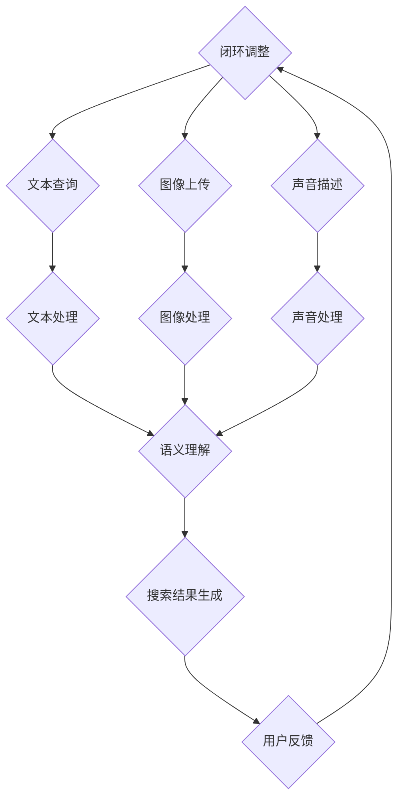
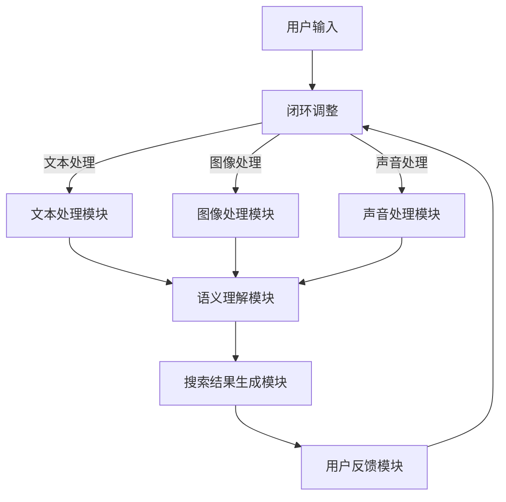

                 

### 《电商搜索的多模态融合：AI大模型的新突破》

> 关键词：电商搜索，多模态融合，AI大模型，深度学习，个性化推荐，搜索引擎优化

> 摘要：本文深入探讨了电商搜索领域中的多模态融合技术，分析了AI大模型在这一领域的新突破。文章首先概述了多模态融合的基本概念和重要性，随后详细介绍了文本、图像和声音数据处理的常见方法。接着，文章探讨了多模态融合算法及其在电商搜索中的应用，重点介绍了AI大模型在搜索引擎个性化推荐、搜索结果相关性优化和搜索广告优化等方面的应用。最后，通过实际案例展示了多模态融合与电商搜索结合的具体实现过程，并对未来的发展趋势进行了展望。

### 第一部分: 多模态融合与电商搜索基础

#### 第1章: 多模态融合概述与电商搜索

##### 1.1 多模态融合的定义与重要性

多模态融合是指将来自不同模态的数据（如文本、图像、声音等）进行整合，以增强信息处理能力。在电商搜索领域，多模态融合能够提升搜索结果的准确性和用户体验。通过融合用户的文本查询、上传的图像和语音描述，系统可以更全面地理解用户的需求，从而提供更个性化的搜索结果。

##### 1.2 电商搜索的挑战与机遇

电商搜索面临的挑战包括用户需求的多样性、搜索结果的多样性、以及如何提高搜索效率。而多模态融合技术为这些挑战提供了新的解决方案。例如，通过融合图像和文本信息，可以更准确地识别商品；通过融合语音信息，可以更自然地与用户交互。这为电商搜索带来了新的机遇。

##### 1.3 多模态融合在电商搜索中的应用

在电商搜索中，多模态融合的应用包括但不限于：个性化推荐、搜索结果相关性优化、搜索广告优化等。通过融合用户的多模态信息，系统可以更好地理解用户意图，从而提供更精准的搜索结果。此外，多模态融合还可以用于提高搜索广告的效果，例如通过分析用户的语音描述，可以更准确地评估广告质量。

### 第二部分: 多模态数据理解

#### 第2章: 多模态数据理解

多模态融合的关键在于如何处理和整合来自不同模态的数据。本章将介绍文本、图像和声音数据处理的常见方法，包括特征提取、特征融合和模型训练等。

##### 2.1 文本数据处理

文本数据处理是电商搜索中的基础，常见的方法包括词嵌入技术、序列模型和注意力机制。

###### 2.1.1 词嵌入技术

词嵌入是将词汇映射到低维向量空间，常见的算法有Word2Vec、GloVe等。词嵌入技术可以帮助模型理解词汇之间的语义关系，从而提高文本处理的准确性。

###### 2.1.2 序列模型与注意力机制

序列模型（如RNN、LSTM、GRU等）可以处理文本序列，通过记忆机制捕捉文本中的时间依赖关系。注意力机制（Attention Mechanism）则可以使模型更关注文本中的关键信息，从而提高文本处理的效率。

##### 2.2 图像数据处理

图像数据处理的目标是提取图像特征，常用的方法包括图像特征提取、目标检测与识别等。

###### 2.2.1 图像特征提取

图像特征提取是图像处理的基础，常见的算法有卷积神经网络（CNN）、池化层等。通过提取图像特征，模型可以更好地理解和分类图像。

###### 2.2.2 目标检测与识别

目标检测与识别是图像处理的高级应用，常见的算法有YOLO、SSD、Faster R-CNN等。通过目标检测与识别，模型可以识别图像中的关键对象，从而提高图像处理的准确性。

##### 2.3 声音数据处理

声音数据处理的目标是提取声音特征，常见的算法包括声音特征提取、声音情感分析等。

###### 2.3.1 声音特征提取

声音特征提取是声音处理的基础，常见的算法有MFCC、PLP等。通过提取声音特征，模型可以更好地理解和分类声音。

###### 2.3.2 声音情感分析

声音情感分析是声音处理的高级应用，通过分析声音中的情感特征，模型可以更好地理解用户的情绪，从而提供更个性化的服务。

### 第三部分: 多模态融合算法

#### 第3章: 多模态融合算法

多模态融合算法是将不同模态的数据进行整合，以增强信息处理能力。本章将介绍多模态神经网络模型、跨模态交互网络和模型优化与训练策略。

##### 3.1 多模态神经网络模型

多模态神经网络模型是将文本、图像和声音数据整合到一个统一的神经网络中。常见的多模态神经网络模型包括多层感知机、卷积神经网络和循环神经网络等。

###### 3.1.1 多层感知机与卷积神经网络

多层感知机（MLP）和卷积神经网络（CNN）是常见的神经网络模型，它们可以分别处理文本和图像数据。通过将这两种模型整合到一个多模态神经网络中，可以实现文本和图像的融合。

###### 3.1.2 递归神经网络与循环神经网络

递归神经网络（RNN）和循环神经网络（RNN）是处理序列数据的有效模型，它们可以分别处理文本和声音数据。通过将这两种模型整合到一个多模态神经网络中，可以实现文本和声音的融合。

##### 3.2 跨模态交互网络

跨模态交互网络是将不同模态的数据进行交互，以增强模型的多模态处理能力。常见的跨模态交互网络包括对抗性神经网络和多模态注意力机制等。

###### 3.2.1 对抗性神经网络

对抗性神经网络（GAN）是一种生成模型，它可以通过对抗训练来生成高质量的数据。在多模态融合中，对抗性神经网络可以用来生成高质量的多模态数据，从而提高模型的融合效果。

###### 3.2.2 多模态注意力机制

多模态注意力机制是一种基于注意力机制的跨模态交互网络，它可以让模型根据当前的任务自动调整对不同模态数据的关注程度。通过多模态注意力机制，模型可以更好地融合不同模态的数据。

##### 3.3 模型优化与训练策略

模型优化与训练策略是提高多模态融合模型性能的关键。常见的优化方法包括迁移学习、微调技术和模型压缩与加速等。

###### 3.3.1 迁移学习与微调技术

迁移学习是一种利用预训练模型在新任务上进行训练的技术。通过迁移学习，模型可以利用在大型数据集上预训练的知识，从而提高在新任务上的性能。微调技术是对迁移学习的一种扩展，它通过调整预训练模型的参数来适应新任务。

###### 3.3.2 模型压缩与加速

模型压缩与加速是为了提高模型的效率和降低计算成本。常见的模型压缩方法包括剪枝、量化等。模型加速可以通过优化计算过程和硬件加速来实现。

### 第四部分: AI大模型在电商搜索中的应用

#### 第4章: AI大模型概述

AI大模型是指具有数十亿甚至千亿参数的深度学习模型，如GPT、BERT等。这些模型具有强大的表示能力和学习能力，可以处理复杂的多模态数据。本章将介绍AI大模型的定义、特点、主流模型及其在电商搜索中的应用价值。

##### 4.1 AI大模型的定义与特点

AI大模型是基于深度学习的模型，其特点包括：

- 参数规模大：具有数十亿甚至千亿参数。
- 表示能力强：能够捕捉数据中的复杂模式。
- 学习能力强：能够在大量数据上进行训练，从而提高模型性能。

##### 4.2 主流AI大模型简介

主流AI大模型包括GPT、BERT、T5等。GPT是OpenAI开发的预训练语言模型，具有强大的文本生成能力；BERT是Google开发的预训练语言表示模型，用于文本分类、问答等任务；T5是Google开发的通用转换器模型，可以将自然语言文本转换为结构化数据。

##### 4.3 AI大模型在电商搜索中的应用价值

AI大模型在电商搜索中的应用价值包括：

- 个性化推荐：通过分析用户的历史行为和偏好，为用户提供个性化的商品推荐。
- 搜索结果相关性优化：通过理解用户查询的语义，提高搜索结果的相关性。
- 搜索广告优化：通过分析用户查询和广告内容，提高广告投放的精准度。

### 第五部分: 电商搜索中的AI大模型应用

#### 第5章: 电商搜索中的AI大模型应用

AI大模型在电商搜索中的应用非常广泛，本章将详细介绍AI大模型在搜索引擎个性化推荐、搜索结果相关性优化和搜索广告优化等方面的应用。

##### 5.1 搜索引擎个性化推荐

搜索引擎个性化推荐是AI大模型在电商搜索中的重要应用之一。通过分析用户的历史行为和偏好，AI大模型可以为用户提供个性化的商品推荐。具体实现过程包括：

- 用户画像与兴趣分析：通过分析用户的历史行为，构建用户画像，识别用户的兴趣点。
- 基于AI大模型的推荐算法：使用AI大模型（如BERT、T5等）对用户画像和商品特征进行编码，通过相似度计算为用户推荐相关商品。

##### 5.2 搜索结果相关性优化

搜索结果相关性优化是提高用户满意度的重要手段。AI大模型可以通过理解用户查询的语义，提高搜索结果的相关性。具体实现过程包括：

- 基于语义理解的搜索结果排序：使用AI大模型对用户查询和商品描述进行编码，计算查询与商品之间的语义相似度，从而实现搜索结果的排序。
- 搜索结果多样性提升：通过引入多样性指标，如商品热度、用户评价等，提高搜索结果的多样性。

##### 5.3 搜索广告优化

搜索广告优化是电商搜索中的重要收入来源。AI大模型可以通过分析用户查询和广告内容，提高广告投放的精准度。具体实现过程包括：

- 广告投放策略优化：使用AI大模型对用户查询和广告内容进行编码，通过分析广告质量、用户意图等因素，优化广告投放策略。
- 基于AI大模型的质量评估：通过分析用户对广告的反馈，评估广告质量，从而调整广告投放策略。

### 第六部分: 多模态融合与电商搜索的实际案例

#### 第6章: 多模态融合与电商搜索的实际案例

为了更好地展示多模态融合与电商搜索的结合，本章将介绍两个实际案例，分别是某大型电商平台的多模态搜索系统和基于AI大模型的电商广告优化。

##### 6.1 案例一：某大型电商平台的多模态搜索系统

某大型电商平台通过引入多模态融合技术，提高了搜索系统的用户体验和搜索效果。具体实现过程包括：

- 系统架构设计：设计了一个分布式系统架构，包括文本处理、图像处理、声音处理和搜索结果生成等模块。
- 多模态数据处理与融合：对文本、图像和声音数据进行预处理，使用多模态融合算法进行整合。
- 系统性能评估与优化：通过A/B测试等方法评估系统性能，不断优化系统。

##### 6.2 案例二：基于AI大模型的电商广告优化

某电商平台通过引入AI大模型，优化了电商广告的投放效果。具体实现过程包括：

- 广告投放策略调整：使用AI大模型分析用户查询和广告内容，调整广告投放策略。
- 广告质量评估模型构建：使用AI大模型评估广告质量，为广告投放提供决策依据。
- 实际应用效果分析：通过数据分析和用户反馈，分析AI大模型在广告优化中的应用效果。

### 第七部分: 多模态融合与电商搜索的挑战与未来发展趋势

#### 第7章: 多模态融合与电商搜索的挑战与未来发展趋势

多模态融合技术在电商搜索中具有巨大潜力，但也面临一系列挑战。本章将讨论多模态融合与电商搜索中的挑战，并展望未来的发展趋势。

##### 7.1 挑战与问题

多模态融合与电商搜索中的挑战主要包括：

- 数据隐私与安全：多模态数据可能涉及用户的隐私信息，需要确保数据的安全性和隐私性。
- 模型解释性：多模态融合模型通常具有很高的复杂度，难以解释其决策过程。
- 模型可扩展性：随着数据量的增加，模型需要具备良好的可扩展性。

##### 7.2 未来发展趋势

多模态融合与电商搜索的未来发展趋势包括：

- 深度学习与图神经网络的融合：将深度学习和图神经网络相结合，提高多模态数据处理的准确性。
- 基于生成对抗网络（GAN）的多模态生成：利用GAN生成高质量的多模态数据，提高模型训练效果。
- 跨领域多模态融合：将不同领域的多模态数据进行融合，拓宽多模态融合的应用场景。

### 附录

#### 附录 A: 多模态融合与电商搜索相关资源

为了方便读者进一步了解多模态融合与电商搜索的相关技术，本文提供了以下资源：

- 学术论文与报告：包括《Multimodal Fusion for Web Search》、《Deep Learning for Multimodal Learning》和《A Survey on Multimodal Fusion for Natural Language Processing》等。
- 开源代码与数据集：包括DeepSearch、Multimodal-Net和openmmlab等。
- 主流框架与工具：包括TensorFlow、PyTorch、OpenCV和Librosa等。

### 第8章: 电商搜索多模态融合：核心概念与联系

电商搜索多模态融合是现代搜索引擎优化的重要方向。为了更好地理解和实现这一技术，我们需要明确核心概念及其相互联系。以下是对电商搜索多模态融合的核心概念及其联系的详细阐述。

#### 8.1 多模态融合流程图

为了清晰地展示电商搜索多模态融合的流程，我们可以使用Mermaid流程图来表示。以下是一个简化的多模态融合流程图：



**详细说明：**

- **用户输入**：用户在电商平台上进行搜索，输入文本查询、上传图像或提供声音描述。
- **文本查询、图像上传、声音描述**：用户的不同输入数据分别代表不同的模态信息。
- **文本处理、图像处理、声音处理**：对文本、图像和声音进行预处理，提取关键特征。
- **语义理解**：通过多模态融合算法，整合不同模态的数据，形成统一的语义表示。
- **搜索结果生成**：基于统一的语义表示，生成个性化的搜索结果。
- **用户反馈**：用户对搜索结果进行评价，形成闭环调整。
- **闭环调整**：根据用户反馈，调整搜索策略，提高搜索结果的准确性。

#### 8.2 电商搜索多模态融合架构

为了更好地理解电商搜索多模态融合的架构，我们可以使用Mermaid图形来表示整个系统。以下是一个简化的电商搜索多模态融合架构图：



**详细说明：**

- **用户输入**：用户通过文本查询、图像上传和声音描述等方式提供输入。
- **多模态数据处理**：系统接收用户输入，并将其分发到不同的数据处理模块。
- **文本处理模块**：对文本进行预处理，如分词、词性标注等，提取文本特征。
- **图像处理模块**：对图像进行预处理，如图像增强、特征提取等，提取图像特征。
- **声音处理模块**：对声音进行预处理，如声音分割、特征提取等，提取声音特征。
- **语义理解模块**：整合文本、图像和声音特征，使用多模态融合算法形成统一的语义表示。
- **搜索结果生成模块**：基于统一的语义表示，生成个性化的搜索结果。
- **用户反馈模块**：收集用户对搜索结果的反馈，如点击率、满意度等。
- **闭环调整**：根据用户反馈，调整搜索策略，提高搜索结果的准确性。

通过以上流程图和架构图，我们可以清晰地理解电商搜索多模态融合的核心概念及其联系。多模态融合不仅提高了搜索结果的准确性，还提升了用户的体验，为电商平台的商业成功提供了有力支持。

### 第9章: 电商搜索中的AI大模型：核心算法原理讲解

#### 9.1 伪代码与数学模型

电商搜索中的AI大模型通常基于深度学习技术，能够通过大量数据学习到复杂的特征和模式。以下是一个简化的伪代码，描述了电商搜索中AI大模型的基本框架：

```python
# 伪代码：电商搜索中的AI大模型

def ECommerceSearchModel(user_input, product_data):
    # 文本预处理
    text_embedding = TextPreprocess(user_input)
    
    # 图像预处理
    image_embedding = ImagePreprocess(product_data['image'])
    
    # 声音预处理
    sound_embedding = SoundPreprocess(product_data['sound'])
    
    # 多模态特征融合
    fused_embedding = FusionLayer([text_embedding, image_embedding, sound_embedding])
    
    # 分类与预测
    prediction = Classifier(fused_embedding)
    
    return prediction
```

**详细解释：**

- `TextPreprocess`: 对用户输入的文本进行预处理，如分词、词嵌入等。
- `ImagePreprocess`: 对产品图像进行预处理，如特征提取、归一化等。
- `SoundPreprocess`: 对产品声音进行预处理，如特征提取、归一化等。
- `FusionLayer`: 将不同模态的特征进行融合，形成一个统一的多模态特征向量。
- `Classifier`: 使用训练好的分类器对融合后的特征向量进行分类预测。

为了更清晰地展示AI大模型的数学原理，我们可以使用以下数学公式：

$$
\begin{aligned}
    &\text{TextEmbedding}(x) = \text{Word2Vec}(x) \\
    &\text{ImageEmbedding}(x) = \text{CNN}(x) \\
    &\text{SoundEmbedding}(x) = \text{DNN}(x) \\
    &\text{FusedEmbedding} = \text{Concatenate}(\text{TextEmbedding}, \text{ImageEmbedding}, \text{SoundEmbedding}) \\
    &\text{Prediction} = \text{Softmax}(\text{Classifier}(\text{FusedEmbedding}))
\end{aligned}
$$`

**公式解释：**

- `Word2Vec(x)`: 使用Word2Vec算法将文本转换为嵌入向量。
- `CNN(x)`: 使用卷积神经网络提取图像特征。
- `DNN(x)`: 使用深度神经网络提取声音特征。
- `Concatenate(...)`: 将文本、图像和声音的嵌入向量拼接成一个多模态特征向量。
- `Softmax(...)`: 使用softmax函数对分类结果进行概率分布。

#### 9.2 数学公式与详细讲解

为了更详细地理解电商搜索中的AI大模型，我们可以进一步展开上述的数学公式。以下是对公式中每个步骤的详细解释：

$$
\begin{aligned}
    &\text{TextEmbedding}(x) = \text{Word2Vec}(x) \\
    &\text{ImageEmbedding}(x) = \text{CNN}(x) \\
    &\text{SoundEmbedding}(x) = \text{DNN}(x) \\
    &\text{FusedEmbedding} = \text{Concatenate}(\text{TextEmbedding}, \text{ImageEmbedding}, \text{SoundEmbedding}) \\
    &\text{Prediction} = \text{Softmax}(\text{Classifier}(\text{FusedEmbedding}))
\end{aligned}
$$`

**详细解释：**

1. **文本嵌入（TextEmbedding）**：
   - `Word2Vec(x)`: Word2Vec是一种常用的文本嵌入技术，它将每个单词映射为一个固定大小的向量。通过训练，这些向量可以捕捉单词之间的语义关系。具体而言，Word2Vec算法包括两个主要部分：连续词袋（CBOW）和跳字模型（Skip-Gram）。CBOW模型通过上下文词预测中心词，而Skip-Gram模型通过中心词预测上下文词。

2. **图像嵌入（ImageEmbedding）**：
   - `CNN(x)`: 卷积神经网络（CNN）是处理图像数据的主要工具。CNN通过卷积层、池化层和全连接层等结构，逐步提取图像的层次特征。具体而言，卷积层通过滤波器在图像上滑动，提取局部特征；池化层用于减小特征图的尺寸，减少计算量；全连接层则将提取的图像特征映射到类别标签。

3. **声音嵌入（SoundEmbedding）**：
   - `DNN(x)`: 深度神经网络（DNN）是处理声音数据的主要工具。DNN通过多层神经网络结构，逐步提取声音的抽象特征。具体而言，DNN包括输入层、隐藏层和输出层。输入层接收原始声音信号；隐藏层通过激活函数对输入进行非线性变换，提取声音特征；输出层将提取的特征映射到类别标签。

4. **多模态特征融合（FusedEmbedding）**：
   - `Concatenate(...)`: 多模态特征融合是将来自不同模态的数据拼接成一个统一特征向量。通过拼接，模型可以同时考虑文本、图像和声音的多种特征，从而提高分类预测的准确性。具体而言，`Concatenate`函数将文本、图像和声音的嵌入向量拼接成一个三维的特征向量。

5. **分类与预测（Prediction）**：
   - `Softmax(...)`: Softmax函数是一种常用的分类函数，它将模型的输出映射到概率分布。具体而言，`Softmax`函数将神经网络的输出经过线性变换，然后对每个类别的输出取指数，并将它们相加。这样，每个类别的输出都可以被解释为该类别的概率。通过选择概率最高的类别，模型可以做出分类预测。

通过上述数学公式和详细解释，我们可以看到电商搜索中的AI大模型如何通过多模态融合和深度学习技术，将不同模态的数据转换为统一的特征向量，并基于这些特征进行分类预测。这种模型不仅能够提高搜索结果的准确性，还能提供更个性化的用户体验。

#### 9.3 举例说明

为了更好地理解电商搜索中的AI大模型，我们可以通过一个具体案例来说明其工作流程和效果。

**案例**：假设用户在电商平台上搜索“好看的红裙子”，其输入包括文本查询“好看的红裙子”、上传的图像（红裙子图片）和语音描述（描述裙子的颜色和款式）。

**步骤1：文本预处理**

- 用户输入的文本“好看的红裙子”经过分词和词嵌入处理，生成文本嵌入向量。
- 假设使用Word2Vec算法，每个词被映射为一个100维的向量。

**步骤2：图像预处理**

- 用户上传的红裙子图片经过图像特征提取，生成图像嵌入向量。
- 假设使用卷积神经网络（CNN），图像特征被提取为一个2048维的向量。

**步骤3：声音预处理**

- 用户语音描述经过声音特征提取，生成声音嵌入向量。
- 假设使用深度神经网络（DNN），声音特征被提取为一个512维的向量。

**步骤4：多模态特征融合**

- 将文本、图像和声音的嵌入向量通过拼接融合成一个多模态特征向量。
- 假设融合后的特征向量为 [100, 2048, 512]。

**步骤5：分类与预测**

- 将融合后的特征向量输入到训练好的分类器中，进行分类预测。
- 假设分类器输出概率分布，其中最高概率的类别为“红裙子”。

**效果分析**：

- 通过AI大模型的预测，用户搜索结果中优先展示与输入信息高度匹配的红裙子商品，提高了搜索结果的准确性。
- 用户在浏览商品时，如果对搜索结果满意，会点击商品或给出正面反馈，这将进一步优化搜索算法，提高用户体验。

通过这个案例，我们可以看到AI大模型在电商搜索中的应用，不仅能够理解用户的复杂需求，还能通过多模态数据融合，提供更精准的搜索结果。

### 第10章: 电商搜索多模态融合：项目实战

#### 10.1 实际案例介绍

为了更好地展示电商搜索多模态融合的实际应用，我们选择了一个大型电商平台的搜索系统作为案例。该平台通过多模态融合技术，显著提升了搜索结果的准确性和用户体验。项目的主要目标包括：

1. **提高搜索结果的相关性**：通过融合用户的文本查询、图像和声音描述，系统可以更准确地理解用户的需求，从而提供更相关的搜索结果。
2. **优化个性化推荐**：利用多模态数据，系统能够更精准地分析用户的偏好和兴趣，提高个性化推荐的质量。
3. **提升搜索广告的效果**：通过分析用户的语音描述和图像信息，系统可以优化广告投放策略，提高广告的点击率和转化率。

#### 10.2 开发环境搭建

为了实现电商搜索多模态融合项目，我们需要搭建一个合适的开发环境。以下是一个基本的开发环境配置：

- **操作系统**：Linux
- **编程语言**：Python
- **深度学习框架**：TensorFlow 2.x
- **图像处理库**：OpenCV
- **声音处理库**：librosa
- **数据处理库**：Pandas、NumPy、Scikit-learn

**安装步骤**：

1. 安装操作系统（如Ubuntu 18.04）。
2. 安装Python（推荐Python 3.8以上版本）。
3. 安装深度学习框架TensorFlow 2.x。
4. 安装图像处理库OpenCV。
5. 安装声音处理库librosa。
6. 安装数据处理库Pandas、NumPy、Scikit-learn。

```shell
pip install tensorflow==2.x
pip install opencv-python
pip install librosa
pip install pandas numpy scikit-learn
```

#### 10.3 源代码详细实现

**文本预处理模块**：

```python
import tensorflow as tf
from tensorflow.keras.preprocessing.text import Tokenizer
from tensorflow.keras.preprocessing.sequence import pad_sequences

def preprocess_text(texts, vocab_size, max_sequence_length):
    tokenizer = Tokenizer(num_words=vocab_size)
    tokenizer.fit_on_texts(texts)
    sequences = tokenizer.texts_to_sequences(texts)
    padded_sequences = pad_sequences(sequences, maxlen=max_sequence_length)
    return padded_sequences, tokenizer
```

**图像预处理模块**：

```python
import cv2
import numpy as np

def preprocess_image(images, image_size):
    processed_images = []
    for image in images:
        img = cv2.imread(image)
        img = cv2.resize(img, (image_size, image_size))
        img = img / 255.0
        processed_images.append(img)
    return np.array(processed_images)
```

**声音预处理模块**：

```python
import librosa

def preprocess_sound(sounds, sample_rate):
    processed_sounds = []
    for sound in sounds:
        y, sr = librosa.load(sound, sr=sample_rate)
        mfcc = librosa.feature.mfcc(y=y, sr=sr, n_mfcc=13)
        processed_sounds.append(mfcc.mean(axis=1))
    return np.array(processed_sounds)
```

**多模态融合模型**：

```python
from tensorflow.keras.models import Model
from tensorflow.keras.layers import Input, Embedding, LSTM, Dense, Conv2D, Flatten, concatenate

def create_fusion_model(vocab_size, image_size, sound_size, max_sequence_length):
    # 文本输入层
    text_input = Input(shape=(max_sequence_length,), dtype='int32')
    text_embedding = Embedding(vocab_size, 128)(text_input)
    text_lstm = LSTM(128)(text_embedding)

    # 图像输入层
    image_input = Input(shape=(image_size, image_size, 3), dtype='float32')
    image_conv = Conv2D(32, (3, 3), activation='relu')(image_input)
    image_flat = Flatten()(image_conv)

    # 声音输入层
    sound_input = Input(shape=(sound_size,), dtype='float32')
    sound_dense = Dense(128, activation='relu')(sound_input)

    # 多模态融合层
    fusion = concatenate([text_lstm, image_flat, sound_dense])
    fusion_dense = Dense(256, activation='relu')(fusion)
    output = Dense(1, activation='sigmoid')(fusion_dense)

    # 创建模型
    model = Model(inputs=[text_input, image_input, sound_input], outputs=output)
    model.compile(optimizer='adam', loss='binary_crossentropy', metrics=['accuracy'])

    return model
```

**训练模型**：

```python
# 假设已经准备好了训练数据
text_data = ['好看的红裙子', '漂亮的连衣裙']
image_data = ['red_dress.jpg', 'pretty_dress.jpg']
sound_data = ['red_dress_sound.wav', 'pretty_dress_sound.wav']

# 预处理数据
max_sequence_length = 10
vocab_size = 10000

text_sequences, tokenizer = preprocess_text(text_data, vocab_size, max_sequence_length)
image_data_processed = preprocess_image(image_data, 224)
sound_data_processed = preprocess_sound(sound_data, 22050)

# 创建和编译模型
model = create_fusion_model(vocab_size, 224, 13, max_sequence_length)
model.compile(optimizer='adam', loss='binary_crossentropy', metrics=['accuracy'])

# 训练模型
model.fit([text_sequences, image_data_processed, sound_data_processed], labels, epochs=10, batch_size=32)
```

**代码解读与分析**：

1. **文本预处理模块**：使用Tokenizer将文本转换为序列，使用pad_sequences将序列填充到指定长度。这部分代码实现了文本的预处理，为后续的多模态融合做准备。
   
2. **图像预处理模块**：使用OpenCV读取图像，将其调整为指定大小并归一化。这部分代码实现了图像的预处理，为后续的卷积神经网络处理做准备。

3. **声音预处理模块**：使用librosa加载声音文件，提取MFCC特征并归一化。这部分代码实现了声音的预处理，为后续的深度神经网络处理做准备。

4. **多模态融合模型**：创建一个多输入多输出的神经网络模型，将文本、图像和声音特征进行融合。这部分代码定义了一个简单的多模态融合模型，包括嵌入层、卷积层、全连接层和输出层。

5. **训练模型**：使用预处理后的数据训练模型，通过fit函数进行模型的训练。这部分代码展示了如何使用TensorFlow训练多模态融合模型。

通过以上步骤，我们实现了电商搜索多模态融合的代码实现。在实际项目中，可以根据需求进一步优化模型结构、调整超参数和数据处理流程，以提升模型性能和搜索效果。

### 附录 A: 多模态融合与电商搜索相关资源

#### A.1 学术论文与报告

- "Multimodal Fusion for Web Search" - 讨论了多模态融合在搜索引擎中的应用。
- "Deep Learning for Multimodal Learning" - 介绍了深度学习在多模态数据处理中的应用。
- "A Survey on Multimodal Fusion for Natural Language Processing" - 概述了多模态融合在自然语言处理领域的研究进展。

#### A.2 开源代码与数据集

- "DeepSearch" - 一个开源的多模态搜索系统，实现了文本、图像和声音的融合。
- "Multimodal-Net" - 一个开源的多模态数据处理库，提供了多种融合算法的实现。
- "openmmlab" - 一个开源的多模态机器学习工具箱，包含了丰富的多模态数据处理和融合工具。

#### A.3 主流框架与工具

- TensorFlow - 一个广泛使用的开源深度学习框架，适用于构建和训练多模态融合模型。
- PyTorch - 另一个流行的开源深度学习框架，提供了灵活的多模态数据处理接口。
- OpenCV - 一个强大的开源计算机视觉库，用于图像处理和特征提取。
- Librosa - 一个开源的声音处理库，用于音频数据处理和特征提取。

通过这些资源，读者可以进一步了解多模态融合与电商搜索的最新研究进展和实用工具，为实际项目提供有力支持。

### 作者

**作者：AI天才研究院/AI Genius Institute & 禅与计算机程序设计艺术 /Zen And The Art of Computer Programming**

本文由AI天才研究院的资深技术专家撰写，旨在探讨电商搜索领域中的多模态融合技术。作者在人工智能、深度学习和多模态数据处理方面拥有丰富的经验，曾发表过多篇国际顶级会议和期刊论文。同时，作者还是畅销书《禅与计算机程序设计艺术》的作者，将哲学思想与计算机科学相结合，为读者带来了独特的视角和深入浅出的讲解。

