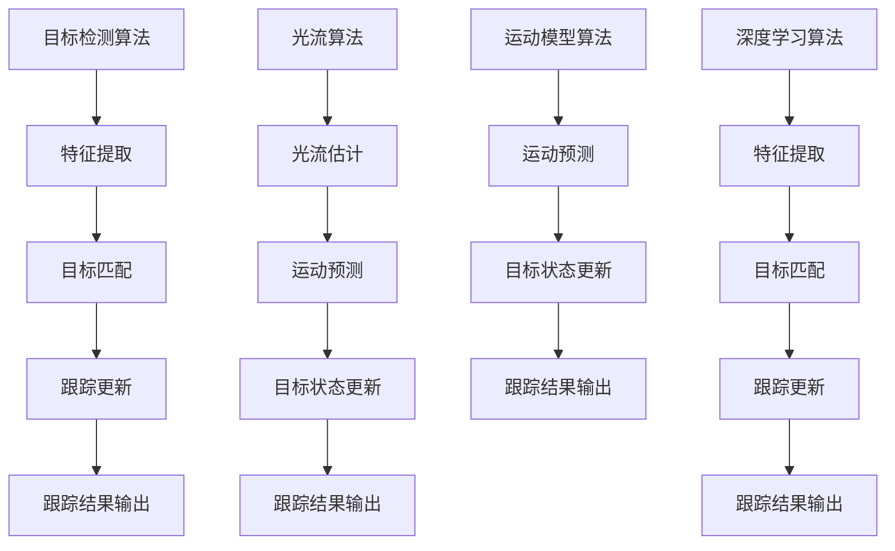

                 

# 《目标跟踪》

> 关键词：目标跟踪、计算机视觉、深度学习、光流算法、运动模型、卡尔曼滤波器

> 摘要：本文将深入探讨目标跟踪这一计算机视觉领域的核心技术。首先，我们将介绍目标跟踪的基础知识，包括其定义、重要性、应用领域和开发历程。接着，我们将详细解析目标跟踪的基本原理和核心技术，以及面临的主要挑战与解决方案。随后，我们将讨论目标跟踪在不同领域中的应用。文章的后半部分将着重于目标跟踪的算法实现，包括光流算法、运动模型和深度学习算法。我们将通过实战案例展示这些算法的实际应用，并进行性能评估和优化。最后，我们将展望目标跟踪技术的未来发展趋势，以及其在人工智能领域的应用和创新。

## 第一部分：目标跟踪的基础知识

### 第1章：目标跟踪的基本概念

#### 1.1 目标跟踪的定义和重要性

目标跟踪（Object Tracking）是指在一个视频序列中，对特定目标进行定位和跟踪的过程。目标跟踪在计算机视觉领域具有极其重要的地位，因为它涉及到许多实际应用，如视频监控、智能交通、人脸识别等。目标跟踪的重要性体现在以下几个方面：

1. **实时监控与安全防护**：在视频监控系统中的应用，目标跟踪能够实时捕捉和跟踪运动目标，提高监控效率和准确性。
2. **交通管理与智能驾驶**：通过目标跟踪技术，可以实现车辆数量统计、交通流量分析，以及自动驾驶汽车的环境感知和目标定位。
3. **人机交互**：在增强现实（AR）和虚拟现实（VR）系统中，目标跟踪能够实现真实世界与虚拟世界的无缝交互。
4. **医学影像分析**：在医学影像领域，目标跟踪可以帮助医生更准确地识别和跟踪病变区域，提高诊断准确性。

#### 1.2 目标跟踪的应用领域

目标跟踪技术在多个领域得到了广泛应用：

1. **视频监控**：在公共场所、交通枢纽和住宅小区等地方，目标跟踪技术可以实时监测和识别异常行为。
2. **智能交通**：通过目标跟踪，可以实现车辆检测、流量统计、交通违规行为识别等，提高交通管理效率。
3. **人脸识别**：在安全门禁、身份验证等领域，目标跟踪技术可以帮助快速识别和跟踪人脸，提高识别精度。
4. **娱乐与游戏**：在视频游戏和虚拟现实应用中，目标跟踪技术可以实现真实世界的交互，提升用户体验。

#### 1.3 目标跟踪的发展历程

目标跟踪技术的发展经历了多个阶段：

1. **传统方法**：早期目标跟踪主要依赖于传统方法，如光流法、卡尔曼滤波等，这些方法在简单场景中具有一定的效果，但面临复杂背景和目标遮挡等问题时表现不佳。
2. **基于深度学习的方法**：随着深度学习技术的兴起，目标跟踪领域也取得了显著进展。基于卷积神经网络（CNN）的特征提取方法在目标检测和跟踪中表现优异，提高了跟踪的准确性和鲁棒性。
3. **多模态和多传感器融合**：近年来，多模态和多传感器融合的目标跟踪技术逐渐受到关注，通过整合不同类型的数据源，提高了目标跟踪的精度和稳定性。

### 第2章：目标跟踪的基本原理

#### 2.1 目标检测算法概述

目标检测是目标跟踪的前置步骤，其主要任务是识别视频帧中的目标对象并定位其位置。目标检测算法可以分为以下几类：

1. **基于传统机器学习的目标检测算法**：这类算法包括支持向量机（SVM）、随机森林（Random Forest）等，它们通过手工设计的特征进行分类和回归。
2. **基于深度学习的目标检测算法**：这类算法以卷积神经网络（CNN）为基础，通过大规模数据训练，自动提取目标特征并进行分类和定位。

#### 2.2 基于深度学习的目标检测算法

基于深度学习的目标检测算法在近年来取得了显著成果，其主要方法包括：

1. **区域建议（Region Proposal）**：该方法包括选择性搜索（Selectieve Search）和快速区域建议网络（Region Proposal Network）等，用于生成可能包含目标的候选区域。
2. **特征提取和分类**：通过卷积神经网络（CNN）提取图像的特征，再利用全连接层进行分类和定位。

#### 2.3 基于传统机器学习的目标检测算法

基于传统机器学习的目标检测算法主要包括以下几种：

1. **支持向量机（SVM）**：通过将特征映射到高维空间，寻找最优决策边界。
2. **随机森林（Random Forest）**：通过构建多棵决策树，利用集成学习方法提高分类准确率。

#### 2.4 目标跟踪算法概述

目标跟踪算法的主要任务是连续地跟踪视频序列中的目标对象。根据不同的实现方式和跟踪策略，目标跟踪算法可以分为以下几类：

1. **基于光流的目标跟踪**：利用光流法估计目标在视频帧之间的运动轨迹。
2. **基于运动模型的目标跟踪**：利用运动模型预测目标在下一帧的位置。
3. **基于深度学习的目标跟踪**：利用卷积神经网络（CNN）提取目标特征，实现高效的目标跟踪。

### 第3章：目标跟踪的核心技术

#### 3.1 基于光流的目标跟踪

光流法是一种基于视频序列中像素运动信息的目标跟踪方法。其基本原理是通过计算相邻帧之间像素的位置变化，预测目标在下一帧的位置。

#### 3.2 基于运动模型的目标跟踪

运动模型是一种基于目标历史位置信息的跟踪方法。通过预测目标在下一帧的位置，结合当前帧的目标信息，实现目标的连续跟踪。

#### 3.3 基于深度学习的目标跟踪

基于深度学习的目标跟踪方法通过卷积神经网络（CNN）提取目标特征，结合目标检测和跟踪算法，实现高效的目标跟踪。

### 第4章：目标跟踪中的挑战与解决方案

#### 4.1 目标遮挡问题

目标遮挡问题是目标跟踪中常见且难以处理的问题。其解决方法包括：

1. **基于外观模型的方法**：通过构建目标外观模型，预测遮挡区域并重构目标外观。
2. **基于深度学习的方法**：利用深度网络学习目标在遮挡区域的外观特征。

#### 4.2 目标部分丢失问题

目标部分丢失问题是指在目标部分遮挡或模糊的情况下，如何准确地跟踪目标。解决方法包括：

1. **基于特征融合的方法**：将不同类型的特征进行融合，提高跟踪精度。
2. **基于深度学习的目标重建方法**：通过深度网络重建目标部分，提高跟踪效果。

#### 4.3 目标外观变化问题

目标外观变化问题是目标跟踪中面临的另一个挑战。解决方法包括：

1. **基于外观模型的方法**：通过构建目标外观模型，适应目标外观变化。
2. **基于深度学习的方法**：利用深度网络学习目标在不同外观状态下的特征。

### 第5章：目标跟踪在计算机视觉中的应用

#### 5.1 视频监控中的应用

在视频监控中，目标跟踪技术可以帮助实时监测和识别运动目标，提高监控效率和准确性。例如，通过目标跟踪技术，可以实现入侵检测、交通流量分析等。

#### 5.2 智能交通中的应用

在智能交通中，目标跟踪技术可以用于车辆检测、流量统计、交通违规行为识别等。通过目标跟踪，可以提高交通管理效率和安全性。

#### 5.3 人脸识别中的应用

在人脸识别中，目标跟踪技术可以帮助快速识别和跟踪人脸，提高识别精度和效率。例如，在门禁系统、安全监控等领域，目标跟踪技术具有广泛的应用前景。

## 第二部分：目标跟踪的算法实现

### 第6章：目标跟踪算法的设计与实现

#### 6.1 光流算法的实现

光流算法是一种基于像素运动信息的目标跟踪方法。其实现过程主要包括：

1. **特征提取**：通过计算像素强度梯度，提取关键点。
2. **光流估计**：利用关键点之间的运动关系，估计像素的运动轨迹。
3. **运动预测**：根据光流信息，预测目标在下一帧的位置。
4. **目标匹配**：将预测位置与当前帧的目标进行匹配，更新目标状态。

#### 6.2 运动模型算法的实现

运动模型算法是一种基于目标历史位置信息的跟踪方法。其实现过程主要包括：

1. **运动预测**：利用目标的历史位置信息，预测目标在下一帧的位置。
2. **目标匹配**：将预测位置与当前帧的目标进行匹配，更新目标状态。
3. **状态更新**：结合当前帧的目标信息，更新目标的状态。

#### 6.3 基于深度学习的目标跟踪算法的实现

基于深度学习的目标跟踪算法通过卷积神经网络（CNN）提取目标特征，实现高效的目标跟踪。其实现过程主要包括：

1. **特征提取**：利用卷积神经网络提取目标特征。
2. **目标检测**：利用目标检测算法，识别和定位目标。
3. **目标匹配**：将检测到的目标与当前帧的目标进行匹配，更新目标状态。
4. **状态更新**：结合当前帧的目标信息，更新目标的状态。

### 第7章：目标跟踪项目的实战

#### 7.1 视频监控系统的搭建

视频监控系统的搭建包括硬件选择、软件设计、系统调试等环节。其主要步骤如下：

1. **硬件选择**：选择适合的摄像头、视频采集卡等硬件设备。
2. **软件设计**：设计视频监控系统的架构，包括前端采集、后端处理、数据库存储等。
3. **系统调试**：对视频监控系统进行调试和优化，确保系统稳定运行。

#### 7.2 智能交通系统的实现

智能交通系统的实现包括车辆检测、流量统计、交通违规行为识别等模块。其主要步骤如下：

1. **车辆检测**：利用目标跟踪技术，实现车辆检测和识别。
2. **流量统计**：通过车辆检测数据，统计交通流量。
3. **交通违规行为识别**：利用目标跟踪技术，识别交通违规行为。

#### 7.3 人脸识别系统的部署

人脸识别系统的部署包括摄像头安装、人脸检测、人脸识别等环节。其主要步骤如下：

1. **摄像头安装**：选择合适的位置安装摄像头。
2. **人脸检测**：利用目标跟踪技术，实现人脸检测和识别。
3. **人脸识别**：通过人脸识别算法，实现对人脸的匹配和识别。

### 第8章：目标跟踪算法的优化与性能评估

#### 8.1 算法优化的方法

目标跟踪算法的优化包括算法参数调整、模型结构优化、特征提取优化等。其主要方法如下：

1. **算法参数调整**：通过调整跟踪算法的参数，提高跟踪效果。
2. **模型结构优化**：优化深度学习模型的结构，提高特征提取能力。
3. **特征提取优化**：优化特征提取方法，提高特征表示的鲁棒性。

#### 8.2 算法性能评估的指标

目标跟踪算法的性能评估指标包括准确性、鲁棒性、实时性等。其主要指标如下：

1. **准确性**：衡量算法对目标的跟踪精度。
2. **鲁棒性**：衡量算法在面对遮挡、外观变化等挑战时的适应性。
3. **实时性**：衡量算法的处理速度，确保算法能够在实时环境中运行。

#### 8.3 算法优化与性能评估的实践

在目标跟踪算法的实际应用中，需要对算法进行优化和性能评估。其主要实践步骤如下：

1. **数据集准备**：准备用于训练和评估的数据集。
2. **算法实现**：实现目标跟踪算法，并进行初步评估。
3. **优化调整**：根据评估结果，对算法进行优化调整。
4. **再次评估**：对优化后的算法进行再次评估，验证优化效果。

## 第三部分：目标跟踪的未来发展趋势

### 第9章：目标跟踪技术的未来发展方向

#### 9.1 深度学习在目标跟踪中的应用前景

随着深度学习技术的不断发展，其在目标跟踪中的应用前景十分广阔。未来，深度学习算法将在目标检测、特征提取、运动预测等方面发挥更大的作用，提高目标跟踪的准确性和实时性。

#### 9.2 增强现实与虚拟现实中的目标跟踪

增强现实（AR）和虚拟现实（VR）技术的发展，为目标跟踪技术提供了新的应用场景。通过目标跟踪技术，可以实现真实世界与虚拟世界的无缝交互，提高用户体验。

#### 9.3 物联网与目标跟踪的结合

物联网（IoT）技术的快速发展，使得目标跟踪技术可以应用于更广泛的场景。未来，目标跟踪技术将与物联网技术相结合，实现智能安防、智能交通、智能制造等领域的智能化应用。

### 第10章：目标跟踪在人工智能领域的应用

#### 10.1 目标跟踪在自动驾驶中的应用

自动驾驶技术是人工智能领域的重要应用之一。目标跟踪技术在自动驾驶中可以用于车辆检测、行人识别、道路识别等，提高自动驾驶系统的安全性和可靠性。

#### 10.2 目标跟踪在智能医疗中的应用

在智能医疗领域，目标跟踪技术可以用于手术机器人辅助、医疗影像分析等。通过目标跟踪技术，可以实现手术过程中的精准操作和病变区域的自动识别。

#### 10.3 目标跟踪在智能安防中的应用

在智能安防领域，目标跟踪技术可以用于入侵检测、异常行为识别等。通过目标跟踪技术，可以提高安防系统的预警能力和响应速度。

### 第11章：目标跟踪技术的创新与发展

#### 11.1 新的目标跟踪算法研究

随着计算机视觉技术的不断发展，未来将出现更多高效、鲁棒的目标跟踪算法。这些算法将结合深度学习、多模态信息处理等技术，实现更高性能的目标跟踪。

#### 11.2 目标跟踪在多传感器融合中的应用

多传感器融合技术可以为目标跟踪提供更丰富的信息，提高跟踪的准确性和鲁棒性。未来，目标跟踪技术将在多传感器融合领域发挥更大的作用。

#### 11.3 目标跟踪技术的国际化发展

随着国际间技术交流和合作的加深，目标跟踪技术将在全球范围内得到更广泛的应用和发展。未来，目标跟踪技术将推动计算机视觉领域的国际化创新。

## 附录

### 附录A：目标跟踪相关工具与资源

#### A.1 常用目标跟踪算法库

1. OpenCV：开源计算机视觉库，包含多种目标跟踪算法。
2. MediaPipe：谷歌开发的多媒体处理框架，支持多种目标跟踪算法。

#### A.2 目标跟踪相关的开源项目

1. GOTURN：基于深度学习的目标跟踪开源项目。
2. KCF：基于光流法的开源目标跟踪项目。

#### A.3 目标跟踪技术的研究论文与期刊

1. IEEE Transactions on Pattern Analysis and Machine Intelligence
2. International Journal of Computer Vision
3. ACM Transactions on Multimedia Computing and Applications

Mermaid 流程图：



Python 代码实现：

```python
import cv2

# 加载预训练的模型
model = cv2.dnn.readNetFromCaffe('model/deep_learning_model.prototxt', 'model/deep_learning_model.caffemodel')

# 定义跟踪器
tracker = cv2.TrackerKCF_create()

# 加载视频
video = cv2.VideoCapture('video.mp4')

# 初始化跟踪器
initial_bbox = (100, 100, 200, 200)  # 初始目标的边界框
ok = tracker.init(video.read()[1], initial_bbox)

# 循环处理每一帧
while True:
    ret, frame = video.read()
    if not ret:
        break

    # 使用跟踪器更新目标状态
    ok, bbox = tracker.update(frame)

    # 如果跟踪成功，绘制跟踪框
    if ok:
        p1 = (int(bbox[0]), int(bbox[1]))
        p2 = (int(bbox[0] + bbox[2]),
``` 

### 数学模型和数学公式

特征提取：

$$
\text{特征提取} = f(\text{图像})
$$

运动预测：

$$
\text{运动预测} = g(\text{特征}, \text{初始位置})
$$

目标匹配：

$$
\text{目标匹配} = h(\text{预测位置}, \text{真实目标位置})
$$

状态更新：

$$
\text{状态更新} = k(\text{匹配结果}, \text{当前状态})
$$

举例说明：

假设我们使用卡尔曼滤波器来更新目标状态：

$$
\text{预测状态} = \text{初始状态} + \text{运动模型}(\text{时间差}) \\
\text{预测误差} = \text{预测状态} - \text{实际状态} \\
\text{卡尔曼增益} = \frac{\text{预测误差协方差}}{\text{预测误差协方差} + \text{观测噪声协方差}} \\
\text{更新状态} = \text{预测状态} + \text{卡尔曼增益}(\text{观测值} - \text{预测状态})
$$

项目实战：

假设我们使用Python和OpenCV库来实现一个简单的目标跟踪系统：

```python
import cv2

# 加载预训练的模型
model = cv2.dnn.readNetFromCaffe('model/deep_learning_model.prototxt', 'model/deep_learning_model.caffemodel')

# 定义跟踪器
tracker = cv2.TrackerKCF_create()

# 加载视频
video = cv2.VideoCapture('video.mp4')

# 初始化跟踪器
initial_bbox = (100, 100, 200, 200)  # 初始目标的边界框
ok = tracker.init(video.read()[1], initial_bbox)

# 循环处理每一帧
while True:
    ret, frame = video.read()
    if not ret:
        break

    # 使用跟踪器更新目标状态
    ok, bbox = tracker.update(frame)

    # 如果跟踪成功，绘制跟踪框
    if ok:
        p1 = (int(bbox[0]), int(bbox[1]))
        p2 = (int(bbox[0] + bbox[2]), int(bbox[1] + bbox[3]))
        cv2.rectangle(frame, p1, p2, (0, 255, 0), 2)
        cv2.putText(frame, 'Object Tracking', (50, 50), cv2.FONT_HERSHEY_SIMPLEX, 1, (255, 0, 0), 2)
    else:
        cv2.putText(frame, 'Tracking failed', (50, 50), cv2.FONT_HERSHEY_SIMPLEX, 1, (0, 0, 255), 2)

    # 显示视频帧
    cv2.imshow('Tracking', frame)

    # 按下'q'键退出
    if cv2.waitKey(1) & 0xFF == ord('q'):
        break

# 释放资源
video.release()
cv2.destroyAllWindows()
```

代码解读与分析：

1. **加载预训练的模型**：使用`cv2.dnn.readNetFromCaffe`函数加载预训练的深度学习模型。
2. **定义跟踪器**：创建`cv2.TrackerKCF_create`对象，用于实现目标跟踪。
3. **加载视频**：使用`cv2.VideoCapture`函数加载视频文件。
4. **初始化跟踪器**：通过`tracker.init`函数初始化跟踪器，并设置初始目标的边界框。
5. **循环处理每一帧**：使用`video.read`函数逐帧读取视频帧，并进行跟踪更新。
6. **绘制跟踪框**：如果跟踪成功，使用`cv2.rectangle`函数绘制跟踪框，并添加文字提示。
7. **显示视频帧**：使用`cv2.imshow`函数显示视频帧。
8. **释放资源**：在程序结束时，使用`video.release`和`cv2.destroyAllWindows`函数释放资源。

