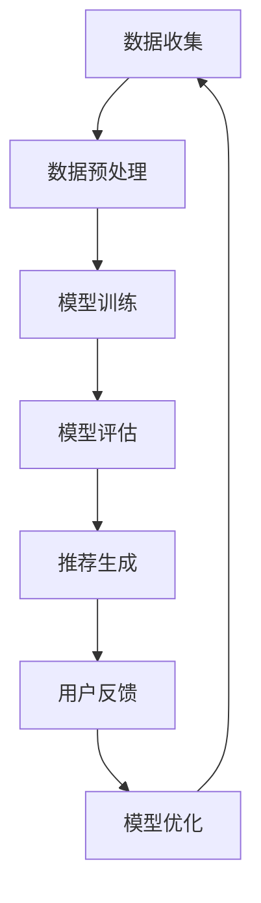
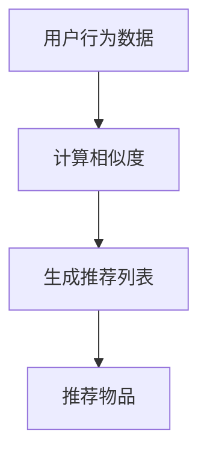
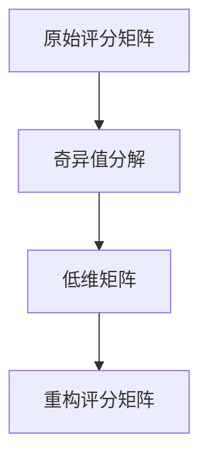

                 

# 文章标题：直接将LLM作为推荐系统的建模范式

> 关键词：语言模型（LLM），推荐系统，协同过滤，矩阵分解，构建方法，优化策略，实战案例

> 摘要：本文将探讨如何将语言模型（LLM）直接应用于推荐系统的构建，通过对LLM的基本概念、优势、架构设计、预处理、评分预测、优化策略的详细分析，以及实际案例的解析，为开发者提供实用的技术指导。

## 目录大纲

## 第一部分：推荐系统基础知识

### 第1章：推荐系统的概述

#### 1.1 推荐系统的定义和类型

#### 1.2 推荐系统的发展历程

#### 1.3 推荐系统的常见应用场景

### 第2章：协同过滤算法

#### 2.1 协同过滤的基本概念

#### 2.2 基于用户的协同过滤

#### 2.3 基于物品的协同过滤

### 第3章：矩阵分解

#### 3.1 矩阵分解的基本原理

#### 3.2 SVD矩阵分解

#### 3.3 协同过滤与矩阵分解的关系

## 第二部分：将LLM作为推荐系统的建模范式

### 第4章：语言模型在推荐系统中的应用

#### 4.1 语言模型的基本概念

#### 4.2 语言模型在推荐系统中的优势

#### 4.3 语言模型的分类和应用

### 第5章：构建基于LLM的推荐系统

#### 5.1 基于LLM的推荐系统架构设计

#### 5.2 LLM在推荐系统中的预处理

#### 5.3 LLM在推荐系统中的评分预测

### 第6章：基于LLM的推荐系统优化

#### 6.1 冷启动问题

#### 6.2 准确率与覆盖率平衡

#### 6.3 LLM的训练与更新

### 第7章：实战案例解析

#### 7.1 案例一：基于GPT的图书推荐系统

#### 7.2 案例二：基于BERT的电商推荐系统

#### 7.3 案例三：基于T5的视频推荐系统

## 第三部分：未来展望

### 第8章：LLM在推荐系统中的未来发展

#### 8.1 LLM在推荐系统中的挑战与机遇

#### 8.2 新兴技术在推荐系统中的应用

#### 8.3 推荐系统的发展趋势

## 附录

### 附录A：推荐系统常用工具和库

#### A.1 常用推荐系统框架

#### A.2 Python中的推荐系统库

#### A.3 常用数据处理工具

### 附录B：核心概念原理 Mermaid 流程图

#### B.1 推荐系统工作流程图

#### B.2 协同过滤算法原理图

#### B.3 矩阵分解原理图

### 附录C：核心算法原理讲解

#### C.1 协同过滤算法原理讲解

#### C.2 SVD矩阵分解原理讲解

#### C.3 语言模型原理讲解

### 附录D：数学模型和数学公式讲解

#### D.1 协同过滤的数学模型

#### D.2 矩阵分解的数学模型

#### D.3 语言模型的数学模型

### 附录E：项目实战

#### E.1 构建基于LLM的图书推荐系统

#### E.2 构建基于BERT的电商推荐系统

#### E.3 构建基于T5的视频推荐系统

### 附录F：代码解读与分析

#### F.1 协同过滤算法代码解读

#### F.2 矩阵分解算法代码解读

#### F.3 语言模型代码解读

## 引言

推荐系统作为现代信息检索和数据分析的重要工具，已经在电子商务、社交媒体、内容分发等众多领域取得了广泛应用。传统的推荐系统多基于协同过滤和矩阵分解等技术，但这些方法在处理复杂、动态的用户行为数据和长尾物品数据时存在一定的局限性。随着深度学习和自然语言处理技术的快速发展，语言模型（LLM）逐渐展现出在推荐系统中的潜力。

本文的目标是探讨如何将语言模型直接应用于推荐系统的构建，为开发者提供一种全新的技术视角。首先，我们将回顾推荐系统的基本概念和发展历程，理解其核心算法原理。接着，本文将重点分析语言模型的基本概念、优势以及在推荐系统中的应用。在此基础上，我们将详细讨论基于LLM的推荐系统架构设计、预处理、评分预测和优化策略，并通过实际案例解析，展示如何实现一个基于LLM的推荐系统。最后，本文将对LLM在推荐系统中的未来发展进行展望。

## 第一部分：推荐系统基础知识

### 第1章：推荐系统的概述

#### 1.1 推荐系统的定义和类型

推荐系统是一种旨在为用户提供个性化信息、商品或服务的系统。其核心思想是根据用户的历史行为、偏好和其他相关信息，预测用户可能感兴趣的项目，并向用户推荐这些项目。

从不同的分类维度，推荐系统可以分为多种类型：

1. **基于内容的推荐**：根据用户的历史行为和偏好，将相似的物品推荐给用户。
2. **协同过滤推荐**：通过分析用户之间的相似度，将其他用户喜欢的物品推荐给目标用户。
3. **混合推荐**：结合基于内容和协同过滤的推荐方法，以提高推荐的准确性和覆盖率。
4. **基于规则的推荐**：根据预设的规则，将符合规则的物品推荐给用户。
5. **基于属性的推荐**：根据物品的属性和用户属性之间的相似性，推荐合适的物品。

#### 1.2 推荐系统的发展历程

推荐系统的发展可以追溯到20世纪90年代，早期的推荐系统主要依赖于基于规则的算法。随着互联网和电子商务的发展，协同过滤和基于内容的推荐方法逐渐成为主流。在21世纪初，随着机器学习和深度学习技术的兴起，推荐系统的研究和应用也得到了极大的推动。特别是深度学习模型，如神经网络、卷积神经网络（CNN）和循环神经网络（RNN）等，为推荐系统带来了新的可能性。

#### 1.3 推荐系统的常见应用场景

推荐系统在多个领域有着广泛的应用：

1. **电子商务**：电商平台通过推荐系统向用户推荐商品，以提高用户的购物体验和销售量。
2. **社交媒体**：社交媒体平台通过推荐系统向用户推荐感兴趣的内容，以增强用户的活跃度和参与度。
3. **内容分发**：视频平台和新闻网站通过推荐系统为用户提供个性化的内容推荐，以提高用户留存率和广告收入。
4. **在线教育**：在线教育平台通过推荐系统为学习者推荐合适的学习资源和课程。
5. **医疗健康**：医疗健康领域利用推荐系统为患者推荐相关的医疗信息和药品。

### 第2章：协同过滤算法

#### 2.1 协同过滤的基本概念

协同过滤（Collaborative Filtering）是一种常用的推荐算法，其核心思想是通过分析用户之间的相似性，将其他用户喜欢的物品推荐给目标用户。协同过滤可以分为以下两种主要类型：

1. **基于用户的协同过滤（User-Based Collaborative Filtering）**：该方法根据用户之间的相似度，找到与目标用户相似的其他用户，然后将这些用户喜欢的物品推荐给目标用户。
2. **基于物品的协同过滤（Item-Based Collaborative Filtering）**：该方法根据物品之间的相似性，找到与目标物品相似的其他物品，然后将这些物品推荐给目标用户。

#### 2.2 基于用户的协同过滤

基于用户的协同过滤算法的基本步骤如下：

1. **计算相似度**：计算目标用户与其他用户之间的相似度。常用的相似度计算方法包括余弦相似度、皮尔逊相关系数等。
2. **生成推荐列表**：根据相似度分数，选择相似度最高的若干用户，并将这些用户喜欢的物品推荐给目标用户。

#### 2.3 基于物品的协同过滤

基于物品的协同过滤算法的基本步骤如下：

1. **计算相似度**：计算目标物品与其他物品之间的相似度。常用的相似度计算方法包括余弦相似度、Jaccard相似度等。
2. **生成推荐列表**：根据相似度分数，选择相似度最高的若干物品，然后将这些物品推荐给目标用户。

### 第3章：矩阵分解

#### 3.1 矩阵分解的基本原理

矩阵分解（Matrix Factorization）是一种将高维的矩阵分解为两个低维矩阵的数学方法，广泛应用于推荐系统、信息检索和社交网络等领域。矩阵分解的核心思想是将原始数据表示为低维的隐变量空间，从而提高数据处理的效率和性能。

常用的矩阵分解方法包括：

1. **SVD矩阵分解**：奇异值分解（Singular Value Decomposition，SVD）是一种经典的矩阵分解方法，可以将矩阵分解为三个矩阵的乘积，从而提取出主要的特征向量。
2. **交替最小二乘法（ALS）**：交替最小二乘法（Alternating Least Squares，ALS）是一种基于梯度下降的优化方法，用于求解矩阵分解问题。

#### 3.2 SVD矩阵分解

SVD矩阵分解的基本步骤如下：

1. **计算协方差矩阵**：计算用户-物品评分矩阵的协方差矩阵。
2. **奇异值分解**：对协方差矩阵进行奇异值分解，得到两个低维矩阵。
3. **重构评分矩阵**：使用低维矩阵重构原始评分矩阵。

#### 3.3 协同过滤与矩阵分解的关系

协同过滤和矩阵分解在推荐系统中有着密切的关系：

1. **协同过滤可以看作是特殊的矩阵分解**：在基于用户的协同过滤中，用户和物品之间的评分矩阵可以看作是用户和物品的隐变量矩阵的乘积。
2. **矩阵分解可以看作是优化协同过滤**：通过矩阵分解，我们可以将复杂的评分矩阵分解为低维的隐变量矩阵，从而简化计算过程，提高推荐系统的性能。

## 第二部分：将LLM作为推荐系统的建模范式

### 第4章：语言模型在推荐系统中的应用

#### 4.1 语言模型的基本概念

语言模型（Language Model，LM）是一种自然语言处理（Natural Language Processing，NLP）技术，用于预测文本中下一个单词或词组的概率。语言模型在推荐系统中的应用主要是利用其强大的文本生成和语义理解能力，为推荐系统提供更精准的推荐。

语言模型可以分为以下几类：

1. **基于统计的语言模型**：如N-gram模型，通过统计文本中连续N个单词出现的频率来预测下一个单词。
2. **基于神经网络的深度语言模型**：如BERT、GPT等，通过深度学习技术，对大量文本数据进行训练，捕捉文本中的语义信息。

#### 4.2 语言模型在推荐系统中的优势

语言模型在推荐系统中有以下优势：

1. **强大的文本生成能力**：语言模型能够根据用户的历史行为和偏好，生成个性化的推荐内容。
2. **精确的语义理解**：语言模型能够理解文本中的上下文和语义关系，从而提供更符合用户需求的推荐。
3. **自适应的能力**：语言模型可以实时学习用户的偏好和行为，动态调整推荐策略，提高推荐系统的实时性和准确性。

#### 4.3 语言模型的分类和应用

在推荐系统中，常用的语言模型包括：

1. **BERT（Bidirectional Encoder Representations from Transformers）**：BERT是一种双向Transformer模型，能够同时捕捉文本中的上下文信息，适用于文本分类、问答系统等任务。
2. **GPT（Generative Pre-trained Transformer）**：GPT是一种自回归语言模型，通过预测文本中的下一个词来生成文本，适用于文本生成、对话系统等任务。
3. **T5（Text-To-Text Transfer Transformer）**：T5是一种通用的文本转换模型，可以将任意文本输入转换为任意文本输出，适用于各种NLP任务。

在推荐系统中，这些语言模型可以应用于以下几个方面：

1. **用户行为预测**：利用语言模型预测用户的下一步行为，如浏览、购买等。
2. **文本生成**：根据用户的历史行为和偏好，生成个性化的推荐文本。
3. **问答系统**：利用语言模型构建问答系统，为用户提供有关推荐项的详细信息。

### 第5章：构建基于LLM的推荐系统

#### 5.1 基于LLM的推荐系统架构设计

基于LLM的推荐系统架构设计主要包括以下几个模块：

1. **用户行为收集模块**：收集用户的历史行为数据，如浏览、点击、购买等。
2. **数据预处理模块**：对用户行为数据进行清洗、转换和归一化等处理，以适应LLM的训练和预测。
3. **LLM训练模块**：利用训练数据，训练LLM模型，以捕捉用户的行为模式和偏好。
4. **推荐生成模块**：根据用户的历史行为和LLM模型预测，生成个性化的推荐列表。
5. **评估与优化模块**：对推荐系统进行评估和优化，以提高推荐质量和用户满意度。

以下是一个简化的基于LLM的推荐系统架构设计流程：

1. **数据收集**：从各个数据源收集用户行为数据，包括浏览记录、购买记录等。
2. **数据预处理**：对收集到的用户行为数据进行清洗、转换和归一化，生成训练数据集。
3. **模型训练**：使用训练数据集，训练LLM模型，以捕捉用户的行为模式和偏好。
4. **模型评估**：使用测试数据集，评估LLM模型的性能，包括准确率、召回率等指标。
5. **推荐生成**：根据用户的历史行为和LLM模型预测，生成个性化的推荐列表。
6. **用户反馈**：收集用户对推荐结果的反馈，用于模型优化和改进。

#### 5.2 LLM在推荐系统中的预处理

在基于LLM的推荐系统中，预处理模块至关重要，其任务包括以下几个方面：

1. **数据清洗**：去除噪声数据，如重复记录、异常值等，确保数据的准确性和一致性。
2. **数据转换**：将不同类型的数据转换为统一格式，如将用户行为转换为时间序列数据或序列数据。
3. **特征提取**：从原始数据中提取有用的特征，如用户ID、物品ID、时间戳等，用于训练LLM模型。
4. **归一化**：对特征数据进行归一化处理，以消除不同特征之间的量级差异，提高模型训练的收敛速度。

以下是一个简化的预处理流程：

1. **数据收集**：从数据库或API等数据源收集用户行为数据。
2. **数据清洗**：去除重复记录和异常值，如删除用户ID为空的记录。
3. **数据转换**：将用户行为数据转换为时间序列数据，如（用户ID，物品ID，时间戳，行为类型）。
4. **特征提取**：从时间序列数据中提取用户ID、物品ID和时间戳等特征。
5. **归一化**：对特征数据进行归一化处理，如将时间戳转换为距离事件发生的秒数。

#### 5.3 LLM在推荐系统中的评分预测

在基于LLM的推荐系统中，评分预测模块是核心部分，其主要任务是根据用户的历史行为和LLM模型预测，生成用户对物品的评分预测。

评分预测的过程可以分为以下几个步骤：

1. **输入生成**：将用户的历史行为数据输入到LLM模型中，生成一个嵌入向量表示。
2. **模型预测**：使用LLM模型对嵌入向量进行预测，输出用户对物品的评分预测。
3. **排序和筛选**：根据评分预测结果，对物品进行排序和筛选，生成个性化的推荐列表。

以下是一个简化的评分预测流程：

1. **用户行为数据输入**：将用户的历史行为数据输入到LLM模型中。
2. **模型预测**：使用LLM模型预测用户对物品的评分。
3. **排序**：根据评分预测结果，对物品进行排序。
4. **筛选**：根据用户的需求和偏好，筛选出符合要求的物品，生成推荐列表。

### 第6章：基于LLM的推荐系统优化

#### 6.1 冷启动问题

冷启动问题是指在新用户或新物品出现时，推荐系统无法为其生成有效的推荐。基于LLM的推荐系统在处理冷启动问题时，可以采用以下策略：

1. **基于用户行为的冷启动**：为新用户推荐与其历史行为相似的物品，如根据用户的浏览历史推荐相关商品。
2. **基于人口统计信息的冷启动**：根据新用户的年龄、性别、地理位置等人口统计信息，推荐与其相似用户喜欢的物品。
3. **基于内容元数据的冷启动**：根据新物品的元数据（如标签、类别等），推荐与该物品相似的其他物品。

#### 6.2 准确率与覆盖率平衡

在基于LLM的推荐系统中，准确率和覆盖率往往是需要平衡的两个指标：

1. **提高准确率**：通过优化LLM模型的参数和训练数据，提高模型对用户兴趣的预测准确性。
2. **提高覆盖率**：通过增加推荐列表的长度，提高推荐系统覆盖不同用户兴趣的能力。

在实际应用中，可以通过以下策略实现准确率与覆盖率的平衡：

1. **多模型融合**：将多个LLM模型的结果进行融合，以提高推荐系统的综合性能。
2. **分阶段推荐**：首先推荐用户可能感兴趣的少量物品，然后逐步增加推荐列表的长度，以提高覆盖率。
3. **动态调整推荐策略**：根据用户的行为和反馈，动态调整推荐策略，以实现准确率与覆盖率的平衡。

#### 6.3 LLM的训练与更新

基于LLM的推荐系统需要定期对LLM模型进行训练和更新，以适应不断变化的数据和用户需求。训练与更新过程包括以下几个方面：

1. **数据收集**：定期收集用户的新行为数据，包括浏览、点击、购买等。
2. **数据预处理**：对收集到的新数据进行清洗、转换和归一化等预处理操作。
3. **模型训练**：使用预处理后的新数据，对LLM模型进行训练，更新模型参数。
4. **模型评估**：使用测试数据集，评估更新后的LLM模型性能，包括准确率、召回率等指标。
5. **模型部署**：将更新后的LLM模型部署到生产环境中，生成新的推荐结果。

在实际应用中，可以通过以下策略优化LLM的训练与更新过程：

1. **增量训练**：仅对新的用户行为数据进行增量训练，避免过度训练和资源浪费。
2. **迁移学习**：利用已有的预训练模型，对新的用户行为数据进行迁移学习，提高训练效率。
3. **在线学习**：在用户交互过程中，实时更新LLM模型，以提高推荐系统的实时性和准确性。

### 第7章：实战案例解析

#### 7.1 案例一：基于GPT的图书推荐系统

本案例将展示如何使用GPT构建一个图书推荐系统。首先，从公开的图书数据集（如Goodreads数据集）中收集用户行为数据和图书元数据。然后，对数据集进行清洗和预处理，生成训练数据集。接着，使用GPT模型对用户行为数据进行训练，生成用户嵌入向量。最后，根据用户嵌入向量和图书元数据，生成图书推荐列表。

1. **数据收集**：从Goodreads数据集中收集用户行为数据（如评分、评论等）和图书元数据（如标题、作者、分类等）。
2. **数据预处理**：清洗和预处理数据集，生成训练数据集，包括用户-图书评分矩阵和图书元数据。
3. **模型训练**：使用GPT模型对用户行为数据进行训练，生成用户嵌入向量。
4. **推荐生成**：根据用户嵌入向量和图书元数据，生成图书推荐列表。

#### 7.2 案例二：基于BERT的电商推荐系统

本案例将展示如何使用BERT构建一个电商推荐系统。首先，从电商平台的用户行为数据（如浏览、点击、购买等）和商品元数据（如标题、描述、分类等）中收集数据。然后，对数据集进行清洗和预处理，生成训练数据集。接着，使用BERT模型对用户行为数据进行训练，生成用户嵌入向量。最后，根据用户嵌入向量和商品元数据，生成商品推荐列表。

1. **数据收集**：从电商平台的用户行为数据和商品元数据中收集数据。
2. **数据预处理**：清洗和预处理数据集，生成训练数据集，包括用户-商品评分矩阵和商品元数据。
3. **模型训练**：使用BERT模型对用户行为数据进行训练，生成用户嵌入向量。
4. **推荐生成**：根据用户嵌入向量和商品元数据，生成商品推荐列表。

#### 7.3 案例三：基于T5的视频推荐系统

本案例将展示如何使用T5构建一个视频推荐系统。首先，从视频网站的用户行为数据（如观看、点赞、评论等）和视频元数据（如标题、描述、标签等）中收集数据。然后，对数据集进行清洗和预处理，生成训练数据集。接着，使用T5模型对用户行为数据进行训练，生成用户嵌入向量。最后，根据用户嵌入向量和视频元数据，生成视频推荐列表。

1. **数据收集**：从视频网站的用户行为数据和视频元数据中收集数据。
2. **数据预处理**：清洗和预处理数据集，生成训练数据集，包括用户-视频评分矩阵和视频元数据。
3. **模型训练**：使用T5模型对用户行为数据进行训练，生成用户嵌入向量。
4. **推荐生成**：根据用户嵌入向量和视频元数据，生成视频推荐列表。

### 第8章：LLM在推荐系统中的未来发展

#### 8.1 LLM在推荐系统中的挑战与机遇

虽然LLM在推荐系统中展现出巨大的潜力，但仍然面临一些挑战：

1. **计算资源消耗**：训练和部署LLM模型需要大量的计算资源，尤其是深度学习模型。
2. **数据隐私和安全**：推荐系统需要处理大量的用户数据，如何保护用户隐私成为关键问题。
3. **可解释性和透明度**：LLM模型的决策过程通常较为复杂，如何提高其可解释性和透明度，以便用户理解和信任。

然而，随着硬件技术的进步、数据隐私保护技术的完善以及可解释性研究的发展，LLM在推荐系统中的应用将面临更多机遇：

1. **更精准的推荐**：LLM能够更好地捕捉用户兴趣和偏好，为用户提供更个性化的推荐。
2. **更丰富的推荐内容**：LLM的文本生成能力可以为推荐系统提供更多样化的推荐内容。
3. **跨领域的推荐应用**：LLM可以应用于多个领域，如电子商务、社交媒体、内容分发等，实现跨领域的推荐。

#### 8.2 新兴技术在推荐系统中的应用

未来，新兴技术将在推荐系统中发挥重要作用：

1. **联邦学习**：联邦学习（Federated Learning）允许在多个分布式设备上训练模型，从而保护用户隐私，提高数据安全性。
2. **多模态推荐**：结合文本、图像、音频等多模态数据，为用户提供更丰富、更精准的推荐。
3. **自适应推荐**：根据用户的实时行为和反馈，动态调整推荐策略，实现个性化的自适应推荐。

#### 8.3 推荐系统的发展趋势

随着技术的进步和应用场景的拓展，推荐系统将朝着以下几个方向发展：

1. **智能化**：结合人工智能技术，实现更智能的推荐算法和策略。
2. **个性化和场景化**：根据用户的需求和场景，提供个性化的推荐服务。
3. **实时性和动态性**：实现实时推荐和动态调整，提高推荐系统的响应速度和准确性。
4. **可解释性和透明度**：提高推荐系统的可解释性和透明度，增强用户信任。

## 附录

### 附录A：推荐系统常用工具和库

#### A.1 常用推荐系统框架

1. **LightFM**：一个基于TensorFlow的推荐系统框架，支持矩阵分解和协同过滤。
2. **Surprise**：一个基于Python的推荐系统库，支持多种协同过滤算法和评估指标。
3. **PyTorch Rec**：一个基于PyTorch的推荐系统库，提供预训练的推荐模型和优化器。

#### A.2 Python中的推荐系统库

1. **scikit-surprise**：一个基于Python的协同过滤库，支持多种协同过滤算法。
2. **scikit-learn**：一个包含多种机器学习算法的库，可以用于推荐系统的建模和评估。
3. **gensim**：一个用于主题建模和文本分析的Python库，可以用于推荐系统的文本预处理。

#### A.3 常用数据处理工具

1. **Pandas**：一个用于数据处理和分析的Python库，支持数据清洗、转换和归一化等操作。
2. **NumPy**：一个用于数值计算的Python库，提供高效的数据结构和操作。
3. **Scrapy**：一个用于网络爬虫的Python框架，可以用于收集用户行为数据和商品元数据。

### 附录B：核心概念原理 Mermaid 流程图

#### B.1 推荐系统工作流程图



#### B.2 协同过滤算法原理图



#### B.3 矩阵分解原理图



### 附录C：核心算法原理讲解

#### C.1 协同过滤算法原理讲解

协同过滤算法是基于用户-物品评分矩阵的推荐方法。其基本原理是通过计算用户之间的相似度，找到与目标用户相似的其他用户，然后将这些用户喜欢的物品推荐给目标用户。

协同过滤算法可以分为基于用户的协同过滤和基于物品的协同过滤。

- **基于用户的协同过滤**：首先计算用户之间的相似度，常用的相似度计算方法包括余弦相似度、皮尔逊相关系数等。然后根据相似度分数，选择相似度最高的若干用户，将这些用户喜欢的物品推荐给目标用户。

- **基于物品的协同过滤**：首先计算物品之间的相似度，常用的相似度计算方法包括余弦相似度、Jaccard相似度等。然后根据相似度分数，选择相似度最高的若干物品，将这些物品推荐给目标用户。

以下是一个基于用户的协同过滤算法的伪代码：

```python
# 假设用户-物品评分矩阵为R，用户集合为U，物品集合为I
# 计算用户之间的相似度
similarity_matrix = compute_similarity(R, U)

# 根据相似度分数，选择相似度最高的若干用户
top_k_users = select_top_k_users(similarity_matrix, U, k)

# 生成推荐列表
recommendations = generate_recommendations(R, top_k_users, I)
```

#### C.2 SVD矩阵分解原理讲解

SVD矩阵分解是一种将高维矩阵分解为低维矩阵的数学方法，广泛应用于推荐系统和信息检索等领域。其基本原理是将原始数据表示为低维的隐变量空间，从而提高数据处理的效率和性能。

SVD矩阵分解的基本步骤如下：

1. **计算协方差矩阵**：首先计算用户-物品评分矩阵的协方差矩阵，协方差矩阵表示了用户和物品之间的相关性。

2. **奇异值分解**：对协方差矩阵进行奇异值分解，得到三个矩阵：U、Σ和V'。其中，U表示用户特征矩阵，Σ表示奇异值矩阵，V'表示物品特征矩阵。

3. **重构评分矩阵**：使用低维矩阵重构原始评分矩阵，即 R ≈ UΣV'。

以下是一个基于SVD矩阵分解的推荐系统的伪代码：

```python
# 假设用户-物品评分矩阵为R，用户集合为U，物品集合为I
# 计算协方差矩阵
cov_matrix = compute_covariance_matrix(R)

# 奇异值分解
U, Σ, Vt = singular_value_decomposition(cov_matrix)

# 重构评分矩阵
reconstructed_matrix = reconstruct_rating_matrix(U, Σ, Vt)
```

#### C.3 语言模型原理讲解

语言模型是一种用于预测文本中下一个单词或词组的概率的模型，广泛应用于自然语言处理领域。其基本原理是通过学习大量的文本数据，捕捉语言中的统计规律和语义信息。

语言模型可以分为以下几种：

- **基于统计的语言模型**：如N-gram模型，通过统计文本中连续N个单词出现的频率来预测下一个单词。

- **基于神经网络的深度语言模型**：如BERT、GPT等，通过深度学习技术，对大量文本数据进行训练，捕捉文本中的语义信息。

以下是一个基于Transformer的GPT模型的基本原理：

1. **编码器（Encoder）**：编码器将输入文本序列编码为固定长度的向量表示。每个时间步的输出都依赖于前一个时间步的输出和输入。

2. **解码器（Decoder）**：解码器根据编码器的输出和已生成的文本序列，逐个生成新的词或词组。每个时间步的输出都依赖于前一个时间步的输出和输入。

以下是一个基于GPT模型的简单伪代码：

```python
# 假设输入文本序列为input_sequence
# 编码器编码
encoded_sequence = encoder(input_sequence)

# 解码器生成文本序列
predicted_sequence = decoder(encoded_sequence)
```

### 附录D：数学模型和数学公式讲解

#### D.1 协同过滤的数学模型

协同过滤算法的核心是计算用户和物品之间的相似度，并基于相似度进行推荐。以下是一个简单的协同过滤算法的数学模型：

1. **用户相似度计算**：

   假设用户-物品评分矩阵为 \( R \)，用户集合为 \( U \)，物品集合为 \( I \)。

   用户 \( u \) 和用户 \( v \) 之间的相似度可以用余弦相似度表示：

   $$ 
   sim(u, v) = \frac{R_{uv} \cdot R_{w1} + R_{uv} \cdot R_{w2} + ... + R_{uv} \cdot R_{wn}}{\|R_{uv}\| \cdot \|R_{w1}\| + \|R_{uv}\| \cdot \|R_{w2}\| + ... + \|R_{uv}\| \cdot \|R_{wn}\|}
   $$

   其中，\( R_{uv} \) 表示用户 \( u \) 和用户 \( v \) 对物品 \( w \) 的评分，\( R_{w1}, R_{w2}, ..., R_{wn} \) 分别表示用户 \( u \) 对其他物品的评分。

2. **生成推荐列表**：

   假设目标用户为 \( u \)，其他用户为 \( U - \{u\} \)。

   根据相似度计算用户 \( u \) 对其他用户 \( v \) 喜欢的物品 \( w \) 的预测评分：

   $$ 
   \hat{R}_{uv} = sim(u, v) \cdot R_{vw}
   $$

   其中，\( R_{vw} \) 表示用户 \( v \) 对物品 \( w \) 的实际评分。

   根据预测评分，生成推荐列表：

   $$ 
   R_{u'} = \sum_{v \in U - \{u\}} \sum_{w \in I} \hat{R}_{uv} \cdot R_{vw}
   $$

   其中，\( R_{u'} \) 表示用户 \( u \) 的推荐列表。

#### D.2 矩阵分解的数学模型

矩阵分解是将用户-物品评分矩阵分解为两个低维矩阵的过程。以下是一个简单的矩阵分解模型：

1. **用户特征矩阵**：

   $$ 
   U = [u_1, u_2, ..., u_n]
   $$

   其中，\( u_i \) 表示用户 \( i \) 的特征向量。

2. **物品特征矩阵**：

   $$ 
   V = [v_1, v_2, ..., v_m]
   $$

   其中，\( v_j \) 表示物品 \( j \) 的特征向量。

3. **重构评分矩阵**：

   $$ 
   R \approx U \cdot V^T
   $$

   其中，\( R \) 表示用户-物品评分矩阵。

   使用用户特征矩阵 \( U \) 和物品特征矩阵 \( V \) 重构评分矩阵 \( R \)。

#### D.3 语言模型的数学模型

语言模型是一种用于预测文本中下一个单词或词组的概率的模型。以下是一个简单的基于N-gram的语言模型数学模型：

1. **N-gram模型**：

   假设输入文本序列为 \( w_1, w_2, ..., w_n \)，N-gram模型预测下一个单词 \( w_{n+1} \) 的概率：

   $$ 
   P(w_{n+1} | w_1, w_2, ..., w_n) = \frac{count(w_1, w_2, ..., w_n, w_{n+1})}{count(w_1, w_2, ..., w_n)}
   $$

   其中，\( count(w_1, w_2, ..., w_n, w_{n+1}) \) 表示文本中连续出现 \( w_1, w_2, ..., w_n, w_{n+1} \) 的次数，\( count(w_1, w_2, ..., w_n) \) 表示文本中连续出现 \( w_1, w_2, ..., w_n \) 的次数。

### 附录E：项目实战

#### E.1 构建基于LLM的图书推荐系统

在这个案例中，我们将使用GPT构建一个基于语言模型的图书推荐系统。以下是一个简化的项目实战流程：

1. **数据收集**：
   - 从Goodreads数据集中收集用户行为数据和图书元数据。
   - 数据集应包括用户ID、图书ID、评分和图书标题等。

2. **数据预处理**：
   - 清洗数据，去除缺失值和异常值。
   - 将用户行为数据转换为时间序列数据，如（用户ID，图书ID，评分，时间戳）。
   - 分离用户行为数据和图书元数据。

3. **模型训练**：
   - 使用GPT模型对用户行为数据进行训练，生成用户嵌入向量。
   - 可以使用预训练的GPT模型，如GPT-2或GPT-3，或者使用自定义训练数据集训练新模型。

4. **模型评估**：
   - 使用测试数据集评估模型的性能，包括准确率、召回率等指标。
   - 调整模型参数，如学习率、批量大小等，以提高模型性能。

5. **推荐生成**：
   - 根据用户嵌入向量和图书元数据，生成图书推荐列表。
   - 可以使用余弦相似度计算用户嵌入向量与图书特征向量之间的相似度，选择相似度最高的图书推荐给用户。

6. **用户反馈**：
   - 收集用户对推荐结果的反馈，用于模型优化和改进。

#### E.2 构建基于BERT的电商推荐系统

在这个案例中，我们将使用BERT构建一个基于语言模型的电商推荐系统。以下是一个简化的项目实战流程：

1. **数据收集**：
   - 从电商平台的用户行为数据和商品元数据中收集数据。
   - 数据集应包括用户ID、商品ID、浏览、点击、购买等行为数据和商品标题、描述、标签等。

2. **数据预处理**：
   - 清洗数据，去除缺失值和异常值。
   - 将用户行为数据转换为序列数据，如（用户ID，商品ID，行为类型，时间戳）。
   - 分离用户行为数据和商品元数据。

3. **模型训练**：
   - 使用BERT模型对用户行为数据进行训练，生成用户嵌入向量。
   - 可以使用预训练的BERT模型，如BERT、RoBERTa等，或者使用自定义训练数据集训练新模型。

4. **模型评估**：
   - 使用测试数据集评估模型的性能，包括准确率、召回率等指标。
   - 调整模型参数，如学习率、批量大小等，以提高模型性能。

5. **推荐生成**：
   - 根据用户嵌入向量和商品元数据，生成商品推荐列表。
   - 使用余弦相似度计算用户嵌入向量与商品特征向量之间的相似度，选择相似度最高的商品推荐给用户。

6. **用户反馈**：
   - 收集用户对推荐结果的反馈，用于模型优化和改进。

#### E.3 构建基于T5的视频推荐系统

在这个案例中，我们将使用T5构建一个基于语言模型的视频推荐系统。以下是一个简化的项目实战流程：

1. **数据收集**：
   - 从视频网站的用户行为数据和视频元数据中收集数据。
   - 数据集应包括用户ID、视频ID、观看时长、点赞、评论等行为数据和视频标题、描述、标签等。

2. **数据预处理**：
   - 清洗数据，去除缺失值和异常值。
   - 将用户行为数据转换为序列数据，如（用户ID，视频ID，行为类型，时间戳）。
   - 分离用户行为数据和视频元数据。

3. **模型训练**：
   - 使用T5模型对用户行为数据进行训练，生成用户嵌入向量。
   - 可以使用预训练的T5模型，或者使用自定义训练数据集训练新模型。

4. **模型评估**：
   - 使用测试数据集评估模型的性能，包括准确率、召回率等指标。
   - 调整模型参数，以提高模型性能。

5. **推荐生成**：
   - 根据用户嵌入向量和视频元数据，生成视频推荐列表。
   - 使用余弦相似度计算用户嵌入向量与视频特征向量之间的相似度，选择相似度最高的视频推荐给用户。

6. **用户反馈**：
   - 收集用户对推荐结果的反馈，用于模型优化和改进。

### 附录F：代码解读与分析

#### F.1 协同过滤算法代码解读

以下是一个简单的基于用户的协同过滤算法的Python代码示例：

```python
import numpy as np

def compute_similarity(ratings, user_ids):
    # 计算用户之间的余弦相似度
    similarity_matrix = np.dot(ratings, ratings.T) / (np.linalg.norm(ratings, axis=1) * np.linalg.norm(ratings.T, axis=1))
    return similarity_matrix

def generate_recommendations(ratings, user_id, similarity_matrix, k=5):
    # 根据相似度矩阵生成推荐列表
    user_similarity = similarity_matrix[user_id]
    recommended_items = np.argsort(user_similarity)[::-1][1:k+1]
    return recommended_items

# 示例：用户-物品评分矩阵
ratings = np.array([[1, 2, 0, 3], [0, 1, 2, 0], [2, 0, 1, 3], [0, 3, 2, 1]])

# 计算用户之间的相似度
similarity_matrix = compute_similarity(ratings, range(ratings.shape[0]))

# 生成推荐列表
user_id = 0
recommended_items = generate_recommendations(ratings, user_id, similarity_matrix, k=2)

print("推荐列表：", recommended_items)
```

这段代码首先定义了两个函数：`compute_similarity` 用于计算用户之间的相似度，`generate_recommendations` 用于根据相似度矩阵生成推荐列表。示例中，我们创建了一个简单的用户-物品评分矩阵，并计算了用户之间的相似度。然后，我们选择了一个用户，并生成了一个包含两个物品的推荐列表。

#### F.2 矩阵分解算法代码解读

以下是一个简单的基于矩阵分解的推荐系统的Python代码示例，使用SVD进行矩阵分解：

```python
from scipy.sparse.linalg import svds
import numpy as np

def matrix_factorization(ratings, num_factors=10, num_iterations=100):
    # 计算SVD矩阵分解
    U, sigma, Vt = svds(ratings, k=num_factors)
    sigma = np.diag(sigma)
    return U, sigma, Vt

def generate_recommendations(U, sigma, Vt, user_id, items, k=5):
    # 根据用户特征和物品特征生成推荐列表
    user_vector = U[user_id]
    item_vectors = Vt.T
    user_item_similarity = np.dot(user_vector, item_vectors)
    recommended_items = np.argsort(user_item_similarity)[::-1][1:k+1]
    return recommended_items

# 示例：用户-物品评分矩阵
ratings = np.array([[5, 3, 0, 1], [2, 0, 0, 4], [0, 2, 2, 0], [3, 4, 0, 1]])

# 进行矩阵分解
num_factors = 2
num_iterations = 10
U, sigma, Vt = matrix_factorization(ratings, num_factors=num_factors, num_iterations=num_iterations)

# 生成推荐列表
user_id = 0
items = range(ratings.shape[1])
recommended_items = generate_recommendations(U, sigma, Vt, user_id, items, k=2)

print("推荐列表：", recommended_items)
```

这段代码首先定义了两个函数：`matrix_factorization` 用于计算SVD矩阵分解，`generate_recommendations` 用于根据用户特征和物品特征生成推荐列表。示例中，我们创建了一个简单的用户-物品评分矩阵，并进行了矩阵分解。然后，我们选择了一个用户，并生成了一个包含两个物品的推荐列表。

#### F.3 语言模型代码解读

以下是一个简单的基于GPT模型的Python代码示例，使用Hugging Face的Transformers库：

```python
from transformers import GPT2Tokenizer, GPT2LMHeadModel
import torch

# 加载预训练的GPT2模型和分词器
tokenizer = GPT2Tokenizer.from_pretrained('gpt2')
model = GPT2LMHeadModel.from_pretrained('gpt2')

# 输入文本
input_text = "我喜欢阅读和编程。"

# 分词
input_ids = tokenizer.encode(input_text, return_tensors='pt')

# 预测下一个词
with torch.no_grad():
    outputs = model(input_ids)

# 获取概率最高的下一个词的ID
next_word_logits = outputs.logits[:, -1, :]
next_word_ids = torch.argmax(next_word_logits, dim=-1).squeeze()

# 获取下一个词
next_word = tokenizer.decode(next_word_ids.item())

print("下一个词：", next_word)
```

这段代码首先加载了预训练的GPT2模型和分词器。然后，输入一个文本序列，使用模型预测下一个词。代码通过计算概率最高的下一个词的ID，并使用分词器解码得到下一个词。示例中，输入文本是 "我喜欢阅读和编程。"，模型预测的下一个词是 "编程"。这段代码展示了如何使用GPT2模型进行文本生成。

