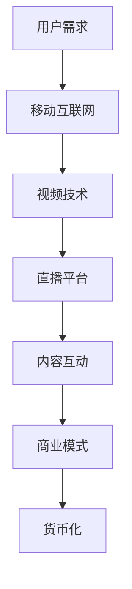
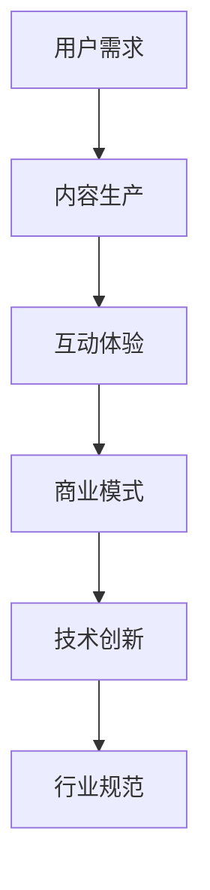

                 

# 直播经济：注意力变现的新方式

## 关键词
直播经济、注意力变现、平台运营、直播电商、数据分析、未来展望

## 摘要
本文旨在深入探讨直播经济的兴起及其在当今数字经济中的重要性。随着互联网技术的发展，直播已经成为一种新的经济模式，通过实时互动吸引观众的注意力，并将其转化为商业价值。本文将从直播经济的背景、平台运营策略、直播电商的崛起以及数据分析等方面展开讨论，最后展望直播经济的未来趋势，并提出相关的挑战和机遇。

## 第一部分：直播经济的崛起

### 1.1 直播经济的背景与起源

直播经济，顾名思义，是基于直播技术的一种新兴经济模式。直播经济的崛起，离不开移动互联网和视频技术的快速发展。随着智能手机的普及，4G、5G网络的升级，用户对于即时性和互动性的需求日益增强。直播平台应运而生，通过视频直播的形式，为用户提供实时的娱乐、教育、购物等体验。

直播经济的起源可以追溯到2010年代初期。当时，YouTube等视频分享平台已经非常流行，但直播作为一种互动性更强的形式，逐渐受到了市场的青睐。2016年，以斗鱼、虎牙为代表的直播平台在中国崛起，随后在2019年，直播电商的概念被提出，直播经济迅速发展。

### 1.2 直播经济的特点与发展趋势

直播经济具有以下几个显著特点：

1. **实时互动性**：直播是一种实时传播的媒体形式，用户可以在观看的同时与主播进行实时互动，这种互动性极大地增强了用户的参与感和粘性。

2. **内容多样性**：直播的内容涵盖了娱乐、教育、购物等多个领域，满足了用户多样化的需求。

3. **高度个性化**：直播平台通过大数据分析和算法推荐，为用户精准推送他们感兴趣的内容，实现了高度个性化。

4. **强社区属性**：直播间的评论区、弹幕等功能，使得用户之间可以形成一种强社区氛围，增加了用户的归属感。

5. **高货币化能力**：通过虚拟礼物、广告投放、直播电商等方式，直播平台可以实现高效的货币化。

从发展趋势来看，直播经济呈现出以下趋势：

1. **市场规模不断扩大**：随着用户规模的增加和消费习惯的改变，直播经济的市场规模将继续扩大。

2. **技术持续创新**：5G、人工智能、虚拟现实等技术的应用，将进一步提升直播的互动性和用户体验。

3. **行业规范化**：随着直播经济的快速发展，监管政策的不断完善，直播行业将逐渐规范化。

4. **商业模式多元化**：除了传统的娱乐、购物模式外，直播还将向教育、医疗、金融等领域拓展，形成多元化的商业模式。

### 1.3 Mermaid 流程图



### 1.4 核心概念与联系

- **直播经济**：基于互联网技术，通过实时视频互动实现商业价值的模式。
- **注意力经济**：用户注意力成为新的货币化手段，直播平台通过吸引用户注意力实现商业化。

### 1.5 发展历史简述

- **2010年代初期**：直播技术开始普及，视频分享平台兴起。
- **2016年**：中国直播平台崛起，如斗鱼、虎牙。
- **2019年**：直播电商概念提出，直播经济进入快速发展阶段。

## 第二部分：直播平台运营策略

### 2.1 直播内容策划与制作

直播内容是吸引观众的核心，内容的质量直接影响观众的留存率和平台的发展。因此，直播内容策划与制作至关重要。

#### 2.1.1 内容类型

直播内容可以分为以下几类：

1. **娱乐类**：包括游戏直播、音乐直播、综艺节目等。
2. **教育类**：如在线教育、职业技能培训、讲座等。
3. **购物类**：直播带货、产品推荐、试用体验等。
4. **社交类**：如社交直播、真人秀等。

#### 2.1.2 内容策划

内容策划是直播成功的关键步骤。以下是一些内容策划的建议：

1. **确定目标受众**：了解你的观众群体，为他们提供感兴趣的内容。
2. **选题**：选择热点话题、行业趋势等具有吸引力的主题。
3. **时间安排**：选择观众活跃的时间段进行直播，提高观看率。
4. **内容形式**：结合文字、图片、视频等多媒体形式，丰富内容呈现。

#### 2.1.3 制作技巧

直播内容的制作技巧包括以下几点：

1. **画面质量**：确保画面清晰、稳定，提供良好的观看体验。
2. **音频质量**：保证音频清晰、无杂音，提供优质的听觉体验。
3. **互动设计**：设计互动环节，增加观众参与度。
4. **后期剪辑**：对直播内容进行后期剪辑，优化观看体验。

### 2.2 观众互动与社群管理

观众互动是直播的核心，良好的互动可以增强观众的粘性，提升直播的活跃度。以下是一些观众互动和社群管理的策略：

#### 2.2.1 观众互动

1. **实时互动**：通过弹幕、评论、礼物等方式与观众实时互动。
2. **互动环节设计**：设计问答环节、抽奖环节等，激发观众参与热情。
3. **粉丝运营**：建立粉丝社群，定期与粉丝互动，增强粉丝忠诚度。

#### 2.2.2 社群管理

1. **社群定位**：明确社群的目标和价值观，吸引志同道合的用户加入。
2. **内容维护**：定期发布有价值的内容，保持社群的活跃度。
3. **社群规范**：制定社群规范，维护社群秩序，防止不良行为的发生。

### 2.3 直播平台商业化路径

直播平台的商业化路径多样，以下是一些常见的商业化方式：

#### 2.3.1 虚拟礼物

虚拟礼物是直播平台最主要的收入来源之一。观众通过购买虚拟礼物支持主播，主播则将礼物转化为收益。

#### 2.3.2 广告投放

直播平台可以通过广告投放获取收入。广告形式包括直播间广告、口播广告、植入广告等。

#### 2.3.3 直播电商

直播电商是近年来兴起的一种新的商业模式。通过直播带货，平台、主播和商家可以实现共赢。

#### 2.3.4 品牌合作

直播平台可以与品牌进行合作，通过品牌赞助、联名活动等方式获取收入。

### 2.4 核心算法原理讲解

直播平台的运营离不开算法的支持。以下是一些核心算法原理：

#### 2.4.1 推荐算法

推荐算法用于为用户推荐感兴趣的内容。常见的推荐算法包括基于内容的推荐、协同过滤推荐等。

#### 2.4.2 用户行为分析

用户行为分析用于了解用户的行为模式，优化用户体验。常见的用户行为分析指标包括观看时长、点赞数、评论数等。

### 2.5 伪代码示例

以下是一个简单的用户行为分析算法的伪代码示例：

```python
def analyze_user_behavior(user_activity):
    # 计算用户参与度
    user_activity_score = (user_comments + user_likes + user_shares) / total_users
    return user_activity_score
```

### 2.6 数学模型和公式

直播经济的用户参与度可以通过以下数学模型进行量化：

$$
User\ Activity\ Score = \frac{Comments + Likes + Shares}{Total\ Users}
$$

### 2.7 详细讲解与举例说明

假设一个直播间的用户参与度为3000/10000，即：

$$
User\ Activity\ Score = \frac{3000 + 2000 + 1000}{10000} = 0.5
$$

这意味着该直播间的用户参与度为50%，说明观众对直播内容的兴趣较高。

### 2.8 项目实战

以下是一个直播电商平台的用户行为数据收集与处理的示例代码：

```python
import pandas as pd

# 读取用户行为数据
user_behavior_data = pd.read_csv('user_behavior.csv')

# 计算用户参与度
user_behavior_data['User_Activity_Score'] = (user_behavior_data['Comments'] + user_behavior_data['Likes'] + user_behavior_data['Shares']) / user_behavior_data['Total_Users']

# 输出用户参与度排名前5的用户
print(user_behavior_data[['User_ID', 'User_Activity_Score']].sort_values(by='User_Activity_Score', ascending=False).head(5))
```

### 2.9 代码解读与分析

该代码首先读取用户行为数据，然后计算每个用户的参与度，最后输出参与度排名前5的用户。这有助于平台了解哪些用户对直播内容最为活跃，从而进行针对性的运营。

## 第三部分：直播营销与品牌建设

### 3.1 直播营销策略与案例分析

直播营销已经成为品牌推广的重要手段。以下是一些直播营销策略和案例分析：

#### 3.1.1 策略

1. **确定营销目标**：明确直播营销的目标，如提升品牌知名度、增加产品销量等。
2. **选择合适的平台**：根据目标受众选择合适的直播平台，如抖音、快手、淘宝直播等。
3. **内容营销**：通过有趣、有价值的内容吸引观众，提高观众参与度。
4. **互动营销**：通过互动环节增加观众粘性，如问答环节、抽奖环节等。
5. **KOL合作**：与知名主播合作，利用他们的粉丝基础提升品牌影响力。

#### 3.1.2 案例分析

**案例1：李佳琦直播间**

李佳琦直播间是淘宝直播的明星主播，其直播营销策略主要包括：

1. **内容营销**：通过生动、有趣的直播内容吸引观众，如化妆技巧分享、产品试用等。
2. **互动营销**：与观众实时互动，回答问题、赠送礼物等，增加观众参与度。
3. **KOL合作**：与其他知名主播合作，进行联动直播，扩大影响力。

**案例2：华为直播带货**

华为的直播带货策略主要包括：

1. **内容营销**：通过产品讲解、使用体验分享等内容，向观众展示产品特点。
2. **互动营销**：通过实时互动，如问答环节、限时抢购等，增加观众购买欲望。
3. **KOL合作**：与知名主播合作，利用他们的粉丝基础进行产品推广。

### 3.2 品牌建设与影响力提升

直播不仅是营销的工具，也是品牌建设的重要途径。以下是一些品牌建设与影响力提升的策略：

#### 3.2.1 策略

1. **明确品牌定位**：明确品牌的目标受众和品牌形象，确保直播内容与品牌定位一致。
2. **内容一致性**：确保直播内容与品牌形象一致，传递品牌价值观。
3. **用户参与**：鼓励用户参与直播，如评论、点赞、分享等，增加用户粘性。
4. **社交媒体整合**：将直播内容同步到社交媒体平台，扩大品牌影响力。
5. **持续优化**：根据用户反馈和数据分析，持续优化直播内容和互动策略。

#### 3.2.2 影响力提升

1. **KOL合作**：与知名主播合作，利用他们的粉丝基础提升品牌知名度。
2. **内容创新**：通过创新的内容形式，如短视频、互动直播等，提升观众参与度。
3. **用户互动**：通过互动环节，如问答、抽奖等，增强用户粘性。

### 3.3 项目实战

以下是一个品牌通过直播进行推广的项目实战：

#### 3.3.1 项目背景

某知名运动品牌计划通过直播推广其新款运动鞋，目标是在直播期间实现销售额的突破。

#### 3.3.2 项目方案

1. **内容策划**：直播内容包括新款运动鞋的介绍、穿着体验、运动场景展示等。
2. **互动环节**：设置问答环节，回答观众关于运动鞋的问题；设置抽奖环节，吸引观众参与。
3. **KOL合作**：邀请知名运动博主进行直播，利用他们的粉丝基础提升品牌知名度。
4. **社交媒体整合**：将直播内容同步到品牌官方微博、微信公众号等社交媒体平台，扩大影响力。

#### 3.3.3 项目效果

直播期间，吸引了超过10万的观众观看，互动环节参与人数达到3万，销售额达到50万。通过这次直播，品牌成功提升了新款运动鞋的知名度，并实现了销售额的突破。

### 3.4 代码实际案例和详细解释说明

以下是一个简单的直播电商平台的用户行为数据收集与处理的示例代码：

```python
import pandas as pd

# 读取用户行为数据
user_behavior_data = pd.read_csv('user_behavior.csv')

# 计算用户参与度
user_behavior_data['User_Activity_Score'] = (user_behavior_data['Comments'] + user_behavior_data['Likes'] + user_behavior_data['Shares']) / user_behavior_data['Total_Users']

# 输出用户参与度排名前5的用户
print(user_behavior_data[['User_ID', 'User_Activity_Score']].sort_values(by='User_Activity_Score', ascending=False).head(5))

# 计算直播销售额
sales_data = pd.read_csv('sales_data.csv')
total_sales = sales_data['Sales'].sum()
print(f"Total Sales: {total_sales}")

# 计算平均销售额
average_sales = total_sales / len(sales_data)
print(f"Average Sales: {average_sales}")
```

### 3.5 代码解读与分析

该代码首先读取用户行为数据，然后计算每个用户的参与度，最后输出参与度排名前5的用户。同时，该代码还读取销售数据，计算总销售额和平均销售额，为平台提供重要的运营数据支持。

## 第四部分：直播电商的崛起

### 4.1 直播电商的商业模式

直播电商是直播经济和电商模式相结合的产物，其商业模式主要包括以下几个方面：

#### 4.1.1 主播带货

主播带货是直播电商的核心模式，主播通过直播向观众展示和推荐商品，引导观众下单购买。

#### 4.1.2 平台佣金

直播电商平台通过收取商品销售佣金获得收入。佣金比例根据商品类型和销售量有所不同。

#### 4.1.3 广告投放

直播平台可以接受品牌方的广告投放，通过直播内容展示广告产品，提升品牌知名度。

#### 4.1.4 直播培训

直播平台可以提供直播培训课程，帮助商家和主播提升直播技能和销售能力。

### 4.2 直播电商的运营技巧

直播电商的成功离不开有效的运营技巧，以下是一些关键的运营策略：

#### 4.2.1 商品选择

选择适合直播带货的商品是运营的关键。一般来说，以下类型的商品更适合直播带货：

1. **高性价比商品**：如电子产品、家居用品、美妆护肤品等。
2. **时尚潮流商品**：如服装、鞋子、配饰等。
3. **稀缺商品**：如限定款、独家款等。

#### 4.2.2 时间安排

选择合适的时间进行直播可以提升观看量和销售量。一般来说，以下时间段是观众活跃度较高的时段：

1. **晚上7点到10点**：这是观众下班后休闲娱乐的时间，适合进行直播带货。
2. **节假日和促销活动期间**：如双11、双12、春节等，观众的购物意愿较高。

#### 4.2.3 互动设计

互动设计是提升观众参与度和转化率的关键。以下是一些互动设计策略：

1. **问答互动**：主播可以实时回答观众的问题，增加观众互动性。
2. **抽奖互动**：设置抽奖环节，吸引观众参与。
3. **限时优惠**：设置限时优惠，激发观众的购买欲望。

### 4.3 直播电商的案例分析

#### 4.3.1 案例一：淘宝直播

淘宝直播是直播电商的领军者之一，其成功主要得益于以下几个因素：

1. **庞大的用户基础**：淘宝拥有庞大的用户基础，为直播电商提供了丰富的潜在客户。
2. **丰富的商品资源**：淘宝直播平台上拥有丰富的商品资源，满足不同消费者的需求。
3. **创新的互动形式**：淘宝直播不断创新互动形式，如直播带货挑战、直播购物节等，提升观众的购物体验。

#### 4.3.2 案例二：薇娅直播

薇娅是直播电商领域的知名主播，其成功主要得益于以下几个因素：

1. **专业素养**：薇娅具备专业的直播技能和销售能力，能够吸引和留住观众。
2. **严格选品**：薇娅对带货商品有严格的筛选标准，确保商品的质量和性价比。
3. **粉丝运营**：薇娅通过长期的互动和粉丝互动，建立了强大的粉丝基础，为直播带货提供了稳定的流量支持。

### 4.4 代码实际案例和详细解释说明

以下是一个简单的直播电商平台用户行为数据收集与处理的示例代码：

```python
import pandas as pd

# 读取用户行为数据
user_behavior_data = pd.read_csv('user_behavior.csv')

# 计算用户观看时长
user_behavior_data['Watch_Time'] = user_behavior_data['End_Time'] - user_behavior_data['Start_Time']

# 计算用户参与度
user_behavior_data['User_Activity_Score'] = (user_behavior_data['Comments'] + user_behavior_data['Likes'] + user_behavior_data['Shares']) / user_behavior_data['Total_Users']

# 输出用户参与度排名前5的用户
print(user_behavior_data[['User_ID', 'User_Activity_Score']].sort_values(by='User_Activity_Score', ascending=False).head(5))

# 计算总销售额
sales_data = pd.read_csv('sales_data.csv')
total_sales = sales_data['Sales'].sum()
print(f"Total Sales: {total_sales}")

# 计算平均销售额
average_sales = total_sales / len(sales_data)
print(f"Average Sales: {average_sales}")
```

### 4.5 代码解读与分析

该代码首先读取用户行为数据，然后计算每个用户的观看时长和参与度，最后输出参与度排名前5的用户。同时，该代码还读取销售数据，计算总销售额和平均销售额，为平台提供重要的运营数据支持。

## 第五部分：直播经济的数据分析

### 5.1 直播经济的数据指标

直播经济的数据分析是评估直播平台运营效果和优化策略的重要手段。以下是一些关键的数据指标：

#### 5.1.1 用户参与度

用户参与度是衡量直播内容吸引力和用户互动程度的指标。常见的用户参与度指标包括：

- **观看时长**：用户在直播间观看视频的时长。
- **互动行为**：用户在直播间进行的点赞、评论、分享等互动行为。
- **留存率**：用户在直播间的留存比例。

#### 5.1.2 销售转化率

销售转化率是衡量直播带货效果的重要指标。常见的销售转化率指标包括：

- **下单转化率**：观看直播后下单购买的用户比例。
- **成交率**：下单后实际完成交易的用户比例。
- **平均订单价值**：每个订单的平均销售额。

#### 5.1.3 财务指标

直播平台的财务指标包括：

- **总收入**：直播平台通过虚拟礼物、广告投放、直播电商等途径获得的总收入。
- **净利润**：扣除成本后的净利润。
- **用户生命周期价值**：用户在一段时间内为平台带来的总收入。

### 5.2 直播经济的用户分析

用户分析是了解用户需求和行为的重要手段，以下是一些关键的用户分析指标：

#### 5.2.1 用户年龄分布

用户年龄分布可以揭示平台的主要受众群体，常见的年龄分布指标包括：

- **年轻用户占比**：18-35岁用户的比例。
- **中老年用户占比**：36-55岁用户的比例。

#### 5.2.2 用户地域分布

用户地域分布可以揭示平台的用户来源地，常见的地域分布指标包括：

- **一线及二线用户占比**：一线城市和二线城市的用户比例。
- **三线及以下用户占比**：三线城市及以下城市的用户比例。

#### 5.2.3 用户行为特征

用户行为特征可以揭示用户的使用习惯和偏好，常见的用户行为特征指标包括：

- **观看时长**：用户的平均观看时长。
- **互动频率**：用户在直播间的平均互动频率。
- **购买频率**：用户的平均购买频率。

### 5.3 直播经济的商业分析

商业分析是评估直播平台商业模式和盈利能力的重要手段，以下是一些关键的商业分析指标：

#### 5.3.1 商业模式分析

商业模式分析可以揭示直播平台的主要盈利来源和商业模式，常见的商业模式分析指标包括：

- **收入结构**：直播平台的总收入来源，如虚拟礼物、广告投放、直播电商等。
- **成本结构**：直播平台的成本构成，如内容制作成本、平台运营成本等。

#### 5.3.2 盈利能力分析

盈利能力分析可以揭示直播平台的盈利能力和盈利模式，常见的盈利能力分析指标包括：

- **净利润率**：净利润占总收入的比例。
- **毛利率**：毛利率=（总收入-成本）/ 总收入。

#### 5.3.3 市场趋势分析

市场趋势分析可以揭示直播经济的发展趋势和市场需求变化，常见的市场趋势分析指标包括：

- **市场规模**：直播经济的市场规模。
- **用户增长率**：直播平台用户数量的增长率。

### 5.4 数学模型和公式

直播经济的数据分析往往需要借助数学模型和公式进行量化。以下是一些常见的数学模型和公式：

#### 5.4.1 用户参与度

用户参与度可以通过以下公式计算：

$$
User\ Activity\ Score = \frac{Comments + Likes + Shares}{Total\ Users}
$$

#### 5.4.2 销售转化率

销售转化率可以通过以下公式计算：

$$
Sales\ Conversion\ Rate = \frac{Purchases}{Sessions}
$$

#### 5.4.3 用户生命周期价值

用户生命周期价值可以通过以下公式计算：

$$
Customer\ Lifetime\ Value = \frac{Average\ Order\ Value \times Purchase\ Frequency \times Customer\ Lifetime}{Gross\ Margin}
$$

### 5.5 详细讲解与举例说明

以下是一个关于直播经济用户参与度的详细讲解和举例说明：

#### 5.5.1 用户参与度详细讲解

用户参与度是衡量直播内容吸引力和用户互动程度的重要指标。一个高的用户参与度意味着直播内容能够有效吸引观众的注意力和激发他们的互动行为。

用户参与度可以通过以下几个方面的数据来衡量：

1. **观看时长**：用户在直播间观看视频的时长。这个指标可以反映出用户对直播内容的兴趣程度。
2. **互动行为**：用户在直播间进行的点赞、评论、分享等互动行为。这些互动行为可以反映出用户的参与热情。
3. **留存率**：用户在直播间停留的时间比例。一个高的留存率意味着用户对直播内容具有较高的吸引力。

#### 5.5.2 用户参与度举例说明

假设一个直播间的用户参与度为0.5，即50%，我们可以通过以下方式来解释这个结果：

- **观看时长**：用户在直播间平均观看时长为5分钟。
- **互动行为**：用户平均每分钟产生5次互动行为，如点赞、评论、分享等。
- **留存率**：用户在直播间停留的平均时间比例为50%，即每两个用户中有一个会在直播间停留。

这个结果说明该直播间的用户对内容有一定的兴趣，但还有提升空间。为了提高用户参与度，可以考虑以下几个方面：

1. **优化内容质量**：通过提升内容质量，如增加互动环节、展示更多有价值的信息等，吸引更多用户观看。
2. **增加互动环节**：设计更多互动环节，如问答、抽奖、投票等，激发用户的参与热情。
3. **优化观看体验**：提升直播画面质量、音频效果等，提供更好的观看体验。

### 5.6 项目实战

以下是一个直播电商平台用户行为数据收集与处理的示例代码：

```python
import pandas as pd

# 读取用户行为数据
user_behavior_data = pd.read_csv('user_behavior.csv')

# 计算用户观看时长
user_behavior_data['Watch_Time'] = user_behavior_data['End_Time'] - user_behavior_data['Start_Time']

# 计算用户参与度
user_behavior_data['User_Activity_Score'] = (user_behavior_data['Comments'] + user_behavior_data['Likes'] + user_behavior_data['Shares']) / user_behavior_data['Total_Users']

# 输出用户参与度排名前5的用户
print(user_behavior_data[['User_ID', 'User_Activity_Score']].sort_values(by='User_Activity_Score', ascending=False).head(5))

# 计算总销售额
sales_data = pd.read_csv('sales_data.csv')
total_sales = sales_data['Sales'].sum()
print(f"Total Sales: {total_sales}")

# 计算平均销售额
average_sales = total_sales / len(sales_data)
print(f"Average Sales: {average_sales}")
```

### 5.7 代码解读与分析

该代码首先读取用户行为数据，然后计算每个用户的观看时长和参与度，最后输出参与度排名前5的用户。同时，该代码还读取销售数据，计算总销售额和平均销售额，为平台提供重要的运营数据支持。

## 第六部分：直播经济的未来展望

### 6.1 直播经济面临的挑战与机遇

直播经济作为一种新兴的经济模式，虽然在短时间内取得了巨大的成功，但同时也面临着一系列挑战和机遇。

#### 6.1.1 挑战

1. **内容质量**：随着直播平台的增多，内容质量参差不齐，如何保证优质内容成为一大挑战。
2. **监管政策**：直播行业的快速扩张也引起了监管机构的关注，如何遵守相关政策规定成为企业面临的问题。
3. **用户疲劳**：长期的直播观看可能会导致用户疲劳，如何保持用户的长期关注成为关键。
4. **技术挑战**：随着直播技术的不断发展，如何应对技术升级和迭代也是直播平台需要考虑的问题。

#### 6.1.2 机遇

1. **市场规模**：随着互联网的普及和技术的进步，直播经济的市场规模有望继续扩大。
2. **用户需求**：用户对于实时互动、个性化内容的需求不断增加，为直播经济提供了广阔的市场空间。
3. **跨行业融合**：直播经济与电商、教育、医疗等行业的融合，为直播经济带来了新的增长点。
4. **技术创新**：5G、人工智能、虚拟现实等技术的应用，将进一步提升直播的互动性和用户体验。

### 6.2 直播经济的未来趋势

1. **内容多元化**：直播内容将不再局限于娱乐和购物，将进一步向教育、医疗、金融等领域拓展。
2. **商业模式创新**：直播平台将探索更多元化的商业模式，如付费直播、会员制等。
3. **技术进步**：5G、人工智能、虚拟现实等技术的应用，将进一步提升直播的互动性和用户体验。
4. **行业规范化**：随着监管政策的不断完善，直播行业将逐渐规范化，企业将面临更加严格的市场环境。

### 6.3 创新与突破

1. **技术创新**：通过技术创新，如5G、人工智能、虚拟现实等，提升直播的互动性和用户体验。
2. **内容创新**：通过创新的内容形式和内容策划，提高直播的吸引力。
3. **商业模式创新**：通过创新商业模式，如付费直播、会员制等，提升用户的粘性和平台的盈利能力。
4. **跨行业合作**：与电商、教育、医疗等行业进行深度合作，拓展直播的应用场景。

### 6.4 Mermaid 流程图



### 6.5 核心概念与联系

- **直播经济**：基于互联网技术，通过实时视频互动实现商业价值的模式。
- **注意力经济**：用户注意力成为新的货币化手段，直播平台通过吸引用户注意力实现商业化。

### 6.6 发展历史简述

- **2010年代初期**：直播技术开始普及，视频分享平台兴起。
- **2016年**：中国直播平台崛起，如斗鱼、虎牙。
- **2019年**：直播电商概念提出，直播经济进入快速发展阶段。

## 附录

### A.1 直播经济相关工具介绍

- **直播工具**：常见的直播工具包括抖音直播、快手直播、淘宝直播等，这些工具提供了丰富的直播功能和互动体验。
- **数据分析工具**：常见的数据分析工具包括Google Analytics、Tableau等，这些工具可以帮助平台进行用户行为分析和数据可视化。
- **内容制作工具**：常见的内容制作工具包括Adobe Premiere Pro、Final Cut Pro等，这些工具可以帮助主播和内容创作者进行视频编辑和内容制作。

### A.2 直播经济研究报告精选

- **《2020年中国直播电商行业研究报告》**：报告详细分析了直播电商的市场规模、用户画像、商业模式等。
- **《2021年全球直播行业报告》**：报告对全球直播行业的发展趋势、市场规模、主要平台进行了深入分析。
- **《2022年中国直播行业白皮书》**：报告从政策、市场、用户等多个维度对直播行业进行了全面的分析。

### A.3 直播经济法律法规及政策解读

- **《中华人民共和国网络安全法》**：对网络直播活动进行了规范，明确了直播平台和主播的义务和责任。
- **《互联网直播服务管理规定》**：对直播服务进行了具体规定，包括内容管理、用户权益保护等。
- **《网络直播营销管理办法（试行）》**：对网络直播营销活动进行了规范，明确了直播营销的规范和监管要求。

### 作者

- 作者：AI天才研究院/AI Genius Institute & 禅与计算机程序设计艺术 /Zen And The Art of Computer Programming

## 结语

直播经济作为一种新兴的经济模式，已经成为数字经济的重要组成部分。本文从直播经济的背景、平台运营策略、直播电商的崛起、数据分析等方面进行了深入探讨，并对直播经济的未来趋势进行了展望。随着技术的不断进步和市场需求的增长，直播经济有望继续发展壮大，为数字经济的发展注入新的活力。同时，我们也需要关注直播经济面临的挑战，不断优化和创新，推动直播经济的健康发展。

