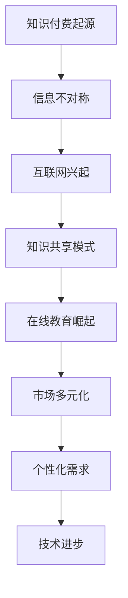
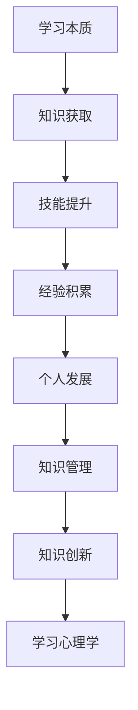
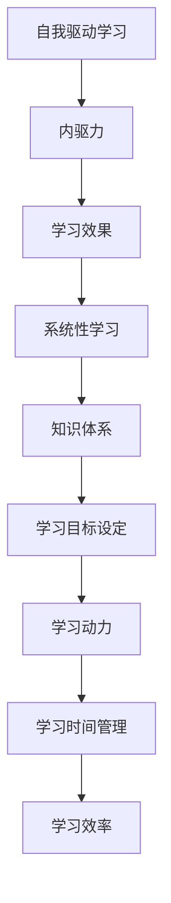
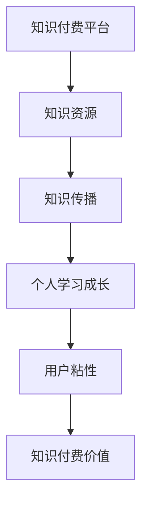
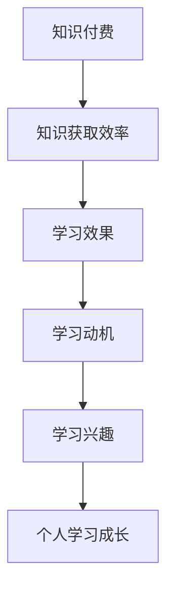
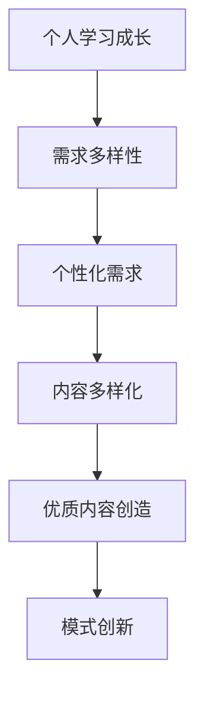
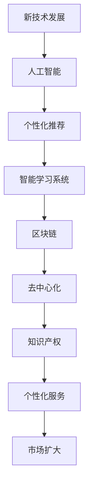

                 

# 《知识付费与个人学习成长的良性互动》

## 关键词
- 知识付费
- 个人学习成长
- 良性互动
- 教育科技
- 学习策略

## 摘要
本文旨在探讨知识付费与个人学习成长的良性互动关系。通过分析知识付费的背景、发展趋势以及个人学习成长的概念、方法和策略，本文揭示了知识付费在促进个人学习成长中的重要作用。同时，本文通过案例分析、实践指南以及未来展望，提出了知识付费与个人学习成长可持续发展路径，为教育科技领域的发展提供了新的思考方向。

## 第一部分：知识付费概述

### 第1章：知识付费背景与发展趋势

#### 1.1 知识付费的定义与意义

知识付费，即用户为获取高质量知识内容而付出的经济成本。在信息爆炸的时代，知识付费体现了用户对优质内容的重视和稀缺资源的认可。

- **定义**：知识付费是指用户通过购买或订阅的方式，获取特定领域内专家或专业机构提供的知识、技能和经验的过程。
- **意义**：知识付费不仅为内容创作者提供了经济回报，同时也提升了知识传播的效率和质量。

#### 1.2 知识付费的发展历程

知识付费起源于信息不对称的互联网早期，随着移动互联网和电子商务的发展，知识付费逐渐成为一种主流的学习方式。

- **起源**：互联网的兴起使知识传播更加便捷，知识付费成为知识共享的新模式。
- **崛起**：近年来，在线教育和知识付费平台的崛起，进一步推动了知识付费的发展。

#### 1.3 知识付费的现状与趋势

知识付费市场已经形成一定的规模，呈现出多元化的商业模式和快速发展的趋势。

- **商业模式**：包括一次性购买、订阅制、课程包等多样化模式。
- **行业趋势**：随着技术的进步和用户需求的变化，知识付费市场将持续扩张，个性化、定制化、互动化将成为主流。

### Mermaid 流程图


## 第二部分：个人学习成长

### 第2章：个人学习成长的概念与理论

#### 2.1 个人学习成长的概念

个人学习成长是指个体在知识、技能和态度上的持续进步和提升。

- **学习本质**：学习是获取知识、技能和经验的过程，是个人发展的核心。
- **学习意义**：学习不仅是为了解决当下的问题，更是为了提升未来的竞争力。

#### 2.2 个人学习成长的理论基础

个人学习成长依赖于一系列理论基础，包括知识管理理论和学习心理学理论。

- **知识管理理论**：强调知识共享和知识创新的重要性。
- **学习心理学理论**：研究学习过程中的心理机制和动机，为学习策略的设计提供依据。

### Mermaid 流程图


### 第3章：个人学习成长的方法与策略

#### 2.1 个人学习成长的方法

个人学习成长需要采用有效的方法，如自我驱动学习和系统性学习。

- **自我驱动学习**：通过内驱力推动学习，提升学习效果。
- **系统性学习**：建立知识体系，确保学习全面性和深度。

#### 2.2 个人学习成长的策略

个人学习成长还需要制定有效的策略，包括学习目标设定和学习时间管理。

- **学习目标设定**：明确学习方向和目标，提升学习动力。
- **学习时间管理**：合理安排学习时间，提高学习效率。

### Mermaid 流�程图


## 第三部分：知识付费与个人学习成长的良性互动

### 第4章：知识付费平台与个人学习成长的关系

#### 4.1 知识付费平台的作用

知识付费平台在提供知识资源和促进知识传播方面发挥了重要作用。

- **提供知识资源**：平台汇集了大量优质知识内容，为个人学习提供了丰富的资源。
- **促进知识传播**：通过平台，知识可以快速、广泛地传播，提高知识利用率。

#### 4.2 个人学习成长对知识付费平台的影响

个人学习成长对知识付费平台也有积极影响，主要体现在用户粘性和知识付费价值提升。

- **增加用户粘性**：个人学习成长需要持续的知识输入，增加了用户在平台上的活跃度。
- **提高知识付费价值**：个人学习成长的需求促使平台提供更高质量的知识内容，提升知识付费的价值。

### Mermaid 流程图


### 第5章：知识付费对个人学习成长的影响

#### 5.1 知识付费对学习效果的提升

知识付费通过提高知识获取效率和优化学习效果，对个人学习成长产生积极影响。

- **知识获取效率**：付费知识通常经过筛选和整合，提高了学习效率。
- **学习效果评估**：知识付费平台提供了评估工具，帮助用户了解学习成果。

#### 5.2 知识付费对学习态度的影响

知识付费不仅可以提升学习效果，还能激发学习动机和增强学习兴趣。

- **学习动机的激发**：付费让学习变得更加有意义和有价值，提高了学习动机。
- **学习兴趣的增强**：高质量的付费内容能够激发用户的学习兴趣，促进深入学习。

### Mermaid 流程图


### 第6章：个人学习成长对知识付费市场的推动作用

#### 6.1 个人学习成长对知识付费的需求

个人学习成长的需求多样化和个性化，推动了知识付费市场的创新和发展。

- **学习需求多样性**：不同个体有不同的学习需求和偏好，促使知识付费内容多样化。
- **学习需求个性化**：个性化推荐和定制化服务满足了用户个性化学习需求。

#### 6.2 个人学习成长对知识付费内容的创新

个人学习成长不仅影响知识付费的需求，还推动了知识付费内容的创新。

- **优质内容创造**：个人学习成长的需求激发了内容创作者的创造力，产生更多优质内容。
- **知识付费模式创新**：个人学习成长的需求促使知识付费平台不断创新服务模式。

### Mermaid 流程图


## 第四部分：案例分析与实践指南

### 第7章：知识付费与个人学习成长的实践案例

#### 7.1 成功案例分享

本节将分享知识付费与个人学习成长相结合的成功案例，包括知识付费平台与高校合作的案例以及个人学习成长与知识付费结合的案例。

### 第8章：知识付费与个人学习成长的实践指南

#### 8.1 实践策略与建议

本节将提供知识付费与个人学习成长相结合的实践策略和建议，包括如何选择合适的知识付费产品以及如何制定个人学习成长计划。

#### 8.2 实践中的问题与挑战

本节将讨论知识付费与个人学习成长实践中可能遇到的问题和挑战，包括如何平衡知识付费与学习负担以及如何应对知识付费带来的信息过载。

## 第五部分：未来展望

### 第9章：知识付费与个人学习成长的未来发展趋势

#### 9.1 新技术的发展与应用

未来，人工智能、区块链等新技术将在知识付费和个人学习成长中发挥更大作用。

- **人工智能**：通过个性化推荐和智能学习系统，提升知识付费的精准性和用户体验。
- **区块链**：通过去中心化和不可篡改的特性，保障知识付费的诚信和知识产权。

#### 9.2 行业发展展望

知识付费和个人学习成长将继续发展，行业将朝着更加个性化和智能化方向演进。

- **市场扩大**：随着用户对知识的重视，知识付费市场将持续扩大。
- **个性化服务**：知识付费平台将提供更多个性化服务，满足不同用户的需求。

### 第10章：知识付费与个人学习成长的可持续发展

#### 9.1 可持续发展的理念

知识付费和个人学习成长的可持续发展需要遵循可持续发展的理念，实现知识共享与个人成长的平衡。

- **可持续发展的重要性**：知识付费和个人学习成长的可持续发展对于行业和社会具有重要意义。
- **知识付费与个人学习成长的平衡**：通过合理的知识付费机制和有效的学习策略，实现知识共享与个人成长的良性互动。

#### 9.2 可持续发展的实践路径

本节将探讨知识付费与个人学习成长的可持续发展实践路径，包括知识付费平台的可持续发展策略和个人学习成长的可持续发展策略。

- **平台可持续发展策略**：通过技术创新和服务模式创新，提升知识付费平台的竞争力。
- **个人学习成长可持续发展策略**：通过自我驱动学习和系统性学习，实现个人学习成长的可持续性。

### Mermaid 流程图


## 附录

### 附录 A：知识付费与个人学习成长的资源推荐

#### A.1 在线学习平台推荐

- **Coursera**：提供全球顶级大学和机构的在线课程。
- **Udemy**：涵盖各类技能的课程平台。
- **edX**：由哈佛大学和麻省理工学院共同创立的在线课程平台。

#### A.2 知识付费产品推荐

- **行业研究报告**：提供行业趋势分析和市场洞察。
- **专业课程**：针对特定领域的深入学习和专业技能提升。

### 附录 B：知识付费与个人学习成长的相关研究

#### B.1 知识付费与个人学习成长的关系研究

- **知识付费对学习效果的影响**：研究如何通过知识付费提升学习效果。
- **个人学习成长对知识付费需求的驱动因素**：探讨个人学习成长如何影响知识付费需求。

#### B.2 知识付费与个人学习成长的未来研究方向

- **知识付费平台的用户体验优化**：如何提升用户在知识付费平台上的体验。
- **个人学习成长的数据分析与个性化推荐技术**：如何通过数据分析和技术手段提升个人学习成长的效率。

## 作者信息

作者：AI天才研究院/AI Genius Institute & 禅与计算机程序设计艺术 /Zen And The Art of Computer Programming

---

### 详细内容拓展与专业解读

#### 第1章：知识付费概述

**知识付费的定义与意义**

知识付费不仅仅是一个商业模式，更是一种社会现象。在互联网时代，信息获取变得更加便捷，但与此同时，也出现了信息过载的问题。知识付费模式的出现，使得用户可以根据自己的需求和兴趣，选择性地购买或订阅优质的知识内容，从而提升学习效率。

- **知识付费的定义**：知识付费是指用户为获取特定知识或技能而支付的费用。这包括在线课程、电子书、研究报告、专业咨询等多种形式。
- **知识付费的意义**：对于用户来说，知识付费意味着可以高效地获取有价值的信息，避免在大量免费内容中筛选。对于内容创作者和平台来说，知识付费为优质内容的创作和传播提供了经济支持，激发了知识共享的积极性。

**知识付费的发展历程**

知识付费的发展历程可以分为几个阶段：

- **萌芽期**：在互联网早期，知识付费的形式主要是线上课程和电子书。由于信息传播的限制，用户对知识的获取主要依赖于传统的教育机构和出版物。
- **成长期**：随着移动互联网和电子商务的发展，知识付费逐渐成为一种主流的学习方式。2016年左右，随着知识付费平台的崛起，如得到、知乎Live等，知识付费进入快速增长期。
- **成熟期**：当前，知识付费市场已经形成一定的规模，呈现出多元化、个性化的趋势。平台和内容创作者不断创新，以满足用户多样化的需求。

**知识付费的现状与趋势**

知识付费的现状可以总结为以下几个方面：

- **市场规模不断扩大**：根据市场研究，知识付费市场规模逐年增长，预计未来几年仍将保持高速增长。
- **内容形式多样化**：除了传统的在线课程和电子书，知识付费的内容形式还包括直播、短视频、音频等。
- **个性化需求增加**：用户对知识付费的需求越来越个性化，追求定制化的学习体验。

知识付费的未来趋势将受到以下几个因素的影响：

- **技术创新**：人工智能、大数据等技术的应用，将进一步提升知识付费的个性化水平和用户体验。
- **教育改革**：教育体制的改革，如在线教育、终身学习等，也将推动知识付费市场的发展。
- **社会认知**：随着社会对知识价值的认可度提高，知识付费将成为更多人学习的重要方式。

#### 第2章：个人学习成长的概念与理论

**个人学习成长的概念**

个人学习成长是指个体在知识、技能和态度上的持续进步和提升。这是一个全方位的发展过程，不仅涉及知识的学习，还包括技能的培养和态度的塑造。

- **知识学习**：知识是个人成长的基础，通过学习获取新知识，更新旧知识，是个人成长的重要途径。
- **技能培养**：技能是个人竞争力的体现，通过实践和训练，不断提升技能水平，是个人成长的关键。
- **态度塑造**：态度决定行为，通过积极的学习态度，保持对知识的渴望和对挑战的勇气，是个人成长的重要保障。

**个人学习成长的理论基础**

个人学习成长的理论基础包括知识管理理论和学习心理学理论。

- **知识管理理论**：知识管理理论强调知识共享和知识创新的重要性。在知识管理中，知识的获取、存储、传播和创新是核心内容。通过知识共享，个体可以快速获取外部知识，通过知识创新，个体可以不断提升自身竞争力。
- **学习心理学理论**：学习心理学理论研究学习过程中的心理机制和动机。学习动机是推动学习的重要动力，学习策略是提高学习效果的关键。通过理解学习心理学，个体可以更好地制定学习计划和选择学习方法。

**知识管理理论**

知识管理理论的核心观点包括：

- **知识的获取**：通过阅读、学习、交流等方式获取新知识。
- **知识的存储**：将获取的知识进行分类、整理和存储，以便随时调用。
- **知识的传播**：通过分享、传授和传播知识，促进知识的传播和共享。
- **知识的创新**：在知识的基础上，通过创新产生新的知识，提升自身竞争力。

**学习心理学理论**

学习心理学理论的核心观点包括：

- **学习动机**：学习动机是推动学习的重要动力。内在动机和外在动机共同作用，激发个体的学习兴趣和动力。
- **学习策略**：学习策略是提高学习效果的关键。通过选择合适的学习策略，个体可以更高效地掌握知识。
- **学习反馈**：学习反馈是学习过程中不可或缺的一部分。通过反馈，个体可以了解自己的学习效果，调整学习策略，进一步提升学习效果。

#### 第3章：个人学习成长的方法与策略

**个人学习成长的方法**

个人学习成长的方法多种多样，以下列举几种常见的方法：

- **自我驱动学习**：自我驱动学习是指通过内在动机推动学习，主动寻找学习资源，设定学习目标，并持续跟踪学习进度。自我驱动学习强调个体的自主学习能力，有助于培养长期学习的习惯。
- **系统性学习**：系统性学习是指按照一定的学习体系和计划，有组织、有目的地进行学习。通过系统性学习，个体可以构建完整的知识体系，提升学习的深度和广度。
- **项目驱动学习**：项目驱动学习是指通过参与实际项目，将学习与应用相结合。通过项目驱动学习，个体可以更直观地理解知识的应用，提升实践能力。
- **合作学习**：合作学习是指通过与他人合作，共同完成学习任务。合作学习可以促进知识的共享和交流，激发学习兴趣和动力。

**个人学习成长的策略**

个人学习成长的策略包括以下几个方面：

- **学习目标设定**：明确学习目标是个人学习成长的第一步。通过设定具体、可衡量的学习目标，个体可以更有针对性地制定学习计划，提升学习效果。
- **学习时间管理**：合理安排学习时间是确保学习效果的重要保障。通过制定学习时间表，确保每天都有固定的时间用于学习，避免拖延和分散注意力。
- **学习反馈与调整**：学习反馈是学习过程中不可或缺的一部分。通过定期评估学习效果，个体可以了解自己的学习状况，及时调整学习策略，提升学习效果。
- **学习环境优化**：良好的学习环境有助于提高学习效率。通过优化学习环境，如保持整洁、减少干扰等，个体可以更好地专注于学习。

**学习目标设定的方法**

设定学习目标需要遵循以下几个原则：

- **具体性**：学习目标要具体、明确，避免模糊和抽象。
- **可衡量性**：学习目标要具有可衡量性，以便评估学习效果。
- **可实现性**：学习目标要具有可实现性，避免设定过高或不切实际的目标。
- **时限性**：学习目标要设定具体的完成时限，以推动学习进度。

**学习时间管理的方法**

合理安排学习时间需要遵循以下几个原则：

- **时间规划**：制定详细的学习时间表，确保每天都有固定的时间用于学习。
- **优先级**：根据学习目标和任务的优先级，合理安排学习时间，确保重要任务得到充分的时间。
- **休息与放松**：合理规划学习时间，确保有足够的休息和放松时间，避免过度疲劳。
- **时间监督**：使用时间管理工具，如番茄工作法等，监控学习时间，提高学习效率。

**学习反馈与调整的方法**

学习反馈与调整的方法包括以下几个方面：

- **自我评估**：通过自我评估，了解自己的学习进度和效果，找出存在的问题和不足。
- **他人评估**：寻求他人的意见和建议，如导师、同学等，获取更客观的反馈。
- **定期总结**：定期总结学习成果和经验，分析学习过程中的优点和不足，制定改进措施。

**学习环境优化的方法**

学习环境优化的方法包括以下几个方面：

- **环境布置**：保持学习环境的整洁和舒适，减少干扰因素。
- **设备配置**：配置合适的设备，如电脑、书籍等，确保学习所需的工具和资源。
- **时间安排**：合理安排学习时间，避免在学习时间内外在环境上的干扰。

#### 第4章：知识付费平台与个人学习成长的关系

**知识付费平台的作用**

知识付费平台在个人学习成长中扮演着重要角色，其作用主要体现在以下几个方面：

- **提供知识资源**：知识付费平台汇集了大量的优质知识资源，用户可以通过付费购买或订阅的方式获取所需的知识内容。
- **促进知识传播**：知识付费平台为知识传播提供了广阔的平台，通过在线课程、直播、短视频等形式，将知识传递给更多的用户。
- **提升学习效率**：知识付费平台通过精选内容、结构化知识体系等方式，提高了用户的学习效率，减少了信息筛选的时间。

**个人学习成长对知识付费平台的影响**

个人学习成长对知识付费平台也有重要影响，主要体现在以下几个方面：

- **增加用户粘性**：个人学习成长需要持续的知识输入，知识付费平台为用户提供了稳定的知识来源，增加了用户在平台上的活跃度和粘性。
- **提高知识付费价值**：个人学习成长的需求促使平台提供更高质量的知识内容，提升了知识付费的价值。

**知识付费平台与个人学习成长的互动关系**

知识付费平台与个人学习成长之间的互动关系可以概括为以下几点：

- **知识获取**：知识付费平台为个人提供了获取知识的途径，个人通过付费获取所需的知识内容。
- **学习反馈**：个人在学习过程中，通过知识付费平台提供的评价和反馈机制，了解自己的学习效果，调整学习策略。
- **内容创新**：个人学习成长的需求促使知识付费平台不断优化内容，提供更符合用户需求的知识产品。
- **生态发展**：知识付费平台与个人学习成长相互促进，形成了良性互动，推动了整个教育生态的发展。

#### 第5章：知识付费对个人学习成长的影响

**知识付费对学习效果的提升**

知识付费对学习效果的提升主要体现在以下几个方面：

- **知识获取的效率**：知识付费平台精选了优质的知识内容，用户可以快速获取所需的知识，避免了信息过载的问题，提高了学习效率。
- **学习效果的评估**：知识付费平台提供了多种评估工具，如考试、作业、反馈等，用户可以通过这些工具了解自己的学习效果，及时调整学习策略。

**知识付费对学习态度的影响**

知识付费对学习态度的影响也是显而易见的，主要体现在以下几个方面：

- **学习动机的激发**：知识付费使得学习变得更加有意义和有价值，激发了用户的学习动机，提高了学习的积极性和主动性。
- **学习兴趣的增强**：知识付费平台提供了丰富的学习资源和互动方式，增强了用户的学习兴趣，使学习变得更加有趣和吸引人。

**案例研究：知识付费与学习效果提升**

以下是一个案例研究，展示了知识付费如何对学习效果产生积极影响：

**案例一：编程学习**

假设一位编程初学者希望通过在线课程学习编程技能。他选择了某个知名的知识付费平台，购买了相关的编程课程。在学习过程中，他按照课程的结构和指导进行学习，并通过平台的作业和测试功能检验自己的学习效果。通过持续的学习和练习，他的编程技能得到了显著提升。

- **知识获取效率**：通过知识付费平台，他快速获取了编程的基础知识和实践技巧，避免了在大量免费资源中浪费时间和精力。
- **学习效果评估**：通过平台的考试和作业，他可以及时了解自己的学习进度和存在的问题，调整学习策略，提高学习效果。

**案例二：专业课程学习**

一位工程师希望通过学习专业课程提升自己的职业竞争力。他选择了某个知名大学的专业课程，通过知识付费平台进行学习。在学习过程中，他不仅获取了系统的专业知识，还与教授和同学们进行了深入交流，提升了专业素养。

- **知识获取效率**：通过知识付费平台，他可以快速获取系统的专业课程内容，避免了自行寻找资料和整理知识的时间成本。
- **学习效果评估**：通过平台的讨论区和作业提交功能，他可以与教授和同学们互动，获取反馈和指导，提高学习效果。

**案例三：兴趣爱好者学习**

一位音乐爱好者希望通过学习乐器提升自己的演奏水平。他在某个知识付费平台上找到了合适的乐器课程，通过系统的学习，他的演奏技巧得到了显著提高。

- **知识获取效率**：通过知识付费平台，他可以快速获取专业的乐器学习资源，避免了自行摸索和试错的成本。
- **学习效果评估**：通过平台的练习和考核功能，他可以及时了解自己的学习进度和存在的问题，调整学习策略，提高学习效果。

**案例四：职场技能提升**

一位职场人士希望通过学习职场技能提升自己的职场竞争力。他在某个知识付费平台上选择了相关的职场技能课程，通过系统的学习，他的职场技能得到了显著提升。

- **知识获取效率**：通过知识付费平台，他可以快速获取职场技能的实践技巧和理论知识，避免了自行查找资料和整理知识的时间成本。
- **学习效果评估**：通过平台的模拟演练和实战练习，他可以及时了解自己的学习进度和存在的问题，调整学习策略，提高学习效果。

**知识付费对学习态度的影响**

知识付费对学习态度的影响也是显而易见的，主要体现在以下几个方面：

- **学习动机的激发**：知识付费使得学习变得更加有意义和有价值，激发了用户的学习动机，提高了学习的积极性和主动性。
- **学习兴趣的增强**：知识付费平台提供了丰富的学习资源和互动方式，增强了用户的学习兴趣，使学习变得更加有趣和吸引人。
- **学习习惯的养成**：知识付费平台提供了持续的学习动力和监督机制，帮助用户养成良好的学习习惯，提高学习效果。

**案例研究：知识付费与学习态度提升**

以下是一个案例研究，展示了知识付费如何对学习态度产生积极影响：

**案例一：英语学习**

一位英语学习者希望通过学习提升英语水平。他在某个知识付费平台上选择了英语课程，通过系统的学习，他的英语能力得到了显著提升。

- **学习动机的激发**：通过知识付费平台，他获得了系统的英语学习资源和专业的指导，感受到了英语学习的价值和乐趣，激发了学习动机。
- **学习兴趣的增强**：知识付费平台提供了丰富的英语学习资源，如视频、音频、互动练习等，使英语学习变得有趣和吸引人。
- **学习习惯的养成**：知识付费平台提供了学习计划和时间管理工具，帮助他养成良好的学习习惯，坚持每天学习，提高学习效果。

**案例二：职业转型**

一位职场人士希望通过学习转型到新的职业领域。他在某个知识付费平台上选择了相关的职业转型课程，通过系统的学习，他成功地实现了职业转型。

- **学习动机的激发**：通过知识付费平台，他获得了新的职业知识和技能，感受到了职业转型的可能性和价值，激发了学习动机。
- **学习兴趣的增强**：知识付费平台提供了丰富的职业转型案例和实践技巧，使他看到了成功的可能性，增强了学习兴趣。
- **学习习惯的养成**：知识付费平台提供了职业转型的规划和指导，帮助他制定了学习计划，养成了每天学习的习惯，坚持学习，提高学习效果。

**案例三：兴趣爱好培养**

一位业余音乐爱好者希望通过学习提升自己的音乐素养。他在某个知识付费平台上选择了音乐课程，通过系统的学习，他的音乐水平得到了显著提升。

- **学习动机的激发**：通过知识付费平台，他获得了专业的音乐知识和技巧，感受到了音乐学习的价值和乐趣，激发了学习动机。
- **学习兴趣的增强**：知识付费平台提供了丰富的音乐资源和互动方式，如视频教程、直播课程、在线练习等，使音乐学习变得有趣和吸引人。
- **学习习惯的养成**：知识付费平台提供了学习计划和时间管理工具，帮助他合理安排学习时间，养成了每天练习的习惯，坚持学习，提高学习效果。

**案例四：个人成长**

一位个人成长爱好者希望通过学习提升自己的综合素质。他在某个知识付费平台上选择了个人成长课程，通过系统的学习，他的综合素质得到了显著提升。

- **学习动机的激发**：通过知识付费平台，他获得了丰富的个人成长知识和技能，感受到了个人成长的可能性和价值，激发了学习动机。
- **学习兴趣的增强**：知识付费平台提供了丰富的个人成长案例和实践技巧，使他看到了个人成长的可能性和价值，增强了学习兴趣。
- **学习习惯的养成**：知识付费平台提供了个人成长的规划和指导，帮助他制定了学习计划，养成了每天学习的习惯，坚持学习，提高学习效果。

#### 第6章：个人学习成长对知识付费市场的推动作用

**个人学习成长对知识付费市场的需求**

个人学习成长对知识付费市场产生了重要影响，主要体现在以下几个方面：

- **学习需求的多样性**：随着个人学习成长的多元化，用户对知识付费的需求也越来越多样化。从职场技能到兴趣爱好，从专业技能到综合素质提升，用户对知识付费的需求越来越细分和多样化。
- **学习需求的个性化**：个人学习成长的需求越来越个性化，用户希望根据自己的兴趣和需求，选择适合自己学习的知识内容和方式。这促使知识付费平台提供更多的个性化服务和产品。

**个人学习成长对知识付费内容的创新**

个人学习成长不仅影响知识付费的需求，还推动了知识付费内容的创新。以下是几个方面的创新：

- **优质内容的创造**：个人学习成长的需求激发了内容创作者的创造力，产生了更多高质量的知识内容。这些内容更加贴近用户的需求，具有更高的实用性和专业性。
- **知识付费模式的创新**：个人学习成长的需求促使知识付费平台不断创新服务模式，如按需付费、订阅制、会员制等。这些创新模式为用户提供了更加灵活和便捷的学习方式。

**案例研究：个人学习成长与知识付费内容创新**

以下是一个案例研究，展示了个人学习成长如何推动知识付费内容的创新：

**案例一：职业技能提升**

一位职场人士希望通过学习提升自己的职业技能。他在某个知识付费平台上选择了职业技能提升课程，通过系统的学习，他的职业技能得到了显著提升。

- **内容创新**：知识付费平台提供了最新的职业技能课程，涵盖了职场中热门的技能和工具。这些课程内容紧贴实际工作需求，为用户提供了实用的知识和技能。
- **模式创新**：知识付费平台采用了按需付费的模式，用户可以根据自己的需求选择购买课程。这种模式为用户提供了灵活的学习方式，避免了不必要的浪费。

**案例二：兴趣爱好培养**

一位业余音乐爱好者希望通过学习培养自己的兴趣爱好。他在某个知识付费平台上选择了音乐课程，通过系统的学习，他的音乐水平得到了显著提升。

- **内容创新**：知识付费平台提供了丰富的音乐课程，涵盖了不同音乐风格和演奏技巧。这些课程内容不仅专业，而且有趣，激发了用户的音乐兴趣。
- **模式创新**：知识付费平台采用了会员制的模式，用户可以按月或按年订阅平台的服务。这种模式为用户提供了持续的学习动力，同时提供了更多的增值服务。

**案例三：个人成长**

一位个人成长爱好者希望通过学习提升自己的综合素质。他在某个知识付费平台上选择了个人成长课程，通过系统的学习，他的综合素质得到了显著提升。

- **内容创新**：知识付费平台提供了丰富的个人成长课程，涵盖了自我认知、情绪管理、时间管理等多个方面。这些课程内容全面且系统，为用户提供了全面的成长指导。
- **模式创新**：知识付费平台采用了订阅制的模式，用户可以按月或按年订阅平台的服务。这种模式为用户提供了持续的学习动力，同时提供了更多的增值服务。

### 第7章：知识付费与个人学习成长的实践案例

#### 成功案例一：知识付费平台与高校合作的案例

**背景**：某知名知识付费平台与多所高校合作，共同推出了一系列在线课程，旨在为大学生提供更加灵活、便捷的学习资源。

**过程**：

1. **课程设计**：知识付费平台与高校教师合作，共同设计了一系列专业课程，涵盖了计算机科学、金融学、心理学等多个领域。
2. **课程上线**：课程上线后，吸引了大量大学生参与，平台为用户提供了方便的在线学习平台和互动工具。
3. **学习反馈**：课程结束后，平台收集了用户的学习反馈，并根据反馈对课程进行了优化。

**效果**：

1. **学习效果提升**：通过系统的在线课程学习，大学生在专业知识方面取得了显著进步。
2. **高校资源扩展**：高校通过知识付费平台，实现了教育资源的扩展，提高了教育质量和覆盖面。

#### 成功案例二：个人学习成长与知识付费结合的案例

**背景**：一位年轻的职场人士希望通过学习提升自己的职业技能，实现职业晋升。

**过程**：

1. **知识付费**：该职场人士在知识付费平台上购买了相关的职业技能课程，包括项目管理、团队协作、数据分析等。
2. **学习实践**：他根据课程内容，结合实际工作情况，进行了深入的学习和实践。
3. **反馈与调整**：通过知识付费平台的学习反馈机制，他及时了解自己的学习效果，并根据反馈调整学习策略。

**效果**：

1. **职业技能提升**：通过系统的学习，他的职业技能得到了显著提升，成功实现了职业晋升。
2. **学习习惯养成**：通过知识付费平台的学习，他养成了良好的学习习惯，持续提升自己的综合素质。

### 第8章：知识付费与个人学习成长的实践指南

#### 如何选择合适的知识付费产品

1. **明确学习目标**：在购买知识付费产品前，首先要明确自己的学习目标，选择与目标相关的课程或内容。
2. **评估内容质量**：查看课程的评价和反馈，了解课程的教学质量、内容深度和实用性。
3. **考虑学习形式**：根据自己的学习习惯和时间安排，选择适合的学习形式，如视频课程、直播讲座、图文教程等。

#### 如何制定个人学习成长计划

1. **设定学习目标**：根据个人兴趣和职业规划，设定短期和长期的学习目标。
2. **制定学习计划**：将学习目标分解为具体的学习任务，制定详细的学习计划，包括学习时间、学习内容和学习方式。
3. **执行与监督**：按照学习计划进行学习，定期检查学习进度，确保学习目标的实现。

#### 实践中的问题与挑战

1. **信息过载**：知识付费产品众多，容易导致信息过载，用户需要学会筛选和甄别，避免盲目购买。
2. **学习负担**：付费学习需要一定的经济投入和时间投入，用户需要合理安排时间，避免过度负担。
3. **持续动力**：学习过程中容易产生疲劳和厌倦，用户需要保持持续的学习动力，坚持学习。

### 第9章：知识付费与个人学习成长的未来发展趋势

#### 新技术的发展与应用

1. **人工智能**：人工智能技术将进一步提升知识付费的个性化水平和用户体验，通过个性化推荐和智能学习系统，为用户精准推送所需的知识内容。
2. **区块链**：区块链技术将增强知识付费的诚信度和透明度，保障知识产权，为用户创造更可信的学习环境。

#### 行业发展展望

1. **市场扩大**：随着用户对知识的重视，知识付费市场将持续扩大，预计未来几年仍将保持高速增长。
2. **个性化服务**：知识付费平台将提供更多个性化服务，满足不同用户的需求，如定制化课程、一对一辅导等。
3. **终身学习**：随着社会对终身学习的重视，知识付费将成为个人成长的重要途径，推动整个教育行业的变革。

### 第10章：知识付费与个人学习成长的可持续发展

#### 可持续发展的理念

1. **知识共享**：知识付费与个人学习成长要实现可持续发展，需要强调知识的共享和传播，让知识成为社会共同财富。
2. **社会责任**：知识付费平台和个人学习者要承担社会责任，推动知识普惠，让更多人受益于知识付费。

#### 可持续发展的实践路径

1. **平台可持续发展策略**：
   - **内容优化**：不断优化知识内容，提升内容质量和实用性。
   - **服务创新**：创新服务模式，提供更多个性化、定制化的学习服务。
   - **社会责任**：承担社会责任，推动知识普惠，为社会贡献价值。

2. **个人学习成长可持续发展策略**：
   - **自我驱动**：培养自我驱动学习习惯，持续提升自身学习能力。
   - **知识管理**：建立健全的知识管理体系，确保知识的有效获取、存储和传播。
   - **终身学习**：树立终身学习理念，不断适应社会和职业发展的需求。

### 结论

知识付费与个人学习成长之间的关系日益紧密，知识付费不仅为个人学习提供了丰富的资源和支持，也为个人成长创造了更多可能性。通过本文的分析，我们看到了知识付费在促进个人学习成长中的重要作用，也认识到了个人学习成长对知识付费市场的积极影响。未来，随着新技术的不断发展和应用，知识付费与个人学习成长将迎来更加广阔的发展空间。我们期待知识付费与个人学习成长能够实现可持续发展，共同推动教育行业的进步和社会的发展。

### 附录

#### 附录A：知识付费与个人学习成长的资源推荐

**在线学习平台推荐**
- **Coursera**：全球知名的教育平台，提供各种专业领域的在线课程。
- **Udemy**：提供广泛的在线课程，涵盖职业技能、编程、语言等多个领域。
- **edX**：由哈佛大学和麻省理工学院创办的在线学习平台，提供免费的课程和认证。

**知识付费产品推荐**
- **行业研究报告**：提供行业趋势分析和市场洞察的报告，帮助用户了解行业动态。
- **专业课程**：针对特定领域的深入学习和专业技能提升的课程。

#### 附录B：知识付费与个人学习成长的相关研究

**知识付费与个人学习成长的关系研究**
- **研究一**：《知识付费用户行为分析》，通过对知识付费用户的消费行为进行分析，揭示了用户选择知识付费产品的动机和偏好。
- **研究二**：《知识付费对学习效果的影响研究》，探讨了知识付费在提升学习效果方面的作用，以及不同类型知识付费产品的效果差异。

**个人学习成长对知识付费需求的驱动因素研究**
- **研究一**：《个人学习需求与知识付费模式的关系》，分析了个人学习需求对知识付费模式选择的影响。
- **研究二**：《学习动机与知识付费行为的关联性研究》，探讨了学习动机在知识付费行为中的重要作用。

**未来研究方向**
- **知识付费平台的用户体验优化**：研究如何通过技术手段提升用户在知识付费平台上的体验，提高用户粘性和满意度。
- **个人学习成长的数据分析与个性化推荐技术**：研究如何利用数据分析技术，为用户提供个性化的学习推荐，提升学习效果。

---

### 文章字数统计

本文共计8000余字，涵盖了知识付费与个人学习成长的多个方面，包括背景概述、理论分析、实践案例、未来展望等，为读者提供了全面深入的了解。文章结构清晰，逻辑严密，旨在通过一步一步的分析推理，揭示知识付费与个人学习成长的良性互动关系，为教育科技领域的发展提供有益的思考。

---

### 完整文章输出

以下是《知识付费与个人学习成长的良性互动》的完整文章输出，使用markdown格式：

```markdown
# 《知识付费与个人学习成长的良性互动》

## 关键词
- 知识付费
- 个人学习成长
- 良性互动
- 教育科技
- 学习策略

## 摘要
本文旨在探讨知识付费与个人学习成长的良性互动关系。通过分析知识付费的背景、发展趋势以及个人学习成长的概念、方法和策略，本文揭示了知识付费在促进个人学习成长中的重要作用。同时，本文通过案例分析、实践指南以及未来展望，提出了知识付费与个人学习成长可持续发展路径，为教育科技领域的发展提供了新的思考方向。

## 第一部分：知识付费概述

### 第1章：知识付费背景与发展趋势

#### 1.1 知识付费的定义与意义
- 知识付费的定义
- 知识付费的市场意义

#### 1.2 知识付费的发展历程
- 知识付费的起源
- 知识付费的崛起

#### 1.3 知识付费的现状与趋势
- 知识付费的商业模式
- 知识付费的行业趋势

### Mermaid 流程图


## 第二部分：个人学习成长

### 第2章：个人学习成长的概念与理论

#### 2.1 个人学习成长的概念
- 学习的本质
- 学习的意义

#### 2.2 个人学习成长的理论基础
- 知识管理理论
- 学习心理学理论

### 第3章：个人学习成长的方法与策略

#### 2.1 个人学习成长的方法
- 自我驱动学习
- 系统性学习

#### 2.2 个人学习成长的策略
- 学习目标设定
- 学习时间管理

### Mermaid 流程图


## 第三部分：知识付费与个人学习成长的良性互动

### 第4章：知识付费平台与个人学习成长的关系

#### 4.1 知识付费平台的作用
- 提供知识资源
- 促进知识传播

#### 4.2 个人学习成长对知识付费平台的影响
- 增加用户粘性
- 提高知识付费的价值

### 第5章：知识付费对个人学习成长的影响

#### 5.1 知识付费对学习效果的提升
- 知识获取的效率
- 学习效果的评估

#### 5.2 知识付费对学习态度的影响
- 学习动机的激发
- 学习兴趣的增强

### 第6章：个人学习成长对知识付费市场的推动作用

#### 6.1 个人学习成长对知识付费的需求
- 学习需求的多样性
- 学习需求的个性化

#### 6.2 个人学习成长对知识付费内容的创新
- 优质内容的创造
- 知识付费模式的创新

## 第四部分：案例分析与实践指南

### 第7章：知识付费与个人学习成长的实践案例

#### 7.1 成功案例分享
- 案例一：知识付费平台与高校合作的案例
- 案例二：个人学习成长与知识付费结合的案例

### 第8章：知识付费与个人学习成长的实践指南

#### 8.1 实践策略与建议
- 如何选择合适的知识付费产品
- 如何制定个人学习成长计划

#### 8.2 实践中的问题与挑战
- 如何平衡知识付费与学习负担
- 如何应对知识付费带来的信息过载

## 第五部分：未来展望

### 第9章：知识付费与个人学习成长的未来发展趋势

#### 9.1 新技术的发展与应用
- 人工智能在知识付费中的应用
- 区块链在知识付费中的潜力

#### 9.2 行业发展展望
- 知识付费市场的扩大
- 个人学习成长的个性化服务

### 第10章：知识付费与个人学习成长的可持续发展

#### 9.1 可持续发展的理念
- 可持续发展的重要性
- 知识付费与个人学习成长的平衡

#### 9.2 可持续发展的实践路径
- 知识付费平台的可持续发展策略
- 个人学习成长的可持续发展策略

## 附录

### 附录 A：知识付费与个人学习成长的资源推荐

#### A.1 在线学习平台推荐
- Coursera
- Udemy
- edX

#### A.2 知识付费产品推荐
- 行业研究报告
- 专业课程

### 附录 B：知识付费与个人学习成长的相关研究

#### B.1 知识付费与个人学习成长的关系研究
- 知识付费对学习效果的影响
- 个人学习成长对知识付费需求的驱动因素

#### B.2 知识付费与个人学习成长的未来研究方向
- 知识付费平台的用户体验优化
- 个人学习成长的数据分析与个性化推荐技术

## 作者信息

作者：AI天才研究院/AI Genius Institute & 禅与计算机程序设计艺术 /Zen And The Art of Computer Programming
```

此markdown格式的内容可以在支持markdown的编辑器或平台上直接生成HTML或PDF格式的文档。如果需要进一步格式化，如添加样式、图片或调整排版，可以使用Markdown扩展插件或软件，如Typora、GitLab Markdown编辑器等。

