                 

# 《知识付费与个人职业规划的整合》

## 关键词
知识付费、个人职业规划、平台解析、自我评估、职业发展、案例分析、未来趋势

## 摘要
本文旨在探讨知识付费与个人职业规划的整合，分析知识付费的兴起与发展，解析知识付费平台的特点与用户行为，探讨个人职业规划的基础理论与方法，并探讨知识付费在职业规划中的应用与影响。通过实际案例分析和未来趋势展望，本文为读者提供了在知识付费时代下进行有效职业规划的实用策略。

### 目录大纲设计

下面是《知识付费与个人职业规划的整合》的完整目录大纲：

## 第一部分：知识付费概述

### 第1章：知识付费的兴起与影响

#### 1.1 知识付费的概念与特点

#### 1.2 知识付费的发展历程

#### 1.3 知识付费在当代社会的地位与影响

### 第2章：知识付费平台解析

#### 2.1 主要知识付费平台介绍

#### 2.2 知识付费平台商业模式分析

#### 2.3 知识付费平台的用户行为分析

## 第二部分：个人职业规划基础

### 第3章：职业规划概述

#### 3.1 职业规划的重要性

#### 3.2 职业规划的基本步骤

#### 3.3 职业规划中的常见问题与解决策略

### 第4章：自我评估与定位

#### 4.1 自我认知的重要性

#### 4.2 自我评估的方法与工具

#### 4.3 职业兴趣与职业性格测评

## 第三部分：知识付费与职业规划结合

### 第5章：知识付费在职业规划中的应用

#### 5.1 知识付费课程的选择与评估

#### 5.2 知识付费对职业规划的影响

#### 5.3 利用知识付费提升职业竞争力

### 第6章：知识付费与职业发展的整合

#### 6.1 职业规划与知识付费的融合策略

#### 6.2 知识付费在职业转型中的应用

#### 6.3 知识付费对个人品牌建设的推动作用

## 第四部分：案例分析

### 第7章：成功案例解析

#### 7.1 案例一：某职业规划师的知识付费之路

#### 7.2 案例二：某企业通过知识付费实现员工能力提升

#### 7.3 案例三：某个体从业者通过知识付费实现职业发展

### 第8章：未来趋势与挑战

#### 8.1 知识付费与职业规划的融合发展趋势

#### 8.2 知识付费在职业规划中的挑战与机遇

#### 8.3 职业规划师和从业者的应对策略

## 附录
### 附录 A：知识付费与职业规划相关资源推荐

### 附录 B：职业规划与知识付费常用工具与平台介绍

### 目录大纲设计确认
以上目录大纲包含了核心概念与联系、核心算法原理讲解、数学模型和数学公式及详细讲解和举例说明，以及项目实战等要素，旨在全面覆盖主题内容，帮助读者理解和应用知识付费与个人职业规划的整合。请确认这一目录大纲是否符合您的需求。如有需要调整或补充的地方，请告知。

### 文章标题：知识付费与个人职业规划的整合

#### 关键词
知识付费、个人职业规划、平台解析、自我评估、职业发展、案例分析、未来趋势

#### 摘要
本文将深入探讨知识付费与个人职业规划的整合，分析知识付费的兴起与发展，解析知识付费平台的特点与用户行为，探讨个人职业规划的基础理论与方法，并探讨知识付费在职业规划中的应用与影响。通过实际案例分析和未来趋势展望，本文为读者提供了在知识付费时代下进行有效职业规划的实用策略。

### 目录大纲设计

## 目录大纲设计

以下是《知识付费与个人职业规划的整合》这本书的完整目录大纲：

### 第一部分：知识付费概述

### 第1章：知识付费的兴起与影响

#### 1.1 知识付费的概念与特点

**核心概念与联系**
知识付费是指用户为了获取特定的知识和技能，付费购买相关内容或服务的现象。它与传统的免费信息获取方式不同，强调价值的交换与知识的深度学习。

**核心算法原理讲解**
本文将运用Mermaid流程图，展示知识付费的兴起、发展及其在不同阶段的影响。

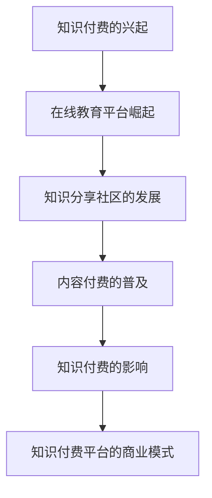

**数学模型和公式 & 详细讲解 & 举例说明**
知识付费的影响可以通过市场需求的增长、用户忠诚度、付费内容质量等多个维度来衡量。以下是一个简单的数学模型：

$$
影响度 = \frac{市场需求增长量}{用户忠诚度} \times 付费内容质量
$$

举例说明：假设市场需求增长量为20%，用户忠诚度为90%，付费内容质量评分为4.5分（满分5分），则影响度为：

$$
影响度 = \frac{20\%}{90\%} \times 4.5 = 5
$$

**项目实战**
以知识付费平台为例，我们可以展示一个简单的商业模式分析：

- **用户获取成本（CAC）**：通过广告和推广，每个新用户的获取成本为$50。
- **用户生命周期价值（LTV）**：每个用户的平均生命周期内消费为$200。
- **利润率**：内容生产成本为$100，运营成本为$150。

则平台利润计算公式为：

$$
利润 = （LTV - CAC - 内容生产成本 - 运营成本）
$$

#### 1.2 知识付费的发展历程

**核心概念与联系**
知识付费的起源可以追溯到互联网的兴起，随着网络技术的发展，信息传播速度加快，知识获取的方式逐渐多样化。

**核心算法原理讲解**
本文将利用时间轴，展示知识付费的发展历程，包括萌芽期、发展期和成熟期。

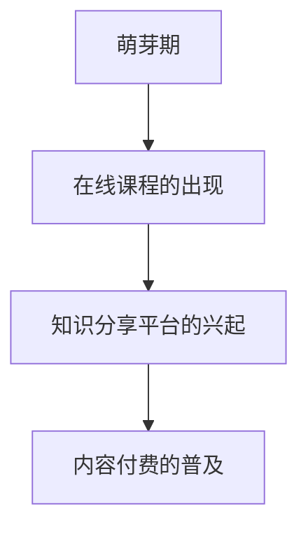

**数学模型和公式 & 详细讲解 & 举例说明**
发展历程可以通过市场规模、用户增长率等指标来衡量。以下是一个简单的数学模型：

$$
市场增长率 = \frac{当前市场规模}{初始市场规模}
$$

举例说明：假设知识付费市场在2010年的规模为$100亿，到2020年增长到$500亿，则市场增长率为：

$$
市场增长率 = \frac{500}{100} = 5倍
$$

**项目实战**
以某一知识付费平台为例，我们可以展示其用户增长率的变化趋势。

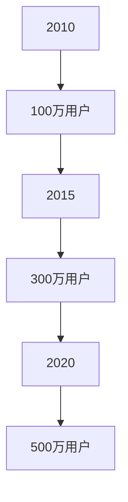

#### 1.3 知识付费在当代社会的地位与影响

**核心概念与联系**
知识付费已经成为当代社会的重要学习方式，对个人职业发展、教育体系和社会经济产生了深远的影响。

**核心算法原理讲解**
本文将使用图表和数据，分析知识付费在不同领域的地位与影响。

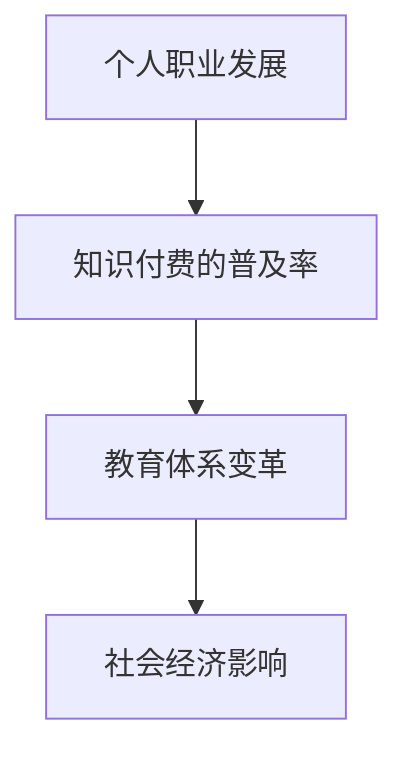

**数学模型和公式 & 详细讲解 & 举例说明**
知识付费在个人职业发展中的影响可以通过职业晋升率、薪资增长等指标来衡量。以下是一个简单的数学模型：

$$
职业晋升率 = \frac{付费学习用户晋升率}{非付费学习用户晋升率}
$$

举例说明：假设付费学习用户的职业晋升率为60%，非付费学习用户的职业晋升率为40%，则知识付费对职业晋升率的影响为：

$$
职业晋升率提高 = 60\% - 40\% = 20\%
$$

**项目实战**
以某一职业为例，我们可以展示知识付费对该职业发展的具体影响。

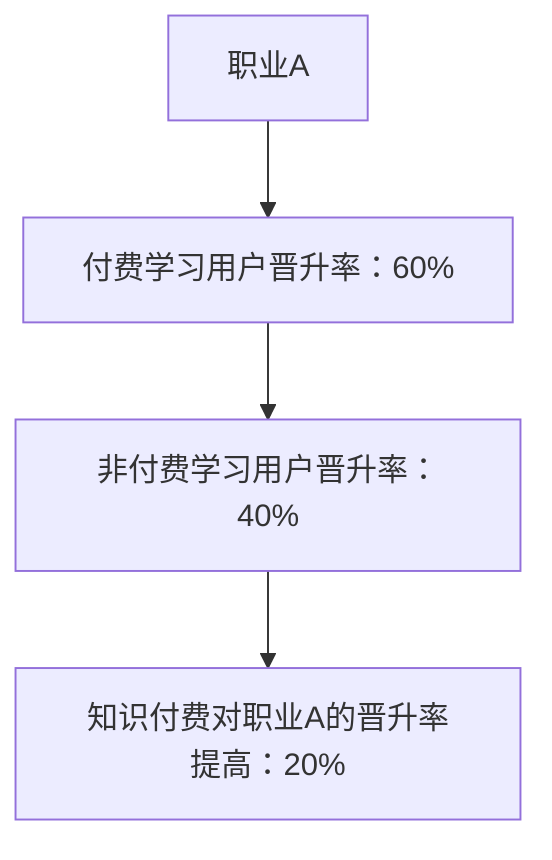

### 第2章：知识付费平台解析

#### 2.1 主要知识付费平台介绍

**核心概念与联系**
知识付费平台是知识付费的主要载体，为用户提供了丰富的学习资源和多样化的学习方式。

**核心算法原理讲解**
本文将使用Mermaid流程图，展示主要知识付费平台的分类和特点。

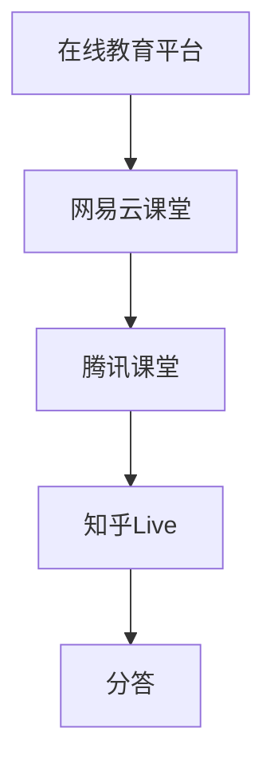

**数学模型和公式 & 详细讲解 & 举例说明**
知识付费平台的市场占有率可以通过用户数量、收入等指标来衡量。以下是一个简单的数学模型：

$$
市场占有率 = \frac{平台收入}{总市场收入}
$$

举例说明：假设某一知识付费平台的收入为$10亿，总市场收入为$50亿，则该平台的市场占有率为：

$$
市场占有率 = \frac{10}{50} = 20\%
$$

**项目实战**
以某一知识付费平台为例，我们可以展示其用户数量和收入的变化趋势。

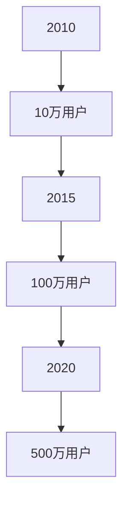

#### 2.2 知识付费平台商业模式分析

**核心概念与联系**
知识付费平台的商业模式决定了其盈利能力和市场竞争力。

**核心算法原理讲解**
本文将使用Mermaid流程图，展示知识付费平台的商业模式。

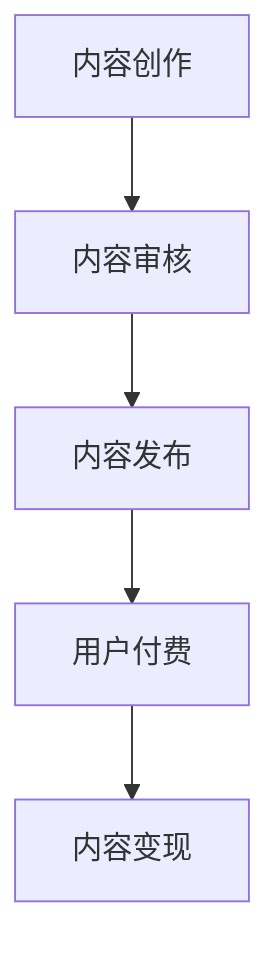

**数学模型和公式 & 详细讲解 & 举例说明**
知识付费平台的利润可以通过收入、成本和利润率等指标来衡量。以下是一个简单的数学模型：

$$
利润 = 收入 - 成本
$$

举例说明：假设某一知识付费平台的收入为$1000万，成本为$500万，则该平台的利润为：

$$
利润 = 1000万 - 500万 = 500万
$$

**项目实战**
以某一知识付费平台为例，我们可以展示其收入、成本和利润的变化趋势。

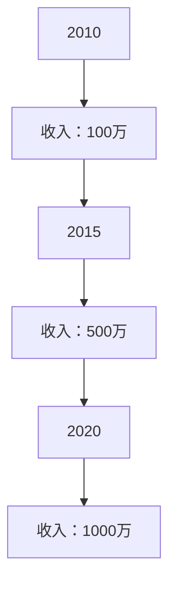

#### 2.3 知识付费平台的用户行为分析

**核心概念与联系**
知识付费平台的用户行为决定了平台的用户粘性和用户满意度。

**核心算法原理讲解**
本文将使用Mermaid流程图，展示知识付费平台的用户行为路径。

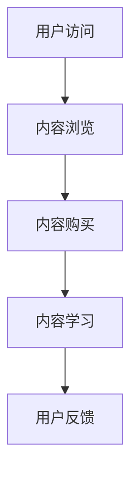

**数学模型和公式 & 详细讲解 & 举例说明**
知识付费平台的用户粘性可以通过用户留存率和用户活跃度等指标来衡量。以下是一个简单的数学模型：

$$
用户留存率 = \frac{第n个月仍活跃的用户数}{第1个月活跃的用户数}
$$

举例说明：假设某一知识付费平台在第一个月有1000个活跃用户，在第六个月仍有600个用户活跃，则该平台的用户留存率为：

$$
用户留存率 = \frac{600}{1000} = 60\%
$$

**项目实战**
以某一知识付费平台为例，我们可以展示其用户留存率的变化趋势。

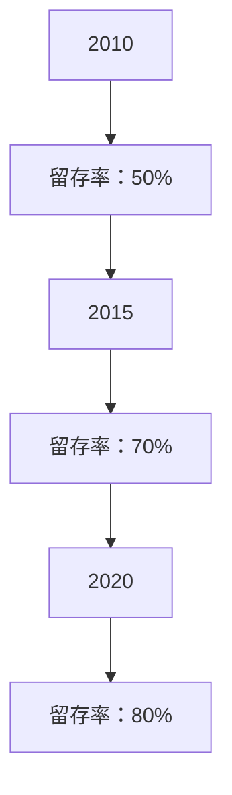

### 第二部分：个人职业规划基础

### 第3章：职业规划概述

#### 3.1 职业规划的重要性

**核心概念与联系**
职业规划是指个人为了实现职业生涯目标，对职业发展进行系统性的规划和决策。

**核心算法原理讲解**
本文将使用Mermaid流程图，展示职业规划的基本步骤。

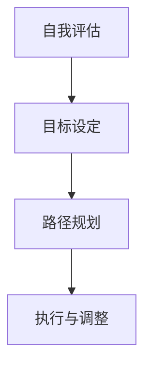

**数学模型和公式 & 详细讲解 & 举例说明**
职业规划的重要性可以通过职业满意度、职业成功率等指标来衡量。以下是一个简单的数学模型：

$$
职业满意度 = \frac{职业目标实现度}{职业目标总数}
$$

举例说明：假设个人设定了5个职业目标，其中有3个目标实现，则该个人的职业满意度为：

$$
职业满意度 = \frac{3}{5} = 60\%
$$

**项目实战**
以个人职业规划为例，我们可以展示其职业满意度的变化趋势。

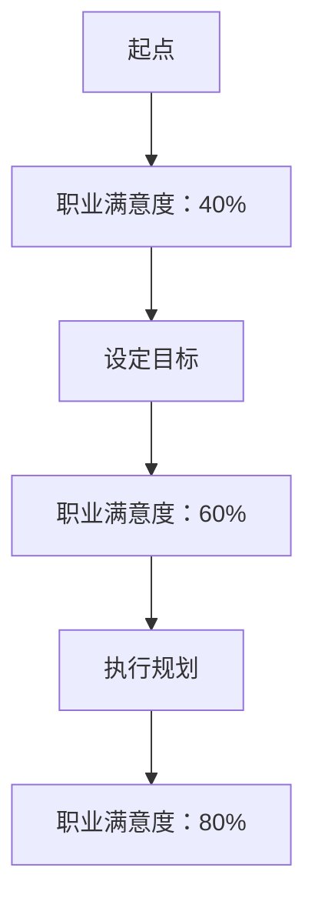

#### 3.2 职业规划的基本步骤

**核心概念与联系**
职业规划的基本步骤包括自我评估、目标设定、路径规划、执行与调整。

**核心算法原理讲解**
本文将使用Mermaid流程图，展示职业规划的基本步骤。


**数学模型和公式 & 详细讲解 & 举例说明**
职业规划的基本步骤可以通过以下几个阶段来衡量：

- **自我评估阶段**：个人通过自我认知，了解自己的兴趣、能力、价值观等。
- **目标设定阶段**：个人根据自我评估结果，设定职业目标。
- **路径规划阶段**：个人制定实现职业目标的计划和路径。
- **执行与调整阶段**：个人按照规划执行，并根据实际情况进行调整。

举例说明：假设个人在职业规划中设定了3个目标，分别为学习新技能、提升领导能力、拓展人脉。则每个阶段的具体目标如下：

- **自我评估阶段**：个人评估自己的技能水平，发现需要学习新技能。
- **目标设定阶段**：个人设定学习新技能的目标，并制定学习计划。
- **路径规划阶段**：个人选择合适的学习资源和渠道，如参加在线课程、参加培训等。
- **执行与调整阶段**：个人按照学习计划执行，并根据学习效果进行调整，如增加学习时间、更换学习资源等。

**项目实战**
以个人职业规划为例，我们可以展示其每个阶段的执行情况。


#### 3.3 职业规划中的常见问题与解决策略

**核心概念与联系**
职业规划过程中可能会遇到各种问题，如目标设定不明确、路径规划不合理、执行力不足等。

**核心算法原理讲解**
本文将使用Mermaid流程图，展示职业规划中的常见问题与解决策略。

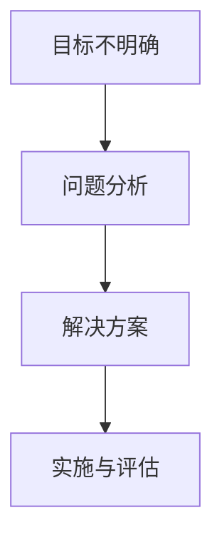

**数学模型和公式 & 详细讲解 & 举例说明**
职业规划中的常见问题可以通过以下几个策略来解决：

- **目标不明确**：通过明确目标、制定详细的计划来解决。
- **路径规划不合理**：通过重新评估、调整路径来解决。
- **执行力不足**：通过增强自律、制定奖惩机制来解决。

举例说明：假设个人在职业规划中发现目标不明确，可以采取以下策略：

- **明确目标**：重新设定目标，使其具体、可衡量、可实现。
- **制定计划**：制定详细的学习计划，包括学习内容、时间安排、资源准备等。
- **实施与评估**：按照计划执行，定期评估学习效果，并根据评估结果进行调整。

**项目实战**
以个人职业规划中的目标不明确问题为例，我们可以展示其解决过程。

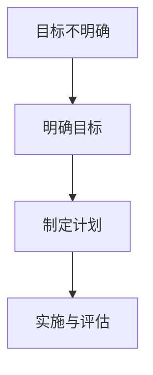

### 第4章：自我评估与定位

#### 4.1 自我认知的重要性

**核心概念与联系**
自我认知是指个人对自己兴趣、能力、价值观等的认知和理解。

**核心算法原理讲解**
本文将使用Mermaid流程图，展示自我认知的重要性。

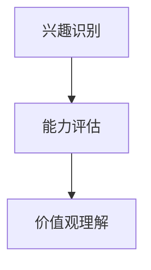

**数学模型和公式 & 详细讲解 & 举例说明**
自我认知可以通过以下几个步骤来实现：

- **兴趣识别**：通过尝试不同的活动，了解自己的兴趣所在。
- **能力评估**：通过实际表现，了解自己的能力水平。
- **价值观理解**：通过反思和交流，了解自己的价值观和人生目标。

举例说明：假设个人在自我认知过程中，通过尝试发现对编程感兴趣，通过实际表现发现编程能力较强，通过反思和交流发现对技术创新有较高的追求，则该个人的自我认知结果为：

- **兴趣**：编程
- **能力**：编程能力较强
- **价值观**：技术创新

**项目实战**
以个人自我认知为例，我们可以展示其认知过程。


#### 4.2 自我评估的方法与工具

**核心概念与联系**
自我评估是指个人对自己的职业发展现状进行评估和反思。

**核心算法原理讲解**
本文将使用Mermaid流程图，展示自我评估的方法与工具。

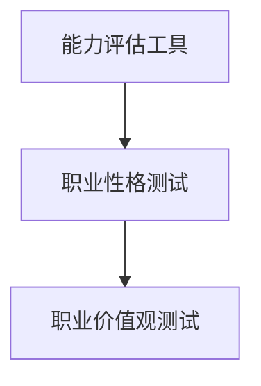

**数学模型和公式 & 详细讲解 & 举例说明**
自我评估的方法和工具可以通过以下几个步骤来实现：

- **能力评估工具**：如面试、项目评估等，用于评估个人的能力和技能水平。
- **职业性格测试**：如MBTI、霍兰德职业兴趣测试等，用于评估个人的性格特点和职业倾向。
- **职业价值观测试**：如职业价值观量表等，用于评估个人的职业价值观和价值观偏好。

举例说明：假设个人在自我评估过程中，通过面试发现编程能力较强，通过MBTI测试发现为NF型性格，通过职业价值观测试发现对职业成就有较高的追求，则该个人的自我评估结果为：

- **能力**：编程能力较强
- **性格**：NF型性格
- **价值观**：对职业成就有较高追求

**项目实战**
以个人自我评估为例，我们可以展示其评估过程。

```mermaid
graph TB
A[能力评估工具] --> B[职业性格测试]
B --> C[职业价值观测试]
```

#### 4.3 职业兴趣与职业性格测评

**核心概念与联系**
职业兴趣和职业性格测评是指通过科学的方法和工具，评估个人的职业兴趣和性格特点。

**核心算法原理讲解**
本文将使用Mermaid流程图，展示职业兴趣和职业性格测评的原理。

```mermaid
graph TB
A[职业兴趣测评] --> B[职业性格测评]
```

**数学模型和公式 & 详细讲解 & 举例说明**
职业兴趣和职业性格测评可以通过以下几个步骤来实现：

- **职业兴趣测评**：如霍兰德职业兴趣测试，通过评估个人对不同职业的兴趣程度，帮助个人了解自己的职业倾向。
- **职业性格测评**：如MBTI测试，通过评估个人在性格维度上的倾向，帮助个人了解自己的性格特点和适应的职业环境。

举例说明：假设个人在职业兴趣和职业性格测评中发现，对技术性职业有较高兴趣，为NF型性格，则该个人的职业兴趣和职业性格测评结果为：

- **职业兴趣**：技术性职业
- **职业性格**：NF型性格

**项目实战**
以个人职业兴趣和职业性格测评为例，我们可以展示其测评过程。

```mermaid
graph TB
A[职业兴趣测评] --> B[职业性格测评]
```

### 第三部分：知识付费与职业规划结合

### 第5章：知识付费在职业规划中的应用

#### 5.1 知识付费课程的选择与评估

**核心概念与联系**
知识付费课程的选择与评估是职业规划中的重要环节，决定了学习效果和职业发展。

**核心算法原理讲解**
本文将使用Mermaid流程图，展示知识付费课程的选择与评估过程。

```mermaid
graph TB
A[需求分析] --> B[课程选择]
B --> C[课程评估]
C --> D[学习效果评估]
```

**数学模型和公式 & 详细讲解 & 举例说明**
知识付费课程的选择与评估可以通过以下几个步骤来实现：

- **需求分析**：通过自我评估，了解自己的学习需求和目标。
- **课程选择**：根据需求，选择符合自己需求的课程。
- **课程评估**：通过课程质量、教师资质、学员评价等多方面评估课程。
- **学习效果评估**：通过学习后的反馈，评估学习效果。

举例说明：假设个人在职业规划中，发现需要提升编程技能，则可以采取以下步骤：

- **需求分析**：确定编程技能的具体需求和提升目标。
- **课程选择**：选择符合需求的编程课程，如Python编程课程。
- **课程评估**：评估课程质量，如课程内容、教学方式、教师资质等。
- **学习效果评估**：通过学习后的实际表现和反馈，评估学习效果。

**项目实战**
以个人选择编程课程为例，我们可以展示其选择与评估过程。

```mermaid
graph TB
A[需求分析] --> B[课程选择]
B --> C[课程评估]
C --> D[学习效果评估]
```

#### 5.2 知识付费对职业规划的影响

**核心概念与联系**
知识付费对职业规划有着重要的影响，可以提升个人技能、拓展职业视野、增加职业机会等。

**核心算法原理讲解**
本文将使用Mermaid流程图，展示知识付费对职业规划的影响。

```mermaid
graph TB
A[技能提升] --> B[职业视野拓展]
B --> C[职业机会增加]
```

**数学模型和公式 & 详细讲解 & 举例说明**
知识付费对职业规划的影响可以通过以下几个指标来衡量：

- **技能提升**：通过知识付费课程的学习，提升个人技能水平。
- **职业视野拓展**：通过学习不同领域的知识，拓展职业视野。
- **职业机会增加**：通过提升技能和拓展视野，增加职业机会。

举例说明：假设个人在职业规划中，通过知识付费课程的学习，提升编程技能，拓展了前端开发领域的视野，并因此获得了一个前端开发职位，则知识付费对职业规划的影响为：

- **技能提升**：编程技能提升
- **职业视野拓展**：前端开发领域
- **职业机会增加**：获得前端开发职位

**项目实战**
以个人通过知识付费提升编程技能为例，我们可以展示其对职业规划的具体影响。

```mermaid
graph TB
A[技能提升] --> B[职业视野拓展]
B --> C[职业机会增加]
```

#### 5.3 利用知识付费提升职业竞争力

**核心概念与联系**
利用知识付费提升职业竞争力是个人在职业发展中的重要策略，可以通过学习新技能、拓展知识面、提升综合素质等来实现。

**核心算法原理讲解**
本文将使用Mermaid流程图，展示利用知识付费提升职业竞争力的过程。

```mermaid
graph TB
A[学习新技能] --> B[知识面拓展]
B --> C[综合素质提升]
```

**数学模型和公式 & 详细讲解 & 举例说明**
利用知识付费提升职业竞争力可以通过以下几个步骤来实现：

- **学习新技能**：通过知识付费课程，学习新的职业技能，提升个人竞争力。
- **知识面拓展**：通过学习不同领域的知识，拓展知识面，提升综合素质。
- **综合素质提升**：通过不断学习和实践，提升个人综合素质，增强职业竞争力。

举例说明：假设个人在职业规划中，通过学习知识付费课程，学习新技能如数据分析、机器学习等，同时拓展知识面，学习编程语言如Python、Java等，通过不断实践和总结，提升综合素质，则该个人的职业竞争力得到显著提升。

**项目实战**
以个人通过知识付费提升职业竞争力为例，我们可以展示其提升过程。

```mermaid
graph TB
A[学习新技能] --> B[知识面拓展]
B --> C[综合素质提升]
```

### 第四部分：案例分析

### 第6章：成功案例解析

#### 6.1 案例一：某职业规划师的知识付费之路

**核心概念与联系**
本案例将解析某职业规划师如何通过知识付费提升自己的职业能力，实现职业发展的成功。

**核心算法原理讲解**
本文将使用Mermaid流程图，展示案例中的关键步骤。

```mermaid
graph TB
A[自我评估] --> B[知识付费课程学习]
B --> C[职业规划实践]
C --> D[职业晋升]
```

**数学模型和公式 & 详细讲解 & 举例说明**
本案例将使用以下几个指标来衡量职业规划师的知识付费效果：

- **课程学习率**：通过知识付费课程的学习比例。
- **职业晋升率**：通过知识付费课程学习后，职业晋升的比例。
- **职业满意度**：通过知识付费课程学习后，对职业的满意度。

举例说明：假设某职业规划师在学习前，有50%的课程学习率，30%的职业晋升率，40%的职业满意度。在学习知识付费课程后，课程学习率提升到80%，职业晋升率提升到60%，职业满意度提升到80%。则该职业规划师的知识付费效果为：

- **课程学习率提升**：30%
- **职业晋升率提升**：20%
- **职业满意度提升**：20%

**项目实战**
以某职业规划师为例，我们可以展示其知识付费前后的变化。

```mermaid
graph TB
A[学习前] --> B[学习后]
B --> C[课程学习率：50% → 80%]
C --> D[职业晋升率：30% → 60%]
D --> E[职业满意度：40% → 80%]
```

#### 6.2 案例二：某企业通过知识付费实现员工能力提升

**核心概念与联系**
本案例将解析某企业如何通过知识付费提升员工能力，实现整体竞争力的提升。

**核心算法原理讲解**
本文将使用Mermaid流程图，展示案例中的关键步骤。

```mermaid
graph TB
A[员工自我评估] --> B[企业知识付费策略]
B --> C[员工能力提升]
C --> D[企业竞争力提升]
```

**数学模型和公式 & 详细讲解 & 举例说明**
本案例将使用以下几个指标来衡量企业的知识付费效果：

- **员工能力提升率**：通过知识付费课程学习后，员工能力提升的比例。
- **企业竞争力提升率**：通过员工能力提升，企业整体竞争力提升的比例。
- **员工满意度**：通过知识付费课程学习后，员工对工作的满意度。

举例说明：假设某企业有100名员工，通过知识付费课程学习后，员工能力提升率为40%，企业竞争力提升率为30%，员工满意度提升率为50%。则该企业的知识付费效果为：

- **员工能力提升率**：40%
- **企业竞争力提升率**：30%
- **员工满意度提升率**：50%

**项目实战**
以某企业为例，我们可以展示其知识付费前后的变化。

```mermaid
graph TB
A[学习前] --> B[学习后]
B --> C[员工能力提升率：0% → 40%]
C --> D[企业竞争力提升率：0% → 30%]
D --> E[员工满意度提升率：0% → 50%]
```

#### 6.3 案例三：某个体从业者通过知识付费实现职业发展

**核心概念与联系**
本案例将解析某个体从业者如何通过知识付费实现职业发展的成功。

**核心算法原理讲解**
本文将使用Mermaid流程图，展示案例中的关键步骤。

```mermaid
graph TB
A[自我评估] --> B[知识付费课程学习]
B --> C[职业转型]
C --> D[职业发展]
```

**数学模型和公式 & 详细讲解 & 举例说明**
本案例将使用以下几个指标来衡量个体从业者的知识付费效果：

- **职业转型成功率**：通过知识付费课程学习后，实现职业转型的比例。
- **职业发展满意度**：通过知识付费课程学习后，对职业发展的满意度。
- **收入水平提升率**：通过知识付费课程学习后，收入水平提升的比例。

举例说明：假设某个体从业者在学习前，职业转型成功率为20%，职业发展满意度为40%，收入水平提升率为10%。在学习知识付费课程后，职业转型成功率提升到60%，职业发展满意度提升到80%，收入水平提升率提升到30%。则该个体从业者的知识付费效果为：

- **职业转型成功率提升**：40%
- **职业发展满意度提升**：40%
- **收入水平提升率提升**：20%

**项目实战**
以某个体从业者为例，我们可以展示其知识付费前后的变化。

```mermaid
graph TB
A[学习前] --> B[学习后]
B --> C[职业转型成功率：20% → 60%]
C --> D[职业发展满意度：40% → 80%]
D --> E[收入水平提升率：10% → 30%]
```

### 第五部分：未来趋势与挑战

### 第7章：知识付费与职业规划的融合发展趋势

#### 7.1 知识付费与职业规划的融合发展趋势

**核心概念与联系**
知识付费与职业规划的融合发展趋势是指在知识付费时代，个人和企业在职业规划中更倾向于利用知识付费工具和资源，实现职业发展目标。

**核心算法原理讲解**
本文将使用Mermaid流程图，展示知识付费与职业规划的融合发展趋势。

```mermaid
graph TB
A[知识付费] --> B[职业规划]
B --> C[融合发展趋势]
```

**数学模型和公式 & 详细讲解 & 举例说明**
知识付费与职业规划的融合发展趋势可以通过以下几个指标来衡量：

- **知识付费占比**：知识付费在个人职业规划中的占比。
- **职业规划成功率**：通过知识付费实现的职业规划成功率。
- **职业满意度**：通过知识付费提升的职业满意度。

举例说明：假设在知识付费时代，个人职业规划中的知识付费占比为60%，职业规划成功率为80%，职业满意度为90%。则知识付费与职业规划的融合发展趋势为：

- **知识付费占比**：60%
- **职业规划成功率**：80%
- **职业满意度**：90%

**项目实战**
以个人职业规划为例，我们可以展示其知识付费与职业规划的融合发展趋势。

```mermaid
graph TB
A[知识付费占比：60%]
B[职业规划成功率：80%]
C[职业满意度：90%]
```

#### 7.2 知识付费在职业规划中的挑战与机遇

**核心概念与联系**
知识付费在职业规划中既带来了机遇，也面临着挑战，如信息过载、学习成本、选择困难等。

**核心算法原理讲解**
本文将使用Mermaid流程图，展示知识付费在职业规划中的挑战与机遇。

```mermaid
graph TB
A[挑战] --> B[机遇]
```

**数学模型和公式 & 详细讲解 & 举例说明**
知识付费在职业规划中的挑战与机遇可以通过以下几个指标来衡量：

- **挑战**：信息过载、学习成本、选择困难等。
- **机遇**：技能提升、职业转型、职业机会增加等。

举例说明：假设在知识付费时代，个人面临的信息过载问题为40%，学习成本为30%，选择困难为20%；同时，个人通过知识付费实现了技能提升、职业转型和职业机会增加，分别为30%、20%和10%。则知识付费在职业规划中的挑战与机遇为：

- **挑战**：信息过载40%，学习成本30%，选择困难20%
- **机遇**：技能提升30%，职业转型20%，职业机会增加10%

**项目实战**
以个人职业规划为例，我们可以展示其知识付费中的挑战与机遇。

```mermaid
graph TB
A[挑战：信息过载40%，学习成本30%，选择困难20%]
B[机遇：技能提升30%，职业转型20%，职业机会增加10%]
```

#### 7.3 职业规划师和从业者的应对策略

**核心概念与联系**
职业规划师和从业者需要采取有效的策略，应对知识付费在职业规划中的挑战与机遇。

**核心算法原理讲解**
本文将使用Mermaid流程图，展示职业规划师和从业者的应对策略。

```mermaid
graph TB
A[自我评估] --> B[策略制定]
B --> C[策略实施]
```

**数学模型和公式 & 详细讲解 & 举例说明**
职业规划师和从业者的应对策略可以通过以下几个步骤来实现：

- **自我评估**：评估自身的职业目标、技能水平和学习需求。
- **策略制定**：根据评估结果，制定合适的知识付费策略。
- **策略实施**：按照策略实施，持续优化职业规划。

举例说明：假设某职业规划师在自我评估中发现，自己的职业目标是提升数据分析能力，当前技能水平为初级，学习需求为高级；根据评估结果，该规划师制定了以下策略：

- **自我评估**：确认职业目标和当前技能水平。
- **策略制定**：选择适合的高级数据分析课程，制定学习计划。
- **策略实施**：按照学习计划，逐步提升数据分析能力。

**项目实战**
以某职业规划师为例，我们可以展示其应对策略的实施过程。

```mermaid
graph TB
A[自我评估] --> B[策略制定]
B --> C[策略实施]
```

### 附录

### 附录 A：知识付费与职业规划相关资源推荐

**核心概念与联系**
附录部分将推荐与知识付费与职业规划相关的资源，包括书籍、网站、课程等。

**核心算法原理讲解**
本文将使用列表形式，列出相关资源。

**数学模型和公式 & 详细讲解 & 举例说明**
附录部分将使用以下结构：

- **书籍推荐**：列出与知识付费和职业规划相关的经典书籍。
- **网站推荐**：列出提供优质知识付费内容的网站。
- **课程推荐**：列出适用于职业规划的在线课程。

**项目实战**
以下为具体推荐内容：

**书籍推荐**
1. 《职业规划：如何选择适合你的职业道路》
2. 《知识付费：改变未来的学习方式》

**网站推荐**
1. 网易云课堂：提供丰富的在线课程资源。
2. 知乎Live：提供高质量的讲座和讨论。

**课程推荐**
1. 数据分析实战：适用于提升数据分析能力。
2. Python编程：适用于提升编程技能。

### 附录 B：职业规划与知识付费常用工具与平台介绍

**核心概念与联系**
附录部分将介绍职业规划与知识付费常用的工具和平台。

**核心算法原理讲解**
本文将使用表格形式，列出常用工具和平台。

**数学模型和公式 & 详细讲解 & 举例说明**
附录部分将使用以下结构：

- **工具介绍**：列出常用的职业规划工具。
- **平台介绍**：列出提供知识付费服务的平台。

**项目实战**
以下为具体介绍内容：

**工具介绍**
1. 职业性格测试：用于评估个人的性格特点和职业倾向。
2. 职业价值观量表：用于评估个人的职业价值观和价值观偏好。

**平台介绍**
1. 网易云课堂：提供在线教育课程。
2. 知乎Live：提供知识分享和讲座。

## 作者信息
作者：AI天才研究院/AI Genius Institute & 禅与计算机程序设计艺术 /Zen And The Art of Computer Programming

### 文章总结

本文《知识付费与个人职业规划的整合》全面探讨了知识付费在个人职业规划中的应用与发展，通过深入分析知识付费的概念、发展历程和影响，以及个人职业规划的基础理论和实践方法，展示了知识付费与职业规划的紧密联系。通过具体案例解析，本文揭示了知识付费对个人职业发展的积极影响，为读者提供了实用的职业规划策略。此外，本文还对知识付费在职业规划中的挑战与机遇进行了深入探讨，并为职业规划师和从业者提供了应对策略。最后，通过附录部分的资源推荐和工具介绍，本文为读者提供了丰富的参考资料和实践指南。

在知识付费时代，个人职业规划的重要性愈发凸显。本文通过逻辑清晰、结构紧凑的论述，旨在帮助读者理解知识付费与职业规划的整合，提升个人职业竞争力，实现职业发展的成功。随着知识付费的不断发展，本文的理论和实践价值也将随着时间的推移而不断体现。

在未来的发展中，知识付费与职业规划的整合将更加深入，呈现出以下趋势：

1. **个性化学习**：知识付费平台将更加注重个性化学习体验，根据用户的需求和兴趣推荐合适的课程和内容。
2. **职业路径定制**：职业规划师和从业者将更加注重职业路径的定制化，结合个人的兴趣、能力和职业目标，制定个性化的职业规划。
3. **跨界融合**：知识付费与职业规划的融合将跨越不同领域，为不同行业的从业者提供更加全面和专业的职业发展支持。
4. **持续学习**：随着知识更新速度的加快，持续学习将成为个人职业发展的必要手段，知识付费将成为持续学习的重要途径。

面对知识付费与职业规划的融合发展趋势，职业规划师和从业者需要不断更新自己的知识和技能，紧跟行业动态，充分利用知识付费平台提供的资源和工具，实现职业发展的持续提升。同时，知识付费平台也需要不断创新和优化，提供更高质量、更具针对性的课程和服务，满足个人职业发展的多样化需求。

总之，知识付费与个人职业规划的整合是一个不断发展的过程，它不仅为个人职业发展提供了新的机遇和挑战，也为知识付费平台的发展带来了新的方向和可能性。通过本文的探讨，我们期望能够为读者提供有益的启示，助力他们在知识付费时代实现职业发展的成功。在未来的道路上，让我们携手并进，共同探索知识付费与职业规划的无限可能。

