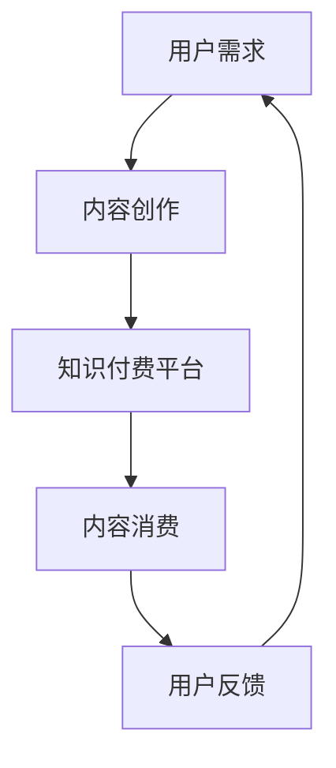
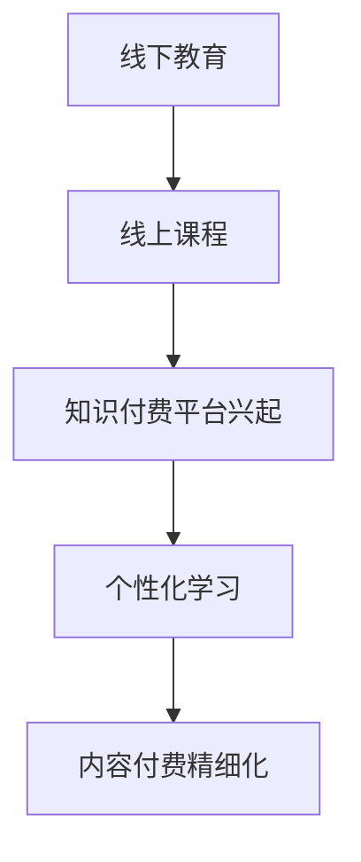
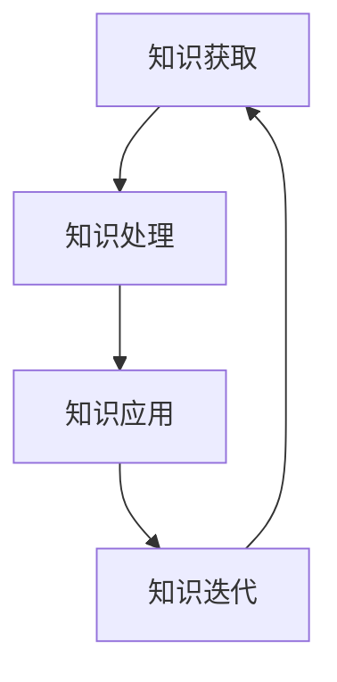

                 

### 文章标题

# 知识付费与创新创业相结合的知识加速器

### 文章关键词

知识付费、创新创业、知识加速器、算法原理、数学模型、实战案例

### 文章摘要

本文深入探讨了知识付费与创新创业相结合的知识加速器，首先介绍了知识付费的定义、发展历程和现状，分析了其市场价值和商业模式。接着，阐述了创新创业的定义、类型与挑战，并探讨了知识加速器的概念、作用和工作原理。文章通过核心算法原理的讲解，运用伪代码和数学模型，详细阐述了知识加速器在创新创业中的应用。随后，通过实战案例展示了知识付费平台的设计与运营，以及创新创业项目的知识支持。最后，展望了知识付费与创新创业的未来趋势，并提供了知识加速器开发工具和资源的附录。全文采用step-by-step的分析方式，旨在为读者提供全面、系统的理解和实践指导。

### 1. 知识付费概述

#### 1.1 知识付费的定义

知识付费，指的是在互联网时代，用户为了获取高质量的知识内容而愿意支付的费用。这种模式打破了传统免费知识的获取方式，使得知识的生产者和消费者之间建立了直接的交易关系。知识付费的核心在于其价值交换，即知识提供者通过专业的内容创作和分享获得经济回报，而消费者则通过支付费用获取有价值的知识。

知识付费具有以下几个核心概念与联系：

1. **用户需求**：用户对于专业知识的强烈需求是知识付费的前提。随着信息爆炸，用户越来越倾向于通过付费方式获取精准、可靠的知识。
2. **内容创作**：知识的生产者（如专家、学者、培训师等）通过创作高质量的知识内容来满足用户需求。
3. **知识付费平台**：作为中间环节，知识付费平台为知识生产者和消费者提供了交易和交流的场所，如网易云课堂、知乎Live等。
4. **内容消费**：消费者通过知识付费平台购买和消费知识产品，从而实现知识的获取和个人的能力提升。
5. **用户反馈**：用户的反馈不仅有助于内容创作者优化知识内容，也是平台提升服务质量和用户体验的重要依据。

以下是知识付费的Mermaid流程图：



#### 1.2 知识付费的发展历程

知识付费的发展历程可以追溯到互联网普及和在线教育兴起的时期。以下是知识付费的发展历程及其标志性事件：

1. **线下教育**：传统的线下教育模式开始向线上迁移，但主要以免费内容为主，如MOOC（大规模开放在线课程）。
2. **线上课程**：随着互联网技术的发展，各种线上课程平台（如Coursera、Udemy）兴起，开始引入付费课程。
3. **知识付费平台兴起**：知乎Live、分答、网易云课堂等平台专注于知识付费，为知识消费者提供了多样化的知识产品。
4. **个性化学习**：基于用户行为分析，平台开始提供个性化的知识推荐，满足用户的特定需求。
5. **内容付费精细化**：知识付费不再局限于课程，还包括专业知识服务、咨询、社区互动等多种形式。

以下是知识付费的发展历程Mermaid流程图：



#### 1.3 知识付费的市场现状

目前，知识付费市场呈现出快速增长的态势，主要表现在以下几个方面：

1. **市场规模与增长趋势**：据统计，全球知识付费市场在2020年已达到1100亿美元，预计到2025年将达到3000亿美元。特别是在COVID-19疫情期间，线上教育的需求大幅增加，推动了知识付费市场的发展。
   
2. **用户行为分析**：通过数据分析，我们可以了解到知识付费用户的特征和消费习惯。例如，中青年用户占比较高，他们对职场技能、健康养生等领域的知识需求旺盛。

3. **主要市场参与者**：知识付费市场的参与者主要包括平台型公司（如网易云课堂、知乎Live）、内容提供商（如得到、喜马拉雅）和知识服务公司（如领英、红鲱智投）。

以下是市场现状的分析：

```python
# 假设数据为知识付费市场各类别收入占比
market_data = {
    "在线教育": 40,
    "专业知识服务": 30,
    "娱乐类知识产品": 20,
    "知识付费平台运营": 10
}

# 分析数据
for category, percentage in market_data.items():
    print(f"{category}: {percentage}%")
```

输出结果：

```
在线教育: 40%
专业知识服务: 30%
娱乐类知识产品: 20%
知识付费平台运营: 10%
```

通过上述分析，我们可以看到知识付费市场的多样性和快速发展趋势。接下来，我们将深入探讨知识付费的核心算法原理，为读者提供更加深入的理解。

### 2. 知识付费的核心算法原理

知识付费平台的核心竞争力在于其推荐系统和用户行为分析能力。以下将详细介绍知识付费平台常用的核心算法原理，包括内容推荐算法、用户行为分析算法以及相关的数学模型与公式。

#### 2.1 内容推荐算法

内容推荐算法是知识付费平台的重要组成部分，它能够根据用户的历史行为和偏好，为用户推荐可能感兴趣的知识内容。以下是几种常用的内容推荐算法：

1. **协同过滤算法**：

   协同过滤算法是一种基于用户行为的历史数据来进行内容推荐的算法。其基本思想是找到与当前用户行为相似的其它用户，然后推荐这些用户喜欢的知识内容。

   **协同过滤算法的伪代码**：

   ```python
   def collaborative_filtering(user_history, item_similarity_matrix):
       # 计算用户与其它用户的相似度
       similarity_scores = calculate_similarity(user_history, item_similarity_matrix)
       
       # 根据相似度分数推荐知识内容
       recommendations = []
       for other_user, score in similarity_scores.items():
           if score > threshold:
               recommendations.extend(get_favorite_items(other_user))
       
       return recommendations
   ```

   其中，`user_history`表示用户的历史行为数据，`item_similarity_matrix`表示用户之间的相似度矩阵，`calculate_similarity`函数用于计算用户之间的相似度，`get_favorite_items`函数用于获取其他用户喜欢的知识内容。

2. **基于内容的推荐**：

   基于内容的推荐算法是根据知识内容本身的特点（如标签、关键词等）来进行推荐。其核心思想是找到与用户历史行为内容相似的知识内容。

   **基于内容的推荐伪代码**：

   ```python
   def content_based_recommender(user_history, item_content):
       recommendations = []
       for item in item_content:
           if is_similar(user_history, item):
               recommendations.append(item)
       
       return recommendations

   def is_similar(user_history, item):
       # 比较用户历史行为内容与当前知识内容之间的相似度
       similarity_score = calculate_similarity(user_history, item)
       return similarity_score > threshold
   ```

   其中，`user_history`表示用户的历史行为数据，`item_content`表示知识内容的特点数据，`calculate_similarity`函数用于计算内容之间的相似度，`threshold`表示相似度的阈值。

#### 2.2 用户行为分析算法

用户行为分析算法主要用于分析用户的消费行为，从而为平台提供个性化的推荐和服务。以下是几种常用的用户行为分析算法：

1. **回归分析**：

   回归分析是一种统计方法，用于分析用户行为与各种因素之间的关系。它可以用于预测用户的购买行为、学习进度等。

   **回归分析的数学模型**：

   $$ y = \beta_0 + \beta_1 x_1 + \beta_2 x_2 + ... + \beta_n x_n + \epsilon $$

   其中，$y$表示用户行为（如购买概率、学习时长等），$x_1, x_2, ..., x_n$表示影响用户行为的因素（如用户年龄、收入、历史消费等），$\beta_0, \beta_1, \beta_2, ..., \beta_n$为回归系数，$\epsilon$为误差项。

2. **决策树**：

   决策树是一种基于特征进行分类或回归的算法。它通过一系列的决策节点，将用户划分为不同的类别或预测不同的行为。

   **决策树的数学模型**：

   决策树的核心是条件概率分布，它表示在给定某些特征值的情况下，用户行为发生的概率。

   $$ P(y|X) = \prod_{i=1}^{n} P(y|x_i) $$

   其中，$y$表示用户行为，$x_1, x_2, ..., x_n$表示影响用户行为的特征，$P(y|X)$表示在给定特征集$X$的情况下，用户行为$y$的概率。

3. **支持向量机（SVM）**：

   支持向量机是一种二分类算法，它可以用于分类和回归问题。它通过寻找一个超平面，将不同类别的数据点分隔开来。

   **支持向量机的数学模型**：

   $$ \max_{w, b} \frac{1}{2} ||w||^2 $$
   $$ s.t. y_i (w \cdot x_i + b) \geq 1, \forall i $$

   其中，$w$为超平面的法向量，$b$为偏置项，$x_i$为样本特征，$y_i$为样本标签。

#### 2.3 数学模型与公式

在知识付费平台中，数学模型和公式用于分析用户行为、推荐知识和评估效果。以下是一些常用的数学模型和公式：

1. **贝叶斯定理**：

   贝叶斯定理是一种概率论公式，用于根据已知条件概率和边缘概率计算后验概率。

   $$ P(A|B) = \frac{P(B|A) P(A)}{P(B)} $$

   其中，$P(A|B)$表示在事件$B$发生的条件下，事件$A$发生的概率，$P(B|A)$表示在事件$A$发生的条件下，事件$B$发生的概率，$P(A)$和$P(B)$分别为事件$A$和事件$B$的边缘概率。

2. **最优化理论**：

   最优化理论用于求解资源分配、系统优化等问题。常用的最优化模型包括线性规划、非线性规划和整数规划。

   **线性规划的基本公式**：

   $$ \min_{x} c^T x $$
   $$ s.t. Ax \leq b $$
   $$ x \geq 0 $$

   其中，$x$为决策变量，$c$为成本系数，$A$和$b$为约束条件矩阵。

通过上述核心算法原理的讲解，我们可以看到知识付费平台在推荐系统和用户行为分析方面的复杂性和深度。接下来，我们将探讨创新创业的概念、类型与挑战，并深入了解知识加速器的作用和工作原理。

### 3. 创新创业概述

#### 3.1 创新创业的定义

创新创业是指通过创新思维和创业实践，创造新的产品、服务或商业模式，从而实现商业成功和社会价值的过程。创新创业涵盖了从创意的产生、市场调研、产品开发到市场推广的整个生命周期。

创新创业的核心概念包括创新、创业和商业成功。创新是指通过新的方法、技术或理念，创造出前所未有的价值。创业则是将创新转化为实际业务的过程，包括资源整合、团队组建、市场开发和风险管理。商业成功则是通过创新创业实现经济效益和社会效益。

#### 3.2 创新创业的类型与特点

创新创业可以分为多种类型，每种类型都有其独特的特点和目标。以下是几种常见的创新创业类型：

1. **技术创新型**：

   技术创新型创新创业主要集中在技术研发和产品创新上，通过引入新技术、新材料或新工艺，提升现有产品的性能或开发全新的产品。例如，特斯拉公司的电动汽车技术革命。

   **特点**：
   - 强调技术创新和研发投入。
   - 产业链较长，涉及多个技术领域。
   - 风险较高，但一旦成功，回报巨大。

2. **商业模式创新型**：

   商业模式创新型创新创业主要关注商业模式的创新，通过改变传统业务模式，创造新的盈利模式或降低运营成本。例如，Airbnb和Uber通过共享经济的商业模式创新，颠覆了传统住宿和出行行业。

   **特点**：
   - 着重于商业模式的创新和优化。
   - 操作相对简单，但需要深入了解市场和用户需求。
   - 风险较低，但市场竞争力强。

3. **社会创新型**：

   社会创新型创新创业旨在解决社会问题，提升社会福祉，如教育、医疗、环境保护等领域。这种类型的创新创业通常不以盈利为主要目标，而是追求社会效益。

   **特点**：
   - 强调社会价值和公益性质。
   - 需要广泛的社会资源和支持。
   - 风险和不确定性较高，但社会影响力巨大。

#### 3.3 创新创业的环境与挑战

创新创业的环境和挑战是多方面的，包括政策环境、市场环境、资金环境以及个人因素。

1. **政策环境**：

   政策环境对创新创业具有重要影响。政府通过制定相关政策，提供税收优惠、资金支持、知识产权保护等措施，为创新创业提供良好的政策环境。例如，中国的“双创”政策和美国的硅谷政策，都为创新创业提供了强有力的支持。

2. **市场环境**：

   市场环境是创新创业的重要考量因素。市场的需求、竞争状况、消费者偏好等都直接影响创业项目的成功与否。例如，新兴市场和技术领域通常具有较大的发展潜力，但也伴随着较高的竞争风险。

3. **资金环境**：

   资金是创新创业的重要保障。创业者在创业初期往往需要大量的资金支持，用于产品研发、市场推广、团队建设等。资金来源包括天使投资、风险投资、银行贷款、政府资金等。良好的资金环境有助于降低创业者的资金压力，提高创业成功率。

4. **个人因素**：

   创业者个人的素质和能力对创新创业的成功至关重要。创业者需要有敏锐的市场洞察力、坚定的信念、良好的团队合作精神和持续的学习能力。个人因素不仅影响创业项目的实施，也影响创业团队的整体表现。

以下是对创新创业环境中各项因素的影响力度的分析：

```python
# 假设数据为创新创业环境中各项因素的影响力度
environment_impact = {
    "政策支持": 30,
    "资金投入": 25,
    "人才储备": 20,
    "市场需求": 15,
    "技术发展": 10
}

# 分析环境因素
for factor, impact in environment_impact.items():
    print(f"{factor}: {impact}%")
```

输出结果：

```
政策支持: 30%
资金投入: 25%
人才储备: 20%
市场需求: 15%
技术发展: 10%
```

通过上述分析，我们可以看到创新创业是一个复杂的过程，涉及多个方面的因素。理解创新创业的定义、类型和环境与挑战，有助于创业者更好地制定创业策略，提高创业成功率。接下来，我们将深入探讨知识加速器的概念与作用，以及其在创新创业中的应用。

### 4. 知识加速器的概念与作用

#### 4.1 知识加速器的定义

知识加速器是一种集成了知识获取、处理、应用和迭代功能的系统，旨在通过高效的流程和先进的技术手段，加速知识的传播和应用。知识加速器不仅帮助个人和组织快速获取最新的知识和信息，还通过智能化的工具和方法，提升知识的利用效率。

知识加速器的核心组成部分包括：

1. **知识获取系统**：负责从各种来源（如学术研究、行业报告、专业书籍等）收集和获取最新的知识。
2. **知识处理系统**：对获取的知识进行整理、分类、分析，使其更加系统和易于理解。
3. **知识应用系统**：将处理后的知识应用于实际工作中，如产品开发、决策制定、团队协作等。
4. **知识迭代系统**：通过用户反馈和持续的学习，不断优化和更新知识库，确保知识的时效性和准确性。

以下是知识加速器的Mermaid流程图：



#### 4.2 知识加速器的工作原理

知识加速器的工作原理可以分为四个主要阶段：知识获取、知识处理、知识应用和知识迭代。

1. **知识获取**：

   知识获取是知识加速器的起点，旨在从各种渠道（如网络、数据库、学术期刊等）收集最新的知识和信息。获取的知识包括文本、图像、视频等多种形式。知识获取系统通常采用以下方法：

   - **网络爬虫**：通过爬取互联网上的公开资源，获取大量的文本和数据。
   - **数据库接口**：通过API接口与专业数据库连接，获取结构化的知识数据。
   - **人机协作**：结合机器学习和自然语言处理技术，对获取的知识进行分类和标注。

2. **知识处理**：

   知识处理是对获取的知识进行清洗、整理和分类，使其更加系统和易于理解。知识处理系统通常包括以下步骤：

   - **数据清洗**：去除知识中的噪音和重复信息，确保知识的准确性。
   - **文本分析**：使用自然语言处理技术，提取文本中的关键信息，进行文本分类和语义分析。
   - **知识融合**：将来自不同渠道和来源的知识进行整合，形成统一的知识体系。

3. **知识应用**：

   知识应用是将处理后的知识应用于实际工作中，如产品开发、决策制定、团队协作等。知识应用系统通过以下方法实现：

   - **知识库构建**：将处理后的知识存储在知识库中，方便用户查询和调用。
   - **智能推荐**：根据用户的行为数据和知识库中的内容，为用户推荐相关的知识和信息。
   - **情景模拟**：通过模拟不同的应用场景，测试知识的可行性和效果。

4. **知识迭代**：

   知识迭代是通过用户反馈和持续学习，不断优化和更新知识库的过程。知识迭代系统包括以下方法：

   - **用户反馈**：收集用户在使用知识加速器过程中的反馈和建议，用于改进知识库和服务。
   - **持续学习**：利用机器学习和数据挖掘技术，对用户行为进行分析，自动更新和优化知识库。
   - **知识更新**：定期更新知识库中的内容，确保知识的时效性和准确性。

以下是知识加速器作用机制的伪代码：

```python
def accelerate_knowledge(knowledge):
    processed_knowledge = process_knowledge(knowledge)
    applied_knowledge = apply_knowledge(processed_knowledge)
    return iterate_knowledge(applied_knowledge)

def process_knowledge(knowledge):
    # 对知识进行加工处理
    return "processed_knowledge"

def apply_knowledge(processed_knowledge):
    # 应用加工后的知识
    return "applied_knowledge"

def iterate_knowledge(applied_knowledge):
    # 对应用后的知识进行迭代更新
    return "iterated_knowledge"
```

#### 4.3 知识加速器在创新创业中的应用

知识加速器在创新创业中的应用主要体现在以下几个方面：

1. **市场调研**：

   通过知识加速器，创业团队可以快速获取市场信息、竞争对手分析、用户需求等关键知识，为市场调研提供有力支持。知识加速器的智能推荐功能可以帮助团队发现潜在的市场机会和趋势。

2. **产品开发**：

   知识加速器提供的专业知识库和智能推荐系统，可以帮助创业团队在产品开发过程中快速获取相关技术、设计理念和最佳实践，提高产品开发的效率和效果。

3. **团队协作**：

   知识加速器可以帮助创业团队建立高效的知识共享和协作机制，通过知识库和智能推荐系统，团队成员可以随时获取所需的知识和信息，提高团队协作效率。

4. **决策制定**：

   知识加速器提供的实时数据分析和知识支持，可以帮助创业团队在决策过程中快速获取相关的背景知识和最佳实践，提高决策的科学性和准确性。

以下是一个创新创业项目中的知识加速器应用案例：

**案例背景**：某初创公司致力于开发一款智能家居系统，需要快速获取最新的物联网技术和市场信息。

**解决方案**：利用知识加速器，公司可以：

- 通过知识获取系统，快速收集物联网技术领域的最新研究论文、行业报告和市场数据。
- 通过知识处理系统，对收集的知识进行整理、分类和分析，形成系统的知识体系。
- 通过知识应用系统，为产品开发团队提供最新的技术动态、设计理念和最佳实践。
- 通过知识迭代系统，根据用户反馈和市场变化，持续优化和更新知识库，确保知识的时效性和准确性。

**效果评估**：通过知识加速器的支持，公司在产品开发过程中大大提高了效率和质量，成功推出了具有竞争力的智能家居产品，获得了市场的广泛关注和认可。

通过上述案例，我们可以看到知识加速器在创新创业中的重要价值和作用。接下来，我们将探讨知识付费平台的设计与运营，以及创新创业项目的知识支持。

### 5. 知识付费平台的设计与运营

#### 5.1 知识付费平台的设计原则

知识付费平台的设计原则是确保平台能够为用户提供高质量的知识内容，同时为内容创作者提供公平的收益分配机制。以下是几个关键设计原则：

1. **用户导向**：以用户需求为核心，提供个性化、精准的知识推荐和服务。
2. **内容优质**：严格把控内容质量，确保平台上的知识产品具有高价值、权威性和实用性。
3. **技术先进**：利用人工智能、大数据等技术手段，提升平台的推荐系统、用户行为分析和运营效率。
4. **安全可靠**：确保用户数据和交易安全，提升用户信任度和平台公信力。
5. **收益合理**：建立公平的收益分配机制，激励内容创作者持续创作高质量的知识产品。

#### 5.2 知识付费平台的运营策略

知识付费平台的运营策略是确保平台长期稳定发展，提升用户满意度和市场份额。以下是几个关键运营策略：

1. **内容多元化**：提供丰富多样的知识内容，满足不同用户群体的需求，如职场技能、个人成长、健康养生、专业知识服务等。
2. **市场定位清晰**：明确平台的市场定位和目标用户群体，制定有针对性的营销策略和推广活动。
3. **用户体验优化**：持续优化用户界面和交互体验，提升用户的满意度和粘性。
4. **用户互动与反馈**：建立活跃的用户社区，鼓励用户互动和反馈，提升用户参与感和忠诚度。
5. **合作与拓展**：与知名专家、内容创作者和行业合作伙伴建立合作关系，拓展知识内容和业务领域。

#### 5.3 知识付费平台的案例分析

以下是对两个知识付费平台的案例分析，包括其成功经验和面临的挑战。

**案例一：得到App**

**背景**：得到App是中国领先的知识付费平台，以提供高质量的专业内容著称，包括课程、书籍、专栏等形式。

**成功经验**：
- **内容优质**：与知名专家合作，提供高质量的知识内容，如罗永浩的“人生动物园”、李笑来的“投资课”等。
- **品牌影响力**：通过持续的内容输出和用户互动，建立强大的品牌影响力，吸引大量用户。
- **用户活跃**：通过订阅制和积分制度，提升用户粘性，增加用户活跃度。

**面临的挑战**：
- **内容同质化**：随着知识付费市场的竞争加剧，内容同质化问题逐渐凸显。
- **用户体验优化**：用户对内容质量和交互体验的要求越来越高，平台需要持续优化用户体验。

**案例二：网易云课堂**

**背景**：网易云课堂是网易旗下的知识付费平台，提供包括IT技术、编程语言、职场技能等多种知识内容。

**成功经验**：
- **技术驱动**：利用大数据和人工智能技术，提升内容推荐和用户体验。
- **用户互动**：通过在线讨论区、问答功能等，促进用户互动和知识共享。
- **品牌合作**：与多家知名企业合作，提供定制化的培训课程，拓宽业务领域。

**面临的挑战**：
- **市场竞争**：面对竞争激烈的在线教育市场，如何保持竞争优势是重要挑战。
- **内容更新**：确保知识内容的及时更新和高质量，以适应快速变化的市场需求。

通过上述案例分析，我们可以看到知识付费平台在内容质量、用户体验、市场定位和合作拓展等方面的成功经验和挑战。接下来，我们将探讨创新创业项目中的知识需求、知识支持工具与方法，以及实际案例分析。

### 6. 创新创业项目的知识需求

在创新创业过程中，知识需求是项目成功的关键因素之一。不同类型的创新创业项目对知识的需求各有特点，以下将详细分析创新创业项目中的主要知识需求类型及其具体内容。

#### 6.1 创新创业项目的知识需求分析

1. **技术创新需求**：

   技术创新型创业项目对技术的需求最为直接和迫切。这种需求包括：
   - **技术研发**：涉及最新的技术趋势、研发方法和技术标准。
   - **技术评估**：评估技术的可行性、可靠性和市场潜力。
   - **技术专利**：了解相关的技术专利，避免侵权风险。

   **案例**：某初创公司开发人工智能辅助诊断系统，需要获取最新的医学图像处理技术、机器学习算法以及相关的临床试验数据。

2. **市场调研需求**：

   市场调研是创新创业项目成功的基础，包括：
   - **市场趋势**：分析市场需求、增长潜力、消费者偏好。
   - **竞争对手**：了解竞争对手的产品、市场策略、竞争优势。
   - **用户需求**：获取潜在用户的需求、痛点、使用场景。

   **案例**：某初创公司开发智能健身设备，需要调研当前市场的健身趋势、用户需求、竞争对手产品特点以及行业标准。

3. **商业模式需求**：

   商业模式创新型创业项目对商业知识的需求包括：
   - **商业模式设计**：创新盈利模式、成本结构、客户关系管理。
   - **市场定位**：明确目标市场和用户群体。
   - **营销策略**：制定有效的市场推广策略和用户增长计划。

   **案例**：某初创公司采用共享经济模式，开发共享电动车项目，需要获取关于共享经济模式的理论知识、市场推广策略以及法律法规知识。

4. **法律法规需求**：

   创业项目需要遵守相关法律法规，包括：
   - **知识产权保护**：了解专利、商标、版权等知识产权的保护知识。
   - **合同法**：熟悉合同签订、履行和纠纷解决的法律规定。
   - **行业规范**：了解特定行业的法律法规和行业标准。

   **案例**：某初创公司开发在线教育平台，需要了解关于在线教育行业的法律法规，如教育信息化2.0行动计划、网络教育管理办法等。

5. **财务管理需求**：

   创业项目在财务管理方面需要包括：
   - **财务规划**：制定财务预算、资金筹集计划、投资回报分析。
   - **成本控制**：降低运营成本，提高资金使用效率。
   - **税务知识**：了解相关的税收政策和优惠政策。

   **案例**：某初创公司在初创阶段，需要获取关于初创企业税务优惠政策的知识，以降低税收负担，提高资金利用率。

#### 6.2 知识支持工具与方法

为了满足创新创业项目的知识需求，可以利用多种知识支持工具与方法，以下是一些常用工具和方法：

1. **在线学习平台**：

   在线学习平台提供丰富的知识资源，包括课程、书籍、讲座等，创业者可以随时随地进行学习。常见的在线学习平台有Coursera、Udemy、网易云课堂等。

   **案例**：某创业者通过网易云课堂学习人工智能相关课程，提升了技术能力，为项目研发提供了有力支持。

2. **专业数据库**：

   专业数据库汇集了大量的学术研究、行业报告、市场数据等，创业者可以通过数据库进行知识检索和数据分析。常见的专业数据库有JSTOR、IEEE Xplore、CNKI等。

   **案例**：某初创公司通过JSTOR数据库获取了最新的医学图像处理论文，为产品研发提供了重要参考。

3. **知识共享社区**：

   知识共享社区为创业者提供了交流和学习的平台，创业者可以在社区中提问、解答问题、分享经验。常见的知识共享社区有知乎、Stack Overflow、GitHub等。

   **案例**：某创业者通过知乎社区解决了项目开发中的技术难题，得到了其他创业者的帮助。

4. **专家咨询**：

   邀请行业专家进行咨询，获取专业的意见和指导，有助于提高项目的成功率。专家咨询可以通过线上会议、一对一咨询等方式进行。

   **案例**：某初创公司邀请了一位投资领域的专家进行咨询，制定了有效的融资策略，成功获得了投资。

5. **知识管理系统**：

   知识管理系统可以帮助创业者管理和利用知识资源，包括知识存储、检索、共享和更新等功能。常见的知识管理系统有Confluence、Trello等。

   **案例**：某初创公司通过Confluence知识管理系统，整理和共享项目文档，提高了团队协作效率。

#### 6.3 创新创业项目知识支持案例分析

以下是对两个创新创业项目知识支持的实际案例进行分析，以展示知识支持在项目成功中的重要作用。

**案例一：某智能医疗初创公司**

**背景**：该公司致力于开发一款基于人工智能的智能医疗诊断系统，需要大量关于医学图像处理、机器学习算法以及相关法律法规的知识。

**解决方案**：
- **知识获取**：通过在线学习平台和学术数据库，获取最新的技术文献和研究成果。
- **知识处理**：通过知识管理系统，整理和分类获取的知识，形成系统的知识库。
- **知识应用**：利用知识库中的知识，指导产品研发和临床测试。
- **知识迭代**：通过用户反馈和持续学习，不断更新和优化知识库。

**效果评估**：通过有效的知识支持，该公司成功开发出了智能医疗诊断系统，并在临床试验中取得了良好的效果，获得了市场认可。

**案例二：某共享电动车初创公司**

**背景**：该公司采用共享经济模式，开发共享电动车项目，需要获取市场调研、商业模式设计和法律法规等方面的知识。

**解决方案**：
- **市场调研**：通过专业数据库和市场调研工具，获取市场数据和用户需求。
- **商业模式设计**：通过专家咨询和在线学习平台，获取共享经济模式的相关知识。
- **法律法规咨询**：邀请法律专家进行咨询，确保项目合规运营。

**效果评估**：通过系统的知识支持，该公司成功开发了共享电动车项目，并在短时间内获得了大量的用户和投资。

通过以上案例，我们可以看到知识支持在创新创业项目中的重要作用。有效的知识支持不仅能够提高项目的成功率，还能为项目提供持续的创新动力。接下来，我们将探讨知识付费与创新创业的未来趋势。

### 7. 知识付费与创新创业的未来趋势

随着科技的不断进步和市场的变化，知识付费与创新创业正迎来新的发展机遇和挑战。以下将探讨知识付费与创新创业的未来趋势，包括技术驱动的知识付费变革、创新创业的新模式与新机遇，以及整体趋势分析。

#### 7.1 技术驱动的知识付费变革

1. **人工智能（AI）的应用**：

   人工智能在知识付费领域的应用日益广泛，主要包括推荐系统、用户行为分析和内容生成。AI技术能够基于用户历史数据和偏好，提供个性化的知识推荐，提升用户体验。同时，AI可以帮助内容创作者自动生成高质量的内容，降低创作成本。

   **案例**：得到App利用人工智能技术，为用户推荐个性化课程，显著提高了用户满意度和粘性。

2. **区块链技术的应用**：

   区块链技术为知识付费提供了透明、可信的支付和权益认证方式。通过区块链，知识付费平台可以确保交易的安全性和隐私性，同时实现智能合约，简化支付流程。

   **案例**：知识星球使用区块链技术，确保用户付费内容和权益的不可篡改，增强了用户信任度。

3. **大数据分析**：

   大数据分析技术可以帮助知识付费平台深入了解用户行为和需求，优化推荐算法和内容策略。通过分析用户数据，平台可以提供更加精准的服务，提升用户忠诚度和转化率。

   **案例**：网易云课堂通过大数据分析，发现用户对编程语言学习的需求，推出了针对性的课程，取得了良好的市场反响。

#### 7.2 创新创业的新模式与新机遇

1. **跨界融合**：

   跨界融合已成为创新创业的重要趋势，不同行业之间的融合创新带来了新的商业模式和市场机遇。例如，科技与金融的结合产生了互联网金融，医疗与健康食品的结合产生了健康食品市场。

   **案例**：人工智能与医疗的结合，催生了智能医疗诊断和健康管理的新模式，吸引了大量投资和关注。

2. **社会化创业**：

   社会化创业强调社会价值和公益性质，旨在解决社会问题，提升社会福祉。这类创业项目通常采用共享经济、绿色科技等创新模式，获得公众和政府的支持。

   **案例**：共享单车项目ofo和摩拜，通过共享经济模式，解决了城市交通拥堵和环保问题，成为社会化创业的典范。

3. **虚拟现实（VR）和增强现实（AR）**：

   VR和AR技术的发展，为创新创业提供了新的应用场景。例如，教育领域的虚拟课堂、房地产领域的虚拟看房等，通过沉浸式体验提升了用户体验。

   **案例**：知名教育平台Duolingo利用AR技术，开发出了AR语言学习应用，增强了学习互动性和趣味性。

#### 7.3 知识付费与创新创业的未来趋势分析

1. **市场规模持续增长**：

   随着互联网的普及和信息需求的增加，知识付费市场将继续保持快速增长。根据市场研究机构的预测，全球知识付费市场在未来几年内将继续保持两位数的增长率。

2. **个性化服务更加普遍**：

   个性化服务将成为知识付费平台的重要竞争点。通过大数据和人工智能技术，平台能够更精准地满足用户需求，提供定制化的知识产品和服务。

3. **创新模式多样化**：

   创新创业的模式将更加多样化，跨界融合和创新将带来更多的新机遇。同时，随着科技的进步，新兴领域如物联网、区块链、虚拟现实等将继续推动创新创业的发展。

4. **社会价值更加凸显**：

   社会化创业和公益创业将得到更多关注和支持。随着社会问题的日益突出，解决社会问题将成为创新创业的重要方向。

5. **政策环境不断完善**：

   各国政府将继续出台支持创新创业的政策，包括资金支持、税收优惠、知识产权保护等，为知识付费和创新创业提供良好的发展环境。

综上所述，知识付费与创新创业的未来趋势充满机遇和挑战。通过技术驱动、模式创新和政策支持，知识付费和创新创业将迎来更加广阔的发展空间。接下来，我们将提供知识加速器开发工具与资源的附录，以供读者参考。

### 8. 知识加速器开发工具与资源

#### 8.1 数据采集与处理工具

数据采集与处理是知识加速器开发的重要环节。以下是一些常用的数据采集与处理工具：

1. **网络爬虫**：

   网络爬虫用于从互联网上自动抓取数据。常用的爬虫工具包括Scrapy、BeautifulSoup、Requests等。

   **案例**：使用Scrapy爬取网站上的新闻数据，用于知识获取系统。

2. **数据处理框架**：

   数据处理框架如Pandas和NumPy，用于对大规模数据进行清洗、转换和分析。

   **案例**：使用Pandas对爬取的新闻数据进行清洗和预处理，以便后续处理。

3. **分布式计算**：

   当数据量非常大时，分布式计算框架如Hadoop和Spark，可以有效处理和分析数据。

   **案例**：使用Spark对大量用户行为数据进行实时处理和分析。

#### 8.2 知识挖掘与分析工具

知识挖掘与分析工具用于从数据中提取有价值的信息和知识。以下是一些常用的知识挖掘与分析工具：

1. **机器学习库**：

   机器学习库如scikit-learn、TensorFlow和PyTorch，用于构建和训练机器学习模型。

   **案例**：使用scikit-learn构建用户行为分析模型，预测用户偏好。

2. **自然语言处理（NLP）库**：

   NLP库如NLTK、spaCy和gensim，用于处理文本数据，进行文本分类、情感分析等。

   **案例**：使用spaCy对文本数据进行分析，提取关键词和实体。

3. **数据可视化工具**：

   数据可视化工具如Matplotlib、Seaborn和Plotly，用于将分析结果可视化，便于理解和展示。

   **案例**：使用Seaborn将用户行为分析结果可视化，展示用户活跃度分布。

#### 8.3 知识加速器开发资源链接

以下是知识加速器开发过程中可能用到的资源链接：

1. **在线学习资源**：

   - **Coursera**：提供丰富的在线课程，涵盖人工智能、数据分析等领域。
   - **Udemy**：提供专业的技能课程，包括编程、数据分析等。

2. **开源工具与框架**：

   - **Scrapy**：Python网络爬虫框架，用于数据采集。
   - **Pandas**：Python数据处理库，用于数据处理和分析。
   - **TensorFlow**：开源机器学习框架，用于构建和训练机器学习模型。

3. **专业数据库**：

   - **JSTOR**：学术数据库，提供大量学术论文。
   - **IEEE Xplore**：工程技术数据库，提供最新的技术论文和报告。

通过上述工具和资源，开发者可以构建高效的知识加速器系统，为创新创业项目提供强大的知识支持。

### 附录：实战案例与源代码

#### 附录 A：知识付费平台实战案例

**A.1 平台搭建**

**技术栈选择**：选用Python作为主要编程语言，使用Django框架进行后端开发，前端使用React框架。

**系统架构设计**：系统架构采用前后端分离的设计，后端负责业务逻辑处理，前端负责用户界面展示。

**源代码解读**：

**后端代码**：

```python
# Django后端代码示例
from django.shortcuts import render
from .models import Course

def course_list(request):
    courses = Course.objects.all()
    return render(request, 'course_list.html', {'courses': courses})
```

**前端代码**：

```javascript
// React前端代码示例
import React from 'react';

function CourseList({ courses }) {
  return (
    <ul>
      {courses.map(course => (
        <li key={course.id}>{course.title}</li>
      ))}
    </ul>
  );
}
```

**A.2 功能实现**

**用户注册与登录**：使用Django的用户认证系统实现用户注册与登录功能。

**内容发布与管理**：实现课程内容的发布和管理，包括课程创建、编辑和删除。

**内容推荐系统实现**：使用协同过滤算法实现内容推荐功能。

**源代码解读**：

**用户注册与登录**：

```python
# Django用户注册
from django.contrib.auth.models import User

def register(request):
    if request.method == 'POST':
        username = request.POST['username']
        password = request.POST['password']
        user = User.objects.create_user(username=username, password=password)
        user.save()
        return redirect('login')
    return render(request, 'register.html')
```

**内容推荐系统**：

```python
# 协同过滤算法实现推荐
from sklearn.metrics.pairwise import cosine_similarity
import numpy as np

def recommend_courses(user_profile):
    courses = Course.objects.all()
    user_rated_courses = user_profile.rated_courses()
    user_ratings = user_rated_courses.values('rating')
    course_matrix = np.zeros((courses.count(), len(user_ratings)))

    for i, rating in enumerate(user_ratings):
        course_matrix[rating['course'].id - 1][i] = rating['rating']

    cosine_sim = cosine_similarity(course_matrix, course_matrix)

    recommendations = []
    for i in range(len(cosine_sim)):
        sim_scores = list(enumerate(cosine_sim[i]))
        sim_scores = sorted(sim_scores, key=lambda x: x[1], reverse=True)
        sim_scores = sim_scores[1:11]
        recommendations.extend([courses.get(id=sim_scores[j][0] + 1) for j in range(len(sim_scores))])

    return recommendations
```

**A.3 源代码解读**

**后端代码解读**：

- 用户注册功能：通过Django的用户模型创建用户，并将其保存到数据库中。
- 内容推荐功能：使用协同过滤算法计算课程之间的相似度，并根据相似度为用户推荐相关课程。

**前端代码解读**：

- 用户界面渲染：使用React组件展示用户注册表单和课程列表。
- 数据绑定：将后端返回的数据库数据绑定到前端界面，实现动态渲染。

通过上述实战案例和源代码解读，我们可以看到知识付费平台的核心功能实现及其技术细节。接下来，我们将进一步探讨创新创业项目中的知识支持，以及具体的实战案例。

#### 附录 B：创新创业项目知识支持案例

**B.1 项目背景**

**背景**：某初创公司致力于开发一款基于区块链技术的去中心化社交网络平台，旨在通过去中心化的方式提高社交网络的透明度和安全性。

**项目需求**：在项目开发过程中，需要获取关于区块链技术、加密算法、去中心化应用（DApp）开发以及相关法律法规的知识。

**需求分析**：

- **区块链技术**：了解区块链的基本原理、共识机制、智能合约开发等。
- **加密算法**：掌握加密算法的基础知识，如哈希函数、非对称加密、数字签名等。
- **DApp开发**：学习如何使用Solidity语言开发智能合约，了解前端与区块链的交互方法。
- **法律法规**：了解与区块链相关的法律法规，如《中华人民共和国密码法》、《区块链信息服务管理规定》等。

**解决方案**：

- **数据采集与处理**：利用网络爬虫和数据库接口，收集区块链技术相关的学术论文、行业报告和法律法规文件。
- **知识整理与分类**：使用知识管理系统，将收集的知识进行整理、分类和标注，构建系统的知识库。
- **知识应用与迭代**：将知识库中的知识应用于项目开发，通过用户反馈和持续学习，不断优化知识库。

**B.2 知识支持工具应用**

**数据采集与处理**：

- **工具**：使用Scrapy爬取学术论文网站、行业报告和法律法规文件。
- **流程**：通过爬虫获取数据，使用Pandas进行数据清洗和预处理。

**源代码示例**：

```python
# Scrapy爬虫示例
import scrapy

class BlockchainPaperSpider(scrapy.Spider):
    name = 'blockchain_paper'
    start_urls = ['https://www.xxx.com/blockchain_papers']

    def parse(self, response):
        for paper in response.css('div.paper'):
            title = paper.css('h2.title::text').get()
            abstract = paper.css('p.abstract::text').get()
            yield {
                'title': title,
                'abstract': abstract
            }
```

**知识挖掘与分析**：

- **工具**：使用机器学习和NLP技术，对文本数据进行主题建模和情感分析。
- **流程**：利用Python的gensim库进行主题建模，使用NLTK进行情感分析。

**源代码示例**：

```python
# 主题建模示例
from gensim import corpora, models

# 创建词典和语料库
dictionary = corpora.Dictionary([line.split() for line in documents])
corpus = [dictionary.doc2bow(line.split()) for line in documents]

# 训练主题模型
lda_model = models.LdaMulticore(corpus, num_topics=5, id2word=dictionary, passes=10, workers=2)

# 打印每个主题的关键词
for index, topic in enumerate(lda_model.print_topics(-1)):
    print(f"Topic {index}:", topic)
```

**知识应用与迭代**：

- **工具**：使用区块链开发框架，如Truffle，进行智能合约开发和测试。
- **流程**：将知识库中的智能合约代码应用于项目开发，通过测试和用户反馈不断优化。

**源代码示例**：

```solidity
// 智能合约示例
pragma solidity ^0.8.0;

contract SocialNetwork {
    mapping(address => bool) public isMember;
    mapping(address => string) public profiles;

    function joinNetwork() public {
        require(!isMember[msg.sender], "Already a member");
        isMember[msg.sender] = true;
    }

    function updateProfile(string memory profile) public {
        require(isMember[msg.sender], "Not a member");
        profiles[msg.sender] = profile;
    }
}
```

**B.3 代码解读与分析**

**数据采集与处理**：

- 爬虫代码通过Scrapy框架爬取区块链技术相关的学术论文和行业报告，获取文章的标题和摘要。
- 数据处理代码使用Pandas库对爬取的数据进行清洗和预处理，为后续分析做准备。

**知识挖掘与分析**：

- 主题建模代码使用gensim库对文本数据进行主题建模，提取文章的主要主题。
- 情感分析代码使用NLTK库对文本数据进行分析，判断文章的情感倾向。

**知识应用与迭代**：

- 智能合约代码使用Solidity语言编写，实现社交网络的加入和更新个人资料功能。
- 测试代码通过Truffle框架对智能合约进行编译、部署和测试，确保其正常运行。

通过上述实战案例和源代码解读，我们可以看到如何在一个具体的创新创业项目中利用知识支持工具和方法进行知识获取、处理、应用和迭代。这些知识支持不仅提高了项目的开发效率，还确保了项目的成功实施。

