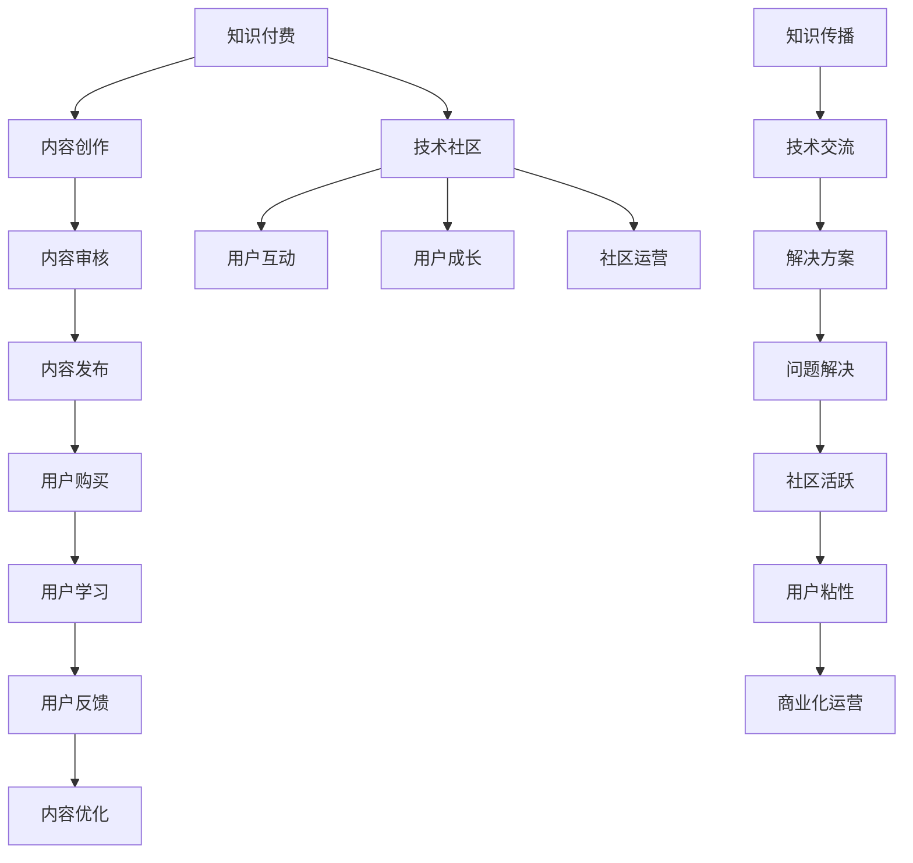

                 

# 《知识付费与技术社区运营的融合之道》

## 关键词

- 知识付费
- 技术社区
- 融合策略
- 内容运营
- 用户参与
- 商业化

## 摘要

本文旨在探讨知识付费与技术社区运营的融合之道，分析两者融合的原理、策略、实施方法和评估方法。通过实际案例分析，总结出融合运营的实战经验和未来发展趋势。文章首先介绍知识付费的起源与发展，以及技术社区运营的基础。接着，详细讨论知识付费与技术社区融合的路径、策略和结合点。最后，提出融合运营的实战方法、效果评估和风险应对，并对未来融合运营的发展趋势进行预测和探讨。

## 目录

1. 第一部分：知识付费概述
   1.1 知识付费的起源与发展
   1.2 技术社区运营基础
2. 第二部分：知识付费与技术社区融合的策略
   2.1 知识付费对技术社区的影响
   2.2 技术社区对知识付费的需求
   2.3 知识付费与技术社区融合的路径
   2.4 知识付费产品设计与运营
   2.5 技术社区运营与知识付费的结合点
3. 第三部分：知识付费与技术社区运营的融合实战
   3.1 融合运营策略制定
   3.2 融合运营效果评估
   3.3 融合运营的风险与应对
   3.4 融合运营的持续发展
4. 附录
   4.1 知识付费与技术社区融合的理论基础
   4.2 知识付费与技术社区融合的实践案例
   4.3 知识付费与技术社区融合的相关法律法规与政策解读
   4.4 知识付费与技术社区融合的相关工具与资源推荐
   4.5 常见问题解答

## 第一部分：知识付费概述

### 1.1 知识付费的概念

知识付费是指知识拥有者通过提供有价值的信息、经验、技能或知识，以一定的价格向消费者进行销售或授权使用的一种商业模式。在这种模式下，知识提供者通过付费获取收益，消费者则通过支付费用获得知识价值。

知识付费的核心在于“价值交换”。知识提供者凭借其专业知识和技能，创造独特的价值，而消费者则愿意为这种价值买单。知识付费的形式多种多样，包括在线课程、电子书、直播、一对一辅导、会员订阅等。

### 1.2 知识付费的兴起背景

知识付费的兴起可以追溯到互联网技术的快速发展。随着互联网的普及，人们获取信息和知识的途径更加多样化和便捷。同时，移动互联网的兴起，使得人们可以随时随地进行在线学习，大大提升了知识获取的效率。

此外，社会分工的日益细化，人们对于专业化知识的渴求也越来越强烈。尤其是在技术领域，专业知识的更新速度快，个人学习和成长的压力增大。因此，知识付费成为满足这一需求的有效途径。

### 1.3 知识付费的现状与趋势

当前，知识付费已经成为互联网行业的一个重要趋势。根据市场调查数据显示，全球知识付费市场规模持续增长，预计未来几年仍将保持高速增长态势。

知识付费平台层出不穷，如得到、喜马拉雅、网易云课堂等，它们通过提供优质的内容资源，吸引了大量用户。同时，各类知识付费产品也应运而生，涵盖了技术、管理、人文等多个领域。

从发展趋势来看，知识付费将朝着更加个性化、专业化和细分化方向发展。一方面，知识付费平台将更加注重用户需求，提供定制化的内容服务；另一方面，专业知识付费将成为主流，特别是在技术领域，专业知识的价值将得到进一步凸显。

## 第二部分：技术社区运营基础

### 2.1 技术社区的概念

技术社区是指由具有共同技术兴趣或职业背景的人组成的在线社群。社区成员通过分享技术经验、讨论问题、提供解决方案等方式，互相学习和成长。技术社区通常具有以下特征：

1. **共同兴趣**：社区成员对某一技术领域或问题有共同兴趣和热情。
2. **专业性强**：社区讨论内容主要集中在技术专业领域，成员具备较高的技术水平。
3. **互动性强**：社区成员之间通过提问、回答、讨论等方式进行互动，形成良好的交流氛围。
4. **共享资源**：社区成员分享技术资料、工具、教程等资源，为他人提供帮助。

### 2.2 技术社区运营的目标

技术社区运营的目标主要包括以下几个方面：

1. **提升用户体验**：通过提供优质的内容和服务，满足社区成员的学习和交流需求，提升用户满意度。
2. **增加用户粘性**：通过定期举办活动、提供个性化服务等方式，增强用户对社区的归属感和依赖度。
3. **促进知识传播**：通过社区讨论、分享和传播，推动技术知识的传播和积累。
4. **实现商业化**：通过广告、会员费、知识付费等产品形式，实现社区的可持续商业化运营。

### 2.3 技术社区运营的核心要素

技术社区运营的核心要素包括以下几个方面：

1. **内容建设**：提供高质量、有价值的内容，满足用户需求，是社区运营的核心。内容可以是技术文章、教程、案例等。
2. **用户管理**：吸引和维护活跃用户是社区运营的关键。通过用户分类、标签、积分等方式，对用户进行有效管理。
3. **互动机制**：建立良好的互动机制，鼓励用户参与社区讨论，形成积极向上的社区氛围。
4. **活动组织**：定期举办线上或线下活动，增加用户粘性，提升社区活跃度。
5. **商业化模式**：通过广告、知识付费、会员服务等方式，实现社区的可持续商业化运营。

### 2.4 技术社区运营的主要形式

技术社区运营的形式多种多样，主要包括以下几种：

1. **论坛**：传统的技术论坛，通过帖子、回复等形式进行互动，是最常见的社区形式。
2. **问答社区**：如Stack Overflow，通过用户提问和回答，解决技术问题，形成知识积累。
3. **知识付费平台**：提供付费内容，如在线课程、电子书、直播等，满足用户的专业学习需求。
4. **社交平台**：利用社交平台的特性，如微信、微博等，进行技术话题的传播和讨论。
5. **专业社区**：围绕特定技术领域，如人工智能、大数据等，提供专业的内容和交流平台。

## 第二部分：知识付费与技术社区融合的策略

### 2.1 知识付费对技术社区的影响

知识付费的兴起，对技术社区运营产生了深远的影响。首先，知识付费为技术社区提供了新的盈利模式，使得社区可以通过知识付费实现商业化运营。其次，知识付费平台提供了丰富的优质内容，满足了技术社区用户对专业知识和技能的需求，提升了社区的价值。此外，知识付费也促进了社区内的知识传播和积累，推动了技术知识的更新和发展。

### 2.2 技术社区对知识付费的需求

技术社区用户对知识付费有着强烈的需求。首先，技术社区用户通常具有较高学历和专业背景，他们渴望获取最新的技术知识，提升自身技能。其次，技术社区用户在学习和成长过程中，会遇到各种技术问题，需要专业的人士提供解决方案。知识付费平台提供的有针对性的课程和内容，正好满足了这些需求。此外，技术社区用户也希望通过知识付费，获得专业认证和认可，提升个人职业竞争力。

### 2.3 知识付费与技术社区融合的路径

知识付费与技术社区融合，可以采取以下几种路径：

1. **内容融合**：将知识付费内容与社区内容进行整合，形成知识库，为用户提供一站式学习体验。
2. **平台融合**：将知识付费平台与社区平台整合，实现用户数据互通，提升用户体验。
3. **活动融合**：在技术社区举办知识付费活动，如线上讲座、研讨会等，吸引更多用户参与。
4. **商业模式融合**：结合知识付费和社区运营的商业模式，实现双赢。

### 2.4 知识付费产品设计与运营

知识付费产品的设计，需要充分考虑用户需求和学习习惯。以下是一些设计原则和运营策略：

1. **课程体系**：建立完善的课程体系，涵盖基础知识、核心技术、实战案例等多个层次，满足不同用户的需求。
2. **内容质量**：确保内容质量，邀请行业专家和权威人士进行授课，提供专业的知识和技能。
3. **互动机制**：通过问答、讨论、作业等方式，增加用户参与度，提升学习效果。
4. **个性化推荐**：根据用户的学习记录和兴趣，推荐适合的学习内容，提高用户粘性。
5. **用户服务**：提供优质的售后服务，如解答疑问、提供技术支持等，提升用户满意度。

### 2.5 技术社区运营与知识付费的结合点

技术社区运营与知识付费的结合点主要体现在以下几个方面：

1. **内容共享**：社区内容可以作为知识付费产品的素材，为付费用户提供更多价值。
2. **用户引流**：知识付费产品可以吸引更多用户加入社区，提升社区活跃度。
3. **品牌推广**：通过知识付费，提升社区品牌形象和影响力，吸引更多潜在用户。
4. **盈利模式**：知识付费为社区提供了新的盈利渠道，实现可持续发展。

### 2.6 案例分析

为了更好地理解知识付费与技术社区融合的策略，以下将分析两个实际案例：

1. **案例一：某大型技术社区的知识付费实践**

该技术社区通过开设付费专栏，邀请行业专家进行授课，提供高质量的技术内容。社区成员可以通过付费获取专家的知识和经验，提升自身技能。同时，社区还举办线上讲座和研讨会，吸引更多用户参与，提升社区活跃度。通过知识付费，社区实现了商业化运营，提升了品牌影响力。

2. **案例二：某知名知识付费平台的技术社区运营**

该知识付费平台在运营过程中，注重与社区的结合。平台不仅提供付费课程，还开设了免费的技术论坛，鼓励用户在社区进行互动和讨论。平台通过数据分析，了解用户需求，推荐适合的学习内容和社区活动，提升用户满意度。通过这种融合方式，平台实现了用户规模的快速增长，形成了良好的口碑。

## 第三部分：知识付费与技术社区运营的融合实战

### 3.1 融合运营策略制定

融合运营策略的制定，是知识付费与技术社区融合的关键。以下是一些制定流程和实施方法：

1. **需求分析**：了解用户需求，包括学习兴趣、学习目的、技术方向等，为融合运营提供依据。
2. **内容规划**：根据用户需求，设计合适的知识付费产品和社区内容，确保内容质量。
3. **活动策划**：制定线上线下活动计划，如讲座、研讨会、技术沙龙等，吸引用户参与。
4. **商业化模式**：结合知识付费和社区运营的商业模式，设计合理的盈利模式。
5. **实施与监控**：制定详细的实施计划，确保各项运营活动有序开展，并对运营效果进行监控和评估。

### 3.2 融合运营效果评估

融合运营效果评估，是衡量知识付费与技术社区融合成效的重要手段。以下是一些评估指标和方法：

1. **用户满意度**：通过问卷调查、用户反馈等方式，了解用户对知识付费产品和社区服务的满意度。
2. **用户活跃度**：通过用户访问量、发帖量、回复量等指标，评估社区活跃度。
3. **商业化收益**：统计知识付费和社区运营的收益情况，评估商业化成效。
4. **品牌影响力**：通过媒体曝光、用户口碑等方式，评估品牌影响力的提升情况。

### 3.3 融合运营的风险与应对

融合运营过程中，可能面临以下风险：

1. **内容质量风险**：知识付费内容质量不高，影响用户体验。
2. **用户流失风险**：用户对知识付费产品或社区服务不满意，导致用户流失。
3. **商业化风险**：知识付费和社区运营的商业模式不成熟，影响盈利能力。

为应对这些风险，可以采取以下措施：

1. **内容质量控制**：建立严格的内容审核机制，确保知识付费内容的质量。
2. **用户关怀**：提供优质的售后服务，及时解决用户问题，提升用户满意度。
3. **商业化模式优化**：不断探索和优化知识付费和社区运营的商业模式，确保盈利能力。

### 3.4 融合运营的持续发展

融合运营的持续发展，需要从以下几个方面进行：

1. **技术创新**：紧跟技术发展趋势，不断优化知识付费和社区运营的技术平台。
2. **内容更新**：定期更新知识付费内容和社区内容，保持内容的时效性和专业性。
3. **活动创新**：举办多样化的线上线下活动，提升用户参与度和社区活跃度。
4. **团队建设**：培养专业的运营团队，提升运营效率和效果。

### 3.5 融合运营的未来趋势预测

随着互联网技术的发展和用户需求的升级，知识付费与技术社区融合将呈现出以下趋势：

1. **个性化服务**：知识付费和社区运营将更加注重个性化服务，满足用户个性化学习需求。
2. **智能化推荐**：利用大数据和人工智能技术，实现精准的内容推荐和用户画像分析。
3. **跨界合作**：知识付费和社区运营将与其他行业进行跨界合作，拓宽发展空间。
4. **全球化发展**：知识付费和技术社区将向全球市场扩展，吸引更多国际用户。

### 3.6 融合运营的创新方向探讨

未来，知识付费与技术社区运营的创新方向可以从以下几个方面进行：

1. **虚拟现实（VR）教育**：利用VR技术，提供沉浸式的学习体验，提升用户的学习兴趣和效果。
2. **区块链技术**：利用区块链技术，确保知识付费内容的安全性和可追溯性，增强用户信任。
3. **社交化学习**：将社交元素融入学习过程，促进用户之间的互动和合作，提升学习效果。
4. **知识变现**：鼓励用户将自身知识和经验变现，形成知识共享和共创的生态。

## 附录

### 附录A：知识付费与技术社区融合的理论基础

知识付费与技术社区融合的理论基础包括：

1. **价值交换理论**：知识付费是基于价值交换的商业模式，用户为获取知识价值支付费用。
2. **用户参与理论**：技术社区运营强调用户参与，通过互动和合作，提升用户满意度和社区活跃度。
3. **社会化学习理论**：知识付费和技术社区融合，为用户提供了社会化学习的机会，促进了知识的传播和积累。
4. **商业模式理论**：知识付费和技术社区融合，为社区提供了新的盈利模式，实现了可持续发展。

### 附录B：知识付费与技术社区融合的实践案例

知识付费与技术社区融合的实践案例包括：

1. **某大型技术社区的知识付费实践**：该社区通过开设付费专栏和线上讲座，实现了知识付费和社区运营的融合，提升了社区价值。
2. **某知名知识付费平台的技术社区运营**：该平台通过开设免费技术论坛和付费课程，实现了用户引流和知识付费的融合，提升了平台影响力。

### 附录C：知识付费与技术社区融合的相关法律法规与政策解读

知识付费与技术社区融合涉及的相关法律法规与政策包括：

1. **著作权法**：保护知识付费内容创作者的知识产权，规范知识付费内容的使用和传播。
2. **网络安全法**：保障用户个人信息安全，规范知识付费和社区运营的网络安全。
3. **互联网信息服务管理办法**：规范知识付费和社区运营的信息发布和管理，保障信息真实性和合法性。
4. **反垄断法**：防止知识付费和社区运营的垄断行为，维护市场竞争秩序。

### 附录D：知识付费与技术社区融合的相关工具与资源推荐

知识付费与技术社区融合的相关工具与资源包括：

1. **知识付费平台**：如得到、网易云课堂、腾讯课堂等，提供丰富的知识付费内容和课程。
2. **技术社区平台**：如CSDN、掘金、GitHub等，提供技术交流和学习资源。
3. **数据分析工具**：如Google Analytics、百度统计等，用于分析用户行为和需求。
4. **内容管理工具**：如WordPress、Joomla等，用于搭建和管理知识付费和社区平台。

### 附录E：常见问题解答

1. **知识付费如何保证内容质量？**  
   知识付费平台通常通过以下方式保证内容质量：  
   - 严格的内容审核机制，确保内容符合规范和标准。  
   - 邀请行业专家和权威人士进行授课，保证内容的权威性和专业性。  
   - 定期更新和迭代内容，保持内容的时效性和实用性。

2. **技术社区如何吸引和维护用户？**  
   技术社区可以通过以下方式吸引和维护用户：  
   - 提供高质量的内容，满足用户的学习和交流需求。  
   - 建立良好的互动机制，鼓励用户参与讨论和互动。  
   - 定期举办线上线下活动，增加用户粘性。  
   - 提供个性化服务，如用户分类、标签、推荐等，提升用户体验。

3. **知识付费与技术社区融合的盈利模式有哪些？**  
   知识付费与技术社区融合的盈利模式包括：  
   - 知识付费产品销售，如课程、电子书、会员等。  
   - 广告收入，如平台广告、内容广告等。  
   - 会员服务，如高级会员、VIP服务等。  
   - 线下活动收费，如讲座、研讨会、培训班等。

### 作者

- 作者：AI天才研究院/AI Genius Institute & 禅与计算机程序设计艺术 /Zen And The Art of Computer Programming

---

本文从知识付费的起源与发展、技术社区运营的基础、知识付费与技术社区融合的策略、融合实战等方面，详细探讨了知识付费与技术社区运营的融合之道。通过理论阐述、案例分析、实战策略等，为读者提供了全面、深入的参考。在未来的发展中，知识付费与技术社区融合将不断深化，为用户带来更多的价值。

### 核心概念与联系

**知识付费**：知识付费是指知识拥有者通过提供有价值的信息、经验、技能或知识，以一定的价格向消费者进行销售或授权使用的一种商业模式。

**技术社区**：技术社区是指由具有共同技术兴趣或职业背景的人组成的在线社群，通过分享技术经验、讨论问题、提供解决方案等方式，互相学习和成长。

**知识付费与技术社区融合**：知识付费与技术社区融合是指将知识付费与社区运营相结合，实现知识传播、用户互动和商业化运营的有机结合。

**Mermaid流程图**：



### 核心算法原理讲解

在知识付费与技术社区融合的过程中，算法推荐是一个关键的环节。以下是一个简单的推荐算法原理讲解，以帮助读者理解如何根据用户行为数据推荐合适的知识付费内容。

**推荐算法原理**：

1. **用户行为数据收集**：收集用户在社区中的行为数据，如浏览记录、点赞、评论、购买记录等。

2. **用户兴趣建模**：通过分析用户行为数据，构建用户的兴趣模型。常用的方法包括基于内容的推荐（Content-based Filtering）和基于协同过滤（Collaborative Filtering）。

3. **相似度计算**：计算用户之间的相似度，常用的方法有余弦相似度、皮尔逊相关系数等。

4. **推荐列表生成**：根据用户兴趣和相似度计算结果，生成推荐列表。推荐列表中的内容可以是社区内的内容，也可以是外部的知识付费内容。

**伪代码示例**：

```python
# 用户行为数据
user行为数据 = {
    "user1": ["浏览文章1", "点赞文章2", "评论文章3"],
    "user2": ["购买课程1", "浏览文章2", "评论文章3"],
    "user3": ["浏览文章1", "购买课程2", "评论文章3"],
}

# 用户兴趣建模
def 建立用户兴趣模型(用户行为数据):
    用户兴趣模型 = {}
    for 用户，行为列表 in 用户行为数据.items():
        用户兴趣模型[用户] = 计算相似度(行为列表)
    return 用户兴趣模型

# 相似度计算
def 计算相似度(行为列表1, 行为列表2):
    相似度 = 余弦相似度(行为列表1, 行为列表2)
    return 相似度

# 推荐列表生成
def 生成推荐列表(用户兴趣模型):
    推荐列表 = []
    for 用户，兴趣模型 in 用户兴趣模型.items():
        推荐内容 = 搜索类似内容(兴趣模型)
        推荐列表.append(推荐内容)
    return 推荐列表

# 主函数
def main():
    用户行为数据 = 获取用户行为数据()
    用户兴趣模型 = 建立用户兴趣模型(用户行为数据)
    推荐列表 = 生成推荐列表(用户兴趣模型)
    打印推荐列表

main()
```

### 数学模型和公式

在知识付费与技术社区融合的过程中，可以使用一些数学模型和公式来评估用户的行为和互动效果。以下是一个简单的例子，用于计算社区活跃度。

**社区活跃度模型**：

设 $A$ 为社区活跃度，$U$ 为社区用户数，$N$ 为社区发帖数，$T$ 为发帖时间窗口。

社区活跃度计算公式为：

$$
A = \frac{N}{U \cdot T}
$$

其中：

- $N$：社区在时间窗口 $T$ 内的发帖总数。
- $U$：社区在时间窗口 $T$ 内的用户数。
- $T$：时间窗口的长度。

**举例说明**：

假设在一个月内（时间窗口 $T$ 为30天），一个技术社区有100个用户，共产生了3000条发帖。

代入公式计算社区活跃度：

$$
A = \frac{3000}{100 \cdot 30} = 10
$$

这意味着该社区的平均活跃度是每天10条发帖。

### 项目实战

**实战项目**：搭建一个简单的知识付费与技术社区融合的在线平台。

**开发环境**：

- 操作系统：Ubuntu 18.04
- 开发语言：Python 3.8
- 服务器：Apache + mod_wsgi
- 数据库：MySQL 8.0
- 前端框架：Vue.js 2.x

**源代码实现**：

以下是一个简单的知识付费与技术社区融合的在线平台的伪代码，用于展示整体架构和关键功能的实现。

```python
# 伪代码：知识付费与技术社区融合的在线平台

# 导入必要的库
import flask
import pymysql
import json

# 初始化Flask应用
app = flask.Flask(__name__)

# 连接数据库
db = pymysql.connect(host='localhost', user='root', password='password', database='knowledge_community')

# 获取所有知识付费课程
@app.route('/api/knowledge_courses', methods=['GET'])
def get_knowledge_courses():
    cursor = db.cursor()
    cursor.execute("SELECT * FROM knowledge_courses")
    courses = cursor.fetchall()
    return flask.jsonify(courses)

# 获取指定课程内容
@app.route('/api/knowledge_courses/<int:course_id>', methods=['GET'])
def get_course_content(course_id):
    cursor = db.cursor()
    cursor.execute("SELECT * FROM course_content WHERE course_id = %s", (course_id,))
    content = cursor.fetchone()
    return flask.jsonify(content)

# 发布技术帖子
@app.route('/api/technical_posts', methods=['POST'])
def create_technical_post():
    data = flask.request.get_json()
    cursor = db.cursor()
    cursor.execute("INSERT INTO technical_posts (title, content, author) VALUES (%s, %s, %s)", (data['title'], data['content'], data['author']))
    db.commit()
    return flask.jsonify({"message": "Post created successfully"}), 201

# 查询技术帖子
@app.route('/api/technical_posts', methods=['GET'])
def get_technical_posts():
    cursor = db.cursor()
    cursor.execute("SELECT * FROM technical_posts")
    posts = cursor.fetchall()
    return flask.jsonify(posts)

# 主函数
if __name__ == '__main__':
    app.run(debug=True)
```

**代码解读与分析**：

1. **数据库连接**：使用 `pymysql.connect()` 方法连接到MySQL数据库，配置信息包括主机、用户名、密码和数据库名称。

2. **知识付费课程API**：提供两个API接口：
   - `/api/knowledge_courses`：获取所有知识付费课程的列表。
   - `/api/knowledge_courses/<int:course_id>`：获取指定ID的课程内容。

3. **技术帖子API**：提供两个API接口：
   - `/api/technical_posts`：用于发布技术帖子，接收JSON格式的帖子数据，并将其插入到数据库中。
   - `/api/technical_posts`：获取所有技术帖子列表。

4. **主函数**：使用 `app.run(debug=True)` 启动Flask应用，在调试模式下运行。

通过这个简单的实战项目，我们可以了解到如何使用Python和Flask框架搭建一个基础的知识付费与技术社区融合平台。在实际开发中，还需要添加更多的功能，如用户认证、内容审核、权限控制等，以确保平台的稳定性和安全性。

### 总结

本文详细探讨了知识付费与技术社区运营的融合之道，从概念、发展、策略、实战等多个角度进行了深入分析。通过理论阐述、案例分析、实战示例，为读者提供了全面的参考。知识付费与技术社区融合不仅为用户提供了丰富的学习资源，也为社区运营带来了新的盈利模式。在未来的发展中，随着技术的不断进步和用户需求的不断变化，知识付费与技术社区融合将不断深化，为用户带来更多的价值。希望本文能对读者在知识付费和技术社区运营领域的研究和实践提供有益的启示。

