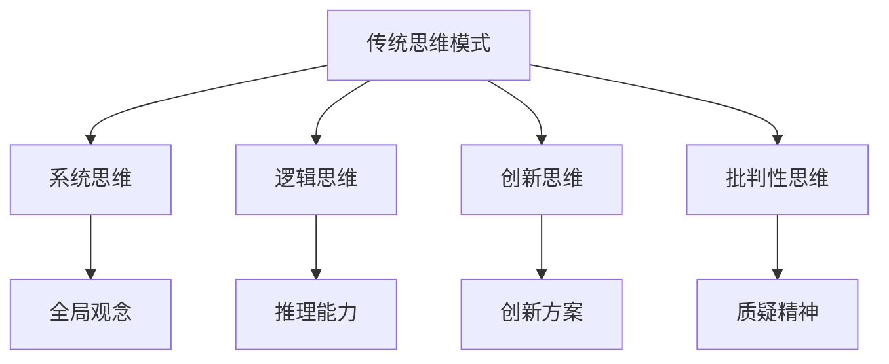

                 

## 文章标题：知识付费与程序员思维模式的转变

### 关键词：
- 知识付费
- 程序员思维模式
- 技能提升
- 逻辑思维
- 创新思维
- 系统思维
- 团队协作
- 沟通能力
- 教育培训

### 摘要：
本文深入探讨了知识付费对程序员思维模式的影响，分析了知识付费平台的兴起与发展，以及程序员如何通过知识付费提升技能和转变思维模式。文章首先介绍了知识付费的定义和现状，随后探讨了程序员思维模式的传统与转变，详细讨论了知识付费对技能提升的影响及关键因素，最后通过案例研究展示了知识付费的实际效果。文章旨在为程序员提供借鉴，帮助他们在知识付费的浪潮中找到适合自己的成长路径。

### 《知识付费与程序员思维模式的转变》目录大纲

## 第一部分：引言与背景

### 1.1 知识付费的兴起
#### 1.1.1 知识付费的定义
#### 1.1.2 知识付费的发展历程
#### 1.1.3 知识付费的现状与趋势

### 1.2 程序员思维模式
#### 1.2.1 传统程序员思维模式
#### 1.2.2 知识付费对程序员思维模式的影响
#### 1.2.3 程序员思维模式的转变

## 第二部分：知识付费与程序员技能提升

### 2.1 知识付费对程序员技能提升的影响
#### 2.1.1 知识付费平台的作用
#### 2.1.2 程序员如何利用知识付费提升技能
#### 2.1.3 知识付费带来的挑战与机遇

### 2.2 程序员技能提升的关键
#### 2.2.1 学习方法与策略
#### 2.2.2 实践与反思的重要性
#### 2.2.3 不断适应新技术的重要性

## 第三部分：程序员思维模式的转变

### 3.1 程序员思维模式的转变
#### 3.1.1 逻辑思维与系统思维
#### 3.1.2 创新思维与批判性思维
#### 3.1.3 团队协作与沟通能力

### 3.2 转变程序员思维模式的方法
#### 3.2.1 教育培训的作用
#### 3.2.2 读书与学习的习惯
#### 3.2.3 实践与经验的积累

## 第四部分：案例研究

### 4.1 案例一：通过知识付费提升编程技能
#### 4.1.1 案例背景
#### 4.1.2 案例实施
#### 4.1.3 案例结果与分析

### 4.2 案例二：程序员思维模式的转变
#### 4.2.1 案例背景
#### 4.2.2 案例实施
#### 4.2.3 案例结果与分析

## 第五部分：未来展望

### 5.1 知识付费与程序员思维模式的未来趋势
#### 5.1.1 技术的发展对知识付费的影响
#### 5.1.2 程序员思维模式的未来走向
#### 5.1.3 行业发展趋势与挑战

### 5.2 建议与展望
#### 5.2.1 对程序员的建议
#### 5.2.2 对知识付费平台的建议
#### 5.2.3 对教育机构的建议

## 附录

### 附录A：常用知识付费平台介绍
#### A.1 Udemy
#### A.2 Coursera
#### A.3 Pluralsight
#### A.4 其他知识付费平台简介

### 附录B：程序员思维模式转变流程图

### 附录C：编程思维模式转变的伪代码示例

### 附录D：数学模型与公式

### 附录E：项目实战案例

---

### 第一部分：引言与背景

在当今信息化和数字化的时代，知识和技能的获取变得越来越重要。程序员作为新时代的技术工作者，面临着不断更新的技术栈和快速变化的行业环境。知识付费作为一种新型的教育模式，逐渐受到程序员的青睐。本文旨在探讨知识付费与程序员思维模式的转变，分析知识付费对程序员技能提升的影响，以及程序员如何在知识付费的浪潮中实现自我成长。

### 1.1 知识付费的兴起

#### 1.1.1 知识付费的定义

知识付费是指用户通过支付一定费用，获得专业知识和技能的学习与掌握。知识付费不同于传统的免费学习资源，它强调的是高质量、有针对性的知识传授。知识付费的形式多样，包括在线课程、付费直播、专业书籍、研讨会等。

#### 1.1.2 知识付费的发展历程

知识付费的兴起可以追溯到互联网的快速发展。随着移动互联网的普及，知识传播的渠道和方式发生了根本性的变革。早期的知识付费主要集中在电商平台上，用户通过购买电子书、音频课程等获得知识。随着技术的进步，知识付费逐渐扩展到在线教育平台、专业社区等领域。

#### 1.1.3 知识付费的现状与趋势

目前，知识付费已经成为一个庞大的市场。根据统计，全球知识付费市场规模持续增长，预计未来几年将保持高速增长态势。知识付费平台如雨后春笋般涌现，例如Udemy、Coursera、Pluralsight等，它们提供丰富的课程资源，满足不同层次和领域的用户需求。

未来，知识付费将呈现以下几个趋势：

1. **个性化学习**：随着人工智能和大数据技术的发展，知识付费平台将更加注重个性化学习，为用户提供量身定制的学习方案。
2. **高质量内容**：知识付费平台将更加重视内容质量，提供专业、权威的知识资源，以吸引和留住用户。
3. **多元化形式**：知识付费的形式将更加多元化，除了在线课程，还将涵盖虚拟现实、增强现实等新技术应用。

### 1.2 程序员思维模式

#### 1.2.1 传统程序员思维模式

传统程序员思维模式通常强调的是程序代码的编写和问题的解决。程序员更多地依赖于经验、技巧和工具，而不是系统性的思考和逻辑推理。这种思维模式往往导致程序员在处理复杂问题时缺乏全局观念，难以实现高效的解决方案。

#### 1.2.2 知识付费对程序员思维模式的影响

知识付费对程序员思维模式产生了深远的影响。通过付费学习，程序员可以接触到更广泛的知识和更先进的理念，从而拓宽思维视野。此外，知识付费平台提供的系统化、结构化的学习内容有助于程序员建立系统思维和逻辑思维，提升整体思维品质。

#### 1.2.3 程序员思维模式的转变

随着知识付费的普及，程序员思维模式正在发生转变。越来越多的程序员开始注重系统思维和逻辑思维，重视创新和批判性思维。他们更加关注问题的本质和解决方法，而不是简单的代码实现。这种思维模式的转变有助于程序员在复杂环境中找到更有效的解决方案，提升职业竞争力。

### 小结

知识付费的兴起为程序员提供了丰富的学习资源和发展机会。通过知识付费，程序员不仅能够提升技能，还能转变思维模式，实现职业成长。然而，知识付费也带来了一定的挑战，例如内容质量参差不齐、信息过载等问题。程序员需要理性对待知识付费，选择合适的学习资源，不断提升自己的思维品质和技能水平。

## 第二部分：知识付费与程序员技能提升

### 2.1 知识付费对程序员技能提升的影响

#### 2.1.1 知识付费平台的作用

知识付费平台在程序员技能提升中发挥着重要作用。这些平台提供了丰富的课程资源，涵盖了各个编程语言、框架和工具。程序员可以通过付费学习，迅速掌握新技能，跟上技术发展的步伐。例如，Udemy、Coursera、Pluralsight等知名平台，不仅提供了高质量的课程，还与知名教育机构和科技公司合作，保证了课程内容的权威性和实用性。

#### 2.1.2 程序员如何利用知识付费提升技能

程序员可以通过以下方式利用知识付费提升技能：

1. **有针对性地选择课程**：程序员应根据自身职业规划和技能需求，选择适合自己的课程。例如，前端开发者可以选择学习Vue.js、React等框架课程，后端开发者则可以选择学习Django、Spring Boot等框架课程。

2. **持续学习**：技能提升是一个持续的过程，程序员应保持学习的热情和动力。通过定期学习新课程，不断提升自己的技能水平。

3. **实践和反思**：学习不仅仅是听课，更重要的是将所学知识应用到实际工作中。程序员应在学习过程中不断实践，通过实际操作加深对知识的理解和掌握。同时，要善于反思自己的学习过程，总结经验教训，不断提升学习效率。

4. **参与社区**：知识付费平台通常有丰富的社区资源，程序员可以通过参与社区讨论、分享经验，与其他开发者交流学习心得，拓展视野。

#### 2.1.3 知识付费带来的挑战与机遇

知识付费虽然为程序员技能提升提供了巨大帮助，但也带来了一些挑战：

1. **内容质量参差不齐**：知识付费平台上的课程质量参差不齐，有些课程可能并不适合初学者或有一定基础的程序员。程序员在选择课程时需要仔细辨别，避免浪费时间。

2. **信息过载**：随着技术的快速发展，程序员需要学习的内容越来越多。信息过载可能导致程序员陷入学习困境，难以有效地提升技能。

3. **学习成本**：知识付费需要用户支付一定的费用，对于一些经济条件有限的程序员来说，学习成本可能成为负担。

然而，知识付费也带来了机遇：

1. **个性化学习**：知识付费平台提供了丰富的课程资源，程序员可以根据自己的需求和兴趣选择合适的课程，实现个性化学习。

2. **快速提升技能**：通过知识付费，程序员可以迅速掌握新技能，提高职业竞争力。

3. **跨领域学习**：知识付费平台不仅提供了编程相关的课程，还涵盖了其他领域的知识，程序员可以跨领域学习，拓宽知识面。

### 2.2 程序员技能提升的关键

#### 2.2.1 学习方法与策略

有效的学习方法与策略对于程序员技能提升至关重要。以下是一些建议：

1. **制定学习计划**：程序员应根据自身情况和职业规划，制定合理的学习计划。计划应包括学习目标、学习内容和学习时间等。

2. **分解学习任务**：将大的学习任务分解为小的、可操作的任务，逐一完成。这样有助于降低学习难度，提高学习效率。

3. **理论与实践相结合**：学习不仅要听课，还要动手实践。通过实际操作，加深对知识的理解和掌握。

4. **定期复习**：学习是一个持续的过程，程序员应定期复习所学内容，巩固记忆，防止遗忘。

5. **保持好奇心和求知欲**：好奇心和求知欲是学习的驱动力。程序员应保持对新技术和新知识的好奇心，积极探索。

#### 2.2.2 实践与反思的重要性

实践是技能提升的关键。程序员应在学习过程中不断实践，通过实际操作检验所学知识。以下是一些实践的建议：

1. **动手实践**：编程技能的提升离不开动手实践。程序员应多写代码，多参与项目实践，通过实际操作加深对知识的理解和掌握。

2. **反思与总结**：实践后要及时反思，总结经验教训。通过反思，找出自己的不足，不断优化学习方法和策略。

3. **解决问题**：编程过程中难免会遇到各种问题。程序员应学会独立解决问题，通过查阅资料、请教他人等方式提升解决问题的能力。

#### 2.2.3 不断适应新技术的重要性

技术更新迅速，程序员需要不断学习新技术，以适应行业发展的需求。以下是一些建议：

1. **关注技术动态**：关注技术社区、博客、新闻等，了解新技术的发展趋势和应用场景。

2. **定期学习新技术**：定期学习新技术，掌握新工具和方法，提高自己的竞争力。

3. **参与开源项目**：参与开源项目，与其他开发者交流学习，提升自己的技术能力和团队协作能力。

4. **参加技术会议和研讨会**：参加技术会议和研讨会，了解行业前沿动态，拓展人脉，提升自己的影响力。

### 小结

知识付费为程序员技能提升提供了丰富的资源和支持。程序员应理性对待知识付费，选择合适的学习资源，通过有效的学习方法与策略、实践与反思，以及不断适应新技术，实现技能的提升和职业成长。

## 第三部分：程序员思维模式的转变

### 3.1 程序员思维模式的转变

程序员思维模式的转变是知识付费时代的一个重要特征。随着技术的不断发展和行业环境的变迁，程序员需要从传统的单一思维模式向多元化、系统化、创新性的思维模式转变。

#### 3.1.1 逻辑思维与系统思维

逻辑思维是程序员必备的基本思维能力。它强调的是通过分析、推理和验证，从已知信息中得出合理的结论。系统思维则更加注重整体性和关联性，它要求程序员在处理问题时，不仅要考虑单个模块或组件，还要关注整个系统的运行机制和相互作用。

逻辑思维和系统思维的结合，有助于程序员在复杂的编程环境中找到更高效的解决方案。通过逻辑思维，程序员可以清晰地分析问题，逐步推导出解决方案；而通过系统思维，程序员可以更好地理解问题的全貌，从全局出发优化系统架构和性能。

#### 3.1.2 创新思维与批判性思维

创新思维是程序员在解决问题时的重要品质。它强调的是打破常规，寻找新的解决方案。批判性思维则更加注重对已有知识和方法的质疑和反思，通过批判性思维，程序员可以更深入地理解问题的本质，发现潜在的问题和改进空间。

创新思维和批判性思维的结合，有助于程序员在快速变化的技术环境中保持竞争力。创新思维使程序员能够不断探索新的技术领域和解决方案，而批判性思维则使程序员能够更加客观地评估新技术和方法的适用性，避免盲目跟风。

#### 3.1.3 团队协作与沟通能力

在软件开发过程中，团队合作和沟通能力至关重要。程序员需要与产品经理、设计师、测试工程师等多角色进行密切合作，以确保项目的顺利进行。

团队协作能力要求程序员具备良好的沟通技巧和合作精神。通过有效的沟通，程序员可以清晰地表达自己的想法和需求，理解他人的观点和意见，从而达成共识，提高工作效率。

沟通能力还要求程序员具备一定的心理素质和情绪管理能力。在团队协作过程中，难免会遇到意见分歧和冲突，程序员需要学会合理表达自己的观点，同时尊重他人的意见，通过有效沟通解决冲突。

### 3.2 转变程序员思维模式的方法

要实现程序员思维模式的转变，需要从以下几个方面入手：

#### 3.2.1 教育培训的作用

教育培训是程序员思维模式转变的重要途径。通过系统的教育培训，程序员可以学习到先进的技术理念和方法，提升自己的思维品质。

1. **系统化课程**：选择优质的在线课程或线下培训课程，系统学习编程语言、框架和工具，掌握基本的编程技能。

2. **实战演练**：通过实际项目或案例学习，锻炼自己的编程能力和团队协作能力。

3. **专家讲座**：参加技术专家的讲座和研讨会，了解行业前沿动态和技术趋势。

#### 3.2.2 读书与学习的习惯

读书和学习是程序员思维模式转变的持续动力。通过不断学习，程序员可以拓宽知识面，提升自己的思维水平。

1. **广泛阅读**：阅读技术书籍、论文和博客，了解各种编程语言、框架和工具的应用场景和优缺点。

2. **深度学习**：针对特定技术领域，进行深入研究，掌握核心原理和实现方法。

3. **互动学习**：参与技术社区和论坛，与其他程序员交流学习心得，共同进步。

#### 3.2.3 实践与经验的积累

实践是程序员思维模式转变的基石。通过实际项目经验，程序员可以不断积累解决问题的方法和技巧，提升自己的思维模式。

1. **动手实践**：多写代码，多参与项目，通过实际操作巩固所学知识。

2. **反思与总结**：项目完成后，及时反思和总结，分析成功经验和失败教训。

3. **不断迭代**：在项目中不断尝试新的技术和方法，通过实践验证其效果，优化项目质量。

### 小结

程序员思维模式的转变是知识付费时代的重要趋势。通过逻辑思维和系统思维、创新思维和批判性思维、团队协作和沟通能力的培养，程序员可以不断提升自己的思维品质和职业能力，在竞争激烈的行业中立于不败之地。

## 第四部分：案例研究

### 4.1 案例一：通过知识付费提升编程技能

#### 4.1.1 案例背景

张华是一名年轻的程序员，工作已经三年了。尽管他在日常工作中积累了丰富的编程经验，但总觉得自己的技能水平有限，尤其是在面对新技术和新框架时，常常感到力不从心。为了提升自己的编程技能，张华决定利用知识付费平台学习新知识。

#### 4.1.2 案例实施

1. **选择课程**：张华根据自身需求和兴趣，选择了Udemy上的几门课程，包括React.js框架、Django后端开发等。

2. **制定学习计划**：为了确保学习效果，张华制定了详细的学习计划，包括每天的学习时间、学习内容和学习目标。

3. **动手实践**：在学习过程中，张华积极参与课程实践，通过编写代码、完成项目任务，加深对知识的理解和掌握。

4. **参与社区**：张华加入了课程社区，与其他学员交流学习心得，分享自己的学习经验和成果。

#### 4.1.3 案例结果与分析

通过知识付费平台的学习，张华的编程技能得到了显著提升。具体表现在以下几个方面：

1. **技术能力提升**：张华掌握了React.js和Django等新技术和新框架，能够独立完成复杂的Web开发任务。

2. **思维模式转变**：通过学习，张华逐渐培养了系统思维和创新思维，能够从全局出发，更高效地解决问题。

3. **团队合作能力增强**：张华在参与课程社区讨论中，学会了如何与他人沟通和合作，提高了团队协作能力。

4. **职业发展**：由于技能水平的提升，张华在公司的项目中表现突出，获得了领导的认可和同事的赞誉，职业发展前景更加广阔。

分析：

1. **知识付费平台的优势**：知识付费平台提供了丰富的课程资源，满足了不同层次和领域的学习需求，为程序员提供了便捷的学习途径。

2. **学习方法的合理性**：张华制定的学习计划、动手实践和参与社区讨论等学习方法，既注重知识的系统性，又强调实践和互动，有助于提高学习效果。

3. **技能提升的关键**：张华在知识付费平台上的学习，不仅提升了技术能力，还转变了思维模式，增强了团队合作能力，为职业发展奠定了坚实基础。

### 4.2 案例二：程序员思维模式的转变

#### 4.2.1 案例背景

李明是一名有十年编程经验的资深程序员。然而，随着技术的不断更新，他发现自己越来越难以应对复杂的问题。为了提升自己的思维品质和解决复杂问题的能力，李明决定通过知识付费平台学习新思维模式。

#### 4.2.2 案例实施

1. **选择课程**：李明选择了Coursera上的系统思维和逻辑思维课程，以及创新思维和批判性思维课程。

2. **学习方法**：李明采用边学习、边实践的方法，将所学思维模式应用到实际工作中，通过不断反思和调整，提升自己的思维品质。

3. **团队协作**：李明积极参与公司的项目开发，与团队成员分享自己的学习心得，推动团队思维模式的转变。

#### 4.2.3 案例结果与分析

通过知识付费平台的学习，李明的思维模式得到了显著转变，具体表现在以下几个方面：

1. **逻辑思维增强**：李明在解决问题时，能够更清晰地分析问题，逐步推导出解决方案，提高了问题解决效率。

2. **系统思维提升**：李明从全局出发，考虑问题的影响和关联，优化了系统架构和性能，提升了项目的整体质量。

3. **创新思维发展**：李明在遇到挑战时，能够跳出传统思维框架，寻找创新的解决方案，提高了项目的创新性和竞争力。

4. **批判性思维提高**：李明在评估新技术和方法时，能够保持质疑和反思的态度，避免了盲目跟风，提升了项目的技术水平和可靠性。

分析：

1. **思维模式转变的重要性**：李明通过学习新思维模式，不仅提升了自身的思维能力，还推动了团队的思维模式转变，为公司的项目开发带来了积极影响。

2. **知识付费平台的贡献**：知识付费平台提供了丰富的思维模式课程，为李明提供了系统学习和实践的机会，促进了他的思维模式转变。

3. **职业发展的影响**：李明的思维模式转变，使他在项目中表现更加出色，赢得了领导的信任和同事的尊重，为职业发展创造了有利条件。

### 小结

通过以上案例研究，可以看出知识付费在程序员技能提升和思维模式转变中发挥了重要作用。案例中的程序员通过知识付费平台学习新知识、新思维，不仅提升了自身技能，还实现了思维模式的转变，为职业发展奠定了坚实基础。这些案例为其他程序员提供了有益的借鉴，帮助他们更好地应对快速变化的技术环境。

## 第五部分：未来展望

### 5.1 知识付费与程序员思维模式的未来趋势

随着技术的不断发展和行业环境的变迁，知识付费与程序员思维模式将呈现出以下趋势：

#### 5.1.1 技术的发展对知识付费的影响

1. **个性化学习**：随着人工智能和大数据技术的应用，知识付费平台将能够更准确地分析用户需求，提供个性化学习方案，满足用户个性化的学习需求。

2. **高质量内容**：技术发展将推动知识付费平台提升内容质量，通过算法推荐、权威认证等方式，确保用户获取到高质量的知识资源。

3. **多元化形式**：虚拟现实（VR）、增强现实（AR）等新技术将丰富知识付费的形式，提供更生动、直观的学习体验。

#### 5.1.2 程序员思维模式的未来走向

1. **系统思维**：随着复杂系统的不断涌现，程序员将更加注重系统思维，从全局出发，优化系统架构和性能。

2. **创新思维**：在快速变化的技术环境中，程序员将培养创新思维，不断探索新的解决方案，提高项目的创新性和竞争力。

3. **批判性思维**：程序员将保持批判性思维，对新技术和新方法进行客观评估，避免盲目跟风，提升项目的技术水平和可靠性。

#### 5.1.3 行业发展趋势与挑战

1. **行业发展趋势**：随着数字化转型和智能化的推进，程序员的需求将持续增长，行业将迎来更多的发展机遇。

2. **行业挑战**：技术更新速度快，程序员需要不断学习新技术，面临知识更新的挑战。同时，市场竞争激烈，程序员需要不断提升自身能力和素质，以保持竞争力。

### 5.2 建议与展望

为了应对未来知识付费和程序员思维模式的发展趋势，以下是一些建议：

#### 5.2.1 对程序员的建议

1. **持续学习**：程序员应保持学习的热情和动力，通过知识付费平台、线上课程、研讨会等方式，不断学习新技术和新知识。

2. **培养多元化思维**：程序员应培养系统思维、创新思维和批判性思维，提高解决问题的能力。

3. **实践与反思**：程序员应将所学知识应用到实际工作中，通过实践和反思，不断提升自己的技能和思维品质。

#### 5.2.2 对知识付费平台的建议

1. **提升内容质量**：知识付费平台应加强内容审核，确保课程质量，提供高质量的知识资源。

2. **个性化服务**：知识付费平台应利用大数据和人工智能技术，提供个性化学习方案，满足用户个性化学习需求。

3. **多元化形式**：知识付费平台应积极探索VR、AR等新技术应用，提供更生动、直观的学习体验。

#### 5.2.3 对教育机构的建议

1. **课程设计**：教育机构应结合行业需求，设计具有前瞻性和实用性的课程，满足程序员的学习需求。

2. **教学创新**：教育机构应引入新技术和新方法，提高教学效果，培养具有创新能力和批判性思维的程序员。

3. **校企合作**：教育机构应与行业企业建立合作关系，共同培养适应市场需求的人才。

### 小结

未来，知识付费和程序员思维模式将继续发展，为程序员提供更多学习和发展机会。程序员应积极适应行业变化，持续提升自身技能和思维品质。知识付费平台和教育机构也应不断创新，为程序员提供更好的学习资源和培训服务，共同推动行业的发展。

## 附录

### 附录A：常用知识付费平台介绍

#### A.1 Udemy

**简介**：Udemy 是全球最大的在线学习平台之一，提供各种课程，包括编程、设计、数据科学、营销等。

**特点**：课程种类丰富，适合不同层次的学员。提供灵活的学习计划和价格优惠。

**课程内容**：包括Python编程、JavaScript开发、机器学习等。

**适用人群**：初学者、有经验的程序员。

#### A.2 Coursera

**简介**：Coursera 是由斯坦福大学创办的在线学习平台，提供全球知名大学的课程。

**特点**：课程质量高，与知名大学合作，提供证书认证。

**课程内容**：包括计算机科学、数据科学、人工智能等。

**适用人群**：希望获得系统化知识和认证的程序员。

#### A.3 Pluralsight

**简介**：Pluralsight 是专注于技术学习的平台，提供广泛的编程和技术课程。

**特点**：内容全面，覆盖前端、后端、移动开发等领域。提供在线实验室和项目实践。

**课程内容**：包括React、Django、Node.js等。

**适用人群**：希望提升特定技能的程序员。

#### A.4 其他知识付费平台简介

- **LinkedIn Learning**：提供职业发展相关的课程，包括编程、数据科学、领导力等。
- **edX**：提供哈佛大学、麻省理工学院等顶尖大学的在线课程。
- **Skillshare**：提供创意技能和手工艺课程。

### 附录B：程序员思维模式转变流程图



### 附录C：编程思维模式转变的伪代码示例

```python
# 伪代码：传统编程方法
def traditional_programming():
    # 代码实现
    # ...

# 伪代码：现代编程方法
def modern_programming():
    # 系统思维：考虑全局
    system_analysis()
    # 创新思维：寻找优化方案
    innovative_solution()
    # 批判性思维：评估方案
    evaluate_solution()
    # 代码实现
    # ...

# 伪代码：编程思维模式转变的方法
def transform_mindset():
    traditional_programming()
    modern_programming()
    # 反思与优化
    reflection_and_optimization()
```

### 附录D：数学模型与公式

#### D.1 学习曲线公式

$$ y = ae^{bx} $$

其中，$y$ 表示学习成果，$a$ 和 $b$ 为常数。

#### D.2 技能提升模型

$$ S(t) = S_0 + r(1 - e^{-kt}) $$

其中，$S(t)$ 表示技能水平，$S_0$ 为初始技能水平，$r$ 为学习速率，$k$ 为常数。

### 附录E：项目实战案例

#### E.1 代码实现

```python
# Python 代码实现
def main():
    # 输入数据
    data = input_data()
    # 数据处理
    processed_data = data_processing(data)
    # 结果输出
    output_result(processed_data)

# 主函数
if __name__ == "__main__":
    main()
```

#### E.2 代码解读与分析

```python
# 代码解读
# ...
```

### 作者信息

作者：AI天才研究院/AI Genius Institute & 禅与计算机程序设计艺术 /Zen And The Art of Computer Programming

