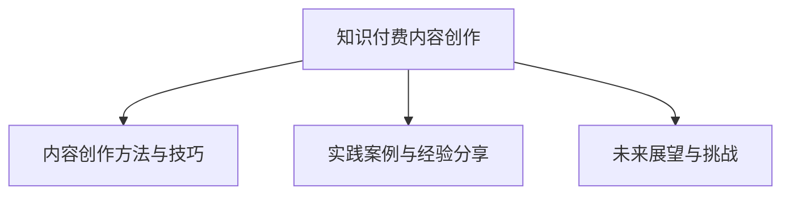

                 

# 文章标题：知识付费内容创作：程序员的秘诀

> 关键词：知识付费、内容创作、程序员、技术博客、在线课程

> 摘要：本文旨在探讨知识付费内容创作在程序员职业发展中的重要性，从背景、角色、方法、实践和未来展望等多个角度，为程序员提供一套系统化的内容创作策略与技巧。通过深入分析知识付费市场的现状与趋势，结合程序员的专长与需求，文章将帮助程序员更好地进行内容创作，提升个人品牌，实现知识变现。

### 《知识付费内容创作：程序员的秘诀》目录大纲

## 第一部分：知识付费内容创作概述

### 1.1 知识付费的背景与发展

#### 1.1.1 知识付费的定义与兴起

知识付费是指用户为获取特定知识、技能或服务而支付的费用，这种模式在互联网时代迅速兴起。随着信息爆炸和知识更新的加速，用户开始愿意为高质量、有价值的内容付费。

#### 1.1.2 知识付费市场的现状与趋势

当前，知识付费市场呈现出多元化、专业化、个性化和平台化的趋势。在线教育、专业技能培训、知识分享等各个领域都在迅速发展。

#### 1.1.3 知识付费对个人和社会的影响

知识付费不仅促进了知识传播和技能提升，也推动了教育产业和知识经济的发展。对个人而言，知识付费有助于提升个人竞争力；对社会而言，它促进了知识的共享和积累。

### 1.2 程序员在知识付费中的角色

#### 1.2.1 程序员的内容创作能力

程序员具备丰富的技术背景和实践经验，这使得他们在内容创作方面具有独特的优势。

#### 1.2.2 程序员在知识付费平台的优势

程序员可以利用自己的专业技能，在知识付费平台上分享技术知识、解决方案和实战经验。

#### 1.2.3 程序员知识付费内容的需求分析

市场需求驱动程序员创作内容，包括技术趋势分析、项目实战分享、编程语言与框架讲解等。

## 第二部分：内容创作方法与技巧

### 2.1 内容创作的基础知识

#### 2.1.1 内容定位与目标受众

明确内容定位，了解目标受众的需求，是内容创作的前提。

#### 2.1.2 内容规划与选题

基于受众需求和自身专长，规划内容主题和系列，确保内容的系统性和连续性。

#### 2.1.3 内容形式与呈现方式

选择合适的呈现方式，如博客、视频、直播等，以最大化内容的传播效果。

### 2.2 程序员专长的内容创作

#### 2.2.1 技术类内容创作

##### 2.2.1.1 技术专题讲解

深入讲解某一技术主题，帮助读者全面掌握相关知识。

##### 2.2.1.2 技术趋势分析

分析技术发展趋势，为读者提供前瞻性指导。

##### 2.2.1.3 技术应用实例

通过具体应用实例，展示技术的实际效果和实用价值。

#### 2.2.2 项目实战经验分享

##### 2.2.2.1 项目背景介绍

介绍项目的起源、目标和背景。

##### 2.2.2.2 项目开发流程

详细描述项目的开发过程和关键技术。

##### 2.2.2.3 项目成果与反思

分享项目的成果和经验，以及失败教训和改进建议。

### 2.3 提升内容质量与传播效果

#### 2.3.1 内容优化策略

##### 2.3.1.1 语言表达与逻辑结构

确保内容表达清晰、逻辑严密。

##### 2.3.1.2 内容深度与广度

提供具有深度和广度的内容，满足不同层次读者的需求。

##### 2.3.1.3 视觉效果与排版

利用图表、代码高亮等技术，提升内容的可读性和吸引力。

#### 2.3.2 社交媒体传播技巧

##### 2.3.2.1 平台选择与运营

选择合适的社交媒体平台，进行有效运营。

##### 2.3.2.2 标题撰写与宣传

撰写吸引人的标题，进行有效宣传。

##### 2.3.2.3 用户互动与反馈

积极与用户互动，收集反馈，不断优化内容。

## 第三部分：实践案例与经验分享

### 3.1 知识付费内容创作实战案例

#### 3.1.1 案例一：程序员技术博客的运营与推广

##### 3.1.1.1 博客平台搭建

选择合适的博客平台，搭建个人技术博客。

##### 3.1.1.2 内容创作流程

制定内容创作计划，确保内容质量。

##### 3.1.1.3 用户增长与变现

通过SEO优化、社交媒体推广等方式，吸引用户关注，实现内容变现。

#### 3.1.2 案例二：在线课程开发与销售

##### 3.1.2.1 课程设计思路

根据市场需求和自身专长，设计课程内容。

##### 3.1.2.2 课程录制与剪辑

录制课程视频，并进行剪辑和优化。

##### 3.1.2.3 课程推广与学员反馈

通过多种渠道推广课程，收集学员反馈，持续优化课程。

### 3.2 程序员知识付费成功的策略与启示

#### 3.2.1 成功案例分析

分析成功案例，总结成功经验。

#### 3.2.2 启示与建议

为程序员提供具体的创作和实践建议。

## 第四部分：未来展望与挑战

### 4.1 知识付费内容创作的趋势与机遇

#### 4.1.1 技术进步对知识付费的影响

探讨人工智能、大数据等技术在知识付费中的应用。

#### 4.1.2 知识付费市场的发展趋势

分析知识付费市场的未来发展趋势。

#### 4.1.3 跨界合作与内容创新

探讨跨界合作对知识付费内容创作的影响。

### 4.2 知识付费内容创作面临的挑战与应对策略

#### 4.2.1 挑战分析

分析知识付费内容创作面临的挑战。

#### 4.2.2 应对策略

提出应对策略，帮助程序员应对挑战。

## 附录

### 附录 A：知识付费内容创作工具与资源

#### A.1 常用内容创作工具介绍

介绍常用内容创作工具，如Markdown编辑器、视频录制软件等。

#### A.2 知识付费平台推荐

推荐国内外主流知识付费平台，并提供选择建议。

### Mermaid 流程图示例：



### 核心算法原理讲解伪代码示例：

```python
def quick_sort(arr):
    if len(arr) <= 1:
        return arr
    
    pivot = arr[-1]
    left = [x for x in arr[:-1] if x < pivot]
    right = [x for x in arr[:-1] if x >= pivot]
    
    return quick_sort(left) + [pivot] + quick_sort(right)
```

### 数学模型与数学公式示例：

$$
y = \beta_0 + \beta_1 \cdot x
$$

### 代码实际案例与详细解释说明：

```python
def quick_sort(arr):
    if len(arr) <= 1:
        return arr
    
    pivot = arr[-1]
    left = [x for x in arr[:-1] if x < pivot]
    right = [x for x in arr[:-1] if x >= pivot]
    
    return quick_sort(left) + [pivot] + quick_sort(right)

# 测试代码
arr = [3, 6, 8, 10, 1, 2, 1]
sorted_arr = quick_sort(arr)
print("排序后的数组：", sorted_arr)
```

### 代码解读与分析：

这段代码实现了快速排序算法，快速排序是一种高效的排序算法，其基本思想是通过选取一个基准元素（这里使用数组最后一个元素作为基准），将数组分为两部分：小于基准的元素和大于等于基准的元素。然后递归地对这两部分进行排序，直至所有子数组都被排序完成。

通过这段代码实现的快速排序算法，能够有效地对任意长度的一维数组进行排序，时间复杂度平均为 \( O(n\log n) \)。在实际应用中，快速排序是一种常用的排序算法，因其高效性和稳定性得到了广泛的应用。

---

作者：AI天才研究院/AI Genius Institute & 禅与计算机程序设计艺术 /Zen And The Art of Computer Programming

本文为知识付费内容创作提供了全面的指南，从背景、方法、实践到未来展望，为程序员在知识付费领域的成功奠定了基础。接下来，我们将深入探讨知识付费内容创作的各个方面，帮助程序员们更好地进行内容创作，实现个人价值的提升。让我们一起，LETS THINK STEP BY STEP。|

