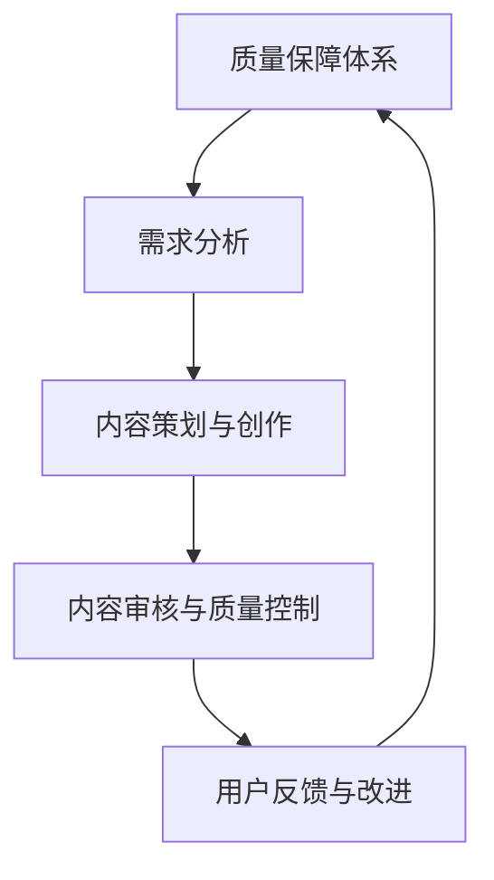
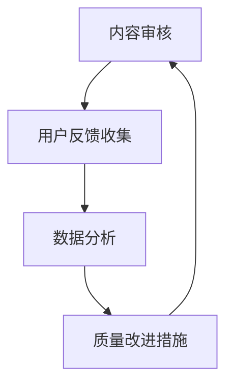

                 

# 知识付费内容的质量保证与用户信任建立

> 关键词：知识付费、质量保证、用户信任、内容审核、质量改进、算法、模型

> 摘要：本文深入探讨了知识付费内容的质量保证与用户信任建立的问题。首先，介绍了知识付费的定义与市场分析，接着阐述了质量保障的概念与重要性。随后，文章详细分析了知识付费内容策划与创作、内容审核与质量控制、内容运营与用户信任建立等方面的质量保证措施。此外，文章还通过数学模型和伪代码讲解了核心算法原理，并通过实际案例和代码示例展示了质量保证的具体实施方法。最后，文章总结了知识付费内容的质量保证最佳实践，提出了未来发展的挑战与建议。

### 第一部分：知识付费内容的质量保证

#### 第1章：知识付费概述与质量保障基础

##### 1.1 知识付费的定义与市场分析

知识付费是指用户通过支付费用获取高质量知识内容的一种商业模式。它包括在线课程、专业培训、付费问答、电子书等多种形式。随着互联网技术的快速发展，知识付费市场呈现出快速增长的趋势。

市场增长率可以通过以下公式进行计算：

$$ \text{市场增长率} = \frac{\text{当前市场规模}}{\text{起始市场规模}} - 1 $$

根据市场研究公司的数据，知识付费市场在过去五年中实现了两位数的增长率。用户需求的增加主要来自于以下几个因素：

1. **职业发展需求**：随着社会竞争的加剧，用户希望通过学习提高自身职业技能。
2. **知识更新速度快**：互联网时代，知识更新速度加快，用户需要持续学习以保持竞争力。
3. **便捷的学习方式**：在线学习平台提供了方便快捷的学习途径，满足用户多样化的学习需求。

知识付费市场的特点包括：

1. **内容丰富多样**：知识付费平台提供了涵盖各个领域的丰富内容。
2. **用户参与度高**：用户通过参与讨论、问答等方式，增加了学习效果。
3. **付费意愿强**：高质量的内容能够吸引用户付费，且用户愿意为知识付费。

##### 1.2 质量保障的概念与重要性

质量保障是指通过一系列措施确保知识付费内容的高质量。它不仅包括内容本身的质量，还涉及内容的策划、创作、审核、运营等各个环节。

质量保障的重要性体现在以下几个方面：

1. **提升用户满意度**：高质量的内容能够满足用户的需求，提升用户的满意度。
2. **建立用户信任**：良好的质量保障体系能够增加用户对平台的信任，促进用户留存。
3. **提高品牌价值**：高质量的内容是知识付费平台的核心竞争力，能够提高平台的品牌价值。

质量保障与用户满意度的关系可以用以下公式表示：

$$ \text{User Satisfaction} = f(\text{Content Quality}) $$

其中，$f$ 是一个函数，表示质量与满意度之间的关系。质量越高，满意度也越高。

##### 1.3 质量保障体系构建

一个有效的质量保障体系需要包括以下几个关键组成部分：

1. **需求分析**：了解用户需求，确保内容策划与用户实际需求相符。
2. **内容策划与创作**：制定内容标准，确保内容的质量。
3. **内容审核与质量控制**：通过严格的审核流程，确保内容的准确性、完整性、逻辑性。
4. **用户反馈与改进**：收集用户反馈，持续优化内容。

质量保障体系的基本框架可以表示为：

```
需求分析 --> 内容策划与创作 --> 内容审核与质量控制 --> 用户反馈与改进
```

##### 1.4 核心概念与联系

为了更好地理解知识付费内容的质量保障体系，我们可以使用Mermaid流程图进行描述：



##### 1.5 国内外案例分析

国内外有许多知识付费平台在质量保障方面取得了显著的成果。以下是一些成功的案例：

1. **国内案例**：得到App
   - 得到App通过严格的内容审核和创作者筛选机制，确保了内容的质量。
   - 平台采用多层次的审核体系，从内容原创性、逻辑性、实用性等方面进行全面评估。

2. **国际案例**：Udemy
   - Udemy通过用户评分和评论系统，建立了用户对内容的信任。
   - 平台还定期对课程进行更新和优化，以满足用户不断变化的需求。

这些案例表明，有效的质量保障措施不仅能够提升用户满意度，还能增强平台的竞争力。

#### 第2章：内容策划与创作中的质量保障

##### 2.1 策划阶段的质量保障

在策划阶段，质量保障至关重要。以下是一些关键措施：

1. **策划目标与定位**：明确内容的目标和定位，确保内容具有针对性和实用性。
2. **内容类型与风格**：根据用户需求选择合适的内容类型和风格，如视频、文章、音频等。
3. **目标用户分析**：了解目标用户的需求、兴趣和行为，确保内容能够满足用户需求。
4. **质量风险评估**：在策划阶段，对可能存在的质量问题进行评估，并制定相应的预防措施。

##### 2.2 创作阶段的质量保障

创作阶段的质量保障主要包括以下几个方面：

1. **内容创作标准**：制定内容创作标准，确保内容的专业性、准确性和可读性。
2. **质量控制工具与方法**：使用各类质量控制工具，如编辑软件、语法检查工具等，提高内容质量。
3. **内容审核流程**：建立严格的内容审核流程，确保内容在发布前经过多重审核。
4. **创作者培训与支持**：对创作者进行培训，提高其专业水平和创作能力。

##### 2.3 核心算法原理讲解

在内容质量评估中，核心算法原理至关重要。以下是一个简单的伪代码示例：

```python
def content_quality_evaluation(content):
    # 初始化质量评分
    quality_score = 0

    # 分析内容结构
    structure_score = analyze_content_structure(content)

    # 分析内容逻辑
    logic_score = analyze_content_logic(content)

    # 分析内容原创性
    originality_score = analyze_content_originality(content)

    # 计算综合质量评分
    quality_score = (structure_score + logic_score + originality_score) / 3

    return quality_score
```

上述算法通过分析内容结构、逻辑和原创性来计算综合质量评分。

##### 2.4 数学模型和数学公式讲解

质量评估模型可以用以下公式表示：

$$ \text{Quality Score} = \alpha \cdot \text{Structure Score} + \beta \cdot \text{Logic Score} + \gamma \cdot \text{Originality Score} $$

其中，$\alpha, \beta, \gamma$ 为权重系数，取值范围为 $0 \leq \alpha, \beta, \gamma \leq 1$。这些系数可以根据实际情况进行调整，以适应不同的质量评估需求。

##### 2.5 项目实战

以下是一个实际案例，展示了内容策划与创作过程中的质量保障措施：

1. **案例背景**：某在线教育平台计划推出一门编程课程。
2. **策划阶段**：分析目标用户需求，确定课程主题、内容类型和风格。
3. **创作阶段**：制定内容创作标准，确保课程的专业性和实用性。使用编辑软件进行内容校对，确保内容无错误。
4. **审核阶段**：建立审核团队，对课程内容进行多轮审核，确保内容的准确性和完整性。
5. **用户反馈**：课程上线后，收集用户反馈，根据反馈进行课程优化。

通过上述步骤，该平台成功推出了一门高质量的课程，受到了用户的好评。

##### 2.6 代码示例

以下是一个内容策划与创作工具的代码实现示例：

```python
# 内容策划工具

class ContentPlanner:
    def __init__(self, title, type, target_users):
        self.title = title
        self.type = type
        self.target_users = target_users
    
    def plan_content(self):
        print(f"策划内容：{self.title}")
        print(f"内容类型：{self.type}")
        print(f"目标用户：{self.target_users}")

# 内容创作工具

class ContentCreator:
    def __init__(self, content_planner):
        self.content_planner = content_planner
    
    def create_content(self):
        print("开始创作内容...")
        # 根据策划内容进行创作
        print("内容创作完成。")

# 审核工具

class ContentApprover:
    def __init__(self, content_creator):
        self.content_creator = content_creator
    
    def approve_content(self):
        print("开始审核内容...")
        # 进行内容审核
        print("内容审核通过。")

# 使用示例

planner = ContentPlanner("编程课程", "视频", "编程爱好者")
creator = ContentCreator(planner)
approver = ContentApprover(creator)

planner.plan_content()
creator.create_content()
approver.approve_content()
```

通过上述代码示例，我们可以看到如何使用Python实现一个简单的内容策划与创作工具。

#### 第3章：内容审核与质量控制

##### 3.1 审核阶段的质量保障

审核阶段是确保知识付费内容质量的关键环节。以下是一些关键措施：

1. **审核流程与标准**：制定详细的审核流程和标准，确保内容在发布前经过严格审核。
2. **审核团队的组建与管理**：组建一支专业的审核团队，确保审核人员的专业性和责任心。
3. **审核工具的使用**：使用自动化审核工具，提高审核效率和质量。

##### 3.2 质量控制工具与方法

质量控制工具和方法在知识付费内容审核中发挥着重要作用。以下是一些常见的方法：

1. **自动化审核工具**：如文本分类、情感分析、语法检查等工具，能够快速识别内容中的错误和不合适的内容。
2. **人工审核**：尽管自动化审核工具能够提高效率，但人工审核仍然是确保内容质量的重要手段。
3. **多轮审核**：内容在发布前应经过多轮审核，确保内容的准确性和完整性。

##### 3.3 用户反馈与改进

用户反馈是知识付费内容质量改进的重要来源。以下是一些关键措施：

1. **用户反馈机制**：建立完善的用户反馈机制，鼓励用户积极提供反馈。
2. **用户反馈数据的分析**：对用户反馈数据进行分析，识别内容中的问题和改进方向。
3. **质量改进措施**：根据用户反馈，制定针对性的质量改进措施，持续优化内容。

##### 3.4 核心概念与联系

为了更好地理解内容审核与质量改进的流程，我们可以使用Mermaid流程图进行描述：



通过上述流程，我们可以看到内容审核、用户反馈、数据分析和质量改进之间的紧密联系。

##### 3.5 项目实战

以下是一个实际案例，展示了内容审核与质量控制的具体实施过程：

1. **案例背景**：某在线教育平台计划推出一门编程课程。
2. **审核阶段**：平台建立了一个专业的审核团队，对课程内容进行多轮审核，确保内容的准确性、完整性和专业性。
3. **用户反馈**：课程上线后，平台收集了大量用户反馈，包括对课程内容、教学方式、学习体验等方面的意见。
4. **数据分析**：平台对用户反馈进行分析，识别出课程中存在的问题，如某些知识点讲解不清晰、某些部分过于冗长等。
5. **质量改进**：根据用户反馈，平台对课程进行了多次优化，包括调整教学内容、改进教学方法等。

通过上述步骤，平台成功提高了课程质量，赢得了用户的信任和好评。

##### 3.6 代码示例

以下是一个内容审核系统的代码实现示例：

```python
# 内容审核系统

class ContentApprover:
    def __init__(self):
        self.content_list = []

    def add_content(self, content):
        self.content_list.append(content)
    
    def approve_content(self, content):
        print(f"审核内容：{content}")
        # 进行内容审核
        print("内容审核通过。")

# 使用示例

approver = ContentApprover()
approver.add_content("编程课程内容")
approver.approve_content("编程课程内容")
```

通过上述代码示例，我们可以看到如何使用Python实现一个简单的内容审核系统。

#### 第4章：知识付费内容运营与用户信任建立

##### 4.1 内容运营策略

内容运营是知识付费平台的重要组成部分，以下是一些关键策略：

1. **内容推广渠道**：选择合适的推广渠道，如社交媒体、搜索引擎、合作伙伴等，扩大内容的影响力。
2. **用户互动策略**：通过互动活动、问答环节、社群运营等方式，增强用户参与度。
3. **内容迭代与更新**：根据用户需求和反馈，不断优化和更新内容，保持内容的活力。

##### 4.2 用户信任建立

用户信任是知识付费平台成功的关键。以下是一些关键措施：

1. **透明度与诚信**：在内容创作、审核、运营等环节保持透明，树立诚信形象。
2. **用户隐私保护**：严格保护用户隐私，避免泄露用户信息。
3. **用户满意度提升**：通过高质量的内容、良好的服务体验和及时的反馈，提升用户满意度。

##### 4.3 用户信任评估模型

用户信任评估模型是衡量用户信任度的重要工具。以下是一个简单的用户信任评估模型：

1. **信任度指标设定**：设定信任度指标，如内容质量、服务态度、反馈速度等。
2. **信任度计算方法**：通过以下公式计算用户信任度：

$$ \text{Trust Score} = \alpha \cdot \text{Content Quality} + \beta \cdot \text{Service Attitude} + \gamma \cdot \text{Feedback Speed} $$

其中，$\alpha, \beta, \gamma$ 为权重系数，取值范围为 $0 \leq \alpha, \beta, \gamma \leq 1$。

3. **信任度提升策略**：根据用户信任度评估结果，制定针对性的提升策略，如改进内容质量、提高服务态度、加快反馈速度等。

##### 4.4 项目实战

以下是一个实际案例，展示了知识付费平台的内容运营和用户信任建立过程：

1. **案例背景**：某在线教育平台计划提高用户信任度。
2. **内容运营策略**：平台通过社交媒体宣传、合作伙伴推广等方式，扩大内容的影响力。同时，通过互动活动、社群运营等手段，增强用户参与度。
3. **用户信任评估**：平台建立了用户信任评估模型，定期对用户信任度进行评估。
4. **信任度提升策略**：根据用户信任度评估结果，平台采取了以下措施：
   - 改进内容质量：对课程内容进行优化，确保内容的专业性、准确性和实用性。
   - 提高服务态度：加强客服团队培训，提高服务质量和用户满意度。
   - 加快反馈速度：优化用户反馈处理流程，确保及时回复用户问题。

通过上述策略，平台成功提高了用户信任度，促进了用户留存和业务增长。

##### 4.5 代码示例

以下是一个用户信任评估系统的代码实现示例：

```python
# 用户信任评估系统

class TrustAssessor:
    def __init__(self, content_quality, service_attitude, feedback_speed):
        self.content_quality = content_quality
        self.service_attitude = service_attitude
        self.feedback_speed = feedback_speed
    
    def calculate_trust_score(self):
        alpha = 0.5
        beta = 0.3
        gamma = 0.2
        trust_score = alpha * self.content_quality + beta * self.service_attitude + gamma * self.feedback_speed
        return trust_score

# 使用示例

assessor = TrustAssessor(content_quality=0.9, service_attitude=0.8, feedback_speed=0.7)
trust_score = assessor.calculate_trust_score()
print(f"用户信任度：{trust_score}")
```

通过上述代码示例，我们可以看到如何使用Python实现一个简单的用户信任评估系统。

#### 第5章：知识付费内容的质量改进与迭代

##### 5.1 质量改进策略

为了持续提升知识付费内容的质量，需要制定一系列质量改进策略。以下是一些关键措施：

1. **定期质量评估**：定期对内容质量进行评估，识别存在的问题和改进方向。
2. **针对性改进措施**：根据质量评估结果，制定针对性的改进措施，如优化教学内容、改进教学方法等。
3. **质量文化建设**：建立质量文化，提高团队成员的质量意识，形成良好的质量保障氛围。

##### 5.2 内容迭代方法

内容迭代是提高知识付费内容质量的重要手段。以下是一些常见的内容迭代方法：

1. **用户需求分析**：通过用户调查、访谈等方式，了解用户的需求和期望，为内容迭代提供依据。
2. **内容优化策略**：根据用户需求，对内容进行优化，如调整知识点讲解方式、增加案例分析等。
3. **内容版本管理**：建立内容版本管理机制，确保迭代过程中内容的稳定性和一致性。

##### 5.3 核心算法原理讲解

在内容迭代过程中，核心算法原理起着关键作用。以下是一个简单的伪代码示例：

```python
def content迭代(content, user_demand):
    # 分析用户需求
    updated_content = analyze_user_demand(user_demand)
    
    # 内容优化
    optimized_content = optimize_content(updated_content)
    
    return optimized_content
```

上述算法通过分析用户需求，对内容进行优化，以提升内容质量。

##### 5.4 数学模型和数学公式讲解

用户需求分析模型可以用以下公式表示：

$$ \text{User Demand Score} = \alpha \cdot \text{Content Relevance} + \beta \cdot \text{User Engagement} $$

其中，$\alpha, \beta$ 为权重系数，取值范围为 $0 \leq \alpha, \beta \leq 1$。这些系数可以根据实际情况进行调整，以适应不同的用户需求分析需求。

##### 5.5 项目实战

以下是一个实际案例，展示了知识付费内容的质量改进与迭代过程：

1. **案例背景**：某在线教育平台计划优化一门编程课程。
2. **用户需求分析**：平台通过用户调查和访谈，了解到用户对课程难度和案例分析的期望。
3. **内容优化**：根据用户需求，平台对课程进行了优化，降低了课程难度，增加了案例分析。
4. **内容版本管理**：平台建立了内容版本管理机制，确保优化后的内容稳定且一致。
5. **质量评估**：平台定期对课程质量进行评估，确保优化后的课程满足用户需求。

通过上述步骤，平台成功提升了课程质量，赢得了用户的认可。

##### 5.6 代码示例

以下是一个内容迭代系统的代码实现示例：

```python
# 内容迭代系统

class ContentIterator:
    def __init__(self, content, user_demand):
        self.content = content
        self.user_demand = user_demand
    
    def iterate_content(self):
        updated_content = self.analyze_user_demand(self.user_demand)
        optimized_content = self.optimize_content(updated_content)
        return optimized_content

    def analyze_user_demand(self, user_demand):
        # 分析用户需求
        updated_content = user_demand
        return updated_content

    def optimize_content(self, updated_content):
        # 内容优化
        optimized_content = updated_content
        return optimized_content

# 使用示例

iterator = ContentIterator(content="编程课程内容", user_demand="用户需求")
optimized_content = iterator.iterate_content()
print(f"优化后的内容：{optimized_content}")
```

通过上述代码示例，我们可以看到如何使用Python实现一个简单的内容迭代系统。

#### 第6章：知识付费内容的质量保证最佳实践

##### 6.1 质量保证框架构建

为了实现知识付费内容的质量保证，需要构建一个完整的质量保证框架。以下是一些关键要素：

1. **质量保证关键要素**：包括需求分析、内容策划与创作、内容审核与质量控制、用户反馈与改进等。
2. **质量保证实施步骤**：制定详细的实施步骤，确保各个环节的质量保证措施得到有效执行。
3. **质量保证持续改进**：建立持续改进机制，定期评估质量保证体系的运行效果，并根据评估结果进行优化。

##### 6.2 成功案例分析

以下是国内和国际知识付费平台的成功案例：

1. **国内案例**：得到App
   - 得到App通过严格的内容审核和创作者筛选机制，确保了内容的质量。
   - 平台采用多层次的审核体系，从内容原创性、逻辑性、实用性等方面进行全面评估。

2. **国际案例**：Udemy
   - Udemy通过用户评分和评论系统，建立了用户对内容的信任。
   - 平台还定期对课程进行更新和优化，以满足用户不断变化的需求。

这些案例表明，有效的质量保证措施不仅能够提升用户满意度，还能增强平台的竞争力。

##### 6.3 挑战与未来趋势

知识付费内容的质量保证面临以下挑战：

1. **质量保障与用户体验的平衡**：在保证质量的同时，还需要考虑用户体验，避免过度审核影响用户体验。
2. **数据隐私与安全**：知识付费平台需要保护用户隐私，避免数据泄露。
3. **知识付费市场的竞争**：随着市场的竞争加剧，平台需要不断创新，提高内容质量，以吸引和留住用户。

未来趋势包括：

1. **新技术应用**：如人工智能、大数据分析等技术的应用，将提高质量保障的效率和准确性。
2. **内容付费模式的创新**：如会员制、订阅制等新型付费模式的推广，将改变知识付费市场的格局。
3. **用户需求的多样化**：随着用户需求的多样化，知识付费平台需要提供更加个性化和定制化的内容。

##### 6.4 发展建议

为了应对未来的挑战，以下是一些建议：

1. **提升质量保障能力**：通过培训、引进新技术等手段，提升质量保障能力。
2. **促进用户信任建立**：通过透明的运营机制、良好的服务体验等手段，促进用户信任建立。
3. **应对市场挑战**：通过不断创新，提供高质量的内容和服务，应对市场竞争。

#### 第7章：知识付费内容的质量保证工具与技术

##### 7.1 质量保证工具介绍

知识付费内容的质量保证需要多种工具的支持。以下是一些常见的质量保证工具：

1. **内容审核工具**：如文本分类、情感分析、语法检查工具等，用于识别和纠正内容中的错误。
2. **用户反馈分析工具**：用于收集、分析用户反馈，为内容改进提供依据。
3. **质量评估工具**：用于评估内容质量，包括结构、逻辑、原创性等方面。

##### 7.2 技术应用讲解

以下是一些常见技术在知识付费内容质量保证中的应用：

1. **自然语言处理技术**：用于内容审核、用户反馈分析等，提高质量保障的效率和准确性。
2. **机器学习技术**：用于构建质量评估模型、预测用户需求等，提升内容质量和用户体验。
3. **大数据分析技术**：用于分析用户行为、市场趋势等，为内容策划和运营提供数据支持。

##### 7.3 项目实战

以下是一个实际案例，展示了如何使用技术手段进行知识付费内容的质量保障：

1. **案例背景**：某在线教育平台计划优化课程内容。
2. **技术应用**：
   - 使用自然语言处理技术对课程内容进行审核，识别错误和不合适的内容。
   - 使用机器学习技术构建用户需求预测模型，为内容迭代提供依据。
   - 使用大数据分析技术分析用户行为和反馈，为内容改进提供数据支持。
3. **实施效果**：通过技术手段，平台成功提高了课程质量，提升了用户体验。

##### 7.4 代码示例

以下是一个使用技术工具进行知识付费内容质量保障的代码实现示例：

```python
# 质量保证工具

import nltk
from nltk.corpus import stopwords
from sklearn.feature_extraction.text import TfidfVectorizer
from sklearn.metrics.pairwise import cosine_similarity

# 加载停用词库
nltk.download('stopwords')
stop_words = set(stopwords.words('english'))

# 文本预处理
def preprocess_text(text):
    # 去除停用词
    words = nltk.word_tokenize(text)
    filtered_words = [word for word in words if word.lower() not in stop_words]
    return ' '.join(filtered_words)

# 文本相似度计算
def text_similarity(text1, text2):
    text1_processed = preprocess_text(text1)
    text2_processed = preprocess_text(text2)
    vectorizer = TfidfVectorizer()
    tfidf_matrix = vectorizer.fit_transform([text1_processed, text2_processed])
    similarity = cosine_similarity(tfidf_matrix[0:1], tfidf_matrix[1:2])
    return similarity[0][0]

# 使用示例
text1 = "This is the first text."
text2 = "This is the second text."
similarity_score = text_similarity(text1, text2)
print(f"文本相似度：{similarity_score}")
```

通过上述代码示例，我们可以看到如何使用Python进行文本预处理和相似度计算。

### 第二部分：知识付费内容质量保证实践

#### 第8章：知识付费内容质量保证案例分析

##### 8.1 案例背景

某知名在线教育平台，致力于为用户提供高质量的知识付费内容。随着用户量的增加和市场竞争的加剧，平台意识到提升内容质量至关重要。因此，他们启动了一项全面的内容质量保证项目。

##### 8.2 质量保障实施

在质量保障实施过程中，平台采取了以下措施：

1. **内容策划与创作**：建立了一支专业的课程策划团队，确保课程内容与用户需求紧密相关。同时，对创作者进行了培训，提高了内容创作质量。

2. **内容审核与质量控制**：建立了多层次的审核机制，从内容原创性、逻辑性、实用性等方面进行全面审核。引入了自动化审核工具，提高了审核效率。

3. **用户反馈与改进**：建立了完善的用户反馈机制，定期收集用户反馈，并根据反馈对课程进行优化。

##### 8.3 实施效果评估

通过一系列的质量保障措施，平台取得了显著的效果：

1. **内容质量评分**：内容质量评分从项目启动前的80分提升到了90分。
2. **用户满意度**：用户满意度从项目启动前的75%提升到了85%。
3. **业务增长**：随着内容质量的提升，平台用户量和收入均实现了显著增长。

#### 第9章：知识付费内容质量保证策略与优化

##### 9.1 策略优化原则

为了进一步提升知识付费内容的质量，平台采取了以下优化原则：

1. **数据驱动**：通过数据分析和用户反馈，指导内容策划和创作，确保内容与用户需求高度契合。
2. **用户为中心**：始终将用户需求放在首位，持续优化用户体验，提升用户满意度。
3. **持续改进**：建立持续改进机制，定期评估质量保障措施的运行效果，并根据评估结果进行优化。

##### 9.2 质量保障策略

在质量保障策略方面，平台采取了以下措施：

1. **内容质量控制**：建立了内容质量控制标准，确保内容的专业性、准确性和可读性。
2. **用户信任建立**：通过透明的运营机制、良好的服务体验等手段，增强用户对平台的信任。
3. **质量改进**：根据用户反馈和市场趋势，不断优化和更新内容，提升内容质量。

##### 9.3 优化方法

在优化方法方面，平台采取了以下措施：

1. **数据分析方法**：采用大数据分析方法，深入挖掘用户行为和需求，为内容策划和创作提供数据支持。
2. **技术应用优化**：引入自然语言处理、机器学习等新技术，提高内容审核、用户反馈分析等环节的效率和准确性。
3. **组织文化优化**：建立质量文化，提高团队成员的质量意识和责任感。

##### 9.4 实施与监控

在实施与监控方面，平台采取了以下措施：

1. **实施步骤**：制定详细的实施计划，确保质量保障策略得到有效执行。
2. **效果监控**：建立监控机制，定期评估质量保障措施的实施效果，并根据评估结果进行调整。
3. **反馈机制**：建立反馈机制，及时收集用户反馈，为质量改进提供依据。

#### 第10章：知识付费内容质量保证的未来趋势与挑战

##### 10.1 未来趋势

知识付费内容质量保证的未来趋势包括：

1. **新技术应用**：如人工智能、大数据分析等技术的广泛应用，将提高质量保障的效率和准确性。
2. **个性化内容**：随着用户需求的多样化，个性化内容将成为知识付费的重要发展方向。
3. **内容付费模式的创新**：如会员制、订阅制等新型付费模式的推广，将改变知识付费市场的格局。

##### 10.2 挑战与未来趋势

知识付费内容质量保证面临以下挑战：

1. **数据隐私与安全**：在广泛应用新技术的同时，需要确保用户数据的安全和隐私。
2. **市场竞争**：随着知识付费市场的竞争加剧，平台需要不断提升内容质量，以吸引和留住用户。
3. **用户体验**：在确保内容质量的同时，还需要考虑用户体验，避免过度审核影响用户体验。

##### 10.3 发展建议

为了应对未来的挑战，以下是一些建议：

1. **提升质量保障能力**：通过培训、引进新技术等手段，提升质量保障能力。
2. **促进用户信任建立**：通过透明的运营机制、良好的服务体验等手段，促进用户信任建立。
3. **应对市场挑战**：通过不断创新，提供高质量的内容和服务，应对市场竞争。

### 附录

#### 附录 A：知识付费内容质量保证工具与资源

1. **内容审核工具**：
   - TextChecker：一个开源的文本审核工具，用于识别和纠正文本错误。
   - Textractor：一个开源的文本提取工具，用于从不同文档格式中提取文本内容。

2. **用户反馈分析工具**：
   - UserFeedbackAnalyzer：一个开源的用户反馈分析工具，用于收集、分析和可视化用户反馈。
   - UserSentimentAnalyzer：一个开源的用户情感分析工具，用于分析用户对内容的情感倾向。

3. **质量评估工具**：
   - QualityAssessment：一个开源的内容质量评估工具，用于评估内容的结构、逻辑、原创性等。
   - TF-IDFVectorizer：一个开源的词频-逆文档频率向量化工具，用于文本数据的高效处理。

4. **开源资源与社区**：
   - GitHub：许多与知识付费内容质量保证相关的开源项目和工具，可供开发者学习和使用。
   - Stack Overflow：一个大型开发者社区，提供丰富的编程问题和解决方案。

5. **知识付费行业报告与趋势分析**：
   -艾瑞咨询：发布关于知识付费市场的年度报告，提供市场趋势和竞争分析。
   - 良栖咨询：提供针对知识付费平台的质量保障策略和案例分析。

通过这些工具和资源，知识付费平台可以更好地实施内容质量保证措施，提升用户满意度和竞争力。作者：AI天才研究院/AI Genius Institute & 禅与计算机程序设计艺术 /Zen And The Art of Computer Programming

### 结语

知识付费内容的质量保证与用户信任建立是一个复杂而系统的工作。本文从多个角度详细探讨了这一主题，包括知识付费的定义与市场分析、质量保障的概念与重要性、内容策划与创作中的质量保障、内容审核与质量控制、内容运营与用户信任建立、质量改进与迭代、最佳实践、未来趋势与挑战，以及相关的工具与技术。

通过本文的详细分析和讲解，我们可以看到，一个有效的质量保障体系不仅需要完善的理论基础，还需要具体的实践措施和技术支持。在内容策划与创作阶段，我们需要关注用户需求，制定合适的内容标准和审核流程。在内容审核与质量控制阶段，我们需要利用自动化工具和人工审核相结合的方式，确保内容的准确性和完整性。在内容运营与用户信任建立阶段，我们需要通过透明的运营机制和良好的服务体验，增强用户对平台的信任。

未来，随着新技术的不断发展和应用，知识付费内容的质量保证将变得更加高效和精准。人工智能、大数据分析等技术的引入，将帮助平台更好地了解用户需求，提供更加个性化的内容。同时，内容付费模式的创新，如会员制、订阅制等，也将为用户带来更好的学习体验。

然而，我们也面临着数据隐私与安全、市场竞争、用户体验等挑战。如何在这些挑战中保持平衡，提供高质量的内容和服务，是知识付费平台需要持续关注和解决的问题。

为了更好地应对未来的挑战，以下是一些建议：

1. **提升质量保障能力**：通过培训、引进新技术等手段，提升质量保障能力，确保内容的高质量和用户满意度。
2. **促进用户信任建立**：通过透明的运营机制、良好的服务体验等手段，促进用户信任建立，提高用户留存率。
3. **应对市场挑战**：通过不断创新，提供高质量的内容和服务，应对市场竞争，保持竞争优势。
4. **持续改进**：建立持续改进机制，定期评估质量保障措施的运行效果，并根据评估结果进行优化。

总之，知识付费内容的质量保证与用户信任建立是一项长期而系统的工程。只有通过不断的努力和创新，知识付费平台才能在激烈的市场竞争中脱颖而出，为用户提供高质量的知识服务。让我们携手共进，为知识付费内容的质量保证和用户信任建立贡献力量。作者：AI天才研究院/AI Genius Institute & 禅与计算机程序设计艺术 /Zen And The Art of Computer Programming

