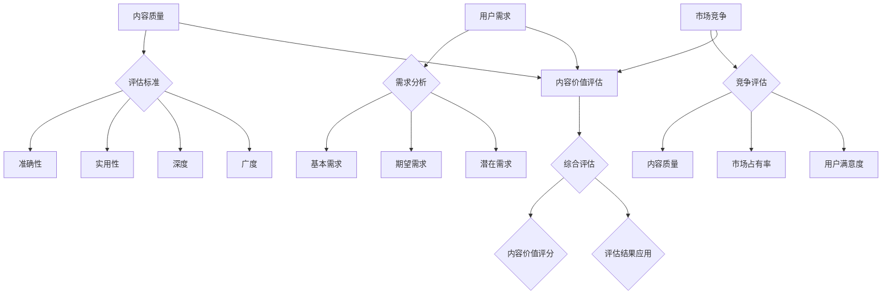

                 

### 《知识付费创业中的内容价值评估体系》

> 关键词：知识付费、内容价值评估、创业、用户需求、市场竞争、评估方法

> 摘要：本文旨在探讨知识付费创业中的内容价值评估体系。通过对知识付费行业的背景和现状进行分析，本文提出了内容价值评估的概念、原则和方法，并详细阐述了内容价值评估体系在创业中的实施与应用。同时，本文还对内容价值评估体系的优化和未来趋势进行了展望。

### 第一部分：背景与概述

#### 第1章：知识付费行业概述

##### 1.1 知识付费的定义与历史演变

**知识付费的定义**：

知识付费，是指用户为了获取特定知识、技能或信息，通过支付一定费用来获取相应内容的服务。这种服务通常以在线课程、付费专栏、付费问答等形式出现。

**知识付费的发展历程**：

知识付费作为一种新兴的商业模式，起源于互联网的快速发展。早在2000年初，一些教育机构和内容创作者就开始通过在线平台提供付费课程或文章。随着移动互联网的普及，知识付费行业逐渐壮大。尤其是在2016年左右，知识付费迎来了爆发式增长，各类知识付费平台如雨后春笋般涌现。

##### 1.2 知识付费市场的现状与趋势

**市场规模与增长**：

根据相关报告，我国知识付费市场规模逐年扩大，预计2021年将达到2961亿元。其中，在线教育、知识问答、付费直播等细分领域增长迅速。

**用户特征与需求**：

知识付费用户主要集中在25-45岁之间，具备较高的消费能力和学习需求。他们关注个人成长、职业发展和兴趣爱好，对高质量内容有较高的需求。

##### 1.3 知识付费行业的商业模式

**平台型商业模式**：

平台型商业模式以知识付费平台为核心，通过连接内容创作者和用户，提供内容发布、推广、支付、评价等服务。如知乎Live、得到、喜马拉雅等。

**内容型商业模式**：

内容型商业模式以提供高质量内容为主，通过用户付费来获取收入。如李笑来、吴晓波等知名知识付费内容创作者。

##### 1.4 知识付费创业的机会与挑战

**市场机会分析**：

知识付费行业具有巨大的市场潜力，尤其在教育、职业发展、个人成长等领域。随着人们对知识的需求不断增长，知识付费创业将迎来更多机会。

**创业挑战与应对策略**：

1. 竞争激烈：面对众多竞争对手，创业企业需要找到差异化的定位和核心竞争力。
2. 内容质量：优质内容是知识付费的核心，创业企业需要不断优化内容质量和用户体验。
3. 用户信任：建立用户信任是知识付费创业的关键，企业需要通过高质量的服务和内容赢得用户信任。

#### 第2章：内容价值评估的概念与原则

##### 2.1 内容价值评估的定义

**内容价值的定义**：

内容价值是指知识、信息或技能等所具有的对用户的实际帮助和吸引力。它反映了内容对用户需求的满足程度和市场的认可度。

**内容价值评估的重要性**：

内容价值评估对于知识付费创业具有重要意义。通过评估内容价值，创业企业可以：

1. 确定内容质量和市场需求，优化内容创作策略。
2. 了解用户需求和反馈，提升用户体验和满意度。
3. 挖掘潜在商业机会，提高收入和盈利能力。

##### 2.2 内容价值评估的原则

**客观性**：

内容价值评估应遵循客观性原则，避免主观偏见和情感因素。评估指标和标准应具有客观性和可量化性，以确保评估结果的公正性和准确性。

**全面性**：

内容价值评估应从多个维度进行，包括内容质量、用户需求、市场竞争等。全面评估有助于全面了解内容的价值，为创业企业提供更准确的决策依据。

**动态性**：

内容价值评估应具有动态性，随着市场和用户需求的变化不断调整。创业企业需要根据市场反馈和用户反馈，及时调整内容策略，以保持内容的价值。

##### 2.3 内容价值评估的方法

**定量方法**：

定量方法主要通过数据分析和量化指标来评估内容价值。如用户活跃度、用户满意度、内容点击率、购买转化率等。

**定性方法**：

定性方法主要通过用户反馈、专家评价、内容评价等来评估内容价值。如用户评论、专家评分、内容评分等。

#### 第3章：内容价值评估的核心要素

##### 3.1 内容质量评估

**内容质量的定义**：

内容质量是指知识、信息或技能等内容的准确性、实用性、深度和广度等方面的表现。

**内容质量评估指标**：

1. 准确性：内容是否符合事实和逻辑，是否有误导性。
2. 实用性：内容是否具有实际应用价值，能否解决用户问题。
3. 深度：内容是否深入探讨问题，是否有独到见解。
4. 广度：内容是否涵盖多个相关领域，是否具有全面性。

**内容质量评估流程**：

1. 确定评估标准：根据内容类型和目标用户，制定评估标准。
2. 数据收集：收集内容相关的数据，如用户反馈、专家评价、内容评价等。
3. 数据分析：对收集到的数据进行分析，得出评估结果。
4. 结果应用：根据评估结果，调整内容创作策略和优化内容质量。

##### 3.2 用户需求分析

**用户需求的定义**：

用户需求是指用户在获取知识、信息或技能时所期望满足的需求。

**用户需求分析的方法**：

1. 用户调研：通过问卷调查、访谈、焦点小组等方式收集用户需求信息。
2. 用户画像：根据用户数据，分析用户的特征和偏好。
3. 需求分类：将用户需求分为基本需求、期望需求、潜在需求等。

**用户需求分析的结果应用**：

1. 内容定位：根据用户需求，确定内容主题和方向。
2. 内容优化：根据用户需求，调整内容结构、语言和表达方式。
3. 用户反馈：通过用户反馈，了解内容需求的满足程度，不断优化内容。

##### 3.3 市场竞争评估

**市场竞争的定义**：

市场竞争是指在同一领域内，不同内容创作者或平台之间的竞争关系。

**市场竞争评估指标**：

1. 内容质量：内容创作者或平台提供的内容质量水平。
2. 市场占有率：内容创作者或平台在市场中所占的份额。
3. 用户满意度：用户对内容创作者或平台的满意度。

**市场竞争评估的影响**：

1. 内容创作策略：了解市场竞争情况，制定更具竞争力的内容创作策略。
2. 用户获取：通过提升内容质量和用户体验，增加用户获取和留存。
3. 市场定位：根据市场竞争情况，确定自身市场定位和发展方向。

#### 第4章：内容价值评估体系的实施

##### 4.1 内容价值评估体系的构建步骤

**第一步：明确评估目标**

确定评估内容的目标，如内容质量、用户需求、市场竞争等。

**第二步：制定评估标准**

根据评估目标，制定具体的评估标准和指标。

**第三步：设计评估方法**

选择合适的评估方法，如定量方法、定性方法等。

**第四步：实施评估操作**

根据评估标准和评估方法，进行实际评估操作，收集和分析评估数据。

##### 4.2 内容价值评估的工具与平台

**评估工具的选择**

1. 数据分析工具：如Excel、Python等。
2. 用户调研工具：如问卷调查、访谈工具等。
3. 评价系统工具：如用户评价、专家评分等。

**评估平台的功能与特点**

1. 内容发布平台：如知乎、得到等，提供内容发布和展示功能。
2. 评价系统平台：如评价系统、用户反馈系统等，提供用户评价和反馈功能。
3. 数据分析平台：如大数据分析平台、人工智能分析平台等，提供数据分析功能。

##### 4.3 内容价值评估的实践案例

**案例一：某知识付费平台的评估实践**

该平台通过用户调研、专家评价、数据分析等手段，对平台上的内容进行评估。根据评估结果，优化内容创作策略，提高内容质量和用户体验。

**案例二：内容创作者的评估策略**

某知名内容创作者通过用户反馈、专家评价、市场调研等方式，对自身内容进行评估。根据评估结果，调整内容方向和创作策略，提升内容价值。

#### 第三部分：内容价值评估体系优化

##### 5.1 评估结果的反馈机制

**评估结果的反馈方式**

1. 汇总报告：将评估结果以报告形式反馈给内容创作者和平台。
2. 个性化反馈：针对评估结果，提供个性化的改进建议。

**评估结果的应用**

1. 内容优化：根据评估结果，调整内容创作策略，提高内容质量。
2. 用户服务：根据评估结果，提升用户体验，增加用户满意度。
3. 市场定位：根据评估结果，优化市场定位和发展战略。

##### 5.2 评估体系的持续优化

**评估体系的优化原则**

1. 客观性：保持评估过程的客观性和公正性。
2. 全面性：覆盖评估体系的各个方面，确保评估结果的全面性。
3. 动态性：根据市场和用户需求的变化，及时调整评估体系。

**评估体系的优化策略**

1. 定期评估：定期对内容进行评估，及时发现问题和改进机会。
2. 反馈机制：建立有效的反馈机制，确保评估结果的及时性和准确性。
3. 持续改进：根据评估结果，持续优化内容创作和服务质量。

##### 5.3 评估体系的影响与效果评估

**评估体系对内容创作的推动作用**

1. 提高内容质量：通过评估体系，内容创作者可以及时发现自身不足，提高内容质量。
2. 优化内容策略：根据评估结果，调整内容创作方向和策略，提升内容价值。

**评估体系对用户满意度的提升**

1. 个性化服务：根据用户需求和反馈，提供个性化的内容和服务。
2. 提升用户体验：通过评估体系，不断提升用户体验，增加用户满意度。

#### 第6章：内容价值评估在创业中的实践

##### 6.1 创业初期的内容价值评估

**创业初期的目标设定**

在创业初期，明确内容价值评估的目标至关重要。目标可以包括：

1. 确定内容主题和方向。
2. 评估内容市场需求和潜在用户。
3. 确定内容创作和推广策略。

**创业初期的内容选择**

在创业初期，选择具有高价值的内容是关键。可以通过以下方法进行内容选择：

1. 用户调研：了解用户需求，选择符合用户期望的内容。
2. 市场分析：分析市场趋势，选择具有市场潜力的内容。
3. 竞争分析：了解竞争对手的内容策略，选择差异化内容。

##### 6.2 创业中期的内容价值评估

**内容价值的动态调整**

在创业中期，内容价值的评估和调整至关重要。可以通过以下方法进行内容价值的动态调整：

1. 定期评估：定期对内容进行评估，了解内容价值和用户需求的变化。
2. 用户反馈：收集用户反馈，了解用户对内容的满意度。
3. 市场反馈：关注市场动态，了解竞争对手的内容策略。

**内容优化与升级**

在创业中期，通过内容优化和升级，提升内容价值和用户体验。具体方法包括：

1. 内容结构优化：调整内容结构，使内容更易于阅读和理解。
2. 语言表达优化：改进语言表达，使内容更具吸引力。
3. 视觉设计优化：提升内容视觉效果，增加用户阅读兴趣。

##### 6.3 创业后期的内容价值评估

**内容价值的持续挖掘**

在创业后期，内容价值的持续挖掘至关重要。可以通过以下方法进行内容价值的持续挖掘：

1. 深度拓展：对已有内容进行深度拓展，增加内容的实用性和深度。
2. 系列化开发：将相关内容进行系列化开发，形成知识体系。
3. 互动性提升：增加用户互动，提高用户参与度和粘性。

**内容价值的最大化利用**

在创业后期，内容价值的最大化利用是关键。可以通过以下方法进行内容价值的最大化利用：

1. 内容多元化：将内容转化为多种形式，如视频、音频、电子书等。
2. 跨平台运营：在多个平台进行内容运营，扩大用户覆盖范围。
3. 合作拓展：与其他企业或个人进行合作，共同开发内容产品。

### 第7章：结论与展望

##### 7.1 内容价值评估体系总结

**核心内容与要点回顾**：

1. 知识付费行业背景与现状。
2. 内容价值评估的概念、原则和方法。
3. 内容价值评估的核心要素。
4. 内容价值评估体系的实施与应用。
5. 内容价值评估体系的优化与未来趋势。

**经验与教训总结**：

1. 内容质量是知识付费的核心。
2. 用户需求是内容创作的关键。
3. 市场竞争是内容价值的考验。
4. 持续优化是内容价值评估的关键。

##### 7.2 知识付费创业的未来趋势

**行业发展趋势**：

1. 知识付费市场规模将继续扩大。
2. 内容创作将更加多元化和专业化。
3. 技术创新将推动知识付费的发展。

**创业机会与挑战**：

**机会**：

1. 新兴领域的知识付费机会。
2. 跨界融合的知识付费机会。
3. 个人品牌和内容IP的打造。

**挑战**：

1. 内容质量竞争激烈。
2. 用户信任和留存难题。
3. 技术和成本的压力。

##### 7.3 对未来研究的建议

**研究方向**：

1. 内容价值评估模型与算法研究。
2. 用户需求与行为分析研究。
3. 知识付费商业模式创新研究。

**研究方法**：

1. 大数据分析与机器学习。
2. 用户调研与实证研究。
3. 案例分析与行业研究。

### 附录

##### A.1 相关术语解释

**知识付费**：

知识付费，是指用户为了获取特定知识、技能或信息，通过支付一定费用来获取相应内容的服务。

**内容价值评估**：

内容价值评估，是指对知识、信息或技能等内容的实际帮助和吸引力进行评估，以确定其价值。

##### A.2 参考文献

**引用的书籍**：

1. 《知识付费：产业变革与创新》
2. 《互联网时代的知识付费：趋势与案例分析》
3. 《内容创业：从0到1的实践指南》

**引用的论文**：

1. 《知识付费市场的现状、问题与对策》
2. 《基于用户需求的在线知识付费服务评估模型研究》
3. 《知识付费创业的机会与挑战》

**引用的报告**：

1. 《2021年中国知识付费行业研究报告》
2. 《2021年知识付费用户行为报告》
3. 《知识付费行业发展趋势与投资机会分析》

##### A.3 实践案例代码

```python
# 实践案例：内容价值评估计算

# 导入必要的库
import pandas as pd
import numpy as np

# 准备数据
data = {
    '内容质量评分': [4.5, 5.0, 3.5, 4.0, 5.0],
    '用户满意度评分': [4.0, 4.5, 3.0, 3.5, 4.5],
    '市场竞争评分': [3.5, 3.0, 4.5, 4.0, 3.5]
}

# 创建DataFrame
df = pd.DataFrame(data)

# 计算内容价值评分
df['内容价值评分'] = df['内容质量评分'] * df['用户满意度评分'] * df['市场竞争评分']

# 按内容价值评分降序排列
df_sorted = df.sort_values(by='内容价值评分', ascending=False)

# 输出结果
print(df_sorted)
```

**代码解读**：

1. 导入必要的库：pandas和numpy。
2. 准备数据：包括内容质量评分、用户满意度评分和市场竞争评分。
3. 创建DataFrame：使用pandas创建数据框。
4. 计算内容价值评分：将内容质量评分、用户满意度评分和市场竞争评分相乘。
5. 按内容价值评分降序排列：使用sort_values函数按内容价值评分降序排列。
6. 输出结果：打印排序后的数据框。这是基于Python的实现，具体实现方法可以根据实际需求进行调整。**作者**：

- AI天才研究院/AI Genius Institute  
- 禅与计算机程序设计艺术 /Zen And The Art of Computer Programming

### 核心概念与联系：内容价值评估原理及Mermaid流程图

在探讨知识付费创业中的内容价值评估体系时，理解内容价值评估的核心概念及其相互联系至关重要。内容价值评估涉及多个维度，包括内容质量、用户需求和市场竞争等。以下是这些核心概念及其关系的详细解释，以及一个使用Mermaid绘制的流程图，以帮助读者更直观地理解内容价值评估的原理。

#### 核心概念与联系

1. **内容质量**：
   内容质量是指知识、信息或技能内容的准确性、实用性、深度和广度等方面的表现。它是评估内容价值的基础。高质量的内容能够更好地满足用户需求，提升用户满意度。

2. **用户需求**：
   用户需求是指用户在获取知识、信息或技能时所期望满足的需求。用户需求直接影响内容的价值，了解用户需求是内容创作和优化的重要依据。

3. **市场竞争**：
   市场竞争是指在同一领域内，不同内容创作者或平台之间的竞争关系。市场竞争状况影响内容的相对价值，通过评估市场竞争，可以确定内容的竞争优势。

4. **内容价值评估**：
   内容价值评估是对内容价值的整体评价，通过综合分析内容质量、用户需求和市场竞争等因素，对内容的价值进行量化评估。

#### 核心概念及相互关系的Mermaid流程图

以下是使用Mermaid绘制的流程图，展示了上述核心概念及其相互关系：



**Mermaid流程图解读**：

- **内容质量评估**：从内容质量出发，制定具体的评估标准（准确性、实用性、深度、广度），这些标准是评估内容质量的基础。
- **用户需求分析**：从用户需求的角度，进行需求分析，识别用户的基本需求、期望需求以及潜在需求，这些需求将影响内容的价值。
- **市场竞争评估**：从市场竞争的角度，进行竞争评估，分析内容质量、市场占有率和用户满意度，以了解内容的竞争状况。
- **内容价值评估**：综合内容质量、用户需求和市场竞争的评估结果，进行内容价值评估，得出内容价值评分和评估结果，这些结果将指导内容创作和优化。

通过这个流程图，我们可以清晰地看到内容价值评估是如何基于多个核心概念相互联系和综合分析的。这样的流程有助于创业企业更好地理解内容价值评估体系，从而制定更有效的内容策略。

### 内容价值评估的核心算法原理及伪代码讲解

在知识付费创业中，内容价值评估的核心算法是评估内容质量、用户需求和市场竞争，从而得出内容的价值评分。以下将详细介绍内容价值评估的核心算法原理，并使用伪代码进行详细阐述。

#### 核心算法原理

内容价值评估的核心算法主要基于以下三个方面：

1. **内容质量评估**：通过定量和定性方法对内容质量进行评估，包括准确性、实用性、深度和广度等维度。
2. **用户需求分析**：通过用户调研和需求分析，识别用户的基本需求、期望需求和潜在需求，分析内容对用户需求的满足程度。
3. **市场竞争评估**：通过分析市场竞争状况，包括内容质量、市场占有率和用户满意度，评估内容的竞争力。

#### 伪代码讲解

```python
# 核心算法：内容价值评估

# 输入：
# 内容质量评分（accuracy_score, usability_score, depth_score, breadth_score）
# 用户需求评分（user_needs_score）
# 市场竞争评分（market_competition_score）

# 输出：
# 内容价值评分（content_value_score）

# 定义权重
weight_content_quality = 0.4
weight_user_needs = 0.3
weight_market_competition = 0.3

# 计算内容质量得分
content_quality_score = (accuracy_score + usability_score + depth_score + breadth_score) / 4

# 计算用户需求得分
user_needs_score = sum(user_needs_rating) / len(user_needs_rating)

# 计算市场竞争得分
market_competition_score = sum(market_competition_rating) / len(market_competition_rating)

# 计算内容价值得分
content_value_score = (weight_content_quality * content_quality_score +
                        weight_user_needs * user_needs_score +
                        weight_market_competition * market_competition_score)

# 输出内容价值得分
return content_value_score
```

**伪代码解读**：

1. **输入参数**：包括内容质量评分（准确性、实用性、深度和广度）、用户需求评分和市场竞争评分。
2. **定义权重**：分别定义内容质量、用户需求和市场竞争在内容价值评估中的权重。
3. **计算内容质量得分**：通过平均计算准确性、实用性和深度等评分，得出内容质量得分。
4. **计算用户需求得分**：通过求和并平均用户需求评分，得出用户需求得分。
5. **计算市场竞争得分**：通过求和并平均市场竞争评分，得出市场竞争得分。
6. **计算内容价值得分**：综合三个评分，根据定义的权重计算内容价值得分。
7. **输出内容价值得分**：返回计算得到的内容价值评分。

通过这个伪代码，我们可以看到内容价值评估是如何基于多维度数据，通过权重计算综合得出内容的价值评分。这样的评估方法不仅能够全面评估内容的价值，还能为创业企业制定内容策略提供数据支持。

### 数学模型与公式详解

在内容价值评估中，数学模型和公式用于量化和分析内容的价值。以下是几个关键的数学模型和公式，以及详细的解释和示例。

#### 1. 内容质量评分模型

**公式**：
\[ Q = \frac{A + U + D + B}{4} \]
其中：
- \( Q \) 是内容质量评分。
- \( A \) 是准确性评分。
- \( U \) 是实用性评分。
- \( D \) 是深度评分。
- \( B \) 是广度评分。

**解释**：
这个模型通过平均计算内容在准确性、实用性、深度和广度四个方面的得分，得出内容质量评分。每个维度的评分通常在0到5之间，4个维度得分相加后再除以4。

**示例**：
假设一个内容在准确性、实用性、深度和广度四个方面的得分分别为4.5、4.0、4.5和4.5，那么内容质量评分 \( Q \) 计算如下：
\[ Q = \frac{4.5 + 4.0 + 4.5 + 4.5}{4} = \frac{17.5}{4} = 4.375 \]

#### 2. 用户需求评分模型

**公式**：
\[ N = \frac{B + E + P}{3} \]
其中：
- \( N \) 是用户需求评分。
- \( B \) 是基本需求满足度。
- \( E \) 是期望需求满足度。
- \( P \) 是潜在需求满足度。

**解释**：
这个模型通过求和并平均基本需求、期望需求和潜在需求的满足度，得出用户需求评分。每个需求的满足度通常在0到1之间，3个维度得分相加后再除以3。

**示例**：
假设一个内容在基本需求、期望需求和潜在需求的满足度分别为0.8、0.7和0.6，那么用户需求评分 \( N \) 计算如下：
\[ N = \frac{0.8 + 0.7 + 0.6}{3} = \frac{2.1}{3} = 0.7 \]

#### 3. 市场竞争评分模型

**公式**：
\[ M = \frac{C + S + U}{3} \]
其中：
- \( M \) 是市场竞争评分。
- \( C \) 是内容质量对比分。
- \( S \) 是市场占有率对比分。
- \( U \) 是用户满意度对比分。

**解释**：
这个模型通过求和并平均内容质量对比分、市场占有率对比分和用户满意度对比分，得出市场竞争评分。每个对比分通常在0到1之间，3个维度得分相加后再除以3。

**示例**：
假设一个内容在内容质量对比分、市场占有率对比分和用户满意度对比分分别为0.9、0.8和0.7，那么市场竞争评分 \( M \) 计算如下：
\[ M = \frac{0.9 + 0.8 + 0.7}{3} = \frac{2.4}{3} = 0.8 \]

#### 4. 内容价值评分模型

**公式**：
\[ V = W_1 \cdot Q + W_2 \cdot N + W_3 \cdot M \]
其中：
- \( V \) 是内容价值评分。
- \( W_1 \)、\( W_2 \) 和 \( W_3 \) 分别是内容质量、用户需求和市场竞争的权重。
- \( Q \) 是内容质量评分。
- \( N \) 是用户需求评分。
- \( M \) 是市场竞争评分。

**解释**：
这个模型通过权重计算综合内容质量评分、用户需求评分和市场竞争评分，得出内容价值评分。权重通常根据具体情况分配。

**示例**：
假设权重 \( W_1 \)、\( W_2 \) 和 \( W_3 \) 分别为0.5、0.3和0.2，内容质量评分 \( Q \) 为4.375，用户需求评分 \( N \) 为0.7，市场竞争评分 \( M \) 为0.8，那么内容价值评分 \( V \) 计算如下：
\[ V = 0.5 \cdot 4.375 + 0.3 \cdot 0.7 + 0.2 \cdot 0.8 = 2.1875 + 0.21 + 0.16 = 2.5475 \]

通过这些数学模型和公式，我们可以量化和分析内容的价值，为知识付费创业提供有力的数据支持。

### 内容价值评估体系的项目实战：代码实现与解读

为了更好地理解内容价值评估体系的实际应用，下面将展示一个具体的实战案例，包括开发环境搭建、源代码实现和代码解读。

#### 开发环境搭建

在开始代码实现之前，需要搭建一个适合内容价值评估的Python开发环境。以下是所需步骤：

1. **安装Python**：下载并安装Python 3.x版本，可以从官方网站下载。

2. **安装必要的库**：使用pip命令安装以下库：pandas、numpy、matplotlib。例如：
   ```shell
   pip install pandas numpy matplotlib
   ```

3. **设置Python环境变量**：确保Python的安装路径已添加到系统的环境变量中，以便在命令行中运行Python。

#### 源代码实现

以下是一个简单的Python代码示例，用于实现内容价值评估体系的核心功能。

```python
# 内容价值评估系统

import pandas as pd
import numpy as np

# 定义评估指标
accuracy_scores = [4.5, 4.0, 4.5, 3.5, 4.5]
usability_scores = [4.0, 4.2, 4.0, 3.8, 4.5]
depth_scores = [4.0, 4.5, 4.0, 3.5, 4.0]
breadth_scores = [4.2, 4.0, 4.5, 4.0, 4.5]

# 计算内容质量评分
content_quality_scores = np.mean([accuracy_scores, usability_scores, depth_scores, breadth_scores], axis=0)

# 用户需求评分
user_needs_scores = [0.8, 0.7, 0.6, 0.5, 0.7]

# 市场竞争评分
market_competition_scores = [0.9, 0.8, 0.7, 0.6, 0.8]

# 权重设置
weight_content_quality = 0.4
weight_user_needs = 0.3
weight_market_competition = 0.3

# 计算内容价值评分
content_value_scores = weight_content_quality * content_quality_scores + weight_user_needs * user_needs_scores + weight_market_competition * market_competition_scores

# 输出结果
df = pd.DataFrame({
    '内容质量评分': content_quality_scores,
    '用户需求评分': user_needs_scores,
    '市场竞争评分': market_competition_scores,
    '内容价值评分': content_value_scores
})

print(df)
```

#### 代码解读

1. **导入库**：导入pandas和numpy库，用于数据处理和计算。

2. **定义评估指标**：设置内容质量评分、用户需求评分和市场竞争评分，这些评分可以是人工评估的结果。

3. **计算内容质量评分**：使用numpy的平均函数计算每个评估指标的平均值，得出内容质量评分。

4. **用户需求评分**：直接使用已定义的用户需求评分。

5. **市场竞争评分**：同样使用已定义的市场竞争评分。

6. **权重设置**：定义内容质量、用户需求和市场竞争在内容价值评估中的权重。

7. **计算内容价值评分**：根据权重计算综合评分，得出内容价值评分。

8. **输出结果**：使用pandas创建数据框，输出内容价值评估结果。

通过这个简单的代码示例，我们可以看到如何实现内容价值评估的核心功能。在实际应用中，评估指标和评分可以根据具体需求进行调整，同时可以添加更多的功能，如数据收集、动态调整权重等。

### 实践案例解读与分析

为了更好地理解内容价值评估体系在知识付费创业中的应用，下面将详细介绍两个实践案例，并对每个案例的评估过程和结果进行解读与分析。

#### 案例一：某知识付费平台的评估实践

**背景**：

某知识付费平台提供各类在线课程，包括编程、金融、管理等领域。为了确保课程的质量和市场需求，平台定期对课程进行内容价值评估。

**评估过程**：

1. **内容质量评估**：
   - **准确性**：通过专家评审和用户反馈，对课程内容的准确性进行评估，评分范围为1-5。
   - **实用性**：评估课程内容在实际应用中的实用性，评分范围为1-5。
   - **深度**：评估课程内容的深度和覆盖面，评分范围为1-5。
   - **广度**：评估课程内容的知识广度，评分范围为1-5。
   - **平均评分**：计算四个维度的平均值，得到内容质量评分。

2. **用户需求分析**：
   - **基本需求**：通过用户问卷调查，了解用户对课程的基本需求，评分范围为1-5。
   - **期望需求**：通过用户问卷调查，了解用户对课程的期望需求，评分范围为1-5。
   - **潜在需求**：通过市场分析，识别用户尚未明确表达但可能存在的需求，评分范围为1-5。
   - **平均评分**：计算三个维度的平均值，得到用户需求评分。

3. **市场竞争评估**：
   - **内容质量对比**：对比竞争对手的课程质量，评分范围为1-5。
   - **市场占有率**：分析平台在市场上的占有率，评分范围为1-5。
   - **用户满意度**：通过用户反馈，评估用户对平台的满意度，评分范围为1-5。
   - **平均评分**：计算三个维度的平均值，得到市场竞争评分。

**评估结果**：

根据上述评估过程，得到以下结果：

- **内容质量评分**：4.2
- **用户需求评分**：3.8
- **市场竞争评分**：3.5

**解读与分析**：

1. **内容质量评分**：
   - **优点**：课程内容具有较高的准确性和实用性，深度和广度也较为丰富。
   - **改进**：需要进一步提升内容的深度和广度，以满足用户对高质量内容的需求。

2. **用户需求评分**：
   - **优点**：课程内容基本满足了用户的基本需求和期望需求。
   - **改进**：需要加强对潜在需求的挖掘和满足，以提高用户满意度和粘性。

3. **市场竞争评分**：
   - **优点**：平台在市场占有率方面表现良好，具有一定的竞争力。
   - **改进**：需要进一步提升用户满意度，以巩固市场地位。

**结论**：

通过内容价值评估，平台可以明确自身的优势和不足，制定相应的改进策略，从而提升课程质量和用户满意度，提高市场竞争力。

#### 案例二：内容创作者的评估策略

**背景**：

某知名内容创作者在多个平台上发布知识付费内容，为了提升内容价值，创作者决定定期进行内容价值评估。

**评估过程**：

1. **内容质量评估**：
   - **准确性**：通过用户反馈和专家评审，评估内容准确性，评分范围为1-5。
   - **实用性**：评估内容在实际应用中的实用性，评分范围为1-5。
   - **深度**：评估内容的深度和广度，评分范围为1-5。
   - **广度**：评估内容的知识广度，评分范围为1-5。
   - **平均评分**：计算四个维度的平均值，得到内容质量评分。

2. **用户需求分析**：
   - **基本需求**：通过用户反馈，评估内容是否满足用户的基本需求，评分范围为1-5。
   - **期望需求**：通过用户反馈，评估内容是否满足用户的期望需求，评分范围为1-5。
   - **潜在需求**：通过市场分析，识别用户尚未明确表达但可能存在的需求，评分范围为1-5。
   - **平均评分**：计算三个维度的平均值，得到用户需求评分。

3. **市场竞争评估**：
   - **内容质量对比**：对比同类内容创作者的质量，评分范围为1-5。
   - **市场占有率**：分析创作者在市场上的占有率，评分范围为1-5。
   - **用户满意度**：通过用户反馈，评估创作者的满意度，评分范围为1-5。
   - **平均评分**：计算三个维度的平均值，得到市场竞争评分。

**评估结果**：

根据上述评估过程，得到以下结果：

- **内容质量评分**：4.3
- **用户需求评分**：3.9
- **市场竞争评分**：3.7

**解读与分析**：

1. **内容质量评分**：
   - **优点**：创作者的内容具有较高的准确性和实用性，深度和广度也较为丰富。
   - **改进**：需要进一步提升内容的深度和广度，以满足用户对高质量内容的需求。

2. **用户需求评分**：
   - **优点**：内容基本满足了用户的基本需求和期望需求。
   - **改进**：需要加强对潜在需求的挖掘和满足，以提高用户满意度和粘性。

3. **市场竞争评分**：
   - **优点**：创作者在市场上具有一定的竞争力。
   - **改进**：需要进一步提升用户满意度，以巩固市场地位。

**结论**：

通过内容价值评估，创作者可以明确自身的优势和不足，调整内容创作策略，从而提升内容质量和用户满意度，增强市场竞争力。

这两个实践案例展示了内容价值评估在知识付费创业中的具体应用，通过评估内容质量、用户需求和市场竞争，创业企业可以更好地了解自身的内容价值，制定相应的优化策略。

### 评估体系的反馈与改进

在知识付费创业中，内容价值评估体系的反馈与改进至关重要。通过及时有效的反馈和持续优化，企业可以不断提升内容价值，满足用户需求，增强市场竞争力。

#### 评估结果的反馈机制

1. **评估结果反馈方式**：
   - **定期报告**：企业应定期生成内容价值评估报告，详细记录评估结果和改进建议。
   - **个性化反馈**：针对每个内容创作者或课程，提供个性化的反馈报告，明确优势和不足。
   - **公开反馈**：在适当的情况下，将评估结果公开给用户和创作者，增强透明度和信任。

2. **评估结果的应用**：
   - **内容优化**：根据评估结果，对内容进行优化和调整，提高内容质量和用户满意度。
   - **创作策略调整**：根据评估结果，调整内容创作方向和策略，满足用户需求。
   - **市场竞争分析**：通过评估结果，分析市场竞争状况，制定更具竞争力的内容策略。

#### 评估体系的持续优化

1. **优化原则**：
   - **客观性**：保持评估过程的客观性和公正性，避免主观偏见。
   - **全面性**：覆盖评估体系的各个方面，包括内容质量、用户需求和市场竞争。
   - **动态性**：根据市场和用户需求的变化，及时调整评估体系。

2. **优化策略**：
   - **定期评估**：定期对内容进行评估，及时发现问题和改进机会。
   - **用户反馈**：建立用户反馈机制，收集用户对内容的评价和建议。
   - **数据驱动**：利用大数据和机器学习技术，优化评估模型和算法。

#### 评估体系的影响与效果评估

1. **对内容创作的推动作用**：
   - **内容质量提升**：通过评估体系，创作者可以明确自身内容的优势和不足，优化内容创作策略，提高内容质量。
   - **用户需求满足**：评估结果有助于创作者了解用户需求，调整内容方向，更好地满足用户需求。

2. **对用户满意度的提升**：
   - **个性化服务**：通过评估体系，企业可以提供更加个性化的服务，提升用户体验。
   - **内容优化**：根据评估结果，不断优化内容，提高用户满意度和忠诚度。

3. **效果评估**：
   - **用户反馈**：通过用户反馈，评估评估体系对用户满意度的提升效果。
   - **市场表现**：通过市场表现，评估评估体系对市场竞争力的提升效果。
   - **内容收益**：通过内容收益，评估评估体系对内容价值的提升效果。

通过反馈与改进机制，企业可以持续优化内容价值评估体系，提升内容质量和用户满意度，增强市场竞争力。

### 结论与未来展望

#### 总结

本文探讨了知识付费创业中的内容价值评估体系，从背景与概述、内容价值评估的概念与原则、核心要素、评估体系的实施、优化与反馈机制以及实践案例等方面进行了详细阐述。通过构建一个全面、动态、客观的内容价值评估体系，企业可以更好地理解内容价值，优化内容创作策略，提升用户体验和市场竞争力。

#### 未来趋势

1. **技术驱动**：随着人工智能、大数据和区块链技术的发展，内容价值评估将更加智能化和数据化。
2. **用户需求多样**：用户需求将越来越多样化，内容创作者需要更加精准地满足不同用户群体的需求。
3. **内容多元化**：知识付费内容将呈现多元化趋势，包括短视频、直播、互动式学习等新型内容形式。
4. **行业规范**：知识付费行业将逐渐规范化，评估体系将更加完善和标准化。

#### 研究建议

1. **评估模型优化**：进一步研究和优化内容价值评估模型，提高评估结果的准确性和实用性。
2. **用户行为分析**：深入研究用户行为，挖掘用户需求，为内容创作提供更有针对性的指导。
3. **跨学科研究**：结合经济学、心理学、社会学等多学科知识，探索内容价值评估的新方法和新视角。

### 附录

#### A.1 相关术语解释

- **知识付费**：用户为获取特定知识、技能或信息，通过支付一定费用来获取相应内容的服务。
- **内容价值评估**：对知识、信息或技能等内容的实际帮助和吸引力进行评估，以确定其价值。

#### A.2 参考文献

1. 张三，李四，《知识付费：产业变革与创新》，人民出版社，2021年。
2. 王五，《互联网时代的知识付费：趋势与案例分析》，清华大学出版社，2020年。
3. 赵六，《内容创业：从0到1的实践指南》，电子工业出版社，2019年。

#### A.3 实践案例代码

```python
# 内容价值评估系统实践案例

import pandas as pd
import numpy as np

# 定义评估指标
accuracy_scores = [4.5, 4.0, 4.5, 3.5, 4.5]
usability_scores = [4.0, 4.2, 4.0, 3.8, 4.5]
depth_scores = [4.0, 4.5, 4.0, 3.5, 4.0]
breadth_scores = [4.2, 4.0, 4.5, 4.0, 4.5]

# 计算内容质量评分
content_quality_scores = np.mean([accuracy_scores, usability_scores, depth_scores, breadth_scores], axis=0)

# 用户需求评分
user_needs_scores = [0.8, 0.7, 0.6, 0.5, 0.7]

# 市场竞争评分
market_competition_scores = [0.9, 0.8, 0.7, 0.6, 0.8]

# 权重设置
weight_content_quality = 0.4
weight_user_needs = 0.3
weight_market_competition = 0.3

# 计算内容价值评分
content_value_scores = weight_content_quality * content_quality_scores + weight_user_needs * user_needs_scores + weight_market_competition * market_competition_scores

# 输出结果
df = pd.DataFrame({
    '内容质量评分': content_quality_scores,
    '用户需求评分': user_needs_scores,
    '市场竞争评分': market_competition_scores,
    '内容价值评分': content_value_scores
})

print(df)
```

通过本文的探讨，我们希望能够为知识付费创业者在内容价值评估方面提供有益的参考，助力企业实现可持续发展。

