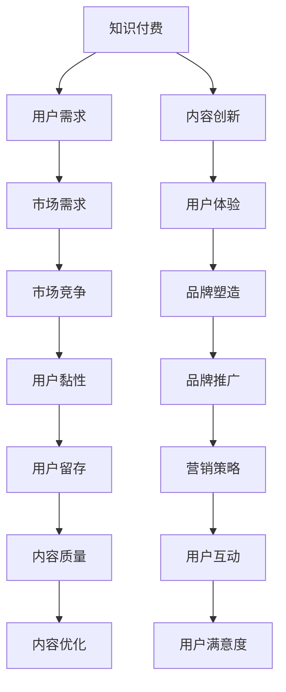

                 

# 文章标题：知识付费创业中的内容创新与突破

> 关键词：知识付费，内容创新，创业，市场趋势，用户互动，案例分析

> 摘要：本文深入探讨了知识付费创业中的内容创新与突破。通过对知识付费市场的概述，内容创新的策略与方法，创意灵感来源，内容生产与优化，品牌塑造与推广，用户互动与反馈，以及实战指导等方面进行了详细的阐述和分析，为创业者提供了有价值的参考和启示。

----------------------------------------------------------------

## 第一部分：知识付费市场概述

### 第1章：知识付费行业的兴起与发展

#### 1.1 知识付费的定义与分类

知识付费是指用户为了获取特定知识、技能或信息，愿意支付相应费用的一种交易行为。根据内容和形式的不同，知识付费可以分为以下几类：

1. **在线教育平台**：提供线上课程、讲座、教程等知识内容，如网易云课堂、知乎Live等。
2. **专业知识服务**：如法律咨询、医疗咨询、财务规划等，通过专业领域的专家提供个性化服务。
3. **知识付费应用**：如得到App、喜马拉雅FM等，提供多样化的知识内容和服务。
4. **知识分享平台**：如分答、知乎等，通过用户提问和专家回答的形式，实现知识的传递和共享。

#### 1.2 知识付费行业的发展历程

知识付费行业的发展可以分为以下几个阶段：

1. **萌芽阶段（2010-2013年）**：以自媒体、博客等形式为主，用户开始接受通过付费获取知识。
2. **快速发展阶段（2014-2016年）**：随着移动互联网的普及，在线教育、知识付费平台迅速崛起。
3. **成熟阶段（2017年至今）**：市场规模持续扩大，内容种类和形式日益丰富，市场格局逐渐稳定。

#### 1.3 知识付费市场的现状与趋势

当前，知识付费市场呈现出以下趋势：

1. **市场规模持续扩大**：根据艾瑞咨询的数据，2019年我国知识付费市场规模已达到392亿元，预计未来将继续保持高速增长。
2. **用户年龄分布广泛**：知识付费用户主要集中在18-35岁的年轻人，但35岁以上用户占比逐年提升。
3. **内容形式多样化**：除了传统的文字、音频、视频等形式，直播、短视频等新兴形式也逐渐受到欢迎。
4. **个性化需求日益凸显**：用户对个性化、定制化的知识内容需求逐渐增强。

#### 1.4 知识付费行业中的挑战与机遇

知识付费行业在快速发展过程中也面临一系列挑战：

1. **内容质量参差不齐**：市场上存在大量质量不高、甚至虚假的知识内容，影响用户体验。
2. **竞争激烈**：众多平台和创业者涌入知识付费市场，导致竞争日益激烈。
3. **盈利模式单一**：多数知识付费平台主要依靠订阅、付费课程等模式盈利，盈利渠道较为单一。

然而，这些挑战同时也带来了机遇：

1. **内容创新**：通过提供高质量、创新的内容，平台和创业者可以脱颖而出。
2. **用户运营**：通过精细化运营，提升用户满意度和留存率，实现持续增长。
3. **跨界合作**：与其他行业的企业进行合作，拓宽业务范围，实现共赢。

---

### 第2章：内容创新的策略与方法

#### 2.1 内容创新的重要性

内容创新是知识付费创业的核心竞争力。一个具备创新性的内容产品，不仅能够吸引更多用户，还能在激烈的市场竞争中脱颖而出。内容创新的重要性主要体现在以下几个方面：

1. **满足用户需求**：创新的内容能够更好地满足用户的需求，提升用户体验。
2. **提升竞争力**：独特的创新内容可以区分于竞争对手，形成差异化优势。
3. **拓展市场**：创新的内容可以吸引更广泛的用户群体，拓展市场空间。
4. **增强用户黏性**：创新的内容可以增加用户对平台的依赖度，提升用户留存率。

#### 2.2 内容创新的策略

以下是一些内容创新的策略：

1. **需求挖掘**：通过市场调研、用户反馈等途径，深入了解用户需求，发现市场空白。
2. **跨界融合**：将不同领域、行业的内容进行融合，创造新的知识形态。
3. **技术创新**：利用新技术（如人工智能、大数据等）来提升内容的生产和传播效率。
4. **形式创新**：尝试新的内容形式（如短视频、直播等），提升用户互动性和体验感。

#### 2.3 内容创新的实践方法

以下是一些内容创新的实践方法：

1. **用户共创**：邀请用户参与内容创作，激发用户创造力，提高内容质量。
2. **主题策划**：围绕热门话题、行业趋势等，策划具有吸引力的内容主题。
3. **内容迭代**：持续优化内容，根据用户反馈进行调整，提升内容价值。
4. **内容分发**：通过多种渠道分发内容，提高内容曝光度和覆盖面。

#### 2.4 成功案例分享

以下是几个知识付费领域的内容创新成功案例：

1. **得到App**：通过邀请顶尖专家、行业领袖进行深度讲解，打造高质量的内容产品。
2. **分答**：通过快速问答形式，满足用户对即时、简短知识的需求。
3. **知乎Live**：结合在线讲座和互动问答，提供实时、互动性的知识分享。

---

### 第3章：内容创意的灵感来源

#### 3.1 用户需求分析

用户需求分析是内容创意的重要基础。通过以下方法，可以深入挖掘用户需求：

1. **问卷调查**：设计针对性的问卷，收集用户对知识内容的需求、偏好等信息。
2. **用户访谈**：通过面对面或在线访谈，了解用户在实际应用中遇到的问题和需求。
3. **数据分析**：通过分析用户行为数据，如浏览、搜索、购买等，挖掘用户兴趣点和需求。

#### 3.2 竞品分析

竞品分析是获取创意灵感的重要途径。以下方法可以帮助进行竞品分析：

1. **竞品调研**：收集竞品的课程、内容、服务等信息，分析其优缺点。
2. **用户反馈**：关注用户对竞品的评价，了解用户对竞品内容的满意度。
3. **市场趋势**：关注行业趋势、政策法规等，了解市场环境变化。

#### 3.3 市场趋势洞察

了解市场趋势可以帮助创作者把握发展方向，以下方法可以帮助进行市场趋势洞察：

1. **行业报告**：阅读行业报告，了解行业现状、发展趋势、市场规模等。
2. **媒体关注**：关注行业媒体、公众号等，了解行业热点和动态。
3. **专家观点**：关注行业专家的观点和预测，了解行业未来趋势。

#### 3.4 创意灵感获取技巧

以下是一些创意灵感获取技巧：

1. **头脑风暴**：组织团队成员进行头脑风暴，产生创意点子。
2. **跨领域借鉴**：从其他领域（如艺术、科技、生活等）获取灵感，进行跨界创新。
3. **模仿与创新**：在借鉴现有成功案例的基础上，进行改进和创新。

---

### 第4章：内容生产与优化

#### 4.1 内容生产流程

内容生产是一个系统化的过程，主要包括以下几个环节：

1. **需求分析**：明确内容主题、目标受众、内容形式等。
2. **内容创作**：根据需求分析结果，进行内容的创作和编写。
3. **内容审核**：对内容进行质量把关，确保内容准确、有价值。
4. **内容发布**：将内容发布到相应的平台或渠道，供用户观看或学习。

#### 4.2 内容格式选择

内容格式选择需要考虑用户需求和内容特性。以下是一些常见的内容格式：

1. **文字**：适用于深度阅读，便于用户理解复杂概念。
2. **音频**：适用于通勤、运动等场景，方便用户在碎片时间进行学习。
3. **视频**：适用于生动展示操作过程、讲解复杂问题等。
4. **图文**：适用于简洁明了地传达信息，提高用户阅读体验。

#### 4.3 内容质量评估与优化

内容质量评估是确保内容价值的关键。以下是一些评估指标和优化方法：

1. **用户反馈**：通过用户评价、讨论等，了解用户对内容的满意度。
2. **数据指标**：如浏览量、点赞量、分享量等，分析内容传播效果。
3. **内容迭代**：根据评估结果，对内容进行修改和完善，提高内容质量。
4. **用户参与**：鼓励用户参与内容创作，提升内容互动性和用户黏性。

#### 4.4 SEO优化策略

SEO（搜索引擎优化）是提高内容曝光度的重要手段。以下是一些SEO优化策略：

1. **关键词研究**：分析目标受众常用的关键词，确保内容包含相关关键词。
2. **标题优化**：优化标题，使其具有吸引力和关键词密度。
3. **内容优化**：在内容中合理使用关键词，提高内容相关性。
4. **外部链接**：通过外部链接增加内容权重，提高在搜索引擎中的排名。

---

### 第5章：品牌塑造与推广

#### 5.1 品牌塑造的重要性

品牌塑造是知识付费创业的重要组成部分。一个良好的品牌形象可以提升用户的信任度和忠诚度，以下是一些品牌塑造的重要性：

1. **提升知名度**：良好的品牌形象有助于提升平台的知名度，扩大用户群体。
2. **增强信任**：品牌形象可以传递出专业、可信的信号，增强用户的信任感。
3. **区分竞争对手**：独特的品牌形象可以帮助平台在竞争激烈的市场中脱颖而出。
4. **提升价值**：品牌塑造可以提升用户对平台的价值感知，提高用户留存率和付费意愿。

#### 5.2 品牌形象设计

品牌形象设计是品牌塑造的关键环节。以下是一些品牌形象设计的原则：

1. **一致性**：品牌形象应该在不同渠道和场景中保持一致性，提升品牌认知度。
2. **独特性**：独特的品牌形象可以区分于竞争对手，提升品牌记忆点。
3. **简洁性**：简洁的品牌形象更容易被用户记住，提升品牌传播效果。
4. **相关性**：品牌形象应该与品牌定位和价值观相关，传递出品牌的核心信息。

#### 5.3 营销策略与推广

以下是一些知识付费平台的营销策略和推广方法：

1. **内容营销**：通过优质的内容吸引和留住用户，提高用户转化率。
2. **社交媒体营销**：利用微博、微信、抖音等社交媒体平台，提高品牌曝光度。
3. **搜索引擎营销**：通过SEO和SEM（搜索引擎营销）提高内容在搜索引擎中的排名。
4. **合作推广**：与其他平台或品牌合作，共同推广，扩大用户群体。

#### 5.4 社交媒体营销

以下是一些社交媒体营销的方法：

1. **微博营销**：通过发布有价值的内容、参与话题讨论，提高品牌知名度。
2. **微信营销**：通过公众号、微信群等渠道，进行内容传播和用户互动。
3. **抖音营销**：通过短视频、直播等形式，吸引用户关注，提高品牌影响力。
4. **小红书营销**：通过图文、短视频等形式，分享生活、学习经验，吸引粉丝。

---

### 第6章：用户互动与反馈

#### 6.1 用户互动策略

用户互动是提升用户满意度和留存率的重要手段。以下是一些用户互动策略：

1. **在线互动**：通过直播、问答、讨论区等形式，与用户进行实时互动。
2. **社群互动**：建立微信群、QQ群等社群，促进用户之间的交流。
3. **个性化互动**：根据用户兴趣、行为等，提供个性化推荐和互动内容。
4. **奖励机制**：通过积分、优惠券等激励措施，鼓励用户参与互动。

#### 6.2 用户反馈机制

用户反馈是优化内容和服务的重要依据。以下是一些用户反馈机制：

1. **在线调查**：通过在线问卷、满意度调查等方式，收集用户反馈。
2. **用户评论**：鼓励用户在平台上发表评论，了解用户对内容的评价。
3. **客服反馈**：通过客服渠道，收集用户意见和建议。
4. **用户访谈**：定期进行用户访谈，深入了解用户需求和使用体验。

#### 6.3 用户粘性与留存策略

以下是一些提升用户粘性和留存率的策略：

1. **内容更新**：定期发布优质内容，保持用户对平台的兴趣。
2. **会员制度**：通过会员制度，提供更多优惠和特权，提高用户留存率。
3. **个性化推荐**：根据用户行为和偏好，提供个性化的内容推荐。
4. **活动激励**：通过活动、竞赛等形式，激发用户参与热情。

#### 6.4 用户画像与精准营销

以下是一些基于用户画像的精准营销策略：

1. **用户分类**：根据用户行为、兴趣等，将用户分为不同群体，进行针对性营销。
2. **定向推广**：通过精准投放广告，将内容推荐给目标用户。
3. **个性化推送**：根据用户兴趣和偏好，定制化推送内容。
4. **效果分析**：通过数据分析，评估营销效果，优化营销策略。

---

### 第7章：案例分析

#### 7.1 成功案例分析

以下是一些知识付费领域的成功案例：

1. **得到App**：通过邀请顶尖专家、行业领袖进行深度讲解，打造高质量的内容产品，吸引了大量用户。
2. **分答**：通过快速问答形式，满足用户对即时、简短知识的需要，迅速获得市场认可。
3. **知乎Live**：结合在线讲座和互动问答，提供实时、互动性的知识分享，取得了良好的用户口碑。

#### 7.2 失败案例分析

以下是一些知识付费领域的失败案例：

1. **某在线教育平台**：由于课程内容质量不高、价格不透明等问题，导致用户满意度低，最终关闭。
2. **某专业知识服务公司**：由于服务范围狭窄、用户体验差，未能实现持续盈利，最终退出市场。

#### 7.3 案例总结与启示

通过对成功和失败案例的分析，可以得出以下启示：

1. **内容质量是关键**：高质量的内容是知识付费平台的核心竞争力。
2. **用户需求导向**：了解和满足用户需求是创业成功的关键。
3. **创新与优化**：持续进行内容创新和优化，提升用户体验。
4. **精细化运营**：通过精细化运营，提升用户满意度和留存率。

---

### 第8章：内容创新的未来趋势

#### 8.1 人工智能在内容创新中的应用

人工智能在内容创新中的应用越来越广泛，以下是一些典型应用：

1. **内容生成**：通过人工智能技术，自动生成文章、视频、音频等内容。
2. **内容推荐**：利用人工智能分析用户行为，为用户推荐个性化内容。
3. **内容审核**：通过人工智能技术，自动识别和过滤违规内容，提高内容质量。
4. **内容互动**：利用人工智能，实现更智能、个性化的用户互动。

#### 8.2 新兴技术在内容产业的影响

以下是一些新兴技术在内容产业的影响：

1. **5G技术**：提高网络速度和稳定性，为内容生产和传播提供更好的基础设施。
2. **区块链技术**：通过区块链技术，实现内容的安全存储和可信交易。
3. **虚拟现实（VR）**：通过虚拟现实技术，提供沉浸式的内容体验。
4. **增强现实（AR）**：通过增强现实技术，实现内容与现实的融合。

#### 8.3 内容创新的未来趋势预测

以下是一些内容创新的未来趋势预测：

1. **个性化内容**：随着人工智能技术的发展，个性化内容将更加普及。
2. **互动性内容**：用户对互动性内容的偏好将持续增加，内容将更加注重互动性。
3. **短视频和直播**：短视频和直播将成为内容传播的重要形式。
4. **跨界合作**：内容创新将更加注重与其他行业的跨界合作，实现资源整合和优势互补。

#### 8.4 创业者如何抓住未来机遇

以下是一些建议，帮助创业者抓住内容创新的未来机遇：

1. **紧跟技术发展**：关注新兴技术，积极探索和应用新技术。
2. **关注用户需求**：持续关注用户需求变化，提供满足用户需求的内容。
3. **创新内容形式**：不断尝试新的内容形式，提升用户体验。
4. **建立核心竞争力**：通过内容质量、用户体验等方面，建立核心竞争力。
5. **持续学习与优化**：保持学习和优化，不断提升自身能力。

---

## 第二部分：内容创新的实战指导

### 第9章：实战案例解析

#### 9.1 案例一：如何打造爆款课程

**案例背景**：某在线教育平台希望通过创新内容，打造一款爆款课程，吸引更多用户。

**解决方案**：

1. **需求分析**：通过问卷调查和用户访谈，了解用户对课程的需求，发现用户对职业技能提升感兴趣。
2. **内容创作**：邀请行业专家，围绕热门职业技能进行课程创作，保证内容质量。
3. **形式创新**：采用短视频和直播形式，提高用户互动性和体验感。
4. **推广策略**：通过社交媒体、搜索引擎等渠道进行推广，提高课程曝光度。
5. **用户反馈**：收集用户反馈，持续优化课程内容，提升用户满意度。

**案例总结**：通过创新的内容形式和精准的推广策略，该课程在短时间内获得了大量用户关注，成为平台的爆款课程。

#### 9.2 案例二：如何通过内容创新提升用户参与度

**案例背景**：某知识付费平台希望通过内容创新，提升用户参与度。

**解决方案**：

1. **用户共创**：邀请用户参与内容创作，激发用户创造力，提高内容质量。
2. **互动性内容**：通过直播、互动问答等形式，增加用户互动性，提升用户参与度。
3. **主题策划**：围绕热门话题、行业趋势等，策划具有吸引力的内容主题，吸引用户参与。
4. **奖励机制**：通过积分、优惠券等激励措施，鼓励用户参与互动。

**案例总结**：通过用户共创和互动性内容的创新，该平台成功提升了用户参与度，增强了用户黏性。

#### 9.3 案例三：如何利用内容创新实现品牌升级

**案例背景**：某知识付费平台希望通过内容创新，提升品牌形象。

**解决方案**：

1. **品牌故事**：通过讲述品牌故事，传递品牌价值观，提升品牌认知度。
2. **内容质量**：提升内容质量，打造高质量的知识产品，增强用户信任感。
3. **形式创新**：采用短视频、直播等形式，提升用户互动体验，增强品牌形象。
4. **跨界合作**：与其他行业的企业进行合作，拓宽业务范围，提升品牌影响力。

**案例总结**：通过内容创新和跨界合作，该平台成功实现了品牌升级，提升了品牌价值和影响力。

#### 9.4 案例四：如何利用数据分析优化内容策略

**案例背景**：某知识付费平台希望通过数据分析，优化内容策略。

**解决方案**：

1. **数据分析**：通过分析用户行为数据，了解用户兴趣点和需求，为内容创作提供依据。
2. **内容推荐**：根据用户行为数据，为用户推荐个性化内容，提高用户满意度。
3. **效果评估**：通过分析内容传播效果，了解用户对内容的满意度，为内容优化提供依据。
4. **持续迭代**：根据数据分析结果，对内容进行持续迭代和优化，提升内容价值。

**案例总结**：通过数据分析，该平台成功优化了内容策略，提高了内容质量和用户满意度。

---

### 第10章：创业指导

#### 10.1 创业前的准备工作

创业前需要做好以下准备工作：

1. **市场调研**：了解目标市场和竞争对手，明确市场定位和目标用户。
2. **商业模式**：制定商业模式，明确盈利模式、成本结构和运营策略。
3. **团队组建**：组建具有专业能力和执行力的团队，明确分工和职责。
4. **资金筹备**：评估创业所需的资金，制定融资计划，确保资金充足。

#### 10.2 创业过程中的常见问题与解决方案

创业过程中会遇到一系列问题，以下是一些常见问题及解决方案：

1. **资金短缺**：解决方案：寻求风险投资、银行贷款、政府补贴等融资渠道。
2. **市场竞争**：解决方案：提供独特的产品和服务，打造核心竞争力。
3. **团队管理**：解决方案：建立科学的管理制度，提升团队执行力。
4. **用户增长**：解决方案：通过精准营销、内容创新等手段，提高用户转化率。

#### 10.3 创业成功的要素

创业成功需要具备以下要素：

1. **创新精神**：敢于尝试新的商业模式和内容创新，抓住市场机遇。
2. **执行力**：制定明确的计划和目标，确保团队高效执行。
3. **用户导向**：以用户需求为导向，提供优质的产品和服务。
4. **持续学习**：保持学习和优化，不断提升自身能力和竞争力。

#### 10.4 创业者的成长路径

创业者的成长路径可以分为以下几个阶段：

1. **初创阶段**：积累创业经验，探索商业模式，搭建团队。
2. **发展阶段**：扩大业务规模，提升品牌知名度，优化产品和服务。
3. **成熟阶段**：实现持续盈利，拓展业务领域，提升企业价值。
4. **领导阶段**：培养团队，传承企业文化，引领行业变革。

---

### 第11章：内容创新的工具与方法

#### 11.1 内容创新工具介绍

以下是一些常用的内容创新工具：

1. **思维导图**：用于梳理思路、规划内容框架。
2. **内容管理系统（CMS）**：用于内容创作、管理和发布。
3. **数据分析工具**：用于分析用户行为、评估内容效果。
4. **社交媒体管理工具**：用于发布和管理社交媒体内容。

#### 11.2 内容创新方法应用

以下是一些内容创新方法的应用：

1. **用户共创**：通过邀请用户参与内容创作，提高内容质量。
2. **跨界融合**：将不同领域的内容进行融合，创造新的知识形态。
3. **形式创新**：尝试新的内容形式（如短视频、直播等），提升用户互动性。
4. **数据驱动**：通过数据分析，优化内容策略，提升内容效果。

#### 11.3 工具与方法的选择与优化

选择和使用内容创新工具与方法时，需要考虑以下因素：

1. **需求匹配**：根据实际需求选择合适的工具和方法。
2. **团队协作**：确保工具和方法能够满足团队协作的需求。
3. **效果评估**：定期评估工具和方法的效果，进行优化和调整。

#### 11.4 持续创新的动力源泉

持续创新需要以下动力源泉：

1. **用户需求**：关注用户需求变化，不断优化产品和服务。
2. **技术发展**：紧跟技术发展趋势，积极探索和应用新技术。
3. **市场竞争**：保持市场竞争力，不断创新和提升自身能力。
4. **企业文化**：建立创新文化，鼓励员工提出创新想法和建议。

---

### 第12章：结语

#### 12.1 内容创新的价值与意义

内容创新在知识付费创业中具有重要的价值和意义：

1. **提升竞争力**：创新的内容可以区分于竞争对手，形成差异化优势。
2. **满足用户需求**：创新的内容可以更好地满足用户的需求，提升用户体验。
3. **拓展市场**：创新的内容可以吸引更多用户，拓展市场空间。
4. **增强用户黏性**：创新的内容可以增加用户对平台的依赖度，提升用户留存率。

#### 12.2 创作者的使命与责任

作为内容创作者，我们有以下使命和责任：

1. **传递价值**：通过创作高质量的内容，为用户传递有价值的信息。
2. **引领创新**：积极探索新的内容形式和创作方法，推动内容产业的创新。
3. **尊重版权**：尊重知识产权，保护创作者的权益，维护良好的创作环境。
4. **关注社会**：关注社会热点和问题，通过内容创作推动社会进步。

#### 12.3 持续创新的路径与方向

为了实现持续创新，我们可以从以下几个方面入手：

1. **用户需求**：深入了解用户需求，持续优化内容。
2. **技术发展**：紧跟技术发展趋势，积极探索和应用新技术。
3. **跨界合作**：与其他领域的企业和创作者进行合作，实现资源整合。
4. **团队建设**：培养创新型人才，提升团队协作能力。

#### 12.4 对未来的展望

随着技术的不断发展和市场的变化，内容创新将迎来新的机遇和挑战。我们相信，在未来的发展中，内容创新将继续发挥重要作用，推动知识付费产业的繁荣和发展。作为创业者、创作者和从业者，我们应积极探索新的内容形式和创新方法，为用户提供更多优质的内容和服务，共同推动内容产业的进步。

---

**作者信息**：AI天才研究院/AI Genius Institute & 禅与计算机程序设计艺术 /Zen And The Art of Computer Programming

----------------------------------------------------------------

**附录**

以下为本文涉及的核心概念、算法原理、数学模型和项目实战的详细阐述：

#### 核心概念与联系



#### 核心算法原理讲解

**用户需求分析算法**

```python
# 伪代码：用户需求分析算法

def analyze_user需求的（用户数据）:
    # 收集用户行为数据
    用户行为数据 = collect_user_behavior_data（用户数据）

    # 提取用户兴趣点
    用户兴趣点 = extract_interest_points（用户行为数据）

    # 分析用户需求
    用户需求 = analyze_user_interests（用户兴趣点）

    return 用户需求
```

**内容质量评估算法**

```python
# 伪代码：内容质量评估算法

def evaluate_content_quality（内容）:
    # 提取内容特征
    内容特征 = extract_content_features（内容）

    # 计算内容质量得分
    内容质量得分 = calculate_content_score（内容特征）

    return 内容质量得分
```

#### 数学模型和公式

**用户满意度模型**

$$ 用户满意度 = \frac{内容质量 + 服务质量}{1 + \alpha \times 价格} $$

其中，$\alpha$ 为价格敏感度系数，$\alpha$ 的取值范围在 0 到 1 之间。

**内容推荐模型**

$$ 推荐度 = \frac{内容相似度 \times 用户兴趣度}{1 + \beta \times 内容新颖度} $$

其中，$\beta$ 为内容新颖度系数，$\beta$ 的取值范围在 0 到 1 之间。

#### 项目实战

**案例一：构建内容管理系统（CMS）**

**开发环境搭建：**

- 操作系统：Ubuntu 18.04
- 开发语言：Python 3.8
- 数据库：MySQL 8.0
- Web框架：Django 3.2

**源代码实现：**

```python
# Django 项目结构

# 文件：project_name/wsgi.py
from django.core.wsgi import get_wsgi_application
application = get_wsgi_application()

# 文件：project_name/settings.py
# 配置数据库、中间件、模板等

# 文件：project_name/urls.py
from django.contrib import admin
from django.urls import path
from app_name.views import home_view

urlpatterns = [
    path('admin/', admin.site.urls),
    path('', home_view),
]

# 文件：app_name/views.py
from django.shortcuts import render

def home_view(request):
    return render(request, 'home.html')
```

**代码解读与分析：**

1. **项目结构**：Django 项目结构主要包括 wsgi.py、settings.py、urls.py 等文件，以及一个名为 app_name 的应用程序。
2. **配置数据库**：在 settings.py 文件中配置数据库连接信息，包括数据库类型、地址、用户名、密码等。
3. **中间件**：在 settings.py 文件中配置中间件，用于处理请求和响应。
4. **模板**：在 templates 目录下创建 home.html 模板，用于展示内容。

**案例二：实现用户反馈功能**

**开发环境搭建：**

- 操作系统：Windows 10
- 开发语言：JavaScript
- 前端框架：Vue 2.x
- 后端框架：Node.js

**源代码实现：**

```javascript
// 前端：Vue 组件

<template>
  <div>
    <h1>用户反馈</h1>
    <form @submit.prevent="submitFeedback">
      <label for="feedback">请输入您的反馈：</label>
      <textarea id="feedback" v-model="feedback"></textarea>
      <button type="submit">提交</button>
    </form>
  </div>
</template>

<script>
export default {
  data() {
    return {
      feedback: '',
    };
  },
  methods: {
    submitFeedback() {
      // 调用后端接口提交反馈
      // axios.post('/api/feedback', { feedback: this.feedback })
      //   .then(response => {
      //     alert('反馈提交成功！');
      //   })
      //   .catch(error => {
      //     alert('反馈提交失败！');
      //   });
    },
  },
};
</script>
```

**代码解读与分析：**

1. **组件结构**：Vue 组件主要包括模板、脚本和样式三个部分。
2. **数据绑定**：使用 v-model 指令实现文本框与数据的双向绑定。
3. **表单提交**：使用 @submit.prevent 指令阻止表单默认提交行为，调用 submitFeedback 方法提交反馈。
4. **后端接口**：调用后端接口提交反馈，根据接口返回的结果提示用户提交成功或失败。

---

通过本文，我们深入探讨了知识付费创业中的内容创新与突破。从市场概述、内容创新策略与方法、创意灵感来源、内容生产与优化、品牌塑造与推广、用户互动与反馈，到案例分析、实战指导和创业指导，我们全面剖析了知识付费创业的关键环节。同时，我们通过核心概念与联系、核心算法原理讲解、数学模型和公式、项目实战等具体案例，展示了如何运用技术和方法进行内容创新。

在未来的发展中，内容创新将继续在知识付费领域发挥重要作用。创业者、创作者和从业者应不断探索新的内容形式和创新方法，提升用户体验，满足用户需求，抓住市场机遇。同时，我们也要关注技术发展，积极应用人工智能、大数据等新兴技术，推动内容产业的进步。

最后，感谢大家的阅读，希望本文能为您的知识付费创业之路提供有价值的参考和启示。让我们携手共进，共同推动内容创新的未来发展！

---

**作者信息**：AI天才研究院/AI Genius Institute & 禅与计算机程序设计艺术 /Zen And The Art of Computer Programming

