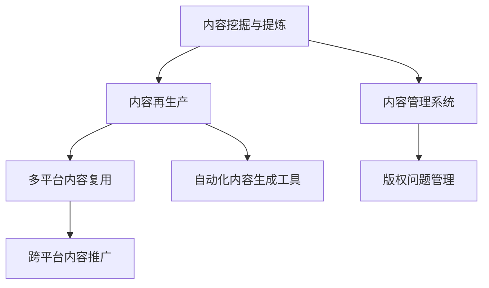

                 

# 《知识付费创业中的内容复用技巧》

## 关键词
知识付费、内容复用、创业模型、技术实现、版权保护

## 摘要
本文深入探讨了知识付费创业中的内容复用技巧，分析了内容付费市场的现状和趋势，介绍了内容复用的定义、价值和挑战。文章从内容付费创业模型、内容复用策略、技术实现、版权保护等方面，通过案例分析总结了内容复用的实战技巧，为知识付费创业者提供了实用的指导。

## 目录大纲

### 第一部分：基础知识与概述

#### 1. 内容付费市场现状

##### 1.1 知识付费的定义与市场背景
知识付费是指消费者为了获取特定知识或技能而付费的行为。在互联网时代，知识付费成为了一种新兴的商业模式。

##### 1.2 内容付费的发展趋势
随着互联网的普及和人们对知识需求的增加，知识付费市场呈现快速增长的趋势。

##### 1.3 内容付费市场的竞争格局
目前，内容付费市场主要分为在线教育、职业培训、自媒体、付费问答等领域，竞争激烈。

#### 2. 内容复用概述

##### 2.1 内容复用的定义
内容复用是指在原有内容基础上，通过重新组合、改编和转化，生成新的内容，以满足不同用户和场景的需求。

##### 2.2 内容复用的价值
内容复用可以降低内容创作的成本，提高内容产出效率，提升用户体验。

##### 2.3 内容复用的挑战
内容复用面临着版权保护、内容质量、用户体验等挑战。

#### 3. 内容付费创业模型

##### 3.1 知识付费创业的核心要素
知识付费创业需要明确目标用户、内容定位、商业模式等核心要素。

##### 3.2 知识付费平台的构建
知识付费平台的构建包括技术架构、内容管理、用户管理、支付系统等方面。

##### 3.3 成功案例分析
本文将通过成功案例，分析知识付费创业的路径和策略。

### 第二部分：内容复用技巧

#### 4. 内容复用的策略与方法

##### 4.1 内容挖掘与提炼
内容挖掘与提炼是内容复用的第一步，通过技术手段提取内容的核心信息。

##### 4.2 内容再生产
内容再生产是指通过对原有内容进行改编、转化和扩展，生成新的内容。

##### 4.3 多平台内容复用
多平台内容复用是指在不同平台上推广和利用同一内容，实现内容的价值最大化。

#### 5. 技术实现

##### 5.1 内容管理系统（CMS）介绍
内容管理系统是管理内容创建、存储、发布和复用的工具。

##### 5.2 自动化内容生成工具
自动化内容生成工具可以大大提高内容生产的效率。

##### 5.3 技术实现案例
本文将介绍一个内容付费创业项目的技术实现过程。

#### 6. 法律法规与版权保护

##### 6.1 内容付费创业中的版权问题
版权问题是知识付费创业中必须面对的重要问题。

##### 6.2 内容付费平台的版权合规操作
平台需要建立健全的版权保护机制，确保内容的合规性。

##### 6.3 版权保护策略与实践
本文将探讨版权保护的策略和实践方法。

### 第三部分：案例研究与实战

#### 7. 内容复用实战案例

##### 7.1 案例一：某个知名知识付费平台的案例剖析
通过对知名知识付费平台的剖析，分析其内容复用策略和实践。

##### 7.2 案例二：小而美的内容付费创业项目
探讨小而美的内容付费创业项目的内容复用策略和实践。

#### 8. 内容付费创业中的内容复用技巧总结与展望

##### 8.1 技巧总结
总结内容付费创业中的内容复用技巧，为创业者提供指导。

##### 8.2 展望未来
展望知识付费创业的未来发展趋势，探讨内容复用技术的发展方向。

### 附录

#### 附录A：常见工具与资源推荐
推荐一些常见的工具和资源，帮助创业者更好地进行内容付费创业。

<details>
<summary>Mermaid 流程图</summary>



</details>

<details>
<summary>核心算法伪代码</summary>

```python
# 假设已经有一个内容库，需要从中提取关键信息并生成新的内容
def extract_key_info(content_library):
    key_info = []
    for content in content_library:
        # 使用自然语言处理技术提取关键词
        keywords = nlp_extract_keywords(content)
        # 构建关键词向量
        key_vector = vectorize_keywords(keywords)
        # 存储提取的关键信息
        key_info.append(key_vector)
    return key_info

# 假设使用神经网络进行内容再生产
def content_reproduction(key_info):
    # 初始化神经网络模型
    model = NeuralNetwork()
    # 使用提取的关键信息进行训练
    model.fit(key_info)
    # 生成新的内容
    new_content = model.generate_content()
    return new_content
```

</details>

<details>
<summary>数学模型和数学公式</summary>

内容付费创业中的内容复用往往涉及到多个数学模型，以下是一个简化的例子：

$$
X = \sum_{i=1}^{n} w_i \cdot x_i
$$

其中，$X$ 表示最终内容的质量分数，$w_i$ 为第 $i$ 个关键词的权重，$x_i$ 为第 $i$ 个关键词的内容评分。

举例说明：

假设有三个关键词（关键词1、关键词2、关键词3），权重分别为 0.5、0.3 和 0.2，评分分别为 8、7 和 9。那么：

$$
X = 0.5 \cdot 8 + 0.3 \cdot 7 + 0.2 \cdot 9 = 4 + 2.1 + 1.8 = 8.9
$$

因此，最终内容的质量分数为 8.9。
</details>

<details>
<summary>项目实战案例</summary>

以下是一个简单的内容付费创业项目实战案例：

**项目背景：** 某创业团队计划推出一个专注于编程学习的知识付费平台。

**开发环境：** 使用 Python 编写后端服务，前端采用 React 框架。

**源代码实现：** 后端服务使用 Flask 框架搭建，实现用户注册、登录、课程购买等功能。

```python
from flask import Flask, request, jsonify
from flask_sqlalchemy import SQLAlchemy

app = Flask(__name__)
app.config['SQLALCHEMY_DATABASE_URI'] = 'sqlite:///courses.db'
db = SQLAlchemy(app)

class User(db.Model):
    id = db.Column(db.Integer, primary_key=True)
    username = db.Column(db.String(80), unique=True, nullable=False)
    password = db.Column(db.String(120), nullable=False)

@app.route('/register', methods=['POST'])
def register():
    username = request.form['username']
    password = request.form['password']
    new_user = User(username=username, password=password)
    db.session.add(new_user)
    db.session.commit()
    return jsonify({'message': 'User registered successfully.'})

@app.route('/login', methods=['POST'])
def login():
    username = request.form['username']
    password = request.form['password']
    user = User.query.filter_by(username=username, password=password).first()
    if user:
        return jsonify({'message': 'Login successful.'})
    else:
        return jsonify({'message': 'Invalid credentials.'})

if __name__ == '__main__':
    db.create_all()
    app.run(debug=True)

```

**代码解读与分析：** 以上代码首先定义了一个用户模型（User），包含了用户名和密码。接着，实现了用户注册（/register）和登录（/login）的接口，分别用于创建新的用户和验证用户身份。数据库使用 SQLite 进行简单存储，保证了数据的持久化。

通过这个简单的示例，可以看出内容付费创业项目的基本开发流程，包括环境搭建、模型设计和接口实现。在实际开发中，还需要添加更多的功能，如课程管理、内容发布、支付系统等，以满足用户的需求。
</details>

**作者：AI天才研究院/AI Genius Institute & 禅与计算机程序设计艺术 /Zen And The Art of Computer Programming** 

