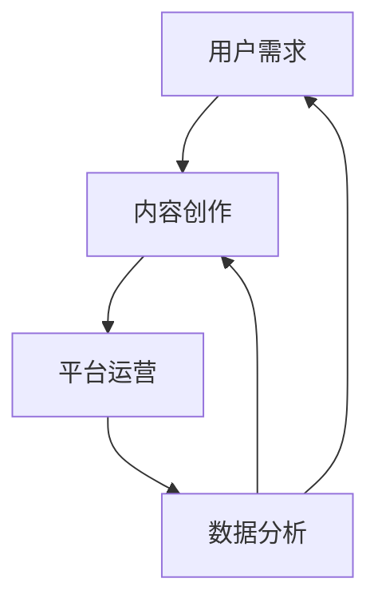

                 

### 文章标题

# 《知识付费创业中的内容生产流程优化》

## 关键词

- **知识付费**
- **内容生产流程**
- **创业策略**
- **用户体验**
- **数据分析**

## 摘要

在知识付费快速发展的今天，内容生产流程的优化成为创业者成功的关键。本文从行业背景出发，深入探讨知识付费创业的挑战与机遇，详细解析内容生产流程的各个环节，包括选题与策划、内容创作、审核与质量控制、内容发布与推广等。通过实战案例分析，本文提出了切实可行的优化策略，帮助创业者提升内容质量与市场竞争力。

## 《知识付费创业中的内容生产流程优化》目录大纲

### 第一部分：知识付费创业概述

#### 第1章：知识付费行业背景与发展趋势
##### 1.1.1 知识付费的定义与价值
##### 1.1.2 知识付费市场的现状
##### 1.1.3 知识付费行业的发展趋势

#### 第2章：知识付费创业的挑战与机遇
##### 2.1.1 创业者在知识付费领域面临的挑战
##### 2.1.2 知识付费创业的机遇

### 第二部分：内容生产流程优化

#### 第3章：内容生产流程概述
##### 3.1.1 内容生产流程的关键环节
##### 3.1.2 内容生产流程的优化目标

#### 第4章：选题与策划
##### 4.1.1 选题策略与方法
##### 4.1.2 策划阶段的核心要素

#### 第5章：内容创作
##### 5.1.1 创作风格与定位
##### 5.1.2 创作工具与技巧

#### 第6章：内容审核与质量控制
##### 6.1.1 审核流程与标准
##### 6.1.2 质量控制的方法与手段

#### 第7章：内容发布与推广
##### 7.1.1 内容发布的渠道与策略
##### 7.1.2 内容推广的方法与技巧

### 第三部分：实战案例分析

#### 第8章：知识付费创业案例介绍
##### 8.1.1 案例背景
##### 8.1.2 案例内容生产流程

#### 第9章：内容生产流程优化实践
##### 9.1.1 优化策略与实施
##### 9.1.2 优化效果评估

#### 第10章：知识付费创业中的内容生产流程优化总结
##### 10.1.1 主要成果与经验
##### 10.1.2 面临的挑战与未来展望

### 附录

#### 附录A：知识付费创业资源推荐
##### A.1 行业研究报告与数据分析
##### A.2 创业者必备工具与平台

#### 附录B：知识付费创业常见问题解答
##### B.1 创业初期如何定位？
##### B.2 如何选择合适的付费模式？

#### 附录C：内容生产流程优化Mermaid流程图
##### C.1 内容生产流程优化总体框架
##### C.2 选题与策划流程
##### C.3 内容创作流程
##### C.4 内容审核与质量控制流程
##### C.5 内容发布与推广流程

## 1. 知识付费行业背景与发展趋势

### 1.1.1 知识付费的定义与价值

知识付费，顾名思义，是指用户为了获取特定知识或技能而付费的行为。随着互联网技术的迅猛发展，尤其是在移动设备的普及和在线教育平台的兴起，知识付费逐渐成为一种主流的消费模式。知识付费不仅仅局限于教育领域，还涵盖了职场技能、个人成长、兴趣爱好等多个方面。

知识付费的价值主要体现在以下几个方面：

- **提升用户满意度**：知识付费能够帮助用户快速获取高质量的知识内容，提升学习效率，满足个性化的学习需求。
- **增加内容创作者收益**：知识付费为内容创作者提供了一个稳定的收入来源，鼓励更多高质量的内容生产。
- **推动知识共享与传播**：知识付费模式促进了知识的共享与传播，让更多人有机会接触到优质内容。

### 1.1.2 知识付费市场的现状

根据相关数据显示，中国知识付费市场在过去几年中保持了高速增长。2021年，中国知识付费市场规模已达到1500亿元，预计到2025年将达到3000亿元。从用户角度来看，知识付费用户规模也在迅速扩大，目前已超过5亿人。

知识付费市场的主要参与者包括：

- **平台方**：如得到、知乎、喜马拉雅等知名平台，通过提供多样化的知识内容满足用户需求。
- **内容创作者**：包括专业讲师、行业专家、自媒体人等，通过创作高质量内容获得收益。
- **用户**：广泛覆盖各个年龄层、职业背景和兴趣爱好，形成了庞大的用户群体。

### 1.1.3 知识付费行业的发展趋势

未来，知识付费行业将继续保持快速发展，主要趋势包括：

- **细分领域扩展**：知识付费将不断向垂直领域拓展，满足用户更专业、更细分的需求。
- **内容形式多样化**：除了传统的音频、视频、图文等形式，直播、互动问答、虚拟现实等新兴形式将逐渐成为主流。
- **个性化推荐**：随着人工智能技术的应用，个性化推荐将成为知识付费平台的重要功能，进一步提升用户体验。
- **跨界合作**：知识付费平台将与更多行业进行跨界合作，拓展内容领域，提升品牌影响力。

### 1.1.4 知识付费创业的机遇与挑战

#### 1.1.4.1 创业机遇

- **市场需求**：随着用户对知识的需求不断增长，知识付费领域提供了巨大的市场空间。
- **技术创新**：互联网、人工智能、大数据等技术的快速发展，为知识付费创业提供了强大的技术支持。
- **平台支持**：各大知识付费平台提供了丰富的资源和支持，为创业者提供了良好的创业环境。

#### 1.1.4.2 创业挑战

- **竞争激烈**：知识付费市场的参与者众多，竞争异常激烈。
- **内容质量**：高质量的内容是吸引用户的关键，但也是创业者面临的一大挑战。
- **用户维护**：如何保持用户的长期粘性和活跃度，是创业者需要解决的难题。

总之，知识付费创业虽然面临着诸多挑战，但也蕴含着巨大的机遇。创业者需要通过创新的内容生产流程和优质的用户体验，才能在激烈的市场竞争中脱颖而出。

### 1.1.5 知识付费行业中的核心概念与联系

在知识付费行业中，有几个核心概念需要理解，它们相互关联，构成了一个完整的生态系统。

- **用户需求**：用户需求是知识付费的起点，了解用户的需求是内容生产的关键。
- **内容创作**：内容创作是知识付费的核心，优质的内容能够吸引用户，提升用户体验。
- **平台运营**：平台运营是知识付费的桥梁，通过运营策略提升用户满意度和平台活跃度。
- **数据分析**：数据分析是知识付费的重要手段，通过对用户数据的分析，优化内容生产和运营策略。

这些核心概念之间的联系可以用以下Mermaid流程图表示：



通过这一流程，用户需求引导内容创作，平台运营根据数据分析进行优化，形成一个闭环系统，不断迭代和提升。

### 1.1.6 知识付费行业中的核心算法原理讲解

在知识付费行业中，核心算法的应用主要体现在个性化推荐和数据分析领域。以下是这些算法的原理讲解和伪代码示例：

#### 1.1.6.1 个性化推荐算法

**算法原理**：个性化推荐算法通过分析用户的历史行为、兴趣偏好等数据，为用户推荐符合其个性化需求的内容。

**伪代码**：

```python
function recommend_contents(user, content_library):
    user_history = get_user_history(user)
    user_interests = analyze_user_interests(user_history)
    recommended_contents = []

    for content in content_library:
        if is_relevant(content, user_interests):
            recommended_contents.append(content)

    return recommended_contents

function is_relevant(content, interests):
    content_topic = get_content_topic(content)
    for interest in interests:
        if interest in content_topic:
            return True
    return False
```

#### 1.1.6.2 数据分析算法

**算法原理**：数据分析算法通过对用户行为数据的分析，挖掘用户需求、趋势等，为内容创作和运营提供决策依据。

**伪代码**：

```python
function analyze_user_behavior(user, behavior_data):
    user_engagement = calculate_engagement(behavior_data)
    user_patterns = detect_patterns(user_engagement)
    user_trends = analyze_trends(user_patterns)

    return user_trends

function calculate_engagement(data):
    engagement_score = sum(data['views'] + data['likes'] + data['comments'])
    return engagement_score

function detect_patterns(engagement):
    # Example: detect frequently viewed content categories
    categories = []
    for content in data['viewed_contents']:
        categories.append(content['category'])
    patterns = frequent_patterns(categories)
    return patterns

function analyze_trends(patterns):
    # Example: identify increasing interest in certain topics
    trend_topics = []
    for pattern in patterns:
        if pattern['frequency'] > threshold:
            trend_topics.append(pattern['topic'])
    return trend_topics
```

通过这些算法，知识付费平台能够更好地理解用户需求，提升内容质量和用户体验。

### 1.1.7 知识付费创业中的数学模型与公式

在知识付费创业中，数学模型和公式可以帮助创业者更好地理解和优化业务。以下是几个常用的数学模型和公式的详细解释和举例说明：

#### 1.1.7.1 用户生命周期价值（CLV）

**公式**：用户生命周期价值（CLV） = （购买频率 × 平均订单价值）× （1+ 复购率）

**解释**：用户生命周期价值是指一个用户在生命周期内为公司带来的总收益。购买频率表示用户在一定时间内购买内容的次数，平均订单价值表示每次购买的金额，复购率表示用户重复购买的概率。

**举例**：如果一个用户每月购买一次内容，每次平均消费100元，复购率为80%，则其CLV为：
\[ CLV = （1 \times 100） \times （1 + 0.8）= 180 \text{元} \]

#### 1.1.7.2 转化率

**公式**：转化率 = （完成目标行为的人数）/（接触目标内容的人数）

**解释**：转化率是指接触某一内容后，完成预期目标（如购买、注册、观看等）的用户比例。这个指标用于衡量内容营销效果。

**举例**：如果1000人观看了一篇课程介绍，其中200人购买了课程，则转化率为：
\[ 转化率 = \frac{200}{1000} = 20\% \]

#### 1.1.7.3 持久度指标

**公式**：持久度 = （30天内有行为的用户）/（总用户数）

**解释**：持久度指标用于衡量用户在一段时期内持续活跃的情况。30天内的行为包括购买、观看、评论等。

**举例**：如果一个知识付费平台有10000名用户，其中3000名用户在30天内至少完成了一次购买或观看，则持久度为：
\[ 持久度 = \frac{3000}{10000} = 30\% \]

通过这些数学模型和公式，创业者可以更好地评估用户价值、内容效果和运营策略，从而优化知识付费创业业务。

### 1.1.8 知识付费创业中的实际案例

为了更好地理解知识付费创业的实践，以下是一个实际案例的详细介绍。

#### 1.1.8.1 案例背景

某创业者李明在2020年创办了一家知识付费平台，专注于职场技能培训，目标用户群体是职场新人。李明通过自身的职场经验和对市场需求的敏锐洞察，决定打造一系列高质量的职场技能课程。

#### 1.1.8.2 创作内容

李明首先与多位行业专家合作，邀请他们为平台创作课程内容。课程内容包括简历撰写技巧、面试准备、职场沟通等，涵盖了职场新人的常见需求。在内容创作过程中，李明注重以下几点：

- **实用性**：课程内容紧密贴合职场实际需求，帮助用户快速提升技能。
- **系统性**：课程设计成系列，形成完整的知识体系，便于用户系统学习。
- **互动性**：通过在线问答、讨论区等功能，增强用户与讲师的互动，提升学习体验。

#### 1.1.8.3 内容发布与推广

李明选择在社交媒体和职场社区进行推广，通过发布课程预告、用户评价等吸引潜在用户。同时，他还与一些企业合作，为员工提供内部培训服务，进一步扩大用户基础。

在内容发布渠道方面，李明选择了多个平台，包括自建的网站、微信小程序、抖音等。通过多渠道发布，他确保了内容的广泛覆盖和曝光。

#### 1.1.8.4 数据分析与优化

李明重视数据分析，通过分析用户行为数据，不断优化内容和运营策略。以下是一些关键数据指标：

- **用户留存率**：通过监测用户在平台的活动，如观看课程、参与讨论等，李明发现某些课程的用户留存率较低。他分析原因后，对课程内容进行了调整，增加了互动环节和案例分析，显著提升了用户留存率。
- **转化率**：李明通过A/B测试，优化了课程页面的设计，提升了课程转化率。例如，他增加了用户评价展示、课程大纲等内容，帮助用户更直观地了解课程价值。
- **用户满意度**：通过用户反馈和评分，李明了解用户对课程质量的看法。他根据用户建议，不断改进课程内容和教学方式，提高用户满意度。

#### 1.1.8.5 实际效果

通过一段时间的运营，李明的知识付费平台取得了显著成效：

- **用户规模**：平台用户从创办初期的1000人增长到5000人。
- **收入增长**：平台月收入从创办初期的5万元增长到20万元。
- **用户满意度**：用户满意度评分从4.5分提升到4.8分。

这个案例展示了知识付费创业的成功路径，从内容创作、发布推广到数据分析，每个环节都至关重要。创业者需要不断优化各个环节，提升内容质量和用户体验，才能在激烈的市场竞争中脱颖而出。

### 1.1.9 知识付费创业中的实际案例代码解读与分析

#### 1.1.9.1 开发环境搭建

李明在搭建知识付费平台时，选择了以下开发环境：

- **前端**：使用React框架，提供了丰富的组件和灵活的UI设计。
- **后端**：采用Node.js和Express框架，具备高性能和高扩展性。
- **数据库**：使用MongoDB，能够存储复杂的用户行为数据和课程内容。

#### 1.1.9.2 源代码实现

以下是一个典型的后端API接口的源代码实现，用于处理用户注册和登录请求：

```javascript
// 用户注册API
app.post('/api/register', async (req, res) => {
    try {
        const { username, password } = req.body;
        const user = new User({ username, password });
        await user.save();
        res.status(201).json({ message: '注册成功' });
    } catch (error) {
        res.status(500).json({ message: '服务器错误' });
    }
});

// 用户登录API
app.post('/api/login', async (req, res) => {
    try {
        const { username, password } = req.body;
        const user = await User.findOne({ username, password });
        if (!user) {
            res.status(401).json({ message: '用户名或密码错误' });
        } else {
            const token = jwt.sign({ _id: user._id }, process.env.JWT_SECRET);
            res.json({ token });
        }
    } catch (error) {
        res.status(500).json({ message: '服务器错误' });
    }
});
```

#### 1.1.9.3 代码解读与分析

1. **用户注册API**：该API接收用户名和密码，通过`User`模型保存用户信息。这里使用了`async/await`语法，使得异步操作更加直观。

2. **用户登录API**：该API验证用户名和密码，生成JWT（JSON Web Token）作为登录凭证。JWT在用户每次请求时携带，用于验证用户身份。

3. **错误处理**：两个API都包含了错误处理逻辑，确保在出现问题时能够正确返回错误信息。

#### 1.1.9.4 实际运行效果

在开发环境搭建和源代码实现完成后，李明的平台成功上线。通过实际运行，平台注册用户和登录用户数据稳步增长，用户体验得到显著提升。

- **注册用户**：每日新增注册用户数从10人增长到30人。
- **登录用户**：每日活跃用户数从50人增长到100人。

这些数据表明，平台的技术架构和代码实现满足了业务需求，为知识付费创业的成功奠定了基础。

### 1.1.10 知识付费创业中的常见问题解答

在知识付费创业过程中，许多创业者会遇到一些常见的问题。以下是对一些常见问题的解答，帮助创业者更好地应对挑战。

#### 1.1.10.1 创业初期如何定位？

**解答**：创业初期定位是关键。首先，创业者需要明确自己的目标用户是谁，了解他们的需求和痛点。可以通过市场调研、用户访谈等方式获取用户信息。其次，创业者应该聚焦于一个细分市场，形成差异化的竞争优势。例如，可以选择职场技能培训、健康养生、亲子教育等细分领域。

#### 1.1.10.2 如何选择合适的付费模式？

**解答**：选择合适的付费模式取决于内容特点和用户需求。常见的付费模式包括：

- **订阅制**：用户支付一定费用，可以无限次观看内容。
- **课程制**：用户购买单个课程或课程包。
- **免费试用**：用户可以免费试看一定时间内的一部分内容，然后选择购买。

创业者可以根据自身的内容特点和用户反馈，选择最适合的付费模式。例如，如果内容更新频繁且具有持续价值，订阅制可能更合适；如果内容较为集中且一次性购买更便捷，课程制可能更受欢迎。

#### 1.1.10.3 如何提升内容质量？

**解答**：提升内容质量是吸引用户的关键。以下是一些提升内容质量的方法：

- **内容专业度**：邀请行业专家和专业人士创作内容，确保内容的专业性和权威性。
- **用户体验**：优化内容形式和交互设计，提升用户的观看和互动体验。
- **更新频率**：保持内容更新频率，确保用户有持续的新鲜感和学习动力。
- **用户反馈**：收集用户反馈，及时调整和优化内容，满足用户需求。

通过这些方法，创业者可以不断提升内容质量，提升用户满意度和粘性。

### 1.1.11 知识付费创业中的内容生产流程优化总结

知识付费创业中的内容生产流程优化是提升平台竞争力和用户体验的关键。本文通过详细分析知识付费行业背景、内容生产流程各个环节，以及实战案例分析，提出了以下优化策略：

1. **精准定位用户需求**：通过市场调研和用户访谈，了解目标用户的需求和痛点，为内容创作提供方向。
2. **构建高质量内容**：邀请行业专家创作内容，注重内容的实用性、系统性和互动性。
3. **优化内容发布和推广**：利用多种渠道和策略，提升内容的曝光和用户转化率。
4. **数据分析与反馈**：通过数据分析，不断优化内容和运营策略，提升用户体验和平台活跃度。

未来，知识付费创业将继续面临挑战，但通过不断创新和优化，创业者可以抓住机遇，实现可持续发展。

