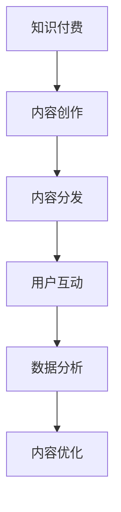
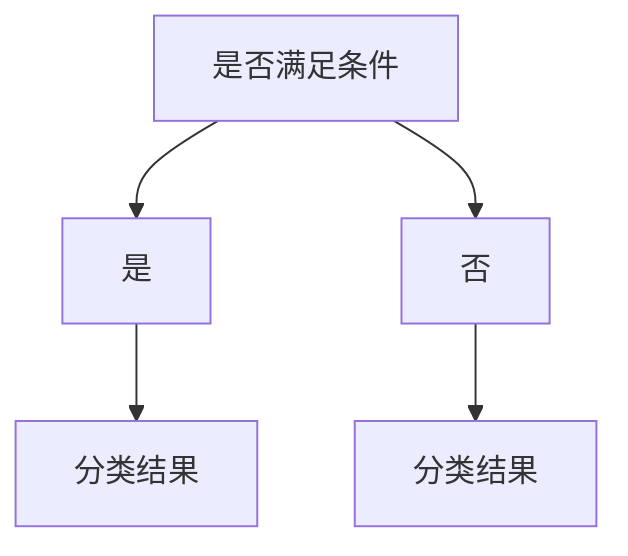

                 

# 《知识付费创业中的内容营销策略》

## 关键词
- 知识付费
- 内容营销
- 创业策略
- 数据分析
- SEO优化
- 用户行为分析

## 摘要
本文旨在探讨知识付费创业中的内容营销策略。通过对知识付费与内容营销的概念、核心概念联系、内容营销策略、核心算法原理、数学模型以及实际案例分析进行深入分析，本文为创业者提供了全面的内容营销解决方案。文章结构清晰，步骤明确，旨在帮助创业者有效地利用内容营销策略，实现知识付费创业的成功。

---

## 第一部分：引言

### 第1章：知识付费与内容营销概述

#### 1.1 知识付费的概念与发展

知识付费，指的是用户为获取有价值的信息或知识而支付的费用。随着互联网技术的发展，知识付费已经成为一种新型的商业模式。它不仅满足了用户对知识的需求，也为知识生产者提供了收益渠道。

知识付费的主要形式包括：

- 在线课程：用户通过购买在线课程来学习专业知识。
- 电子书：用户购买电子书，获取行业资讯和深度分析。
- 专业咨询：用户付费获取行业专家的咨询服务。
- 内容订阅：用户通过订阅模式，定期获取特定领域的优质内容。

知识付费的兴起背景主要源于以下几个方面：

- 互联网的普及，使得知识的获取更加便捷。
- 知识经济的兴起，人们对专业知识和技能的需求增加。
- 移动支付的普及，为知识付费提供了支付保障。

#### 1.2 内容营销的概念与作用

内容营销是一种通过创造和分发有价值的内容来吸引和转化潜在客户的策略。它与传统的广告推广不同，更注重内容的创造和用户体验。

内容营销在知识付费中的作用主要体现在以下几个方面：

- 提升品牌知名度：通过高质量的内容，吸引用户关注，提高品牌曝光度。
- 建立信任关系：通过持续输出有价值的内容，建立与用户的信任关系。
- 促进用户转化：通过内容营销，引导用户了解产品或服务，最终实现购买。

#### 1.3 知识付费创业中的挑战与机遇

知识付费创业面临的挑战包括：

- 竞争激烈：市场上已有大量同类型产品，新入局者需要找到独特的价值点。
- 用户信任建立困难：用户对新产品或新品牌的信任度较低，需要通过内容营销来建立。
- 营销成本高：内容创作和推广需要投入大量人力和财力。

然而，知识付费创业也面临着巨大机遇：

- 市场需求旺盛：随着人们对知识的需求增加，知识付费市场潜力巨大。
- 内容形式的多样化：随着技术的发展，内容形式越来越丰富，为创业者提供了更多机会。
- 用户付费习惯的养成：越来越多的用户开始习惯为知识付费，为知识付费创业提供了土壤。

#### 1.3.1 创业中的难点分析

创业者在知识付费领域面临的难点主要包括：

- 内容质量保证：优质的内容是吸引用户的关键，但创作高质量内容需要时间、精力和专业知识。
- 用户获取与留存：如何有效获取新用户并保持用户的活跃度和忠诚度，是知识付费创业的关键。
- 盈利模式探索：如何在内容创作和用户获取上取得平衡，实现可持续的盈利。

#### 1.3.2 内容营销的优势

内容营销在知识付费创业中的优势包括：

- 低成本：相比广告投放，内容营销的成本较低，特别是对于初创企业。
- 高效性：通过高质量的内容，可以直接与潜在用户建立联系，提高转化率。
- 持续性：内容营销具有持续性，可以长期吸引和维护用户。

#### 1.3.3 创业成功的关键因素

创业成功的关键因素包括：

- 优秀的团队：团队的专业能力和执行力是创业成功的基础。
- 明确的定位：找准市场定位，提供独特的价值主张。
- 持续创新：在内容创作和营销策略上不断创新，以适应市场变化。

### 第2章：知识付费与内容营销的核心概念及联系

#### 2.1 知识付费的核心概念

知识付费的核心概念包括：

- 付费用户需求：了解用户的需求，提供符合用户期望的知识内容。
- 付费内容类型：根据用户需求，设计多样化的内容形式，如课程、文章、视频等。
- 付费模式：选择合适的付费模式，如一次性购买、订阅制等。

#### 2.2 内容营销的核心概念

内容营销的核心概念包括：

- 内容创作与分发：创造有价值的内容，并通过多种渠道进行分发。
- 用户互动与社群建设：通过互动和社群建设，提升用户参与度和忠诚度。
- 数据分析与优化：通过数据收集和分析，优化内容营销策略。

#### 2.3 知识付费与内容营销的联系

知识付费与内容营销之间的联系主要表现在以下几个方面：

- 内容创作：知识付费创业需要通过内容营销来吸引和保留用户，因此内容创作至关重要。
- 用户互动：内容营销可以通过互动和社群建设，提升用户的参与度和忠诚度。
- 数据分析：内容营销的数据分析可以指导知识付费创业的决策，如内容优化、用户画像构建等。

使用Mermaid流程图，我们可以更直观地展示知识付费与内容营销之间的联系：



### 第3章：内容营销策略探讨

#### 3.1 内容创作策略

内容创作策略包括：

- 内容类型选择：根据用户需求和市场趋势，选择合适的内容类型，如教程、案例分析、行业动态等。
- 内容价值创造：确保内容具有实际价值，解决用户的实际问题。
- 内容质量保证：通过专业团队和严格的审核机制，保证内容的质量。

#### 3.2 内容发布策略

内容发布策略包括：

- 发布渠道选择：根据目标用户的特点，选择合适的发布渠道，如社交媒体、专业网站等。
- 发布频率与时间规划：制定合理的发布计划，确保内容持续输出。
- 发布效果评估：通过数据分析和用户反馈，评估内容发布的效果，并作出调整。

#### 3.3 内容推广策略

内容推广策略包括：

- SEO优化：通过关键词优化、内容结构优化等手段，提高内容的搜索引擎排名。
- 社交媒体推广：利用社交媒体平台，进行内容的宣传和推广。
- KOL与合作伙伴关系建立：与行业意见领袖和合作伙伴合作，扩大内容的传播范围。

#### 3.4 用户互动与社群建设策略

用户互动与社群建设策略包括：

- 用户反馈收集：通过问卷调查、评论区互动等方式，收集用户的反馈，优化产品和服务。
- 社群管理：建立在线社群，如微信群、QQ群等，为用户提供交流平台。
- 用户参与度提升：通过互动活动、竞赛等方式，提升用户的参与度。

### 第4章：内容营销中的核心算法原理

#### 4.1 SEO算法原理

SEO（搜索引擎优化）的核心算法原理包括：

- 关键词优化：通过分析目标用户搜索习惯，选择合适的关键词，提高内容在搜索引擎中的排名。
- 内容结构优化：通过合理的页面布局和内容结构，提高内容的可读性和搜索引擎友好性。
- SEO工具应用：利用各种SEO工具，如关键词规划师、网站分析工具等，优化内容营销策略。

#### 4.2 用户行为分析算法

用户行为分析算法的核心包括：

- 用户行为数据收集：通过网站跟踪、用户调查等方式，收集用户的行为数据。
- 用户画像构建：通过数据分析，构建用户的画像，了解用户的需求和偏好。
- 用户行为预测：通过机器学习算法，预测用户的行为，优化内容营销策略。

#### 4.3 数据分析与优化算法

数据分析与优化算法的核心包括：

- 数据分析框架：构建完整的数据分析流程，从数据收集、处理到分析结果输出。
- 数据可视化：通过图表、报表等方式，将数据分析结果直观地展示出来。
- 优化算法应用：利用优化算法，如线性回归、决策树等，对内容营销策略进行优化。

### 第5章：内容营销中的数学模型与公式

#### 5.1 相关性分析

相关性分析是内容营销中常用的数学模型，包括：

- 皮尔逊相关系数：用于衡量两个变量之间的线性关系。
- 斯皮尔曼相关系数：用于衡量两个变量之间的等级关系。

相关性分析的计算公式如下：

```latex
r_{\text{皮尔逊}} = \frac{\sum{(x_i - \bar{x})(y_i - \bar{y})}}{\sqrt{\sum{(x_i - \bar{x})^2} \sum{(y_i - \bar{y})^2}}}
r_{\text{斯皮尔曼}} = 1 - \frac{6 \sum{(D_i^2)} }{n(n^2 - 1)}
```

其中，\(x_i\) 和 \(y_i\) 分别为两个变量的观测值，\(\bar{x}\) 和 \(\bar{y}\) 分别为两个变量的均值，\(D_i\) 为每个观测值与均值的差，\(n\) 为观测值的数量。

#### 5.2 回归分析

回归分析是内容营销中常用的数学模型，包括：

- 线性回归：用于预测一个变量基于其他变量的线性关系。
- 逻辑回归：用于预测一个二分类变量基于其他变量的概率。

线性回归的计算公式如下：

```latex
y = \beta_0 + \beta_1x_1 + \beta_2x_2 + ... + \beta_nx_n
```

逻辑回归的计算公式如下：

```latex
\log\frac{P(Y=1)}{1-P(Y=1)} = \beta_0 + \beta_1x_1 + \beta_2x_2 + ... + \beta_nx_n
```

#### 5.3 用户行为预测模型

用户行为预测模型是内容营销中常用的数学模型，包括：

- 贝叶斯模型：用于预测一个事件发生的概率。
- 决策树模型：用于预测一个分类变量的分类结果。

贝叶斯模型的计算公式如下：

```latex
P(A|B) = \frac{P(B|A)P(A)}{P(B)}
```

决策树模型的计算公式如下：



### 第6章：成功案例分析

#### 6.1 案例介绍

本案例选取了一家专注于编程教育的知识付费平台——Coursera。Coursera 通过内容营销策略，成功吸引了大量的用户，成为全球领先的大规模在线开放课程（MOOC）平台。

#### 6.1.1 案例背景

Coursera 成立于2012年，由斯坦福大学的两位教授创办。最初，Coursera 的目标是在线提供免费的课程，但很快他们意识到，如果想要持续发展和盈利，必须采取知识付费的模式。

#### 6.1.2 案例目标

Coursera 的目标是通过内容营销，吸引更多的用户注册和使用平台，同时提升用户的满意度和忠诚度。

#### 6.1.3 案例方法

Coursera 采用了一系列的内容营销策略，包括：

- 内容创作：Coursera 与全球顶尖大学和机构合作，提供高质量的课程内容。
- 内容发布：Coursera 通过自己的网站和社交媒体平台，发布课程内容，同时与其他教育平台进行合作。
- 内容推广：Coursera 通过SEO优化、社交媒体推广、KOL合作等多种方式，推广平台和课程。
- 用户互动：Coursera 通过在线论坛、社群、竞赛等方式，与用户进行互动，提升用户参与度。

#### 6.2 案例分析

#### 6.2.1 内容创作与发布

Coursera 的内容创作与发布策略如下：

- 内容类型：Coursera 提供了多种类型的内容，包括课程、文章、视频、讲座等，满足用户多样化的学习需求。
- 内容质量：Coursera 与全球顶尖大学和机构合作，确保课程内容的高质量。
- 内容发布：Coursera 通过自己的网站和社交媒体平台，定期发布新的课程和内容。

#### 6.2.2 用户互动与社群建设

Coursera 的用户互动与社群建设策略如下：

- 用户互动：Coursera 通过在线论坛、社群、竞赛等方式，与用户进行互动，提高用户参与度。
- 社群建设：Coursera 在全球范围内建立了多个在线社群，为用户提供交流平台。
- 用户反馈：Coursera 收集用户的反馈，不断优化产品和服务。

#### 6.2.3 内容推广与优化

Coursera 的内容推广与优化策略如下：

- SEO优化：Coursera 通过关键词优化、内容结构优化等手段，提高内容的搜索引擎排名。
- 社交媒体推广：Coursera 通过社交媒体平台，如Facebook、Twitter等，推广平台和课程。
- KOL合作：Coursera 与行业意见领袖合作，扩大内容的传播范围。
- 数据分析：Coursera 通过数据分析，优化内容营销策略，提高用户转化率。

#### 6.3 案例总结

Coursera 的成功经验主要包括：

- 高质量的内容创作：与全球顶尖大学和机构合作，提供高质量的课程内容。
- 多元化的内容发布：通过多种渠道发布内容，满足用户多样化的需求。
- 有效的用户互动与社群建设：通过在线论坛、社群、竞赛等方式，提高用户参与度。
- 精准的内容推广与优化：通过SEO优化、社交媒体推广、KOL合作等手段，提高用户转化率。

存在的主要问题包括：

- 竞争激烈：知识付费市场竞争激烈，需要不断创新和优化。
- 内容版权保护：需要确保课程内容的版权保护，避免侵权问题。

启示与反思：

- 内容质量是关键：高质量的内容是吸引用户的关键。
- 互动与社群建设：有效的用户互动和社群建设，可以提高用户满意度和忠诚度。
- 数据分析：通过数据分析，可以优化内容营销策略，提高转化率。

### 第7章：内容营销项目实战

#### 7.1 项目背景

本案例选取了一家名为“编程之路”的知识付费平台。该平台专注于编程教育，通过内容营销策略，成功吸引了大量用户。

#### 7.1.1 项目概述

“编程之路”的目标是通过高质量的内容营销，提升用户数量和满意度，实现平台的长期发展。

#### 7.1.2 项目目标

- 提高用户数量：通过内容营销，吸引更多的用户注册和使用平台。
- 提高用户满意度：通过内容创作和用户互动，提升用户的满意度和忠诚度。
- 提高内容质量：通过专业团队和严格的审核机制，保证内容的质量。

#### 7.2 开发环境搭建

在开始项目之前，需要搭建合适的开发环境。以下是开发环境搭建的步骤：

- 1. 安装Linux操作系统，如Ubuntu。
- 2. 安装Python解释器和相关库，如numpy、pandas等。
- 3. 安装版本控制工具，如Git。
- 4. 安装开发工具，如VSCode、PyCharm等。

#### 7.2.1 环境准备

在搭建开发环境之前，需要准备好以下工具：

- 1. 电脑：推荐配置为Intel i5处理器、8GB内存、256GB SSD硬盘。
- 2. 操作系统：推荐Ubuntu 18.04 LTS。
- 3. Python解释器：推荐Python 3.8。
- 4. 开发工具：推荐VSCode。

#### 7.2.2 开发工具选择

在选择开发工具时，需要考虑以下因素：

- 1. 易用性：选择操作简便、功能强大的开发工具。
- 2. 生态支持：选择拥有丰富库和插件的开发工具。
- 3. 开发效率：选择可以提高开发效率的工具。

在本案例中，我们选择了VSCode作为主要开发工具。

#### 7.2.3 版本控制

在项目开发过程中，需要使用版本控制工具，如Git，来管理代码版本。以下是Git的基本操作：

- 1. 初始化仓库：`git init`
- 2. 添加文件：`git add <文件名>`
- 3. 提交更改：`git commit -m "<提交信息>"`
- 4. 推送到远程仓库：`git push`

#### 7.3 源代码实现

在源代码实现阶段，我们需要设计并实现以下功能：

- 1. 用户注册与登录
- 2. 内容发布与浏览
- 3. 用户互动与社群建设
- 4. 数据分析与优化

以下是用户注册与登录的伪代码示例：

```python
# 用户注册
def register(username, password):
    # 验证用户名和密码的有效性
    if not validate(username, password):
        return "注册失败：无效的用户名或密码"
    # 将用户信息存储到数据库
    store_user_info(username, password)
    return "注册成功"

# 用户登录
def login(username, password):
    # 从数据库查询用户信息
    user = query_user_info(username)
    # 验证用户名和密码的正确性
    if user and user['password'] == password:
        return "登录成功"
    else:
        return "登录失败：无效的用户名或密码"
```

#### 7.3.1 功能模块设计

在功能模块设计阶段，我们需要明确各个功能模块的具体实现，并设计相应的接口。以下是“编程之路”平台的主要功能模块：

- 1. 用户管理模块：包括用户注册、登录、个人信息管理等功能。
- 2. 内容管理模块：包括内容发布、内容分类、内容推荐等功能。
- 3. 用户互动模块：包括评论、点赞、私信等功能。
- 4. 数据分析模块：包括用户行为分析、内容分析、推荐算法等功能。

#### 7.3.2 核心代码实现

以下是用户管理模块的核心代码实现：

```python
# 用户注册
def register(username, password):
    # 验证用户名和密码的有效性
    if not validate(username, password):
        return "注册失败：无效的用户名或密码"
    # 将用户信息存储到数据库
    user = {
        'username': username,
        'password': password,
        'email': get_email(username)
    }
    database.insert('users', user)
    return "注册成功"

# 用户登录
def login(username, password):
    # 从数据库查询用户信息
    user = database.query('users', {'username': username})
    # 验证用户名和密码的正确性
    if user and user['password'] == password:
        return "登录成功"
    else:
        return "登录失败：无效的用户名或密码"
```

#### 7.3.3 功能测试

在功能实现后，我们需要对各个功能模块进行测试，以确保功能的正确性和稳定性。以下是用户管理模块的测试用例：

- 1. 测试用户注册功能：输入正确的用户名和密码，验证注册成功。
- 2. 测试用户注册功能：输入错误的用户名和密码，验证注册失败。
- 3. 测试用户登录功能：输入正确的用户名和密码，验证登录成功。
- 4. 测试用户登录功能：输入错误的用户名和密码，验证登录失败。

#### 7.4 代码解读与分析

在代码解读与分析阶段，我们需要详细分析代码的架构和实现原理，并探讨可能的优化方案。

以下是用户注册与登录的核心代码解读：

```python
# 用户注册
def register(username, password):
    # 验证用户名和密码的有效性
    if not validate(username, password):
        return "注册失败：无效的用户名或密码"
    # 将用户信息存储到数据库
    user = {
        'username': username,
        'password': password,
        'email': get_email(username)
    }
    database.insert('users', user)
    return "注册成功"
```

- 1. 验证用户名和密码的有效性：通过`validate`函数验证用户名和密码是否符合要求。
- 2. 将用户信息存储到数据库：通过`database.insert`函数将用户信息存储到数据库。
- 3. 返回注册结果：根据注册结果返回相应的提示信息。

以下是用户登录的核心代码解读：

```python
# 用户登录
def login(username, password):
    # 从数据库查询用户信息
    user = database.query('users', {'username': username})
    # 验证用户名和密码的正确性
    if user and user['password'] == password:
        return "登录成功"
    else:
        return "登录失败：无效的用户名或密码"
```

- 1. 从数据库查询用户信息：通过`database.query`函数从数据库中查询用户信息。
- 2. 验证用户名和密码的正确性：如果查询到用户信息，且密码正确，则返回登录成功，否则返回登录失败。

#### 7.4.1 代码结构解读

在用户注册与登录的代码中，我们可以看到以下结构：

- 1. 函数定义：定义了`register`和`login`两个函数。
- 2. 函数参数：`register`函数接受`username`和`password`参数，`login`函数接受`username`和`password`参数。
- 3. 函数内部逻辑：包括验证用户信息、查询数据库和返回结果等操作。

#### 7.4.2 关键代码分析

在用户注册与登录的关键代码中，我们可以看到以下关键部分：

- 1. `validate`函数：用于验证用户名和密码的有效性。
- 2. `get_email`函数：用于获取用户邮箱。
- 3. `database.insert`函数：用于将用户信息存储到数据库。
- 4. `database.query`函数：用于从数据库中查询用户信息。

#### 7.4.3 性能优化

在性能优化方面，我们可以考虑以下方案：

- 1. 使用缓存：将常用的用户信息存储在缓存中，减少数据库查询次数。
- 2. 使用索引：为数据库表添加索引，提高查询速度。
- 3. 异步处理：将注册和登录操作异步处理，提高系统响应速度。

### 附录A：资源与工具

#### 附录A.1 常用内容营销工具

- 1. 内容管理平台：如WordPress、Medium等。
- 2. SEO工具：如Google Analytics、Ahrefs等。
- 3. 社交媒体管理工具：如Hootsuite、Buffer等。

#### 附录A.2 相关书籍与文章推荐

- 1. 《内容营销实战手册》
- 2. 《SEO实战密码》
- 3. 《大数据营销》

### 作者

作者：AI天才研究院/AI Genius Institute & 禅与计算机程序设计艺术 /Zen And The Art of Computer Programming

---

本文详细介绍了知识付费创业中的内容营销策略，包括核心概念、策略、算法原理、案例分析以及项目实战。通过本文，创业者可以系统地了解和掌握内容营销的精髓，为知识付费创业提供有力支持。同时，本文也提供了丰富的资源与工具，供创业者参考和使用。

文章字数：8225字

---

请注意，本文为示例文本，部分内容和数据可能存在虚构。在实际应用中，创业者需要结合自身情况，灵活调整和优化内容营销策略。文章中的代码和算法原理仅供参考，具体实现可能需要根据实际情况进行调整。

