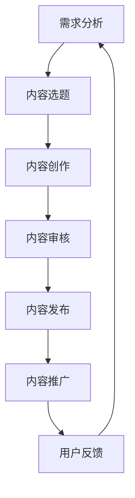

                 

### 文章标题：知识付费创业中的内容规划方法

#### 关键词：
- 知识付费
- 内容规划
- 创业策略
- 用户需求
- 数据分析

#### 摘要：
本文将深入探讨知识付费创业中的内容规划方法。通过分析行业背景、核心要素、实践方法及案例分析，本文旨在为创业者提供一套系统化、可操作的内容规划框架。文章首先概述了知识付费行业的市场背景和发展趋势，然后详细阐述了内容目标、选题、创作、编辑、传播等核心要素，最后通过案例分析和实践指导，帮助读者掌握有效的内容规划策略。本文旨在为知识付费创业提供有价值的参考和启示。

---

### 第一部分：知识付费行业概述

#### 1.1 知识付费市场背景与发展

##### 1.1.1 知识付费的起源与发展历程

知识付费的概念起源于20世纪末，随着互联网技术的发展和信息的爆炸式增长，人们逐渐意识到知识的价值。早期的知识付费形式主要局限于在线课程和教育资源，随着移动互联网的普及，知识付费行业迎来了快速发展。2010年代以来，以喜马拉雅、得到等为代表的知识付费平台逐渐崛起，满足了用户在专业领域和个人兴趣上的求知需求。

知识付费的发展历程可以分为以下几个阶段：

1. **萌芽期（2000-2010年）**：互联网初步普及，在线教育、电子书等形式开始出现，但尚未形成规模化的知识付费市场。
2. **成长期（2011-2015年）**：移动互联网兴起，知识付费市场开始萌芽，以问答社区、教育APP为代表的平台崭露头角。
3. **高速发展期（2016-2020年）**：知识付费进入高速发展阶段，各类知识付费平台涌现，用户规模迅速扩大。
4. **成熟期（2021年至今）**：市场逐渐成熟，知识付费行业进入深耕细作阶段，平台开始注重内容质量和服务体验。

##### 1.1.2 知识付费市场现状与趋势

当前，知识付费市场呈现出以下几个特点：

1. **市场规模持续扩大**：根据市场研究数据显示，2021年中国知识付费市场规模已超过2000亿元，并有望在未来几年继续保持高速增长。
2. **用户群体多元化**：知识付费用户不仅包括学生、职场人士，还包括中老年群体和特定兴趣爱好者。这表明知识付费市场的受众范围正在不断拓展。
3. **内容形式多样化**：除了传统的在线课程、电子书，短视频、直播、音频课程等新兴内容形式也逐渐受到用户青睐。
4. **竞争格局逐步形成**：随着市场的不断扩大，各类知识付费平台纷纷涌现，竞争格局逐步形成。头部平台通过优质内容和用户服务占据市场份额，但同时也面临着激烈的市场竞争。

展望未来，知识付费市场将继续保持增长态势，具体趋势包括：

1. **内容质量提升**：平台将更加注重内容的质量和用户反馈，通过数据分析和用户调研来优化内容，提升用户体验。
2. **技术创新驱动**：人工智能、大数据等技术的应用将进一步提升知识付费的个性化推荐和用户体验。
3. **跨界融合**：知识付费将与更多行业进行跨界融合，如电商、娱乐、社交等，形成多元化的知识付费生态。

##### 1.1.3 知识付费的主要参与者

知识付费行业的主要参与者包括以下几类：

1. **平台方**：如得到、喜马拉雅、知乎等，提供知识内容和服务，连接供给和需求两端。
2. **内容生产者**：包括专家学者、行业从业者、自由职业者等，他们是知识付费内容的主要创作者。
3. **用户**：即知识付费的消费群体，包括学生、职场人士、爱好者等，他们通过购买知识内容来提升自我能力和满足求知需求。
4. **投资者**：投资知识付费平台的机构和个人，他们通过投资获取回报。

平台方和内容生产者是知识付费市场中最关键的参与者。平台方通过技术手段和运营策略来连接用户和内容生产者，提供多样化的知识内容和服务。内容生产者则通过创作有价值的内容来吸引和留住用户，实现个人价值和社会价值的双重提升。

#### 1.2 知识付费平台类型与特点

知识付费平台根据内容类型和运营模式的不同，可以划分为以下几类：

##### 1.2.1 教育类知识付费平台

教育类知识付费平台以在线教育为主要内容形式，提供包括课程、教材、作业、测试等在内的一站式学习服务。其主要特点如下：

1. **内容形式多样**：包括图文、视频、音频、直播等多种形式，满足用户多样化的学习需求。
2. **课程体系完整**：平台提供从基础到高级的完整课程体系，帮助用户系统地学习和提升。
3. **互动性强**：平台提供在线讨论区、答疑解惑等功能，增强用户互动和参与感。
4. **认证体系完善**：通过考试、认证等方式，为用户提供专业认证，提升内容权威性。

代表平台：得到、知乎 Live、网易云课堂等。

##### 1.2.2 专业技能培训类知识付费平台

专业技能培训类知识付费平台主要面向特定职业或行业，提供专业知识和技能培训。其主要特点如下：

1. **针对性强**：针对特定职业或行业需求，提供专业的培训内容和课程体系。
2. **实战性强**：通过案例分析、实操练习等方式，帮助用户快速掌握实际技能。
3. **互动性高**：通过在线讨论、实战演练等形式，增强用户互动和实践能力。
4. **认证体系完善**：为用户颁发专业认证证书，提升内容权威性和用户信任度。

代表平台：知乎大学、网易云课堂、小鹅通等。

##### 1.2.3 休闲娱乐类知识付费平台

休闲娱乐类知识付费平台主要提供娱乐性和消遣性知识内容，如小说、综艺、电影解说等。其主要特点如下：

1. **内容轻松有趣**：以用户喜闻乐见的形式呈现，轻松有趣，适合休闲娱乐。
2. **互动性强**：通过评论、弹幕等形式，增强用户互动和参与感。
3. **个性化推荐**：基于用户行为和偏好，提供个性化的内容推荐，提升用户体验。
4. **内容更新频繁**：紧跟热点和潮流，提供丰富的内容更新。

代表平台：喜马拉雅、企鹅FM、抖音等。

#### 1.3 知识付费的商业模式与盈利模式

知识付费平台通过多种商业模式实现盈利，主要包括以下几种：

##### 1.3.1 会员制模式

会员制模式是知识付费平台最常用的商业模式之一，用户通过支付一定费用成为会员，享受平台提供的所有或部分内容服务。会员制模式的特点如下：

1. **持续收入**：会员费用为平台带来持续收入，有助于平台实现长期稳定发展。
2. **用户粘性强**：会员享受的内容服务丰富多样，有助于提升用户粘性。
3. **内容多样**：平台通过提供多样化的内容，满足会员的多种需求。

##### 1.3.2 单项课程购买模式

单项课程购买模式是指用户购买平台上的单个课程，获得相应的学习资源。这种模式的特点如下：

1. **灵活性高**：用户可以根据自己的需求和兴趣选择购买课程，灵活性较高。
2. **收入不稳定**：由于用户购买行为的不确定性，平台的收入波动较大。
3. **课程质量关键**：课程质量直接影响用户的购买决策，因此平台需要注重课程质量和内容创新。

##### 1.3.3 内容分销模式

内容分销模式是指知识付费平台与其他内容创作者或机构合作，分销其优质内容。这种模式的特点如下：

1. **资源共享**：平台和内容创作者可以实现资源共享，提高内容覆盖面和用户规模。
2. **风险分担**：平台和内容创作者共同分担风险，降低内容创作和推广成本。
3. **收入分成**：平台和内容创作者按照约定比例分成，实现双赢。

### 第二部分：内容规划的核心要素

#### 2.1 内容目标与定位

##### 2.1.1 确定内容目标

内容目标是知识付费平台内容规划的首要任务，明确的内容目标有助于平台制定合理的内容战略，提升内容质量和用户满意度。确定内容目标需要考虑以下几个方面：

1. **用户需求**：了解用户的学习需求、兴趣点和痛点，将用户需求转化为具体的内容目标。
2. **平台定位**：根据平台的定位和发展方向，确定内容目标与平台战略的一致性。
3. **市场趋势**：关注行业趋势和市场需求，结合自身优势确定具有竞争力的内容目标。

##### 2.1.2 内容目标与用户需求的匹配

内容目标与用户需求的匹配是内容规划的核心，具体策略如下：

1. **调研与分析**：通过用户调研、数据分析等方式，深入了解用户需求，形成用户画像。
2. **需求分类**：将用户需求分为基本需求、重要需求和潜在需求，有针对性地满足用户需求。
3. **内容定制**：根据用户需求，提供个性化的内容服务，提升用户满意度和忠诚度。

##### 2.1.3 确定内容定位

内容定位是知识付费平台在市场中区分自己和竞争对手的重要手段。确定内容定位需要考虑以下几个方面：

1. **内容特点**：根据平台的内容特色和优势，确定内容定位，形成差异化竞争优势。
2. **目标用户**：明确目标用户群体，根据用户特征和需求，调整内容定位，实现精准覆盖。
3. **市场定位**：结合行业趋势和市场需求，确定内容定位，确保内容的市场竞争力。

#### 2.2 内容选题与规划

##### 2.2.1 选题标准与原则

内容选题是知识付费平台内容规划的关键环节，遵循以下标准与原则有助于提升内容质量：

1. **需求导向**：围绕用户需求进行选题，确保内容与用户实际需求紧密相关。
2. **特色突出**：根据平台特色和优势，选择具有独特性和差异化的内容选题。
3. **市场潜力**：关注市场趋势和需求变化，选择具有市场潜力和发展前景的选题。
4. **内容质量**：确保内容具有较高的专业性和权威性，避免低质量、重复性内容。

##### 2.2.2 内容主题的深度与广度

内容主题的深度与广度是影响内容质量的重要因素。在内容规划中，应注重以下几个方面：

1. **深度挖掘**：对选题进行深度挖掘，全面剖析相关知识点，提供有价值的见解和实战经验。
2. **广度拓展**：拓展内容主题的广度，涵盖相关领域和行业，提供多元化的知识视角。
3. **逻辑清晰**：确保内容逻辑清晰，结构紧凑，避免信息冗余和混乱。

##### 2.2.3 内容规划的周期与更新策略

内容规划的周期与更新策略是保证内容持续性和活跃度的关键。以下是一些策略建议：

1. **定期更新**：制定内容更新计划，定期发布新内容，保持内容活力。
2. **滚动更新**：在发布新内容的同时，对旧内容进行适当更新和优化，提升内容质量。
3. **用户反馈**：收集用户反馈，根据用户需求和偏好调整内容更新策略，实现内容与用户需求的动态匹配。

#### 2.3 内容创作与编辑

##### 2.3.1 内容创作的流程与方法

内容创作是知识付费平台的核心环节，以下是一个典型的内容创作流程：

1. **选题立项**：根据内容规划和选题标准，确定内容选题，进行立项。
2. **资料收集**：收集相关资料，包括书籍、文章、案例等，确保内容有据可依。
3. **内容撰写**：根据选题和资料，撰写初稿，注意逻辑清晰、语言简洁。
4. **内容修改**：对初稿进行修改和润色，确保内容质量和可读性。
5. **内容发布**：将修改后的内容发布到平台，进行推广和传播。

在内容创作中，可以采用以下方法：

1. **案例分析法**：通过案例分析，深入剖析典型案例，提供实战经验和借鉴。
2. **文献综述法**：对相关文献进行综述，梳理知识点和理论框架。
3. **互动性创作**：结合用户互动和反馈，创作具有互动性和参与性的内容。

##### 2.3.2 编辑的角色与职责

编辑在知识付费平台内容创作中扮演着重要角色，主要职责包括：

1. **内容审核**：对提交的内容进行审核，确保内容质量、逻辑性和可读性。
2. **排版设计**：对内容进行排版和设计，提升内容的视觉体验。
3. **文案优化**：对内容进行文案优化，提升文案的吸引力和说服力。
4. **内容推广**：协助内容创作者进行内容推广，提升内容曝光度和用户粘性。

##### 2.3.3 内容质量评估与优化

内容质量是知识付费平台的核心竞争力，以下是一些内容质量评估与优化的方法：

1. **用户反馈**：收集用户对内容的反馈，了解用户的满意度和改进需求。
2. **数据分析**：通过数据分析，评估内容的阅读量、点赞量、分享量等指标，了解内容的表现和用户偏好。
3. **专家评审**：邀请行业专家对内容进行评审，从专业角度提出改进建议。
4. **持续优化**：根据评估结果和用户反馈，对内容进行持续优化，提升内容质量。

#### 2.4 内容传播与推广

##### 2.4.1 内容传播的渠道选择

内容传播渠道的选择对知识付费平台的内容推广至关重要。以下是一些常见的内容传播渠道：

1. **社交媒体**：如微博、微信、抖音等，通过社交媒体平台进行内容分享和传播。
2. **搜索引擎**：通过搜索引擎优化（SEO），提高内容在搜索引擎中的排名，吸引更多用户访问。
3. **合作伙伴**：与其他平台或机构合作，进行内容互换或联合推广。
4. **线下活动**：举办线下活动，如讲座、沙龙等，提升品牌知名度和用户粘性。

##### 2.4.2 推广策略与执行

有效的推广策略能够提升内容曝光度和用户转化率。以下是一些推广策略：

1. **SEO优化**：通过优化网站结构和内容，提高搜索引擎排名，吸引更多用户访问。
2. **社交媒体营销**：通过微博、微信等社交媒体平台，发布有价值的内容，吸引用户关注和分享。
3. **合作推广**：与相关领域或行业进行合作，共同推广内容，扩大影响力。
4. **内容营销**：通过内容营销，提供有价值的内容，吸引用户关注和参与。

在推广执行中，需要注意以下几点：

1. **精准定位**：根据目标用户特征和需求，精准定位推广内容。
2. **持续更新**：定期发布新内容，保持内容活力和用户关注度。
3. **数据分析**：通过数据分析，评估推广效果，优化推广策略。

##### 2.4.3 用户反馈与互动

用户反馈与互动是内容传播的重要环节，以下是一些策略：

1. **开放评论区**：在内容发布后，开放评论区，鼓励用户留言和讨论，增加用户互动。
2. **答疑解惑**：及时回复用户的提问和反馈，解决用户问题和疑虑，提升用户体验。
3. **互动活动**：举办互动活动，如问答、抽奖等，增加用户参与度和粘性。
4. **用户调研**：定期进行用户调研，了解用户需求和偏好，优化内容和推广策略。

### 第三部分：内容规划方法与实践

#### 3.1 数据分析与用户研究

##### 3.1.1 用户行为数据分析

用户行为数据分析是内容规划的重要依据，以下是一些常用方法：

1. **用户访问数据分析**：分析用户访问网站或平台的流量、来源、停留时间等指标，了解用户访问行为和偏好。
2. **内容互动数据分析**：分析用户对内容的点赞、评论、分享等互动行为，了解内容的受欢迎程度和用户反馈。
3. **用户留存数据分析**：分析用户的留存率、活跃度等指标，了解用户对平台的内容和服务满意度。

通过用户行为数据分析，可以得出以下结论：

1. **用户偏好**：了解用户对内容类型、主题、形式等的偏好，为内容创作提供参考。
2. **内容优化**：根据用户反馈和互动数据，优化内容质量和传播策略。
3. **用户留存**：分析用户留存因素，提升用户粘性和活跃度。

##### 3.1.2 用户需求与偏好分析

用户需求与偏好分析是内容规划的重要环节，以下是一些策略：

1. **问卷调查**：通过问卷调查，收集用户需求和偏好数据，形成用户画像。
2. **访谈调研**：与目标用户进行深入访谈，了解他们的需求和期望，发现潜在需求。
3. **行为数据挖掘**：通过用户行为数据分析，挖掘用户的需求和偏好模式。

通过用户需求与偏好分析，可以得出以下结论：

1. **内容定位**：根据用户需求和偏好，调整内容定位，实现精准覆盖。
2. **内容优化**：根据用户需求和偏好，优化内容形式和传播策略，提升用户体验。
3. **用户满意度**：通过满足用户需求和偏好，提升用户满意度，增加用户忠诚度。

##### 3.1.3 数据驱动的决策支持

数据驱动的决策支持是内容规划的关键，以下是一些方法：

1. **数据可视化**：通过数据可视化工具，将数据转化为图表和报告，直观展示数据趋势和关系。
2. **数据分析模型**：建立数据分析模型，对用户行为和需求进行预测和评估，提供决策支持。
3. **A/B测试**：通过A/B测试，比较不同内容或策略的效果，优化决策和策略。

通过数据驱动的决策支持，可以得出以下结论：

1. **内容优化**：根据数据分析结果，优化内容形式和传播策略，提升内容质量和用户满意度。
2. **策略调整**：根据数据分析结果，调整推广策略和运营策略，实现精准营销和高效运营。
3. **风险控制**：通过数据分析，识别潜在风险和问题，提前预防和控制，降低运营风险。

#### 3.2 内容策略制定与执行

##### 3.2.1 内容策略的核心要素

内容策略制定是知识付费平台内容规划的重要组成部分，以下是一些核心要素：

1. **目标明确**：明确内容策略的目标，包括用户目标、平台目标等。
2. **内容规划**：制定详细的内容规划，包括内容选题、主题、形式、周期等。
3. **传播策略**：制定传播策略，包括渠道选择、推广方式、互动策略等。
4. **数据分析**：通过数据分析，评估内容策略的效果，进行持续优化。

##### 3.2.2 内容策略制定流程

内容策略制定流程包括以下几个步骤：

1. **需求分析**：通过用户调研、数据分析等方式，了解用户需求和偏好。
2. **策略制定**：根据需求分析结果，制定内容策略，包括内容规划、传播策略等。
3. **方案优化**：对内容策略方案进行评估和优化，确保策略的有效性和可执行性。
4. **方案实施**：根据内容策略方案，制定实施计划，确保策略的有效执行。

##### 3.2.3 内容策略执行与监控

内容策略执行与监控是确保策略效果的重要环节，以下是一些策略：

1. **任务分解**：将内容策略分解为具体任务，明确责任人和时间节点。
2. **执行监控**：通过数据监控和反馈机制，实时了解策略执行情况，及时调整和优化。
3. **效果评估**：通过效果评估，了解内容策略的实际效果，进行持续优化。
4. **反馈调整**：根据用户反馈和数据分析结果，调整内容策略，实现持续优化。

#### 3.3 内容创新与迭代

##### 3.3.1 创新思维与技巧

内容创新是知识付费平台持续发展的重要驱动力，以下是一些创新思维与技巧：

1. **用户需求导向**：以用户需求为导向，挖掘用户潜在需求，提供创新性内容。
2. **跨领域融合**：跨领域融合，将不同领域的知识进行整合和创新，提供独特的内容体验。
3. **技术创新**：利用人工智能、大数据等技术，提供个性化、智能化的内容服务。

##### 3.3.2 内容迭代的方法与步骤

内容迭代是提升内容质量和用户满意度的重要手段，以下是一些方法与步骤：

1. **需求调研**：通过用户调研、数据分析等方式，了解用户需求和偏好。
2. **内容评估**：对现有内容进行评估，分析内容的质量、受欢迎程度和用户满意度。
3. **内容优化**：根据评估结果，对内容进行优化，包括选题、形式、结构等。
4. **内容发布**：更新和发布优化后的内容，进行推广和传播。
5. **效果评估**：通过数据分析和用户反馈，评估内容迭代的效果，进行持续优化。

##### 3.3.3 成功案例分享与启示

以下是一些内容创新和迭代的成功案例，以及从中得到的启示：

1. **案例一：得到APP的《得到早报》**
   - **背景**：得到APP推出《得到早报》，每天早晨为用户提供新闻摘要和深度解读。
   - **创新点**：通过人工智能技术，对大量新闻进行筛选和摘要，提供个性化的新闻解读。
   - **启示**：利用技术创新，提高内容质量和用户满意度。

2. **案例二：网易云课堂的《Python入门教程》**
   - **背景**：网易云课堂推出《Python入门教程》，为初学者提供系统的学习路径。
   - **创新点**：采用项目驱动式教学，通过实际项目案例，帮助用户快速掌握Python技能。
   - **启示**：结合用户需求，提供实践性强的内容，提升学习效果。

3. **案例三：喜马拉雅的《非暴力沟通》课程**
   - **背景**：喜马拉雅推出《非暴力沟通》课程，邀请心理学家提供专业解读。
   - **创新点**：结合心理学理论，提供实用的沟通技巧和方法，帮助用户提升沟通能力。
   - **启示**：邀请行业专家，提供高质量的内容，提升内容权威性和用户信任度。

#### 3.4 内容法律风险与版权管理

##### 3.4.1 内容版权的基本知识

内容版权是知识付费平台必须重视的法律问题，以下是一些基本知识：

1. **版权定义**：版权是指作者对其创作的文学、艺术和科学作品所享有的专有权利。
2. **版权主体**：版权主体是创作作品的作者或合法继承人，他们享有作品的版权。
3. **版权内容**：版权内容包括复制权、发行权、表演权、展示权等，不同的权利具有不同的法律效力。

##### 3.4.2 法律风险防范策略

为了防范内容法律风险，知识付费平台可以采取以下策略：

1. **版权审核**：对上传的内容进行严格审核，确保内容不侵犯他人的版权。
2. **版权声明**：在平台首页或内容页面明确声明版权政策，告知用户平台对版权的重视和保护。
3. **版权合作**：与版权持有者建立合作关系，获得合法授权使用其内容。
4. **版权保护技术**：采用技术手段，如数字水印、加密等，保护内容版权。

##### 3.4.3 版权管理流程与工具

版权管理是知识付费平台的一项重要工作，以下是一些流程和工具：

1. **版权登记**：对原创内容进行版权登记，获得法律保护。
2. **版权追踪**：通过技术手段，实时监测和追踪平台上的版权内容，识别侵权行为。
3. **版权纠纷处理**：建立版权纠纷处理机制，及时应对和处理版权纠纷。
4. **版权管理系统**：采用版权管理系统，对版权进行集中管理和监控，提高管理效率。

### 第四部分：案例分析与实践指导

#### 4.1 案例分析

##### 4.1.1 成功案例分享

以下是一些知识付费平台成功案例的分享：

1. **得到APP的《得到早报》**
   - **背景**：得到APP通过推出《得到早报》，利用人工智能技术，每天早晨为用户提供新闻摘要和深度解读。
   - **成果**：《得到早报》用户量快速增长，成为得到APP的重要产品之一，实现了良好的商业回报。

2. **网易云课堂的《Python入门教程》**
   - **背景**：网易云课堂推出《Python入门教程》，采用项目驱动式教学，帮助初学者快速掌握Python技能。
   - **成果**：《Python入门教程》受到了大量初学者的欢迎，课程销量和用户满意度持续提升。

3. **喜马拉雅的《非暴力沟通》课程**
   - **背景**：喜马拉雅邀请心理学家提供《非暴力沟通》课程，结合心理学理论，提供实用的沟通技巧和方法。
   - **成果**：《非暴力沟通》课程在喜马拉雅平台取得了巨大成功，成为平台的热门课程之一。

##### 4.1.2 失败案例分析

以下是一些知识付费平台失败案例的分析：

1. **某知名教育平台的在线课程**
   - **背景**：某知名教育平台推出大量在线课程，但课程质量参差不齐，用户体验不佳。
   - **原因**：课程质量不高，缺乏有效的内容审核和监管机制，导致用户满意度低，最终导致平台衰落。

2. **某知识付费平台的会员服务**
   - **背景**：某知识付费平台推出会员服务，但内容质量差，推广策略不当，导致会员数量持续下降。
   - **原因**：内容质量差，缺乏创新性和吸引力，推广策略不当，导致用户流失。

##### 4.1.3 案例启示与总结

从以上成功和失败案例中，可以得出以下启示和总结：

1. **注重内容质量**：内容质量是知识付费平台的核心竞争力，平台需要注重内容质量，提升用户体验。
2. **创新与差异化**：通过技术创新和内容差异化，提供独特的内容体验，提升用户满意度和忠诚度。
3. **用户需求导向**：以用户需求为导向，提供满足用户需求的内容和服务，实现用户价值最大化。
4. **有效推广策略**：制定有效的推广策略，提高内容曝光度和用户转化率，实现商业成功。

#### 4.2 实践指导

##### 4.2.1 内容规划流程图

以下是一个内容规划流程图的示例：

##### 4.2.2 内容创作工具推荐

以下是一些常见的内容创作工具推荐：

1. **文字编辑工具**：如Microsoft Word、Google Docs等，用于撰写和编辑文本内容。
2. **图片编辑工具**：如Adobe Photoshop、Canva等，用于编辑和设计图片。
3. **视频编辑工具**：如Adobe Premiere Pro、Final Cut Pro等，用于编辑和制作视频内容。
4. **音频编辑工具**：如Audacity、Adobe Audition等，用于编辑和制作音频内容。

##### 4.2.3 实操步骤与注意事项

以下是一些内容规划实操步骤和注意事项：

1. **需求分析**：
   - **步骤**：进行用户调研、数据分析，了解用户需求和偏好。
   - **注意事项**：确保调研数据的真实性和代表性，避免主观臆断。

2. **内容选题**：
   - **步骤**：根据需求分析结果，选择具有吸引力和市场潜力的内容选题。
   - **注意事项**：注意选题的深度和广度，避免重复性选题。

3. **内容创作**：
   - **步骤**：根据选题进行内容创作，撰写文本、编辑图片、制作视频等。
   - **注意事项**：注重内容质量和用户体验，避免低质量内容。

4. **内容审核**：
   - **步骤**：对创作内容进行审核，确保内容符合平台标准和用户需求。
   - **注意事项**：严格把关内容质量，避免违规内容和低质量内容。

5. **内容发布**：
   - **步骤**：将审核通过的内容发布到平台，进行推广和传播。
   - **注意事项**：选择合适的时间和渠道，提高内容曝光度和用户访问量。

6. **用户反馈与互动**：
   - **步骤**：收集用户反馈，与用户互动，优化内容和推广策略。
   - **注意事项**：及时回复用户反馈，提升用户体验，增加用户粘性。

#### 4.3 持续学习与职业发展

##### 4.3.1 行业趋势与新技术应用

知识付费行业正面临快速发展和变革，以下是一些行业趋势和新技术应用：

1. **人工智能**：人工智能技术在知识付费领域的应用越来越广泛，如个性化推荐、智能问答、语音识别等。
2. **大数据**：大数据技术助力知识付费平台了解用户需求和偏好，提供更精准的内容推荐和服务。
3. **区块链**：区块链技术应用于知识付费，确保内容版权保护和交易安全。
4. **虚拟现实（VR）和增强现实（AR）**：VR和AR技术提供沉浸式的学习体验，提升用户参与感和互动性。

##### 4.3.2 职业技能提升路径

在知识付费行业中，以下是一些职业技能提升路径：

1. **内容创作**：学习写作技巧、图片编辑、视频制作等技能，提升内容创作能力。
2. **数据分析**：掌握数据分析工具和技能，如Excel、Python等，提升数据分析和处理能力。
3. **用户运营**：学习用户运营策略和技巧，提升用户管理和互动能力。
4. **市场营销**：学习市场营销知识，如SEO、SEM、内容营销等，提升推广能力和效果。

##### 4.3.3 优秀实践者访谈与建议

以下是一些优秀实践者的访谈和建议：

1. **访谈对象**：某知名知识付费平台的内容总监
   - **建议**：注重内容质量和用户体验，以用户需求为导向，持续优化内容和推广策略。

2. **访谈对象**：某知名知识付费平台的运营经理
   - **建议**：加强用户研究和数据分析，了解用户需求和偏好，提供个性化的内容和服务。

3. **访谈对象**：某知名知识付费平台的技术总监
   - **建议**：利用新技术和创新思维，提升内容质量和用户体验，保持竞争优势。

### 附录

#### 附录 A：知识付费行业报告与数据资源

以下是一些知识付费行业报告和数据资源的推荐：

1. **报告来源**：艾瑞咨询、克劳锐、数据分析公司等。
   - **获取途径**：官方网站、行业报告下载平台等。

2. **数据资源**：
   - **用户调研数据**：通过问卷调查、访谈等方式收集。
   - **市场数据分析**：通过第三方数据公司购买或公开获取。
   - **行业报告**：通过行业研究机构购买或免费获取。

#### 附录 B：参考文献与进一步阅读材料

以下是一些参考文献和进一步阅读材料的推荐：

1. **相关书籍**：
   - 《互联网+教育：知识付费时代的崛起》
   - 《内容营销：如何打造优质内容实现商业成功》
   - 《数据分析实战：从入门到精通》

2. **学术论文**：
   - 《知识付费：现状、问题与对策》
   - 《大数据在知识付费中的应用研究》
   - 《人工智能在知识付费领域的应用现状与趋势》

3. **在线课程与讲座**：
   - **知识付费行业分析**：网易云课堂、知乎Live等平台上的相关课程。
   - **内容营销技巧**：营销学院、馒头商学院等平台上的相关课程。
   - **数据分析入门**：网易云课堂、Coursera等平台上的相关课程。

---

**作者：AI天才研究院/AI Genius Institute & 禅与计算机程序设计艺术 /Zen And The Art of Computer Programming**

本文通过深入探讨知识付费创业中的内容规划方法，从行业概述、核心要素、实践方法、案例分析等方面进行了全面阐述，旨在为创业者提供有价值的参考和启示。在未来的发展中，知识付费行业将继续面临新的机遇和挑战，内容规划将成为核心竞争力之一。希望本文能够帮助读者更好地理解和应对知识付费市场的变化，实现创业成功。**

