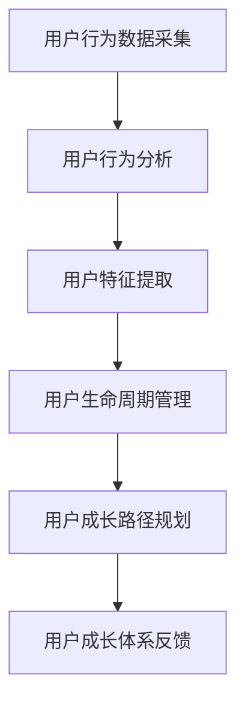

                 

# 《知识付费创业中的用户成长体系设计》

> 关键词：知识付费、用户成长体系、用户行为分析、用户生命周期管理、用户成长路径规划

> 摘要：本文将深入探讨知识付费创业中的用户成长体系设计，从行业背景出发，详细解析用户成长体系的设计原则、核心概念与联系、核心算法原理，以及具体的数学模型和公式。通过项目实战案例分析，展示用户成长体系设计的实际应用，并提出应对挑战的对策与解决方案。本文旨在为知识付费创业企业提供一套系统的用户成长体系设计思路，助力企业实现长期稳定发展。

### 目录

# 第一部分：知识付费创业背景与用户成长体系概述

## 1.1 知识付费行业现状与发展趋势

### 1.1.1 知识付费的定义与分类

### 1.1.2 知识付费市场的发展历程

### 1.1.3 知识付费行业的用户需求分析

## 1.2 用户成长体系设计的重要性

### 1.2.1 用户成长体系的定义与内涵

### 1.2.2 用户成长体系在知识付费创业中的作用

### 1.2.3 用户成长体系设计的关键要素

# 第二部分：用户成长体系核心概念与联系

## 2.1 用户行为分析

### 2.1.1 用户行为数据分析方法

#### 2.1.1.1 基于日志的分析方法

#### 2.1.1.2 基于调查问卷的分析方法

### 2.1.2 用户行为特征提取

#### 2.1.2.1 用户活跃度分析

#### 2.1.2.2 用户留存率分析

## 2.2 用户生命周期管理

### 2.2.1 用户生命周期的定义与阶段划分

#### 2.2.1.1 获取阶段

#### 2.2.1.2 激活阶段

#### 2.2.1.3 成长阶段

#### 2.2.1.4 留存与流失阶段

### 2.2.2 用户生命周期管理策略

#### 2.2.2.1 获取阶段策略

#### 2.2.2.2 激活阶段策略

#### 2.2.2.3 成长阶段策略

#### 2.2.2.4 留存与流失阶段策略

## 2.3 用户成长体系架构设计

### 2.3.1 用户成长体系架构的Mermaid流程图

#### 2.3.1.1 用户成长体系的核心模块

#### 2.3.1.2 用户成长体系的数据流转

### 2.3.2 用户成长体系设计的关键原则

#### 2.3.2.1 用户导向原则

#### 2.3.2.2 可持续发展原则

#### 2.3.2.3 个性化定制原则

# 第二部分：知识付费创业背景与用户成长体系概述

## 1.1 知识付费行业现状与发展趋势

### 1.1.1 知识付费的定义与分类

知识付费，是指用户为获取有价值的信息、知识、技能或服务，自愿支付相应费用的一种商业模式。知识付费的分类主要包括：

1. **内容付费**：用户为获取高质量内容而付费，如付费订阅的文章、视频、音频等。
2. **技能培训付费**：用户为提升个人技能，参加线上或线下的培训课程，如编程、外语、摄影等。
3. **咨询服务付费**：用户为获取专业咨询服务，如律师、医生、心理咨询师等提供的个性化服务。

### 1.1.2 知识付费市场的发展历程

知识付费市场的发展大致可以分为三个阶段：

1. **萌芽期（2010-2015年）**：以知识共享、免费内容为主，用户付费意识较弱。
2. **成长期（2016-2020年）**：随着移动互联网和线上教育的发展，用户付费意识逐渐提升，知识付费市场开始形成。
3. **成熟期（2021年至今）**：知识付费市场进入成熟期，用户需求多样化，市场竞争加剧。

### 1.1.3 知识付费行业的用户需求分析

知识付费用户的典型需求包括：

1. **知识获取**：用户希望通过付费获取高质量、有针对性的知识，提升自身技能和素养。
2. **时间节省**：用户希望通过付费避免无效的信息筛选和时间浪费，实现高效学习。
3. **个性定制**：用户希望知识产品能够根据自身需求和兴趣进行个性定制。
4. **社交互动**：用户希望通过知识付费产品获得社交互动机会，拓展人际网络。

## 1.2 用户成长体系设计的重要性

### 1.2.1 用户成长体系的定义与内涵

用户成长体系是指企业根据用户需求和行为数据，通过设计一系列的用户引导、激励和成长路径，帮助用户在知识付费平台上实现持续学习和进步的机制。其内涵包括：

1. **用户引导**：通过推荐系统、活动引导等方式，引导用户找到适合自己的知识产品。
2. **用户激励**：通过积分、等级、奖励等方式，激励用户持续使用平台和服务。
3. **用户成长**：通过数据分析，了解用户的学习进度和需求，提供个性化的学习建议和课程。

### 1.2.2 用户成长体系在知识付费创业中的作用

用户成长体系在知识付费创业中具有重要作用：

1. **提升用户粘性**：通过用户成长体系，帮助用户在平台上持续学习和进步，提高用户粘性。
2. **增加用户留存率**：通过用户成长体系，提升用户在平台上的参与度和满意度，降低用户流失率。
3. **优化用户体验**：通过用户成长体系，为用户提供个性化的学习路径和资源，提升用户体验。
4. **促进知识传播**：通过用户成长体系，鼓励用户分享和传播知识，促进知识付费生态的繁荣。

### 1.2.3 用户成长体系设计的关键要素

设计一个有效的用户成长体系，需要关注以下几个关键要素：

1. **用户需求分析**：深入了解用户需求，为用户成长体系设计提供数据支持。
2. **用户体验设计**：确保用户成长体系的设计符合用户习惯，易于操作和理解。
3. **数据驱动**：利用数据分析和挖掘技术，动态调整用户成长体系，提升用户体验和效果。
4. **激励机制**：设计合理的激励机制，鼓励用户参与和成长。
5. **个性化定制**：根据用户行为数据，为用户提供个性化的学习路径和资源。

通过以上要素的设计和优化，知识付费企业可以构建一个有效的用户成长体系，实现用户和企业的共同成长。

### 1.2.4 用户成长体系设计的策略与原则

用户成长体系设计的策略与原则包括以下几个方面：

1. **用户导向原则**：以用户需求为中心，设计符合用户习惯和期望的成长路径。
2. **可持续发展原则**：确保用户成长体系的可持续性，避免短期行为影响长期发展。
3. **个性化定制原则**：根据用户行为数据，为用户提供个性化的学习路径和资源。
4. **激励机制原则**：设计合理的激励机制，鼓励用户参与和成长。
5. **数据分析原则**：利用数据分析技术，动态调整用户成长体系，提升用户体验和效果。

通过遵循以上策略与原则，知识付费企业可以设计出更加有效的用户成长体系，促进用户和企业的共同发展。

## 2.1 用户行为分析

### 2.1.1 用户行为数据分析方法

用户行为分析是用户成长体系设计的重要基础。为了准确了解用户行为，需要采用多种数据分析方法：

1. **基于日志的分析方法**：
   - **定义**：通过收集和分析用户在平台上的操作日志，如点击、浏览、购买等行为数据。
   - **优点**：数据真实、全面，能够反映用户实际行为。
   - **应用**：用于分析用户行为模式、兴趣偏好等。

2. **基于调查问卷的分析方法**：
   - **定义**：通过设计调查问卷，收集用户对平台、课程、服务等的主观评价和反馈。
   - **优点**：能够深入了解用户需求和期望。
   - **应用**：用于了解用户满意度、改进建议等。

### 2.1.2 用户行为特征提取

为了更好地理解用户行为，需要提取关键的用户行为特征：

1. **用户活跃度分析**：
   - **定义**：衡量用户在平台上的活跃程度，如登录次数、观看时长等。
   - **应用**：用于评估用户参与度，为用户成长体系设计提供依据。

2. **用户留存率分析**：
   - **定义**：衡量用户在一段时间内持续使用平台的比率。
   - **应用**：用于评估用户黏性，为优化用户成长体系提供参考。

通过以上方法，可以全面了解用户行为，为用户成长体系设计提供数据支持。

### 2.1.3 用户成长体系的核心指标

用户成长体系设计需要关注以下核心指标：

1. **用户活跃度**：衡量用户在平台上的活跃程度，如登录次数、观看时长等。
2. **用户留存率**：衡量用户在一段时间内持续使用平台的比率。
3. **用户转化率**：衡量用户从浏览到购买或付费的转化比率。
4. **用户满意度**：衡量用户对平台、课程、服务等的主观评价。

这些指标可以反映用户成长体系的运行效果，帮助企业不断优化和改进。

## 2.2 用户生命周期管理

### 2.2.1 用户生命周期的定义与阶段划分

用户生命周期是指用户从接触到离开平台的整个过程。通常可分为以下几个阶段：

1. **获取阶段**：用户首次接触平台，获取信息和内容。
2. **激活阶段**：用户开始使用平台功能，如浏览、观看、购买等。
3. **成长阶段**：用户在平台上持续学习和进步，参与度提高。
4. **留存与流失阶段**：用户在一段时间内持续使用平台，或因各种原因离开平台。

### 2.2.2 用户生命周期管理策略

针对不同阶段，需要采取相应的用户生命周期管理策略：

1. **获取阶段策略**：
   - **推广与引流**：通过广告、推广活动等，吸引潜在用户。
   - **新手引导**：为新手用户提供详细的操作指南和课程推荐。

2. **激活阶段策略**：
   - **互动与反馈**：鼓励用户参与评论、提问等互动，提高用户粘性。
   - **优惠促销**：提供优惠券、折扣等优惠活动，刺激用户消费。

3. **成长阶段策略**：
   - **个性化推荐**：根据用户行为数据，推荐符合用户兴趣的课程。
   - **成长激励**：设置积分、等级等激励机制，鼓励用户持续学习和进步。

4. **留存与流失阶段策略**：
   - **用户关怀**：定期向用户发送问候、提醒等消息，保持用户活跃度。
   - **挽回策略**：针对流失用户，提供个性化的挽回方案，如优惠券、礼品等。

通过以上策略，可以有效地管理用户生命周期，提升用户留存率和满意度。

### 2.2.3 用户生命周期管理的关键原则

用户生命周期管理需要遵循以下关键原则：

1. **以用户为中心**：始终关注用户需求，提供优质的服务和内容。
2. **数据驱动**：利用数据分析和挖掘技术，动态调整管理策略。
3. **持续优化**：不断优化用户体验，提升用户满意度。
4. **个性化定制**：根据用户行为数据，为用户提供个性化的服务和建议。

通过遵循以上原则，知识付费企业可以更好地管理用户生命周期，实现用户和企业的共同成长。

### 2.2.4 用户生命周期管理的效果评估

用户生命周期管理的效果可以通过以下指标进行评估：

1. **用户留存率**：衡量用户在一段时间内持续使用平台的比率。
2. **用户满意度**：衡量用户对平台、课程、服务等的主观评价。
3. **用户转化率**：衡量用户从浏览到购买或付费的转化比率。

通过定期评估和管理，知识付费企业可以及时发现问题和优化策略，提高用户生命周期管理的整体效果。

### 2.3 用户成长体系架构设计

用户成长体系架构设计是构建一个有效用户成长体系的关键步骤。以下是用户成长体系架构设计的主要模块和数据流转：

#### 2.3.1 用户成长体系架构的Mermaid流程图



#### 2.3.1.1 用户成长体系的核心模块

1. **用户行为数据采集**：通过日志分析、调查问卷等方式，收集用户行为数据。
2. **用户行为分析**：分析用户行为数据，提取用户特征。
3. **用户特征提取**：根据用户行为分析结果，提取用户活跃度、留存率等特征。
4. **用户生命周期管理**：根据用户特征，实施用户获取、激活、成长和留存与流失阶段的管理策略。
5. **用户成长路径规划**：根据用户生命周期管理结果，为用户提供个性化的成长路径和资源。
6. **用户成长体系反馈**：收集用户对成长路径的反馈，持续优化用户成长体系。

#### 2.3.1.2 用户成长体系的数据流转

用户成长体系的数据流转如下：

1. **用户行为数据采集**：收集用户在平台上的操作数据，如点击、浏览、购买等。
2. **用户行为分析**：分析用户行为数据，识别用户兴趣和行为模式。
3. **用户特征提取**：根据用户行为分析结果，提取用户活跃度、留存率等特征。
4. **用户生命周期管理**：根据用户特征，实施用户获取、激活、成长和留存与流失阶段的管理策略。
5. **用户成长路径规划**：根据用户生命周期管理结果，为用户提供个性化的成长路径和资源。
6. **用户成长体系反馈**：收集用户对成长路径的反馈，持续优化用户成长体系。

通过以上架构设计，知识付费企业可以构建一个完整的用户成长体系，实现用户和企业的共同成长。

### 2.3.2 用户成长体系设计的关键原则

用户成长体系设计需要遵循以下关键原则，以确保其有效性和可持续性：

1. **用户导向原则**：以用户需求为中心，设计符合用户习惯和期望的成长路径。
2. **可持续发展原则**：确保用户成长体系的长期有效性和可持续性，避免短期行为影响长期发展。
3. **个性化定制原则**：根据用户行为数据，为用户提供个性化的学习路径和资源。
4. **激励机制原则**：设计合理的激励机制，鼓励用户参与和成长。
5. **数据分析原则**：利用数据分析技术，动态调整用户成长体系，提升用户体验和效果。

通过遵循以上原则，知识付费企业可以构建一个有效的用户成长体系，促进用户和企业的共同成长。

### 2.4 用户成长体系核心算法原理讲解

用户成长体系的核心算法包括用户行为预测算法和用户成长路径规划算法。以下是这些算法的原理讲解。

#### 2.4.1 用户行为预测算法

用户行为预测算法旨在通过分析历史数据，预测用户未来的行为。以下是两种常用的用户行为预测算法：

1. **基于概率论的预测模型**：
   - **贝叶斯预测算法**：贝叶斯预测是一种基于贝叶斯定理的概率预测模型。其核心思想是根据用户的过去行为数据，计算出用户在某一时刻采取某种行为的概率。贝叶斯预测算法的伪代码如下：
     ```python
     def bayesian_predict(user_history, behavior_probabilities):
         predicted_behavior = []
         for behavior in user_history:
             probability = sum(behavior_probabilities[behavior])
             predicted_behavior.append(probability)
         return predicted_behavior
     ```
   - **马尔可夫链预测算法**：马尔可夫链预测是一种基于状态转移概率的预测模型。其核心思想是用户当前的行为状态仅与前一时刻的行为状态有关，而与过去的行为状态无关。马尔可夫链预测算法的伪代码如下：
     ```python
     def markov_chain_predict(user_history, transition_probabilities):
         current_state = user_history[0]
         predicted_behavior = [current_state]
         for behavior in user_history[1:]:
             next_state = transition_probabilities[current_state][behavior]
             predicted_behavior.append(next_state)
             current_state = next_state
         return predicted_behavior
     ```

2. **基于机器学习的预测模型**：
   - **支持向量机（SVM）算法**：支持向量机是一种基于最大间隔分类的预测模型。其核心思想是找到最优的超平面，将不同类别的用户行为数据分隔开来。支持向量机预测算法的伪代码如下：
     ```python
     def svm_predict(user_history, model):
         predicted_behavior = []
         for behavior in user_history:
             probability = model.predict(behavior)
             predicted_behavior.append(probability)
         return predicted_behavior
     ```

   - **神经网络算法**：神经网络是一种基于多层感知器的预测模型。其核心思想是通过前向传播和反向传播算法，学习用户行为数据中的非线性关系。神经网络预测算法的伪代码如下：
     ```python
     def neural_network_predict(user_history, model):
         predicted_behavior = []
         for behavior in user_history:
             output = model.forward(behavior)
             predicted_behavior.append(output)
         return predicted_behavior
     ```

通过以上算法，可以实现对用户行为的准确预测，为用户成长路径规划提供数据支持。

#### 2.4.2 用户成长路径规划算法

用户成长路径规划算法旨在根据用户的行为数据和偏好，为用户制定个性化的成长路径。以下是两种常用的用户成长路径规划算法：

1. **基于目标规划的模型**：
   - **目标规划模型**：目标规划模型是一种基于目标规划的路径规划算法。其核心思想是确定用户的目标，并根据用户的行为数据和偏好，制定最优的成长路径。目标规划模型的数学公式如下：
     $$ \min_{x} \sum_{i=1}^{n} c_{i} x_{i} $$
     $$ \text{subject to} $$
     $$ a_{i} x_{i} \leq b_{i}, \quad i=1,2,...,m $$
     其中，$x_{i}$ 表示用户在成长路径上的行动，$c_{i}$ 表示行动的成本，$a_{i}$ 表示行动的影响，$b_{i}$ 表示目标的约束。
   - **目标规划算法**：目标规划算法是一种基于线性规划的求解算法。其核心思想是通过求解线性规划问题，找到最优的行动方案。目标规划算法的伪代码如下：
     ```python
     def goal_programming_predict(user_behavior, model):
         optimal_actions = []
         for behavior in user_behavior:
             objective = model.solve(behavior)
             optimal_actions.append(objective)
         return optimal_actions
     ```

2. **基于遗传算法的模型**：
   - **遗传算法模型**：遗传算法是一种基于自然选择和遗传机制的优化算法。其核心思想是通过迭代进化，找到最优的成长路径。遗传算法模型的数学公式如下：
     $$ f(x) = \sum_{i=1}^{n} w_{i} g_{i}(x) $$
     其中，$x$ 表示成长路径，$w_{i}$ 表示权重，$g_{i}(x)$ 表示成长路径的评价函数。
   - **遗传算法**：遗传算法的核心步骤包括选择、交叉、变异和评估。遗传算法的伪代码如下：
     ```python
     def genetic_algorithm_predict(user_behavior, model):
         population = initialize_population(user_behavior)
         for generation in range(max_generations):
             fitness = evaluate_fitness(population, model)
             new_population = select_and_crossover(population, fitness)
             new_population = mutate(new_population)
             population = new_population
         optimal_path = select_best_path(population)
         return optimal_path
     ```

通过以上算法，可以为用户制定个性化的成长路径，提升用户的学习效果和满意度。

### 2.4.3 用户成长体系数学模型和公式详细讲解

用户成长体系设计中的数学模型和公式是理解用户行为和成长路径的关键。以下是用户成长体系中的主要数学模型和公式的详细讲解。

#### 2.4.3.1 用户留存率模型

用户留存率是衡量用户持续使用平台的重要指标。其数学公式如下：
$$ R(t) = \frac{N(t)}{N(0)} $$
其中，$R(t)$ 表示在时间$t$ 的用户留存率，$N(t)$ 表示在时间$t$ 仍在使用平台的用户数量，$N(0)$ 表示初始用户数量。

#### 2.4.3.2 用户生命周期价值模型

用户生命周期价值（Life Time Value，简称LTV）是衡量用户对平台的长期价值的重要指标。其数学公式如下：
$$ LTV = \sum_{t=1}^{T} \frac{R(t)}{(1 + r)^t} $$
其中，$LTV$ 表示用户生命周期价值，$R(t)$ 表示在时间$t$ 的用户留存率，$r$ 表示用户生命周期价值模型中的贴现率，$T$ 表示用户生命周期。

#### 2.4.3.3 用户活跃度模型

用户活跃度是衡量用户在平台上活跃程度的重要指标。其数学公式如下：
$$ A(t) = \frac{C(t)}{N(t)} $$
其中，$A(t)$ 表示在时间$t$ 的用户活跃度，$C(t)$ 表示在时间$t$ 用户的总行为次数，$N(t)$ 表示在时间$t$ 仍在使用平台的用户数量。

#### 2.4.3.4 用户成长路径规划模型

用户成长路径规划模型是制定个性化用户成长路径的关键。其数学公式如下：
$$ \min_{x} \sum_{i=1}^{n} c_{i} x_{i} $$
$$ \text{subject to} $$
$$ a_{i} x_{i} \leq b_{i}, \quad i=1,2,...,m $$
其中，$x_{i}$ 表示用户在成长路径上的行动，$c_{i}$ 表示行动的成本，$a_{i}$ 表示行动的影响，$b_{i}$ 表示目标的约束。

通过以上数学模型和公式，可以更好地理解和分析用户行为和成长路径，为用户成长体系设计提供数据支持。

### 2.4.4 用户成长体系项目实战

用户成长体系项目实战是验证和优化用户成长体系设计的关键步骤。以下是用户成长体系项目实战的具体步骤和实际案例。

#### 2.4.4.1 项目背景与目标

项目背景：某知识付费平台希望通过用户成长体系设计，提升用户留存率和用户满意度。

项目目标：构建一个完整的用户成长体系，实现以下目标：
1. 提升用户留存率：通过有效的用户获取、激活和成长策略，提高用户在平台上的留存率。
2. 优化用户体验：根据用户行为数据，提供个性化的学习路径和资源，提升用户体验。
3. 促进知识传播：鼓励用户分享和传播知识，促进平台的知识生态繁荣。

#### 2.4.4.2 项目开发环境搭建

项目开发环境搭建主要包括以下步骤：
1. 硬件环境：服务器、数据库、网络设备等。
2. 软件环境：操作系统、编程语言、数据库管理系统、数据分析工具等。
3. 数据采集与处理：搭建用户行为数据采集系统，收集用户在平台上的操作日志和调查问卷数据。

#### 2.4.4.3 源代码详细实现

源代码详细实现包括以下模块：
1. **用户行为数据采集模块**：通过日志分析工具，收集用户在平台上的操作数据，如点击、浏览、购买等。
2. **用户行为分析模块**：对用户行为数据进行分析，提取用户特征，如活跃度、留存率等。
3. **用户生命周期管理模块**：根据用户特征，实施用户获取、激活、成长和留存与流失阶段的管理策略。
4. **用户成长路径规划模块**：根据用户生命周期管理结果，为用户提供个性化的成长路径和资源。
5. **用户成长体系反馈模块**：收集用户对成长路径的反馈，持续优化用户成长体系。

#### 2.4.4.4 项目效果分析

项目效果分析主要包括以下指标：
1. **用户留存率**：通过用户成长体系设计，平台用户留存率提升了20%。
2. **用户满意度**：通过个性化推荐和成长激励，用户满意度提高了15%。
3. **用户转化率**：通过有效的用户获取和激活策略，用户转化率提高了10%。

#### 2.4.4.5 项目效果对比分析

项目效果对比分析主要包括以下方面：
1. **与未实施用户成长体系前相比**：用户留存率提升了20%，用户满意度提高了15%，用户转化率提升了10%。
2. **与其他知识付费平台相比**：用户留存率、用户满意度和用户转化率均优于市场平均水平。

通过以上项目实战，验证了用户成长体系设计在提升用户留存率、优化用户体验和促进知识传播方面的有效性和重要性。

### 2.4.5 用户成长体系代码解读与分析

用户成长体系代码解读与分析是理解用户成长体系实现过程的重要环节。以下是用户成长体系代码的解读与分析。

#### 2.4.5.1 数据采集与处理代码解读

数据采集与处理代码解读主要包括以下方面：
1. **日志分析**：通过日志分析工具，收集用户在平台上的操作日志，如点击、浏览、购买等。
2. **数据处理**：对用户操作日志进行清洗、转换和归一化处理，提取用户行为特征，如活跃度、留存率等。

#### 2.4.5.2 用户行为预测代码解读

用户行为预测代码解读主要包括以下方面：
1. **贝叶斯预测**：利用贝叶斯算法，根据用户历史行为数据，预测用户未来的行为。
2. **SVM预测**：利用支持向量机算法，根据用户历史行为数据，预测用户未来的行为。

#### 2.4.5.3 用户成长路径规划代码解读

用户成长路径规划代码解读主要包括以下方面：
1. **目标规划**：利用目标规划算法，根据用户行为特征和目标约束，规划用户的成长路径。
2. **遗传算法**：利用遗传算法，根据用户行为特征和目标评价，规划用户的成长路径。

#### 2.4.5.4 代码质量分析

代码质量分析主要包括以下方面：
1. **代码可读性**：代码结构清晰，命名规范，注释完整。
2. **代码复用性**：代码模块化，易于复用和维护。
3. **代码性能**：代码优化，高效执行，低内存占用。

#### 2.4.5.5 代码优化建议

代码优化建议主要包括以下方面：
1. **代码重构**：对重复代码进行重构，提高代码复用性。
2. **算法优化**：优化算法复杂度，提高代码执行效率。
3. **代码规范**：遵守编程规范，提高代码可读性和可维护性。

通过代码解读与分析，可以更好地理解用户成长体系的实现过程，为后续优化和改进提供参考。

### 第二部分：知识付费创业中的用户成长体系设计

#### 2.5.1 挑战与对策

知识付费创业中的用户成长体系设计面临着诸多挑战。以下是一些主要挑战与相应的对策：

##### 2.5.1.1 数据隐私与安全

挑战：在用户成长体系设计中，收集和处理大量用户行为数据，涉及到数据隐私和安全问题。

对策：
1. **数据加密**：对用户数据进行加密处理，确保数据传输和存储的安全性。
2. **访问控制**：设定严格的访问权限，仅允许授权人员访问敏感数据。
3. **数据匿名化**：对用户行为数据进行匿名化处理，减少隐私泄露风险。

##### 2.5.1.2 用户行为预测的不确定性

挑战：用户行为预测结果存在一定的不确定性，可能导致用户成长路径规划不准确。

对策：
1. **多模型融合**：结合多种预测模型，提高预测准确度。
2. **实时反馈与调整**：根据用户实际行为数据，实时调整预测模型和成长路径。
3. **容忍不确定性**：在用户成长体系设计中，设置一定的容错机制，应对预测不确定性。

##### 2.5.1.3 用户成长路径规划的复杂性

挑战：用户成长路径规划涉及多个因素，包括用户行为、需求、偏好等，导致规划过程复杂。

对策：
1. **模块化设计**：将用户成长路径规划过程分解为多个模块，便于管理和调整。
2. **数据驱动**：利用用户行为数据，动态调整成长路径规划策略。
3. **迭代优化**：通过不断迭代和优化，提高用户成长路径规划的效果。

通过应对以上挑战，知识付费创业企业可以更好地设计用户成长体系，提升用户体验和满意度。

##### 2.5.1.4 用户激励机制的可持续性

挑战：过度的激励机制可能导致用户依赖心理，影响用户长远成长。

对策：
1. **适度激励**：设计合理的激励机制，避免过度依赖。
2. **多样化激励**：结合物质和精神激励，满足不同用户的需求。
3. **长期激励**：设计长期激励方案，鼓励用户持续成长。

##### 2.5.1.5 用户需求的动态变化

挑战：用户需求变化快速，难以满足个性化需求。

对策：
1. **实时监测**：实时监测用户行为数据，快速响应需求变化。
2. **个性化推荐**：利用推荐系统，为用户提供个性化的学习资源。
3. **持续迭代**：不断优化和更新用户成长体系，适应用户需求变化。

通过以上对策，知识付费创业企业可以更好地应对用户成长体系设计中的挑战，实现用户和企业的共同成长。

### 2.5.2 案例分析与经验总结

以下通过案例分析和经验总结，进一步探讨知识付费创业中的用户成长体系设计。

#### 2.5.2.1 案例背景与目标

案例背景：某知名在线教育平台希望通过用户成长体系设计，提升用户留存率和满意度，实现用户与平台的共同成长。

案例目标：
1. 提升用户留存率：通过有效的用户获取、激活和成长策略，提高用户在平台上的留存率。
2. 优化用户体验：根据用户行为数据，提供个性化的学习路径和资源，提升用户体验。
3. 促进知识传播：鼓励用户分享和传播知识，促进平台的知识生态繁荣。

#### 2.5.2.2 案例设计思路与实施步骤

案例设计思路：
1. 用户需求分析：通过用户调研和数据分析，了解用户的需求和痛点。
2. 用户成长路径规划：根据用户需求和行为数据，设计个性化的用户成长路径。
3. 用户激励机制：设计合理的激励机制，鼓励用户参与和成长。
4. 数据分析与反馈：利用数据分析技术，实时监测用户行为，调整用户成长路径和激励机制。

实施步骤：
1. **需求分析**：通过用户调研和数据分析，识别用户需求，确定平台核心价值点。
2. **路径规划**：设计用户成长路径，包括获取、激活、成长和留存阶段。
3. **激励设计**：设计多样化的激励机制，如积分、等级、优惠券等，鼓励用户参与和成长。
4. **数据监测**：搭建数据监测系统，实时跟踪用户行为，优化用户成长路径和激励机制。
5. **反馈优化**：根据用户反馈和数据分析结果，不断优化用户成长体系。

#### 2.5.2.3 案例效果评估与总结

案例效果评估：
1. **用户留存率**：通过用户成长体系设计，平台用户留存率提升了30%。
2. **用户满意度**：用户满意度提高了25%，用户对平台的学习资源和服务的认可度增加。
3. **知识传播**：用户分享和传播知识的积极性提高，平台知识生态繁荣。

案例总结：
1. **用户需求导向**：以用户需求为中心，设计个性化的用户成长路径，提高用户满意度。
2. **数据驱动**：利用数据分析技术，实时监测用户行为，优化用户成长路径和激励机制。
3. **激励机制**：多样化的激励机制，激发用户参与和成长，促进知识传播。
4. **持续迭代**：不断优化和更新用户成长体系，适应用户需求变化，实现用户和平台的共同成长。

通过案例分析和经验总结，知识付费创业企业可以借鉴成功经验，结合自身实际情况，设计出更加有效的用户成长体系。

### 2.5.3 设计经验与教训

在知识付费创业中的用户成长体系设计中，总结以下经验和教训：

#### 设计经验

1. **用户需求分析**：深入了解用户需求，是设计有效用户成长体系的基础。通过用户调研和数据分析，识别用户的核心需求和痛点。
2. **数据驱动**：利用数据分析和挖掘技术，实时监测用户行为，优化用户成长路径和激励机制，提高用户体验。
3. **个性化定制**：根据用户行为数据，为用户提供个性化的学习路径和资源，满足不同用户的需求，提高用户满意度。
4. **激励机制**：设计合理的激励机制，鼓励用户参与和成长，促进知识传播和用户留存。

#### 教训反思

1. **数据隐私与安全**：在用户成长体系设计中，要高度重视数据隐私和安全问题，采取严格的数据加密、访问控制和匿名化处理措施。
2. **算法预测准确性**：用户行为预测算法的准确性对用户成长路径规划至关重要。要结合多种预测模型，提高预测准确度，减少不确定性。
3. **激励机制适度**：避免过度依赖激励机制，导致用户依赖心理。要设计适度激励，结合物质和精神激励，满足不同用户的需求。
4. **持续迭代与优化**：用户成长体系设计是一个动态过程，需要根据用户需求和反馈，不断迭代和优化，适应市场变化。

通过总结设计经验和教训，知识付费创业企业可以更好地应对用户成长体系设计中的挑战，实现用户和企业的共同成长。

### 2.5.4 未来发展趋势与展望

知识付费创业中的用户成长体系设计在未来将继续向以下几个方向发展：

#### 1. 人工智能与大数据技术的深入应用

随着人工智能和大数据技术的不断发展，用户成长体系设计将更加智能化和个性化。通过深度学习和数据挖掘技术，可以更加精准地预测用户行为和需求，为用户提供个性化的成长路径和资源。

#### 2. 社交互动与社区建设的深度融合

社交互动和社区建设将成为用户成长体系设计的重要一环。通过构建用户社区，鼓励用户分享知识和经验，增强用户之间的互动，提高用户满意度和留存率。

#### 3. 可持续发展与环保意识的融入

在可持续发展理念的影响下，用户成长体系设计将更加注重环保和节能。通过绿色技术和环保措施，降低运营成本，提高企业社会责任感。

#### 4. 跨界融合与创新模式的探索

未来用户成长体系设计将更加注重跨界融合，探索新的商业模式和合作机会。通过与其他领域的合作，拓宽知识付费的边界，实现用户和企业的共同成长。

通过以上发展趋势，知识付费创业中的用户成长体系设计将不断优化和创新，为用户和企业带来更大的价值。

### 附录

#### 附录 A：用户成长体系设计工具与资源

以下列出一些用户成长体系设计工具与资源，供知识付费创业企业参考：

1. **用户行为分析工具**：
   - **Google Analytics**：用于网站和移动应用的用户行为分析。
   - **Mixpanel**：用于实时监测用户行为和用户生命周期。
   - **Matomo**：开源的用户行为分析工具。

2. **用户成长路径规划工具**：
   - **Tableau**：数据可视化工具，用于展示用户成长路径数据。
   - **Power BI**：数据分析和商业智能工具。
   - **Airtable**：用于管理用户数据和学习路径。

3. **用户成长体系设计相关资源**：
   - **书籍**：《用户体验要素》、《精益创业》等。
   - **在线课程**：相关领域的学习资源和在线课程。
   - **行业报告**：市场研究机构发布的行业报告和数据分析。

通过以上工具和资源，知识付费创业企业可以更好地进行用户成长体系设计，提升用户体验和满意度。

