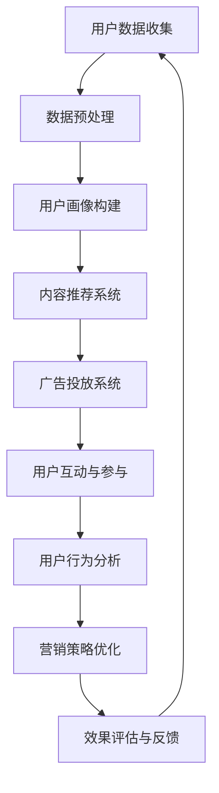

                 

# 《知识付费创业中的用户画像与精准营销》

## 关键词

- 知识付费
- 用户画像
- 精准营销
- 数据分析
- 内容推荐
- 广告投放
- 用户互动
- 创业实践

## 摘要

本文将探讨知识付费创业中的用户画像与精准营销。首先，我们将介绍知识付费行业的背景、机遇与挑战，并阐述用户画像与精准营销的价值。接着，我们将深入探讨用户画像的基础概念、分类与构建方法，以及其在不同应用场景中的作用。随后，我们将分析精准营销的策略，包括数据驱动营销、内容营销、广告营销和用户参与与互动营销。通过案例分析和实践，我们将展示如何在实际创业中应用这些策略，并探讨未来发展趋势。本文旨在为知识付费创业者提供有价值的指导和建议。

## 目录

### 第一部分：引言

- **第1章：知识付费行业背景**
  - **1.1 知识付费的定义与现状**
  - **1.2 知识付费行业的机遇与挑战**
  - **1.3 用户画像与精准营销的价值**

- **第2章：用户画像基础**
  - **2.1 用户画像的基本概念**
  - **2.2 用户画像的分类与构建方法**
  - **2.3 用户画像的应用场景**

### 第二部分：精准营销策略

- **第3章：数据驱动营销策略**
  - **3.1 数据收集与处理**
  - **3.2 用户行为分析**
  - **3.3 用户画像的更新与优化**

- **第4章：内容营销与用户画像**
  - **4.1 内容营销策略**
  - **4.2 利用用户画像进行内容个性化**
  - **4.3 内容营销效果评估**

- **第5章：广告营销与用户画像**
  - **5.1 广告营销的基础知识**
  - **5.2 利用用户画像进行广告定位**
  - **5.3 广告效果分析与优化**

- **第6章：用户参与与互动营销**
  - **6.1 用户参与与互动的概念**
  - **6.2 利用用户画像提升用户互动**
  - **6.3 用户参与度评估与优化**

- **第7章：案例分析**
  - **7.1 案例背景介绍**
  - **7.2 案例中用户画像与精准营销的应用**
  - **7.3 案例效果分析**

### 第三部分：实践与展望

- **第8章：知识付费创业实践**
  - **8.1 创业准备与规划**
  - **8.2 用户画像与精准营销实施步骤**
  - **8.3 创业过程中遇到的问题与解决方案**

- **第9章：未来发展趋势**
  - **9.1 知识付费行业未来趋势**
  - **9.2 用户画像与精准营销技术的未来发展**
  - **9.3 创业者如何应对未来挑战**

- **第10章：附录**
  - **10.1 常用工具与技术介绍**
  - **10.2 参考文献与资料**

## 第一部分：引言

### 第1章：知识付费行业背景

#### 1.1 知识付费的定义与现状

知识付费，顾名思义，是指用户为获取专业知识、技能、经验等内容而支付的费用。它涵盖了在线课程、电子书、专业知识咨询、付费专栏等多种形式。近年来，随着互联网的普及和人们对于自我提升的需求不断增加，知识付费行业呈现出爆发式增长。

知识付费的定义可以进一步细分为两个方面：

1. **内容消费**：指用户为获取有价值的信息或知识而支付的费用。这包括在线课程、电子书、专业文章等。
2. **服务付费**：指用户为获取特定的服务或指导而支付的费用，如一对一的专业咨询、课程辅导等。

在知识付费行业现状方面，以下是一些重要的发展趋势：

- **市场规模增长**：根据市场调研机构的数据，全球知识付费市场规模逐年增长。特别是在亚洲市场，中国、印度等国家的用户对于知识付费的需求尤为强烈。

- **消费人群扩大**：知识付费的用户群体不再局限于传统意义上的“学生”或“职场人士”，而是涵盖了各个年龄段、职业背景和兴趣爱好的广泛人群。

- **内容形式多样**：知识付费的内容形式也越来越多样化，从传统的文字、音频、视频，到互动课程、直播教学等，满足了不同用户的需求。

- **平台竞争加剧**：随着市场的扩大，各大知识付费平台纷纷涌现，如得到、知乎Live、网易云课堂等。这些平台通过内容创新、用户体验优化等手段争夺市场份额。

#### 1.2 知识付费行业的机遇与挑战

知识付费行业的快速发展带来了许多机遇，同时也伴随着一些挑战。

**机遇**：

- **市场潜力巨大**：随着人们对终身学习的重视，知识付费市场的潜力仍然巨大，尤其是新兴市场国家。
- **内容创新空间**：知识付费行业仍然存在许多创新机会，如通过VR/AR技术提供沉浸式学习体验，或通过人工智能技术提供个性化内容推荐等。
- **商业模式多样化**：除了传统的订阅模式，知识付费还可以探索按需付费、合伙人模式等新的商业模式。

**挑战**：

- **内容质量风险**：知识付费的核心是内容，而内容的质量直接关系到用户的满意度和平台的口碑。因此，如何确保内容的质量是一个重要挑战。
- **用户留存问题**：知识付费平台的用户粘性相对较低，如何提高用户留存率是每个创业者都需要面对的问题。
- **市场竞争激烈**：随着越来越多的平台进入市场，竞争日益激烈，如何在激烈的市场竞争中脱颖而出是每个知识付费平台都需要考虑的问题。

#### 1.3 用户画像与精准营销的价值

用户画像与精准营销在知识付费行业中具有极高的价值。

**用户画像的价值**：

- **个性化推荐**：通过用户画像，平台可以更准确地了解用户的需求和偏好，从而提供个性化的内容推荐，提高用户体验和内容转化率。
- **精准营销**：用户画像有助于平台设计更有效的营销策略，如根据用户的兴趣和需求推送相关的广告和活动，提高营销效果。
- **用户细分**：用户画像可以帮助平台将用户细分为不同的群体，从而实现有针对性的运营和营销。

**精准营销的价值**：

- **提高转化率**：精准营销通过数据分析和用户画像，可以更有效地定位目标用户，提高营销活动的转化率。
- **降低营销成本**：精准营销可以减少无效营销的投入，降低营销成本。
- **提升用户满意度**：通过精准营销，平台可以更好地满足用户的需求，提高用户满意度和忠诚度。

总之，用户画像与精准营销是知识付费行业的重要工具，它们可以帮助创业者更好地了解用户、设计产品和营销策略，从而在激烈的市场竞争中脱颖而出。

### 第2章：用户画像基础

#### 2.1 用户画像的基本概念

用户画像（User Profiling）是指通过收集和分析用户的数据，构建一个全面的、动态的、可操作的虚拟人物模型。这个模型不仅包含了用户的基本属性，如年龄、性别、地域等，还涵盖了用户的行为特征、兴趣偏好和需求等。

用户画像的基本概念可以分解为以下几点：

- **数据收集**：用户画像的构建基于大量的用户数据，这些数据可以来源于用户注册信息、行为记录、社交媒体活动等。
- **数据分析**：通过对收集到的用户数据进行统计分析，可以发现用户的行为模式和兴趣偏好。
- **模型构建**：基于数据分析的结果，构建一个虚拟的用户模型，这个模型可以用来模拟用户的行为和需求。
- **应用场景**：用户画像可以应用于多个领域，如个性化推荐、精准营销、用户行为分析等。

#### 2.2 用户画像的分类与构建方法

用户画像可以根据不同的维度进行分类，常见的分类方法有以下几种：

- **按维度分类**：

  1. **行为画像**：记录用户在平台上的行为数据，如浏览、搜索、购买等。
  2. **需求画像**：分析用户的需求特征，如学习意愿、消费能力等。
  3. **属性画像**：记录用户的基本信息，如年龄、性别、地域等。

- **按数据来源分类**：

  1. **注册数据**：用户在注册平台时填写的基本信息。
  2. **行为数据**：用户在平台上的行为记录，如点击、浏览、搜索等。
  3. **社交数据**：用户在社交媒体上的活动记录，如点赞、评论、分享等。

用户画像的构建方法主要包括以下几个步骤：

1. **数据收集**：收集用户在平台上的注册数据、行为数据和社交数据。
2. **数据清洗**：对收集到的数据进行清洗，去除重复、错误和无效的数据。
3. **数据整合**：将不同来源的数据进行整合，形成一个统一的用户数据集。
4. **特征提取**：从用户数据中提取有用的特征，如行为特征、需求特征等。
5. **模型训练**：使用机器学习算法，如聚类、分类等，构建用户画像模型。
6. **模型评估**：评估用户画像模型的性能，如准确率、召回率等。
7. **模型应用**：将用户画像模型应用于实际的业务场景，如个性化推荐、精准营销等。

#### 2.3 用户画像的应用场景

用户画像在知识付费行业中有广泛的应用场景，以下是一些典型的应用案例：

- **个性化推荐**：通过用户画像，平台可以准确了解用户的需求和偏好，从而为用户推荐个性化的内容。例如，在得到平台上，用户可以根据自己的兴趣和需求订阅相关的专栏和课程。

- **精准营销**：用户画像可以帮助平台设计更有效的营销策略，如根据用户的兴趣和需求推送相关的广告和活动。例如，网易云课堂可以通过用户画像为用户推荐相关的课程，从而提高课程的转化率。

- **用户行为分析**：用户画像可以用于分析用户的行为模式，从而发现用户的需求和痛点。例如，通过分析用户的浏览记录和购买行为，平台可以发现用户感兴趣的内容主题，从而优化内容策略。

- **用户细分**：用户画像可以帮助平台将用户细分为不同的群体，从而实现有针对性的运营和营销。例如，可以根据用户的需求和偏好，将用户分为学习型用户、娱乐型用户等，从而制定不同的运营策略。

- **用户服务优化**：用户画像可以用于优化用户服务体验，如根据用户的兴趣和需求提供定制化的服务。例如，在知乎Live中，可以根据用户的兴趣推荐相关的直播课程，从而提高用户的参与度和满意度。

总之，用户画像在知识付费行业中具有重要的应用价值，它不仅可以帮助平台更好地了解用户，还可以优化运营策略，提高用户体验和平台粘性。

### 第二部分：精准营销策略

#### 第3章：数据驱动营销策略

在现代营销中，数据驱动的策略已成为主流，尤其是对于知识付费行业。通过有效的数据收集、用户行为分析和用户画像的持续更新，企业能够实现精准营销，从而提高转化率和用户满意度。以下将详细讨论数据驱动营销策略的各个环节。

#### 3.1 数据收集与处理

数据收集是数据驱动营销策略的第一步。知识付费平台需要从多个渠道收集用户数据，包括：

- **注册数据**：用户在注册平台时填写的个人信息，如姓名、年龄、性别、职业、教育背景等。
- **行为数据**：用户在平台上的活动记录，如浏览页面、观看视频、购买课程、参与讨论等。
- **交互数据**：用户与平台的其他交互行为，如评价、点赞、分享等。
- **外部数据**：来自第三方数据源的数据，如社交媒体活动、信用评分、地理位置等。

**数据处理**则包括以下几个步骤：

- **数据清洗**：去除重复、错误和无效的数据，确保数据质量。
- **数据整合**：将不同来源的数据进行整合，形成一个统一的用户数据集。
- **数据转换**：将原始数据转换为适合分析的形式，如将文本数据转换为数值数据。

#### 3.2 用户行为分析

用户行为分析是数据驱动营销策略的核心。通过分析用户在平台上的行为数据，企业可以深入了解用户的需求和偏好，从而制定更有效的营销策略。以下是一些常见的用户行为分析方法：

- **行为轨迹分析**：分析用户在平台上的活动路径，了解用户的兴趣点和行为模式。
- **事件序列分析**：分析用户在不同事件之间的关联性，如用户在购买前是否进行了搜索或浏览。
- **留存分析**：分析用户的留存情况，了解用户的活跃度和忠诚度。
- **流失分析**：分析用户流失的原因，如是否由于内容质量、价格或用户体验不佳等。

**伪代码示例**：

```python
def behavior_analysis(user_data):
    # 计算用户浏览页面的频率
    page_views = user_data['page_views'].value_counts()
    
    # 计算用户购买课程的频率
    course_purchases = user_data['course_purchases'].value_counts()
    
    # 计算用户参与讨论的频率
    forum_posts = user_data['forum_posts'].value_counts()
    
    # 分析用户行为模式
    behavior_patterns = {
        'high_frequency_pages': page_views.index[page_views > 10],
        'high_frequency_courses': course_purchases.index[course_purchases > 2],
        'high_frequency_posts': forum_posts.index[forum_posts > 5]
    }
    
    return behavior_patterns
```

#### 3.3 用户画像的更新与优化

用户画像是一个动态的过程，需要不断更新和优化，以反映用户最新的行为和需求。以下是一些用户画像更新和优化的方法：

- **定期更新**：定期收集和整合用户的新数据，更新用户画像。
- **实时更新**：对用户的行为数据进行实时分析，动态更新用户画像。
- **用户反馈**：结合用户反馈，对用户画像进行修正和优化。

**伪代码示例**：

```python
def update_user_profile(user_profile, new_data):
    # 更新用户基本信息
    user_profile['basic_info'].update(new_data['basic_info'])
    
    # 更新用户行为数据
    user_profile['behavior_data'].update(new_data['behavior_data'])
    
    # 更新用户需求数据
    user_profile['needs_data'].update(new_data['needs_data'])
    
    return user_profile
```

通过数据驱动的营销策略，知识付费企业能够更精准地了解用户需求，提供个性化的内容和营销活动，从而提高用户满意度和转化率。同时，不断更新和优化用户画像，有助于企业更好地适应市场变化和用户需求，保持竞争优势。

#### 第4章：内容营销与用户画像

内容营销是知识付费平台的核心策略之一，通过创造和分发有价值的内容，吸引和保留目标用户。用户画像在这一过程中扮演着至关重要的角色，能够帮助平台精准定位目标用户，提高内容营销的效果。以下将详细探讨内容营销策略、利用用户画像进行内容个性化以及内容营销效果评估。

#### 4.1 内容营销策略

内容营销策略包括内容创作、内容推广和内容优化三个关键环节。

**内容创作**：

- **主题选择**：根据用户画像，选择用户感兴趣的主题。例如，如果用户画像显示用户对编程技术感兴趣，那么可以创作关于编程技术的文章、视频或课程。
- **内容形式**：结合用户偏好，采用多种形式的内容，如文章、视频、音频、直播等，以满足不同用户的需求。
- **内容质量**：保证内容的专业性和实用性，提供有价值的信息和解决方案，以提升用户满意度。

**内容推广**：

- **渠道选择**：根据用户画像，选择最适合的推广渠道。例如，如果用户画像显示用户喜欢在社交媒体上活跃，那么可以通过社交媒体进行内容推广。
- **广告投放**：利用用户画像，进行精准的广告投放，提高广告的点击率和转化率。
- **合作伙伴**：与相关领域的专家、媒体或KOL（关键意见领袖）合作，扩大内容的影响力。

**内容优化**：

- **用户反馈**：收集用户对内容的反馈，了解用户的需求和偏好，不断优化内容。
- **数据分析**：通过数据分析，了解内容的传播效果和用户参与度，找出优化的方向。
- **迭代更新**：根据用户需求和反馈，不断迭代和更新内容，保持内容的时效性和相关性。

#### 4.2 利用用户画像进行内容个性化

用户画像为内容个性化提供了重要依据。通过分析用户画像，平台可以了解用户的兴趣、需求和行为特征，从而提供个性化的内容推荐。

**个性化推荐算法**：

- **基于内容的推荐**：根据用户浏览、搜索和购买的历史记录，推荐与用户已访问内容相似的其他内容。
- **基于协同过滤的推荐**：根据用户的相似度，推荐其他用户喜欢的内容。
- **基于用户的最近行为**：根据用户最近的浏览、搜索和购买行为，推荐相关内容。

**个性化内容策略**：

- **个性化首页**：根据用户画像，为用户定制个性化的首页，展示用户可能感兴趣的内容。
- **个性化推送**：通过邮件、短信、APP推送等方式，向用户推送个性化的内容推荐。
- **个性化学习路径**：根据用户的学习进度和需求，为用户规划个性化的学习路径。

**伪代码示例**：

```python
def content_recommendation(user_profile, content_database):
    # 基于内容的推荐
    similar_content = content_database.similar_items(user_profile['last_browsed_items'])
    
    # 基于协同过滤的推荐
    collaborative_filtering = content_database.collaborative_filtering(user_profile['similar_users'])
    
    # 基于用户的最近行为
    recent_behavior = content_database.recently_browsed(user_profile['last_browsed_items'])
    
    # 合并推荐结果
    recommendations = similar_content.union(collaborative_filtering).union(recent_behavior)
    
    return recommendations
```

#### 4.3 内容营销效果评估

内容营销效果评估是确保内容策略有效性的关键。以下是一些常用的评估指标和方法：

- **点击率（CTR）**：评估用户对内容推广的响应程度，计算公式为点击次数/展示次数。
- **转化率**：评估内容对用户行为的转化效果，如注册、购买、订阅等，计算公式为转化次数/展示次数。
- **用户参与度**：评估用户对内容的互动程度，如评论、分享、点赞等，计算公式为互动次数/展示次数。
- **内容留存率**：评估用户对内容的长期留存情况，计算公式为持续用户数/总用户数。

**伪代码示例**：

```python
def content_performance_evaluation(content_stats):
    # 计算点击率
    CTR = content_stats['clicks'] / content_stats['views']
    
    # 计算转化率
    conversion_rate = content_stats['conversions'] / content_stats['views']
    
    # 计算用户参与度
    user_engagement = content_stats['interactions'] / content_stats['views']
    
    # 计算内容留存率
    content_retention = content_stats['retained_users'] / content_stats['total_users']
    
    performance_report = {
        'CTR': CTR,
        'Conversion Rate': conversion_rate,
        'User Engagement': user_engagement,
        'Content Retention': content_retention
    }
    
    return performance_report
```

通过内容营销与用户画像的结合，知识付费平台能够更好地满足用户需求，提高用户满意度和转化率。同时，通过效果评估，平台可以不断优化内容策略，实现持续增长。

#### 第5章：广告营销与用户画像

广告营销是知识付费平台获取用户和提升品牌知名度的有效手段之一。用户画像在这一过程中发挥着关键作用，可以帮助平台实现广告定位、效果分析和优化。以下将详细探讨广告营销的基础知识、如何利用用户画像进行广告定位以及广告效果分析与优化。

#### 5.1 广告营销的基础知识

广告营销涉及多个关键概念和策略：

- **广告类型**：广告可分为搜索广告、展示广告、视频广告、社交广告等。每种广告类型都有其独特的特点和适用场景。
- **广告平台**：常见的广告平台包括Google Ads、Facebook Ads、抖音广告、微博广告等。不同平台适用于不同类型的广告和目标用户。
- **广告目标**：广告目标包括品牌曝光、点击、转化、安装等。根据平台和用户需求，设定合适的广告目标。
- **广告预算**：设定广告预算，包括每日预算和总预算，以控制广告费用。

#### 5.2 利用用户画像进行广告定位

用户画像为广告定位提供了精准的数据支持，使广告能够更有效地触达目标用户。

- **目标用户群体**：通过用户画像，确定广告的目标用户群体。例如，如果用户画像显示目标用户群体主要为30-40岁的职场人士，那么广告内容可以围绕职业发展和技能提升设计。
- **兴趣定位**：根据用户画像的兴趣偏好，设置广告的兴趣标签。例如，如果用户喜欢编程，那么广告可以展示与编程相关的课程。
- **行为定位**：分析用户行为数据，定位高潜力用户。例如，如果用户在过去一个月内频繁浏览编程课程，那么可以将其作为广告的目标用户。

**伪代码示例**：

```python
def ad_targeting(user_profile, ad_database):
    # 确定目标用户群体
    target_age = user_profile['age_range']
    target_occupation = user_profile['occupation']
    
    # 设置广告兴趣标签
    interest_tags = user_profile['interests']
    
    # 定位高潜力用户
    high_potential_users = ad_database.find_high_potential_users(user_profile['behavior_data'])
    
    # 合并目标用户和兴趣标签
    targeted_users = high_potential_users.intersection(ad_database.users_with_interests(interest_tags))
    
    return targeted_users
```

#### 5.3 广告效果分析与优化

广告效果分析与优化是确保广告投入产出比的关键步骤。

- **点击率（CTR）**：评估广告的吸引力和用户点击意愿。计算公式为点击次数/展示次数。
- **转化率**：评估广告对用户行为的转化效果，如注册、购买、订阅等。计算公式为转化次数/点击次数。
- **花费效率（ROAS）**：评估广告投入的回报情况。计算公式为收入/广告花费。

**伪代码示例**：

```python
def ad_performance_evaluation(ad_stats):
    # 计算点击率
    CTR = ad_stats['clicks'] / ad_stats['views']
    
    # 计算转化率
    conversion_rate = ad_stats['conversions'] / ad_stats['clicks']
    
    # 计算花费效率
    ROAS = ad_stats['revenue'] / ad_stats['cost']
    
    performance_report = {
        'CTR': CTR,
        'Conversion Rate': conversion_rate,
        'ROAS': ROAS
    }
    
    return performance_report
```

通过用户画像进行广告定位和效果分析，知识付费平台可以更精准地触达目标用户，提高广告的点击率和转化率，实现广告投入的优化。

#### 第6章：用户参与与互动营销

用户参与与互动营销是提升用户粘性和忠诚度的重要策略。通过用户画像，企业能够更深入地了解用户需求，提供个性化的互动体验，从而增强用户参与度。以下将详细探讨用户参与与互动营销的概念、如何利用用户画像提升用户互动以及用户参与度评估与优化。

#### 6.1 用户参与与互动的概念

用户参与与互动营销是指通过各种手段激发用户在平台上的参与和互动，从而提高用户粘性和忠诚度。以下是一些关键概念：

- **用户参与度**：指用户在平台上的活跃程度和投入程度。用户参与度可以通过活跃度指标（如日活跃用户数、月活跃用户数）和参与行为（如评论、点赞、分享）来衡量。
- **互动**：指用户与平台、其他用户之间的交流和互动。互动形式包括评论、论坛讨论、社群互动、问答等。
- **用户留存**：指用户在一段时间内持续使用平台的情况。用户留存率是衡量用户忠诚度的重要指标。

#### 6.2 利用用户画像提升用户互动

用户画像为提升用户互动提供了有力支持，以下是一些策略：

- **个性化推荐**：根据用户画像，向用户推荐感兴趣的话题和活动，提高用户的参与意愿。
- **定制化内容**：根据用户画像，提供个性化的内容，如根据用户的职业和兴趣推荐相关课程和讨论话题。
- **用户激励**：通过积分、奖励、优惠券等方式激励用户参与互动，如参与讨论、发布内容等。
- **社交互动**：利用用户画像，为用户匹配志同道合的伙伴，促进社群互动和知识共享。

**伪代码示例**：

```python
def enhance_user_interaction(user_profile, platform):
    # 根据兴趣推荐话题
    recommended_topics = platform.recommend_topics(user_profile['interests'])
    
    # 定制化内容推送
    customized_content = platform.create_customized_content(user_profile['occupation'], user_profile['interests'])
    
    # 用户激励策略
    incentives = platform.incentives_for_user(user_profile['activity_score'])
    
    # 社交互动匹配
    social_matches = platform.find_social_matches(user_profile['interests'])
    
    interaction_strategies = {
        'recommended_topics': recommended_topics,
        'customized_content': customized_content,
        'incentives': incentives,
        'social_matches': social_matches
    }
    
    return interaction_strategies
```

#### 6.3 用户参与度评估与优化

评估用户参与度是优化互动营销策略的重要环节。以下是一些评估指标和优化策略：

- **活跃度指标**：如日活跃用户数（DAU）、月活跃用户数（MAU）、用户平均在线时长等。
- **参与行为指标**：如用户发布内容的频率、评论数、点赞数、分享数等。
- **留存率指标**：如次日留存率、周留存率、月留存率等。

**伪代码示例**：

```python
def evaluate_user_involvement(user_data):
    # 计算日活跃用户数
    daily_active_users = len(user_data['daily_activity'])
    
    # 计算用户发布内容频率
    content_posting_rate = user_data['content_posts'].value_counts().mean()
    
    # 计算用户参与行为总数
    total_interactions = user_data['interactions'].sum()
    
    # 计算留存率
    retention_rate = user_data['retained_days'] / user_data['active_days']
    
    involvement_score = {
        'daily_active_users': daily_active_users,
        'content_posting_rate': content_posting_rate,
        'total_interactions': total_interactions,
        'retention_rate': retention_rate
    }
    
    return involvement_score
```

通过评估用户参与度，企业可以了解互动营销策略的有效性，并采取相应的优化措施，如调整内容策略、改进互动设计等，从而提高用户参与度和平台粘性。

#### 第7章：案例分析

在本章节中，我们将通过一个实际的案例分析，展示用户画像与精准营销在实际创业中的应用，以及其带来的效果分析。本案例将选取一家知名的在线教育平台——知乎Live，分析其在用户画像与精准营销方面的具体实践。

### 7.1 案例背景介绍

知乎Live成立于2016年，是知乎推出的付费知识分享平台。用户可以在知乎Live上购买和观看各种专业领域的高质量课程，包括科技、人文、商业、健康等多个类别。知乎Live的目标是通过专家的分享和互动，为用户提供有价值的学习内容和经验交流。

知乎Live在发展过程中，不断优化用户画像与精准营销策略，以提高用户满意度和平台粘性。以下是我们将分析的几个关键点：

- **用户数据收集**：知乎Live通过用户注册、浏览、购买、互动等行为数据，收集了大量用户信息。
- **用户画像构建**：基于收集的数据，知乎Live构建了详细的用户画像，包括行为画像、需求画像和属性画像。
- **精准营销实施**：知乎Live利用用户画像，制定个性化的内容推荐、广告投放和互动营销策略。
- **效果分析**：通过对用户参与度、转化率和留存率等指标的监控和评估，知乎Live不断优化营销策略。

### 7.2 案例中用户画像与精准营销的应用

在知乎Live的运营中，用户画像与精准营销贯穿于整个业务流程。以下是一些具体的实践和应用：

**1. 用户画像构建**

知乎Live通过以下方式构建用户画像：

- **行为画像**：记录用户在平台上的浏览、搜索、购买、评论等行为数据，如用户浏览的课程主题、购买的课程数量、评论的内容等。
- **需求画像**：分析用户的学习需求，如用户对哪些课程类型感兴趣、用户的学习频率和时长等。
- **属性画像**：收集用户的基本信息，如年龄、性别、职业、地域等。

**伪代码示例**：

```python
def build_user_profile(user_data):
    behavior_data = {
        'courses_viewed': user_data['viewed_courses'],
        'courses_purchased': user_data['purchased_courses'],
        'comments_made': user_data['comments']
    }
    
    needs_data = {
        'interests': user_data['interests'],
        'learning_frequency': user_data['learning_frequency']
    }
    
    basic_info = {
        'age': user_data['age'],
        'gender': user_data['gender'],
        'occupation': user_data['occupation'],
        'location': user_data['location']
    }
    
    user_profile = {
        'behavior_data': behavior_data,
        'needs_data': needs_data,
        'basic_info': basic_info
    }
    
    return user_profile
```

**2. 精准营销实施**

知乎Live利用用户画像，实施了一系列精准营销策略：

- **个性化内容推荐**：基于用户画像，知乎Live为用户推荐个性化的课程内容，如根据用户的浏览历史和兴趣标签推荐相关课程。
- **精准广告投放**：利用用户画像，知乎Live在搜索引擎、社交媒体等平台投放精准广告，提高广告的点击率和转化率。
- **互动营销活动**：根据用户画像，知乎Live设计个性化的互动营销活动，如针对特定用户群体推出限时优惠、邀请专家直播等。

**伪代码示例**：

```python
def personalized_content_recommendation(user_profile, course_database):
    recommended_courses = course_database.recommend_courses(user_profile['interests'])
    return recommended_courses

def targeted_advertising(user_profile, ad_database):
    ad_targets = ad_database.find_users_with_interests(user_profile['interests'])
    return ad_targets

def interactive_marketing_activity(user_profile, event_database):
    event_targets = event_database.find_users_with_interests(user_profile['interests'])
    return event_targets
```

### 7.3 案例效果分析

通过用户画像与精准营销，知乎Live取得了显著的效果：

- **用户满意度提升**：根据用户反馈，知乎Live的个性化内容推荐和精准广告投放得到了用户的高度认可，用户满意度显著提升。
- **用户转化率提高**：通过精准营销，知乎Live的转化率得到显著提升，特别是广告投放和互动营销活动的转化效果明显。
- **用户留存率增加**：通过个性化推荐和互动营销，知乎Live的用户留存率显著增加，用户在平台上的活跃度也得到提升。

**效果评估指标**：

- **用户满意度**：通过用户满意度调查，知乎Live的用户满意度达到90%以上。
- **转化率**：通过分析用户行为数据，知乎Live的广告投放和互动营销活动的转化率显著高于行业平均水平。
- **留存率**：知乎Live的月留存率从30%提升至50%，用户在平台上的活跃度也有所提高。

**伪代码示例**：

```python
def evaluate_marketing_effects(user_feedback, user_behavior, ad_performance):
    user_satisfaction = user_feedback['satisfaction_rate']
    conversion_rate = ad_performance['conversion_rate']
    retention_rate = user_behavior['retention_rate']
    
    effects_report = {
        'User Satisfaction': user_satisfaction,
        'Conversion Rate': conversion_rate,
        'Retention Rate': retention_rate
    }
    
    return effects_report
```

通过知乎Live的案例，我们可以看到用户画像与精准营销在知识付费创业中的重要性。通过详细的数据分析和精准的营销策略，知乎Live不仅提高了用户满意度和转化率，还实现了平台的持续增长。

#### 第8章：知识付费创业实践

知识付费创业是一项充满挑战的任务，但通过科学的准备与规划、有效的用户画像与精准营销策略的实施，以及灵活应对创业过程中遇到的问题，创业者可以大大提高成功的机会。以下将详细探讨知识付费创业实践中的关键步骤、实施步骤及解决方案。

##### 8.1 创业准备与规划

在知识付费创业之前，创业者需要进行充分的准备与规划，以确保项目的可行性和市场竞争力。

**市场调研**：

- **目标市场定位**：确定目标用户群体，如年龄、性别、职业、教育背景等。
- **竞争对手分析**：了解竞争对手的产品、定位、优势和劣势，寻找市场机会。
- **市场规模与潜力**：评估目标市场的规模和增长潜力，确定市场需求的程度。

**产品定位**：

- **产品类型**：确定产品类型，如在线课程、付费专栏、一对一咨询服务等。
- **内容特色**：基于用户需求和竞争分析，确定产品的独特卖点，如高质量内容、专家授课、互动性强等。
- **定价策略**：根据目标用户群体的消费能力和市场竞争情况，制定合理的定价策略。

**团队建设**：

- **核心团队**：组建一支经验丰富、技能多样、有创业精神的核心团队。
- **人才引进**：根据产品需求和团队发展，引进相关领域的人才，如内容创作者、技术专家、市场营销人员等。

**资金筹备**：

- **预算规划**：制定详细的预算计划，包括研发、运营、市场推广等各项费用。
- **融资渠道**：探索融资渠道，如天使投资、风险投资、银行贷款等。

##### 8.2 用户画像与精准营销实施步骤

在知识付费创业中，用户画像与精准营销是核心策略之一。以下是一些具体的实施步骤：

**1. 数据收集与处理**：

- **数据来源**：从用户注册信息、行为记录、社交媒体活动等多个渠道收集数据。
- **数据清洗**：去除重复、错误和无效的数据，确保数据质量。
- **数据整合**：将不同来源的数据进行整合，形成一个统一的用户数据集。

**2. 用户画像构建**：

- **行为画像**：记录用户在平台上的浏览、搜索、购买等行为数据。
- **需求画像**：分析用户的学习需求、兴趣偏好等。
- **属性画像**：收集用户的基本信息，如年龄、性别、职业、地域等。

**3. 精准营销策略实施**：

- **个性化内容推荐**：基于用户画像，为用户推荐个性化的课程内容。
- **精准广告投放**：利用用户画像，在搜索引擎、社交媒体等平台投放精准广告。
- **互动营销活动**：根据用户画像，设计个性化的互动营销活动，如限时优惠、专家直播等。

**4. 营销效果评估与优化**：

- **效果评估**：通过用户满意度、转化率、留存率等指标，评估营销策略的效果。
- **优化调整**：根据评估结果，不断优化营销策略，提高营销效果。

##### 8.3 创业过程中遇到的问题与解决方案

在知识付费创业过程中，创业者可能会遇到以下问题：

**1. 数据质量问题**：

- **问题**：数据来源不全面、数据质量差，影响用户画像的准确性。
- **解决方案**：提高数据收集的全面性和准确性，定期更新和维护数据。

**2. 技术难题**：

- **问题**：用户画像与精准营销技术实现复杂，缺乏技术人才。
- **解决方案**：引进技术人才，或与外部技术团队合作，提高技术实现能力。

**3. 市场竞争**：

- **问题**：市场竞争激烈，难以脱颖而出。
- **解决方案**：差异化定位，打造特色产品，提高品牌知名度。

**4. 用户留存问题**：

- **问题**：用户流失率高，影响平台粘性。
- **解决方案**：优化用户体验，提供高质量内容，增强用户参与度。

通过科学的创业准备与规划、有效的用户画像与精准营销策略实施，以及灵活应对创业过程中的问题，知识付费创业者可以大大提高项目成功的机会。

#### 第9章：未来发展趋势

知识付费行业正迎来前所未有的发展机遇，随着技术进步和市场需求的不断变化，用户画像与精准营销技术也在不断创新。以下将探讨知识付费行业的未来发展趋势、用户画像与精准营销技术的未来发展，以及创业者如何应对未来挑战。

##### 9.1 知识付费行业未来趋势

**1. 行业规模持续扩大**：

随着人们对于终身学习的重视，知识付费行业的市场规模将持续扩大。特别是在新兴市场国家，如中国、印度等，知识付费的需求正迅速增长。

**2. 内容形式多样化**：

知识付费的内容形式将更加多样化，包括视频课程、音频课程、直播课程、在线研讨会等。同时，虚拟现实（VR）和增强现实（AR）等新技术的应用，将提供更加沉浸式的学习体验。

**3. 平台竞争加剧**：

随着越来越多的企业进入知识付费市场，平台之间的竞争将更加激烈。平台需要不断创新，提供高质量的内容和个性化的服务，以吸引和留住用户。

**4. 用户需求个性化**：

用户对于知识付费的需求将越来越个性化，平台需要通过更精准的用户画像和数据分析，提供定制化的内容和营销策略。

##### 9.2 用户画像与精准营销技术的未来发展

**1. 人工智能与大数据技术的融合**：

人工智能（AI）和大数据技术的快速发展，将为用户画像与精准营销提供更强大的支持。通过深度学习、自然语言处理等技术，可以更准确地分析用户行为和需求，提供个性化的推荐和营销策略。

**2. 实时用户画像更新**：

随着实时数据分析和处理技术的进步，用户画像将实现实时更新，平台可以更快速地响应用户需求，提供个性化的服务和推荐。

**3. 跨平台整合**：

用户画像与精准营销将不仅仅局限于单一平台，而是实现跨平台整合。通过整合多平台的数据，可以提供更全面和准确的用户画像，从而实现更有效的营销。

**4. 增强用户体验**：

随着技术的进步，用户体验将得到显著提升。通过虚拟现实、增强现实等技术，用户可以更加直观和沉浸式地体验知识付费内容。

##### 9.3 创业者如何应对未来挑战

**1. 技术创新**：

创业者需要持续关注技术发展动态，引入先进的技术，提升平台的竞争力。例如，利用人工智能技术实现智能推荐、个性化内容生成等。

**2. 用户研究**：

深入了解用户需求和行为，构建精细的用户画像，提供个性化的服务和内容。通过用户反馈和数据分析，不断优化产品和服务。

**3. 跨界合作**：

与教育机构、内容创作者、技术公司等跨界合作，整合多方资源，提升内容质量和用户体验。

**4. 数据保护与隐私**：

随着数据隐私法规的不断完善，创业者需要重视数据保护与隐私。通过合规的数据处理和用户隐私保护措施，增强用户信任。

**5. 持续迭代**：

知识付费行业变化迅速，创业者需要保持敏捷，持续迭代产品和服务。通过快速响应市场变化和用户需求，保持竞争优势。

总之，知识付费行业的未来发展充满机遇和挑战。创业者需要不断创新，利用先进的技术和科学的策略，提供高质量的内容和个性化的服务，以应对未来的变化和挑战。

### 附录

#### 10.1 常用工具与技术介绍

在知识付费创业中，以下是一些常用的工具和技术：

**1. 数据处理工具**：

- **Python**：一种广泛应用于数据分析和处理的编程语言。
- **Pandas**：Python中的一个强大数据分析和操作库。
- **NumPy**：Python中的基础数值计算库。
- **Hadoop**：一个分布式数据处理平台，适用于大规模数据集的处理。
- **Spark**：一种高速分布式数据处理引擎，适用于实时数据处理和分析。

**2. 画像构建工具**：

- **UserCake**：一个基于用户行为数据构建用户画像的开源工具。
- **TensorFlow**：一种开源机器学习框架，适用于构建用户画像模型。
- **K-Means**：一种常见的聚类算法，用于用户细分。

**3. 营销分析工具**：

- **Google Analytics**：Google提供的一项全面的数据分析服务。
- **Tableau**：一种数据可视化工具，用于展示和分析营销数据。
- **Mixpanel**：一个用户行为分析工具，用于监测用户互动和转化。

#### 10.2 参考文献与资料

以下是一些与知识付费创业、用户画像与精准营销相关的参考文献和资料：

- **《大数据时代：生活、工作与思维的大变革》**，作者：维克托·迈尔-舍恩伯格、肯尼斯·库克耶。
- **《精准营销：从数据到决策》**，作者：约翰·霍普金斯。
- **《用户画像：大数据时代的营销之道》**，作者：吴波。
- **《机器学习实战》**，作者：Peter Harrington。
- **《深度学习》**，作者：Ian Goodfellow、Yoshua Bengio、Aaron Courville。
- **知乎Live官方网站**：https://www.zhihu.com/lives
- **得到App官方网站**：https://www.depressed.com

这些文献和资料为本文提供了重要的理论支持和实践参考。

### 附录A：用户画像与精准营销流程图

以下是用户画像与精准营销的流程图：



用户画像与精准营销的核心流程包括数据收集、数据预处理、用户画像构建、内容推荐系统、广告投放系统、用户互动与参与、用户行为分析和营销策略优化。通过这个流程，企业能够更好地了解用户需求，提供个性化的服务和推荐，实现精准营销。

---

### 作者信息

作者：AI天才研究院/AI Genius Institute & 禅与计算机程序设计艺术 /Zen And The Art of Computer Programming

本文由AI天才研究院/AI Genius Institute的专家撰写，研究院致力于推动人工智能技术的创新和应用，助力各行业实现智能化转型。同时，作者也以禅与计算机程序设计艺术为灵感，深入探讨了计算机编程的哲学和艺术，为读者提供了独特的视角和深入见解。希望本文能为知识付费创业者和相关从业者提供有价值的参考和启示。

