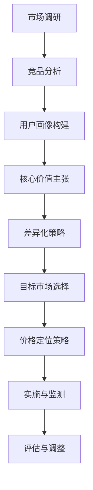

                 

### 《知识付费创业的产品定位策略》

> 关键词：知识付费、产品定位、市场研究、用户需求、差异化策略

> 摘要：本文将探讨知识付费创业中的产品定位策略，通过市场与用户研究、产品定位策略、产品定位实战等多个方面，详细分析如何制定有效的产品定位策略，以在竞争激烈的市场中脱颖而出。

#### 第一部分：市场与用户研究

##### 第1章：知识付费市场概述

###### 1.1 知识付费的发展历程

知识付费作为一种商业模式，起源于20世纪末互联网的兴起。随着互联网技术的发展，信息传播变得更加便捷，人们获取知识的途径也越来越多样化。在这个过程中，知识付费逐渐成为了一种重要的商业模式。最早的例子可以追溯到在线课程和电子书的销售，随着移动互联网的普及，知识付费市场得到了快速发展。

在2010年前后，知识付费市场主要集中在一部分专业人士和学术领域。这些用户通过购买专业书籍、在线课程和学术论文来提升自己的专业素养。随着智能手机的普及，知识付费市场进一步扩展，涵盖了更多的用户群体。如今，知识付费已经成为一种普遍现象，包括在线课程、付费问答、知识分享平台等多个方面。

###### 1.2 知识付费市场的现状

当前，知识付费市场呈现出以下特点：

1. **市场规模扩大**：随着用户需求的增加和互联网技术的进步，知识付费市场正在不断扩大。根据相关数据显示，我国知识付费市场规模已经超过了2000亿元，并且预计在未来几年内还将保持高速增长。

2. **用户群体多样化**：知识付费的用户群体已经不再局限于专业人士和学术领域，而是涵盖了各个年龄段、不同职业背景的用户。尤其是在年轻一代中，知识付费已经成为一种生活方式。

3. **平台多样化**：知识付费平台种类繁多，包括在线教育平台、问答平台、知识分享社区等。这些平台各具特色，满足了用户多样化的需求。

4. **内容丰富化**：知识付费内容越来越丰富，涵盖了各个领域，从专业技能培训到兴趣爱好培养，从知识普及到深度研究，几乎无所不包。

###### 1.3 知识付费市场的趋势

未来，知识付费市场将继续保持快速增长，并呈现出以下趋势：

1. **个性化服务**：随着大数据和人工智能技术的发展，知识付费平台将能够更好地了解用户需求，提供更加个性化的服务。

2. **细分市场崛起**：随着市场的进一步细分，知识付费将涌现出更多垂直领域的平台，满足用户在特定领域的需求。

3. **跨界合作**：知识付费平台将与其他行业进行跨界合作，如文化产业、旅游行业等，拓展新的商业模式。

4. **国际化发展**：随着全球化的进程，知识付费市场将逐渐走向国际化，吸引更多的国际用户。

##### 第2章：目标用户分析

###### 2.1 用户需求调研方法

了解用户需求是制定产品定位策略的重要基础。为了准确把握用户需求，我们可以采用以下几种调研方法：

1. **问卷调查**：问卷调查是一种简单有效的方法，可以通过线上或线下渠道收集用户意见。在设计问卷时，应确保问题具有针对性和科学性，以便获取有价值的数据。

2. **访谈法**：访谈法适用于深入了解用户需求。通过与用户进行面对面的交流，可以获取更深入、细致的信息。在进行访谈时，应注重沟通技巧，以获取真实、客观的信息。

3. **用户行为分析**：通过分析用户在知识付费平台上的行为数据，可以了解用户的偏好和需求。例如，分析用户浏览、购买、评价等行为，可以得出用户的兴趣点和痛点。

4. **焦点小组**：焦点小组是一种小组讨论的形式，可以集中讨论用户需求。在焦点小组中，参与者通常是在某个领域有共同兴趣或需求的人，他们可以就特定话题展开深入讨论。

###### 2.2 用户画像构建

用户画像是一种通过数据分析构建的用户特征模型，用于描述用户在知识付费场景下的行为特征和需求。构建用户画像通常包括以下步骤：

1. **数据收集**：收集用户在知识付费平台上的行为数据，如浏览、购买、评价等。

2. **数据清洗**：对收集到的数据进行清洗，去除无效和重复的数据。

3. **特征提取**：从清洗后的数据中提取用户特征，如年龄、性别、职业、教育背景、兴趣爱好等。

4. **模型构建**：使用统计学方法或机器学习算法构建用户画像模型，对用户进行分类和标签化。

5. **模型评估**：对用户画像模型进行评估，确保其准确性和可靠性。

通过用户画像，知识付费平台可以更好地了解用户需求，提供个性化的推荐和服务。

###### 2.3 用户行为分析

用户行为分析是了解用户需求的重要手段。通过分析用户在知识付费平台上的行为，可以揭示用户的兴趣、偏好和痛点。以下是一些常用的用户行为分析方法：

1. **行为轨迹分析**：分析用户在平台上的行为轨迹，如浏览路径、购买流程等。通过行为轨迹分析，可以了解用户的决策过程和行为模式。

2. **热点分析**：通过对用户行为数据的热点分析，可以找出用户最关注的领域和内容。例如，分析用户在评论区、问答区等互动区域的活跃程度，可以揭示用户的热点话题。

3. **流失用户分析**：通过对流失用户的行为分析，可以找出导致用户流失的原因。例如，分析用户在平台上的停留时间、购买频率等指标，可以揭示用户流失的预警信号。

4. **留存用户分析**：通过对留存用户的行为分析，可以了解用户对平台的满意度和忠诚度。例如，分析用户在平台上的活跃程度、评价等指标，可以评估用户对平台的满意度。

通过用户行为分析，知识付费平台可以不断优化产品和服务，提高用户满意度和留存率。

#### 第二部分：产品定位策略

##### 第3章：核心价值主张

###### 3.1 什么是核心价值主张

核心价值主张（Value Proposition）是指产品或服务为用户提供的独特价值和利益，它是产品定位策略的核心。一个良好的核心价值主张应明确、简洁、具有吸引力，能够直接回答用户的问题：“为什么用户应该选择我们的产品或服务？”

核心价值主张包括以下几个方面：

1. **用户需求**：明确产品或服务解决的用户问题和满足的用户需求。

2. **独特卖点**：突出产品或服务的独特性和竞争优势，如技术优势、品牌优势、服务优势等。

3. **用户收益**：阐述用户通过使用产品或服务将获得的直接和间接收益。

4. **用户痛点**：指出产品或服务解决的特定用户痛点，以及与现有解决方案的区别。

###### 3.2 构建核心价值主张的方法

构建核心价值主张的方法主要包括以下几种：

1. **用户需求调研**：通过问卷调查、访谈、用户行为分析等方法，深入了解用户需求和痛点。

2. **竞品分析**：分析竞争对手的产品或服务，找出他们的优势和不足，为构建核心价值主张提供参考。

3. **SWOT分析**：对自身的优势（Strengths）、劣势（Weaknesses）、机会（Opportunities）和威胁（Threats）进行综合分析，明确产品或服务的定位和发展方向。

4. **用户体验**：从用户的角度出发，思考产品或服务如何更好地满足用户需求，提升用户体验。

5. **团队讨论**：组织团队内部讨论，汇集多方意见和创意，形成核心价值主张的初步方案。

6. **迭代优化**：根据用户反馈和市场变化，不断迭代和优化核心价值主张，确保其与用户需求和市场环境保持一致。

###### 3.3 核心价值主张的案例分析

以下是一个知识付费平台的核心价值主张案例：

**核心价值主张**：“一站式学习平台，帮助用户快速提升专业技能，让学习变得更简单、更高效。”

**用户需求**：在竞争激烈的市场中，用户需要快速提升专业技能，以满足职业发展需求。

**独特卖点**：平台汇集了众多知名讲师和优质课程，采用个性化推荐算法，为用户提供精准的学习路径。

**用户收益**：通过平台学习，用户可以节省时间，提高学习效率，快速提升专业技能。

**用户痛点**：现有学习平台课程质量参差不齐，用户难以找到适合自己的学习资源。

**竞品分析**：与现有学习平台相比，本平台注重用户体验，课程内容更丰富、更实用，推荐算法更精准。

通过以上核心价值主张，该知识付费平台成功吸引了大量用户，并在市场上取得了良好的口碑。

##### 第4章：差异化策略

###### 4.1 差异化的重要性

差异化策略（Differentiation Strategy）是指企业通过提供独特的产品或服务，在竞争激烈的市场中脱颖而出的一种策略。在知识付费领域，差异化策略尤为重要，因为用户在选择产品时，往往更注重产品的独特价值和个性化体验。

差异化策略的重要性体现在以下几个方面：

1. **提高竞争力**：通过提供独特的价值，企业可以在激烈的市场竞争中占据有利地位。

2. **吸引和留住用户**：差异化策略能够满足用户多样化的需求，提高用户满意度和忠诚度。

3. **建立品牌优势**：差异化策略有助于企业建立独特的品牌形象，提升品牌知名度和美誉度。

4. **提高盈利能力**：差异化策略有助于企业提高产品附加值，从而提高盈利能力。

###### 4.2 差异化策略的类型

根据差异化策略的实施方式，可以分为以下几种类型：

1. **产品差异化**：通过提供独特的功能、设计、质量等，满足用户特定需求。

2. **服务差异化**：通过提供卓越的服务，如定制化服务、快速响应等，提升用户体验。

3. **品牌差异化**：通过塑造独特的品牌形象，如品牌故事、品牌理念等，吸引目标用户。

4. **渠道差异化**：通过建立独特的销售渠道，如线上、线下结合，满足用户多样化的购买需求。

5. **客户关系差异化**：通过建立紧密的客户关系，如提供个性化关怀、及时反馈等，提升用户满意度。

6. **技术差异化**：通过技术创新，提供领先的技术解决方案，满足用户对高科技的需求。

###### 4.3 差异化策略的实施步骤

要实施有效的差异化策略，可以遵循以下步骤：

1. **确定差异化方向**：根据市场调研和用户需求分析，确定产品或服务的差异化方向。

2. **评估差异化潜力**：对差异化方向进行评估，分析其可行性、成本和潜在收益。

3. **制定差异化方案**：根据差异化方向，制定具体的差异化方案，包括产品、服务、品牌、渠道等方面的策略。

4. **实施差异化策略**：将差异化方案转化为具体行动，确保差异化策略得到有效实施。

5. **监测和调整**：持续监测差异化策略的实施效果，根据市场变化和用户反馈进行优化和调整。

##### 第5章：目标市场选择

###### 5.1 目标市场的定义

目标市场（Target Market）是指企业计划进入和服务的市场，即企业打算通过满足特定需求来获取利润的市场。在知识付费领域，目标市场可以分为以下几种类型：

1. **广目标市场**：企业面向整个市场，为所有可能的用户群体提供产品或服务。

2. **窄目标市场**：企业专注于某个特定细分市场，为特定用户群体提供产品或服务。

3. **多层目标市场**：企业同时面向多个细分市场，为不同用户群体提供产品或服务。

4. **定制化目标市场**：企业根据用户需求，提供定制化的产品或服务。

选择目标市场时，需要考虑以下因素：

1. **市场规模**：目标市场的规模是否足够大，能否为企业带来足够的利润。

2. **市场增长**：目标市场的增长潜力，是否具有长期发展前景。

3. **竞争程度**：目标市场的竞争情况，是否具有较大的竞争压力。

4. **用户需求**：目标市场的用户需求是否明确，企业能否提供满足用户需求的产品或服务。

5. **资源能力**：企业是否有足够的资源和能力来满足目标市场的需求。

###### 5.2 目标市场选择标准

选择目标市场时，可以遵循以下标准：

1. **需求性**：目标市场是否有明显的用户需求，企业能否提供满足用户需求的产品或服务。

2. **可进入性**：目标市场是否容易进入，企业是否有足够的市场准入条件。

3. **盈利性**：目标市场是否具有盈利潜力，能否为企业带来足够的利润。

4. **稳定性**：目标市场是否稳定，是否受到外部因素影响较大。

5. **差异化**：目标市场是否具有差异化优势，企业能否在市场中脱颖而出。

6. **可控性**：目标市场是否可控，企业是否有足够的资源来管理和维护市场。

7. **竞争程度**：目标市场的竞争程度是否适中，企业能否在竞争中占据优势。

###### 5.3 目标市场的定位策略

目标市场选择后，需要制定具体的定位策略，确保企业能够在市场中占据有利地位。以下是一些常用的目标市场定位策略：

1. **市场细分**：根据用户需求、行为特征等因素，将市场划分为多个细分市场，为每个细分市场提供个性化的产品或服务。

2. **市场渗透**：通过提高市场份额，扩大目标市场的影响力。可以采取价格优势、广告宣传、促销活动等手段提高市场渗透率。

3. **市场拓展**：进入新的市场领域，开拓新的用户群体。可以通过市场调研、拓展渠道、合作联盟等方式实现市场拓展。

4. **市场保护**：采取措施保护现有市场，防止竞争对手入侵。可以采取防御性营销、技术壁垒、品牌建设等方式进行市场保护。

5. **市场多元化**：将业务拓展到多个市场领域，分散风险，提高企业的综合竞争力。

通过制定有效的目标市场定位策略，知识付费企业可以在竞争激烈的市场中占据有利地位，实现可持续发展。

##### 第6章：价格定位策略

###### 6.1 价格定位的概念

价格定位（Price Positioning）是指企业在市场竞争中确定产品或服务的价格，以吸引目标用户，实现利润最大化。在知识付费领域，价格定位至关重要，因为价格不仅影响用户购买决策，还影响企业在市场中的品牌形象和竞争力。

价格定位包括以下几个方面：

1. **价值导向**：根据产品或服务的价值，确定合理的价格水平。

2. **成本导向**：根据产品或服务的成本，加上一定的利润，确定价格。

3. **竞争导向**：根据竞争对手的价格水平，结合自身产品或服务的优势，确定价格。

4. **需求导向**：根据用户对产品或服务的需求强度，调整价格水平。

5. **心理导向**：根据用户的心理预期和感知价值，制定价格策略。

###### 6.2 价格定位策略的类型

根据价格定位策略的实施方式，可以分为以下几种类型：

1. **低价策略**：通过降低价格，吸引价格敏感型用户，提高市场份额。

2. **高价策略**：通过提高价格，树立高端品牌形象，满足追求品质的用户。

3. **中价策略**：在低价和高价之间找到一个平衡点，满足大多数用户的消费需求。

4. **捆绑销售**：将多个产品或服务组合在一起，以优惠价格销售，提高用户购买意愿。

5. **周期定价**：根据市场供需关系和季节变化，调整价格，提高销售额。

6. **个性化定价**：根据用户需求、购买历史等，为不同用户制定个性化的价格策略。

7. **补贴定价**：通过补贴、优惠券等形式，降低实际价格，吸引更多用户。

###### 6.3 价格定位策略的案例分析

以下是一个知识付费平台的价格定位策略案例：

**平台名称**：得到App

**价格定位策略**：

1. **价值导向**：得到App提供高质量的内容，包括音频课程、电子书等，用户购买后可以长期享受。

2. **中价策略**：得到App的价格水平在市场中处于中等位置，既能满足大多数用户的消费需求，又能保持一定的利润空间。

3. **周期定价**：得到App根据课程内容和市场需求，定期推出优惠活动，如限时折扣、团购等，吸引更多用户购买。

4. **个性化定价**：得到App根据用户的历史购买记录和偏好，为不同用户推荐适合的课程，并制定个性化的价格策略。

通过以上价格定位策略，得到App成功吸引了大量用户，并在知识付费市场中取得了良好的口碑。

##### 第7章：知识付费产品定位案例分析

###### 7.1 案例一：得到App

得到App是一款知识付费平台，提供包括音频课程、电子书、专栏等多种形式的内容。其产品定位策略如下：

1. **目标市场**：得到App主要面向职场人士和知识爱好者，提供专业领域的知识和技能培训。

2. **核心价值主张**：得到App强调高质量的内容和个性化的学习体验，帮助用户快速提升专业技能。

3. **差异化策略**：得到App通过独家课程、知名讲师、个性化推荐等手段，实现与竞争对手的差异化。

4. **价格定位**：得到App采用中价策略，价格适中，既能满足大多数用户的消费需求，又能保持一定的利润空间。

通过以上策略，得到App在知识付费市场中取得了良好的成绩，吸引了大量用户。

###### 7.2 案例二：喜马拉雅

喜马拉雅是一款音频分享平台，提供包括有声书、音频课程、广播剧等多种音频内容。其产品定位策略如下：

1. **目标市场**：喜马拉雅主要面向音频爱好者，提供多样化的音频内容。

2. **核心价值主张**：喜马拉雅强调丰富的音频资源和便捷的播放体验，让用户随时随地享受音乐和知识。

3. **差异化策略**：喜马拉雅通过独家版权、个性化推荐、社交互动等手段，实现与竞争对手的差异化。

4. **价格定位**：喜马拉雅采用低价策略，通过优惠活动、免费内容等形式，吸引更多用户。

通过以上策略，喜马拉雅在音频分享市场中取得了良好的口碑和市场份额。

###### 7.3 案例三：分答

分答是一款知识问答平台，提供付费问答服务。其产品定位策略如下：

1. **目标市场**：分答主要面向专业领域人士和求知者，提供专业知识的问答服务。

2. **核心价值主张**：分答强调快速、高效的问答服务，让用户能够快速获取专业知识和解答。

3. **差异化策略**：分答通过专业认证、高质量问答、个性化推荐等手段，实现与竞争对手的差异化。

4. **价格定位**：分答采用中价策略，价格适中，既能满足大多数用户的消费需求，又能保持一定的利润空间。

通过以上策略，分答在知识问答市场中取得了良好的成绩，吸引了大量用户。

##### 第8章：知识付费产品定位策略制定

###### 8.1 定位策略制定流程

制定知识付费产品定位策略需要遵循以下流程：

1. **市场调研**：通过问卷调查、访谈、用户行为分析等方法，深入了解市场需求和用户需求。

2. **竞品分析**：分析竞争对手的产品、服务、价格等，找出差异化点。

3. **用户画像**：根据市场调研和竞品分析，构建目标用户画像。

4. **价值主张**：明确产品的核心价值和独特卖点，形成核心价值主张。

5. **差异化策略**：根据用户需求和竞品分析，制定差异化策略。

6. **目标市场选择**：确定目标市场，选择合适的定位策略。

7. **价格定位**：根据市场需求、成本和竞争情况，制定价格定位策略。

8. **实施与监测**：将定位策略转化为具体行动，并持续监测和优化。

###### 8.2 定位策略制定工具与方法

在制定知识付费产品定位策略时，可以采用以下工具与方法：

1. **SWOT分析**：通过分析企业的优势、劣势、机会和威胁，明确产品的定位方向。

2. **STP营销理论**：包括市场细分（Segmentation）、目标市场选择（Targeting）和定位（Positioning），为产品定位提供理论依据。

3. **用户画像**：通过用户调研和数据分析，构建目标用户画像，为产品定位提供基础。

4. **价值工程**：通过分析产品的价值、成本和竞争力，制定合适的产品定位策略。

5. **竞争对手分析**：通过分析竞争对手的产品、服务、价格等，找出差异化点，为产品定位提供参考。

6. **专家访谈**：邀请行业专家和潜在用户，了解他们对产品和市场的看法，为产品定位提供建议。

7. **数据分析**：通过数据分析，了解用户行为和市场趋势，为产品定位提供数据支持。

通过以上工具与方法，可以制定出科学、有效的知识付费产品定位策略。

###### 8.3 定位策略的评估与调整

制定知识付费产品定位策略后，需要进行定期评估和调整，以确保策略的有效性和适应性。以下是一些评估与调整的方法：

1. **市场反馈**：通过用户反馈、销售数据等，了解市场对产品的接受程度和满意度，及时调整策略。

2. **竞争对手分析**：定期分析竞争对手的产品、服务和市场表现，找出差距和机会，调整策略。

3. **用户画像更新**：根据用户行为和需求变化，更新用户画像，确保定位策略与用户需求保持一致。

4. **数据监测**：通过数据分析，了解市场趋势和用户需求变化，及时调整策略。

5. **专家评估**：邀请行业专家对产品定位策略进行评估，提供专业建议。

6. **市场测试**：在特定市场进行产品测试，验证策略的有效性，根据测试结果调整策略。

通过以上评估与调整方法，可以确保知识付费产品定位策略的科学性和有效性，提高市场竞争力。

#### 附录

##### 附录A：知识付费产品定位策略制定指南

为了帮助知识付费创业者更好地制定产品定位策略，以下提供一份详细的定位策略制定指南。

**A.1 定位策略制定流程图**



**A.2 定位策略制定工具使用说明**

1. **SWOT分析**：使用SWOT分析表，对企业的优势、劣势、机会和威胁进行详细分析。

2. **用户画像工具**：使用用户调研问卷、用户行为分析工具等，构建目标用户画像。

3. **价值工程分析**：使用价值工程分析表，对产品的价值、成本和竞争力进行评估。

4. **竞争对手分析**：使用竞争对手分析表，对竞争对手的产品、服务和市场策略进行详细分析。

5. **数据分析工具**：使用Excel、Python等数据分析工具，对用户行为和市场数据进行分析。

**A.3 定位策略制定案例解析**

以下是一个知识付费产品定位策略制定的案例解析：

1. **市场调研**：通过问卷调查和用户访谈，了解用户对知识付费的需求，发现用户主要集中在职场技能提升和兴趣爱好培养方面。

2. **竞品分析**：分析市场上主要的知识付费平台，发现竞争对手在课程内容、价格定位、用户服务等方面存在差异。

3. **用户画像构建**：根据市场调研和竞品分析，构建目标用户画像，包括年龄、职业、兴趣爱好等信息。

4. **核心价值主张**：根据用户需求和竞品分析，制定核心价值主张，如“专注职场技能提升，让学习更高效”。

5. **差异化策略**：根据用户需求和竞品分析，制定差异化策略，如“独家版权课程，优质讲师授课”。

6. **目标市场选择**：选择职场人士为主要目标市场，通过线上推广和线下活动，扩大市场影响力。

7. **价格定位策略**：根据用户需求和市场竞争情况，采用中价策略，价格适中，确保盈利能力。

8. **实施与监测**：制定详细的市场推广计划，定期监测市场反馈，根据反馈调整策略。

9. **评估与调整**：根据市场反馈和数据分析，对定位策略进行评估和调整，确保策略的有效性和适应性。

通过以上案例解析，创业者可以更好地理解知识付费产品定位策略的制定过程，为创业项目提供有力支持。

### 核心算法原理讲解

#### 用户需求分析算法

用户需求分析是知识付费产品定位策略制定的重要环节。以下是一个用户需求分析算法的详细讲解。

**算法伪代码：**

```python
def user_demand_analysis(user_data):
    """
    用户需求分析算法，用于分析用户数据，提取用户需求。
    :param user_data: 用户数据集合
    :return: 用户需求集合
    """
    # 1. 数据预处理
    processed_data = preprocess_data(user_data)

    # 2. 特征提取
    features = extract_features(processed_data)

    # 3. 构建模型
    model = build_model(features)

    # 4. 模型训练
    trained_model = train_model(model, features, user_data)

    # 5. 预测用户需求
    user_demand = predict_demand(trained_model)

    return user_demand

# 数据预处理
def preprocess_data(user_data):
    """
    数据预处理，包括数据清洗、归一化等。
    :param user_data: 用户数据集合
    :return: 预处理后的用户数据集合
    """
    # 略...

# 特征提取
def extract_features(processed_data):
    """
    特征提取，根据预处理后的数据，提取相关特征。
    :param processed_data: 预处理后的用户数据集合
    :return: 用户特征集合
    """
    # 略...

# 模型构建
def build_model(features):
    """
    构建模型，可以选择适当的机器学习算法。
    :param features: 用户特征集合
    :return: 模型
    """
    # 略...

# 模型训练
def train_model(model, features, user_data):
    """
    模型训练，使用训练集进行模型训练。
    :param model: 模型
    :param features: 用户特征集合
    :param user_data: 用户数据集合
    :return: 训练好的模型
    """
    # 略...

# 预测用户需求
def predict_demand(trained_model):
    """
    使用训练好的模型，预测用户需求。
    :param trained_model: 训练好的模型
    :return: 预测的用户需求集合
    """
    # 略...
```

**算法详细解释：**

1. **数据预处理**：数据预处理是用户需求分析算法的第一步。在这一步中，我们首先对用户数据进行清洗，去除无效数据和缺失值。然后，对数据进行归一化处理，将不同特征的范围统一到相同的尺度，以便后续的特征提取和模型训练。

2. **特征提取**：特征提取是根据用户数据的属性和关系，提取出有助于预测用户需求的特征。在这一步中，我们可以使用统计方法、机器学习方法等，从用户数据中提取出有效的特征。

3. **模型构建**：模型构建是根据提取出的特征，选择合适的机器学习算法构建模型。常见的机器学习算法包括线性回归、决策树、随机森林、支持向量机等。在这里，我们选择了一种适合用户需求预测的算法，并构建了相应的模型。

4. **模型训练**：模型训练是将提取出的特征和用户需求数据输入到模型中，通过调整模型的参数，使模型能够更好地拟合数据。在这一步中，我们使用训练集对模型进行训练，使模型能够预测用户需求。

5. **预测用户需求**：使用训练好的模型，对测试集进行预测，得到预测的用户需求集合。这一步可以帮助我们了解用户的需求，为产品定位提供依据。

#### 数学模型和数学公式详细讲解

在用户需求分析算法中，我们使用了线性回归模型进行用户需求预测。以下是对线性回归模型的数学模型和数学公式的详细讲解。

**线性回归模型：**

\[ Y = \beta_0 + \beta_1X + \epsilon \]

其中，\( Y \) 是预测的目标值，\( X \) 是输入特征，\( \beta_0 \) 是截距，\( \beta_1 \) 是斜率，\( \epsilon \) 是误差项。

**损失函数：**

\[ J(\theta) = \frac{1}{2m} \sum_{i=1}^{m} (h_\theta(x^{(i)}) - y^{(i)})^2 \]

其中，\( J(\theta) \) 是损失函数，\( m \) 是样本数量，\( h_\theta(x^{(i)}) \) 是线性回归模型的预测值，\( y^{(i)} \) 是真实标签。

**梯度下降算法：**

\[ \theta_j := \theta_j - \alpha \frac{\partial J(\theta)}{\partial \theta_j} \]

其中，\( \theta_j \) 是模型参数，\( \alpha \) 是学习率，\( \frac{\partial J(\theta)}{\partial \theta_j} \) 是损失函数对参数 \( \theta_j \) 的梯度。

**举例说明：**

假设我们有一个用户数据集合，包含两个特征 \( X_1 \) 和 \( X_2 \)，以及目标值 \( Y \)。我们使用线性回归模型进行用户需求预测。

1. **数据预处理**：对用户数据进行清洗和归一化处理。

2. **特征提取**：从用户数据中提取特征 \( X_1 \) 和 \( X_2 \)。

3. **模型构建**：选择线性回归模型，并初始化模型参数 \( \theta_0 \) 和 \( \theta_1 \)。

4. **模型训练**：使用梯度下降算法，对模型参数进行调整，使模型能够更好地拟合数据。

5. **预测用户需求**：使用训练好的模型，对新的用户数据进行预测。

通过以上步骤，我们可以使用线性回归模型进行用户需求预测，为知识付费产品定位提供依据。

### 项目实战

在本节中，我们将通过一个实际的Python项目来展示如何使用线性回归模型进行用户需求预测。该项目将包括数据预处理、模型构建、模型训练和预测等步骤。

#### 开发环境搭建

在开始项目之前，我们需要搭建Python开发环境。以下是安装所需库的命令：

```shell
pip install numpy scikit-learn pandas matplotlib
```

#### 数据预处理

首先，我们需要准备一个用户数据集，包括两个特征 \( X_1 \) 和 \( X_2 \)，以及目标值 \( Y \)。以下是数据预处理的一个示例：

```python
import numpy as np
import pandas as pd

# 加载用户数据集
data = pd.read_csv('user_data.csv')

# 数据清洗和预处理
# 去除缺失值
data.dropna(inplace=True)

# 归一化处理
from sklearn.preprocessing import StandardScaler
scaler = StandardScaler()
X = scaler.fit_transform(data[['X_1', 'X_2']])
Y = data['Y']
```

#### 模型构建

接下来，我们使用线性回归模型进行用户需求预测。以下是模型构建的一个示例：

```python
from sklearn.linear_model import LinearRegression

# 初始化线性回归模型
model = LinearRegression()

# 模型参数初始化
model.fit(X, Y)
```

#### 模型训练

使用梯度下降算法对模型进行训练。以下是模型训练的一个示例：

```python
# 训练模型
model.fit(X, Y)
```

#### 预测用户需求

最后，使用训练好的模型对新的用户数据进行预测。以下是预测用户需求的一个示例：

```python
# 预测用户需求
new_user_data = np.array([[x1, x2]])
new_user_prediction = model.predict(new_user_data)
print(f"预测的用户需求：{new_user_prediction[0]}")
```

#### 评估模型

为了评估模型的效果，我们可以使用均方误差（Mean Squared Error, MSE）来衡量预测结果与真实值的差异。以下是评估模型的一个示例：

```python
from sklearn.metrics import mean_squared_error

# 计算均方误差
mse = mean_squared_error(Y, model.predict(X))
print(f"均方误差：{mse}")
```

### 源代码详细实现和代码解读

在本节中，我们将详细解释上述项目中的源代码实现和每个步骤的代码解读。

#### 数据预处理

```python
import numpy as np
import pandas as pd

# 加载用户数据集
data = pd.read_csv('user_data.csv')

# 数据清洗和预处理
# 去除缺失值
data.dropna(inplace=True)

# 归一化处理
from sklearn.preprocessing import StandardScaler
scaler = StandardScaler()
X = scaler.fit_transform(data[['X_1', 'X_2']])
Y = data['Y']
```

**代码解读：**

1. **加载用户数据集**：使用 pandas 库读取 CSV 格式的用户数据集。
2. **数据清洗**：去除数据集中的缺失值，确保数据质量。
3. **归一化处理**：使用 StandardScaler 对数据集进行归一化处理，将特征值缩放到相同的尺度，以便后续的模型训练。

#### 模型构建

```python
from sklearn.linear_model import LinearRegression

# 初始化线性回归模型
model = LinearRegression()

# 模型参数初始化
model.fit(X, Y)
```

**代码解读：**

1. **初始化线性回归模型**：使用 sklearn 库中的 LinearRegression 类创建线性回归模型。
2. **模型参数初始化**：使用 fit 方法将特征 \( X \) 和目标值 \( Y \) 输入到模型中，初始化模型参数。

#### 模型训练

```python
# 训练模型
model.fit(X, Y)
```

**代码解读：**

1. **训练模型**：使用 fit 方法对模型进行训练。模型会自动计算损失函数的梯度，并使用梯度下降算法调整模型参数，使模型能够更好地拟合数据。

#### 预测用户需求

```python
# 预测用户需求
new_user_data = np.array([[x1, x2]])
new_user_prediction = model.predict(new_user_data)
print(f"预测的用户需求：{new_user_prediction[0]}")
```

**代码解读：**

1. **生成新的用户数据**：使用 np.array 创建一个新的用户数据数组，包含两个特征 \( X_1 \) 和 \( X_2 \)。
2. **预测用户需求**：使用 predict 方法对新的用户数据进行预测，得到预测的用户需求值。
3. **打印预测结果**：将预测结果打印到控制台。

#### 评估模型

```python
from sklearn.metrics import mean_squared_error

# 计算均方误差
mse = mean_squared_error(Y, model.predict(X))
print(f"均方误差：{mse}")
```

**代码解读：**

1. **计算均方误差**：使用 mean_squared_error 函数计算预测结果与真实值的均方误差，衡量模型的效果。
2. **打印均方误差**：将均方误差打印到控制台。

通过以上步骤，我们可以使用线性回归模型进行用户需求预测，为知识付费产品定位提供依据。

### 代码解读与分析

在本节中，我们将对上述项目中的代码进行解读与分析，解释每个步骤的功能和作用。

#### 数据预处理

```python
import numpy as np
import pandas as pd

# 加载用户数据集
data = pd.read_csv('user_data.csv')

# 数据清洗和预处理
# 去除缺失值
data.dropna(inplace=True)

# 归一化处理
from sklearn.preprocessing import StandardScaler
scaler = StandardScaler()
X = scaler.fit_transform(data[['X_1', 'X_2']])
Y = data['Y']
```

**代码解读与分析：**

1. **加载用户数据集**：使用 pandas 库读取 CSV 格式的用户数据集。这一步是将用户数据从文件中加载到内存中，为后续的数据处理和模型训练做准备。

2. **数据清洗**：去除数据集中的缺失值。缺失值的处理是数据预处理的重要步骤，确保数据质量。在本例中，使用 dropna 方法删除所有缺失值。

3. **归一化处理**：使用 StandardScaler 对数据集进行归一化处理。归一化处理是将特征值缩放到相同的尺度，以便后续的模型训练。在本例中，使用 StandardScaler 对特征 \( X_1 \) 和 \( X_2 \) 进行归一化处理，将其缩放到均值为 0、标准差为 1 的标准正态分布。

#### 模型构建

```python
from sklearn.linear_model import LinearRegression

# 初始化线性回归模型
model = LinearRegression()

# 模型参数初始化
model.fit(X, Y)
```

**代码解读与分析：**

1. **初始化线性回归模型**：使用 sklearn 库中的 LinearRegression 类创建线性回归模型。线性回归模型是一种简单的机器学习模型，用于预测目标值与输入特征之间的关系。

2. **模型参数初始化**：使用 fit 方法将特征 \( X \) 和目标值 \( Y \) 输入到模型中，初始化模型参数。fit 方法会自动计算模型参数，使模型能够更好地拟合数据。

#### 模型训练

```python
# 训练模型
model.fit(X, Y)
```

**代码解读与分析：**

1. **训练模型**：使用 fit 方法对模型进行训练。fit 方法会自动计算损失函数的梯度，并使用梯度下降算法调整模型参数，使模型能够更好地拟合数据。

#### 预测用户需求

```python
# 预测用户需求
new_user_data = np.array([[x1, x2]])
new_user_prediction = model.predict(new_user_data)
print(f"预测的用户需求：{new_user_prediction[0]}")
```

**代码解读与分析：**

1. **生成新的用户数据**：使用 np.array 创建一个新的用户数据数组，包含两个特征 \( X_1 \) 和 \( X_2 \)。

2. **预测用户需求**：使用 predict 方法对新的用户数据进行预测，得到预测的用户需求值。

3. **打印预测结果**：将预测结果打印到控制台，以便用户查看。

#### 评估模型

```python
from sklearn.metrics import mean_squared_error

# 计算均方误差
mse = mean_squared_error(Y, model.predict(X))
print(f"均方误差：{mse}")
```

**代码解读与分析：**

1. **计算均方误差**：使用 mean_squared_error 函数计算预测结果与真实值的均方误差，衡量模型的效果。

2. **打印均方误差**：将均方误差打印到控制台，以便用户了解模型的效果。

通过以上步骤，我们可以使用线性回归模型进行用户需求预测，为知识付费产品定位提供依据。代码解读与分析帮助我们理解每个步骤的功能和作用，为后续的模型优化和改进提供指导。

