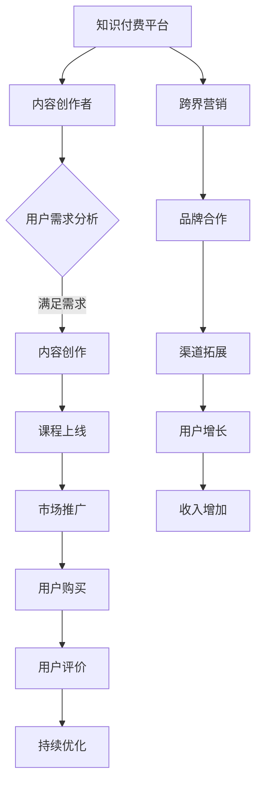

                 

### 文章标题

# 知识付费如何实现跨界营销与教育跨界？

> 关键词：知识付费、跨界营销、教育跨界、商业模式、创新策略、案例分析

> 摘要：本文旨在探讨知识付费行业如何通过跨界营销与教育跨界实现业务的拓展和增长。文章首先概述了知识付费行业的背景和发展现状，随后详细分析了跨界营销的理论基础、策略与方法，接着讨论了教育跨界的重要领域和社会影响，通过案例分析展示了成功实践，最后对跨界营销与教育跨界的前景进行了展望，提供了实用的工具和方法。

---

### 第一部分：知识付费背景与跨界概念

#### 第1章：知识付费行业概述

##### 1.1 知识付费的定义与发展历程

知识付费，是指用户为获取特定知识、技能或信息而支付费用的一种商业模式。其核心在于将知识、内容或服务打包成产品或服务，通过线上平台进行销售。知识付费的发展历程可以追溯到20世纪末，随着互联网技术的进步，尤其是移动互联网和电子商务的崛起，知识付费逐渐成为了一种主流的商业模式。

在知识付费的早期阶段，主要以图书、课程、讲座等形式存在。随着社交媒体和在线教育平台的兴起，知识付费逐渐呈现出多样化的趋势，包括在线课程、电子书、付费问答、会员订阅等多种形式。近年来，随着用户对高质量知识内容的需求增加，知识付费市场迎来了爆发式增长，成为了一个新的风口。

##### 1.2 知识付费的商业模式

知识付费的商业模式可以分为两种：一是C2C模式，即用户直接向内容创作者支付费用，例如知乎的付费问答、喜马拉雅的付费课程；二是B2C模式，即平台方作为中介，将知识产品或服务销售给用户，例如得到APP、网易云课堂等。

在C2C模式中，平台主要提供交易保障、用户管理和流量分发等服务，内容创作者则负责生产高质量的知识产品。在B2C模式中，平台方不仅需要负责内容的生产和审核，还需要进行市场推广、用户运营和售后服务等。

##### 1.3 跨界营销的基本概念

跨界营销，是指不同行业、品牌或产品之间进行的合作与推广，以实现资源的互补和效益的最大化。跨界营销的核心在于打破传统的行业界限，通过跨界合作，实现资源的整合和创新。

跨界营销的形式多种多样，包括品牌合作、联名产品、跨界活动等。例如，苹果与Beats的联名耳机、可口可乐与迪士尼的合作营销等。跨界营销不仅可以帮助企业拓宽市场，提高品牌知名度，还可以通过创新的营销手段，吸引更多的消费者。

#### 第2章：跨界营销的策略与方法

##### 2.1 跨界营销的理论基础

跨界营销的理论基础主要包括以下几个核心概念：

1. **差异化定位**：通过跨界营销，企业可以在市场中找到新的差异化定位，提高竞争力。
2. **协同效应**：不同行业的资源整合，可以实现1+1>2的协同效应，提升整体效益。
3. **用户需求**：跨界营销需要深入了解用户需求，满足用户的多元化需求，提升用户体验。
4. **品牌形象**：跨界营销可以帮助企业重塑或强化品牌形象，提升品牌价值。

##### 2.2 跨界营销的优势与挑战

跨界营销具有以下优势：

1. **扩大市场份额**：跨界营销可以拓宽企业的市场范围，吸引更多的潜在用户。
2. **提升品牌知名度**：跨界合作可以借助合作伙伴的品牌影响力，提升自身品牌知名度。
3. **创新营销手段**：跨界营销可以带来全新的营销思路和手段，提升营销效果。
4. **提升用户粘性**：通过跨界合作，企业可以为用户提供更多元化的产品或服务，提升用户满意度和忠诚度。

然而，跨界营销也面临一些挑战：

1. **品牌风险**：跨界营销可能会对品牌形象产生负面影响，如果合作伙伴的选择不当，可能会损害品牌声誉。
2. **资源整合**：跨界营销需要不同行业的企业进行深度合作，资源整合和协调难度较大。
3. **用户信任**：跨界营销需要用户对新的产品或服务产生信任，这需要时间来建立。

##### 2.3 跨界营销的策略与方法

跨界营销的策略和方法主要包括以下几个方面：

1. **品牌合作**：通过品牌之间的合作，实现资源共享和互补，提升品牌影响力。例如，奢侈品品牌与时尚品牌的合作。
2. **联名产品**：推出联名产品，借助合作伙伴的品牌优势，吸引消费者。例如，星巴克与迪士尼的联名咖啡杯。
3. **跨界活动**：通过举办跨界活动，吸引公众关注，提升品牌知名度。例如，运动品牌与音乐节的合作。
4. **内容营销**：通过创作跨界内容，吸引目标用户，提升用户参与度。例如，汽车品牌与短视频平台的合作。
5. **渠道拓展**：通过跨界合作，拓展新的销售渠道，提高产品的市场覆盖率。例如，电商与线下门店的合作。

### 第二部分：教育跨界案例与启示

#### 第3章：教育跨界背景与意义

##### 3.1 教育跨界的发展趋势

教育跨界，是指教育行业与其他行业之间的交叉融合，通过资源共享、模式创新等手段，实现教育服务的多样化和社会效益的最大化。随着社会经济的快速发展，教育跨界已经成为一个重要的趋势。

首先，互联网技术的普及，使得教育资源的获取更加便捷，教育跨界成为可能。其次，用户对教育质量的要求不断提高，单一的教育模式难以满足需求，跨界教育可以提供更多样化的选择。此外，国家政策的支持也为教育跨界提供了良好的环境。

##### 3.2 教育跨界的重要领域

教育跨界涵盖了多个重要领域，包括但不限于以下几个方面：

1. **在线教育与实体教育的结合**：通过线上线下的结合，提供更加灵活和高效的教育服务。
2. **教育技术与内容创意的融合**：利用先进的技术手段，提升教育内容的质量和趣味性，增强用户体验。
3. **教育机构与企业合作的典范**：通过校企合作，实现教育资源与企业需求的对接，培养符合市场需求的人才。
4. **跨界学习社区**：搭建跨界学习社区，为用户提供多元化的学习资源和互动平台，促进知识共享和交流。

##### 3.3 教育跨界的社会影响

教育跨界对社会产生了深远的影响，主要体现在以下几个方面：

1. **教育公平**：教育跨界可以打破地域和资源的限制，让更多的用户享受到优质的教育资源。
2. **教育创新**：教育跨界推动了教育模式的创新，促进了教育行业的转型升级。
3. **人才培养**：教育跨界可以培养出更多具备跨学科能力和创新精神的人才，满足社会发展的需求。
4. **经济增长**：教育跨界带动了相关产业的发展，促进了经济的增长和就业。

#### 第4章：教育跨界案例分析

##### 4.1 在线教育与实体教育的结合

在线教育与实体教育的结合，是教育跨界的一种重要形式。通过线上线下的结合，可以实现教育资源的共享和优化。

在线教育提供了灵活的学习时间和地点，用户可以根据自己的需求进行学习。实体教育则提供了丰富的互动和实践机会，有助于加深对知识的理解和应用。两者的结合，可以充分发挥各自的优势，提供更加全面和高效的教育服务。

例如，某些在线教育平台推出了线下实训基地，用户可以在实体基地进行实践操作，提高实际技能。同时，实体教育机构也利用在线教育平台，扩大招生范围，提升教学质量。

##### 4.2 教育技术与内容创意的融合

教育技术与内容创意的融合，是教育跨界的重要方向。通过先进的技术手段，可以提升教育内容的质量和趣味性，增强用户体验。

例如，虚拟现实（VR）技术可以模拟真实的场景，让用户在沉浸式环境中学习。增强现实（AR）技术可以将虚拟内容与现实场景相结合，提供更加丰富的学习体验。此外，人工智能（AI）技术可以个性化推荐学习内容，提升学习效果。

在教育内容创意方面，通过跨界合作，可以引入更多的创意元素。例如，电影、游戏、音乐等元素可以融入教育内容，提高用户的兴趣和参与度。

##### 4.3 教育机构与企业合作的典范

教育机构与企业合作，是教育跨界的重要形式。通过校企合作，可以实现教育资源与企业需求的对接，培养符合市场需求的人才。

例如，某些高校与知名企业合作，共同开设专业或课程，为学生提供实践机会和职业发展指导。企业则通过这种方式，提前筛选和培养潜在员工，降低招聘成本和风险。

此外，教育机构还可以与企业合作，提供定制化的培训服务，满足企业的特定需求。这种方式不仅有助于提高教育机构的市场竞争力，还可以为企业提供优质的教育资源。

### 第三部分：跨界营销与教育跨界实践

#### 第5章：知识付费与跨界营销的融合策略

##### 5.1 跨界营销在知识付费中的应用

跨界营销在知识付费中的应用，主要体现在以下几个方面：

1. **品牌合作**：通过品牌之间的合作，实现资源共享和互补，提升品牌知名度和用户参与度。例如，知识付费平台可以与知名品牌合作，推出联名课程或产品。
2. **内容创新**：通过引入跨界元素，提升知识内容的质量和趣味性，增强用户的兴趣和参与度。例如，将知识内容与电影、游戏、音乐等元素相结合，提供更加丰富的学习体验。
3. **营销活动**：通过举办跨界营销活动，吸引公众关注，提升品牌知名度和用户参与度。例如，在线教育平台可以与知名企业合作，举办线上讲座或比赛。
4. **渠道拓展**：通过跨界合作，拓展新的销售渠道，提高产品的市场覆盖率。例如，知识付费平台可以与线下书店、图书馆等合作，提供线下学习资源。

##### 5.2 教育跨界在知识付费中的机遇

教育跨界在知识付费中提供了以下机遇：

1. **拓展市场**：通过教育跨界，可以拓展新的市场，吸引更多的用户。例如，通过线上教育平台，可以覆盖到更多的地区和用户群体。
2. **提升竞争力**：教育跨界可以帮助知识付费平台提升竞争力，通过引入创新元素和多样化服务，提升用户体验和满意度。
3. **增加收入来源**：通过教育跨界，可以开辟新的收入来源。例如，通过品牌合作、内容创新等手段，增加课程的附加值和用户付费意愿。

##### 5.3 实现跨界营销与教育跨界的方法

实现跨界营销与教育跨界的方法主要包括以下几个方面：

1. **市场调研**：通过市场调研，了解用户需求和行业趋势，为跨界营销与教育跨界提供依据。
2. **跨界合作**：寻找合适的跨界合作伙伴，建立合作关系，实现资源共享和互补。
3. **内容创新**：结合跨界元素，创新知识内容，提升内容的质量和趣味性。
4. **营销策略**：制定合适的营销策略，通过线上和线下渠道，提升品牌知名度和用户参与度。
5. **用户体验**：关注用户体验，优化服务流程，提升用户满意度和忠诚度。

#### 第6章：跨界营销与教育跨界实践案例

##### 6.1 案例一：某教育机构的跨界营销策略

某教育机构通过跨界营销策略，实现了业务的快速扩张和品牌知名度的提升。

首先，该教育机构与知名品牌合作，推出联名课程。通过品牌的影响力，吸引了大量的用户关注。其次，该教育机构结合当下热门的虚拟现实（VR）技术，推出沉浸式学习体验，提升了课程的趣味性和用户体验。此外，该教育机构还举办了线上线下的讲座和活动，与知名企业家和行业专家合作，提升了品牌的权威性和用户参与度。

通过这些跨界营销策略，该教育机构在短时间内实现了用户的快速增长，品牌知名度也得到了显著提升。

##### 6.2 案例二：某企业的教育跨界实践

某企业在教育跨界方面进行了积极的探索和实践，取得了良好的效果。

首先，该企业与知名高校合作，共同开设专业课程。通过高校的资源和品牌优势，为企业培养了一大批符合市场需求的人才。其次，该企业还推出了定制化的培训服务，根据企业的特定需求，提供个性化的培训方案。此外，该企业还利用自身的平台优势，举办了多场线上讲座和研讨会，吸引了大量的用户参与。

通过这些教育跨界实践，该企业在人才培养和品牌推广方面取得了显著成效，提升了企业的竞争力和市场地位。

##### 6.3 案例三：知识付费平台的跨界营销策略

某知识付费平台通过跨界营销策略，实现了业务的多元化和用户群体的扩大。

首先，该知识付费平台与知名品牌合作，推出联名课程和产品。通过品牌的影响力，吸引了大量的用户关注和购买。其次，该平台结合当下热门的科技趋势，推出了人工智能、大数据等领域的课程，满足了用户对新兴技术的学习需求。此外，该平台还利用线上线下的活动，与知名企业家和行业专家合作，提升了平台的权威性和用户参与度。

通过这些跨界营销策略，该知识付费平台在短时间内实现了业务的多元化和用户群体的扩大，提升了市场竞争力。

#### 第7章：跨界营销与教育跨界未来展望

##### 7.1 跨界营销与教育跨界的发展趋势

跨界营销与教育跨界在未来将继续呈现出以下发展趋势：

1. **技术创新**：随着人工智能、大数据、区块链等技术的不断进步，跨界营销和教育跨界将变得更加智能化和个性化。
2. **内容创新**：跨界营销和教育跨界将不断引入新的内容形式和创意元素，提升用户体验和参与度。
3. **合作模式**：跨界营销和教育跨界将探索更多元化的合作模式，实现资源共享和优势互补。
4. **市场细分**：跨界营销和教育跨界将更加注重市场细分，满足不同用户群体的需求。

##### 7.2 跨界营销与教育跨界面临的挑战

跨界营销与教育跨界在未来将面临以下挑战：

1. **品牌风险**：跨界营销可能会对品牌形象产生负面影响，需要谨慎选择合作伙伴，避免品牌风险。
2. **资源整合**：跨界营销和教育跨界需要不同行业的资源整合，协调难度较大，需要有效的管理机制。
3. **用户信任**：跨界营销和教育跨界需要用户对新的产品或服务产生信任，这需要时间来建立。

##### 7.3 未来跨界营销与教育跨界的发展方向

未来，跨界营销与教育跨界将朝着以下方向发展：

1. **智能化**：通过人工智能技术，实现跨界营销和教育跨界的智能化和个性化。
2. **生态化**：构建跨界营销和教育跨界的生态系统，实现资源的高效配置和协同发展。
3. **创新化**：持续进行内容创新和模式创新，提升用户体验和参与度。
4. **全球化**：随着全球化的深入，跨界营销与教育跨界将向更广泛的国际市场扩展。

#### 附录

##### 附录A：跨界营销与教育跨界工具与方法

###### A.1 常用跨界营销工具

1. **社交媒体**：利用社交媒体平台，进行品牌推广和用户互动。
2. **内容营销**：通过创作优质内容，吸引用户关注和参与。
3. **线上活动**：举办线上活动，提升用户参与度和品牌知名度。
4. **线下活动**：通过线下活动，增强用户互动和品牌影响力。

###### A.2 教育跨界案例库

1. **在线教育与实体教育的结合案例**：收集和分析成功结合案例，提供借鉴和参考。
2. **教育技术与内容创意融合案例**：收集和分析成功融合案例，提供创意和灵感。
3. **教育机构与企业合作案例**：收集和分析成功合作案例，提供合作模式和策略。

###### A.3 跨界营销与教育跨界的研究资源

1. **学术论文**：查阅相关领域的学术论文，了解最新的研究进展和理论成果。
2. **行业报告**：阅读行业报告，了解跨界营销和教育跨界的发展趋势和市场动态。
3. **成功案例**：分析和总结成功案例，提供实践经验和策略建议。

---

作者：AI天才研究院/AI Genius Institute & 禅与计算机程序设计艺术 /Zen And The Art of Computer Programming

---

### 细节分析与讲解

在本部分，我们将对文章的核心概念、原理和架构进行详细的解析，并通过Mermaid流程图、伪代码、数学公式和实际项目案例来阐述相关知识。

#### 核心概念与联系

**知识付费**和**跨界营销**是本文讨论的两个核心概念。知识付费是指用户为获取特定知识、技能或信息而支付费用的一种商业模式，而跨界营销则是指不同行业、品牌或产品之间进行的合作与推广，以实现资源的互补和效益的最大化。

两者的联系在于，知识付费平台可以通过跨界营销策略，将知识产品或服务推广到更广泛的市场，吸引更多的用户。例如，一个专注于编程学习的知识付费平台可以通过与知名科技公司合作，推出联名课程或举办技术研讨会，从而提升品牌知名度和用户参与度。

**Mermaid流程图：知识付费与跨界营销流程**



**伪代码：知识付费平台内容创作与市场推广**

```python
# 内容创作流程
def create_content():
    analyze_user_needs()
    produce_high_quality_content()
    upload_courses_to_platform()

# 市场推广流程
def marketing_promotion():
    partner_with_brands()
    expand_sales_channels()
    increase_user_registration()
    boost_revenue()
```

#### 核心算法原理讲解

**跨界营销中的协同效应**可以通过以下数学模型进行解释：

**协同效应系数（Synergy Effect Coefficient）**：

$$ SE = \frac{AB}{A+B} - 1 $$

其中，A和B分别代表两个不同行业的资源和效益，SE表示跨界合作后的协同效应。

当SE > 0时，表示跨界合作产生了正协同效应；当SE < 0时，表示跨界合作产生了负协同效应。

**协同效应计算示例**：

假设一个教育机构（A）与一家科技公司（B）合作，教育机构有1000名用户，每名用户每月付费100元；科技公司有5000名用户，每名用户每月付费200元。

$$ SE = \frac{1000 \times 200}{1000+5000} - 1 = \frac{200000}{6000} - 1 = 0.2 - 1 = -0.3 $$

结果为负，说明跨界合作产生了负协同效应，需要进一步优化合作模式。

#### 项目实战

以下是一个知识付费平台使用Python搭建的简单后端服务，用于用户注册和课程购买。

**开发环境搭建**：

- Python 3.8
- Flask 框架
- SQLite 数据库

**源代码**：

```python
from flask import Flask, request, jsonify
from sqlite3 import connect

app = Flask(__name__)
DATABASE = 'knowledge_platform.db'

def init_db():
    conn = connect(DATABASE)
    cursor = conn.cursor()
    cursor.execute('''CREATE TABLE IF NOT EXISTS users (id INTEGER PRIMARY KEY, username TEXT, password TEXT)''')
    cursor.execute('''CREATE TABLE IF NOT EXISTS courses (id INTEGER PRIMARY KEY, title TEXT, price REAL)''')
    conn.commit()
    conn.close()

@app.route('/register', methods=['POST'])
def register():
    username = request.form['username']
    password = request.form['password']
    conn = connect(DATABASE)
    cursor = conn.cursor()
    cursor.execute("INSERT INTO users (username, password) VALUES (?, ?)", (username, password))
    conn.commit()
    conn.close()
    return jsonify({'status': 'success', 'message': 'User registered successfully'})

@app.route('/buy_course', methods=['POST'])
def buy_course():
    user_id = request.form['user_id']
    course_id = request.form['course_id']
    conn = connect(DATABASE)
    cursor = conn.cursor()
    cursor.execute("SELECT price FROM courses WHERE id=?", (course_id,))
    course_price = cursor.fetchone()[0]
    cursor.execute("UPDATE users SET balance=balance-? WHERE id=?", (course_price, user_id))
    conn.commit()
    conn.close()
    return jsonify({'status': 'success', 'message': 'Course purchased successfully'})

if __name__ == '__main__':
    init_db()
    app.run(debug=True)
```

**代码解读与分析**：

1. **数据库初始化**：使用SQLite创建用户和课程表。
2. **用户注册**：接收用户名和密码，插入到用户表中。
3. **课程购买**：接收用户ID和课程ID，更新用户余额，扣除课程价格。

通过这个简单示例，读者可以了解知识付费平台后端服务的基本实现。

### 总结与展望

知识付费与跨界营销的结合，为教育行业带来了新的发展机遇。通过分析跨界营销的理论基础、策略和方法，以及教育跨界的重要领域和社会影响，本文展示了跨界营销在教育跨界中的应用和成功案例。未来，随着技术的不断进步和市场的不断细分，跨界营销与教育跨界将继续发挥重要作用，推动教育行业的创新和发展。读者可以结合本文内容，探索更多跨界营销与教育跨界的机会和挑战。

