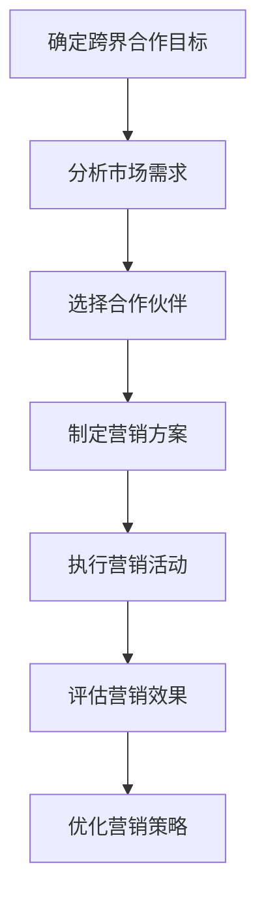

                 

### 文章标题

**《知识付费如何实现跨界营销与美妆护肤跨界？》**

在当今多元化消费环境下，跨界营销成为了众多企业拓展市场、提升品牌知名度的有效手段。本文将以知识付费领域为例，探讨如何通过跨界营销实现与美妆护肤行业的有机结合。通过详细分析跨界营销的策略、美妆护肤行业的消费者画像、典型案例解析，以及未来趋势展望，我们将一步步揭示知识付费跨界营销的奥秘。

**关键词：** 知识付费、跨界营销、美妆护肤、消费者行为、案例分析

**摘要：** 本文首先介绍了知识付费和跨界营销的基本概念及其结合的意义，随后对跨界营销策略进行了深度剖析。接着，通过对美妆护肤行业现状和消费者画像的详细分析，为进一步的跨界营销提供了依据。然后，本文通过具体案例展示了知识付费与美妆护肤跨界合作的成功实践。最后，本文对跨界营销的未来趋势进行了展望，提出了可行的策略和建议。

### **第一部分：跨界营销基础**

#### 第1章：知识付费与跨界营销概述

**1.1.1 知识付费的发展背景**

知识付费，指的是消费者为获取有用信息或知识而支付的费用。这一现象在我国逐渐兴起，得益于互联网技术的飞速发展和人们对自我提升的需求。从最初的在线课程、电子书籍，到现在的付费问答、知识直播，知识付费已经成为知识传播和知识变现的重要途径。

知识付费的发展背景可以从以下几个方面来理解：

1. **互联网普及**：互联网的普及使得信息传播变得更加便捷，人们可以通过各种在线平台获取所需的知识。
2. **消费观念转变**：随着社会的发展，人们越来越重视自我提升，愿意为获取高质量的知识内容付费。
3. **内容创作繁荣**：众多内容创作者通过互联网平台分享专业知识，推动了知识付费市场的发展。

**1.1.2 跨界营销的概念与意义**

跨界营销，是指企业通过与其他不同领域的企业合作，进行营销活动，以实现资源共享、市场拓展和品牌提升的目的。跨界营销的核心在于突破原有行业界限，实现跨领域的合作与创新。

跨界营销的意义主要体现在以下几个方面：

1. **拓宽市场**：跨界营销可以帮助企业拓展新的市场，吸引不同领域的消费者，提升销售额。
2. **提升品牌形象**：跨界合作可以借助对方的品牌影响力，提升自身品牌形象，实现品牌的二次传播。
3. **增强消费者体验**：跨界营销可以提供多样化的产品或服务，满足消费者多样化的需求，提升消费体验。
4. **创新营销模式**：跨界营销可以激发新的营销思路，推动企业实现营销模式的创新。

**1.1.3 知识付费与跨界营销的结合**

知识付费与跨界营销的结合，为企业在知识服务领域带来了新的机遇。具体体现在以下几个方面：

1. **内容互补**：知识付费平台可以提供专业的知识内容，而跨界合作伙伴则可以提供与知识相关的实物或服务，实现内容互补。
2. **市场拓展**：通过跨界合作，知识付费平台可以吸引更多消费者，同时跨界合作伙伴也可以借助知识付费平台的用户基础，拓展市场。
3. **品牌提升**：跨界营销可以借助合作伙伴的品牌影响力，提升知识付费平台的市场竞争力，实现品牌的共同提升。
4. **消费者体验**：跨界营销可以为消费者提供更加丰富的消费体验，如知识付费与美妆护肤相结合，可以提供知识讲座和美妆课程，满足消费者的多样化需求。

#### **第2章：跨界营销策略解析**

**2.1 跨界合作模式**

跨界合作模式是跨界营销成功的关键，根据不同的合作方式，可以分为以下几种：

1. **内容合作**：知识付费平台与美妆护肤品牌可以共同开发课程或直播，分享专业知识与护肤技巧。
2. **资源共享**：知识付费平台可以与美妆护肤品牌共享用户数据，实现精准营销。
3. **品牌联动**：知识付费平台可以与美妆护肤品牌共同举办活动，如线上线下讲座、护肤知识竞赛等，提高品牌知名度。

**2.2 消费者行为分析**

消费者行为分析是制定跨界营销策略的重要依据。以下是针对知识付费与美妆护肤行业消费者行为分析的几个方面：

1. **消费者需求分析**：知识付费消费者通常具有强烈的求知欲望和自我提升需求；美妆护肤消费者则更加关注产品功效和品牌口碑。
2. **消费者偏好分析**：知识付费消费者更倾向于通过在线课程、电子书籍等获取知识；美妆护肤消费者则偏好实体店体验和在线购物。
3. **消费者转化路径分析**：知识付费消费者往往通过搜索、推荐等途径发现并购买课程；美妆护肤消费者则更多依赖于品牌宣传和口碑传播。

**2.3 营销策略制定**

制定有效的跨界营销策略，需要综合考虑目标市场、合作伙伴、营销手段等多个因素。以下是几个关键步骤：

1. **目标设定**：明确跨界营销的目标，如提升品牌知名度、增加用户数量、提高销售额等。
2. **预算分配**：根据目标设定和营销手段，合理分配预算，确保营销活动的有效开展。
3. **营销渠道选择**：根据目标消费者特点和渠道效果，选择最适合的营销渠道，如社交媒体、电子邮件、线下活动等。

#### **第3章：美妆护肤行业分析**

**3.1 美妆护肤行业现状**

美妆护肤行业是我国快速发展的行业之一，市场规模不断扩大，产品种类日益丰富。以下是美妆护肤行业现状的几个方面：

1. **市场规模**：我国美妆护肤市场规模持续增长，年销售额已突破万亿元。
2. **市场趋势**：随着消费者对护肤需求的增加，高端护肤市场呈现出快速增长态势，同时，天然有机护肤产品受到广泛关注。
3. **市场竞争态势**：美妆护肤市场竞争激烈，众多国内外品牌争相抢占市场份额，其中，一些新兴品牌凭借创新的研发和营销策略，逐渐崭露头角。

**3.2 美妆护肤消费者画像**

了解美妆护肤消费者的特征，对于制定有效的跨界营销策略具有重要意义。以下是美妆护肤消费者的几个主要特征：

1. **年龄分布**：美妆护肤消费者主要集中在18-35岁之间，其中，25-30岁的消费者占比最大。
2. **性别比例**：女性消费者在美妆护肤市场中占据主导地位，但男性消费者比例逐年上升。
3. **消费能力**：美妆护肤消费者具有较强的消费能力，更愿意为高品质的产品和服务支付。

**3.3 美妆护肤产品分类**

美妆护肤产品种类繁多，以下是对主要产品类型的分类：

1. **护肤品**：包括洁面、爽肤水、精华、乳液、面霜等，主要用于日常护肤。
2. **美妆品**：包括口红、眼影、粉底等，主要用于化妆。
3. **其他美容产品**：包括美容仪器、面膜、身体护理产品等，满足消费者多样化的美容需求。

#### **第4章：跨界营销案例解析**

**4.1 知识付费平台与美妆护肤品牌的合作案例**

在本章节中，我们将通过具体案例，分析知识付费平台与美妆护肤品牌的跨界合作模式及其成效。以下是一个典型案例的详细解析：

**4.1.1 案例一：某知名知识付费平台与某知名美妆品牌的合作**

**案例背景**：某知名知识付费平台（以下简称“平台”）与某知名美妆品牌（以下简称“品牌”）达成合作，共同开发了一款针对护肤知识的学习课程。该课程旨在帮助消费者了解护肤原理，掌握正确的护肤方法，同时推广品牌的护肤产品。

**合作模式**：

1. **内容合作**：平台为品牌提供专业的护肤知识课程，由品牌的专业团队进行内容开发和授课。
2. **资源共享**：品牌提供课程所需的护肤产品，供学员在课程中试用，提高学员的实际操作体验。
3. **品牌联动**：平台和品牌共同举办线上护肤讲座和线下体验活动，扩大品牌影响力。

**营销策略**：

1. **目标设定**：提升品牌知名度，增加护肤课程的用户数量，提高产品的销售量。
2. **预算分配**：平台和品牌共同承担课程开发和营销活动的成本，合理分配预算。
3. **营销渠道选择**：利用平台的社交媒体账号和品牌官网进行宣传，同时通过线上广告和线下活动进行推广。

**案例效果**：

1. **品牌知名度**：通过跨界合作，品牌的知名度得到了显著提升，吸引了大量新用户。
2. **课程销量**：护肤课程上线后，受到了广大消费者的热烈欢迎，销量大幅增长。
3. **产品销售**：品牌护肤产品的销售也实现了显著增长，部分产品甚至出现了断货现象。

**4.1.2 案例二：某新兴知识付费平台与某新兴美妆品牌的合作**

**案例背景**：某新兴知识付费平台（以下简称“平台”）与某新兴美妆品牌（以下简称“品牌”）合作，共同推出了一款美容教程课程。该课程旨在教授消费者如何使用品牌产品进行日常美容，提升消费者的美容技能。

**合作模式**：

1. **内容合作**：平台负责课程的设计和开发，品牌提供美容教程所需的化妆品和工具。
2. **资源共享**：品牌为学员提供试用装，让学员在实际操作中体验产品效果。
3. **品牌推广**：平台和品牌共同在社交媒体上进行推广，提高课程和品牌的曝光率。

**营销策略**：

1. **目标设定**：扩大品牌在年轻消费群体中的影响力，提高课程的受众范围，提升品牌销量。
2. **预算分配**：平台和品牌共同投入预算，用于课程开发和营销活动。
3. **营销渠道选择**：通过社交媒体、线上广告、线下活动等多渠道进行推广，提高课程的知名度和品牌的认可度。

**案例效果**：

1. **品牌影响力**：通过跨界合作，品牌的知名度和影响力得到了显著提升，尤其是在年轻消费群体中。
2. **课程参与度**：美容教程课程的参与度非常高，吸引了大量用户参与学习，课程评价良好。
3. **产品销量**：品牌产品的销售也实现了快速增长，部分产品甚至出现了供不应求的情况。

**4.2 美妆护肤品牌与美妆护肤品牌的合作案例**

在本章节中，我们还将探讨美妆护肤品牌之间的跨界合作，分析其合作模式、营销策略以及案例效果。

**4.2.1 案例一：某知名美妆品牌与某知名护肤品牌的合作**

**案例背景**：某知名美妆品牌（以下简称“品牌A”）与某知名护肤品牌（以下简称“品牌B”）达成合作，共同推出了一系列护肤美妆套装。该套装结合了品牌A的美妆产品和品牌B的护肤产品，为消费者提供了一套完整的护肤美妆解决方案。

**合作模式**：

1. **产品合作**：品牌A和品牌B共同开发套装产品，将各自的优势产品进行组合，满足消费者的需求。
2. **市场推广**：品牌A和品牌B共同进行市场推广，利用双方的渠道和资源，扩大套装的市场影响力。
3. **品牌联动**：品牌A和品牌B在社交媒体上开展联合宣传，提高消费者的购买欲望。

**营销策略**：

1. **目标设定**：提升护肤美妆套装的市场占有率，增加品牌A和品牌B的销量，提高品牌知名度。
2. **预算分配**：品牌A和品牌B共同承担套装开发和营销活动的成本。
3. **营销渠道选择**：通过线上广告、社交媒体、线下活动等多渠道进行推广，提高套装的曝光率和销售量。

**案例效果**：

1. **市场占有率**：护肤美妆套装在市场上取得了较高的占有率，成为消费者购买的热门产品。
2. **销量提升**：品牌A和品牌B的销量均实现了显著增长，部分产品甚至出现了库存不足的情况。
3. **品牌知名度**：通过跨界合作，品牌A和品牌B的知名度得到了大幅提升，吸引了更多消费者的关注。

**4.2.2 案例二：某新兴美妆品牌与某新兴护肤品牌的合作**

**案例背景**：某新兴美妆品牌（以下简称“品牌C”）与某新兴护肤品牌（以下简称“品牌D”）达成合作，共同推出了一款护肤美妆礼盒。该礼盒集合了品牌C的美妆产品和品牌D的护肤产品，旨在为消费者提供全方位的护肤美妆体验。

**合作模式**：

1. **产品合作**：品牌C和品牌D共同研发礼盒产品，结合双方的核心优势，为消费者提供高品质的产品。
2. **市场推广**：品牌C和品牌D共同进行市场推广，利用双方的社交媒体账号和粉丝资源，提高礼盒的知名度。
3. **品牌互动**：品牌C和品牌D在社交媒体上开展互动活动，如抽奖、互动话题等，增加消费者的参与度。

**营销策略**：

1. **目标设定**：提升护肤美妆礼盒的市场影响力，增加品牌C和品牌D的用户数量，提高品牌知名度。
2. **预算分配**：品牌C和品牌D共同承担礼盒开发和营销活动的成本，合理分配预算。
3. **营销渠道选择**：通过社交媒体、线上广告、线下活动等多渠道进行推广，提高礼盒的曝光率和销售量。

**案例效果**：

1. **市场影响力**：护肤美妆礼盒在市场上取得了较好的反响，迅速赢得了消费者的喜爱。
2. **用户数量**：品牌C和品牌D的用户数量实现了显著增长，尤其是在年轻消费群体中。
3. **品牌知名度**：通过跨界合作，品牌C和品牌D的知名度得到了大幅提升，进一步扩大了市场影响力。

#### **第5章：知识付费如何实现跨界营销**

**5.1 跨界营销的挑战与机遇**

知识付费领域实现跨界营销，既面临挑战，也蕴含机遇。以下是对这些挑战与机遇的分析：

**5.1.1 挑战**

1. **品牌认知度**：知识付费平台需要建立较高的品牌认知度，才能吸引更多消费者的关注。
2. **消费者信任度**：消费者对跨界合作的信任度直接影响营销效果，如何确保合作伙伴的信誉和产品质量是关键。
3. **资源整合能力**：跨界营销需要整合多方面的资源，包括内容资源、渠道资源、用户资源等，这对知识付费平台提出了较高的要求。

**5.1.2 机遇**

1. **市场拓展**：跨界营销可以帮助知识付费平台拓展新的市场，吸引更多消费者。
2. **品牌影响力的提升**：通过与知名品牌的合作，知识付费平台可以借助对方的品牌影响力，提升自身品牌形象。
3. **消费者需求的满足**：跨界营销可以提供更加丰富多样的产品或服务，满足消费者多样化的需求，提升用户体验。

**5.2 跨界营销的策略与执行**

要实现有效的跨界营销，需要制定合理的策略并严格执行。以下是几个关键策略与执行步骤：

**5.2.1 策略制定**

1. **明确目标**：根据企业的发展目标和市场需求，明确跨界营销的具体目标，如提升品牌知名度、增加用户数量、提高销售额等。
2. **确定合作伙伴**：选择合适的合作伙伴，如具有良好口碑和品牌影响力的美妆护肤品牌，确保合作能够带来实际效果。
3. **制定营销方案**：根据目标市场和消费者特点，制定具体的营销方案，包括内容合作、资源共享、品牌联动等多种形式。

**5.2.2 执行**

1. **营销活动策划**：根据营销方案，策划具体的营销活动，如线上课程、护肤讲座、美妆课程等，确保活动的创新性和吸引力。
2. **营销渠道选择**：根据目标消费者和营销活动特点，选择最适合的营销渠道，如社交媒体、电子邮件、线下活动等，提高营销效果。
3. **营销效果评估**：通过数据分析，评估营销活动的效果，如用户参与度、课程销量、产品销售量等，不断优化营销策略。

#### **第6章：美妆护肤跨界营销案例详解**

在本章节中，我们将对两个具体的美妆护肤跨界营销案例进行详细解析，探讨其跨界策略及其效果评估。

**6.1 案例一：某美妆品牌与某护肤品牌的跨界合作**

**6.1.1 案例背景**

某知名美妆品牌（以下简称“品牌A”）与某知名护肤品牌（以下简称“品牌B”）达成跨界合作，共同推出了一系列护肤美妆套装。该套装结合了品牌A的美妆产品和品牌B的护肤产品，为消费者提供了一套完整的护肤美妆解决方案。

**6.1.2 跨界策略分析**

1. **内容合作**：品牌A和品牌B共同开发护肤美妆套装，将各自的核心产品进行组合，满足消费者的多样化需求。
2. **资源共享**：品牌A和品牌B共同进行市场推广，利用双方的渠道和资源，扩大套装的市场影响力。
3. **品牌联动**：品牌A和品牌B在社交媒体上开展联合宣传，提高消费者的购买欲望。

**6.1.3 案例效果评估**

1. **市场占有率**：护肤美妆套装在市场上取得了较高的占有率，成为消费者购买的热门产品。
2. **销量提升**：品牌A和品牌B的销量均实现了显著增长，部分产品甚至出现了库存不足的情况。
3. **品牌知名度**：通过跨界合作，品牌A和品牌B的知名度得到了大幅提升，吸引了更多消费者的关注。

**6.2 案例二：某知识付费平台与某护肤品牌的跨界合作**

**6.2.1 案例背景**

某知名知识付费平台（以下简称“平台”）与某知名护肤品牌（以下简称“品牌”）达成跨界合作，共同推出了一款护肤知识学习课程。该课程旨在帮助消费者了解护肤原理，掌握正确的护肤方法，同时推广品牌的护肤产品。

**6.2.2 跨界策略分析**

1. **内容合作**：平台为品牌提供专业的护肤知识课程，由品牌的专业团队进行内容开发和授课。
2. **资源共享**：品牌为学员提供试用装，让学员在实际操作中体验产品效果。
3. **品牌推广**：平台和品牌共同在社交媒体上进行推广，提高课程和品牌的曝光率。

**6.2.3 案例效果评估**

1. **品牌知名度**：通过跨界合作，品牌的知名度得到了显著提升，吸引了大量新用户。
2. **课程销量**：护肤课程上线后，受到了广大消费者的热烈欢迎，销量大幅增长。
3. **产品销售**：品牌护肤产品的销售也实现了显著增长，部分产品甚至出现了断货现象。

#### **第7章：跨界营销的未来趋势**

**7.1 新技术带来的跨界营销机遇**

随着科技的不断进步，新技术为跨界营销带来了新的机遇。以下是几种具有代表性的新技术及其对跨界营销的影响：

1. **人工智能**：人工智能技术可以精准分析消费者行为，实现个性化推荐，提高营销效果。
2. **大数据**：大数据技术可以帮助企业更好地了解市场需求，优化营销策略，提高市场竞争力。
3. **区块链**：区块链技术可以确保营销活动的透明性和公正性，增强消费者信任。

**7.2 跨界营销的可持续发展**

跨界营销不仅要在短期内取得成效，更要实现长期可持续发展。以下是几个关键策略：

1. **品牌价值共创**：跨界营销应该注重品牌价值的共创，通过合作实现双赢。
2. **消费者体验优化**：跨界营销应关注消费者体验，通过创新的产品和服务，提升消费者满意度。
3. **社会责任承担**：企业应承担社会责任，通过跨界营销推动社会进步。

**7.3 跨界营销的未来趋势**

未来，跨界营销将继续向以下几个方向发展：

1. **多元化合作**：跨界合作将更加多元化和广泛，涉及更多领域和行业。
2. **数字化营销**：数字化营销将成为跨界营销的主要手段，通过线上渠道实现更广泛的覆盖。
3. **消费者导向**：跨界营销将更加注重消费者的需求和体验，以消费者为中心，实现精准营销。

### **附录**

**附录A：跨界营销策略制定流程图**

**附录B：常见跨界营销模式及其优缺点分析**

| 跨界营销模式 | 优点 | 缺点 |
| :--- | :--- | :--- |
| 内容合作 | 提升品牌知名度，增加产品销量 | 合作伙伴的选择和沟通成本较高 |
| 资源共享 | 提高资源利用效率，降低成本 | 可能导致双方利益分配不均 |
| 品牌联动 | 扩大市场影响力，提高品牌认知度 | 合作效果难以量化，风险较大 |
| 产品合作 | 满足消费者多样化需求，提升用户体验 | 产品研发和推广成本较高 |

**附录C：美妆护肤行业跨界营销案例汇编**

1. 某知名美妆品牌与某知名护肤品牌跨界合作，推出护肤美妆套装，取得显著的市场反响。
2. 某知识付费平台与某护肤品牌合作，推出护肤知识课程，提高了品牌的知名度和课程销量。
3. 某新兴美妆品牌与某知名护肤品牌合作，共同开发护肤美妆礼盒，赢得了消费者的喜爱。

**作者：AI天才研究院/AI Genius Institute & 禅与计算机程序设计艺术 /Zen And The Art of Computer Programming**

