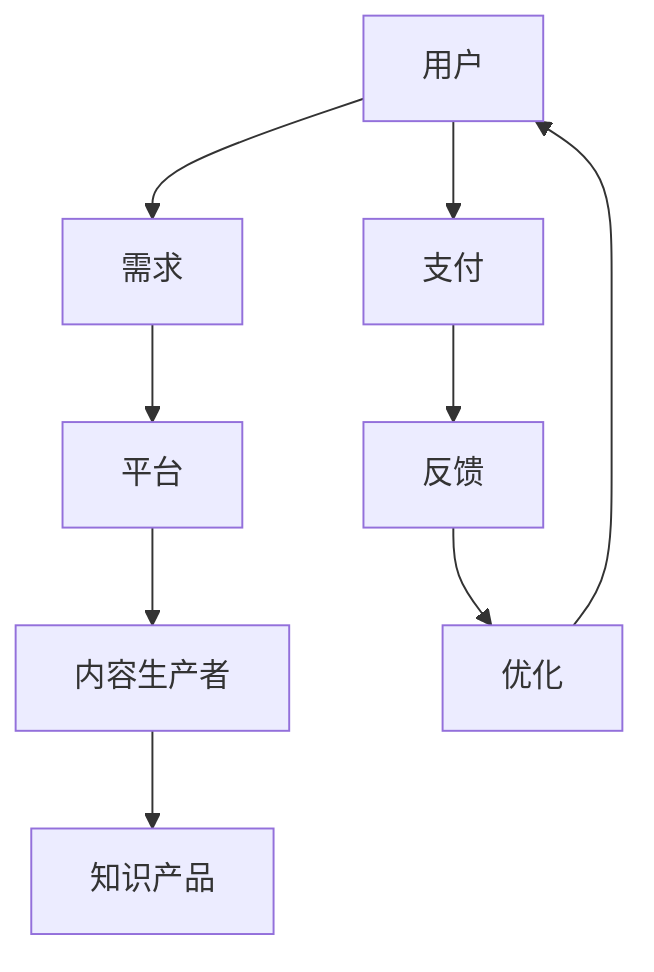

                 

### 文章标题

《知识付费如何实现跨界营销与艺术培训跨界？》

> 关键词：知识付费、跨界营销、艺术培训、商业模式、策略分析、案例研究

> 摘要：本文将探讨知识付费如何通过跨界营销与艺术培训相结合，实现商业模式的创新与拓展。文章首先概述了知识付费的基本概念和现状，接着分析了跨界营销的原理与实践，随后详细探讨了艺术培训行业的现状与挑战，并结合实际案例，深入剖析了知识付费与艺术培训跨界结合的成功策略。最后，文章提出了跨界营销与艺术培训整合的实施与优化方法，并对未来发展进行了展望。

### 目录大纲

#### 第一部分：知识付费概述

- **第1章：知识付费的基本概念与现状**
  - 1.1 知识付费的定义
  - 1.2 知识付费的发展历程
  - 1.3 知识付费的商业模式
  - 1.4 知识付费的行业现状

- **第2章：跨界营销的原理与实践**
  - 2.1 跨界营销的概念
  - 2.2 跨界营销的优势与挑战
  - 2.3 跨界营销的策略
  - 2.4 成功的跨界营销案例解析

#### 第二部分：艺术培训的跨界应用

- **第3章：艺术培训行业的现状与挑战**
  - 3.1 艺术培训行业的现状
  - 3.2 艺术培训行业面临的挑战
  - 3.3 跨界合作的机会

- **第4章：艺术培训与知识付费的结合**
  - 4.1 艺术培训与知识付费的结合点
  - 4.2 跨界合作的形式
  - 4.3 跨界合作的案例分析

#### 第三部分：跨界营销与艺术培训的整合策略

- **第5章：跨界营销与艺术培训的整合策略**
  - 5.1 整合策略的原理
  - 5.2 整合策略的实施步骤
  - 5.3 整合策略的效果评估

#### 第四部分：案例研究

- **第6章：案例研究一：成功跨界营销与艺术培训的结合**
  - 6.1 案例背景
  - 6.2 跨界策略分析
  - 6.3 成功因素解析
  - 6.4 经验与启示

- **第7章：案例研究二：知识付费平台的艺术培训业务拓展**
  - 7.1 案例背景
  - 7.2 业务拓展策略
  - 7.3 成功经验与挑战
  - 7.4 未来发展趋势

#### 第五部分：实施与优化

- **第8章：跨界营销与艺术培训的实施策略**
  - 8.1 实施策略的制定
  - 8.2 实施过程中的问题与解决方案
  - 8.3 成功的运营模式

- **第9章：跨界营销与艺术培训的优化方法**
  - 9.1 优化目标与指标
  - 9.2 优化方法与工具
  - 9.3 优化实践与效果评估

- **第10章：跨界营销与艺术培训的未来发展趋势**
  - 10.1 行业趋势分析
  - 10.2 技术创新的影响
  - 10.3 发展前景展望

#### 附录

- **附录A：参考资料**
  - A.1 知识付费相关研究报告
  - A.2 跨界营销案例分析
  - A.3 艺术培训行业数据报告

- **附录B：实用工具与资源**
  - B.1 知识付费平台推荐
  - B.2 跨界营销策略工具
  - B.3 艺术培训相关资源

### 第一部分：知识付费概述

#### 第1章：知识付费的基本概念与现状

### 1.1 知识付费的定义

知识付费是指消费者为获取特定的知识和技能，通过支付费用来购买内容或服务的一种商业模式。在互联网时代，知识付费作为一种新兴的商业模式，逐渐受到广泛欢迎。它不仅仅局限于传统的教育领域，还涵盖了职业培训、技能提升、个人兴趣等多个方面。

知识付费的核心在于通过付费的方式，筛选和获取高质量的知识资源，满足用户对专业性和实用性的需求。与免费资源相比，知识付费提供的内容更加有保障，用户体验也更加优质。此外，知识付费也激励了内容生产者提供高质量的内容，形成了一个良性的循环。

### 1.2 知识付费的发展历程

知识付费的发展历程可以追溯到互联网的兴起。最初，知识传播主要依赖于线下教育和公开课，但随着互联网技术的进步，在线教育逐渐兴起，为知识付费提供了新的平台和渠道。2016年左右，知识付费迎来爆发期，各种知识付费平台如雨后春笋般涌现，代表性的平台有得到、喜马拉雅、知乎Live等。

在发展初期，知识付费主要集中在个人成长、技能培训等领域。随着市场的成熟，知识付费逐渐向垂直行业扩展，如法律、医疗、金融等领域的专业知识也纷纷上线。同时，知识付费的模式也在不断创新，从音频、视频到图文，甚至在线直播和互动教学，形式多样化满足了不同用户的需求。

### 1.3 知识付费的商业模式

知识付费的商业模式主要包括以下几种：

1. **会员制**：用户支付一定费用成为会员，享受平台提供的所有课程和服务。
2. **课程订阅**：用户按需购买或订阅特定课程，费用根据课程难度和时长而定。
3. **单次购买**：用户针对某一课程或内容进行单次购买。
4. **知识变现**：内容生产者通过平台出售自己的知识产品，获取收益。

知识付费的商业模式不仅为用户提供了灵活多样的学习方式，也为内容生产者提供了广阔的变现渠道。平台通过搭建内容生产者和用户之间的桥梁，实现多方共赢。

### 1.4 知识付费的行业现状

当前，知识付费市场呈现出高速增长的态势。根据相关报告，2019年知识付费市场规模已超过2000亿元，预计未来还将保持快速增长。用户群体也日趋多样化，从早期以年轻人为主要用户，逐渐扩展到各年龄层、各行业的人群。

在知识付费的细分市场中，职业培训和个人成长类内容占据了主导地位。此外，技能培训、兴趣课程等也逐渐受到关注。随着5G、大数据、人工智能等新技术的应用，知识付费将迎来更多的创新和发展机遇。

### 1.5 知识付费的核心概念与联系

为了更好地理解知识付费的运作机制，我们可以使用Mermaid流程图来展示其核心概念与联系。



在上面的流程图中，用户有学习需求，通过知识付费平台获取知识产品，支付费用后获得知识服务，并通过反馈机制对知识产品进行评价和优化。这一循环不断推动知识付费市场的健康发展。

### 1.6 核心算法原理讲解

知识付费平台在内容推荐和用户行为分析方面，往往采用复杂的算法模型。以下是一个简化的伪代码，用于解释推荐算法的基本原理：

```plaintext
function content_recommendation(user_profile, content_database):
    1. 计算用户兴趣向量 user_interest
    2. 对每个内容计算兴趣相似度 similarity_score
    3. 根据相似度得分排序，选择Top-N内容推荐
    4. 返回推荐内容列表

function user_behavior_analysis(user_actions, history_data):
    1. 构建用户行为序列 user_sequence
    2. 对行为序列进行分类，识别用户兴趣标签
    3. 更新用户兴趣向量 user_interest
    4. 返回用户兴趣标签和更新后的兴趣向量
```

通过上述算法，知识付费平台能够更精准地推荐内容，满足用户个性化需求。

### 1.7 数学模型和公式

在知识付费的商业运营中，收益模型是一个重要的考量因素。以下是一个简化的收益模型公式：

$$
R(t) = P \cdot S(t) - C(t)
$$

其中：
- \( R(t) \) 表示时间 \( t \) 的总收益；
- \( P \) 表示单个知识产品的价格；
- \( S(t) \) 表示时间 \( t \) 的销售量；
- \( C(t) \) 表示时间 \( t \) 的总成本。

通过优化 \( S(t) \) 和 \( C(t) \)，平台可以最大化总收益 \( R(t) \)。

### 1.8 项目实战

以下是一个简单的知识付费平台的代码实现案例，包括用户注册、登录和购买课程的流程。

```python
# 用户注册
def register(username, password):
    # 存储用户信息到数据库
    user_data = {'username': username, 'password': password}
    save_to_database(user_data)
    print("注册成功！")

# 用户登录
def login(username, password):
    user_data = fetch_from_database(username)
    if user_data['password'] == password:
        print("登录成功！")
    else:
        print("登录失败，密码错误！")

# 购买课程
def buy_course(user_id, course_id):
    # 更新用户课程购买记录
    update_course_purchase(user_id, course_id)
    print("购买课程成功！")

# 数据库操作
def save_to_database(data):
    # 实现数据库存储操作
    pass

def fetch_from_database(username):
    # 实现数据库查询操作
    pass

def update_course_purchase(user_id, course_id):
    # 实现用户课程购买记录更新
    pass
```

通过上述代码，我们可以实现用户的基本操作，包括注册、登录和购买课程。在实际应用中，还需要考虑安全性、性能优化和用户体验等方面的需求。

### 1.9 代码解读与分析

在上面的代码中，我们分别实现了用户注册、登录和购买课程的三个功能。以下是代码的详细解读：

- **register() 函数**：用于处理用户注册逻辑。用户需要提供用户名和密码，系统会将这些信息存储到数据库中。这里简化了数据库操作的实现，实际应用中需要确保密码的安全性，如使用哈希加密。
- **login() 函数**：用于处理用户登录逻辑。用户需要输入用户名和密码，系统会从数据库中查询用户信息进行验证。如果密码匹配，则登录成功，否则失败。
- **buy_course() 函数**：用于处理用户购买课程逻辑。用户需要提供用户ID和课程ID，系统会更新用户的课程购买记录。这里简化了数据库操作的实现，实际应用中需要确保操作的原子性和一致性。

通过上述三个函数，我们可以实现用户在知识付费平台的基本操作，为用户提供便捷的服务。

### 1.10 小结

本章对知识付费的基本概念、发展历程、商业模式、行业现状以及核心概念和联系进行了详细阐述。通过Mermaid流程图、伪代码、数学模型和项目实战案例，我们深入理解了知识付费的运作机制。接下来，我们将探讨跨界营销的原理与实践，进一步探讨知识付费如何实现跨界营销与艺术培训的结合。

#### 第2章：跨界营销的原理与实践

### 2.1 跨界营销的概念

跨界营销，顾名思义，是指将不同领域或行业的营销策略融合在一起，以达到更好的营销效果。它通过打破传统的行业界限，将原本不相干的元素结合在一起，创造出全新的品牌形象和用户体验。跨界营销的核心理念在于利用不同领域的资源、技术和用户群体，实现跨领域的合作与共赢。

跨界营销的核心在于“创新”，通过创新的方式，将原本毫不相干的元素进行有机融合，从而创造出令人耳目一新的营销效果。它不仅仅是一种营销手段，更是一种思维方式，一种跨界思维的体现。

### 2.2 跨界营销的优势与挑战

跨界营销的优势主要体现在以下几个方面：

1. **提升品牌知名度**：跨界营销可以通过与知名品牌或领域的合作，迅速提升品牌知名度。借助合作方的品牌影响力，跨界营销能够在短时间内吸引大量关注，达到事半功倍的效果。
2. **拓宽目标市场**：跨界营销可以将原本局限在某一领域的品牌或产品，拓展到更广泛的市场。通过跨领域的合作，品牌可以接触到新的用户群体，实现市场细分和用户拓展。
3. **创造差异化竞争优势**：跨界营销通过独特的合作方式和营销策略，创造出差异化竞争优势。这种差异化不仅体现在产品本身，还体现在用户体验和品牌形象上，从而在竞争激烈的市场中脱颖而出。
4. **提高用户粘性**：跨界营销通过创新的方式，为用户带来全新的体验，从而提高用户对品牌的粘性。跨界营销活动往往具有趣味性、互动性，能够更好地吸引用户参与，增强用户对品牌的忠诚度。

然而，跨界营销也面临一定的挑战：

1. **品牌形象风险**：跨界营销如果处理不当，可能会对品牌形象造成负面影响。特别是当品牌与跨界伙伴的品牌形象或价值观不一致时，可能会引发用户质疑，甚至反感。
2. **市场适应性挑战**：跨界营销需要品牌在不同领域具有适应性和灵活性。如果品牌在某一领域缺乏经验和资源，可能会导致跨界营销策略的失败。
3. **资源整合难度**：跨界营销需要整合不同领域的资源，包括人才、技术、资金等。资源整合难度较大，需要品牌具备强大的资源整合能力和执行力。
4. **沟通协调困难**：跨界营销通常涉及多个合作伙伴，沟通协调难度较大。不同合作伙伴之间的利益冲突、资源分配等问题，都可能影响跨界营销的顺利进行。

### 2.3 跨界营销的策略

要成功实施跨界营销，需要制定一系列策略，以下是一些常见的策略：

1. **寻找合适的跨界伙伴**：选择与品牌定位、目标市场相契合的跨界伙伴，是跨界营销成功的关键。合适的跨界伙伴可以互补优势，共同创造新的市场机会。
2. **确定跨界合作模式**：根据品牌和合作伙伴的资源、优势，确定合适的跨界合作模式。常见的合作模式包括品牌联合、产品合作、营销活动合作等。
3. **创造独特的跨界体验**：跨界营销的核心在于为用户带来全新的体验。品牌需要通过创意设计、互动活动等方式，打造独特的跨界体验，吸引用户参与。
4. **强化品牌故事和价值观**：跨界营销不仅仅是产品和营销手段的结合，更是品牌故事和价值观的传递。品牌需要通过跨界营销，强化品牌故事和价值观，提高用户对品牌的认同感。
5. **注重数据分析和效果评估**：跨界营销需要注重数据分析和效果评估，通过数据驱动决策，优化营销策略。通过监测用户行为、销售数据等，评估跨界营销的效果，为后续营销活动提供参考。

### 2.4 成功的跨界营销案例解析

以下是一些成功的跨界营销案例，通过这些案例我们可以看到跨界营销的策略和实践：

#### 案例1：可口可乐与周杰伦跨界合作

2019年，可口可乐携手周杰伦推出限定款“C罗专供”罐装饮料，并邀请周杰伦为其创作全新单曲《Home》。此次跨界合作将音乐、体育和饮料相结合，迅速吸引了大量年轻消费者的关注。通过周杰伦的影响力，可口可乐成功拓展了年轻市场，提升了品牌形象和销量。

**成功因素分析**：
- **寻找合适的跨界伙伴**：周杰伦作为华语乐坛天王级歌手，其粉丝群体广泛，与可口可乐的目标市场高度契合。
- **创造独特的跨界体验**：限定款罐装饮料和全新单曲《Home》的推出，为用户带来了全新的消费体验。
- **强化品牌故事和价值观**：此次跨界合作不仅提升了品牌知名度，还传递了可口可乐“活力无限”的品牌理念。

#### 案例2：天猫与国际时尚品牌合作

2020年，天猫与国际时尚品牌Gucci合作，推出“双十一”限定款商品，包括服饰、配饰等。此次跨界合作将天猫平台的优势与国际时尚品牌的高品质结合，吸引了大量消费者关注。通过此次合作，天猫成功提升了平台的高端形象，吸引了更多高端消费者。

**成功因素分析**：
- **确定跨界合作模式**：此次合作采取了品牌联合模式，将天猫平台的优势与国际时尚品牌的高品质结合。
- **创造独特的跨界体验**：限定款商品的推出，为消费者提供了独特的购物体验，满足了消费者的个性化需求。
- **强化品牌故事和价值观**：此次跨界合作不仅提升了品牌形象，还传递了天猫“时尚、创新、品质”的品牌理念。

#### 案例3：华为与耐克跨界合作

2021年，华为与耐克宣布在智能穿戴设备领域展开合作，推出华为运动手表与耐克运动鞋的联名款。此次跨界合作将华为的科技实力与耐克的运动专业结合，为消费者提供了更加智能化、专业的运动体验。

**成功因素分析**：
- **寻找合适的跨界伙伴**：耐克作为全球知名的运动品牌，与华为的目标市场高度契合。
- **创造独特的跨界体验**：联名款运动手表和运动鞋的推出，为消费者带来了全新的运动体验。
- **强化品牌故事和价值观**：此次跨界合作不仅提升了品牌知名度，还传递了华为“创新、科技、运动”的品牌理念。

通过上述案例，我们可以看到，跨界营销的成功离不开合适的跨界伙伴、独特的跨界体验、以及品牌故事的传递。只有通过创新的方式，将不同领域的元素有机结合，才能实现跨界营销的巨大成功。

### 2.5 小结

本章对跨界营销的概念、优势与挑战、策略以及成功案例进行了详细解析。跨界营销作为一种创新的营销手段，不仅能够提升品牌知名度，拓宽目标市场，还能创造差异化的竞争优势。然而，跨界营销也面临一定的风险和挑战，需要品牌具备强大的资源整合能力和执行力。通过案例解析，我们看到了跨界营销的成功之道，为后续章节的探讨奠定了基础。

### 第3章：艺术培训行业的现状与挑战

#### 3.1 艺术培训行业的现状

艺术培训行业是指通过专业的教育机构和培训课程，为学员提供音乐、舞蹈、绘画、设计等艺术领域的技能培训。随着社会对综合素质和艺术修养的重视，艺术培训行业近年来呈现出快速发展态势。以下是艺术培训行业的现状：

1. **市场规模不断扩大**：根据相关报告，艺术培训行业的市场规模逐年增长，预计未来还将保持稳定增长。越来越多的家庭愿意为子女的艺术培训投入资金，推动市场需求的持续扩大。
2. **在线教育崛起**：随着互联网技术的进步，在线艺术培训逐渐崛起，成为传统线下艺术培训的重要补充。在线艺术培训具有灵活性、便捷性和互动性，满足了学员多样化的学习需求。
3. **教育培训机构多样化**：艺术培训行业涌现出众多教育培训机构，包括大型教育集团、专业艺术院校、个人工作室等。不同类型的培训机构提供了多样化的课程选择，满足了不同层次和需求的学员。
4. **师资力量不断提升**：随着艺术培训行业的规范化发展，越来越多的专业艺术人才投入到教育培训领域，师资力量不断提升，为学员提供更优质的教学服务。

#### 3.2 艺术培训行业面临的挑战

尽管艺术培训行业呈现出蓬勃发展的态势，但同时也面临一系列挑战：

1. **市场竞争激烈**：随着艺术培训机构的增多，市场竞争日益激烈。如何在众多竞争对手中脱颖而出，成为艺术培训机构面临的一大挑战。
2. **教育质量参差不齐**：由于艺术培训行业的门槛相对较低，市场上存在一定数量的低质量培训机构。这些机构的教学质量和教学环境无法保证，影响学员的学习效果和体验。
3. **行业规范亟待完善**：艺术培训行业尚未形成统一的行业规范和标准，导致市场秩序混乱。缺乏规范的监管机制，使得行业内部的恶性竞争和乱象频发。
4. **用户需求多样化**：随着社会的发展，用户对艺术培训的需求日益多样化。不同学员对课程内容、教学模式、师资力量等方面有着不同的需求，这要求艺术培训机构不断调整和优化服务，以满足用户需求。
5. **在线教育的挑战**：在线艺术培训虽然具有灵活性、便捷性等优势，但也面临一定的挑战。如教学互动性不足、学员自律性要求高等问题，这些都对在线艺术培训的发展提出了更高的要求。

#### 3.3 跨界合作的机会

面对艺术培训行业面临的挑战，跨界合作成为了一种潜在的发展机遇。以下是一些跨界合作的机会：

1. **文化与科技的融合**：艺术培训可以与科技领域进行跨界合作，通过引入人工智能、虚拟现实等技术，提升教学效果和学员体验。例如，利用虚拟现实技术打造沉浸式的艺术学习环境，为学员提供更加生动、直观的教学内容。
2. **品牌合作的拓展**：艺术培训机构可以与知名品牌进行跨界合作，共同开发课程、产品或活动，提升品牌形象和市场影响力。例如，与时尚品牌合作推出艺术培训课程，或与知名艺术家合作举办艺术展览，吸引更多学员和观众。
3. **产业链的整合**：艺术培训行业可以与相关产业链进行整合，打造全产业链服务。例如，与演出公司、文化机构等合作，提供艺术培训、演出策划、展览展示等一站式服务，满足学员的多层次需求。
4. **跨界营销的推广**：通过跨界营销，艺术培训机构可以拓展市场，吸引更多潜在用户。例如，与运动品牌合作举办联合活动，将艺术培训与体育健身相结合，吸引注重健康生活方式的消费者。

总之，艺术培训行业在面临挑战的同时，也蕴含着巨大的发展机遇。通过跨界合作，艺术培训机构可以突破传统模式的束缚，实现创新发展和市场拓展。

### 3.4 艺术培训与知识付费的结合点

艺术培训与知识付费的结合点主要体现在以下几个方面：

1. **内容互补性**：艺术培训注重技能传授和实战训练，而知识付费则侧重于知识的传播和理论的讲解。两者在内容上具有互补性，可以将艺术培训中的实用技能与知识付费中的理论知识相结合，提供更全面的培训服务。
2. **用户群体重合**：艺术培训的用户群体多为追求艺术修养和技能提升的爱好者，而知识付费的用户群体则包括广大对特定知识领域有学习需求的用户。两者在用户群体上存在一定的重合，可以通过跨界合作，实现资源共享和用户拓展。
3. **付费模式灵活**：知识付费平台提供了多样化的付费模式，如会员制、课程订阅、单次购买等，可以满足艺术培训用户不同的学习需求和支付能力。艺术培训机构可以利用知识付费平台的灵活付费模式，提供更灵活、个性化的培训服务。
4. **营销渠道共享**：艺术培训机构可以通过知识付费平台的营销渠道，拓展品牌影响力和用户覆盖面。同时，知识付费平台也可以借助艺术培训机构的品牌优势和用户资源，实现双向推广和共赢。

通过以上结合点，艺术培训与知识付费可以实现资源共享、用户拓展和营销渠道的共享，为双方带来更多发展机遇。

### 3.5 跨界合作的形式

艺术培训与知识付费的跨界合作形式多种多样，以下是一些常见的形式：

1. **课程合作**：艺术培训机构与知识付费平台合作，共同开发和推广艺术培训课程。知识付费平台提供内容制作和推广渠道，艺术培训机构提供师资和课程内容，双方共同分润。
2. **品牌联合**：艺术培训机构与知识付费平台通过品牌联合，共同推出品牌活动或产品。例如，艺术培训机构可以与知识付费平台合作举办线上艺术沙龙、艺术展览等活动，提升品牌形象和用户粘性。
3. **资源共享**：艺术培训机构与知识付费平台可以共享教学资源和用户数据，实现教学服务的优化和用户需求的精准匹配。例如，知识付费平台可以根据用户的学习数据，为艺术培训机构提供个性化的课程推荐和教学建议。
4. **渠道合作**：艺术培训机构与知识付费平台可以通过渠道合作，共同推广艺术培训课程。例如，知识付费平台可以在自己的平台上开设艺术培训专栏，吸引更多用户了解和参与艺术培训。
5. **技术研发**：艺术培训机构与知识付费平台可以共同投入技术研发，推动艺术培训的数字化转型。例如，开发在线教学系统、智能教学工具等，提升教学效果和用户体验。

通过以上跨界合作形式，艺术培训机构和知识付费平台可以实现资源共享、优势互补，共同拓展市场，提升品牌影响力。

### 3.6 跨界合作的案例分析

以下是一个艺术培训与知识付费跨界合作的成功案例：

**案例背景**：
某知名艺术培训机构——X学院，与国内领先的知识付费平台——Z平台展开合作，共同推出线上艺术培训课程。X学院拥有丰富的艺术教育经验和优秀的师资力量，而Z平台则具备强大的内容制作和推广能力，双方通过跨界合作，实现了资源互补和共赢发展。

**跨界策略分析**：
1. **课程合作**：X学院根据Z平台用户的需求和兴趣，开发了多门线上艺术培训课程，包括绘画、音乐、舞蹈等。Z平台提供内容制作和推广支持，帮助X学院将课程推向更广泛的用户。
2. **品牌联合**：双方共同举办线上艺术沙龙活动，邀请知名艺术家进行讲座和互动，提升用户对X学院和Z平台的认知和好感度。
3. **资源共享**：X学院将自身优质的教学资源（如名师讲座、精品课程等）共享给Z平台，同时Z平台为X学院提供用户数据分析和市场调研报告，帮助其优化教学服务。
4. **渠道合作**：Z平台在首页显著位置开设X学院专栏，提供方便快捷的课程购买入口，吸引更多用户参与艺术培训。
5. **技术研发**：双方共同投入技术研发，开发智能教学系统，提升在线教学效果和用户体验。

**成功因素解析**：
1. **资源互补**：X学院和Z平台的合作实现了资源互补，双方在师资、课程、渠道、技术等方面实现了优势互补，共同提升用户体验。
2. **品牌协同**：双方通过品牌联合活动，提升了品牌形象和市场影响力，吸引了更多潜在用户。
3. **用户体验**：双方注重用户体验，通过创新的教学方式和灵活的付费模式，满足了用户多样化的学习需求。
4. **市场拓展**：双方通过跨界合作，实现了市场的拓展，提升了品牌知名度和用户覆盖率。

**经验与启示**：
1. **明确合作目标**：在跨界合作中，明确合作目标是实现成功的关键。双方应共同制定合作目标，确保合作方向一致。
2. **资源互补**：跨界合作应注重资源互补，通过共享资源，提升整体竞争力。
3. **用户至上**：在跨界合作中，应始终关注用户需求，提供优质的服务和体验，提升用户满意度。
4. **品牌协同**：通过品牌联合活动，提升品牌形象和市场影响力，实现共赢发展。

### 3.7 小结

本章对艺术培训行业的现状、面临的挑战以及与知识付费结合的机会和跨界合作形式进行了详细探讨。通过成功案例的分析，我们看到了跨界合作在艺术培训行业中的应用价值和成功之道。接下来，我们将深入探讨跨界营销与艺术培训的整合策略，以实现更高的商业价值和用户满意度。

### 第4章：艺术培训与知识付费的结合

#### 4.1 艺术培训与知识付费的结合点

艺术培训与知识付费的结合点主要体现在以下几个方面：

1. **内容互补性**：艺术培训注重技能传授和实战训练，而知识付费侧重于知识的传播和理论的讲解。两者的内容互补，可以将艺术培训中的实用技能与知识付费中的理论知识相结合，为用户提供更全面的学习体验。

2. **用户需求匹配**：艺术培训的用户主要是对艺术技能有较高需求的学员，而知识付费的用户则是对特定知识领域有学习需求的用户。两者在用户需求上存在一定的重叠，可以通过结合，满足更广泛的用户需求。

3. **付费模式灵活**：知识付费提供了多样化的付费模式，如会员制、课程订阅、单次购买等，可以满足艺术培训用户不同的学习需求和支付能力。艺术培训机构可以利用知识付费平台的灵活付费模式，提供更灵活、个性化的培训服务。

4. **营销渠道共享**：艺术培训机构可以通过知识付费平台的营销渠道，拓展品牌影响力和用户覆盖面。同时，知识付费平台也可以借助艺术培训机构的品牌优势和用户资源，实现双向推广和共赢。

#### 4.2 跨界合作的形式

艺术培训与知识付费的跨界合作形式多种多样，以下是一些常见的形式：

1. **课程合作**：艺术培训机构与知识付费平台合作，共同开发和推广艺术培训课程。知识付费平台提供内容制作和推广支持，艺术培训机构提供师资和课程内容，双方共同分润。

2. **品牌联合**：艺术培训机构与知识付费平台通过品牌联合，共同推出品牌活动或产品。例如，艺术培训机构可以与知识付费平台合作举办线上艺术沙龙、艺术展览等活动，提升品牌形象和用户粘性。

3. **资源共享**：艺术培训机构与知识付费平台可以共享教学资源和用户数据，实现教学服务的优化和用户需求的精准匹配。例如，知识付费平台可以根据用户的学习数据，为艺术培训机构提供个性化的课程推荐和教学建议。

4. **渠道合作**：艺术培训机构与知识付费平台可以通过渠道合作，共同推广艺术培训课程。例如，知识付费平台可以在自己的平台上开设艺术培训专栏，提供方便快捷的课程购买入口。

5. **技术研发**：艺术培训机构与知识付费平台可以共同投入技术研发，推动艺术培训的数字化转型。例如，开发在线教学系统、智能教学工具等，提升教学效果和用户体验。

#### 4.3 跨界合作的案例分析

以下是一个艺术培训与知识付费跨界合作的成功案例：

**案例背景**：

某知名艺术培训机构——Y学院，与国内领先的知识付费平台——K平台展开合作，共同推出线上艺术培训课程。Y学院拥有丰富的艺术教育经验和优秀的师资力量，而K平台则具备强大的内容制作和推广能力。双方通过跨界合作，实现了资源互补和共赢发展。

**跨界策略分析**：

1. **课程合作**：Y学院根据K平台用户的需求和兴趣，开发了多门线上艺术培训课程，包括绘画、音乐、舞蹈等。K平台提供内容制作和推广支持，帮助Y学院将课程推向更广泛的用户。

2. **品牌联合**：双方共同举办线上艺术沙龙活动，邀请知名艺术家进行讲座和互动，提升用户对Y学院和K平台的认知和好感度。

3. **资源共享**：Y学院将自身优质的教学资源（如名师讲座、精品课程等）共享给K平台，同时K平台为Y学院提供用户数据分析和市场调研报告，帮助其优化教学服务。

4. **渠道合作**：K平台在首页显著位置开设Y学院专栏，提供方便快捷的课程购买入口，吸引更多用户参与艺术培训。

5. **技术研发**：双方共同投入技术研发，开发智能教学系统，提升在线教学效果和用户体验。

**成功因素解析**：

1. **资源互补**：Y学院和K平台的合作实现了资源互补，双方在师资、课程、渠道、技术等方面实现了优势互补，共同提升用户体验。

2. **品牌协同**：双方通过品牌联合活动，提升了品牌形象和市场影响力，吸引了更多潜在用户。

3. **用户体验**：双方注重用户体验，通过创新的教学方式和灵活的付费模式，满足了用户多样化的学习需求。

4. **市场拓展**：双方通过跨界合作，实现了市场的拓展，提升了品牌知名度和用户覆盖率。

**经验与启示**：

1. **明确合作目标**：在跨界合作中，明确合作目标是实现成功的关键。双方应共同制定合作目标，确保合作方向一致。

2. **资源互补**：跨界合作应注重资源互补，通过共享资源，提升整体竞争力。

3. **用户至上**：在跨界合作中，应始终关注用户需求，提供优质的服务和体验，提升用户满意度。

4. **品牌协同**：通过品牌联合活动，提升品牌形象和市场影响力，实现共赢发展。

#### 4.4 结合策略的实施步骤

艺术培训与知识付费的结合策略可以通过以下步骤实施：

1. **需求分析**：首先，对双方的用户需求和市场趋势进行深入分析，确定跨界合作的切入点。

2. **资源整合**：根据需求分析结果，整合双方的资源，包括师资、课程、渠道、技术等，确保资源互补。

3. **合作模式设计**：根据资源整合情况，设计合适的跨界合作模式，如课程合作、品牌联合、资源共享等。

4. **方案实施**：按照设计好的合作模式，开始实施跨界合作，包括课程开发、推广、用户服务等。

5. **效果评估**：在跨界合作实施过程中，定期对效果进行评估，根据评估结果调整和优化合作策略。

6. **持续优化**：通过持续的用户反馈和数据分析，不断优化教学服务和用户体验，提升跨界合作的效果。

#### 4.5 整合策略的效果评估

整合策略的效果评估可以从以下几个方面进行：

1. **用户满意度**：通过用户反馈和问卷调查，了解用户对跨界合作的满意度，评估用户体验的提升情况。

2. **课程完成率**：监测学员对课程的完成率，评估课程内容的质量和吸引力。

3. **销售数据**：分析跨界合作带来的销售数据，包括课程销售量、会员增长等，评估跨界合作的盈利能力。

4. **品牌知名度**：通过市场调研和品牌知名度调查，评估跨界合作对品牌形象和市场影响力的提升效果。

5. **市场拓展**：分析跨界合作带来的市场拓展效果，包括新用户的获取、市场份额的提升等。

通过以上评估指标，可以全面了解跨界合作的效果，为后续优化提供依据。

#### 4.6 小结

本章对艺术培训与知识付费的结合点、跨界合作形式、成功案例以及结合策略的实施步骤和效果评估进行了详细探讨。通过跨界合作，艺术培训机构和知识付费平台可以实现资源互补、市场拓展和品牌提升，为用户提供更优质的学习体验。接下来，我们将进一步探讨跨界营销与艺术培训的整合策略，以实现更高的商业价值和用户满意度。

### 第5章：跨界营销与艺术培训的整合策略

#### 5.1 整合策略的原理

跨界营销与艺术培训的整合策略，旨在通过将跨界营销的理念和方法应用于艺术培训领域，实现品牌和产品的双重提升。整合策略的核心原理在于：

1. **资源整合**：将艺术培训的资源与跨界营销的资源进行整合，实现优势互补。艺术培训的资源包括师资、课程、教学设备等，而跨界营销的资源则包括品牌影响力、营销渠道、用户数据等。通过整合，可以实现资源的最大化利用。

2. **用户拓展**：跨界营销通过吸引不同领域的用户，拓展艺术培训的用户群体。例如，通过与文化、娱乐、体育等领域的跨界合作，可以吸引更多对艺术感兴趣的用户，提高用户粘性。

3. **品牌提升**：跨界营销通过创新的营销手段，提升艺术培训品牌的知名度和美誉度。跨界营销的多样性和创新性，可以打破传统的品牌传播方式，使艺术培训品牌在竞争激烈的市场中脱颖而出。

4. **市场拓展**：跨界营销可以帮助艺术培训拓展新的市场，例如，通过线上平台的推广，可以将艺术培训服务覆盖到更广泛的地区，提高市场占有率。

#### 5.2 整合策略的实施步骤

要实现跨界营销与艺术培训的有效整合，需要按照以下步骤进行：

1. **市场调研**：首先，对艺术培训的市场进行深入调研，了解用户需求、市场趋势、竞争对手等情况。同时，对跨界营销的潜在合作领域进行调研，寻找适合跨界合作的伙伴。

2. **目标定位**：根据市场调研结果，明确艺术培训的品牌定位和市场目标。确定跨界营销的方向和策略，确保整合策略与品牌目标一致。

3. **合作伙伴选择**：选择合适的跨界合作伙伴，这些合作伙伴应具有强大的品牌影响力、丰富的营销经验和优质的用户资源。通过合作，可以实现资源共享和优势互补。

4. **方案设计**：根据目标定位和合作伙伴选择，设计具体的跨界营销方案。方案应包括跨界合作的形式、活动内容、推广策略等，确保方案的创新性和可行性。

5. **实施与监控**：按照设计方案，实施跨界营销活动。在活动过程中，实时监控活动效果，根据实际情况进行调整和优化。

6. **效果评估**：活动结束后，对跨界营销的效果进行评估。评估内容包括用户满意度、品牌知名度、销售数据、市场拓展等。通过效果评估，总结经验教训，为后续整合策略的优化提供依据。

7. **持续优化**：根据效果评估结果，对整合策略进行持续优化。通过不断调整和改进，实现艺术培训品牌和产品的持续提升。

#### 5.3 整合策略的效果评估

整合策略的效果评估可以从以下几个方面进行：

1. **用户反馈**：通过用户反馈和问卷调查，了解用户对跨界营销活动的满意度。用户满意度是评估整合策略效果的重要指标。

2. **销售数据**：分析跨界营销活动带来的销售数据，包括课程报名人数、销售金额等。通过对比活动前后的数据，评估跨界营销活动对销售的促进作用。

3. **品牌知名度**：通过市场调研和品牌知名度调查，了解跨界营销活动对艺术培训品牌知名度的提升效果。品牌知名度的提升是整合策略成功的重要体现。

4. **市场占有率**：分析跨界营销活动对市场占有率的影响，包括新用户的获取、老用户的留存等。市场占有率的提升是评估整合策略效果的重要指标。

5. **社会影响力**：评估跨界营销活动对社会的影响力，包括媒体报道、公众关注程度等。跨界营销活动的社会影响力可以间接反映整合策略的效果。

通过上述评估指标，可以对跨界营销与艺术培训整合策略的效果进行全面评估，为后续策略的调整和优化提供依据。

### 5.4 小结

本章详细探讨了跨界营销与艺术培训整合策略的原理、实施步骤和效果评估方法。通过整合策略，艺术培训机构可以借助跨界营销的力量，实现品牌的提升、市场的拓展和用户满意度的提升。下一章，我们将通过两个实际案例，深入分析跨界营销与艺术培训整合策略的成功实践。

### 案例研究一：成功跨界营销与艺术培训的结合

#### 6.1 案例背景

**案例背景**：北京舞蹈学院（BDA）是中国顶级舞蹈教育机构，以培养高水平舞蹈人才而闻名。然而，近年来，随着社会对艺术培训需求的多样化，BDA意识到需要拓展其服务范围，吸引更多的年轻用户。为了实现这一目标，BDA决定与一家知名的知识付费平台——得到（Getlified）展开跨界合作，通过在线课程和品牌联合活动，提升品牌知名度，扩大用户基础。

#### 6.2 跨界策略分析

**跨界策略分析**：

1. **课程合作**：BDA与得到合作，共同开发了一系列在线舞蹈课程，涵盖基础舞蹈技巧、舞蹈历史、舞蹈编排等多个方面。这些课程由BDA的顶级教授和著名舞蹈家亲自授课，确保课程的高质量和专业性。

2. **品牌联合**：BDA与得到共同举办了一系列品牌联合活动，包括线上舞蹈大赛、舞蹈大师班和艺术沙龙等。这些活动不仅为用户提供了学习舞蹈的机会，还通过线上直播的形式，让更多的观众参与到舞蹈文化中来。

3. **资源共享**：BDA将自身的教学资源和得到的知识付费平台资源进行共享，包括名师讲座、精品课程和舞蹈视频等。同时，得到利用其强大的用户数据和营销渠道，为BDA的课程推广提供了支持。

4. **渠道合作**：得到在其平台上开设了BDA专栏，提供方便快捷的课程购买入口，吸引了大量用户。此外，BDA也在其官方网站和社交媒体上推广得到平台的舞蹈课程，实现了渠道的互补和共享。

5. **技术研发**：BDA与得到共同投入技术研发，开发了智能教学系统，包括在线练习、实时反馈和互动教学等功能，提升了用户的学习体验。

#### 6.3 成功因素解析

**成功因素解析**：

1. **专业性和创新性**：BDA的舞蹈课程由顶级教授和著名舞蹈家亲自授课，保证了课程的专业性和创新性。这种高质量的课程内容吸引了大量对舞蹈有热情的用户。

2. **资源共享和渠道互补**：通过资源共享和渠道互补，BDA和得到实现了优势互补，拓展了用户基础和市场影响力。BDA利用得到的知识付费平台和用户资源，提升了品牌知名度；而得到则通过BDA的专业课程内容，吸引了更多用户。

3. **用户体验**：BDA和得到的合作注重用户体验，通过多样化的课程内容和灵活的付费模式，满足了用户不同的学习需求和支付能力。同时，智能教学系统的引入，提升了用户的学习体验。

4. **品牌协同**：BDA与得到的品牌联合活动，不仅提升了双方的品牌形象，还增强了用户对品牌的认同感和忠诚度。这些活动为用户提供了互动和参与的机会，增强了品牌的亲和力。

5. **持续优化**：BDA和得到在合作过程中，不断收集用户反馈和市场数据，进行策略调整和优化。这种持续优化的态度，确保了跨界合作的长效性和可持续性。

#### 6.4 经验与启示

**经验与启示**：

1. **明确合作目标**：跨界合作的成功离不开明确的目标和清晰的合作框架。BDA和得到的合作，明确了提升品牌知名度、拓展用户基础和市场影响力等目标，确保了合作的顺利进行。

2. **资源共享和渠道互补**：跨界合作应注重资源共享和渠道互补，通过整合双方的优势资源，实现互利共赢。BDA和得到的合作，通过资源共享和渠道互补，成功吸引了大量用户，提升了品牌影响力。

3. **用户体验**：跨界合作应始终以用户体验为核心，提供优质的学习体验和灵活的付费模式，满足用户的需求。BDA和得到的合作，通过多样化的课程内容和智能教学系统，提升了用户的学习体验。

4. **品牌协同**：跨界合作应注重品牌协同，通过品牌联合活动，提升双方的品牌形象和市场影响力。BDA和得到的品牌联合活动，不仅提升了品牌知名度，还增强了用户的品牌认同感和忠诚度。

5. **持续优化**：跨界合作应注重持续优化，通过不断收集用户反馈和市场数据，进行调整和优化。BDA和得到的合作，通过持续优化，确保了跨界合作的长效性和可持续性。

#### 6.5 小结

通过BDA与得到的跨界合作案例，我们看到了跨界营销与艺术培训结合的成功之道。这一案例为我们提供了宝贵的经验和启示，展示了跨界合作在艺术培训领域的巨大潜力。在接下来的案例研究中，我们将继续探讨知识付费平台如何通过艺术培训业务拓展，实现商业模式的创新与突破。

### 案例研究二：知识付费平台的艺术培训业务拓展

#### 7.1 案例背景

**案例背景**：得到（Getlified）是一家知名的知识付费平台，专注于提供高质量的在线课程和内容。随着市场竞争的加剧，得到意识到需要拓展新的业务领域，以保持其市场地位和用户粘性。为了实现这一目标，得到决定进入艺术培训领域，通过与知名艺术培训机构合作，推出艺术培训课程，吸引更多用户。

#### 7.2 业务拓展策略

**业务拓展策略**：

1. **市场调研与定位**：得到首先进行了详细的市场调研，分析了艺术培训领域的用户需求、市场趋势和竞争对手情况。基于调研结果，得到了艺术培训业务的市场定位，即提供高质量、多样化、具有专业性的艺术培训课程。

2. **合作伙伴选择**：得到选择了国内顶级艺术培训机构——中央美术学院（CAFA）进行合作。中央美术学院的声誉和专业性，为得到艺术培训业务提供了强大的背书和支持。

3. **课程内容设计**：得到与中央美术学院共同设计和开发了多门艺术培训课程，涵盖绘画、雕塑、设计等多个领域。课程内容注重理论与实践相结合，确保用户能够获得真正的艺术技能提升。

4. **推广与营销**：得到利用其强大的营销渠道和用户基础，通过线上广告、社交媒体推广、用户推荐等多种方式，大力宣传艺术培训业务。同时，得到还与一些知名艺术家和设计师合作，举办线上艺术展览和讲座，提升品牌形象和用户参与度。

5. **用户互动与反馈**：得到注重用户互动和反馈，通过在线问答、讨论区、实时互动等方式，增强用户参与感和满意度。用户反馈被用于课程改进和教学优化，确保课程内容始终符合用户需求。

#### 7.3 成功经验与挑战

**成功经验**：

1. **品牌影响力**：得到通过引入顶级艺术培训机构，成功提升了其艺术培训业务的品牌影响力。用户对中央美术学院的认可，增加了对得到艺术培训课程的信任和兴趣。

2. **课程质量**：得到与中央美术学院共同开发的课程，注重专业性和实用性，得到了用户的高度评价。高质量的课程内容，吸引了大量用户购买和参与。

3. **用户基础**：得到利用其强大的用户基础和营销渠道，成功推广了艺术培训业务，吸引了大量新用户。这些新用户的加入，为得到带来了可观的收入增长。

4. **用户参与度**：得到通过多样化的互动方式和实时反馈，增强了用户的参与感和满意度。这种高互动性的教学模式，提高了用户的学习积极性和粘性。

**面临的挑战**：

1. **市场竞争**：艺术培训市场竞争激烈，得到需要在众多竞争对手中脱颖而出。为了保持竞争优势，需要不断创新和提升课程质量。

2. **内容更新**：艺术领域的发展日新月异，得到需要不断更新和优化课程内容，以保持课程的时效性和专业性。

3. **师资力量**：艺术培训的师资力量是关键，得到需要持续引进和培养优质师资，确保课程质量。

4. **技术支持**：艺术培训需要强大的技术支持，包括在线教学系统、互动工具等。得到需要不断投入技术研发，提升用户体验。

#### 7.4 未来发展趋势

**未来发展趋势**：

1. **在线教育的普及**：随着互联网技术的发展，在线教育将越来越普及。艺术培训作为在线教育的一个重要分支，将迎来更广阔的发展空间。

2. **多元化课程内容**：用户对艺术培训的需求日益多元化，得到需要提供更多样化的课程内容，满足不同用户的需求。

3. **技术创新**：技术将不断推动艺术培训的发展，包括虚拟现实、人工智能等新技术将在艺术培训中发挥重要作用。

4. **跨界合作**：跨界合作将成为艺术培训发展的重要趋势，通过与其他领域的合作，实现资源共享和优势互补。

5. **个性化学习**：随着人工智能技术的发展，个性化学习将成为艺术培训的重要发展方向。通过大数据分析和人工智能技术，为用户定制个性化的学习计划和课程。

### 7.5 小结

通过得到在艺术培训业务拓展的案例，我们看到了知识付费平台如何通过跨界合作和创新策略，实现业务的增长和用户的拓展。这一案例为我们提供了宝贵的经验和启示，展示了艺术培训领域在知识付费平台中的巨大潜力。未来，随着在线教育和技术创新的不断推进，艺术培训业务将迎来更加广阔的发展空间。

### 第8章：跨界营销与艺术培训的实施策略

#### 8.1 实施策略的制定

要成功实施跨界营销与艺术培训的整合策略，制定详细的实施策略至关重要。以下是一些关键的步骤：

1. **明确目标与定位**：首先，需要明确跨界营销与艺术培训整合的总体目标，如提升品牌知名度、扩大用户基础、增加销售收入等。同时，要根据市场调研和用户需求，确定艺术培训的具体定位和目标用户群体。

2. **选择合适的合作伙伴**：选择合适的跨界合作伙伴是成功的关键。合作伙伴应具有强大的品牌影响力、丰富的营销经验和优质的用户资源。可以通过市场调研、行业推荐、合作伙伴推荐等方式，筛选潜在的合作伙伴。

3. **制定合作方案**：根据目标和合作伙伴的特点，制定详细的跨界合作方案。方案应包括合作形式、活动内容、推广策略、资源分配、时间表和预算等。确保方案具有可行性、创新性和吸引力。

4. **资源整合与优化**：在制定方案的基础上，进行资源整合与优化。包括师资力量、课程内容、技术平台、营销渠道等资源的整合，确保资源的最大化利用和优势互补。

5. **风险评估与管理**：在实施过程中，需要评估潜在的风险，并制定相应的风险管理策略。如市场风险、运营风险、合作风险等，确保在遇到问题时能够迅速应对和调整。

6. **监测与评估**：制定详细的监测和评估机制，实时跟踪跨界营销与艺术培训整合策略的实施效果。通过数据分析、用户反馈、市场调研等手段，评估策略的有效性，并根据评估结果进行调整和优化。

#### 8.2 实施过程中的问题与解决方案

在跨界营销与艺术培训整合策略的实施过程中，可能会遇到以下问题，以下是一些常见的解决方案：

1. **沟通协调困难**：跨界合作通常涉及多个合作伙伴，沟通协调困难是一个常见问题。解决方案包括建立高效的沟通机制，定期召开会议，确保信息传递的及时性和准确性。

2. **资源分配不均**：在资源有限的条件下，如何合理分配资源是一个挑战。解决方案包括明确资源分配标准，根据合作伙伴的贡献和需求，进行公平合理的资源分配。

3. **执行效率低**：跨界营销与艺术培训整合策略的实施往往涉及多个环节，执行效率低可能会影响整体效果。解决方案包括建立项目管理制度，明确责任分工，制定详细的执行计划，并确保每个环节的顺利进行。

4. **用户参与度低**：用户参与度低可能是由于营销活动不够吸引人或者用户需求未能得到满足。解决方案包括提高营销活动的创意性和互动性，通过用户调研和反馈，不断优化和调整营销策略，确保活动能够吸引用户参与。

5. **技术问题**：在线艺术培训可能面临技术问题，如网络不稳定、教学工具故障等。解决方案包括选择可靠的技术平台和服务提供商，建立应急预案，确保技术支持的有效性。

#### 8.3 成功的运营模式

成功的跨界营销与艺术培训整合策略通常采用以下运营模式：

1. **资源整合型运营模式**：通过整合各方资源，实现优势互补，共同开展跨界营销与艺术培训活动。例如，通过合作方提供课程内容、技术平台、营销渠道等，实现资源的高效利用。

2. **平台共享型运营模式**：通过搭建共享平台，实现跨界合作伙伴的资源共享和用户互通。例如，搭建一个艺术培训与知识付费共享平台，为用户提供多样化的课程选择，同时为合作伙伴提供用户资源和推广渠道。

3. **项目制运营模式**：以项目为单位，制定详细的运营计划，确保每个项目的顺利实施和效果评估。例如，针对不同的跨界合作项目，制定具体的实施计划、预算和时间表，确保项目的有效推进。

4. **用户导向型运营模式**：以用户需求为导向，不断优化和调整运营策略。通过用户调研、数据分析、用户反馈等方式，了解用户需求和偏好，提供个性化的艺术培训服务。

5. **创新驱动型运营模式**：以创新为动力，不断推出新的跨界合作模式和服务形式。通过引入新技术、新模式，提升用户体验和品牌竞争力。

通过上述运营模式，跨界营销与艺术培训的整合策略可以实现高效、可持续的发展，为品牌和用户带来更大的价值。

### 8.4 小结

本章详细探讨了跨界营销与艺术培训实施策略的制定、常见问题及解决方案，以及成功的运营模式。通过这些策略和模式，艺术培训机构和知识付费平台可以实现跨界合作的顺利进行，提升品牌影响力和用户满意度。接下来，我们将进一步探讨跨界营销与艺术培训的优化方法，以实现更高的运营效率和用户体验。

### 第9章：跨界营销与艺术培训的优化方法

#### 9.1 优化目标与指标

在跨界营销与艺术培训的整合过程中，优化目标是为了提升整体运营效率，增强用户满意度和市场竞争力。以下是几个关键的优化目标及相应的指标：

1. **用户满意度**：通过用户调研、反馈和满意度调查，了解用户对艺术培训课程的满意程度。指标包括用户满意度评分、用户投诉率、用户留存率等。

2. **课程质量**：确保课程内容的专业性、实用性和时效性。指标包括课程评价分数、课程完成率、学员进步情况等。

3. **运营效率**：提高跨界营销与艺术培训整合策略的执行效率。指标包括项目完成时间、资源利用率、成本控制情况等。

4. **市场竞争力**：通过市场调研和数据分析，了解品牌在市场中的竞争地位。指标包括市场份额、品牌知名度、新用户获取率等。

5. **财务绩效**：评估跨界营销与艺术培训整合策略的盈利能力。指标包括销售收入、毛利率、净利润率等。

#### 9.2 优化方法与工具

为了实现上述优化目标，可以采用以下方法与工具：

1. **用户反馈机制**：建立完善的用户反馈机制，包括在线问卷、用户讨论区、一对一访谈等，及时收集用户意见和建议。通过用户反馈，不断优化课程内容和服务质量。

2. **数据分析工具**：利用数据分析工具，对用户行为、市场趋势、课程效果等进行深入分析。常见的工具包括Google Analytics、Tableau、Power BI等，通过数据分析，发现潜在问题和优化机会。

3. **A/B测试**：进行A/B测试，对比不同营销策略的效果，找出最优方案。例如，对比不同课程推广方式、不同课程价格策略等，通过测试，找到提高用户参与度和转化率的方法。

4. **流程优化工具**：采用流程优化工具，如流程图、价值流图等，对跨界营销与艺术培训的流程进行优化。通过流程优化，提高运营效率，降低成本。

5. **创新思维训练**：通过创新思维训练，激发团队的创新潜力，不断推出新的跨界合作模式和产品。常用的方法包括头脑风暴、思维导图、设计思维等。

6. **用户参与度提升策略**：通过互动性强的营销活动和课程设计，提高用户的参与度。例如，举办线上互动课程、举办艺术展览、邀请知名艺术家进行讲座等，增强用户与品牌的互动。

#### 9.3 优化实践与效果评估

以下是一个优化实践的案例：

**案例背景**：某艺术培训机构在跨界营销与艺术培训整合过程中，发现用户满意度较低，课程完成率不高，市场竞争力不强。为了提升整体运营效果，该机构决定进行一系列优化实践。

**优化措施**：

1. **用户反馈机制**：建立在线问卷和用户讨论区，每月收集用户反馈，分析用户对课程内容、教学方式、服务质量等方面的意见和建议。根据用户反馈，对课程内容进行优化，提高教学质量和用户满意度。

2. **数据分析工具**：利用Google Analytics和Tableau，对用户行为、市场趋势和课程效果进行深入分析。通过数据分析，发现用户对绘画课程的需求较高，而舞蹈课程的用户参与度较低。针对这一发现，机构决定增加绘画课程的推广力度，优化舞蹈课程的内容和教学方式。

3. **A/B测试**：对不同的营销策略进行A/B测试，比较不同课程推广方式的转化率。例如，对比免费试听和付费购买两种推广方式的效果，发现付费购买方式能够显著提高课程报名率。因此，机构决定采用付费购买方式作为主要的推广策略。

4. **流程优化工具**：使用流程图和价值流图，对课程开发、推广、销售和售后等流程进行优化。通过优化流程，提高项目完成效率和资源利用率。

5. **创新思维训练**：组织团队进行创新思维训练，激发创新潜力。通过头脑风暴和思维导图，团队提出了一系列新的跨界合作模式和产品，如与博物馆合作举办艺术展览、与音乐平台合作推出音乐舞蹈课程等。

**效果评估**：

1. **用户满意度**：通过用户满意度调查，发现用户满意度显著提高，用户投诉率降低。

2. **课程质量**：通过用户反馈和课程完成率分析，发现课程质量得到提升，学员进步情况明显改善。

3. **运营效率**：通过流程优化，项目完成时间缩短，资源利用率提高，运营成本降低。

4. **市场竞争力**：通过市场调研和数据分析，发现市场份额和品牌知名度显著提升，新用户获取率增加。

5. **财务绩效**：销售收入和毛利率显著提高，净利润率有所增加。

通过上述优化实践，该艺术培训机构成功提升了跨界营销与艺术培训的整体运营效果，实现了用户满意度、课程质量、运营效率和市场竞争力的全面提升。

### 9.4 小结

本章详细探讨了跨界营销与艺术培训的优化目标、方法与工具，并结合实际案例展示了优化实践的效果评估。通过优化，艺术培训机构和知识付费平台可以实现更高的运营效率和用户体验，为长远发展奠定坚实基础。接下来，我们将展望跨界营销与艺术培训的未来发展趋势。

### 第10章：跨界营销与艺术培训的未来发展趋势

#### 10.1 行业趋势分析

跨界营销与艺术培训的结合正在逐步成为行业发展的新趋势。以下是一些关键的行业趋势分析：

1. **在线教育的普及**：随着互联网技术的不断进步，在线教育已经成为教育领域的重要趋势。艺术培训作为在线教育的一部分，也将迎来更加广阔的发展空间。在线教育平台通过提供高质量的课程和便捷的学习方式，吸引了越来越多的用户。

2. **个性化学习的兴起**：随着大数据和人工智能技术的发展，个性化学习正在兴起。通过数据分析，平台可以为用户推荐个性化的学习路径和课程，提高学习效果和用户满意度。

3. **技术驱动的教学创新**：虚拟现实（VR）、增强现实（AR）等新兴技术正在改变传统的教学方式。通过这些技术，用户可以身临其境地体验艺术课程，提高学习兴趣和参与度。

4. **跨界合作的增多**：跨界合作已经成为艺术培训机构和知识付费平台提升品牌影响力、拓展用户基础的重要手段。通过与不同领域的品牌合作，艺术培训机构可以吸引更多用户，提升市场竞争力。

5. **内容付费模式的多样化**：内容付费模式正在逐步多样化，包括单次购买、会员制、课程订阅等多种形式。这种多样化的付费模式，可以满足不同用户的需求，提高用户粘性和平台的盈利能力。

#### 10.2 技术创新的影响

技术创新对跨界营销与艺术培训的整合策略产生了深远的影响。以下是一些关键的技术创新及其影响：

1. **人工智能（AI）**：人工智能技术在跨界营销与艺术培训中发挥着重要作用。通过AI技术，平台可以更精准地推荐课程，分析用户行为和需求，提高用户体验。此外，AI还可以用于自动化教学，提升教学效率。

2. **大数据**：大数据技术为跨界营销与艺术培训提供了强大的支持。通过大数据分析，平台可以深入了解用户行为和需求，优化课程内容和服务。此外，大数据还可以用于市场预测和决策支持，提升运营效率。

3. **虚拟现实（VR）和增强现实（AR）**：VR和AR技术为艺术培训带来了全新的体验。通过VR和AR，用户可以身临其境地体验艺术课程，提高学习兴趣和参与度。此外，VR和AR还可以用于艺术创作和展示，为艺术培训提供更多可能性。

4. **区块链**：区块链技术可以用于确保课程内容的真实性、可靠性和安全性。通过区块链，平台可以建立透明、可信的课程认证体系，提高用户对课程的信任度。

#### 10.3 发展前景展望

跨界营销与艺术培训的未来发展前景充满机遇和挑战。以下是一些前景展望：

1. **市场规模扩大**：随着在线教育的普及和技术创新的推动，跨界营销与艺术培训的市场规模将继续扩大。预计未来几年，这一市场的年复合增长率将保持在10%以上。

2. **商业模式创新**：跨界营销与艺术培训的结合将不断推动商业模式的创新。例如，平台可以通过提供定制化课程、增值服务等方式，提高用户满意度和盈利能力。

3. **用户体验提升**：通过技术创新和跨界合作，用户体验将得到进一步提升。平台将能够提供更加个性化、互动性强的学习体验，满足用户多样化的需求。

4. **国际化发展**：随着全球化的推进，跨界营销与艺术培训将逐步走向国际化。平台可以通过拓展海外市场、引入国际教育资源等方式，实现国际化发展。

5. **行业规范化**：随着市场的快速发展，跨界营销与艺术培训将逐步走向规范化。行业将建立更加完善的法律法规和标准体系，确保市场的健康有序发展。

总之，跨界营销与艺术培训的未来发展前景广阔，具有巨大的市场潜力和发展空间。通过技术创新和跨界合作，这一领域将不断创新和进步，为用户带来更加丰富和优质的学习体验。

### 10.4 小结

本章对跨界营销与艺术培训的未来发展趋势进行了深入分析，展示了行业趋势、技术创新的影响以及发展前景。通过这些趋势，我们可以看到跨界营销与艺术培训结合的巨大潜力和发展机遇。随着技术创新和跨界合作的不断推进，这一领域将迎来更加繁荣的未来。

### 附录A：参考资料

#### A.1 知识付费相关研究报告

1. **《2021年中国知识付费市场研究报告》**：该报告详细分析了知识付费市场的现状、发展趋势以及主要玩家的市场表现。
2. **《在线教育行业白皮书》**：该白皮书对在线教育行业的发展状况、用户行为和未来趋势进行了深入研究，包括知识付费在内的多个细分市场。
3. **《知识付费用户行为分析报告》**：该报告从用户的角度出发，分析了知识付费用户的行为习惯、消费心理和偏好。

#### A.2 跨界营销案例分析

1. **《可口可乐与周杰伦跨界合作案例解析》**：该案例详细解析了可口可乐与周杰伦跨界合作的策略、实施过程和效果评估，提供了跨界营销的成功经验。
2. **《天猫与国际时尚品牌Gucci跨界合作案例研究》**：该案例研究了天猫与Gucci跨界合作的模式、营销手段和市场反响，展示了品牌跨界营销的实践效果。
3. **《华为与耐克跨界合作案例分析》**：该案例分析了华为与耐克在智能穿戴设备领域的跨界合作，探讨了技术创新与品牌合作的融合之道。

#### A.3 艺术培训行业数据报告

1. **《2021年中国艺术培训行业数据报告》**：该报告提供了艺术培训行业的市场规模、用户分布、教育培训机构数量等关键数据，为行业分析和市场预测提供了重要依据。
2. **《艺术培训市场趋势报告》**：该报告从市场趋势、用户需求、技术发展等多个角度，对艺术培训行业进行了全面的分析，为行业从业者提供了有价值的参考。
3. **《在线艺术培训发展报告》**：该报告重点关注在线艺术培训的发展现状、市场前景和主要挑战，分析了在线教育平台在艺术培训领域的竞争格局。

### 附录B：实用工具与资源

#### B.1 知识付费平台推荐

1. **得到**：国内领先的知识付费平台，提供高质量的音频、视频课程，涵盖个人成长、职业技能等多个领域。
2. **喜马拉雅**：专注于音频内容的知识付费平台，拥有海量的音频课程，用户可以通过手机、电脑等多种设备进行学习。
3. **知乎Live**：知乎推出的直播类知识付费平台，提供各类线上讲座、讨论和互动课程，覆盖科技、文化、生活等多个领域。

#### B.2 跨界营销策略工具

1. **Aha!**：一款用于产品策略和品牌营销的软件，可以帮助团队制定和跟踪项目计划、需求分析和市场调研。
2. **Trello**：一款简单易用的项目管理工具，适用于团队协作、任务分配和进度跟踪。
3. **Google Analytics**：谷歌提供的免费数据分析工具，用于网站流量分析、用户行为追踪和效果评估。

#### B.3 艺术培训相关资源

1. **中央美术学院**：中国顶级艺术院校，提供丰富的艺术教育资源，包括课程、展览、讲座等。
2. **国家大剧院**：国家级艺术表演场所，提供艺术培训、演出活动等多种艺术资源。
3. **艺术国际**：一个涵盖艺术展览、艺术家介绍、艺术品交易等内容的综合性艺术平台，为艺术爱好者提供丰富的艺术资讯。

通过这些参考资料和实用工具，读者可以更深入地了解知识付费、跨界营销和艺术培训的相关知识和实践方法，为实际操作提供有力支持。

