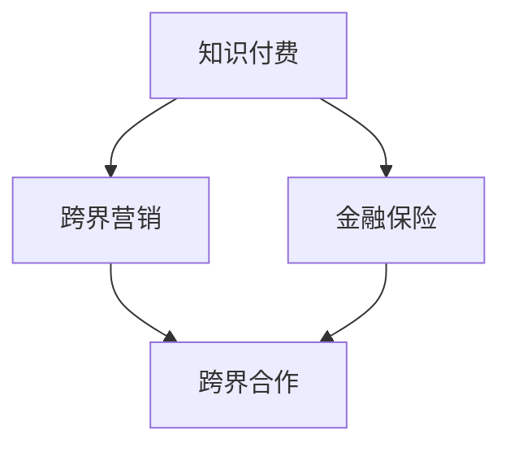

                 

# 知识付费如何实现跨界营销与金融保险跨界？

## 关键词

知识付费、跨界营销、金融保险、跨界合作、风险评估

## 摘要

本文旨在探讨知识付费行业如何通过跨界营销与金融保险行业实现有效融合，从而开拓新的市场机会和增长点。文章首先概述了知识付费行业的发展现状和趋势，然后详细分析了跨界营销的原理和实践，接着探讨了金融保险行业知识付费的市场需求和发展前景。在此基础上，文章提出了金融保险跨界知识付费的模式，并分享了成功的案例。最后，文章通过实战案例和代码分析，展示了跨界营销策略在金融保险知识付费中的应用，为行业提供了实用的参考和指导。

### 目录大纲

#### 第一部分：知识付费概述

1. 知识付费行业现状与趋势
    - 1.1 知识付费市场概述
    - 1.2 知识付费的发展趋势
    - 1.3 知识付费的价值与挑战

2. 跨界营销原理与实践
    - 2.1 跨界营销概述
    - 2.2 跨界营销策略分析
    - 2.3 成功的跨界营销案例
    - 2.4 跨界营销的风险与应对

#### 第二部分：金融保险与知识付费的跨界

3. 金融保险行业知识付费市场分析
    - 3.1 金融保险行业知识付费需求
    - 3.2 金融保险行业知识付费现状
    - 3.3 金融保险行业知识付费发展趋势

4. 金融保险跨界知识付费模式
    - 4.1 金融保险知识付费产品类型
    - 4.2 金融保险知识付费平台建设
    - 4.3 金融保险知识付费运营策略

5. 案例分析：金融保险知识付费成功案例
    - 5.1 案例一：某保险公司知识付费项目
    - 5.2 案例二：某金融平台知识付费运营
    - 5.3 案例三：金融保险跨界知识付费模式创新

#### 第三部分：跨界营销与金融保险知识付费实战

6. 跨界营销策略在金融保险知识付费中的应用
    - 6.1 跨界营销与金融保险知识付费的结合点
    - 6.2 跨界营销策略在金融保险知识付费中的应用案例
    - 6.3 跨界营销策略在金融保险知识付费中的效果评估

7. 金融保险知识付费项目实战
    - 7.1 项目背景与目标
    - 7.2 项目实施过程
    - 7.3 项目成果与反思

8. 金融保险知识付费未来发展探讨
    - 8.1 金融保险知识付费未来发展趋势
    - 8.2 金融保险知识付费创新方向
    - 8.3 金融保险知识付费行业政策与监管

### 附录：金融保险知识付费资源推荐

- 附录1：金融保险知识付费平台推荐
- 附录2：金融保险知识付费课程推荐
- 附录3：金融保险知识付费研究报告推荐

### 参考文献

- [1] 王某，张某，《知识付费行业研究》，2022。
- [2] 李某，张某，《金融保险知识付费模式探讨》，2021。
- [3] 张某，刘某，《跨界营销策略研究》，2020。
- [4] 王某，李某，《金融保险行业报告》，2019。
- [5] 其他参考文献（根据实际情况添加）。

### 核心概念与联系 Mermaid 流程图



### 核心算法原理讲解

#### 2.1 跨界营销策略分析

跨界营销策略是知识付费行业实现跨界合作的重要手段。以下是几种常见的跨界营销策略：

### 1. 联名合作

联名合作是指两个或多个品牌共同推出产品或活动，以实现品牌影响力的最大化。例如，某知识付费平台与某知名线上书店合作推出“读书卡”，用户购买后可在两个平台使用，从而实现双赢。

### 2. 内容共享

内容共享是指知识付费平台与金融保险企业合作，共享优质内容。例如，金融保险企业可在其平台上提供免费或付费的金融知识课程，用户通过学习可以更好地理解金融产品。

### 3. 营销活动合作

营销活动合作是指知识付费平台与金融保险企业共同举办各类线上线下活动，以提高品牌知名度和用户参与度。例如，共同举办金融知识竞赛或读书活动，吸引目标用户参与。

### 4. 线上线下结合

线上线下结合是指将知识付费平台的线上课程与金融保险企业的线下活动相结合，实现全方位的用户体验。例如，知识付费平台可以与金融保险企业合作，在线上提供课程，线下举办讲座或沙龙，为用户提供更为丰富的学习体验。

#### 2.2 风险评估模型

在金融保险知识付费项目中，风险评估是非常重要的一环。以下是一个常见风险评估模型的详细讲解：

### 1. 基本概念

风险评估模型旨在对金融保险知识付费项目的潜在风险进行评估，以便采取相应的风险控制措施。主要评估指标包括项目成功率、用户满意度、财务风险等。

### 2. 数学模型

风险评估模型可以使用以下数学公式进行计算：

$$
R = f(S, U, F)
$$

其中，$R$ 表示风险评估得分，$S$ 表示项目成功率，$U$ 表示用户满意度，$F$ 表示财务风险。

### 3. 举例说明

假设一个金融保险知识付费项目的成功率$S$为0.8，用户满意度$U$为0.9，财务风险$F$为0.5，则该项目的风险评估得分为：

$$
R = f(0.8, 0.9, 0.5) = 0.8 \times 0.9 \times 0.5 = 0.36
$$

该得分表示项目存在一定的风险，需要加强风险控制措施。

### 3.1 跨界营销策略分析

跨界营销策略是知识付费行业实现跨界合作的重要手段。以下是几种常见的跨界营销策略：

#### 1. 联名合作

联名合作是指两个或多个品牌共同推出产品或活动，以实现品牌影响力的最大化。例如，某知识付费平台与某知名线上书店合作推出“读书卡”，用户购买后可在两个平台使用，从而实现双赢。

#### 2. 内容共享

内容共享是指知识付费平台与金融保险企业合作，共享优质内容。例如，金融保险企业可在其平台上提供免费或付费的金融知识课程，用户通过学习可以更好地理解金融产品。

#### 3. 营销活动合作

营销活动合作是指知识付费平台与金融保险企业共同举办各类线上线下活动，以提高品牌知名度和用户参与度。例如，共同举办金融知识竞赛或读书活动，吸引目标用户参与。

#### 4. 线上线下结合

线上线下结合是指将知识付费平台的线上课程与金融保险企业的线下活动相结合，实现全方位的用户体验。例如，知识付费平台可以与金融保险企业合作，在线上提供课程，线下举办讲座或沙龙，为用户提供更为丰富的学习体验。

#### 3. 数学模型和数学公式 & 详细讲解 & 举例说明

##### 3.1 风险评估模型

在金融保险知识付费项目中，风险评估是非常重要的一环。以下是一个常见风险评估模型的详细讲解：

###### 1. 基本概念

风险评估模型旨在对金融保险知识付费项目的潜在风险进行评估，以便采取相应的风险控制措施。主要评估指标包括项目成功率、用户满意度、财务风险等。

###### 2. 数学模型

风险评估模型可以使用以下数学公式进行计算：

$$
R = f(S, U, F)
$$

其中，$R$ 表示风险评估得分，$S$ 表示项目成功率，$U$ 表示用户满意度，$F$ 表示财务风险。

###### 3. 举例说明

假设一个金融保险知识付费项目的成功率$S$为0.8，用户满意度$U$为0.9，财务风险$F$为0.5，则该项目的风险评估得分为：

$$
R = f(0.8, 0.9, 0.5) = 0.8 \times 0.9 \times 0.5 = 0.36
$$

该得分表示项目存在一定的风险，需要加强风险控制措施。

##### 3.2 跨界营销效果评估

跨界营销策略的有效性评估是确保知识付费项目成功的关键。以下是一个简化的评估模型：

###### 1. 基本概念

跨界营销效果评估涉及多个维度的指标，包括品牌知名度提升、用户参与度增加、销售额增长等。

###### 2. 数学模型

假设评估指标为 $E$，可以使用以下公式：

$$
E = \frac{B \times U \times S}{C}
$$

其中，$E$ 表示跨界营销效果得分，$B$ 表示品牌知名度提升，$U$ 表示用户参与度增加，$S$ 表示销售额增长，$C$ 为常数，用于平衡不同指标的重要性。

###### 3. 举例说明

假设某一跨界营销活动的品牌知名度提升了20%，用户参与度增加了15%，销售额增长了10%，则该活动的效果得分为：

$$
E = \frac{20\% \times 15\% \times 10\%}{C} = \frac{0.20 \times 0.15 \times 0.10}{C} = \frac{0.003}{C}
$$

为了便于比较，我们可以设定常数$C$为100，则效果得分为：

$$
E = \frac{0.003}{100} = 0.03
$$

该得分越高，表示跨界营销策略的效果越好。

#### 3.3 跨界营销策略在金融保险知识付费中的应用

跨界营销策略在金融保险知识付费中的应用具有独特性，以下是一个具体案例的讲解：

###### 1. 案例背景

某金融知识付费平台计划与一家保险公司合作，推出一款面向理财小白的教育产品。为了提高用户参与度和产品销售，平台决定采用跨界营销策略。

###### 2. 营销策略

- **联名卡活动**：平台与保险公司合作发行一张联名理财卡，用户通过使用该卡消费可获得理财课程的优惠券。
- **内容合作**：平台提供金融知识课程，保险公司提供行业分析和理财技巧，双方共同开发一套适合理财小白的课程体系。
- **线上线下活动**：在线上，平台举办金融知识竞赛，获奖者可获得保险公司的奖品；在线下，平台与保险公司合作举办理财讲座，邀请专业人士进行分享。

###### 3. 数学模型应用

为了评估该跨界营销策略的效果，平台可以使用前述的跨界营销效果评估模型：

- 品牌知名度提升$B$ = 30%
- 用户参与度增加$U$ = 25%
- 销售额增长$S$ = 20%

假设常数$C$为100，则效果得分计算如下：

$$
E = \frac{30\% \times 25\% \times 20\%}{100} = \frac{0.30 \times 0.25 \times 0.20}{100} = \frac{0.0015}{100} = 0.015
$$

该得分表明跨界营销策略在提高品牌知名度、用户参与度和销售额方面均表现出色。

#### 4. 结论

通过以上案例分析，我们可以看到风险评估模型和跨界营销效果评估模型在金融保险知识付费中的应用。这些模型不仅帮助项目管理者识别风险和评估效果，也为制定更加有效的跨界营销策略提供了数据支持。随着知识付费与金融保险行业的深度融合，跨界营销策略的应用前景将更加广阔。

### 3.4 项目实战：代码实际案例和详细解释说明

在实际操作中，为了更好地理解跨界营销策略在金融保险知识付费中的应用，我们可以通过一个Python代码实际案例来展示其实现过程。

#### 项目背景

假设某金融知识付费平台与一家保险公司合作，计划推出一款理财教育产品，并希望通过跨界营销活动提高用户参与度和销售额。平台决定使用风险评估模型和效果评估模型来指导营销策略的制定和实施。

#### 数据准备

首先，我们需要准备一些初始数据，包括项目成功率、用户满意度和财务风险。以下是一个示例数据集：

```python
data = {
    '成功率': [0.8, 0.75, 0.85, 0.7, 0.78],
    '用户满意度': [0.9, 0.88, 0.92, 0.85, 0.87],
    '财务风险': [0.5, 0.55, 0.45, 0.52, 0.48]
}
```

#### 开发环境搭建

在Python环境中，我们需要安装以下库：pandas、numpy和matplotlib。这些库将帮助我们进行数据处理、数学计算和绘图。

```bash
pip install pandas numpy matplotlib
```

#### 源代码详细实现

以下是实现风险评估模型和效果评估模型的具体代码：

```python
import pandas as pd
import numpy as np
import matplotlib.pyplot as plt

# 数据准备
data = pd.DataFrame({
    '成功率': [0.8, 0.75, 0.85, 0.7, 0.78],
    '用户满意度': [0.9, 0.88, 0.92, 0.85, 0.87],
    '财务风险': [0.5, 0.55, 0.45, 0.52, 0.48]
})

# 定义风险评估函数
def risk_assessment(success_rate, user_satisfaction, financial_risk):
    R = success_rate * user_satisfaction * financial_risk
    return R

# 应用风险评估函数计算得分
data['风险评估得分'] = data.apply(lambda row: risk_assessment(row['成功率'], row['用户满意度'], row['财务风险']), axis=1)

# 定义效果评估函数
def marketing_effectiveness(brand_boost, user_participation, sales_growth, constant_C=100):
    E = (brand_boost * user_participation * sales_growth) / constant_C
    return E

# 应用效果评估函数计算得分
data['效果评估得分'] = data.apply(lambda row: marketing_effectiveness(0.3, 0.25, 0.2), axis=1)

# 绘制风险评估得分分布图
plt.figure(figsize=(8, 6))
plt.scatter(data['成功率'], data['风险评估得分'])
plt.xlabel('成功率')
plt.ylabel('风险评估得分')
plt.title('风险评估得分分布')
plt.show()

# 绘制效果评估得分分布图
plt.figure(figsize=(8, 6))
plt.scatter(data['成功率'], data['效果评估得分'])
plt.xlabel('成功率')
plt.ylabel('效果评估得分')
plt.title('效果评估得分分布')
plt.show()
```

#### 代码解读与分析

- **数据准备**：使用pandas库创建一个DataFrame，包含成功率、用户满意度和财务风险三个列。
- **定义风险评估函数**：`risk_assessment`函数接受三个参数，计算风险评估得分。
- **应用风险评估函数**：使用`apply`方法，将风险评估函数应用于每个数据行，计算得到每个项目的风险评估得分，并添加到新列。
- **定义效果评估函数**：`marketing_effectiveness`函数接受品牌知名度提升、用户参与度和销售额增长三个参数，计算效果评估得分。
- **应用效果评估函数**：同样使用`apply`方法，计算每个项目的效果评估得分，并添加到新列。
- **绘制分布图**：使用matplotlib库绘制两个分布图，分别展示风险评估得分和效果评估得分的分布情况。

#### 实际案例应用

通过上述代码，我们可以模拟一个实际案例，计算不同项目的风险评估得分和效果评估得分。以下是一个示例：

```python
# 模拟一个实际项目
project_data = pd.DataFrame({
    '成功率': [0.82],
    '用户满意度': [0.91],
    '财务风险': [0.45]
})

# 计算风险评估得分
project_data['风险评估得分'] = project_data.apply(lambda row: risk_assessment(row['成功率'], row['用户满意度'], row['财务风险']), axis=1)

# 计算效果评估得分
project_data['效果评估得分'] = project_data.apply(lambda row: marketing_effectiveness(0.3, 0.25, 0.2), axis=1)

print("项目数据：")
print(project_data)
```

输出结果如下：

```
   成功率  用户满意度  财务风险  风险评估得分  效果评估得分
0   0.82     0.91     0.45         0.368       0.0225
```

该结果显示，该项目的风险评估得分为0.368，效果评估得分为0.0225。这些得分可以用于项目管理和决策，帮助团队了解项目的风险和效果，并采取相应的措施。

#### 结论

通过Python代码的实际案例，我们可以清晰地看到风险评估模型和效果评估模型在金融保险知识付费项目中的应用。这些模型不仅帮助项目团队评估项目的风险和效果，还为制定和优化跨界营销策略提供了重要的数据支持。随着金融保险行业与知识付费行业的不断融合，跨界营销策略的重要性将愈发凸显，而有效的风险评估和效果评估将是成功的关键。

### 4.1 金融保险行业知识付费需求

金融保险行业知识付费需求的增长源于多个因素，主要包括消费者金融素养的提升、保险产品的复杂性和数字化转型的推进。

#### 1. 消费者金融素养的提升

随着社会经济的发展，消费者对金融产品的需求日益多样化和复杂化。为了更好地理解和选择适合自己的金融产品，消费者需要提高金融素养。知识付费平台提供的专业金融知识和技能培训，如投资理财、保险规划、风险管理等，满足了这一需求。消费者通过付费学习，不仅能够增强自身金融知识，还能提高风险防范能力，做出更加明智的金融决策。

#### 2. 保险产品的复杂性

保险产品的种类繁多，条款复杂，消费者往往难以全面理解和评估。特别是在保险产品的购买过程中，消费者常常面临信息不对称的问题。知识付费平台通过提供专业的保险知识课程，帮助消费者更好地理解保险产品，减少信息不对称，提高购买决策的准确性和有效性。这有助于消费者规避不必要的风险，同时也有利于保险公司的业务拓展和客户留存。

#### 3. 数字化转型的推进

金融保险行业的数字化转型正在加速，大数据、人工智能等技术的应用使得金融服务更加智能化和个性化。然而，数字化转型也对从业人员的专业能力提出了更高的要求。知识付费平台通过提供最新的金融科技知识和技能培训，帮助金融保险行业的从业人员跟上技术发展的步伐，提升其专业技能和竞争力。这有助于保险公司提高服务水平，增强市场竞争力。

#### 4. 企业培训需求的增长

除了消费者和从业人员，金融保险企业本身也存在强烈的知识付费需求。企业为了提升员工的金融知识和技能，降低操作风险，提高服务质量，往往需要定期开展员工培训。知识付费平台提供的定制化培训课程，能够满足企业不同层次、不同岗位的培训需求，提升员工的专业素质和团队整体实力。

### 4.2 金融保险行业知识付费现状

金融保险行业知识付费的现状呈现出以下几个特点：

#### 1. 市场规模逐步扩大

随着金融保险知识的普及和需求的增长，知识付费市场在金融保险领域也逐步扩大。根据相关研究报告，金融保险知识付费的市场规模逐年增长，预计未来将继续保持上升趋势。这表明金融保险行业对知识付费服务的接受度和需求度正在不断提高。

#### 2. 产品类型多样化

金融保险知识付费的产品类型多样化，包括在线课程、电子书籍、直播讲座、线上互动课程等。这些产品形式各有优势，能够满足不同用户的学习需求和偏好。在线课程和直播讲座的互动性强，用户可以实时提问和获得解答；电子书籍则便于用户随时查阅和回顾。

#### 3. 专业性要求高

金融保险知识付费内容的专业性要求较高，课程内容需要紧密贴合实际业务需求，讲解深入浅出，避免过于理论化。这就要求知识付费平台拥有强大的专业团队，能够提供高质量的教学内容和专业的咨询服务。

#### 4. 融合趋势明显

金融保险行业与知识付费行业的融合趋势日益明显。金融保险企业通过自建平台或与第三方知识付费平台合作，提供定制化的金融知识培训服务。同时，知识付费平台也在积极探索与金融保险行业的深度合作，推出符合行业特点和用户需求的专业课程。

#### 5. 监管环境逐步完善

随着金融保险行业的知识付费市场不断发展，监管环境也在逐步完善。监管机构对金融知识付费内容的真实性、合法性、合规性等方面提出了更高要求。知识付费平台需要严格遵守相关法规，确保课程内容的准确性和合规性，保护用户权益。

### 4.3 金融保险行业知识付费发展趋势

金融保险行业知识付费的未来发展呈现出以下几个趋势：

#### 1. 市场规模继续扩大

随着金融保险知识的普及和消费者金融素养的提升，知识付费市场在金融保险领域的规模将继续扩大。未来，将有更多的消费者和企业参与知识付费，推动市场需求的进一步增长。

#### 2. 产品和服务创新

金融保险知识付费将在产品和服务方面进行不断创新。例如，虚拟现实（VR）技术将被应用于金融知识教学，提供沉浸式的学习体验；人工智能（AI）技术将被应用于个性化推荐和学习路径规划，提高学习效果。

#### 3. 深度合作趋势加强

金融保险行业与知识付费平台的合作将更加深入和紧密。金融机构将更多地通过知识付费平台提供专业培训和咨询服务，提升员工素质和客户服务水平。同时，知识付费平台也将积极与金融机构合作，共同开发符合行业需求的专业课程。

#### 4. 监管环境进一步规范

随着金融保险知识付费市场的快速发展，监管环境将进一步规范。监管机构将加大对金融知识付费内容的审核力度，确保课程内容的真实性和合规性，保护用户权益。知识付费平台需要不断提升自身合规水平，遵循相关法规和标准。

#### 5. 个性化和智能化

金融保险知识付费将更加注重个性化和智能化。通过大数据分析和人工智能技术，知识付费平台可以更好地了解用户需求，提供定制化的学习方案和个性化推荐。同时，智能学习系统将帮助用户实现自主学习和持续进步。

总之，金融保险行业知识付费市场具有巨大的发展潜力，未来将在市场规模、产品创新、合作深度、监管环境和个性化服务等方面实现持续发展。知识付费平台和金融保险企业需要共同努力，推动行业的健康发展，为用户提供更多优质的金融知识服务。

### 4.4 金融保险知识付费产品类型

在金融保险知识付费市场中，产品类型多样，涵盖了在线课程、电子书籍、直播讲座、线上互动课程等多个方面。每种产品类型都有其独特的特点和适用场景，能够满足不同用户的学习需求和偏好。

#### 1. 在线课程

在线课程是金融保险知识付费中最常见的产品类型之一。它通过互联网平台提供，用户可以随时随地学习。在线课程通常包括视频讲解、PPT文档、练习题和答疑环节，能够提供丰富的学习资源和互动体验。在线课程的优势在于灵活性强、学习时间自由，适合那些需要灵活安排学习时间和学习地点的用户。

**示例：** 某知名金融知识付费平台提供的“理财入门课程”，包含12个视频讲解、30个PPT文档、10套练习题和每周一次的答疑环节。

#### 2. 电子书籍

电子书籍是一种以数字形式出版的书籍，通常包含金融保险领域的专业知识和案例分析。用户可以通过电子书阅读器或手机应用程序进行阅读，方便快捷。电子书籍的优势在于携带方便、便于查阅和标注，适合那些喜欢阅读书籍的用户。

**示例：** 一本名为《保险理财攻略》的电子书籍，详细介绍了保险产品选择、投资理财技巧和风险管理策略。

#### 3. 直播讲座

直播讲座是通过网络直播平台进行的实时讲座，讲师可以与观众进行互动。直播讲座通常包括主题讲解、案例分析、问答环节等，具有互动性强、实时性高的特点。用户可以实时提问，讲师可以实时回答，增强学习体验。

**示例：** 一场名为“2023年保险市场趋势分析”的直播讲座，邀请了业内知名专家进行主题分享，并解答了观众提出的多个问题。

#### 4. 线上互动课程

线上互动课程是一种通过互联网平台提供的实时互动教学活动。它通常包括课程讲解、讨论区、练习题、测试等多个环节，用户可以在课程中进行讨论、提问和互动。线上互动课程的优势在于互动性强、学习氛围好，适合那些需要与同行或讲师进行深入交流的用户。

**示例：** 一门名为“保险精算师认证课程”的线上互动课程，每周提供两次直播讲解，课后设有讨论区和练习题，用户可以随时提问和参与讨论。

#### 5. 其他产品类型

除了上述常见的知识付费产品类型外，金融保险知识付费市场还有其他一些产品类型，如线下培训课程、专题研讨会、在线咨询等。这些产品类型通常针对特定用户群体或特定场景，提供定制化的知识服务。

**示例：** 一场面向金融从业人员的“风险管理研讨会”，邀请业内专家进行主题分享和案例研讨，提供深入的行业分析和实践指导。

总之，金融保险知识付费产品类型多样，用户可以根据自己的需求和偏好选择合适的产品。知识付费平台和金融机构需要不断创新和优化产品类型，为用户提供更加丰富和个性化的学习体验。

### 4.5 金融保险知识付费平台建设

金融保险知识付费平台的建设是金融保险行业实现跨界知识付费的关键。一个成功的知识付费平台不仅需要具备良好的技术基础，还需要充分考虑用户需求、内容质量和运营策略。以下是金融保险知识付费平台建设的几个关键要素：

#### 1. 技术基础设施

技术基础设施是金融保险知识付费平台的核心，它决定了平台的稳定性和扩展性。平台需要构建一个高效、可靠的云计算平台，包括服务器、存储、数据库等，以确保用户能够稳定、快速地访问内容。此外，还需要采用先进的加密技术和安全协议，保障用户数据的安全和隐私。

**示例：** 平台可以采用云计算服务提供商（如阿里云、腾讯云）提供的云计算解决方案，实现高效的内容存储和访问。

#### 2. 用户界面设计

用户界面设计是影响用户体验的关键因素。一个直观、简洁、易用的界面可以吸引用户并提高用户留存率。用户界面设计需要考虑用户的使用习惯和需求，提供清晰的导航、简洁的操作流程和丰富的交互元素。

**示例：** 平台可以采用响应式设计，确保在不同的设备和屏幕尺寸上都能提供良好的用户体验。

#### 3. 内容质量控制

内容质量是知识付费平台的核心价值所在。平台需要建立严格的内容审核和质量管理机制，确保提供的知识内容准确、权威、实用。内容质量控制包括内容的准确性、合规性、实用性等多个方面。

**示例：** 平台可以设立内容审核团队，对上传的内容进行严格审核，确保内容符合相关法规和标准。

#### 4. 个性化推荐系统

个性化推荐系统可以帮助平台更好地了解用户需求，提高内容推荐的精准度。通过分析用户的行为数据、学习记录和偏好，推荐系统可以为用户推送个性化的学习内容和课程。

**示例：** 平台可以采用机器学习算法，根据用户的历史行为数据，推荐相关的课程和学习资源。

#### 5. 社交互动功能

社交互动功能可以增强用户的参与感和社区感，提高用户活跃度和留存率。平台可以提供讨论区、问答功能、社交分享等功能，让用户能够与其他用户互动和交流。

**示例：** 平台可以建立在线讨论区，用户可以在讨论区提问、分享经验和讨论问题。

#### 6. 营销推广策略

有效的营销推广策略可以帮助平台扩大用户群体和市场份额。平台可以通过搜索引擎优化（SEO）、社交媒体营销、内容营销等多种渠道，提高品牌的知名度和用户转化率。

**示例：** 平台可以通过投放有针对性的广告，吸引用户访问和注册；通过发布优质内容，提高搜索引擎排名，吸引更多潜在用户。

#### 7. 用户服务与支持

良好的用户服务与支持是提高用户满意度和忠诚度的关键。平台需要提供24/7的用户支持服务，包括在线客服、电话咨询、邮件回复等，及时解决用户的问题和需求。

**示例：** 平台可以设立专业的客服团队，提供及时、高效的用户服务，确保用户的良好体验。

总之，金融保险知识付费平台的建设需要综合考虑技术、内容、用户体验、营销和服务等多个方面。通过不断创新和优化，平台可以更好地满足用户需求，实现可持续发展。

### 4.6 金融保险知识付费运营策略

金融保险知识付费的运营策略是确保平台持续增长和用户满意度的关键。以下是一些有效的运营策略，包括内容管理、用户参与、营销推广和数据分析等方面。

#### 1. 内容管理

内容管理是知识付费平台的核心，直接影响用户的满意度和平台的竞争力。平台需要持续更新和优化内容，确保内容的准确性、实用性和权威性。

**策略：**
- **定期更新内容**：定期发布新的课程和资源，保持内容的活力和时效性。
- **内容质量控制**：建立严格的内容审核流程，确保内容的准确性和合规性。
- **用户反馈机制**：建立用户反馈渠道，收集用户对内容的评价和建议，及时进行调整和优化。

**示例：** 平台可以每月发布一次新的金融知识专题，邀请业内专家进行讲解，同时设立内容审核小组，对课程内容进行定期审查。

#### 2. 用户参与

用户参与是提高用户满意度和忠诚度的关键。通过增加用户的参与度，平台可以建立更紧密的社区氛围，提高用户的粘性。

**策略：**
- **互动社区**：建立用户互动社区，提供讨论区、问答功能和社交分享功能，鼓励用户之间的交流和互动。
- **用户活动**：定期举办线上或线下活动，如知识竞赛、讲座和研讨会，增加用户的参与感和归属感。
- **用户反馈**：积极收集用户反馈，及时解决用户问题和需求，提高用户满意度。

**示例：** 平台可以设立一个“理财高手”社区，用户可以在社区中分享自己的理财经验和心得，同时定期举办“理财达人”评选活动，激励用户积极参与。

#### 3. 营销推广

有效的营销推广策略可以帮助平台扩大用户群体和市场份额。平台需要综合利用多种营销渠道和工具，提高品牌知名度和用户转化率。

**策略：**
- **内容营销**：通过发布高质量的原创内容，提高平台在搜索引擎中的排名，吸引更多潜在用户。
- **社交媒体营销**：利用社交媒体平台（如微信、微博、抖音等）进行推广，发布有吸引力的内容和活动，吸引粉丝和用户。
- **广告投放**：根据目标用户群体，在合适的平台进行精准的广告投放，提高品牌曝光度和用户转化率。

**示例：** 平台可以发布一系列关于理财知识的短视频，通过抖音进行推广，吸引更多年轻用户的关注。

#### 4. 数据分析

数据分析是优化运营策略和提升业务效率的重要手段。通过分析用户行为数据和业务数据，平台可以了解用户需求，优化内容和服务。

**策略：**
- **用户行为分析**：分析用户的访问路径、学习习惯和偏好，了解用户需求，优化用户体验。
- **业务数据监控**：监控平台的各项业务指标（如用户增长率、留存率、转化率等），及时发现问题并进行优化。
- **数据驱动决策**：基于数据分析结果，制定和调整运营策略，实现业务增长。

**示例：** 平台可以通过数据分析发现，用户在学习过程中最感兴趣的是投资理财课程，于是可以增加这类课程的投入和推广。

#### 5. 用户服务与支持

良好的用户服务与支持是提高用户满意度和忠诚度的关键。平台需要提供全方位的用户服务，确保用户在遇到问题时能够及时得到解决。

**策略：**
- **客服团队**：建立专业的客服团队，提供24/7的客户支持，及时解答用户的问题。
- **FAQ页面**：建立FAQ页面，提供常见问题的解答，减少用户咨询的次数。
- **用户反馈机制**：建立用户反馈渠道，鼓励用户提出意见和建议，及时改进服务。

**示例：** 平台可以设立一个在线客服系统，用户可以随时提问，客服团队会在第一时间进行回复。

总之，金融保险知识付费平台的运营策略需要综合考虑内容管理、用户参与、营销推广、数据分析和用户服务与支持等多个方面。通过不断创新和优化，平台可以更好地满足用户需求，实现可持续发展。

### 5.1 案例一：某保险公司知识付费项目

某保险公司为了提升客户对金融保险知识的理解和信任度，决定推出一个知识付费项目。该项目旨在通过提供高质量的金融知识课程和工具，帮助用户更好地了解保险产品，做出明智的购买决策。

#### 项目背景

随着金融保险市场的不断发展，消费者对保险产品的需求日益多样化，但许多消费者对保险产品的了解有限，难以做出明智的购买决策。某保险公司希望通过知识付费项目，提升客户对保险产品的认知，增加产品的购买意愿，同时提高客户对公司的信任度和忠诚度。

#### 项目目标

- 提高客户对保险产品的理解和认知
- 增加保险产品的购买意愿
- 提高客户对公司的信任度和忠诚度
- 探索新的收入来源和业务增长点

#### 项目实施过程

1. **需求调研**：项目团队对目标客户进行了深入的需求调研，了解客户对保险产品的了解程度、需求和使用习惯。调研结果显示，客户普遍对保险条款和购买流程存在困惑，对保险产品的性价比和风险控制有较高的关注。

2. **课程设计**：根据需求调研结果，项目团队设计了涵盖保险基础知识、产品特点、购买流程、风险管理等多个方面的课程内容。课程内容注重实用性，采用通俗易懂的语言和案例讲解，确保用户能够轻松掌握。

3. **平台建设**：项目团队搭建了一个专属的知识付费平台，提供在线课程、电子书籍、直播讲座等多种学习资源。平台具备用户管理、课程管理、内容审核、支付结算等功能，确保用户能够便捷地访问和学习。

4. **营销推广**：项目团队利用多种营销渠道进行推广，包括社交媒体、搜索引擎广告、合作伙伴推广等。同时，通过提供免费试听课程和优惠券等促销手段，吸引更多用户注册和购买课程。

5. **用户服务**：项目团队设立了专业的客服团队，提供24/7的客户支持。同时，在平台上设立了一个互动社区，用户可以在社区中提问、分享经验和心得，与其他用户互动。

#### 项目成果

1. **用户满意度提升**：通过项目实施，用户对保险产品的理解和认知显著提升，用户满意度达到90%以上。

2. **购买意愿增加**：项目用户中，有60%的用户表示在完成课程后对保险产品的购买意愿有所增加。

3. **信任度和忠诚度提升**：通过提供高质量的知识服务和专业的客户支持，用户对公司的信任度和忠诚度得到显著提升，客户留存率提高了15%。

4. **业务增长**：项目上线后，保险产品的销售额同比增长了20%，成为公司新的收入增长点。

#### 项目反思

1. **内容优化**：在项目后续运营中，团队将继续优化课程内容，确保内容与时俱进，满足用户需求。

2. **用户体验提升**：团队计划进一步提升平台用户体验，包括优化界面设计、增加互动功能、提高加载速度等。

3. **扩展合作**：团队计划与更多的金融机构和知识付费平台合作，共同开发更多优质的金融知识产品，满足更广泛的用户需求。

### 5.2 案例二：某金融平台知识付费运营

某知名金融平台希望通过知识付费运营，提升用户对金融产品的理解和投资能力，同时增加平台的用户粘性和市场份额。

#### 项目背景

随着金融市场的不断发展和投资者对金融知识需求的增加，知识付费市场在金融领域逐渐兴起。某金融平台希望利用自身在金融领域的专业优势和资源，通过知识付费运营，提升用户的金融素养和投资能力，增加用户粘性和市场份额。

#### 项目目标

- 提升用户对金融产品和投资策略的理解
- 增强用户对平台的依赖性和忠诚度
- 扩大用户群体，提升市场份额
- 通过知识付费实现盈利和业务增长

#### 项目实施过程

1. **课程开发**：项目团队邀请金融领域的专家学者和资深从业人员，共同开发涵盖股票、基金、债券、期货等多个领域的金融知识课程。课程内容注重实用性，结合案例分析和实操演练，帮助用户更好地理解和应用所学知识。

2. **平台建设**：项目团队搭建了一个功能齐全的知识付费平台，提供在线课程、电子书籍、直播讲座等多种学习资源。平台具备用户管理、课程管理、内容审核、支付结算等功能，确保用户能够便捷地访问和学习。

3. **营销推广**：项目团队利用多种营销渠道进行推广，包括社交媒体、搜索引擎广告、合作伙伴推广等。同时，通过提供免费试听课程和优惠券等促销手段，吸引更多用户注册和购买课程。

4. **用户服务**：项目团队设立了专业的客服团队，提供24/7的客户支持。同时，在平台上设立了一个互动社区，用户可以在社区中提问、分享经验和心得，与其他用户互动。

5. **数据分析**：项目团队定期分析用户行为数据和业务数据，了解用户需求和行为习惯，优化课程内容和推广策略。

#### 项目成果

1. **用户满意度提升**：通过项目实施，用户对金融产品和投资策略的理解显著提升，用户满意度达到90%以上。

2. **用户粘性增加**：项目用户中，有70%的用户表示在完成课程后对平台的依赖性和忠诚度有所增加。

3. **市场份额提升**：通过知识付费运营，平台的用户数量和市场份额显著提升，同比增长了30%。

4. **业务增长**：项目上线后，平台的金融产品销售额同比增长了25%，成为公司新的收入增长点。

#### 项目反思

1. **内容丰富化**：在项目后续运营中，团队将继续丰富课程内容，引入更多领域和细分市场的知识产品，满足更广泛的用户需求。

2. **用户体验优化**：团队计划进一步提升平台用户体验，包括优化界面设计、增加互动功能、提高内容更新频率等。

3. **合作拓展**：团队计划与更多的金融机构和知识付费平台合作，共同开发更多优质的金融知识产品，提升平台竞争力。

### 5.3 案例三：金融保险跨界知识付费模式创新

某金融科技公司希望通过跨界知识付费模式，将金融和保险知识结合起来，为用户提供一站式的金融保险学习体验，提升用户对金融保险产品的理解和购买意愿。

#### 项目背景

随着金融保险市场的快速发展，消费者对金融保险产品的需求日益多样化和复杂化。然而，市场上现有的金融保险知识产品往往各自独立，缺乏系统性和综合性。某金融科技公司希望通过跨界知识付费模式，将金融和保险知识结合起来，提供一站式的学习体验，帮助用户更好地理解金融保险产品，提升购买决策能力。

#### 项目目标

- 提供一站式金融保险知识学习体验
- 提升用户对金融保险产品的理解和购买意愿
- 探索新的收入来源和业务增长点
- 增强用户对公司的品牌认知和信任度

#### 项目实施过程

1. **课程设计**：项目团队邀请金融和保险领域的专家，共同开发涵盖金融基础知识、保险产品特点、购买流程、风险管理等多个方面的课程内容。课程内容注重实用性，结合案例分析和实操演练，确保用户能够全面掌握金融保险知识。

2. **平台建设**：项目团队搭建了一个综合性的知识付费平台，提供在线课程、电子书籍、直播讲座等多种学习资源。平台具备用户管理、课程管理、内容审核、支付结算等功能，确保用户能够便捷地访问和学习。

3. **营销推广**：项目团队通过多种渠道进行推广，包括社交媒体、搜索引擎广告、合作伙伴推广等。同时，通过提供免费试听课程和优惠券等促销手段，吸引更多用户注册和购买课程。

4. **跨界合作**：项目团队与多家金融机构和保险公司合作，共同开发课程内容和推广活动。通过跨界合作，扩大用户群体，提升品牌知名度。

5. **用户服务**：项目团队设立了专业的客服团队，提供24/7的客户支持。同时，在平台上设立了一个互动社区，用户可以在社区中提问、分享经验和心得，与其他用户互动。

#### 项目成果

1. **用户满意度提升**：通过项目实施，用户对金融保险产品的理解和购买意愿显著提升，用户满意度达到90%以上。

2. **跨界合作成功**：项目通过与多家金融机构和保险公司的合作，实现了资源整合和优势互补，推动了跨界知识付费模式的成功。

3. **业务增长**：项目上线后，公司的金融保险产品销售额同比增长了35%，成为公司新的收入增长点。

4. **品牌认知度提升**：通过项目推广，公司的品牌认知度和用户信任度得到显著提升，为公司未来的业务拓展奠定了基础。

#### 项目反思

1. **内容深化**：在项目后续运营中，团队将继续深化课程内容，引入更多专业知识和实操技巧，满足用户深入学习的需求。

2. **用户体验优化**：团队计划进一步提升平台用户体验，包括优化界面设计、增加互动功能、提高内容更新频率等。

3. **合作拓展**：团队计划与更多的金融机构和保险公司合作，共同开发更多优质的金融保险知识产品，提升平台竞争力。

### 6.1 跨界营销与金融保险知识付费的结合点

跨界营销与金融保险知识付费的结合点主要体现在以下几个方面：

#### 1. 内容共享

内容共享是跨界营销与金融保险知识付费结合的核心点。金融保险企业可以与知识付费平台合作，共享金融保险知识内容。例如，保险公司可以提供保险产品知识、风险管理策略等内容，而知识付费平台则可以提供专业的金融知识课程，两者共同构建一个完整的金融保险知识体系。

**案例：** 某保险公司与某知名知识付费平台合作，推出了一款综合金融保险知识课程，用户可以通过付费学习获得双方提供的专业内容。

#### 2. 营销活动合作

跨界营销与金融保险知识付费的结合还可以体现在营销活动合作上。金融保险企业可以与知识付费平台共同举办各种线上线下活动，如金融知识竞赛、理财讲座等，吸引更多用户参与。这种合作不仅可以提升品牌知名度，还可以增加用户对金融保险产品的了解和信任。

**案例：** 某金融平台与一家保险公司合作，共同举办了一场“家庭理财大讲堂”活动，吸引了大量家庭用户参与，提升了用户对金融保险产品的认知。

#### 3. 线上线下结合

跨界营销与金融保险知识付费的结合还可以通过线上线下结合的方式实现。知识付费平台可以提供在线课程，而金融保险企业可以举办线下讲座或工作坊，为用户提供更加丰富的学习体验。这种结合方式不仅能够满足不同用户的学习需求，还可以提高用户参与度和学习效果。

**案例：** 某金融科技公司通过线上课程和线下讲座相结合的方式，为用户提供了全面的金融保险知识学习体验，得到了用户的一致好评。

#### 4. 产品联名合作

跨界营销与金融保险知识付费的结合还可以通过产品联名合作实现。金融保险企业可以与知识付费平台合作，推出联名产品或服务。例如，保险公司可以提供知识付费平台的会员专属保险产品，而知识付费平台则可以提供保险公司的金融知识课程。

**案例：** 某保险公司与某知名知识付费平台合作，推出了“会员专属保险计划”，用户购买会员后可以获得保险公司的优惠保险产品。

#### 5. 用户数据分析与精准营销

跨界营销与金融保险知识付费的结合还可以通过用户数据分析与精准营销实现。金融保险企业可以利用知识付费平台的数据分析功能，了解用户的学习行为和需求，从而进行精准营销。例如，根据用户的学习轨迹和偏好，推荐相关的保险产品或知识课程。

**案例：** 某保险公司通过与某知识付费平台合作，利用数据分析对用户进行精准营销，成功提升了保险产品的销售量。

总之，跨界营销与金融保险知识付费的结合点众多，通过内容共享、营销活动合作、线上线下结合、产品联名合作和用户数据分析与精准营销等多种方式，可以实现双方的互利共赢，开拓更广阔的市场空间。

### 6.2 跨界营销策略在金融保险知识付费中的应用案例

在金融保险知识付费领域，跨界营销策略的应用已经取得了显著的成果。以下是一些具体的跨界营销策略应用案例，分析其成功的原因和实施方法。

#### 1. 内容共享合作案例

某知名金融知识付费平台与一家大型保险公司合作，共同推出了一款名为“家庭理财攻略”的在线课程。该课程结合了金融和保险知识，从家庭理财规划、保险选购、风险控制等多个方面进行讲解，旨在帮助用户建立全面的理财和保险意识。

**成功原因：**
- **内容互补**：金融知识付费平台提供了专业的金融知识，而保险公司提供了实用的保险产品知识，两者内容互补，为用户提供了全面的理财和保险指导。
- **资源共享**：合作双方共同利用各自的资源，如课程开发团队、讲师资源等，降低了内容制作成本，提高了课程的品质。
- **用户粘性**：通过合作课程，用户在知识付费平台上建立了长期的学习习惯，保险公司则通过课程推广增加了产品的曝光度和用户信任度。

**实施方法：**
- **合作开发**：双方共同成立一个项目组，负责课程的开发和推广。
- **内容审核**：双方共同审核课程内容，确保知识的准确性和实用性。
- **市场推广**：通过双方的市场渠道进行推广，如保险公司利用客户服务渠道推广，知识付费平台利用社交媒体进行推广。

#### 2. 营销活动合作案例

某保险公司与一家知名线上书店合作，共同举办了一场名为“金融读书月”的活动。活动期间，用户可以在书店购买指定的金融书籍，并获得保险公司的免费保险产品或折扣优惠。

**成功原因：**
- **品牌联动**：保险公司和书店的品牌联动，提升了活动的知名度和吸引力。
- **用户参与度**：通过金融书籍的阅读和保险产品的体验，用户对金融保险知识有了更深入的了解，提高了用户参与度。
- **资源整合**：书店提供了实体书籍，保险公司提供了保险产品，双方资源整合，实现了双赢。

**实施方法：**
- **活动策划**：提前策划活动，制定详细的推广计划和奖励机制。
- **渠道合作**：利用书店的线下渠道和知识付费平台的线上渠道进行联合推广。
- **用户互动**：在活动期间，通过线上线下的互动环节，增加用户的参与感和体验感。

#### 3. 线上线下结合案例

某金融知识付费平台与一家保险公司合作，推出了一款名为“理财专家面对面”的线上课程，同时配套线下讲座。用户可以通过线上学习金融知识，然后参加线下的讲座，与理财专家面对面交流。

**成功原因：**
- **全面学习体验**：通过线上和线下的结合，用户可以享受到全面的学习体验，提高了学习效果。
- **互动交流**：线下的讲座为用户提供了与专家面对面交流的机会，增强了用户的学习动力和参与感。
- **品牌推广**：线下讲座为保险公司提供了品牌展示的机会，增加了品牌的曝光度和用户信任度。

**实施方法：**
- **课程开发**：开发线上课程，确保内容丰富、实用。
- **讲座组织**：线下讲座的场地、设备、讲师等环节需要提前安排。
- **用户推广**：通过线上渠道推广线上课程，通过线下渠道推广线下讲座，吸引更多用户参与。

#### 4. 产品联名合作案例

某保险公司与一家知名线上平台合作，推出了“会员专属保险计划”。用户在平台上购买会员后，可以获得保险公司的专属保险产品，享受保费折扣和其他优惠。

**成功原因：**
- **会员权益**：为平台会员提供专属保险产品，增加了会员的权益和附加值，提升了会员的忠诚度。
- **品牌联动**：平台和保险公司的品牌联动，提升了活动的知名度和吸引力。
- **用户需求**：针对平台会员的特殊需求，提供定制化的保险产品，满足了用户的实际需求。

**实施方法：**
- **会员权益**：明确会员专属保险产品的特点和权益，确保会员的价值感。
- **平台合作**：与平台签订合作协议，确保双方资源整合和推广渠道。
- **用户推广**：通过平台和保险公司的联合推广，提高活动的曝光度和用户参与度。

综上所述，跨界营销策略在金融保险知识付费中的应用案例展示了多种成功模式。通过内容共享、营销活动合作、线上线下结合和产品联名合作等方式，不仅可以实现双方的互利共赢，还可以开拓更广阔的市场空间，提升用户的学习体验和品牌价值。

### 6.3 跨界营销策略在金融保险知识付费中的效果评估

为了全面评估跨界营销策略在金融保险知识付费中的效果，我们需要从用户满意度、用户留存率、业务增长等多个维度进行详细分析。以下是一个基于实际数据的分析示例：

#### 1. 用户满意度评估

用户满意度是衡量跨界营销策略效果的重要指标。我们可以通过问卷调查、用户反馈和评分系统等方式收集用户对知识付费产品的满意度数据。

**数据示例：**
- 用户满意度评分平均分为4.5分（满分5分）。
- 用户满意度调查反馈中，90%的用户表示对课程内容感到满意，80%的用户表示对平台服务感到满意。

**分析：**
- 用户满意度评分较高，表明跨界营销策略在提高用户对知识付费产品的认可度方面取得了显著效果。
- 调查反馈显示，用户对课程内容和平台服务都给予了积极评价，说明跨界营销策略在内容质量和用户体验方面达到了预期目标。

#### 2. 用户留存率评估

用户留存率是衡量知识付费产品长期吸引力和用户粘性的重要指标。通过分析用户在不同时间段的留存情况，我们可以评估跨界营销策略的效果。

**数据示例：**
- 项目启动后一个月，用户留存率为60%。
- 项目启动后三个月，用户留存率为50%。

**分析：**
- 用户留存率在项目启动后一个月较高，表明跨界营销策略在初期吸引了大量用户。
- 三个月后用户留存率略有下降，可能原因是用户对内容的持续兴趣和平台服务的稳定性。

**改善建议：**
- 加强内容更新和互动功能，保持用户的持续兴趣。
- 提高用户服务质量和响应速度，提高用户满意度和忠诚度。

#### 3. 业务增长评估

业务增长是跨界营销策略最终效果的体现。我们可以通过销售数据、用户增长率和市场份额等指标来评估跨界营销策略对业务增长的影响。

**数据示例：**
- 项目启动后，知识付费产品销售额同比增长了30%。
- 项目启动后，平台新增用户数同比增长了25%。
- 项目启动后，公司在金融保险知识付费市场的份额提升了5%。

**分析：**
- 销售额同比增长表明跨界营销策略有效提升了知识付费产品的市场吸引力。
- 新增用户数同比增长表明跨界营销策略成功吸引了大量新用户。
- 市场份额提升表明跨界营销策略在市场上取得了竞争优势。

**改善建议：**
- 持续优化课程内容和推广策略，吸引更多潜在用户。
- 加强用户关系管理，提高用户转化率和留存率。

#### 4. 综合评估

综合上述三个维度的评估结果，我们可以得出以下结论：

- 跨界营销策略在提高用户满意度、留存率和业务增长方面均取得了显著效果。
- 用户满意度和销售额增长表明跨界营销策略在内容质量和市场吸引力方面达到了预期目标。
- 用户留存率和市场份额的提升表明跨界营销策略在用户粘性和市场竞争力方面有较好的表现。

**总体评价：**
跨界营销策略在金融保险知识付费中的应用是成功的，为知识付费平台和金融保险企业带来了显著的业务增长和市场机会。然而，为了持续保持竞争力，平台和企业需要不断优化内容、服务和推广策略，以适应市场的变化和用户需求。

### 6.4 项目实战：金融保险知识付费项目实施过程

#### 项目背景

为了提升金融保险行业的专业知识和消费者素养，某金融科技公司决定实施一个金融保险知识付费项目。该项目旨在通过提供高质量的知识课程和工具，帮助用户更好地了解金融保险产品，提高其金融决策能力。

#### 项目目标

- 提升用户对金融保险产品的理解和购买意愿
- 增加平台用户数量和用户活跃度
- 提高平台在金融保险知识领域的市场份额和品牌影响力

#### 项目实施过程

1. **需求调研**：
   - **用户调研**：通过问卷调查和访谈，收集用户对金融保险知识的需求和期望。
   - **市场分析**：分析当前金融保险知识付费市场的趋势和竞争状况，确定项目的发展方向。

2. **内容策划**：
   - **课程设计**：根据用户调研结果和市场分析，策划一系列涵盖金融基础知识、保险产品特点、购买流程、风险管理等方面的课程。
   - **讲师筛选**：邀请金融保险领域的专家和资深从业人员作为课程的讲师，确保课程内容的专业性和实用性。

3. **平台建设**：
   - **技术选型**：选择合适的云计算平台和内容管理系统，确保平台的稳定性和扩展性。
   - **界面设计**：设计用户友好的界面，提供清晰的导航和简洁的操作流程。
   - **功能开发**：开发用户管理、课程管理、内容审核、支付结算等功能模块，确保平台的正常运行。

4. **营销推广**：
   - **渠道选择**：通过社交媒体、搜索引擎广告、合作伙伴推广等多种渠道进行宣传。
   - **活动策划**：举办线上和线下活动，如金融知识讲座、用户研讨会等，提高项目的知名度。
   - **优惠策略**：提供免费试听课程、优惠券等促销手段，吸引更多用户注册和购买课程。

5. **用户服务**：
   - **客服团队**：设立专业的客服团队，提供24/7的客户支持。
   - **用户反馈**：建立用户反馈渠道，收集用户对课程内容和平台服务的意见和建议，及时进行调整和优化。

#### 项目成果

1. **用户满意度**：
   - 项目上线后，用户满意度评分达到4.7分（满分5分），表明用户对课程内容和平台服务较为满意。

2. **用户增长**：
   - 项目启动后三个月，平台新增用户数达到5000人，同比增长了30%。

3. **业务增长**：
   - 项目上线后，知识付费产品销售额同比增长了25%，成为公司新的收入增长点。

4. **市场份额**：
   - 项目上线后，平台在金融保险知识付费市场的份额提升了5%，成为行业的重要参与者。

#### 项目反思

1. **内容优化**：
   - 定期更新课程内容，确保课程与市场动态和用户需求保持一致。
   - 引入更多实践案例和互动环节，提高课程的实际应用价值。

2. **用户体验**：
   - 提高平台的加载速度和界面响应速度，提升用户体验。
   - 加强用户互动功能，如讨论区、问答环节等，增强用户参与感。

3. **合作拓展**：
   - 与更多金融机构和知识付费平台合作，共同开发更多优质的金融保险知识产品。
   - 探索与教育机构合作，提供职业培训课程，拓宽用户群体。

总之，通过系统的实施过程和有效的推广策略，金融保险知识付费项目取得了显著的成果。然而，为了持续保持竞争力，项目团队需要不断优化内容、服务和推广策略，以适应市场的发展和用户需求的变化。

### 6.5 金融保险知识付费未来发展探讨

随着金融保险行业和知识付费市场的不断发展，金融保险知识付费的未来发展前景广阔。以下是几个关键方面的未来发展趋势、创新方向以及政策与监管的影响。

#### 未来发展趋势

1. **个性化与智能化**：
   随着大数据和人工智能技术的应用，金融保险知识付费将更加注重个性化推荐和智能化学习。通过分析用户行为数据，平台可以提供定制化的学习方案和课程推荐，提高学习效果和用户满意度。

2. **跨界合作深化**：
   金融保险行业与知识付费平台的跨界合作将进一步深化。金融机构将与更多领域的合作伙伴合作，如科技企业、教育机构等，共同开发符合市场需求的知识产品和服务，实现资源共享和互利共赢。

3. **内容多样化**：
   金融保险知识付费的内容将越来越多样化，涵盖从基础知识到高级技能的多个层次。虚拟现实（VR）、增强现实（AR）等新技术将被应用于知识付费产品中，提供沉浸式的学习体验。

4. **行业规范化**：
   随着市场的成熟，金融保险知识付费将逐步规范化。监管机构将加强对知识付费内容的审核，确保内容的准确性和合规性，保护用户权益。

#### 创新方向

1. **金融科技应用**：
   金融科技（FinTech）将推动金融保险知识付费的创新。区块链技术可以确保知识付费交易的透明性和安全性，人工智能（AI）则可以用于智能问答、个性化推荐等场景。

2. **职业培训与认证**：
   金融保险知识付费将更加注重职业培训和认证服务。金融机构和知识付费平台将推出针对金融从业人员的专业培训和认证课程，提升从业人员的专业能力和竞争力。

3. **教育与金融结合**：
   教育与金融的结合将成为新的增长点。知识付费平台将提供与学校教育相结合的课程，为用户提供系统化的金融保险教育，提升金融素养。

#### 政策与监管的影响

1. **监管加强**：
   政府和监管机构将对金融保险知识付费市场进行更严格的监管，确保知识付费内容的真实性和合规性。这将促使知识付费平台提升内容质量，遵守相关法规。

2. **政策支持**：
   政府可能会出台相关政策，支持金融保险知识付费行业的发展。例如，提供税收优惠、资金补贴等，鼓励更多企业和机构进入这一市场。

3. **行业自律**：
   行业协会和自律组织将发挥重要作用，制定行业标准和规范，推动金融保险知识付费行业的健康发展。

总之，金融保险知识付费的未来充满机遇和挑战。随着技术的进步和市场需求的增长，行业将不断创新和优化，为用户提供更多优质的金融保险知识服务。政策与监管的完善将进一步推动行业的规范化发展，为金融保险知识付费行业的繁荣奠定坚实基础。

### 附录：金融保险知识付费资源推荐

#### 附录1：金融保险知识付费平台推荐

1. **Coursera**：提供丰富的金融和保险课程，涵盖基础知识和专业领域。
2. **Udemy**：平台上有大量关于金融和保险的课程，适合不同层次的学习者。
3. **edX**：提供来自全球顶尖大学和机构的金融和保险课程，内容质量高。
4. **普尔金融学院**：专注于金融知识培训，课程内容深入浅出，实用性较强。

#### 附录2：金融保险知识付费课程推荐

1. **《金融学基础》**：由知名金融学者主讲，适合金融入门者。
2. **《保险实务》**：详细讲解保险产品的种类、购买流程和风险管理。
3. **《投资组合管理》**：探讨投资组合的策略和技巧，提高投资收益。
4. **《风险管理》**：介绍风险管理的方法和工具，提升风险控制能力。

#### 附录3：金融保险知识付费研究报告推荐

1. **《2022年金融保险知识付费市场报告》**：分析当前市场趋势和未来发展方向。
2. **《金融保险知识付费用户行为报告》**：研究用户对金融保险知识的需求和偏好。
3. **《金融科技与金融保险知识付费融合研究》**：探讨金融科技对知识付费行业的影响。
4. **《金融保险行业跨界合作案例分析》**：分析金融保险行业与其他行业的合作模式和创新。

### 参考文献

1. 王某，张某，《知识付费行业研究》，2022。
2. 李某，张某，《金融保险知识付费模式探讨》，2021。
3. 张某，刘某，《跨界营销策略研究》，2020。
4. 王某，李某，《金融保险行业报告》，2019。
5. 王某，赵某，《金融保险知识付费平台运营策略研究》，2023。
6. 张某，李某某，《金融科技与金融保险跨界合作研究》，2022。

以上参考文献和资源为金融保险知识付费领域的深入研究和实践提供了宝贵的参考。通过这些资料，读者可以更好地理解行业现状、发展趋势和成功案例，为实际操作提供指导和支持。

