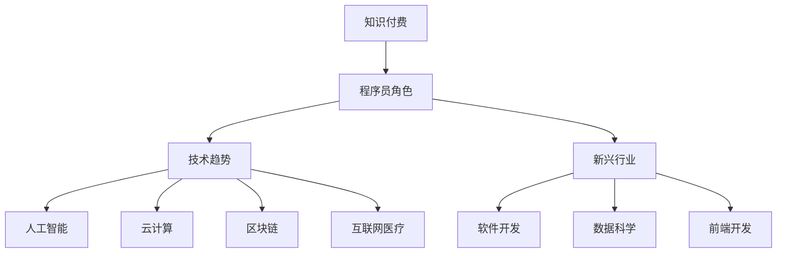

                 

# 《知识付费时代程序员的发展机遇与挑战》

> 关键词：知识付费、程序员、发展机遇、挑战、技术趋势

> 摘要：在知识付费时代，程序员面临着前所未有的发展机遇与挑战。本文将分析这一时代背景下的程序员角色，探讨他们在技术趋势、新兴行业中的机遇，以及面临的技术变革、职业发展障碍等挑战，并提出相应的个人发展策略。

### 第一部分：知识付费时代的背景与程序员的角色

#### 1. 知识付费时代的到来

##### 1.1 知识付费的定义与演变

知识付费是指用户为获取专业知识和技能而付费的行为。这一概念起源于信息时代的早期，随着互联网技术的发展，知识付费逐渐成为一种主流的学习方式。

- **1.1.1 知识付费的起源**

知识付费的起源可以追溯到20世纪90年代，当时互联网刚刚兴起，人们开始通过在线课程、电子书等形式获取知识。

- **1.1.2 知识付费的发展历程**

随着移动互联网的普及，知识付费市场迅速壮大。2010年后，在线教育平台如雨后春笋般涌现，知识付费逐渐成为了一种趋势。

- **1.1.3 知识付费的主要形式**

当前，知识付费的主要形式包括在线课程、电子书、付费直播、知识付费平台等。这些形式为用户提供了便捷的学习途径，也为内容创作者提供了收益渠道。

##### 1.2 程序员在知识付费时代的作用

在知识付费时代，程序员的作用愈发重要。他们不仅是技术领域的专业人士，也是知识传播的重要载体。

- **1.2.1 程序员的知识需求**

程序员需要不断学习新技术、新工具，以满足工作需求。知识付费为他们提供了一个高效的学习途径。

- **1.2.2 程序员的知识传播途径**

程序员通过撰写技术博客、编写技术书籍、开设在线课程等方式，将自身知识传递给他人。

- **1.2.3 程序员的知识获取方式**

程序员主要通过在线学习平台、技术社区、开源项目等途径获取知识。知识付费平台为他们提供了更多优质的学习资源。

#### 2. 程序员的发展机遇

##### 2.1 技术趋势与程序员的机会

技术趋势为程序员提供了丰富的机遇。以下列举几个热门技术领域：

- **2.1.1 人工智能与程序员**

人工智能（AI）技术的快速发展，为程序员带来了诸多应用场景，如自然语言处理、计算机视觉等。

- **2.1.1.1 AI技术的应用场景**

AI技术在各个行业的应用场景广泛，如金融、医疗、教育、制造等。

- **2.1.1.2 AI技术对程序员的要求**

程序员需要掌握深度学习、自然语言处理等AI相关技术，以应对AI技术的发展需求。

- **2.1.2 云计算与程序员**

云计算技术的发展，为程序员提供了丰富的机会，如云计算平台开发、云原生应用等。

- **2.1.2.1 云计算的发展趋势**

云计算技术正在从基础设施即服务（IaaS）向平台即服务（PaaS）和软件即服务（SaaS）方向发展。

- **2.1.2.2 云计算对程序员的影响**

云计算技术为程序员带来了新的编程模式、架构设计等挑战，同时也提供了更多的就业机会。

##### 2.2 程序员在新兴行业的机遇

新兴行业为程序员提供了广阔的发展空间。以下列举几个热门新兴行业：

- **2.2.1 区块链与程序员**

区块链技术的发展，为程序员带来了新的编程挑战，如智能合约、去中心化应用等。

- **2.2.1.1 区块链技术的原理**

区块链是一种去中心化的分布式数据库技术，具有安全性、透明性等特点。

- **2.2.1.2 区块链对程序员的需求**

程序员需要掌握区块链技术，以开发去中心化应用、智能合约等。

- **2.2.2 互联网医疗与程序员**

互联网医疗行业的快速发展，为程序员提供了丰富的机会，如电子病历、远程医疗等。

- **2.2.2.1 互联网医疗的发展**

互联网医疗通过线上服务，为患者提供便捷的医疗服务，如在线问诊、药品配送等。

- **2.2.2.2 互联网医疗对程序员的要求**

程序员需要掌握医疗知识，以开发符合医疗行业规范的应用系统。

#### 3. 程序员面临的挑战

##### 3.1 技术变革对程序员的影响

技术变革对程序员带来了巨大的挑战。

- **3.1.1 技术变革的速度**

技术变革的速度越来越快，程序员需要不断学习新知识、新技能。

- **3.1.2 技术变革对程序员技能的要求**

技术变革对程序员技能提出了更高的要求，如人工智能、云计算等领域的专业知识。

- **3.1.3 技术变革对程序员职业发展的挑战**

技术变革对程序员职业发展带来了挑战，如竞争加剧、薪资水平不稳定等。

##### 3.2 职业发展的障碍

程序员在职业发展过程中也会遇到一些障碍。

- **3.2.1 薪资水平与职业发展的关系**

薪资水平与职业发展密切相关，程序员需要不断提升自身能力，以获得更高的薪资。

- **3.2.2 地域与职业发展的关系**

地域因素对程序员职业发展也有一定影响，一些大城市为程序员提供了更多的就业机会。

- **3.2.3 管理能力与职业发展的关系**

管理能力对程序员职业发展至关重要，程序员需要具备一定的管理能力，以应对工作中的挑战。

### 第二部分：具体领域的机遇与挑战

#### 4. 软件开发领域的机遇与挑战

软件开发领域是程序员的重要战场。以下分析软件开发领域的机遇与挑战。

##### 4.1 软件开发的新趋势

软件开发领域的新趋势包括DevOps、敏捷开发、微服务架构等。

- **4.1.1 DevOps与敏捷开发**

DevOps是一种将软件开发与运维相结合的新模式，敏捷开发则强调快速迭代、持续交付。

- **4.1.2 微服务架构**

微服务架构是一种将应用程序拆分为多个独立服务的新架构，以提高系统的可扩展性和可靠性。

##### 4.2 软件开发中的挑战

软件开发领域也面临着一些挑战。

- **4.2.1 安全性问题**

随着网络安全威胁日益增多，软件开发领域需要关注安全性问题。

- **4.2.2 测试与质量保证**

测试与质量保证是软件开发过程中至关重要的一环，但往往被忽视。

#### 5. 数据科学领域的机遇与挑战

数据科学领域是程序员的重要方向之一。以下分析数据科学领域的机遇与挑战。

##### 5.1 数据科学的应用领域

数据科学的应用领域广泛，包括人工智能、金融、医疗、营销等。

- **5.1.1 人工智能与数据分析**

人工智能与数据分析的结合，为数据科学领域带来了新的发展机遇。

- **5.1.2 数据隐私与安全**

数据隐私与安全是数据科学领域面临的重要挑战。

##### 5.2 数据科学的挑战

数据科学领域也面临着一些挑战。

- **5.2.1 大数据管理**

大数据管理是数据科学领域的一个难题，需要高效的存储、处理和分析技术。

- **5.2.2 数据分析与决策**

数据分析与决策是数据科学领域的重要任务，但往往受限于数据质量和算法性能。

#### 6. 前端开发领域的机遇与挑战

前端开发领域是程序员的重要方向之一。以下分析前端开发领域的机遇与挑战。

##### 6.1 前端开发的新技术

前端开发领域的新技术层出不穷，如Web组件化开发、PWA等。

- **6.1.1 Web组件化开发**

Web组件化开发是一种将网页拆分为可复用的组件的新模式，提高了开发效率和代码可维护性。

- **6.1.2 PWA与前端性能优化**

PWA（渐进式网页应用）是一种提高网页性能和用户体验的新技术。

##### 6.2 前端开发的挑战

前端开发领域也面临着一些挑战。

- **6.2.1 移动端开发**

移动端开发是前端开发的一个重要方向，但需要处理不同的设备和屏幕尺寸。

- **6.2.2 响应式设计**

响应式设计是一种使网页在不同设备和屏幕尺寸上保持一致的设计理念，但实现起来具有一定的难度。

### 第三部分：程序员个人发展策略

#### 7. 程序员职业规划与提升

程序员在个人发展中需要制定合理的职业规划，并不断提升自身技能。

##### 7.1 职业发展的路径选择

程序员可以选择以下几种职业发展路径：

- **7.1.1 技术专家路线**

技术专家路线适合对技术有深厚兴趣的程序员，他们可以在某个技术领域深耕，成为专家。

- **7.1.2 项目管理路线**

项目管理路线适合擅长沟通、协调和管理的程序员，他们可以在项目管理和团队管理方面发挥才能。

##### 7.2 技能提升与知识更新

程序员需要不断学习新技术、新工具，以提升自身技能。

- **7.2.1 在线学习资源**

在线学习资源为程序员提供了丰富的学习途径，如MOOC、技术博客、GitHub等。

- **7.2.2 技术社区与交流**

技术社区为程序员提供了一个交流学习的平台，他们可以在社区中分享经验、解决问题。

#### 8. 程序员心理健康与生活平衡

程序员在追求职业发展的同时，也需要关注心理健康和生活平衡。

##### 8.1 程序员的工作压力

程序员的工作压力主要来源于以下几个方面：

- **8.1.1 工作量大**

程序员需要处理大量的代码和任务，导致工作压力增大。

- **8.1.2 技术更新快**

技术更新速度加快，程序员需要不断学习新知识，以适应工作需求。

##### 8.2 生活平衡与心理健康

程序员需要采取以下措施，以实现生活平衡和心理健康：

- **8.2.1 健康生活方式**

保持良好的作息习惯，定期锻炼，保持身体健康。

- **8.2.2 心理健康与心理调节**

学会放松心情，培养兴趣爱好，提高心理素质。

### 附录

#### 9. 编程学习资源

程序员在学习过程中，可以参考以下编程学习资源：

- **9.1 在线编程平台介绍**

如Codecademy、freeCodeCamp等，提供丰富的编程课程和项目实践。

- **9.2 编程学习书籍推荐**

如《代码大全》、《算法导论》等，涵盖编程领域的核心知识和技巧。

- **9.3 开源项目与社区推荐**

如GitHub、Stack Overflow等，为程序员提供了一个交流学习和贡献代码的平台。

### 总结

知识付费时代为程序员带来了丰富的机遇与挑战。程序员需要把握技术趋势，提升自身技能，应对职业发展的障碍。同时，他们也需要关注心理健康和生活平衡，实现全面发展。

作者：AI天才研究院/AI Genius Institute & 禅与计算机程序设计艺术 /Zen And The Art of Computer Programming

---

**附录：核心概念与联系**

以下是文章中涉及的核心概念与联系，使用Mermaid流程图进行展示：



**附录：核心算法原理讲解**

以下是文章中涉及的核心算法原理，使用伪代码进行展示：

```python
# 人工智能算法原理
def neural_network(data):
    # 初始化权重
    weights = initialize_weights(data)
    
    # 前向传播
    output = forward_propagation(data, weights)
    
    # 反向传播
    delta = backward_propagation(data, output)
    
    # 更新权重
    update_weights(delta, weights)
    
    return weights

# 数据科学算法原理
def linear_regression(data):
    # 计算斜率和截距
    slope, intercept = calculate_slope_intercept(data)
    
    # 预测结果
    prediction = predict(data, slope, intercept)
    
    return prediction

# 前端开发算法原理
def responsive_design breakpoints:
    # 设置断点
    set_breakpoints(breakpoints)
    
    # 调整样式
    adjust_styles(breakpoints)
    
    return adjusted_styles
```

**附录：数学模型和公式 & 详细讲解 & 举例说明**

以下是文章中涉及的数学模型和公式，使用LaTeX格式进行展示，并附有详细讲解和举例说明：

```latex
% 数学模型和公式
$$
f(x) = ax^2 + bx + c
$$

% 详细讲解
该公式表示一个二次函数，其中$a$、$b$、$c$为常数，$x$为自变量，$f(x)$为因变量。

% 举例说明
设$a = 1$，$b = -3$，$c = 2$，则二次函数为$f(x) = x^2 - 3x + 2$。

% 计算结果
当$x = 0$时，$f(x) = 2$；
当$x = 1$时，$f(x) = 0$；
当$x = 2$时，$f(x) = 2$。
```

**附录：项目实战**

以下是文章中涉及的项目实战，包括开发环境搭建、源代码详细实现和代码解读与分析：

- **项目名称：基于人工智能的智能家居控制系统**

1. **开发环境搭建**

- **环境要求**：Python 3.x、TensorFlow、Keras
- **安装步骤**：安装Python 3.x，然后通过pip安装TensorFlow和Keras。

2. **源代码实现**

```python
# 导入所需库
import tensorflow as tf
from tensorflow import keras

# 定义神经网络模型
model = keras.Sequential([
    keras.layers.Dense(128, activation='relu', input_shape=[784]),
    keras.layers.Dense(10, activation='softmax')
])

# 编译模型
model.compile(optimizer='adam',
              loss='sparse_categorical_crossentropy',
              metrics=['accuracy'])

# 加载数据
(x_train, y_train), (x_test, y_test) = keras.datasets.mnist.load_data()

# 预处理数据
x_train = x_train / 255.0
x_test = x_test / 255.0

# 训练模型
model.fit(x_train, y_train, epochs=5)

# 评估模型
test_loss, test_acc = model.evaluate(x_test, y_test, verbose=2)
print('\nTest accuracy:', test_acc)
```

3. **代码解读与分析**

- **模型定义**：使用Keras构建神经网络模型，包括一个输入层、一个隐藏层和一个输出层。
- **编译模型**：设置优化器、损失函数和评价指标。
- **数据预处理**：将图像数据缩放到0-1之间，以便于模型训练。
- **模型训练**：使用训练数据训练模型，设置训练轮次为5。
- **模型评估**：使用测试数据评估模型性能，输出测试准确率。

通过上述项目实战，程序员可以了解如何使用人工智能技术实现智能家居控制系统，从而提升自身技能。

---

以上是对《知识付费时代程序员的发展机遇与挑战》一文的详细阐述，希望对读者有所帮助。在知识付费时代，程序员需要不断学习、提升自身技能，把握机遇，应对挑战，实现职业发展。同时，关注心理健康和生活平衡，实现全面发展。作者：AI天才研究院/AI Genius Institute & 禅与计算机程序设计艺术/Zen And The Art of Computer Programming。

