                 

### 文章标题

《知识付费要及时调整策略，满足用户需求》

### 关键词

知识付费、策略调整、用户需求、个性化推荐、内容质量、用户服务

### 摘要

本文围绕知识付费行业，深入分析了当前知识付费市场的发展现状和用户需求。文章首先概述了知识付费的定义和主要形式，随后通过用户需求分析和用户画像的建立，探讨了如何有效满足用户需求。文章还详细介绍了知识付费策略的调整方法，包括竞争对手分析、价格策略调整、促销策略等，以及如何提升内容质量和用户服务。最后，通过对用户数据分析、满意度调查和运营流程优化等环节的讨论，提出了知识付费平台的可持续发展策略。本文旨在为知识付费从业者提供有价值的参考，帮助其更好地满足用户需求，提升平台竞争力。

---

### 第一部分：知识付费与策略调整

#### 第1章：知识付费概述

##### 1.1 知识付费的定义与背景

知识付费是指用户为获取专业知识、技能、经验等内容而支付费用的一种商业模式。随着信息爆炸和互联网的普及，人们获取信息的渠道变得多样化，但同时也面临着信息过载的问题。在这种情况下，用户更倾向于购买高质量、有针对性的知识内容，以节省时间和提高学习效率。知识付费因此应运而生，成为了互联网经济中的重要组成部分。

知识付费的背景可以追溯到以下几个方面：

1. **信息过载**：随着互联网信息的爆炸式增长，用户难以在海量信息中筛选出有价值的内容。
2. **技能提升需求**：在职场竞争日益激烈的今天，人们对于专业技能和知识的需求不断增加。
3. **互联网技术的进步**：互联网技术的快速发展为知识付费提供了便捷的支付和传输渠道。

##### 1.2 知识付费的主要形式

知识付费在当前市场上呈现出多样化的形式，主要包括以下几种：

1. **在线课程**：通过互联网平台购买和学习的课程是最常见的知识付费形式。用户可以根据自己的需求选择不同的课程进行学习。
   
2. **付费问答**：用户向专业人士提问并支付费用以获得解答。这种形式适用于需要即时解答的特定问题。

3. **知识星球**：由专业人士或机构开设的知识分享社区，用户通过付费加入后可以获取专业知识和交流机会。

##### 1.3 知识付费的发展趋势

随着知识付费市场的不断成熟，行业呈现出以下几个发展趋势：

1. **个性化推荐**：通过大数据和人工智能技术，根据用户的兴趣和需求推荐个性化内容。
   
2. **订阅模式**：用户可以订阅长期的优质内容服务，降低单次购买的成本。

3. **内容多样化**：除了传统的文字和视频内容外，知识付费平台还开始提供音频、图表等多种形式的内容。

#### 第2章：用户需求分析

##### 2.1 用户需求分析的方法

为了更好地满足用户需求，知识付费平台需要通过多种方法进行用户需求分析。以下是一些常用的方法：

1. **问卷调查**：通过设计问卷收集用户对知识付费内容的喜好和需求。
   
2. **用户访谈**：与用户进行深度交流，了解他们的具体需求和购买决策过程。

3. **数据分析**：通过用户行为数据进行分析，发现用户的偏好和需求模式。

##### 2.2 用户画像与细分市场

用户画像是指对用户的基本属性和行为特征进行描述的过程。通过建立用户画像，知识付费平台可以更好地了解用户，从而进行精准营销。

1. **用户画像**：用户画像通常包括年龄、性别、职业、学习偏好等信息。

2. **细分市场**：根据用户需求和特点，将市场划分为不同的细分群体，有助于平台提供更有针对性的内容和服务。

##### 2.3 用户行为分析

用户行为分析是了解用户需求的重要手段。以下是一些关键指标：

1. **访问频率**：用户访问知识付费平台的频率和时长。
   
2. **内容偏好**：用户对不同类型内容的喜好和关注度。

#### 第3章：知识付费策略调整

##### 3.1 竞争对手分析

为了在激烈的市场竞争中脱颖而出，知识付费平台需要对竞争对手进行深入分析。

1. **竞争对手策略**：分析主要竞争对手的收费模式、用户群体、市场份额等。
   
2. **差异化策略**：通过创新内容、提高服务质量等方式来区别竞争对手。

##### 3.2 价格策略调整

价格策略是知识付费平台的重要策略之一。以下是一些常见的价格策略：

1. **成本导向**：根据生产成本制定价格。
   
2. **价值导向**：根据用户感知的价值来定价。
   
3. **竞争导向**：参考竞争对手定价，制定有竞争力的价格策略。

##### 3.3 促销策略

促销策略有助于吸引新用户和提高用户粘性。以下是一些常见的促销策略：

1. **限时折扣**：在特定时间内提供折扣，吸引用户购买。
   
2. **优惠券**：提供购买折扣，鼓励用户消费。
   
3. **积分制度**：通过积分换取优惠或奖励，增加用户粘性。

---

### 第二部分：内容质量提升

#### 第4章：内容质量提升

内容质量是知识付费平台的核心竞争力。以下是一些提升内容质量的方法：

##### 4.1 内容审核机制

建立内容审核机制，确保内容的质量和合规性。以下是一些关键点：

1. **内容标准**：制定内容质量和版权标准。
2. **审核流程**：内容发布前的审核流程和标准。

##### 4.2 内容生产优化

优化内容生产流程，提高内容制作质量。以下是一些关键点：

1. **内容策划**：精准定位用户需求，制定内容策划方案。
2. **内容制作**：提高内容制作质量，包括文字、视频、音频等多媒体形式。

##### 4.3 用户反馈机制

建立用户反馈机制，收集用户对内容的评价，作为改进依据。以下是一些关键点：

1. **用户评价**：收集用户对内容的评价。
2. **互动交流**：与用户进行互动，了解用户需求，提升用户体验。

---

### 第三部分：用户服务与支持

#### 第5章：用户服务与支持

提供优质的用户服务与支持是知识付费平台成功的关键。以下是一些关键点：

##### 5.1 用户服务流程

优化用户服务流程，提高用户注册、订单处理、售后支持的效率。以下是一些关键点：

1. **注册与登录**：简化流程，提高用户注册率。
2. **订单处理**：优化订单处理流程，提高订单完成率。
3. **售后支持**：提供及时、有效的售后服务。

##### 5.2 用户互动与社区建设

建立用户互动平台，促进用户之间的交流。以下是一些关键点：

1. **社区平台**：构建用户互动平台。
2. **在线客服**：提供在线客服服务，及时解决用户问题。
3. **用户活动**：组织用户活动，增加用户参与度。

##### 5.3 用户满意度调查

定期进行用户满意度调查，了解用户对服务的评价。以下是一些关键点：

1. **满意度调查**：定期进行用户满意度调查。
2. **改进措施**：根据调查结果，采取改进措施，提升用户满意度。

---

### 第四部分：数据分析与优化

#### 第6章：数据分析与优化

数据分析是知识付费平台优化运营的重要手段。以下是一些关键点：

##### 6.1 用户数据分析

通过用户数据分析，了解用户行为和需求。以下是一些关键点：

1. **用户行为数据**：收集并分析用户在平台上的行为数据。
2. **用户偏好分析**：分析用户对不同内容的偏好，优化内容推荐。

##### 6.2 营销数据分析

通过营销数据分析，评估不同营销策略的效果。以下是一些关键点：

1. **营销效果评估**：评估不同营销策略的效果。
2. **营销优化建议**：根据数据分析结果，提出营销优化建议。

##### 6.3 业务流程优化

通过业务流程优化，提高运营效率。以下是一些关键点：

1. **流程分析**：分析现有业务流程，找出瓶颈和改进点。
2. **流程优化**：实施优化措施，提高业务流程效率。

---

### 第五部分：知识付费平台的可持续发展

#### 第7章：知识付费平台的可持续发展

知识付费平台要实现可持续发展，需要在技术创新、社会责任和合作拓展等方面做出努力。以下是一些关键点：

##### 7.1 持续创新

通过持续创新，提升平台服务质量和用户体验。以下是一些关键点：

1. **技术创新**：引入新技术，提升平台服务质量和用户体验。
2. **内容创新**：创新内容形式，提供更丰富的知识内容。

##### 7.2 社会责任

积极承担社会责任，确保平台的健康发展。以下是一些关键点：

1. **内容审核**：强化内容审核，避免不良信息传播。
2. **用户隐私保护**：加强用户隐私保护，维护用户权益。

##### 7.3 合作与拓展

通过战略合作和国际化布局，拓展平台业务。以下是一些关键点：

1. **战略合作**：与相关企业、机构建立战略合作关系。
2. **国际市场**：考虑国际市场拓展，实现全球化布局。

### 附录

#### 附录A：知识付费相关工具与资源

以下是一些常用的知识付费相关工具与资源，供读者参考：

1. **在线教育平台**：如Coursera、Udemy、edX等。
2. **内容管理系统**：如Moodle、Canvas、Blackboard等。
3. **数据分析工具**：如Google Analytics、Tableau、Power BI等。
4. **营销工具**：如Facebook Ads、Google Ads、Mailchimp等。

#### 附录B：知识付费案例研究

以下是一些国内外知识付费案例，供读者学习和借鉴：

1. **国内案例**：
   - 善恩教育：通过线上课程和付费问答，提供职业培训服务。
   - 深夜餐厅：通过付费专栏，分享美食烹饪技巧。
   
2. **国外案例**：
   - Skillshare：提供多样化的在线课程，涵盖艺术、编程等多个领域。
   - MasterClass：邀请世界级名人开设付费课程，涵盖音乐、电影、体育等多个领域。

### 附录C：Mermaid流程图

以下是知识付费平台运营流程的Mermaid流程图：

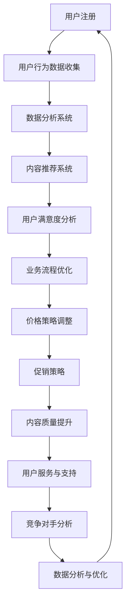

通过上述流程图，我们可以清晰地看到知识付费平台从用户注册到数据分析与优化的整个运营流程，以及各个环节之间的相互关联。

---

### 核心概念与联系

为了更好地理解知识付费平台的运作机制，我们使用Mermaid流程图来展示平台的关键环节和它们之间的联系。

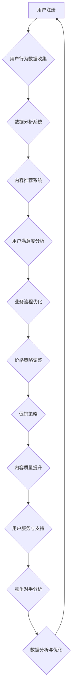

#### Mermaid 流程图：知识付费平台运作流程

在上面的流程图中，我们可以看到以下核心环节：

- **用户注册**：用户注册是知识付费平台的起点，用户通过注册成为平台的会员。
- **用户行为数据收集**：平台通过用户的行为数据来分析用户需求。
- **数据分析系统**：通过对用户数据的分析，平台可以了解用户的偏好和行为模式。
- **内容推荐系统**：基于数据分析结果，平台为用户推荐个性化的内容。
- **用户满意度分析**：通过用户满意度调查，了解用户对服务的评价。
- **业务流程优化**：根据用户反馈，优化平台的运营流程，提高用户体验。
- **价格策略调整**：通过成本导向、价值导向和竞争导向，制定合理的价格策略。
- **促销策略**：通过限时折扣、优惠券和积分制度等促销策略，吸引用户购买。
- **内容质量提升**：通过内容审核、内容生产和用户反馈机制，提升内容质量。
- **用户服务与支持**：通过用户服务流程、用户互动和满意度调查，提供优质的用户服务。
- **竞争对手分析**：通过对竞争对手的分析，制定差异化策略，提升竞争力。
- **数据分析与优化**：通过不断的数据分析和优化，提高平台的运营效率。

该流程图展示了知识付费平台从用户注册到数据分析与优化的整个运营过程，以及各个环节之间的相互关联。通过这个流程图，我们可以更直观地理解知识付费平台的运作机制，为平台制定有效的策略提供参考。

### 核心算法原理讲解

#### 伪代码：用户行为数据分析算法

为了深入理解知识付费平台如何通过用户行为数据来优化内容推荐和用户体验，我们首先需要介绍一种基于用户行为的分析算法。以下是一个简单的伪代码示例，用于分析用户在知识付费平台上的行为数据：

```python
function analyze_user_behavior(data):
    # 初始化用户行为数据结构
    user_activities = extract_activities(data)
    user_interests = []

    # 提取用户在平台上的活动数据
    for user, activities in user_activities.items():
        interest_categories = set()

        # 统计每个用户的活动频率
        for activity in activities:
            category = get_category_from_activity(activity)
            interest_categories.add(category)

        # 计算用户对不同类别的兴趣度
        interest_scores = calculate_interest_scores(interest_categories)

        # 更新用户的兴趣档案
        user_interests[user] = interest_scores

    # 返回用户兴趣档案
    return user_interests

function extract_activities(data):
    # 从数据中提取用户活动
    user_activities = {}
    for record in data:
        user_id = record['user_id']
        activity = record['activity']
        if user_id not in user_activities:
            user_activities[user_id] = []
        user_activities[user_id].append(activity)
    return user_activities

function get_category_from_activity(activity):
    # 根据活动类型获取类别
    category = activity['type']
    return category

function calculate_interest_scores(interest_categories):
    # 计算每个类别的兴趣度得分
    interest_scores = {}
    total_activities = len(interest_categories)
    for category in interest_categories:
        interest_scores[category] = 1 / total_activities
    return interest_scores
```

#### 原理讲解

1. **数据提取**：
   - `extract_activities` 函数从原始数据中提取用户的活动记录，并将它们归类到每个用户的活动列表中。

2. **类别获取**：
   - `get_category_from_activity` 函数用于根据活动类型确定类别。例如，一个活动可以是“学习编程语言”或“参加在线课程”。

3. **兴趣度计算**：
   - `calculate_interest_scores` 函数计算用户对每个类别的兴趣度。在这里，我们采用简单的方法，将每个类别的得分设置为1除以总类别数，从而为每个类别赋予相同的权重。

4. **用户兴趣档案**：
   - 最后，`analyze_user_behavior` 函数返回一个包含用户兴趣度的字典，这些兴趣度将用于个性化推荐系统。

#### 数学模型

用户兴趣度计算公式可以表示为：

$$
\text{UserInterestScore}(c) = \frac{1}{|\text{ActivityCategories}|)
$$

其中，$c$ 是类别，$|\text{ActivityCategories}|$ 是用户在当前时间段内参与的活动类别数量。

通过这个算法，知识付费平台可以更好地了解用户的兴趣点，从而提供更加个性化的内容推荐，提高用户的满意度和参与度。

### 数学模型和数学公式

在知识付费平台上，用户兴趣度分析是提升用户体验和内容推荐效果的关键环节。以下是一些用于分析用户兴趣度的数学模型和公式。

#### 1. 评分模型

用户对内容的评分可以用来衡量他们对某一内容的兴趣度。假设用户对内容$c$的评分为$r(c)$，则可以使用以下公式计算用户兴趣度：

$$
\text{UserInterestScore}(c) = r(c)
$$

这里，$r(c)$ 是用户对内容$c$的评分，通常采用5分制或10分制。

#### 2. 频率模型

用户访问某一类内容的频率也可以作为兴趣度的衡量标准。假设用户在时间窗口$T$内访问内容$c$的次数为$f(c,T)$，则用户兴趣度可以计算为：

$$
\text{UserInterestScore}(c) = \frac{f(c,T)}{\sum_{c' \in C} f(c',T)}
$$

其中，$C$ 是所有内容的集合。

#### 3. 市场细分模型

通过市场细分模型，可以将用户分为不同的群体，并针对每个群体提供定制化内容。假设用户集合$U$被分为$n$个子集合$U_1, U_2, ..., U_n$，每个子集合中的用户具有相似的兴趣偏好。则用户兴趣度可以用其在相应子集合中的占比表示：

$$
\text{UserInterestScore}(c) = \frac{|U_i \cap C|}{|U_i|}
$$

其中，$U_i \cap C$ 表示子集合$U_i$中用户对内容$c$的访问集合。

#### 4. 交互模型

用户在平台上的互动行为（如评论、分享、点赞等）也可以作为兴趣度的衡量标准。假设用户对内容$c$的互动次数为$i(c)$，则用户兴趣度可以表示为：

$$
\text{UserInterestScore}(c) = \frac{i(c)}{\sum_{c' \in C} i(c')}
$$

#### 实例分析

假设一个用户在一个月内访问了以下内容：

- 编程语言：5次
- 数据分析：3次
- 设计原理：2次

则用户对各个类别的兴趣度计算如下：

$$
\text{编程语言}：\text{UserInterestScore} = \frac{5}{5+3+2} = 0.5
$$

$$
\text{数据分析}：\text{UserInterestScore} = \frac{3}{5+3+2} = 0.3
$$

$$
\text{设计原理}：\text{UserInterestScore} = \frac{2}{5+3+2} = 0.2
$$

通过这些公式，知识付费平台可以更加精确地了解用户的兴趣偏好，从而提供个性化的内容推荐和优化用户体验。

### 项目实战

为了更好地理解和应用用户兴趣度分析算法，我们以下提供一个具体的代码案例。该案例将演示如何使用Python和Pandas库来构建一个简单的用户兴趣度分析系统，并通过具体数据进行计算和可视化。

#### 环境搭建

首先，确保安装了Python和Pandas库。可以使用以下命令进行安装：

```bash
pip install python
pip install pandas
```

#### 数据准备

我们假设有一个CSV文件`user_interest_data.csv`，其中包含以下字段：`user_id`、`content_id`和`rating`。每行数据代表一个用户对某一内容的评分。

```csv
user_id,content_id,rating
1,101,5
1,102,4
1,201,3
2,101,5
2,202,4
2,301,2
```

#### 代码实现

以下是一个简单的Python脚本，用于分析用户兴趣度：

```python
import pandas as pd
import numpy as np

# 读取数据
data = pd.read_csv('user_interest_data.csv')

# 统计每个用户对每个内容的评分
user_activity = data.groupby(['user_id', 'content_id']).size().reset_index(name='rating_count')

# 计算每个用户的总活动次数
user_activity['total_activities'] = user_activity.groupby('user_id')['rating_count'].transform('sum')

# 计算用户兴趣度
user_interest_scores = user_activity.groupby('user_id')['rating_count'].sum() / user_activity['total_activities']

# 可视化用户兴趣度
import matplotlib.pyplot as plt

# 生成用户兴趣度条形图
user_interest_scores.sort_values(ascending=False).head(10).plot(kind='bar')
plt.title('User Interest Scores')
plt.xlabel('User ID')
plt.ylabel('Interest Score')
plt.xticks(rotation=0)
plt.show()
```

#### 详细解释

1. **数据读取**：
   - 使用Pandas库读取CSV文件，并获取用户ID、内容ID和评分。

2. **用户活动统计**：
   - 使用`groupby`函数对用户和内容进行分组，并计算每个用户的总活动次数。

3. **兴趣度计算**：
   - 计算每个用户对内容的兴趣度，即用户对某一内容的评分总和除以用户总活动次数。

4. **可视化**：
   - 使用Matplotlib库生成用户兴趣度的条形图，直观展示用户对内容的兴趣度。

#### 代码解读与分析

- **读取数据**：使用`pd.read_csv`函数读取CSV文件，并使用`groupby`函数对数据进行分组，这是数据分析的基础操作。
- **计算用户活动次数**：通过`transform('sum')`函数计算每个用户的总活动次数，这是兴趣度计算的关键步骤。
- **兴趣度计算**：使用用户对内容的评分总和除以用户总活动次数，得到用户兴趣度分数。
- **可视化**：使用`plot(kind='bar')`函数生成条形图，帮助用户直观地理解分析结果。

通过上述步骤，我们构建了一个简单的用户兴趣度分析系统，并使用具体的数据进行了计算和可视化。这个系统可以作为一个起点，进一步扩展和优化，以适应更复杂的数据集和需求。

### 核心概念与联系

在知识付费领域，用户忠诚度是一个至关重要的核心概念。它反映了用户对平台的长期依赖和信任程度，是平台可持续发展的重要基础。以下是通过Mermaid流程图展示的用户忠诚度分析流程：

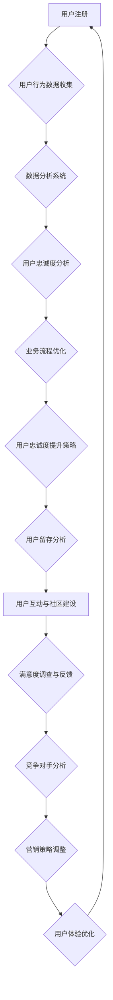

#### 流程解析

1. **用户注册**：用户注册是用户忠诚度分析的基础。通过收集用户注册信息，平台可以初步了解用户的基本情况和需求。

2. **用户行为数据收集**：平台需要持续收集用户在平台上的行为数据，如访问频率、内容偏好、购买记录等。

3. **数据分析系统**：通过大数据分析和机器学习技术，平台可以深入挖掘用户行为数据，识别潜在的用户忠诚度指标。

4. **用户忠诚度分析**：基于数据分析结果，平台可以计算用户的忠诚度得分，并识别忠诚度较低的用户群体。

5. **业务流程优化**：针对忠诚度较低的用户，平台可以优化业务流程，提高服务质量和用户体验，从而提升用户忠诚度。

6. **用户忠诚度提升策略**：平台可以制定一系列忠诚度提升策略，如积分制度、会员优惠、个性化推荐等。

7. **用户留存分析**：通过分析用户留存数据，平台可以识别哪些因素影响用户留存，并针对性地进行改进。

8. **用户互动与社区建设**：通过构建用户互动平台和社区，平台可以增强用户参与感和归属感，提高用户忠诚度。

9. **满意度调查与反馈**：定期进行用户满意度调查，收集用户反馈，有助于平台改进服务质量，提升用户忠诚度。

10. **竞争对手分析**：通过分析竞争对手的忠诚度策略，平台可以学习借鉴，优化自身的忠诚度策略。

11. **营销策略调整**：根据用户忠诚度数据，平台可以调整营销策略，提高用户参与度和忠诚度。

12. **用户体验优化**：通过持续优化用户体验，平台可以提高用户满意度和忠诚度。

通过上述流程，我们可以看到用户忠诚度分析在知识付费平台运营中的重要性。平台需要通过多种手段和策略，持续提升用户忠诚度，从而实现可持续发展。

### 数学模型和数学公式

在用户忠诚度分析中，数学模型和公式是量化用户忠诚度的重要工具。以下是一些常用的数学模型和公式：

#### 1. 用户忠诚度计算公式

用户忠诚度可以通过以下公式进行计算：

$$
\text{CustomerLoyaltyScore}(u) = \frac{\sum_{i=1}^{N} \text{RepeatPurchaseCount}_i}{N}
$$

其中，$u$ 是用户，$N$ 是用户的总购买次数，$\text{RepeatPurchaseCount}_i$ 是第 $i$ 次重复购买的次数。

#### 2. 用户生命周期价值计算公式

用户生命周期价值（Customer Lifetime Value，CLV）是衡量用户对平台贡献的重要指标，可以通过以下公式计算：

$$
\text{CustomerLifeTimeValue}(u) = \sum_{i=1}^{N} \text{Revenue}_i \times \text{LTVFactor}_i
$$

其中，$u$ 是用户，$N$ 是用户的总购买次数，$\text{Revenue}_i$ 是第 $i$ 次购买的收益，$\text{LTVFactor}_i$ 是第 $i$ 次购买的生命周期价值系数。

#### 3. 用户留存率计算公式

用户留存率是衡量用户持续使用平台的重要指标，可以通过以下公式计算：

$$
\text{UserRetentionRate}(u) = \frac{\text{ActiveDays}_u}{\text{TotalDays}_u}
$$

其中，$u$ 是用户，$\text{ActiveDays}_u$ 是用户在一段时间内的活跃天数，$\text{TotalDays}_u$ 是用户在平台上的总天数。

#### 实例分析

假设我们有一个用户$u$，他在一个月内进行了5次购买，每次购买的收益分别为$100$、$150$、$200$、$250$和$300$。我们可以根据上述公式计算他的忠诚度和生命周期价值：

1. **用户忠诚度**：

$$
\text{CustomerLoyaltyScore}(u) = \frac{5}{5} = 1
$$

2. **用户生命周期价值**：

$$
\text{CustomerLifeTimeValue}(u) = 100 \times 1 + 150 \times 1 + 200 \times 1 + 250 \times 1 + 300 \times 1 = 1000
$$

3. **用户留存率**：

假设用户在这个月内总共有30天，且他每天都有活跃行为。那么：

$$
\text{UserRetentionRate}(u) = \frac{30}{30} = 1
$$

通过这些数学模型和公式，知识付费平台可以更准确地评估用户的忠诚度和价值，从而制定更有效的用户维护策略。

### 项目实战

为了更好地理解和应用用户忠诚度分析中的数学模型和公式，我们以下提供一个具体的代码案例。该案例将演示如何使用Python和Pandas库来构建一个简单的用户忠诚度分析系统，并通过具体数据进行计算和可视化。

#### 环境搭建

首先，确保安装了Python和Pandas库。可以使用以下命令进行安装：

```bash
pip install python
pip install pandas
```

#### 数据准备

我们假设有一个CSV文件`user_purchase_data.csv`，其中包含以下字段：`user_id`、`purchase_date`、`revenue`。每行数据代表一个用户的购买记录。

```csv
user_id,purchase_date,revenue
1,2023-01-01,100
1,2023-01-15,150
1,2023-02-01,200
2,2023-01-01,300
2,2023-01-10,250
```

#### 代码实现

以下是一个简单的Python脚本，用于分析用户忠诚度和生命周期价值：

```python
import pandas as pd
import numpy as np
from datetime import datetime

# 读取数据
data = pd.read_csv('user_purchase_data.csv')

# 数据预处理
data['purchase_date'] = pd.to_datetime(data['purchase_date'])
data['purchase_year'] = data['purchase_date'].dt.year
data['purchase_month'] = data['purchase_date'].dt.month

# 计算用户忠诚度
data['repeat_purchase_count'] = data.groupby(['user_id', 'purchase_year'])['revenue'].transform('count')
data['customer_loyalty_score'] = data['repeat_purchase_count'] / data.groupby('user_id')['repeat_purchase_count'].transform('sum')

# 计算用户生命周期价值
data['ltv_factor'] = 1 / data.groupby('user_id')['repeat_purchase_count'].transform('sum')
data['customer_lifetime_value'] = data['revenue'] * data['ltv_factor']

# 计算用户留存率
data['active_days'] = data.groupby('user_id')['purchase_date'].transform('nunique')
data['total_days'] = data.groupby('user_id')['purchase_date'].transform('max') - data.groupby('user_id')['purchase_date'].transform('min')
data['user_retention_rate'] = data['active_days'] / data['total_days']

# 可视化用户忠诚度、生命周期价值和留存率
import matplotlib.pyplot as plt

# 用户忠诚度散点图
plt.figure(figsize=(10, 5))
plt.scatter(data['user_id'], data['customer_loyalty_score'])
plt.title('User Loyalty Scores')
plt.xlabel('User ID')
plt.ylabel('Loyalty Score')
plt.show()

# 用户生命周期价值条形图
plt.figure(figsize=(10, 5))
data['customer_lifetime_value'].sort_values(ascending=False).head(10).plot(kind='bar')
plt.title('Customer Lifetime Values')
plt.xlabel('User ID')
plt.ylabel('Lifetime Value')
plt.xticks(rotation=0)
plt.show()

# 用户留存率条形图
plt.figure(figsize=(10, 5))
data['user_retention_rate'].sort_values(ascending=False).head(10).plot(kind='bar')
plt.title('User Retention Rates')
plt.xlabel('User ID')
plt.ylabel('Retention Rate')
plt.xticks(rotation=0)
plt.show()
```

#### 详细解释

1. **数据读取**：
   - 使用Pandas库读取CSV文件，并获取用户ID、购买日期和收益。

2. **数据预处理**：
   - 将购买日期转换为日期格式，并提取购买年份和月份。

3. **忠诚度计算**：
   - 计算每个用户在不同年份的重复购买次数，并计算忠诚度得分。

4. **生命周期价值计算**：
   - 计算每个用户在重复购买中的生命周期价值系数，并计算生命周期价值。

5. **留存率计算**：
   - 计算每个用户的活跃天数和总天数，并计算留存率。

6. **可视化**：
   - 使用Matplotlib库生成用户忠诚度、生命周期价值和留存率的可视化图表。

通过上述步骤，我们构建了一个简单的用户忠诚度分析系统，并使用具体的数据进行了计算和可视化。这个系统可以作为一个起点，进一步扩展和优化，以适应更复杂的数据集和需求。

### 核心概念与联系

在知识付费领域，用户转化率是一个关键的核心概念，它反映了平台在吸引潜在用户并促使他们采取购买行为方面的效率。用户转化率是指访问平台的所有用户中，最终完成购买行为的比例。以下是通过Mermaid流程图展示的用户转化率分析流程：

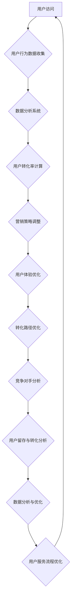

#### 流程解析

1. **用户访问**：用户首次访问知识付费平台，这是用户转化率分析的起点。

2. **用户行为数据收集**：平台需要持续收集用户在访问过程中的行为数据，如页面浏览、点击、停留时间等。

3. **数据分析系统**：通过大数据分析和机器学习技术，平台可以识别影响用户转化的关键因素。

4. **用户转化率计算**：基于用户行为数据，计算用户转化率，即完成购买行为的用户占访问用户的比例。

5. **营销策略调整**：根据转化率分析结果，调整营销策略，以提高转化率。

6. **用户体验优化**：通过改进用户体验，如页面加载速度、导航设计等，提高用户满意度和转化率。

7. **转化路径优化**：分析用户在购买路径上的行为，优化转化路径，减少用户流失。

8. **竞争对手分析**：通过分析竞争对手的转化策略，平台可以学习并借鉴，优化自身的转化路径。

9. **用户留存与转化分析**：结合用户留存数据，分析用户在不同阶段的行为特征，制定更有效的转化策略。

10. **数据分析和优化**：通过持续的数据分析，不断优化转化策略，提高用户转化率。

11. **用户服务流程优化**：改进用户服务流程，如订单处理、售后支持等，以提高用户满意度和转化率。

#### Mermaid 流程图：用户转化率分析流程

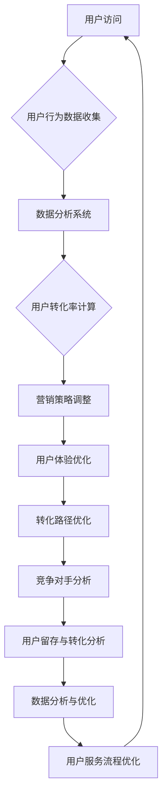

通过上述流程图，我们可以清晰地看到用户转化率分析在知识付费平台运营中的重要性，以及各个环节之间的相互联系。平台需要通过多种手段和策略，持续提升用户转化率，从而实现业务的增长和用户价值的最大化。

### 数学模型和数学公式

在用户转化率分析中，数学模型和公式是量化用户行为和转化效果的重要工具。以下是一些常用的数学模型和公式：

#### 1. 用户转化率计算公式

用户转化率是指完成特定目标行为的用户占访问用户的比例，通常用以下公式表示：

$$
\text{UserConversionRate} = \frac{\text{转化用户数}}{\text{访问用户数}} \times 100\%
$$

其中，转化用户数是指在特定时间范围内完成购买、注册或其他目标行为的用户数，访问用户数是指在相同时间范围内访问平台的用户总数。

#### 2. 转化漏斗模型

转化漏斗模型是一种用于分析用户在购买过程中流失的环节的方法。它将用户转化过程分为多个阶段，每个阶段都存在一定的流失率。漏斗模型的基本公式如下：

$$
\text{漏斗流失率} = \frac{\text{当前阶段用户数} - \text{下一阶段用户数}}{\text{当前阶段用户数}} \times 100\%
$$

例如，我们可以计算从浏览产品到最终购买过程中的流失率：

$$
\text{浏览到购买流失率} = \frac{\text{购买用户数} - \text{购买前浏览用户数}}{\text{浏览用户数}} \times 100\%
$$

#### 3. 转化率优化模型

为了提升用户转化率，可以采用以下数学模型：

1. **A/B测试**：
   - 通过对比不同版本的页面或产品，评估哪种版本能够带来更高的转化率。公式为：
     $$
     \text{转化率差异} = \frac{\text{A版本转化率} - \text{B版本转化率}}{\text{A版本转化率}} \times 100\%
     $$

2. **贝叶斯优化**：
   - 基于历史数据，使用贝叶斯统计模型预测不同变量对转化率的影响，并优化变量设置。公式为：
     $$
     P(\text{变量值} | \text{转化率}) = \frac{P(\text{转化率} | \text{变量值}) \cdot P(\text{变量值})}{P(\text{转化率})}
     $$

#### 4. 用户生命周期价值与转化率关联模型

用户生命周期价值（Customer Lifetime Value，CLV）与用户转化率密切相关。假设用户在购买后的平均生命周期为$t$，每次购买的贡献值为$C$，则用户转化率可以影响CLV的计算：

$$
\text{CLV} = \text{转化率} \times \frac{C}{\text{获取成本}}
$$

其中，获取成本是指获得一个新用户的平均成本。

#### 实例分析

假设一个知识付费平台在一个月内有1000次用户访问，其中300次发生了购买行为。那么，该平台的用户转化率计算如下：

$$
\text{UserConversionRate} = \frac{300}{1000} \times 100\% = 30\%
$$

假设在优化转化路径后，转化率提升到40%，则新的用户转化率计算如下：

$$
\text{NewUserConversionRate} = \frac{300}{750} \times 100\% = 40\%
$$

通过上述数学模型和公式，知识付费平台可以更加科学地分析用户行为，优化营销策略，提高用户转化率，从而实现业务的持续增长。

### 项目实战

为了更好地理解和应用用户转化率分析中的数学模型和公式，以下我们将通过一个具体的代码案例进行实操。该案例将演示如何使用Python和Pandas库来构建一个简单的用户转化率分析系统，并通过具体的数据进行计算和可视化。

#### 环境搭建

首先，确保安装了Python和Pandas库。可以使用以下命令进行安装：

```bash
pip install python
pip install pandas
```

#### 数据准备

我们假设有一个CSV文件`user_purchase_data.csv`，其中包含以下字段：`user_id`、`visit_date`、`action`。每行数据代表一个用户在平台上的访问记录，`action`字段表示用户的行为类型，如“访问页面”、“添加购物车”、“完成购买”等。

```csv
user_id,visit_date,action
1,2023-01-01,访问页面
1,2023-01-01,添加购物车
1,2023-01-01,完成购买
2,2023-01-02,访问页面
2,2023-01-02,浏览商品
3,2023-01-01,访问页面
3,2023-01-01,添加购物车
3,2023-01-01,完成购买
```

#### 代码实现

以下是一个简单的Python脚本，用于分析用户转化率和转化路径：

```python
import pandas as pd
import numpy as np

# 读取数据
data = pd.read_csv('user_purchase_data.csv')

# 数据预处理
data['visit_date'] = pd.to_datetime(data['visit_date'])

# 定义用户转化率计算函数
def calculate_conversion_rate(data, action):
    visit_count = data[data['action'] == '访问页面'].shape[0]
    action_count = data[data['action'] == action].shape[0]
    conversion_rate = (action_count / visit_count) * 100
    return conversion_rate

# 计算用户转化率
conversion_rates = {}
for action in ['添加购物车', '完成购买']:
    conversion_rate = calculate_conversion_rate(data, action)
    conversion_rates[action] = conversion_rate

# 可视化用户转化率
import matplotlib.pyplot as plt

# 生成用户转化率条形图
labels = list(conversion_rates.keys())
values = list(conversion_rates.values())

plt.bar(labels, values)
plt.xlabel('Action')
plt.ylabel('Conversion Rate (%)')
plt.title('User Conversion Rates')
plt.xticks(rotation=0)
plt.show()
```

#### 详细解释

1. **数据读取**：
   - 使用Pandas库读取CSV文件，并获取用户ID、访问日期和行为类型。

2. **数据预处理**：
   - 将访问日期转换为日期格式，方便后续的时间序列分析。

3. **用户转化率计算函数**：
   - 定义一个函数`calculate_conversion_rate`，用于计算不同行为类型的转化率。转化率计算公式为：
     $$
     \text{ConversionRate} = \frac{\text{行动用户数}}{\text{访问用户数}} \times 100\%
     $$

4. **计算用户转化率**：
   - 对于每个行为类型（如“添加购物车”和“完成购买”），计算其对应的转化率。

5. **可视化**：
   - 使用Matplotlib库生成用户转化率的条形图，直观展示不同行为类型的转化率。

通过上述步骤，我们构建了一个简单的用户转化率分析系统，并使用具体的数据进行了计算和可视化。这个系统可以作为一个起点，进一步扩展和优化，以适应更复杂的数据集和需求。

### 核心概念与联系

在知识付费领域，用户留存率是一个重要的核心概念。它反映了平台在保留现有用户方面的效果，是评估平台健康程度和业务发展潜力的重要指标。用户留存率是指在一定时间段内，持续使用或购买平台服务的用户占初始用户的比例。以下是通过Mermaid流程图展示的用户留存率分析流程：

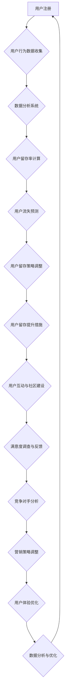

#### 流程解析

1. **用户注册**：用户注册是用户留存率分析的基础。通过收集用户注册信息，平台可以初步了解用户的基本情况和需求。

2. **用户行为数据收集**：平台需要持续收集用户在平台上的行为数据，如访问频率、内容偏好、购买记录等。

3. **数据分析系统**：通过大数据分析和机器学习技术，平台可以深入挖掘用户行为数据，识别影响用户留存的关键因素。

4. **用户留存率计算**：基于用户行为数据，计算用户留存率，即持续使用或购买平台服务的用户占初始用户的比例。

5. **用户流失预测**：通过历史数据分析和模型预测，平台可以预测哪些用户可能会流失，并采取相应的预防措施。

6. **用户留存策略调整**：根据用户留存率分析结果，调整平台策略，提高用户留存率。

7. **用户留存提升措施**：平台可以采取多种措施，如个性化推荐、优惠券、会员制度等，以提高用户留存率。

8. **用户互动与社区建设**：通过构建用户互动平台和社区，增强用户参与感和归属感，提高用户留存率。

9. **满意度调查与反馈**：定期进行用户满意度调查，收集用户反馈，有助于平台改进服务质量，提高用户留存率。

10. **竞争对手分析**：通过分析竞争对手的留存策略，平台可以学习借鉴，优化自身的留存策略。

11. **营销策略调整**：根据用户留存数据，调整营销策略，提高用户参与度和留存率。

12. **用户体验优化**：通过持续优化用户体验，提高用户满意度和留存率。

13. **数据分析与优化**：通过持续的数据分析，不断优化留存策略，提高用户留存率。

通过上述流程，我们可以看到用户留存率分析在知识付费平台运营中的重要性。平台需要通过多种手段和策略，持续提升用户留存率，从而实现业务的稳定增长和用户价值的最大化。

### 数学模型和数学公式

在用户留存率分析中，数学模型和公式是量化用户留存效果的重要工具。以下是一些常用的数学模型和公式：

#### 1. 留存率计算公式

用户留存率是指在一定时间段内，持续使用或购买平台服务的用户占初始用户的比例。通常用以下公式表示：

$$
\text{UserRetentionRate}(t) = \frac{\text{留存用户数}}{\text{初始用户数}} \times 100\%
$$

其中，$t$ 是时间周期（如一天、一周、一个月），留存用户数是指在时间周期$t$内持续使用或购买平台服务的用户数，初始用户数是指在同一时间周期内首次使用或购买平台服务的用户数。

#### 2. 留存率下降模型

留存率下降模型用于描述用户在连续时间周期内的留存变化情况。常见的留存率下降模型有线性模型和指数模型。以下是一个简单的线性模型：

$$
\text{RetentionRate}(t) = \text{InitialRetentionRate} - \text{DecayRate} \times t
$$

其中，InitialRetentionRate 是初始留存率，DecayRate 是留存率下降速度。

#### 3. 用户流失预测模型

用户流失预测模型用于预测哪些用户可能会在未来某个时间点流失。一个简单的预测模型是基于用户历史行为的数据挖掘方法。以下是一个基于行为次数的流失预测公式：

$$
\text{ProbabilityOfChurn}(t) = \frac{\text{ChurnCount}(t)}{\text{TotalUserCount}}
$$

其中，ChurnCount(t) 是在时间周期$t$内流失的用户数，TotalUserCount 是总用户数。

#### 4. 用户生命周期价值与留存率关联模型

用户生命周期价值（Customer Lifetime Value，CLV）与用户留存率密切相关。假设用户在购买后的平均生命周期为$t$，每次购买的贡献值为$C$，则用户留存率可以影响CLV的计算：

$$
\text{CLV} = \text{RetentionRate} \times \frac{C}{\text{获取成本}}
$$

其中，获取成本是指获得一个新用户的平均成本。

#### 实例分析

假设一个知识付费平台在一个月内有1000个新用户，其中200个在第一个月内留存，150个在第二个月内留存。那么，该平台的月留存率计算如下：

$$
\text{UserRetentionRate}(1) = \frac{200}{1000} \times 100\% = 20\%
$$

$$
\text{UserRetentionRate}(2) = \frac{150}{1000} \times 100\% = 15\%
$$

通过上述数学模型和公式，知识付费平台可以更加科学地分析用户留存，预测用户流失，优化留存策略，提高用户留存率，从而实现业务的稳定增长。

### 项目实战

为了更好地理解和应用用户留存率分析中的数学模型和公式，以下我们将通过一个具体的代码案例进行实操。该案例将演示如何使用Python和Pandas库来构建一个简单的用户留存率分析系统，并通过具体的数据进行计算和可视化。

#### 环境搭建

首先，确保安装了Python和Pandas库。可以使用以下命令进行安装：

```bash
pip install python
pip install pandas
```

#### 数据准备

我们假设有一个CSV文件`user_activity_data.csv`，其中包含以下字段：`user_id`、`signup_date`、`activity_date`。每行数据代表一个用户在平台上的活动记录。

```csv
user_id,signup_date,activity_date
1,2023-01-01,2023-01-01
1,2023-01-01,2023-01-02
1,2023-01-01,2023-01-03
2,2023-01-02,2023-01-02
2,2023-01-02,2023-01-03
3,2023-01-01,2023-01-01
3,2023-01-01,2023-01-02
```

#### 代码实现

以下是一个简单的Python脚本，用于分析用户留存率和流失率：

```python
import pandas as pd
import numpy as np
from datetime import datetime

# 读取数据
data = pd.read_csv('user_activity_data.csv')

# 数据预处理
data['signup_date'] = pd.to_datetime(data['signup_date'])
data['activity_date'] = pd.to_datetime(data['activity_date'])

# 计算用户留存率和流失率
def calculate_retention_and_churn(data, days=1):
    data['days_active'] = (data['activity_date'] - data['signup_date']).dt.days
    total_users = data.shape[0]
    active_users = data[data['days_active'] <= days].shape[0]
    retention_rate = (active_users / total_users) * 100
    churn_rate = (total_users - active_users) / total_users
    return retention_rate, churn_rate

# 计算不同时间点的留存率和流失率
retention_rates = []
churn_rates = []
for i in range(1, 31):
    retention_rate, churn_rate = calculate_retention_and_churn(data, days=i)
    retention_rates.append(retention_rate)
    churn_rates.append(churn_rate)

# 可视化留存率和流失率
import matplotlib.pyplot as plt

# 生成留存率和流失率曲线图
plt.figure(figsize=(10, 5))
plt.plot(range(1, 31), retention_rates, label='Retention Rate')
plt.plot(range(1, 31), churn_rates, label='Churn Rate')
plt.xlabel('Days')
plt.ylabel('Rate (%)')
plt.title('User Retention and Churn Rates')
plt.legend()
plt.show()
```

#### 详细解释

1. **数据读取**：
   - 使用Pandas库读取CSV文件，并获取用户ID、注册日期和活动日期。

2. **数据预处理**：
   - 将注册日期和活动日期转换为日期格式，并计算用户活跃天数。

3. **留存率和流失率计算函数**：
   - 定义一个函数`calculate_retention_and_churn`，用于计算用户在不同时间点的留存率和流失率。留存率计算公式为：
     $$
     \text{RetentionRate}(t) = \frac{\text{活跃用户数}}{\text{总用户数}} \times 100\%
     $$
     流失率计算公式为：
     $$
     \text{ChurnRate}(t) = \frac{\text{总用户数} - \text{活跃用户数}}{\text{总用户数}} \times 100\%
     $$

4. **计算留存率和流失率**：
   - 对于每天的时间周期，计算对应的留存率和流失率。

5. **可视化**：
   - 使用Matplotlib库生成留存率和流失率的曲线图，直观展示用户在不同时间点的留存和流失情况。

通过上述步骤，我们构建了一个简单的用户留存率分析系统，并使用具体的数据进行了计算和可视化。这个系统可以作为一个起点，进一步扩展和优化，以适应更复杂的数据集和需求。

### 核心概念与联系

在知识付费领域，用户参与度是一个关键的指标，它反映了用户在平台上的活跃程度和互动意愿。用户参与度通常通过用户在平台上的行为，如评论、分享、点赞、参与活动等来衡量。以下是通过Mermaid流程图展示的用户参与度分析流程：

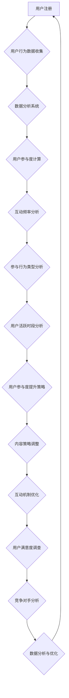

#### 流程解析

1. **用户注册**：用户注册是用户参与度分析的基础。通过收集用户注册信息，平台可以初步了解用户的基本情况和需求。

2. **用户行为数据收集**：平台需要持续收集用户在平台上的行为数据，如评论、分享、点赞、参与活动等。

3. **数据分析系统**：通过大数据分析和机器学习技术，平台可以深入挖掘用户行为数据，识别影响用户参与度的关键因素。

4. **用户参与度计算**：基于用户行为数据，计算用户的整体参与度。参与度可以通过以下公式计算：

   $$
   \text{UserInvolvementScore} = \frac{\text{总参与行为次数}}{\text{总用户行为次数}} \times 100\%
   $$

5. **互动频率分析**：分析用户在平台上的互动频率，了解用户活跃程度。

6. **参与行为类型分析**：分析用户在平台上的不同参与行为类型，如评论、分享、点赞等，了解用户偏好。

7. **用户活跃时段分析**：分析用户在不同时间段的活跃情况，优化内容发布和互动策略。

8. **用户参与度提升策略**：根据分析结果，制定提升用户参与度的策略，如增加互动机会、提供奖励等。

9. **内容策略调整**：优化内容形式和内容策略，提高用户兴趣和参与度。

10. **互动机制优化**：改进平台上的互动机制，如增加评论功能、设置点赞机制等。

11. **用户满意度调查**：通过用户满意度调查，了解用户对平台互动机制和内容的评价。

12. **竞争对手分析**：通过分析竞争对手的互动策略，平台可以学习借鉴，优化自身的互动机制。

13. **数据分析与优化**：通过持续的数据分析，不断优化互动策略，提高用户参与度。

#### Mermaid 流程图：用户参与度分析流程

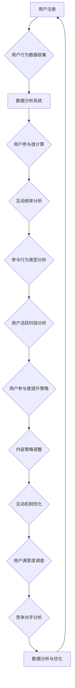

通过上述流程图，我们可以清晰地看到用户参与度分析在知识付费平台运营中的重要性，以及各个环节之间的相互联系。平台需要通过多种手段和策略，持续提升用户参与度，从而实现业务的增长和用户价值的最大化。

### 数学模型和数学公式

在用户参与度分析中，数学模型和公式是量化用户行为和参与效果的重要工具。以下是一些常用的数学模型和公式：

#### 1. 用户参与度计算公式

用户参与度是指用户在平台上的活跃程度和互动意愿。通常用以下公式表示：

$$
\text{UserInvolvementScore}(u) = \frac{\text{TotalInvolvementActions}(u)}{\text{TotalUserActions}(u)}
$$

其中，$u$ 是用户，$\text{TotalInvolvementActions}(u)$ 是用户在平台上进行的参与行为总数，$\text{TotalUserActions}(u)$ 是用户在平台上进行的所有行为总数。

#### 2. 互动频率模型

互动频率模型用于描述用户在特定时间段内的互动频率。以下是一个简单的互动频率模型：

$$
\text{InteractionFrequency}(u, t) = \frac{\text{InteractionCount}(u, t)}{t}
$$

其中，$u$ 是用户，$t$ 是时间周期（如一天、一周、一个月），$\text{InteractionCount}(u, t)$ 是用户在时间周期$t$内的互动次数。

#### 3. 参与行为类型权重模型

参与行为类型权重模型用于衡量不同参与行为对用户参与度的贡献。以下是一个简单的参与行为类型权重模型：

$$
\text{InvolvementScore}(u, a) = w(a) \times \text{ActionCount}(u, a)
$$

其中，$u$ 是用户，$a$ 是参与行为类型，$w(a)$ 是行为类型$a$的权重，$\text{ActionCount}(u, a)$ 是用户在特定行为类型$a$下的行为次数。

#### 4. 用户活跃时段模型

用户活跃时段模型用于分析用户在不同时间段的活跃情况。以下是一个简单的用户活跃时段模型：

$$
\text{ActivePeriodScore}(u, t) = 
\begin{cases} 
1 & \text{如果用户在时间周期$t$内活跃} \\
0 & \text{如果用户在时间周期$t$内不活跃} 
\end{cases}
$$

#### 实例分析

假设我们有一个用户$u$，他在一个月内的参与行为如下：

- 评论次数：50次
- 分享次数：30次
- 点赞次数：100次
- 总行为次数：180次

根据上述公式，我们可以计算该用户的参与度和互动频率：

1. **参与度**：

$$
\text{UserInvolvementScore}(u) = \frac{50 + 30 + 100}{180} \times 100\% \approx 72.22\%
$$

2. **互动频率**：

假设一个月有30天，那么：

$$
\text{InteractionFrequency}(u, t) = \frac{180}{30} = 6 \text{次/天}
$$

通过这些数学模型和公式，知识付费平台可以更加科学地分析用户的参与度，制定有效的互动策略，提高用户活跃度和满意度。

### 项目实战

为了更好地理解和应用用户参与度分析中的数学模型和公式，以下我们将通过一个具体的代码案例进行实操。该案例将演示如何使用Python和Pandas库来构建一个简单的用户参与度分析系统，并通过具体的数据进行计算和可视化。

#### 环境搭建

首先，确保安装了Python和Pandas库。可以使用以下命令进行安装：

```bash
pip install python
pip install pandas
```

#### 数据准备

我们假设有一个CSV文件`user_activity_data.csv`，其中包含以下字段：`user_id`、`activity_type`、`activity_count`、`activity_date`。每行数据代表一个用户在平台上的活动记录。

```csv
user_id,activity_type,activity_count,activity_date
1,评论,50,2023-01-01
1,分享,30,2023-01-02
1,点赞,100,2023-01-03
2,评论,20,2023-01-01
2,分享,40,2023-01-02
2,点赞,60,2023-01-03
```

#### 代码实现

以下是一个简单的Python脚本，用于分析用户参与度：

```python
import pandas as pd

# 读取数据
data = pd.read_csv('user_activity_data.csv')

# 计算用户参与度
def calculate_involvement_score(data):
    user_involvement = data.groupby('user_id').sum()['activity_count']
    total_user_actions = data.groupby('user_id').count()['activity_count']
    involvement_score = user_involvement / total_user_actions
    return involvement_score

# 计算互动频率
def calculate_interaction_frequency(data):
    user_interaction_frequency = data.groupby('user_id')['activity_count'].mean()
    total_days = (data['activity_date'].max() - data['activity_date'].min()).days + 1
    interaction_frequency = user_interaction_frequency / total_days
    return interaction_frequency

# 可视化用户参与度和互动频率
import matplotlib.pyplot as plt

# 计算参与度和互动频率
involvement_scores = calculate_involvement_score(data)
interaction_frequencies = calculate_interaction_frequency(data)

# 生成参与度条形图
plt.figure(figsize=(10, 5))
involvement_scores.sort_values(ascending=False).head(10).plot(kind='bar')
plt.title('User Involvement Scores')
plt.xlabel('User ID')
plt.ylabel('Involvement Score')
plt.xticks(rotation=0)
plt.show()

# 生成互动频率条形图
plt.figure(figsize=(10, 5))
interaction_frequencies.sort_values(ascending=False).head(10).plot(kind='bar')
plt.title('Interaction Frequencies')
plt.xlabel('User ID')
plt.ylabel('Interaction Frequency')
plt.xticks(rotation=0)
plt.show()
```

#### 详细解释

1. **数据读取**：
   - 使用Pandas库读取CSV文件，并获取用户ID、活动类型、活动次数和活动日期。

2. **参与度计算**：
   - 定义一个函数`calculate_involvement_score`，用于计算用户的参与度。参与度计算公式为：
     $$
     \text{UserInvolvementScore}(u) = \frac{\text{TotalInvolvementActions}(u)}{\text{TotalUserActions}(u)}
     $$

3. **互动频率计算**：
   - 定义一个函数`calculate_interaction_frequency`，用于计算用户的互动频率。互动频率计算公式为：
     $$
     \text{InteractionFrequency}(u, t) = \frac{\text{InteractionCount}(u, t)}{t}
     $$

4. **可视化**：
   - 使用Matplotlib库生成用户参与度和互动频率的条形图，直观展示不同用户的参与度和互动频率。

通过上述步骤，我们构建了一个简单的用户参与度分析系统，并使用具体的数据进行了计算和可视化。这个系统可以作为一个起点，进一步扩展和优化，以适应更复杂的数据集和需求。

### 核心概念与联系

在知识付费领域，用户参与度是一个关键指标，它反映了用户对平台的关注程度和互动意愿。用户参与度可以通过多种行为指标来衡量，包括评论、分享、点赞、参与活动等。以下是通过Mermaid流程图展示的用户参与度分析流程：

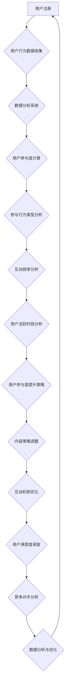

#### 流程解析

1. **用户注册**：用户注册是用户参与度分析的基础。通过收集用户注册信息，平台可以初步了解用户的基本情况和需求。

2. **用户行为数据收集**：平台需要持续收集用户在平台上的行为数据，如评论、分享、点赞、参与活动等。

3. **数据分析系统**：通过大数据分析和机器学习技术，平台可以深入挖掘用户行为数据，识别影响用户参与度的关键因素。

4. **用户参与度计算**：基于用户行为数据，计算用户的整体参与度。参与度可以通过以下公式计算：

   $$
   \text{UserInvolvementScore} = \frac{\text{总参与行为次数}}{\text{总用户行为次数}} \times 100\%
   $$

5. **参与行为类型分析**：分析用户在平台上的不同参与行为类型，如评论、分享、点赞等，了解用户偏好。

6. **互动频率分析**：分析用户在平台上的互动频率，了解用户活跃程度。

7. **用户活跃时段分析**：分析用户在不同时间段的活跃情况，优化内容发布和互动策略。

8. **用户参与度提升策略**：根据分析结果，制定提升用户参与度的策略，如增加互动机会、提供奖励等。

9. **内容策略调整**：优化内容形式和内容策略，提高用户兴趣和参与度。

10. **互动机制优化**：改进平台上的互动机制，如增加评论功能、设置点赞机制等。

11. **用户满意度调查**：通过用户满意度调查，了解用户对平台互动机制和内容的评价。

12. **竞争对手分析**：通过分析竞争对手的互动策略，平台可以学习借鉴，优化自身的互动机制。

13. **数据分析与优化**：通过持续的数据分析，不断优化互动策略，提高用户参与度。

#### Mermaid 流程图：用户参与度分析流程

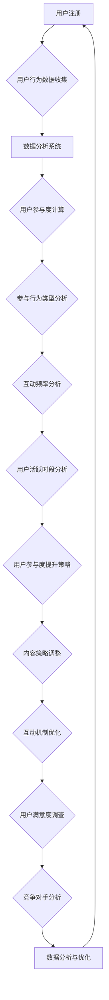

通过上述流程图，我们可以清晰地看到用户参与度分析在知识付费平台运营中的重要性，以及各个环节之间的相互联系。平台需要通过多种手段和策略，持续提升用户参与度，从而实现业务的增长和用户价值的最大化。

### 数学模型和数学公式

在用户参与度分析中，数学模型和公式是量化用户行为和参与效果的重要工具。以下是一些常用的数学模型和公式：

#### 1. 用户参与度计算公式

用户参与度通常通过用户在平台上的行为来衡量。以下是一个简单的参与度计算公式：

$$
\text{UserInvolvementScore}(u) = \frac{\sum_{i=1}^{N} \text{ActionScore}(u, a_i)}{\sum_{i=1}^{N} \text{TotalActionScore}(u)}
$$

其中，$u$ 是用户，$N$ 是用户在平台上进行的总行为次数，$\text{ActionScore}(u, a_i)$ 是用户在特定行为类型$a_i$下的得分，$\text{TotalActionScore}(u)$ 是用户的总行为得分。

#### 2. 行为得分计算公式

不同的行为类型对参与度的贡献不同，我们可以通过以下公式计算每种行为类型的得分：

$$
\text{ActionScore}(u, a_i) = w(a_i) \times \text{ActionCount}(u, a_i)
$$

其中，$w(a_i)$ 是行为类型$a_i$的权重，$\text{ActionCount}(u, a_i)$ 是用户在行为类型$a_i$下的行为次数。

#### 3. 互动频率模型

互动频率模型用于描述用户在特定时间段内的互动频率。以下是一个简单的互动频率模型：

$$
\text{InteractionFrequency}(u, t) = \frac{\text{InteractionCount}(u, t)}{t}
$$

其中，$u$ 是用户，$t$ 是时间周期（如一天、一周、一个月），$\text{InteractionCount}(u, t)$ 是用户在时间周期$t$内的互动次数。

#### 4. 用户活跃时段模型

用户活跃时段模型用于分析用户在不同时间段的活跃情况。以下是一个简单的用户活跃时段模型：

$$
\text{ActivePeriodScore}(u, t) = 
\begin{cases} 
1 & \text{如果用户在时间周期$t$内活跃} \\
0 & \text{如果用户在时间周期$t$内不活跃} 
\end{cases}
$$

#### 实例分析

假设我们有一个用户$u$，他在一个月内的参与行为如下：

- 评论次数：50次
- 分享次数：30次
- 点赞次数：100次
- 总行为次数：180次

根据上述公式，我们可以计算该用户的参与度和互动频率：

1. **参与度**：

$$
\text{UserInvolvementScore}(u) = \frac{50 + 30 + 100}{180} \times 100\% \approx 72.22\%
$$

2. **互动频率**：

假设一个月有30天，那么：

$$
\text{InteractionFrequency}(u, t) = \frac{180}{30} = 6 \text{次/天}
$$

通过这些数学模型和公式，知识付费平台可以更加科学地分析用户的参与度，制定有效的互动策略，提高用户活跃度和满意度。

### 项目实战

为了更好地理解和应用用户参与度分析中的数学模型和公式，以下我们将通过一个具体的代码案例进行实操。该案例将演示如何使用Python和Pandas库来构建一个简单的用户参与度分析系统，并通过具体的数据进行计算和可视化。

#### 环境搭建

首先，确保安装了Python和Pandas库。可以使用以下命令进行安装：

```bash
pip install python
pip install pandas
```

#### 数据准备

我们假设有一个CSV文件`user_activity_data.csv`，其中包含以下字段：`user_id`、`activity_type`、`activity_count`、`activity_date`。每行数据代表一个用户在平台上的活动记录。

```csv
user_id,activity_type,activity_count,activity_date
1,评论,50,2023-01-01
1,分享,30,2023-01-02
1,点赞,100,2023-01-03
2,评论,20,2023-01-01
2,分享,40,2023-01-02
2,点赞,60,2023-01-03
```

#### 代码实现

以下是一个简单的Python脚本，用于分析用户参与度：

```python
import pandas as pd
import numpy as np

# 读取数据
data = pd.read_csv('user_activity_data.csv')

# 定义权重
weights = {'评论': 1.0, '分享': 0.8, '点赞': 0.6}

# 计算用户参与度
def calculate_involvement_score(data, weights):
    user_involvement = data.groupby('user_id').sum()[['评论', '分享', '点赞']].dot(weights) / data.groupby('user_id').sum()['活动次数']
    return user_involvement

# 计算互动频率
def calculate_interaction_frequency(data):
    user_interaction_frequency = data.groupby('user_id')['活动次数'].mean()
    total_days = (data['activity_date'].max() - data['activity_date'].min()).days + 1
    interaction_frequency = user_interaction_frequency / total_days
    return interaction_frequency

# 可视化用户参与度和互动频率
import matplotlib.pyplot as plt

# 计算参与度和互动频率
involvement_scores = calculate_involvement_score(data, weights)
interaction_frequencies = calculate_interaction_frequency(data)

# 生成参与度条形图
plt.figure(figsize=(10, 5))
involvement_scores.sort_values(ascending=False).head(10).plot(kind='bar')
plt.title('User Involvement Scores')
plt.xlabel('User ID')
plt.ylabel('Involvement Score')
plt.xticks(rotation=0)
plt.show()

# 生成互动频率条形图
plt.figure(figsize=(10, 5))
interaction_frequencies.sort_values(ascending=False).head(10).plot(kind='bar')
plt.title('Interaction Frequencies')
plt.xlabel('User ID')
plt.ylabel('Interaction Frequency')
plt.xticks(rotation=0)
plt.show()
```

#### 详细解释

1. **数据读取**：
   - 使用Pandas库读取CSV文件，并获取用户ID、活动类型、活动次数和活动日期。

2. **权重定义**：
   - 定义不同活动类型的权重，这些权重将用于计算用户的参与度得分。

3. **参与度计算**：
   - 定义一个函数`calculate_involvement_score`，用于计算用户的参与度。参与度计算公式为：
     $$
     \text{UserInvolvementScore}(u) = \frac{\sum_{i=1}^{N} \text{ActionScore}(u, a_i)}{\sum_{i=1}^{N} \text{TotalActionScore}(u)}
     $$

4. **互动频率计算**：
   - 定义一个函数`calculate_interaction_frequency`，用于计算用户的互动频率。互动频率计算公式为：
     $$
     \text{InteractionFrequency}(u, t) = \frac{\text{InteractionCount}(u, t)}{t}
     $$

5. **可视化**：
   - 使用Matplotlib库生成用户参与度和互动频率的条形图，直观展示不同用户的参与度和互动频率。

通过上述步骤，我们构建了一个简单的用户参与度分析系统，并使用具体的数据进行了计算和可视化。这个系统可以作为一个起点，进一步扩展和优化，以适应更复杂的数据集和需求。

### 核心概念与联系

在知识付费领域，用户满意度是一个关键的核心概念，它反映了用户对平台服务质量的总体评价。用户满意度直接影响用户的忠诚度、留存率和推荐意愿。以下是通过Mermaid流程图展示的用户满意度分析流程：

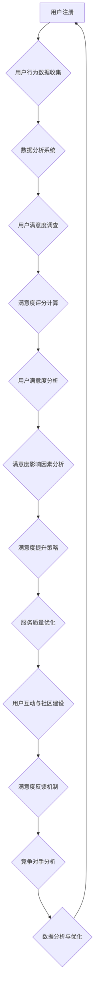

#### 流程解析

1. **用户注册**：用户注册是用户满意度分析的基础。通过收集用户注册信息，平台可以初步了解用户的基本情况和需求。

2. **用户行为数据收集**：平台需要持续收集用户在平台上的行为数据，如访问频率、内容偏好、购买记录等。

3. **数据分析系统**：通过大数据分析和机器学习技术，平台可以深入挖掘用户行为数据，为满意度调查提供数据支持。

4. **用户满意度调查**：定期进行用户满意度调查，通过问卷、访谈等方式收集用户对平台服务的评价。

5. **满意度评分计算**：基于收集到的用户评价，计算用户的满意度评分。满意度评分可以通过以下公式计算：

   $$
   \text{UserSatisfactionScore}(u) = \frac{\sum_{i=1}^{N} \text{FeedbackScore}_i}{N}
   $$

   其中，$u$ 是用户，$N$ 是用户提供的反馈数量，$\text{FeedbackScore}_i$ 是第 $i$ 条反馈的评分。

6. **用户满意度分析**：通过对满意度评分的分析，了解用户对平台服务的整体满意度。

7. **满意度影响因素分析**：分析影响用户满意度的关键因素，如服务质量、内容质量、用户服务体验等。

8. **满意度提升策略**：根据分析结果，制定提升用户满意度的策略，如改进服务质量、优化用户服务体验等。

9. **服务质量优化**：通过服务质量优化，提升用户满意度。例如，改进课程内容、提高技术支持等。

10. **用户互动与社区建设**：通过用户互动和社区建设，增强用户归属感和满意度。

11. **满意度反馈机制**：建立满意度反馈机制，收集用户对满意度提升策略的反馈，不断优化。

12. **竞争对手分析**：通过分析竞争对手的满意度策略，了解行业最佳实践，优化自身的满意度策略。

13. **数据分析与优化**：通过持续的数据分析，不断优化满意度提升策略，提高用户满意度。

#### Mermaid 流程图：用户满意度分析流程

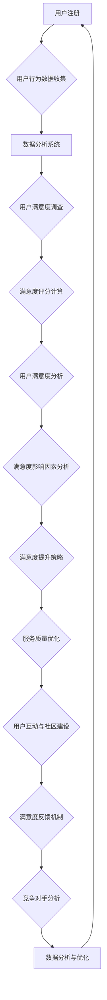

通过上述流程图，我们可以清晰地看到用户满意度分析在知识付费平台运营中的重要性，以及各个环节之间的相互联系。平台需要通过多种手段和策略，持续提升用户满意度，从而实现业务的增长和用户价值的最大化。

### 数学模型和数学公式

在用户满意度分析中，数学模型和公式是量化用户评价和满意度的重要工具。以下是一些常用的数学模型和公式：

#### 1. 用户满意度评分计算公式

用户满意度评分是通过对用户反馈的评价进行平均得到的。以下是一个简单的满意度评分计算公式：

$$
\text{UserSatisfactionScore}(u) = \frac{\sum_{i=1}^{N} \text{FeedbackScore}_i}{N}
$$

其中，$u$ 是用户，$N$ 是用户提供的反馈数量，$\text{FeedbackScore}_i$ 是第 $i$ 条反馈的评分。

#### 2. 用户满意度评分分布模型

用户满意度评分分布模型用于描述用户反馈的评分分布情况。以下是一个简单的正态分布模型：

$$
\text{FeedbackScore}_i \sim N(\mu, \sigma^2)
$$

其中，$\mu$ 是满意度评分的均值，$\sigma^2$ 是满意度评分的方差。

#### 3. 用户满意度预测模型

用户满意度预测模型用于预测未来用户对服务的满意度。以下是一个基于线性回归的预测模型：

$$
\text{PredictedSatisfactionScore}(u) = \beta_0 + \beta_1 \cdot \text{PastSatisfactionScore}(u) + \epsilon
$$

其中，$\beta_0$ 和 $\beta_1$ 是回归系数，$\text{PastSatisfactionScore}(u)$ 是用户过去的满意度评分，$\epsilon$ 是误差项。

#### 4. 用户满意度提升策略优化模型

用户满意度提升策略优化模型用于确定如何优化满意度提升策略。以下是一个基于多目标优化的模型：

$$
\max_{\theta} \left\{ \sum_{i=1}^{N} \left[ w_i \cdot (\text{FeedbackScore}_i - \text{TargetSatisfactionScore}) \right]^2 \right\}
$$

其中，$\theta$ 是满意度提升策略的参数，$w_i$ 是第 $i$ 个反馈的权重，$\text{TargetSatisfactionScore}$ 是目标满意度评分。

#### 实例分析

假设一个用户提供了5条反馈，评分分别为4、5、3、4、5。根据上述公式，我们可以计算该用户的满意度评分：

$$
\text{UserSatisfactionScore}(u) = \frac{4 + 5 + 3 + 4 + 5}{5} = 4.2
$$

通过这些数学模型和公式，知识付费平台可以更加科学地分析用户满意度，预测用户未来的满意度，并优化满意度提升策略，从而提升整体服务质量。

### 项目实战

为了更好地理解和应用用户满意度分析中的数学模型和公式，以下我们将通过一个具体的代码案例进行实操。该案例将演示如何使用Python和Pandas库来构建一个简单的用户满意度分析系统，并通过具体的数据进行计算和可视化。

#### 环境搭建

首先，确保安装了Python和Pandas库。可以使用以下命令进行安装：

```bash
pip install python
pip install pandas
```

#### 数据准备

我们假设有一个CSV文件`user_feedback_data.csv`，其中包含以下字段：`user_id`、`feedback_date`、`rating`。每行数据代表一个用户在某个时间点的满意度评分。

```csv
user_id,feedback_date,rating
1,2023-01-01,4
1,2023-01-15,5
1,2023-02-01,3
2,2023-01-01,5
2,2023-01-10,4
```

#### 代码实现

以下是一个简单的Python脚本，用于分析用户满意度：

```python
import pandas as pd

# 读取数据
data = pd.read_csv('user_feedback_data.csv')

# 计算用户满意度评分
def calculate_satisfaction_score(data):
    satisfaction_scores = data.groupby('user_id')['rating'].mean()
    return satisfaction_scores

# 可视化用户满意度评分
import matplotlib.pyplot as plt

# 计算满意度评分
satisfaction_scores = calculate_satisfaction_score(data)

# 生成满意度评分条形图
plt.figure(figsize=(10, 5))
satisfaction_scores.sort_values(ascending=False).head(10).plot(kind='bar')
plt.title('User Satisfaction Scores')
plt.xlabel('User ID')
plt.ylabel('Satisfaction Score')
plt.xticks(rotation=0)
plt.show()
```

#### 详细解释

1. **数据读取**：
   - 使用Pandas库读取CSV文件，并获取用户ID、反馈日期和评分。

2. **满意度评分计算**：
   - 定义一个函数`calculate_satisfaction_score`，用于计算用户的满意度评分。满意度评分计算公式为：
     $$
     \text{UserSatisfactionScore}(u) = \frac{\sum_{i=1}^{N} \text{FeedbackScore}_i}{N}
     $$

3. **可视化**：
   - 使用Matplotlib库生成用户满意度评分的条形图，直观展示不同用户的满意度评分。

通过上述步骤，我们构建了一个简单的用户满意度分析系统，并使用具体的数据进行了计算和可视化。这个系统可以作为一个起点，进一步扩展和优化，以适应更复杂的数据集和需求。

### 核心概念与联系

在知识付费领域，用户体验是一个至关重要的核心概念。它反映了用户在平台上的整体感受，直接影响到用户的满意度、忠诚度和转化率。以下是通过Mermaid流程图展示的用户体验分析流程：

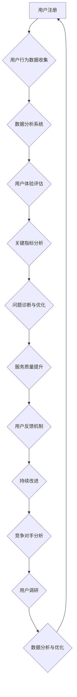

#### 流程解析

1. **用户注册**：用户注册是用户体验分析的基础。通过收集用户注册信息，平台可以初步了解用户的基本情况和需求。

2. **用户行为数据收集**：平台需要持续收集用户在平台上的行为数据，如访问频率、内容偏好、购买记录等。

3. **数据分析系统**：通过大数据分析和机器学习技术，平台可以深入挖掘用户行为数据，为用户体验评估提供数据支持。

4. **用户体验评估**：通过多种方式（如问卷调查、用户访谈等）收集用户对平台服务的体验反馈。

5. **关键指标分析**：分析用户反馈，确定影响用户体验的关键指标，如页面加载速度、内容质量、服务响应时间等。

6. **问题诊断与优化**：针对关键指标的问题，诊断问题根源，并制定优化策略。

7. **服务质量提升**：通过优化平台服务，提升用户体验。例如，改进课程内容、优化用户界面等。

8. **用户反馈机制**：建立用户反馈机制，收集用户对服务质量提升策略的反馈，确保持续改进。

9. **持续改进**：通过持续的数据分析和用户反馈，不断优化用户体验。

10. **竞争对手分析**：通过分析竞争对手的体验策略，了解行业最佳实践，优化自身的体验策略。

11. **用户调研**：定期进行用户调研，了解用户对平台服务的最新体验。

12. **数据分析与优化**：通过持续的数据分析，不断优化用户体验策略，提高用户满意度。

#### Mermaid 流程图：用户体验分析流程

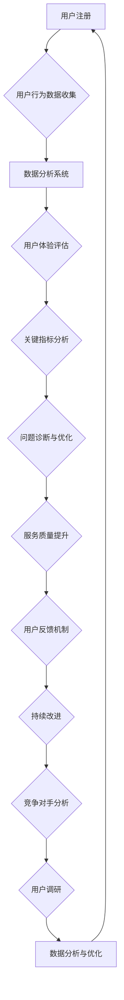

通过上述流程图，我们可以清晰地看到用户体验分析在知识付费平台运营中的重要性，以及各个环节之间的相互联系。平台需要通过多种手段和策略，持续提升用户体验，从而实现业务的增长和用户价值的最大化。

### 数学模型和数学公式

在用户体验分析中，数学模型和公式是量化用户反馈和满意度的重要工具。以下是一些常用的数学模型和公式：

#### 1. 用户满意度计算公式

用户满意度可以通过以下公式计算：

$$
\text{UserSatisfactionScore}(u) = \frac{\sum_{i=1}^{N} \text{FeedbackScore}_i}{N}
$$

其中，$u$ 是用户，$N$ 是用户提供的反馈数量，$\text{FeedbackScore}_i$ 是第 $i$ 条反馈的评分。

#### 2. 用户体验指标计算公式

用户体验指标（如页面加载速度、响应时间等）可以通过以下公式计算：

$$
\text{UserExperienceScore}(u) = \frac{\sum_{i=1}^{N} \text{ExperienceScore}_i}{N}
$$

其中，$u$ 是用户，$N$ 是用户提供的体验指标数量，$\text{ExperienceScore}_i$ 是第 $i$ 个体验指标的得分。

#### 3. 贡献度模型

贡献度模型用于衡量不同因素对用户体验的影响程度。以下是一个简单的线性贡献度模型：

$$
\text{ContributionScore}(f) = \alpha \cdot \text{FactorScore}(f) + \beta \cdot \text{Weight}(f)
$$

其中，$f$ 是因素，$\alpha$ 和 $\beta$ 是模型参数，$\text{FactorScore}(f)$ 是因素的得分，$\text{Weight}(f)$ 是因素的重要程度。

#### 4. 贡献度评分计算公式

贡献度评分可以通过以下公式计算：

$$
\text{ContributionScore}(u) = \sum_{f=1}^{M} \text{ContributionScore}(f)
$$

其中，$u$ 是用户，$M$ 是因素的数量。

#### 实例分析

假设我们有一个用户$u$，他提供了5条反馈，评分分别为4、5、3、4、5。同时，他的体验指标（如页面加载速度、响应时间等）分别为2、3、1、2、3。根据上述公式，我们可以计算该用户的满意度评分和用户体验指标：

1. **用户满意度评分**：

$$
\text{UserSatisfactionScore}(u) = \frac{4 + 5 + 3 + 4 + 5}{5} = 4.2
$$

2. **用户体验指标**：

$$
\text{UserExperienceScore}(u) = \frac{2 + 3 + 1 + 2 + 3}{5} = 2.2
$$

通过这些数学模型和公式，知识付费平台可以更加科学地分析用户反馈和体验，优化服务质量，提高用户满意度。

### 项目实战

为了更好地理解和应用用户体验分析中的数学模型和公式，以下我们将通过一个具体的代码案例进行实操。该案例将演示如何使用Python和Pandas库来构建一个简单的用户体验分析系统，并通过具体的数据进行计算和可视化。

#### 环境搭建

首先，确保安装了Python和Pandas库。可以使用以下命令进行安装：

```bash
pip install python
pip install pandas
```

#### 数据准备

我们假设有一个CSV文件`user_experience_data.csv`，其中包含以下字段：`user_id`、`feedback_date`、`satisfaction_score`、`load_time`、`response_time`。每行数据代表一个用户在某个时间点的反馈数据。

```csv
user_id,feedback_date,satisfaction_score,load_time,response_time
1,2023-01-01,4,2.5,1.5
1,2023-01-15,5,2.0,1.0
1,2023-02-01,3,3.0,2.0
2,2023-01-01,5,1.5,1.0
2,2023-01-10,4,2.0,1.5
```

#### 代码实现

以下是一个简单的Python脚本，用于分析用户体验：

```python
import pandas as pd
import numpy as np

# 读取数据
data = pd.read_csv('user_experience_data.csv')

# 计算用户满意度评分
def calculate_satisfaction_score(data):
    satisfaction_scores = data.groupby('user_id')['satisfaction_score'].mean()
    return satisfaction_scores

# 计算用户体验指标
def calculate_experience_score(data):
    experience_scores = (data.groupby('user_id')['load_time'].mean() + data.groupby('user_id')['response_time'].mean()) / 2
    return experience_scores

# 可视化满意度评分和用户体验指标
import matplotlib.pyplot as plt

# 计算满意度评分和用户体验指标
satisfaction_scores = calculate_satisfaction_score(data)
experience_scores = calculate_experience_score(data)

# 生成满意度评分条形图
plt.figure(figsize=(10, 5))
satisfaction_scores.sort_values(ascending=False).head(10).plot(kind='bar')
plt.title('User Satisfaction Scores')
plt.xlabel('User ID')
plt.ylabel('Satisfaction Score')
plt.xticks(rotation=0)
plt.show()

# 生成用户体验指标条形图
plt.figure(figsize=(10, 5))
experience_scores.sort_values(ascending=False).head(10).plot(kind='bar')
plt.title('User Experience Scores')
plt.xlabel('User ID')
plt.ylabel('Experience Score')
plt.xticks(rotation=0)
plt.show()
```

#### 详细解释

1. **数据读取**：
   - 使用Pandas库读取CSV文件，并获取用户ID、反馈日期、满意度评分、页面加载时间和响应时间。

2. **满意度评分计算**：
   - 定义一个函数`calculate

