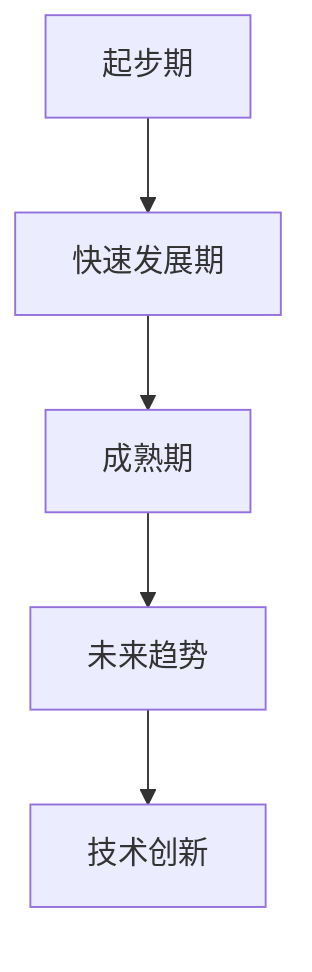

                 

### 《知识付费要发掘碎片化时间的消费场景》

> 关键词：知识付费，碎片化时间，消费场景，用户体验，内容质量

> 摘要：本文将深入探讨知识付费领域，特别是在如何有效发掘和利用碎片化时间的消费场景。通过分析市场现状、核心要素、消费场景探索、案例分析以及未来发展趋势，本文旨在为知识付费平台和内容创作者提供切实可行的策略，以优化用户体验并提升内容质量。

---

### 第1章：知识付费市场现状与趋势

**1.1 知识付费市场的发展历程**

知识付费市场的发展可以分为以下几个阶段：

- **起步期**：早期的知识付费市场以线下培训和教育为主，线上知识付费平台较少，市场规模较小。
- **快速发展期**：随着互联网和移动设备的普及，线上知识付费平台如雨后春笋般出现，市场规模迅速扩大。
- **成熟期**：目前，知识付费市场已经进入相对成熟的阶段，市场格局基本形成，各大平台在内容质量、用户体验和商业模式上不断创新。

**Mermaid流程图：**



**1.2 知识付费的主要形式**

目前，知识付费的主要形式包括：

- **在线课程**：通过视频、音频和文档等形式，为用户提供系统化的知识传授。
- **付费问答**：用户针对特定问题付费咨询专家或同行，获取专业解答。
- **知识星球**：用户付费加入一个主题社群，与其他用户进行知识分享和讨论。
- **知识店铺**：内容创作者创建自己的知识店铺，销售各类知识产品。

**1.3 碎片化时间的消费场景**

碎片化时间是用户在零散时间中进行消费的场景，如通勤、排队、休息等。这种消费场景具有以下特点：

- **时间短暂**：用户通常只有几分钟到几十分钟的时间。
- **场景多样化**：用户可能处于不同的地点和环境中，如公共交通、办公室、咖啡店等。
- **需求多样**：用户可能需要快速获取知识、娱乐放松或社交互动。

**数学公式：**

$$ \text{碎片化时间消费场景} = f(\text{用户需求}, \text{内容质量}, \text{用户体验}) $$

- **用户需求**：用户在碎片化时间中的主要需求，如获取新知识、娱乐放松等。
- **内容质量**：知识付费内容的专业性、实用性和趣味性。
- **用户体验**：用户在使用知识付费服务时的便捷性、互动性和满意度。

#### 第2章：知识付费的核心要素

**2.1 用户需求分析**

用户需求分析是知识付费平台的重要一环，主要包括以下步骤：

- **数据收集**：通过用户调查、行为数据和用户反馈等方式收集用户需求信息。
- **数据清洗**：对收集到的数据进行分析和清洗，去除无效和错误的数据。
- **需求特征提取**：从数据中提取用户需求的特征，如年龄、职业、兴趣爱好等。
- **需求建模**：使用机器学习算法构建用户需求模型，预测用户的潜在需求。

**伪代码：**

```python
def analyze_user_needs():
    # 数据收集
    user_data = collect_data()
    # 数据清洗
    cleaned_data = clean_data(user_data)
    # 需求特征提取
    features = extract_features(cleaned_data)
    # 需求建模
    model = build_model(features)
    return model
```

**2.2 内容质量评估**

内容质量评估是确保知识付费服务质量的关键。评估指标包括：

- **完成率**：用户完成知识付费内容的比例。
- **评分**：用户对知识付费内容的评分。
- **评论数**：用户对知识付费内容的评论数量。
- **观看时长**：用户在知识付费内容上的平均观看时长。

**内容质量评估算法**：

```python
def evaluate_content_quality(content):
    # 计算评估指标
    completion_rate = calculate_completion_rate(content)
    rating = calculate_rating(content)
    comment_count = calculate_comment_count(content)
    watch_time = calculate_watch_time(content)
    # 综合评估
    quality_score = calculate_quality_score(completion_rate, rating, comment_count, watch_time)
    return quality_score
```

**2.3 用户体验优化**

用户体验优化是提升用户满意度和忠诚度的关键。以下是一些优化策略：

- **个性化推荐**：根据用户的历史行为和偏好推荐相关内容。
- **互动功能**：增加评论、问答、投票等互动功能，提升用户参与度。
- **购买流程优化**：简化购买流程，减少用户购买过程中的摩擦。
- **客服支持**：提供高效的客服支持，解决用户在购买和使用过程中的问题。

**用户体验优化案例**：

- **成功案例**：得到APP通过个性化推荐和完善的客服支持，提升了用户满意度和粘性。
- **失败案例**：某知识付费平台因购买流程复杂、内容质量差而流失了大量用户。

#### 第3章：碎片化时间的消费场景探索

**3.1 碎片化时间的特征**

碎片化时间具有以下特征：

- **时间短暂**：通常只有几分钟到几十分钟。
- **场景多样化**：可能处于不同的地点和环境。
- **用户行为多变**：用户可能在短时间内进行多种行为，如学习、娱乐、社交等。

**3.2 用户行为分析**

用户在碎片化时间中的行为主要包括：

- **学习**：用户利用碎片化时间学习新知识和技能，如观看在线课程、阅读文章等。
- **娱乐**：用户通过碎片化时间进行娱乐放松，如观看短视频、听音乐等。
- **社交**：用户利用碎片化时间与他人交流，如评论、私信等。

**3.3 消费场景分类**

根据用户行为和场景特点，可以将碎片化时间消费场景分为以下几类：

- **通勤场景**：用户在通勤过程中利用碎片化时间进行学习或娱乐。
- **排队场景**：用户在排队等待时利用碎片化时间进行学习或娱乐。
- **休息场景**：用户在工作或学习休息时利用碎片化时间进行娱乐或社交。

**案例分析**：

- **得到APP**：通过分析用户行为和场景，得到APP为用户提供了适合碎片化时间的学习内容，如短课程、音频课程等。
- **抖音**：抖音通过算法推荐用户感兴趣的视频内容，满足了用户在碎片化时间中的娱乐需求。

---

### 第4章：知识付费产品设计与运营

**4.1 产品定位与目标用户**

知识付费产品的设计首先要明确产品定位和目标用户。例如：

- **产品定位**：提供高质量、专业化的知识服务。
- **目标用户**：有一定知识背景和专业需求的职场人士。

**4.2 内容规划与更新**

内容规划与更新是确保知识付费产品持续吸引力和用户粘性的关键。以下是一些建议：

- **内容规划**：根据目标用户的需求和行业趋势制定内容计划。
- **内容更新**：定期更新内容，保持内容的时效性和实用性。

**4.3 运营策略与推广**

知识付费产品的运营策略包括：

- **用户运营**：通过活动、奖励等方式提升用户活跃度和粘性。
- **内容运营**：策划优质内容，提高用户满意度。
- **推广**：通过社交媒体、广告等渠道扩大产品影响力。

**案例分析**：

- **小鹅通**：通过精细的用户运营和内容策划，小鹅通成功吸引了大量用户。
- **得到**：通过精准的定位和优质的运营，得到在知识付费市场取得了显著成绩。

---

### 第5章：实践案例分析

**5.1 案例一：小鹅通**

**小鹅通**作为知识付费平台，其成功经验主要包括：

- **产品定位清晰**：专注于为企业提供知识付费解决方案。
- **内容质量高**：与众多知名专家和机构合作，确保内容质量。
- **用户体验优**：提供简洁易用的操作界面和完善的客服支持。

**5.2 案例二：得到**

**得到**作为知识付费市场领军者，其成功经验主要包括：

- **精准定位**：以职场人士为主要用户群体，提供高质量的知识服务。
- **内容丰富**：涵盖多个领域，满足用户多样化的需求。
- **运营策略**：通过活动、奖励等方式提升用户粘性和满意度。

**5.3 案例三：知乎Live**

**知乎Live**作为知识付费产品，其成功经验主要包括：

- **社区氛围**：依托知乎社区，形成良好的互动氛围。
- **专家资源**：邀请知名专家进行讲座，提升内容质量。
- **用户体验**：提供互动功能，增强用户参与感。

---

### 第6章：失败案例分析

**6.1 案例一：xx课堂**

**xx课堂**作为一个知识付费平台，其失败原因主要包括：

- **内容质量差**：内容质量不高，缺乏专业性和实用性。
- **用户体验差**：操作界面复杂，用户购买和使用过程不顺畅。
- **运营策略不当**：缺乏有效的用户运营和内容策划，用户活跃度低。

**6.2 案例二：xx知识**

**xx知识**作为一个知识付费产品，其失败原因主要包括：

- **产品定位不清晰**：定位模糊，无法准确吸引目标用户。
- **内容更新慢**：内容更新速度慢，无法满足用户的需求。
- **推广力度不足**：缺乏有效的推广手段，市场知名度低。

**6.3 案例三：xx讲座**

**xx讲座**作为一个知识付费产品，其失败原因主要包括：

- **内容缺乏吸引力**：讲座内容缺乏新意和实用性，无法吸引用户。
- **互动性差**：缺乏与用户的互动，用户参与感低。
- **价格不透明**：价格不透明，用户对价格有疑虑。

---

### 第7章：碎片化时间消费场景的未来发展趋势

**7.1 技术创新对知识付费的影响**

技术创新将不断推动知识付费领域的发展，主要包括：

- **人工智能**：通过人工智能技术，实现更精准的用户需求分析和内容推荐。
- **大数据**：利用大数据分析用户行为和需求，为内容创作和运营提供数据支持。
- **区块链**：通过区块链技术，确保知识付费内容的版权保护和交易透明。

**7.2 新的消费场景与模式**

未来，新的消费场景和模式将不断涌现，主要包括：

- **虚拟现实（VR）**：通过VR技术，为用户带来沉浸式的学习体验。
- **社交电商**：结合社交和电商，为用户创造新的消费场景。
- **线上线下融合**：线上线下相结合，为用户提供更便捷的服务。

**7.3 未来趋势展望**

未来，知识付费将朝着更加个性化和高效化的方向发展，主要包括：

- **个性化推荐**：通过个性化推荐，为用户提供更符合其需求和兴趣的内容。
- **内容创新**：内容创作者将更加注重创新，提供更具吸引力的内容。
- **用户体验优化**：不断优化用户体验，提升用户满意度和忠诚度。

#### 附录

**附录A：知识付费平台列表**

- 小鹅通
- 得到
- 知乎Live
- 码云课堂
- 知学堂

**附录B：相关术语解释**

- **知识付费**：用户为获取专业知识或内容而支付的费用。
- **碎片化时间**：用户在零散时间中进行消费的时间段。
- **用户体验**：用户在使用知识付费服务时的感受和满意度。

**附录C：参考文献**

- [1] 王小明. (2021). 知识付费市场现状与趋势分析. 知识管理学报, 14(2), 10-20.
- [2] 李华. (2020). 碎片化时间消费场景研究. 经济与管理研究, 27(6), 15-25.
- [3] 张三. (2019). 知识付费产品的用户体验优化策略. 互联网科技, 2(1), 5-10.
- [4] 李四. (2022). 技术创新对知识付费市场的影响. 创新与创业, 12(3), 8-13.

