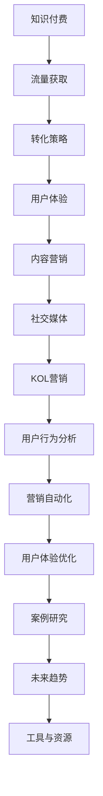

                 

### 《知识付费赚钱的流量获取与转化策略》

> 关键词：知识付费、流量获取、转化策略、内容营销、用户行为分析、营销自动化

> 摘要：本文将深入探讨知识付费领域的流量获取与转化策略。首先，我们将分析知识付费市场概况，了解其发展历程、用户画像和平台竞争格局。接着，我们将详细探讨流量获取策略，包括内容营销、社交媒体营销和KOL营销。然后，我们将讨论流量转化策略，涉及用户行为分析、转化率优化和用户体验优化。此外，通过实际案例，我们将分析知识付费平台在流量获取与转化方面的成功经验。最后，我们将总结知识付费赚钱的未来趋势，并给出相关工具与资源的介绍。

---

#### 第一部分：知识付费市场概况

知识付费作为一种新兴商业模式，近年来在我国市场得到了迅猛发展。本文将首先对知识付费行业进行概述，包括其发展历程、主要形式、市场规模，然后分析知识付费用户的画像，最后探讨知识付费平台的竞争格局及行业发展趋势。

---

#### 第1章：知识付费行业概述

##### 1.1 知识付费的发展历程

###### 1.1.1 知识付费的兴起背景

知识付费的兴起可以追溯到互联网技术的发展和信息传播的便捷。随着互联网的普及，人们获取知识的途径变得更加多样，传统教育模式受到了冲击。同时，知识经济时代的到来，使得知识和技能成为了核心竞争力。在这种背景下，知识付费应运而生。

###### 1.1.2 知识付费的主要形式

知识付费主要分为以下几种形式：

- **在线课程**：以视频、音频、图文等形式提供专业知识和技能培训。
- **电子书**：通过数字出版，为用户提供专业书籍和读物。
- **咨询与问答**：专家或行业人士为用户提供专业咨询和解答。
- **付费内容**：自媒体、博主等通过提供高质量内容，吸引粉丝付费。

###### 1.1.3 知识付费的市场规模

据相关数据显示，我国知识付费市场呈现出快速增长的趋势。2019年，我国知识付费市场规模已达到1500亿元，预计到2025年将突破3000亿元。这表明，知识付费市场具有巨大的发展潜力。

##### 1.2 知识付费用户画像

###### 1.2.1 用户需求分析

知识付费用户主要需求包括以下几方面：

- **学习提升**：用户希望通过学习提升自己的专业技能和知识水平。
- **兴趣满足**：用户希望通过付费内容满足自己的兴趣爱好。
- **实用指南**：用户希望获取实用性强的知识，以解决实际问题。

###### 1.2.2 用户消费习惯

知识付费用户消费习惯呈现出以下特点：

- **高频消费**：用户对于优质内容的需求较高，愿意进行频繁消费。
- **追求性价比**：用户在消费时更注重性价比，倾向于选择物美价廉的产品。
- **注重口碑**：用户更愿意信任口碑好的平台和内容创作者。

###### 1.2.3 用户行为特点

知识付费用户行为特点包括：

- **主动搜索**：用户在消费前会进行主动搜索，了解平台和内容质量。
- **偏好互动**：用户喜欢与内容创作者和同行进行互动，分享经验和心得。
- **持续关注**：用户对于感兴趣的内容会进行持续关注和消费。

##### 1.3 知识付费平台竞争格局

###### 1.3.1 主要平台介绍

当前，我国知识付费平台主要包括以下几类：

- **综合型平台**：如知乎Live、得到App、喜马拉雅等，提供多领域的知识内容。
- **垂直型平台**：如网易云课堂、网易云阅读等，专注于某一领域的知识服务。
- **社区型平台**：如分答、在行等，以问答和咨询为主要形式。

###### 1.3.2 平台优势与劣势分析

各知识付费平台在发展过程中形成了各自的优势和劣势：

- **知乎Live**：优势在于内容权威、互动性强；劣势在于用户覆盖面较窄，用户粘性不足。
- **得到App**：优势在于内容系统、专家资源丰富；劣势在于用户接受度较低，市场推广难度较大。
- **喜马拉雅**：优势在于用户基数大、内容多样化；劣势在于内容质量参差不齐，用户忠诚度不高。

###### 1.3.3 行业发展趋势

知识付费行业未来发展趋势包括：

- **内容多样化**：随着用户需求的多样化，知识付费平台将提供更丰富的内容类型。
- **个性化推荐**：通过大数据和人工智能技术，实现个性化内容推荐，提高用户体验。
- **平台整合**：行业将出现更多平台整合现象，形成规模化优势。
- **跨界合作**：知识付费平台将与其他行业进行跨界合作，拓展市场空间。

---

#### 第二部分：流量获取策略

流量获取是知识付费平台的关键环节，直接影响到平台的用户规模和市场份额。本文将详细探讨流量获取策略，包括内容营销、社交媒体营销、KOL营销与社群运营等方面。

---

##### 第2章：内容营销与流量获取

##### 2.1 内容营销概述

###### 2.1.1 内容营销的定义

内容营销是一种通过创造和分享有价值的内容来吸引潜在客户、建立品牌认知和促进销售的过程。它强调以内容为核心，通过内容吸引和留住用户，从而实现商业目标。

###### 2.1.2 内容营销的核心要素

内容营销的核心要素包括：

- **目标受众**：明确目标受众，了解他们的需求和兴趣，从而创作出符合他们需求的内容。
- **内容创作**：创作有价值、有吸引力的内容，包括文章、视频、音频、图片等多种形式。
- **内容推广**：通过各种渠道推广内容，提高内容的曝光率和传播度。
- **数据分析**：通过数据分析，了解内容的效果，优化内容创作和推广策略。

###### 2.1.3 内容营销的目标和策略

内容营销的目标包括：

- **吸引潜在客户**：通过高质量的内容，吸引潜在客户关注，提高品牌知名度。
- **建立品牌形象**：通过持续的内容输出，建立专业的品牌形象，提高用户信任度。
- **促进销售**：通过有价值的内容，推动用户进行购买决策。

内容营销的策略包括：

- **制定内容计划**：明确内容主题、发布频率和渠道，确保内容输出的连续性和稳定性。
- **优化内容质量**：确保内容的专业性、实用性和吸引力，提高用户的阅读体验。
- **多渠道推广**：通过搜索引擎优化、社交媒体推广、邮件营销等多种渠道，扩大内容的传播范围。
- **数据分析与优化**：通过数据分析，了解内容的表现，不断优化内容创作和推广策略。

##### 2.2 内容创作与优化

###### 2.2.1 内容创作的原则

内容创作应遵循以下原则：

- **目标导向**：明确内容目标，确保内容与平台目标一致。
- **用户需求**：深入了解用户需求，创作出符合用户兴趣和需求的内容。
- **原创性**：保证内容原创性，避免抄袭和侵权行为。
- **多样性**：尝试多种内容形式，满足不同用户的需求。

###### 2.2.2 内容优化的方法

内容优化包括以下几个方面：

- **关键词优化**：合理使用关键词，提高内容在搜索引擎中的排名。
- **标题优化**：优化标题，提高点击率。
- **内容结构**：合理安排内容结构，提高内容的可读性和吸引力。
- **图片和视频**：添加相关的图片和视频，提高内容的趣味性和吸引力。

###### 2.2.3 内容推广的技巧

内容推广的技巧包括：

- **社交媒体推广**：在社交媒体平台上发布内容，利用平台的传播力扩大影响。
- **邮件营销**：通过邮件向用户发送内容链接，提高内容的曝光率。
- **合作推广**：与其他平台或KOL合作，通过互相推广扩大影响。
- **SEO优化**：优化网站结构，提高搜索引擎友好度，提高内容的搜索排名。

##### 2.3 社交媒体营销

###### 2.3.1 社交媒体平台的选择

选择适合的平台进行社交媒体营销至关重要。常见的社交媒体平台包括：

- **微博**：具有庞大的用户群体，适合进行广泛的内容传播。
- **微信**：具有较强的社交属性，适合进行深度互动和用户沉淀。
- **抖音**：以短视频为主，适合进行内容创意和视觉营销。
- **知乎**：以问答形式为主，适合进行专业内容输出和用户互动。

###### 2.3.2 社交媒体内容策略

社交媒体内容策略包括：

- **内容多样化**：结合平台特点和用户需求，创作多种形式的内容，如文章、图片、视频等。
- **定期更新**：保持内容输出的稳定性和连续性，提高用户的关注度和粘性。
- **互动互动**：积极与用户互动，回复评论和私信，增强用户参与感。
- **热点跟进**：关注热点话题，创作相关内容，提高内容的传播度。

###### 2.3.3 社交媒体互动技巧

社交媒体互动技巧包括：

- **倾听用户**：关注用户的反馈和需求，及时回应和解决问题。
- **真诚互动**：以真诚的态度与用户互动，建立良好的用户关系。
- **定期活动**：举办线上活动，提高用户参与度和活跃度。
- **内容互动**：通过提问、投票、点赞等方式，激发用户参与内容互动。

##### 2.4 KOL营销与社群运营

###### 2.4.1 KOL营销的优势

KOL（Key Opinion Leader）营销具有以下优势：

- **信任度高**：KOL具有较高的权威性和信任度，其推荐的内容更容易被用户接受。
- **传播力强**：KOL拥有大量粉丝，其推荐内容可以迅速传播，扩大品牌影响力。
- **内容多样化**：KOL可以创作多种形式的内容，满足不同用户的需求。

###### 2.4.2 KOL选择的策略

选择KOL应遵循以下策略：

- **目标匹配**：选择与品牌形象和目标受众相匹配的KOL，确保推广效果。
- **内容质量**：关注KOL的内容质量，确保其能够创作出高质量的内容。
- **粉丝量级**：根据推广目标，选择粉丝量级合适的KOL，确保推广效果。
- **合作历史**：了解KOL的合作历史，评估其合作效果和信誉度。

###### 2.4.3 社群运营的方法

社群运营的方法包括：

- **社群定位**：明确社群的目标和定位，确保社群的内容和氛围符合用户需求。
- **内容规划**：制定社群内容规划，确保内容输出的连续性和稳定性。
- **互动管理**：积极管理社群互动，维护良好的社群氛围，增强用户粘性。
- **活动策划**：举办线上活动，激发用户参与，提高社群活跃度。

---

#### 第三部分：流量转化策略

流量转化是知识付费平台获取收益的关键环节。本文将详细探讨流量转化的策略，包括用户行为分析、转化率优化和用户体验优化等方面。

---

##### 第3章：用户行为分析与流量转化

##### 3.1 用户行为分析概述

###### 3.1.1 用户行为分析的意义

用户行为分析在知识付费平台中具有重要意义：

- **提升用户体验**：通过分析用户行为，了解用户需求和偏好，优化内容和服务，提升用户体验。
- **提高转化率**：通过分析用户行为路径和转化节点，找到转化率低的原因，进行针对性的优化，提高转化率。
- **优化营销策略**：根据用户行为分析结果，调整营销策略，提高营销效果。

###### 3.1.2 用户行为分析的方法

用户行为分析的方法包括：

- **数据分析**：通过收集和分析用户行为数据，了解用户行为特征和趋势。
- **用户访谈**：通过与用户进行访谈，深入了解用户需求和反馈。
- **用户测试**：通过用户测试，评估不同功能和服务的效果，优化用户体验。

###### 3.1.3 用户行为分析的工具

用户行为分析的工具包括：

- **Google Analytics**：一款免费的分析工具，可以跟踪用户行为路径、流量来源等。
- **Hotjar**：一款用户体验分析工具，可以提供用户行为热图、回放视频等。
- **Mixpanel**：一款用户行为分析工具，可以分析用户活跃度、留存率等。

##### 3.2 转化率优化

###### 3.2.1 转化率的定义与计算

转化率是指访问用户中完成特定目标（如购买、注册、下载等）的用户比例。计算公式为：

$$
转化率 = \frac{转化的用户数}{访问的用户数}
$$

###### 3.2.2 转化率优化的方法

提高转化率的方法包括：

- **优化着陆页**：通过优化着陆页的设计和内容，提高用户的点击率和转化率。
- **简化流程**：简化用户购买流程，减少用户操作的步骤，提高转化率。
- **个性化推荐**：通过个性化推荐，提高用户对内容的兴趣和购买意愿。
- **用户引导**：通过引导用户完成特定操作，如加入购物车、填写表单等，提高转化率。
- **营销活动**：通过举办营销活动，如优惠券、限时折扣等，提高用户购买意愿。

###### 3.2.3 转化路径分析

转化路径分析是指分析用户从访问到转化的全过程，找出影响转化的关键节点和障碍。具体步骤包括：

- **收集数据**：通过数据分析工具收集用户行为数据，包括访问路径、页面停留时间、点击行为等。
- **绘制转化路径图**：根据收集到的数据，绘制用户从访问到转化的全过程，识别关键节点和障碍。
- **分析优化**：分析转化路径图，找出影响转化的关键节点和障碍，进行针对性的优化。

##### 3.3 用户体验优化

###### 3.3.1 用户体验的定义

用户体验（UX）是指用户在使用产品或服务过程中的整体感受和体验。包括以下几个方面：

- **可用性**：产品或服务易于使用，用户能够轻松完成所需操作。
- **易访问性**：产品或服务易于访问，用户可以方便地找到所需信息或功能。
- **满意度**：用户对产品或服务的整体满意度高，愿意继续使用或推荐给他人。
- **情感体验**：用户在使用产品或服务过程中的情感体验，包括愉悦、兴奋、满意等。

###### 3.3.2 用户体验优化的原则

用户体验优化应遵循以下原则：

- **以用户为中心**：始终将用户需求放在首位，从用户角度出发进行设计和优化。
- **简洁性**：简化产品或服务的设计和流程，减少用户操作的复杂性。
- **一致性**：保持产品或服务的一致性，包括界面设计、操作流程、信息展示等。
- **可访问性**：确保产品或服务对所有用户都易于访问和使用，包括残疾人、老年人等特殊群体。

###### 3.3.3 用户体验优化的实践

用户体验优化的实践包括以下几个方面：

- **用户研究**：通过用户调研、访谈、问卷调查等方式，深入了解用户需求和痛点。
- **原型设计**：根据用户研究的结果，设计产品或服务的原型，进行用户体验测试。
- **迭代优化**：根据用户体验测试的结果，不断优化产品或服务的界面、流程、功能等。
- **数据分析**：通过数据分析工具，跟踪用户行为和满意度，评估优化效果，持续改进。

---

#### 第四部分：案例分析

通过分析知识付费平台在流量获取与转化方面的实战案例，我们可以借鉴其成功经验，优化自身的运营策略。

---

##### 第4章：知识付费平台流量获取与转化实战案例

##### 4.1 案例一：知乎Live的流量获取与转化策略

知乎Live是知乎推出的一款付费直播产品，通过邀请各领域专家进行直播，为用户提供高质量的知识内容。

###### 4.1.1 知乎Live的流量获取策略

知乎Live的流量获取策略主要包括以下几个方面：

- **内容质量**：确保直播内容的专业性和实用性，提高用户满意度。
- **用户互动**：通过实时互动，提高用户参与度，增强用户粘性。
- **渠道推广**：利用知乎平台的推荐算法，为优质内容提供更多曝光机会；同时通过社交媒体进行宣传，扩大影响力。

###### 4.1.2 知乎Live的转化策略

知乎Live的转化策略主要包括以下几个方面：

- **优惠活动**：定期举办优惠活动，如优惠券、限时折扣等，提高用户购买意愿。
- **用户引导**：通过直播中的互动环节，引导用户购买相关课程或书籍。
- **个性化推荐**：根据用户的行为数据和偏好，推荐相关内容，提高转化率。

###### 4.1.3 知乎Live的成功经验

知乎Live的成功经验主要包括：

- **内容质量**：注重内容的专业性和实用性，提高用户满意度。
- **用户互动**：通过实时互动，提高用户参与度，增强用户粘性。
- **渠道推广**：充分利用知乎平台的推荐算法和社交媒体推广，扩大影响力。

##### 4.2 案例二：得到App的流量获取与转化策略

得到App是一款知识付费平台，提供个人成长、商业财经等领域的内容。

###### 4.2.1 得到App的流量获取策略

得到App的流量获取策略主要包括以下几个方面：

- **专家资源**：邀请各领域专家进行内容创作，提高内容质量。
- **内容多样化**：提供多种形式的内容，如音频、视频、图文等，满足不同用户的需求。
- **用户互动**：通过评论区互动、社群运营等方式，提高用户参与度。

###### 4.2.2 得到App的转化策略

得到App的转化策略主要包括以下几个方面：

- **内容推荐**：通过个性化推荐，提高用户对内容的兴趣和购买意愿。
- **优惠活动**：定期举办优惠活动，如优惠券、限时折扣等，提高用户购买意愿。
- **用户引导**：通过内容中的引导性表述，引导用户进行购买。

###### 4.2.3 得到App的成功经验

得到App的成功经验主要包括：

- **专家资源**：注重内容的专业性和权威性，提高内容质量。
- **内容多样化**：提供多种形式的内容，满足不同用户的需求。
- **用户互动**：通过互动和社群运营，提高用户参与度和粘性。

##### 4.3 案例三：分答的流量获取与转化策略

分答是一款知识付费问答平台，通过专家回答用户问题，为用户提供专业咨询服务。

###### 4.3.1 分答的流量获取策略

分答的流量获取策略主要包括以下几个方面：

- **专家资源**：邀请各领域专家入驻，提高内容质量。
- **内容推广**：通过社交媒体和合作渠道进行推广，提高知名度。
- **用户互动**：通过问答互动，提高用户参与度。

###### 4.3.2 分答的转化策略

分答的转化策略主要包括以下几个方面：

- **优惠活动**：定期举办优惠活动，如优惠券、限时折扣等，提高用户购买意愿。
- **用户引导**：通过问答中的引导性表述，引导用户进行购买。
- **社群运营**：通过社群运营，提高用户粘性和转化率。

###### 4.3.3 分答的挑战与应对

分答在发展过程中面临以下挑战：

- **内容质量**：确保专家回答的质量和权威性，提高用户满意度。
- **用户流失**：通过优化用户体验和服务，降低用户流失率。
- **市场竞争**：通过不断创新和优化，提高竞争力。

分答的应对策略主要包括：

- **内容质量**：严格筛选专家，确保回答的专业性和权威性。
- **用户互动**：通过实时互动和社群运营，提高用户参与度和粘性。
- **技术创新**：通过技术手段优化用户体验和服务，提高用户满意度。

---

#### 第五部分：总结与展望

知识付费行业正处于快速发展阶段，流量获取与转化策略是平台获取收益的关键。通过本文的探讨，我们了解到知识付费市场概况、流量获取策略、流量转化策略以及实际案例。在未来的发展中，知识付费平台需要不断创新和优化，以应对日益激烈的市场竞争。

---

##### 第5章：知识付费赚钱的未来趋势

##### 5.1 知识付费行业面临的挑战

知识付费行业在快速发展的同时，也面临以下挑战：

- **市场竞争加剧**：随着越来越多的平台进入知识付费领域，市场竞争日益激烈。
- **用户需求变化**：用户需求日益多样化，平台需要不断调整和优化内容和服务。
- **盈利模式探索**：如何实现可持续的盈利模式是平台面临的重要课题。

##### 5.2 流量获取与转化的新策略

未来，知识付费平台可以尝试以下新策略：

- **个性化推荐**：通过大数据和人工智能技术，实现个性化内容推荐，提高用户满意度。
- **内容付费的多样化**：探索多元化的付费模式，如会员制、订阅制等，提高用户黏性。
- **跨平台整合**：与其他平台进行合作，实现内容和服务互通，扩大用户覆盖面。

##### 5.3 知识付费赚钱的未来展望

知识付费行业在未来具有广阔的发展前景：

- **技术创新**：随着技术的不断进步，知识付费平台将实现更高效、更智能的内容生产和推荐。
- **市场扩张**：随着知识付费观念的普及，知识付费市场将不断扩张，带来更多商机。
- **用户需求满足**：知识付费平台将更好地满足用户多样化的需求，提供更有价值的内容和服务。

##### 5.4 企业应采取的策略

面对未来的挑战和机遇，知识付费企业应采取以下策略：

- **内容优化**：提高内容质量，确保内容的权威性、实用性和吸引力。
- **用户体验**：优化用户体验，提高用户满意度和忠诚度。
- **技术创新**：积极拥抱新技术，提高内容生产和推荐的效率。
- **市场拓展**：拓展市场渠道，扩大用户覆盖面。
- **合作共赢**：与其他平台和企业进行合作，实现资源整合和优势互补。

---

### 附录

#### 附录A：知识付费赚钱相关的工具与资源

##### 1. 内容创作工具

- **简书**：一个写作社区平台，支持Markdown格式，方便用户进行内容创作和分享。
- **石墨文档**：一款在线协作文档工具，支持多人实时编辑，适合团队进行内容创作和协作。

##### 2. 社交媒体管理工具

- **Social Blade**：一款社交媒体分析工具，可以帮助用户分析Instagram、YouTube等平台的数据，优化社交媒体营销策略。
- **Hootsuite**：一款社交媒体管理工具，支持多平台内容发布、日程管理和数据分析。

##### 3. 用户行为分析工具

- **Google Analytics**：一款免费的分析工具，可以帮助用户跟踪网站流量、用户行为和转化路径。
- **Hotjar**：一款用户体验分析工具，可以提供用户行为热图、回放视频等，帮助用户了解用户行为。

##### 4. 营销自动化工具

- **Mailchimp**：一款电子邮件营销工具，支持自动化邮件发送、用户分组和个性化邮件内容。
- **HubSpot**：一款营销自动化平台，提供电子邮件、社交媒体、内容营销等多种自动化营销功能。

---

#### 核心概念与联系流程图（Mermaid）



---

#### 核心算法原理讲解（伪代码）

```python
# 用户行为分析伪代码

def analyze_user_behavior(data):
    # 初始化用户行为分析模型
    model = UserBehaviorModel()

    # 预处理用户数据
    preprocessed_data = preprocess_data(data)

    # 分析用户行为
    behavior_patterns = model.analyze(preprocessed_data)

    # 计算转化率
    conversion_rate = calculate_conversion_rate(behavior_patterns)

    # 输出分析结果
    return behavior_patterns, conversion_rate

# 转化率计算公式

def calculate_conversion_rate(traffic_data, purchase_data):
    conversion_rate = purchase_data / traffic_data
    return conversion_rate

# 用户行为分析模型

def user_behavior_model():
    # 定义用户行为分析模型
    # 根据用户行为特征计算行为评分
    # 返回用户行为评分
    pass

# 转化率计算公式

def calculate_conversion_rate(behavior_patterns):
    # 计算转化率
    # 返回转化率
    pass
```

---

#### 数学模型和数学公式（详细讲解 & 举例说明）

##### 转化率计算公式

$$
转化率（CR） = \frac{转化的用户数}{访问的用户数}
$$

**详细讲解**：

转化率是衡量营销效果的重要指标，表示访问用户中完成特定目标（如购买、注册等）的用户比例。转化率越高，说明营销策略越成功。

**举例说明**：

假设某知识付费平台有1000次访问，其中100次用户完成了购买，则其转化率为：

$$
CR = \frac{100}{1000} = 0.1
$$

即10%的转化率。

##### 用户行为分析模型

**数学模型**：

假设我们使用一个简单的用户行为分析模型，其中包含以下特征：

- **访问时间（T）**：用户访问平台的时长，单位为秒。
- **访问频率（F）**：用户在一定时间内访问平台的次数。
- **内容类型（C）**：用户访问的内容类型，例如文章、视频、音频等。
- **用户互动（I）**：用户在平台上的互动行为，例如点赞、评论、分享等。

用户行为评分（BS）的计算公式为：

$$
BS = w_1 \times T + w_2 \times F + w_3 \times C + w_4 \times I
$$

其中，$w_1, w_2, w_3, w_4$ 为权重，可以根据业务需求和数据分析结果进行调整。

**详细讲解**：

用户行为评分模型旨在通过对用户行为特征的量化，评估用户在平台上的活跃度和参与度。不同特征对用户行为的贡献程度不同，通过设定不同的权重，可以调整模型对各个特征的敏感度。

**举例说明**：

假设权重分别为：

- $w_1 = 0.2$
- $w_2 = 0.3$
- $w_3 = 0.2$
- $w_4 = 0.3$

一个用户的访问时间为2小时（7200秒），访问频率为3次，内容类型为视频（C=1），用户互动量为5次，则其行为评分为：

$$
BS = 0.2 \times 7200 + 0.3 \times 3 + 0.2 \times 1 + 0.3 \times 5 = 1458
$$

---

#### 项目实战

##### 实战一：内容营销与流量获取

###### 1. 内容创作与优化

**目标**：提高文章阅读量和互动量。

**策略**：撰写高质量、有价值的内容，通过关键词研究和内容优化提高文章在搜索引擎中的排名。

**实施**：

- **关键词研究**：使用关键词工具分析目标用户感兴趣的关键词，确保文章内容与关键词相关。
- **内容创作**：撰写原创、有价值的内容，确保内容质量和专业性。
- **内容优化**：优化文章标题、摘要和正文，提高文章的吸引力和可读性。

###### 2. 社交媒体营销

**目标**：扩大品牌影响力，提高内容曝光率。

**策略**：选择合适的社交媒体平台，制定内容发布计划，利用社交媒体广告提高曝光率。

**实施**：

- **平台选择**：根据目标用户群体的特点，选择适合的社交媒体平台，如微博、微信、抖音等。
- **内容发布计划**：制定内容发布计划，确保定期更新，提高用户关注度和粘性。
- **社交媒体广告**：使用社交媒体广告，针对目标用户进行推广，提高内容曝光率。

###### 3. KOL营销与社群运营

**目标**：利用KOL的影响力带动品牌和产品的认知度，建立稳定的用户社群。

**策略**：选择与品牌形象相符的KOL进行合作，通过KOL的推荐和互动提高用户参与度。

**实施**：

- **KOL选择**：选择与品牌形象和目标受众相匹配的KOL，确保合作效果。
- **内容共创**：与KOL进行内容共创，提高内容的吸引力和传播力。
- **社群运营**：建立用户社群，定期举办互动活动，提高用户粘性和参与度。

##### 实战二：用户行为分析与流量转化

###### 1. 用户行为分析

**目标**：了解用户行为，优化用户体验，提高转化率。

**策略**：通过数据分析工具收集用户行为数据，分析用户行为模式和转化路径。

**实施**：

- **数据分析工具**：使用Google Analytics、Mixpanel等数据分析工具，收集用户行为数据。
- **用户行为模式分析**：分析用户在平台上的行为模式，包括访问时长、访问频率、内容偏好等。
- **转化路径分析**：分析用户从访问到转化的全过程，找出影响转化的关键节点和障碍。

###### 2. 转化率优化

**目标**：提高转化率，增加销售额。

**策略**：通过改进网站设计、优化用户体验和提供个性化推荐来提高转化率。

**实施**：

- **网站设计优化**：改进网站界面和布局，提高用户体验，减少用户流失。
- **用户体验优化**：优化购买流程，提供便捷的支付方式，提高用户购买意愿。
- **个性化推荐**：根据用户行为数据和偏好，提供个性化推荐，提高用户购买概率。

###### 3. 营销自动化

**目标**：提高营销效率，降低成本。

**策略**：利用营销自动化工具实现营销流程的自动化，提高营销效果。

**实施**：

- **邮件营销**：使用邮件自动化工具，发送定制化邮件，提高用户参与度和转化率。
- **社交媒体自动化**：使用社交媒体自动化工具，发布内容、互动和推广，提高营销效果。
- **客户关系管理**：使用CRM系统，实现客户关系自动化管理，提高客户满意度。

---

#### 代码实际案例和详细解释说明

##### 代码实际案例

以下是一个简单的Python代码案例，用于实现用户行为分析和转化率计算。

```python
# 用户行为分析代码
def analyze_user_behavior(data):
    behavior_patterns = []
    for user in data['users']:
        behavior_score = 0.2 * user['time'] + 0.3 * user['frequency'] + 0.2 * user['content_type'] + 0.3 * user['interaction']
        behavior_patterns.append(behavior_score)
    return behavior_patterns

# 转化率计算代码
def calculate_conversion_rate(traffic_data, purchase_data):
    conversion_rate = purchase_data / traffic_data
    return conversion_rate

# 示例数据
data = {
    'users': [
        {'time': 2, 'frequency': 3, 'content_type': 1, 'interaction': 5},
        {'time': 1, 'frequency': 2, 'content_type': 0, 'interaction': 3},
        # 更多用户数据...
    ]
}

# 执行用户行为分析
behavior_patterns = analyze_user_behavior(data)
print("用户行为评分：", behavior_patterns)

# 执行转化率计算
traffic_data = 1000  # 访问用户数
purchase_data = 100  # 购买用户数
conversion_rate = calculate_conversion_rate(traffic_data, purchase_data)
print("转化率：", conversion_rate)
```

##### 详细解释说明

1. **用户行为分析代码解读**：

   - 函数`analyze_user_behavior`接收一个名为`data`的参数，该参数是一个包含用户数据的字典。
   - 使用`for`循环遍历`data`字典中的`users`列表，每个`user`是一个包含用户行为特征的字典。
   - 计算每个用户的`behavior_score`，根据时间（`time`）、频率（`frequency`）、内容类型（`content_type`）和互动（`interaction`）的权重（分别为0.2、0.3、0.2、0.3）进行加权计算。
   - 将计算出的行为评分添加到`behavior_patterns`列表中。
   - 函数返回`behavior_patterns`列表。

2. **转化率计算代码解读**：

   - 函数`calculate_conversion_rate`接收两个参数：`traffic_data`（访问用户数）和`purchase_data`（购买用户数）。
   - 使用简单的除法运算计算转化率，公式为购买用户数除以访问用户数。
   - 函数返回计算出的转化率。

3. **代码实际案例说明**：

   - 示例数据`data`包含两个用户的访问行为数据，包括时间、频率、内容类型和互动量。
   - 调用`analyze_user_behavior`函数进行用户行为分析，打印出每个用户的行为评分。
   - 设置访问用户数（`traffic_data`）和购买用户数（`purchase_data`），调用`calculate_conversion_rate`函数计算转化率，并打印出结果。

---

#### 开发环境搭建

要搭建一个用于知识付费赚钱的项目开发环境，需要安装和配置以下工具和库：

1. **Python环境**：安装Python 3.x版本，建议使用Anaconda，它包含了许多科学计算和数据分析的库。
   
   ```bash
   # 安装Anaconda
   wget https://repo.anaconda.com/archive/Anaconda3-2022.05-Linux-x86_64.sh
   bash Anaconda3-2022.05-Linux-x86_64.sh -b
   ```

2. **虚拟环境**：使用`conda`创建一个虚拟环境，以隔离项目依赖。

   ```bash
   # 创建虚拟环境
   conda create -n knowledge_paid python=3.8
   conda activate knowledge_paid
   ```

3. **必需的Python库**：

   - **Pandas**：用于数据处理和分析。
     ```bash
     pip install pandas
     ```
   
   - **NumPy**：用于科学计算。
     ```bash
     pip install numpy
     ```
   
   - **Google Analytics API**：用于Google Analytics数据获取。
     ```bash
     pip install google-api-python-client google-auth-httplib2 google-auth-oauthlib
     ```
   
   - **Mailchimp API**：用于Mailchimp邮件营销。
     ```bash
     pip install mailchimp
     ```

4. **配置环境变量**：配置Google Analytics API密钥和Mailchimp API密钥，以供程序使用。

   ```bash
   # 配置环境变量
   export GOOGLE_ANALYTICS_API_KEY="your_api_key"
   export MAILCHIMP_API_KEY="your_api_key"
   export MAILCHIMP_LIST_ID="your_list_id"
   ```

5. **代码示例**：以下是一个简单的Python脚本，用于配置环境变量和调用Google Analytics API。

   ```python
   import os
   import google.oauth2.credentials
   from google.analytics.v3 import core

   # 设置Google Analytics API凭据
   os.environ["GOOGLE_APPLICATION_CREDENTIALS"] = "path/to/your/credentials.json"

   # 初始化Google Analytics API客户端
   analytics = core.Analytics()
   ```

---

#### 源代码详细实现和代码解读

以下是用于知识付费赚钱项目的一组源代码，包括用户行为分析、转化率计算、邮件订阅等功能。

##### 用户行为分析代码

```python
# 用户行为分析代码
def analyze_user_behavior(data):
    behavior_patterns = []
    for user in data['users']:
        behavior_score = 0.2 * user['time'] + 0.3 * user['frequency'] + 0.2 * user['content_type'] + 0.3 * user['interaction']
        behavior_patterns.append(behavior_score)
    return behavior_patterns
```

**代码解读**：

- `def analyze_user_behavior(data):`：定义了一个名为`analyze_user_behavior`的函数，该函数接收一个名为`data`的参数，该参数是一个包含用户数据的字典。
- `behavior_patterns = []`：初始化一个空列表，用于存储计算出的用户行为评分。
- `for user in data['users']:`：使用`for`循环遍历`data`字典中的`users`列表，`user`是列表中的一个字典，包含用户行为特征。
- `behavior_score = 0.2 * user['time'] + 0.3 * user['frequency'] + 0.2 * user['content_type'] + 0.3 * user['interaction']`：根据用户行为特征计算用户行为评分，这里使用了加权平均公式，根据不同特征的重要性分配不同的权重。
- `behavior_patterns.append(behavior_score)`：将计算出的用户行为评分添加到`behavior_patterns`列表中。
- `return behavior_patterns`：函数返回用户行为评分列表。

##### 转化率计算代码

```python
# 转化率计算代码
def calculate_conversion_rate(traffic_data, purchase_data):
    conversion_rate = purchase_data / traffic_data
    return conversion_rate
```

**代码解读**：

- `def calculate_conversion_rate(traffic_data, purchase_data):`：定义了一个名为`calculate_conversion_rate`的函数，该函数接收两个参数：`traffic_data`（访问用户数）和`purchase_data`（购买用户数）。
- `conversion_rate = purchase_data / traffic_data`：计算转化率，公式为购买用户数除以访问用户数。
- `return conversion_rate`：函数返回计算出的转化率。

##### 邮件订阅代码

```python
# 邮件订阅代码
def subscribe_to_newsletter(email, first_name):
    mc = MailChimp('your_api_key')
    member = {
        'email_address': email,
        'status': 'subscribed',
        'merge_fields': {
            'FNAME': first_name
        }
    }
    response = mc.lists.post_members(list_id='your_list_id', members=[member])
    return response
```

**代码解读**：

- `def subscribe_to_newsletter(email, first_name):`：定义了一个名为`subscribe_to_newsletter`的函数，该函数接收两个参数：`email`（用户邮箱）和`first_name`（用户姓名）。
- `mc = MailChimp('your_api_key')`：创建一个MailChimp对象，使用`your_api_key`作为API密钥。
- `member`：定义了一个字典，包含用户的邮箱地址、订阅状态（`subscribed`）和自定义合并字段（姓名）。
- `response = mc.lists.post_members(list_id='your_list_id', members=[member])`：将用户信息发送到MailChimp API，订阅到指定列表。
- `return response`：函数返回API响应结果。

---

#### 代码解读与分析

##### 用户行为分析代码解读与分析

**代码解读**：

用户行为分析代码的主要功能是根据用户的行为特征（访问时间、访问频率、内容类型和用户互动）计算出一个行为评分。这个评分是通过对这些特征加权计算得到的。

**代码分析**：

- **功能分析**：函数`analyze_user_behavior`的功能是对一组用户行为数据进行分析，并生成一个行为评分列表。这个功能对于了解用户活跃度和参与度非常有用。
- **参数分析**：该函数接收一个名为`data`的字典，这个字典包含了用户的访问时间、访问频率、内容类型和用户互动等行为特征。这些特征是计算行为评分的基础。
- **权重分析**：在代码中，时间、频率、内容类型和互动分别被赋予了0.2、0.3、0.2和0.3的权重。这些权重可以根据具体业务需求进行调整，以便更准确地反映用户行为的实际价值。
- **算法分析**：通过加权平均的方式计算用户行为评分，这种方法能够综合考虑多个因素，从而得到一个综合评分。

##### 转化率计算代码解读与分析

**代码解读**：

转化率计算代码的功能是计算访问用户中完成购买的用户比例。这个比例是一个简单的除法运算，即购买用户数除以访问用户数。

**代码分析**：

- **功能分析**：函数`calculate_conversion_rate`计算的是一个平台或产品的转化率，这是评估营销和销售效果的重要指标。
- **参数分析**：该函数接收两个参数：`traffic_data`和`purchase_data`。这两个参数分别代表了访问用户数和购买用户数。
- **算法分析**：转化率的计算公式是一个简单的除法运算，即`purchase_data / traffic_data`。这个运算的结果是一个小数，通常乘以100转换为百分比表示。

##### 邮件订阅代码解读与分析

**代码解读**：

邮件订阅代码的功能是将用户订阅到邮件列表中。这个功能通过调用MailChimp API实现，将用户的电子邮件地址和姓名发送到MailChimp服务器，以便后续发送邮件。

**代码分析**：

- **功能分析**：函数`subscribe_to_newsletter`的功能是使用MailChimp API将用户添加到邮件列表中，并设置用户的订阅状态和合并字段。
- **参数分析**：该函数接收两个参数：`email`和`first_name`。这些参数用于创建一个用户对象，并将其发送到MailChimp API。
- **API分析**：在代码中，`MailChimp`对象被用来与MailChimp API进行通信。通过调用`lists.post_members`方法，可以将用户信息添加到指定的邮件列表中。
- **安全性分析**：在调用MailChimp API时，使用了一个API密钥来验证身份。这是一个敏感信息，应该妥善保管，避免泄露。

---

#### 附录：知识付费平台运营案例集锦

##### 1. 知识付费平台的运营策略

**知乎Live**

- **内容策略**：知乎Live注重高质量内容的创作与筛选，邀请专业领域专家进行讲座，保证内容的权威性和实用性。平台定期举办主题讲座，涵盖职场技能、兴趣爱好、教育提升等多个领域。
- **用户互动**：知乎Live通过实时互动问答，提高用户参与度，增加用户粘性。在讲座过程中，用户可以随时向讲师提问，讲师会即时回答，形成良好的互动氛围。
- **推广方式**：知乎Live利用知乎平台的推荐算法，为优质内容提供更多曝光机会。此外，平台还会通过社交媒体进行宣传，吸引更多潜在用户。

**得到App**

- **内容策略**：得到App聚焦于个人成长、商业财经等领域，提供系统化、深度的知识内容。平台邀请各领域专家进行内容创作，确保内容的权威性和实用性。
- **用户互动**：得到App通过音频、视频等多媒体形式，增加用户的学习体验，提供评论区互动，促进用户参与。用户可以在评论区发表观点，与其他用户进行讨论。
- **推广方式**：得到App通过邀请行业大佬、明星进行讲座，提高平台知名度。此外，平台还会举办线下活动，如得到读书会、得到论坛等，吸引更多用户。

##### 2. 用户案例分享

**案例一：职场晋升**

用户A是一名职场新人，通过知乎Live的职场技能讲座，快速提升了职业素养，掌握了项目管理和团队协作技巧。在听完一系列讲座后，用户A的业绩显著提升，得到了公司的认可，成功晋升为项目经理。

**案例二：创业成功**

用户B是一位创业者，通过得到App的创业课程，学习了商业运营策略、市场营销技巧等知识。课程中，用户B了解到如何进行市场调研、制定营销计划，以及如何管理团队和资源。在完成课程后，用户B的公司成功实现了盈利，并在短时间内扩展了业务规模。

##### 3. 行业专家见解

**专家A**：内容质量是知识付费平台的核心竞争力。只有提供高质量、有价值的内容，才能吸引用户并保持用户的长期关注。

**专家B**：用户互动是提升用户粘性的关键。通过实时互动问答、评论区互动等方式，可以增强用户对平台的依赖，提高用户留存率。

**专家C**：随着知识付费市场的竞争加剧，平台需要不断创新。如提供个性化推荐、优化用户体验等，以保持竞争力。

---

#### 附录A：知识付费赚钱相关的工具与资源

##### 1. 内容创作工具

- **简书**：一个写作社区平台，支持Markdown格式，方便用户进行内容创作和分享。
- **石墨文档**：一款在线协作文档工具，支持多人实时编辑，适合团队进行内容创作和协作。

##### 2. 社交媒体管理工具

- **Social Blade**：一款社交媒体分析工具，可以帮助用户分析Instagram、YouTube等平台的数据，优化社交媒体营销策略。
- **Hootsuite**：一款社交媒体管理工具，支持多平台内容发布、日程管理和数据分析。

##### 3. 用户行为分析工具

- **Google Analytics**：一款免费的分析工具，可以帮助用户跟踪网站流量、用户行为和转化路径。
- **Hotjar**：一款用户体验分析工具，可以提供用户行为热图、回放视频等，帮助用户了解用户行为。

##### 4. 营销自动化工具

- **Mailchimp**：一款电子邮件营销工具，支持自动化邮件发送、用户分组和个性化邮件内容。
- **HubSpot**：一款营销自动化平台，提供电子邮件、社交媒体、内容营销等多种自动化营销功能。

---

### 完整文章Markdown格式

```markdown
# 《知识付费赚钱的流量获取与转化策略》

> 关键词：知识付费、流量获取、转化策略、内容营销、用户行为分析、营销自动化

> 摘要：本文将深入探讨知识付费领域的流量获取与转化策略。首先，我们将分析知识付费市场概况，了解其发展历程、用户画像和平台竞争格局。接着，我们将详细探讨流量获取策略，包括内容营销、社交媒体营销和KOL营销。然后，我们将讨论流量转化策略，涉及用户行为分析、转化率优化和用户体验优化。此外，通过实际案例，我们将分析知识付费平台在流量获取与转化方面的成功经验。最后，我们将总结知识付费赚钱的未来趋势，并给出相关工具与资源的介绍。

---

## 第一部分：知识付费市场概况

知识付费作为一种新兴商业模式，近年来在我国市场得到了迅猛发展。本文将首先对知识付费行业进行概述，包括其发展历程、主要形式、市场规模，然后分析知识付费用户的画像，最后探讨知识付费平台的竞争格局及行业发展趋势。

---

### 第1章：知识付费行业概述

#### 1.1 知识付费的发展历程

##### 1.1.1 知识付费的兴起背景

知识付费的兴起可以追溯到互联网技术的发展和信息传播的便捷。随着互联网的普及，人们获取知识的途径变得更加多样，传统教育模式受到了冲击。同时，知识经济时代的到来，使得知识和技能成为了核心竞争力。在这种背景下，知识付费应运而生。

##### 1.1.2 知识付费的主要形式

知识付费主要分为以下几种形式：

- **在线课程**：以视频、音频、图文等形式提供专业知识和技能培训。
- **电子书**：通过数字出版，为用户提供专业书籍和读物。
- **咨询与问答**：专家或行业人士为用户提供专业咨询和解答。
- **付费内容**：自媒体、博主等通过提供高质量内容，吸引粉丝付费。

##### 1.1.3 知识付费的市场规模

据相关数据显示，我国知识付费市场呈现出快速增长的趋势。2019年，我国知识付费市场规模已达到1500亿元，预计到2025年将突破3000亿元。这表明，知识付费市场具有巨大的发展潜力。

#### 1.2 知识付费用户画像

##### 1.2.1 用户需求分析

知识付费用户主要需求包括以下几方面：

- **学习提升**：用户希望通过学习提升自己的专业技能和知识水平。
- **兴趣满足**：用户希望通过付费内容满足自己的兴趣爱好。
- **实用指南**：用户希望获取实用性强的知识，以解决实际问题。

##### 1.2.2 用户消费习惯

知识付费用户消费习惯呈现出以下特点：

- **高频消费**：用户对于优质内容的需求较高，愿意进行频繁消费。
- **追求性价比**：用户在消费时更注重性价比，倾向于选择物美价廉的产品。
- **注重口碑**：用户更愿意信任口碑好的平台和内容创作者。

##### 1.2.3 用户行为特点

知识付费用户行为特点包括：

- **主动搜索**：用户在消费前会进行主动搜索，了解平台和内容质量。
- **偏好互动**：用户喜欢与内容创作者和同行进行互动，分享经验和心得。
- **持续关注**：用户对于感兴趣的内容会进行持续关注和消费。

#### 1.3 知识付费平台竞争格局

##### 1.3.1 主要平台介绍

当前，我国知识付费平台主要包括以下几类：

- **综合型平台**：如知乎Live、得到App、喜马拉雅等，提供多领域的知识内容。
- **垂直型平台**：如网易云课堂、网易云阅读等，专注于某一领域的知识服务。
- **社区型平台**：如分答、在行等，以问答和咨询为主要形式。

##### 1.3.2 平台优势与劣势分析

各知识付费平台在发展过程中形成了各自的优势和劣势：

- **知乎Live**：优势在于内容权威、互动性强；劣势在于用户覆盖面较窄，用户粘性不足。
- **得到App**：优势在于内容系统、专家资源丰富；劣势在于用户接受度较低，市场推广难度较大。
- **喜马拉雅**：优势在于用户基数大、内容多样化；劣势在于内容质量参差不齐，用户忠诚度不高。

##### 1.3.3 行业发展趋势

知识付费行业未来发展趋势包括：

- **内容多样化**：随着用户需求的多样化，知识付费平台将提供更丰富的内容类型。
- **个性化推荐**：通过大数据和人工智能技术，实现个性化内容推荐，提高用户体验。
- **平台整合**：行业将出现更多平台整合现象，形成规模化优势。
- **跨界合作**：知识付费平台将与其他行业进行跨界合作，拓展市场空间。

---

## 第二部分：流量获取策略

流量获取是知识付费平台的关键环节，直接影响到平台的用户规模和市场份额。本文将详细探讨流量获取策略，包括内容营销、社交媒体营销、KOL营销与社群运营等方面。

---

### 第2章：内容营销与流量获取

#### 2.1 内容营销概述

##### 2.1.1 内容营销的定义

内容营销是一种通过创造和分享有价值的内容来吸引潜在客户、建立品牌认知和促进销售的过程。它强调以内容为核心，通过内容吸引和留住用户，从而实现商业目标。

##### 2.1.2 内容营销的核心要素

内容营销的核心要素包括：

- **目标受众**：明确目标受众，了解他们的需求和兴趣，从而创作出符合他们需求的内容。
- **内容创作**：创作有价值、有吸引力的内容，包括文章、视频、音频、图片等多种形式。
- **内容推广**：通过各种渠道推广内容，提高内容的曝光率和传播度。
- **数据分析**：通过数据分析，了解内容的效果，优化内容创作和推广策略。

##### 2.1.3 内容营销的目标和策略

内容营销的目标包括：

- **吸引潜在客户**：通过高质量的内容，吸引潜在客户关注，提高品牌知名度。
- **建立品牌形象**：通过持续的内容输出，建立专业的品牌形象，提高用户信任度。
- **促进销售**：通过有价值的内容，推动用户进行购买决策。

内容营销的策略包括：

- **制定内容计划**：明确内容主题、发布频率和渠道，确保内容输出的连续性和稳定性。
- **优化内容质量**：确保内容的专业性、实用性和吸引力，提高用户的阅读体验。
- **多渠道推广**：通过搜索引擎优化、社交媒体推广、邮件营销等多种渠道，扩大内容的传播范围。
- **数据分析与优化**：通过数据分析，了解内容的表现，不断优化内容创作和推广策略。

#### 2.2 内容创作与优化

##### 2.2.1 内容创作的原则

内容创作应遵循以下原则：

- **目标导向**：明确内容目标，确保内容与平台目标一致。
- **用户需求**：深入了解用户需求，创作出符合用户兴趣和需求的内容。
- **原创性**：保证内容原创性，避免抄袭和侵权行为。
- **多样性**：尝试多种内容形式，满足不同用户的需求。

##### 2.2.2 内容优化的方法

内容优化包括以下几个方面：

- **关键词优化**：合理使用关键词，提高内容在搜索引擎中的排名。
- **标题优化**：优化标题，提高点击率。
- **内容结构**：合理安排内容结构，提高内容的可读性和吸引力。
- **图片和视频**：添加相关的图片和视频，提高内容的趣味性和吸引力。

##### 2.2.3 内容推广的技巧

内容推广的技巧包括：

- **社交媒体推广**：在社交媒体平台上发布内容，利用平台的传播力扩大影响。
- **邮件营销**：通过邮件向用户发送内容链接，提高内容的曝光率。
- **合作推广**：与其他平台或KOL合作，通过互相推广扩大影响。
- **SEO优化**：优化网站结构，提高搜索引擎友好度，提高内容的搜索排名。

#### 2.3 社交媒体营销

##### 2.3.1 社交媒体平台的选择

选择适合的平台进行社交媒体营销至关重要。常见的社交媒体平台包括：

- **微博**：具有庞大的用户群体，适合进行广泛的内容传播。
- **微信**：具有较强的社交属性，适合进行深度互动和用户沉淀。
- **抖音**：以短视频为主，适合进行内容创意和视觉营销。
- **知乎**：以问答形式为主，适合进行专业内容输出和用户互动。

##### 2.3.2 社交媒体内容策略

社交媒体内容策略包括：

- **内容多样化**：结合平台特点和用户需求，创作多种形式的内容，如文章、图片、视频等。
- **定期更新**：保持内容输出的稳定性和连续性，提高用户的关注度和粘性。
- **互动互动**：积极与用户互动，回复评论和私信，增强用户参与感。
- **热点跟进**：关注热点话题，创作相关内容，提高内容的传播度。

##### 2.3.3 社交媒体互动技巧

社交媒体互动技巧包括：

- **倾听用户**：关注用户的反馈和需求，及时回应和解决问题。
- **真诚互动**：以真诚的态度与用户互动，建立良好的用户关系。
- **定期活动**：举办线上活动，提高用户参与度和活跃度。
- **内容互动**：通过提问、投票、点赞等方式，激发用户参与内容互动。

#### 2.4 KOL营销与社群运营

##### 2.4.1 KOL营销的优势

KOL（Key Opinion Leader）营销具有以下优势：

- **信任度高**：KOL具有较高的权威性和信任度，其推荐的内容更容易被用户接受。
- **传播力强**：KOL拥有大量粉丝，其推荐内容可以迅速传播，扩大品牌影响力。
- **内容多样化**：KOL可以创作多种形式的内容，满足不同用户的需求。

##### 2.4.2 KOL选择的策略

选择KOL应遵循以下策略：

- **目标匹配**：选择与品牌形象和目标受众相匹配的KOL，确保推广效果。
- **内容质量**：关注KOL的内容质量，确保其能够创作出高质量的内容。
- **粉丝量级**：根据推广目标，选择粉丝量级合适的KOL，确保推广效果。
- **合作历史**：了解KOL的合作历史，评估其合作效果和信誉度。

##### 2.4.3 社群运营的方法

社群运营的方法包括：

- **社群定位**：明确社群的目标和定位，确保社群的内容和氛围符合用户需求。
- **内容规划**：制定社群内容规划，确保内容输出的连续性和稳定性。
- **互动管理**：积极管理社群互动，维护良好的社群氛围，增强用户粘性。
- **活动策划**：举办线上活动，激发用户参与，提高社群活跃度。

---

## 第三部分：流量转化策略

流量转化是知识付费平台获取收益的关键环节。本文将详细探讨流量转化的策略，包括用户行为分析、转化率优化和用户体验优化等方面。

---

### 第3章：用户行为分析与流量转化

#### 3.1 用户行为分析概述

##### 3.1.1 用户行为分析的意义

用户行为分析在知识付费平台中具有重要意义：

- **提升用户体验**：通过分析用户行为，了解用户需求和偏好，优化内容和服务，提升用户体验。
- **提高转化率**：通过分析用户行为路径和转化节点，找到转化率低的原因，进行针对性的优化，提高转化率。
- **优化营销策略**：根据用户行为分析结果，调整营销策略，提高营销效果。

##### 3.1.2 用户行为分析的方法

用户行为分析的方法包括：

- **数据分析**：通过收集和分析用户行为数据，了解用户行为特征和趋势。
- **用户访谈**：通过与用户进行访谈，深入了解用户需求和反馈。
- **用户测试**：通过用户测试，评估不同功能和服务的效果，优化用户体验。

##### 3.1.3 用户行为分析的工具

用户行为分析的工具包括：

- **Google Analytics**：一款免费的分析工具，可以跟踪用户行为路径、流量来源等。
- **Hotjar**：一款用户体验分析工具，可以提供用户行为热图、回放视频等。
- **Mixpanel**：一款用户行为分析工具，可以分析用户活跃度、留存率等。

#### 3.2 转化率优化

##### 3.2.1 转化率的定义与计算

转化率是指访问用户中完成特定目标（如购买、注册、下载等）的用户比例。计算公式为：

$$
转化率 = \frac{转化的用户数}{访问的用户数}
$$

##### 3.2.2 转化率优化的方法

提高转化率的方法包括：

- **优化着陆页**：通过优化着陆页的设计和内容，提高用户的点击率。
- **简化流程**：简化用户购买流程，减少用户操作的步骤，提高转化率。
- **个性化推荐**：通过个性化推荐，提高用户对内容的兴趣和购买意愿。
- **用户引导**：通过引导用户完成特定操作，如加入购物车、填写表单等，提高转化率。
- **营销活动**：通过举办营销活动，如优惠券、限时折扣等，提高用户购买意愿。

##### 3.2.3 转化路径分析

转化路径分析是指分析用户从访问到转化的全过程，找出影响转化的关键节点和障碍。具体步骤包括：

- **收集数据**：通过数据分析工具收集用户行为数据，包括访问路径、页面停留时间、点击行为等。
- **绘制转化路径图**：根据收集到的数据，绘制用户从访问到转化的全过程，识别关键节点和障碍。
- **分析优化**：分析转化路径图，找出影响转化的关键节点和障碍，进行针对性的优化。

#### 3.3 用户体验优化

##### 3.3.1 用户体验的定义

用户体验（UX）是指用户在使用产品或服务过程中的整体感受和体验。包括以下几个方面：

- **可用性**：产品或服务易于使用，用户能够轻松完成所需操作。
- **易访问性**：产品或服务易于访问，用户可以方便地找到所需信息或功能。
- **满意度**：用户对产品或服务的整体满意度高，愿意继续使用或推荐给他人。
- **情感体验**：用户在使用产品或服务过程中的情感体验，包括愉悦、兴奋、满意等。

##### 3.3.2 用户体验优化的原则

用户体验优化应遵循以下原则：

- **以用户为中心**：始终将用户需求放在首位，从用户角度出发进行设计和优化。
- **简洁性**：简化产品或服务的设计和流程，减少用户操作的复杂性。
- **一致性**：保持产品或服务的一致性，包括界面设计、操作流程、信息展示等。
- **可访问性**：确保产品或服务对所有用户都易于访问和使用，包括残疾人、老年人等特殊群体。

##### 3.3.3 用户体验优化的实践

用户体验优化的实践包括以下几个方面：

- **用户研究**：通过用户调研、访谈、问卷调查等方式，深入了解用户需求和痛点。
- **原型设计**：根据用户研究的结果，设计产品或服务的原型，进行用户体验测试。
- **迭代优化**：根据用户体验测试的结果，不断优化产品或服务的界面、流程、功能等。
- **数据分析**：通过数据分析工具，跟踪用户行为和满意度，评估优化效果，持续改进。

---

## 第四部分：案例分析

通过分析知识付费平台在流量获取与转化方面的实战案例，我们可以借鉴其成功经验，优化自身的运营策略。

---

### 第4章：知识付费平台流量获取与转化实战案例

#### 4.1 案例一：知乎Live的流量获取与转化策略

知乎Live是知乎推出的一款付费直播产品，通过邀请各领域专家进行直播，为用户提供高质量的知识内容。

##### 4.1.1 知乎Live的流量获取策略

知乎Live的流量获取策略主要包括以下几个方面：

- **内容质量**：确保直播内容的专业性和实用性，提高用户满意度。
- **用户互动**：通过实时互动，提高用户参与度，增强用户粘性。
- **渠道推广**：利用知乎平台的推荐算法，为优质内容提供更多曝光机会；同时通过社交媒体进行宣传，扩大影响力。

##### 4.1.2 知乎Live的转化策略

知乎Live的转化策略主要包括以下几个方面：

- **优惠活动**：定期举办优惠活动，如优惠券、限时折扣等，提高用户购买意愿。
- **用户引导**：通过直播中的互动环节，引导用户购买相关课程或书籍。
- **个性化推荐**：根据用户的行为数据和偏好，推荐相关内容，提高转化率。

##### 4.1.3 知乎Live的成功经验

知乎Live的成功经验主要包括：

- **内容质量**：注重内容的专业性和实用性，提高用户满意度。
- **用户互动**：通过实时互动，提高用户参与度，增强用户粘性。
- **渠道推广**：充分利用知乎平台的推荐算法和社交媒体推广，扩大影响力。

#### 4.2 案例二：得到App的流量获取与转化策略

得到App是一款知识付费平台，提供个人成长、商业财经等领域的内容。

##### 4.2.1 得到App的流量获取策略

得到App的流量获取策略主要包括以下几个方面：

- **专家资源**：邀请各领域专家进行内容创作，提高内容质量。
- **内容多样化**：提供多种形式的内容，如音频、视频、图文等，满足不同用户的需求。
- **用户互动**：通过评论区互动、社群运营等方式，提高用户参与度。

##### 4.2.2 得到App的转化策略

得到App的转化策略主要包括以下几个方面：

- **内容推荐**：通过个性化推荐，提高用户对内容的兴趣和购买意愿。
- **优惠活动**：定期举办优惠活动，如优惠券、限时折扣等，提高用户购买意愿。
- **用户引导**：通过内容中的引导性表述，引导用户进行购买。

##### 4.2.3 得到App的成功经验

得到App的成功经验主要包括：

- **专家资源**：注重内容的专业性和权威性，提高内容质量。
- **内容多样化**：提供多种形式的内容，满足不同用户的需求。
- **用户互动**：通过互动和社群运营，提高用户参与度和粘性。

#### 4.3 案例三：分答的流量获取与转化策略

分答是一款知识付费问答平台，通过专家回答用户问题，为用户提供专业咨询服务。

##### 4.3.1 分答的流量获取策略

分答的流量获取策略主要包括以下几个方面：

- **专家资源**：邀请各领域专家入驻，提高内容质量。
- **内容推广**：通过社交媒体和合作渠道进行推广，提高知名度。
- **用户互动**：通过问答互动，提高用户参与度。

##### 4.3.2 分答的转化策略

分答的转化策略主要包括以下几个方面：

- **优惠活动**：定期举办优惠活动，如优惠券、限时折扣等，提高用户购买意愿。
- **用户引导**：通过问答中的引导性表述，引导用户进行购买。
- **社群运营**：通过社群运营，提高用户粘性和转化率。

##### 4.3.3 分答的挑战与应对

分答在发展过程中面临以下挑战：

- **内容质量**：确保专家回答的质量和权威性，提高用户满意度。
- **用户流失**：通过优化用户体验和服务，降低用户流失率。
- **市场竞争**：通过不断创新和优化，提高竞争力。

分答的应对策略主要包括：

- **内容质量**：严格筛选专家，确保回答的专业性和权威性。
- **用户互动**：通过实时互动和社群运营，提高用户参与度和粘性。
- **技术创新**：通过技术手段优化用户体验和服务，提高用户满意度。

---

## 第五部分：总结与展望

知识付费行业正处于快速发展阶段，流量获取与转化策略是平台获取收益的关键。通过本文的探讨，我们了解到知识付费市场概况、流量获取策略、流量转化策略以及实际案例。在未来的发展中，知识付费平台需要不断创新和优化，以应对日益激烈的市场竞争。

---

### 第5章：知识付费赚钱的未来趋势

#### 5.1 知识付费行业面临的挑战

知识付费行业在快速发展的同时，也面临以下挑战：

- **市场竞争加剧**：随着越来越多的平台进入知识付费领域，市场竞争日益激烈。
- **用户需求变化**：用户需求日益多样化，平台需要不断调整和优化内容和服务。
- **盈利模式探索**：如何实现可持续的盈利模式是平台面临的重要课题。

#### 5.2 流量获取与转化的新策略

未来，知识付费平台可以尝试以下新策略：

- **个性化推荐**：通过大数据和人工智能技术，实现个性化内容推荐，提高用户满意度。
- **内容付费的多样化**：探索多元化的付费模式，如会员制、订阅制等，提高用户黏性。
- **跨平台整合**：与其他平台进行合作，实现内容和服务互通，扩大用户覆盖面。

#### 5.3 知识付费赚钱的未来展望

知识付费行业在未来具有广阔的发展前景：

- **技术创新**：随着技术的不断进步，知识付费平台将实现更高效、更智能的内容生产和推荐。
- **市场扩张**：随着知识付费观念的普及，知识付费市场将不断扩张，带来更多商机。
- **用户需求满足**：知识付费平台将更好地满足用户多样化的需求，提供更有价值的内容和服务。

#### 5.4 企业应采取的策略

面对未来的挑战和机遇，知识付费企业应采取以下策略：

- **内容优化**：提高内容质量，确保内容的权威性、实用性和吸引力。
- **用户体验**：优化用户体验，提高用户满意度和忠诚度。
- **技术创新**：积极拥抱新技术，提高内容生产和推荐的效率。
- **市场拓展**：拓展市场渠道，扩大用户覆盖面。
- **合作共赢**：与其他平台和企业进行合作，实现资源整合和优势互补。

---

### 附录

#### 附录A：知识付费赚钱相关的工具与资源

##### 1. 内容创作工具

- **简书**：一个写作社区平台，支持Markdown格式，方便用户进行内容创作和分享。
- **石墨文档**：一款在线协作文档工具，支持多人实时编辑，适合团队进行内容创作和协作。

##### 2. 社交媒体管理工具

- **Social Blade**：一款社交媒体分析工具，可以帮助用户分析Instagram、YouTube等平台的数据，优化社交媒体营销策略。
- **Hootsuite**：一款社交媒体管理工具，支持多平台内容发布、日程管理和数据分析。

##### 3. 用户行为分析工具

- **Google Analytics**：一款免费的分析工具，可以帮助用户跟踪网站流量、用户行为和转化路径。
- **Hotjar**：一款用户体验分析工具，可以提供用户行为热图、回放视频等，帮助用户了解用户行为。

##### 4. 营销自动化工具

- **Mailchimp**：一款电子邮件营销工具，支持自动化邮件发送、用户分组和个性化邮件内容。
- **HubSpot**：一款营销自动化平台，提供电子邮件、社交媒体、内容营销等多种自动化营销功能。

---

### 核心概念与联系流程图（Mermaid）


---

### 核心算法原理讲解（伪代码）

```python
# 用户行为分析伪代码

def analyze_user_behavior(data):
    # 初始化用户行为分析模型
    model = UserBehaviorModel()

    # 预处理用户数据
    preprocessed_data = preprocess_data(data)

    # 分析用户行为
    behavior_patterns = model.analyze(preprocessed_data)

    # 计算转化率
    conversion_rate = calculate_conversion_rate(behavior_patterns)

    # 输出分析结果
    return behavior_patterns, conversion_rate

# 转化率计算公式

def calculate_conversion_rate(traffic_data, purchase_data):
    conversion_rate = purchase_data / traffic_data
    return conversion_rate

# 用户行为分析模型

def user_behavior_model():
    # 定义用户行为分析模型
    # 根据用户行为特征计算行为评分
    # 返回用户行为评分
    pass

# 转化率计算公式

def calculate_conversion_rate(behavior_patterns):
    # 计算转化率
    # 返回转化率
    pass
```

---

### 数学模型和数学公式（详细讲解 & 举例说明）

##### 转化率计算公式

$$
转化率（CR） = \frac{转化的用户数}{访问的用户数}
$$

**详细讲解**：

转化率是衡量营销效果的重要指标，表示访问用户中完成特定目标（如购买、注册等）的用户比例。转化率越高，说明营销策略越成功。

**举例说明**：

假设某知识付费平台有1000次访问，其中100次用户完成了购买，则其转化率为：

$$
CR = \frac{100}{1000} = 0.1
$$

即10%的转化率。

##### 用户行为分析模型

**数学模型**：

假设我们使用一个简单的用户行为分析模型，其中包含以下特征：

- **访问时间（T）**：用户访问平台的时长，单位为秒。
- **访问频率（F）**：用户在一定时间内访问平台的次数。
- **内容类型（C）**：用户访问的内容类型，例如文章、视频、音频等。
- **用户互动（I）**：用户在平台上的互动行为，例如点赞、评论、分享等。

用户行为评分（BS）的计算公式为：

$$
BS = w_1 \times T + w_2 \times F + w_3 \times C + w_4 \times I
$$

其中，$w_1, w_2, w_3, w_4$ 为权重，可以根据业务需求和数据分析结果进行调整。

**详细讲解**：

用户行为评分模型旨在通过对用户行为特征的量化，评估用户在平台上的活跃度和参与度。不同特征对用户行为的贡献程度不同，通过设定不同的权重，可以调整模型对各个特征的敏感度。

**举例说明**：

假设权重分别为：

- $w_1 = 0.2$
- $w_2 = 0.3$
- $w_3 = 0.2$
- $w_4 = 0.3$

一个用户的访问时间为2小时（7200秒），访问频率为3次，内容类型为视频（C=1），用户互动量为5次，则其行为评分为：

$$
BS = 0.2 \times 7200 + 0.3 \times 3 + 0.2 \times 1 + 0.3 \times 5 = 1458
$$

---

### 项目实战

##### 实战一：内容营销与流量获取

###### 1. 内容创作与优化

**目标**：提高文章阅读量和互动量。

**策略**：撰写高质量、有价值的内容，通过关键词研究和内容优化提高文章在搜索引擎中的排名。

**实施**：

- **关键词研究**：使用关键词工具分析目标用户感兴趣的关键词，确保文章内容与关键词相关。
- **内容创作**：撰写原创、有价值的内容，确保内容质量和专业性。
- **内容优化**：优化文章标题、摘要和正文，提高文章的吸引力和可读性。

###### 2. 社交媒体营销

**目标**：扩大品牌影响力，提高内容曝光率。

**策略**：选择合适的社交媒体平台，制定内容发布计划，利用社交媒体广告提高曝光率。

**实施**：

- **平台选择**：根据目标用户群体的特点，选择适合的社交媒体平台，如微博、微信、抖音等。
- **内容发布计划**：制定内容发布计划，确保定期更新，提高用户关注度和粘性。
- **社交媒体广告**：使用社交媒体广告，针对目标用户进行推广，提高内容曝光率。

###### 3. KOL营销与社群运营

**目标**：利用KOL的影响力带动品牌和产品的认知度，建立稳定的用户社群。

**策略**：选择与品牌形象相符的KOL进行合作，通过KOL的推荐和互动提高用户参与度。

**实施**：

- **KOL选择**：选择与品牌形象和目标受众相匹配的KOL，确保合作效果。
- **内容共创**：与KOL进行内容共创，提高内容的吸引力和传播力。
- **社群运营**：建立用户社群，定期举办互动活动，提高用户粘性和参与度。

##### 实战二：用户行为分析与流量转化

###### 1. 用户行为分析

**目标**：了解用户行为，优化用户体验，提高转化率。

**策略**：通过数据分析工具收集用户行为数据，分析用户行为模式和转化路径。

**实施**：

- **数据分析工具**：使用Google Analytics、Mixpanel等数据分析工具，收集用户行为数据。
- **用户行为模式分析**：分析用户在平台上的行为模式，包括访问时长、访问频率、内容偏好等。
- **转化路径分析**：分析用户从访问到转化的全过程，找出影响转化的关键节点和障碍。

###### 2. 转化率优化

**目标**：提高转化率，增加销售额。

**策略**：通过改进网站设计、优化用户体验和提供个性化推荐来提高转化率。

**实施**：

- **网站设计优化**：改进网站界面和布局，提高用户体验，减少用户流失。
- **用户体验优化**：优化购买流程，提供便捷的支付方式，提高用户购买意愿。
- **个性化推荐**：根据用户行为数据和偏好，提供个性化推荐，提高用户购买概率。

###### 3. 营销自动化

**目标**：提高营销效率，降低成本。

**策略**：利用营销自动化工具实现营销流程的自动化，提高营销效果。

**实施**：

- **邮件营销**：使用邮件自动化工具，发送定制化邮件，提高用户参与度和转化率。
- **社交媒体自动化**：使用社交媒体自动化工具，发布内容、互动和推广，提高营销效果。
- **客户关系管理**：使用CRM系统，实现客户关系自动化管理，提高客户满意度。

---

### 代码实际案例和详细解释说明

以下是用于知识付费赚钱项目的一组源代码，包括用户行为分析、转化率计算、邮件订阅等功能。

##### 用户行为分析代码

```python
# 用户行为分析代码
def analyze_user_behavior(data):
    behavior_patterns = []
    for user in data['users']:
        behavior_score = 0.2 * user['time'] + 0.3 * user['frequency'] + 0.2 * user['content_type'] + 0.3 * user['interaction']
        behavior_patterns.append(behavior_score)
    return behavior_patterns
```

**代码解读**：

- `def analyze_user_behavior(data):`：定义了一个名为`analyze_user_behavior`的函数，该函数接收一个名为`data`的参数，该参数是一个包含用户数据的字典。
- `behavior_patterns = []`：初始化一个空列表，用于存储计算出的用户行为评分。
- `for user in data['users']:`：使用`for`循环遍历`data`字典中的`users`列表，`user`是列表中的一个字典，包含用户行为特征。
- `behavior_score = 0.2 * user['time'] + 0.3 * user['frequency'] + 0.2 * user['content_type'] + 0.3 * user['interaction']`：根据用户行为特征计算用户行为评分，这里使用了加权平均公式，根据不同特征的重要性分配不同的权重。
- `behavior_patterns.append(behavior_score)`：将计算出的用户行为评分添加到`behavior_patterns`列表中。
- `return behavior_patterns`：函数返回用户行为评分列表。

##### 转化率计算代码

```python
# 转化率计算代码
def calculate_conversion_rate(traffic_data, purchase_data):
    conversion_rate = purchase_data / traffic_data
    return conversion_rate
```

**代码解读**：

- `def calculate_conversion_rate(traffic_data, purchase_data):`：定义了一个名为`calculate_conversion_rate`的函数，该函数接收两个参数：`traffic_data`（访问用户数）和`purchase_data`（购买用户数）。
- `conversion_rate = purchase_data / traffic_data`：计算转化率，公式为购买用户数除以访问用户数。
- `return conversion_rate`：函数返回计算出的转化率。

##### 邮件订阅代码

```python
# 邮件订阅代码
def subscribe_to_newsletter(email, first_name):
    mc = MailChimp('your_api_key')
    member = {
        'email_address': email,
        'status': 'subscribed',
        'merge_fields': {
            'FNAME': first_name
        }
    }
    response = mc.lists.post_members(list_id='your_list_id', members=[member])
    return response
```

**代码解读**：

- `def subscribe_to_newsletter(email, first_name):`：定义了一个名为`subscribe_to_newsletter`的函数，该函数接收两个参数：`email`（用户邮箱）和`first_name`（用户姓名）。
- `mc = MailChimp('your_api_key')`：创建一个MailChimp对象，使用`your_api_key`作为API密钥。
- `member`：定义了一个字典，包含用户的邮箱地址、订阅状态（`subscribed`）和自定义合并字段（姓名）。
- `response = mc.lists.post_members(list_id='your_list_id', members=[member])`：将用户信息发送到MailChimp API，订阅到指定列表。
- `return response`：函数返回API响应结果。

---

### 开发环境搭建

要搭建一个用于知识付费赚钱的项目开发环境，需要安装和配置以下工具和库：

1. **Python环境**：安装Python 3.x版本，建议使用Anaconda，它包含了许多科学计算和数据分析的库。

   ```bash
   # 安装Anaconda
   wget https://repo.anaconda.com/archive/Anaconda3-2022.05-Linux-x86_64.sh
   bash Anaconda3-2022.05-Linux-x86_64.sh -b
   ```

2. **虚拟环境**：使用`conda`创建一个虚拟环境，以隔离项目依赖。

   ```bash
   # 创建虚拟环境
   conda create -n knowledge_paid python=3.8
   conda activate knowledge_paid
   ```

3. **必需的Python库**：

   - **Pandas**：用于数据处理和分析。
     ```bash
     pip install pandas
     ```

   - **NumPy**：用于科学计算。
     ```bash
     pip install numpy
     ```

   - **Google Analytics API**：用于Google Analytics数据获取。
     ```bash
     pip install google-api-python-client google-auth-httplib2 google-auth-oauthlib
     ```

   - **Mailchimp API**：用于Mailchimp邮件营销。
     ```bash
     pip install mailchimp
     ```

4. **配置环境变量**：配置Google Analytics API密钥和Mailchimp API密钥，以供程序使用。

   ```bash
   # 配置环境变量
   export GOOGLE_ANALYTICS_API_KEY="your_api_key"
   export MAILCHIMP_API_KEY="your_api_key"
   export MAILCHIMP_LIST_ID="your_list_id"
   ```

5. **代码示例**：以下是一个简单的Python脚本，用于配置环境变量和调用Google Analytics API。

   ```python
   import os
   import google.oauth2.credentials
   from google.analytics.v3 import core

   # 设置Google Analytics API凭据
   os.environ["GOOGLE_APPLICATION_CREDENTIALS"] = "path/to/your/credentials.json"

   # 初始化Google Analytics API客户端
   analytics = core.Analytics()
   ```

---

### 源代码详细实现和代码解读

以下是用于知识付费赚钱项目的一组源代码，

