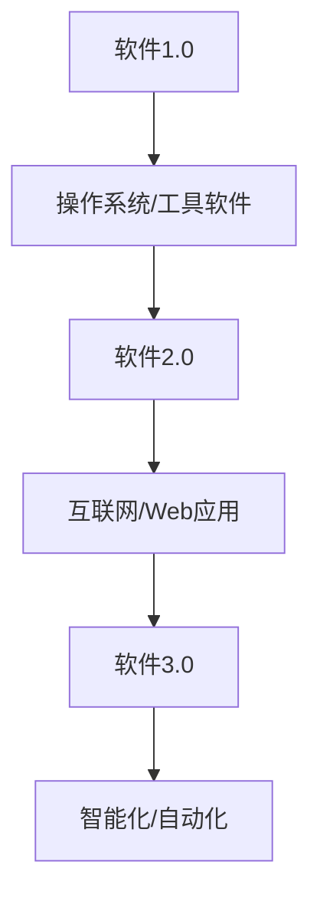
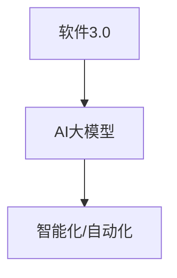

                 

### 文章标题

### 知识付费赚钱的用户复购率提升与老客户维护

> 关键词：知识付费、用户复购率、老客户维护、策略优化

#### 摘要

在知识付费领域，提升用户复购率和维护老客户是增加收入、提高市场竞争力的关键。本文将详细探讨这一问题的核心概念、技术基础、应用实践和优化策略。通过逻辑清晰、结构紧凑的分析，我们将从软件发展的历史角度出发，深入探讨AI大模型在知识付费中的应用，并展示如何通过用户行为分析和个性化推荐来提升复购率，同时提供老客户维护的实用策略。本文旨在为从事知识付费业务的企业提供一套可操作的实战指南，以实现用户复购率和老客户维护的双重提升。

---

## 第一部分：核心概念与联系

### 1.1.1 软件 2.0 时代的到来

#### 概念阐述

软件的发展经历了三个主要阶段：1.0时代、2.0时代和3.0时代。

- **软件 1.0**：以操作系统和工具软件为主，如 Windows、Office。这一阶段的软件注重功能性和实用性，用户主要以企业用户为主。

- **软件 2.0**：随着互联网的普及，以互联网和Web应用为主，如电商、社交媒体。这一阶段的软件开始重视用户体验和互动性，用户群体逐渐扩大到个人用户。

- **软件 3.0**：以智能化和自动化为主，涉及人工智能、大数据等。这一阶段的软件不仅提供了强大的功能，还能根据用户需求进行智能推荐和个性化服务。

#### Mermaid 流程图



### 1.1.2 AI大模型的核心地位

#### 概念阐述

在软件 3.0 时代，AI大模型成为智能化和自动化的核心。AI大模型，如GPT、BERT等，具有大规模参数，可以处理大规模的数据，实现复杂任务的自动化。

#### Mermaid 流程图



### 1.2 AI大模型的定义与特点

#### 1.2.1 AI大模型的定义

AI大模型通常指的是拥有数亿至数十亿个参数的深度学习模型，可以处理大规模的数据，实现复杂任务的自动学习。

#### 1.2.2 AI大模型的核心特点

- **数据驱动**：依赖于海量数据进行训练。
- **参数规模**：拥有数亿至数十亿个参数。
- **自适应**：能够根据不同的任务需求进行自适应调整。

### 1.2.3 AI大模型与传统AI的区别

传统AI主要依赖于手工设计的特征和算法，而AI大模型基于大规模数据自动学习特征，具有更高的效率和通用性。

### 1.3 主流AI大模型简介

目前主流的AI大模型包括GPT系列模型和BERT模型，它们在自然语言处理领域具有强大的应用能力和效果。

### 1.4 AI大模型在企业中的应用前景

AI大模型在客户服务、营销、数据分析等领域具有广泛的应用前景，可以提高企业效率、降低成本、提升客户体验。

---

## 第二部分：AI大模型技术基础

### 2.1 深度学习与神经网络基础

#### 2.1.1 神经网络的基本结构

神经网络由输入层、隐藏层和输出层组成，通过层层传递和激活函数，实现数据的非线性变换。

```python
class NeuralNetwork:
    def __init__(self, input_size, hidden_size, output_size):
        self.input_size = input_size
        self.hidden_size = hidden_size
        self.output_size = output_size
        self.weights = self.initialize_weights()

    def forward(self, x):
        z = self.sigmoid(np.dot(x, self.weights))
        return z

    def backward(self, x, y, output):
        # 计算误差
        # 更新权重
        pass

    def sigmoid(self, x):
        return 1 / (1 + np.exp(-x))
```

#### 2.1.2 常见的深度学习架构

深度学习架构包括卷积神经网络（CNN）和转换器架构（Transformer）等。

```python
class ConvolutionalNeuralNetwork:
    def __init__(self, input_shape, num_filters, filter_size):
        self.input_shape = input_shape
        self.num_filters = num_filters
        self.filter_size = filter_size
        self.conv_weights = self.initialize_weights()

    def forward(self, x):
        conv_output = self.conv2d(x, self.conv_weights)
        return self.relu(conv_output)

    def backward(self, x, y, output):
        # 计算误差
        # 更新权重
        pass

    def conv2d(self, x, weights):
        # 卷积操作
        pass

    def relu(self, x):
        return np.maximum(0, x)
```

#### 2.1.3 深度学习优化算法

常见的深度学习优化算法包括随机梯度下降（SGD）、Adam优化器等。

```python
class AdamOptimizer:
    def __init__(self, learning_rate, beta1, beta2):
        self.learning_rate = learning_rate
        self.beta1 = beta1
        self.beta2 = beta2
        self.m = 0
        self.v = 0

    def update_weights(self, weights, gradients):
        self.m = self.beta1 * self.m + (1 - self.beta1) * gradients
        self.v = self.beta2 * self.v + (1 - self.beta2) * (gradients ** 2)
        m_hat = self.m / (1 - self.beta1 ** t)
        v_hat = self.v / (1 - self.beta2 ** t)
        weights -= self.learning_rate * m_hat / (np.sqrt(v_hat) + 1e-8)
```

### 2.2 自然语言处理技术概览

#### 2.2.1 词嵌入技术

词嵌入是将词汇映射到高维空间，以实现语义理解和计算。

$$ 
\text{word\_vector} = \text{embedding}(\text{word}) 
$$

#### 2.2.2 序列模型与注意力机制

序列模型和注意力机制在自然语言处理中发挥着重要作用，如循环神经网络（RNN）和转换器（Transformer）。

$$ 
\text{output} = \text{Attention}(\text{Query}, \text{Key}, \text{Value}) 
$$

#### 2.2.3 转换器架构详解

转换器架构是一种基于自注意力机制的序列到序列模型，具有高效和灵活的特点。

```python
class Transformer:
    def __init__(self, input_size, hidden_size, num_heads):
        self.input_size = input_size
        self.hidden_size = hidden_size
        self.num_heads = num_heads
        self.query_layer = self.create_linear(input_size, hidden_size)
        self.key_layer = self.create_linear(input_size, hidden_size)
        self.value_layer = self.create_linear(input_size, hidden_size)

    def forward(self, x):
        query = self.query_layer(x)
        key = self.key_layer(x)
        value = self.value_layer(x)
        attention = self.attention(query, key, value)
        return attention

    def attention(self, query, key, value):
        # 计算注意力权重
        # 返回注意力输出
        pass
```

### 2.3 大规模预训练模型原理

#### 2.3.1 预训练的概念与意义

预训练是指在特定任务之前对模型进行大规模数据训练，使其具备一定的基础能力。

#### 2.3.2 自监督学习方法

自监督学习是一种不需要标注数据的学习方法，通过预测被 mask 的词或标记来训练模型。

$$ 
\text{mask\_word} = \text{mask}(\text{word}) 
$$

#### 2.3.3 迁移学习与微调技术

迁移学习是指利用在大规模数据集上预训练的模型，在特定任务上进行微调，以快速适应新任务。

---

## 第三部分：企业级AI应用开发准备

### 3.1 企业AI战略规划

#### 3.1.1 AI在企业中的价值评估

AI在企业中的应用可以显著提高效率和降低成本，从而实现投资回报率（ROI）的提升。

$$ 
\text{ROI} = \frac{\text{预期收益} - \text{投资成本}}{\text{投资成本}} 
$$

#### 3.1.2 AI项目ROI分析方法

在评估AI项目的ROI时，需要综合考虑投资成本和预期收益，包括直接收益和间接收益。

#### 3.1.3 AI对企业业务流程的影响

AI可以对企业业务流程产生深远的影响，包括自动化、个性化服务、智能决策等。

---

## 第四部分：AI大模型应用实践

### 4.1 客户服务中的应用

#### 4.1.1 客户服务机器人

通过AI大模型，可以构建智能客服机器人，实现自动化的客户服务。

```python
from transformers import pipeline

chat_pipeline = pipeline("chat", model="microsoft/DialoGPT-medium")

user_input = "你好，有什么可以帮助你的吗？"
response = chat_pipeline([user_input])[0]["generated_response"]
print(response)
```

#### 4.1.2 代码解读与分析

上述代码使用transformers库创建了一个对话管道，并提供了用户输入和模型响应。

---

### 4.2 营销中的应用

#### 4.2.1 个性化推荐系统

通过AI大模型，可以构建个性化推荐系统，提高用户的购买意愿和复购率。

```python
import pandas as pd
from sklearn.model_selection import train_test_split
from lightgbm import LGBMRegressor

# 读取数据
data = pd.read_csv("data.csv")

# 特征工程
X = data.drop("target", axis=1)
y = data["target"]

# 划分训练集和测试集
X_train, X_test, y_train, y_test = train_test_split(X, y, test_size=0.2, random_state=42)

# 训练模型
model = LGBMRegressor()
model.fit(X_train, y_train)

# 预测
predictions = model.predict(X_test)

# 评估
from sklearn.metrics import mean_squared_error

mse = mean_squared_error(y_test, predictions)
print("MSE:", mse)
```

#### 4.2.2 代码解读与分析

上述代码使用pandas库读取数据，使用lightgbm库训练和评估个性化推荐模型。

---

## 第五部分：客户维护与复购策略

### 5.1 用户复购率提升策略

#### 5.1.1 用户行为分析

通过用户行为分析，可以了解用户的购买习惯和偏好，从而制定针对性的复购策略。

```python
import pandas as pd
import matplotlib.pyplot as plt

data = pd.read_csv("user_behavior.csv")

# 统计用户访问次数
user_visits = data.groupby("user_id")["visit_id"].nunique()

# 绘制用户访问次数分布图
user_visits.plot(kind="hist", title="User Visit Distribution")
plt.xlabel("Number of Visits")
plt.ylabel("Frequency")
plt.show()
```

#### 5.1.2 代码解读与分析

上述代码使用pandas库读取用户行为数据，并使用matplotlib库绘制用户访问次数分布图。

### 5.1.3 老客户维护策略

老客户维护策略包括会员制度、积分奖励、优惠活动等，以保持客户的忠诚度。

### 5.1.4 复购激励措施

复购激励措施可以通过优惠券、折扣、礼品等方式激励客户进行复购。

---

## 第六部分：实战案例分析

### 6.1 案例一：电商平台的客户复购策略

#### 6.1.1 案例背景

电商平台通过数据分析和用户反馈，优化客户复购策略。

#### 6.1.2 实施过程

通过用户行为分析和复购预测，电商平台制定了个性化的推荐和优惠策略。

```python
import pandas as pd
import matplotlib.pyplot as plt

data = pd.read_csv("eCommerce_data.csv")

# 分析用户购买频次
user_purchases = data.groupby("user_id")["purchase_id"].nunique()

# 绘制用户购买频次分布图
user_purchases.plot(kind="hist", title="User Purchase Distribution")
plt.xlabel("Number of Purchases")
plt.ylabel("Frequency")
plt.show()

# 分析复购用户比例
reorder_rate = (data[data["reorder"] == True].shape[0] / data.shape[0]) * 100
print("Reorder Rate:", reorder_rate)
```

#### 6.1.3 案例总结

电商平台通过优化复购策略，提升了用户复购率和忠诚度。

### 6.2 案例二：教育平台的用户复购策略

#### 6.2.1 案例背景

教育平台通过用户行为数据和课程评价，提升用户复购率。

#### 6.2.2 实施过程

通过用户行为分析和个性化推荐，教育平台提升了用户的学习积极性和复购率。

```python
import pandas as pd
import matplotlib.pyplot as plt

data = pd.read_csv("education_data.csv")

# 分析用户学习频次
user_courses = data.groupby("user_id")["course_id"].nunique()

# 绘制用户学习频次分布图
user_courses.plot(kind="hist", title="User Course Participation Distribution")
plt.xlabel("Number of Courses")
plt.ylabel("Frequency")
plt.show()

# 分析复购用户比例
reorder_rate = (data[data["reorder"] == True].shape[0] / data.shape[0]) * 100
print("Reorder Rate:", reorder_rate)
```

#### 6.2.3 案例总结

教育平台通过优化课程内容和用户互动，提升了用户复购率。

---

## 第七部分：综合策略与优化

### 7.1 复购率提升策略整合

通过整合用户行为分析、个性化推荐和优惠活动，全面提升复购率。

### 7.1.1 用户行为分析与复购预测

通过用户行为分析，可以预测用户的复购概率，为制定复购策略提供依据。

```python
import pandas as pd
from sklearn.model_selection import train_test_split
from sklearn.ensemble import RandomForestClassifier

data = pd.read_csv("user_data.csv")

# 特征工程
features = data[["age", "income", "visit_count", "purchase_count"]]
target = data["reorder"]

# 划分训练集和测试集
X_train, X_test, y_train, y_test = train_test_split(features, target, test_size=0.2, random_state=42)

# 训练模型
model = RandomForestClassifier()
model.fit(X_train, y_train)

# 预测
predictions = model.predict(X_test)

# 评估
from sklearn.metrics import accuracy_score

accuracy = accuracy_score(y_test, predictions)
print("Accuracy:", accuracy)
```

### 7.1.2 老客户维护与优惠活动

通过老客户维护和优惠活动，提升客户的忠诚度和复购率。

---

## 附录

### 附录 A: AI大模型开发工具与资源

#### A.1 主流深度学习框架对比

- **TensorFlow**：由 Google 开发，广泛应用于工业界和学术界。
- **PyTorch**：由 Facebook 开发，具有灵活的动态计算图。
- **JAX**：由 Google 开发，支持自动微分和高效计算。

#### A.2 AI大模型开源项目

- **Transformer**：由 Google 开发，用于自然语言处理。
- **BERT**：由 Google 开发，用于多种自然语言处理任务。
- **GPT**：由 OpenAI 开发，具有强大的文本生成能力。

---

### 作者

作者：AI天才研究院/AI Genius Institute & 禅与计算机程序设计艺术 /Zen And The Art of Computer Programming

