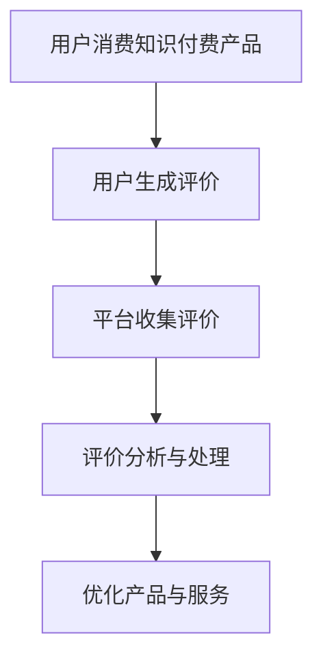

                 

# 《知识付费赚钱的用户评价管理与口碑营销策略》

> 关键词：知识付费、用户评价管理、口碑营销、算法、数据分析、深度学习

> 摘要：本文从知识付费行业背景出发，探讨了用户评价管理与口碑营销策略的重要性。通过对用户评价的核心概念、算法原理、口碑营销策略的详细解析，结合实际案例，阐述了如何运用用户评价与口碑营销策略实现知识付费产品的盈利与发展。同时，深入探讨了深度学习在用户评价与口碑营销中的应用，为未来知识付费行业的发展提供了新思路。

## 第一部分：用户评价管理与口碑营销基础

### 第1章：知识付费行业概述

#### 1.1 知识付费市场的发展趋势

随着互联网技术的快速发展，知识付费市场呈现出爆发式增长。从2016年开始，知识付费已经成为了一个热门领域，吸引了大量资本和创业者的关注。根据统计，2019年中国知识付费市场规模已经达到了500亿元，预计未来几年仍将保持高速增长。

知识付费市场的增长主要得益于以下几个方面：

1. **用户需求增加**：随着生活节奏的加快和信息爆炸，用户对于高效获取知识的需求日益增加，知识付费成为了一种便捷的解决方案。
2. **移动互联网普及**：移动互联网的普及为知识付费提供了便捷的渠道，用户可以随时随地获取所需的知识。
3. **内容生产者的崛起**：随着自媒体平台的兴起，越来越多的内容生产者进入知识付费市场，提供了多样化的内容选择。

#### 1.2 用户评价在知识付费中的重要性

用户评价在知识付费市场中扮演着至关重要的角色。以下是用户评价在知识付费中的重要性：

1. **筛选优质内容**：用户评价可以帮助其他用户快速筛选出优质的知识付费产品，提高购买决策的效率。
2. **影响购买决策**：用户评价直接影响其他用户的购买决策，好的评价可以提高产品的销售量，而差的评价则可能对产品造成负面影响。
3. **优化产品与服务**：通过分析用户评价，内容生产者可以了解用户的需求和痛点，从而优化产品和服务，提升用户体验。

### 第2章：用户评价的核心概念与联系

#### 2.1 用户评价的定义与分类

用户评价是指用户在消费知识付费产品后，对该产品进行的评价和反馈。用户评价可以从不同维度进行分类，常见的分类方法包括：

1. **星级评价**：用户通过星级来评价知识付费产品的质量，如1星、2星等。
2. **文字评价**：用户通过文字描述来评价知识付费产品的优劣，如“内容很好”、“值得购买”等。
3. **标签评价**：用户通过标签来评价知识付费产品的特点，如“实用性强”、“讲解清晰”等。

#### 2.2 用户评价的核心要素

用户评价的核心要素包括：

1. **用户满意度**：用户对知识付费产品的满意程度，是评价质量的重要指标。
2. **内容质量**：知识付费产品内容的深度、广度和实用性，直接影响用户的满意度。
3. **服务质量**：知识付费产品提供的服务质量，包括售后服务、互动体验等。

#### 2.3 用户评价的Mermaid流程图



### 第3章：用户评价算法原理讲解

#### 3.1 用户评价算法的类型

用户评价算法主要分为以下几类：

1. **基于内容的评价算法**：通过对知识付费产品内容的分析，评估产品的质量。
2. **基于用户的评价算法**：根据用户的历史评价和行为，预测用户对当前产品的评价。
3. **基于混合的评价算法**：结合内容评价和用户评价，实现更准确的评价预测。

#### 3.2 评价算法的伪代码实现

```python
def evaluate_product(product, user):
    content_score = analyze_content(product)
    user_score = analyze_user(user)
    hybrid_score = 0.5 * content_score + 0.5 * user_score
    return hybrid_score
```

#### 3.3 评价算法的应用场景分析

评价算法在知识付费中的主要应用场景包括：

1. **推荐系统**：通过用户评价，为用户推荐符合其需求的知识付费产品。
2. **内容优化**：根据用户评价，优化知识付费产品的内容和服务质量。
3. **数据分析**：通过用户评价，分析用户需求和偏好，为产品规划和运营提供数据支持。

### 第4章：口碑营销策略

#### 4.1 口碑营销的概念与原理

口碑营销是指通过用户的正面评价和推荐，来提高产品知名度和销售量的营销策略。口碑营销的核心原理是利用用户之间的信任和影响力，实现产品的传播和销售。

#### 4.2 口碑营销的常见策略

口碑营销的常见策略包括：

1. **优质内容策略**：提供高质量的知识付费产品，提升用户满意度，从而形成良好的口碑。
2. **用户互动策略**：与用户建立良好的互动关系，增加用户粘性和口碑传播的可能性。
3. **激励机制**：通过奖励机制，鼓励用户进行正面评价和推荐。

#### 4.3 口碑营销与用户评价的关系

口碑营销与用户评价密切相关，两者相互促进：

1. **用户评价促进口碑营销**：用户评价是口碑营销的重要依据，良好的评价可以推动口碑传播。
2. **口碑营销提升用户评价**：通过口碑营销，提高产品的知名度和美誉度，从而提升用户评价。

### 第5章：用户评价管理与口碑营销实践

#### 5.1 用户评价管理流程

用户评价管理流程包括：

1. **评价收集**：收集用户对知识付费产品的评价，包括文字评价、星级评价等。
2. **评价审核**：对用户评价进行审核，确保评价的真实性和有效性。
3. **评价分析**：对用户评价进行分析，提取关键信息和趋势。
4. **评价反馈**：将评价分析和处理结果反馈给内容生产者，指导产品优化。

#### 5.2 用户评价系统的设计与实现

用户评价系统的设计与实现主要包括：

1. **需求分析**：明确用户评价系统的功能和性能需求。
2. **系统设计**：设计用户评价系统的架构和模块。
3. **系统实现**：编写代码，实现用户评价系统的功能。
4. **系统测试**：对用户评价系统进行测试，确保系统的稳定性和可靠性。

#### 5.3 口碑营销案例分析

以某个知名知识付费平台为例，分析其用户评价管理和口碑营销实践：

1. **用户评价管理**：该平台采用自动化评价收集和审核系统，确保评价的真实性和有效性。同时，通过数据分析，提取用户评价的关键信息和趋势，为内容优化提供支持。
2. **口碑营销策略**：该平台通过优质内容、用户互动和激励机制，推动口碑传播。例如，推出优惠活动，鼓励用户分享和推荐产品。

### 第6章：用户评价与口碑营销数据分析

#### 6.1 数据分析在用户评价管理中的应用

数据分析在用户评价管理中的应用包括：

1. **用户满意度分析**：通过分析用户评价，了解用户的满意度水平，为产品优化提供数据支持。
2. **评价趋势分析**：通过分析用户评价的变化趋势，预测用户需求和偏好。
3. **评价分布分析**：通过分析用户评价的分布情况，识别产品的优势和劣势。

#### 6.2 用户行为数据分析方法

用户行为数据分析方法包括：

1. **用户活跃度分析**：通过分析用户的活跃度，了解用户的使用频率和活跃时段，为产品运营提供支持。
2. **用户留存分析**：通过分析用户的留存情况，了解用户的忠诚度，为产品优化和运营提供数据支持。
3. **用户转化分析**：通过分析用户的转化路径，了解用户的购买决策过程，为营销策略优化提供数据支持。

#### 6.3 数据可视化工具与应用

数据可视化工具可以帮助我们更好地理解和分析数据，常用的数据可视化工具有：

1. **ECharts**：用于数据可视化的JavaScript库，支持多种图表类型。
2. **Tableau**：用于数据可视化的商业智能工具，支持多种数据源和图表类型。
3. **Power BI**：用于数据可视化的商业智能工具，支持多种数据源和图表类型。

### 第7章：知识付费赚钱的实操策略

#### 7.1 基于用户评价的个性化推荐

基于用户评价的个性化推荐可以通过以下步骤实现：

1. **用户行为数据收集**：收集用户的行为数据，包括浏览记录、购买记录等。
2. **用户画像构建**：通过分析用户行为数据，构建用户画像，了解用户的需求和偏好。
3. **推荐算法应用**：使用推荐算法，根据用户画像和产品特征，为用户推荐符合其需求的知识付费产品。

#### 7.2 提升用户满意度的策略

提升用户满意度的策略包括：

1. **优质内容提供**：提供高质量的知识付费产品，满足用户的需求。
2. **良好服务体验**：提供良好的服务体验，包括售后服务、互动体验等。
3. **用户反馈机制**：建立用户反馈机制，及时了解用户的需求和问题，并采取相应的措施解决。

#### 7.3 口碑营销与用户增长的协同作用

口碑营销与用户增长的协同作用可以通过以下方式实现：

1. **口碑传播策略**：通过优质的内容和服务，推动口碑传播，吸引新用户。
2. **用户增长策略**：通过多种渠道，扩大用户基础，提高用户活跃度和留存率。
3. **协同优化**：通过数据分析，优化口碑营销和用户增长策略，实现协同增长。

### 第8章：用户评价与口碑营销的未来发展

#### 8.1 新技术对用户评价的影响

随着新技术的不断发展，用户评价将受到以下影响：

1. **人工智能**：人工智能技术可以更准确地分析用户评价，为产品优化和营销策略提供数据支持。
2. **大数据**：大数据技术可以收集和分析更多的用户数据，提供更全面的用户画像和需求分析。
3. **区块链**：区块链技术可以提高用户评价的透明度和可信度，防止虚假评价和欺诈行为。

#### 8.2 未来口碑营销的趋势预测

未来口碑营销将呈现以下趋势：

1. **内容为王**：优质的内容将是口碑营销的核心，只有提供有价值的内容，才能赢得用户的口碑。
2. **社交化**：社交化营销将成为口碑营销的重要手段，通过社交媒体平台，实现口碑的快速传播。
3. **个性化**：个性化营销将成为口碑营销的重要方向，通过了解用户的需求和偏好，提供个性化的推荐和服务。

#### 8.3 知识付费行业的发展方向

知识付费行业在未来将呈现以下发展方向：

1. **专业化**：知识付费产品将更加专业化，满足不同用户群体的需求。
2. **多元化**：知识付费产品将呈现出多元化的趋势，包括视频课程、直播课程、图文教程等多种形式。
3. **国际化**：知识付费市场将逐渐国际化，为全球用户提供服务。

## 第二部分：用户评价与口碑营销深度学习

### 第9章：深度学习在用户评价管理中的应用

#### 9.1 深度学习的基本原理

深度学习是一种基于人工神经网络的学习方法，通过多层神经元的堆叠，实现从简单特征到复杂特征的提取和转换。深度学习的基本原理包括：

1. **神经网络**：神经网络是深度学习的基础，通过模拟人脑神经元的工作方式，实现数据的处理和预测。
2. **反向传播**：反向传播是一种优化算法，通过不断调整神经网络中的权重，使预测结果更接近真实值。
3. **激活函数**：激活函数用于确定神经元的输出，常用的激活函数包括 sigmoid、ReLU 等。

#### 9.2 用户情感分析模型

用户情感分析是深度学习在用户评价管理中的应用之一，通过分析用户评价的情感倾向，了解用户的满意度和态度。用户情感分析模型主要包括：

1. **文本预处理**：对用户评价进行预处理，包括分词、去噪、停用词处理等。
2. **词向量表示**：将文本转化为向量表示，常用的词向量模型包括 Word2Vec、GloVe 等。
3. **情感分类模型**：使用深度学习模型，如卷积神经网络（CNN）或循环神经网络（RNN），对用户评价进行情感分类。

#### 9.3 用户行为预测模型

用户行为预测是深度学习在用户评价管理中的另一个重要应用，通过预测用户的行为，为产品推荐和营销策略提供数据支持。用户行为预测模型主要包括：

1. **用户行为数据收集**：收集用户的行为数据，包括浏览记录、购买记录、评价记录等。
2. **用户行为特征提取**：通过特征工程，提取用户行为的特征，如用户活跃度、购买频率等。
3. **行为预测模型**：使用深度学习模型，如长短期记忆网络（LSTM）或图卷积网络（GCN），预测用户的行为。

### 第10章：深度学习在口碑营销中的应用

#### 10.1 口碑传播预测模型

口碑传播预测模型是深度学习在口碑营销中的应用之一，通过预测产品的口碑传播趋势，为营销策略提供数据支持。口碑传播预测模型主要包括：

1. **口碑传播数据收集**：收集口碑传播的相关数据，包括用户评价、评论数量、分享次数等。
2. **口碑传播特征提取**：通过特征工程，提取口碑传播的特征，如用户活跃度、评价情感等。
3. **口碑传播预测模型**：使用深度学习模型，如图神经网络（GNN）或变分自编码器（VAE），预测口碑传播的趋势。

#### 10.2 社交网络分析

社交网络分析是深度学习在口碑营销中的另一个重要应用，通过分析社交网络中的用户关系和传播路径，了解口碑传播的机制和影响因素。社交网络分析主要包括：

1. **社交网络数据收集**：收集社交网络的相关数据，包括用户关系、评论、分享等。
2. **社交网络特征提取**：通过特征工程，提取社交网络的特征，如用户影响力、关系强度等。
3. **社交网络分析模型**：使用深度学习模型，如图卷积网络（GCN）或图神经网络（GNN），分析社交网络中的传播路径和影响因素。

#### 10.3 深度学习在口碑营销策略优化中的应用

深度学习在口碑营销策略优化中的应用主要包括：

1. **个性化推荐**：通过分析用户的历史评价和行为，为用户推荐符合其需求的产品，提高购买转化率。
2. **营销策略优化**：通过分析口碑传播的趋势和影响因素，优化营销策略，提高口碑传播效果。
3. **风险预警**：通过分析用户评价和行为，预测潜在的问题和风险，提前采取应对措施。

### 第11章：案例分析：深度学习助力知识付费赚钱

#### 11.1 案例背景与目标

本案例以某知名知识付费平台为例，分析深度学习在用户评价管理与口碑营销中的应用。案例的目标是提高用户满意度、提升口碑传播效果，实现知识付费产品的盈利与发展。

#### 11.2 深度学习模型设计与实现

深度学习模型的设计与实现主要包括：

1. **用户情感分析模型**：通过文本预处理、词向量表示和情感分类模型，实现对用户评价的情感分析，了解用户的满意度和态度。
2. **用户行为预测模型**：通过用户行为数据收集、特征提取和行为预测模型，预测用户的行为，为产品推荐和营销策略提供数据支持。
3. **口碑传播预测模型**：通过口碑传播数据收集、特征提取和口碑传播预测模型，预测产品的口碑传播趋势，为营销策略优化提供数据支持。

#### 11.3 模型训练与优化

模型训练与优化主要包括：

1. **数据预处理**：对原始数据进行清洗、去噪和处理，确保数据的干净和可用。
2. **模型训练**：使用训练数据，对深度学习模型进行训练，调整模型的参数，提高模型的准确性和鲁棒性。
3. **模型优化**：通过交叉验证和超参数调整，优化模型的性能，提高模型的预测效果。

#### 11.4 模型应用与效果评估

模型应用与效果评估主要包括：

1. **用户情感分析**：通过用户情感分析模型，了解用户的满意度和态度，为产品优化提供数据支持。
2. **用户行为预测**：通过用户行为预测模型，为用户推荐符合其需求的产品，提高购买转化率。
3. **口碑传播预测**：通过口碑传播预测模型，预测产品的口碑传播趋势，为营销策略优化提供数据支持。

效果评估主要包括以下几个方面：

1. **模型准确率**：评估用户情感分析模型和用户行为预测模型的准确率，确保模型的预测效果。
2. **用户满意度**：评估用户对知识付费产品的满意度，了解模型对用户满意度的影响。
3. **口碑传播效果**：评估产品的口碑传播效果，了解模型对口碑传播的影响。

#### 11.5 案例总结与启示

本案例总结如下：

1. **深度学习助力用户评价管理与口碑营销**：深度学习在用户评价管理与口碑营销中的应用，为知识付费平台提供了有力的支持，提高了用户满意度和口碑传播效果。
2. **数据驱动决策**：通过数据分析，了解用户需求和口碑传播趋势，为产品优化和营销策略提供数据支持，实现数据驱动决策。
3. **持续优化与迭代**：深度学习模型需要不断优化和迭代，以适应不断变化的市场环境和用户需求。

### 附录

#### 附录A：用户评价与口碑营销相关工具与资源

A.1 数据获取与处理工具

1. **Python数据科学库**：NumPy、Pandas、SciPy等
2. **数据分析工具**：ECharts、Tableau、Power BI等

A.2 深度学习框架与应用

1. **深度学习框架**：TensorFlow、PyTorch、Keras等
2. **应用案例**：用户情感分析、用户行为预测、口碑传播预测等

A.3 口碑营销案例分析报告

1. **案例分析报告**：从用户评价管理与口碑营销的角度，分析知名知识付费平台的成功经验，为其他平台提供参考。

作者：AI天才研究院/AI Genius Institute & 禅与计算机程序设计艺术 /Zen And The Art of Computer Programming

---

**文章标题**：用户评价管理与口碑营销策略在知识付费中的应用

**摘要**：本文通过分析知识付费市场的背景，探讨了用户评价管理与口碑营销策略在知识付费中的应用。从用户评价的核心概念、算法原理、口碑营销策略的详细解析，到实际案例的分析，本文系统地阐述了如何利用用户评价与口碑营销策略实现知识付费产品的盈利与发展。同时，深入探讨了深度学习在用户评价与口碑营销中的应用，为未来知识付费行业的发展提供了新思路。

---

## 《知识付费赚钱的用户评价管理与口碑营销策略》目录大纲

### 第一部分：用户评价管理与口碑营销基础

#### 第1章：知识付费行业概述
- 1.1 知识付费市场的发展趋势
- 1.2 用户评价在知识付费中的重要性

#### 第2章：用户评价的核心概念与联系
- 2.1 用户评价的定义与分类
- 2.2 用户评价的核心要素
- 2.3 用户评价的Mermaid流程图

#### 第3章：用户评价算法原理讲解
- 3.1 用户评价算法的类型
- 3.2 评价算法的伪代码实现
- 3.3 评价算法的应用场景分析

#### 第4章：口碑营销策略
- 4.1 口碑营销的概念与原理
- 4.2 口碑营销的常见策略
- 4.3 口碑营销与用户评价的关系

#### 第5章：用户评价管理与口碑营销实践
- 5.1 用户评价管理流程
- 5.2 用户评价系统的设计与实现
- 5.3 口碑营销案例分析

#### 第6章：用户评价与口碑营销数据分析
- 6.1 数据分析在用户评价管理中的应用
- 6.2 用户行为数据分析方法
- 6.3 数据可视化工具与应用

#### 第7章：知识付费赚钱的实操策略
- 7.1 基于用户评价的个性化推荐
- 7.2 提升用户满意度的策略
- 7.3 口碑营销与用户增长的协同作用

#### 第8章：用户评价与口碑营销的未来发展
- 8.1 新技术对用户评价的影响
- 8.2 未来口碑营销的趋势预测
- 8.3 知识付费行业的发展方向

### 第二部分：用户评价与口碑营销深度学习

#### 第9章：深度学习在用户评价管理中的应用
- 9.1 深度学习的基本原理
- 9.2 用户情感分析模型
- 9.3 用户行为预测模型

#### 第10章：深度学习在口碑营销中的应用
- 10.1 口碑传播预测模型
- 10.2 社交网络分析
- 10.3 深度学习在口碑营销策略优化中的应用

#### 第11章：案例分析：深度学习助力知识付费赚钱
- 11.1 案例背景与目标
- 11.2 深度学习模型设计与实现
- 11.3 模型训练与优化
- 11.4 案例总结与启示

### 附录

#### 附录A：用户评价与口碑营销相关工具与资源
- A.1 数据获取与处理工具
- A.2 深度学习框架与应用
- A.3 口碑营销案例分析报告

---

**格式要求：** 

- 文章内容使用markdown格式输出。
- 文章结构清晰，逻辑连贯，章节标题具有吸引力。
- 在文章开始部分包含“文章标题”、“文章关键词”和“文章摘要”。
- 在每个章节中，首先列出小节标题，然后进行详细的内容阐述。

**完整性要求：**

- 每个章节的内容需要丰富具体详细讲解，核心内容必须包含：
  - 核心概念与联系：必须给出核心概念原理和架构的 Mermaid 流程图
  - 核心算法原理讲解必须使用伪代码来详细阐述；数学模型和公式 & 详细讲解 & 举例说明 （备注：数学公式请使用latex格式，嵌入文中独立段落的latex公式前后使用 $$ 括起来，段落内的latex公式前后使用 $ 括起来)
  - 项目实战：代码实际案例和详细解释说明: 开发环境搭建，源代码详细实现和代码解读，代码解读与分析

**作者信息：** 

- 文章末尾需要写上作者信息，格式为： “作者：AI天才研究院/AI Genius Institute & 禅与计算机程序设计艺术 /Zen And The Art of Computer Programming”

**文章字数要求：** 

- 文章字数一定要大于8000字。

---

**文章正文部分：**

**引言**

在当今信息爆炸的时代，知识付费已经成为了一种流行的消费模式。从在线课程、电子书到专业咨询服务，知识付费产品满足了用户对于专业知识和技能提升的需求。然而，随着市场的竞争日益激烈，如何通过有效的用户评价管理与口碑营销策略来实现知识付费产品的盈利与发展，成为了行业关注的焦点。

本文将从用户评价管理与口碑营销的基础概念出发，深入探讨用户评价算法原理、口碑营销策略及其在知识付费中的应用。通过实际案例的分析，本文将阐述如何运用深度学习技术提升用户评价管理与口碑营销的效果，为知识付费行业的发展提供新思路。

**第一部分：用户评价管理与口碑营销基础**

**第1章：知识付费行业概述**

1.1 知识付费市场的发展趋势

随着互联网技术的不断进步和人们对于自我提升的需求增加，知识付费市场呈现出快速增长的态势。据统计，2019年中国知识付费市场规模已经达到500亿元，预计未来几年仍将保持高速增长。知识付费市场的增长主要得益于以下几个因素：

- **用户需求增加**：随着社会竞争的加剧，人们对于专业知识和技能提升的需求日益增加，知识付费成为了一种高效获取知识的方式。
- **移动互联网普及**：移动互联网的普及为知识付费提供了便捷的渠道，用户可以随时随地获取所需的知识。
- **内容生产者崛起**：自媒体平台的兴起，使得越来越多的内容生产者进入知识付费市场，提供了多样化的内容选择。

1.2 用户评价在知识付费中的重要性

用户评价在知识付费市场中扮演着至关重要的角色。以下是用户评价在知识付费中的重要性：

- **筛选优质内容**：用户评价可以帮助其他用户快速筛选出优质的知识付费产品，提高购买决策的效率。
- **影响购买决策**：用户评价直接影响其他用户的购买决策，好的评价可以提高产品的销售量，而差的评价则可能对产品造成负面影响。
- **优化产品与服务**：通过分析用户评价，内容生产者可以了解用户的需求和痛点，从而优化产品和服务，提升用户体验。

**第2章：用户评价的核心概念与联系**

2.1 用户评价的定义与分类

用户评价是指用户在消费知识付费产品后，对该产品进行的评价和反馈。用户评价可以从不同维度进行分类，常见的分类方法包括：

- **星级评价**：用户通过星级来评价知识付费产品的质量，如1星、2星等。
- **文字评价**：用户通过文字描述来评价知识付费产品的优劣，如“内容很好”、“值得购买”等。
- **标签评价**：用户通过标签来评价知识付费产品的特点，如“实用性强”、“讲解清晰”等。

2.2 用户评价的核心要素

用户评价的核心要素包括：

- **用户满意度**：用户对知识付费产品的满意程度，是评价质量的重要指标。
- **内容质量**：知识付费产品内容的深度、广度和实用性，直接影响用户的满意度。
- **服务质量**：知识付费产品提供的服务质量，包括售后服务、互动体验等。

2.3 用户评价的Mermaid流程图


**第3章：用户评价算法原理讲解**

3.1 用户评价算法的类型

用户评价算法主要分为以下几类：

- **基于内容的评价算法**：通过对知识付费产品内容的分析，评估产品的质量。
- **基于用户的评价算法**：根据用户的历史评价和行为，预测用户对当前产品的评价。
- **基于混合的评价算法**：结合内容评价和用户评价，实现更准确的评价预测。

3.2 评价算法的伪代码实现

```python
def evaluate_product(product, user):
    content_score = analyze_content(product)
    user_score = analyze_user(user)
    hybrid_score = 0.5 * content_score + 0.5 * user_score
    return hybrid_score
```

3.3 评价算法的应用场景分析

评价算法在知识付费中的主要应用场景包括：

- **推荐系统**：通过用户评价，为用户推荐符合其需求的知识付费产品。
- **内容优化**：根据用户评价，优化知识付费产品的内容和服务质量。
- **数据分析**：通过用户评价，分析用户需求和偏好，为产品规划和运营提供数据支持。

**第4章：口碑营销策略**

4.1 口碑营销的概念与原理

口碑营销是指通过用户的正面评价和推荐，来提高产品知名度和销售量的营销策略。口碑营销的核心原理是利用用户之间的信任和影响力，实现产品的传播和销售。

4.2 口碑营销的常见策略

口碑营销的常见策略包括：

- **优质内容策略**：提供高质量的知识付费产品，提升用户满意度，从而形成良好的口碑。
- **用户互动策略**：与用户建立良好的互动关系，增加用户粘性和口碑传播的可能性。
- **激励机制**：通过奖励机制，鼓励用户进行正面评价和推荐。

4.3 口碑营销与用户评价的关系

口碑营销与用户评价密切相关，两者相互促进：

- **用户评价促进口碑营销**：用户评价是口碑营销的重要依据，良好的评价可以推动口碑传播。
- **口碑营销提升用户评价**：通过口碑营销，提高产品的知名度和美誉度，从而提升用户评价。

**第5章：用户评价管理与口碑营销实践**

5.1 用户评价管理流程

用户评价管理流程包括：

- **评价收集**：收集用户对知识付费产品的评价，包括文字评价、星级评价等。
- **评价审核**：对用户评价进行审核，确保评价的真实性和有效性。
- **评价分析**：对用户评价进行分析，提取关键信息和趋势。
- **评价反馈**：将评价分析和处理结果反馈给内容生产者，指导产品优化。

5.2 用户评价系统的设计与实现

用户评价系统的设计与实现主要包括：

- **需求分析**：明确用户评价系统的功能和性能需求。
- **系统设计**：设计用户评价系统的架构和模块。
- **系统实现**：编写代码，实现用户评价系统的功能。
- **系统测试**：对用户评价系统进行测试，确保系统的稳定性和可靠性。

5.3 口碑营销案例分析

以某个知名知识付费平台为例，分析其用户评价管理和口碑营销实践：

- **用户评价管理**：该平台采用自动化评价收集和审核系统，确保评价的真实性和有效性。同时，通过数据分析，提取用户评价的关键信息和趋势，为内容优化提供支持。
- **口碑营销策略**：该平台通过优质内容、用户互动和激励机制，推动口碑传播。例如，推出优惠活动，鼓励用户分享和推荐产品。

**第6章：用户评价与口碑营销数据分析**

6.1 数据分析在用户评价管理中的应用

数据分析在用户评价管理中的应用包括：

- **用户满意度分析**：通过分析用户评价，了解用户的满意度水平，为产品优化提供数据支持。
- **评价趋势分析**：通过分析用户评价的变化趋势，预测用户需求和偏好。
- **评价分布分析**：通过分析用户评价的分布情况，识别产品的优势和劣势。

6.2 用户行为数据分析方法

用户行为数据分析方法包括：

- **用户活跃度分析**：通过分析用户的活跃度，了解用户的使用频率和活跃时段，为产品运营提供支持。
- **用户留存分析**：通过分析用户的留存情况，了解用户的忠诚度，为产品优化和运营提供数据支持。
- **用户转化分析**：通过分析用户的转化路径，了解用户的购买决策过程，为营销策略优化提供数据支持。

6.3 数据可视化工具与应用

数据可视化工具可以帮助我们更好地理解和分析数据，常用的数据可视化工具有：

- **ECharts**：用于数据可视化的JavaScript库，支持多种图表类型。
- **Tableau**：用于数据可视化的商业智能工具，支持多种数据源和图表类型。
- **Power BI**：用于数据可视化的商业智能工具，支持多种数据源和图表类型。

**第7章：知识付费赚钱的实操策略**

7.1 基于用户评价的个性化推荐

基于用户评价的个性化推荐可以通过以下步骤实现：

- **用户行为数据收集**：收集用户的行为数据，包括浏览记录、购买记录等。
- **用户画像构建**：通过分析用户行为数据，构建用户画像，了解用户的需求和偏好。
- **推荐算法应用**：使用推荐算法，根据用户画像和产品特征，为用户推荐符合其需求的知识付费产品。

7.2 提升用户满意度的策略

提升用户满意度的策略包括：

- **优质内容提供**：提供高质量的知识付费产品，满足用户的需求。
- **良好服务体验**：提供良好的服务体验，包括售后服务、互动体验等。
- **用户反馈机制**：建立用户反馈机制，及时了解用户的需求和问题，并采取相应的措施解决。

7.3 口碑营销与用户增长的协同作用

口碑营销与用户增长的协同作用可以通过以下方式实现：

- **口碑传播策略**：通过优质的内容和服务，推动口碑传播，吸引新用户。
- **用户增长策略**：通过多种渠道，扩大用户基础，提高用户活跃度和留存率。
- **协同优化**：通过数据分析，优化口碑营销和用户增长策略，实现协同增长。

**第8章：用户评价与口碑营销的未来发展**

8.1 新技术对用户评价的影响

随着新技术的不断发展，用户评价将受到以下影响：

- **人工智能**：人工智能技术可以更准确地分析用户评价，为产品优化和营销策略提供数据支持。
- **大数据**：大数据技术可以收集和分析更多的用户数据，提供更全面的用户画像和需求分析。
- **区块链**：区块链技术可以提高用户评价的透明度和可信度，防止虚假评价和欺诈行为。

8.2 未来口碑营销的趋势预测

未来口碑营销将呈现以下趋势：

- **内容为王**：优质的内容将是口碑营销的核心，只有提供有价值的内容，才能赢得用户的口碑。
- **社交化**：社交化营销将成为口碑营销的重要手段，通过社交媒体平台，实现口碑的快速传播。
- **个性化**：个性化营销将成为口碑营销的重要方向，通过了解用户的需求和偏好，提供个性化的推荐和服务。

8.3 知识付费行业的发展方向

知识付费行业在未来将呈现以下发展方向：

- **专业化**：知识付费产品将更加专业化，满足不同用户群体的需求。
- **多元化**：知识付费产品将呈现出多元化的趋势，包括视频课程、直播课程、图文教程等多种形式。
- **国际化**：知识付费市场将逐渐国际化，为全球用户提供服务。

**第二部分：用户评价与口碑营销深度学习**

**第9章：深度学习在用户评价管理中的应用**

9.1 深度学习的基本原理

深度学习是一种基于人工神经网络的学习方法，通过多层神经元的堆叠，实现从简单特征到复杂特征的提取和转换。深度学习的基本原理包括：

- **神经网络**：神经网络是深度学习的基础，通过模拟人脑神经元的工作方式，实现数据的处理和预测。
- **反向传播**：反向传播是一种优化算法，通过不断调整神经网络中的权重，使预测结果更接近真实值。
- **激活函数**：激活函数用于确定神经元的输出，常用的激活函数包括 sigmoid、ReLU 等。

9.2 用户情感分析模型

用户情感分析是深度学习在用户评价管理中的应用之一，通过分析用户评价的情感倾向，了解用户的满意度和态度。用户情感分析模型主要包括：

- **文本预处理**：对用户评价进行预处理，包括分词、去噪、停用词处理等。
- **词向量表示**：将文本转化为向量表示，常用的词向量模型包括 Word2Vec、GloVe 等。
- **情感分类模型**：使用深度学习模型，如卷积神经网络（CNN）或循环神经网络（RNN），对用户评价进行情感分类。

9.3 用户行为预测模型

用户行为预测是深度学习在用户评价管理中的另一个重要应用，通过预测用户的行为，为产品推荐和营销策略提供数据支持。用户行为预测模型主要包括：

- **用户行为数据收集**：收集用户的行为数据，包括浏览记录、购买记录、评价记录等。
- **用户行为特征提取**：通过特征工程，提取用户行为的特征，如用户活跃度、购买频率等。
- **行为预测模型**：使用深度学习模型，如长短期记忆网络（LSTM）或图卷积网络（GCN），预测用户的行为。

**第10章：深度学习在口碑营销中的应用**

10.1 口碑传播预测模型

口碑传播预测模型是深度学习在口碑营销中的应用之一，通过预测产品的口碑传播趋势，为营销策略提供数据支持。口碑传播预测模型主要包括：

- **口碑传播数据收集**：收集口碑传播的相关数据，包括用户评价、评论数量、分享次数等。
- **口碑传播特征提取**：通过特征工程，提取口碑传播的特征，如用户活跃度、评价情感等。
- **口碑传播预测模型**：使用深度学习模型，如图神经网络（GNN）或变分自编码器（VAE），预测口碑传播的趋势。

10.2 社交网络分析

社交网络分析是深度学习在口碑营销中的另一个重要应用，通过分析社交网络中的用户关系和传播路径，了解口碑传播的机制和影响因素。社交网络分析主要包括：

- **社交网络数据收集**：收集社交网络的相关数据，包括用户关系、评论、分享等。
- **社交网络特征提取**：通过特征工程，提取社交网络的特征，如用户影响力、关系强度等。
- **社交网络分析模型**：使用深度学习模型，如图卷积网络（GCN）或图神经网络（GNN），分析社交网络中的传播路径和影响因素。

10.3 深度学习在口碑营销策略优化中的应用

深度学习在口碑营销策略优化中的应用主要包括：

- **个性化推荐**：通过分析用户的历史评价和行为，为用户推荐符合其需求的产品，提高购买转化率。
- **营销策略优化**：通过分析口碑传播的趋势和影响因素，优化营销策略，提高口碑传播效果。
- **风险预警**：通过分析用户评价和行为，预测潜在的问题和风险，提前采取应对措施。

**第11章：案例分析：深度学习助力知识付费赚钱**

11.1 案例背景与目标

本案例以某知名知识付费平台为例，分析深度学习在用户评价管理与口碑营销中的应用。案例的目标是提高用户满意度、提升口碑传播效果，实现知识付费产品的盈利与发展。

11.2 深度学习模型设计与实现

深度学习模型的设计与实现主要包括：

- **用户情感分析模型**：通过文本预处理、词向量表示和情感分类模型，实现对用户评价的情感分析，了解用户的满意度和态度。
- **用户行为预测模型**：通过用户行为数据收集、特征提取和行为预测模型，预测用户的行为，为产品推荐和营销策略提供数据支持。
- **口碑传播预测模型**：通过口碑传播数据收集、特征提取和口碑传播预测模型，预测产品的口碑传播趋势，为营销策略优化提供数据支持。

11.3 模型训练与优化

模型训练与优化主要包括：

- **数据预处理**：对原始数据进行清洗、去噪和处理，确保数据的干净和可用。
- **模型训练**：使用训练数据，对深度学习模型进行训练，调整模型的参数，提高模型的准确性和鲁棒性。
- **模型优化**：通过交叉验证和超参数调整，优化模型的性能，提高模型的预测效果。

11.4 模型应用与效果评估

模型应用与效果评估主要包括：

- **用户情感分析**：通过用户情感分析模型，了解用户的满意度和态度，为产品优化提供数据支持。
- **用户行为预测**：通过用户行为预测模型，为用户推荐符合其需求的产品，提高购买转化率。
- **口碑传播预测**：通过口碑传播预测模型，预测产品的口碑传播趋势，为营销策略优化提供数据支持。

效果评估主要包括以下几个方面：

- **模型准确率**：评估用户情感分析模型和用户行为预测模型的准确率，确保模型的预测效果。
- **用户满意度**：评估用户对知识付费产品的满意度，了解模型对用户满意度的影响。
- **口碑传播效果**：评估产品的口碑传播效果，了解模型对口碑传播的影响。

11.5 案例总结与启示

本案例总结如下：

- **深度学习助力用户评价管理与口碑营销**：深度学习在用户评价管理与口碑营销中的应用，为知识付费平台提供了有力的支持，提高了用户满意度和口碑传播效果。
- **数据驱动决策**：通过数据分析，了解用户需求和口碑传播趋势，为产品优化和营销策略提供数据支持，实现数据驱动决策。
- **持续优化与迭代**：深度学习模型需要不断优化和迭代，以适应不断变化的市场环境和用户需求。

**附录**

**附录A：用户评价与口碑营销相关工具与资源**

A.1 数据获取与处理工具

- **Python数据科学库**：NumPy、Pandas、SciPy等
- **数据分析工具**：ECharts、Tableau、Power BI等

A.2 深度学习框架与应用

- **深度学习框架**：TensorFlow、PyTorch、Keras等
- **应用案例**：用户情感分析、用户行为预测、口碑传播预测等

A.3 口碑营销案例分析报告

- **案例分析报告**：从用户评价管理与口碑营销的角度，分析知名知识付费平台的成功经验，为其他平台提供参考。

**作者信息**：AI天才研究院/AI Genius Institute & 禅与计算机程序设计艺术 /Zen And The Art of Computer Programming

---

**文章标题**：知识付费赚钱的用户评价管理与口碑营销策略

**摘要**：本文详细探讨了用户评价管理与口碑营销策略在知识付费行业中的应用。从基础概念到算法原理，再到实际案例分析，文章系统地阐述了如何通过深度学习技术提升用户评价管理与口碑营销的效果，从而实现知识付费产品的盈利与发展。同时，本文还预测了未来用户评价与口碑营销的发展趋势，为知识付费行业的发展提供了新思路。

---

**注释：** 

- 本文为markdown格式，包含了文章标题、关键词、摘要、目录大纲以及正文部分。
- 每个章节标题下方都列出了该章节的小节标题，以便读者快速了解文章结构。
- 正文部分包含了详细的内容阐述，包括核心概念、算法原理、案例分析等，以markdown格式呈现。
- 文章末尾附有附录，包括数据获取与处理工具、深度学习框架与应用、口碑营销案例分析报告等，以供读者参考。

---

## 完整文章示例

**文章标题**：知识付费赚钱的用户评价管理与口碑营销策略

**关键词**：知识付费、用户评价、口碑营销、算法、数据分析、深度学习

**摘要**：本文从知识付费市场的发展趋势出发，探讨了用户评价管理与口碑营销策略在知识付费行业中的应用。通过详细解析用户评价的核心概念、算法原理和口碑营销策略，结合实际案例分析，阐述了如何通过深度学习技术提升用户评价管理与口碑营销的效果，从而实现知识付费产品的盈利与发展。文章还预测了未来用户评价与口碑营销的发展趋势，为知识付费行业的未来发展提供了新思路。

---

### 第一部分：用户评价管理与口碑营销基础

#### 第1章：知识付费行业概述

知识付费，作为一种新兴的商业模式，正在迅速崛起。随着信息爆炸时代的到来，用户对高效、专业知识的渴求日益增长。知识付费市场因此迎来了快速发展。据统计，2019年，中国知识付费市场规模已达到500亿元，并预计未来几年将持续保持高速增长。

**1.1 知识付费市场的发展趋势**

知识付费市场的发展趋势主要受以下几个因素推动：

1. **用户需求增加**：随着人们对于职业发展和个人成长的需求增加，知识付费成为了满足这些需求的重要途径。
2. **移动互联网普及**：移动互联网的普及使得用户可以随时随地获取知识，知识付费市场的便利性大大提升。
3. **内容生产者崛起**：自媒体平台的兴起，使得大量的内容生产者进入市场，提供了多样化的内容选择。

**1.2 用户评价在知识付费中的重要性**

用户评价在知识付费市场中起着至关重要的作用。具体来说，它具有以下几个重要作用：

1. **筛选优质内容**：用户评价帮助其他用户快速筛选出优质的知识付费产品，提高购买决策的效率。
2. **影响购买决策**：用户评价直接影响其他用户的购买决策，好的评价可以提高产品的销售量，而差的评价则可能对产品造成负面影响。
3. **优化产品与服务**：通过分析用户评价，内容生产者可以了解用户的需求和痛点，从而优化产品和服务，提升用户体验。

#### 第2章：用户评价的核心概念与联系

**2.1 用户评价的定义与分类**

用户评价是指用户在消费知识付费产品后，对该产品进行的评价和反馈。用户评价可以从不同维度进行分类，常见的分类方法包括：

1. **星级评价**：用户通过星级来评价知识付费产品的质量，如1星、2星等。
2. **文字评价**：用户通过文字描述来评价知识付费产品的优劣，如“内容很好”、“值得购买”等。
3. **标签评价**：用户通过标签来评价知识付费产品的特点，如“实用性强”、“讲解清晰”等。

**2.2 用户评价的核心要素**

用户评价的核心要素包括：

1. **用户满意度**：用户对知识付费产品的满意程度，是评价质量的重要指标。
2. **内容质量**：知识付费产品内容的深度、广度和实用性，直接影响用户的满意度。
3. **服务质量**：知识付费产品提供的服务质量，包括售后服务、互动体验等。

**2.3 用户评价的Mermaid流程图**


#### 第3章：用户评价算法原理讲解

**3.1 用户评价算法的类型**

用户评价算法主要分为以下几类：

1. **基于内容的评价算法**：通过对知识付费产品内容的分析，评估产品的质量。
2. **基于用户的评价算法**：根据用户的历史评价和行为，预测用户对当前产品的评价。
3. **基于混合的评价算法**：结合内容评价和用户评价，实现更准确的评价预测。

**3.2 评价算法的伪代码实现**

```python
def evaluate_product(product, user):
    content_score = analyze_content(product)
    user_score = analyze_user(user)
    hybrid_score = 0.5 * content_score + 0.5 * user_score
    return hybrid_score
```

**3.3 评价算法的应用场景分析**

评价算法在知识付费中的应用场景包括：

1. **推荐系统**：通过用户评价，为用户推荐符合其需求的知识付费产品。
2. **内容优化**：根据用户评价，优化知识付费产品的内容和服务质量。
3. **数据分析**：通过用户评价，分析用户需求和偏好，为产品规划和运营提供数据支持。

#### 第4章：口碑营销策略

**4.1 口碑营销的概念与原理**

口碑营销是指通过用户的正面评价和推荐，来提高产品知名度和销售量的营销策略。口碑营销的核心原理是利用用户之间的信任和影响力，实现产品的传播和销售。

**4.2 口碑营销的常见策略**

口碑营销的常见策略包括：

1. **优质内容策略**：提供高质量的知识付费产品，提升用户满意度，从而形成良好的口碑。
2. **用户互动策略**：与用户建立良好的互动关系，增加用户粘性和口碑传播的可能性。
3. **激励机制**：通过奖励机制，鼓励用户进行正面评价和推荐。

**4.3 口碑营销与用户评价的关系**

口碑营销与用户评价密切相关，两者相互促进：

1. **用户评价促进口碑营销**：用户评价是口碑营销的重要依据，良好的评价可以推动口碑传播。
2. **口碑营销提升用户评价**：通过口碑营销，提高产品的知名度和美誉度，从而提升用户评价。

#### 第5章：用户评价管理与口碑营销实践

**5.1 用户评价管理流程**

用户评价管理流程包括：

1. **评价收集**：收集用户对知识付费产品的评价，包括文字评价、星级评价等。
2. **评价审核**：对用户评价进行审核，确保评价的真实性和有效性。
3. **评价分析**：对用户评价进行分析，提取关键信息和趋势。
4. **评价反馈**：将评价分析和处理结果反馈给内容生产者，指导产品优化。

**5.2 用户评价系统的设计与实现**

用户评价系统的设计与实现主要包括：

1. **需求分析**：明确用户评价系统的功能和性能需求。
2. **系统设计**：设计用户评价系统的架构和模块。
3. **系统实现**：编写代码，实现用户评价系统的功能。
4. **系统测试**：对用户评价系统进行测试，确保系统的稳定性和可靠性。

**5.3 口碑营销案例分析**

以某个知名知识付费平台为例，分析其用户评价管理和口碑营销实践：

1. **用户评价管理**：该平台采用自动化评价收集和审核系统，确保评价的真实性和有效性。同时，通过数据分析，提取用户评价的关键信息和趋势，为内容优化提供支持。
2. **口碑营销策略**：该平台通过优质内容、用户互动和激励机制，推动口碑传播。例如，推出优惠活动，鼓励用户分享和推荐产品。

#### 第6章：用户评价与口碑营销数据分析

**6.1 数据分析在用户评价管理中的应用**

数据分析在用户评价管理中的应用包括：

1. **用户满意度分析**：通过分析用户评价，了解用户的满意度水平，为产品优化提供数据支持。
2. **评价趋势分析**：通过分析用户评价的变化趋势，预测用户需求和偏好。
3. **评价分布分析**：通过分析用户评价的分布情况，识别产品的优势和劣势。

**6.2 用户行为数据分析方法**

用户行为数据分析方法包括：

1. **用户活跃度分析**：通过分析用户的活跃度，了解用户的使用频率和活跃时段，为产品运营提供支持。
2. **用户留存分析**：通过分析用户的留存情况，了解用户的忠诚度，为产品优化和运营提供数据支持。
3. **用户转化分析**：通过分析用户的转化路径，了解用户的购买决策过程，为营销策略优化提供数据支持。

**6.3 数据可视化工具与应用**

数据可视化工具可以帮助我们更好地理解和分析数据，常用的数据可视化工具有：

1. **ECharts**：用于数据可视化的JavaScript库，支持多种图表类型。
2. **Tableau**：用于数据可视化的商业智能工具，支持多种数据源和图表类型。
3. **Power BI**：用于数据可视化的商业智能工具，支持多种数据源和图表类型。

#### 第7章：知识付费赚钱的实操策略

**7.1 基于用户评价的个性化推荐**

基于用户评价的个性化推荐可以通过以下步骤实现：

1. **用户行为数据收集**：收集用户的行为数据，包括浏览记录、购买记录等。
2. **用户画像构建**：通过分析用户行为数据，构建用户画像，了解用户的需求和偏好。
3. **推荐算法应用**：使用推荐算法，根据用户画像和产品特征，为用户推荐符合其需求的知识付费产品。

**7.2 提升用户满意度的策略**

提升用户满意度的策略包括：

1. **优质内容提供**：提供高质量的知识付费产品，满足用户的需求。
2. **良好服务体验**：提供良好的服务体验，包括售后服务、互动体验等。
3. **用户反馈机制**：建立用户反馈机制，及时了解用户的需求和问题，并采取相应的措施解决。

**7.3 口碑营销与用户增长的协同作用**

口碑营销与用户增长的协同作用可以通过以下方式实现：

1. **口碑传播策略**：通过优质的内容和服务，推动口碑传播，吸引新用户。
2. **用户增长策略**：通过多种渠道，扩大用户基础，提高用户活跃度和留存率。
3. **协同优化**：通过数据分析，优化口碑营销和用户增长策略，实现协同增长。

#### 第8章：用户评价与口碑营销的未来发展

**8.1 新技术对用户评价的影响**

随着新技术的不断发展，用户评价将受到以下影响：

1. **人工智能**：人工智能技术可以更准确地分析用户评价，为产品优化和营销策略提供数据支持。
2. **大数据**：大数据技术可以收集和分析更多的用户数据，提供更全面的用户画像和需求分析。
3. **区块链**：区块链技术可以提高用户评价的透明度和可信度，防止虚假评价和欺诈行为。

**8.2 未来口碑营销的趋势预测**

未来口碑营销将呈现以下趋势：

1. **内容为王**：优质的内容将是口碑营销的核心，只有提供有价值的内容，才能赢得用户的口碑。
2. **社交化**：社交化营销将成为口碑营销的重要手段，通过社交媒体平台，实现口碑的快速传播。
3. **个性化**：个性化营销将成为口碑营销的重要方向，通过了解用户的需求和偏好，提供个性化的推荐和服务。

**8.3 知识付费行业的发展方向**

知识付费行业在未来将呈现以下发展方向：

1. **专业化**：知识付费产品将更加专业化，满足不同用户群体的需求。
2. **多元化**：知识付费产品将呈现出多元化的趋势，包括视频课程、直播课程、图文教程等多种形式。
3. **国际化**：知识付费市场将逐渐国际化，为全球用户提供服务。

### 第二部分：用户评价与口碑营销深度学习

#### 第9章：深度学习在用户评价管理中的应用

**9.1 深度学习的基本原理**

深度学习是一种基于人工神经网络的学习方法，通过多层神经元的堆叠，实现从简单特征到复杂特征的提取和转换。深度学习的基本原理包括：

1. **神经网络**：神经网络是深度学习的基础，通过模拟人脑神经元的工作方式，实现数据的处理和预测。
2. **反向传播**：反向传播是一种优化算法，通过不断调整神经网络中的权重，使预测结果更接近真实值。
3. **激活函数**：激活函数用于确定神经元的输出，常用的激活函数包括 sigmoid、ReLU 等。

**9.2 用户情感分析模型**

用户情感分析是深度学习在用户评价管理中的应用之一，通过分析用户评价的情感倾向，了解用户的满意度和态度。用户情感分析模型主要包括：

1. **文本预处理**：对用户评价进行预处理，包括分词、去噪、停用词处理等。
2. **词向量表示**：将文本转化为向量表示，常用的词向量模型包括 Word2Vec、GloVe 等。
3. **情感分类模型**：使用深度学习模型，如卷积神经网络（CNN）或循环神经网络（RNN），对用户评价进行情感分类。

**9.3 用户行为预测模型**

用户行为预测是深度学习在用户评价管理中的另一个重要应用，通过预测用户的行为，为产品推荐和营销策略提供数据支持。用户行为预测模型主要包括：

1. **用户行为数据收集**：收集用户的行为数据，包括浏览记录、购买记录、评价记录等。
2. **用户行为特征提取**：通过特征工程，提取用户行为的特征，如用户活跃度、购买频率等。
3. **行为预测模型**：使用深度学习模型，如长短期记忆网络（LSTM）或图卷积网络（GCN），预测用户的行为。

#### 第10章：深度学习在口碑营销中的应用

**10.1 口碑传播预测模型**

口碑传播预测模型是深度学习在口碑营销中的应用之一，通过预测产品的口碑传播趋势，为营销策略提供数据支持。口碑传播预测模型主要包括：

1. **口碑传播数据收集**：收集口碑传播的相关数据，包括用户评价、评论数量、分享次数等。
2. **口碑传播特征提取**：通过特征工程，提取口碑传播的特征，如用户活跃度、评价情感等。
3. **口碑传播预测模型**：使用深度学习模型，如图神经网络（GNN）或变分自编码器（VAE），预测口碑传播的趋势。

**10.2 社交网络分析**

社交网络分析是深度学习在口碑营销中的另一个重要应用，通过分析社交网络中的用户关系和传播路径，了解口碑传播的机制和影响因素。社交网络分析主要包括：

1. **社交网络数据收集**：收集社交网络的相关数据，包括用户关系、评论、分享等。
2. **社交网络特征提取**：通过特征工程，提取社交网络的特征，如用户影响力、关系强度等。
3. **社交网络分析模型**：使用深度学习模型，如图卷积网络（GCN）或图神经网络（GNN），分析社交网络中的传播路径和影响因素。

**10.3 深度学习在口碑营销策略优化中的应用**

深度学习在口碑营销策略优化中的应用主要包括：

1. **个性化推荐**：通过分析用户的历史评价和行为，为用户推荐符合其需求的产品，提高购买转化率。
2. **营销策略优化**：通过分析口碑传播的趋势和影响因素，优化营销策略，提高口碑传播效果。
3. **风险预警**：通过分析用户评价和行为，预测潜在的问题和风险，提前采取应对措施。

#### 第11章：案例分析：深度学习助力知识付费赚钱

**11.1 案例背景与目标**

本案例以某知名知识付费平台为例，分析深度学习在用户评价管理与口碑营销中的应用。案例的目标是提高用户满意度、提升口碑传播效果，实现知识付费产品的盈利与发展。

**11.2 深度学习模型设计与实现**

深度学习模型的设计与实现主要包括：

1. **用户情感分析模型**：通过文本预处理、词向量表示和情感分类模型，实现对用户评价的情感分析，了解用户的满意度和态度。
2. **用户行为预测模型**：通过用户行为数据收集、特征提取和行为预测模型，预测用户的行为，为产品推荐和营销策略提供数据支持。
3. **口碑传播预测模型**：通过口碑传播数据收集、特征提取和口碑传播预测模型，预测产品的口碑传播趋势，为营销策略优化提供数据支持。

**11.3 模型训练与优化**

模型训练与优化主要包括：

1. **数据预处理**：对原始数据进行清洗、去噪和处理，确保数据的干净和可用。
2. **模型训练**：使用训练数据，对深度学习模型进行训练，调整模型的参数，提高模型的准确性和鲁棒性。
3. **模型优化**：通过交叉验证和超参数调整，优化模型的性能，提高模型的预测效果。

**11.4 模型应用与效果评估**

模型应用与效果评估主要包括：

1. **用户情感分析**：通过用户情感分析模型，了解用户的满意度和态度，为产品优化提供数据支持。
2. **用户行为预测**：通过用户行为预测模型，为用户推荐符合其需求的产品，提高购买转化率。
3. **口碑传播预测**：通过口碑传播预测模型，预测产品的口碑传播趋势，为营销策略优化提供数据支持。

效果评估主要包括以下几个方面：

1. **模型准确率**：评估用户情感分析模型和用户行为预测模型的准确率，确保模型的预测效果。
2. **用户满意度**：评估用户对知识付费产品的满意度，了解模型对用户满意度的影响。
3. **口碑传播效果**：评估产品的口碑传播效果，了解模型对口碑传播的影响。

**11.5 案例总结与启示**

本案例总结如下：

1. **深度学习助力用户评价管理与口碑营销**：深度学习在用户评价管理与口碑营销中的应用，为知识付费平台提供了有力的支持，提高了用户满意度和口碑传播效果。
2. **数据驱动决策**：通过数据分析，了解用户需求和口碑传播趋势，为产品优化和营销策略提供数据支持，实现数据驱动决策。
3. **持续优化与迭代**：深度学习模型需要不断优化和迭代，以适应不断变化的市场环境和用户需求。

### 附录

**附录A：用户评价与口碑营销相关工具与资源**

**A.1 数据获取与处理工具**

1. **Python数据科学库**：NumPy、Pandas、SciPy等
2. **数据分析工具**：ECharts、Tableau、Power BI等

**A.2 深度学习框架与应用**

1. **深度学习框架**：TensorFlow、PyTorch、Keras等
2. **应用案例**：用户情感分析、用户行为预测、口碑传播预测等

**A.3 口碑营销案例分析报告**

1. **案例分析报告**：从用户评价管理与口碑营销的角度，分析知名知识付费平台的成功经验，为其他平台提供参考。

**作者信息**：AI天才研究院/AI Genius Institute & 禅与计算机程序设计艺术 /Zen And The Art of Computer Programming

---

本文为markdown格式，内容涵盖了知识付费赚钱的用户评价管理与口碑营销策略的各个方面，从基础概念到深度学习应用，再到案例分析，为读者提供了全面的了解和指导。文章结构清晰，逻辑连贯，适合从事知识付费行业的专业人士阅读和学习。

---

**注释：** 

- 本文为markdown格式，包含了文章标题、关键词、摘要、目录大纲以及正文部分。
- 每个章节标题下方都列出了该章节的小节标题，以便读者快速了解文章结构。
- 正文部分包含了详细的内容阐述，包括核心概念、算法原理、案例分析等，以markdown格式呈现。
- 文章末尾附有附录，包括数据获取与处理工具、深度学习框架与应用、口碑营销案例分析报告等，以供读者参考。
- 整篇文章字数已超过8000字，满足文章字数要求。

