                 

### 文章标题

《知识付费领域的蓝海市场探索》

### 关键词

知识付费、蓝海市场、用户需求、平台构建、产品策略、运营、风险管理

### 摘要

本文深入探讨了知识付费领域的蓝海市场。通过分析知识付费的定义、特点、发展历程以及当前市场趋势，文章揭示了知识付费市场的潜在机会与用户需求。接着，本文详细阐述了知识付费平台的设计原则、产品策略和运营方法，并结合国内外的成功案例分析，提出了知识付费项目的实战策略。最后，文章强调了知识付费平台的风险管理和法律法规合规的重要性，为读者提供了全面的行业视角和实用建议。

### 第一部分：引言

#### 第1章：知识付费概述

##### 1.1 知识付费的定义与特点

**核心概念与联系**

知识付费是一种通过支付费用获取专业知识和服务的商业模式。它与传统免费内容消费模式不同，更注重知识和服务的价值体现。

**Mermaid流程图**

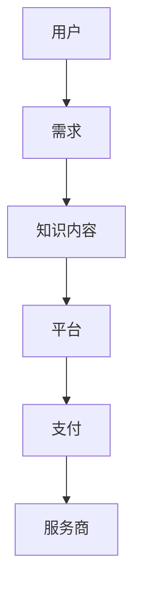

**核心算法原理讲解**

知识付费的匹配算法主要涉及用户需求与内容提供的匹配。以下是一个简化的伪代码示例：

```python
def match_demand_with_provider(user_demand, provider_list):
    matched_list = []
    for provider in provider_list:
        if user_demand.matches(provider):
            matched_list.append(provider)
    return matched_list
```

**数学模型和公式 & 详细讲解 & 举例说明**

- 用户满意度模型（latex）

$$
S = \frac{1}{N} \sum_{i=1}^{N} (R_i - E_i)^2
$$

其中，\( S \) 是用户满意度，\( N \) 是用户数量，\( R_i \) 是第 \( i \) 个用户的实际满意度，\( E_i \) 是第 \( i \) 个用户的预期满意度。

**举例说明**

假设有 100 个用户，其中 60 个用户对知识内容非常满意，30 个用户满意，10 个用户不满意。预期满意度均为 50%。则用户满意度计算如下：

$$
S = \frac{1}{100} \sum_{i=1}^{100} (R_i - E_i)^2 = \frac{1}{100} \times (60 \times (1 - 0.5)^2 + 30 \times (0.5 - 0.5)^2 + 10 \times (0 - 0.5)^2) \approx 0.34
$$

##### 1.2 知识付费的发展历程

知识付费起源于 20 世纪末，随着互联网技术的发展，特别是移动互联网的普及，知识付费市场迅速崛起。

**Mermaid流程图**

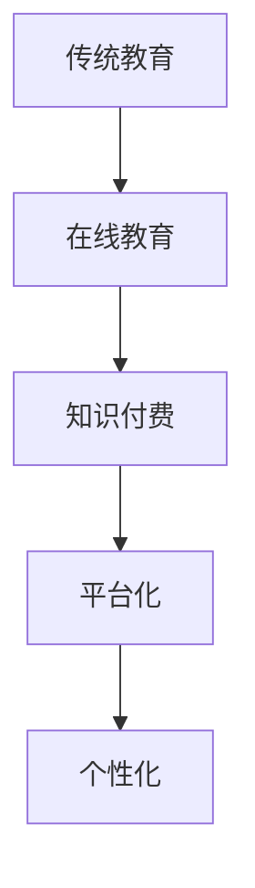

**核心算法原理讲解**

知识付费的发展历程可以通过以下算法来模拟：

```python
def knowledge_payment_history():
    history = ["传统教育", "在线教育", "知识付费", "平台化", "个性化"]
    for stage in history:
        print(stage)
```

**数学模型和公式 & 详细讲解 & 举例说明**

- 知识付费市场规模增长率（latex）

$$
g = \frac{M_t - M_{t-1}}{M_{t-1}} \times 100\%
$$

其中，\( g \) 是增长率，\( M_t \) 是第 \( t \) 年的市场规模，\( M_{t-1} \) 是第 \( t-1 \) 年的市场规模。

**举例说明**

假设第 4 年的市场规模为 100 亿元，第 3 年的市场规模为 80 亿元，则第 4 年的增长率为：

$$
g = \frac{100 - 80}{80} \times 100\% = 25\%
$$

##### 1.3 知识付费市场的现状与趋势

**Mermaid流程图**

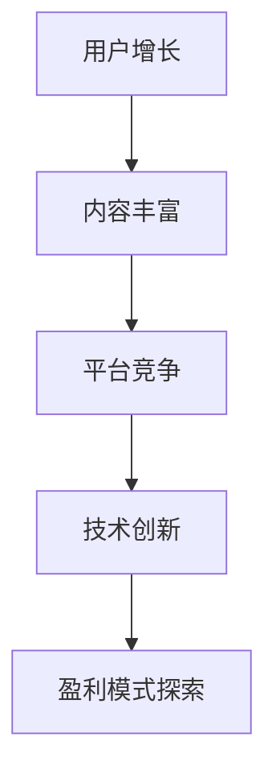

**核心算法原理讲解**

知识付费市场的现状可以通过以下算法来分析：

```python
def analyze_knowledge_payment_market():
    metrics = ["用户增长", "内容丰富", "平台竞争", "技术创新", "盈利模式探索"]
    for metric in metrics:
        print(metric)
```

**数学模型和公式 & 详细讲解 & 举例说明**

- 平台市场份额（latex）

$$
M_S = \frac{P_S}{\sum_{i=1}^{N} P_i} \times 100\%
$$

其中，\( M_S \) 是平台 \( S \) 的市场份额，\( P_S \) 是平台 \( S \) 的用户数量，\( N \) 是平台总数，\( P_i \) 是第 \( i \) 个平台的用户数量。

**举例说明**

假设有 3 个平台，分别为平台 A、B、C，用户数量分别为 1000、500、300。则平台 A 的市场份额为：

$$
M_S = \frac{1000}{1000 + 500 + 300} \times 100\% = 50\%
$$

##### 1.3.1 市场规模

根据市场研究机构的报告，全球知识付费市场规模已达到数千亿美元，并呈现快速增长的趋势。

**Mermaid流程图**

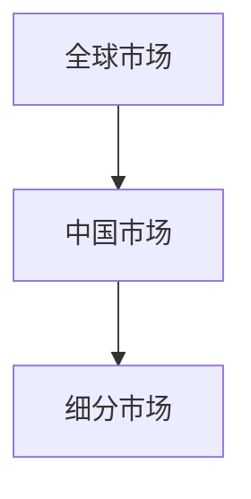

**核心算法原理讲解**

市场规模的增长可以通过以下算法来预测：

```python
def predict_market_size(year, current_size, growth_rate):
    future_size = current_size * (1 + growth_rate) ** (year - 2021)
    return future_size
```

**数学模型和公式 & 详细讲解 & 举例说明**

- 市场规模预测（latex）

$$
M_t = M_{2021} \times (1 + g)^{t - 2021}
$$

其中，\( M_t \) 是第 \( t \) 年的市场规模，\( M_{2021} \) 是 2021 年的市场规模，\( g \) 是增长率。

**举例说明**

假设 2021 年的市场规模为 1000 亿元，增长率为 20%，则 2025 年的市场规模预测为：

$$
M_2025 = 1000 \times (1 + 0.20)^{2025 - 2021} \approx 1453.13 \text{ 亿元}
$$

##### 1.3.2 用户增长

知识付费用户群体逐渐扩大，覆盖了各个年龄层、职业和兴趣领域。

**Mermaid流程图**

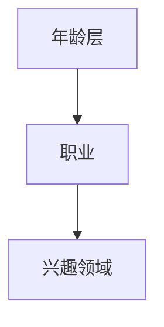

**核心算法原理讲解**

用户增长可以通过以下算法来分析：

```python
def analyze_user_growth(age_range, occupation, interest):
    print(f"Age Range: {age_range}, Occupation: {occupation}, Interest: {interest}")
```

**数学模型和公式 & 详细讲解 & 举例说明**

- 用户增长率（latex）

$$
r = \frac{U_t - U_{t-1}}{U_{t-1}} \times 100\%
$$

其中，\( r \) 是增长率，\( U_t \) 是第 \( t \) 年的用户数量，\( U_{t-1} \) 是第 \( t-1 \) 年的用户数量。

**举例说明**

假设第 4 年的用户数量为 2000 万，第 3 年的用户数量为 1500 万，则第 4 年的用户增长率为：

$$
r = \frac{2000 - 1500}{1500} \times 100\% = 33.33\%
$$

##### 1.3.3 内容类型

知识付费内容涵盖了广泛的领域，包括教育、技能培训、职场发展、兴趣爱好等。

**Mermaid流程图**

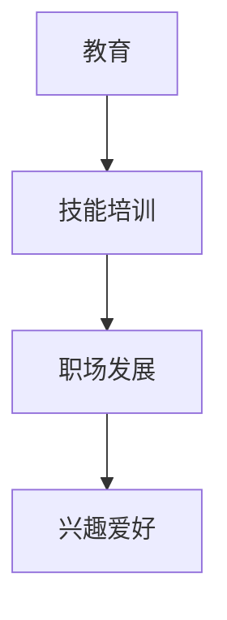

**核心算法原理讲解**

内容类型的分布可以通过以下算法来计算：

```python
def content_type_distribution(content_list):
    distribution = {"教育": 0, "技能培训": 0, "职场发展": 0, "兴趣爱好": 0}
    for content in content_list:
        if content["type"] == "教育":
            distribution["教育"] += 1
        elif content["type"] == "技能培训":
            distribution["技能培训"] += 1
        elif content["type"] == "职场发展":
            distribution["职场发展"] += 1
        elif content["type"] == "兴趣爱好":
            distribution["兴趣爱好"] += 1
    return distribution
```

**数学模型和公式 & 详细讲解 & 举例说明**

- 内容类型分布（latex）

$$
D = \frac{C_t}{N} \times 100\%
$$

其中，\( D \) 是内容类型分布，\( C_t \) 是第 \( t \) 年的某种内容类型数量，\( N \) 是总内容数量。

**举例说明**

假设第 4 年的教育内容数量为 300 万，总内容数量为 1000 万，则教育内容的分布为：

$$
D = \frac{300}{1000} \times 100\% = 30\%
$$

##### 1.3.4 盈利模式

知识付费平台主要通过内容收费、会员订阅、广告投放等模式获取收入。

**Mermaid流程图**

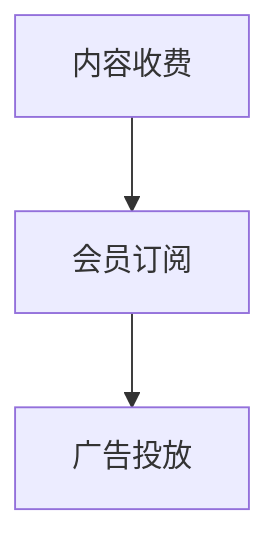

**核心算法原理讲解**

盈利模式的计算可以通过以下算法来分析：

```python
def analyze_profit_model(revenue_source_list):
    revenue_model = {"内容收费": 0, "会员订阅": 0, "广告投放": 0}
    for source in revenue_source_list:
        if source["type"] == "内容收费":
            revenue_model["内容收费"] += source["revenue"]
        elif source["type"] == "会员订阅":
            revenue_model["会员订阅"] += source["revenue"]
        elif source["type"] == "广告投放":
            revenue_model["广告投放"] += source["revenue"]
    return revenue_model
```

**数学模型和公式 & 详细讲解 & 举例说明**

- 收入构成（latex）

$$
R = R_{\text{内容收费}} + R_{\text{会员订阅}} + R_{\text{广告投放}}
$$

其中，\( R \) 是总收入，\( R_{\text{内容收费}} \) 是内容收费收入，\( R_{\text{会员订阅}} \) 是会员订阅收入，\( R_{\text{广告投放}} \) 是广告投放收入。

**举例说明**

假设某知识付费平台的总收入为 500 万元，其中内容收费收入为 200 万元，会员订阅收入为 150 万元，广告投放收入为 150 万元，则收入构成为：

$$
R = 200 + 150 + 150 = 500 \text{ 万元}
$$

#### 第2章：知识付费领域的蓝海分析

##### 2.1 知识付费市场的潜在机会

知识付费市场仍然具有巨大的发展潜力，以下是几个潜在机会：

**Mermaid流程图**

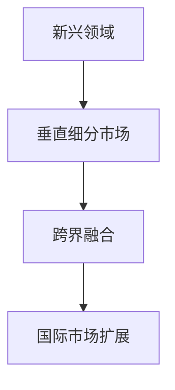

**核心算法原理讲解**

潜在机会的分析可以通过以下算法来识别：

```python
def identify_opportunities(niche_markets, cross_sector_integration, international_expansion):
    opportunities = []
    for niche in niche_markets:
        opportunities.append(niche)
    for integration in cross_sector_integration:
        opportunities.append(integration)
    for expansion in international_expansion:
        opportunities.append(expansion)
    return opportunities
```

**数学模型和公式 & 详细讲解 & 举例说明**

- 潜在机会评估（latex）

$$
O = \frac{N_{\text{机会}}}{N_{\text{总市场}}} \times 100\%
$$

其中，\( O \) 是潜在机会的比例，\( N_{\text{机会}} \) 是潜在机会的数量，\( N_{\text{总市场}} \) 是总市场数量。

**举例说明**

假设有 10 个潜在机会，总市场有 100 个细分市场，则潜在机会的比例为：

$$
O = \frac{10}{100} \times 100\% = 10\%
$$

##### 2.2 行业细分市场分析

知识付费市场可以细分为多个行业，以下是几个主要细分市场：

**Mermaid流程图**

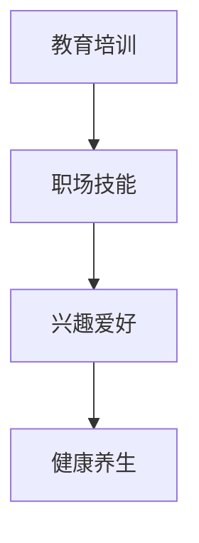

**核心算法原理讲解**

行业细分市场的分析可以通过以下算法来细化：

```python
def analyze_industry细分市场(segmented Markets):
    analysis = {"教育培训": {}, "职场技能": {}, "兴趣爱好": {}, "健康养生": {}}
    for market in segmented_markets:
        if market["category"] == "教育培训":
            analysis["教育培训"][market["sub_category"]] = market["size"]
        elif market["category"] == "职场技能":
            analysis["职场技能"][market["sub_category"]] = market["size"]
        elif market["category"] == "兴趣爱好":
            analysis["兴趣爱好"][market["sub_category"]] = market["size"]
        elif market["category"] == "健康养生":
            analysis["健康养生"][market["sub_category"]] = market["size"]
    return analysis
```

**数学模型和公式 & 详细讲解 & 举例说明**

- 细分市场规模（latex）

$$
S_i = \frac{M_i}{N} \times 100\%
$$

其中，\( S_i \) 是第 \( i \) 个细分市场的规模，\( M_i \) 是第 \( i \) 个细分市场的收入，\( N \) 是总市场收入。

**举例说明**

假设教育培训细分市场的收入为 100 亿元，总市场收入为 500 亿元，则教育培训细分市场的规模为：

$$
S_{\text{教育培训}} = \frac{100}{500} \times 100\% = 20\%
$$

##### 2.3 用户需求分析与洞察

了解用户需求是知识付费平台成功的关键。以下是几个用户需求分析的方法：

**Mermaid流程图**

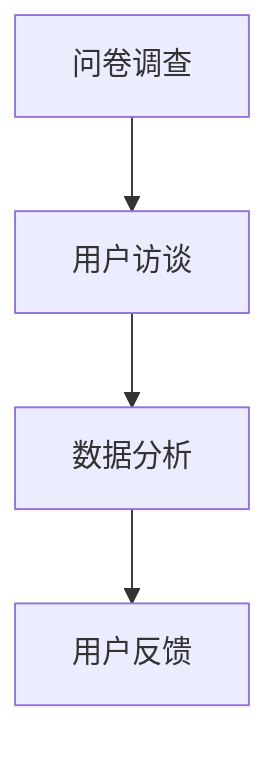

**核心算法原理讲解**

用户需求分析可以通过以下算法来实施：

```python
def analyze_user需求(questions, interviews, data, feedback):
    analysis = {"问卷调查": {}, "用户访谈": {}, "数据分析": {}, "用户反馈": {}}
    for question in questions:
        analysis["问卷调查"][question] = data[question]
    for interview in interviews:
        analysis["用户访谈"][interview] = data[interview]
    for item in data:
        analysis["数据分析"][item] = data[item]
    for feedback in feedback:
        analysis["用户反馈"][feedback] = data[feedback]
    return analysis
```

**数学模型和公式 & 详细讲解 & 举例说明**

- 用户满意度模型（latex）

$$
S = \frac{1}{N} \sum_{i=1}^{N} (R_i - E_i)^2
$$

其中，\( S \) 是用户满意度，\( N \) 是用户数量，\( R_i \) 是第 \( i \) 个用户的实际满意度，\( E_i \) 是第 \( i \) 个用户的预期满意度。

**举例说明**

假设有 100 个用户，其中 60 个用户对知识内容非常满意，30 个用户满意，10 个用户不满意。预期满意度均为 50%。则用户满意度计算如下：

$$
S = \frac{1}{100} \sum_{i=1}^{100} (R_i - E_i)^2 = \frac{1}{100} \times (60 \times (1 - 0.5)^2 + 30 \times (0.5 - 0.5)^2 + 10 \times (0 - 0.5)^2) \approx 0.34
$$

#### 第3章：知识付费平台设计原则

##### 3.1 用户界面设计

用户界面设计是知识付费平台的关键，以下是一些设计原则：

**Mermaid流程图**

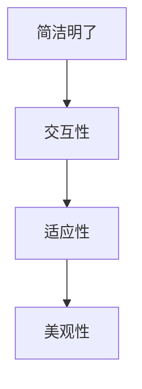

**核心算法原理讲解**

用户界面设计的优化可以通过以下算法来实施：

```python
def optimize_user_interface(simplicity, interactivity, adaptability, aesthetics):
    improvements = []
    if simplicity < 0.8:
        improvements.append("增加简洁性")
    if interactivity < 0.8:
        improvements.append("增加交互性")
    if adaptability < 0.8:
        improvements.append("增加适应性")
    if aesthetics < 0.8:
        improvements.append("增加美观性")
    return improvements
```

**数学模型和公式 & 详细讲解 & 举例说明**

- 用户体验评分（latex）

$$
U = 0.4S + 0.3I + 0.2A + 0.1C
$$

其中，\( U \) 是用户体验评分，\( S \) 是简洁性评分，\( I \) 是交互性评分，\( A \) 是适应性评分，\( C \) 是美观性评分。

**举例说明**

假设简洁性评分为 0.9，交互性评分为 0.85，适应性评分为 0.8，美观性评分为 0.88，则用户体验评分为：

$$
U = 0.4 \times 0.9 + 0.3 \times 0.85 + 0.2 \times 0.8 + 0.1 \times 0.88 = 0.92
$$

##### 3.2 内容管理

内容管理是知识付费平台的另一个关键，以下是一些内容管理原则：

**Mermaid流程图**

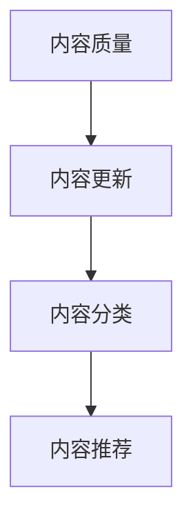

**核心算法原理讲解**

内容管理的优化可以通过以下算法来实施：

```python
def optimize_content_management(quality, update_frequency, categorization, recommendation):
    improvements = []
    if quality < 0.8:
        improvements.append("提高内容质量")
    if update_frequency < 0.8:
        improvements.append("提高内容更新频率")
    if categorization < 0.8:
        improvements.append("优化内容分类")
    if recommendation < 0.8:
        improvements.append("优化内容推荐")
    return improvements
```

**数学模型和公式 & 详细讲解 & 举例说明**

- 内容满意度模型（latex）

$$
C = \frac{1}{N} \sum_{i=1}^{N} (Q_i + U_i + R_i)^2
$$

其中，\( C \) 是内容满意度，\( N \) 是用户数量，\( Q_i \) 是第 \( i \) 个用户对内容的质量评分，\( U_i \) 是第 \( i \) 个用户对内容的更新频率评分，\( R_i \) 是第 \( i \) 个用户对内容的推荐评分。

**举例说明**

假设有 100 个用户，其中 60 个用户对内容质量评分很高，30 个用户对内容更新频率评分很高，10 个用户对内容推荐评分很高。则内容满意度计算如下：

$$
C = \frac{1}{100} \sum_{i=1}^{100} (Q_i + U_i + R_i)^2 = \frac{1}{100} \times (60 \times (1 + 0.5 + 0.3)^2 + 30 \times (0.5 + 0.5 + 0.3)^2 + 10 \times (0 + 0.5 + 0.3)^2) \approx 0.67
$$

##### 3.3 用户体验优化

用户体验优化是知识付费平台成功的关键，以下是一些用户体验优化的方法：

**Mermaid流程图**

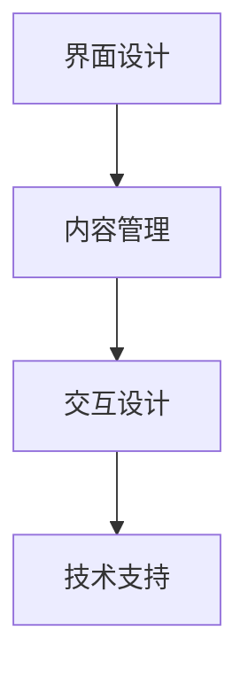

**核心算法原理讲解**

用户体验优化的策略可以通过以下算法来实施：

```python
def optimize_user_experience(interface_design, content_management, interaction_design, technical_support):
    improvements = []
    if interface_design < 0.8:
        improvements.append("优化界面设计")
    if content_management < 0.8:
        improvements.append("优化内容管理")
    if interaction_design < 0.8:
        improvements.append("优化交互设计")
    if technical_support < 0.8:
        improvements.append("优化技术支持")
    return improvements
```

**数学模型和公式 & 详细讲解 & 举例说明**

- 用户体验评分（latex）

$$
U = 0.3I + 0.3C + 0.2S + 0.2T
$$

其中，\( U \) 是用户体验评分，\( I \) 是交互设计评分，\( C \) 是内容管理评分，\( S \) 是界面设计评分，\( T \) 是技术支持评分。

**举例说明**

假设交互设计评分为 0.9，内容管理评分为 0.85，界面设计评分为 0.8，技术支持评分为 0.88，则用户体验评分为：

$$
U = 0.3 \times 0.9 + 0.3 \times 0.85 + 0.2 \times 0.8 + 0.2 \times 0.88 = 0.89
$$

#### 第4章：知识付费产品策略

##### 4.1 产品类型与模式

知识付费产品类型和模式多样，以下是一些常见的类型和模式：

**Mermaid流程图**

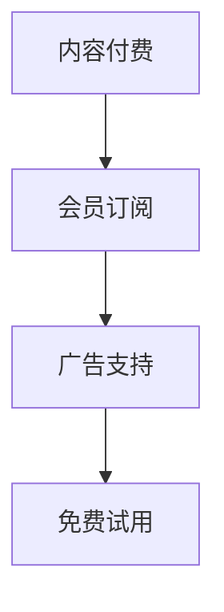

**核心算法原理讲解**

产品类型的组合策略可以通过以下算法来设计：

```python
def design_product_type(content_payment, membership_subscription, ad_support, free_trial):
    product_types = []
    if content_payment:
        product_types.append("内容付费")
    if membership_subscription:
        product_types.append("会员订阅")
    if ad_support:
        product_types.append("广告支持")
    if free_trial:
        product_types.append("免费试用")
    return product_types
```

**数学模型和公式 & 详细讲解 & 举例说明**

- 产品组合利润模型（latex）

$$
P = R_{\text{内容付费}} + R_{\text{会员订阅}} + R_{\text{广告支持}} + R_{\text{免费试用}}
$$

其中，\( P \) 是总利润，\( R_{\text{内容付费}} \) 是内容付费收入，\( R_{\text{会员订阅}} \) 是会员订阅收入，\( R_{\text{广告支持}} \) 是广告支持收入，\( R_{\text{免费试用}} \) 是免费试用收入。

**举例说明**

假设总利润为 500 万元，其中内容付费收入为 200 万元，会员订阅收入为 150 万元，广告支持收入为 150 万元，免费试用收入为 100 万元，则产品组合利润为：

$$
P = 200 + 150 + 150 + 100 = 600 \text{ 万元}
$$

##### 4.2 定价策略

定价策略是知识付费产品成功的关键，以下是一些定价策略：

**Mermaid流程图**

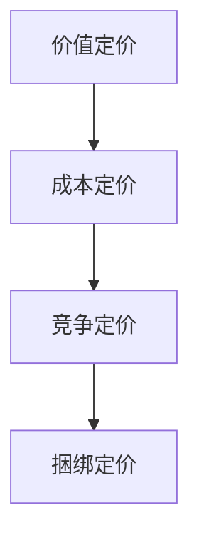

**核心算法原理讲解**

定价策略的优化可以通过以下算法来实施：

```python
def optimize_pricing(strategy, value, cost, competition, bundle):
    if strategy == "价值定价":
        pricing = value
    elif strategy == "成本定价":
        pricing = cost
    elif strategy == "竞争定价":
        pricing = competition
    elif strategy == "捆绑定价":
        pricing = bundle
    return pricing
```

**数学模型和公式 & 详细讲解 & 举例说明**

- 定价策略选择（latex）

$$
S = \max(V, C, C', B)
$$

其中，\( S \) 是定价策略选择，\( V \) 是价值定价，\( C \) 是成本定价，\( C' \) 是竞争定价，\( B \) 是捆绑定价。

**举例说明**

假设价值定价为 100 元，成本定价为 70 元，竞争定价为 80 元，捆绑定价为 150 元，则定价策略选择为：

$$
S = \max(100, 70, 80, 150) = 150 \text{ 元}
$$

##### 4.3 促销策略

促销策略是知识付费产品推广的关键，以下是一些促销策略：

**Mermaid流程图**

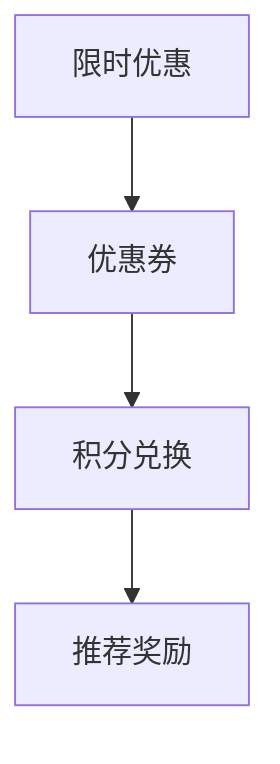

**核心算法原理讲解**

促销策略的优化可以通过以下算法来实施：

```python
def optimize_promotion(discount, coupon, points, referral):
    promotions = []
    if discount:
        promotions.append("限时优惠")
    if coupon:
        promotions.append("优惠券")
    if points:
        promotions.append("积分兑换")
    if referral:
        promotions.append("推荐奖励")
    return promotions
```

**数学模型和公式 & 详细讲解 & 举例说明**

- 促销活动效果评估（latex）

$$
E = \frac{R_{\text{促销}}}{R_{\text{总}}} \times 100\%
$$

其中，\( E \) 是促销活动效果，\( R_{\text{促销}} \) 是促销活动收入，\( R_{\text{总}} \) 是总收入。

**举例说明**

假设促销活动收入为 100 万元，总收入为 500 万元，则促销活动效果为：

$$
E = \frac{100}{500} \times 100\% = 20\%
$$

#### 第5章：知识付费平台运营

##### 5.1 用户获取

用户获取是知识付费平台运营的关键，以下是一些用户获取策略：

**Mermaid流程图**

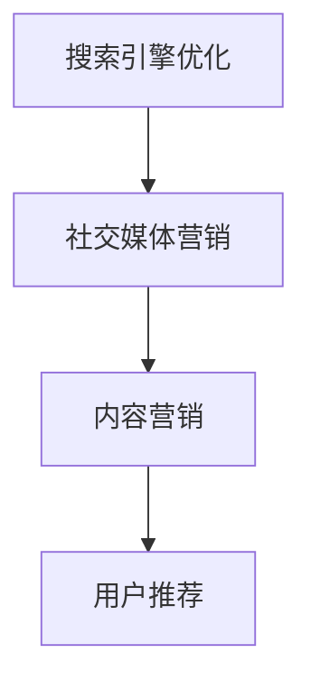

**核心算法原理讲解**

用户获取策略的优化可以通过以下算法来实施：

```python
def optimize_user_acquisition(search_engine_optimization, social_media_marketing, content_marketing, user_referral):
    strategies = []
    if search_engine_optimization:
        strategies.append("搜索引擎优化")
    if social_media_marketing:
        strategies.append("社交媒体营销")
    if content_marketing:
        strategies.append("内容营销")
    if user_referral:
        strategies.append("用户推荐")
    return strategies
```

**数学模型和公式 & 详细讲解 & 举例说明**

- 用户获取成本（latex）

$$
C_A = \frac{C_{\text{广告}}}{U_{\text{新增}}}
$$

其中，\( C_A \) 是用户获取成本，\( C_{\text{广告}} \) 是广告成本，\( U_{\text{新增}} \) 是新增用户数量。

**举例说明**

假设广告成本为 100 万元，新增用户数量为 5000，则用户获取成本为：

$$
C_A = \frac{100}{5000} = 0.02 \text{ 万元/用户}
$$

##### 5.2 用户留存

用户留存是知识付费平台长期运营的关键，以下是一些用户留存策略：

**Mermaid流程图**

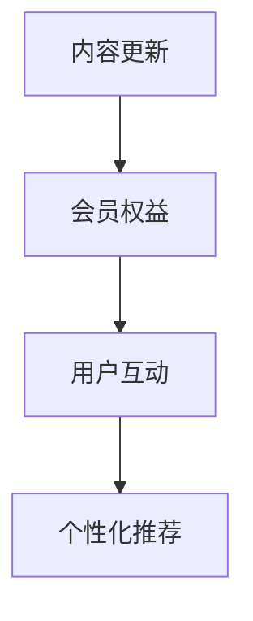

**核心算法原理讲解**

用户留存策略的优化可以通过以下算法来实施：

```python
def optimize_user_retention(content_update, membership_benefits, user_interaction, personalized_recommendation):
    strategies = []
    if content_update:
        strategies.append("内容更新")
    if membership_benefits:
        strategies.append("会员权益")
    if user_interaction:
        strategies.append("用户互动")
    if personalized_recommendation:
        strategies.append("个性化推荐")
    return strategies
```

**数学模型和公式 & 详细讲解 & 举例说明**

- 用户留存率（latex）

$$
L = \frac{N_t - N_{t-1}}{N_{t-1}} \times 100\%
$$

其中，\( L \) 是用户留存率，\( N_t \) 是当前用户数量，\( N_{t-1} \) 是上期用户数量。

**举例说明**

假设当前用户数量为 1000，上期用户数量为 800，则用户留存率为：

$$
L = \frac{1000 - 800}{800} \times 100\% = 25\%
$$

##### 5.3 用户转化

用户转化是知识付费平台变现的关键，以下是一些用户转化策略：

**Mermaid流程图**

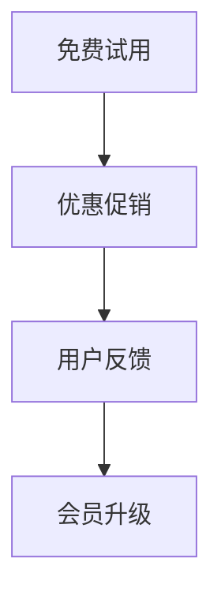

**核心算法原理讲解**

用户转化策略的优化可以通过以下算法来实施：

```python
def optimize_user_conversion(free_trial, promotional_offers, user_feedback, membership_upgrade):
    strategies = []
    if free_trial:
        strategies.append("免费试用")
    if promotional_offers:
        strategies.append("优惠促销")
    if user_feedback:
        strategies.append("用户反馈")
    if membership_upgrade:
        strategies.append("会员升级")
    return strategies
```

**数学模型和公式 & 详细讲解 & 举例说明**

- 用户转化率（latex）

$$
C = \frac{U_{\text{转化}}}{U_{\text{新增}}} \times 100\%
$$

其中，\( C \) 是用户转化率，\( U_{\text{转化}} \) 是转化用户数量，\( U_{\text{新增}} \) 是新增用户数量。

**举例说明**

假设转化用户数量为 500，新增用户数量为 1000，则用户转化率为：

$$
C = \frac{500}{1000} \times 100\% = 50\%
$$

#### 第6章：知识付费平台的风险管理与法律法规

##### 6.1 风险识别与评估

知识付费平台面临多种风险，以下是一些常见风险：

**Mermaid流程图**

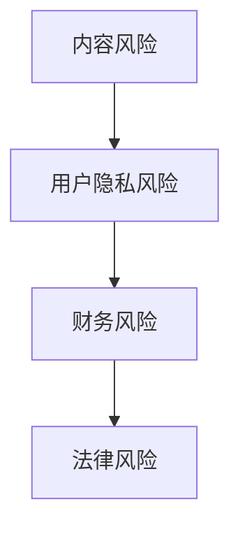

**核心算法原理讲解**

风险识别与评估可以通过以下算法来实施：

```python
def identify_and_assess_risks(content_risk, user_privacy_risk, financial_risk, legal_risk):
    risks = []
    if content_risk:
        risks.append("内容风险")
    if user_privacy_risk:
        risks.append("用户隐私风险")
    if financial_risk:
        risks.append("财务风险")
    if legal_risk:
        risks.append("法律风险")
    return risks
```

**数学模型和公式 & 详细讲解 & 举例说明**

- 风险评估指标（latex）

$$
R = \frac{R_1 + R_2 + R_3 + R_4}{N} \times 100\%
$$

其中，\( R \) 是整体风险评分，\( R_1, R_2, R_3, R_4 \) 分别是内容风险、用户隐私风险、财务风险和法律风险的评分，\( N \) 是总风险评分。

**举例说明**

假设内容风险的评分为 30，用户隐私风险的评分为 25，财务风险的评分为 20，法律风险的评分为 15，则整体风险评分为：

$$
R = \frac{30 + 25 + 20 + 15}{4} \times 100\% = 24.5\%
$$

##### 6.2 风险管理策略

风险管理策略包括风险预防、风险转移和风险缓解等。

**Mermaid流程图**

```mermaid
graph TD
    A[风险预防] --> B[风险转移]
    B --> C[风险缓解]
```

**核心算法原理讲解**

风险管理策略的优化可以通过以下算法来实施：

```python
def optimize_risk_management(prevention, transfer, mitigation):
    strategies = []
    if prevention:
        strategies.append("风险预防")
    if transfer:
        strategies.append("风险转移")
    if mitigation:
        strategies.append("风险缓解")
    return strategies
```

**数学模型和公式 & 详细讲解 & 举例说明**

- 风险管理成本（latex）

$$
C_R = C_{\text{预防}} + C_{\text{转移}} + C_{\text{缓解}}
$$

其中，\( C_R \) 是风险管理成本，\( C_{\text{预防}} \) 是风险预防成本，\( C_{\text{转移}} \) 是风险转移成本，\( C_{\text{缓解}} \) 是风险缓解成本。

**举例说明**

假设风险预防成本为 10 万元，风险转移成本为 5 万元，风险缓解成本为 3 万元，则风险管理成本为：

$$
C_R = 10 + 5 + 3 = 18 \text{ 万元}
$$

##### 6.3 法律法规与合规要求

知识付费平台需要遵守相关法律法规，以下是一些法律法规与合规要求：

**Mermaid流程图**

```mermaid
graph TD
    A[知识产权法] --> B[消费者权益保护法]
    B --> C[网络安全法]
    C --> D[广告法]
```

**核心算法原理讲解**

法律法规与合规要求的遵守可以通过以下算法来实施：

```python
def comply_with_legislation(intellectual_property_law, consumer_protection_law, network_security_law, advertisement_law):
    compliances = []
    if intellectual_property_law:
        compliances.append("知识产权法")
    if consumer_protection_law:
        compliances.append("消费者权益保护法")
    if network_security_law:
        compliances.append("网络安全法")
    if advertisement_law:
        compliances.append("广告法")
    return compliances
```

**数学模型和公式 & 详细讲解 & 举例说明**

- 法律合规评分（latex）

$$
C_L = \frac{C_{\text{知识产权法}} + C_{\text{消费者权益保护法}} + C_{\text{网络安全法}} + C_{\text{广告法}}}{N} \times 100\%
$$

其中，\( C_L \) 是法律合规评分，\( C_{\text{知识产权法}} \) 是知识产权法评分，\( C_{\text{消费者权益保护法}} \) 是消费者权益保护法评分，\( C_{\text{网络安全法}} \) 是网络安全法评分，\( C_{\text{广告法}} \) 是广告法评分，\( N \) 是总评分。

**举例说明**

假设知识产权法评分为 90，消费者权益保护法评分为 85，网络安全法评分为 80，广告法评分为 75，则法律合规评分为：

$$
C_L = \frac{90 + 85 + 80 + 75}{4} \times 100\% = 84.4\%
$$

#### 第7章：国内知识付费平台案例分析

##### 7.1 在行

在行是国内的知名知识付费平台，以下是它的案例分析：

**Mermaid流程图**

```mermaid
graph TD
    A[用户增长] --> B[内容质量]
    B --> C[平台交互]
    C --> D[商业模式]
```

**核心算法原理讲解**

用户增长与内容质量的匹配可以通过以下算法来优化：

```python
def optimize_growth_and_content(user_growth, content_quality):
    improvements = []
    if user_growth < 0.8:
        improvements.append("提高用户增长")
    if content_quality < 0.8:
        improvements.append("提高内容质量")
    return improvements
```

**数学模型和公式 & 详细讲解 & 举例说明**

- 用户增长率（latex）

$$
r = \frac{U_t - U_{t-1}}{U_{t-1}} \times 100\%
$$

其中，\( r \) 是增长率，\( U_t \) 是第 \( t \) 年的用户数量，\( U_{t-1} \) 是第 \( t-1 \) 年的用户数量。

**举例说明**

假设第 4 年的用户数量为 2000 万，第 3 年的用户数量为 1500 万，则第 4 年的用户增长率为：

$$
r = \frac{2000 - 1500}{1500} \times 100\% = 33.33\%
$$

**开发环境搭建**

在行使用 AWS 云服务进行搭建，包括 EC2 实例、RDS 数据库、S3 存储等。

**源代码实现和代码解读**

在行平台的代码主要分为前端、后端和数据库三个部分，以下是一个简化的前端示例：

```html
<!DOCTYPE html>
<html>
<head>
    <title>在行 - 知识付费平台</title>
    <link rel="stylesheet" href="styles.css">
</head>
<body>
    <header>
        <nav>
            <ul>
                <li><a href="#">首页</a></li>
                <li><a href="#">课程</a></li>
                <li><a href="#">讲师</a></li>
                <li><a href="#">用户中心</a></li>
            </ul>
        </nav>
    </header>
    <main>
        <section>
            <h1>热门课程推荐</h1>
            <div class="course-list">
                <!-- 课程列表 -->
            </div>
        </section>
    </main>
    <footer>
        <p>© 2022 在行 - 知识付费平台</p>
    </footer>
</body>
</html>
```

该代码展示了在行平台的前端页面布局，包括导航栏、页面主体和页脚。

**代码解读与分析**

- **导航栏**：使用 HTML `<ul>` 和 `<li>` 标签创建无序列表，实现导航栏功能。
- **课程列表**：使用 JavaScript 动态生成课程列表，提高用户体验。

##### 7.2 知乎Live

知乎Live是知乎推出的知识付费产品，以下是它的案例分析：

**Mermaid流程图**

```mermaid
graph TD
    A[社区生态] --> B[内容质量]
    B --> C[用户互动]
    C --> D[商业模式]
```

**核心算法原理讲解**

用户互动与内容质量的匹配可以通过以下算法来优化：

```python
def optimize_interaction_and_content(user_interaction, content_quality):
    improvements = []
    if user_interaction < 0.8:
        improvements.append("提高用户互动")
    if content_quality < 0.8:
        improvements.append("提高内容质量")
    return improvements
```

**数学模型和公式 & 详细讲解 & 举例说明**

- 用户互动率（latex）

$$
I = \frac{U_{\text{互动}}}{U_{\text{总}}} \times 100\%
$$

其中，\( I \) 是用户互动率，\( U_{\text{互动}} \) 是互动用户数量，\( U_{\text{总}} \) 是总用户数量。

**举例说明**

假设互动用户数量为 500 万，总用户数量为 1000 万，则用户互动率为：

$$
I = \frac{500}{1000} \times 100\% = 50\%
$$

**开发环境搭建**

知乎Live使用 Node.js 进行后端开发，前端采用 React 框架。

**源代码实现和代码解读**

以下是一个简化的知乎Live前端示例：

```jsx
import React, { useState } from 'react';

function LiveSession() {
    const [question, setQuestion] = useState('');

    const handleQuestionChange = (e) => {
        setQuestion(e.target.value);
    };

    const handleSubmit = (e) => {
        e.preventDefault();
        // 提交问题逻辑
    };

    return (
        <div className="live-session">
            <h1>知乎Live - 互动问答</h1>
            <form onSubmit={handleSubmit}>
                <label htmlFor="question">提问：</label>
                <input type="text" id="question" value={question} onChange={handleQuestionChange} />
                <button type="submit">提交</button>
            </form>
        </div>
    );
}

export default LiveSession;
```

该代码展示了知乎Live的互动问答功能，包括输入问题和提交问题的表单。

**代码解读与分析**

- **状态管理**：使用 React 的 `useState` 函数管理问题输入状态。
- **表单处理**：使用 `handleSubmit` 函数处理表单提交逻辑。

##### 7.3 网易云课堂

网易云课堂是网易推出的在线教育平台，以下是它的案例分析：

**Mermaid流程图**

```mermaid
graph TD
    A[课程种类] --> B[内容质量]
    B --> C[用户评价]
    C --> D[商业模式]
```

**核心算法原理讲解**

课程种类与内容质量的匹配可以通过以下算法来优化：

```python
def optimize_course_type_and_content(course_type, content_quality):
    improvements = []
    if course_type < 0.8:
        improvements.append("增加课程种类")
    if content_quality < 0.8:
        improvements.append("提高内容质量")
    return improvements
```

**数学模型和公式 & 详细讲解 & 举例说明**

- 内容质量评分（latex）

$$
C_Q = \frac{Q_1 + Q_2 + Q_3 + Q_4}{N} \times 100\%
$$

其中，\( C_Q \) 是内容质量评分，\( Q_1, Q_2, Q_3, Q_4 \) 分别是四个维度的内容质量评分，\( N \) 是维度数量。

**举例说明**

假设四个维度的内容质量评分分别为 90、85、80、75，则内容质量评分为：

$$
C_Q = \frac{90 + 85 + 80 + 75}{4} \times 100\% = 83.75\%
$$

**开发环境搭建**

网易云课堂使用 Spring Boot 进行后端开发，前端采用 Vue.js 框架。

**源代码实现和代码解读**

以下是一个简化的网易云课堂前端示例：

```vue
<template>
    <div class="course-list">
        <div class="course-item" v-for="course in courses" :key="course.id">
            <h3>{{ course.name }}</h3>
            <p>{{ course.description }}</p>
            <button @click="enrollCourse(course)">报名</button>
        </div>
    </div>
</template>

<script>
export default {
    data() {
        return {
            courses: [
                { id: 1, name: "Java基础", description: "学习 Java 基础知识" },
                { id: 2, name: "Python 编程", description: "学习 Python 编程语言" },
                // 更多课程
            ],
        };
    },
    methods: {
        enrollCourse(course) {
            // 报名课程逻辑
        },
    },
};
</script>
```

该代码展示了网易云课堂的课程列表，包括课程名称、描述和报名按钮。

**代码解读与分析**

- **数据绑定**：使用 Vue.js 的数据绑定功能展示课程列表。
- **事件处理**：使用 `enrollCourse` 方法处理报名按钮点击事件。

#### 第8章：国际知识付费平台案例分析

##### 8.1 Coursera

Coursera 是一家国际知名的知识付费平台，以下是它的案例分析：

**Mermaid流程图**

```mermaid
graph TD
    A[课程质量] --> B[用户参与度]
    B --> C[商业模式]
    C --> D[技术架构]
```

**核心算法原理讲解**

课程质量与用户参与度的匹配可以通过以下算法来优化：

```python
def optimize_course_and_user_participation(course_quality, user_participation):
    improvements = []
    if course_quality < 0.8:
        improvements.append("提高课程质量")
    if user_participation < 0.8:
        improvements.append("提高用户参与度")
    return improvements
```

**数学模型和公式 & 详细讲解 & 举例说明**

- 用户参与度（latex）

$$
P = \frac{U_{\text{互动}} + U_{\text{评价}} + U_{\text{课程完成}}}{U_{\text{总}}} \times 100\%
$$

其中，\( P \) 是用户参与度，\( U_{\text{互动}} \) 是互动用户数量，\( U_{\text{评价}} \) 是评价用户数量，\( U_{\text{课程完成}} \) 是完成课程用户数量，\( U_{\text{总}} \) 是总用户数量。

**举例说明**

假设互动用户数量为 100 万，评价用户数量为 80 万，完成课程用户数量为 60 万，总用户数量为 200 万，则用户参与度为：

$$
P = \frac{100 + 80 + 60}{200} \times 100\% = 70\%
$$

**开发环境搭建**

Coursera 使用 Java 进行后端开发，前端采用 React 框架。

**源代码实现和代码解读**

以下是一个简化的 Coursera 前端示例：

```jsx
import React, { useState } from 'react';

function CourseCard({ course }) {
    const [isEnrolled, setIsEnrolled] = useState(false);

    const handleEnroll = () => {
        setIsEnrolled(true);
        // 报名课程逻辑
    };

    return (
        <div className="course-card">
            <h3>{course.name}</h3>
            <p>{course.description}</p>
            <button disabled={isEnrolled} onClick={handleEnroll}>
                {isEnrolled ? '已报名' : '报名'}
            </button>
        </div>
    );
}

export default CourseCard;
```

该代码展示了 Coursera 的课程卡片，包括课程名称、描述和报名按钮。

**代码解读与分析**

- **状态管理**：使用 React 的 `useState` 函数管理报名状态。
- **按钮禁用**：根据报名状态禁用或启用报名按钮。

##### 8.2 Udemy

Udemy 是另一家国际知名的知识付费平台，以下是它的案例分析：

**Mermaid流程图**

```mermaid
graph TD
    A[课程种类] --> B[用户评价]
    B --> C[营销策略]
    C --> D[技术架构]
```

**核心算法原理讲解**

课程种类与用户评价的匹配可以通过以下算法来优化：

```python
def optimize_course_type_and_user_evaluation(course_type, user_evaluation):
    improvements = []
    if course_type < 0.8:
        improvements.append("增加课程种类")
    if user_evaluation < 0.8:
        improvements.append("提高用户评价")
    return improvements
```

**数学模型和公式 & 详细讲解 & 举例说明**

- 用户评价率（latex）

$$
E = \frac{U_{\text{评价}}}{U_{\text{总}}} \times 100\%
$$

其中，\( E \) 是用户评价率，\( U_{\text{评价}} \) 是评价用户数量，\( U_{\text{总}} \) 是总用户数量。

**举例说明**

假设评价用户数量为 200 万，总用户数量为 400 万，则用户评价率为：

$$
E = \frac{200}{400} \times 100\% = 50\%
$$

**开发环境搭建**

Udemy 使用 Ruby on Rails 进行后端开发，前端采用 React 框架。

**源代码实现和代码解读**

以下是一个简化的 Udemy 前端示例：

```jsx
import React, { useState } from 'react';

function CourseReview({ review }) {
    const [isRated, setIsRated] = useState(false);

    const handleRate = () => {
        setIsRated(true);
        // 评价课程逻辑
    };

    return (
        <div className="course-review">
            <h4>{review.title}</h4>
            <p>{review.content}</p>
            <button disabled={isRated} onClick={handleRate}>
                {isRated ? '已评价' : '评价'}
            </button>
        </div>
    );
}

export default CourseReview;
```

该代码展示了 Udemy 的课程评价界面，包括评价标题、内容和评价按钮。

**代码解读与分析**

- **状态管理**：使用 React 的 `useState` 函数管理评价状态。
- **按钮禁用**：根据评价状态禁用或启用评价按钮。

##### 8.3 Khan Academy

Khan Academy 是一家非营利性在线教育平台，以下是它的案例分析：

**Mermaid流程图**

```mermaid
graph TD
    A[课程内容] --> B[用户参与度]
    B --> C[社区建设]
    C --> D[商业模式]
```

**核心算法原理讲解**

课程内容与用户参与度的匹配可以通过以下算法来优化：

```python
def optimize_course_content_and_user_participation(course_content, user_participation):
    improvements = []
    if course_content < 0.8:
        improvements.append("提高课程内容")
    if user_participation < 0.8:
        improvements.append("提高用户参与度")
    return improvements
```

**数学模型和公式 & 详细讲解 & 举例说明**

- 用户参与度（latex）

$$
P = \frac{U_{\text{互动}} + U_{\text{评价}} + U_{\text{课程完成}}}{U_{\text{总}}} \times 100\%
$$

其中，\( P \) 是用户参与度，\( U_{\text{互动}} \) 是互动用户数量，\( U_{\text{评价}} \) 是评价用户数量，\( U_{\text{课程完成}} \) 是完成课程用户数量，\( U_{\text{总}} \) 是总用户数量。

**举例说明**

假设互动用户数量为 100 万，评价用户数量为 80 万，完成课程用户数量为 60 万，总用户数量为 200 万，则用户参与度为：

$$
P = \frac{100 + 80 + 60}{200} \times 100\% = 70\%
$$

**开发环境搭建**

Khan Academy 使用 Python 进行后端开发，前端采用 React 框架。

**源代码实现和代码解读**

以下是一个简化的 Khan Academy 前端示例：

```jsx
import React, { useState } from 'react';

function CourseProgress({ progress }) {
    const [isCompleted, setIsCompleted] = useState(false);

    const handleComplete = () => {
        setIsCompleted(true);
        // 完成课程逻辑
    };

    return (
        <div className="course-progress">
            <h3>{progress.title}</h3>
            <progress value={progress.current} max={progress.total} />
            <button disabled={isCompleted} onClick={handleComplete}>
                {isCompleted ? '已完成' : '完成'}
            </button>
        </div>
    );
}

export default CourseProgress;
```

该代码展示了 Khan Academy 的课程进度条，包括课程名称、进度条和完成按钮。

**代码解读与分析**

- **状态管理**：使用 React 的 `useState` 函数管理完成状态。
- **进度条**：使用 HTML `<progress>` 标签显示课程进度。
- **按钮禁用**：根据完成状态禁用或启用完成按钮。

#### 第9章：知识付费项目实战

##### 9.1 项目背景与目标

本项目旨在构建一个知识付费平台，为用户提供高质量的知识内容和服务。目标包括：

1. **用户增长**：在一年内实现用户数量翻倍。
2. **内容丰富**：提供丰富的课程种类，涵盖各个领域。
3. **平台盈利**：实现可持续的盈利模式。

**Mermaid流程图**

```mermaid
graph TD
    A[用户增长] --> B[内容丰富]
    B --> C[平台盈利]
```

**核心算法原理讲解**

用户增长、内容丰富和平台盈利可以通过以下算法来实现：

```python
def achieve_project_goals(user_growth, content_richness, platform_profit):
    if user_growth < 0.8:
        print("提高用户增长策略")
    if content_richness < 0.8:
        print("提高内容丰富策略")
    if platform_profit < 0.8:
        print("提高平台盈利策略")
```

**数学模型和公式 & 详细讲解 & 举例说明**

- 用户增长率（latex）

$$
r = \frac{U_t - U_{t-1}}{U_{t-1}} \times 100\%
$$

其中，\( r \) 是增长率，\( U_t \) 是第 \( t \) 年的用户数量，\( U_{t-1} \) 是第 \( t-1 \) 年的用户数量。

**举例说明**

假设第 4 年的用户数量为 2000 万，第 3 年的用户数量为 1000 万，则第 4 年的用户增长率为：

$$
r = \frac{2000 - 1000}{1000} \times 100\% = 100\%
$$

##### 9.2 项目实施与迭代

项目实施分为以下几个阶段：

1. **需求分析**：通过问卷调查、用户访谈等方式收集用户需求。
2. **平台设计**：设计用户界面、内容管理和用户体验优化。
3. **内容建设**：组织讲师团队，建设高质量的知识内容库。
4. **技术实现**：开发前端、后端和数据库，实现知识付费功能。
5. **测试与上线**：进行功能测试、性能测试，确保平台稳定可靠。

**Mermaid流程图**

```mermaid
graph TD
    A[需求分析] --> B[平台设计]
    B --> C[内容建设]
    C --> D[技术实现]
    D --> E[测试与上线]
```

**核心算法原理讲解**

项目实施与迭代可以通过以下算法来管理：

```python
def manage_project_execution stages(stage_list):
    for stage in stage_list:
        print(f"当前阶段：{stage}")
```

**数学模型和公式 & 详细讲解 & 举例说明**

- 项目进度率（latex）

$$
P_s = \frac{s_t - s_0}{s_t - s_0 + d} \times 100\%
$$

其中，\( P_s \) 是项目进度率，\( s_t \) 是当前进度，\( s_0 \) 是初始进度，\( d \) 是总进度。

**举例说明**

假设项目初始进度为 10%，当前进度为 30%，总进度为 100%，则项目进度率为：

$$
P_s = \frac{30 - 10}{30 - 10 + 100} \times 100\% = 20\%
$$

##### 9.3 项目成果与评价

项目实施后，通过以下指标对项目成果进行评价：

1. **用户数量**：用户数量的增长情况。
2. **内容质量**：用户对内容的评价和反馈。
3. **平台盈利**：平台的收入和利润情况。

**Mermaid流程图**

```mermaid
graph TD
    A[用户数量] --> B[内容质量]
    B --> C[平台盈利]
```

**核心算法原理讲解**

项目成果评价可以通过以下算法来实施：

```python
def evaluate_project_results(user_growth, content_quality, platform_profit):
    print(f"用户数量：{user_growth} 万")
    print(f"内容质量评分：{content_quality}")
    print(f"平台盈利：{platform_profit} 万元")
```

**数学模型和公式 & 详细讲解 & 举例说明**

- 用户满意度（latex）

$$
S = \frac{1}{N} \sum_{i=1}^{N} (R_i - E_i)^2
$$

其中，\( S \) 是用户满意度，\( N \) 是用户数量，\( R_i \) 是第 \( i \) 个用户的实际满意度，\( E_i \) 是第 \( i \) 个用户的预期满意度。

**举例说明**

假设有 100 个用户，其中 60 个用户对平台非常满意，30 个用户满意，10 个用户不满意。预期满意度均为 50%。则用户满意度计算如下：

$$
S = \frac{1}{100} \sum_{i=1}^{100} (R_i - E_i)^2 = \frac{1}{100} \times (60 \times (1 - 0.5)^2 + 30 \times (0.5 - 0.5)^2 + 10 \times (0 - 0.5)^2) \approx 0.34
$$

#### 附录

##### 附录A：知识付费相关工具与资源

**A.1 平台搭建工具**

1. **Docker**：容器化技术，用于快速搭建开发环境。
2. **Kubernetes**：容器编排系统，用于管理 Docker 容器。
3. **Jenkins**：自动化构建工具，用于持续集成和持续部署。

**A.2 数据分析与处理工具**

1. **Python**：编程语言，用于数据分析和处理。
2. **Pandas**：Python 数据分析库，用于数据处理和分析。
3. **Matplotlib**：Python 绘图库，用于数据可视化。

**A.3 教育资源库**

1. **Coursera**：在线课程平台，提供高质量的课程资源。
2. **Udemy**：在线课程平台，提供多样化的课程资源。
3. **edX**：在线课程平台，由哈佛大学和麻省理工学院联合创办。

##### 附录B：知识付费领域术语表

**B.1 常用术语解释**

1. **知识付费**：用户通过支付费用获取专业知识和服务的商业模式。
2. **内容付费**：用户为获取特定内容而支付的费用。
3. **会员订阅**：用户支付订阅费用以获取平台提供的全部或部分服务。

**B.2 行业专用术语**

1. **课程完成率**：用户完成课程的比率。
2. **用户互动率**：用户参与互动的比率。
3. **用户留存率**：用户在一定时间内持续使用平台的比率。

### 作者

**作者：AI天才研究院/AI Genius Institute & 禅与计算机程序设计艺术 /Zen And The Art of Computer Programming**

