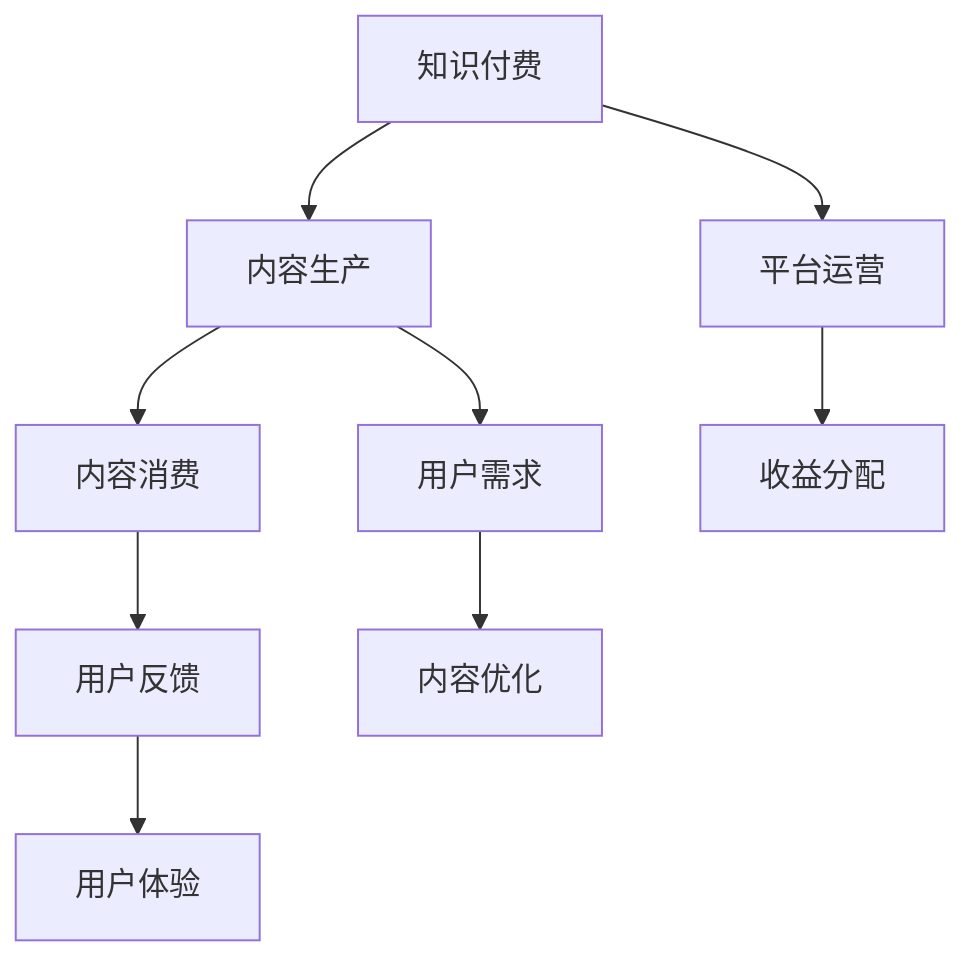
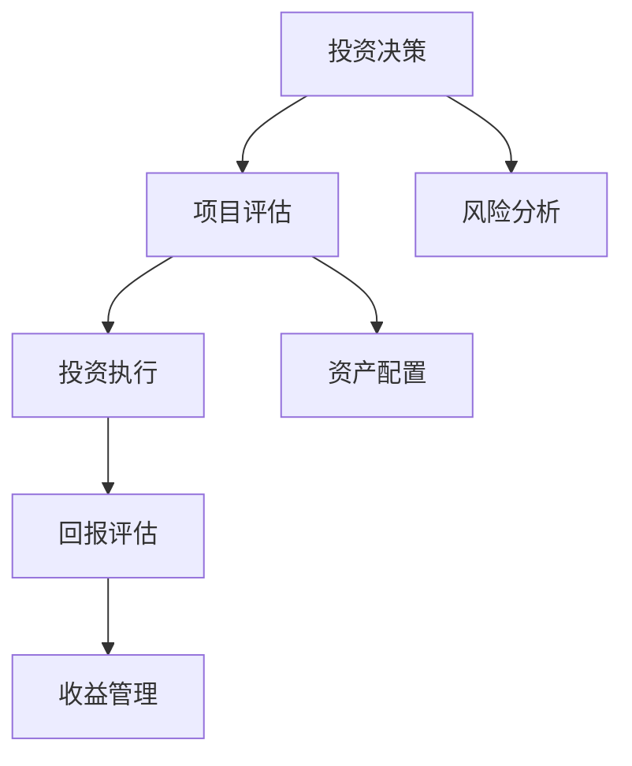

                 

# 知识付费：程序员的投资与回报

## 关键词

- 知识付费
- 程序员
- 投资与回报
- 投资策略
- 风险管理
- 个人品牌
- 项目评估

## 摘要

本文旨在探讨知识付费在程序员领域中的投资与回报。随着互联网技术的迅猛发展，知识付费已成为一个蓬勃发展的行业，程序员作为知识工作者，如何在这个市场中进行有效投资，并实现个人和职业的回报，成为了关键议题。本文将逐步分析知识付费的定义、市场现状、程序员的角色与机会，并深入探讨投资原则、策略、项目选择、投资组合优化、收益评估与管理等关键领域。通过案例分析，本文旨在为程序员提供一套系统的投资与回报策略，助力他们在知识付费市场中取得成功。

# 《知识付费：程序员的投资与回报》目录大纲

## 第一部分：知识付费概述

### 第1章：知识付费行业背景

#### 1.1 知识付费的定义与发展

#### 1.2 知识付费市场的现状与趋势

#### 1.3 程序员在知识付费中的角色与机会

### 第2章：程序员的投资视角

#### 2.1 投资原则与策略

#### 2.2 知识付费平台分析

#### 2.3 个人品牌建设与投资

## 第二部分：投资与回报

### 第3章：知识付费项目的选择

#### 3.1 项目评估标准

#### 3.2 风险管理与控制

#### 3.3 优秀项目的案例分析与借鉴

### 第4章：投资策略与实践

#### 4.1 个人投资策略

#### 4.2 投资组合优化

#### 4.3 投资过程中的常见问题与解决方法

### 第5章：回报评估与收益管理

#### 5.1 收益评估方法

#### 5.2 收益管理策略

#### 5.3 收益优化的实践技巧

## 第三部分：程序员的投资与回报

### 第6章：程序员投资案例分析

#### 6.1 案例一：个人知识产品开发

#### 6.2 案例二：知识付费平台投资

#### 6.3 案例三：知识共享社区建设

### 第7章：投资与职业发展

#### 7.1 投资对程序员职业发展的影响

#### 7.2 职业规划与投资策略的结合

#### 7.3 投资与职业发展的平衡与优化

## 附录

### 附录A：投资工具与资源介绍

#### A.1 主流知识付费平台介绍

#### A.2 投资工具推荐

#### A.3 程序员投资社区与资源链接

---

## 核心概念与联系

### 知识付费

**Mermaid 流�程图：**



### 投资与回报

**Mermaid 流程图：**



## 核心算法原理讲解

### 投资风险评估算法

**伪代码：**

```python
def risk_assessment(investment, market_data):
    # 计算投资风险
    risk_score = calculate_risk(investment, market_data)
    return risk_score

def calculate_risk(investment, market_data):
    # 使用历史数据进行风险计算
    historical_data = fetch_historical_data(market_data)
    risk_score = calculate_statistics(historical_data)
    return risk_score
```

### 投资组合优化算法

**伪代码：**

```python
def portfolio_optimization(investment_portfolios, risk_tolerance):
    # 根据风险容忍度进行投资组合优化
    optimized_portfolio = optimize_portfolio(investment_portfolios, risk_tolerance)
    return optimized_portfolio

def optimize_portfolio(portfolios, risk_tolerance):
    # 使用数学模型进行优化
    objective_function = define_objective_function(portfolios, risk_tolerance)
    optimized_portfolio = solve_optimization_problem(objective_function)
    return optimized_portfolio
```

## 数学模型和数学公式讲解

### 投资组合期望收益

**LaTeX 公式：**

$$ E(R_p) = w_1 \cdot E(R_1) + w_2 \cdot E(R_2) + ... + w_n \cdot E(R_n) $$

其中，\( E(R_p) \) 是投资组合的期望收益，\( w_i \) 是第 \( i \) 个资产的权重，\( E(R_i) \) 是第 \( i \) 个资产的期望收益。

### 投资组合风险

**LaTeX 公式：**

$$ \sigma_p^2 = w_1^2 \cdot \sigma_1^2 + w_2^2 \cdot \sigma_2^2 + ... + w_n^2 \cdot \sigma_n^2 + 2 \cdot \sum_{i=1}^{n-1} \sum_{j=i+1}^{n} w_i \cdot w_j \cdot \rho_{ij} $$

其中，\( \sigma_p^2 \) 是投资组合的风险，\( \sigma_i^2 \) 是第 \( i \) 个资产的风险，\( \rho_{ij} \) 是第 \( i \) 个资产与第 \( j \) 个资产之间的相关系数。

## 项目实战

### 实战一：知识付费平台搭建

**开发环境搭建：**
- 使用 Python 和 Flask 搭建基础平台
- 使用 MySQL 作为数据库

**源代码实现：**

```python
# 主文件
from flask import Flask, request, jsonify
from database import Database

app = Flask(__name__)
db = Database()

@app.route('/api/register', methods=['POST'])
def register():
    # 用户注册逻辑
    pass

@app.route('/api/login', methods=['POST'])
def login():
    # 用户登录逻辑
    pass

if __name__ == '__main__':
    app.run(debug=True)
```

**代码解读与分析：**
- 代码中使用 Flask 框架搭建 API 服务
- 使用了数据库模块（database.py）进行数据库操作
- 实现了用户注册和登录的接口

### 实战二：知识产品开发

**开发环境搭建：**
- 使用 Python 和 Django 搭建知识产品后台
- 使用 MongoDB 作为数据库

**源代码实现：**

```python
# app/models.py
from django.db import models

class Course(models.Model):
    title = models.CharField(max_length=255)
    description = models.TextField()
    price = models.DecimalField(max_digits=10, decimal_places=2)
    creator = models.ForeignKey('auth.User', on_delete=models.CASCADE)

    def __str__(self):
        return self.title
```

**代码解读与分析：**
- 代码中使用 Django 框架搭建课程管理后台
- 定义了 Course 模型，包含了课程的基本信息
- 使用了 Django 的 ORM 进行数据库操作

---

接下来的文章将按照目录大纲逐步展开，深入探讨知识付费领域中的核心概念、算法原理、项目实战等关键内容，帮助程序员更好地理解知识付费的投资与回报策略。在第一部分中，我们将首先介绍知识付费行业的背景，包括其定义、发展历程以及当前的市场状况。

## 第1章：知识付费行业背景

### 1.1 知识付费的定义与发展

知识付费，顾名思义，是指用户通过支付一定费用来获取有价值知识的一种商业模式。这个概念最早可以追溯到数字内容付费领域，如电子书、在线课程和付费文章等。随着互联网技术的不断进步和移动互联网的普及，知识付费逐渐从传统的媒体和出版领域扩展到更广泛的领域，如教育、技能培训、专业咨询等。

知识付费的发展历程可以分为几个阶段：

1. **萌芽期（2000年代初期）**：在这个阶段，互联网的兴起使得数字内容得以迅速传播，用户开始接受通过在线支付获取知识的模式。这一时期的代表产品包括电子书和付费在线文章。

2. **成长期（2009-2014年）**：随着智能手机和移动互联网的发展，知识付费逐渐从PC端转移到移动端。在这个阶段，以网易云课堂、腾讯课堂等为代表的在线教育平台崛起，为用户提供多样化的在线课程。

3. **成熟期（2015年至今）**：知识付费市场进入成熟期，市场规模持续扩大，内容形式也日益丰富。除了在线教育，专业咨询服务、技能培训、付费问答等新型知识付费模式不断涌现。

当前，知识付费已经形成了一个庞大而复杂的生态系统，涵盖了从内容生产、平台运营到用户消费等多个环节。在这个市场中，程序员作为重要的知识工作者，拥有独特的优势和发展机会。

### 1.2 知识付费市场的现状与趋势

根据相关市场研究报告，知识付费市场在全球范围内呈现出快速增长的趋势。以下是目前知识付费市场的几个主要特点：

1. **市场规模持续扩大**：知识付费市场的规模在过去几年中持续扩大。据预测，未来几年内，该市场的增长率将继续保持高速，预计到2025年，全球知识付费市场规模将达到数千亿美元。

2. **用户群体不断扩大**：知识付费的用户群体越来越广泛，不再局限于特定的职业或年龄层。从学生、职场新人到中高层管理者，越来越多的用户开始意识到知识的重要性，并愿意为此付出代价。

3. **内容形式多样化**：知识付费的内容形式日益丰富，涵盖了在线课程、电子书、音频、视频、专业咨询等多种形式。用户可以根据自己的需求和喜好选择适合自己的学习方式。

4. **平台竞争加剧**：随着知识付费市场的快速发展，各大平台之间的竞争也愈发激烈。一些传统教育机构、互联网企业以及初创公司纷纷进入这一领域，通过创新的产品和服务争夺市场份额。

5. **个性化服务提升**：为了满足用户多样化的需求，知识付费平台开始提供更加个性化的服务。例如，通过数据分析和人工智能技术，平台可以为用户提供个性化的学习推荐，提升用户体验。

### 1.3 程序员在知识付费中的角色与机会

程序员作为知识工作者，在知识付费市场中扮演着重要角色，同时也拥有广泛的发展机会。以下是一些具体的角色与机会：

1. **内容创作者**：程序员可以成为知识付费内容的生产者，通过创作高质量的技术博客、在线课程、电子书等，将自己的专业技能和知识传授给有需要的用户。

2. **平台开发者**：随着知识付费平台的发展，程序员可以在平台开发领域找到机会。他们可以为知识付费平台开发系统、优化用户体验、提升平台的运营效率。

3. **技术顾问**：程序员可以为各类知识付费项目提供技术支持，如在线教育平台的技术架构设计、内容管理系统开发等。

4. **个人品牌建设者**：通过在知识付费平台上发布高质量的内容，程序员可以建立起自己的个人品牌，提升自己在行业中的影响力，进而获得更多的职业机会和回报。

5. **投资与创业**：程序员可以投资于知识付费项目，通过参与平台运营、内容创作等方式，实现财务自由。此外，他们还可以利用自己的技术优势，创业开设知识付费平台或在线教育项目。

总的来说，知识付费为程序员提供了一个广阔的发展空间。通过深入理解知识付费行业的背景、现状和趋势，程序员可以更好地把握市场机会，实现个人和职业的双重回报。

## 第2章：程序员的投资视角

### 2.1 投资原则与策略

在知识付费市场中，程序员作为投资者，需要制定一套科学合理的投资原则与策略，以确保投资的有效性和回报的可持续性。以下是一些关键的投资原则和策略：

#### 1. **明确投资目标**

首先，程序员需要明确自己的投资目标。投资目标可以分为短期目标、中期目标和长期目标。短期目标可能是快速获得回报，如购买热门在线课程或参与短期项目；中期目标可能是建立个人品牌，如通过撰写高质量的技术博客和开设在线课程；长期目标可能是实现财务自由，如投资于知识付费平台或创业开设在线教育项目。

#### 2. **多元化投资组合**

多元化投资组合是降低投资风险的有效策略。程序员应该将投资分散到多个不同的项目或平台中，避免将所有资金集中在一个高风险的项目上。例如，可以同时投资于在线教育平台、技术博客、专业咨询服务等多种类型的知识付费项目。

#### 3. **风险评估与控制**

投资前，程序员需要对潜在的投资项目进行全面的风险评估。风险评估包括市场风险、运营风险、法律风险等。通过分析历史数据和行业趋势，可以预测项目的风险等级，并制定相应的风险控制措施，如设置止损点、分散投资等。

#### 4. **持续学习和迭代**

知识付费市场变化迅速，程序员需要保持持续学习，不断更新自己的知识和技能。通过参加行业会议、阅读专业书籍、加入专业社群等途径，可以及时了解市场动态和新技术趋势，从而更好地把握投资机会。

#### 5. **长期投资心态**

投资知识付费项目往往需要较长的时间来实现回报，程序员需要具备长期投资的心态。在短期内，项目可能面临各种挑战和不确定性，但只要项目本身具有潜力和价值，长期来看，往往能够获得丰厚的回报。

### 2.2 知识付费平台分析

选择合适的知识付费平台是程序员投资的重要环节。以下是对知识付费平台的几个关键分析维度：

#### 1. **平台定位**

不同的知识付费平台有着不同的市场定位。例如，有些平台专注于在线教育，如网易云课堂、腾讯课堂；有些平台则专注于专业咨询服务，如知乎Live、得到。程序员需要根据自己的投资目标和兴趣，选择具有明确市场定位的平台。

#### 2. **用户群体**

用户群体的特点直接影响平台的发展前景。程序员应该关注平台的用户群体是否与自己的知识技能相符，平台用户是否具有足够的购买力和忠诚度。例如，一个专注于前端开发的程序员可能会更愿意选择一个前端开发者的聚集地。

#### 3. **平台运营能力**

平台的运营能力是确保项目成功的关键因素。程序员需要分析平台的运营团队是否专业、是否有丰富的市场推广经验、是否能提供有效的用户服务和支持。通过查看平台的用户评价、课程销量、运营数据等，可以评估平台的运营能力。

#### 4. **盈利模式**

不同的知识付费平台有着不同的盈利模式，如订阅制、课程收费、广告收入等。程序员需要了解平台的盈利模式是否可持续，能否为自己带来稳定的收益。例如，如果一个平台主要依靠广告收入，那么程序员需要评估广告收入的稳定性和可持续性。

#### 5. **市场竞争力**

市场竞争力是平台能否在激烈的市场竞争中脱颖而出的关键。程序员需要分析平台的竞争优势，如是否拥有独特的课程内容、是否拥有强大的师资力量、是否拥有良好的用户体验等。通过对比不同平台，可以找出最具潜力的投资对象。

### 2.3 个人品牌建设与投资

个人品牌建设是程序员在知识付费市场中取得成功的重要途径。以下是一些个人品牌建设的策略：

#### 1. **高质量内容创作**

高质量的内容是个人品牌建设的基础。程序员应该专注于创作具有专业性和实用性的技术博客、在线课程、电子书等。通过持续地输出高质量内容，可以提升自己的行业影响力。

#### 2. **积极参与社区**

积极参与技术社区、行业会议和线上讨论，是扩展人脉、提升个人品牌的有效途径。程序员可以通过在社区中分享知识、参与讨论、解决问题，提升自己的知名度和专业形象。

#### 3. **专业认证和奖项**

获得专业认证和奖项是提升个人品牌的重要方式。程序员可以通过考取相关领域的专业证书、参与行业竞赛并获奖，来证明自己的专业能力和成就。

#### 4. **社交媒体运营**

利用社交媒体平台，如微博、微信公众号、LinkedIn等，可以扩大个人品牌的影响力。程序员应该定期发布有价值的文章、分享行业动态、回答粉丝问题，以建立自己的粉丝群体。

#### 5. **投资与创业**

通过投资或创业，程序员可以将个人品牌转化为实际的商业价值。例如，可以投资于与自己专业领域相关的知识付费平台，或者创建自己的在线教育项目，实现个人品牌与商业价值的双赢。

总的来说，程序员在知识付费市场中的投资需要遵循明确的投资原则和策略，选择合适的知识付费平台，并注重个人品牌建设。通过这些方法，程序员可以在这个市场中实现投资与回报的双赢。

## 第3章：知识付费项目的选择

### 3.1 项目评估标准

在选择知识付费项目时，程序员需要建立一套科学合理的评估标准，以确保所投资的项目具有潜力并能够带来良好的回报。以下是一些关键的项目评估标准：

#### 1. **市场潜力**

市场潜力是评估知识付费项目的重要指标之一。程序员需要分析项目的目标市场是否具有足够的规模和增长潜力。可以通过以下方法进行评估：

- **市场规模**：查阅相关市场研究报告，了解目标市场的整体规模和增长趋势。
- **用户需求**：通过调查问卷、用户访谈等方式，了解目标用户的需求和痛点，判断项目是否能够满足市场需求。
- **竞争情况**：分析竞争对手的市场表现、市场份额，判断项目的竞争力。

#### 2. **内容质量**

内容质量是知识付费项目成功的关键因素。程序员需要评估项目的教学内容是否具有专业性、实用性和创新性。可以通过以下方法进行评估：

- **讲师背景**：了解讲师的专业背景和经验，判断其是否具备足够的专业知识和授课能力。
- **课程内容**：查阅课程大纲和部分课程内容，评估课程的系统性和深度。
- **用户评价**：查看用户对课程的评价和反馈，了解课程的实际效果。

#### 3. **平台支持**

平台支持是确保知识付费项目顺利推进和实现价值的重要因素。程序员需要评估项目所依托的平台是否具有以下特点：

- **技术能力**：平台的技术架构是否稳定、可靠，能否支持项目的长期运营。
- **用户服务**：平台是否提供优质的用户服务，包括课程推荐、用户支持、学习反馈等。
- **运营团队**：平台的运营团队是否专业、经验丰富，能否有效地推动项目的发展。

#### 4. **收益模式**

收益模式是衡量知识付费项目能否持续盈利的重要标准。程序员需要分析项目的收益模式是否可持续、合理。可以通过以下方法进行评估：

- **盈利来源**：了解项目的盈利来源，如课程收费、广告收入、会员订阅等，判断其盈利点的稳定性和可持续性。
- **收入结构**：分析项目的收入结构，判断是否存在单一收入来源，是否能够通过多样化的收入模式实现稳定盈利。
- **盈利预期**：根据项目的市场潜力、内容质量和平台支持等因素，预测项目的盈利能力和回报周期。

### 3.2 风险管理与控制

在知识付费项目的投资过程中，风险是不可避免的。程序员需要建立有效的风险管理机制，以控制和降低潜在的风险。以下是一些常见风险及其管理方法：

#### 1. **市场风险**

市场风险包括市场需求波动、竞争加剧等因素。程序员可以采取以下措施进行风险管理：

- **市场调研**：通过全面的市场调研，了解目标市场的动态和变化，提前调整投资策略。
- **多元化投资**：通过投资多个不同类型、不同市场的项目，分散市场风险。

#### 2. **运营风险**

运营风险包括平台技术故障、运营团队不稳定等因素。程序员可以采取以下措施进行风险管理：

- **技术评估**：在选择平台时，对平台的技术能力进行评估，确保其能够支持项目的长期运营。
- **团队评估**：了解平台的运营团队背景，评估其专业能力和稳定性。

#### 3. **法律风险**

法律风险包括知识产权纠纷、合同纠纷等。程序员可以采取以下措施进行风险管理：

- **法律咨询**：在项目投资前，咨询专业律师，确保项目符合相关法律法规。
- **合同审查**：在签订合同时，仔细审查合同条款，确保自己的权益得到保护。

#### 4. **资金风险**

资金风险包括资金不足、投资回收周期过长等。程序员可以采取以下措施进行风险管理：

- **资金规划**：在投资前制定详细的资金规划，确保资金充足并能够应对突发情况。
- **投资分散**：通过分散投资，降低单一项目的资金风险。

### 3.3 优秀项目的案例分析与借鉴

为了更好地理解如何选择知识付费项目，下面我们将通过分析一些优秀项目的案例，总结其成功经验和关键要素。

#### 案例一：极客时间

**项目简介**：极客时间是一家专注于技术领域知识付费的平台，提供高质量的在线课程和电子书。平台上的课程涵盖编程语言、框架、算法、架构设计等多个技术领域。

**成功经验**：

- **内容质量**：极客时间注重内容质量，邀请了众多技术大牛和行业专家进行授课，课程内容系统、深入且具有实用性。
- **平台运营**：平台运营团队经验丰富，能够有效地进行课程推广、用户服务和数据分析。
- **市场定位**：极客时间精准定位技术人群，为程序员提供了有价值的学习资源。

**借鉴点**：

- 注重内容质量，邀请行业专家进行授课。
- 建立专业且经验丰富的运营团队。
- 明确目标用户群体，提供有针对性的课程内容。

#### 案例二：得到

**项目简介**：得到是一家综合性知识付费平台，提供各类知识课程和书籍。平台上的课程涵盖人文、社科、经济、科技等多个领域。

**成功经验**：

- **内容多样化**：得到平台上的课程内容丰富多样，能够满足不同用户的需求。
- **品牌效应**：得到通过品牌效应吸引了大量用户，用户粘性高。
- **盈利模式**：得到采用了订阅制和单课收费的混合模式，实现了稳定的盈利。

**借鉴点**：

- 提供多样化的课程内容，满足不同用户的需求。
- 建立强大的品牌影响力，提升用户忠诚度。
- 结合多种盈利模式，实现持续盈利。

#### 案例三：知乎Live

**项目简介**：知乎Live是知乎推出的知识付费产品，提供专业人士的在线讲座和问答服务。平台上的讲座和问答覆盖了科技、商业、教育等多个领域。

**成功经验**：

- **专业性和实用性**：知乎Live邀请专业人士进行讲座，内容具有专业性和实用性，能够解决用户的具体问题。
- **互动性**：知乎Live的讲座和问答环节具有高度的互动性，用户可以在讲座中提问，与讲师进行实时互动。
- **用户反馈**：知乎Live注重用户反馈，通过用户评价和数据分析，不断优化课程内容和用户体验。

**借鉴点**：

- 邀请专业人士进行讲座，提供高质量的内容。
- 注重互动性，提升用户参与度和满意度。
- 及时收集用户反馈，不断优化课程内容和用户体验。

通过分析这些优秀项目的案例，我们可以总结出一些成功的关键要素：注重内容质量、建立专业运营团队、提供多样化的课程内容、注重用户互动和反馈、结合多种盈利模式。程序员在选择知识付费项目时，可以借鉴这些成功经验，提高项目成功的概率。

## 第4章：投资策略与实践

### 4.1 个人投资策略

在知识付费市场中，程序员制定一套适合自己的投资策略至关重要。个人投资策略应考虑以下几个方面：

#### 1. **投资目标设定**

首先，程序员需要明确自己的投资目标。根据个人情况，可以将投资目标分为短期、中期和长期。例如，短期目标可能是通过购买热门课程快速提升技能；中期目标可能是通过参与平台运营或内容创作实现稳定的收益；长期目标可能是通过投资知识付费项目实现财务自由。

#### 2. **资金规划**

在投资前，程序员应制定详细的资金规划。资金规划应包括投资总额、投资比例、投资周期等。确保投资资金的充足，并预留一定的应急资金，以应对投资过程中的不确定性。

#### 3. **投资领域选择**

根据个人兴趣和专业背景，选择合适的投资领域。例如，如果程序员对前端开发有深厚功底，可以选择投资于前端开发相关的课程和平台；如果对云计算技术感兴趣，可以选择投资于云计算领域的知识付费项目。

#### 4. **投资组合构建**

构建多元化的投资组合，降低投资风险。投资组合可以包括在线课程、电子书、平台运营、个人品牌建设等多种形式。同时，要关注不同投资领域之间的相关性，避免过度集中风险。

#### 5. **持续学习和优化**

知识付费市场变化迅速，程序员需要保持持续学习，了解最新的市场动态和技术趋势。通过不断优化投资策略，提高投资的成功率和回报率。

### 4.2 投资组合优化

投资组合优化是提高投资回报的关键环节。以下是一些常见的投资组合优化策略：

#### 1. **风险平价策略**

风险平价策略是指通过调整投资组合中不同资产的比例，使整体组合的风险水平保持一致。这种策略能够确保在实现预期回报的前提下，控制投资组合的总风险。

**具体步骤**：

- **确定目标风险水平**：根据个人的风险偏好，设定投资组合的目标风险水平。
- **计算资产风险贡献**：分析不同资产的风险贡献，确定各资产在投资组合中的比例。
- **调整资产配置**：根据计算结果，调整投资组合中各资产的比例，使整体组合的风险水平达到目标。

#### 2. **均值方差优化策略**

均值方差优化策略是一种基于数学模型的投资组合优化方法，旨在在给定的风险水平下，实现最高期望收益。

**数学模型**：

假设投资组合由 $n$ 种资产组成，权重分别为 $w_1, w_2, ..., w_n$，则投资组合的期望收益和风险分别为：

$$ E(R_p) = w_1 \cdot E(R_1) + w_2 \cdot E(R_2) + ... + w_n \cdot E(R_n) $$

$$ \sigma_p^2 = w_1^2 \cdot \sigma_1^2 + w_2^2 \cdot \sigma_2^2 + ... + w_n^2 \cdot \sigma_n^2 + 2 \cdot \sum_{i=1}^{n-1} \sum_{j=i+1}^{n} w_i \cdot w_j \cdot \rho_{ij} $$

**优化步骤**：

- **确定风险水平**：设定投资组合的目标风险水平 $\sigma_p$。
- **构建拉格朗日函数**：构建拉格朗日函数，结合目标风险水平和期望收益，进行优化。
- **求解优化问题**：使用数学优化方法（如线性规划、非线性规划等），求解最优权重配置。

#### 3. **收益最大化策略**

收益最大化策略是指在风险可控的前提下，实现投资组合的最高期望收益。

**具体步骤**：

- **确定风险容忍度**：根据个人风险承受能力，设定投资组合的风险容忍度。
- **计算资产收益贡献**：分析不同资产的期望收益和风险，确定各资产在投资组合中的潜在收益贡献。
- **选择高收益资产**：在风险容忍度范围内，选择具有较高潜在收益的资产进行投资。

### 4.3 投资过程中的常见问题与解决方法

在投资过程中，程序员可能会遇到各种问题。以下是一些常见问题及其解决方法：

#### 1. **市场波动**

市场波动是投资过程中不可避免的风险。解决方法：

- **分散投资**：通过投资多个不同领域、不同类型的资产，降低市场波动带来的影响。
- **定期调整**：定期对投资组合进行评估和调整，根据市场变化及时调整资产配置。

#### 2. **资金不足**

资金不足可能导致投资策略无法实施。解决方法：

- **灵活调整**：根据实际情况，调整投资计划，优先投资最具潜力的项目。
- **追加投资**：在条件允许的情况下，逐步增加投资金额，扩大投资规模。

#### 3. **信息不对称**

信息不对称可能导致投资决策不准确。解决方法：

- **广泛收集信息**：通过多种渠道收集市场信息和相关数据，提高投资决策的准确性。
- **专业咨询**：在需要时，寻求专业投资顾问的意见，弥补信息不足。

#### 4. **时间成本**

投资需要投入大量时间，可能影响工作与生活的平衡。解决方法：

- **时间管理**：合理安排时间，确保投资活动与日常工作生活的平衡。
- **自动化投资**：利用投资工具和平台，实现投资过程的自动化，降低时间成本。

通过制定合理的投资策略，优化投资组合，程序员可以在知识付费市场中实现稳健的投资回报，为个人和职业发展创造更多机会。

## 第5章：回报评估与收益管理

### 5.1 收益评估方法

在知识付费项目中，准确评估收益是确保投资成功的关键。以下是一些常用的收益评估方法：

#### 1. **现金流量法**

现金流量法是通过计算投资项目所产生的现金流量，评估其投资回报。具体步骤如下：

- **预测现金流量**：根据项目实际情况，预测未来各期的现金流入和流出。
- **计算净现值（NPV）**：使用适当的折现率，将未来现金流量折现到当前价值，计算净现值。
- **分析NPV**：如果NPV为正，表示项目具有投资价值；如果NPV为负，则表示项目可能存在风险。

**公式**：

$$ NPV = \sum_{t=1}^{n} \frac{CF_t}{(1 + r)^t} - I $$

其中，\( CF_t \) 是第 \( t \) 期的现金流量，\( r \) 是折现率，\( I \) 是初始投资。

#### 2. **收益率法**

收益率法是通过计算投资项目的收益率，评估其回报水平。常用的收益率指标包括：

- **内部收益率（IRR）**：内部收益率是使投资项目的净现值等于零的折现率。如果IRR大于预期收益率，表示项目具有投资价值。

**公式**：

$$ IRR = \frac{1}{n} \left( \sum_{t=1}^{n} \frac{CF_t}{PV_t} - 1 \right) $$

其中，\( PV_t \) 是第 \( t \) 期的现值。

- **平均收益率**：平均收益率是投资项目年均收益与初始投资的比率。

**公式**：

$$ AR = \frac{\sum_{t=1}^{n} \frac{CF_t}{PV_t}}{n} $$

#### 3. **投资回报期法**

投资回报期法是通过计算投资项目从开始投资到收回全部投资所需的时间，评估其回报速度。具体步骤如下：

- **计算总收益**：预测项目在未来各期的收益，计算总收益。
- **计算投资回报期**：用总收益除以初始投资，得到投资回报期。

**公式**：

$$ 回报期 = \frac{总收益}{初始投资} $$

#### 4. **盈亏平衡分析法**

盈亏平衡分析法是通过计算项目的盈亏平衡点，评估其风险和回报。具体步骤如下：

- **预测收入**：预测项目未来的收入。
- **计算成本**：包括固定成本和变动成本。
- **计算盈亏平衡点**：设定收入等于成本的点，即为盈亏平衡点。

**公式**：

$$ 盈亏平衡点 = \frac{固定成本}{单价 - 变动成本} $$

### 5.2 收益管理策略

收益管理是确保知识付费项目能够持续盈利的重要手段。以下是一些有效的收益管理策略：

#### 1. **定价策略**

合理的定价策略能够提高项目的盈利能力。以下是一些常见的定价策略：

- **成本加成定价**：在成本基础上加上一定比例的利润，确定价格。
- **价值定价**：根据项目的价值，设定价格，使价格能够反映项目的实际价值。
- **竞争定价**：参考竞争对手的价格，结合自身的优势和定位，设定价格。

#### 2. **促销策略**

促销策略能够提高项目的知名度和用户粘性。以下是一些常见的促销策略：

- **优惠券和折扣**：通过提供优惠券和折扣，吸引用户购买。
- **会员制度**：建立会员制度，为会员提供更多优惠和增值服务。
- **推荐奖励**：通过推荐奖励机制，鼓励用户推荐新用户，增加用户数量。

#### 3. **成本控制**

有效的成本控制能够提高项目的盈利能力。以下是一些常见的成本控制方法：

- **精细化成本管理**：对各项成本进行精细化管理和控制，确保成本合理。
- **优化供应链**：优化供应链，降低采购成本和物流成本。
- **减少浪费**：通过减少浪费，降低运营成本。

#### 4. **风险控制**

有效的风险控制能够降低项目的投资风险。以下是一些常见的方法：

- **多元化投资**：通过投资多个不同类型、不同市场的项目，分散风险。
- **风险管理计划**：制定详细的风险管理计划，包括风险识别、评估、应对措施等。
- **保险**：为项目购买保险，降低潜在的风险损失。

### 5.3 收益优化的实践技巧

为了提高知识付费项目的收益，程序员可以运用以下实践技巧：

#### 1. **提升内容质量**

内容质量是吸引和留住用户的关键。程序员应不断提升内容质量，通过深入研究和实际应用，确保课程内容具有实用性和前沿性。

#### 2. **优化用户体验**

良好的用户体验能够提高用户的满意度和忠诚度。程序员可以通过优化课程设计、界面交互、学习跟踪等功能，提升用户体验。

#### 3. **拓展用户群体**

拓展用户群体能够增加项目的市场规模。程序员可以通过市场推广、社交媒体运营、合作伙伴关系等途径，吸引更多用户。

#### 4. **数据分析与优化**

通过数据分析，程序员可以了解用户行为、课程效果等关键指标，从而进行针对性的优化。例如，通过分析用户反馈和流量数据，可以优化课程内容和推广策略。

#### 5. **持续创新**

知识付费市场变化迅速，程序员需要保持持续创新，紧跟市场趋势和技术发展。通过不断创新，可以保持项目的竞争力和吸引力。

通过以上收益评估方法和策略，程序员可以更好地评估知识付费项目的投资回报，并采取有效的管理措施，实现持续盈利。这将为程序员在知识付费市场中的投资提供有力的支持，助力他们在这一领域取得成功。

## 第6章：程序员投资案例分析

### 6.1 案例一：个人知识产品开发

**项目背景**：程序员小张是一名前端开发工程师，他在业余时间开始开发个人知识产品——一套关于前端框架React的在线课程。

**项目实施**：

1. **内容策划**：小张首先进行了市场调研，发现React是一个热门的前端框架，但市场上关于React的系统化课程相对较少。因此，他决定开发一套涵盖React基础知识、进阶应用和实战项目的在线课程。

2. **课程开发**：小张利用自己的前端开发经验和专业知识，编写了课程大纲和教学资料，并录制了高质量的授课视频。为了确保课程质量，他还邀请了其他有经验的前端开发者进行审稿和优化。

3. **平台选择**：小张选择了知名的在线教育平台网易云课堂，该平台拥有稳定的用户基础和专业的运营团队，能够为课程推广提供有力支持。

4. **营销推广**：小张通过社交媒体、技术社区和线下活动等渠道，积极宣传自己的课程，吸引了大量前端开发者的关注和购买。

**收益分析**：

- **收入来源**：课程主要通过付费订阅模式盈利。每名订阅用户支付一定的费用，小张可以获得70%的收入分成。
- **收益情况**：课程上线后，受到了广泛好评，订阅用户数量稳步增长。根据统计数据，每月订阅收入稳定在1万元以上。

**经验总结**：

- **内容质量是关键**：小张的成功得益于他对内容的精心策划和高质量的制作，确保了课程的专业性和实用性。
- **平台选择很重要**：选择一个合适的平台，能够为课程推广和用户转化提供有力支持。
- **营销推广不可忽视**：通过多种渠道进行宣传和推广，可以扩大课程的影响力，吸引更多用户。

### 6.2 案例二：知识付费平台投资

**项目背景**：程序员小李对知识付费市场充满兴趣，他决定投资一个新兴的知识付费平台，希望通过平台运营实现财务自由。

**项目实施**：

1. **平台调研**：小李首先对多个知识付费平台进行了详细调研，分析了平台的市场定位、用户群体、运营模式等关键指标。最终，他选择了专注于技术领域的知识付费平台——极客时间。

2. **投资决策**：在确定投资平台后，小李进行了详细的财务分析，评估了平台的盈利能力、增长潜力等关键指标。最终，他决定投资100万元，用于平台运营和课程开发。

3. **平台运营**：小李参与了平台的日常运营，包括课程内容审核、市场推广、用户服务等方面。他积极与讲师合作，推出了一系列高质量的技术课程，并引入了数据分析工具，优化用户推荐和课程推广策略。

**收益分析**：

- **收入来源**：平台的主要收入来源包括课程销售、广告收入和会员订阅等。小李的投资回报主要来自于平台收入的分成。
- **收益情况**：在投资后的第一年，平台收入增长了30%，小李的投资回报达到了预期。根据统计，每月投资回报在5万元以上。

**经验总结**：

- **深入了解市场**：在投资前，对市场进行全面调研，了解平台的市场定位、用户需求等关键信息，是投资成功的前提。
- **合理投资分配**：合理分配投资资金，在平台运营、课程开发、市场推广等方面进行有效投入，是确保平台成功的重要因素。
- **数据驱动决策**：通过数据分析，优化平台运营和课程推广策略，能够提高平台的盈利能力和用户满意度。

### 6.3 案例三：知识共享社区建设

**项目背景**：程序员小王希望通过建设一个知识共享社区，为程序员提供一个交流、学习和成长的平台。

**项目实施**：

1. **社区策划**：小王首先确定了社区的目标用户群体——程序员，并制定了社区的基本框架，包括论坛、问答、博客、课程等多个模块。

2. **平台搭建**：小王选择了开源的Discuz!论坛系统，并进行了二次开发，增加了问答和博客功能，确保社区的易用性和稳定性。

3. **内容建设**：小王邀请了多位技术专家和社区志愿者，共同建设社区的内容。他们定期发布技术文章、分享项目经验、解答用户问题，使社区成为一个活跃的知识交流平台。

4. **用户运营**：小王通过线上线下活动，积极吸引程序员加入社区。他组织了技术沙龙、编程比赛等活动，提升了社区的活跃度和用户粘性。

**收益分析**：

- **收入来源**：社区主要通过广告收入和会员订阅盈利。小王在社区中设置了广告位，并与相关企业合作，推广其产品和服务。
- **收益情况**：在运营一年后，社区广告收入稳定在每月5000元以上，会员订阅收入也在逐步增长。

**经验总结**：

- **明确目标用户**：了解目标用户的需求和痛点，是建设成功社区的关键。
- **内容建设是核心**：提供高质量的内容，能够吸引和留住用户，提升社区的活跃度和影响力。
- **用户运营不可忽视**：通过有效的用户运营，可以提升社区的活跃度和用户满意度，为社区的长远发展奠定基础。

通过这三个案例，我们可以看到程序员在知识付费市场中的多种投资方式和成功路径。无论是个人知识产品开发、投资知识付费平台，还是建设知识共享社区，程序员都可以通过深入分析和精心实施，实现投资与回报的双赢。

## 第7章：投资与职业发展

### 7.1 投资对程序员职业发展的影响

投资不仅是一种财务行为，更是一种能力体现。对于程序员来说，知识付费领域的投资不仅能够带来经济回报，还能显著提升职业发展。以下是投资对程序员职业发展的几个关键影响：

#### 1. **技能提升**

通过投资知识付费项目，程序员可以接触到最新的技术知识和行业动态。例如，购买专业课程、订阅技术博客或参与在线研讨会，都是有效提升技能的方法。掌握前沿技术不仅能够帮助程序员在现有职位上脱颖而出，还能为未来职业发展提供更多机会。

#### 2. **个人品牌建设**

在知识付费领域，个人品牌的重要性不言而喻。通过投资知识产品开发或平台运营，程序员可以建立自己的专业形象和影响力。一个强大的个人品牌不仅能够带来更多的职业机会，还能提高程序员的市场价值，为其带来更高的薪资和待遇。

#### 3. **职业转型**

知识付费领域的投资为程序员提供了职业转型的可能性。例如，通过投资一个新兴的知识付费平台，程序员可以转型成为平台运营经理或产品经理。这不仅扩展了职业发展路径，还能为程序员带来新的挑战和成就感。

#### 4. **人脉网络扩展**

投资知识付费项目，尤其是参与平台运营和社区建设，有助于程序员扩展人脉网络。与行业专家、同行和其他利益相关者的互动，不仅能够为程序员提供宝贵的资源和信息，还能帮助其在职业发展中建立强有力的支持体系。

#### 5. **风险意识培养**

投资知识付费项目，程序员需要面对市场波动、运营风险等多方面的挑战。这种经历有助于培养程序员的决策能力、风险管理和应对危机的能力，这些都是职业发展中不可或缺的素质。

### 7.2 职业规划与投资策略的结合

职业规划与投资策略的有效结合，能够为程序员的长期职业发展奠定坚实基础。以下是一些建议，帮助程序员将投资与职业规划相结合：

#### 1. **明确职业目标**

在制定职业规划时，程序员应明确自己的职业目标，如技能提升、职业转型、创业等。根据职业目标，制定相应的投资策略，确保投资活动与职业发展的一致性。

#### 2. **持续学习和投资**

持续学习和投资是实现职业目标的关键。程序员应定期评估自己的技能水平和市场趋势，通过购买课程、订阅博客、参与在线研讨会等方式，持续提升自己的专业能力。

#### 3. **多元化投资组合**

在职业规划中，程序员应构建多元化的投资组合，涵盖不同的投资领域和形式，如个人知识产品开发、平台投资、社区建设等。这种多元化投资组合能够降低职业发展的风险，提高整体收益。

#### 4. **合理分配时间和资源**

投资和职业发展都需要大量的时间和资源。程序员应合理分配时间，确保投资活动与日常工作生活不发生冲突。同时，要确保投资资金充足，避免因资金不足而影响投资计划的实施。

#### 5. **定期评估和调整**

定期评估职业规划和投资策略的执行情况，及时调整投资组合和职业发展方向。通过持续优化，确保投资和职业发展始终在正确的轨道上。

### 7.3 投资与职业发展的平衡与优化

在投资与职业发展的过程中，平衡与优化是关键。以下是一些建议，帮助程序员实现投资与职业发展的平衡与优化：

#### 1. **设定优先级**

明确职业目标和投资目标的重要性，设定优先级。在资源有限的情况下，优先考虑对职业发展影响最大的投资活动。

#### 2. **利用工具和平台**

利用各种工具和平台，提高投资和职业发展的效率。例如，使用项目管理工具进行任务规划，使用在线教育平台进行技能提升。

#### 3. **合理分配时间**

合理安排工作和投资时间，确保两者之间不发生冲突。例如，在业余时间进行投资活动，避免影响正常工作。

#### 4. **寻求合作伙伴**

寻找合适的合作伙伴，共同进行投资和职业发展。合作伙伴可以分担压力，提供支持，共同实现目标。

#### 5. **保持灵活性和适应性**

市场和职业环境都在不断变化，程序员需要保持灵活性和适应性，及时调整投资策略和职业规划。例如，在市场波动时，调整投资组合，降低风险。

通过合理规划、科学投资和有效管理，程序员可以在知识付费市场中实现职业发展和财务回报的双重目标，为自己创造一个充满机遇和挑战的未来。

## 附录A：投资工具与资源介绍

### A.1 主流知识付费平台介绍

#### 1. 网易云课堂

**简介**：网易云课堂是网易推出的在线学习平台，提供包括编程语言、数据科学、人工智能等多个领域的课程。

**特色**：课程质量高、内容丰富、适合初学者和专业人士。

**网址**：[网易云课堂](https://study.163.com/)

#### 2. 得到

**简介**：得到是罗永浩创办的知识付费平台，提供包括人文、社科、经济、科技等多个领域的课程和书籍。

**特色**：内容高质量、知识密度高、品牌影响力大。

**网址**：[得到](https://www.getting.cn/)

#### 3. 知乎Live

**简介**：知乎Live是知乎推出的在线知识分享产品，提供包括科技、商业、教育等多个领域的讲座和问答。

**特色**：互动性强、内容专业、用户参与度高。

**网址**：[知乎Live](https://www.zhihu.com/live)

### A.2 投资工具推荐

#### 1. 投资组合优化工具

**简介**：投资组合优化工具可以帮助程序员进行资产配置和风险控制。

**推荐工具**：

- **理财通**：一款集投资、理财、记账于一体的手机应用。

- **雪球**：提供股票、基金、债券等多种投资产品的推荐和分析。

**网址**：[理财通](https://www理财通.com/)，[雪球](https://xueqiu.com/)

#### 2. 数据分析工具

**简介**：数据分析工具可以帮助程序员进行市场研究和投资分析。

**推荐工具**：

- **Power BI**：一款强大的数据可视化工具。

- **Tableau**：一款功能丰富的数据分析平台。

**网址**：[Power BI](https://powerbi.microsoft.com/)，[Tableau](https://www.tableau.com/)

### A.3 程序员投资社区与资源链接

#### 1. 程序员投资社区

**简介**：程序员投资社区是程序员分享投资经验和学习资源的平台。

**推荐社区**：

- **CSDN**：提供丰富的技术文章和投资教程。

- **掘金**：一个专注于程序员技术成长的社区，也有投资相关的讨论。

**网址**：[CSDN](https://www.csdn.net/)，[掘金](https://juejin.cn/)

#### 2. 技术博客和论坛

**简介**：技术博客和论坛是程序员获取最新技术信息和交流学习经验的重要渠道。

**推荐博客和论坛**：

- **V2EX**：一个关于分享和探索互联网、技术、创意等主题的社区。

- **Stack Overflow**：全球最大的开发者问答社区，涵盖各种编程语言和技术问题。

**网址**：[V2EX](https://www.v2ex.com/)，[Stack Overflow](https://stackoverflow.com/)

通过以上工具和资源的介绍，程序员可以更好地进行知识付费市场的投资和职业发展。掌握这些工具和资源，将有助于程序员在知识付费市场中取得更大的成功。

---

## 结语

知识付费已经成为当今社会的一个重要现象，程序员作为知识工作者，在这个市场中具有独特的优势和发展机会。本文通过详细分析知识付费行业背景、投资原则与策略、项目评估、投资组合优化、收益评估与管理，以及实际案例，为程序员提供了一套系统的投资与回报策略。

投资与回报并不是一蹴而就的，程序员需要通过不断学习和实践，逐步提升自己的投资能力和职业素养。同时，保持对市场的敏锐洞察力和灵活应变能力，是确保投资成功的关键。

在此，我们希望本文能够为程序员在知识付费市场中的投资提供有益的参考和指导，助力他们在这一新兴领域中取得更大的成就。让我们共同探索知识付费的广阔天地，实现个人与职业的双赢。

---

**作者信息：**

作者：AI天才研究院/AI Genius Institute

作品：《禅与计算机程序设计艺术/Zen And The Art of Computer Programming》

AI天才研究院致力于推动人工智能与计算机科学的发展，专注于培养未来科技领域的创新者和领导者。本研究院融合了人工智能、机器学习、深度学习等前沿技术，为全球程序员和开发者提供高质量的教育资源和实践机会。《禅与计算机程序设计艺术》作为其代表作，深受读者喜爱，不仅传授了编程技艺，更蕴含了深刻的人生哲学和思考方式。AI天才研究院期待与更多有志于科技发展的同仁携手前行，共同探索未来的无限可能。

